## 一ã€çº¿ç¨‹ç®€ä»‹ 

### ğŸ’1.多任务 

  
ç°å®ä¸­å¤ªå¤šè¿™æ ·åŒæ—¶åšå¤šä»¶äº‹æƒ…的例å­äº†ï¼Œçœ‹èµ·æ¥æ˜¯å¤šä¸ªä»»åŠ¡éƒ½åœ¨åšï¼Œå…¶å®æœ¬è´¨ä¸Šæˆ‘们的大脑在åŒä¸€æ—¶é—´ä¾æ—§åªåšäº†ä¸€ä»¶äº‹æƒ…。

### ğŸ’2.多线程 

  
åŸæ¥æ˜¯ä¸€æ¡è·¯ï¼Œæ…¢æ…¢å› ä¸ºè½¦å¤ªå¤šäº†ï¼Œé“路阻å¡ï¼Œæ•ˆç‡æä½ã€‚为了æ高使用的效ç‡ï¼Œèƒ½å¤Ÿå……分利用é“路，äºæ˜¯åŠ äº†å¤šä¸ªè½¦é“。ä»æ­¤ï¼Œå¦ˆå¦ˆå†ä¹Ÿä¸ç”¨æ‹…心é“路阻å¡äº†ã€‚  
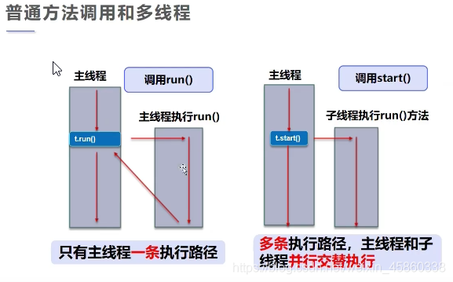

### ğŸ’3.程åº.进程.线程 

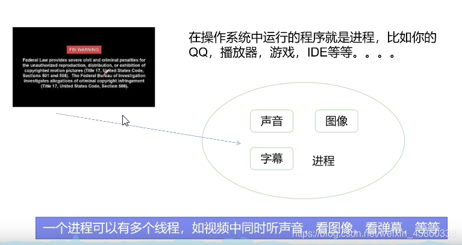

### ğŸ’4.Processä¸Thread 

 *  说起进程,å°±ä¸å¾—ä¸è¯´ä¸‹ç¨‹åºã€‚程åºæ˜¯æŒ‡ä»¤å’Œæ•°æ®çš„有åºé›†åˆï¼Œå…¶æœ¬èº«æ²¡æœ‰ä»»ä½•è¿è¡Œçš„å«ä¹‰ï¼Œæ˜¯ä¸€ä¸ªé™æ€çš„概念。
 *  而进程则是执行程åºçš„ä¾æ¬¡æ‰§è¡Œè¿‡ç¨‹ï¼Œå®ƒæ˜¯ä¸€ä¸ªåŠ¨æ€çš„概念。是系统资æºåˆ†é…çš„å•ä½ã€‚
 *  通常在一个进程中å¯ä»¥åŒ…å«è‹¥å¹²ä¸ªçº¿ç¨‹ï¼Œå½“然一个进程中至少有一个线程，ä¸ç„¶æ²¡æœ‰å­˜åœ¨çš„æ„义。线程是CPU调度和执行的å•ä½ã€‚
   
    > 注æ„：  
    > 很多多线程是模拟出æ¥çš„，真正的多线程是指有多个cpu，å³å¤šæ ¸ï¼Œå¦‚æœåŠ¡å™¨ã€‚如æœæ˜¯æ¨¡æ‹Ÿå‡ºæ¥çš„多线程，å³åœ¨ä¸€ä¸ªcpu的情况下，在åŒä¸€ä¸ªæ—¶é—´ç‚¹ï¼Œcpuåªèƒ½æ‰§è¡Œä¸€ä¸ªä»£ç ï¼Œå› ä¸ºåˆ‡æ¢çš„很快，所以就有åŒæ—¶æ‰§è¡Œçš„错局。

### ğŸ’5.核心概念 

 *  线程就是独立的执行路径
 *  在程åºè¿è¡Œæ—¶,å³ä½¿æ²¡æœ‰è‡ªå·±åˆ›å»ºçº¿ç¨‹,åå°ä¹Ÿä¼šæœ‰å¤šä¸ªçº¿ç¨‹,比如主线程,GC线程
 *  main()称之为主线程,为系统的入å£,用äºæ‰§è¡Œæ•´ä¸ªç¨‹åº
 *  在一个进程中,如æœå¼€è¾Ÿäº†å¤šä¸ªçº¿ç¨‹,线程的è¿è¡Œæ˜¯ç”±è°ƒåº¦å™¨ï¼ˆcpu）安æ’调度的,调度器是ä¸æ“作系统紧密相关的,å…ˆå顺åºæ˜¯ä¸èƒ½äººä¸ºå¹²é¢„çš„
 *  对åŒä¸€ä»½èµ„æºæ“作时mm会存在资æºæŠ¢å¤ºçš„问题,需è¦åŠ å…¥å¹¶å‘æ§åˆ¶
 *  线程会带æ¥é¢å¤–的开销,如CPU调度时间,并å‘æ§åˆ¶å¼€é”€
 *  æ¯ä¸ªçº¿ç¨‹åœ¨è‡ªå·±çš„工作内存交互,内存æ§åˆ¶ä¸å½“会造æˆæ•°æ®ä¸ä¸€è‡´

## 二ã€çº¿ç¨‹å®ç° 

### ğŸ’1.线程创建（三ç§æ–¹æ³•ï¼‰ 

#### ğŸ1.1继承Threadç±»(é‡è¦) 

自定义线程类继承`Thread`类

é‡å†™`run()`方法，编写线程执行体

创建线程对象，调用`start()`方法å¯åŠ¨çº¿ç¨‹

##### å®ç° 

```java
public class Demo1_CreateThread1 extends Thread {
   
     
     
    @Override
    public void run() {
   
     
     
        //run方法线程体
        for (int i = 0; i < 20; i++) {
   
     
     
            System.out.println("我在看代ç ----" + i);
        }
    }

    public static void main(String[] args) {
   
     
     
        //main线程，上线程
        //创建一个线程对象
        Demo1_CreateThread1 testThread = new Demo1_CreateThread1();
        //调用start（）开å¯çº¿ç¨‹
        testThread.start();
        for (int i = 0; i < 200; i++) {
   
     
     
            System.out.println("我在学习多线程----" + i);
        }
    }
}
```

总结：

线程ä¸ä¸€å®šç«‹å³æ‰§è¡Œï¼ŒCPU安æ’调度  
案例：(下载图片)

##### 案例 

```java
/**
 * 练习Thread,å®ç°å¤šçº¿ç¨‹åŒæ­¥ä¸‹è½½å›¾ç‰‡
 */
public class Demo2_DownloaderImgCase extends Thread {
   
     
     
    private String url;//网络图片地å€
    private String name;//报错扥文件å

    //有å‚æ„造
    public Demo2_DownloaderImgCase(String url, String name) {
   
     
     
        this.url = url;
        this.name = name;
    }

    //下载图片线程的执行体
    @Override
    public void run() {
   
     
     
        WebDownloader webDownloader = new WebDownloader();
        webDownloader.downloader(url, name);
        System.out.println("下载了文件å为:" + name);
    }

    public static void main(String[] args) {
   
     
     
        Demo2_DownloaderImgCase t = new Demo2_DownloaderImgCase("https://img-home.csdnimg.cn/images/20201124032511.png", "1.png");
        Demo2_DownloaderImgCase t1 = new Demo2_DownloaderImgCase("https://img-home.csdnimg.cn/images/20201124032511.png", "2.png");
        Demo2_DownloaderImgCase t2 = new Demo2_DownloaderImgCase("https://img-home.csdnimg.cn/images/20201124032511.png", "3.png");
        t.start();
        t1.start();
        t2.start();
    }
}

//下载器
class WebDownloader {
   
     
     
    //下载方法
    public void downloader(String url, String name) {
   
     
     
        try {
   
     
     
            FileUtils.copyURLToFile(new URL(url), new File(name));
        } catch (IOException e) {
   
     
     
            e.printStackTrace();
            System.out.println("IO异常,downloader方法出ç°é—®é¢˜");
        }
    }
}
```

#### ğŸ1.2å®ç°Runnableæ¥å£ 

æ¨è使用Runnable对象,因为Javaå•ç»§æ‰¿çš„å±€é™æ€§

自定义线程类å®ç°`Runnable`æ¥å£

å®ç°`run()`方法,编写线程执行体

创建线程对象,调用`start()`方法å¯åŠ¨å¯¹è±¡

##### å®ç° 

```java
public class Demo3_CreateRunnable implements Runnable {

    @Override
    public void run() {

        //run方法线程体
        for (int i = 0; i < 20; i++) {

            System.out.println("我在看代ç ----" + i);
        }
    }

    public static void main(String[] args) {

        //创建runnableæ¥å£çš„å®ç°ç±»å¯¹è±¡
        Demo3_CreateRunnable testThread = new Demo3_CreateRunnable();
        //创建线程对象,通过线程对象æ¥å¼€å¯æˆ‘们的线程,代ç†
        Thread thread = new Thread(testThread);
        //调用start（）开å¯çº¿ç¨‹
        thread.start();

        //new Thread(testThread).start();
        for (int i = 0; i < 200; i++) {
   
     
     
            System.out.println("我在学习多线程----" + i);
        }
    }
}
```

##### 案例 

ç«è½¦ç¥¨:

```java
/**
 * 多个线程åŒæ—¶æ“作åŒä¸€ä¸ªå¯¹è±¡  ä¹°ç«è½¦ç¥¨æ¡ˆä¾‹
 */
//å‘ç°é—®é¢˜:多个线程æ“作åŒä¸€ä¸ªèµ„æºçš„情况下,线程ä¸å®‰å…¨,æ•°æ®ç´Šä¹±
public class Demo4_TrainTicketsCase implements Runnable {
   
     
     

    //票数
    private int ticketNums = 10;

    @Override
    public void run() {
   
     
     
        while (true) {
   
     
     
            if (ticketNums <= 0) {
   
     
     
                break;
            }
            //æ•è·å¼‚常
            try {
   
     
     
                Thread.sleep(200);
            } catch (InterruptedException e) {
   
     
     
                e.printStackTrace();
            }
            System.out.println(Thread.currentThread().getName() + "--->拿到了第" + ticketNums-- + "张票");
        }
    }

    public static void main(String[] args) {
   
     
     
        Demo4_TrainTicketsCase ticket = new Demo4_TrainTicketsCase();
        new Thread(ticket, "å°çº¢").start();
        new Thread(ticket, "è€å¸ˆ").start();
        new Thread(ticket, "黄牛1").start();
        new Thread(ticket, "黄牛2").start();
    }
}
```

龟兔赛跑:

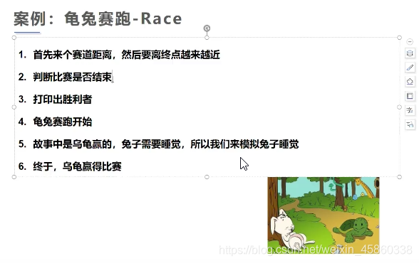

```java
/**
 * 模拟龟兔赛跑
 */
public class Demo5_RaceCase implements Runnable {
   
     
     
    //胜利者
    private static String winner;

    @Override
    public void run() {
   
     
     
        for (int i = 0; i <= 100; i++) {
   
     
     
            //模拟兔å­ä¼‘æ¯
            if (Thread.currentThread().getName().equals("å…”å­") && i % 10 == 0) {
   
     
     
                try {
   
     
     
                    Thread.sleep(2);
                } catch (InterruptedException e) {
   
     
     
                    e.printStackTrace();
                }
            }
            //判断比赛是å¦ç»“æŸ
            boolean flag = gameOver(i);
            //如æœæ¯”赛结æŸ,åœæ­¢ç¨‹åº
            if (flag) {
   
     
     
                break;
            }
            System.out.println(Thread.currentThread().getName() + "--->跑了" + i + "步");
        }
    }

    //判断是å¦å®Œæˆ
    private boolean gameOver(int steps) {
   
     
     
        if (winner != null) {
   
     
     
            return true;
        } else {
   
     
     
            if (steps >= 100) {
   
     
     
                winner = Thread.currentThread().getName();
                System.out.println("winner is " + winner);
                return true;
            }
        }
        return false;
    }

    public static void main(String[] args) {
   
     
     
        Demo5_RaceCase race = new Demo5_RaceCase();
        new Thread(race, "å…”å­").start();
        new Thread(race, "乌龟").start();
    }
}
```

#### ğŸ1.3å®ç°Callableæ¥å£ï¼ˆäº†è§£ï¼‰ 

å®ç°Callableæ¥å£ï¼Œéœ€è¦è¿”å›å€¼ç±»å‹

é‡å†™call方法，需è¦æŠ›å‡ºå¼‚常

创建目标对象

创建执行æœåŠ¡ï¼šExecutorService ser = Executors.newFixedThreadPool(1);

æ交执行：Future result1 = ser.submit(11);

è·å–结æœï¼šboolean r1 = result1.get()

关闭æœåŠ¡ï¼šser.shutdownNow();

##### å®ç° 

```java
/**
 * å®ç°Callableæ¥å£
 */
public class Demo6_CreateCallable implements Callable<Boolean> {

    private String url;//网络图片地å€
    private String name;//报错扥文件å

    //有å‚æ„造
    public Demo6_CreateCallable(String url, String name) {
        this.url = url;
        this.name = name;
    }

    //下载图片线程的执行体
    public Boolean call() throws Exception {
        WebDownloader webDownloader = new WebDownloader();
        webDownloader.downloader(url, name);
        System.out.println("下载了文件å为:" + name);
        return true;
    }

    public static void main(String[] args) throws ExecutionException, InterruptedException {
        Demo6_CreateCallable c = new Demo6_CreateCallable("https://img-home.csdnimg.cn/images/20201124032511.png", "1.png");
        Demo6_CreateCallable c1 = new Demo6_CreateCallable("https://img-home.csdnimg.cn/images/20201124032511.png", "2.png");
        Demo6_CreateCallable c2 = new Demo6_CreateCallable("https://img-home.csdnimg.cn/images/20201124032511.png", "3.png");
        //创建执行æœåŠ¡
        ExecutorService ser = Executors.newFixedThreadPool(3);
        //æ交执行
        Future<Boolean> r = ser.submit(c);
        Future<Boolean> r1 = ser.submit(c1);
        Future<Boolean> r2 = ser.submit(c2);
        //è·å–结æœ
        boolean res = r.get();
        boolean res1 = r1.get();
        boolean res2 = r2.get();
        //关闭æœåŠ¡
        ser.shutdownNow();
    }
}
//class WebDownloader在å‰é¢ä¸‹è½½å›¾ç‰‡å·²ç»å®šä¹‰äº†ï¼Œè¿™é‡Œå°±ä¸ç”¨å†æ¬¡å†™ï¼Œç›´æ¥ä½¿ç”¨å°±å¥½
```

##### 好处 

å¯ä»¥å®šä¹‰è¿”å›å€¼

å¯ä»¥æŠ›å‡ºå¼‚常

#### ğŸ1.4Threadå’ŒRunnable对比 

继承Thred类:

 *  å­ç±»ç»§æ‰¿Thread类具备多线程能力
 *  å¯åŠ¨çº¿ç¨‹:å­ç±»å¯¹è±¡.start()
 *  ä¸å»ºè®®ä½¿ç”¨:é¿å…OOPå•ç»§æ‰¿å±€é™æ€§

å®ç°Runnableæ¥å£

 *  å®ç°æ¥å£Runnable具有多线程能力
 *  å¯åŠ¨çº¿ç¨‹:传入目标对象+Thread对象.start()
 *  æ¨è使用:é¿å…å•ç»§æ‰¿å±€é™æ€§,çµæ´»æ–¹ä¾¿,方便åŒä¸€ä¸ªå¯¹è±¡è¢«å¤šä¸ªçº¿ç¨‹ä½¿ç”¨  
    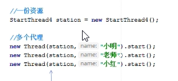

### ğŸ’2.é™æ€ä»£ç† 

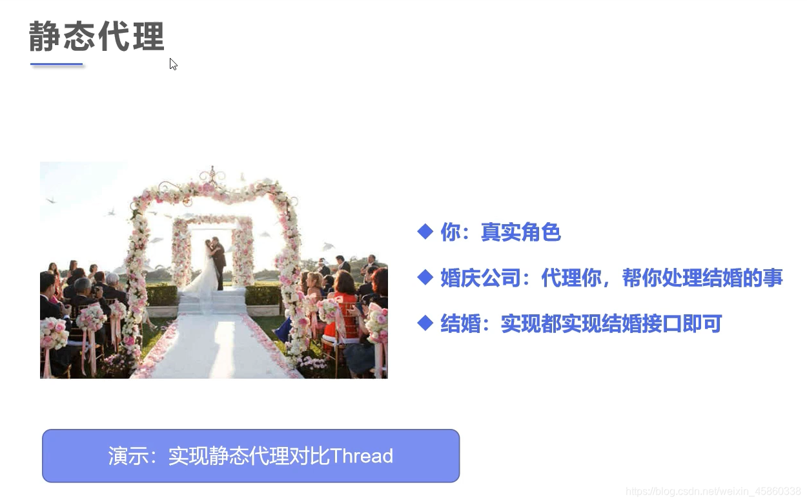

#### å®ç°: 结婚案例 

```java
/**
 * é™æ€ä»£ç†:结婚案例
 */
public class Demo7_StaticProxy {
   
     
     
    public static void main(String[] args) {
   
     
     
        WeddingCompany weddingCompany = new WeddingCompany(new You());
        weddingCompany.happyMarry();
    }
}

//结婚
interface Marry {
   
     
     
    void happyMarry();
}

//真å®è§’色:ä½ å»ç»“å©š
class You implements Marry {
   
     
     
    @Override
    public void happyMarry() {
   
     
     
        System.out.println("dorisè¦ç»“婚了,超开心");
    }
}

//代ç†è§’色:帮助你结婚
class WeddingCompany implements Marry {
   
     
     
    private Marry target;//代ç†-->真å®ç›®æ ‡è§’色角色,帮è°ç»“å©š

    public WeddingCompany(Marry target) {
   
     
     
        this.target = target;
    }

    @Override
    public void happyMarry() {
   
     
     
        after();
        this.target.happyMarry();
        before();
    }

    private void after() {
   
     
     
        System.out.println("结婚之å‰,布置ç°åœº");
    }

    private void before() {
   
     
     
        System.out.println("结婚之å,收尾款");
    }
}
```

优化:使用线程,Lamda表达å¼

```java
/**
 * 线程中的代ç†æ¨¡å¼
 */
public class Demo8_StaticProxy {
   
     
     
    public static void main(String[] args) {
   
     
     
        new Thread(()-> System.out.println("我爱你")).start();
        new WeddingCompany(new You()).happyMarry();
    }
}
//WeddingCompany...上一个文件定义过了这里就直æ¥ä½¿ç”¨äº†
```

#### 总结 

真å®å¯¹è±¡å’Œä»£ç†å¯¹è±¡éƒ½è¦å®ç°ä¸€ä¸ªæ¥å£  
代ç†å¯¹è±¡è¦ä»£ç†çœŸå®è§’色

#### 好处 

代ç†å¯¹è±¡å¯ä»¥åšå¾ˆå¤šçœŸå®å¯¹è±¡åšä¸äº†çš„事情  
真å®å¯¹è±¡ä¸“注åšè‡ªå·±çš„事

### ğŸ’3.Lamdaè¡¨è¾¾å¼ 

#### ä»‹ç» 

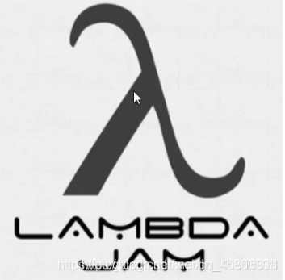

 *  λ 希腊字æ¯è¡¨ä¸­æ’åºç¬¬å一ä½çš„å­—æ¯ï¼Œè‹±è¯­å称为 Lamda
 *  é¿å…匿å内部类定义过多
 *  å…¶å®è´¨å±äºå‡½æ•°å¼ç¼–程的概念
 *  å»æ‰äº†ä¸€å †æ²¡æœ‰æ„义的代ç ,åªç•™ä¸‹æ ¸å¿ƒé€»è¾‘

> (params)-> expression\[表达å¼\]
>
> (params) -> statement\[语å¥\]
>
> \[(params)-> \{statements\}

```java
a -> System.out.println("i like lamda-->"+a)
```

new Thread (()->System.out.println(“多线程学习。。。。â€)).start();

ç†è§£Functional Interface (函数å¼æ¥å£) 是学习Java8 lamda表达å¼çš„关键

#### 函数å¼æ¥å£çš„定义: 

任何æ¥å£,如æœåªåŒ…å«å”¯ä¸€ä¸€ä¸ªæŠ½è±¡æ–¹æ³•,那么它就是一个函数å¼æ¥å£.

```java
public interface Runnable{
   
     
     
    public abstract void run();
}
```

对äºå‡½æ•°å¼æ¥å£,我们å¯ä»¥é€šè¿‡Lamda表达å¼æ¥åˆ›å»ºè¯¥æ¥å£çš„对象.

#### å®ç°: 

##### 案例1: 

```java
/**
 * æ¨å¯¼lamda表达å¼
 */
public class Demo9_Lamda {
   
     
     
    public static void main(String[] args) {
   
     
     
        ILike like = new Like();
        like.lamda();
    }
}

// 1.定义一个函数å¼æ¥å£
interface ILike {
   
     
     
    void lamda();
}

// 2.å®ç°ç±»
class Like implements ILike {
   
     
     
    @Override
    public void lamda() {
   
     
     
        System.out.println("I like lamda");
    }
}
```

优化1：

```java
public class Demo10_Lamda1 {
   
     
     
    //3. é™æ€å†…部类
    static class Like1 implements ILike {
   
     
     
        @Override
        public void lamda() {
   
     
     
            System.out.println("I like lamda1");
        }
    }
    //3.é™æ€å†…部类
    public static void main(String[] args) {
   
     
     
        ILike like = new Like1();
        like.lamda();
    }
}
```

优化2：

```java
public class Demo11_Lamda2 {
   
     
     
    public static void main(String[] args) {
   
     
     
        //4.局部内部类
        class Like12 implements ILike {
   
     
     
            @Override
            public void lamda() {
   
     
     
                System.out.println("I like lamda2");
            }
        }
        ILike like = new Like12();
        like.lamda();
    }
}
```

优化3：

```java
public class Demo12_Lamda3 {
   
     
     
    public static void main(String[] args) {
   
     
     
        //5.匿å内部类,没有类的å称,必须借助æ¥å£æˆ–者父类
        ILike like = new ILike () {
   
     
     
            @Override
            public void lamda() {
   
     
     
                System.out.println("I like lamda3");
            }
        };
        like.lamda();
    }
}
```

最终版：

```java
public class Demo13_Lamda4 {
   
     
     
    public static void main(String[] args) {
   
     
     
        //6.lamda简化
        ILike like = () ->{
   
     
     
            System.out.println("I like lamda4");
        };
        like.lamda();
    }
}
```

##### 案例2: 

```java
public class Demo14_LamdaCase2 {
   
     
     
    public static void main(String[] args) {
   
     
     
        // 1.lamda
        ILove love = (int a) -> {
   
     
     
            System.out.println("I love you -->" + a);
        };
        // 2.lamda简化1.0
        love = (a) -> {
   
     
     
            System.out.println("I love you -->" + a);
        };
        // 3.lamda简化2.0
        love = a -> {
   
     
     
            System.out.println("I love you -->" + a);
        };
        // 3.lamda简化3.0
        love = a -> System.out.println("I love you -->" + a);

        /**总结:
         * {}简略的æ¡ä»¶æ˜¯åªèƒ½æœ‰ä¸€è¡Œä»£ç ,多行{}å°±ä¸èƒ½ç®€ç•¥äº†
         * å‰æ是æ¥å£ä¸ºå‡½æ•°å¼æ¥å£(åªèƒ½æœ‰ä¸€ä¸ªæ–¹æ³•)
         * 多个å‚数也å¯ä»¥å»æ‰å‚æ•°ç±»å‹,è¦å»æ‰å°±éƒ½å»æ‰,必须加上()
         */

        love.love(520);
    }
}

interface ILove {
   
     
     
    void love(int a);
}
```

## 三ã€çº¿ç¨‹çŠ¶æ€ 

### ğŸ’1.线程五大状æ€: 

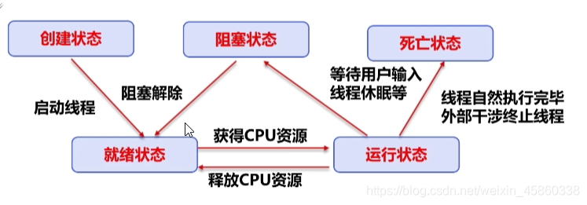  
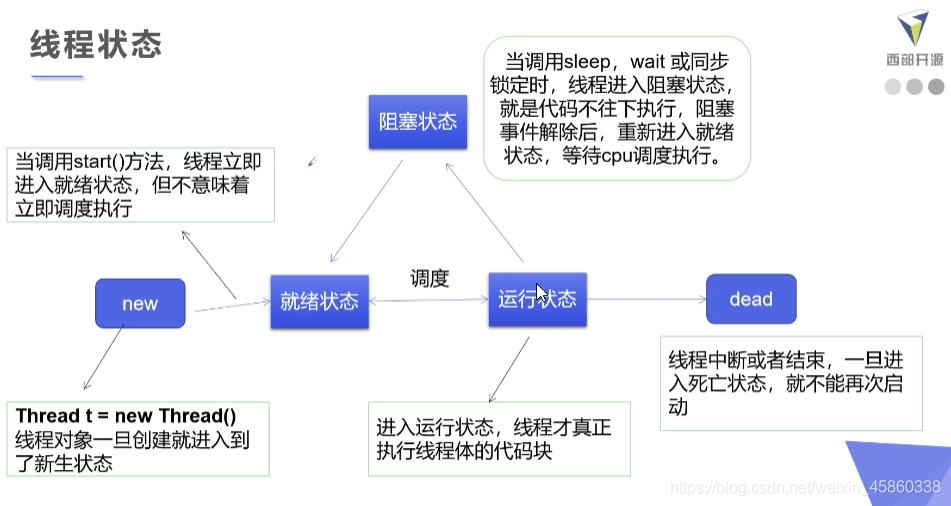

### ğŸ’2.线程方法 

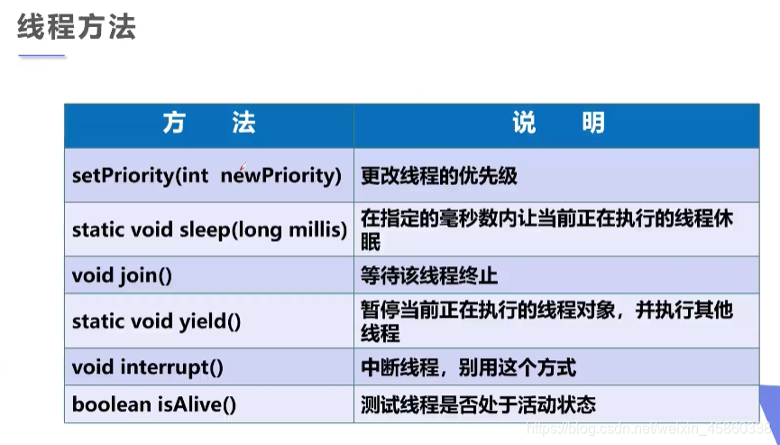

#### ğŸ2.1åœæ­¢çº¿ç¨‹ 

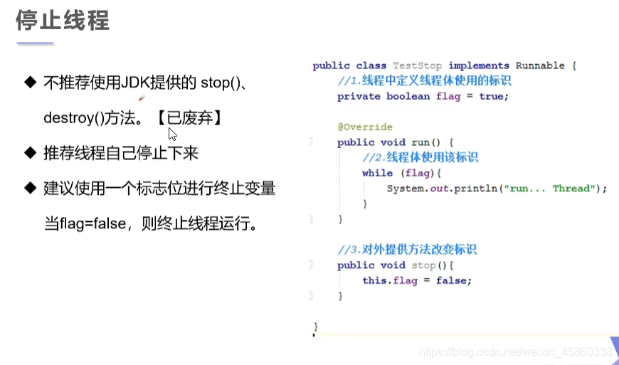

##### 案例: 

```java
/**
 * 测试stop
 * 1.建议线程正常åœæ­¢-->利用次数,ä¸å»ºè®®æ­»å¾ªç¯
 * 2.建议使用标志ä½-->设置一个标志ä½
 * 3.ä¸è¦ä½¿ç”¨stop或者destroy等过时或者JDKä¸å»ºè®®ä½¿ç”¨çš„方法
 */
public class Demo15_StopThread implements Runnable {
   
     
     
    // 1. 设置一个标志ä½
    private boolean flag = true;

    @Override
    public void run() {
   
     
     
        int i = 0;
        while (flag) {
   
     
     
            System.out.println("run...Thread" + i++);
        }
    }

    // 2. 设置一个公开的方法åœæ­¢çº¿ç¨‹,转æ¢æ ‡å¿—ä½
    public void stop() {
   
     
     
        this.flag = false;
    }

    public static void main(String[] args) {
   
     
     
        Demo15_StopThread stop = new Demo15_StopThread();
        new Thread(stop).start();
        for (int i = 0; i < 1000; i++) {
   
     
     
            System.out.println("main..." + i);
            if (i == 900) {
   
     
     
                //调用stop()切æ¢æ ‡å¿—ä½,让线程终止
                stop.stop();
                System.out.println("该线程åœæ­¢äº†");
            }
        }
    }
}
```

#### ğŸ2.2线程休眠 

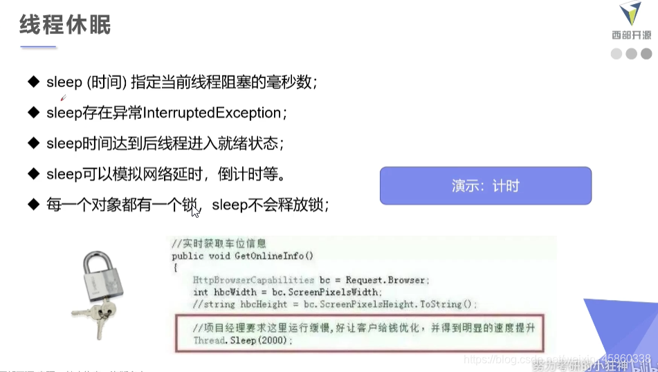

##### 案例: 

```java
/**
 * 模拟网络延迟:放大问题的å‘生性
 */
public class Demo16_SleepThread implements Runnable {
   
     
     

    //票数
    private int ticketNums = 10;

    @Override
    public void run() {
   
     
     
        while (true) {
   
     
     
            if (ticketNums <= 0) {
   
     
     
                break;
            }
            //æ•è·å¼‚常
            try {
   
     
     
                Thread.sleep(200);
            } catch (InterruptedException e) {
   
     
     
                e.printStackTrace();
            }
            System.out.println(Thread.currentThread().getName() + "--->拿到了第" + ticketNums-- + "张票");
        }
    }

    public static void main(String[] args) {
   
     
     
        Demo4_TrainTicketsCase ticket = new Demo4_TrainTicketsCase();
        new Thread(ticket, "å°çº¢").start();
        new Thread(ticket, "è€å¸ˆ").start();
        new Thread(ticket, "黄牛1").start();
    }
}
```

```java
/**
 * 模拟倒计时
 */
public class Demo17_SleepThread2 {
   
     
     

    public static void main(String[] args) {
   
     
     
        try {
   
     
     
            tenDown();
        } catch (InterruptedException e) {
   
     
     
            e.printStackTrace();
        }
    }

    //模拟倒计时
    public static void tenDown() throws InterruptedException {
   
     
     
        int num = 10;//10秒
        while (true) {
   
     
     
            Thread.sleep(1000);
            System.out.println(num--);
            if (num <= 0) {
   
     
     
                break;
            }
        }
    }
}
```

```java
/**
 * æ¯ä¸€ç§’è·å–当å‰æ—¶é—´
 */
public class Demo18_SleepThread3 {
   
     
     

    public static void main(String[] args) {
   
     
     
        //è·å–系统当å‰æ—¶é—´
        Date startTime = new Date(System.currentTimeMillis());
        while (true) {
   
     
     
            try {
   
     
     
                Thread.sleep(1000);
                //更新系统时间
                System.out.println(new SimpleDateFormat("HH:mm:ss").format(startTime));
                startTime = new Date(System.currentTimeMillis());
            } catch (InterruptedException e) {
   
     
     
                e.printStackTrace();
            }
        }
    }
}
```

#### ğŸ2.3线程礼让 

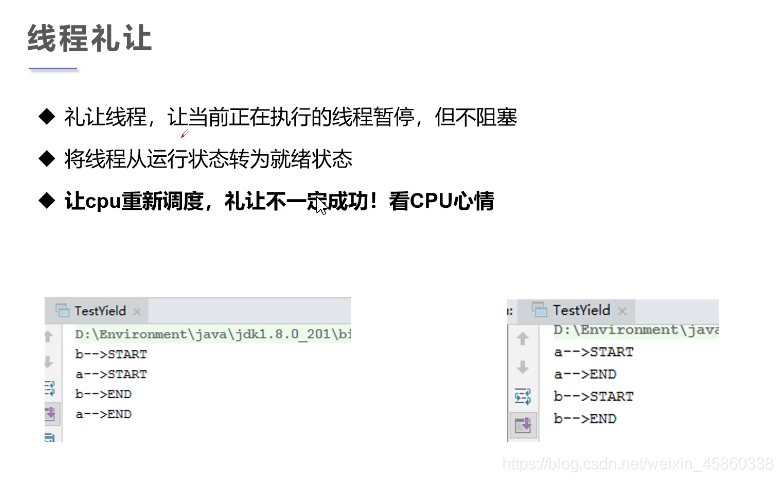

##### 案例: 

```java
/**
 * 测试礼让线程
 * 礼让ä¸ä¸€å®šæˆåŠŸ,看cpu心情
 */
public class Demo19_YieldThread {
   
     
     
    public static void main(String[] args) {
   
     
     
        MyYeild myYeild = new MyYeild();
        new Thread(myYeild, "a").start();
        new Thread(myYeild, "b").start();
    }
}

class MyYeild implements Runnable {
   
     
     
    @Override
    public void run() {
   
     
     
        System.out.println(Thread.currentThread().getName() + "线程开始执行");
        Thread.yield();//礼让
        System.out.println(Thread.currentThread().getName() + "线程åœæ­¢æ‰§è¡Œ");
    }
}
```

#### ğŸ2.4线程æ’队 

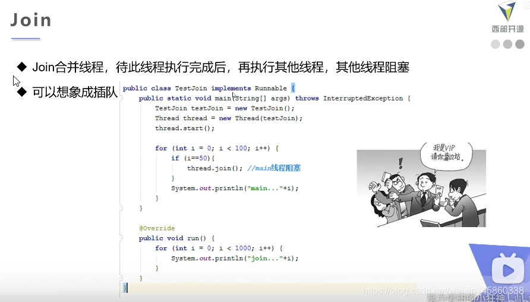

##### 案例: 

```java
/**
 * 测试join
 * æ’队
 */
public class Demo20_JoinThread implements Runnable {
   
     
     
    @Override
    public void run() {
   
     
     
        for (int i = 0; i < 500; i++) {
   
     
     
            System.out.println("线程vip" + i);
        }
    }

    public static void main(String[] args) throws InterruptedException {
   
     
     
        //å¯åŠ¨æˆ‘们的线程
        Demo20_JoinThread joinThread = new Demo20_JoinThread();
        Thread thread = new Thread(joinThread);
        thread.start();

        //主线程
        for (int i = 0; i < 500; i++) {
   
     
     
            if (i == 200) {
   
     
     
                thread.join();//æ’队
            }
            System.out.println("main" + i);
        }
    }
}
```

### ğŸ’3.线程状æ€è§‚测 

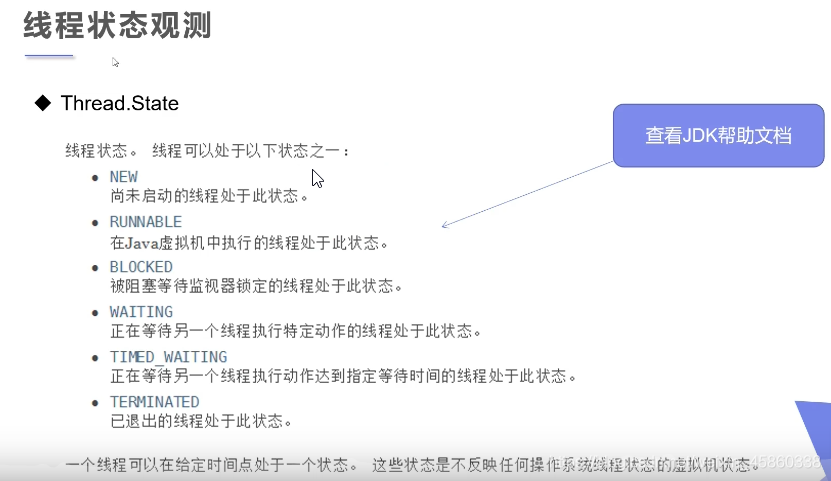

#### å®ç°: 

```java
/**
 * 观察测试线程状æ€
 */
public class Demo21_ThreadState {
   
     
     
    public static void main(String[] args) throws InterruptedException {
   
     
     
        Thread thread = new Thread(() -> {
   
     
     
            for (int i = 0; i < 5; i++) {
   
     
     
                try {
   
     
     
                    Thread.sleep(1000);
                } catch (InterruptedException e) {
   
     
     
                    e.printStackTrace();
                }
            }
            System.out.println("//");
        });
        //观察状æ€
        Thread.State state = thread.getState();
        System.out.println(state);
        //观察å¯åŠ¨å
        thread.start();
        state = thread.getState();
        System.out.println(state);//Run
        while (state != Thread.State.TERMINATED) {
   
     
     //åªè¦ç°æˆä¸ç»ˆæ­¢,就一直输出状æ€
            Thread.sleep(100);
            state = thread.getState();//更新线程状æ€
            System.out.println(state);
        }
        //死亡å的线程ä¸èƒ½å†å¯åŠ¨äº†,å¯åŠ¨ä¼šæŠ¥å¼‚常
        //thread.start();
    }
}
```

### ğŸ’4.线程优先级 

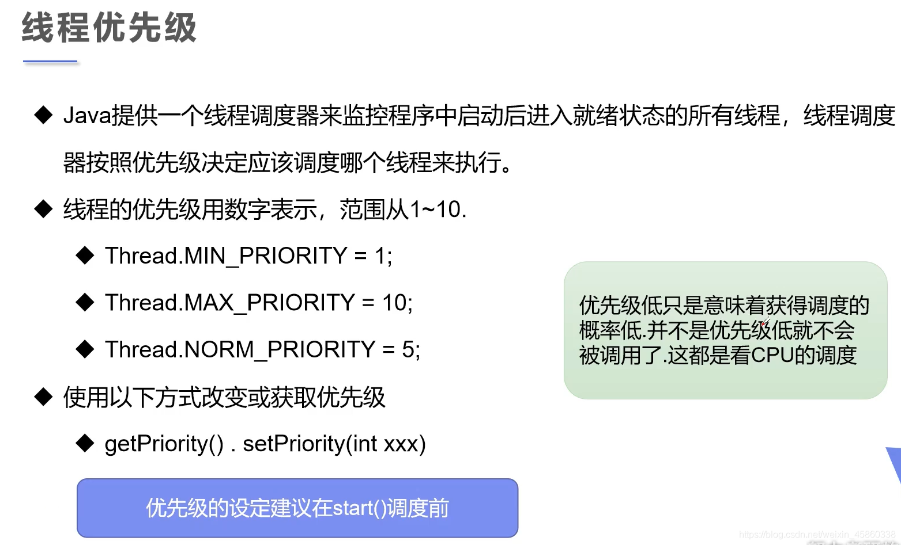

#### å®ç°: 

```java
/**
 * 线程优先级
 */
public class Demo22_ThreadPriority{
   
     
     
    public static void main(String[] args) {
   
     
     
        //主线程默认优先级
        System.out.println(Thread.currentThread().getName()+"-->"+Thread.currentThread().getPriority());

        MyPriority myPriority = new MyPriority();
        Thread thread1 = new Thread(myPriority);
        Thread thread2 = new Thread(myPriority);
        Thread thread3 = new Thread(myPriority);
        Thread thread4 = new Thread(myPriority);
        Thread thread5 = new Thread(myPriority);

        //先设置优先级,å†å¯åŠ¨
        thread1.start();

        thread2.setPriority(1);
        thread2.start();

        thread3.setPriority(4);
        thread3.start();

        thread4.setPriority(Thread.MAX_PRIORITY);//MAX_PRIORITY=10
        thread4.start();

        thread5.setPriority(8);
        thread5.start();
    }
}
class MyPriority implements Runnable{
   
     
     
    @Override
    public void run() {
   
     
     
        System.out.println(Thread.currentThread().getName()+"-->"+Thread.currentThread().getPriority());
    }
}
```

### ğŸ’5.守护(daemon)线程 

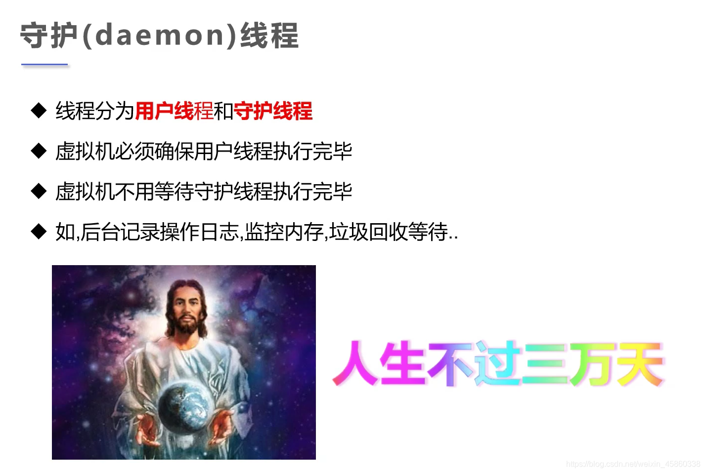

##### å®ç°: 

```java
/**
 * 测试守护线程
 * 上å¸å®ˆæŠ¤ä½ 
 */
public class Demo23_DaemonThread {
   
     
     
    public static void main(String[] args) {
   
     
     
        God god = new God();
        You you = new You();

        Thread thread = new Thread(god);
        //默认false表示是用户线程,正常的线程都是用户线程...
        thread.setDaemon(true);
        //上å¸å®ˆæŠ¤çº¿ç¨‹å¯åŠ¨
        thread.start();
        //ä½  用户线程å¯åŠ¨
        new Thread(you).start();
    }
}

//上å¸
class God implements Runnable{
   
     
     
    @Override
    public void run() {
   
     
     
        while (true){
   
     
     
            System.out.println("上å¸ä¿ä½‘ç€ä½ ");
        }
    }
}

//ä½ 
class You implements Runnable{
   
     
     
    @Override
    public void run() {
   
     
     
        for (int i = 0; i < 36500; i++) {
   
     
     
            System.out.println("你一生都开心的活ç€");
        }
        System.out.println("====goodbye!world====");
    }
}
```

## å››ã€çº¿ç¨‹åŒæ­¥ 

### ğŸ’1.ä»‹ç» 

\*\*多个线程æ“作åŒä¸€ä¸ªèµ„æº \*\*

  
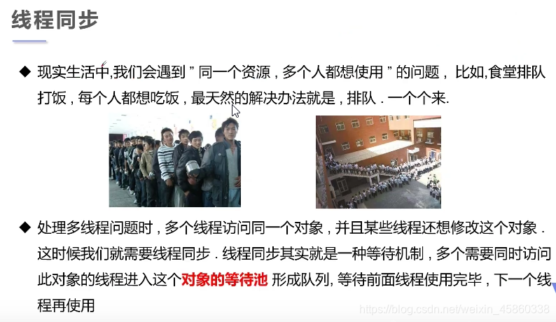  
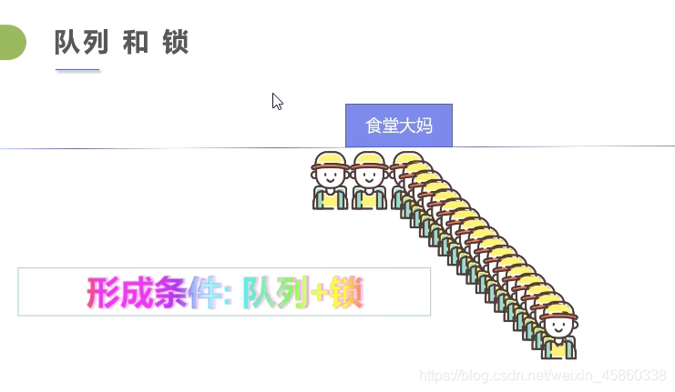  
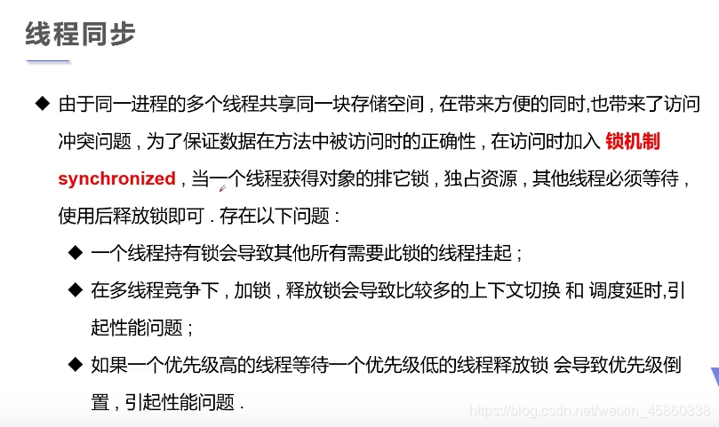

### ğŸ’2.ä¸å®‰å…¨çš„线程案例 

```java
//ä¸å®‰å…¨ä¹°ç¥¨
public class Demo24_UnsafeBuyTicket {
   
     
     
    public static void main(String[] args) {
   
     
     
        BuyTicket buyTicket = new BuyTicket();
        new Thread(buyTicket, "张三").start();
        new Thread(buyTicket, "æå››").start();
        new Thread(buyTicket, "ç‹äº”").start();
    }
}

class BuyTicket implements Runnable {
   
     
     
    //票
    private int ticketNums = 10;
    boolean flag = true;

    @Override
    public void run() {
   
     
     
        //买票
        while (flag) {
   
     
     
            try {
   
     
     
                buy();
            } catch (Exception e) {
   
     
     
                e.printStackTrace();
            }
        }
    }

    //买票
    private void buy() {
   
     
     
        //判断是å¦æœ‰ç¥¨
        if (ticketNums <= 0) {
   
     
     
            flag = false;
            return;
        }
        //延迟
        try {
   
     
     
            Thread.sleep(1);
        } catch (InterruptedException e) {
   
     
     
            e.printStackTrace();
        }

        //买票
        System.out.println(Thread.currentThread().getName() + "拿到" + ticketNums--);
    }
}
```

```java
/**
 * ä¸å®‰å…¨çš„å–é’±
 */
public class Demo25_UnsafeBank {
   
     
     
    public static void main(String[] args) {
   
     
     
        Account account = new Account(100, "结婚基金");
        Drawing you = new Drawing(account, 50, "展堂");
        Drawing girlfriend = new Drawing(account, 100, "sad");
        you.start();
        girlfriend.start();
    }
}

//账户
class Account {
   
     
     
    int money;//ä½™é¢
    String cardName;//å¡å

    public Account(int money, String cardName) {
   
     
     
        this.money = money;
        this.cardName = cardName;
    }
}

//银行:模拟å–款
class Drawing extends Thread {
   
     
     
    Account account;//账户
    int drawingMoney;//å–金é¢
    int nowMoney;//你手里的钱

    public Drawing(Account account, int drawingMoney, String name) {
   
     
     
        super(name);
        this.account = account;
        this.drawingMoney = drawingMoney;
    }

    //å–é’±
    @Override
    public void run() {
   
     
     
        //判断是å¦æœ‰é’±
        if (account.money - drawingMoney < 0) {
   
     
     
            System.out.println(Thread.currentThread().getName() + "ä½™é¢ä¸è¶³,ä¸èƒ½è¿›è¡Œå–é’±");
            return;
        }
        try {
   
     
     
            Thread.sleep(1000);//放大问题的å‘生性
        } catch (InterruptedException e) {
   
     
     
            e.printStackTrace();
        }
        //å¡å†…é‡‘é¢ = ä½™é¢-ä½ çš„é’±
        account.money = account.money - drawingMoney;
        //你手里的钱
        nowMoney = nowMoney + drawingMoney;
        System.out.println(account.cardName + "ä½™é¢ä¸º:" + account.money);
        //this.getName()==Thread.currentThread().getName()
        System.out.println(this.getName() + "手里的钱:" + nowMoney);
    }
}
```

```java
//线程ä¸å®‰å…¨çš„集åˆ
public class Demo26_UnsafeList {
   
     
     
    public static void main(String[] args) {
   
     
     
        List<String> list = new ArrayList<String>();
        for (int i = 0; i < 1000; i++) {
   
     
     
            new Thread(()->{
   
     
     
                list.add(Thread.currentThread().getName());
            }).start();
        }
        System.out.println(list.size());
    }
}
```

### ğŸ’3.åŒæ­¥æ–¹æ³• 

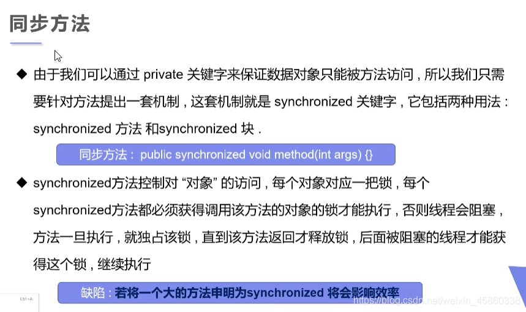  
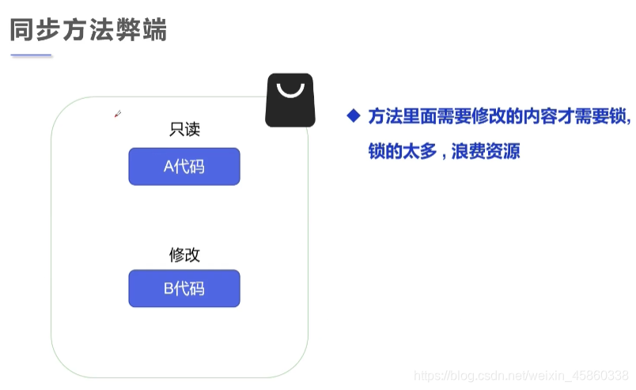  
åŒæ­¥æ–¹æ³•,é”的是this

#### å®ç°: 

```java
//安全买票
public class Demo27_SafeBuyTicket {
   
     
     
    public static void main(String[] args) {
   
     
     
        BuyTicket1 buyTicket = new BuyTicket1();
        new Thread(buyTicket, "张三").start();
        new Thread(buyTicket, "æå››").start();
        new Thread(buyTicket, "ç‹äº”").start();
    }
}

class BuyTicket1 implements Runnable {
   
     
     
    //票
    private int ticketNums = 10;
    boolean flag = true;

    @Override
    public void run() {
   
     
     
        //买票
        while (flag) {
   
     
     
            try {
   
     
     
                buy();
            } catch (Exception e) {
   
     
     
                e.printStackTrace();
            }
        }
    }

    //synchronized åŒæ­¥æ–¹æ³•,é”的是this
    private synchronized void buy() {
   
     
     
        //判断是å¦æœ‰ç¥¨
        if (ticketNums <= 0) {
   
     
     
            flag = false;
            return;
        }
        //延迟
        try {
   
     
     
            Thread.sleep(1);
        } catch (InterruptedException e) {
   
     
     
            e.printStackTrace();
        }

        //买票
        System.out.println(Thread.currentThread().getName() + "拿到" + ticketNums--);
    }
}
```

### ğŸ’4.åŒæ­¥å— 

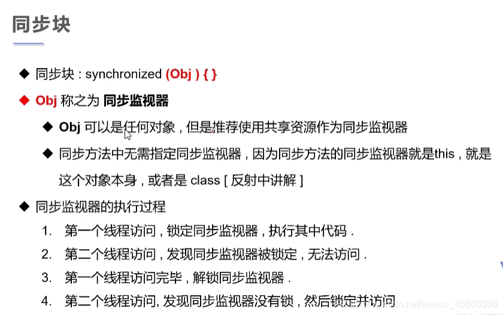  
é”的对象就是å˜é‡çš„é‡,需è¦å¢åˆ æ”¹æŸ¥çš„对象

#### å®ç°: 

```java
/**
 * 安全的å–é’± åŒæ­¥å—
 */
public class Demo28_SafeBank {
   
     
     
    public static void main(String[] args) {
   
     
     
        Account1 account = new Account1(100, "结婚基金");
        Drawing1 you = new Drawing1(account, 50, "展堂");
        Drawing1 girlfriend = new Drawing1(account, 100, "sad");
        you.start();
        girlfriend.start();
    }
}

//账户
class Account1 {
   
     
     
    int money;//ä½™é¢
    String cardName;//å¡å

    public Account1(int money, String cardName) {
   
     
     
        this.money = money;
        this.cardName = cardName;
    }
}

//银行:模拟å–款
class Drawing1 extends Thread {
   
     
     
    Account1 account;//账户
    int drawingMoney;//å–金é¢
    int nowMoney;//你手里的钱

    public Drawing1(Account1 account, int drawingMoney, String name) {
   
     
     
        super(name);
        this.account = account;
        this.drawingMoney = drawingMoney;
    }

    //å–é’±
    @Override
    public void run() {
   
     
     
        //é”的对象就是å˜é‡çš„é‡,需è¦å¢åˆ æ”¹æŸ¥çš„对象
        synchronized (account) {
   
     
     
            //判断是å¦æœ‰é’±
            if (account.money - drawingMoney < 0) {
   
     
     
                System.out.println(Thread.currentThread().getName() + "ä½™é¢ä¸è¶³,ä¸èƒ½è¿›è¡Œå–é’±");
                return;
            }
            try {
   
     
     
                Thread.sleep(1000);//放大问题的å‘生性
            } catch (InterruptedException e) {
   
     
     
                e.printStackTrace();
            }
            //å¡å†…é‡‘é¢ = ä½™é¢-ä½ çš„é’±
            account.money = account.money - drawingMoney;
            //你手里的钱
            nowMoney = nowMoney + drawingMoney;
            System.out.println(account.cardName + "ä½™é¢ä¸º:" + account.money);
            //this.getName()==Thread.currentThread().getName()
            System.out.println(this.getName() + "手里的钱:" + nowMoney);
        }
    }
```

```java
//çº¿ç¨‹å®‰å…¨çš„é›†åˆ åŒæ­¥å—
public class Demo29_SafeList {
   
     
     
    public static void main(String[] args) {
   
     
     
        List<String> list = new ArrayList<String>();
        for (int i = 0; i < 1000; i++) {
   
     
     
            new Thread(() -> {
   
     
     
                synchronized (list) {
   
     
     
                    list.add(Thread.currentThread().getName());
                }
            }).start();
        }
        try {
   
     
     
            Thread.sleep(300);
        } catch (InterruptedException e) {
   
     
     
            e.printStackTrace();
        }
        System.out.println(list.size());
    }
}
```

JUC安全集åˆç±»å‹æ‰©å……

```java
//测试JUC安全类å‹çš„集åˆ
public class Demo30_ThreadJuc {
   
     
     
    public static void main(String[] args) {
   
     
     
        CopyOnWriteArrayList<String> list = new CopyOnWriteArrayList<String>();
        for (int i = 0; i < 10000; i++) {
   
     
     
            new Thread(() -> {
   
     
     
                list.add(Thread.currentThread().getName());
            }).start();
        }
        try {
   
     
     
            Thread.sleep(3000);
        } catch (InterruptedException e) {
   
     
     
            e.printStackTrace();
        }
        System.out.println(list.size());
    }
}
```

### ğŸ’5.æ­»é” 

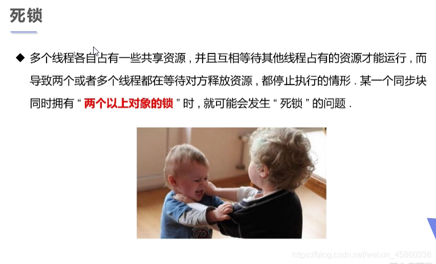

#### 案例: 

```java
/**
 * æ­»é”:多个线程互相抱ç€å¯¹æ–¹éœ€è¦çš„资æº,然åå½¢æˆåƒµæŒ
 * 解决:一个é”åªé”一个对象
 */
class Demo31_DeadLock {
   
     
     
    public static void main(String[] args) {
   
     
     
        Makeup makeup = new Makeup(0, "ç°å§‘娘");
        Makeup makeup1 = new Makeup(1, "白雪公主");
        makeup.start();
        makeup1.start();
    }
}

//å£çº¢
class Lipstick {
   
     
      }
//é•œå­
class Mirror {
   
     
      }

class Makeup extends Thread {
   
     
     
    //需è¦çš„资æºåªæœ‰ä¸€ä»½,用staticä¿è¯åªæœ‰ä¸€ä»½
    static Lipstick lipstick = new Lipstick();
    static Mirror mirror = new Mirror();
    int choice;//选择
    String girlName;//使用化妆å“的人

    public Makeup(int choice, String girlName) {
   
     
     
        this.choice = choice;
        this.girlName = girlName;
    }

    @Override
    public void run() {
   
     
     
        //化妆
        try {
   
     
     
            makeup();
        } catch (InterruptedException e) {
   
     
     
            e.printStackTrace();
        }
    }

    private void makeup() throws InterruptedException {
   
     
     
        if (choice == 0) {
   
     
     
            synchronized (lipstick) {
   
     
     //è·å¾—å£çº¢çš„é”
                System.out.println(this.girlName + "è·å¾—å£çº¢çš„é”");
                Thread.sleep(1000);
                synchronized (mirror) {
   
     
     //一秒钟å想è·å¾—é•œå­
                    System.out.println(this.girlName + "è·å¾—é•œå­çš„é”");
                }
            }
        } else {
   
     
     
            synchronized (mirror) {
   
     
     //è·å¾—å£çº¢é•œå­
                System.out.println(this.girlName + "è·å¾—é•œå­çš„é”");
                Thread.sleep(2000);
                synchronized (lipstick) {
   
     
     //二秒钟å想è·å¾—çš„é”
                    System.out.println(this.girlName + "è·å¾—å£çº¢çš„é”");
                }
            }
        }
    }
}
```

解决:

```java
/**
 * æ­»é”:多个线程互相抱ç€å¯¹æ–¹éœ€è¦çš„资æº,然åå½¢æˆåƒµæŒ
 * 解决:一个é”åªé”一个对象
 */
class Demo31_DeadLock {
   
     
     
    public static void main(String[] args) {
   
     
     
        Makeup makeup = new Makeup(0, "ç°å§‘娘");
        Makeup makeup1 = new Makeup(1, "白雪公主");
        makeup.start();
        makeup1.start();
    }
}

//å£çº¢
class Lipstick {
   
     
      }
//é•œå­
class Mirror {
   
     
      }

class Makeup extends Thread {
   
     
     
    //需è¦çš„资æºåªæœ‰ä¸€ä»½,用staticä¿è¯åªæœ‰ä¸€ä»½
    static Lipstick lipstick = new Lipstick();
    static Mirror mirror = new Mirror();
    int choice;//选择
    String girlName;//使用化妆å“的人

    public Makeup(int choice, String girlName) {
   
     
     
        this.choice = choice;
        this.girlName = girlName;
    }

    @Override
    public void run() {
   
     
     
        //化妆
        try {
   
     
     
            makeup();
        } catch (InterruptedException e) {
   
     
     
            e.printStackTrace();
        }
    }

    private void makeup() throws InterruptedException {
   
     
     
        if (choice == 0) {
   
     
     
            synchronized (lipstick) {
   
     
     //è·å¾—å£çº¢çš„é”
                System.out.println(this.girlName + "è·å¾—å£çº¢çš„é”");
                Thread.sleep(1000);
            }
            synchronized (mirror) {
   
     
     //一秒钟å想è·å¾—é•œå­
                System.out.println(this.girlName + "è·å¾—é•œå­çš„é”");
            }
        } else {
   
     
     
            synchronized (mirror) {
   
     
     //è·å¾—å£çº¢é•œå­
                System.out.println(this.girlName + "è·å¾—é•œå­çš„é”");
                Thread.sleep(2000);
            }
            synchronized (lipstick) {
   
     
     //二秒钟å想è·å¾—çš„é”
                System.out.println(this.girlName + "è·å¾—å£çº¢çš„é”");
            }
        }
    }
}
```

#### æ­»é”é¿å…åŠæ³• 

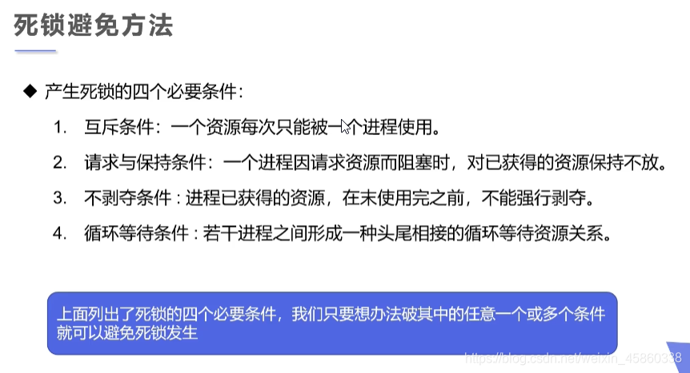

### ğŸ’6.Lock(é”) 

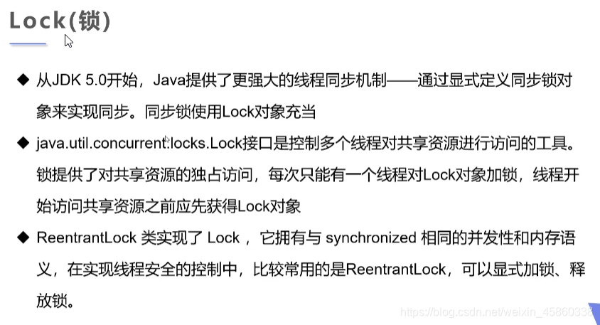  
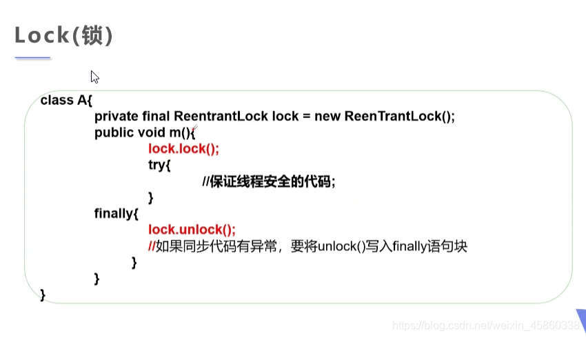

#### å®ç° 

```java
//测试Locké”
public class Demo32_ThreadLock {
   
     
     
    public static void main(String[] args) {
   
     
     
        TestLock testLock = new TestLock();
        new Thread(testLock).start();
        new Thread(testLock).start();
        new Thread(testLock).start();
    }
}

class TestLock implements Runnable {
   
     
     
    int tickerNums = 10;
    //定义Locké”
    private final ReentrantLock lock = new ReentrantLock();

    @Override
    public void run() {
   
     
     
        while (true) {
   
     
     
            //加é”
            try {
   
     
     
                lock.lock();
                if (tickerNums <= 0) {
   
     
     
                    break;
                }
                try {
   
     
     
                    Thread.sleep(1000);
                } catch (InterruptedException e) {
   
     
     
                    e.printStackTrace();
                }
                System.out.println(tickerNums--);
            } catch (Exception e) {
   
     
     
                e.printStackTrace();
            } finally {
   
     
     
                //解é”
                lock.unlock();
            }
        }
    }
}
```

### ğŸ’7.synchroizedä¸Lock对比 

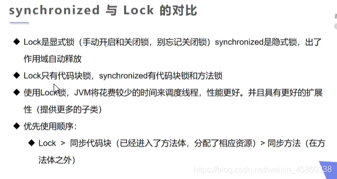

## 五ã€çº¿ç¨‹é€šä¿¡é—®é¢˜ 

生产者消费者模å¼çš„问题  


### ğŸ’1.线程通信方法 

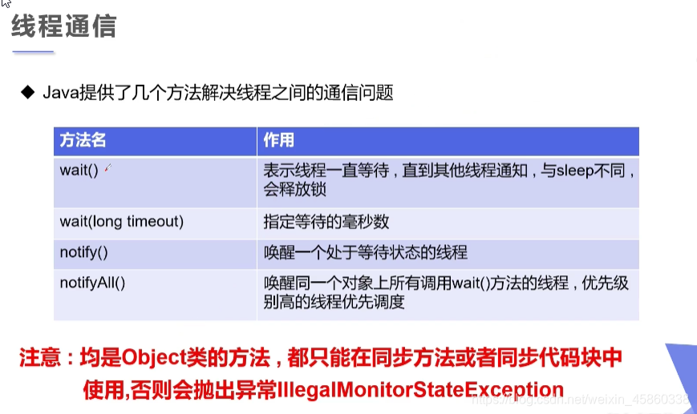  
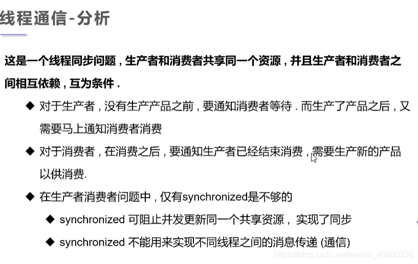

### ğŸ’2.çº¿ç¨‹é€šä¿¡é—®é¢˜è§£å†³æ–¹å¼ 

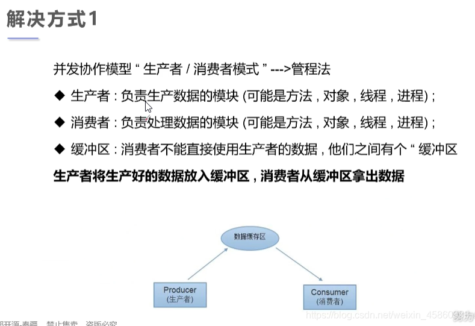

```java
/**
 * 测试:生产者消费者模å‹-->利用缓冲区解决:管程法
 */
public class Demo33_ThreadPC {
   
     
     
    public static void main(String[] args) {
   
     
     
        SynContainer synContainer = new SynContainer();
        new Producer(synContainer).start();
        new Consumer(synContainer).start();
    }
}

//生产者
class Producer extends Thread {
   
     
     
    //容缓冲区
    SynContainer container;

    public Producer(SynContainer container) {
   
     
     
        this.container = container;
    }

    //生产
    @Override
    public void run() {
   
     
     
        for (int i = 0; i < 100; i++) {
   
     
     
            container.push(new Product(i));
            System.out.println("生产了" + i + "件产å“");
        }
    }
}

//消费者
class Consumer extends Thread {
   
     
     
    //容缓冲区
    SynContainer container;

    public Consumer(SynContainer container) {
   
     
     
        this.container = container;
    }

    //消费
    @Override
    public void run() {
   
     
     
        for (int i = 0; i < 100; i++) {
   
     
     
            System.out.println("消费了-->" + container.pop().id + "件产å“");
        }
    }
}

//产å“
class Product {
   
     
     
    int id;//产å“ç¼–å·

    public Product(int id) {
   
     
     
        this.id = id;
    }
}

//缓冲区
class SynContainer {
   
     
     
    //需è¦ä¸€ä¸ªå®¹å™¨å¤§å°
    Product[] products = new Product[10];
    //容器计数器
    int count = 0;

    //生产者放入产å“
    public synchronized void push(Product product) {
   
     
     
        //如æœå®¹å™¨æ»¡äº†,需è¦ç­‰å¾…消费者消费
        /*如æœæ˜¯ifçš„è¯ï¼Œå‡å¦‚消费者1消费了最å一个，这是indexå˜æˆ0此时释放é”被消费者2拿到而ä¸æ˜¯ç”Ÿäº§è€…拿到，这时消费者的wait是在if里所以它就直æ¥å»æ¶ˆè´¹index-1下标越界，如æœæ˜¯while就会å†å»åˆ¤æ–­ä¸€ä¸‹index得值是ä¸æ˜¯å˜æˆ0了*/
        while (count == products.length) {
   
     
     
            //通知消费者消费,等待生产
            try {
   
     
     
                this.wait();
            } catch (InterruptedException e) {
   
     
     
                e.printStackTrace();
            }
        }
        //如æœæ²¡æœ‰æ»¡,需è¦ä¸¢å…¥äº§å“
        products[count] = product;
        count++;
        //通知消费者消费
        this.notifyAll();
    }

    //消费者消费产å“
    public synchronized Product pop() {
   
     
     
        //判断是å¦èƒ½æ¶ˆè´¹
        while (count <= 0) {
   
     
     
            //等待生产者生产
            try {
   
     
     
                this.wait();
            } catch (InterruptedException e) {
   
     
     
                e.printStackTrace();
            }
        }
        //如æœå¯ä»¥æ¶ˆè´¹
        count--;
        Product product = products[count];
        //åƒå®Œäº† 通知生产者生产
        this.notifyAll();
        return product;
    }
}
```

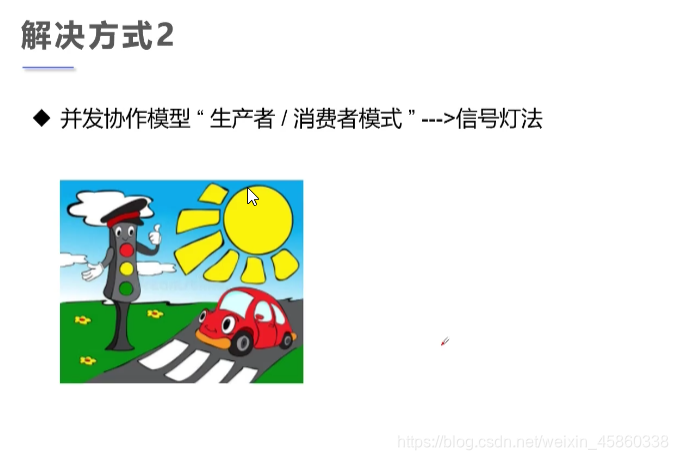

```java
/**
 * 测试:生产者消费者模å‹-->利用缓冲区解决:管程法
 */
public class Demo33_ThreadPC {
   
     
     
    public static void main(String[] args) {
   
     
     
        SynContainer synContainer = new SynContainer();
        new Producer(synContainer).start();
        new Consumer(synContainer).start();
    }
}

//生产者
class Producer extends Thread {
   
     
     
    //容缓冲区
    SynContainer container;

    public Producer(SynContainer container) {
   
     
     
        this.container = container;
    }

    //生产
    @Override
    public void run() {
   
     
     
        for (int i = 0; i < 100; i++) {
   
     
     
            container.push(new Product(i));
            System.out.println("生产了" + i + "件产å“");
        }
    }
}

//消费者
class Consumer extends Thread {
   
     
     
    //容缓冲区
    SynContainer container;

    public Consumer(SynContainer container) {
   
     
     
        this.container = container;
    }

    //消费
    @Override
    public void run() {
   
     
     
        for (int i = 0; i < 100; i++) {
   
     
     
            System.out.println("消费了-->" + container.pop().id + "件产å“");
        }
    }
}

//产å“
class Product {
   
     
     
    int id;//产å“ç¼–å·

    public Product(int id) {
   
     
     
        this.id = id;
    }
}

//缓冲区
class SynContainer {
   
     
     
    //需è¦ä¸€ä¸ªå®¹å™¨å¤§å°
    Product[] products = new Product[10];
    //容器计数器
    int count = 0;

    //生产者放入产å“
    public synchronized void push(Product product) {
   
     
     
        //如æœå®¹å™¨æ»¡äº†,需è¦ç­‰å¾…消费者消费
        /*如æœæ˜¯ifçš„è¯ï¼Œå‡å¦‚消费者1消费了最å一个，这是indexå˜æˆ0此时释放é”被消费者2拿到而ä¸æ˜¯ç”Ÿäº§è€…拿到，这时消费者的wait是在if里所以它就直æ¥å»æ¶ˆè´¹index-1下标越界，如æœæ˜¯while就会å†å»åˆ¤æ–­ä¸€ä¸‹index得值是ä¸æ˜¯å˜æˆ0了*/
        while (count == products.length) {
   
     
     
            //通知消费者消费,等待生产
            try {
   
     
     
                this.wait();
            } catch (InterruptedException e) {
   
     
     
                e.printStackTrace();
            }
        }
        //如æœæ²¡æœ‰æ»¡,需è¦ä¸¢å…¥äº§å“
        products[count] = product;
        count++;
        //通知消费者消费
        this.notifyAll();
    }

    //消费者消费产å“
    public synchronized Product pop() {
   
     
     
        //判断是å¦èƒ½æ¶ˆè´¹
        while (count <= 0) {
   
     
     
            //等待生产者生产
            try {
   
     
     
                this.wait();
            } catch (InterruptedException e) {
   
     
     
                e.printStackTrace();
            }
        }
        //如æœå¯ä»¥æ¶ˆè´¹
        count--;
        Product product = products[count];
        //åƒå®Œäº† 通知生产者生产
        this.notifyAll();
        return product;
    }
}
```

## å…­ã€çº¿ç¨‹æ±  

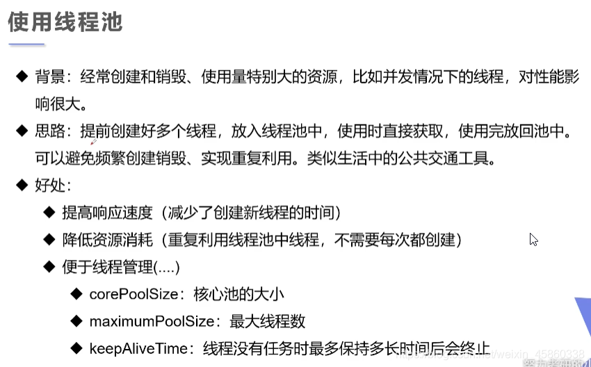  
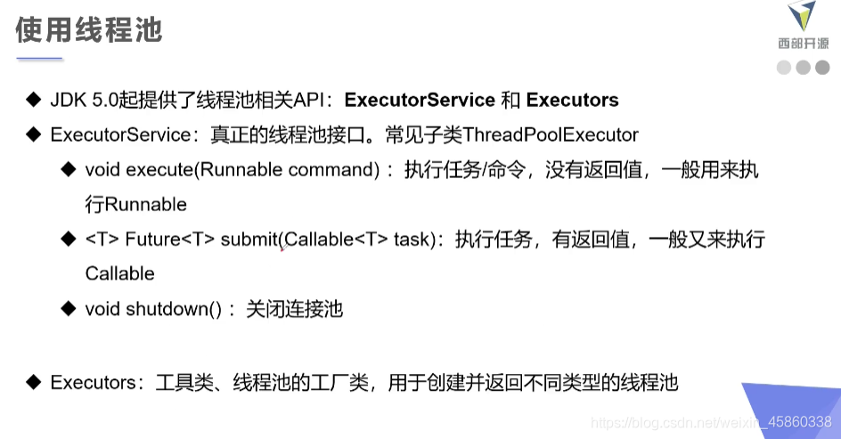

```java
//测试线程池
public class Demo35_ThreadPool {
   
     
     
    public static void main(String[] args) {
   
     
     
        // 1. 创建æœåŠ¡,擦行间线程池
        // newFixedThreadPool(线程池大å°)
        ExecutorService service = Executors.newFixedThreadPool(10);
        //执行
        service.execute(new MyThread());
        service.execute(new MyThread());
        service.execute(new MyThread());
        service.execute(new MyThread());
        service.execute(new MyThread());
        service.execute(new MyThread());
        //关闭è¿æ¥
        service.shutdown();
    }
}

class MyThread implements Runnable {
   
     
     
    @Override
    public void run() {
   
     
     
        System.out.println(Thread.currentThread().getName());
    }
}
```
