# 一、线程简介 

## 1.多任务 

  
现实中太多这样同时做多件事情的例子了，看起来是多个任务都在做，其实本质上我们的大脑在同一时间依旧只做了一件事情。

## 2.多线程 

  
原来是一条路，慢慢因为车太多了，道路阻塞，效率极低。

为了提高使用的效率，能够充分利用道路，于是加了多个车道。从此，妈妈再也不用担心道路阻塞了。  

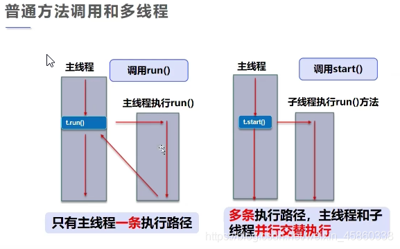

## 3.程序.进程.线程 

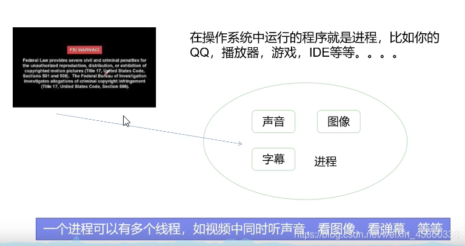

## 4.Process与Thread 

 *  说起进程，就不得不说下程序。程序是指令和数据的有序集合，其本身没有任何运行的含义，是一个静态的概念。
 *  而进程则是执行程序的依次执行过程，它是一个动态的概念。是系统资源分配的单位。
 *  通常在一个进程中可以包含若干个线程，当然一个进程中至少有一个线程，不然没有存在的意义。线程是CPU调度和执行的单位。
   
    > 注意： 
    > 很多多线程是模拟出来的，真正的多线程是指有多个cpu，即多核，如服务器。如果是模拟出来的多线程，即在一个cpu的情况下，在同一个时间点，cpu只能执行一个代码，因为切换的很快，所以就有同时执行的错局。

## 5.核心概念 

 *  线程就是独立的执行路径
 *  在程序运行时，即使没有自己创建线程，后台也会有多个线程，比如主线程，GCC线程
 *  main()称之为主线程，为系统的入口，用于执行整个程序
 *  在一个进程中，如果开辟了多个线程，线程的运行是由调度器（cpu）安排调度的，调度器是与操作系统紧密相关的，先后顺序是不能人为干预的
 *  对同一份资源操作时，会存在资源抢夺的问题，需要加入并发控制
 *  线程会带来额外的开销，如CPU调度时间，并发控制开销
 *  每个线程在自己的工作内存交互，内存控制不当会造成数据不一致

# 二、线程实现 

## 1.线程创建（三种方法） 

### 1.1继承Thread类(重要) 

- 自定义线程类继承`Thread`类

- 重写`run()`方法，编写线程执行体
- 创建线程对象，调用`start()`方法启动线程

**实现** 

```java
public class Demo1_CreateThread1 extends Thread {

    @Override
    public void run() {

        //run方法线程体
        for (int i = 0; i < 20; i++) {
            System.out.println("我在看代码----" + i);
        }
    }

    public static void main(String[] args) {
        //main线程，上线程
        //创建一个线程对象
        Demo1_CreateThread1 testThread = new Demo1_CreateThread1();
        //调用start（）开启线程
        testThread.start();
        for (int i = 0; i < 20; i++) {
            System.out.println("我在学习多线程----" + i);
        }
    }
}
```

总结：

线程不一定立即执行，CPU安排调度 ，最终控制台输出`我在看代码----`和`我在学习多线程----`是交替执行的


案例：(下载图片)

**案例** 

```java
/**
 * 练习Thread，实现多线程同步下载图片
 */
public class Demo2_DownloaderImgCase extends Thread {

    private String url;//网络图片地址
    private String name;//报错扥文件名

    //有参构造
    public Demo2_DownloaderImgCase(String url， String name) {

        this.url = url;
        this.name = name;
    }

    //下载图片线程的执行体
    @Override
    public void run() {

        WebDownloader webDownloader = new WebDownloader();
        webDownloader.downloader(url， name);
        System.out.println("下载了文件名为:" + name);
    }

    public static void main(String[] args) {

        Demo2_DownloaderImgCase t = new Demo2_DownloaderImgCase("https://img-home.csdnimg.cn/images/20201124032511.png"， "1.png");
        Demo2_DownloaderImgCase t1 = new Demo2_DownloaderImgCase("https://img-home.csdnimg.cn/images/20201124032511.png"， "2.png");
        Demo2_DownloaderImgCase t2 = new Demo2_DownloaderImgCase("https://img-home.csdnimg.cn/images/20201124032511.png"， "3.png");
        t.start();
        t1.start();
        t2.start();
    }
}

//下载器
class WebDownloader {
   
     
     
    //下载方法
    public void downloader(String url， String name) {
   
     
     
        try {
   
     
     
            FileUtils.copyURLToFile(new URL(url)， new File(name));
        } catch (IOException e) {
   
     
     
            e.printStackTrace();
            System.out.println("IO异常，downloader方法出现问题");
        }
    }
}
```

### 1.2实现Runnable接口 （重点）

推荐使用Runnable对象，因为Java单继承的局限性

自定义线程类实现`Runnable`接口

实现`run()`方法，编写线程执行体

创建线程对象，调用`start()`方法启动对象

#### 实现 

```java
public class Demo3_CreateRunnable implements Runnable {

    @Override
    public void run() {

        //run方法线程体
        for (int i = 0; i < 20; i++) {

            System.out.println("我在看代码----" + i);
        }
    }

    public static void main(String[] args) {

        //创建runnable接口的实现类对象
        Demo3_CreateRunnable testThread = new Demo3_CreateRunnable();
        //创建线程对象，通过线程对象来开启我们的线程，代理
        Thread thread = new Thread(testThread);
        //调用start（）开启线程
        thread.start();

        //new Thread(testThread).start();
        for (int i = 0; i < 200; i++) {
   
     
     
            System.out.println("我在学习多线程----" + i);
        }
    }
}
```

#### 案例 

火车票:

```java
/**
 * 多个线程同时操作同一个对象  买火车票案例
 */
//发现问题:多个线程操作同一个资源的情况下，线程不安全，数据紊乱
public class Demo4_TrainTicketsCase implements Runnable {
   
     
     

    //票数
    private int ticketNums = 10;

    @Override
    public void run() {
   
     
     
        while (true) {
   
     
     
            if (ticketNums <= 0) {
   
     
     
                break;
            }
            //捕获异常
            try {
   
     
     
                Thread.sleep(200);
            } catch (InterruptedException e) {
   
     
     
                e.printStackTrace();
            }
            System.out.println(Thread.currentThread().getName() + "--->拿到了第" + ticketNums-- + "张票");
        }
    }

    public static void main(String[] args) {
   
     
     
        Demo4_TrainTicketsCase ticket = new Demo4_TrainTicketsCase();
        new Thread(ticket， "小红").start();
        new Thread(ticket， "老师").start();
        new Thread(ticket， "黄牛1").start();
        new Thread(ticket， "黄牛2").start();
    }
}
```

龟兔赛跑:

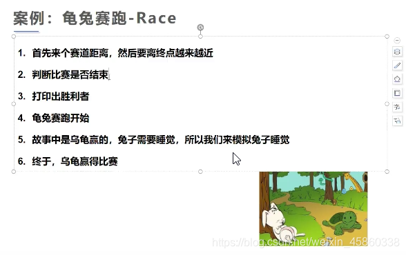

```java
/**
 * 模拟龟兔赛跑
 */
public class Demo5_RaceCase implements Runnable {
   
     
     
    //胜利者
    private static String winner;

    @Override
    public void run() {
   
     
     
        for (int i = 0; i <= 100; i++) {
   
     
     
            //模拟兔子休息
            if (Thread.currentThread().getName().equals("兔子") && i % 10 == 0) {
   
     
     
                try {
   
     
     
                    Thread.sleep(2);
                } catch (InterruptedException e) {
   
     
     
                    e.printStackTrace();
                }
            }
            //判断比赛是否结束
            boolean flag = gameOver(i);
            //如果比赛结束，停止程序
            if (flag) {
   
     
     
                break;
            }
            System.out.println(Thread.currentThread().getName() + "--->跑了" + i + "步");
        }
    }

    //判断是否完成
    private boolean gameOver(int steps) {
   
     
     
        if (winner != null) {
   
     
     
            return true;
        } else {
   
     
     
            if (steps >= 100) {
   
     
     
                winner = Thread.currentThread().getName();
                System.out.println("winner is " + winner);
                return true;
            }
        }
        return false;
    }

    public static void main(String[] args) {
   
     
     
        Demo5_RaceCase race = new Demo5_RaceCase();
        new Thread(race， "兔子").start();
        new Thread(race， "乌龟").start();
    }
}
```

### 1.3实现Callable接口（了解） 

实现Callable接口，需要返回值类型

重写call方法，需要抛出异常

创建目标对象

创建执行服务：ExecutorService ser = Executors.newFixedThreadPool(1);

提交执行：Future result1 = ser.submit(11);

获取结果：boolean r1 = result1.get()

关闭服务：ser.shutdownNow();

#### 实现 

```java
/**
 * 实现Callable接口
 */
public class Demo6_CreateCallable implements Callable<Boolean> {

    private String url;//网络图片地址
    private String name;//报错扥文件名

    //有参构造
    public Demo6_CreateCallable(String url， String name) {
        this.url = url;
        this.name = name;
    }

    //下载图片线程的执行体
    public Boolean call() throws Exception {
        WebDownloader webDownloader = new WebDownloader();
        webDownloader.downloader(url， name);
        System.out.println("下载了文件名为:" + name);
        return true;
    }

    public static void main(String[] args) throws ExecutionException， InterruptedException {
        Demo6_CreateCallable c = new Demo6_CreateCallable("https://img-home.csdnimg.cn/images/20201124032511.png"， "1.png");
        Demo6_CreateCallable c1 = new Demo6_CreateCallable("https://img-home.csdnimg.cn/images/20201124032511.png"， "2.png");
        Demo6_CreateCallable c2 = new Demo6_CreateCallable("https://img-home.csdnimg.cn/images/20201124032511.png"， "3.png");
        //创建执行服务
        ExecutorService ser = Executors.newFixedThreadPool(3);
        //提交执行
        Future<Boolean> r = ser.submit(c);
        Future<Boolean> r1 = ser.submit(c1);
        Future<Boolean> r2 = ser.submit(c2);
        //获取结果
        boolean res = r.get();
        boolean res1 = r1.get();
        boolean res2 = r2.get();
        //关闭服务
        ser.shutdownNow();
    }
}
//class WebDownloader在前面下载图片已经定义了，这里就不用再次写，直接使用就好
```

#### 好处 

可以定义返回值

可以抛出异常

### 1.4Thread和Runnable对比 

继承Thred类:

 *  子类继承Thread类具备多线程能力
 *  启动线程:子类对象.start()
 *  不建议使用:避免OOP单继承局限性

实现Runnable接口

 *  实现接口Runnable具有多线程能力
 *  启动线程:传入目标对象+Thread对象.start()
 *  推荐使用:避免单继承局限性，灵活方便，方便同一个对象被多个线程使用  
    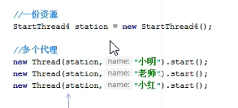

## 2.静态代理 

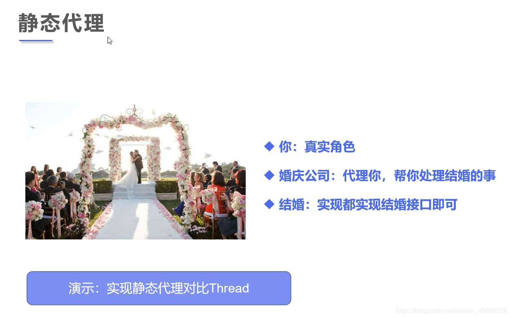

#### 实现: 结婚案例 

```java
/**
 * 静态代理:结婚案例
 */
public class Demo7_StaticProxy {
   
     
     
    public static void main(String[] args) {
   
     
     
        WeddingCompany weddingCompany = new WeddingCompany(new You());
        weddingCompany.happyMarry();
    }
}

//结婚
interface Marry {
   
     
     
    void happyMarry();
}

//真实角色:你去结婚
class You implements Marry {
   
     
     
    @Override
    public void happyMarry() {
   
     
     
        System.out.println("doris要结婚了，超开心");
    }
}

//代理角色:帮助你结婚
class WeddingCompany implements Marry {
   
     
     
    private Marry target;//代理-->真实目标角色角色，帮谁结婚

    public WeddingCompany(Marry target) {
   
     
     
        this.target = target;
    }

    @Override
    public void happyMarry() {
   
     
     
        after();
        this.target.happyMarry();
        before();
    }

    private void after() {
   
     
     
        System.out.println("结婚之前，布置现场");
    }

    private void before() {
   
     
     
        System.out.println("结婚之后，收尾款");
    }
}
```

优化:使用线程，Lamda表达式

```java
/**
 * 线程中的代理模式
 */
public class Demo8_StaticProxy {
   
     
     
    public static void main(String[] args) {
   
     
     
        new Thread(()-> System.out.println("我爱你")).start();
        new WeddingCompany(new You()).happyMarry();
    }
}
//WeddingCompany...上一个文件定义过了这里就直接使用了
```

#### 总结 

真实对象和代理对象都要实现一个接口  
代理对象要代理真实角色

#### 好处 

代理对象可以做很多真实对象做不了的事情  
真实对象专注做自己的事

## 3.Lamda表达式 

#### 介绍 


 *  λ 希腊字母表中排序第十一位的字母，英语名称为 Lamda
 *  避免匿名内部类定义过多
 *  其实质属于函数式编程的概念
 *  去掉了一堆没有意义的代码，只留下核心逻辑

> (params)-> expression\[表达式\]
>
> (params) -> statement\[语句\]
>
> \[(params)-> \{statements\}

```java
a -> System.out.println("i like lamda-->"+a)
```

new Thread (()->System.out.println(“多线程学习。。。。”)).start();

理解Functional Interface (函数式接口) 是学习Java8 lamda表达式的关键

#### 函数式接口的定义: 

任何接口，如果只包含唯一一个抽象方法，那么它就是一个函数式接口.

```java
public interface Runnable{
       
    public abstract void run();
}
```

对于函数式接口，我们可以通过Lamda表达式来创建该接口的对象.

#### 实现: 

##### 案例1: 

```java
/**
 * 推导lamda表达式
 */
public class Demo9_Lamda {
             
    public static void main(String[] args) {
             
        ILike like = new Like();
        like.lamda();
    }
}

// 1.定义一个函数式接口
interface ILike {
             
    void lamda();
}

// 2.实现类
class Like implements ILike {
             
    @Override
    public void lamda() {
             
        System.out.println("I like lamda");
    }
}
```

优化1：

```java
public class Demo10_Lamda1 {
   
     
     
    //3. 静态内部类
    static class Like1 implements ILike {
   
     
     
        @Override
        public void lamda() {
   
     
     
            System.out.println("I like lamda1");
        }
    }
    //3.静态内部类
    public static void main(String[] args) {
   
     
     
        ILike like = new Like1();
        like.lamda();
    }
}
```

优化2：

```java
public class Demo11_Lamda2 {
   
     
     
    public static void main(String[] args) {
   
     
     
        //4.局部内部类
        class Like12 implements ILike {
   
     
     
            @Override
            public void lamda() {
   
     
     
                System.out.println("I like lamda2");
            }
        }
        ILike like = new Like12();
        like.lamda();
    }
}
```

优化3：

```java
public class Demo12_Lamda3 {
   
     
     
    public static void main(String[] args) {
   
     
     
        //5.匿名内部类，没有类的名称，必须借助接口或者父类
        ILike like = new ILike () {
   
     
     
            @Override
            public void lamda() {
   
     
     
                System.out.println("I like lamda3");
            }
        };
        like.lamda();
    }
}
```

最终版：

```java
public class Demo13_Lamda4 {
   
     
     
    public static void main(String[] args) {
   
     
     
        //6.lamda简化
        ILike like = () ->{
   
     
     
            System.out.println("I like lamda4");
        };
        like.lamda();
    }
}
```

##### 案例2: 

```java
public class Demo14_LamdaCase2 {
   
     
     
    public static void main(String[] args) {
   
     
     
        // 1.lamda
        ILove love = (int a) -> {
   
     
     
            System.out.println("I love you -->" + a);
        };
        // 2.lamda简化1.0
        love = (a) -> {
   
     
     
            System.out.println("I love you -->" + a);
        };
        // 3.lamda简化2.0
        love = a -> {
   
     
     
            System.out.println("I love you -->" + a);
        };
        // 3.lamda简化3.0
        love = a -> System.out.println("I love you -->" + a);

        /**总结:
         * {}简略的条件是只能有一行代码，多行{}就不能简略了
         * 前提是接口为函数式接口(只能有一个方法)
         * 多个参数也可以去掉参数类型，要去掉就都去掉，必须加上()
         */

        love.love(520);
    }
}

interface ILove {
   
     
     
    void love(int a);
}
```

# 三、线程状态 

## 🍒1.线程五大状态: 

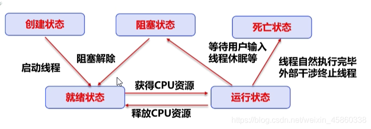  
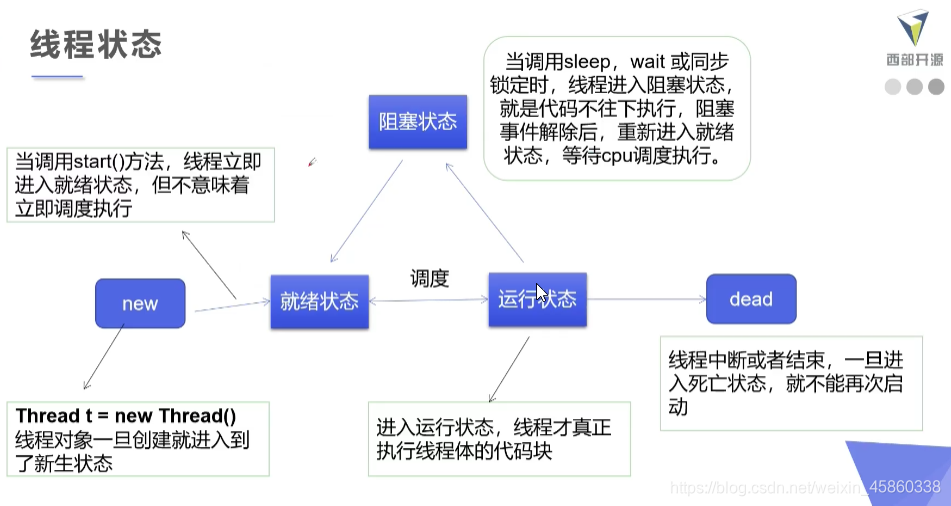

## 🍒2.线程方法 

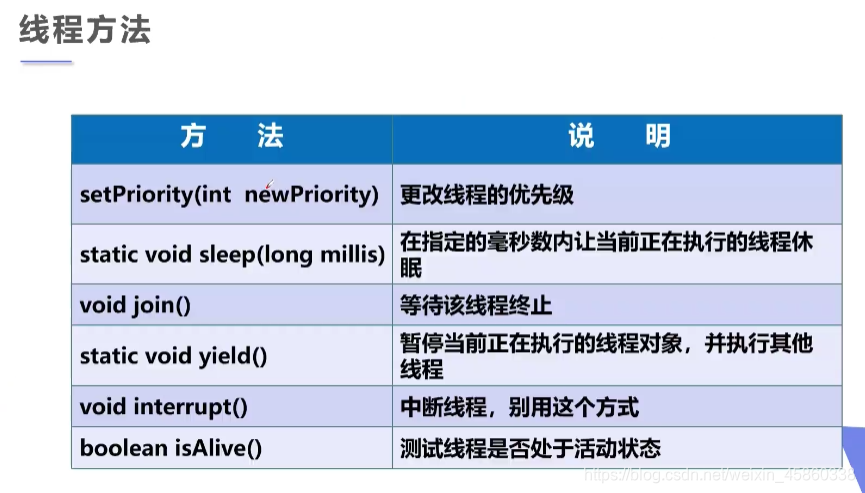

#### 🍍2.1停止线程 

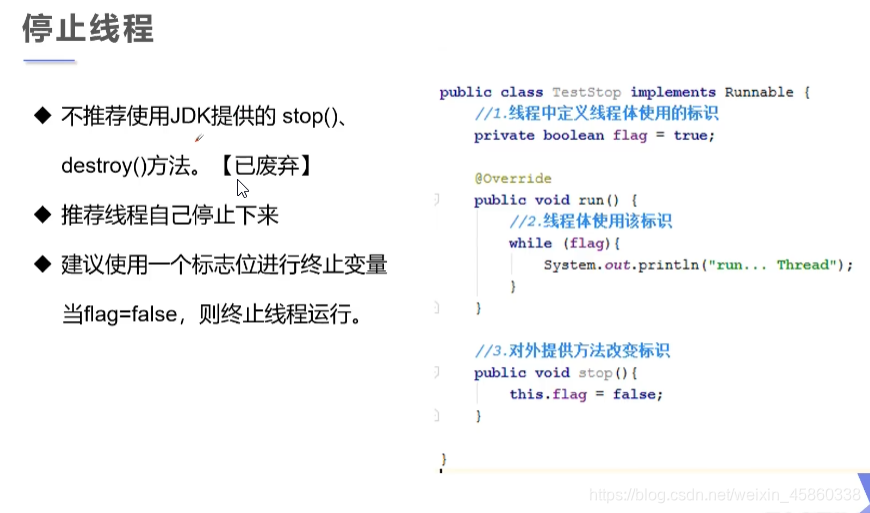

##### 案例: 

```java
/**
 * 测试stop
 * 1.建议线程正常停止-->利用次数，不建议死循环
 * 2.建议使用标志位-->设置一个标志位
 * 3.不要使用stop或者destroy等过时或者JDK不建议使用的方法
 */
public class Demo15_StopThread implements Runnable {
   
     
     
    // 1. 设置一个标志位
    private boolean flag = true;

    @Override
    public void run() {
   
     
     
        int i = 0;
        while (flag) {
   
     
     
            System.out.println("run...Thread" + i++);
        }
    }

    // 2. 设置一个公开的方法停止线程，转换标志位
    public void stop() {
   
     
     
        this.flag = false;
    }

    public static void main(String[] args) {
   
     
     
        Demo15_StopThread stop = new Demo15_StopThread();
        new Thread(stop).start();
        for (int i = 0; i < 1000; i++) {
   
     
     
            System.out.println("main..." + i);
            if (i == 900) {
   
     
     
                //调用stop()切换标志位，让线程终止
                stop.stop();
                System.out.println("该线程停止了");
            }
        }
    }
}
```

#### 🍍2.2线程休眠 

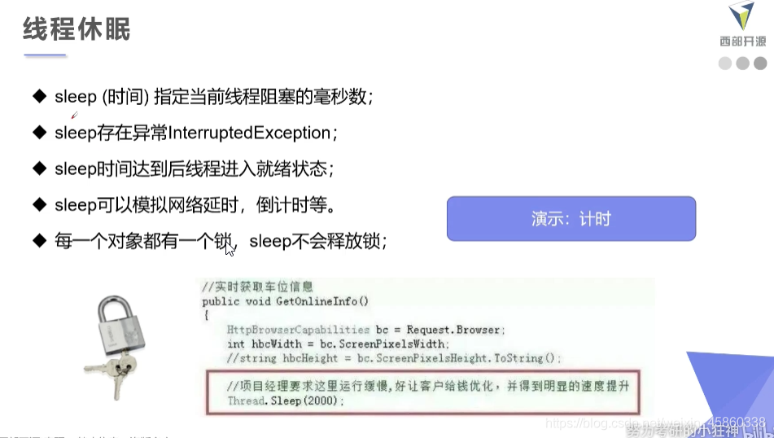

##### 案例: 

```java
/**
 * 模拟网络延迟:放大问题的发生性
 */
public class Demo16_SleepThread implements Runnable {
   
     
     

    //票数
    private int ticketNums = 10;

    @Override
    public void run() {
   
     
     
        while (true) {
   
     
     
            if (ticketNums <= 0) {
   
     
     
                break;
            }
            //捕获异常
            try {
   
     
     
                Thread.sleep(200);
            } catch (InterruptedException e) {
   
     
     
                e.printStackTrace();
            }
            System.out.println(Thread.currentThread().getName() + "--->拿到了第" + ticketNums-- + "张票");
        }
    }

    public static void main(String[] args) {
   
     
     
        Demo4_TrainTicketsCase ticket = new Demo4_TrainTicketsCase();
        new Thread(ticket， "小红").start();
        new Thread(ticket， "老师").start();
        new Thread(ticket， "黄牛1").start();
    }
}
```

```java
/**
 * 模拟倒计时
 */
public class Demo17_SleepThread2 {
   
     
     

    public static void main(String[] args) {
   
     
     
        try {
   
     
     
            tenDown();
        } catch (InterruptedException e) {
   
     
     
            e.printStackTrace();
        }
    }

    //模拟倒计时
    public static void tenDown() throws InterruptedException {
   
     
     
        int num = 10;//10秒
        while (true) {
   
     
     
            Thread.sleep(1000);
            System.out.println(num--);
            if (num <= 0) {
   
     
     
                break;
            }
        }
    }
}
```

```java
/**
 * 每一秒获取当前时间
 */
public class Demo18_SleepThread3 {
   
     
     

    public static void main(String[] args) {
   
     
     
        //获取系统当前时间
        Date startTime = new Date(System.currentTimeMillis());
        while (true) {
   
     
     
            try {
   
     
     
                Thread.sleep(1000);
                //更新系统时间
                System.out.println(new SimpleDateFormat("HH:mm:ss").format(startTime));
                startTime = new Date(System.currentTimeMillis());
            } catch (InterruptedException e) {
   
     
     
                e.printStackTrace();
            }
        }
    }
}
```

#### 🍍2.3线程礼让 

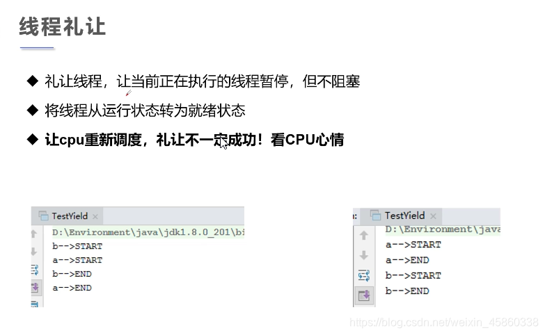

##### 案例: 

```java
/**
 * 测试礼让线程
 * 礼让不一定成功，看cpu心情
 */
public class Demo19_YieldThread {
   
     
     
    public static void main(String[] args) {
   
     
     
        MyYeild myYeild = new MyYeild();
        new Thread(myYeild， "a").start();
        new Thread(myYeild， "b").start();
    }
}

class MyYeild implements Runnable {
   
     
     
    @Override
    public void run() {
   
     
     
        System.out.println(Thread.currentThread().getName() + "线程开始执行");
        Thread.yield();//礼让
        System.out.println(Thread.currentThread().getName() + "线程停止执行");
    }
}
```

#### 🍍2.4线程插队 

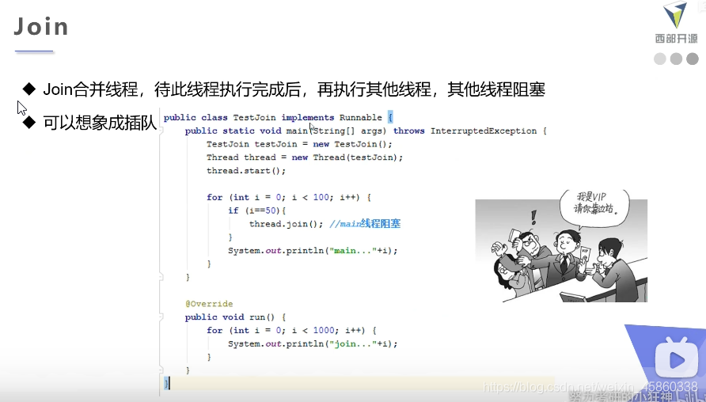

##### 案例: 

```java
/**
 * 测试join
 * 插队
 */
public class Demo20_JoinThread implements Runnable {
   
     
     
    @Override
    public void run() {
   
     
     
        for (int i = 0; i < 500; i++) {
   
     
     
            System.out.println("线程vip" + i);
        }
    }

    public static void main(String[] args) throws InterruptedException {
   
     
     
        //启动我们的线程
        Demo20_JoinThread joinThread = new Demo20_JoinThread();
        Thread thread = new Thread(joinThread);
        thread.start();

        //主线程
        for (int i = 0; i < 500; i++) {
   
     
     
            if (i == 200) {
   
     
     
                thread.join();//插队
            }
            System.out.println("main" + i);
        }
    }
}
```

## 🍒3.线程状态观测 

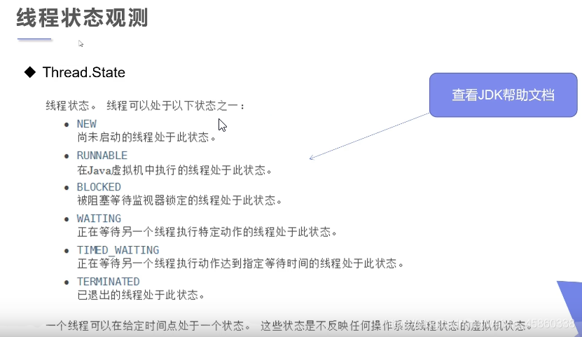

#### 实现: 

```java
/**
 * 观察测试线程状态
 */
public class Demo21_ThreadState {
   
     
     
    public static void main(String[] args) throws InterruptedException {
   
     
     
        Thread thread = new Thread(() -> {
   
     
     
            for (int i = 0; i < 5; i++) {
   
     
     
                try {
   
     
     
                    Thread.sleep(1000);
                } catch (InterruptedException e) {
   
     
     
                    e.printStackTrace();
                }
            }
            System.out.println("//");
        });
        //观察状态
        Thread.State state = thread.getState();
        System.out.println(state);
        //观察启动后
        thread.start();
        state = thread.getState();
        System.out.println(state);//Run
        while (state != Thread.State.TERMINATED) {
   
     
     //只要现成不终止，就一直输出状态
            Thread.sleep(100);
            state = thread.getState();//更新线程状态
            System.out.println(state);
        }
        //死亡后的线程不能再启动了，启动会报异常
        //thread.start();
    }
}
```

## 🍒4.线程优先级 

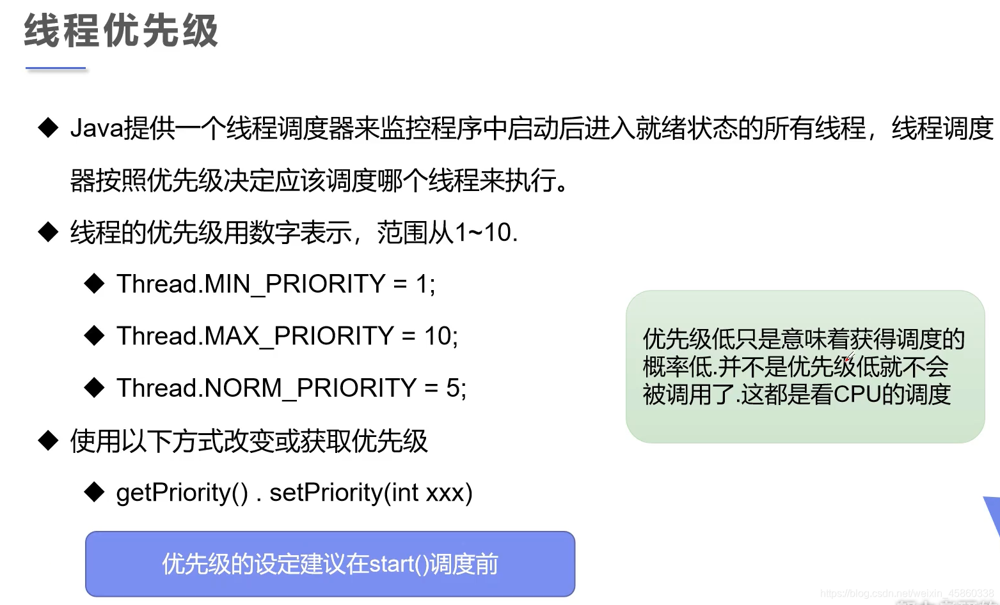

#### 实现: 

```java
/**
 * 线程优先级
 */
public class Demo22_ThreadPriority{
   
     
     
    public static void main(String[] args) {
   
     
     
        //主线程默认优先级
        System.out.println(Thread.currentThread().getName()+"-->"+Thread.currentThread().getPriority());

        MyPriority myPriority = new MyPriority();
        Thread thread1 = new Thread(myPriority);
        Thread thread2 = new Thread(myPriority);
        Thread thread3 = new Thread(myPriority);
        Thread thread4 = new Thread(myPriority);
        Thread thread5 = new Thread(myPriority);

        //先设置优先级，再启动
        thread1.start();

        thread2.setPriority(1);
        thread2.start();

        thread3.setPriority(4);
        thread3.start();

        thread4.setPriority(Thread.MAX_PRIORITY);//MAX_PRIORITY=10
        thread4.start();

        thread5.setPriority(8);
        thread5.start();
    }
}
class MyPriority implements Runnable{
   
     
     
    @Override
    public void run() {
   
     
     
        System.out.println(Thread.currentThread().getName()+"-->"+Thread.currentThread().getPriority());
    }
}
```

## 🍒5.守护(daemon)线程 


##### 实现: 

```java
/**
 * 测试守护线程
 * 上帝守护你
 */
public class Demo23_DaemonThread {
   
     
     
    public static void main(String[] args) {
   
     
     
        God god = new God();
        You you = new You();

        Thread thread = new Thread(god);
        //默认false表示是用户线程，正常的线程都是用户线程...
        thread.setDaemon(true);
        //上帝守护线程启动
        thread.start();
        //你 用户线程启动
        new Thread(you).start();
    }
}

//上帝
class God implements Runnable{
   
     
     
    @Override
    public void run() {
   
     
     
        while (true){
   
     
     
            System.out.println("上帝保佑着你");
        }
    }
}

//你
class You implements Runnable{
   
     
     
    @Override
    public void run() {
   
     
     
        for (int i = 0; i < 36500; i++) {
   
     
     
            System.out.println("你一生都开心的活着");
        }
        System.out.println("====goodbye!world====");
    }
}
```

## 四、线程同步 

### 🍒1.介绍 

\*\*多个线程操作同一个资源 \*\*

  
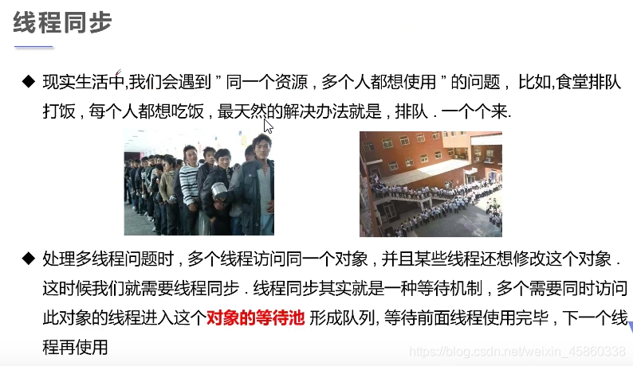  
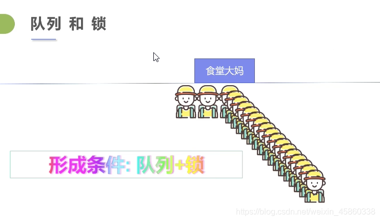  
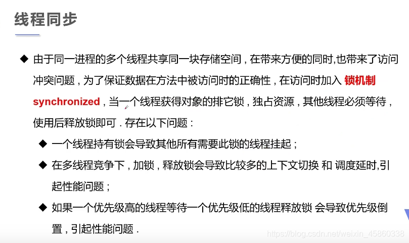

### 🍒2.不安全的线程案例 

```java
//不安全买票
public class Demo24_UnsafeBuyTicket {
   
     
     
    public static void main(String[] args) {
   
     
     
        BuyTicket buyTicket = new BuyTicket();
        new Thread(buyTicket， "张三").start();
        new Thread(buyTicket， "李四").start();
        new Thread(buyTicket， "王五").start();
    }
}

class BuyTicket implements Runnable {
   
     
     
    //票
    private int ticketNums = 10;
    boolean flag = true;

    @Override
    public void run() {
   
     
     
        //买票
        while (flag) {
   
     
     
            try {
   
     
     
                buy();
            } catch (Exception e) {
   
     
     
                e.printStackTrace();
            }
        }
    }

    //买票
    private void buy() {
   
     
     
        //判断是否有票
        if (ticketNums <= 0) {
   
     
     
            flag = false;
            return;
        }
        //延迟
        try {
   
     
     
            Thread.sleep(1);
        } catch (InterruptedException e) {
   
     
     
            e.printStackTrace();
        }

        //买票
        System.out.println(Thread.currentThread().getName() + "拿到" + ticketNums--);
    }
}
```

```java
/**
 * 不安全的取钱
 */
public class Demo25_UnsafeBank {
   
     
     
    public static void main(String[] args) {
   
     
     
        Account account = new Account(100， "结婚基金");
        Drawing you = new Drawing(account， 50， "展堂");
        Drawing girlfriend = new Drawing(account， 100， "sad");
        you.start();
        girlfriend.start();
    }
}

//账户
class Account {
   
     
     
    int money;//余额
    String cardName;//卡名

    public Account(int money， String cardName) {
   
     
     
        this.money = money;
        this.cardName = cardName;
    }
}

//银行:模拟取款
class Drawing extends Thread {
   
     
     
    Account account;//账户
    int drawingMoney;//取金额
    int nowMoney;//你手里的钱

    public Drawing(Account account， int drawingMoney， String name) {
   
     
     
        super(name);
        this.account = account;
        this.drawingMoney = drawingMoney;
    }

    //取钱
    @Override
    public void run() {
   
     
     
        //判断是否有钱
        if (account.money - drawingMoney < 0) {
   
     
     
            System.out.println(Thread.currentThread().getName() + "余额不足，不能进行取钱");
            return;
        }
        try {
   
     
     
            Thread.sleep(1000);//放大问题的发生性
        } catch (InterruptedException e) {
   
     
     
            e.printStackTrace();
        }
        //卡内金额 = 余额-你的钱
        account.money = account.money - drawingMoney;
        //你手里的钱
        nowMoney = nowMoney + drawingMoney;
        System.out.println(account.cardName + "余额为:" + account.money);
        //this.getName()==Thread.currentThread().getName()
        System.out.println(this.getName() + "手里的钱:" + nowMoney);
    }
}
```

```java
//线程不安全的集合
public class Demo26_UnsafeList {
   
     
     
    public static void main(String[] args) {
   
     
     
        List<String> list = new ArrayList<String>();
        for (int i = 0; i < 1000; i++) {
   
     
     
            new Thread(()->{
   
     
     
                list.add(Thread.currentThread().getName());
            }).start();
        }
        System.out.println(list.size());
    }
}
```

### 🍒3.同步方法 

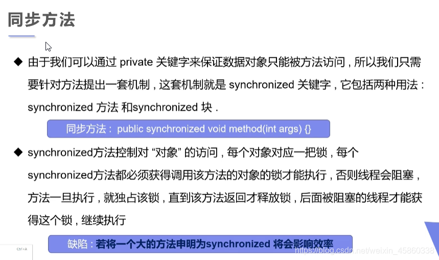  
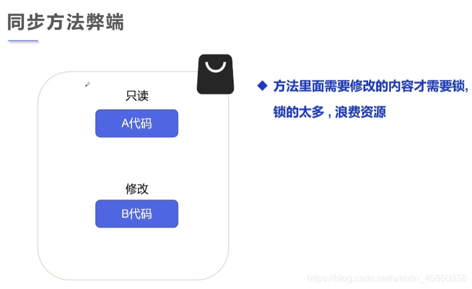  
同步方法，锁的是this

#### 实现: 

```java
//安全买票
public class Demo27_SafeBuyTicket {
   
     
     
    public static void main(String[] args) {
   
     
     
        BuyTicket1 buyTicket = new BuyTicket1();
        new Thread(buyTicket， "张三").start();
        new Thread(buyTicket， "李四").start();
        new Thread(buyTicket， "王五").start();
    }
}

class BuyTicket1 implements Runnable {
   
     
     
    //票
    private int ticketNums = 10;
    boolean flag = true;

    @Override
    public void run() {
   
     
     
        //买票
        while (flag) {
   
     
     
            try {
   
     
     
                buy();
            } catch (Exception e) {
   
     
     
                e.printStackTrace();
            }
        }
    }

    //synchronized 同步方法，锁的是this
    private synchronized void buy() {
   
     
     
        //判断是否有票
        if (ticketNums <= 0) {
   
     
     
            flag = false;
            return;
        }
        //延迟
        try {
   
     
     
            Thread.sleep(1);
        } catch (InterruptedException e) {
   
     
     
            e.printStackTrace();
        }

        //买票
        System.out.println(Thread.currentThread().getName() + "拿到" + ticketNums--);
    }
}
```

### 🍒4.同步块 

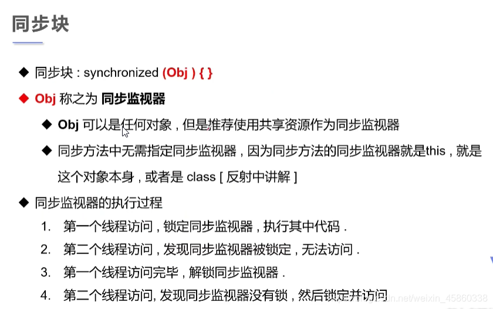  
锁的对象就是变量的量，需要增删改查的对象

#### 实现: 

```java
/**
 * 安全的取钱 同步块
 */
public class Demo28_SafeBank {
   
     
     
    public static void main(String[] args) {
   
     
     
        Account1 account = new Account1(100， "结婚基金");
        Drawing1 you = new Drawing1(account， 50， "展堂");
        Drawing1 girlfriend = new Drawing1(account， 100， "sad");
        you.start();
        girlfriend.start();
    }
}

//账户
class Account1 {
   
     
     
    int money;//余额
    String cardName;//卡名

    public Account1(int money， String cardName) {
   
     
     
        this.money = money;
        this.cardName = cardName;
    }
}

//银行:模拟取款
class Drawing1 extends Thread {
   
     
     
    Account1 account;//账户
    int drawingMoney;//取金额
    int nowMoney;//你手里的钱

    public Drawing1(Account1 account， int drawingMoney， String name) {
   
     
     
        super(name);
        this.account = account;
        this.drawingMoney = drawingMoney;
    }

    //取钱
    @Override
    public void run() {
   
     
     
        //锁的对象就是变量的量，需要增删改查的对象
        synchronized (account) {
   
     
     
            //判断是否有钱
            if (account.money - drawingMoney < 0) {
   
     
     
                System.out.println(Thread.currentThread().getName() + "余额不足，不能进行取钱");
                return;
            }
            try {
   
     
     
                Thread.sleep(1000);//放大问题的发生性
            } catch (InterruptedException e) {
   
     
     
                e.printStackTrace();
            }
            //卡内金额 = 余额-你的钱
            account.money = account.money - drawingMoney;
            //你手里的钱
            nowMoney = nowMoney + drawingMoney;
            System.out.println(account.cardName + "余额为:" + account.money);
            //this.getName()==Thread.currentThread().getName()
            System.out.println(this.getName() + "手里的钱:" + nowMoney);
        }
    }
```

```java
//线程安全的集合 同步块
public class Demo29_SafeList {
   
     
     
    public static void main(String[] args) {
   
     
     
        List<String> list = new ArrayList<String>();
        for (int i = 0; i < 1000; i++) {
   
     
     
            new Thread(() -> {
   
     
     
                synchronized (list) {
   
     
     
                    list.add(Thread.currentThread().getName());
                }
            }).start();
        }
        try {
   
     
     
            Thread.sleep(300);
        } catch (InterruptedException e) {
   
     
     
            e.printStackTrace();
        }
        System.out.println(list.size());
    }
}
```

JUC安全集合类型扩充

```java
//测试JUC安全类型的集合
public class Demo30_ThreadJuc {
   
     
     
    public static void main(String[] args) {
   
     
     
        CopyOnWriteArrayList<String> list = new CopyOnWriteArrayList<String>();
        for (int i = 0; i < 10000; i++) {
   
     
     
            new Thread(() -> {
   
     
     
                list.add(Thread.currentThread().getName());
            }).start();
        }
        try {
   
     
     
            Thread.sleep(3000);
        } catch (InterruptedException e) {
   
     
     
            e.printStackTrace();
        }
        System.out.println(list.size());
    }
}
```

### 🍒5.死锁 


#### 案例: 

```java
/**
 * 死锁:多个线程互相抱着对方需要的资源，然后形成僵持
 * 解决:一个锁只锁一个对象
 */
class Demo31_DeadLock {
   
     
     
    public static void main(String[] args) {
   
     
     
        Makeup makeup = new Makeup(0， "灰姑娘");
        Makeup makeup1 = new Makeup(1， "白雪公主");
        makeup.start();
        makeup1.start();
    }
}

//口红
class Lipstick {
   
     
      }
//镜子
class Mirror {
   
     
      }

class Makeup extends Thread {
   
     
     
    //需要的资源只有一份，用static保证只有一份
    static Lipstick lipstick = new Lipstick();
    static Mirror mirror = new Mirror();
    int choice;//选择
    String girlName;//使用化妆品的人

    public Makeup(int choice， String girlName) {
   
     
     
        this.choice = choice;
        this.girlName = girlName;
    }

    @Override
    public void run() {
   
     
     
        //化妆
        try {
   
     
     
            makeup();
        } catch (InterruptedException e) {
   
     
     
            e.printStackTrace();
        }
    }

    private void makeup() throws InterruptedException {
   
     
     
        if (choice == 0) {
   
     
     
            synchronized (lipstick) {
   
     
     //获得口红的锁
                System.out.println(this.girlName + "获得口红的锁");
                Thread.sleep(1000);
                synchronized (mirror) {
   
     
     //一秒钟后想获得镜子
                    System.out.println(this.girlName + "获得镜子的锁");
                }
            }
        } else {
   
     
     
            synchronized (mirror) {
   
     
     //获得口红镜子
                System.out.println(this.girlName + "获得镜子的锁");
                Thread.sleep(2000);
                synchronized (lipstick) {
   
     
     //二秒钟后想获得的锁
                    System.out.println(this.girlName + "获得口红的锁");
                }
            }
        }
    }
}
```

解决:

```java
/**
 * 死锁:多个线程互相抱着对方需要的资源，然后形成僵持
 * 解决:一个锁只锁一个对象
 */
class Demo31_DeadLock {
   
     
     
    public static void main(String[] args) {
   
     
     
        Makeup makeup = new Makeup(0， "灰姑娘");
        Makeup makeup1 = new Makeup(1， "白雪公主");
        makeup.start();
        makeup1.start();
    }
}

//口红
class Lipstick {
   
     
      }
//镜子
class Mirror {
   
     
      }

class Makeup extends Thread {
   
     
     
    //需要的资源只有一份，用static保证只有一份
    static Lipstick lipstick = new Lipstick();
    static Mirror mirror = new Mirror();
    int choice;//选择
    String girlName;//使用化妆品的人

    public Makeup(int choice， String girlName) {
   
     
     
        this.choice = choice;
        this.girlName = girlName;
    }

    @Override
    public void run() {
   
     
     
        //化妆
        try {
   
     
     
            makeup();
        } catch (InterruptedException e) {
   
     
     
            e.printStackTrace();
        }
    }

    private void makeup() throws InterruptedException {
   
     
     
        if (choice == 0) {
   
     
     
            synchronized (lipstick) {
   
     
     //获得口红的锁
                System.out.println(this.girlName + "获得口红的锁");
                Thread.sleep(1000);
            }
            synchronized (mirror) {
   
     
     //一秒钟后想获得镜子
                System.out.println(this.girlName + "获得镜子的锁");
            }
        } else {
   
     
     
            synchronized (mirror) {
   
     
     //获得口红镜子
                System.out.println(this.girlName + "获得镜子的锁");
                Thread.sleep(2000);
            }
            synchronized (lipstick) {
   
     
     //二秒钟后想获得的锁
                System.out.println(this.girlName + "获得口红的锁");
            }
        }
    }
}
```

#### 死锁避免办法 

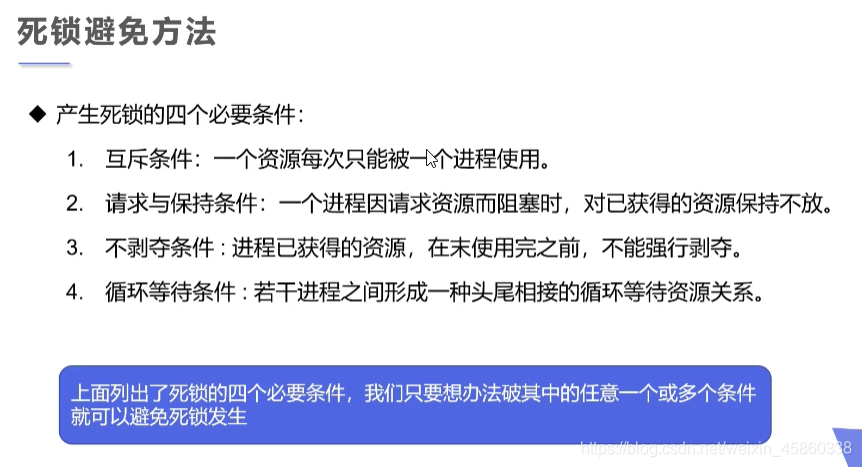

### 🍒6.Lock(锁) 

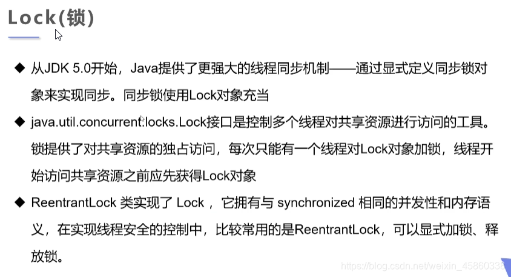  
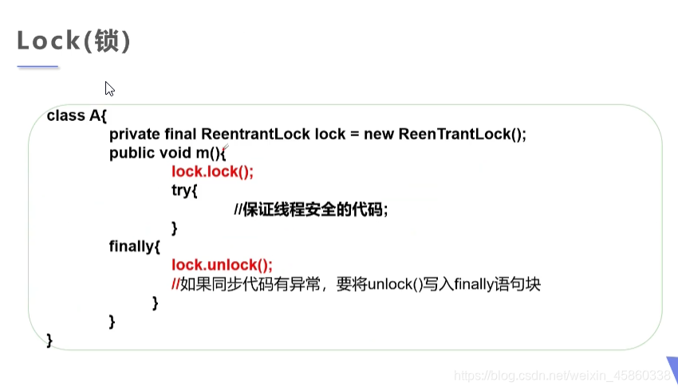

#### 实现 

```java
//测试Lock锁
public class Demo32_ThreadLock {
   
     
     
    public static void main(String[] args) {
   
     
     
        TestLock testLock = new TestLock();
        new Thread(testLock).start();
        new Thread(testLock).start();
        new Thread(testLock).start();
    }
}

class TestLock implements Runnable {
   
     
     
    int tickerNums = 10;
    //定义Lock锁
    private final ReentrantLock lock = new ReentrantLock();

    @Override
    public void run() {
   
     
     
        while (true) {
   
     
     
            //加锁
            try {
   
     
     
                lock.lock();
                if (tickerNums <= 0) {
   
     
     
                    break;
                }
                try {
   
     
     
                    Thread.sleep(1000);
                } catch (InterruptedException e) {
   
     
     
                    e.printStackTrace();
                }
                System.out.println(tickerNums--);
            } catch (Exception e) {
   
     
     
                e.printStackTrace();
            } finally {
   
     
     
                //解锁
                lock.unlock();
            }
        }
    }
}
```

### 🍒7.synchroized与Lock对比 

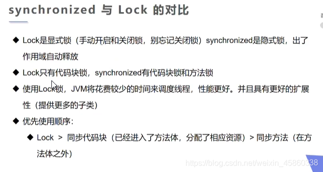

## 五、线程通信问题 

生产者消费者模式的问题  
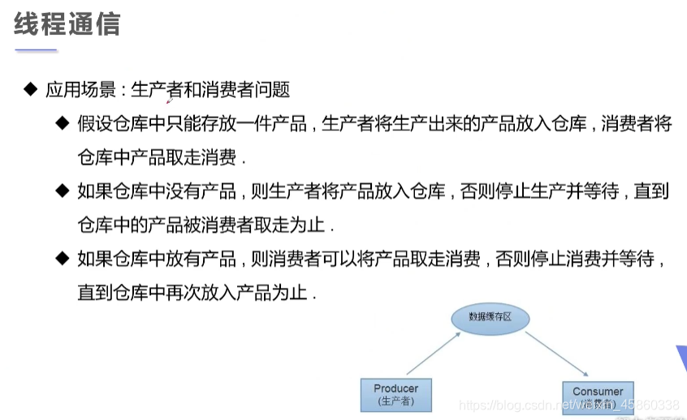

### 🍒1.线程通信方法 

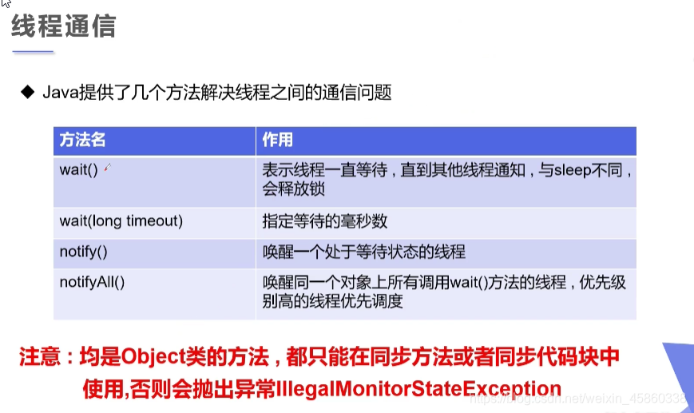  
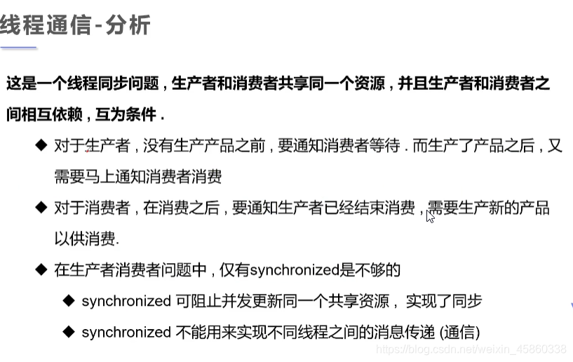

### 🍒2.线程通信问题解决方式 

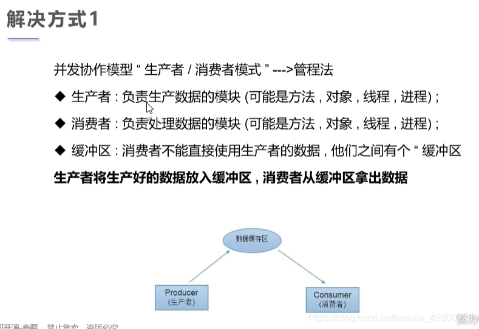

```java
/**
 * 测试:生产者消费者模型-->利用缓冲区解决:管程法
 */
public class Demo33_ThreadPC {
   
     
     
    public static void main(String[] args) {
   
     
     
        SynContainer synContainer = new SynContainer();
        new Producer(synContainer).start();
        new Consumer(synContainer).start();
    }
}

//生产者
class Producer extends Thread {
   
     
     
    //容缓冲区
    SynContainer container;

    public Producer(SynContainer container) {
   
     
     
        this.container = container;
    }

    //生产
    @Override
    public void run() {
   
     
     
        for (int i = 0; i < 100; i++) {
   
     
     
            container.push(new Product(i));
            System.out.println("生产了" + i + "件产品");
        }
    }
}

//消费者
class Consumer extends Thread {
   
     
     
    //容缓冲区
    SynContainer container;

    public Consumer(SynContainer container) {
   
     
     
        this.container = container;
    }

    //消费
    @Override
    public void run() {
   
     
     
        for (int i = 0; i < 100; i++) {
   
     
     
            System.out.println("消费了-->" + container.pop().id + "件产品");
        }
    }
}

//产品
class Product {
   
     
     
    int id;//产品编号

    public Product(int id) {
   
     
     
        this.id = id;
    }
}

//缓冲区
class SynContainer {
   
     
     
    //需要一个容器大小
    Product[] products = new Product[10];
    //容器计数器
    int count = 0;

    //生产者放入产品
    public synchronized void push(Product product) {
   
     
     
        //如果容器满了，需要等待消费者消费
        /*如果是if的话，假如消费者1消费了最后一个，这是index变成0此时释放锁被消费者2拿到而不是生产者拿到，这时消费者的wait是在if里所以它就直接去消费index-1下标越界，如果是while就会再去判断一下index得值是不是变成0了*/
        while (count == products.length) {
   
     
     
            //通知消费者消费，等待生产
            try {
   
     
     
                this.wait();
            } catch (InterruptedException e) {
   
     
     
                e.printStackTrace();
            }
        }
        //如果没有满，需要丢入产品
        products[count] = product;
        count++;
        //通知消费者消费
        this.notifyAll();
    }

    //消费者消费产品
    public synchronized Product pop() {
   
     
     
        //判断是否能消费
        while (count <= 0) {
   
     
     
            //等待生产者生产
            try {
   
     
     
                this.wait();
            } catch (InterruptedException e) {
   
     
     
                e.printStackTrace();
            }
        }
        //如果可以消费
        count--;
        Product product = products[count];
        //吃完了 通知生产者生产
        this.notifyAll();
        return product;
    }
}
```


```java
/**
 * 测试:生产者消费者模型-->利用缓冲区解决:管程法
 */
public class Demo33_ThreadPC {
   
     
     
    public static void main(String[] args) {
   
     
     
        SynContainer synContainer = new SynContainer();
        new Producer(synContainer).start();
        new Consumer(synContainer).start();
    }
}

//生产者
class Producer extends Thread {
   
     
     
    //容缓冲区
    SynContainer container;

    public Producer(SynContainer container) {
   
     
     
        this.container = container;
    }

    //生产
    @Override
    public void run() {
   
     
     
        for (int i = 0; i < 100; i++) {
   
     
     
            container.push(new Product(i));
            System.out.println("生产了" + i + "件产品");
        }
    }
}

//消费者
class Consumer extends Thread {
   
     
     
    //容缓冲区
    SynContainer container;

    public Consumer(SynContainer container) {
   
     
     
        this.container = container;
    }

    //消费
    @Override
    public void run() {
   
     
     
        for (int i = 0; i < 100; i++) {
   
     
     
            System.out.println("消费了-->" + container.pop().id + "件产品");
        }
    }
}

//产品
class Product {
   
     
     
    int id;//产品编号

    public Product(int id) {
   
     
     
        this.id = id;
    }
}

//缓冲区
class SynContainer {
   
     
     
    //需要一个容器大小
    Product[] products = new Product[10];
    //容器计数器
    int count = 0;

    //生产者放入产品
    public synchronized void push(Product product) {
   
     
     
        //如果容器满了，需要等待消费者消费
        /*如果是if的话，假如消费者1消费了最后一个，这是index变成0此时释放锁被消费者2拿到而不是生产者拿到，这时消费者的wait是在if里所以它就直接去消费index-1下标越界，如果是while就会再去判断一下index得值是不是变成0了*/
        while (count == products.length) {
   
     
     
            //通知消费者消费，等待生产
            try {
   
     
     
                this.wait();
            } catch (InterruptedException e) {
   
     
     
                e.printStackTrace();
            }
        }
        //如果没有满，需要丢入产品
        products[count] = product;
        count++;
        //通知消费者消费
        this.notifyAll();
    }

    //消费者消费产品
    public synchronized Product pop() {
   
     
     
        //判断是否能消费
        while (count <= 0) {
   
     
     
            //等待生产者生产
            try {
   
     
     
                this.wait();
            } catch (InterruptedException e) {
   
     
     
                e.printStackTrace();
            }
        }
        //如果可以消费
        count--;
        Product product = products[count];
        //吃完了 通知生产者生产
        this.notifyAll();
        return product;
    }
}
```

## 六、线程池 

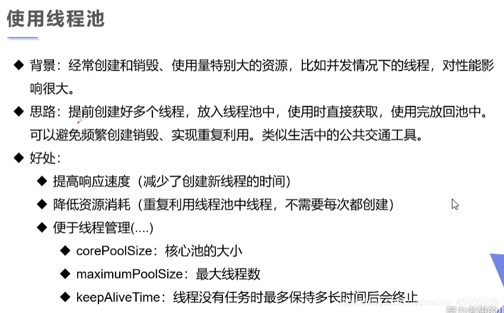  
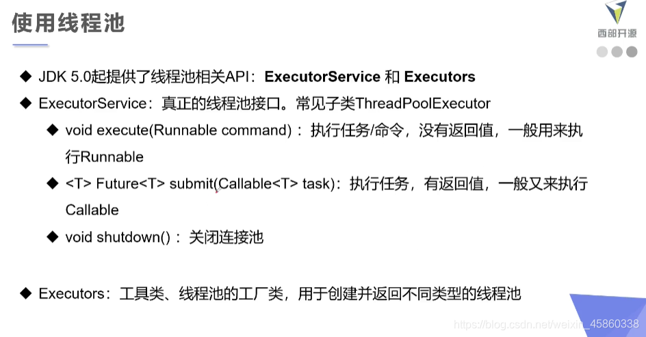

```java
//测试线程池
public class Demo35_ThreadPool {
   
     
     
    public static void main(String[] args) {
   
     
     
        // 1. 创建服务，擦行间线程池
        // newFixedThreadPool(线程池大小)
        ExecutorService service = Executors.newFixedThreadPool(10);
        //执行
        service.execute(new MyThread());
        service.execute(new MyThread());
        service.execute(new MyThread());
        service.execute(new MyThread());
        service.execute(new MyThread());
        service.execute(new MyThread());
        //关闭连接
        service.shutdown();
    }
}

class MyThread implements Runnable {
   
     
     
    @Override
    public void run() {
   
     
     
        System.out.println(Thread.currentThread().getName());
    }
}
```
