# JVM探索

- 请你谈谈你对JVM的理解？java8虚拟机和之前的变化更新？
- 什么是OOM，什么是栈溢出StackOverFlowError？怎么分析？
- JVM的常用调优参数有哪些？
- 内存快照如何抓取，怎么分析Dump文件？知道吗？
- 谈谈JVM中，类加载器你的认识？

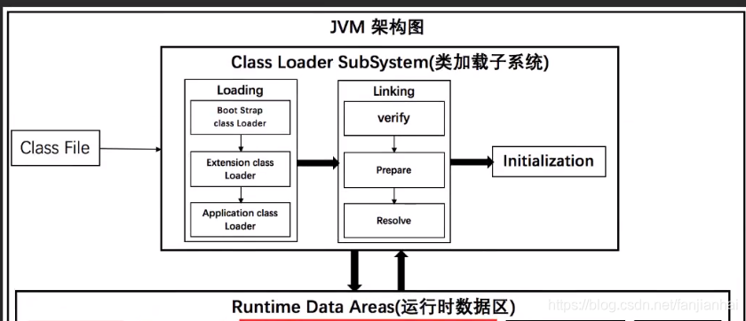

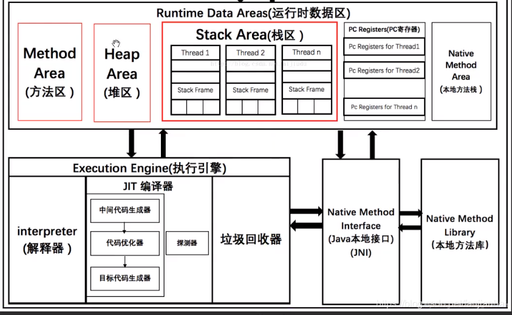


## 1、JVM的位置

- java程序跑在jvm上面，jre--jvm表示jre就包含了jvm。jvm 在操作系统之上，最底下是硬件系统。

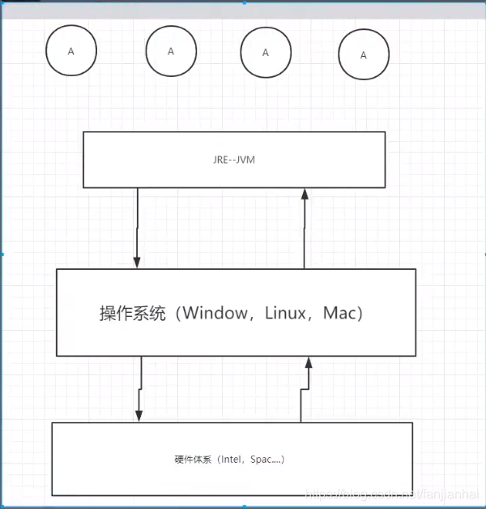

## 2、JVM的体系结构

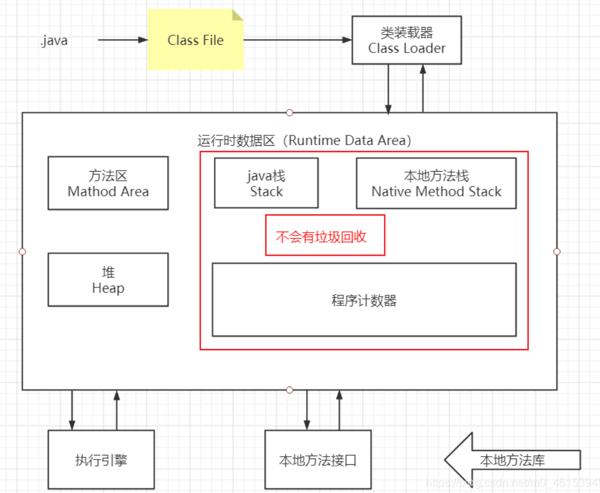


- [体系结构](https://www.processon.com/view/5ea567b163768974669293f3)

- [jvm内存模型](https://www.processon.com/view/5c31d6e2e4b0fa03ce8d3017)

- jvm调优说的是“方法区”和“堆“，而”栈“、”本地方法栈“、”程序计数器“不存在垃圾回收一事。

  > 栈内存的数据是按照"先进后出"的原则进行管理的，每个方法的数据都会在方法执行结束时自动弹出栈。因此，栈内存不需要像堆内存那样进行垃圾回收。当一个方法执行完毕，其在栈中的数据就会被自动释放，不再占用内存空间。假如存在垃圾的话会堵死。
  >
  > 堆内存主要用于存储对象实例以及数组等动态分配的内存数据。Java中的垃圾回收机制主要针对堆内存，通过垃圾回收器（Garbage Collector）定期检查堆内存中不再被引用的对象，并释放其占用的内存空间，以便重新利用。

- >
  > 在Java中，堆（Heap）和栈（Stack）是两种不同的内存区域，用于存储程序运行时的数据。
  >
  > 1. 堆（Heap）：堆是用来存储对象实例和数组等动态分配的内存区域。在Java中，所有通过`new`关键字创建的对象都会被存储在堆中。堆是线程共享的内存区域，所有线程都可以访问同一块堆内存。堆内存的大小是动态分配的，并且由垃圾回收器（Garbage Collector）负责管理，定期回收不再使用的对象以释放内存空间。
  > 2. 栈（Stack）：栈是用来存储方法调用的局部变量、方法参数、方法返回值以及方法调用的执行上下文等数据。每个线程在运行时都会拥有自己的栈空间，栈是线程私有的。栈内存的数据是按照"先进后出"的原则进行管理的，每个方法的数据都会在方法执行结束时自动弹出栈。因此，栈内存不需要像堆内存那样进行垃圾回收。
  >
  > 总的来说，堆和栈是Java内存管理中两个重要的概念。堆用于存储对象实例等动态分配的内存，由垃圾回收器管理；而栈用于存储方法调用的数据，是线程私有的，不需要垃圾回收。
  >
  > 当我们 `Car car1 = new Car()`的时候，`car1`叫做引用，放在栈里面，其真正的对象实例放在堆里。
  >
  
- 虚拟机试图使用最大内存为电脑内存的1/4, 而jvm初始化内存为1/64（**-Xms1024m -Xmx1024m -XX:+PrintGCDetails**）

## 3、类加载器

- 定义： 类的加载指的是将类的`.class`文件中的二进制数据读入到内存中，将其放在运行时数据区的方法区内，然后在堆区创建一个 `java.lang.Class`对象，用来封装类在方法区内的数据结构。简单来说，**类加载器的主要作用就是加载 Java 类的字节码（ `.class` 文件）到 JVM 中（在内存中生成一个代表该类的 `Class` 对象）。** 
- 作用：加载类文件，引用在栈中，具体实例在堆中
- 虚拟器自带三种类加载器
  - **`BootstrapClassLoader`(启动类加载器)**：最顶层的加载类，由 C++实现，通常表示为 null，并且没有父级，主要用来加载 JDK 内部的核心类库（ `%JAVA_HOME%/lib`目录下的 `rt.jar`、`resources.jar`、`charsets.jar`等 jar 包和类）以及被 `-Xbootclasspath`参数指定的路径下的所有类。
  - **`ExtensionClassLoader`(扩展类加载器)**：主要负责加载 `%JRE_HOME%/lib/ext` 目录下的 jar 包和类以及被 `java.ext.dirs` 系统变量所指定的路径下的所有类。
  - **`AppClassLoader`(应用程序类加载器)**：面向我们用户的加载器，负责加载当前应用 classpath 下的所有 jar 包和类。

我们来看一个具体的例子，假如我们现在有一个Car类。当我们在说Car类的时候说的是一个抽象的概念，如果我们希望得到具体的实例则需要去 `new`一个对象实例。这就好比`人`是一个抽象的概念，但我们提到`小红`，`小明`这就是具体的实例。

> `.getClass()`方法是一个用于获取对象所属类的方法。它是`Object`类中定义的方法，在所有Java对象中都可以使用。
>
> 例如，如果有一个对象 `obj`，可以通过调用 `obj.getClass()` 方法来获取 `obj` 所属的类的`Class`对象。`Class`对象包含了关于类的各种信息，如类的名称、父类、实现的接口、类的修饰符等。
>
> 需要注意的是，由于`.getClass()`方法是定义在`Object`类中的，因此如果要获取一个基本数据类型的类信息，需要使用对应的包装类，如`int`的包装类是`Integer`，`double`的包装类是`Double`等。
>
> 另外，Java中还有另一种获取类的方式，即通过类名直接访问类的`.class`属性，例如`String.class`。这种方式也可以获取类的`Class`对象，但是要在编译时就知道类名，而`.getClass()`方法可以在运行时动态获取对象所属的类。

```java
public class Car {

    public int age;

    public static void main(String[] args) {
        Car car1 = new Car();
        Car car2 = new Car();
        Car car3 = new Car();

        //在Object类中，hashCode()方法的默认实现是返回对象的内存地址的哈希码。
        System.out.println(car1.hashCode());
        System.out.println(car2.hashCode());
        System.out.println(car3.hashCode());
		/*
		得到的每个对象实例都是不同的
		460141958
        1163157884
        1956725890
		*/
		//我们可以通过.getClass()方法来获取
        Class aClass1 = car1.getClass();
        Class aClass2 = car1.getClass();
        Class aClass3 = car1.getClass();
        System.out.println(aClass1.hashCode());
        System.out.println(aClass2.hashCode());
        System.out.println(aClass3.hashCode());
        /*
        通过.getClass()得到的是同一个类
        685325104
        685325104
        685325104
        */
    }
}
```

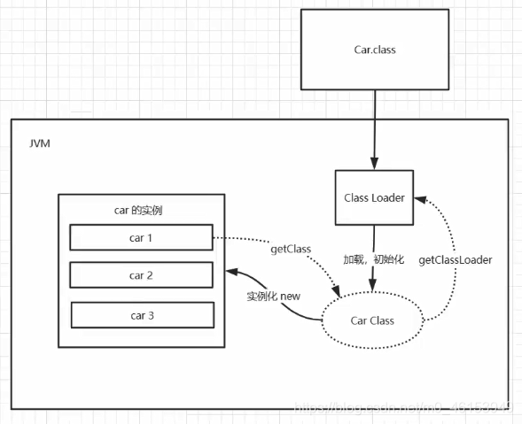 

## 4、双亲委派机制（重点）

- [Java类加载机制，你理解了吗](https://baijiahao.baidu.com/s?id=1636309817155065432&wfr=spider&for=pc)

- [面试官：java双亲委派机制及作用](https://www.jianshu.com/p/1e4011617650)

- 当某个类加载器需要加载某个`.class`文件时，它首先把这个任务委托给他的上级类加载器，递归这个操作，如果上级的类加载器没有加载，自己才会去加载这个类。

- 类加载机制步骤：

  1. 类加载器收到类加载的请求
  2. 将这个请求向上委托给父类加载器去完成,一直向上委托，直到启动类加载器
  3. 启动加载器检查是否能够加载当前这个类,能加载就结束，使用当前的加载器，否则，抛出异常，通知子加载器进行加载
  4. 重复步骤 3

  

```java
package com.xiaofan;

public class Car {
    public static void main(String[] args) {
        Car car1 = new Car();
        Car car2 = new Car();
        Car car3 = new Car();

        System.out.println(car1.hashCode());
        System.out.println(car2.hashCode());
        System.out.println(car3.hashCode());

        Class<? extends Car> aClass = car1.getClass();

        System.out.println(aClass.getClassLoader());    // 应用程序加载器 AppClassLoader
        System.out.println(aClass.getClassLoader().getParent()); // 扩展类加载器 ExtClassLoader       D:\jdk1.8\jre\lib\ext/*.jar
        System.out.println(aClass.getClassLoader().getParent().getParent());  // null   1. 不存在， 2. java程序获取不到  D:\jdk1.8\jre\lib\rt.jar

    }
}
```

### 面试常问

1. 为什么需要双亲委派机制？（优点）
   - 双亲委派机制使得类加载出现层级，父类加载器加载过的类，子类加载器不会重复加载，可以防止类重复加载；
   - 使得类的加载出现优先级，防止了核心API被篡改，提升了安全，所以越基础的类就会越上层进行加载，反而一般自己的写的类，就会在应用程序加载器（Application）直接加载。

2. 如何打破双亲委派？

   - 自定义类加载器，重写loadClass方法

   - 使用线程上下文类加载器
     

## 5、沙箱安全机制

- Java安全模型核心
- 沙箱：限制程序的运行时环境
- 域Domain概念
- 将java代码限定在虚拟机特定的运行范围内，严格限制代码对本地系统资源的访问，这样措施保证对代码的有效隔离，防止对本地系统的破坏

### 5.1、什么是沙箱:

沙箱是一个`限制程序运行的环境`。沙箱机制就是将 Java 代码限定在虚拟机(JVM)特定的运行范围中，并且严格限制代码对本地系统资源访问，通过这样的措施来保证对代码的有效隔离，防止对本地系统造成破坏。沙箱主要限制系统资源访问

- 那系统资源包括什么？――CPU、内存、文件系统、网络。
- 不同级别的沙箱对这些资源访问的限制也可以不一样。

所有的Java程序运行都可以指定沙箱，可以定制安全策略。

### 5.2、组成沙箱的基本组件

1. **字节码校验器（bytecode verifier）**:确保Java类文件遵循Java语言规范。这样可以帮助Java程序实现内存保护。但并不是所有的类文件都会经过字节码校验，比如核心类。

2. **类装载器（class loader）**：其中类装载器在3个方面对Java沙箱起作用

   - 它防止恶意代码去干涉善意的代码；

   - 它守护了被信任的类库边界；

   - 它将代码归入保护域，确定了代码可以进行哪些操作。

虚拟机为不同的类加载器载入的类提供不同的命名空间，命名空间由一系列唯一的名称组成，每一个被装载的类将有一个名字，这个命名空间是由Java虚拟机为每一个类装载器维护的，它们互相之间甚至不可见。

类装载器采用的机制是双亲委派模式。

从最内层JVM自带类加载器开始加载，外层恶意同名类得不到加载从而无法使用；
由于严格通过包来区分了访问域，外层恶意的类通过内置代码也无法获得权限访问到内层类，破坏代码就自然无法生效。
存取控制器（access controller）：存取控制器可以控制核心API对操作系统的存取权限，而这个控制的策略设定，可以由用户指定。
安全控制器（security manager）：是核心API和操作系统之间的主要接口。实现权限控制，比存取控制器优先级高。
安全软件包（security package）：java.security下的类和扩展包下的类，允许用户为自己的应用增加新的安全特性，包括：
安全提供者
消息摘要
数字签名
加密
鉴别

## 6、Native（重点）

**native ：凡是带了native关键字的，说明java的作用范围达不到了，会去调用底层c语言的库!**

### 6.1、步骤

1.进入本地方法栈

2.调用本地方法本地接口 JNI (Java Native Interface)

### 6.2、核心

在内存区域中专门开辟了一块标记区域：本地方法栈(Native Method Stack)，用来登记标记为native的方法(代码)；在(最终执行)执行引擎执行(Execution Engine)的时候通过调用本地方法本地接口 JNI，加载本地方法库(Native Libraies)中的方法

### Native Method Stack 本地方法栈

它的具体做法是Native Method Stack中登记native方法，在( Execution Engine )执行引擎执行的时候加载Native Libraies。[本地库]

### Native Interface 本地接口

本地接口的作用是融合不同的编程语言为Java所用，它的初衷是融合C/C++程序, Java在诞生的时候是C/C++横行的时候，想要立足，必须有调用C、C++的程序，**于是就在内存区域中专门开辟了一块标记区域：本地方法栈(Native Method Stack)，来登记标记为native的方法(代码)；在执行引擎执行(Execution Engine)的时候通过调用本地方法本地接口 JNI，加载本地方法库(Native Libraies)中的方法。**

> 目前该方法使用的越来越少了，除非是与硬件有关的应用，比如通过Java程序驱动打印机或者Java系统管理生产设备，在企业级应用中已经比较少见。因为现在的异构领域间通信很发达，比如可以使用Socket通信,也可以使用Web Service等等，不多做介绍!


## 7、PC程序计数器

**程序计数器: Program Counter Register**

**每个线程都有一个程序计数器，是线程私有的，就是一个指针**, 指向方法区中的方法字节码(用来存储指向下一条指令的地址， 也即将要执行的指令代码)，在执行引擎读取下一条指令, 是一个非常小的内存空间，几乎可以忽略不计

- pc寄存器
- 程序计数器Program Counter Register
- 每个线程都有一个程序计数器，线程私有，就是一个指针，指向方法区中的方法字节码（用来存储指向下一条指令的地址， 也即即将要执行的指令代码）
- 非常狭小的空间 --可以忽略不计

## 8、方法区

- **方法区是被所有线程共享**，所有字段和方法字节码，以及一些特殊方法，如构造函数、接口代码也在此定义，简单说，**所有定义的方法的信息都保存在该区域**，此区域属于共享区间；
- ==静态变量(static)，常量(final)，类信息（构造方法，接口定义）运行时的常量池也存在方法区中，但是实例变量存在堆内存中，和方法区无关==

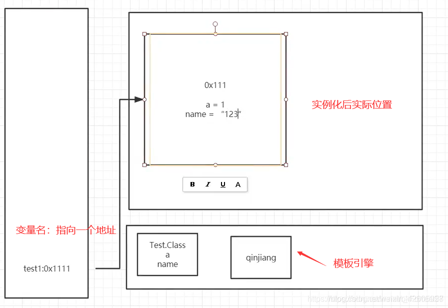

## 9、栈

程序 = 数据结构+算法：持续
程序 = 框架+业务逻辑：吃饭

**栈**：先进后出，后进先出
**队列**：先进先出

为什么main()先执行，最后结束?（先压入java Stack,最后弹出)

栈（栈内存）：主管程序的运行、生命周期和线程同步;
==线程结束，栈内存也就是释放，对于栈来说，不存在垃圾回收问题。一旦线程结束，栈就结束==

栈：8大基本类型+对象引用+实例方法

> 1. `byte`：1 字节，范围为 -128 到 127。
> 2. `short`：2 字节，范围为 -32768 到 32767。
> 3. `int`：4 字节，范围为 -2147483648 到 2147483647。
> 4. `long`：8 字节，范围为 -9223372036854775808 到 9223372036854775807。
> 5. `float`：4 字节，范围为大约 1.4e-45 到 3.4e+38，具有约 7 位有效数字。
> 6. `double`：8 字节，范围为大约 4.9e-324 到 1.8e+308，具有约 15 位有效数字。
> 7. `char`：2 字节，表示 Unicode 字符，范围为 '\u0000'（0）到 '\uffff'（65535）。
> 8. `boolean`：表示 true 或 false。

看下面这个例子，`main`方法作为程序的入口先被压入栈中，随后是`test`方法，`test`调用`a`方法，`a`再调用`test`方法，造成循环，导致栈溢出。

```java
public class Demo {

    public void test(){
        a();
    }

    public void a(){
        test();
    }

    public static void main(String[] args) {
        new Demo().test();
    }
}
//栈满报错：StackOverflowError
```


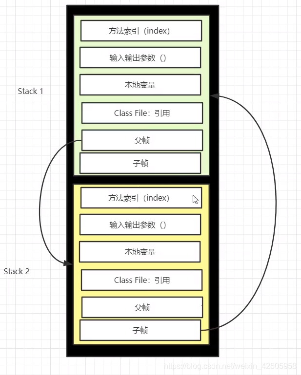

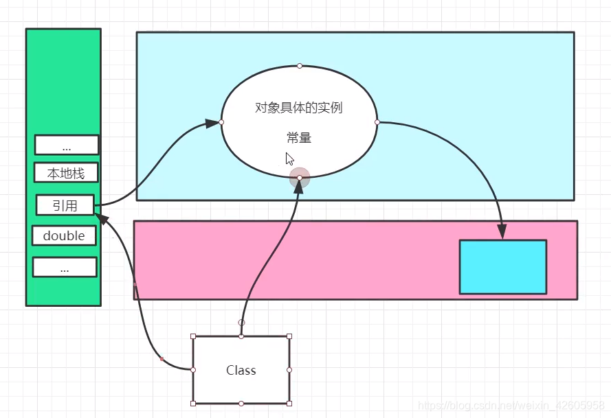

1. 栈里面的东西具体是怎么存的？
2. 画出对象实例化的过程

## 10、三种JVM

- SUN 公司 - HotSpot （使我们主要研究的）
- BEA 公司 JRocket
- IBM 公司 J9

## 11、堆

一个JVM只有一个堆内存，保存我们所有引用类型的真实对象

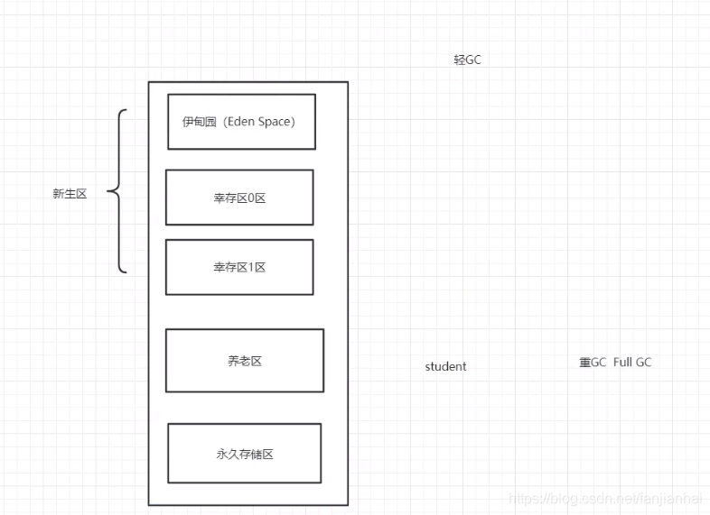

### 11.1、堆的三个区域

#### 新生区

一个类诞生和成长的地方，甚至死亡的地方

包括：

- 伊甸园区，所有的对象都是在伊甸园区new出来的!

- 幸存者区(0区和1区，或者叫from区和to区，两个区可以交换)

伊甸园**满了**就触发**轻GC**，经过轻GC存活下来的就到了幸存者区（0和1相互交替）age++，当幸存者区age>=15时，则进入老年区；老年区满了触发**重GC**，如果触发后还放不下，就OOM。

 **真理：经过研究，99%的对象都是临时对象!|**

>  **新生代 GC (Minor GC)**

发生在新生代的垃圾回收动作，频繁，速度快。此时如果新生的对象无法在 Eden 区创建（Eden 区无法容纳) 就会触发一次Young GC，此时会将 S0 区与Eden 区的对象一起进行可达性分析，找出活跃的对象，将它复制到 S1 区并且将S0区域和 Eden 区的对象给清空，这样那些不可达的对象进行清除，并且将S0 区 和 S1区交换。

每进行一次MinorGC，就age++，当age>=15时就会进入老年区。

>  **为啥会有两个 Survivor 区？**

因为假设设想一下只有一个 Survibor 区 那么就无法实现对于 S0 区的垃圾收集，以及分代年龄的提升。

#### 老年区

> **老年代 GC (Major GC)**

发生在老年代的GC ，基本上发生了一次Major GC 就会发生一次 Minor GC。并且Major GC 的速度往往会比 Minor GC 慢 10 倍。

> 什么时候会触发老年GC？

对于一个大对象，我们会首先在Eden 尝试创建，如果创建不了，就会触发Minor GC；随后继续尝试在Eden区存放，发现仍然放不下；尝试直接进入老年代，老年代也放不下；触发 Major GC 清理老年代的空间

1. 放的下 成功

2. 放不下 OOM

>  **FULL GC**

对整个堆来说的，最近几个版本的JDK里默认包括了对永生代即方法区的回收，但是有时候也可以把他和FullGC当做一个。

>  **什么时候会调用FULL GC？**

1. System.gc()方法的调用
2. 老年代空间不足
3. 永生区空间不足
4. 堆中分配很大的对象

#### 永久代

**方法区是概念，永久代是实现。变成了元空间，存放类；运行时常量池，放在堆里**

此区域不存在垃圾回收，但是也会崩（ 启动了大量第三方jar） -- 永久区是一个常驻内存区域，用于存放JDK自身携带的Class Interface的元数据。关闭虚拟机就会释放这块内存

- jdk1.6之前，永久代，常量池是在`方法区`
- jdk1.7    永久代，慢慢退化，提出去永久代，常量池在`堆`中 
- jdk1.8     无永久代，常量池在`元空间`

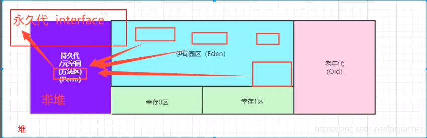

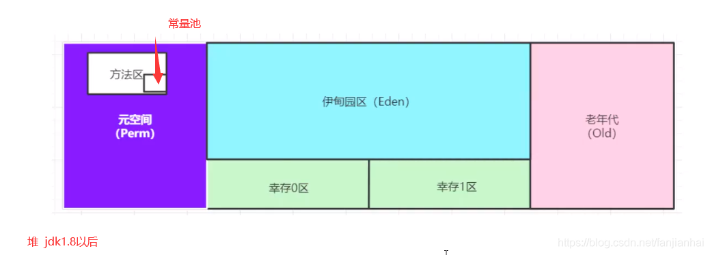


- gc垃圾回收主要针对新生区（伊甸园区）和养老区

  ```java
  public class Code {
      public static void main(String[] args) {
          long max = Runtime.getRuntime().maxMemory();
  
          long init = Runtime.getRuntime().totalMemory();
  
          System.out.println("max=" + max + "字节\t" + (max/(double)1024/1024) + "MB");
          System.out.println("init=" + init + "字节\t" + (init/(double)1024/1024) + "MB");
  
          // 默认情况下：分配的总内存（max）为电脑内存的1/4,初始化内存(init)为电脑内存的1/64
      }
  }
  ```

  ```shell
  max:981.5M
  init:981.5M
  Heap
   PSYoungGen      total 305664K, used 15729K [0x00000000eab00000, 0x0000000100000000, 0x0000000100000000)
    eden space 262144K, 6% used [0x00000000eab00000,0x00000000eba5c420,0x00000000fab00000)
    from space 43520K, 0% used [0x00000000fd580000,0x00000000fd580000,0x0000000100000000)
    to   space 43520K, 0% used [0x00000000fab00000,0x00000000fab00000,0x00000000fd580000)
   ParOldGen       total 699392K, used 0K [0x00000000c0000000, 0x00000000eab00000, 0x00000000eab00000)
    object space 699392K, 0% used [0x00000000c0000000,0x00000000c0000000,0x00000000eab00000)
   Metaspace       used 2998K, capacity 4496K, committed 4864K, reserved 1056768K
    class space    used 322K, capacity 388K, committed 512K, reserved 1048576K
  
  ```

- **抛出OOM demo演示**


本地下载地址：http://www.downcc.com/soft/290199.html

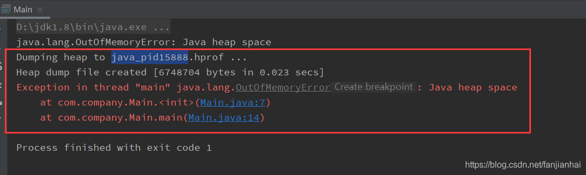

```java
package com.xiaofan;

import java.util.Random;

public class Main {

    public static void main(String[] args) {
        String a = "kuangshensayjava";
        while(true) {
            a += a + new Random().nextInt(999999999) + new Random().nextInt(999999999);
        }
    }
}

```

```java
D:\jdk1.8\bin\java.exe -Xms8m -Xmx8m -XX:+PrintGCDetails -javaagent:E:\idea_ultimate\IntelliJ_IDEA_2020_2\lib\idea_rt.jar=50684:E:\idea_ultimate\IntelliJ_IDEA_2020_2\bin -Dfile.encoding=UTF-8 -classpath D:\jdk1.8\jre\lib\charsets.jar;D:\jdk1.8\jre\lib\deploy.jar;D:\jdk1.8\jre\lib\ext\access-bridge-64.jar;D:\jdk1.8\jre\lib\ext\cldrdata.jar;D:\jdk1.8\jre\lib\ext\dnsns.jar;D:\jdk1.8\jre\lib\ext\jaccess.jar;D:\jdk1.8\jre\lib\ext\jfxrt.jar;D:\jdk1.8\jre\lib\ext\localedata.jar;D:\jdk1.8\jre\lib\ext\nashorn.jar;D:\jdk1.8\jre\lib\ext\sunec.jar;D:\jdk1.8\jre\lib\ext\sunjce_provider.jar;D:\jdk1.8\jre\lib\ext\sunmscapi.jar;D:\jdk1.8\jre\lib\ext\sunpkcs11.jar;D:\jdk1.8\jre\lib\ext\zipfs.jar;D:\jdk1.8\jre\lib\javaws.jar;D:\jdk1.8\jre\lib\jce.jar;D:\jdk1.8\jre\lib\jfr.jar;D:\jdk1.8\jre\lib\jfxswt.jar;D:\jdk1.8\jre\lib\jsse.jar;D:\jdk1.8\jre\lib\management-agent.jar;D:\jdk1.8\jre\lib\plugin.jar;D:\jdk1.8\jre\lib\resources.jar;D:\jdk1.8\jre\lib\rt.jar;E:\idea_ultimate\Project\Hello\out\production\Hello com.xiaofan.Main
[GC (Allocation Failure) [PSYoungGen: 1520K->504K(2048K)] 1520K->632K(7680K), 0.0008567 secs] [Times: user=0.00 sys=0.00, real=0.00 secs] 
[GC (Allocation Failure) [PSYoungGen: 1973K->488K(2048K)] 2101K->1314K(7680K), 0.0006303 secs] [Times: user=0.00 sys=0.00, real=0.00 secs] 
[GC (Allocation Failure) [PSYoungGen: 1578K->488K(2048K)] 2404K->1619K(7680K), 0.0004381 secs] [Times: user=0.00 sys=0.00, real=0.00 secs] 
[GC (Allocation Failure) [PSYoungGen: 1576K->224K(2048K)] 3766K->2944K(7680K), 0.0006442 secs] [Times: user=0.00 sys=0.00, real=0.00 secs] 
[GC (Allocation Failure) [PSYoungGen: 782K->224K(2048K)] 4562K->4004K(7680K), 0.0004239 secs] [Times: user=0.03 sys=0.02, real=0.00 secs] 
[GC (Allocation Failure) [PSYoungGen: 224K->224K(2048K)] 4004K->4004K(7680K), 0.0004558 secs] [Times: user=0.00 sys=0.00, real=0.00 secs] 
[Full GC (Allocation Failure) [PSYoungGen: 224K->0K(2048K)] [ParOldGen: 3780K->2165K(5632K)] 4004K->2165K(7680K), [Metaspace: 2947K->2947K(1056768K)], 0.0064615 secs] [Times: user=0.00 sys=0.00, real=0.01 secs] 
[Full GC (Ergonomics) [PSYoungGen: 1134K->0K(2048K)] [ParOldGen: 5345K->2697K(5632K)] 6480K->2697K(7680K), [Metaspace: 2963K->2963K(1056768K)], 0.0057346 secs] [Times: user=0.00 sys=0.00, real=0.01 secs] 
[GC (Allocation Failure) [PSYoungGen: 39K->160K(2048K)] 4856K->4976K(7680K), 0.0003290 secs] [Times: user=0.02 sys=0.00, real=0.00 secs] 
[GC (Allocation Failure) [PSYoungGen: 160K->160K(2048K)] 4976K->4976K(7680K), 0.0002194 secs] [Times: user=0.00 sys=0.00, real=0.00 secs] 
[Full GC (Allocation Failure) [PSYoungGen: 160K->0K(2048K)] [ParOldGen: 4816K->3760K(5632K)] 4976K->3760K(7680K), [Metaspace: 2966K->2966K(1056768K)], 0.0020017 secs] [Times: user=0.00 sys=0.00, real=0.00 secs] 
[GC (Allocation Failure) [PSYoungGen: 0K->0K(2048K)] 3760K->3760K(7680K), 0.0002045 secs] [Times: user=0.00 sys=0.00, real=0.00 secs] 
[Full GC (Allocation Failure) [PSYoungGen: 0K->0K(2048K)] [ParOldGen: 3760K->3741K(5632K)] 3760K->3741K(7680K), [Metaspace: 2966K->2966K(1056768K)], 0.0064159 secs] [Times: user=0.00 sys=0.00, real=0.01 secs] 
Heap
 PSYoungGen      total 2048K, used 131K [0x00000000ffd80000, 0x0000000100000000, 0x0000000100000000)
  eden space 1536K, 8% used [0x00000000ffd80000,0x00000000ffda0c38,0x00000000fff00000)
  from space 512K, 0% used [0x00000000fff00000,0x00000000fff00000,0x00000000fff80000)
  to   space 512K, 0% used [0x00000000fff80000,0x00000000fff80000,0x0000000100000000)
 ParOldGen       total 5632K, used 3741K [0x00000000ff800000, 0x00000000ffd80000, 0x00000000ffd80000)
  object space 5632K, 66% used [0x00000000ff800000,0x00000000ffba7700,0x00000000ffd80000)
 Metaspace       used 3075K, capacity 4496K, committed 4864K, reserved 1056768K
  class space    used 332K, capacity 388K, committed 512K, reserved 1048576K
Exception in thread "main" java.lang.OutOfMemoryError: Java heap space
	at java.util.Arrays.copyOf(Arrays.java:3332)
	at java.lang.AbstractStringBuilder.ensureCapacityInternal(AbstractStringBuilder.java:124)
	at java.lang.AbstractStringBuilder.append(AbstractStringBuilder.java:674)
	at java.lang.StringBuilder.append(StringBuilder.java:208)
	at com.xiaofan.Main.main(Main.java:10)
```

利用JProfiler工具分析OOM的原因

> **常见的jvm参数**

- `-Xms 设置初始化内存大小`
- `-Xmx 设置最大分配内存`
- `-XX:+HeapDumpOnOutOfMemoryError `
- ``-XX:+PrintGCDetails`

```java
package com.xiaofan;

import java.util.ArrayList;

public class Main {

    byte [] arr = new byte[1024*1024]; //1m

    public static void main(String[] args) {
        ArrayList<Main> list = new ArrayList<>();
        int count = 0;
        try {
            while(true) {
                list.add(new Main());
                count += 1;
            }
        } catch (Exception e) {
            System.out.println("count: " + count);
            e.printStackTrace();
        }

    }
}
```

## 12、堆内存调优

- 报OOM时，首次按尝试扩大堆内存空间查看结果，分析内存，查看一下哪个地方出现问题（JProfiler）
- JProfiler作用：分析`DumpN`内存文件，快速定位内存泄漏，获得堆中的数据，获取大的对象。
- 虚拟机基本配置参数
  - -Xms 设置Java程序启动时的初始堆大小-- 初始化内存大小
  - -Xmx 设置java程序能获得的最大堆大小-- 最大内存大小
  - -XX:+HeapDumpOnOutOfMemoryError 使用改参数可以在内存溢出时导出这个堆信息
  - -XX:+HeapDumpPath， 可以设置导出堆的存放路径
  - -XX:+PrintGCDetails 打印GC垃圾回收信息
  - 举例 ----- -Xms1m -Xmx1m -XX:+HeapDumpOnOutOfMemoryError -XX:HeapDumpPath=d:/Test3.dump

## 13、GC算法

- 垃圾回收机制是Java的重要机制，只能自动，手动只能提醒
- GC只作用于==堆和方法区==。jvm在进行GC时，并不是对三个区域统一回收，大部分时候回收都是在新生代。
- GC一般分为两种：
  - 轻GC ----- 普通GC --- 只针对新生代，偶尔作用于幸存区
  - 重GC ----- 全局GC --- 把所有东西清理一遍，释放内存

目前常用的GC算法分为以下几类：

### **13.1、引用计数算法(不常用)**

**在JVM中几乎不用**，每个对象在创建的时候，就给这个对象绑定一个计数器（有消耗）。每当有一个引用指向该对象时，计数器加一；每当有一个指向它的引用被删除时，计数器减一。这样，当没有引用指向该对象时，该对象死亡，计数器为0，这时就应该对这个对象进行垃圾回收操作。

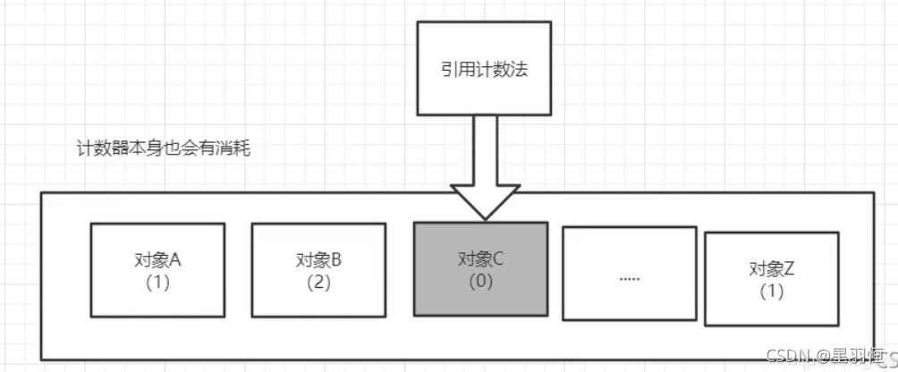

**优点：**

- 简单
- 计算代价分散
- “幽灵时间”短（幽灵时间指对象死亡到回收的这段时间，处于幽灵状态）

**缺点：**

- 不全面（容易漏掉循环引用的对象）
- 并发支持较弱
- 占用额外内存空间（计数器消耗）

 

### 13.2、**复制算法**

[GC算法-复制算法](https://www.cnblogs.com/hujingnb/p/12642079.html)

将可用内存划分为两块，每次只使用其中的一块，当半区内存用完了，仅将还存活的对象复制到另外一块上面，然后就把原来整块内存空间一次性清理掉。

这样使得每次内存回收都是对整个半区的回收，内存分配时也就不用考虑内存碎片等复杂情况，只要移动堆顶指针，按顺序分配内存就行，实现简单，运行高效。

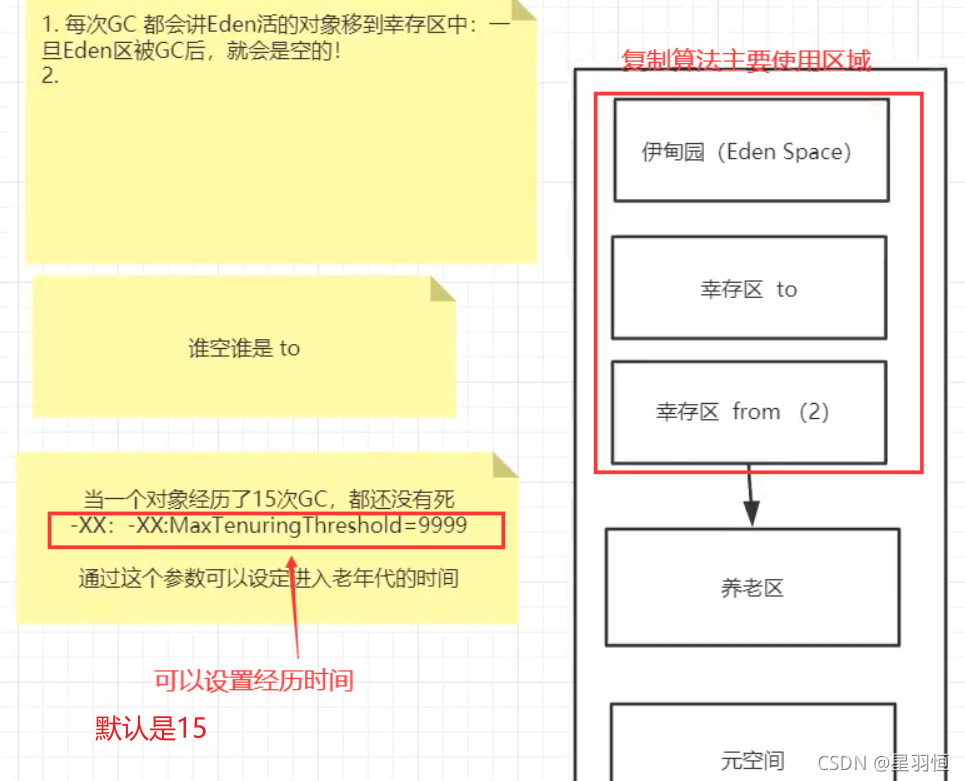 

一开始Eden区中绿色的部分表示存活对象，幸存区的from区也有部分对象（深绿色）。在经过一次GC后，将Eden区和from区的对象全部转移到to区，此时原来的from区为空，原来的to区有了对象。于是原来的from区变成现在的to区，原来的to区变成现在的from区。等到幸存区满了之后或是达到了指定的迭代次数，则将存活对象转移到养老区，或是丢弃。

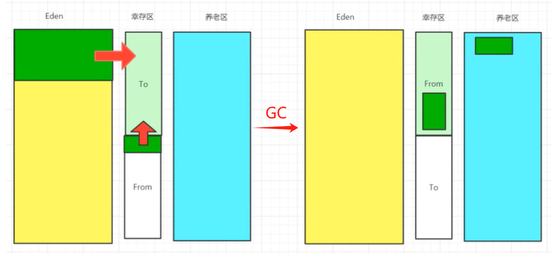


**优点：** 空间连续，没有内存碎片，运行效率高。

**缺点：** 每次运行，总有一半内存是空的（to区永远是空的），导致可使用的内存空间只有原来的一半。复制收集算法在对象存活率高的时候，效率有所下降。例如如果所有的对象都存活了下来，则需要将所有的对象从from区转移到to区，工作量很大。 **所以复制算法主要用在新生代幸存者区中的from区和to区，因为新生代对象存活率低。**

### 13.3、**标记清除算法**

为每个对象存储一个标记位，记录对象的状态（活着或是死亡）。分为两个阶段：

1. 标记阶段，这个阶段内，为每个对象更新标记位，检查对象是否死亡；
2. 清除阶段，该阶段对死亡的对象进行清除，执行 GC 操作。

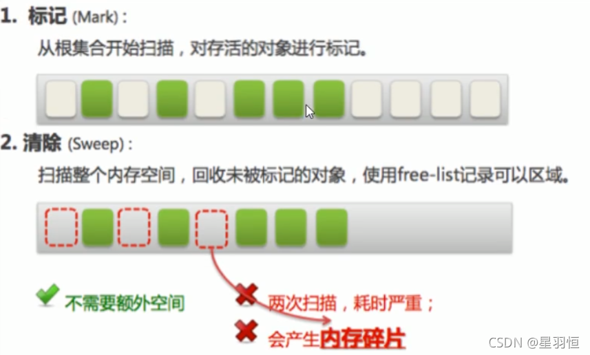

**优点：**

- 实现简单，标记―清除算法中每个活着的对象的引用只需要找到一个即可，找到一个就可以判断它为活的。
- 相比于引用计数法更全面，在指针操作上也没有太多的花销。更重要的是，这个算法并不移动对象的位置。

**缺点：**

- 需要进行两次扫描动作，标记活着的对象和清除死亡的对象，所以效率低。
- 死亡的对象被GC后，内存不连续，会有内存碎片，GC的次数越多碎片越严重(对象在内存中定位较为麻烦)

### 13.4、**标记压缩算法** 

对标记清除算法的再优化，虽然我们没办法解决扫描问题，但可以解决内存碎片问题。可以再进行一次扫描，将存活的对象都移至同一端，剩下的就是连续的空白。但缺点是又多了一次扫描。

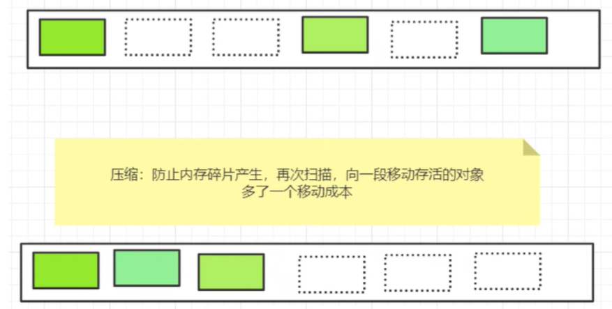 

### 13.5、标记清除压缩算法

 先标记清除几次再进行压缩，等碎片多了之后再压缩。

### **总结**

1. **内存效率（时间复杂度）：**复制算法 > 标记清除 >标记压缩
2. **内存整齐度：**复制算法=标记压缩>标记清除
3. **内存利用率：** 标记压缩=标记清除 > 复制算法
4. **分代收集算法（JVM调优）**： **没有最好的算法，只有最合适的**
  - 年轻代 ----- 存活率低，复制算法
  - 老年代 ----- 存活率高， 标记清除与标记压缩混合实现


### **面试题常问**

- jvm的内存模型和分区，详细到每个区放什么？
- 堆里面的分区有哪些？Eden，from，to，老年区，说说他们的特点。
- GC算法有哪些？ 标记清除法，标记压缩，复制算法，引用计数器。怎么用？
- 轻GC和重GC分别在什么时候发生


1. JMM

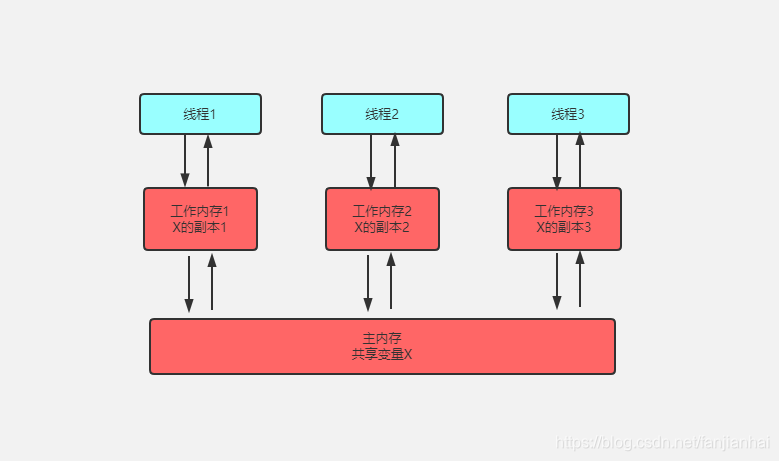

- Java Memory Model: Java内存模型 -- 抽象概念， 理论
- 定义了线程工作内存和主内存之间的抽象关系
  - 线程之间的共享变量存储在主内存中 ----MAIN MEMORY
  - 每个线程都有一个私有的本地内存 ---- LOCAL MEMORY
- 与并发相关


16. OOM的种类和原因

- java.lang.OutOfMemoryError
- 内存泄漏（memory leak） 是指程序中一动态分配的堆内存由于某种原因程序未释放，造成系统内存的浪费，导致程序运行减慢甚至系统奔溃等严重后果
- 内存溢出（out of memory）是指程序申请内存时， 没有足够的内存供申请者使用，说白就是内存不够用，此时就会报错OOM,即所谓的内存溢出
- OOM种类和原因
  - java堆溢出 ---- 既然堆是存放实例对象的，那就无限创建实例对象
  - 虚拟机栈溢出 ----- 虚拟机栈描述的是java方法执行的内存模型， 每个方法在执行的时候都会创建一个栈帧用于存储局部变量表，操作数栈、动态链接、方法出口等信息，本地方法栈和虚拟栈的区别是，虚拟机栈为虚拟机运行java方法服务，而本地方法栈为虚拟机提供native方法服务；在单线程的操作中，无论是由于栈帧太大，还是虚拟栈空间太小，当占空间无法分配时，虚拟机抛出的都是StackOverflowError，而不会得到OutOfMemoryError异常，在多线程情况下，则会抛出OutOfMemoryError异常
  - 本地方法栈溢出！
  - 方法区和运行时常量池溢出 - java堆和方法区： java堆区主要存放对象实例和数组等，方法区保存类信息，静态变量等等，运行时常量也是方法区的一部分， 这两块区域是线程共享的区域，只会抛出OutOfMemeryError。
  - 本机内存直接溢出 -- NIO有关（New input/Output）,引入了一种基于通道与缓存区的I/O方式，可是native函数库直接分配堆外内存， 然后通过一个存储在java堆中的对象作为这块内存的应用进行操作。这样能在一些场景中显著提高性能，因为避免了再Java堆和Native堆中来回复制数据

	1. 百度
