#2、快速入门


## 2.1 引入JavaScript

方式一：直接写在html中的 <script>标签中

```html
<!--这里的type可以省略，默认的就是type="text/javascript"
	<script>标签可以写在任意位置
-->
<script type="text/javascript">
    alert('hello world');
</script>
```

方式二：外联方式

新建一个文件夹为 js，在其中新建一个 firstJS.js文件

```javascript
//firstJS.js
alert('hello world');
```

在html文档中引用外部js文档

```html
<!--注意！！
	这里的script标签千万不能是自闭和的！！！
	必须是成对出现的！
-->
script src="js/firstJS.js"></script>
```


## 2.2 基本语法入门

首先将版本设置为 ECMAScript 6，idea默认的是5.1

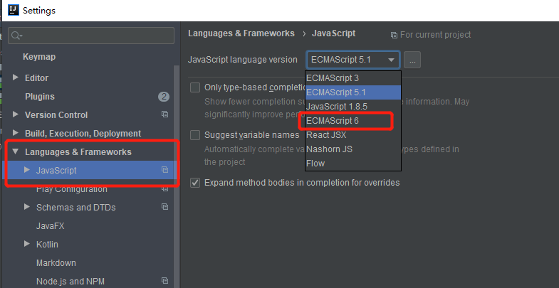

```html
<script>
    //1.定义变量   变量类型  变量名 =变量值;
    //所有的类型都是var
    var name="yyl";
    var score=71;

    //2.条件控制
    if(score>60 && score<70){
        alert("60~70");
    }else if(score>70 && score<80){
        alert("70~80");
    }else{
        alert("other")
    }

    //console.log(score)在浏览器的控制台打印变量
    //在控制台输出时，可以直接写变量名、字符等等，就不用每次打console.log()啦
</script>
```


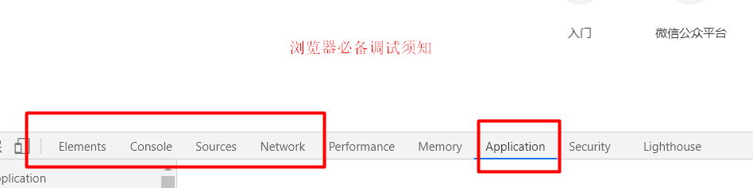

## 2.3 数据类型

数值、文本、图形、音频、视频...

==变量==

所有的变量类型都是var

变量名不能以数字开头，但是可以以下划线或者$开头

==number==

js不区分小数和整数，都是Number

```javascript
123   	//整数123
123.1 	//浮点数123.1
1.123e3 //科学计数法 1123
-99   	//负数
NaN 	//not a number
Infinity //表示无限大
```

==字符串==

```js
'abc'
"abc"
```

==布尔值==

```js
true
false
```

==逻辑运算符==

```js
&&  //与
||	//或
!  	//非
```

==比较运算符（重要）==

```js
=   //赋值
==  //等于。值一样但类型不一样也为true
=== //绝对等于。必须值一样并且类型一样才是true    
```

这是js的一个缺陷，坚持不要使用 ==

须知：

- NaN===NaN 返回值为 false 。NaN与所有的数值都不相等，包括它自己
- 只能通过isNaN(NaN) 来判断某个数是不是NaN

浮点数问题：

```js
1/3===(1-2/3) //false。存在精盾损失的问题

Math.abs(1/3-(1-2/3))<0.00000001 //true。通过这种方式来判断两个数是否相等
```

尽量避免使用浮点数进行运算，存在精度问题！

==null和undefined==

- null 空
- undefined 未定义

==数组==

java的数组中存放的必须是一系列相同类型的元素，js不需要

```js
//为了保证代码的可读性，尽量使用 []
var arr=[1,2,3,"hello",null,true]; //在js中合法的

new Array(1,2,3,"hello",null,true);//在java中非法的
```

取数组下标的时候如果越界了会输出

```js
undefined //比如输出arr[10]
```

==对象==

对象是大括号，数组是中括号

```js
//Person person=new Person(1,2,3,);
//每个属性之间使用逗号隔开，最后一个属性不需要添加逗号
var Person={
    name:"yyl",
    age:20,
    tags:['js','java']
}
-------------------------
> Person.tags[0]
< "js"
> Person.age
< 20    
```

## 2.4、严格检查格式

```html
<!DOCTYPE html>
<html lang="en">
<head>
    <meta charset="UTF-8">
    <title>Title</title>
    <!--
    前提：IDEA需要设置支持ES6语法
        'use strict';严格检查模式，预防JavaScript的随意性导致产生的一些问题
        必须写在JavaScript的第一行！
        局部变量建议都使用let去定义~
		var定义的是全局变量
		局部变量建议都用let定义
    -->
    <script>
        'use strict';
        //全局变量
         let i=1
        //ES6 let
    </script>
</head>
<body>

</body>
</html>
```

# 3、数据类型

## 3.1、字符串

1、正常字符串我们使用 单引号，或者双引号包裹
2、注意转义字符 \

```
\'
\n
\t
\u4e2d    \u##### Unicode字符

\x41	Ascall字符

```

3、多行字符串编写

```js
//tab 上面 esc下面
        var msg =
            `hello
            world
            你好呀
            nihao
            `
```

4、模板字符串

```js
//tab 上面 esc下面
let name = 'Tom';
let age = 3;
var msg = `你好，${name}`
```

5、字符串长度

```
str.length
```

6、字符串的可变性：**不可变**  

后期的赋值并不管用，一开始就赋值好了

 

7、大小写转换

```js
//注意，这里是方法，不是属性了
student.toUpperCase();
STUDENT.toLowerCase();
```

8、student.indexof(‘t’) 

9、substring，从0开始

```
[)
student.substring(1)//从第一个字符串截取到最后一个字符串
student.substring(1,3)//[1,3)

```
## 3.2、数组

**Array可以包含任意的数据类型**

```JS
var arr = [1,2,3,4,5,6];//通过下标取值和赋值，0开始
```

### 1、长度

```JS
arr.length
```

注意：假如给arr.lennth赋值，数组大小就会发生变化~，如果赋值过小，元素就会丢失

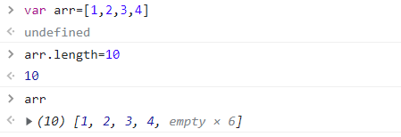

### 2、indexOf

获得下标索引

```
arr.indexOf
```

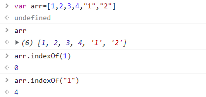

注意，字符串 "1" 和普通的 1 是不同的

### **3、slice（）**

截取Array的一部分，返回的一个新数组，类似于String中substring

```
slice()
```

### 4、push()，pop()尾部

```
push：压入新元素到尾部
pop：弹出尾部的一个元素
```

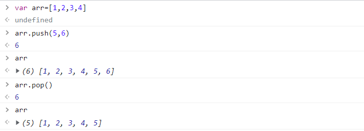

### **5、unshift(),shift() 头部**

```
unshift：压入到头部
shift：弹出头部的一个元素
```

###  6、排序sort()

```
(3)["B","C","A"]
arr.sort()
(3)["A","B","C"]
```

### 7、元素反转reverse()

```
(3)["A","B","C"]
arr.reverse()
(3)["C","B","A"]
```

### **8、concat()** 

```js
var arr=[1,2,3,4]
undefined
arr.concat(5,6,"a")
(7) [1, 2, 3, 4, 5, 6, 'a']
arr
(4) [1, 2, 3, 4]
```

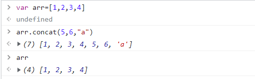

注意：concat()并没有修改数组，只是会返回一个新的数组

###  9、join

连接符join 打印拼接数组，使用特定的字符串连接 

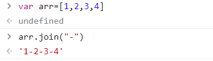


### 10、多维数组

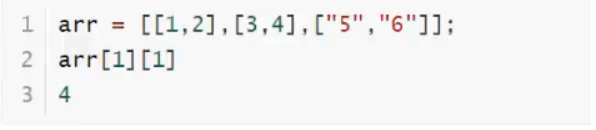 


## 3.3、对象

对象用大括号{ } 包裹

**JavaScript中的所有的键都是字符串，值是任意的对象**

若干个键值对

```js
var 对象名{
    属性名：属性值,
    属性名：属性值,
    属性名：属性值,
    属性名：属性值 //最后一个不需要逗号
}

var people = {
	name:"kuangshen",
    email:"123e21@qq.com"
	age:3
}
```


### 1、对象赋值

```js
person.name = "zhanga"
person.age = 5
```

### 1、访问对象属性

```js
objectName.property           // person.age
objectName["property"]       // person["age"]
```

### 2、使用一个不存在的对象属性不会报错

```js
person.haha
undefined
```

### 3、动态的删减delete

通过delete删除对象的属性


### 4、动态的添加

直接给新的属性添加值即可
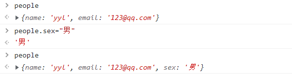

### 5、判断属性值是否在这个对象中！xxx in xxx

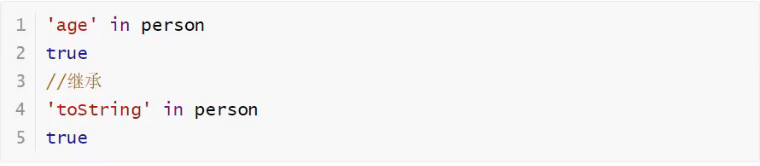

### 6、hasOwnProperty()

判断一个属性是否是这个对象自身拥有的 
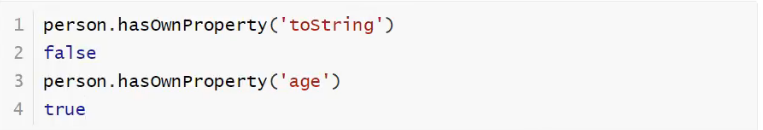

## 3.4、流程控制

#### if判断

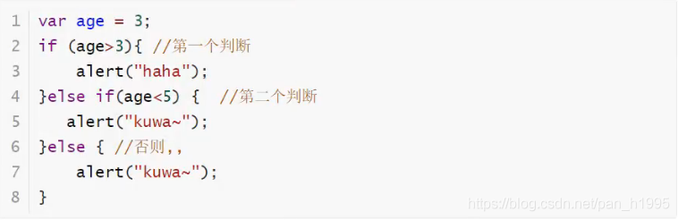

#### while循环，避免程序死循环

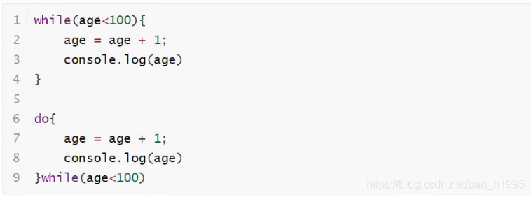

#### for循环

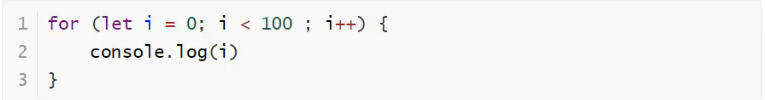

#### forEach循环

> ES5.1特性

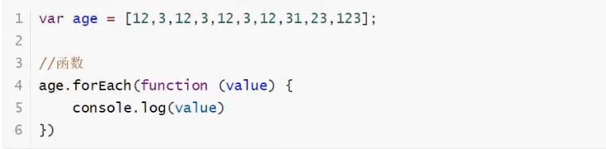

#### for …in-------下标

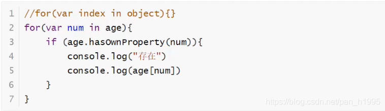

## 3.5、Map和Set

### Map

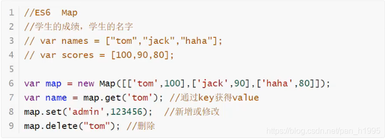

### Set：无序不重复的集合


## 3.6、iterator

> es6新特性

作业：使用iterator来遍历迭代我们Map，Set！
遍历数组

遍历Map

遍历set


# 4、函数

## 4.1、定义函数

### 定义方式一

绝对值函数

```js
function abs2(x,a,b){
    if(typeof x!='number'){
        throw "NOT A NUMBER"
    }else if(x>0){
        return x;
    }else if(x<0){
        return -x;
    }
}
```

一旦执行到return代表函数结束，返回结果！
如果没有执行return，函数执行完也会返回结果，结果就是undefined

### 定义方式二

```js
var abs=function(x){
    if(typeof x!='number'){
        throw "NOT A NUMBER"
    }else if(x>0){
        return x;
    }else if(x<0){
        return -x;
    }
}
```

function(x){…}这是一个匿名函数。但是可以吧结果赋值给abs，通过abs就可以调用函数！
方式一和方式二等价！

### 调用函数

```js
abs(10)//10
abs(-10) //10
```

参数问题：javaScript可以传任意个参数，也可以不传递参数~
参数进来是否存在问题？
假设不存在参数，如何规避？


```js
var abs=function(x){
    //手动抛出异常来判断
    if(typeof x!='number'){
        throw "NOT A NUMBER"
    }else{
        console.log("yes,number!")
    }
}
```

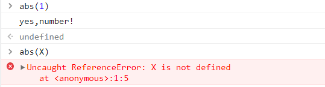

### arguments

arguments是一个JS免费赠送的关键字；
代表，传递进来的所有参数，是一个数组！

```js
var abs=function(x){

    for(var i=0;i<arguments.length;i++){
        console.log(arguments[i]);
    }
    if(typeof x!='number'){
        throw "NOT A NUMBER"
    }else if(x>0){
        return x;
    }else if(x<0){
        return -x;
    }
}
```

**我们可以使用arguments来判断一个函数输入了几个参数，从而根据参数数量来选择不同的执行方法**


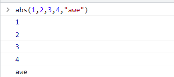


问题：arguments包含所有的参数，我们有时候想使用多余的参数来进行附加操作。需要排除已有参数~

### rest

```js
if (arguments.length>2){
    for(var i = 2;i<arguments.length;i++){
        //。。。。。
    }
} 
```

ES6引入的新特性，获取除了已经定义的参数之外的所有参数…

```js
function abc(a,b,...rest){
     console.log("a=>"+a);
     console.log("b=>"+b);
     console.log(rest);

 }
```

rest参数只能写在最后面，必须用…标识。

## 4.2、变量的作用域（暂时没看）

在JavaScript中，var定义变量实际上是有作用域的。

- 假设在函数体中声明，则在函数外不可以使用（一定要实现的话可以研究一下**闭包**）

```js
function a() {
    var x = 1;
    x = x + 1;
}
x = x +2;// Uncaught ReferenceError: x is not defined

12345
```

- 如果两个函数使用了相同的变量名，只要在函数内部就不冲突。

```js
function a() {
    var x = 1;
    x = x + 1;
}

function b() {
    var x = 'a';
    x =x + 1;
}

123456789
```

- 内部函数刻意访问外部函数的成员，反之则不行

```js
function c() {
    var x = 1;

    function d() {
        var y = x + 1;
    }
    var z = y + 1;//Uncaught ReferenceError: y is not defined
}

12345678
```

- 假设内部函数和外部函数的变量重名

```js
function c() {
    var x = 1;

    function d() {
        var x = 'a';
        console.log('inner:'+x);//outer:a
    }
    console.log('outer:'+x);//outer:1
    d();
}
c();

```

假设在JavaScript中函数查找变量从自身函数开始，由“内”向“外”查找，假设外部存在这个同名的函数变量，则内部函数会屏蔽外部函数的变量。

- 提升变量的作用域

```
function a() {
    var x = 'x' +y; //xundefined
    console.log(x);
    var y = "y";
}
a();

123456
```

结果：//xundefined

说明：JavaScript执行引擎，自动提升了y的声明，但是不会提升y变量的赋值；

```
function b() {
    var y;
    var x = 'x' +y; //xundefined
    console.log(x);
    var y = "y";

}
b()

12345678
```

这个是在JavaScript建立之初就存在的特性。养成规范：**所有的变量定义都放在函数的头部**，不要乱放，便于代码维护；

```
function b() {
    var x = 1,
    y = x + 1,
    a,z,d;  //undefined
    
    //之后可以随意用

}

12345678
```

> **全局函数**

```
//全局变量
x = 1 ;

function a() {
    console.log(x);
}
a();
console.log(x);

12345678
```

- 全局对象

```
var x = 'xxx';
alert(x); 
alert(window.x); //默认所有的全局变量，都会自动绑定在window对象下

123
```

alert()这个函数本身也是一个**window**对象

```
var x = 'xxx';

window.alert(x);

var old_alert= window.alert;

//old_alert(x); 使用old_alert(x)也可以成功输出

window.alert(123);

window.alert = function () {

}
window.alert(123); //发现alert失效了

window.alert =  old_alert;//恢复

window.alert(456);

123456789101112131415161718
```

JavaScript实际上只有一个全局作用域，任何变量（函数也可以视为变量），假设没有在函数作用范围内找到，就会向外查找，如果在全局作用域都没有找到，就会报错**RefrenceError**

> 规范

由于我们所有的全局变量都会绑定到window上，如果不同的js文件，使用了相同的全局变量，就会发生冲突，怎么减少冲突？

```
var jackApp = {};//唯一全局变量

jackApp.name = 'yangdi';//定义全局变量

jackApp.add = function (a,b) {
    return a + b;
}

1234567
```

将自己的代码全部放入自己定义的唯一空间名字中，降低全局命名冲突的问题。

> 局部作用域

```
function aaa() {
    for (var i = 0; i < 100; i++) {
        console.log(i);
    }
    console.log(i+1);//101 发现问题i出了for循环的作用域还可以使用
}

123456
```

ES6关键字 **let** ，去定义局部作用域的变量；

```
function bbb() {
    for (let i = 0; i < 100; i++) {
        console.log(i);
    }
    console.log(i+1);// Uncaught ReferenceError: i is not defined
}

123456
```

**建议以后使用let去定义局部作用域的变量**

> 常量 const

在ES6之前，怎么定义常量：只有全部用大写字母命名的变量就是常量；

```
var PI = '3.14';
console.log(PI);
PI = '123';  //可以随意修改这个常量
console.log(PI);

1234
```

在ES6中引入了关键字**const**

```
const PI = 3.14; //只读变量
console.log(PI);
PI = 5 ;
console.log(PI);// TypeError: Assignment to constant variable.

```

## 4.3、方法

### 定义方法

- 就是把函数放在对象的里面，对象里只有两个东西：属性和方法

```js
var zhangsan = {
    name : '张三',
    birth : 2000,
    age : function () {
        let now = new Date().getFullYear();
        return now - this.birth;
    }
}
zhangsan.age();
//属性
zhangsan.name
//方法，一定要带括号（）
zhangsan.age()
```

this.代表着什么？拆开上面的代码看看

```js
function getAge() {
    let now = new Date().getFullYear();
    return now - this.birth;
}

var zhangsan = {
    name : '张三',
    birth : 2000,
    age : getAge
}
//zhangsan.age() 可以·
//getAge()  NaN window 如果直接在控制台输入getAge()，意为window对象调用的，但是window对象没有age属性，所以输出为NAN
```

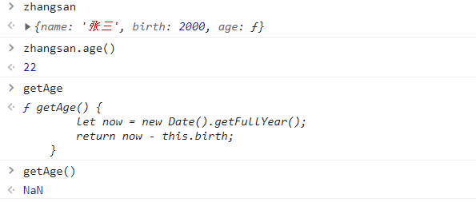

this是无法指向的，是默认指向**调用它的那个对象**

### apply

带点反射的意思

在JavaScript中可以使用apply控制this指向

```js
function getAge() {
    var now = new Date().getFullYear();
    return now - this.birth;
}

var yyl={
    name:'yangyulin',
    birth:2020,
    age:getAge
}

var zhangsan = {
    name : '张三',
    birth : 2000,
    age : getAge
}
zhangsan.age();

getAge.apply(zhangsan,[]); //this指向了zhangsan，参数为空
```

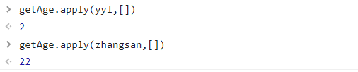

# 5、对象

- typeof返回结果

| 类型       | 返回值  | 类型                   | 返回值    |
| ---------- | ------- | ---------------------- | --------- |
| 数字类型   | number  | null                   | object    |
| 字符串类型 | string  | undefined              | unfefined |
| 布尔类型   | boolean | 函数                   | function  |
| 数组       | object  | 核心对象               | function  |
| 对象       | object  | 浏览器对象模型中的方法 | object    |

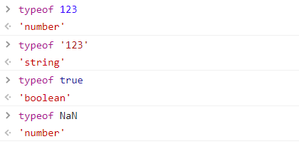

## 5.1、Date

- **常用方法**

```js
var data = new Date();
data.getFullYear();//年份
data.getMonth();//月份 0~11
data.getDate();//天，也就是几号
data.getDay();//星期几
data.getHours();//小时
data.getMinutes();//分钟
data.getSeconds();//秒
data.getTime();//时间戳，从1970年1月1日到目前为止经过的毫秒
console.log(data = new Date(1616589902676));//时间戳转为标准时间
```

- **转换**

```js
Wed Mar 24 2021 20:45:02 GMT+0800 (中国标准时间)
now.toLocaleDateString(); //转换为本地标准时间 "2021/3/24"
now.toGMTString();  //调用方法
//"Wed, 24 Mar 2021 12:45:02 GMT
```

## 5.2、JSON

> 什么是JSON

通过后端给前端传一个json，前端再解析

早期所有数据传输习惯使用XML文件！

- [JSON](https://baike.baidu.com/item/JSON)([JavaScript](https://baike.baidu.com/item/JavaScript) Object Notation, JS 对象简谱) 是一种轻量级的数据交换格式。
- 简洁和清晰的层次结构使得 JSON 成为理想的数据交换语言。
- 易于人阅读和编写，同时也易于机器解析和生成，并有效地提升网络传输效率。

在JavaScript中一切皆为对象，任何JavaScript支持的类型都可以用JSON表示；如number,string…

任何js支持的类型都可以用json来表示

**格式：**

- 对象都用{}
- 数组都用[]
- 所有的键值对都是用 key：value

```js
var user = {
    name:'zhangsan',
    age:3,
    sex:'男'
}
//对象转化为json字符串  {"name":"zhangsan","age":3,"sex":"男"}
var jsonUser = JSON.stringify(user);

console.log(jsonUser);
//转换字符串为对象
var obj = JSON.parse('{"name":"zhangsan","age":3,"sex":"男"}');
//{name: "zhangsan", age: 3, sex: "男"}
```

**JSON和对象的区别**

```js
var obj = {a:'hello',b:'hellob'};
var json = '{"a"："hello","b":"hellob"}'
```


```js
var user={
    name:'yangyulin',
    birth:2020,
    sex:'男'
}

var jsonUser = JSON.stringify(user);//将对象转化为json字符串，jsonUser是一个String
var objUser = JSON.parse(jsonUser); //解析json字符串，objUser是一个Object对象
```

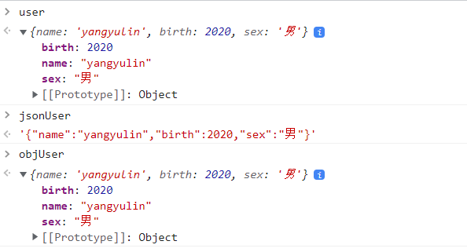

## 5.3、Ajax

- 原生的js写法 xhr异步请求
- jQuery封装好的方法 $("#name").ajax("")
- axios请求

# 6、面向对象编程

JavaScript、Java、c#…面向对象编程；JavaScript有何区别

- 类：模板
- 对象：具体的实例

在JavaScript这个需要大家换一下思维方式

### 原型：

```js
<script>

    var student={
        name:'student',
        birth:2020,
        sex:'男',
        run:function (){
            console.log(this.name+"is running...")
        }
    }

    var xiaoming={
        name:'xiaoming'
    }

    //指明xiaoming的原型是student，也就可以理解为xiaoming继承了student
    xiaoming.__proto__=student;

</script>
```

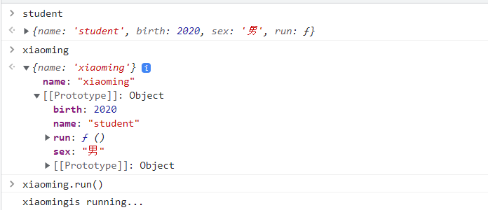

```js

function Student(name) {
    this.name = name;
}

//给Student新增一个方法，在原型上加
Student.prototype.hello = function () {
    alert("hello");
};

```

### class继承

**class**关键字，是在ES6引入的

1、定义一个类，属性、方法

```js
//定义一个学生的类
class Student{
    //构造器
    constructor(name) {
        this.name = name;
    }
    hello (){
        alert("hello");
    }
}

var xaioming = new Student("xiaoming");
var xaiohong = new Student("xiaohong");
xaioming.hello();

```

2、继承

```js
    //定义一个学生类
    class Student{
        constructor(name) {
            this.name=name;
        }
        hello(){
            alert('hello');
        }
    }
    
    class pupil extends Student{
        constructor(name,grade) {
            //实现父类的一个方法
            super(name);
            this.grade=grade;
        }
        myGrade(){
            alert("我是一名小学生，我叫"+this.name+"今年"+this.grade+"年级了")
        }
        
    }
    var xiaoming = new Student('小明');
    var xiaohong = new pupil("小红",3);

```

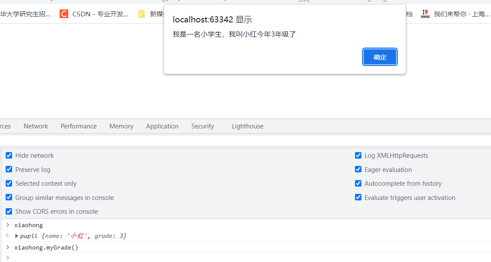

> 原型链

__ proto __

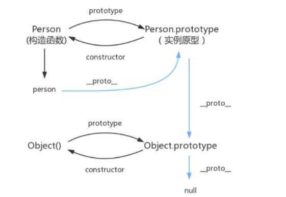

# 7、操作BOM对象

> **浏览器介绍**

JavaScript和浏览器之间的关系？

JavaScript诞生就是为了能够在让它在浏览器中运行

BOM：浏览器对象模型

- IE 6-11（Edge）
- Chrome
- Safari
- FireFox
- Opera

三方浏览器：QQ浏览器，360浏览器，Uc浏览器等

### **window**

window代表浏览器窗口

```js
window.alert("坚持")
undefined
window.innerHeight
760
window.innerWidth
491
window.outerHeight
864
window.outerWidth
1536
//通过window获得浏览器窗口大小

window.open() - 打开新窗口
window.close() - 关闭当前窗口
window.moveTo() -移动当前窗口
window.resizeTo() -重新调整当前窗口
```

### Navigator

Navigator,封装了浏览器的信息

```js
navigator.appName
"Netscape"
navigator.appVersion
"5.0 (Windows NT 10.0; WOW64) AppleWebKit/537.36 (KHTML, like Gecko) Chrome/89.0.4389.82 Safari/537.36"
navigator.userAgent
"Mozilla/5.0 (Windows NT 10.0; WOW64) AppleWebKit/537.36 (KHTML, like Gecko) Chrome/89.0.4389.82 Safari/537.36"
navigator.platform
"Win32"
```

大多数时候，我们不会使用navigator对象，因为会被人为修改！

不建议使用这些属性来判断和编写代码

### **screen**

代表屏幕尺寸

```js
screen.width
1536
screen.height
864
```

### location(重要)

**window.location 对象可用于获取当前页面地址（URL）并把浏览器重定向到新页面。**  

Window Location
window.location 对象可不带 window 前缀书写。

一些例子：

```js
window.location.href 返回当前页面的 href (URL)
window.location.hostname 返回 web 主机的域名
window.location.pathname 返回当前页面的路径或文件名
window.location.protocol 返回使用的 web 协议（http: 或 https:）
window.location.assign 加载新文档
```

location代表当前页面的URL信息

```js
location.host   "www.baidu.com"  //主机
location.href   "https://www.baidu.com/"   //当前指向的位置
location.protocol   "https:"   //协议
location.reload()   //刷新网页
//设置新的地址
location.assign('https://www.kuangstudy.com/')
```

### document

- document代表当前的页面， HTML DOM文档树

```js
document.title
"百度一下，你就知道"
document.title=('无敌')
"无敌"
```

- 获取具体的文档树节点

  便可以动态的添加或删除节点，也就是动态的修改网页

```js
<dl id="app">
    <dt>javaSE</dt>
    <dt>javaEE</dt>
    <dt>javaME</dt>
</dl>

<script>
    var dl =  document.getElementById('app');
</script>
```

- 获取cookie

```js
document.cookie
"_uuid=ABB41E69-8A2D-5C9E-91F8-535FE6C5368696306infoc; buvid3=1E000DC4-7833-4DFC-9F80-ACB1E118A758138376infoc; sid=6m3ndo5f; CURRENT_FNVAL=80; blackside_state=1; rpdid=|(um|RYku~um0J'uY||)Y~Rul"
```

- 劫持cookie原理

www.taobao.com

```
<script src="aa.js"></script>
<!--恶意人员：获取你的cookie上传到他的服务器-->

```

服务器可以设置cookie：httpOnly

### history

代表浏览器的历史记录（不建议使用）

```
history.back()//后退
history.forward()//前

```

还有其他BOM命令可以自己查阅

### 弹出框

**JavaScript 有三种类型的弹出框：警告框、确认框和提示框。** 

#### 警告框

如果要确保信息传递给用户，通常会使用警告框。

当警告框弹出时，用户将需要单击“确定”来继续。

语法：

```js
window.alert("sometext");
```

`window.alert()` 方法可以不带 `window` 前缀来写。

#### 确认框

如果您希望用户验证或接受某个东西，则通常使用“确认”框。

当确认框弹出时，用户将不得不单击“确定”或“取消”来继续进行。

如果用户单击“确定”，该框返回 `true`。如果用户单击“取消”，该框返回 `false`。

语法：

```js
window.confirm("sometext");
```

实例：

```js
<body>

    <button onclick="myFunction()">试一试</button>

    <p id="demo"></p>

    <script>
        function myFunction(){
            var txt;
            if(window.confirm("请点击")){
                txt="您点击了确认";
            }else{
                txt="您点击了取消";
            }

            document.getElementById("demo").innerHTML=txt;
        }
    </script>

</body>
```

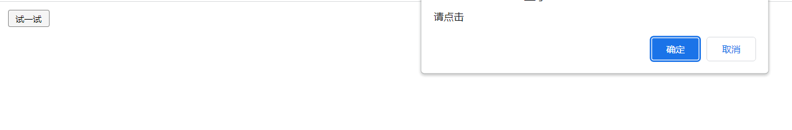

#### 提示框

如果您希望用户在进入页面前输入值，通常会使用提示框。

当提示框弹出时，用户将不得不输入值后单击“确定”或点击“取消”来继续进行。

如果用户单击“确定”，该框返回输入值。如果用户单击“取消”，该框返回 `NULL`。

语法：

```js
window.prompt("sometext","defaultText");
```

`window.prompt()` 方法可以不带 `window` 前缀来编写。

实例：

```js
var person = prompt("请输入您的姓名", "比尔盖茨");
if (person != null) {
    document.getElementById("demo").innerHTML = "你好 " + person + "！今天过的怎么样？";
}
```


# 8、操作DOM对象（重点）

> **核心**

浏览器网页就是一个Dom树形结构

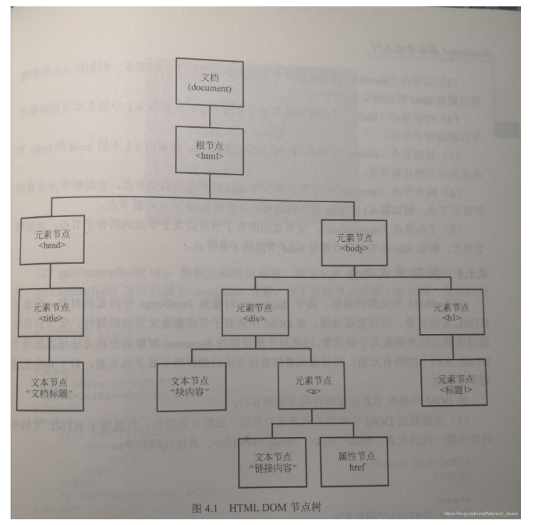

- 更新:更新Don节点
- 遍历Dom节点:得到Dom节点
- 删除:删除一个Dom节点
- 添加:添加一个新的的节点

要操作一个Dom节点,就必须先获得这个Dom节点

### 查找 HTML 元素

| 方法                                    | 描述                           |
| --------------------------------------- | ------------------------------ |
| document.getElementById(*id*)           | 通过元素 id 来查找元素         |
| document.getElementsByTagName(*name*)   | 通过标签名来查找元素，返回数组 |
| document.getElementsByClassName(*name*) | 通过类名来查找元素             |

### 改变 HTML 元素

| 方法                                       | 描述                   |
| ------------------------------------------ | ---------------------- |
| element.innerHTML = *new html content*     | 改变元素的 inner HTML  |
| element.attribute = *new value*            | 改变 HTML 元素的属性值 |
| element.setAttribute(*attribute*, *value*) | 改变 HTML 元素的属性值 |
| element.style.property = *new style*       | 改变 HTML 元素的样式   |

### 添加和删除元素

| 方法                              | 描述             |
| --------------------------------- | ---------------- |
| document.createElement(*element*) | 创建 HTML 元素   |
| document.removeChild(*element*)   | 删除 HTML 元素   |
| document.appendChild(*element*)   | 添加 HTML 元素   |
| document.replaceChild(*element*)  | 替换 HTML 元素   |
| document.write(*text*)            | 写入 HTML 输出流 |

### 添加事件处理程序

| 方法                                                     | 描述                            |
| -------------------------------------------------------- | ------------------------------- |
| document.getElementById(id).onclick = function(){*code*} | 向 onclick 事件添加事件处理程序 |

> **获得Dom节点**

```js
<body>
    <div id="father">
        <h1>h1标题</h1>
        <p id="p1">p1</p>
        <p class="p2">p2</p>
    </div>

    <script>
        var father = document.getElementById("father");
        var h1 = document.getElementsByName("h1");
		//只有根据id获取的元素才是唯一的，其余的都得到一个数组
        var p1 = document.getElementById("p1");
        var p2 = document.getElementsByClassName("p2");

        var children = father.children;//获取父节点下的所有节点
        father.lastChild;
        father.firstChild;

    </script>
</body>

```

这是原生代码,之后我们尽量都是用jQurey

> 更新节点

```js
<div id="d1"></div>

<script>
    var d1 = document.getElementById("d1");
</script>
```

操作文本:

- id1.innerText = “123” 修改文本的值
  “123”
- id1.innerHTML = ‘**126**’ 可以解析HTML文本标签
  “**126**”

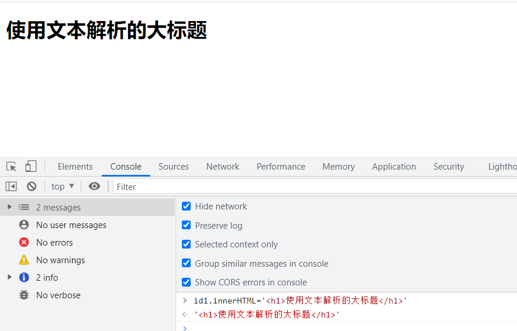


操作css

```js
id1.style.color = 'red'  //属性使用 字符串包裹

id1.style.fontFamily = '楷体'  //驼峰命名问题

id1.style.fontSize = "50px"
```

> **删除节点**

删除节点的步骤： 先获取父节点，通过父节点删除自己

```js
<div>
    <h1>标题一</h1>
    <p id='p1'>p1</p>
    <p class='p2'>p2</p>
</div>
<script>
    var self = document.getElementByID('p1');
    var father = p1.parentElement; //找到p1的父节点
    father.removechild(self) //通过父节点使用removechild删掉自己（只有标记为id选择器的节点才可以删除)
</script>
```

注意：删除多个节点是，children是时刻变化的，不能直接father.removechild(father.children[0])这样从第一个索引开始删

————————————————

> 插入节点

我们获得了某个Dom节点，假设这个Dom节点是空的，我们会通过intterHTML就可以增加一个元素，但是如果这个Dom节点已经存在元素了，我们就不能这样干了，**会产生覆盖！**

追加：

```java
<p id="js">JavaScript</p>

<div id="list">
    <p id="se">JavaSE</p>
    <p id="ee">JavaEE</p>
    <p id="me">JavaME</p>
</div>

<script>
    var js = document.getElementById("js");
    var list = document.getElementById("list")
    list.append(js); //把已经存在的dom节点追加到list节点后面

</script>
```

追加之后的效果：

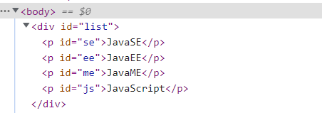


> 创建一个新的标签实现插入

```js
<script>
    var list = document.getElementById("list")
    var newP = document.createElement("p"); //创建一个p标签
    newP.id = 'newP';
    newP.innerText = 'sunwukong';
    list.appendChild(newP);

</script>
```

> 创建一个新的标签实现插入

```js
<script>
    var js = document.getElementById("js");//已经存在的节点
    var list = document.getElementById("list")
    list.append(js);
    var newP = document.createElement("p");//创建一个p标签
    newP.id = 'newP';
    newP.innerText = 'sunwukong';
    list.appendChild(newP);

    var myScript = document.createElement("script");//创建一个标签节点
	//万能方式添加属性
    myScript.setAttribute('type',"text/javascript");
    var body = document.getElementsByTagName("body");
    //body[0].setAttribute('style','backgroundColor = \'#32a356')
    //body[0].style.backgroundColor = '#32a356';

    //创建一个style标签
    var myStyle = document.createElement("style");
    myStyle.setAttribute('type','text/css');
    myStyle.innerText = 'body{background-color:#000000}';//设置标签内容
    document.getElementsByTagName('head')[0].append(myStyle);
</script>
```

> insertBefore

```js
  
<body>
	<p id="js">JavaScript</p>
    <div id="list">
        <p id="se">JavaSE</p>
        <p id="ee">JavaEE</p>
        <p id="me">JavaME</p>
    </div>

<script>
    let ee = document.getElementById('ee');
    let js = document.getElementById('js');
    let list = document.getElementById('list');

    // list: 要包含的节点 (谁在谁前面就把谁放到前面)
	//把js插入到ee的前面
    list.insertBefore(js,ee);
/*
JavaSE
JavaScript
JavaEE
JavaME
 */
</script>
</body>
```

# 9、操作表单(验证)

> 获得要提交的信息

```js
<form action="#" method="post">
    <p>
        <span>用户名：</span> 
	   <input type="text" id="user" name="username">
    </p>

    <p>
        <span>性别：</span>
        <input type="radio" name="sex" value="man" id="boy">男
        <input type="radio" name="sex" value="man" id="girl">女
    </p>

</form>

<script>
    var input_text = document.getElementById("user");
    var boy_radio = document.getElementById('boy');
    var girl_radio = document.getElementById('girl');
    input_text.value;  得到输出框的值
    input_text.value = '123'  //修改输入框的值

    //对于多选框单选框等固定的值，boy_redio.value只能取到当前的值
    boy_radio.checked;//查看返回的结果是否为true，如果为true则代表选中
    boy_radio.checked = true;//赋值

</script>
```

> 提交表单，MD5加密密码，表单优化

```js
<script src="https://cdn.bootcss.com/blueimp-md5/2.10.0/js/md5.min.js"></script>
<form action="#" method="post" onsubmit="aaa()">
    <p>
        <span>用户名：</span> <input type="text" id="username" name="username">
    </p>

    <p>
      <span>密码</span> <input type="password" id="password" >
    </p>
    <input type="hidden" id="md5_password" name="password">
<!--绑定事件  onclick 被点击   -->
    <button type="submit" onclick="aaa()">提交</button>
</form>

<script>
    function aaa() {
        var uname = document.getElementById('username');
        var psd = document.getElementById('password');
        var md5_psd = document.getElementById('md5_password');
        console.log(uname.value);
        psd.value = md5(psd.value);
        //md5_psd.value = md5(psd.value);
       //MD5算法 可以校验判断表单，true就是通过提交，false就是阻止提交
        return true;

    }
</script>
```

# 10、jQuery

```js
$(selector).action()
```

也就是选择某个DOM，当发生某事件时执行什么函数

**$就是jquery的缩写**

jQuery库，里面存在大量的javascript函数

### 获取jquery

- 可以导入jQuery在线引用地址 百度搜索CDN jquery
- https://www.jq22.com/cdn/

例如< script src=“http://libs.baidu.com/jquery/2.1.4/jquery.min.js”>< /script >

- 官网下载https://jquery.com/download/ 导入项目中

```html
<!DOCTYPE HTML PUBLIC "-//W3C//DTD HTML 4.01 Transitional//EN"
        "http://www.w3.org/TR/html4/loose.dtd">
<html>
<head>
    <title>Title</title>
    <script src="lib/jquery-3.6.0.min.js"></script>

</head>
<body>
<a href="#" id="text_jquery">点我</a>
<script>
    //公式：$(selector).action()
    //选择器就是CSS的选择器
    $('#text_jquery').click(function () {
        alert('1111');
    })
</script>

</body>
</html>
```

### 选择器

```js
<script>
    //原生js，选择器少，麻烦不好记
    //标签
    document.getElementsByTagName();
    //id
    document.getElementById();
    //类
    document.getElementsByClassName();

    //jQuery选择器 css里的选择器都能用
    $('p').click(); //标签选择器
    $('.class').click();//类选择器
    $('#id').click();//id选择器

</script>
```

文档工具站：https://jquery.cuishifeng.cn/

### 元素属性

```js
$("Element").attr(key)  //获取某一个元素的属性
$("Element").attr(key,value)  //给某一个元素设置属性

$('Element').text();//获取文本内容
$('Element').text('Hello China!');//设置文本内容

$('Element').html();//获取html内容
$('Element').html('<p>Hello World</p>');//设置html内容

$('Element').val()//获取文本框的值
$('Element').val('Hello China!')//设置文本框的值
```

### 事件

- 鼠标事件、键盘事件、其他事件

```js
<!DOCTYPE HTML PUBLIC "-//W3C//DTD HTML 4.01 Transitional//EN"
        "http://www.w3.org/TR/html4/loose.dtd">
<html>
<head>
    <title>Title</title>
    <script src="lib/jquery-3.6.0.min.js"></script>
    <style>
        #divMove{
            width: 500px;
            height: 500px;
            border: 1px solid red;
        }
    </style>
</head>
<body>
<!--要求：获取鼠标当前的一个坐标-->
mouse:<span id="mouseMove"></span>
<div id="divMove">
    在这里移动鼠标试试
</div>

<script>
    //当网页元素加载完毕后，响应事件
    //最开始我们用的是这种方法，但是太长了，便省略为了下面的方法
    $(document).ready(function (){
    		$('#divMove').mousemove(function (e){
            $('#mouseMove').text('x:'+e.pageX + '  y'+e.pageY)
	});
    
    //当鼠标指针在指定的元素中移动时，就会发生 mousemove 事件。
    $(function (){
        $('#divMove').mousemove(function (e){
            $('#mouseMove').text('x:'+e.pageX + '  y'+e.pageY)
        });
    });
</script>
</body>
</html>
```

### 操作Dom

```html
<!DOCTYPE html>
<html lang="en">
<head>
    <meta charset="UTF-8">
    <title>Title</title>
    <script src="js/jquery-3.5.1.js"></script>
</head>
<body>
<ul id="test-ul">
    <li id="js">JavaScript</li>
    <li name="JavaSE">JavaSE</li>
</ul>

<script>
    // 获得值
    $('#test-ul li[name=JavaSE]').text();
    // 设置值
    $('#test-ul li[name=JavaSE]').text('Python');

    // css 的操作
    $('#test-ul li[name=JavaSE]').css('color','red');

    // 元素的显示
    $('#test-ul li[name=JavaSE]').show();

    // 元素的隐藏
    $('#test-ul li[name=JavaSE]').hide();
</script>
</body>
</html>

<script>
// 获得值
$('#test-ul li[name=JavaSE]').text();
// 设置值
$('#test-ul li[name=JavaSE]').text('Python');

// css 的操作
$('#test-ul li[name=JavaSE]').css('color','red');

// 元素的显示
$('#test-ul li[name=JavaSE]').show();

// 元素的隐藏
$('#test-ul li[name=JavaSE]').hide();

</script>
</body>
</html>
```