# Redis入门

## Redis是什么

Redis（Remote Dictionary Server )，即远程字典服务，是一个开源的使用ANSI C语言编写、支持网络、可基于内存亦可持久化的日志型、Key-Value数据库，并提供多种语言的API。

[Redisopen in new window](https://redis.io/) （**RE**mote **DI**ctionary **S**erver）是一个基于 C 语言开发的开源 NoSQL 数据库（BSD 许可）。与传统数据库不同的是，Redis 的数据是保存在内存中的（内存数据库，支持持久化），因此读写速度非常快，被广泛应用于分布式缓存方向。并且，Redis 存储的是 KV 键值对数据。

## Redis能干嘛

- 内存存储、持久化，内存是断电即失的，所有持久化很重要（rdb、aof）
- 效率高，可以用于高速缓存
- 发布订阅系统
- 地图信息分析
- 计数器、计时器（浏览量）

## Redis特性

- 多样的数据类型
- 持久化
- 集群
- 事务

# linux安装redis

## 安装

[下载链接](http://download.redis.io/releases)

将下载好的文件上传至服务器`yangyulin/opt`目录下，并解压文件。

```shell
tar -zxvf redis-7.0.5.tar.gz
```

进入解压后的文件

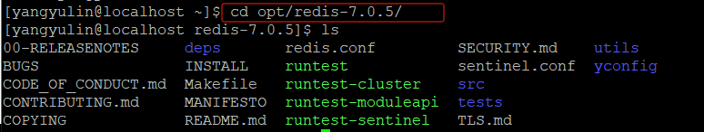 

在当前文件夹下执行`make`和`make install`命令（需要root权限）

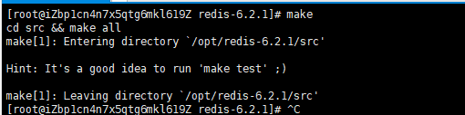 

 

redis安装后的默认安装路径为`/usr/local/bin`，进入当前文件夹，并在此文件夹下新建一个`yconfig`文件夹，将redis的配置文件`yangyulin/opt/redis-7.0.5/redis.conf`复制到`usr/local/bin/yconfig`文件夹下。之后我们会使用`yconfig/redis.conf`这个配置文件启动。

```shell
cp /opt/redis-7.0.5/redis.conf yconfig
```

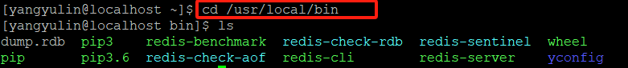 

然后我们进入`yconfig`文件夹，修改配置文件，设置redis为后台启动

```shell
vim redis.conf
```

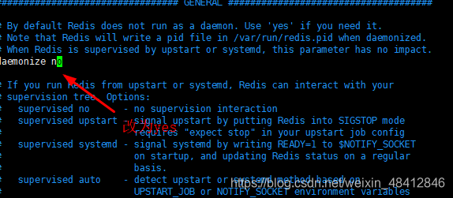 

保存并退出`:wq`

在使用的过程中我们为了防止某些错误，所以需要手动设置redis的日志文件。我们在`/home/yangyulin/opt/redis-7.0.5`目录下新建文件 `redis.log`

注意：这里没有设置redis.log在`usr/local/bin`目录下是因为这些文件操作需要root权限，导致我们没有办法使用普通用户启动redis。因为要写入日志。

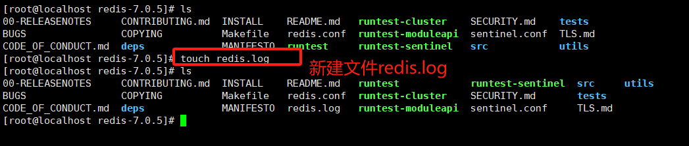

然后到`usr/local/bin/yconfig/redis.conf`文件中修改日志文件的路径

```shell
[root@localhost redis-7.0.5]# cd /usr/local/bin/yconfig
[root@localhost yconfig]# vim redis.conf
```

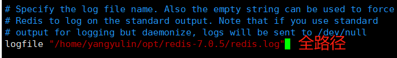 

同时修改文件的权限

```shell
chmod 777 /home/yangyulin/opt/redis-7.0.5/redis.log #所有人
```

## 启动

我们需要在`/usr/local/bin`目录下执行命令

```shell
redis-server yconfig/redis.conf
redis-cli -p 6379
```

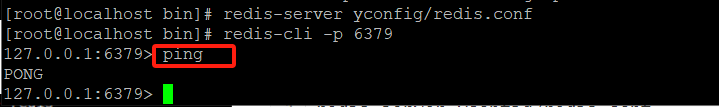 

此时我们可以打开另外一个会话，查看redis进程

```shell
ps -ef|grep redis
```

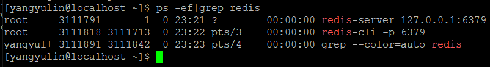 

关闭redis `shutdown`并`exit`

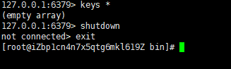 

## 测试性能

redis-benchmark是一个压力测试工具，官方自带的性能测试工具
redis-benchmark 命令参数

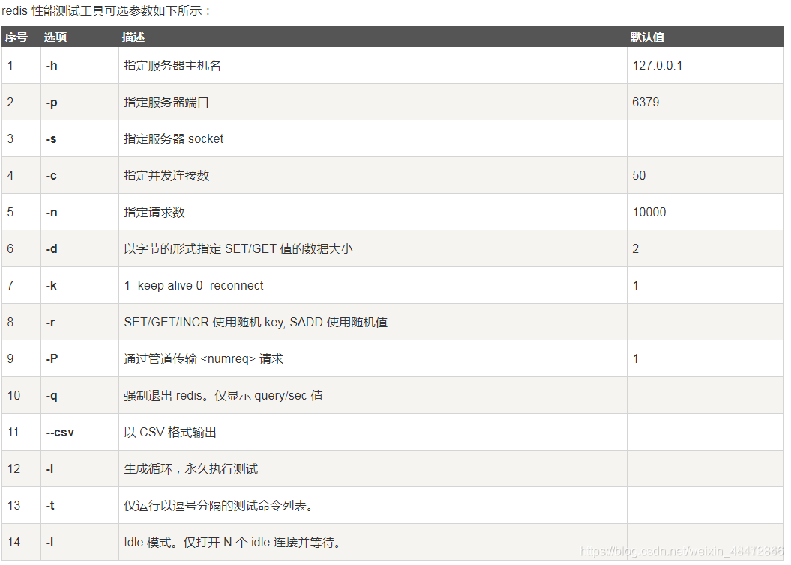 

我们来简单测试一下

```shell
#测试：100个并发，10万个请求
redis-benchmark -h localhost -p 6379 -c 100 -n 100000
```

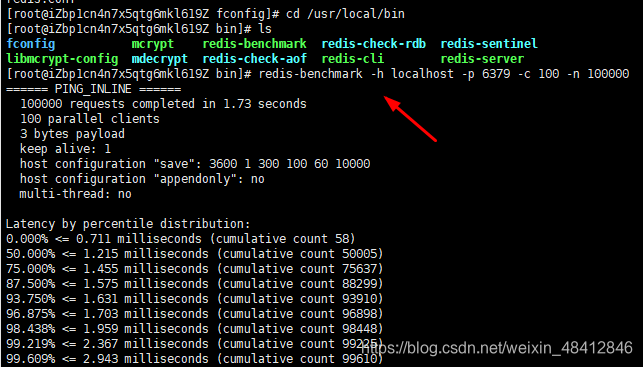 

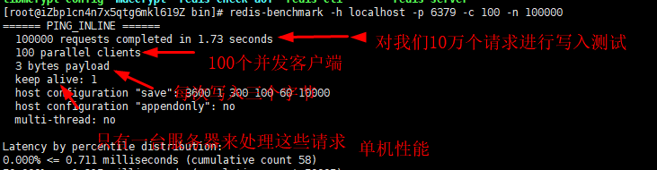 

# Redis基础知识

## 数据库

redis默认有16个数据库（可以在`redis.conf`中查看），默认使用的是第0个。
1.可以使用select 进行切换数据库

2.查看数据库大小
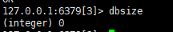

3.清空当前数据库

```
flushdb
```

4.清空全部数据库内容

```
flushall
```

## 单线程

redsi很快，redis基于内存操作，cpu不是redis性能瓶颈，redis的瓶颈是根据机器的内存和网络带宽，既然可以使用单线程来实现，就使用单线程。
redis是c语言写的，官方数据是100000+的QPS,这个不必同样使用key-value的Memecache差
redis为什么单线程还这么快

1. 误区一：高性能的服务器一定是多线程的？
2. 误区二：多线程一定比单线程高！

核心：redis将所有数据全部放在内存中，所以说使用单线程去操作效率高，假如使用多线程（则会因为cpu上下文切换导致耗时操作），对于内存系统来说，如果没有上下文切换效率是最高的，多次读写都是在一个cpu上的，在内存情况下，这个就是最佳方案！

Redis是开放源代码（BSD许可）的内存中数据结构存储，用作数据库，缓存和消息中间件MQ。Redis提供数据结构，例如字符串，哈希，列表，集合，带范围查询的排序集合，位图，超日志，地理空间索引和流。Redis具有内置的复制，Lua脚本，LRU驱逐，事务和不同级别的磁盘持久性，并通过Redis Sentinel和Redis Cluster自动分区提供了高可用性

> 为什么redis这么快？
>
> Redis 内部做了非常多的性能优化，比较重要的有下面 3 点：
>
> 1. Redis 基于==内存==，内存的访问速度比磁盘快很多；
> 2. Redis 基于 Reactor 模式设计开发了一套高效的事件处理模型，主要是单线程事件循环和 IO 多路复用（Redis 线程模式后面会详细介绍到）；
> 3. Redis 内置了多种优化过后的数据类型/结构实现，性能非常高。
> 4. Redis 通信协议实现简单且解析高效。

## redis-key

```shell
127.0.0.1:6379> flushall # 删除所有数据库中所有的key
OK
127.0.0.1:6379> clear
127.0.0.1:6379> set name yangyulin 
OK
127.0.0.1:6379> set age 24
OK
127.0.0.1:6379> keys *
1) "age"
2) "name"
127.0.0.1:6379> exists name
(integer) 1
127.0.0.1:6379> exists sex
(integer) 0
127.0.0.1:6379> expire name 10
(integer) 1
127.0.0.1:6379> ttl name
(integer) 6
127.0.0.1:6379> ttl name
(integer) -2
127.0.0.1:6379> get name
(nil)
127.0.0.1:6379> keys *
1) "age"
127.0.0.1:6379> move age 1 #移除age 后面的1为移除的数量

(integer) 1
127.0.0.1:6379> keys *
(empty array)
127.0.0.1:6379> set name yangyulin
OK
127.0.0.1:6379> type name #查看属性
string
```

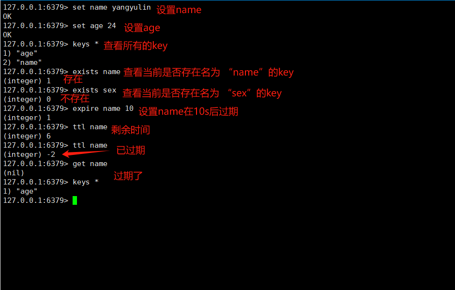 


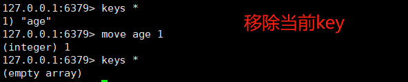 

后面不会的命令可以在官网查相关命令 [command](https://redis.io/docs/latest/commands/)
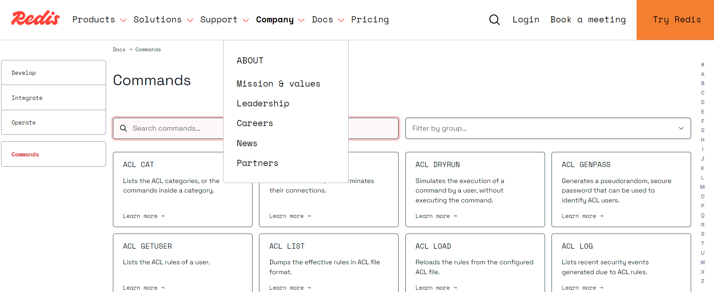 


# 五大基本类型

## 1、String

大多数时候我们都只用到`String`类型

### 基本使用

```shell
127.0.0.1:6379> keys * #查看所有的key
(empty array)
127.0.0.1:6379> set key1 v1 #设置key1，值为v1
OK
127.0.0.1:6379> get key1 #查看key1
"v1"
127.0.0.1:6379> keys * 
1) "key1"
127.0.0.1:6379> EXISTS key1 #查看是否存在名为key1的键
(integer) 1
127.0.0.1:6379> APPEND key1 "Hello" #字符串拼接，如果不存在，则新建值
(integer) 7
127.0.0.1:6379> get key1
"v1Hello"
127.0.0.1:6379> STRLEN key1 #返回长度
(integer) 7
127.0.0.1:6379> APPEND key1 ",yyl"
(integer) 11
127.0.0.1:6379> STRLEN key1
(integer) 11
127.0.0.1:6379> get key1
"v1Hello,yyl"
```

### 自增

```shell
127.0.0.1:6379> set views 0 #设置view的次数为0
OK
127.0.0.1:6379> get views #查看view
"0"
127.0.0.1:6379> incr views # 自增+1
(integer) 1
127.0.0.1:6379> incr views
(integer) 2
127.0.0.1:6379> get views
"2"
127.0.0.1:6379> decr views #自减 -1
(integer) 1
127.0.0.1:6379> decr views
(integer) 0
127.0.0.1:6379> get views
"0"
127.0.0.1:6379> incrby views 10 # 自增 +10每次
(integer) 10
127.0.0.1:6379> incrby views 10
(integer) 20
127.0.0.1:6379> get views
"20"
127.0.0.1:6379> decrby views 5 #自减 -5每次
(integer) 15
127.0.0.1:6379> decrby views 5
(integer) 10
127.0.0.1:6379> get views
"10"
```

### 截取字符串`getrange`

```shell
127.0.0.1:6379> clear
127.0.0.1:6379> keys *
(empty array)
127.0.0.1:6379> set key1 "helloworld"
OK
127.0.0.1:6379> get key1
"helloworld"
127.0.0.1:6379> getrange key1 0 2  #截取[0,2]字符串
"hel"
127.0.0.1:6379> getrange key1 0 -1 #获取全部字符串
"helloworld"
```

### 替换字符串`setrange`

```shell
127.0.0.1:6379> set key2 abcdefg
OK
127.0.0.1:6379> get key2
"abcdefg"
127.0.0.1:6379> setrange key2 1 xx #替换从索引为1开始往后的字符为 xx
(integer) 7
127.0.0.1:6379> get key2
"axxdefg"
```

### 设置过期时间`setex`

### 当key不存在时才设置`setnx`

```shell
127.0.0.1:6379> setex key3 30 "hello" # 设置key3，值为"hello" 并在30s后过期
OK #
127.0.0.1:6379> ttl key3 #查询key3的剩余时间
(integer) 17 #17s
127.0.0.1:6379> setnx mykey "redis" #如果mykey存在，则创建失败。否则创建mykey，值为redis。（在分布式锁中常用）
(integer) 1 #返回值为1，说明当前mykey不存在，创建成功
127.0.0.1:6379> keys *
1) "mykey"
2) "key2"
3) "key1"
127.0.0.1:6379> ttl key3 #查询key3时间，-2表示已过期
(integer) -2
127.0.0.1:6379> setnx mykey "MongDB" #如果mykey不存在，则创建并值为"MongDB"
(integer) 0 #返回0，创建失败，说明mykey已经存在
127.0.0.1:6379> get mykey
"redis"
```

### 设置/获取多个值 `mset`、`mget`

```shell
127.0.0.1:6379> keys *
(empty array)
127.0.0.1:6379> mset k1 v1 k2 v2 k3 v3    #同时设置多个值
OK
127.0.0.1:6379> keys *
1) "k3"
2) "k2"
3) "k1"
127.0.0.1:6379> mget k1 k2 k3    #同时获取多个值
1) "v1"
2) "v2"
3) "v3"
127.0.0.1:6379> msetnx k1 v1 k4 v4   #msetnx是一个原子性操作，要么全部成功要么全部失败。这里因为 k1已经存在，所以虽然k4不存在，但也创建失败
(integer) 0
127.0.0.1:6379> get k4
(nil)
```

### 对象

mset user：1{name：zhangsan，age：3}#设置一个user：1对象 

值为json字符来保存一个对象

```shell
127.0.0.1:6379> mset user:1:name fang user:1:age 2
OK
127.0.0.1:6379> mget user:1:name user:1:age
1) "fang"
2) "2"
127.0.0.1:6379> 
```

### 先获取再设置`getset`

先获取值，然后设置新的值。先get再set

```shell
127.0.0.1:6379> getset db redis  #当前并没有db，所以获取为空。但是获取后设置db为 "redis"
(nil)
127.0.0.1:6379> get db
"redis"
127.0.0.1:6379> getset db mongodb #先获取db当前的值为 "redis"，然后设置新的值为 "mongodb"
"redis"
127.0.0.1:6379> get db
"mongodb"
```

string类型的使用场景：value除了字符串还可以是数字

- 计数器
-  统计多单位数量
- 粉丝数
- 对象缓存存储！


## 2、List

### 添加元素`lpush,rpush`

```shell
127.0.0.1:6379> lpush list one # lpush可以理解为从列表的左侧插入
(integer) 1
127.0.0.1:6379> lpush list two three #可以一次插入多个元素
(integer) 3
127.0.0.1:6379> rpush list four #rpush可以理解为从列表的右侧插入元素
(integer) 4
127.0.0.1:6379> lrange list 0 -1 #输出列表所有元素，注意看顺序。
1) "three"
2) "two"
3) "one"
4) "four"
```

### 在指定元素前/后添加元素

```shell
127.0.0.1:6379> lrange list 0 -1
1) "four"
2) "three"
3) "two"
4) "one"
127.0.0.1:6379> linsert list before three 3.5 #在元素 three前面插入3.5
(integer) 
127.0.0.1:6379> lrange list 0 -1
1) "four"
2) "3.5"
3) "three"
4) "two"
5) "one" 
127.0.0.1:6379> linsert list after three 2.5 #在元素three后面插入2.5
(integer) 6
127.0.0.1:6379> lrange list 0 -1
1) "four"
2) "3.5"
3) "three"
4) "2.5"
5) "two"
6) "one"
```

### 移除元素`lpop,rpop`

```shell
127.0.0.1:6379> lrange list 0 -1
1) "three"
2) "two"
3) "one"
4) "right"
127.0.0.1:6379> lpop list #从列表左侧移除一个元素
"three"
127.0.0.1:6379> lrange list 0 -1
1) "two"
2) "one"
3) "right"
127.0.0.1:6379> rpop list #从列表右侧移除一个元素
"right"
127.0.0.1:6379> lrange list 0 -1
1) "two"
2) "one"
```

### 移除指定值`lrem`

```shell
127.0.0.1:6379> lrange list 0 -1 #查看当前列表元素 
1) "four"
2) "three"
3) "two"
4) "one"
5) "four"
127.0.0.1:6379> lrem list 1 three #从list列表中移除1个 three
(integer) 1
127.0.0.1:6379> lrange list 0 -1
1) "four"
2) "two"
3) "one"
4) "four"
127.0.0.1:6379> lrem list 2 four #从list列表语出2个four
(integer) 2
127.0.0.1:6379> lrange list 0 -1
1) "two"
2) "one"
```

### 根据索引查看列表元素`lindex`

```shell
127.0.0.1:6379> lrange list 0 -1 #查看列表所有元素
1) "two"
2) "one"
127.0.0.1:6379> lindex list 0
"two"
127.0.0.1:6379> lindex list 1
"one"
127.0.0.1:6379> lindex list 2 #只有两个元素，所以索引2为空
(nil)
```

### 查看列表长度`llen`

```shell
127.0.0.1:6379> lrange list 0 -1
1) "three"
2) "two"
3) "one"
127.0.0.1:6379> llen list
(integer) 3
```

### 修剪`ltrim`

```shell
127.0.0.1:6379> lrange list 0 -1
1) "four"
2) "three"
3) "two"
4) "one"
127.0.0.1:6379> ltrim list 1 2 #截取索引从1~2的元素
OK
127.0.0.1:6379> lrange list 0 -1
1) "three"
2) "two"
```

### 移动元素至另一个列表`rpoplpush`

```shell
127.0.0.1:6379> lrange list 0 -1
1) "four"
2) "three"
3) "two"
4) "one"
127.0.0.1:6379> rpoplpush list newlist #将list列表最右边的元素移动到newlist的左边
"one"
127.0.0.1:6379> lrange list 0 -1
1) "four"
2) "three"
3) "two"
127.0.0.1:6379> lrang newlist 0 -1
(error) ERR unknown command 'lrang', with args beginning with: 'newlist' '0' '-1' 
127.0.0.1:6379> lrange newlist 0 -1
1) "one"
```

### 替换指定位置元素`lset`

```shell
127.0.0.1:6379> lrange list 0 -1
1) "four"
2) "three"
3) "two"
4) "one"
127.0.0.1:6379> lset list 0 newfour #将索引为0的元素修改为newone
OK
127.0.0.1:6379> lrange list 0 -1 
1) "newfour"
2) "three"
3) "two"
4) "one"
```

### 应用场景

1. 实际上是一个双向链表
2. key不存在，创建新链表
3. 移除所有元素，空链表也代表不存在
4. 在两边插入或者改动值，效率高，中间元素，相对效率低

消息队列

## 3、Set

## 4、Hash

## 5、Zset


# 事务

redis事务本质：一组命令的集合!一个事务中的所有命令都会被序列化，执行过程中按照顺序执行

- 一次性
- 顺序性
- 排他性

**redis单条命令是保持原子性，但是事务不保证原子性**

redis事务没有隔离级别的概念

所有的命令在事务中，并没有被直接执行，只有发起执行命令才会被执行!exec

## 正常执行

```shell
- 开启事务（multi）
	- 命令入队
- 执行事务(exec)/ 或者丢弃事务(discard)
	
127.0.0.1:6379> multi #开启事务命令
OK
127.0.0.1:6379(TX)> set k1 v1 #第一条命令进入事务序列
QUEUED
127.0.0.1:6379(TX)> set k2 v2 #第二条命令进入事务序列
QUEUED
127.0.0.1:6379(TX)> get k2 #第三条命令进入事务序列
QUEUED
127.0.0.1:6379(TX)> set k3 v3 #第四条命令进入事务序列
QUEUED
127.0.0.1:6379(TX)> move k1 1 #第五条命令进入事务序列
QUEUED
127.0.0.1:6379(TX)> exec #执行事务
1) OK
2) OK
3) "v2"
4) OK
5) (integer) 1
127.0.0.1:6379> keys * 
1) "k2"
2) "k3"
127.0.0.1:6379> multi
OK
127.0.0.1:6379(TX)> set k3 v3
QUEUED
127.0.0.1:6379(TX)> discard #可以看到在丢弃事务后，set k3 v3并不被执行
OK
127.0.0.1:6379> keys *
1) "k2"
2) "k1"
```

## 错误执行

我们之前在学习`mysql`的事务时，事务具有统一性，即要么全部执行，要么全部不执行，不可再进行分割。

但在`redis`中，事务不遵循原子性。当事务序列中某条命令出现错误时，如果是**编译型错误**，则整个事务全部被取消。如果是运行时错误，则当前命令不执行，其他命令照常执行，并不影响。

### 编译型错误

编译型错误发生在**编译阶段**，通常是由于代码语法错误、类型错误或者引用错误等导致的。

```shell
127.0.0.1:6379> multi #开启事务
OK 
127.0.0.1:6379(TX)> set k1 v1
QUEUED
127.0.0.1:6379(TX)> setget k2 v2 #这里会报错，因为没有setget这个命令
(error) ERR unknown command 'setget', with args beginning with: 'k2' 'v2' 
127.0.0.1:6379(TX)> get k1
QUEUED
127.0.0.1:6379(TX)> exec #因为出现了编译错误，所以事务中的所有命令都不被执行
(error) EXECABORT Transaction discarded because of previous errors.
127.0.0.1:6379> get k1 #得不到k1
(nil)
```

### 运行时错误

运行时错误发生在**程序执行过程中**，通常是由于代码逻辑错误、数据异常或者外部环境变化等原因导致的。例如 `1/0`，但在运行时由于0不能作为除数导致的错误。

```shell
127.0.0.1:6379> multi
OK
127.0.0.1:6379(TX)> set k1 v1
QUEUED
127.0.0.1:6379(TX)> set k2 1
QUEUED
127.0.0.1:6379(TX)> incr k1 #这里虽然没有报错，但因为k1是string类型，不能使用incr进行自增，会有运行时错误。
QUEUED
127.0.0.1:6379(TX)> incr k2
QUEUED
127.0.0.1:6379(TX)> exec
1) OK
2) OK
3) (error) ERR value is not an integer or out of range #第三条命令执行失败，但不影响其他命令的执行
4) (integer) 2
127.0.0.1:6379> mget k1 k2
1) "v1"
2) "2" # k2自增了
```

# Redis实现乐观锁

悲观锁：很悲观，认为什么时候都会出现问题，无论什么都会加锁，效率降低

乐观锁：很乐观，认为什么时候都不会出现问题，所以不上锁，更新数据时会判断在此期间是否有人改动数据，version！

1. 获取version

2. 更新时比较version

下面举例来说明一下，先来看正常流程。

```shell
127.0.0.1:6379> set money 100 # 设置余额:100
OK
127.0.0.1:6379> set use 0 # 支出使用:0
OK
127.0.0.1:6379> watch money # 监视money (上锁)
OK
127.0.0.1:6379> multi
OK
127.0.0.1:6379> DECRBY money 20
QUEUED
127.0.0.1:6379> INCRBY use 20
QUEUED
127.0.0.1:6379> exec # 监视值没有被中途修改，事务正常执行
1) (integer) 80
2) (integer) 20
```

接下来举例说明乐观锁，测试多线程修改值，使用watch可以当做redis的乐观锁操作。

```shell
# 线程1
127.0.0.1:6379> watch money # money上锁
OK
127.0.0.1:6379> multi
OK
127.0.0.1:6379> DECRBY money 20
QUEUED
127.0.0.1:6379> INCRBY use 20
QUEUED # 此时事务并没有执行

#接下来我们新开一个线程，在这个线程中对money值进行修改
#线程2
127.0.0.1:6379> INCRBY money 500 # 修改了线程一中监视的money
(integer) 600

#然后我们回到线程1中，执行事务
#线程1
127.0.0.1:6379> EXEC # 由于线程2修改了money的值，这个时候就会导致事务执行失败
(nil) # 没有结果，说明事务执行失败
127.0.0.1:6379> get money # 此时查看mone的值，发现是600，线程2的修改生效
"600"
127.0.0.1:6379> get use # 线程1事务执行失败，数值没有被修改
"0"
```

**解决办法：**解锁获取最新值，然后再加锁进行事务。`unwatch`进行解锁。

**注意：每次提交执行exec后都会自动释放锁，不管是否成功**

# Jedis

我们要使用java操作redis

jedis是官方推荐的java连接开发工具，使用java操作redis中间件，如果你要使用java操作redis，那么你一定要对jedis十分熟悉

# 整合springboot

我们新建一个spring项目命名为`redis-02-springboot`，并勾选常用的启动项，例如`lombock`和`web`

我们先来看`redis`的源码，首先到`spring-boot-autoconfigure`的jar包中找到`data/redis/RedisAutoConfiguration`

```java
//RedisAutoconfiguration.java
@AutoConfiguration
@ConditionalOnClass(RedisOperations.class)
@EnableConfigurationProperties(RedisProperties.class)
@Import({ LettuceConnectionConfiguration.class, JedisConnectionConfiguration.class })
public class RedisAutoConfiguration {

	@Bean
    //仅当容器中不存在名为 "redisTemplate" 的 bean 时，才会创建标注该注解的 bean。
	@ConditionalOnMissingBean(name = "redisTemplate")
	@ConditionalOnSingleCandidate(RedisConnectionFactory.class)
    //我们可以自己定义一个redisTemplate来替换这个默认的！
    public RedisTemplate<Object, Object> redisTemplate(RedisConnectionFactory redisConnectionFactory) {
        //默认的RedisTemplate没有过多的设置，redis对象都需要序列化！
        //两个泛型都是object类型，我们使用需要强制转换<String,Object>
        RedisTemplate<Object, Object> template = new RedisTemplate();
        template.setConnectionFactory(redisConnectionFactory);
        return template;
    }

    @Bean
    @ConditionalOnMissingBean
    @ConditionalOnSingleCandidate(RedisConnectionFactory.class)
    //由于String是Redis中最常使用的类型，所有单独提出来一个bean
    public StringRedisTemplate stringRedisTemplate(RedisConnectionFactory redisConnectionFactory) {
        StringRedisTemplate template = new StringRedisTemplate();
        template.setConnectionFactory(redisConnectionFactory);
        return template;
    }
}
```

然后我们知道一定会有一个对应的`RedisProperties`，打开对应文件可以看到我们能自行配置的东西。接下来我们根据这个配置文件来写

## 1、导入依赖

```xml
<dependency>
    <groupId>org.springframework.boot</groupId>
    <artifactId>spring-boot-starter-data-redis</artifactId>
</dependency>
```

## 2、编写配置文件

> application.properties

```properties
# 配置redis
spring.data.redis.host=127.0.0.1
spring.data.redis.port=6379
```

## 3、使用RedisTemplate

到test中写

```java
@SpringBootTest
class Redis02SpringbootApplicationTests {

    //这里原视频用的是@autowird注入，但会报错，所以改为@Resource
    @Resource
    private RedisTemplate redisTemplate;

    @Test
    void contextLoads() {

        //这种API配置很繁琐，后面我们会自己配置API
        redisTemplate.opsForValue().set("key1","v1");
        redisTemplate.opsForValue().set("key2","中文v2");
        System.out.println(redisTemplate.opsForValue().get("key1"));
        System.out.println(redisTemplate.opsForValue().get("key2"));
        
        //Connection操作用的比较少
        RedisConnection connection = redisTemplate.getConnectionFactory().getConnection();
        connection.flushAll();
    }
}
```

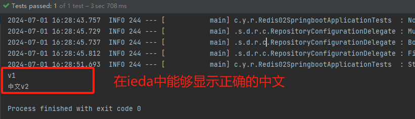 

但是此时我们打开`resic-cli.exe`客户端，再次查询，会发现出现了乱码。这是因为Redis的所有操作都需要序列化的原因，会在后面解释。

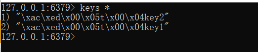 

我们先去看一下默认的序列化是用的什么，打开`RedisTemplate.java`，我们可以看到

```java
@SuppressWarnings("rawtypes") private @Nullable RedisSerializer keySerializer = null;
@SuppressWarnings("rawtypes") private @Nullable RedisSerializer valueSerializer = null;
@SuppressWarnings("rawtypes") private @Nullable RedisSerializer hashKeySerializer = null;
@SuppressWarnings("rawtypes") private @Nullable RedisSerializer hashValueSerializer = null;
```

往下找到，我们可以看到默认的序列化方法，但我们通常使用json序列化，所以需要改写，自定义redisTemplate

 

我们先测试一下如果存入的是对象会怎么样。新建一个pojo包，新建User对象

```java
@Component
@AllArgsConstructor
@NoArgsConstructor
@Data
public class User {

    private String name;
    private int age;
}
```

测试

```java
@SpringBootTest
class Redis02SpringbootApplicationTests {

    @Resource
    private RedisTemplate redisTemplate;

    @Test
    void Test(){
        User user1 = new User("yyl", 23);
        redisTemplate.opsForValue().set("user1", user1);
        System.out.println(redisTemplate.opsForValue().get("user1"));
    }
```

发现出现报错信息，未序列化。

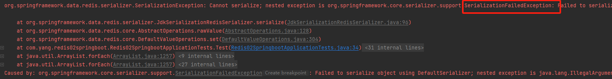 

然后我们进行序列化，这里我们介绍两种方法，

- 方法一：

  ```java
  @Test
  void Test() throws JsonProcessingException {
      User user1 = new User("yyl", 23);
      String jsonUser = new ObjectMapper().writeValueAsString(user1);
      redisTemplate.opsForValue().set("user1", jsonUser);
      System.out.println(redisTemplate.opsForValue().get("user1"));
  }
  ```

- 方法二：让pojo继承`Serializable`

  ```java
  //对pojo进行序列化
  public class User implements Serializable {
  
      private String name;
      private int age;
  }
  ```

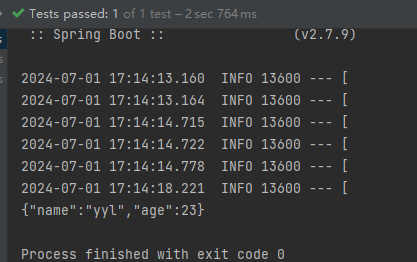 

虽然这个时候在idea中我们得到了中文，但是在控制台查看依旧是乱码，我们需要自定义redisTemplate来进行序列化。

新建 config包，新建`redisConfig`类，

```java
//redisConfig.java
//者之一种通用的企业序列化方法，可以直接拿来用

@Configuration
public class RedisConfig {
    //编写自己的redsiTemplate
    @Bean
    @SuppressWarnings("all")
    public RedisTemplate<String, Object> redisTemplate(RedisConnectionFactory factory) {

        RedisTemplate<String, Object> template = new RedisTemplate<String, Object>();
        template.setConnectionFactory(factory);

        // 序列化配置 解析任意对象
        Jackson2JsonRedisSerializer jackson2JsonRedisSerializer = new Jackson2JsonRedisSerializer(Object.class);
        // json序列化利用ObjectMapper进行转义
        ObjectMapper om = new ObjectMapper();
        om.setVisibility(PropertyAccessor.ALL, JsonAutoDetect.Visibility.ANY);
        om.enableDefaultTyping(ObjectMapper.DefaultTyping.NON_FINAL);
        jackson2JsonRedisSerializer.setObjectMapper(om);
        // 2.序列化String类型
        StringRedisSerializer stringRedisSerializer = new StringRedisSerializer();

        // key采用String的序列化方式
        template.setKeySerializer(stringRedisSerializer);
        // hash的key也采用String的序列化方式
        template.setHashKeySerializer(stringRedisSerializer);
        // value序列化方式采用jackson
        template.setValueSerializer(jackson2JsonRedisSerializer);
        // hash的value序列化方式采用jackson
        template.setHashValueSerializer(jackson2JsonRedisSerializer);
        template.afterPropertiesSet();

        return template;
    }
```

注意这个时候我们自定义了`redisTemplate`并注入到了`spring`，我们之前在`redisAutoConfig`源码中看到当存在自定义的`redisTemplate`时，默认的自动配置就会失效。我们到测试类中再次测试

```java
@SpringBootTest
class Redis02SpringbootApplicationTests {

    @Autowird
    private RedisTemplate redisTemplate;//这里因为自定义了redisTemplate，所以这里的不再是默认，而是我们自定义的

    @Test
    void Test() throws JsonProcessingException {
        RedisConnection connection = redisTemplate.getConnectionFactory().getConnection();
        connection.flushAll();
        User user1 = new User("yyl", 23);
        //在真实的开发中，一般都会用json进行传输
        redisTemplate.opsForValue().set("user1", user1);
        System.out.println(redisTemplate.opsForValue().get("user1"));
    }
}

```

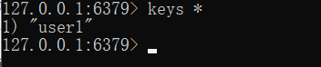 

## 4、使用RedisUtils

但是在企业开发中我们通常都会使用自己封装的工具来进行更简洁的操作。

新建包`utils`，新建`RedisUtils`类。注意看下面的代码，我们自己封装的工具类，其实本质上也是调用了`RedisTemplate`的源代码，但是在调用的时候需要加一个异常判断，在我们自己的封装类出现异常和在调用源码后出现异常是不同的。

```java
//RedisUtils.java

package com.yang.utils;

import org.springframework.beans.factory.annotation.Autowired;
import org.springframework.data.redis.core.RedisTemplate;
import org.springframework.stereotype.Component;
import org.springframework.util.CollectionUtils;
import java.util.List;
import java.util.Map;
import java.util.Set;
import java.util.concurrent.TimeUnit;

/**
 redisTemplate封装
 */
@Component
public class RedisUtils {

    //此写法可防止RedisTemplate 注入失败
    private static RedisTemplate redisTemplate;
    @Autowired
    public void setRedisTemplate(RedisTemplate redisTemplate) {
        RedisUtils.redisTemplate = redisTemplate;
    }

    /**

     指定缓存失效时间
     @param key 键
     @param time 时间(秒)
     @return
     */
    public boolean expire(String key,long time){
        try {
            if(time>0){
                redisTemplate.expire(key, time, TimeUnit.SECONDS);
            }
            return true;
        } catch (Exception e) {
            e.printStackTrace();
            return false;
        }
    }
    /**

     根据key 获取过期时间
     @param key 键 不能为null
     @return 时间(秒) 返回0代表为永久有效
     */
    public long getExpire(String key){
        return redisTemplate.getExpire(key,TimeUnit.SECONDS);
    }
    /**

     判断key是否存在
     @param key 键
     @return true 存在 false不存在
     */
    public boolean hasKey(String key){
        try {
            return redisTemplate.hasKey(key);
        } catch (Exception e) {
            e.printStackTrace();
            return false;
        }
    }
    /**

     删除缓存
     @param key 可以传一个值 或多个
     */
    @SuppressWarnings("unchecked")
    public void del(String... key){
        if(key!=null&&key.length>0){
            if(key.length==1){
                redisTemplate.delete(key[0]);
            }else{
                redisTemplate.delete(CollectionUtils.arrayToList(key));
            }
        }
    }
//String=
    /**

     普通缓存获取
     @param key 键
     @return 值
     */
    public Object get(String key){
        return key==null?null:redisTemplate.opsForValue().get(key);
    }
    /**

     普通缓存放入
     @param key 键
     @param value 值
     @return true成功 false失败
     */
    public static boolean set(String key,Object value) {
        try {
            redisTemplate.opsForValue().set(key, value);
            return true;
        } catch (Exception e) {
            e.printStackTrace();
            return false;
        }
    }
    /**

     普通缓存放入并设置时间
     @param key 键
     @param value 值
     @param time 时间(秒) time要大于0 如果time小于等于0 将设置无限期
     @return true成功 false 失败
     */
    public boolean set(String key,Object value,long time){
        try {
            if(time>0){
                redisTemplate.opsForValue().set(key, value, time, TimeUnit.SECONDS);
            }else{
                set(key, value);
            }
            return true;
        } catch (Exception e) {
            e.printStackTrace();
            return false;
        }
    }
    /**

     递增
     @param key 键
     @param delta 要增加几(大于0)
     @return
     */
    public long incr(String key, long delta){
        if(delta<0){
            throw new RuntimeException("递增因子必须大于0");
        }
        return redisTemplate.opsForValue().increment(key, delta);
    }
    /**

     递减
     @param key 键
     @param delta 要减少几(小于0)
     @return
     */
    public long decr(String key, long delta){
        if(delta<0){
            throw new RuntimeException("递减因子必须大于0");
        }
        return redisTemplate.opsForValue().increment(key, -delta);
    }
//Map=
    /**

     HashGet
     @param key 键 不能为null
     @param item 项 不能为null
     @return 值
     */
    public Object hget(String key,String item){
        return redisTemplate.opsForHash().get(key, item);
    }
    /**

     获取hashKey对应的所有键值
     @param key 键
     @return 对应的多个键值
     */
    public Map<Object,Object> hmget(String key){
        return redisTemplate.opsForHash().entries(key);
    }
    /**

     HashSet
     @param key 键
     @param map 对应多个键值
     @return true 成功 false 失败
     */
    public boolean hmset(String key, Map<String,Object> map){
        try {
            redisTemplate.opsForHash().putAll(key, map);
            return true;
        } catch (Exception e) {
            e.printStackTrace();
            return false;
        }
    }
    /**

     HashSet 并设置时间
     @param key 键
     @param map 对应多个键值
     @param time 时间(秒)
     @return true成功 false失败
     */
    public boolean hmset(String key, Map<String,Object> map, long time){
        try {
            redisTemplate.opsForHash().putAll(key, map);
            if(time>0){
                expire(key, time);
            }
            return true;
        } catch (Exception e) {
            e.printStackTrace();
            return false;
        }
    }
    /**

     向一张hash表中放入数据,如果不存在将创建
     @param key 键
     @param item 项
     @param value 值
     @return true 成功 false失败
     */
    public boolean hset(String key,String item,Object value) {
        try {
            redisTemplate.opsForHash().put(key, item, value);
            return true;
        } catch (Exception e) {
            e.printStackTrace();
            return false;
        }
    }
    /**

     向一张hash表中放入数据,如果不存在将创建
     @param key 键
     @param item 项
     @param value 值
     @param time 时间(秒) 注意:如果已存在的hash表有时间,这里将会替换原有的时间
     @return true 成功 false失败
     */
    public boolean hset(String key,String item,Object value,long time) {
        try {
            redisTemplate.opsForHash().put(key, item, value);
            if(time>0){
                expire(key, time);
            }
            return true;
        } catch (Exception e) {
            e.printStackTrace();
            return false;
        }
    }
    /**

     删除hash表中的值
     @param key 键 不能为null
     @param item 项 可以使多个 不能为null
     */
    public void hdel(String key, Object...item){
        redisTemplate.opsForHash().delete(key,item);
    }
    /**

     判断hash表中是否有该项的值
     @param key 键 不能为null
     @param item 项 不能为null
     @return true 存在 false不存在
     */
    public boolean hHasKey(String key, String item){
        return redisTemplate.opsForHash().hasKey(key, item);
    }
    /**

     hash递增 如果不存在,就会创建一个 并把新增后的值返回
     @param key 键
     @param item 项
     @param by 要增加几(大于0)
     @return
     */
    public double hincr(String key, String item,double by){
        return redisTemplate.opsForHash().increment(key, item, by);
    }
    /**

     hash递减
     @param key 键
     @param item 项
     @param by 要减少记(小于0)
     @return
     */
    public double hdecr(String key, String item,double by){
        return redisTemplate.opsForHash().increment(key, item,-by);
    }
//set=
    /**

     根据key获取Set中的所有值
     @param key 键
     @return
     */
    public Set sGet(String key){
        try {
            return redisTemplate.opsForSet().members(key);
        } catch (Exception e) {
            e.printStackTrace();
            return null;
        }
    }
    /**

     根据value从一个set中查询,是否存在
     @param key 键
     @param value 值
     @return true 存在 false不存在
     */
    public boolean sHasKey(String key,Object value){
        try {
            return redisTemplate.opsForSet().isMember(key, value);
        } catch (Exception e) {
            e.printStackTrace();
            return false;
        }
    }
    /**

     将数据放入set缓存
     @param key 键
     @param values 值 可以是多个
     @return 成功个数
     */
    public long sSet(String key, Object...values) {
        try {
            return redisTemplate.opsForSet().add(key, values);
        } catch (Exception e) {
            e.printStackTrace();
            return 0;
        }
    }
    /**

     将set数据放入缓存
     @param key 键
     @param time 时间(秒)
     @param values 值 可以是多个
     @return 成功个数
     */
    public long sSetAndTime(String key,long time,Object...values) {
        try {
            Long count = redisTemplate.opsForSet().add(key, values);
            if(time>0) {
                expire(key, time);
            }
            return count;
        } catch (Exception e) {
            e.printStackTrace();
            return 0;
        }
    }
    /**

     获取set缓存的长度
     @param key 键
     @return
     */
    public long sGetSetSize(String key){
        try {
            return redisTemplate.opsForSet().size(key);
        } catch (Exception e) {
            e.printStackTrace();
            return 0;
        }
    }
    /**

     移除值为value的
     @param key 键
     @param values 值 可以是多个
     @return 移除的个数
     */
    public long setRemove(String key, Object ...values) {
        try {
            Long count = redisTemplate.opsForSet().remove(key, values);
            return count;
        } catch (Exception e) {
            e.printStackTrace();
            return 0;
        }
    }
//=list===
    /**

     获取list缓存的内容
     @param key 键
     @param start 开始
     @param end 结束 0 到 -1代表所有值
     @return
     */
    public List lGet(String key, long start, long end){
        try {
            return redisTemplate.opsForList().range(key, start, end);
        } catch (Exception e) {
            e.printStackTrace();
            return null;
        }
    }
    /**

     获取list缓存的长度
     @param key 键
     @return
     */
    public long lGetListSize(String key){
        try {
            return redisTemplate.opsForList().size(key);
        } catch (Exception e) {
            e.printStackTrace();
            return 0;
        }
    }
    /**

     通过索引 获取list中的值
     @param key 键
     @param index 索引 index>=0时， 0 表头，1 第二个元素，依次类推；index<0时，-1，表尾，-2倒数第二个元素，依次类推
     @return
     */
    public Object lGetIndex(String key,long index){
        try {
            return redisTemplate.opsForList().index(key, index);
        } catch (Exception e) {
            e.printStackTrace();
            return null;
        }
    }
    /**

     将list放入缓存
     @param key 键
     @param value 值
     @return
     */
    public boolean lSet(String key, Object value) {
        try {
            redisTemplate.opsForList().rightPush(key, value);
            return true;
        } catch (Exception e) {
            e.printStackTrace();
            return false;
        }
    }
    /**

     将list放入缓存
     @param key 键
     @param value 值
     @param time 时间(秒)
     @return
     */
    public boolean lSet(String key, Object value, long time) {
        try {
            redisTemplate.opsForList().rightPush(key, value);
            if (time > 0) {
                expire(key, time);
            }
            return true;
        } catch (Exception e) {
            e.printStackTrace();
            return false;
        }
    }
    /**

     将list放入缓存
     @param key 键
     @param value 值
     @return
     */
    public boolean lSet(String key, List value) {
        try {
            redisTemplate.opsForList().rightPushAll(key, value);
            return true;
        } catch (Exception e) {
            e.printStackTrace();
            return false;
        }
    }
    /**

     将list放入缓存
     @param key 键
     @param value 值
     @param time 时间(秒)
     @return
     */
    public boolean lSet(String key, List value, long time) {
        try {
            redisTemplate.opsForList().rightPushAll(key, value);
            if (time > 0) {
                expire(key, time);
            }
            return true;
        } catch (Exception e) {
            e.printStackTrace();
            return false;
        }
    }
    /**

     根据索引修改list中的某条数据
     @param key 键
     @param index 索引
     @param value 值
     @return
     */
    public boolean lUpdateIndex(String key, long index,Object value) {
        try {
            redisTemplate.opsForList().set(key, index, value);
            return true;
        } catch (Exception e) {
            e.printStackTrace();
            return false;
        }
    }
    /**

     移除N个值为value
     @param key 键
     @param count 移除多少个
     @param value 值
     @return 移除的个数
     */
    public long lRemove(String key,long count,Object value) {
        try {
            Long remove = redisTemplate.opsForList().remove(key, count, value);
            return remove;
        } catch (Exception e) {
            e.printStackTrace();
            return 0;
        }
    }
}
```

然后我们测试一下，搞定！

```java
@SpringBootTest
class Redis02SpringbootApplicationTests {

    //注入
    @Autowired
    private RedisUtils redisUtils;

    @Test
    void Test2(){
        redisUtils.set("redis","utils");
    }
}
```

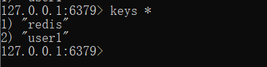 


# Redis.conf详解

## 1.容量单位

单位不区分大小写，G和GB有区别

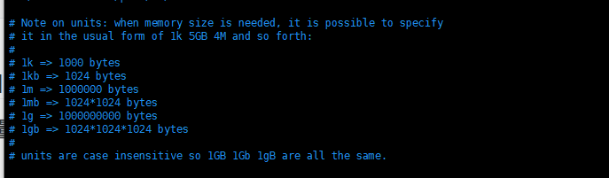

## 2.include

可以使用 includes 组合多个配置文件

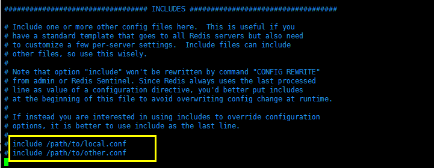

## 3.网络配置

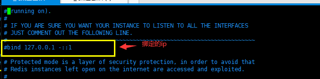

```shell
bind 127.0.0.1 #绑定的端口
protected-mode no  #保护模式，一般都是开启的
port 6379  #端口设置
```

## 4.通用配置(GENERAL)

```shell
daemonize yes  #以守护进程的方式运行，默认是no ，我们需要自己开启为yes

supervised no # 管理守护进程的，默认为 no 就可以

pidfile /var/run/redis_6379.pid #如果以后台的方式运行，我们就需要指定一个pid文件

# Specify the server verbosity level.
# This can be one of:
# debug (a lot of information, useful for development/testing)
# verbose (many rarely useful info, but not a mess like the debug level)
# notice (moderately verbose, what you want in production probably)
# warning (only very important / critical messages are logged)
loglevel notice   #日志级别
logfile ""  #日志的文件位置名
databases 16  #数据库的数量，默认是16个数据库
always-show-logo no  #是否总是显示log
```

## 5.快照(SNAPSHOTTING) rdb配置

持久化，在规定的时间内，执行了多少次操作，则会持久化到文件 .rdb .aof

redis是内存数据库，如果没有持久化，那么数据断电即失。

```shell
#在3600s内，如果至少有 1 key进行了修改，我们将进行持久化操作
save 3600 1
#在300s内，如果至少有 100 key进行了修改，我们将进行持久化操作
save 300 100
#在 60s 内，如果至少有 10000 key进行了修改，我们将进行持久化操作
save 60 10000
#我们之后学习持久化，会自己定义这个测试

stop-writes-on-bgsave-error yes  #持久化如果出错，是否还需要继续工作。默认开启

rdbcompression yes  #是否压缩rdb文件，需要消耗一些 cpu资源

rdbchecksum yes  #保存rdb文件的视觉，进行错误的检查校验

dir ./  #rdb文件保存的目录
```

## 6.REPLICATION 主从复制，

我们后面讲解主从复制的时候再进行详解

> 在Redis的配置文件（redis.conf）中，可以配置RDB持久化相关的参数：
>
> `save m n`：设置触发RDB持久化的条件和频率。例如，save 900 1表示在900秒（15分钟）内如果至少有1个key被修改，则执行BGSAVE命令生成快照。
> `stop-writes-on-bgsave-error yes/no`：当BGSAVE命令执行失败时，是否停止写入操作。
> `rdbcompression yes/no`：是否对RDB文件进行压缩存储，节省磁盘空间但会增加CPU消耗。
> `rdbchecksum yes/no`：在写入RDB文件时是否进行数据校验。
> `dir /path/to/directory`：指定RDB文件的存储目录。
> `dbfilename dump.rdb`：指定RDB文件的名称。

## 7.SECURITY 安全

```shell
#1.可以再redis.conf配置文件里面修改密码
requirepass 123456 #可以在这里设置redis的密码，默认是没有密码的

#2.可以用命令设置密码
127.0.0.1:6379> ping
(error) NOAUTH Authentication required.  #设置密码后发现所有的命令都没有权限了
127.0.0.1:6379> auth 123456   #使用密码进行登录
OK
127.0.0.1:6379> config get requirepass  #查看redis的密码
1) "requirepass"
2) "123456"
127.0.0.1:6379> config set requirepass "1234567"   #用命令设置redis的密码
```

## 8.CLIENTS 限制（客户端连接相关）

```shell
maxclients 10000  #设置能连上redis的最大客户端的数量

maxmemory <bytes> # redis 配置最大的内存容量，默认是字节

maxmemory-policy noeviction # 内存到达上限之后的处理策略
6种策略
    1、volatile-lru：只对设置了过期时间的key进行LRU（默认值）
    2、allkeys-lru ： 删除lru算法的key
    3、volatile-random：随机删除即将过期key
    4、allkeys-random：随机删除
    5、volatile-ttl ： 删除即将过期的
    6、noeviction ： 永不过期，返回错误

# volatile-lru -> 在具有过期设置的键中使用近似 LRU 进行驱逐。
# allkeys-lru -> 使用近似 LRU 驱逐任何键。
# volatile-lfu -> 在具有过期设置的键中使用近似 LFU 进行驱逐。
# allkeys-lfu -> 使用近似 LFU 驱逐任何键。
# volatile-random -> 从设置了过期时间的密钥中删除一个随机密钥。
# allkeys-random -> 删除随机密钥，任何密钥。
# volatile-ttl -> 删除过期时间最近的密钥（次要 TTL）
# noeviction -> 不驱逐任何东西，只是在写操作上返回错误。

```

## 8.APPEND ONLY 模式 aof配置

```shell
appendonly no # 默认是不开启aof模式的，默认是使用rdb方式持久化的，在大部分所有的情况下，rdb完全够用！
appendfilename "appendonly.aof" # 持久化的文件的名字

# appendfsync always # 每次修改都会 sync。速度比较慢，消耗性能
appendfsync everysec # 每秒执行一次 sync，但可能会丢失这1s的数据！
# appendfsync no # 不执行 sync，这个时候操作系统自己同步数据，速度最快！
```

具体的配置在持久化中详细讲解

# 七、Redis持久化

面试和工作，持久化都是重点！

Redis 是内存数据库，如果不将内存中的数据库状态保存到磁盘，那么一旦服务器进程退出，服务器中的数据库状态也会消失。所以 Redis 提供了持久化功能！

> 持久化：在指定时间间隔内将内存数据存入磁盘中，断电也能恢复数据，使用快照文件读到内存中。

## 1、RDB(Redis DataBase)

### 1.1、什么是RDB

> 在指定的时间间隔内将内存中的数据集快照写入磁盘，也就是行话讲的Snapshot快照，它恢复时是将快 照文件直接读到内存里。

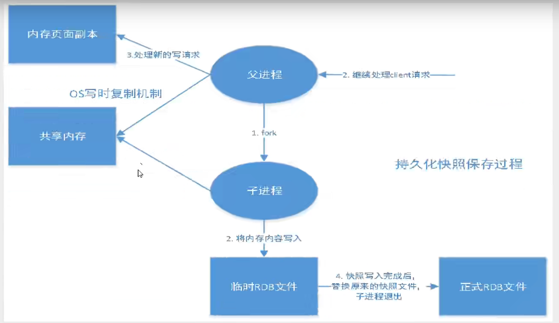

Redis会单独创建（fork）一个子进程来进行持久化，会先将数据写入到一个临时文件中，待持久化过程 都结束了，再用这个临时文件替换上次持久化好的文件。

整个过程中，主进程是不进行任何IO操作的。 这就确保了极高的性能。如果需要进行大规模数据的恢复，且对于数据恢复的完整性不是非常敏感，那 RDB方式要比AOF方式更加的高效。RDB的缺点是最后一次持久化后的数据可能丢失。我们默认的就是 RDB，一般情况下不需要修改这个配置！

有时候在生产环境我们会将这个文件进行备份！

rdb保存的文件是dump.rdb 都是在我们的配置文件中快照中进行配置的！

> 我们可以自定义自己的rbd

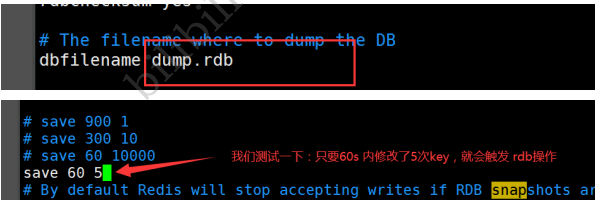

### 1.2、触发机制

1. save的规则满足的情况下，会自动触发rdb原则

   使用 save 命令，会立刻对当前内存中的数据进行持久化 ,但是会阻塞，也就是不接受其他操作了；

   > 由于 save 命令是同步命令，会占用Redis的主进程。若Redis数据非常多时，save命令执行速度会非常慢，阻塞所有客户端的请求。

   

2. 执行`flushall`命令，也会触发我们的rdb原则

3. 退出redis，也会自动产生rdb文件

备份就自动生成一个 `dump.rdb`

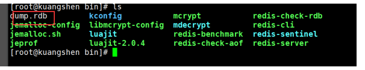

### 1.3、恢复rdb

1. 只需要将rdb文件放在我们redis启动目录就可以，redis启动的时候会自动检查dump.rdb 恢复其中的数据！
2. 查看需要存在的位置

```shell
127.0.0.1:6379> config get dir
1) "dir"
2) "/usr/local/bin" # 如果在这个目录下存在 dump.rdb 文件，启动就会自动恢复其中的数据
```

### 1.4、优缺点

**优点：**

1. 适合大规模的数据恢复
2. 对数据的完整性要求不高
3. RDB持久化生成的快照文件紧凑，适合用于备份和恢复数据。
4. 在数据恢复时，由于快照是全量的，恢复速度相对较快。

**缺点：**

1. 需要一定的时间间隔进行操作，如果redis意外宕机了，这个最后一次修改的数据就没有了。
2. fork进程的时候，会占用一定的内容空间。
3. RDB持久化是全量备份，如果Redis进程意外终止，可能会丢失最后一次快照生成后的数据。
4. 对于大型数据集，生成快照会消耗较多的CPU和IO资源，可能会影响Redis的性能。
5. RDB持久化无法实现实时备份，只能通过定期生成快照的方式来保证数据的持久化。

总的来说，RDB持久化适合对数据一致性要求不是特别高、需要定期备份的场景。对于要求实时持久化并且能够容忍一定数据丢失的场景，AOF持久化更为适合。

## 2、AOF(Append-Only File)

### 2.1、什么是AOF

> 将我们的所有命令都记录下来，类似于给了一个history，恢复的时候就把这个文件全部在执行一遍！


以日志的形式来记录每个写操作，将Redis执行过的所有指令记录下来（读操作不记录），只许追加文件 但不可以改写文件，redis启动之初会读取该文件重新构建数据.

换言之，redis重启的话就根据日志文件 的内容将写指令从前到后执行一次以完成数据的恢复工作

Aof保存的是 `appendonly.aof` 文件

### 2.2、配置

> 默认情况下是不开启AOF的，如果要开启需要手动将 `appendonly` 修改为 `yes`


修改后我们重启`redis`，就会出现 `appendonly.aof`文件

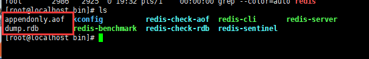

这个时候我们进行一些写入操作


然后打开`appendonly.aof`查看，会发现已经记录下来了

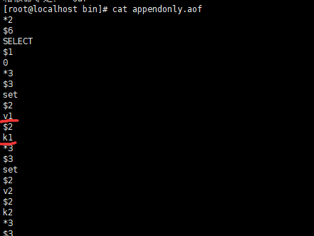

此时如果我们人为的对`appendonly.aof`进行了修改，会导致无法启动`redis`


`redis`给我们提供了一个工具 `redis-check-aof --fix`，来对备份文件进行修复操作


如果文件正常，重启就可以直接恢复了


### 2.3、重写规则

aof 默认就是文件的无限追加，文件会越来越大！

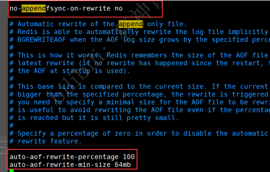

如果 aof 文件大于 64m，太大了！ fork一个新的进程来将我们的文件进行重写！

```shell
appendonly no # 默认是不开启aof模式的，默认是使用rdb方式持久化的，在大部分所有的情况下，
rdb完全够用！
appendfilename "appendonly.aof" # 持久化的文件的名字
# appendfsync always # 每次修改都会 sync。消耗性能,文件的完整会更加好！
appendfsync everysec # 每秒执行一次 sync，可能会丢失这1s的数据！
# appendfsync no # 不执行 sync，这个时候操作系统自己同步数据，速度最快！ 从不同步，效率最高的！
# rewrite 重写，
```

### 2.4、优缺点

> **优点：**
>
> 1. 可读性高：AOF文件是以文本形式保存的，易于理解和调试。
> 2. 容灾性强：AOF文件记录了所有写操作命令，因此可以更可靠地恢复数据。
> 3. 适用于追加操作：AOF采用追加方式记录写操作，因此对于磁盘的IO消耗相对较低。
>
> **缺点：**
>
> 1. 文件较大：由于AOF文件保存了每个写操作命令，因此可能会比RDB生成的快照文件更大。
> 2. 恢复速度较慢：由于Redis在启动时需要重新执行AOF文件中的所有写操作，因此恢复速度可能比RDB快照方式慢。
> 3. 重写可能会耗时：AOF重写过程可能会耗费一定的时间和资源，尤其是在数据集较大时。

### 2.5、适用场景

> - **数据可靠性要求高**：AOF持久化记录了每个写操作命令，因此在数据可靠性要求较高的场景下更为适用。
> - **追加操作频繁**：AOF持久化采用追加方式记录写操作，适用于写操作频繁的场景。
> - **可读性要求高**：AOF文件是以文本形式保存的，易于理解和调试，适用于需要对持久化数据进行查看和修改的场景。


## 3、扩展

1. RDB 持久化方式能够在指定的时间间隔内对你的数据进行快照存储

2. AOF 持久化方式记录每次对服务器写的操作，当服务器重启的时候会重新执行这些命令来恢复原始 的数据，AOF命令以Redis 协议追加保存每次写的操作到文件末尾，Redis还能对AOF文件进行后台重 写，使得AOF文件的体积不至于过大

3. 只做缓存，如果你只希望你的数据在服务器运行的时候存在，你也可以不使用任何持久化

4. 同时开启两种持久化方式

   在这种情况下，当redis重启的时候会优先载入AOF文件来恢复原始的数据，因为在通常情况下AOF 文件保存的数据集要比RDB文件保存的数据集要完整。
   RDB 的数据不实时，同时使用两者时服务器重启也只会找AOF文件，那要不要只使用AOF呢？作者 建议不要，因为RDB更适合用于备份数据库（AOF在不断变化不好备份），快速重启，而且不会有 AOF可能潜在的Bug，留着作为一个万一的手段。

5. 性能建议

   因为RDB文件只用作后备用途，建议只在Slave上持久化RDB文件，而且只要15分钟备份一次就够 了，只保留 save 900 1 这条规则。
   如果Enable AOF ，好处是在最恶劣情况下也只会丢失不超过两秒数据，启动脚本较简单只load自 己的AOF文件就可以了，代价一是带来了持续的IO，二是AOF rewrite 的最后将 rewrite 过程中产 生的新数据写到新文件造成的阻塞几乎是不可避免的。只要硬盘许可，应该尽量减少AOF rewrite 的频率，AOF重写的基础大小默认值64M太小了，可以设到5G以上，默认超过原大小100%大小重 写可以改到适当的数值。
   如果不Enable AOF ，仅靠 Master-Slave Repllcation 实现高可用性也可以，能省掉一大笔IO，也 减少了rewrite时带来的系统波动。代价是如果Master/Slave 同时倒掉，会丢失十几分钟的数据， 启动脚本也要比较两个 Master/Slave 中的 RDB文件，载入较新的那个，微博就是这种架构。

# 八、Redis发布订阅

## 1、什么是发布订阅

Redis 发布订阅(pub/sub)是一种消息通信模式：

- 发送者(pub)发送消息
- 订阅者(sub)接收消息。

如：微信、 微博、关注系统！

Redis 客户端可以订阅任意数量的频道。

订阅/发布消息图：

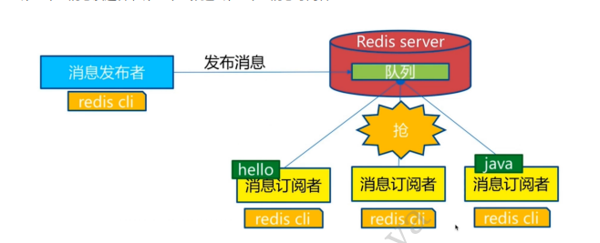

这里面存在三个重要角色：第一个：消息发送者， 第二个：频道 第三个：消息订阅者！

下图展示了频道 channel1 ， 以及订阅这个频道的三个客户端 —— client2 、 client5 和 client1 之间的 关系：


当有新消息通过 PUBLISH 命令发送给频道 channel1 时， 这个消息就会被发送给订阅它的三个客户端：

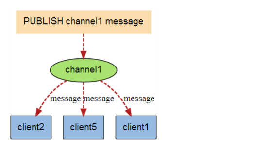

## 2、命令

这些命令被广泛用于构建即时通信应用，比如网络聊天室(chatroom)和实时广播、实时提醒等。


## 3、测试

> 订阅端

```shell
127.0.0.1:6379> SUBSCRIBE jihu2  #订阅一个频道jihu2
Reading messages... (press Ctrl-C to quit)
1) "subscribe"
2) "jihu2"
3) (integer) 1
#等待读取推送的信息
1) "message"
2) "jihu2"
3) "hello beauty women"  #自动接收jihu2发布的信息
1) "message"
2) "jihu2"
3) "hello redis"
```

> 发布端

```shell
[root@localhost bin]# redis-cli -p 6379 #发布者发布消息到频道
127.0.0.1:6379> PUBLISH jihu2 "hello beauty women"  #发布者发布消息到频道
(integer) 1
127.0.0.1:6379> PUBLISH jihu2 "hello redis"
(integer) 1
```

当发布端发送消息后，订阅段会自动地接受消息。

## 4、原理

Redis是使用C实现的，通过分析 Redis 源码里的 pubsub.c 文件，了解发布和订阅机制的底层实现，籍此加深对 Redis 的理解。

Redis 通过 `PUBLISH` 、`SUBSCRIBE` 和` PSUBSCRIBE` 等命令实现发布和订阅功能。

> 通过 SUBSCRIBE 命令订阅某频道后，redis-server 里维护了一个字典，字典的键就是一个个 频道！而字典的值则是一个链表，链表中保存了所有订阅这个 channel 的客户端。SUBSCRIBE 命令的关键， 就是将客户端添加到给定 channel 的订阅链表中。
>
> 通过 PUBLISH 命令向订阅者发送消息，redis-server 会使用给定的频道作为键，在它所维护的 channel 字典中查找记录了订阅这个频道的所有客户端的链表，遍历这个链表，将消息发布给所有订阅者。

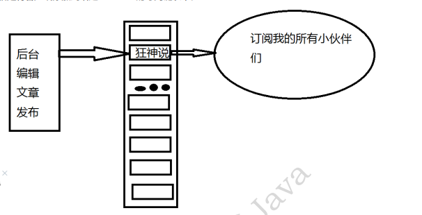

## 5、缺点

> 1. 如果一个客户端订阅了频道，但自己读取消息的速度却不够快的话，那么不断积压的消息会使redis输出缓冲区的体积变得越来越大，这可能使得redis本身的速度变慢，甚至直接崩溃。
> 2. 这和数据传输可靠性有关，如果在订阅方断线，那么他将会丢失所有在短线期间发布者发布的消息。

## 6、使用场景

1、实时消息系统！

2、实时聊天！（频道当做聊天室，将信息回显给所有人即可！）

3、订阅，关注系统都是可以的！

稍微复杂的场景，我们就会使用消息中间件MQ处理。

# 九、主从复制

