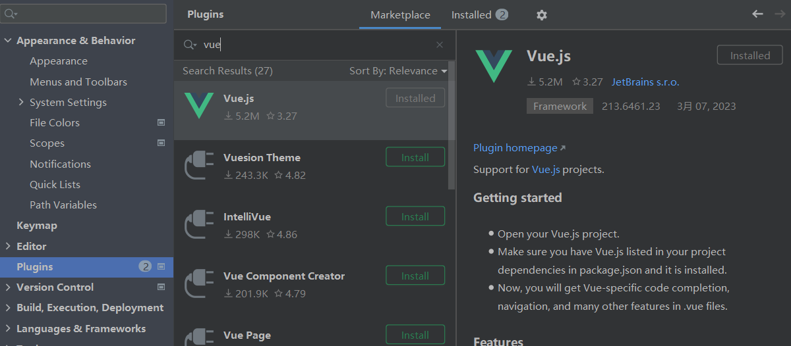
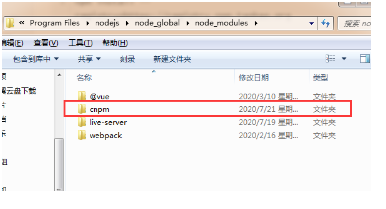
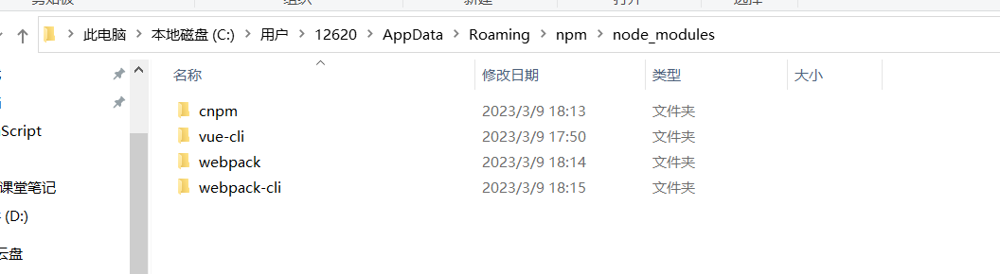
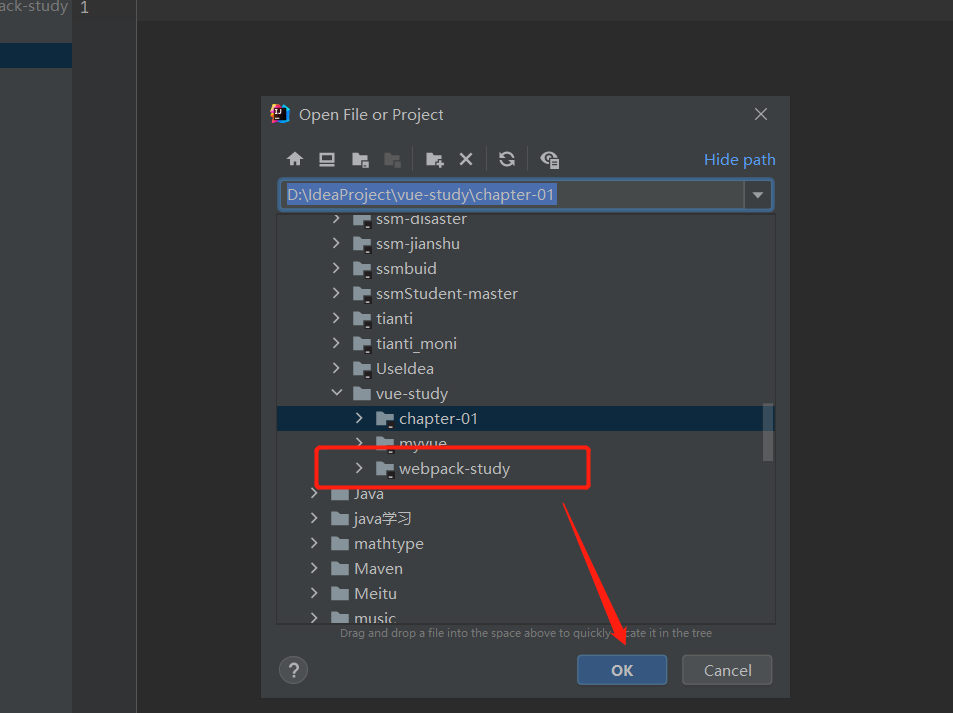
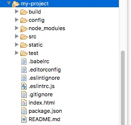
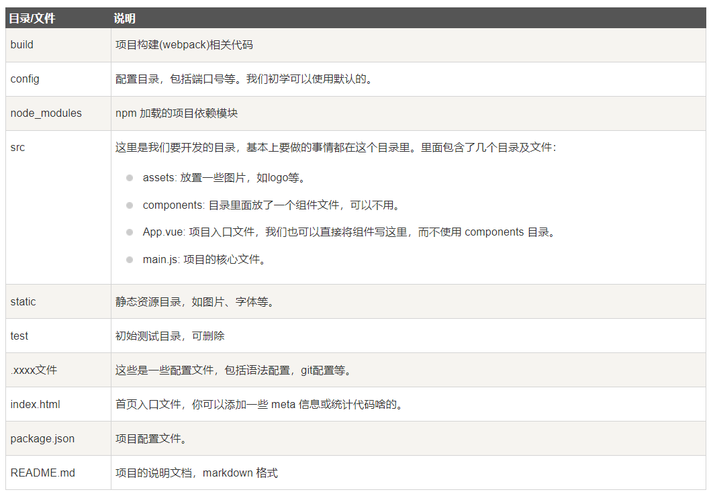
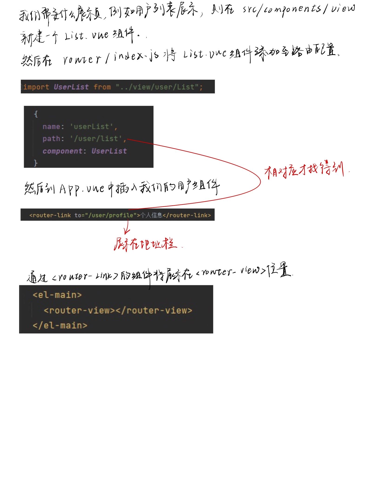

#二、第一个VUE程序

##1、MVVM

###1.1、什么是MVVM

  MVVM（Model-View-ViewModel）是一种软件设计模式，由微软WPF（用于替代WinForm，以前就是用这个技术开发桌面应用程序的）和Silverlight（类似于Java Applet，简单点说就是在浏览器上运行WPF）的架构师Ken Cooper和Ted Peters开发，是一种简化用户界面的**事件驱动编程方式**。由John Gossman（同样也是WPF和Sliverlight的架构师）与2005年在他的博客上发表。

  MVVM源自于经典的MVC（Model-View-Controller）模式。MVVM的核心是ViewModel层，负责转换Model中的数据对象来让数据变得更容易管理和使用。其作用如下：

- 该层向上与视图层进行双向数据绑定
- 向下与Model层通过接口请求进行数据交互

​        MVVM已经相当成熟了，主要运用但不仅仅在网络应用程序开发中。当下流行的MVVM框架有`Vue.js`，`Anfular JS`

###1.2、为什么要使用MVVM

  MVVM模式和MVC模式一样，主要目的是分离视图（View）和模型（Model），有几大好处

- **低耦合**：视图（View）可以独立于Model变化和修改，一个ViewModel可以绑定到不同的View上，当View变化的时候Model可以不变，当Model变化的时候View也可以不变。
- **可复用**：你可以把一些视图逻辑放在一个ViewModel里面，让很多View重用这段视图逻辑。
- **独立开发**：开发人员可以专注于业务逻辑和数据的开发（ViewMode），设计人员可以专注于页面设计。
- **可测试**：界面素来是比较难以测试的，而现在测试可以针对ViewModel来写。


**View**

  View是视图层， 也就是用户界面。前端主要由HTH L和csS来构建， 为了更方便地展现vi eu to del或者Hodel层的数据， 已经产生了各种各样的前后端模板语言， 比如FreeMarker，Thyme leaf等等， 各大MV VM框架如Vue.js.Angular JS， EJS等也都有自己用来构建用户界面的内置模板语言。

**Model**

  Model是指数据模型， 泛指后端进行的各种业务逻辑处理和数据操控， 主要围绕数据库系统展开。这里的难点主要在于需要和前端约定统一的接口规则

**ViewModel**

  ViewModel是由前端开发人员组织生成和维护的视图数据层。在这一层， 前端开发者对从后端获取的Model数据进行转换处理， 做二次封装， 以生成符合View层使用预期的视图数据模型。
  需要注意的是View Model所封装出来的数据模型包括视图的状态和行为两部分， 而Model层的数据模型是只包含状态的

- 比如页面的这一块展示什么，那一块展示什么这些都属于视图状态(展示)
- 页面加载进来时发生什么，点击这一块发生什么，这一块滚动时发生什么这些都属于视图行为(交互)

  视图状态和行为都封装在了View Model里。这样的封装使得View Model可以完整地去描述View层。由于实现了双向绑定， View Model的内容会实时展现在View层， 这是激动人心的， 因为前端开发者再也不必低效又麻烦地通过操纵DOM去更新视图。
  MVVM框架已经把最脏最累的一块做好了， 我们开发者只需要处理和维护View Model， 更新数据视图就会自动得到相应更新，真正实现`事件驱动编程`。
  View层展现的不是`Model`层的数据， 而是`ViewModel`的数据， 由`ViewModel`负责与`Model`层交互， 这就**完全解耦了View层和Model层， 这个解耦是至关重要的， 它是前后端分离方案实施的重要一环。**

##2、Vue

Vue(读音/vju/， 类似于view) 是一套用于构建用户界面的渐进式框架， 发布于2014年2月。与其它大型框架不同的是， Vue被设计为可以自底向上逐层应用。Vue的核心库只关注视图层， 不仅易于上手， 还便于与第三方库(如：vue-router，vue-resource，vue x) 或既有项目整合。

###2.1、MVVM模式的实现者

- Model：模型层， 在这里表示JavaScript对象
- View：视图层， 在这里表示DOM(HTML操作的元素)
- ViewModel：连接视图和数据的中间件， Vue.js就是MVVM中的View Model层的实现者

  在MVVM架构中， 是不允许数据和视图直接通信的， 只能通过ViewModel来通信， 而View Model就是定义了一个Observer观察者

- ViewModel能够观察到数据的变化， 并对视图对应的内容进行更新
- ViewModel能够监听到视图的变化， 并能够通知数据发生改变

  至此， 我们就明白了， Vue.js就是一个MV VM的实现者， 他的核心就是实现了``DOM监听与数据绑定``

###2.2、MVVM模式的实现者

- Model：模型层， 在这里表示JavaScript对象
- View：视图层， 在这里表示DOM(HTML操作的元素)
- ViewModel：连接视图和数据的中间件， Vue.js就是MVVM中的View Model层的实现者

  在MVVM架构中， 是不允许数据和视图直接通信的， 只能通过ViewModel来通信， 而View Model就是定义了一个Observer观察者

- ViewModel能够观察到数据的变化， 并对视图对应的内容进行更新
- ViewModel能够监听到视图的变化， 并能够通知数据发生改变

  至此， 我们就明白了， Vue.js就是一个MV VM的实现者， 他的核心就是实现了DOM监听与数据绑定

###2.3、为什么要使用Vue.js

- 轻量级， 体积小是一个重要指标。Vue.js压缩后有只有20多kb(Angular压缩后56kb+，React压缩后44kb+)
- 移动优先。更适合移动端， 比如移动端的Touch事件
- 易上手，学习曲线平稳，文档齐全
- 吸取了Angular(模块化) 和React(虚拟DOＭ) 的长处， 并拥有自己独特的功能，如：计算属性
- 开源，社区活跃度高
- ……

##3、第一个Vue程序

首先打开IDE，安装VUE插件。

setting——plugs——VUE

注意：Vue不支持IE 8及以下版本， 因为Vue使用了IE 8无法模拟的ECMAScript 5特性。但它支持所有兼容ECMAScript 5的浏览器。



###3.1、下载地址

- 开发版本
  - 包含完整的警告和调试模式：https：//yuejs.org/js/vue.js
  - 删除了警告， 30.96KBmin+gzip：https：//vuejs.org/js/vue.min.js
- 直接使用在线的CDN
  - `<script src=“https://cdn.jsdelivr.net/npm/vue@2.5.21/dist/vue.js”></script>`
  - `<script src="https://cdn.jsdelivr.net/npm/vue@2.5.21/dist/vue.min.js"></script>`

###3.2、代码编写

  Vue.js的核心是实现了MVVM模式， 她扮演的角色就是View Model层， 那么所谓的第一个应用程序就是展示她的数据绑定功能，操作流程如下：

  1. **创建一个HTML文件**

     ```html
     <!DOCTYPE html>
     <html lang="en">
     <head>
         <meta charset="UTF-8">
         <title>Title</title>
     </head>
     <body>
     
     </body>
     </html>
     
     ```

  2. **引入Vue.js**

     ```js
     <!--1.导入Vue.js-->
     <script src="https://cdn.jsdelivr.net/npm/vue@2.5.21/dist/vue.min.js"></script>
     ```

  3. **创建一个Vue实例**

     ```vue
     <script type="text/javascript">
         var vm = new Vue({
             el:"#app",
             /*Model：数据*/
             data:{
                 message:"hello,vue!"
             }
         });
     </script>
     
     ```

     说明：

     - `el: '#vue'`：绑定元素的ID
     - `data:{message:'Hello Vue!'}`：数据对象中有一个名为message的属性，并设置了初始值 Hello Vue！

  4. 将数据绑定到页面元素

     ```vue
     <!--view层，模板-->
     <div id="app">
         {{message}}
     </div>
     ```

     说明：只需要在绑定的元素中使用双花括号将Vue创建的名为message属性包裹起来， 即可实现数据绑定功能， 也就实现了View Model层所需的效果， 是不是和EL表达式非常像?

###3.3、完整的HTML ch1-demo1

```html
<!DOCTYPE html>
<html lang="en">
<head>
    <meta charset="UTF-8">
    <title>Title</title>

</head>
<body>

<!--view层，模板-->
<div id="app">
    {{message}}
</div>

<!--1.导入Vue.js-->
<script src="https://cdn.jsdelivr.net/npm/vue@2.5.21/dist/vue.min.js"></script>
<script type="text/javascript">
    var vm = new Vue({
        el:"#app",
        /*Model：数据*/
        data:{
            message:"hello,vue!"
        }
    });
</script>
</body>
</html>

```

###3.4、测试

为了能够更直观的体验Vue带来的数据绑定功能， 我们需要在浏览器测试一番， 操作流程如下：

1. 在浏览器上运行第一个Vue应用程序， 进入开发者工具
2. 在控制台输入vm.message=‘HelloWorld’， 然后回车， 你会发现浏览器中显示的内容会直接变成HelloWorld
3. 此时就可以在控制台直接输入vm.message来修改值， 中间是可以省略data的， 在这个操作中， 我并没有主动操作DOM， 就让页面的内容发生了变化， 这就是借助了Vue的数据绑定功能实现的； MV VM模式中要求View Model层就是使用观察者模式来实现数据的监听与绑定， 以做到数据与视图的快速响应。


#三、基础语法指令

##1、v-bind

- 我们已经成功创建了第一个Vue应用!看起来这跟渲染一个字符串模板非常类似， 但是Vue在背后做了大量工作。现在数据和DOM已经被建立了关联， 所有东西都是响应式的。我们在控制台操作对象属性，界面可以实时更新!

- 我们还可以使用v-bind来绑定元素特性!

- **上代码**

  ```html
  <!DOCTYPE html>
  <html lang="en" xmlns:v-bind="http://www.w3.org/1999/xhtml">
  <head>
      <meta charset="UTF-8">
      <title>Title</title>
  
  </head>
  <body>
  
  <!--view层，模板-->
  <div id="app">
      <span v-bind:title="message">
     		 鼠标悬停几秒钟查看此处动态绑定的提示信息！
      </span>
  </div>
  
  <!--1.导入Vue.js-->
  <script src="https://cdn.jsdelivr.net/npm/vue@2.5.21/dist/vue.min.js"></script>
  <script type="text/javascript">
      var vm = new Vue({
          /*绑定元素*/
          el:"#app",
          /*Model：数据*/
          data:{
              message: '页面加载于 ' + new Date().toLocaleString()
          }
      });
  </script>
  </body>
  </html>
  
  ```

- 你看到的v-bind等被称为``指令``。指令带有前缀v以表示它们是Vue提供的特殊特性。可能你已经猜到了， 它们会在渲染的DOM上应用特殊的响应式行为在这里，该指令的意思是：“将这个元素节点的title特性和Vue实例的message属性保持一致”。

- 如果你再次打开浏览器的JavaScript控制台， 输入app.message=‘新消息’，就会再一次看到这个绑定了title特性的HTML已经进行了更新。

##2、v-if， v-else ch1-demo2

什么是条件判断语句，就不需要我说明了吧，以下两个属性!

- `v-if`

- `v-else`

- **上代码**

  ```html
  <!DOCTYPE html>
  <html lang="en" xmlns:v-bind="http://www.w3.org/1999/xhtml">
  <head>
      <meta charset="UTF-8">
      <title>Title</title>
  </head>
  <body>
  <!--view层，模板-->
  <div id="app">
      <h1 v-if="ok">Yes</h1>
      <h1 v-else>No</h1>
  
  </div>
  
  <!--1.导入Vue.js-->
  <script src="https://cdn.jsdelivr.net/npm/vue@2.5.21/dist/vue.min.js"></script>
  <script type="text/javascript">
      var vm = new Vue({
          el:"#app",
          /*Model：数据*/
          data:{
              ok: true
          }
      });
  </script>
  </body>
  </html>
  ```

测试：
1.在浏览器上运行，打开控制台!
2.在控制台输入`vm.ok=false`然后回车，你会发现浏览器中显示的内容会直接变成NO
  注：使用`v-*`属性绑定数据是不需要`双花括号`包裹的

##3、v-else-if

- v-if

- v-else-if

- v-else

- <font color=red>注：`===`三个等号在JS中表示绝对等于(就是数据与类型都要相等)上代码：</font>

  ```xml
  <!DOCTYPE html>
  <html lang="en" xmlns:v-bind="http://www.w3.org/1999/xhtml">
  <head>
      <meta charset="UTF-8">
      <title>Title</title>
  </head>
  <body>
  <!--view层，模板-->
  <div id="app">
      <h1 v-if="type==='A'">A</h1>
      <h1 v-else-if="type==='B'">B</h1>
      <h1 v-else-if="type==='D'">D</h1>
      <h1 v-else>C</h1>
  
  </div>
  
  <!--1.导入Vue.js-->
  <script src="https://cdn.jsdelivr.net/npm/vue@2.5.21/dist/vue.min.js"></script>
  <script type="text/javascript">
      var vm = new Vue({
          el:"#app",
          /*Model：数据*/
          data:{
              type: 'A'
          }
      });
  </script>
  </body>
  </html>
  
  ```

##4、v-for

- v-for

  ```html
  <div id="app">
      <li v-for="(item,index) in items">
          {{item.message}}---{{index}}
      </li>
  </div>
  ```

- 注：`items`是数组，`item`是数组元素迭代的别名，index是数组元素下标。我们之后学习的Thymeleaf模板引擎的语法和这个十分的相似！

- 上代码：

  ```html
  <!DOCTYPE html>
  <html lang="en">
  <head>
      <meta charset="UTF-8">
      <title>Title</title>
  </head>
  <body>
  <!--view层，模板-->
  <div id="app">
      <li v-for="(item,index) in items">
          {{item.message}}---{{index}}
      </li>
  
  </div>
  
  <!--1.导入Vue.js-->
  <script src="https://cdn.jsdelivr.net/npm/vue@2.5.21/dist/vue.min.js"></script>
  <script type="text/javascript">
      var vm = new Vue({
          el:"#app",
          /*Model：数据*/
          data:{
              items:[
                  {message:'狂神说Java'},
                  {message:'狂神说前端'},
                  {message:'狂神说运维'}
              ]
          }
      });
  </script>
  </body>
  </html>
  
  ```

- 测试：在控制台输入`vm.items.push({message：'狂神说运维'})`，尝试追加一条数据，你会发现浏览器中显示的内容会增加一条`狂神说运维`

##5、v-on监听事件

- 事件有Vue的事件、和前端页面本身的一些事件!我们这里的`click`是vue的事件， 可以绑定到Vue中的`methods`中的方法事件!

- **上代码**：

  ```html
  <!DOCTYPE html>
  <html lang="en">
  <head>
      <meta charset="UTF-8">
      <title>Title</title>
      <!--导入VUE.js，使用在线的cdn-->
      <script src="https://cdn.jsdelivr.net/npm/vue@2.5.21/dist/vue.min.js"></script>
  </head>
  <body>
  
      <div id="app">
  
          <h1 v-if="type==='A'">A</h1>
          <h1 v-else-if="type==='B'">B</h1>
          <h1 v-else>C</h1>
  
          <li v-for="item in items">
              {{item.value}}
          </li>
  
          <!--监听-->
          <button v-on:click="sayHi">click me</button>
      </div>
  
      <script>
          var vm=new Vue({
             el: "#app",
             data: {
                 ok: true,
                 type: 'A',
                 message: "yyl",
                 items: [
                     {value: "java"},
                     {value: "c++"}
                 ]
             },
             /*方法必须定义在Vue的methods中，使用v-on监听*/
             methods: {
                 sayHi: function (){
                     alert(this.message);
                 }
             }
  
          });
      </script>
  
  
  </body>
  </html>
  ```

- **点击测试**
  Vue还有一些基本的使用方式， 大家有需要的可以再跟着官方文档看看， 因为这些基本的指令几乎我们都见过了，一通百通!掌握学习的方式!

- 要数据就放到data里，要事件就放到methods里


# 四、表单双绑定、组件

##1、什么是双向数据绑定

Vue.js是一个MV VM框架， 即数据双向绑定， **即当数据发生变化的时候， 视图也就发生变化， 当视图发生变化的时候，数据也会跟着同步变化**。这也算是Vue.js的精髓之处了。
  

值得注意的是，我们所说的数据双向绑定，一定是对于UI控件来说的，非UI控件不会涉及到数据双向绑定。单向数据绑定是使用状态管理工具的前提。如果我们使用vue x那么数据流也是单项的，这时就会和双向数据绑定有冲突。

###1.1、为什么要实现双向绑定

在`Vue.js`中，如果使用`vuex`， 实际上数据还是单向的， 之所以说是数据双向绑定，这是用的UI控件来说， 对于我们处理表单， `Vue.js`的双向数据绑定用起来就特别舒服了。即两者并不互斥，在全局性数据流使用单项，方便跟踪；局部性数据流使用双向，简单易操作。

##2、在表单中使用双向数据绑定

你可以用`v-model`指令在表单、及元素上创建双向数据绑定。它会根据控件类型自动选取正确的方法来更新元素。尽管有些神奇， 但`v-model`本质上不过是语法糖。它负责监听用户的输入事件以更新数据，并对一些极端场景进行一些特殊处理。
  

注意：`v-model`会忽略所有表单元素的`value`、`checked`、`selected`特性的初始值而总是将`Vue`实例的数据作为数据来源。你应该通过`JavaScript`在组件的`data`选项中声明初始值!

###2.1、单行文本 ch1-demo3

```html
<!DOCTYPE html>
<html lang="en">
<head>
    <meta charset="UTF-8">
    <title>Title</title>
    <script src="https://cdn.jsdelivr.net/npm/vue@2.5.21/dist/vue.min.js"></script>

</head>
<body>

    <!--view层，模板-->
    <div id="app">
        please input:<input type="text" v-model="message"> {{message}}
    </div>

    <script>
        var vm=new Vue({
            el: "#app",
            data: {
                message: "123"
            },
        });
    </script>

</body>
</html>
```

### 2.2、多行文本

```xml
<!DOCTYPE html>
<html lang="en">
<head>
    <meta charset="UTF-8">
    <title>Title</title>
</head>
<body>
<div id="app">
   多行文本：<textarea v-model="pan"></textarea>&nbsp;&nbsp;多行文本是：{{pan}}
</div>

<script src="https://cdn.jsdelivr.net/npm/vue@2.5.21/dist/vue.min.js"></script>
<script type="text/javascript">
    var vm = new Vue({
        el:"#app",
        data:{
            message:"Hello hello!"
        }
    });
</script>
</body>
</html>


```

### 2.3、单复选框

```xml
<!DOCTYPE html>
<html lang="en">
<head>
    <meta charset="UTF-8">
    <title>Title</title>
</head>
<body>

<div id="app">
    单复选框：
    <input type="checkbox" id="checkbox" v-model="checked">
    &nbsp;&nbsp;
    <label for="checkbox">{{checked}}</label>
</div>

<script src="https://cdn.jsdelivr.net/npm/vue@2.5.21/dist/vue.min.js"></script>
<script type="text/javascript">
    var vm = new Vue({
        el:"#app",
        data:{
            checked:false
        }
    });
</script>
</body>
</html>

```

### 2.4、多复选框

```html
<!DOCTYPE html>
<html lang="en">
<head>
    <meta charset="UTF-8">
    <title>Title</title>
</head>
<body>

<div id="app">
    多复选框：
    <input type="checkbox" id="jack" value="Jack" v-model="checkedNames">
    &nbsp;&nbsp;
    <label for="jack">Jack</label>
    <input type="checkbox" id="join" value="Join" v-model="checkedNames">
    &nbsp;&nbsp;
    <label for="join">Jack</label>
    <input type="checkbox" id="mike" value="Mike" v-model="checkedNames">
    &nbsp;&nbsp;
    <label for="mike">Mike</label>
    <span>选中的值：{{checkedNames}}</span>
</div>

<script src="https://cdn.jsdelivr.net/npm/vue@2.5.21/dist/vue.min.js"></script>
<script type="text/javascript">
    var vm = new Vue({
        el:"#app",
        data:{
            checkedNames:[]
        }
    });
</script>
</body>
</html>
```

### 2.5、单选按钮

```html
<!DOCTYPE html>
<html lang="en">
<head>
    <meta charset="UTF-8">
    <title>Title</title>
    <script src="https://cdn.jsdelivr.net/npm/vue@2.5.21/dist/vue.min.js"></script>

</head>
<body>

    <!--view层，模板-->
    <div id="app">
        <input type="radio" name="sex" value="男"  v-model="message">男
        <input type="radio" name="sex" value="女"  v-model="message">女

        <p>
            your choice is:{{message}}
        </p>
    </div>


<script>
    var vm=new Vue({
        el: "#app",
        data: {
            message: ""
        },
        methods: {}
    });
</script>

</body>
</html>
```

### 2.6、下拉框


```html
<!DOCTYPE html>
<html lang="en">
<head>
    <meta charset="UTF-8">
    <title>Title</title>
</head>
<body>
<div id="app">
<!--    性别：
    <input type="radio" name="sex" value="男" v-model="pan">男
    <input type="radio" name="sex" value="女" v-model="pan">女
    <p>选中了：{{pan}}</p>-->

    下拉框:
    <select v-model="pan">
        <option value="" disabled>---请选择---</option>
        <option>A</option>
        <option>B</option>
        <option>C</option>
        <option>D</option>
    </select>
    <span>value:{{pan}}</span>


</div>

<script src="https://cdn.jsdelivr.net/npm/vue@2.5.21/dist/vue.min.js"></script>
<script type="text/javascript">
    var vm = new Vue({
        el:"#app",
        data:{
            pan:"A"
        }
    });
</script>
</body>
</html>
```

  注意：`v-model`表达式的初始值未能匹配任何选项，元系将被渲染为“未选中”状态。 在iOS中， 这会使用户无法选择第一个选项，因为这样的情况下，iOS不会触发`change`事件。因此，更推荐像上面这样提供一个值为空的禁用选项。

## 3、什么是组件

- 组件是可复用的`Vue`实例， 说白了就是一组可以重复使用的模板， 跟`JSTL`的自定义标签、`Thymeleal`的`th:fragment`等框架有着异曲同工之妙，通常一个应用会以一棵嵌套的组件树的形式来组织：

  

- 例如，你可能会有页头、侧边栏、内容区等组件，每个组件又包含了其它的像导航链接、博文之类的组件。

### 3.1、第一个Vue组件 ch1-demo6

注意：在实际开发中，我们并不会用以下方式开发组件，而是采用`vue-cli`创建，`vue`模板文件的方式开发，以下方法只是为了让大家理解什么是组件。

**使用Vue.component()方法注册组件，格式如下：**

```html
Vue.component("name",{
	props:
	template:
});
```

- `Vue.component()`：注册组件
- `name`：自定义组件的名字
- `props`：参数传递
- `template`：组件的模板

### 3.2、使用`props`属性传递参数

  像上面那样用组件没有任何意义，所以我们是需要传递参数到组件的，此时就需要使用`props`属性了！
  **注意：默认规则下props属性里的值不能为大写；**

```html
<!DOCTYPE html>
<html lang="en">
<head>
    <meta charset="UTF-8">
    <title>Title</title>
    <script src="https://cdn.jsdelivr.net/npm/vue@2.5.21/dist/vue.min.js"></script>
    <!--组件-->

</head>
<body>

<!--view层，模板-->
<div id="app">
    <!--也就是说先是从data中遍历取出items的数据，然后将这个数据传给组件，但是组件和data是平级的，没办法直接传输，所以需要一个中间商，也就是v-bind绑定
        将数据传输给组件
    -->
    <zujian v-for="item in items" v-bind:skill="item"></zujian>
</div>

<script>

    Vue.component("zujian",{
        /*组件一共包含两个东西，首先是组件的名字，然后是一个对象。对象包含参数和模板*/
        /*props用来传参，传给template中的 skill，参数的值来自上面的 v-bind绑定，是从items中取出的数据*/
        props: ['skill'],
        template: '<li>{{skill}}</li>'
    });

    var vm=new Vue({
        el: "#app",
        data: {
            items:["java","前端","linux"]
        },
        methods: {}
    });
</script>

</body>
</html>
```

  **说明**：

- `v-for="item in items"`：遍历`Vue`实例中定义的名为`items`的数组，并创建同等数量的组件
- `v-bind:itemChild="item"`：将遍历的`item`项绑定到组件中`props`定义名为`item`属性上；= 号左边的`itemChild`为`props`定义的属性名，右边的为`item in items` 中遍历的item项的值


# 五、Axios异步通信

## 1、什么是Axios

Axios是一个开源的可以用在浏览器端和`Node JS`的异步通信框架， 她的主要作用就是实现AJAX异步通信，其功能特点如下：

- 从浏览器中创建`XMLHttpRequests`
- 从node.js创建http请求
- 支持Promise API[JS中链式编程]
- 拦截请求和响应
- 转换请求数据和响应数据
- 取消请求
- 自动转换JSON数据
- 客户端支持防御XSRF(跨站请求伪造)

  GitHub：[https://github.com/axios/axios](https://github.com/axios/axios)
  中文文档：[http://www.axios-js.com/](http://www.axios-js.com/)

### 1.1、为什么要使用Axios

由于`Vue.js`是一个视图层框架并且作者(尤雨溪) 严格准守SoC(关注度分离原则)所以`Vue.js`并不包含AJAX的通信功能， 为了解决通信问题， 作者单独开发了一个名为`vue-resource`的插件， 不过在进入2.0版本以后停止了对该插件的维护并推荐了`Axios`框架。少用jQuery， 因为它操作Dom太频繁!

## 2、第一个Axios应用程序

咱们开发的接口大部分都是采用JSON格式， 可以先在项目里模拟一段JSON数据， 数据内容如下：创建一个名为data.json的文件并填入上面的内容， 放在项目的根目录下

```json
{
  "name": "狂神说Java",
  "url": "https://blog.kuangstudy.com",
  "page": 1,
  "isNonProfit": true,
  "address": {
    "street": "含光门",
    "city": "陕西西安",
    "country": "中国"
  },
  "links": [
    {
      "name": "bilibili",
      "url": "https://space.bilibili.com/95256449"
    },
    {
      "name": "狂神说Java",
      "url": "https://blog.kuangstudy.com"
    },
    {
      "name": "百度",
      "url": "https://www.baidu.com/"
    }
  ]
}
```

**测试代码**

```html
<!DOCTYPE html>
<!--Axios-->
<html lang="en">
<head>
    <meta charset="UTF-8">
    <title>Title</title>
    <!--引入Vue-->
    <script src="https://cdn.jsdelivr.net/npm/vue@2.5.21/dist/vue.min.js"></script>
    <!--引入Axios-->
    <script src="https://unpkg.com/axios/dist/axios.min.js"></script>

</head>
<body>
    <div id="value">
        <!--遍历出data.json中的内容-->
        <div v-for="i in info">{{i}}</div>
        <!--此处如果不用v-bind，直接写 href="info.url"是无法识别的-->
        <a v-bind:href="info.url">点我</a>

        please input:<input v-bind:type="t">
    </div>

</body>

    <script>
        var vm=new Vue({
            el:"#value",
            //注意这里的data()带了括号，和前面的不一样，前面所说的不带括号的data是属性
            data(){
                //请求返回的参数
                return{
                    info:{},
                    t:"password"
                }
            },
            mounted(){
                /*此处也可以使用ajax，但是相比起来ajax需要操作DOM来实现页面的修改，比较麻烦，用axios更方便*/
                /*通过axios拿到data.json的内容，然后返回给vue的数据，保存到info中，再渲染到前端*/
                axios.get('data.json').then(response=>(this.info=response.data))
        }});
    </script>
</html>
```

说明：

1. v-cloak解决页面闪烁问题（不会出现{{message}}这样的信息，而是会闪白一下）
2. 在这里使用了v-bind将a:href的属性值与Vue实例中的数据进行绑定
3. 使用axios框架的get方法请求AJAX并自动将数据封装进了Vue实例的数据对象中
4. 我们在data中的数据结构必须和`Ajax`响应回来的数据格式匹配！

## 3、Vue的生命周期

官方文档：https://cn.vuejs.org/v2/guide/instance.html#生命周期图示
  

Vue实例有一个完整的生命周期，也就是从开始创建初女台化数据、编译模板、挂载DOM、渲染一更新一渲染、卸载等一系列过程，我们称这是Vue的生命周期。通俗说就是Vue实例从创建到销毁的过程，就是生命周期。
  

在Vue的整个生命周期中，它提供了一系列的事件，可以让我们在事件触发时注册JS方法，可以让我们用自己注册的JS方法控制整个大局，在这些事件响应方法中的this直接指向的是Vue的实例。


# 六、计算属性、内容分发、自定义事件

## 1、什么是计算属性

计算属性的重点突出在`属性`两个字上(属性是名词)，首先它是个`属性`其次这个属性有`计算`的能力(计算是动词)，这里的`计算`就是个函数：简单点说，它就是一个能够将计算结果缓存起来的属性(将行为转化成了静态的属性)，仅此而已；可以想象为缓存!

**上代码**

```html
<!DOCTYPE html>
<html lang="en">
<head>
    <meta charset="UTF-8">
    <title>Title</title>
</head>
<body>
<!--view层，模板-->
<div id="app">
    <!--这里currentTime1()是一个函数，而currentTime2是一个属性-->
    <!--在页面中每次刷新都会实时更新currentTime1的内容，但是currentTime2只有在缓存改变的时候才会-->
    <p>currentTime1:{{currentTime1()}}</p>
    <p>currentTime2:{{currentTime2}}</p>
</div>

<!--1.导入Vue.js-->
<script src="https://cdn.jsdelivr.net/npm/vue@2.5.21/dist/vue.min.js"></script>
<script type="text/javascript">
    var vm = new Vue({
        el:"#app",
        data:{
          message:"message"
        },
        methods:{
            currentTime1:function(){
                return Date.now();//返回一个时间戳
            }
        },
        computed:{
            currentTime2:function(){//计算属性：methods，computed方法名不能重名，重名之后，只会调用methods的方法
                this.message;
                return Date.now();//返回一个时间戳
            }
        }
    });
</script>
</body>
</html>
```

注意：methods和computed里的东西不能重名

说明：

- methods：定义方法， 调用方法使用currentTime1()， 需要带括号
- computed：定义计算属性， 调用属性使用currentTime2， 不需要带括号：this.message是为了能够让currentTime2观察到数据变化而变化
- 如何在方法中的值发生了变化，则缓存就会刷新!可以在控制台使用`vm.message=”qinjiang"`， 改变下数据的值，再次测试观察效果

**结论：**
调用方法时，每次都需要讲行计算，既然有计算过程则必定产生系统开销，那如果这个结果是不经常变化的呢?此时就可以考虑将这个结果缓存起来，采用计算属性可以很方便的做到这点，**计算属性的主要特性就是为了将不经常变化的计算结果进行缓存，以节约我们的系统开销；**

## 2、内容分发 ch1-demo9

在`Vue.js`中我们使用`<slot>`元素作为承载分发内容的出口，作者称其为插槽，可以应用在组合组件的场景中；

**测试**

比如准备制作一个待办事项组件(todo) ， 该组件由待办标题(todo-title) 和待办内容(todo-items)组成，但这三个组件又是相互独立的，该如何操作呢?

- **定义一个待办事项的组件**

```html
<div id="app">
    <todo></todo>
</div>
<!--1.导入Vue.js-->
<script src="https://cdn.jsdelivr.net/npm/vue@2.5.21/dist/vue.min.js"></script>
<script type="text/javascript">
    Vue.component("todo",{
        template:
            '<div>' +
                '<slot name="todo-title"></slot>' +
                '<ul>' +
                    '<slot name="todo-items"></slot>' +
                '</ul>' +
            '</div>>'
    });
</script>
```

- **我们需要让，代办事项的标题和值实现动态绑定，怎么做呢？我们可以留一个插槽！**

  1. 将上面的代码留出一个插槽，即slot,slot的位置可以随意插入

     ```html
     Vue.component("todo",{
         template:
             '<div>' +
                 '<slot name="todo-title"></slot>' +
                     '<ul>' +
                     	'<slot name="todo-items"></slot>' +
                     '</ul>' +
             '</div>>'
     });
     ```

  2. 定义一个名为todo-title的待办标题组件 和 todo-items的待办内容组件，为了后来插入到 1的slot中

     ```javascript
     Vue.component("todo-title",{
         props: ['title'],
         template:
         '<div>{{title}}</div>>'
     });
     Vue.component("todo-items",{
         props: ['item'],
         template:
         '<li>{{item}}</li>'
     });
     ```

  3. 实例化Vue并初始化数据

     ```js
     var vm=new Vue({
         el: "#app",
         data:{
             name:"课程系列",
             courses:["java","linux","unix","前端"]
         }
     });
     ```

  4. 将这些值，通过插槽插入

     ```html
     <div id="app">
         <todo>
             <!--通过slot将该组件与插槽绑定，再通过v-bind与数据绑定传给组件-->
             <todo-title slot="todo-title" v-bind:title="name"></todo-title>
             <todo-items slot="todo-items" v-for="course in courses" v-bind:item="course"></todo-items>
         </todo>
     </div>
     ```

  **说明：我们的todo-title和todo-items组件分别被分发到了todo组件的todo-title和todo-items插槽中**
  
完整代码如下：

```html
<!DOCTYPE html>
<!--Axios-->
<html lang="en">
<head>
    <meta charset="UTF-8">
    <title>Title</title>
    <!--引入Vue-->
    <script src="https://cdn.jsdelivr.net/npm/vue@2.5.21/dist/vue.min.js"></script>
    <!--引入Axios-->
    <script src="https://unpkg.com/axios/dist/axios.min.js"></script>

</head>
<body>
    <div id="app">
        <todo>
            <todo-title slot="todo-title" v-bind:title="name"></todo-title>
            <todo-items slot="todo-items" v-for="course in courses" v-bind:item="course"></todo-items>
        </todo>
    </div>
</body>

<script>
    Vue.component("todo",{
        template:
            '<div>' +
                '<slot name="todo-title"></slot>' +
                '<ul>' +
                    '<slot name="todo-items"></slot>' +
                '</ul>' +
            '</div>>'
    });
    Vue.component("todo-title",{
        props: ['title'],
        template:
            '<div>{{title}}</div>>'
    });
    Vue.component("todo-items",{
        props: ['item'],
        template:
            '<li>{{item}}</li>'
    });
    var vm=new Vue({
        el: "#app",
        data:{
            name:"课程系列",
            courses:["java","linux","unix","前端"]
        }
    });
</script>
</html>
```

## 3、自定义事件

通以上代码不难发现，数据项在Vue的实例中， 但删除操作要在组件中完成， 那么组件如何才能删除Vue实例中的数据呢?此时就涉及到参数传递与事件分发了， Vue为我们提供了自定义事件的功能很好的帮助我们解决了这个问题； 使用this.$emit(‘自定义事件名’， 参数) ， 操作过程如下：

>自定义事件名字不能大写。前端对大小写区分不是很严格 建议不使用驼峰命名 

1. 在vue的实例中增加了methods对象并定义了一个名为removeItems的方法，该方法删除courses中的数据

```js
var vm=new Vue({
    el: "#app",
    data:{
        name:"课程系列",
        courses:['java','linux','unix','vue']
    },
    methods: {
        removeItems:function (index){
            alert('ok');
            this.courses.splice(index,1);
        }
    }
});
```

2. 修改todo-items待办内容组件的代码，增加一个删除按钮，并且绑定事件！

```js
Vue.component("todo-items",{
    props: ['item','index'],
    template:
    /*1.先是单击删除按钮后，调用组件的remove方法*/
    '<li>{{index}}---{{item}}<button @click="remove()">删除</button></li>',
    methods: {
        remove: function (index){
            /*2.组件的remove方法绑定了前端的自定义事件，同时把参数传给前端*/
            /*this.$emit()有两个参数，第一个参数要和前端的自定义事件绑定起来，第二个参数表示传参*/
            this.$emit('remove',index);
        }
    }
});
```

3. 修改todo-items待办内容组件的HTML代码，增加一个自定义事件，比如叫remove，可以和组件的方法绑定，然后绑定到vue的方法！

```html
<div id="app">
    <todo>
        <todo-title slot="todo-title" v-bind:title="name"></todo-title>

        <!--v-on:remove为自定义事件，remove为自定义事件的名字-->
        <!--这里的i是course元素在courses数组中的下标-->
        <!--3.前端的自定义事件再去调用与其绑定的Vue实例中的方法，以此来操作Vue实例的数据-->
        <todo-items slot="todo-items" v-for="(course,i) in courses"
                    v-bind:item="course" v-bind:index="i" v-on:remove="removeItems(i)"></todo-items>
    </todo>
</div>
```

4. 对上一个代码进行修改，实现删除功能

```html
<!DOCTYPE html>
<!--自定义事件-->
<html lang="en">
<head>
    <meta charset="UTF-8">
    <title>Title</title>
    <!--引入Vue-->
    <script src="https://cdn.jsdelivr.net/npm/vue@2.5.21/dist/vue.min.js"></script>
    <!--引入Axios-->
    <script src="https://unpkg.com/axios/dist/axios.min.js"></script>

</head>
<body>
    <div id="app">
        <todo>
            <todo-title slot="todo-title" v-bind:title="name"></todo-title>

            <!--v-on:remove为自定义事件，remove为自定义事件的名字-->
            <!--3.前端的自定义事件再去调用与其绑定的Vue实例中的方法，以此来操作Vue实例的数据-->
            <todo-items slot="todo-items" v-for="(course,index) in courses"
                        v-bind:item="course" v-bind:index="index" v-on:remove="removeItems(index)"></todo-items>
        </todo>
    </div>
</body>

<script>
    Vue.component("todo",{
        template:
            '<div>' +
                '<slot name="todo-title"></slot>' +
                '<ul>' +
                    '<slot name="todo-items"></slot>' +
                '</ul>' +
            '</div>>'
    });
    Vue.component("todo-title",{
        props: ['title'],
        template:
            '<div>{{title}}</div>>'
    });
    Vue.component("todo-items",{
        props: ['item','index'],
        template:
            /*1.先是单击删除按钮后，调用组件的remove方法*/
            '<li>{{index}}---{{item}}<button @click="remove()">删除</button></li>',
        methods: {
            remove: function (index){
                /*2.组件的remove方法绑定了前端的自定义事件，同时把参数传给前端*/
                /*this.$emit()有两个参数，第一个参数要和前端的自定义事件绑定起来，第二个参数表示传参*/
                this.$emit('remove',index);
            }
        }
    });
    var vm=new Vue({
        el: "#app",
        data:{
            name:"课程系列",
            courses:['java','linux','unix','vue']
        },
        methods: {
            removeItems:function (index){
                alert('ok');
                this.courses.splice(index,1);
            }
        }
    });
</script>
</html>
```

- 思路整理
  1. 我们希望的是通过点击按钮来调用Vue实例中的removeItems方法来实现删除Vue实例中的数据，按钮是写在组件里的，但是组件没有和Vue实例绑定，所以没办法直接调用Vue实例的removeItems方法。
  2. Vue实例绑定了前端Html，我们可以在前端Html写一个自定义组件v-on:remove="removeItems"来调用Vue实例的removeItems方法。
  3. 组件是和前端Html有关系的，我们可以在组件的methods中写一个remove方法，但点击组件的按钮时可以调用组件methods中的remove方法，而组件的remove方法可以通过this.$emit(“remove”)来和前端的自定义事件remove绑定起来。
  4. 这么一来当我们点击组件按钮时，先调用组件的remove方法，组件的remove方法去调用前端html的自定义事件remove，前端的自定义事件调用Vue实例的removeItems，从而完成对数据的删除。

**逻辑理解**


## 4、Vue入门小结

核心：数据驱动，组件化

优点：借鉴了AngularJS的模块化开发和React的虚拟Dom，虚拟Dom就是把Demo操作放到内存中执行；

常用的属性：

- v-if
- v-else-if
- v-else
- v-for
- v-on绑定事件，简写@
- v-model数据双向绑定
- v-bind给巨剑绑定参数，简写：

组件化：

- 组合组件slot插槽
- 组件内部绑定事件需要使用到`this.$emit("事件名",参数);`
- 计算属性的特色，缓存计算数据

  遵循SoC关注度分离原则，Vue是纯粹的视图框架，并不包含，比如Ajax之类的通信功能，为了解决通信问题，我们需要使用Axios框架做异步通信；

**说明**

Vue的开发都是要基于NodeJS，实际开发采用Vue-cli脚手架开发，vue-router路由，vuex做状态管理；Vue UI，界面我们一般使用ElementUI（饿了么出品），或者ICE（阿里巴巴出品）来快速搭建前端项目~~

官网：

- https://element.eleme.cn/#/zh-CN
- https://ice.work/

# 七、Vue-cli项目

# 1、什么是vue-cli

- vue-cli官方提供的一个脚手架，用于快速生成一个vue的项目模板
- 预先定义好的目录结构及基础代码，就好比咱们在创建Maven项目时可以选择创建一个骨架项目，这个估计项目就是脚手架，我们的开发更加的快速；

**主要的功能**

- 统一的目录结构
- 本地调试
- 热部署
- 单元测试
- 集成打包上线

# 2、需要的环境

**安装nodejs：**

- Node.js：http://nodejs.cn/download/
  安装就是无脑的下一步就好，安装在自己的环境目录下
- Git：https://git-scm.com/doenloads
- 镜像：https://npm.taobao.org/mirrors/git-for-windows/
- cmd下输入`node -v`，查看是否能够正确打印出版本号即可！
- cmd下输入`npm -v`，查看是否能够正确打印出版本号即可！
  - 这个npm，就是一个软件包管理工具，就和linux下的apt软件安装差不多！

**安装Node.js淘宝镜像加速器（cnpm）**

```
# -g 就是全局安装
npm install cnpm -g

# 或使用如下语句解决npm速度慢的问题
npm install --registry=https://registry.npm.taobao.org
```

  安装的过程可能有点慢~，耐心等待！虽然安装了cnpm，但是尽量少用！
  安装的位置

- 默认:`C:\Users\administrator\AppData\Roaming\npm`

- 我改路径之后：`D:\Program Files\nodejs\node_global\node_modules`

  

  

**安装vue-cli**

```sql
cnpm instal1 vue-cli-g
#测试是否安装成功#查看可以基于哪些模板创建vue应用程序，通常我们选择webpack
vue list
```

# 3、第一个vue-cli应用程序

1.创建一个Vue项目，我们随便建立一个空的文件夹在电脑上，我这里在D盘下新建一个目录

```
D:\Project\vue-study;
```

2.创建一个基于webpack模板的vue应用程序

```sql
#1、首先需要进入到对应的目录 cd D:\Project\vue-study
#2、这里的myvue是顶日名称，可以根据自己的需求起名
vue init webpack myvue
```

一路都选择no即可；
**说明：**

- Project name：项目名称，默认回车即可
- Project description：项目描述，默认回车即可
- Author：项目作者，默认回车即可
- Install vue-router：是否安装vue-router，选择n不安装（后期需要再手动添加）
- Use ESLint to lint your code:是否使用ESLint做代码检查，选择n不安装（后期需要再手动添加)
- Set up unit tests:单元测试相关，选择n不安装（后期需要再手动添加）
- Setupe2etests with Nightwatch：单元测试相关，选择n不安装（后期需要再手动添加）
- Should we run npm install for you after the,project has been created:创建完成后直接初始化，选择n，我们手动执行；运行结果！


## 初始化

```
cd myvue
npm install
```


## 运行

```
npm run dev

ctrl+c 停止运行
```


执行完成后，目录多了很多依赖


当出现问题时，可以查看提示进行处理如下

# 八、webpack使用

## 1、什么是Webpack

- 本质上， webpack是一个现代JavaScript应用程序的静态模块打包器(module bundler) 。当webpack处理应用程序时， 它会递归地构建一个依赖关系图(dependency graph) ， 其中包含应用程序需要的每个模块， 然后将所有这些模块打包成一个或多个bundle。功能就像maven一样。
- Webpack是当下最热门的前端资源模块化管理和打包工具， **它可以将许多松散耦合的模块按照依赖和规则打包成符合生产环境部署的前端资源**。还可以将按需加载的模块进行代码分离，等到实际需要时再异步加载。通过loader转换， 任何形式的资源都可以当做模块， 比如Commons JS、AMD、ES 6、CSS、JSON、Coffee Script、LESS等；
- 伴随着移动互联网的大潮， 当今越来越多的网站已经从网页模式进化到了WebApp模式。它们运行在现代浏览器里， 使用HTML 5、CSS 3、ES 6等新的技术来开发丰富的功能， 网页已经不仅仅是完成浏览器的基本需求； WebApp通常是一个SPA(单页面应用) ， 每一个视图通过异步的方式加载，这导致页面初始化和使用过程中会加载越来越多的JS代码，这给前端的开发流程和资源组织带来了巨大挑战。
- 前端开发和其他开发工作的主要区别，首先是前端基于多语言、多层次的编码和组织工作，其次前端产品的交付是基于浏览器的，这些资源是通过增量加载的方式运行到浏览器端，如何在开发环境组织好这些碎片化的代码和资源，并且保证他们在浏览器端快速、优雅的加载和更新，就需要一个模块化系统，这个理想中的模块化系统是前端工程师多年来一直探索的难题。

## 2、模块化的演进

### 2.1、Script标签

```html
	<script src = "module1.js"></script>
	<script src = "module2.js"></script>
	<script src = "module3.js"></script>
```

这是最原始的JavaScript文件加载方式，如果把每一个文件看做是一个模块，那么他们的接口通常是暴露在全局作用域下，也就是定义在window对象中，不同模块的调用都是一个作用域。

这种原始的加载方式暴露了一些显而易见的弊端：

- 全局作用域下容易造成变量冲突
- 文件只能按照`<script>`的书写顺序进行加载
- 开发人员必须主观解决模块和代码库的依赖关系
- 在大型项目中各种资源难以管理，长期积累的问题导致代码库混乱不堪

### 2.2、**CommonsJS**

------

服务器端的NodeJS遵循`CommonsJS`规范，该规范核心思想是允许模块通过`require`方法来同步加载所需依赖的其它模块，然后通过exports或module.exports来导出需要暴露的接口。

```javascript
require("module");
require("../module.js");
export.doStuff = function(){};
module.exports = someValue;
```

**优点：**

- 服务器端模块便于重用
- NPM中已经有超过45万个可以使用的模块包
- 简单易用

**缺点：**

- 同步的模块加载方式不适合在浏览器环境中，同步意味着阻塞加载，浏览器资源是异步加载的
- 不能非阻塞的并行加载多个模块

**实现：**

- 服务端的NodeJS
- •Browserify，浏览器端的CommonsJS实现，可以使用NPM的模块，但是编译打包后的文件体积较大
- modules-webmake，类似Browserify，但不如Browserify灵活
- wreq，Browserify的前身

### 2.3**AMD**

---

Asynchronous Module Definition规范其实主要一个主要接口define(id?,dependencies?,factory);它要在声明模块的时候指定所有的依赖dependencies，并且还要当做形参传到factory中，对于依赖的模块提前执行。

```javascript
define("module",["dep1","dep2"],functian(d1,d2){
	return someExportedValue;
});
require（["module","../file.js"],function(module，file){});
```

**优点**

- 适合在浏览器环境中异步加载模块
- 可以并行加载多个模块

**缺点**

- 提高了开发成本，代码的阅读和书写比较困难，模块定义方式的语义不畅
- 不符合通用的模块化思维方式，是一种妥协的实现

**实现**

- RequireJS
- curl

### 2.4、**CMD**

---

Commons Module Definition规范和AMD很相似，尽保持简单，并与CommonsJS和NodeJS的Modules规范保持了很大的兼容性。

```javascript
define(function(require,exports,module){
	var $=require("jquery");
	var Spinning = require("./spinning");
	exports.doSomething = ...;
	module.exports=...;
});
```

**优点：**

- 依赖就近，延迟执行
- 可以很容易在NodeJS中运行缺点
- 依赖SPM打包，模块的加载逻辑偏重

**实现**

- Sea.js
- coolie

### 2.5、ES6模块

------

EcmaScript 6标准增加了JavaScript语言层面的模块体系定义。ES 6模块的设计思想， 是尽量静态化， 使编译时就能确定模块的依赖关系， 以及输入和输出的变量。Commons JS和AMD模块，都只能在运行时确定这些东西。

```javascript
import "jquery"
export function doStuff(){}
module "localModule"{}
```

**优点**

- 容易进行静态分析
- 面向未来的EcmaScript标准

**缺点**

- 原生浏览器端还没有实现该标准
- 全新的命令，新版的Node JS才支持

**实现**

- Babel

**大家期望的模块**

- 系统可以兼容多种模块风格， 尽量可以利用已有的代码， 不仅仅只是JavaScript模块化， 还有CSS、图片、字体等资源也需要模块化。

## 3、安装Webpack

WebPack是一款模块加载器兼打包工具， 它能把各种资源， 如JS、JSX、ES 6、SASS、LESS、图片等都作为模块来处理和使用。
**安装：**

```javascript
npm install webpack -g
npm install webpack-cli -g
```

测试安装成功

- `webpack -v`
- `webpack-cli -v`


- 安装的所有东西都在该文件夹下

  

## 4、配置webpack

创建 `webpack.config.js`配置文件，核心文件

- entry：入口文件， 指定Web Pack用哪个文件作为项目的入口。只有一个，也就是main.js
- output：输出， 指定WebPack把处理完成的文件放置到指定路径
- module：模块， 用于处理各种类型的文件
- plugins：插件， 如：热更新、代码重用等
- resolve：设置路径指向
- watch：监听， 用于设置文件改动后直接打包

```js
module.exports = {
	entry:"",
	output:{
		path:"",
		filename:""
	},
	module:{
		loaders:[
			{test:/\.js$/,;\loade:""}
		]
	},
	plugins:{},
	resolve:{},
	watch:true
}
```

直接运行`webpack`命令打包

## 5、使用webpack webpack-study

1. 创建项目（创建一个空文件夹，用idea打开）

   

2. 创建一个名为modules的目录，用于放置JS模块等资源文件

3. 在modules下创建**模块文件**，如hello.js，用于编写JS模块相关代码

```js
//暴露一个方法
exports.sayHi = function() {
    document.write("<h1>狂神说ES6</h1>")
}
```

4. 暴露一个方法后，随后要接收这个方法。在modules下创建一个名为main.js的入口文件，用于打包时设置entry属性。

```js
//require 导入一个模块，就可以调用这个模块中的方法了
//类似于java的导包，不需要加后缀名
var hello = require("./hello");
hello.sayHi();
```

5. 在目目录下创建webpack.config.js配置文件，使用webpack命令打包

```js
module.exports = {
	entry:"./modules/main.js",
	output:{
		filename:"./js/bundle.js"
	}
}
```

6. 在项目目录下创建HTML页面，如index.html，导入webpack**打包后的JS文件**（bundle.js）

```html
<!doctype html>
<html lang="en">
    <head>
        <meta charset="UTF-8">
        <title>狂神说Java</title>
    </head>
    <body>
        <script src="dist/js/bundle.js"></script>
    </body>
</html>
```

7. 在IDEA控制台中直接执行webpack；如果失败的话，就使用管理员权限运行即可！
8. 运行HTML看效果

**说明**

```shell
# 参数--watch 用于监听变化
webpack --watch
```

# 九、vue-router路由

## 1、说明

------

学习的时候，尽量的打开官方的文档

Vue Router是Vue.js官方的路由管理器。它和Vue.js的核心深度集成， 让构建单页面应用变得易如反掌。包含的功能有：

- 嵌套的路由/视图表
- 模块化的、基于组件的路由配置
- 路由参数、查询、通配符
- 基于Vue js过渡系统的视图过渡效果
- 细粒度的导航控制
- 带有自动激活的CSS class的链接
- HTML5 历史模式或hash模式， 在IE 9中自动降级
- 自定义的滚动行为

 




## 2、安装

**基于第一个vue-cli进行测试学习； 先查看node modules中是否存在vue-router**，类似于java的jar包

vue-router是一个插件包， 所以我们还是需要用npm/cnpm来进行安装的。打开命令行工具，进入你的**项目目录**，输入下面命令。

```shell
npm install vue-router --save-dev //这种方法会报错

cnpm install vue-router@3.1.3 --save-dev//使用这种方法成功解决
```

如果在一个模块化工程中使用它，必须要通过``Vue.use()``明确地安装``路由功能``：

```js
import Vue from 'vue'
//这里的VueRouter是自定义的名字
import VueRouter from 'vue-router'
//引入之后需要显式使用VueRouter
Vue.use(VueRouter);
```

## 3、测试

1、先删除没有用的东西
2、`components` 目录下存放我们自己编写的组件
3、定义一个`Content.vue` 的组件

```html
<template>
	<div>
		<h1>内容页</h1>
	</div>
</template>

<script>
	export default {
		name:"Content"
	}
</script>
```

`Main.vue`组件

```html
<template>
	<div>
		<h1>首页</h1>
	</div>
</template>

<script>
	export default {
		name:"Main"
	}
</script>
```

4、**安装路由**，在src目录下，新建一个文件夹：`router`，专门存放路由，配置路由`index.js`（主配置文件），如下。看不懂的 记住我的话 老师在写首页和内容页组件 然后放到配置文件里 再整到main里生效 

- 是``routes``，不要写错了

> router/index.js

```js
//专门配置路由的文件
import Vue from 'vue'
import VueRouter from 'vue-router'
//这里的组件名首字母大写
import Content from "../components/Content";
import Main from "../components/Main";
import Header from "../components/header";

//显式声明使用VueRouter
Vue.use(VueRouter);

//配置路由
export default new VueRouter({
  /*这里是routes，别写错了*/
  routes:[{
    //路由名字，内容页
    name: 'content',
    //路由路径
    path:'/content',
    //组件路径
    component: Content
  },
    {
      //路由名字，主页
      name:'main',
      path:'/main',
      component: Main
    },
    {
      name: 'header',
      path: '/header',
      component: Header
    }
  ]
})

```

5、在`main.js`中配置路由

```js
//整个前端工程只有main.js这么一个入口
import Vue from 'vue'
import App from './App'
//配置好了路由设置文件index.js后，将其加载到main.js主文件中，只需要告诉路径便可以自动加载
import router from "./router";

Vue.config.productionTip = false

/*这里的Vue全局唯一，只有一个,不会new第二个Vue*/
new Vue({
  el: '#app',
  //配置路由，只需要放进来就可以
  router,
  components: { App },
  template: '<App/>'
})

```

6、在`App.vue`中使用路由

```html
<template>
	<div id="app">
		<!--
			router-link：默认会被渲染成一个<a>标签，to属性为指定链接
			router-view：用于渲染路由匹配到的组件
		-->
		<router-link to="/main">首页</router-link>
		<router-link to="/content">内容</router-link>
		<router-view></router-view>
	</div>
</template>

<script>
	export default{
		name:'App'
	}
</script>

<style></style>
```

# 十、实战快速入门 hello-vue

## 1、创建工程

>  注意，命令行都要使用管理员模式运行

1.1、创建一个名为hello-vue的工程`vue init webpack hello-vue`
1.2、进入到`hello-vue目录下`安装依赖， 我们需要安装vue-router、element-ui、sass-loader和node-sass四个插件

```shell
#进入工程目录
cd hello-vue
#安装vue-router 并保存至项目目录
cnpm install vue-router@3.1.3 --save-dev
#安装element-ui
npm i element-ui -S
#安装依赖
npm install
# 安装SASS加载器
cnpm install sass-loader node-sass --save-dev
#启功测试
npm run dev
```

1.3、Npm命令解释：

- `npm install moduleName`：安装模块到项目目录下
- `npm install -g moduleName`：-g的意思是将模块安装到全局，具体安装到磁盘哪个位置要看npm config prefix的位置
- `npm install -save moduleName`：–save的意思是将模块安装到项目目录下， 并在package文件的dependencies节点写入依赖，-S为该命令的缩写
- `npm install -save-dev moduleName`:–save-dev的意思是将模块安装到项目目录下，并在package文件的devDependencies节点写入依赖，-D为该命令的缩写

## 2、创建登录页面

  把没有用的初始化东西删掉！
  在源码目录中创建如下结构：

- assets：用于存放``资源文件``
- components：用于存放``Vue功能组件``
- views：用于存放``Vue视图组件``
- router：用于存放``vue-router配置``


2.1、**创建首页视图，在views目录下创建一个名为Main.vue的视图组件：**

```html
<template>
	<div>首页</div>
</template>
<script>
	export default {
		name:"Main"
	}
</script>
<style scoped>
</style>
```

2.2 、创建登录页视图在views目录下创建名为Login.vue的视图组件，其中el-form的元素为ElementUI组件；

```html
<template>
  <div>
    <el-form ref="loginForm" :model="form" :rules="rules" label-width="80px" class="login-box">
      <h3 class="login-title">欢迎登录</h3>
      <el-form-item label="账号" prop="username">
        <el-input type="text" placeholder="请输入账号" v-model="form.username"/>
      </el-form-item>
      <el-form-item label="密码" prop="password">
        <el-input type="password" placeholder="请输入密码" v-model="form.password"/>
      </el-form-item>
      <el-form-item>
        <el-button type="primary" v-on:click="onSubmit('loginForm')">登录</el-button>
      </el-form-item>
    </el-form>

    <el-dialog
      title="温馨提示"
      :visible.sync="dialogVisible"
      width="30%">
      <span>请输入账号和密码</span>
      <span slot="footer" class="dialog-footer">
        <el-button type="primary" @click="dialogVisible = false">确 定</el-button>
      </span>
    </el-dialog>
  </div>
</template>

<script>
  export default {
    name: "Login",
    data() {
      return {
        form: {
          username: '',
          password: ''
        },

        // 表单验证，需要在 el-form-item 元素中增加 prop 属性
        rules: {
          username: [
            {required: true, message: '账号不可为空', trigger: 'blur'}
          ],
          password: [
            {required: true, message: '密码不可为空', trigger: 'blur'}
          ]
        },

        // 对话框显示和隐藏
        dialogVisible: false
      }
    },
    methods: {
      onSubmit(formName) {
        // 为表单绑定验证功能
        this.$refs[formName].validate((valid) => {
          if (valid) {
            // 使用 vue-router 路由到指定页面，该方式称之为编程式导航
            this.$router.push("/main");
          } else {
            this.dialogVisible = true;
            return false;
          }
        });
      }
    }
  }
</script>

<style lang="scss" scoped>
  .login-box {
    border: 1px solid #DCDFE6;
    width: 350px;
    margin: 180px auto;
    padding: 35px 35px 15px 35px;
    border-radius: 5px;
    -webkit-border-radius: 5px;
    -moz-border-radius: 5px;
    box-shadow: 0 0 25px #909399;
  }

  .login-title {
    text-align: center;
    margin: 0 auto 40px auto;
    color: #303133;
  }
</style>

```

2.3、创建路由，在router目录下创建一个名为`index.js`的vue-router路由配置文件。路由配置好了以后需要到main.js中去加载路由

```js
import Vue from 'vue';
import Router from 'vue-router'
//组件名一般首字母大写
import Main from "../view/Main";
import Login from "../view/Login";

//显式使用Router
Vue.use('Router');

export default new Router({
  routes: [{
    name: 'Main',
    path: '/main',
    //配置组件
    component: Main
  },{
    name: 'Login',
    path: '/login',
    component: Login
  }]
})

```

2.4、APP.vue

```html
<template>
  <div id="app">
    <router-view></router-view>
  </div>
</template>

<script>


export default {
  name: 'App',
}
</script>

<style>
#app {
  font-family: 'Avenir', Helvetica, Arial, sans-serif;
  -webkit-font-smoothing: antialiased;
  -moz-osx-font-smoothing: grayscale;
  text-align: center;
  color: #2c3e50;
  margin-top: 60px;
}
</style>
```

main.js

```js
// The Vue build version to load with the `import` command
// (runtime-only or standalone) has been set in webpack.base.conf with an alias.
import Vue from 'vue'
import App from './App'
import router from "./router"

import ElementUI from 'element-ui'
import 'element-ui/lib/theme-chalk/index.css'

Vue.use(router)
Vue.use(ElementUI)

/* eslint-disable no-new */
new Vue({
  el: '#app',
  router,
  render:h=>h(App)
})
```

## 3、运行项目

1. 输入命令

   ```shell
   npm run dev
   ```

2. 如果报错如下图：Module build failed: TypeError: loaderContext.getResolve is not a function（sass-loader版本太高）

   

**解决**:

2.1修改配置文件`package.json`中的sass-loader版本，再重新安装`npm install`

```shell
//1.修改sass-loader的版本为^7.3.1
//2.重新安装配置环境
npm install
//或者
cnpm install
```


2.2、卸载当前，重新下载

```shell
// 卸载当前版本
npm uninstall sass-loader
// 安装7.3.1版本
npm install sass-loader@7.3.1 --save-dev
```
3. 如果报错为：Module build failed: Error: Cannot find module 'node-sass'


- npm执行

  ```shell
  npm install node-sass --save-dev
  ```

- npm执行报错，则cnpm执行

  ```shell
  cnpm install node-sass --save
  ```

- 如果cnpm没有安装

  ```
  npm install -g cnpm --registry=https://registry.npm.taobao.org
  
  //或者
  npm install -g cnpm
  ```

1. 再次执行终于成功

   ```shell
   npm run dev
   ```

   


### 项目运行流程图


## 4、路由嵌套

嵌套路由又称子路由，在实际应用中，通常由多层嵌套的组件组合而成。同样地，URL 中各段动态路径也按某种结构对应嵌套的各层组件，例如：

```shell
/user/foo/profile                     /user/foo/posts
+------------------+                  +-----------------+
| User             |                  | User            |
| +--------------+ |                  | +-------------+ |
| | Profile      | |  +------------>  | | Posts       | |
| |              | |                  | |             | |
| +--------------+ |                  | +-------------+ |
+------------------+                  +-----------------+
```

1. 用户信息组件，在 views/user 目录下创建一个名为 Profile.vue 的视图组件；

   ```vue
   <template>
       <div>
         <h1>个人信息</h1>
       </div>
   </template>
   
   <script>
       export default {
           name: "UserProfile"
       }
   </script>
   
   <style scoped>
   
   </style>
   ```

2. 用户列表组件在 views/user 目录下创建一个名为 List.vue 的视图组件；

   ```vue
   <template>
       <div>
         <h1>用户列表</h1>
       </div>
   </template>
   
   <script>
       export default {
           name: "UserList"
       }
   </script>
   
   <style scoped>
   
   </style>
   ```

3. 配置嵌套路由修改 router 目录下的 index.js 路由配置文件，代码如

   ```js
   import Vue from 'vue'
   import Router from 'vue-router'
   
   import Main from '../views/Main'
   import Login from '../views/Login'
   
   import UserList from '../views/user/List'
   import UserProfile from '../views/user/proFile'
   
   Vue.use(Router);
   
   export default new Router({
     routes: [
       {
         path: '/login',
         component: Login
       },
       {
         path: '/main',
         component: Main,
         children: [
           {
             path: '/user/profile',
             component: UserProfile
           },
           {
             path: '/user/list',
             component: UserList
           }
         ]
       }
     ]
   })
   
   ```

4. 修改首页视图，我们修改 Main.vue 视图组件，此处使用了 ElementUI 布局容器组件，代码如下：

   ```vue
   <template>
       <div>
         <el-container>
           <el-aside width="200px">
             <el-menu :default-openeds="['1']">
               <el-submenu index="1">
                 <template slot="title"><i class="el-icon-caret-right"></i>用户管理</template>
                 <el-menu-item-group>
                   <el-menu-item index="1-1">
                     <router-link to="/user/profile">个人信息</router-link>
                   </el-menu-item>
                   <el-menu-item index="1-2">
                     <router-link to="/user/list">用户列表</router-link>
                   </el-menu-item>
                 </el-menu-item-group>
               </el-submenu>
               <el-submenu index="2">
                 <template slot="title"><i class="el-icon-caret-right"></i>内容管理</template>
                 <el-menu-item-group>
                   <el-menu-item index="2-1">分类管理</el-menu-item>
                   <el-menu-item index="2-2">内容列表</el-menu-item>
                 </el-menu-item-group>
               </el-submenu>
             </el-menu>
           </el-aside>
   
           <el-container>
             <el-header style="text-align: right; font-size: 12px">
               <el-dropdown>
                 <i class="el-icon-setting" style="margin-right: 15px"></i>
                 <el-dropdown-menu slot="dropdown">
                   <el-dropdown-item>个人信息</el-dropdown-item>
                   <el-dropdown-item>退出登录</el-dropdown-item>
                 </el-dropdown-menu>
               </el-dropdown>
             </el-header>
   
             <el-main>
               <router-view />
             </el-main>
           </el-container>
         </el-container>
       </div>
   </template>
   
   <script>
       export default {
           name: "Main"
       }
   </script>
   
   <style scoped lang="scss">
     .el-header {
       background-color: #B3C0D1;
       color: #333;
       line-height: 60px;
     }
   
     .el-aside {
       color: #333;
     }
   </style>
   ```

   <font color=red>说明：</font>

   在元素中配置了用于展示嵌套路由,主要使用个人信息展示嵌套路由内容

## 5、参数传递

我们经常需要把某种模式匹配到的所有路由，全都映射到同个组件。例如，我们有一个 User 组件，对于所有 ID 各不相同的用户，都要使用这个组件来渲染。此时我们就需要传递参数了；

### 5.1、组件转发

#### $route方式

1. 修改路由配置, 

   - 主要是在 path 属性中增加了 :id，:name 这样的占位符

     ```js
     {
         path: '/main',
             component: Main,
                 children: [
                     {
                         path: '/user/profile/:id/:name',
                         name: 'UserProfile',
                         component: UserProfile
                     },
                     {
                         path: '/user/list',
                         component: UserList
                     }
                 ]
     }
     ```

2. 传递参数

   - 此时我们将 to 改为了 :to，也就是`v-bind:to`,是为了将这一属性当成对象使用，

   - 注意 router-link 中的 name 属性名称一定要和路由中的name 属性名称 匹配，因为这样 Vue 才能找到对应的路由路径；

     ```vue
     <!--name:传组件名， params：传递参数， 需要对象： v-bind-->
     <router-link :to="{name:'UserProfile',params:{id:1,name:'狂神'}}">个人信息</router-link>
     ```

3. 接收参数, 在目标组件中

   ```vue
   <template>
     <div>
       <h1>用户信息</h1>
       <!--注意这里所有的元素都不能直接在根节点（template）目录下，必须由其他标签包裹-->
       {{$route.params.id}}
       {{$route.params.name}}
     </div>
   </template>
   ```

4. $route方式总结

   

#### 使用 props 的方式

1. 修改路由配置 , 主要增加了 props: true 属性

   ```js
   routes: [
       {
         path: '/login',
         component: Login
       },
       {
         path: '/main',
         component: Main,
         children: [
           {
             path: '/user/profile/:id/:name',
             name: 'UserProfile',
             component: UserProfile,
             props: true
           },
           {
             path: '/user/list',
             component: UserList
           }
         ]
       }
     ]
   ```

2. 传递参数和之前一样

3. 接收参数为目标组件增加 props 属性

   ```vue
   <div>
       <h1>个人信息</h1>
       {{id}}
       {{name}}
   </div>
   ```

#### 两种方式传递参数汇总

1、在前端将数据发送到路由

> Main.js

```vue
<el-menu-item-group>
    <el-menu-item index="1-1">
        <!--1、通过$route传递参数-->
        <!--name表示要传递给哪个组件，params表示传递的参数-->
        <router-link v-bind:to="{name:'UserProfile',params:{id:1,name:'yyl'}}">个人信息</router-link>
    </el-menu-item>
    <el-menu-item index="1-2">
        <!--2、通过propos方式传递参数-->
        <router-link v-bind:to="{name:'UserList',params:{id:3,name:'yyl3'}}">用户列表</router-link>
    </el-menu-item>
</el-menu-item-group>
```

2、路由接受参数并传递给组件

> index.js

```js
      {//第一种方式，$route传递
        name: 'UserProfile',
        path: '/user/profile/:id,name',
        component: UserProfile
      },
      {//第二种方式，props传递
        name: 'UserList',
        path: '/user/list/:id,name',
        component: UserList,
        props: true
      }
```

3、组件接收参数并显示在界面

> UserList.vue和UserProfile.vue

```vue
<!--UserProfile.vue-->
<template>
  <div>
    <h1>用户信息</h1>
    <!--注意这里所有的元素都不能直接在根结点目录下，必须由其他标签包裹-->
    {{$route.params.id}}
    {{$route.params.name}}
  </div>
</template>

<!--UserList.vue-->
<template>
  <div>
    <h1>用户列表</h1>
    {{id}}
    {{name}}
  </div>
</template>

<script>
export default {
  name: "UserList",
  props: ['id','name']
}
</script>
```

#### 登录界面传递参数

1、在Login.vue输入用户名和密码后进入到Main.vue，我们希望可以展示用户名，首先需要在Login.vue将用户名传递给路由

> Login.vue

```vue
<template>
  <div>
    <el-form ref="loginForm" :model="form" :rules="rules" label-width="80px" class="login-box">
      <h3 class="login-title">欢迎登录</h3>
      <el-form-item label="账号" prop="username">
        <el-input type="text" placeholder="请输入账号" v-model="form.username"/>
      </el-form-item>
      <el-form-item label="密码" prop="password">
        <el-input type="password" placeholder="请输入密码" v-model="form.password"/>
      </el-form-item>
      <el-form-item>
        <el-button type="primary" v-on:click="onSubmit('loginForm')">登录</el-button>
      </el-form-item>
    </el-form>

    <el-dialog
      title="温馨提示"
      :visible.sync="dialogVisible"
      width="30%">
      <span>请输入账号和密码</span>
      <span slot="footer" class="dialog-footer">
        <el-button type="primary" @click="dialogVisible = false">确 定</el-button>
      </span>
    </el-dialog>
  </div>
</template>

<script>
export default {
  name: "Login",
  data() {
    return {
      form: {
        username: '',
        password: ''
      },

      // 表单验证，需要在 el-form-item 元素中增加 prop 属性
      rules: {
        username: [
          {required: true, message: '账号不可为空', trigger: 'blur'}
        ],
        password: [
          {required: true, message: '密码不可为空', trigger: 'blur'}
        ]
      },

      // 对话框显示和隐藏
      dialogVisible: false
    }
  },
  methods: {
    onSubmit(formName) {
      // 为表单绑定验证功能
      this.$refs[formName].validate((valid) => {
        if (valid) {
          // 使用 vue-router 路由到指定页面，该方式称之为编程式导航
          this.$router.push("/main/"+this.form.username);
        } else {
          this.dialogVisible = true;
          return false;
        }
      });
    }
  }
}
</script>

<style lang="scss" scoped>
.login-box {
  border: 1px solid #DCDFE6;
  width: 350px;
  margin: 180px auto;
  padding: 35px 35px 15px 35px;
  border-radius: 5px;
  -webkit-border-radius: 5px;
  -moz-border-radius: 5px;
  box-shadow: 0 0 25px #909399;
}

.login-title {
  text-align: center;
  margin: 0 auto 40px auto;
  color: #303133;
}
</style>

```

2、然后到路由中配置组件参数

> index.js

```js
import Vue from 'vue';
import Router from 'vue-router'
//组件名一般首字母大写
import Main from "../view/Main";
import Login from "../view/Login";
import UserProfile from "../view/user/Profile"
import UserList from "../view/user/List";
import NotFound from "../view/NotFound";

//显式使用Router
Vue.use(Router);

export default new Router({
  routes: [{
    name: 'Main',
    mode: 'history',
    props: true,
    path: '/main/:name',
    //配置组件
    component: Main,
    children:[
      {
        name: 'UserProfile',
        //传递参数id和name
        path: '/user/profile/:id,name',
        component: UserProfile
      },
      {
        name: 'UserList',
        path: '/user/list/:id,name',
        component: UserList,
        props: true
      }
    ]
  },{
    name: 'Login',
    path: '/login',
    component: Login
  },{
    path: '/goHome',
    redirect: '/main'
  },{
    name: 'NotFount',
    path: '*',
    component: NotFound
  }]
})

```

3、最后到组件中展示参数

> main.vue

```vue
<template>
  <div>
    <el-container>
      <el-aside width="200px">
        <!--2、在这里取出参数-->
        <span>{{name}}</span>
        <el-menu :default-openeds="['1']">
          <el-submenu index="1">
            <template slot="title"><i class="el-icon-caret-right"></i>用户管理</template>
            <el-menu-item-group>
              <el-menu-item index="1-1">
                <!--1、通过$route传递参数-->
                <!--name表示要传递给哪个组件，params表示传递的参数-->
                <router-link v-bind:to="{name:'UserProfile',params:{id:1,name:'yyl'}}">个人信息</router-link>
              </el-menu-item>
              <el-menu-item index="1-2">
                <!--2、通过props方式传递参数-->
                <router-link v-bind:to="{name:'UserList',params:{id:3,name:'yyl3'}}">用户列表</router-link>
              </el-menu-item>
                <!--重定向-->
              <el-menu-item index="1-3">
                <router-link to="/goHome">回到首页</router-link>
              </el-menu-item>
            </el-menu-item-group>
          </el-submenu>
          <el-submenu index="2">
            <template slot="title"><i class="el-icon-caret-right"></i>内容管理</template>
            <el-menu-item-group>
              <el-menu-item index="2-1">分类管理</el-menu-item>
              <el-menu-item index="2-2">内容列表</el-menu-item>
            </el-menu-item-group>
          </el-submenu>
        </el-menu>
      </el-aside>

      <el-container>
        <el-header style="text-align: right; font-size: 12px">
          <el-dropdown>
            <i class="el-icon-setting" style="margin-right: 15px"></i>
            <el-dropdown-menu slot="dropdown">
              <el-dropdown-item>个人信息</el-dropdown-item>
              <el-dropdown-item>退出登录</el-dropdown-item>
            </el-dropdown-menu>
          </el-dropdown>
        </el-header>

        <el-main>
          <router-view></router-view>
        </el-main>
      </el-container>
    </el-container>
  </div>
</template>

<script>
export default {
  name: "Main",
  //1、在这里加个props属性，仿佛name参数
  props: ['name']
}
</script>

<style scoped lang="scss">
.el-header {
  background-color: #B3C0D1;
  color: #333;
  line-height: 60px;
}

.el-aside {
  color: #333;
}
</style>

```


### 5.2、组件重定向

- 重定向的意思大家都明白，但 Vue 中的重定向是作用在路径不同但组件相同的情况下，比如：

  ```js
  {
      path: '/goHome',
      redirect: '/main'
  }
  ```

- 说明：这里定义了两个路径，一个是 /main ，一个是 /goHome

  - 其中 /goHome 重定向到了 /main 路径，由此可以看出重定向不需要定义组件；

- 使用的话，只需要设置对应路径即可；

  ```vue
  <el-menu-item index="1-3">
      <router-link to="/goHome">回到首页</router-link>
  </el-menu-item>
  ```

  

## 6、路由模式与 404

### 6.1、路由模式

- hash：路径带 # 符号，如 http://localhost/#/login

  - 默认为hash路由模式

    ```js
    export default new Router({
      routes: []
    })
    ```

    

- history：路径不带 # 符号，如 http://localhost/login

  - history路由模式

    ```js
    export default new Router({
      mode: 'history',
      routes: []
    })
    ```

### 6.2、404

1. 创建一个名为 `NotFound.vue` 的视图组件，代码如下：

   ```vue
   <template>
       <div>
         <h1>404,你的页面走丢了</h1>
       </div>
   </template>
   
   <script>
       export default {
           name: "NotFound"
       }
   </script>
   
   <style scoped>
   
   </style>
   
   ```

2. 修改路由配置，代码如下：

   ```js
   import NotFound from '../views/NotFound'
   
   export default new Router({
     mode: 'history',
     routes: [
   	{
           //能匹配到的页面就匹配到上面配置好的路由，其余匹配不到的就来404
          path: '*',
          component: NotFound
       }
     ]
   })
   ```

   

## 7、路由钩子与异步请求

## 路由钩子

- `beforeRouteEnter`：在进入路由前执

- `beforeRouteLeave`：在离开路由前执行

  ```js
  export default {
        name: "UserProFile",
        props: ['id','name'],
        beforeRouteEnter: (to,from,next) => {
          console.log('进入路由之前')
          next()
        },
        beforeRouteLeave: (to,from,next) => {
          console.log('进入路由之后')
          next()
        }
      }
  ```

参数说明：

- to：路由将要跳转的路径信息
- from：路径跳转前的路径信息
- next：路由的控制参数
- next() 跳入下一个页面
- next(’/path’) 改变路由的跳转方向，使其跳到另一个路由
- next(false) 返回原来的页面
- next((vm)=>{}) 仅在 beforeRouteEnter 中可用，vm 是组件实例

## 异步请求

1. 安装 Axios `cnpm install --save vue-axios`

   如果安装失败可以删除`node_modules`文件夹和`package-lock.json`然后再重新 `npm install`，之后再重新安装axios

2. `main.js`引用 Axios

   ```js
   import axios from 'axios'
   import VueAxios from 'vue-axios'
   
   Vue.use(VueAxios, axios)
   ```

3. 准备数据 ： 只有我们的 static 目录下的文件是可以被访问到的，所以我们就把静态文件放入该目录下`static/mock/data.json`。

   ```json
   {
     "name": "狂神说Java",
     "url": "https://blog.kuangstudy.com",
     "page": 1,
     "isNonProfit": true,
     "address": {
       "street": "含光门",
       "city": "陕西西安",
       "country": "中国"
     },
     "links": [
       {
         "name": "bilibili",
         "url": "https://space.bilibili.com/95256449"
       },
       {
         "name": "狂神说Java",
         "url": "https://blog.kuangstudy.com"
       },
       {
         "name": "百度",
         "url": "https://www.baidu.com/"
       }
     ]
   }
   ```

4. 运行项目`npm run dev`看是否正常

   - 因为cnpm可能安装失败，重新安装一下`cnpm install --save vue-axios`

   

5. 在 beforeRouteEnter 中进行异步请求

   ```js
   export default {
       name: "UserProFile",
       props: ['id','name'],
       beforeRouteEnter: (to,from,next) => {
           console.log('进入路由之前');//加载数据
           next(vm => {
               vm.getData();//进入路由之前执行getData()
           })
       },
       beforeRouteLeave: (to,from,next) => {
           console.log('进入路由之后');
           next()
       },
       methods: {
           getData() {
               this.axios({
                   method: 'get',
                   url: 'http://localhost:8080/static/mock/data.json'
               }).then((response) => {
                   console.log(response)
               })
           }
       }
   }
   ```

   