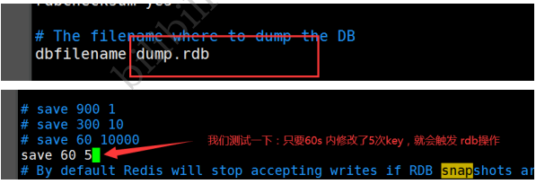

# Redis入门

## Redis是什么

Redis（Remote Dictionary Server )，即远程字典服务，是一个开源的使用ANSI C语言编写、支持网络、可基于内存亦可持久化的日志型、Key-Value数据库，并提供多种语言的API。

[Redisopen in new window](https://redis.io/) （**RE**mote **DI**ctionary **S**erver）是一个基于 C 语言开发的开源 NoSQL 数据库（BSD 许可）。与传统数据库不同的是，Redis 的数据是保存在内存中的（内存数据库，支持持久化），因此读写速度非常快，被广泛应用于分布式缓存方向。并且，Redis 存储的是 KV 键值对数据。

## Redis能干嘛

- 内存存储、持久化，内存是断电即失的，所有持久化很重要（rdb、aof）
- 效率高，可以用于高速缓存
- 发布订阅系统
- 地图信息分析
- 计数器、计时器（浏览量）

## Redis特性

- 多样的数据类型
- 持久化
- 集群
- 事务

# linux安装redis

## 安装

[下载链接](http://download.redis.io/releases)

将下载好的文件上传至服务器`yangyulin/opt`目录下，并解压文件。

```shell
tar -zxvf redis-7.0.5.tar.gz
```

进入解压后的文件

 

在当前文件夹下执行`make`和`make install`命令（需要root权限）

 

 

redis安装后的默认安装路径为`/usr/local/bin`，进入当前文件夹，并在此文件夹下新建一个`yconfig`文件夹，将redis的配置文件`yangyulin/opt/redis-7.0.5/redis.conf`复制到`usr/local/bin/yconfig`文件夹下。之后我们会使用`yconfig/redis.conf`这个配置文件启动。

```shell
cp /opt/redis-7.0.5/redis.conf yconfig
```

 

然后我们进入`yconfig`文件夹，修改配置文件，设置redis为后台启动

```shell
vim redis.conf
```

 

保存并退出`:wq`

在使用的过程中我们为了防止某些错误，所以需要手动设置redis的日志文件。我们在`/home/yangyulin/opt/redis-7.0.5`目录下新建文件 `redis.log`

注意：这里没有设置redis.log在`usr/local/bin`目录下是因为这些文件操作需要root权限，导致我们没有办法使用普通用户启动redis。因为要写入日志。


然后到`usr/local/bin/yconfig/redis.conf`文件中修改日志文件的路径

```shell
[root@localhost redis-7.0.5]# cd /usr/local/bin/yconfig
[root@localhost yconfig]# vim redis.conf
```

 

同时修改文件的权限

```shell
chmod 777 /home/yangyulin/opt/redis-7.0.5/redis.log #所有人
```

## 启动

我们需要在`/usr/local/bin`目录下执行命令

```shell
redis-server yconfig/redis.conf
redis-cli -p 6379
```

 

此时我们可以打开另外一个会话，查看redis进程

```shell
ps -ef|grep redis
```

 

关闭redis `shutdown`并`exit`

 

## 测试性能

redis-benchmark是一个压力测试工具，官方自带的性能测试工具
redis-benchmark 命令参数

 

我们来简单测试一下

```shell
#测试：100个并发，10万个请求
redis-benchmark -h localhost -p 6379 -c 100 -n 100000
```

 

 

# Redis基础知识

## 数据库

redis默认有16个数据库（可以在`redis.conf`中查看），默认使用的是第0个。
1.可以使用select 进行切换数据库

2.查看数据库大小


3.清空当前数据库

```
flushdb
```

4.清空全部数据库内容

```
flushall
```

## 单线程

redsi很快，redis基于内存操作，cpu不是redis性能瓶颈，redis的瓶颈是根据机器的内存和网络带宽，既然可以使用单线程来实现，就使用单线程。
redis是c语言写的，官方数据是100000+的QPS,这个不必同样使用key-value的Memecache差
redis为什么单线程还这么快

1. 误区一：高性能的服务器一定是多线程的？
2. 误区二：多线程一定比单线程高！

核心：redis将所有数据全部放在内存中，所以说使用单线程去操作效率高，假如使用多线程（则会因为cpu上下文切换导致耗时操作），对于内存系统来说，如果没有上下文切换效率是最高的，多次读写都是在一个cpu上的，在内存情况下，这个就是最佳方案！

Redis是开放源代码（BSD许可）的内存中数据结构存储，用作数据库，缓存和消息中间件MQ。Redis提供数据结构，例如字符串，哈希，列表，集合，带范围查询的排序集合，位图，超日志，地理空间索引和流。Redis具有内置的复制，Lua脚本，LRU驱逐，事务和不同级别的磁盘持久性，并通过Redis Sentinel和Redis Cluster自动分区提供了高可用性

> 为什么redis这么快？
>
> Redis 内部做了非常多的性能优化，比较重要的有下面 3 点：
>
> 1. Redis 基于==内存==，内存的访问速度比磁盘快很多；
> 2. Redis 基于 Reactor 模式设计开发了一套高效的事件处理模型，主要是单线程事件循环和 IO 多路复用（Redis 线程模式后面会详细介绍到）；
> 3. Redis 内置了多种优化过后的数据类型/结构实现，性能非常高。
> 4. Redis 通信协议实现简单且解析高效。

## redis-key

```shell
127.0.0.1:6379> flushall # 删除所有数据库中所有的key
OK
127.0.0.1:6379> clear
127.0.0.1:6379> set name yangyulin 
OK
127.0.0.1:6379> set age 24
OK
127.0.0.1:6379> keys *
1) "age"
2) "name"
127.0.0.1:6379> exists name
(integer) 1
127.0.0.1:6379> exists sex
(integer) 0
127.0.0.1:6379> expire name 10
(integer) 1
127.0.0.1:6379> ttl name
(integer) 6
127.0.0.1:6379> ttl name
(integer) -2
127.0.0.1:6379> get name
(nil)
127.0.0.1:6379> keys *
1) "age"
127.0.0.1:6379> move age 1 #移除age 后面的1为移除的数量

(integer) 1
127.0.0.1:6379> keys *
(empty array)
127.0.0.1:6379> set name yangyulin
OK
127.0.0.1:6379> type name #查看属性
string
```

 


 

后面不会的命令可以在官网查相关命令 [command](https://redis.io/docs/latest/commands/)
 


# 五大基本类型

## 1、String

大多数时候我们都只用到`String`类型

### 基本使用

```shell
127.0.0.1:6379> keys * #查看所有的key
(empty array)
127.0.0.1:6379> set key1 v1 #设置key1，值为v1
OK
127.0.0.1:6379> get key1 #查看key1
"v1"
127.0.0.1:6379> keys * 
1) "key1"
127.0.0.1:6379> EXISTS key1 #查看是否存在名为key1的键
(integer) 1
127.0.0.1:6379> APPEND key1 "Hello" #字符串拼接，如果不存在，则新建值
(integer) 7
127.0.0.1:6379> get key1
"v1Hello"
127.0.0.1:6379> STRLEN key1 #返回长度
(integer) 7
127.0.0.1:6379> APPEND key1 ",yyl"
(integer) 11
127.0.0.1:6379> STRLEN key1
(integer) 11
127.0.0.1:6379> get key1
"v1Hello,yyl"
```

### 自增

```shell
127.0.0.1:6379> set views 0 #设置view的次数为0
OK
127.0.0.1:6379> get views #查看view
"0"
127.0.0.1:6379> incr views # 自增+1
(integer) 1
127.0.0.1:6379> incr views
(integer) 2
127.0.0.1:6379> get views
"2"
127.0.0.1:6379> decr views #自减 -1
(integer) 1
127.0.0.1:6379> decr views
(integer) 0
127.0.0.1:6379> get views
"0"
127.0.0.1:6379> incrby views 10 # 自增 +10每次
(integer) 10
127.0.0.1:6379> incrby views 10
(integer) 20
127.0.0.1:6379> get views
"20"
127.0.0.1:6379> decrby views 5 #自减 -5每次
(integer) 15
127.0.0.1:6379> decrby views 5
(integer) 10
127.0.0.1:6379> get views
"10"
```

### 截取字符串`getrange`

```shell
127.0.0.1:6379> clear
127.0.0.1:6379> keys *
(empty array)
127.0.0.1:6379> set key1 "helloworld"
OK
127.0.0.1:6379> get key1
"helloworld"
127.0.0.1:6379> getrange key1 0 2  #截取[0,2]字符串
"hel"
127.0.0.1:6379> getrange key1 0 -1 #获取全部字符串
"helloworld"
```

### 替换字符串`setrange`

```shell
127.0.0.1:6379> set key2 abcdefg
OK
127.0.0.1:6379> get key2
"abcdefg"
127.0.0.1:6379> setrange key2 1 xx #替换从索引为1开始往后的字符为 xx
(integer) 7
127.0.0.1:6379> get key2
"axxdefg"
```

### 设置过期时间`setex`

### 当key不存在时才设置`setnx`

```shell
127.0.0.1:6379> setex key3 30 "hello" # 设置key3，值为"hello" 并在30s后过期
OK #
127.0.0.1:6379> ttl key3 #查询key3的剩余时间
(integer) 17 #17s
127.0.0.1:6379> setnx mykey "redis" #如果mykey存在，则创建失败。否则创建mykey，值为redis。（在分布式锁中常用）
(integer) 1 #返回值为1，说明当前mykey不存在，创建成功
127.0.0.1:6379> keys *
1) "mykey"
2) "key2"
3) "key1"
127.0.0.1:6379> ttl key3 #查询key3时间，-2表示已过期
(integer) -2
127.0.0.1:6379> setnx mykey "MongDB" #如果mykey不存在，则创建并值为"MongDB"
(integer) 0 #返回0，创建失败，说明mykey已经存在
127.0.0.1:6379> get mykey
"redis"
```

### 设置/获取多个值 `mset`、`mget`

```shell
127.0.0.1:6379> keys *
(empty array)
127.0.0.1:6379> mset k1 v1 k2 v2 k3 v3    #同时设置多个值
OK
127.0.0.1:6379> keys *
1) "k3"
2) "k2"
3) "k1"
127.0.0.1:6379> mget k1 k2 k3    #同时获取多个值
1) "v1"
2) "v2"
3) "v3"
127.0.0.1:6379> msetnx k1 v1 k4 v4   #msetnx是一个原子性操作，要么全部成功要么全部失败。这里因为 k1已经存在，所以虽然k4不存在，但也创建失败
(integer) 0
127.0.0.1:6379> get k4
(nil)
```

### 对象

mset user：1{name：zhangsan，age：3}#设置一个user：1对象 

值为json字符来保存一个对象

```shell
127.0.0.1:6379> mset user:1:name fang user:1:age 2
OK
127.0.0.1:6379> mget user:1:name user:1:age
1) "fang"
2) "2"
127.0.0.1:6379> 
```

### 先获取再设置`getset`

先获取值，然后设置新的值。先get再set

```shell
127.0.0.1:6379> getset db redis  #当前并没有db，所以获取为空。但是获取后设置db为 "redis"
(nil)
127.0.0.1:6379> get db
"redis"
127.0.0.1:6379> getset db mongodb #先获取db当前的值为 "redis"，然后设置新的值为 "mongodb"
"redis"
127.0.0.1:6379> get db
"mongodb"
```

string类型的使用场景：value除了字符串还可以是数字

- 计数器
-  统计多单位数量
- 粉丝数
- 对象缓存存储！


## 2、List

Redis列表是简单的字符串列表，按照插入顺序排序。你可以添加一个元素到列表的头部（左边）或者尾部（右边）

一个列表最多可以包含2 32 − 1 2^{32} - 12 
32
 −1 个元素 (4294967295, 每个列表超过40亿个元素)。

首先我们列表，可以经过规则定义将其变为队列、栈、双端队列等

正如图Redis中List是可以进行双端操作的，所以命令也就分为了LXXX和RXXX两类，有时候L也表示List例如LLEN

### 添加元素`lpush,rpush`

```shell
127.0.0.1:6379> lpush list one # lpush可以理解为从列表的左侧插入
(integer) 1
127.0.0.1:6379> lpush list two three #可以一次插入多个元素
(integer) 3
127.0.0.1:6379> rpush list four #rpush可以理解为从列表的右侧插入元素
(integer) 4
127.0.0.1:6379> lrange list 0 -1 #输出列表所有元素，注意看顺序。
1) "three"
2) "two"
3) "one"
4) "four"
```

### 在指定元素前/后添加元素

```shell
127.0.0.1:6379> lrange list 0 -1
1) "four"
2) "three"
3) "two"
4) "one"
127.0.0.1:6379> linsert list before three 3.5 #在元素 three前面插入3.5
(integer) 
127.0.0.1:6379> lrange list 0 -1
1) "four"
2) "3.5"
3) "three"
4) "two"
5) "one" 
127.0.0.1:6379> linsert list after three 2.5 #在元素three后面插入2.5
(integer) 6
127.0.0.1:6379> lrange list 0 -1
1) "four"
2) "3.5"
3) "three"
4) "2.5"
5) "two"
6) "one"
```

### 移除元素`lpop,rpop`

```shell
127.0.0.1:6379> lrange list 0 -1
1) "three"
2) "two"
3) "one"
4) "right"
127.0.0.1:6379> lpop list #从列表左侧移除一个元素
"three"
127.0.0.1:6379> lrange list 0 -1
1) "two"
2) "one"
3) "right"
127.0.0.1:6379> rpop list #从列表右侧移除一个元素
"right"
127.0.0.1:6379> lrange list 0 -1
1) "two"
2) "one"
```

### 移除指定值`lrem`

```shell
127.0.0.1:6379> lrange list 0 -1 #查看当前列表元素 
1) "four"
2) "three"
3) "two"
4) "one"
5) "four"
127.0.0.1:6379> lrem list 1 three #从list列表中移除1个 three
(integer) 1
127.0.0.1:6379> lrange list 0 -1
1) "four"
2) "two"
3) "one"
4) "four"
127.0.0.1:6379> lrem list 2 four #从list列表语出2个four
(integer) 2
127.0.0.1:6379> lrange list 0 -1
1) "two"
2) "one"
```

### 根据索引查看列表元素`lindex`

```shell
127.0.0.1:6379> lrange list 0 -1 #查看列表所有元素
1) "two"
2) "one"
127.0.0.1:6379> lindex list 0
"two"
127.0.0.1:6379> lindex list 1
"one"
127.0.0.1:6379> lindex list 2 #只有两个元素，所以索引2为空
(nil)
```

### 查看列表长度`llen`

```shell
127.0.0.1:6379> lrange list 0 -1
1) "three"
2) "two"
3) "one"
127.0.0.1:6379> llen list
(integer) 3
```

### 修剪`ltrim`

```shell
127.0.0.1:6379> lrange list 0 -1
1) "four"
2) "three"
3) "two"
4) "one"
127.0.0.1:6379> ltrim list 1 2 #截取索引从1~2的元素
OK
127.0.0.1:6379> lrange list 0 -1
1) "three"
2) "two"
```

### 移动元素至另一个列表`rpoplpush`

```shell
127.0.0.1:6379> lrange list 0 -1
1) "four"
2) "three"
3) "two"
4) "one"
127.0.0.1:6379> rpoplpush list newlist #将list列表最右边的元素移动到newlist的左边
"one"
127.0.0.1:6379> lrange list 0 -1
1) "four"
2) "three"
3) "two"
127.0.0.1:6379> lrang newlist 0 -1
(error) ERR unknown command 'lrang', with args beginning with: 'newlist' '0' '-1' 
127.0.0.1:6379> lrange newlist 0 -1
1) "one"
```

### 替换指定位置元素`lset`

```shell
127.0.0.1:6379> lrange list 0 -1
1) "four"
2) "three"
3) "two"
4) "one"
127.0.0.1:6379> lset list 0 newfour #将索引为0的元素修改为newone
OK
127.0.0.1:6379> lrange list 0 -1 
1) "newfour"
2) "three"
3) "two"
4) "one"
```

### 应用场景

1. 实际上是一个双向链表
2. key不存在，创建新链表
3. 移除所有元素，空链表也代表不存在
4. 在两边插入或者改动值，效率高，中间元素，相对效率低

消息队列


## 3、Set(集合) 

Redis的Set是string类型的无序集合。集合成员是唯一的，这就意味着集合中不能出现重复的数据。

Redis 中 集合是通过哈希表实现的，所以添加，删除，查找的复杂度都是O(1)。


```bash
####################################################
127.0.0.1:6379> sadd myset hello  #set集合中添加元素
(integer) 1
127.0.0.1:6379> sadd myset zhangsan
(integer) 1
127.0.0.1:6379> sadd myset lisi
(integer) 1
127.0.0.1:6379> smembers myset  #查看指定set的所有值
1) "hello"
2) "lisi"
3) "zhangsan"
127.0.0.1:6379> sismember myset lisi #判断某一个值是不是在set集合中
(integer) 1
127.0.0.1:6379> sismember myset world
(integer) 0

####################################################
scard
127.0.0.1:6379> scard myset #获取set集合中内容的元素个数！
(integer) 3
127.0.0.1:6379> sadd myset hello
(integer) 0
####################################################
rem
127.0.0.1:6379> srem myset hello #移除set集合中的指定元素
(integer) 1
127.0.0.1:6379> SMEMBERS myset
1) "lisi"
2) "zhangsan"
127.0.0.1:6379> scard myset
(integer) 2

####################################################
set 无序不重复集合。比如：随机抽奖
127.0.0.1:6379> srandmember myset   #随机抽选出一个元素
"lisi"
127.0.0.1:6379> srandmember myset 
"zhangsan"
127.0.0.1:6379> srandmember myset 
"zhangsan"
127.0.0.1:6379> srandmember myset 
"lisi"
127.0.0.1:6379> SMEMBERS myset
1) "lisi"
2) "zhangsan"
127.0.0.1:6379> srandmember myset 2  #随机抽选出两个元素
1) "lisi"
2) "zhangsan"

####################################################
删除定的key，删除随机的key

127.0.0.1:6379> SMEMBERS myset
1) "111"
2) "blue"
3) "lisi"
4) "zhangsan"
127.0.0.1:6379> spop myset  #随机删除一些set集合中的元素
"lisi"
127.0.0.1:6379> spop myset
"111"
127.0.0.1:6379> SMEMBERS myset
1) "blue"
2) "zhangsan"

####################################################
smove 将一个指定的值，移动到另外一个set集合
127.0.0.1:6379> sadd myset world zhangsan 
(integer) 2
127.0.0.1:6379> SMEMBERS myset
1) "hello"
2) "world"
3) "hello2"
4) "hello3"
5) "zhangsan"
127.0.0.1:6379> smove myset myset2 zhangsan   #将myset中的zhangsan移动到myset2集合中去
(integer) 1
127.0.0.1:6379> SMEMBERS myset
1) "world"
2) "hello2"
3) "hello3"
4) "hello"
127.0.0.1:6379> SMEMBERS myset2
1) "zhangsan"

####################################################
微博，B站中的共同关注！(并集)
- 差集  sdiff
- 交集  sinter
- 并集  sunion
127.0.0.1:6379> sadd key1 a b c d 
(integer) 4
127.0.0.1:6379> sadd key2 c d e f
(integer) 4
127.0.0.1:6379> SDIFF key1 key2   #差集
1) "b"
2) "a"
127.0.0.1:6379> SINTER key1 key2  #交集   共同好友就可以这样实现
1) "d"
2) "c"
127.0.0.1:6379> SUNION key1 key2  #并集
1) "b"
2) "c"
3) "e"
4) "a"
5) "d"
6) "f"
127.0.0.1:6379> sadd set1 a b c d
(integer) 4
127.0.0.1:6379> sadd set2 c d e f
(integer) 4
127.0.0.1:6379> sdiffstore set3 set1 set2
(integer) 2
127.0.0.1:6379> smembers set3
1) "a"
2) "b"
```

## 4、Hash（哈希） 

> Redis hash 是一个string类型的field和value的映射表，hash特别适合用于存储对象。
>
> Set就是一种简化的Hash,只变动key,而value使用默认值填充。可以将一个Hash表作为一个对象进行存储，表中存放对象的信息。


Map集合 ， key-map，时候这个值是一个map集合。本质和string类型没有太大区别，还是一个简单的key-value！

```bash
####################################################
127.0.0.1:6379> hset myhash field1 zhangsan  #set一个具体的 key-value
(integer) 1
127.0.0.1:6379> hget myhash field1 #获取一个字段值
"zhangsan"
127.0.0.1:6379> hmset myhash field1 hello field2 world #设置多个key-value
OK
127.0.0.1:6379> hmget myhash field1 field2 #获取多个字段值
1) "hello"
2) "world"
127.0.0.1:6379> hgetall myhash #获取全部的数据
1) "field1"
2) "hello"
3) "field2"
4) "world"
127.0.0.1:6379> hdel myhash field1 #删除hash指定key字段！ 对应的value值也就消失了
(integer) 1
127.0.0.1:6379> HGETALL myhash
1) "field2"
2) "world"
####################################################
hlen #获取hash表的字段数量
127.0.0.1:6379> hmset myhash field hello field3 wufeng field4 lis 
OK
127.0.0.1:6379> HGETALL myhash
1) "field2"
2) "world"
3) "field"
4) "hello"
5) "field3"
6) "wufeng"
7) "field4"
8) "lis"
127.0.0.1:6379> hget myhash field  
"hello"
127.0.0.1:6379> hlen myhash  #获取hash表的字段数量
(integer) 4

####################################################
127.0.0.1:6379> HEXISTS myhash field #判断hash中指定字段是否存在
(integer) 1
127.0.0.1:6379> HEXISTS myhash field6
(integer) 0

####################################################
#只获得所有filed   hkeys
#只获得所有value   hvals
127.0.0.1:6379> HKEYS myhash #获得所有filed
1) "field2"
2) "field"
3) "field3"
4) "field4" 
127.0.0.1:6379> HVALS myhash  #获得所有value
1) "world"
2) "hello"
3) "wufeng"
4) "lis"

####################################################
hincrby #加1  hdecrby #减1
127.0.0.1:6379> hset myhash field6 5  #指定增量为5
(integer) 1
127.0.0.1:6379> HINCRBY myhash field6 1 #数值加1
(integer) 6
127.0.0.1:6379> HINCRBY myhash field6 -2 #数值减2
(integer) 3
127.0.0.1:6379> HSETNX myhash field7 hello #如果不存在则可以设置
(integer) 1
127.0.0.1:6379> HSETNX myhash field6 hello #如果存在则可以设置
(integer) 0
```

hash变更的数据 user name age ,尤其是用户信息之类的，经常变动的信息。 hash更适合于对象的存储，String更加适合字符串的存储。

```java
127.0.0.1:6379> hmset myhash user:1:name zhangsan user:1:age 30 #设置user:{id}:{field}
OK
127.0.0.1:6379> hmget myhash user:1:name user:1:age
1) "zhangsan"
2) "30"
127.0.0.1:6379> HGETALL myhash
1) "field7"
2) "hello"
3) "user:1:name"
4) "zhangsan"
5) "user:1:age"
6) "30"
```

## 5、Zset（有序集合） 

> 不同的是每个元素都会关联一个double类型的分数（score）。redis正是通过分数来为集合中的成员进行从小到大的排序。
>
> score相同：按字典顺序排序
>
> 有序集合的成员是唯一的,但分数(score)却可以重复。


在set的基础上，增加一个值，

 *  set: `k1 v1`
 *  zset: `k1 score1 v1`

```bash
####################################################
127.0.0.1:6379> zadd myset 1 one  #添加一个值
(integer) 1
127.0.0.1:6379> zadd myset 2 two 3 three #添加多个值
(integer) 2
127.0.0.1:6379> zrange myset 0 -1
1) "one"
2) "two"
3) "three"

####################################################
排序如何实现

127.0.0.1:6379> zadd salary 2500 xiaohong  #添加三个用户   薪水，名字
(integer) 1
127.0.0.1:6379> zadd salary 5000 zhangsan
(integer) 1
127.0.0.1:6379> zadd salary 1000 lisi
(integer) 1
127.0.0.1:6379> ZRANGEBYSCORE salary -inf +inf  #显示全部用户，按薪水从小到大排名 -inf：表示负无穷
1) "lisi"
2) "xiaohong"
3) "zhangsan"
127.0.0.1:6379> zrevrange salary 0 -1 withscores # 从大到小进行排序
1) "zhangsan"
2) "5000"
3) "xiaohong"
4) "2500"
127.0.0.1:6379> ZRANGEBYSCORE salary -inf +inf withscores #查找所有的数据 ，withscores：带有的薪水信息
1) "lisi"
2) "1000"
3) "xiaohong"
4) "2500"
5) "zhangsan"
6) "5000"
127.0.0.1:6379> ZRANGEBYSCORE salary -inf 2500 withscores #显示工资小于2500员工的升序排列
1) "lisi"
2) "1000"
3) "xiaohong"
4) "2500"

####################################################
移除：zrem
127.0.0.1:6379> zrange salary 0 -1
1) "lisi"
2) "xiaohong"
3) "zhangsan"
127.0.0.1:6379> zrem salary lisi  #移除有序集合中的指定元素 
(integer) 1
127.0.0.1:6379> zrange salary 0 -1
1) "xiaohong"
2) "zhangsan"
127.0.0.1:6379> zcard salary  #获取集合中的个数
(integer) 2

####################################################
127.0.0.1:6379> zrange myset 0 -1
1) "one"
2) "two"
3) "three"
127.0.0.1:6379> zcount myset 0 2  #获取指定分数区间的成员数量
(integer) 2
127.0.0.1:6379> zcount myset 0 5
(integer) 3

##################################################
127.0.0.1:6379> zrange myzset 0 -1 withscores
1) "one"
2) "1"
3) "two"
4) "2"
5) "three"
6) "3"
127.0.0.1:6379> zcount myzset 0 2
(integer) 2
127.0.0.1:6379> zincrby myzset 2 one
"3"
127.0.0.1:6379> zrange myzset 0 -1 withscores
1) "two"
2) "2"
3) "one"
4) "3"
5) "three"
6) "3"
127.0.0.1:6379> zscore myzset one
"3"
127.0.0.1:6379> zrank myset one
(error) WRONGTYPE Operation against a key holding the wrong kind of value
127.0.0.1:6379> zrank myzset one
(integer) 1
```

应用案例：

 *  set排序 存储班级成绩表 工资表排序！
 *  普通消息，1.重要消息 2.带权重进行判断
 *  排行榜应用实现，取Top N测试

## 6、Geospatial(地理位置) 

> 使用经纬度定位地理坐标并用一个有序集合zset保存，所以zset命令也可以使用


> 有效经纬度

有效的经度从-180度到180度。  
有效的纬度从-85.05112878度到85.05112878度。

> 指定单位的参数 unit 必须是以下单位的其中一个：

m 表示单位为米。

km 表示单位为千米。

mi 表示单位为英里。

ft 表示单位为英尺。

> 关于GEORADIUS的参数

通过georadius就可以完成 附近的人功能

withcoord:带上坐标

withdist:带上距离，单位与半径单位相同

COUNT n : 只显示前n个(按距离递增排序)

> geoadd

```java
#geoadd 添加地理位置
# 规则： 两极无法直接添加，我们一般会下载城市数据，直接通过java程序一次性导入
#参数  key 值(纬度、经度、名称)
    #有效的经度从-180度到180度。
    #有效的纬度从-85.05112878度到85.05112878度。
    #当坐标位置超出上述指定范围时，该命令将会返回一个错误。
127.0.0.1:6379> geoadd china:city  116.40 39.90 beijing
(integer) 1
127.0.0.1:6379> geoadd china:city 121.47 31.23 shanghai
(integer) 1
127.0.0.1:6379> geoadd china:city 106.50 29.53  chongqing
(integer) 1
127.0.0.1:6379> geoadd china:city 114.08 22.54   shenzhen 116.85 38.31 cangzhou
(integer) 2
127.0.0.1:6379> geoadd china:city 120.15 30.28  hangzhou 125.14 42.92 xian
(integer) 2
```

> geopos

```java
获得当前定位：一定是一个坐标值。
127.0.0.1:6379> geopos china:city beijing #获取指定的城市的经度和纬度
1) 1) "116.39999896287918091"
   2) "39.90000009167092543"
127.0.0.1:6379> geopos china:city beijing cangzhou
1) 1) "116.39999896287918091"
   2) "39.90000009167092543"
2) 1) "116.84999853372573853"
   2) "38.30999992507150864"
```

> geodist

两人之间的距离

单位：

 *  m 表示单位为米
 *  km 表示单位为千米
 *  mi 表示单位为英里
 *  ft 表示单位为英尺

```java
127.0.0.1:6379> geodist china:city beijing shanghai km #查看北京到上海的直线距离
"1067.3788"
127.0.0.1:6379> GEODIST china:city beijing chongqing km #查看北京到重庆的直线距离
"1464.0708"
```

> georadius 以给定的经纬度为中心，找出某一半径内的元素

我附近的人？ (获得所有附近的人的地址，定位！) 通过半径来查询

获得指定数量的人为200个 count 200

所有数据应该都录入 china:city ，才会让结果更加清晰

```java
127.0.0.1:6379> GEORADIUS china:city 110 30 500 km #以110 30这个经度纬度为中心，寻找方圆1000km内的城市
1) "chongqing"
127.0.0.1:6379> GEORADIUS china:city 110 30 1000 km
1) "chongqing"
2) "shenzhen"
3) "hangzhou"
127.0.0.1:6379> GEORADIUS china:city 110 30 1000 km withdist #显示到中间距离的位置
1) 1) "chongqing"
   2) "341.9374"
2) 1) "shenzhen"
   2) "923.9364"
3) 1) "hangzhou"
   2) "976.4868"
127.0.0.1:6379> GEORADIUS china:city 110 30 1000 km withdist withcoord  #显示他人的定位信息
1) 1) "chongqing"
   2) "341.9374"
   3) 1) "106.49999767541885376"
      2) "29.52999957900659211"
2) 1) "shenzhen"
   2) "923.9364"
   3) 1) "114.08000081777572632"
      2) "22.53999903789756587"
3) 1) "hangzhou"
   2) "976.4868"
   3) 1) "120.15000075101852417"
      2) "30.2800007575645509"
127.0.0.1:6379> GEORADIUS china:city 110 30 1000 km withdist withcoord  count 1
1) 1) "chongqing"
   2) "341.9374"
   3) 1) "106.49999767541885376"
      2) "29.52999957900659211"
127.0.0.1:6379> GEORADIUS china:city 110 30 1000 km withdist withcoord  count 2 #筛选出指定的结果！
1) 1) "chongqing"
   2) "341.9374"
   3) 1) "106.49999767541885376"
      2) "29.52999957900659211"
2) 1) "shenzhen"
   2) "923.9364"
   3) 1) "114.08000081777572632"
      2) "22.53999903789756587"
127.0.0.1:6379> 

127.0.0.1:6379> georadius china:city 110 30 1000 km withcoord withdist withhash
1) 1) "chongqin"
   2) "341.9374"
   3) (integer) 4026042091628984
   4) 1) "106.49999767541885376"
      2) "29.52999957900659211"
2) 1) "shenzhen"
   2) "923.9364"
   3) (integer) 4046432296800546
   4) 1) "114.08000081777572632"
      2) "22.53999903789756587"
3) 1) "hangzhou"
   2) "976.4868"
   3) (integer) 4054134257390783
   4) 1) "120.15000075101852417"
      2) "30.2800007575645509"
127.0.0.1:6379> georadius china:city 110 30 1000 km withcoord withdist count 2
1) 1) "chongqin"
   2) "341.9374"
   3) 1) "106.49999767541885376"
      2) "29.52999957900659211"
2) 1) "shenzhen"
   2) "923.9364"
   3) 1) "114.08000081777572632"
      2) "22.53999903789756587"
127.0.0.1:6379> georadius china:city 110 30 1000 km withcoord withdist count 2 asc
1) 1) "chongqin"
   2) "341.9374"
   3) 1) "106.49999767541885376"
      2) "29.52999957900659211"
2) 1) "shenzhen"
   2) "923.9364"
   3) 1) "114.08000081777572632"
      2) "22.53999903789756587"
127.0.0.1:6379> georadius china:city 110 30 1000 km withcoord withdist count 2 desc
1) 1) "hangzhou"
   2) "976.4868"
   3) 1) "120.15000075101852417"
      2) "30.2800007575645509"
2) 1) "shenzhen"
   2) "923.9364"
   3) 1) "114.08000081777572632"
      2) "22.53999903789756587"
```

> georadiusbymember

```java
#找出位于指定元素(集合中已经存在)周围的其他元素
127.0.0.1:6379> GEORADIUSBYMEMBER china:city beijing 1000 km
1) "cangzhou"
2) "beijing"
3) "xian"
127.0.0.1:6379> GEORADIUSBYMEMBER china:city shanghai 500km
(error) ERR wrong number of arguments for 'georadiusbymember' command
127.0.0.1:6379> GEORADIUSBYMEMBER china:city shanghai 500 km
1) "hangzhou"
2) "shanghai"
```

> geohash 返回一个或多个位置元素的geohash表示（很少使用到）

该命令将返回11个字符的geohash字符串

```java
#将二维的经纬度转换为一维的字符串，如果两个字符串越近，那么则距离越近。
127.0.0.1:6379> GEOHASH china:city beijing chongqing
1) "wx4fbxxfke0"
2) "wm5xzrybty0"
```

> geo 底层的实现原理其实就是Zset 我们可以使用Zset命令来操作geo

```java
127.0.0.1:6379> ZRANGE china:city 0 -1  #查看地图中全部元素
1) "chongqing"
2) "shenzhen"
3) "hangzhou"
4) "shanghai"
5) "cangzhou"
6) "beijing"
7) "xian"
127.0.0.1:6379> zrem china:city beijing xian  #移除指定元素
(integer) 2
127.0.0.1:6379> ZRANGE china:city 0 -1
1) "chongqing"
2) "shenzhen"
3) "hangzhou"
4) "shanghai"
5) "cangzhou"
```

## 7、Hyperloglog(基数统计) 

> Redis HyperLogLog 是用来做基数统计的算法，HyperLogLog 的优点是，在输入元素的数量或者体积非常非常大时，计算基数所需的空间总是固定的、并且是很小的。
>
> 花费 12 KB 内存，就可以计算接近 2^64 个不同元素的基数。
>
> 因为 HyperLogLog 只会根据输入元素来计算基数，而不会储存输入元素本身，所以 HyperLogLog 不能像集合那样，返回输入的各个元素。
>
> 其底层使用string数据类型

 *  什么是基数？
   
    数据集中不重复的元素的个数。
    
    即独立用户的数量，如：
    
    > 假设我们有一个网站，需要统计每天访问网站的独立用户数量。通常情况下，我们可以使用传统的方法，比如将每个用户的 ID 记录在一个集合中，然后使用集合的大小来统计独立用户数量。但是，当用户量非常大时，这种方法会占用大量内存空间。
    >
    > 这时，我们可以使用 HyperLogLog 来进行基数统计。假设有一天，我们接收到了以下用户访问网站的 ID 数据：
    >
    > 用户ID：\[1001, 2002, 3003, 1001, 4004, 1001, 5005, 6006, 2002\]
    >
    > 现在，我们使用 HyperLogLog 结构来统计这些用户的独立数量。首先，我们将每个用户 ID 进行哈希映射，得到一个哈希值，然后根据哈希值来估计基数。
    >
    > 经过哈希映射后，得到的哈希值可能类似于：  
    > \[0x32, 0x18, 0x7F, 0x32, 0x45, 0x32, 0x92, 0x11, 0x18\]
    >
    > 接着，我们使用位操作来统计零位前导串（zero leading string）的长度。假设经过统计后，得到的零位前导串长度为：  
    > \[5, 4, 6, 5, 3, 5, 7, 2, 4\]
    >
    > 最后，通过对零位前导串长度的统计结果进行分析，就能够估计出独立用户的数量。
    
    
 *  应用场景：
   
     *  网页的访问量（UV）：一个用户多次访问，也只能算作一个人。
     *  传统实现，存储用户的id,然后每次进行比较。当用户变多之后这种方式及其浪费空间，而我们的目的只是计数，Hyperloglog就能帮助我们利用最小的空间完成。


```java
127.0.0.1:6379> PFADD mykey a b c d e f g h k  #创建第一组元素  mykey
(integer) 1
127.0.0.1:6379> PFCOUNT mykey #统计 mykey 元素的基数数量
(integer) 9
127.0.0.1:6379> PFADD mykey2 q w e r t y u i o #创建第二组元素  mykey2
(integer) 1
127.0.0.1:6379> PFCOUNT mykey2
(integer) 9
127.0.0.1:6379> PFMERGE mykey3 mykey mykey2 # 合并两组  mykey mykey2 => mykey3
OK
127.0.0.1:6379> PFCOUNT mykey3 #看并集的数量  相同的不计
(integer) 16
```

如果允许容错，那么一定可以使用Hyperloglog !

如果不允许容错，就使用set或者自己的数据类型即可 ！

原因：

> HyperLogLog 通过概率统计来估计基数是因为其设计的目的是在牺牲一定的精确度的情况下，换取更小的内存占用和更高的性能。这种牺牲精确度来换取效率的策略被称为"概率算法"。
>
> HyperLogLog 的近似值原理基于统计学中的概率方法，利用哈希函数将元素映射到一个固定长度的比特串中，然后根据比特串的特征来估计基数。在实际应用中，HyperLogLog 会对零位前导串（zero leading string）的长度进行统计，并根据统计结果来推测独立元素的数量。
>
> 由于 HyperLogLog 使用的是概率方法，因此得到的结果是一个近似值，而不是精确值。这意味着在某些情况下，可能会出现误差，但通常情况下，这种误差是可以接受的。通过牺牲一定的精确度，HyperLogLog 能够以较小的内存消耗来快速估计大型数据集合的基数，适用于需要高效处理大规模数据的场景。

## 8、BitMaps(位图) 

> 使用位存储，信息状态只有 0 和 1
>
> Bitmap是一串连续的2进制数字（0或1），每一位所在的位置为偏移(offset)，在bitmap上可执行AND,OR,XOR,NOT以及其它位操作。

应用场景: 签到统计、状态统计


统计用户信息,活跃,不活跃!登录,未登录!打卡,未打卡! 两个的状态,都可以使用bitmaps

Bitmaps位图,数据结构!都是操作二进制位来进行记录,就只有0和1两个状态.

365天 = 365bit 1字节 = 8bit 46个字节左右!

使用bitmap来记录 周一到周日的打卡

```java
127.0.0.1:6379> setbit sign 0 1  #周一到周日打卡情况，1代表打卡  0代表未打卡
(integer) 0
127.0.0.1:6379> setbit sign 1 1
(integer) 0
127.0.0.1:6379> setbit sign 3 1
(integer) 0
127.0.0.1:6379> setbit sign 4 0
(integer) 0
127.0.0.1:6379> setbit sign 5 0
(integer) 0
127.0.0.1:6379> setbit sign 6 1
(integer) 0

127.0.0.1:6379> GETBIT sign 5  #查看某一天是否打卡
(integer) 0
127.0.0.1:6379> GETBIT sign 6
(integer) 1

127.0.0.1:6379> bitcount sign #统计这周的打卡记录
(integer) 4
```

bitmaps是一串从左到右的二进制串


# 事务

redis事务本质：一组命令的集合!一个事务中的所有命令都会被序列化，执行过程中按照顺序执行

- 一次性
- 顺序性
- 排他性

**redis单条命令是保持原子性，但是事务不保证原子性**

redis事务没有隔离级别的概念

所有的命令在事务中，并没有被直接执行，只有发起执行命令才会被执行!exec

## 正常执行

```shell
- 开启事务（multi）
	- 命令入队
- 执行事务(exec)/ 或者丢弃事务(discard)
	
127.0.0.1:6379> multi #开启事务命令
OK
127.0.0.1:6379(TX)> set k1 v1 #第一条命令进入事务序列
QUEUED
127.0.0.1:6379(TX)> set k2 v2 #第二条命令进入事务序列
QUEUED
127.0.0.1:6379(TX)> get k2 #第三条命令进入事务序列
QUEUED
127.0.0.1:6379(TX)> set k3 v3 #第四条命令进入事务序列
QUEUED
127.0.0.1:6379(TX)> move k1 1 #第五条命令进入事务序列
QUEUED
127.0.0.1:6379(TX)> exec #执行事务
1) OK
2) OK
3) "v2"
4) OK
5) (integer) 1
127.0.0.1:6379> keys * 
1) "k2"
2) "k3"
127.0.0.1:6379> multi
OK
127.0.0.1:6379(TX)> set k3 v3
QUEUED
127.0.0.1:6379(TX)> discard #可以看到在丢弃事务后，set k3 v3并不被执行
OK
127.0.0.1:6379> keys *
1) "k2"
2) "k1"
```

## 错误执行

我们之前在学习`mysql`的事务时，事务具有统一性，即要么全部执行，要么全部不执行，不可再进行分割。

但在`redis`中，事务不遵循原子性。当事务序列中某条命令出现错误时，如果是**编译型错误**，则整个事务全部被取消。如果是运行时错误，则当前命令不执行，其他命令照常执行，并不影响。

### 编译型错误

编译型错误发生在**编译阶段**，通常是由于代码语法错误、类型错误或者引用错误等导致的。

```shell
127.0.0.1:6379> multi #开启事务
OK 
127.0.0.1:6379(TX)> set k1 v1
QUEUED
127.0.0.1:6379(TX)> setget k2 v2 #这里会报错，因为没有setget这个命令
(error) ERR unknown command 'setget', with args beginning with: 'k2' 'v2' 
127.0.0.1:6379(TX)> get k1
QUEUED
127.0.0.1:6379(TX)> exec #因为出现了编译错误，所以事务中的所有命令都不被执行
(error) EXECABORT Transaction discarded because of previous errors.
127.0.0.1:6379> get k1 #得不到k1
(nil)
```

### 运行时错误

运行时错误发生在**程序执行过程中**，通常是由于代码逻辑错误、数据异常或者外部环境变化等原因导致的。例如 `1/0`，但在运行时由于0不能作为除数导致的错误。

```shell
127.0.0.1:6379> multi
OK
127.0.0.1:6379(TX)> set k1 v1
QUEUED
127.0.0.1:6379(TX)> set k2 1
QUEUED
127.0.0.1:6379(TX)> incr k1 #这里虽然没有报错，但因为k1是string类型，不能使用incr进行自增，会有运行时错误。
QUEUED
127.0.0.1:6379(TX)> incr k2
QUEUED
127.0.0.1:6379(TX)> exec
1) OK
2) OK
3) (error) ERR value is not an integer or out of range #第三条命令执行失败，但不影响其他命令的执行
4) (integer) 2
127.0.0.1:6379> mget k1 k2
1) "v1"
2) "2" # k2自增了
```

# Redis实现乐观锁

悲观锁：很悲观，认为什么时候都会出现问题，无论什么都会加锁，效率降低

乐观锁：很乐观，认为什么时候都不会出现问题，所以不上锁，更新数据时会判断在此期间是否有人改动数据，version！

1. 获取version

2. 更新时比较version

下面举例来说明一下，先来看正常流程。

```shell
127.0.0.1:6379> set money 100 # 设置余额:100
OK
127.0.0.1:6379> set use 0 # 支出使用:0
OK
127.0.0.1:6379> watch money # 监视money (上锁)
OK
127.0.0.1:6379> multi
OK
127.0.0.1:6379> DECRBY money 20
QUEUED
127.0.0.1:6379> INCRBY use 20
QUEUED
127.0.0.1:6379> exec # 监视值没有被中途修改，事务正常执行
1) (integer) 80
2) (integer) 20
```

接下来举例说明乐观锁，测试多线程修改值，使用watch可以当做redis的乐观锁操作。

```shell
# 线程1
127.0.0.1:6379> watch money # money上锁
OK
127.0.0.1:6379> multi
OK
127.0.0.1:6379> DECRBY money 20
QUEUED
127.0.0.1:6379> INCRBY use 20
QUEUED # 此时事务并没有执行

#接下来我们新开一个线程，在这个线程中对money值进行修改
#线程2
127.0.0.1:6379> INCRBY money 500 # 修改了线程一中监视的money
(integer) 600

#然后我们回到线程1中，执行事务
#线程1
127.0.0.1:6379> EXEC # 由于线程2修改了money的值，这个时候就会导致事务执行失败
(nil) # 没有结果，说明事务执行失败
127.0.0.1:6379> get money # 此时查看mone的值，发现是600，线程2的修改生效
"600"
127.0.0.1:6379> get use # 线程1事务执行失败，数值没有被修改
"0"
```

**解决办法：**解锁获取最新值，然后再加锁进行事务。`unwatch`进行解锁。

**注意：每次提交执行exec后都会自动释放锁，不管是否成功**

# Jedis

我们要使用java操作redis

jedis是官方推荐的java连接开发工具，使用java操作redis中间件，如果你要使用java操作redis，那么你一定要对jedis十分熟悉

# 整合springboot

我们新建一个spring项目命名为`redis-02-springboot`，并勾选常用的启动项，例如`lombock`和`web`

我们先来看`redis`的源码，首先到`spring-boot-autoconfigure`的jar包中找到`data/redis/RedisAutoConfiguration`

```java
//RedisAutoconfiguration.java
@AutoConfiguration
@ConditionalOnClass(RedisOperations.class)
@EnableConfigurationProperties(RedisProperties.class)
@Import({ LettuceConnectionConfiguration.class, JedisConnectionConfiguration.class })
public class RedisAutoConfiguration {

	@Bean
    //仅当容器中不存在名为 "redisTemplate" 的 bean 时，才会创建标注该注解的 bean。
	@ConditionalOnMissingBean(name = "redisTemplate")
	@ConditionalOnSingleCandidate(RedisConnectionFactory.class)
    //我们可以自己定义一个redisTemplate来替换这个默认的！
    public RedisTemplate<Object, Object> redisTemplate(RedisConnectionFactory redisConnectionFactory) {
        //默认的RedisTemplate没有过多的设置，redis对象都需要序列化！
        //两个泛型都是object类型，我们使用需要强制转换<String,Object>
        RedisTemplate<Object, Object> template = new RedisTemplate();
        template.setConnectionFactory(redisConnectionFactory);
        return template;
    }

    @Bean
    @ConditionalOnMissingBean
    @ConditionalOnSingleCandidate(RedisConnectionFactory.class)
    //由于String是Redis中最常使用的类型，所有单独提出来一个bean
    public StringRedisTemplate stringRedisTemplate(RedisConnectionFactory redisConnectionFactory) {
        StringRedisTemplate template = new StringRedisTemplate();
        template.setConnectionFactory(redisConnectionFactory);
        return template;
    }
}
```

然后我们知道一定会有一个对应的`RedisProperties`，打开对应文件可以看到我们能自行配置的东西。接下来我们根据这个配置文件来写

## 1、导入依赖

```xml
<dependency>
    <groupId>org.springframework.boot</groupId>
    <artifactId>spring-boot-starter-data-redis</artifactId>
</dependency>
```

## 2、编写配置文件

> application.properties

```properties
# 配置redis
spring.data.redis.host=127.0.0.1
spring.data.redis.port=6379
```

## 3、使用RedisTemplate

到test中写

```java
@SpringBootTest
class Redis02SpringbootApplicationTests {

    //这里原视频用的是@autowird注入，但会报错，所以改为@Resource
    @Resource
    private RedisTemplate redisTemplate;

    @Test
    void contextLoads() {

        //这种API配置很繁琐，后面我们会自己配置API
        redisTemplate.opsForValue().set("key1","v1");
        redisTemplate.opsForValue().set("key2","中文v2");
        System.out.println(redisTemplate.opsForValue().get("key1"));
        System.out.println(redisTemplate.opsForValue().get("key2"));
        
        //Connection操作用的比较少
        RedisConnection connection = redisTemplate.getConnectionFactory().getConnection();
        connection.flushAll();
    }
}
```

 

但是此时我们打开`resic-cli.exe`客户端，再次查询，会发现出现了乱码。这是因为Redis的所有操作都需要序列化的原因，会在后面解释。

 

我们先去看一下默认的序列化是用的什么，打开`RedisTemplate.java`，我们可以看到

```java
@SuppressWarnings("rawtypes") private @Nullable RedisSerializer keySerializer = null;
@SuppressWarnings("rawtypes") private @Nullable RedisSerializer valueSerializer = null;
@SuppressWarnings("rawtypes") private @Nullable RedisSerializer hashKeySerializer = null;
@SuppressWarnings("rawtypes") private @Nullable RedisSerializer hashValueSerializer = null;
```

往下找到，我们可以看到默认的序列化方法，但我们通常使用json序列化，所以需要改写，自定义redisTemplate

 

我们先测试一下如果存入的是对象会怎么样。新建一个pojo包，新建User对象

```java
@Component
@AllArgsConstructor
@NoArgsConstructor
@Data
public class User {

    private String name;
    private int age;
}
```

测试

```java
@SpringBootTest
class Redis02SpringbootApplicationTests {

    @Resource
    private RedisTemplate redisTemplate;

    @Test
    void Test(){
        User user1 = new User("yyl", 23);
        redisTemplate.opsForValue().set("user1", user1);
        System.out.println(redisTemplate.opsForValue().get("user1"));
    }
```

发现出现报错信息，未序列化。

 

然后我们进行序列化，这里我们介绍两种方法，

- 方法一：

  ```java
  @Test
  void Test() throws JsonProcessingException {
      User user1 = new User("yyl", 23);
      String jsonUser = new ObjectMapper().writeValueAsString(user1);
      redisTemplate.opsForValue().set("user1", jsonUser);
      System.out.println(redisTemplate.opsForValue().get("user1"));
  }
  ```

- 方法二：让pojo继承`Serializable`

  ```java
  //对pojo进行序列化
  public class User implements Serializable {
  
      private String name;
      private int age;
  }
  ```

 

虽然这个时候在idea中我们得到了中文，但是在控制台查看依旧是乱码，我们需要自定义redisTemplate来进行序列化。

新建 config包，新建`redisConfig`类，

```java
//redisConfig.java
//者之一种通用的企业序列化方法，可以直接拿来用

@Configuration
public class RedisConfig {
    //编写自己的redsiTemplate
    @Bean
    @SuppressWarnings("all")
    public RedisTemplate<String, Object> redisTemplate(RedisConnectionFactory factory) {

        RedisTemplate<String, Object> template = new RedisTemplate<String, Object>();
        template.setConnectionFactory(factory);

        // 序列化配置 解析任意对象
        Jackson2JsonRedisSerializer jackson2JsonRedisSerializer = new Jackson2JsonRedisSerializer(Object.class);
        // json序列化利用ObjectMapper进行转义
        ObjectMapper om = new ObjectMapper();
        om.setVisibility(PropertyAccessor.ALL, JsonAutoDetect.Visibility.ANY);
        om.enableDefaultTyping(ObjectMapper.DefaultTyping.NON_FINAL);
        jackson2JsonRedisSerializer.setObjectMapper(om);
        // 2.序列化String类型
        StringRedisSerializer stringRedisSerializer = new StringRedisSerializer();

        // key采用String的序列化方式
        template.setKeySerializer(stringRedisSerializer);
        // hash的key也采用String的序列化方式
        template.setHashKeySerializer(stringRedisSerializer);
        // value序列化方式采用jackson
        template.setValueSerializer(jackson2JsonRedisSerializer);
        // hash的value序列化方式采用jackson
        template.setHashValueSerializer(jackson2JsonRedisSerializer);
        template.afterPropertiesSet();

        return template;
    }
```

注意这个时候我们自定义了`redisTemplate`并注入到了`spring`，我们之前在`redisAutoConfig`源码中看到当存在自定义的`redisTemplate`时，默认的自动配置就会失效。我们到测试类中再次测试

```java
@SpringBootTest
class Redis02SpringbootApplicationTests {

    @Autowird
    private RedisTemplate redisTemplate;//这里因为自定义了redisTemplate，所以这里的不再是默认，而是我们自定义的

    @Test
    void Test() throws JsonProcessingException {
        RedisConnection connection = redisTemplate.getConnectionFactory().getConnection();
        connection.flushAll();
        User user1 = new User("yyl", 23);
        //在真实的开发中，一般都会用json进行传输
        redisTemplate.opsForValue().set("user1", user1);
        System.out.println(redisTemplate.opsForValue().get("user1"));
    }
}

```

 

## 4、使用RedisUtils

但是在企业开发中我们通常都会使用自己封装的工具来进行更简洁的操作。

新建包`utils`，新建`RedisUtils`类。注意看下面的代码，我们自己封装的工具类，其实本质上也是调用了`RedisTemplate`的源代码，但是在调用的时候需要加一个异常判断，在我们自己的封装类出现异常和在调用源码后出现异常是不同的。

```java
//RedisUtils.java

package com.yang.utils;

import org.springframework.beans.factory.annotation.Autowired;
import org.springframework.data.redis.core.RedisTemplate;
import org.springframework.stereotype.Component;
import org.springframework.util.CollectionUtils;
import java.util.List;
import java.util.Map;
import java.util.Set;
import java.util.concurrent.TimeUnit;

/**
 redisTemplate封装
 */
@Component
public class RedisUtils {

    //此写法可防止RedisTemplate 注入失败
    private static RedisTemplate redisTemplate;
    @Autowired
    public void setRedisTemplate(RedisTemplate redisTemplate) {
        RedisUtils.redisTemplate = redisTemplate;
    }

    /**

     指定缓存失效时间
     @param key 键
     @param time 时间(秒)
     @return
     */
    public boolean expire(String key,long time){
        try {
            if(time>0){
                redisTemplate.expire(key, time, TimeUnit.SECONDS);
            }
            return true;
        } catch (Exception e) {
            e.printStackTrace();
            return false;
        }
    }
    /**

     根据key 获取过期时间
     @param key 键 不能为null
     @return 时间(秒) 返回0代表为永久有效
     */
    public long getExpire(String key){
        return redisTemplate.getExpire(key,TimeUnit.SECONDS);
    }
    /**

     判断key是否存在
     @param key 键
     @return true 存在 false不存在
     */
    public boolean hasKey(String key){
        try {
            return redisTemplate.hasKey(key);
        } catch (Exception e) {
            e.printStackTrace();
            return false;
        }
    }
    /**

     删除缓存
     @param key 可以传一个值 或多个
     */
    @SuppressWarnings("unchecked")
    public void del(String... key){
        if(key!=null&&key.length>0){
            if(key.length==1){
                redisTemplate.delete(key[0]);
            }else{
                redisTemplate.delete(CollectionUtils.arrayToList(key));
            }
        }
    }
//String=
    /**

     普通缓存获取
     @param key 键
     @return 值
     */
    public Object get(String key){
        return key==null?null:redisTemplate.opsForValue().get(key);
    }
    /**

     普通缓存放入
     @param key 键
     @param value 值
     @return true成功 false失败
     */
    public static boolean set(String key,Object value) {
        try {
            redisTemplate.opsForValue().set(key, value);
            return true;
        } catch (Exception e) {
            e.printStackTrace();
            return false;
        }
    }
    /**

     普通缓存放入并设置时间
     @param key 键
     @param value 值
     @param time 时间(秒) time要大于0 如果time小于等于0 将设置无限期
     @return true成功 false 失败
     */
    public boolean set(String key,Object value,long time){
        try {
            if(time>0){
                redisTemplate.opsForValue().set(key, value, time, TimeUnit.SECONDS);
            }else{
                set(key, value);
            }
            return true;
        } catch (Exception e) {
            e.printStackTrace();
            return false;
        }
    }
    /**

     递增
     @param key 键
     @param delta 要增加几(大于0)
     @return
     */
    public long incr(String key, long delta){
        if(delta<0){
            throw new RuntimeException("递增因子必须大于0");
        }
        return redisTemplate.opsForValue().increment(key, delta);
    }
    /**

     递减
     @param key 键
     @param delta 要减少几(小于0)
     @return
     */
    public long decr(String key, long delta){
        if(delta<0){
            throw new RuntimeException("递减因子必须大于0");
        }
        return redisTemplate.opsForValue().increment(key, -delta);
    }
//Map=
    /**

     HashGet
     @param key 键 不能为null
     @param item 项 不能为null
     @return 值
     */
    public Object hget(String key,String item){
        return redisTemplate.opsForHash().get(key, item);
    }
    /**

     获取hashKey对应的所有键值
     @param key 键
     @return 对应的多个键值
     */
    public Map<Object,Object> hmget(String key){
        return redisTemplate.opsForHash().entries(key);
    }
    /**

     HashSet
     @param key 键
     @param map 对应多个键值
     @return true 成功 false 失败
     */
    public boolean hmset(String key, Map<String,Object> map){
        try {
            redisTemplate.opsForHash().putAll(key, map);
            return true;
        } catch (Exception e) {
            e.printStackTrace();
            return false;
        }
    }
    /**

     HashSet 并设置时间
     @param key 键
     @param map 对应多个键值
     @param time 时间(秒)
     @return true成功 false失败
     */
    public boolean hmset(String key, Map<String,Object> map, long time){
        try {
            redisTemplate.opsForHash().putAll(key, map);
            if(time>0){
                expire(key, time);
            }
            return true;
        } catch (Exception e) {
            e.printStackTrace();
            return false;
        }
    }
    /**

     向一张hash表中放入数据,如果不存在将创建
     @param key 键
     @param item 项
     @param value 值
     @return true 成功 false失败
     */
    public boolean hset(String key,String item,Object value) {
        try {
            redisTemplate.opsForHash().put(key, item, value);
            return true;
        } catch (Exception e) {
            e.printStackTrace();
            return false;
        }
    }
    /**

     向一张hash表中放入数据,如果不存在将创建
     @param key 键
     @param item 项
     @param value 值
     @param time 时间(秒) 注意:如果已存在的hash表有时间,这里将会替换原有的时间
     @return true 成功 false失败
     */
    public boolean hset(String key,String item,Object value,long time) {
        try {
            redisTemplate.opsForHash().put(key, item, value);
            if(time>0){
                expire(key, time);
            }
            return true;
        } catch (Exception e) {
            e.printStackTrace();
            return false;
        }
    }
    /**

     删除hash表中的值
     @param key 键 不能为null
     @param item 项 可以使多个 不能为null
     */
    public void hdel(String key, Object...item){
        redisTemplate.opsForHash().delete(key,item);
    }
    /**

     判断hash表中是否有该项的值
     @param key 键 不能为null
     @param item 项 不能为null
     @return true 存在 false不存在
     */
    public boolean hHasKey(String key, String item){
        return redisTemplate.opsForHash().hasKey(key, item);
    }
    /**

     hash递增 如果不存在,就会创建一个 并把新增后的值返回
     @param key 键
     @param item 项
     @param by 要增加几(大于0)
     @return
     */
    public double hincr(String key, String item,double by){
        return redisTemplate.opsForHash().increment(key, item, by);
    }
    /**

     hash递减
     @param key 键
     @param item 项
     @param by 要减少记(小于0)
     @return
     */
    public double hdecr(String key, String item,double by){
        return redisTemplate.opsForHash().increment(key, item,-by);
    }
//set=
    /**

     根据key获取Set中的所有值
     @param key 键
     @return
     */
    public Set sGet(String key){
        try {
            return redisTemplate.opsForSet().members(key);
        } catch (Exception e) {
            e.printStackTrace();
            return null;
        }
    }
    /**

     根据value从一个set中查询,是否存在
     @param key 键
     @param value 值
     @return true 存在 false不存在
     */
    public boolean sHasKey(String key,Object value){
        try {
            return redisTemplate.opsForSet().isMember(key, value);
        } catch (Exception e) {
            e.printStackTrace();
            return false;
        }
    }
    /**

     将数据放入set缓存
     @param key 键
     @param values 值 可以是多个
     @return 成功个数
     */
    public long sSet(String key, Object...values) {
        try {
            return redisTemplate.opsForSet().add(key, values);
        } catch (Exception e) {
            e.printStackTrace();
            return 0;
        }
    }
    /**

     将set数据放入缓存
     @param key 键
     @param time 时间(秒)
     @param values 值 可以是多个
     @return 成功个数
     */
    public long sSetAndTime(String key,long time,Object...values) {
        try {
            Long count = redisTemplate.opsForSet().add(key, values);
            if(time>0) {
                expire(key, time);
            }
            return count;
        } catch (Exception e) {
            e.printStackTrace();
            return 0;
        }
    }
    /**

     获取set缓存的长度
     @param key 键
     @return
     */
    public long sGetSetSize(String key){
        try {
            return redisTemplate.opsForSet().size(key);
        } catch (Exception e) {
            e.printStackTrace();
            return 0;
        }
    }
    /**

     移除值为value的
     @param key 键
     @param values 值 可以是多个
     @return 移除的个数
     */
    public long setRemove(String key, Object ...values) {
        try {
            Long count = redisTemplate.opsForSet().remove(key, values);
            return count;
        } catch (Exception e) {
            e.printStackTrace();
            return 0;
        }
    }
//=list===
    /**

     获取list缓存的内容
     @param key 键
     @param start 开始
     @param end 结束 0 到 -1代表所有值
     @return
     */
    public List lGet(String key, long start, long end){
        try {
            return redisTemplate.opsForList().range(key, start, end);
        } catch (Exception e) {
            e.printStackTrace();
            return null;
        }
    }
    /**

     获取list缓存的长度
     @param key 键
     @return
     */
    public long lGetListSize(String key){
        try {
            return redisTemplate.opsForList().size(key);
        } catch (Exception e) {
            e.printStackTrace();
            return 0;
        }
    }
    /**

     通过索引 获取list中的值
     @param key 键
     @param index 索引 index>=0时， 0 表头，1 第二个元素，依次类推；index<0时，-1，表尾，-2倒数第二个元素，依次类推
     @return
     */
    public Object lGetIndex(String key,long index){
        try {
            return redisTemplate.opsForList().index(key, index);
        } catch (Exception e) {
            e.printStackTrace();
            return null;
        }
    }
    /**

     将list放入缓存
     @param key 键
     @param value 值
     @return
     */
    public boolean lSet(String key, Object value) {
        try {
            redisTemplate.opsForList().rightPush(key, value);
            return true;
        } catch (Exception e) {
            e.printStackTrace();
            return false;
        }
    }
    /**

     将list放入缓存
     @param key 键
     @param value 值
     @param time 时间(秒)
     @return
     */
    public boolean lSet(String key, Object value, long time) {
        try {
            redisTemplate.opsForList().rightPush(key, value);
            if (time > 0) {
                expire(key, time);
            }
            return true;
        } catch (Exception e) {
            e.printStackTrace();
            return false;
        }
    }
    /**

     将list放入缓存
     @param key 键
     @param value 值
     @return
     */
    public boolean lSet(String key, List value) {
        try {
            redisTemplate.opsForList().rightPushAll(key, value);
            return true;
        } catch (Exception e) {
            e.printStackTrace();
            return false;
        }
    }
    /**

     将list放入缓存
     @param key 键
     @param value 值
     @param time 时间(秒)
     @return
     */
    public boolean lSet(String key, List value, long time) {
        try {
            redisTemplate.opsForList().rightPushAll(key, value);
            if (time > 0) {
                expire(key, time);
            }
            return true;
        } catch (Exception e) {
            e.printStackTrace();
            return false;
        }
    }
    /**

     根据索引修改list中的某条数据
     @param key 键
     @param index 索引
     @param value 值
     @return
     */
    public boolean lUpdateIndex(String key, long index,Object value) {
        try {
            redisTemplate.opsForList().set(key, index, value);
            return true;
        } catch (Exception e) {
            e.printStackTrace();
            return false;
        }
    }
    /**

     移除N个值为value
     @param key 键
     @param count 移除多少个
     @param value 值
     @return 移除的个数
     */
    public long lRemove(String key,long count,Object value) {
        try {
            Long remove = redisTemplate.opsForList().remove(key, count, value);
            return remove;
        } catch (Exception e) {
            e.printStackTrace();
            return 0;
        }
    }
}
```

然后我们测试一下，搞定！

```java
@SpringBootTest
class Redis02SpringbootApplicationTests {

    //注入
    @Autowired
    private RedisUtils redisUtils;

    @Test
    void Test2(){
        redisUtils.set("redis","utils");
    }
}
```

 


# Redis.conf详解

## 1.容量单位

单位不区分大小写，G和GB有区别


## 2.include

可以使用 includes 组合多个配置文件


## 3.网络配置


```shell
bind 127.0.0.1 #绑定的端口
protected-mode no  #保护模式，一般都是开启的
port 6379  #端口设置
```

## 4.通用配置(GENERAL)

```shell
daemonize yes  #以守护进程的方式运行，默认是no ，我们需要自己开启为yes

supervised no # 管理守护进程的，默认为 no 就可以

pidfile /var/run/redis_6379.pid #如果以后台的方式运行，我们就需要指定一个pid文件

# Specify the server verbosity level.
# This can be one of:
# debug (a lot of information, useful for development/testing)
# verbose (many rarely useful info, but not a mess like the debug level)
# notice (moderately verbose, what you want in production probably)
# warning (only very important / critical messages are logged)
loglevel notice   #日志级别
logfile ""  #日志的文件位置名
databases 16  #数据库的数量，默认是16个数据库
always-show-logo no  #是否总是显示log
```

## 5.快照(SNAPSHOTTING) rdb配置

持久化，在规定的时间内，执行了多少次操作，则会持久化到文件 .rdb .aof

redis是内存数据库，如果没有持久化，那么数据断电即失。

```shell
#在3600s内，如果至少有 1 key进行了修改，我们将进行持久化操作
save 3600 1
#在300s内，如果至少有 100 key进行了修改，我们将进行持久化操作
save 300 100
#在 60s 内，如果至少有 10000 key进行了修改，我们将进行持久化操作
save 60 10000
#我们之后学习持久化，会自己定义这个测试

stop-writes-on-bgsave-error yes  #持久化如果出错，是否还需要继续工作。默认开启

rdbcompression yes  #是否压缩rdb文件，需要消耗一些 cpu资源

rdbchecksum yes  #保存rdb文件的视觉，进行错误的检查校验

dir ./  #rdb文件保存的目录
```

## 6.REPLICATION 主从复制，

我们后面讲解主从复制的时候再进行详解

> 在Redis的配置文件（redis.conf）中，可以配置RDB持久化相关的参数：
>
> `save m n`：设置触发RDB持久化的条件和频率。例如，save 900 1表示在900秒（15分钟）内如果至少有1个key被修改，则执行BGSAVE命令生成快照。
> `stop-writes-on-bgsave-error yes/no`：当BGSAVE命令执行失败时，是否停止写入操作。
> `rdbcompression yes/no`：是否对RDB文件进行压缩存储，节省磁盘空间但会增加CPU消耗。
> `rdbchecksum yes/no`：在写入RDB文件时是否进行数据校验。
> `dir /path/to/directory`：指定RDB文件的存储目录。
> `dbfilename dump.rdb`：指定RDB文件的名称。

## 7.SECURITY 安全

```shell
#1.可以再redis.conf配置文件里面修改密码
requirepass 123456 #可以在这里设置redis的密码，默认是没有密码的

#2.可以用命令设置密码
127.0.0.1:6379> ping
(error) NOAUTH Authentication required.  #设置密码后发现所有的命令都没有权限了
127.0.0.1:6379> auth 123456   #使用密码进行登录
OK
127.0.0.1:6379> config get requirepass  #查看redis的密码
1) "requirepass"
2) "123456"
127.0.0.1:6379> config set requirepass "1234567"   #用命令设置redis的密码
```

## 8.CLIENTS 限制（客户端连接相关）

```shell
maxclients 10000  #设置能连上redis的最大客户端的数量

maxmemory <bytes> # redis 配置最大的内存容量，默认是字节

maxmemory-policy noeviction # 内存到达上限之后的处理策略
6种策略
    1、volatile-lru：只对设置了过期时间的key进行LRU（默认值）
    2、allkeys-lru ： 删除lru算法的key
    3、volatile-random：随机删除即将过期key
    4、allkeys-random：随机删除
    5、volatile-ttl ： 删除即将过期的
    6、noeviction ： 永不过期，返回错误

# volatile-lru -> 在具有过期设置的键中使用近似 LRU 进行驱逐。
# allkeys-lru -> 使用近似 LRU 驱逐任何键。
# volatile-lfu -> 在具有过期设置的键中使用近似 LFU 进行驱逐。
# allkeys-lfu -> 使用近似 LFU 驱逐任何键。
# volatile-random -> 从设置了过期时间的密钥中删除一个随机密钥。
# allkeys-random -> 删除随机密钥，任何密钥。
# volatile-ttl -> 删除过期时间最近的密钥（次要 TTL）
# noeviction -> 不驱逐任何东西，只是在写操作上返回错误。

```

## 8.APPEND ONLY 模式 aof配置

```shell
appendonly no # 默认是不开启aof模式的，默认是使用rdb方式持久化的，在大部分所有的情况下，rdb完全够用！
appendfilename "appendonly.aof" # 持久化的文件的名字

# appendfsync always # 每次修改都会 sync。速度比较慢，消耗性能
appendfsync everysec # 每秒执行一次 sync，但可能会丢失这1s的数据！
# appendfsync no # 不执行 sync，这个时候操作系统自己同步数据，速度最快！
```

具体的配置在持久化中详细讲解

# 七、Redis持久化——RDB 

面试和工作，持久化都是重点！

Redis 是内存数据库，如果不将内存中的数据库状态保存到磁盘，那么一旦服务器进程退出，服务器中的数据库状态也会消失。所以 Redis 提供了持久化功能！

> 持久化：在指定时间间隔内将内存数据存入磁盘中，断电也能恢复数据，使用快照文件读到内存中。

RDB：读写文件

## RDB(Redis DataBase) 

> 什么是RDB

用在主从复制中，rdb就是备用的，在从机上面。


在指定的时间间隔内将内存中的数据集快照写入磁盘，也就是行话讲的Snapshot快照，它恢复时是将快照文件直接读到内存里。

Redis会单独创建（fork）一个子进程来进行持久化，会先将数据写入到一个临时文件中，待持久化过程 都结束了，再用这个临时文件替换上次持久化好的文件。整个过程中，主进程是不进行任何IO操作的。 这就确保了极高的性能。如果需要进行大规模数据的恢复，且对于数据恢复的完整性不是非常敏感，那 RDB方式要比AOF方式更加的高效。RDB的缺点是最后一次持久化后的数据可能丢失。我们默认的就是 RDB，一般情况下不需要修改这个配置！

有时候在生产环境我们会将这个文件进行备份！

rdb保存的文件是dump.rdb 都是在我们的配置文件中快照中进行配置的！



### 触发机制 

1.  save的规则满足的情况下，会自动触发rdb原则
2.  执行flushall命令，也会触发我们的rdb原则
3.  退出redis，也会自动产生rdb文件

备份就自动生成一个 dump.rdb


#### 1.save 

使用 save 命令，会立刻对当前内存中的数据进行持久化 ,但是会阻塞，也就是不接受其他操作了；

> 由于 save 命令是同步命令，会占用Redis的主进程。若Redis数据非常多时，save命令执行速度会非常慢，阻塞所有客户端的请求。

示意图：


#### 2.flushall命令 

flushall 命令也会触发持久化 ；

触发持久化规则  
满足配置条件中的触发条件 ；

> 可以通过配置文件对 Redis 进行设置， 让它在“ N 秒内数据集至少有 M 个改动”这一条件被满足时， 自动进行数据集保存操作。


#### 3.bgsave 

bgsave 是异步进行，进行持久化的时候，redis 还可以将继续响应客户端请求 ；

示意图：


bgsave和save对比

<table> 
 <thead> 
  <tr> 
   <th>命令</th> 
   <th>save</th> 
   <th>bgsave</th> 
  </tr> 
 </thead> 
 <tbody> 
  <tr> 
   <td>IO类型</td> 
   <td>同步</td> 
   <td>异步</td> 
  </tr> 
  <tr> 
   <td>阻塞？</td> 
   <td>是</td> 
   <td>是（阻塞发生在fock()，通常非常快）</td> 
  </tr> 
  <tr> 
   <td>复杂度</td> 
   <td>O(n)</td> 
   <td>O(n)</td> 
  </tr> 
  <tr> 
   <td>优点</td> 
   <td>不会消耗额外的内存</td> 
   <td>不阻塞客户端命令</td> 
  </tr> 
  <tr> 
   <td>缺点</td> 
   <td>阻塞客户端命令</td> 
   <td>需要fock子进程，消耗内存</td> 
  </tr> 
 </tbody> 
</table>

> 1.  SAVE:
>
>  *  描述：`SAVE` 命令会阻塞 Redis 服务器进程，直到持久化过程完成为止。它会将当前的数据集以同步阻塞方式保存到磁盘上的一个文件中，这个过程会在主进程中进行。
>  *  特点：
>
>      *  阻塞：`SAVE` 命令会阻塞 Redis 服务器进程，直到持久化过程完成。
>      *  同步：持久化操作是同步执行的，因此会导致服务器停止服务一段时间。
>  *  优点：
>
>      *  简单：`SAVE` 是一个简单的命令，容易理解和使用。
>      *  数据一致性：在持久化期间，Redis 不接受任何请求，因此可以保证数据一致性。
>  *  缺点：
>
>      *  阻塞：持久化过程会阻塞 Redis 服务器，导致服务器暂时无法处理请求，影响性能。
>      *  性能问题：对于大型数据库来说，保存整个数据集可能会消耗大量时间和资源。
>  *  适用场合：适用于小型数据库，或者在数据量不大且可以容忍服务器停止服务一段时间的情况下。
>
> 1.  BGSAVE:
>
>  *  描述：`BGSAVE` 命令会派生一个子进程，由子进程负责将数据集保存到磁盘上的一个文件中。父进程继续处理请求，不会被阻塞。
>  *  特点：
>
>      *  后台执行：`BGSAVE` 是一个后台执行的命令，不会阻塞 Redis 服务器主进程。
>      *  异步：持久化操作是异步执行的，不会影响服务器的响应速度。
>  *  优点：
>
>      *  非阻塞：`BGSAVE` 不会阻塞服务器进程，因此不会影响 Redis 服务器的性能。
>      *  异步：持久化过程在后台执行，不会影响服务器响应请求的能力。
>  *  缺点：
>
>      *  内存占用：`BGSAVE` 使用子进程进行持久化操作，可能会消耗一定的内存资源。
>      *  可能会失败：在某些情况下，`BGSAVE` 操作可能会因为子进程出错或者其他原因失败。
>  *  适用场合：适用于大型数据库，或者在不能容忍服务器停止服务的情况下，因为 `BGSAVE` 不会阻塞 Redis 服务器的主进程。
>
> 总的来说，如果你的数据库较小，且可以容忍短暂的服务停止，那么使用 `SAVE` 是一个简单的选择。但如果你的数据库较大，或者不能容忍服务停止，那么最好使用 `BGSAVE`。

#### 4.如何恢复rdb文件！ 

1、只需要将rdb文件放在我们redis启动目录就可以，redis启动的时候会自动检查dump.rdb 恢复其中的数据！  
2、查看需要存在的位置

```java
127.0.0.1:6379> config get dir
1) "dir"
2) "/usr/local/bin" # 如果在这个目录下存在 dump.rdb 文件，启动就会自动恢复其中的数据
```

#### 5.优缺点 

> 优点：

1.  适合大规模的数据恢复
2.  对数据的完整性要求不高

> 缺点：

1.  需要一定的时间间隔进行操作，如果redis意外宕机了，这个最后一次修改的数据就没有了。
2.  fork进程的时候，会占用一定的内容空间。

> 优点：
>
>  *  RDB持久化生成的快照文件紧凑，适合用于备份和恢复数据。
>  *  在数据恢复时，由于快照是全量的，恢复速度相对较快。
>
> 缺点：
>
>  *  RDB持久化是全量备份，如果Redis进程意外终止，可能会丢失最后一次快照生成后的数据。
>  *  对于大型数据集，生成快照会消耗较多的CPU和IO资源，可能会影响Redis的性能。
>  *  RDB持久化无法实现实时备份，只能通过定期生成快照的方式来保证数据的持久化。
>
> 总的来说，RDB持久化适合对数据一致性要求不是特别高、需要定期备份的场景。对于要求实时持久化并且能够容忍一定数据丢失的场景，AOF持久化更为适合。

# 八、Redis 持久化——AOF 

AOF（Append-Only File）(记录文件)

将我们的所有命令都记录下来，history，恢复的时候就把这个文件全部在执行一遍！

> AOF 是什么


以日志的形式来记录每个写操作，将Redis执行过的所有指令记录下来（读操作不记录），只许追加文件 但不可以改写文件，redis启动之初会读取该文件重新构建数据，换言之，redis重启的话就根据日志文件 的内容将写指令从前到后执行一次以完成数据的恢复工作

Aof保存的是 appendonly.aof 文件

> append


默认是不开启的，我们需要手动进行配置！我们只需要将 appendonly 改为yes就开启了 aof！

重启，redis 就可以生效了！ 如果这个 aof 文件有错位，这时候 redis 是启动不起来的吗，我们需要修复这个aof文件

开启后会生成appendonly.aof文件


在里面写入数据后


看 appendonly.aof 里面会有 写数据的记录


如果这个aof文件有错误，这时候redis是启动不起来的，需要我们修复这个aof文件

redis给我们提供了一个工具 `redis-check-aof --fix`

aof配置文件出错，连接时会出现这个问题


用redis-check-aof --fix 进行恢复


如果文件正常，重启就可以直接恢复了


> 重写规则说明

aof 默认就是文件的无限追加，文件会越来越大！


如果 aof 文件大于 64m，太大了！ fork一个新的进程来将我们的文件进行重写！

> 优点和缺点！

```java
appendonly no # 默认是不开启aof模式的，默认是使用rdb方式持久化的，在大部分所有的情况下，
rdb完全够用！
appendfilename "appendonly.aof" # 持久化的文件的名字
# appendfsync always # 每次修改都会 sync。消耗性能
appendfsync everysec # 每秒执行一次 sync，可能会丢失这1s的数据！
# appendfsync no # 不执行 sync，这个时候操作系统自己同步数据，速度最快！
# rewrite 重写，
```

### 优点 

1、每一次修改都同步，文件的完整会更加好！

2、每秒同步一次，可能会丢失一秒的数据

3、从不同步，效率最高的！

### 缺点 

1、相对于数据文件来说，aof远远大于 rdb，修复的速度也比 rdb慢！

2、Aof 运行效率也要比 rdb 慢，所以我们redis默认的配置就是rdb持久化！

### 扩展： 

1、RDB 持久化方式能够在指定的时间间隔内对你的数据进行快照存储

2、AOF 持久化方式记录每次对服务器写的操作，当服务器重启的时候会重新执行这些命令来恢复原始 的数据，AOF命令以Redis 协议追加保存每次写的操作到文件末尾，Redis还能对AOF文件进行后台重 写，使得AOF文件的体积不至于过大。

3、只做缓存，如果你只希望你的数据在服务器运行的时候存在，你也可以不使用任何持久化

4、同时开启两种持久化方式

 *  在这种情况下，当redis重启的时候会优先载入AOF文件来恢复原始的数据，因为在通常情况下AOF 文件保存的数据集要比RDB文件保存的数据集要完整。
 *  RDB 的数据不实时，同时使用两者时服务器重启也只会找AOF文件，那要不要只使用AOF呢？作者 建议不要，因为RDB更适合用于备份数据库（AOF在不断变化不好备份），快速重启，而且不会有 AOF可能潜在的Bug，留着作为一个万一的手段。

5、性能建议

 *  因为RDB文件只用作后备用途，建议只在Slave上持久化RDB文件，而且只要15分钟备份一次就够 了，只保留 save 900 1 这条规则。
 *  如果Enable AOF ，好处是在最恶劣情况下也只会丢失不超过两秒数据，启动脚本较简单只load自 己的AOF文件就可以了，代价一是带来了持续的IO，二是AOF rewrite 的最后将 rewrite 过程中产 生的新数据写到新文件造成的阻塞几乎是不可避免的。只要硬盘许可，应该尽量减少AOF rewrite 的频率，AOF重写的基础大小默认值64M太小了，可以设到5G以上，默认超过原大小100%大小重 写可以改到适当的数值。
 *  如果不Enable AOF ，仅靠 Master-Slave Repllcation 实现高可用性也可以，能省掉一大笔IO，也 减少了rewrite时带来的系统波动。代价是如果Master/Slave 同时倒掉，会丢失十几分钟的数据， 启动脚本也要比较两个 Master/Slave 中的 RDB文件，载入较新的那个，微博就是这种架构。

> 优点：
>
>  *  可读性高：AOF文件是以文本形式保存的，易于理解和调试。
>  *  容灾性强：AOF文件记录了所有写操作命令，因此可以更可靠地恢复数据。
>  *  适用于追加操作：AOF采用追加方式记录写操作，因此对于磁盘的IO消耗相对较低。
>
> 缺点：
>
>  *  文件较大：由于AOF文件保存了每个写操作命令，因此可能会比RDB生成的快照文件更大。
>  *  恢复速度较慢：由于Redis在启动时需要重新执行AOF文件中的所有写操作，因此恢复速度可能比RDB快照方式慢。
>  *  重写可能会耗时：AOF重写过程可能会耗费一定的时间和资源，尤其是在数据集较大时。
>
> #### 配置AOF持久化 
>
> 在Redis的配置文件中，可以通过以下参数配置AOF持久化：
>
>  *  `appendonly yes/no`：是否开启AOF持久化，默认为no。
>  *  `appendfilename`：AOF文件的文件名，默认为appendonly.aof。
>  *  `appendfsync always/everysec/no`：控制何时将写入操作同步到磁盘，可选值有always（每个写入操作都会同步到磁盘）、everysec（每秒同步一次）和no（不同步）。
>  *  `auto-aof-rewrite-percentage`：触发AOF重写的百分比，默认为100。
>  *  `auto-aof-rewrite-min-size`：AOF文件大小超过该值时，触发AOF重写，默认为64MB。
>
> #### 适用场景 
>
>  *  数据可靠性要求高：AOF持久化记录了每个写操作命令，因此在数据可靠性要求较高的场景下更为适用。
>  *  追加操作频繁：AOF持久化采用追加方式记录写操作，适用于写操作频繁的场景。
>  *  可读性要求高：AOF文件是以文本形式保存的，易于理解和调试，适用于需要对持久化数据进行查看和修改的场景。

> AOF重写是Redis中的一项机制，旨在解决AOF持久化过程中可能出现的文件膨胀和性能问题。在AOF持久化过程中，随着Redis接收到写操作命令的不断累积，AOF文件会不断增长，可能会导致文件体积过大，影响性能和占用过多的磁盘空间。AOF重写机制的作用是生成一个新的AOF文件，该文件与当前数据集的状态相同，但是文件体积更小，仍然能够完整地恢复数据集。
>
> #### AOF重写的工作原理 
>
> 1.  生成新的AOF文件：
>
>  *  AOF重写过程由后台线程完成，不会阻塞主进程。该线程会遍历当前数据集的所有键值对，并生成一系列写命令，这些命令可以完整地重现当前数据集的状态。
>
> 1.  记录生成过程：
>
>  *  在生成新的AOF文件时，Redis会记录当前服务器接收到的所有写命令。这些命令不是原始的客户端写命令，而是生成新AOF文件所需的最少的写命令序列。
>
> 1.  保留最近一次完整写命令序列：
>
>  *  在AOF重写过程中，Redis会记录生成新AOF文件所需的写命令序列。一旦重写完成，Redis会将这个写命令序列写入新的AOF文件中，代替旧的AOF文件。
>
> 1.  切换AOF文件：
>
>  *  当新AOF文件生成完毕并写入完成后，Redis会原子性地将旧的AOF文件替换为新的AOF文件。这样就完成了AOF重写。
>
> #### AOF重写的优点 
>
>  *  降低AOF文件体积：由于AOF重写只记录当前数据集的状态，因此生成的新AOF文件体积通常会小于原始AOF文件。
>  *  减少写操作记录：AOF重写只记录生成新AOF文件所需的最少的写命令序列，而不是全部历史写命令，因此能够降低AOF文件的体积。
>  *  提升性能：AOF重写过程由后台线程完成，不会阻塞主进程，因此不会影响Redis的正常响应速度。

> auto-aof-rewrite-percentage：触发AOF重写的AOF文件体积增长百分比，默认为100%。
>
> 这个配置项指定了触发AOF重写的AOF文件体积增长的百分比阈值。默认情况下，这个值是100%，意味着当AOF文件的体积增长到原始AOF文件的大小的两倍时，Redis就会触发AOF重写过程。
>
> 举个例子来说，假设初始时AOF文件的大小是100MB。如果设置了默认的100%阈值，那么当AOF文件的大小增长到200MB时，就会触发AOF重写。这样做的目的是为了在AOF文件不断增长时，及时触发AOF重写，以防止AOF文件变得过大影响性能或占用过多的磁盘空间。

# 九、RDB和AOF选择 

#### RDB 和 AOF 对比 

<table> 
 <thead> 
  <tr> 
   <th></th> 
   <th>RDB</th> 
   <th>AOF</th> 
  </tr> 
 </thead> 
 <tbody> 
  <tr> 
   <td>启动优先级</td> 
   <td>低</td> 
   <td>高</td> 
  </tr> 
  <tr> 
   <td>体积</td> 
   <td>小</td> 
   <td>大</td> 
  </tr> 
  <tr> 
   <td>恢复速度</td> 
   <td>快</td> 
   <td>慢</td> 
  </tr> 
  <tr> 
   <td>数据安全性</td> 
   <td>丢数据</td> 
   <td>根据策略决定</td> 
  </tr> 
 </tbody> 
</table>

#### 如何选择使用哪种持久化方式？ 

一般来说， 如果想达到足以媲美 PostgreSQL 的数据安全性， 你应该同时使用两种持久化功能。

如果你非常关心你的数据， 但仍然可以承受数分钟以内的数据丢失， 那么你可以只使用 RDB 持久化。

有很多用户都只使用 AOF 持久化， 但并不推荐这种方式： 因为定时生成 RDB 快照（snapshot）非常便于进行数据库备份， 并且 RDB 恢复数据集的速度也要比 AOF 恢复的速度要快。


> 1.  首先，需要创建 RDB 文件的备份，通常是最新的 `dump.rdb` 文件。这是为了确保数据安全。
> 2.  将备份文件保存在一个安全的地方，以防意外情况发生时需要还原数据。
> 3.  通过执行以下两个命令来完成切换持久化方式：首先，使用 `CONFIG SET appendonly yes` 命令开启 AOF 功能；然后，使用 `CONFIG SET save ""` 命令关闭 RDB 功能。这样做之后，Redis 就会开始将写入命令追加到 AOF 文件中，并不再执行 RDB 快照持久化。
> 4.  确保执行完上述命令后，数据库中的键数量没有发生变化，以确保数据持久化的完整性。
> 5.  确保写入命令会被正确地追加到 AOF 文件的末尾，以确保持久化的有效性。
>
> 在步骤3中，第一个命令执行后，Redis 会阻塞直到初始 AOF 文件创建完成为止。这意味着 Redis 会等待 AOF 文件完全初始化之后才会继续处理其他命令请求。一旦 AOF 文件初始化完成，Redis 就会开始将写入命令追加到 AOF 文件末尾。
>
> 第二个命令则是可选的，用于关闭 RDB 功能。如果你愿意的话，你可以同时使用 RDB 和 AOF 这两种持久化功能。然而，需要确保在 `redis.conf` 配置文件中打开 AOF 功能，以防止服务器重启后之前通过 `CONFIG SET` 命令设置的配置被遗忘，导致服务器按照原来的配置启动。

# 十、Redis订阅发布 

Redis 发布订阅(pub/sub)是一种消息通信模式：发送者(pub)发送消息，订阅者(sub)接收消息。如：微信、 微博、关注系统！

Redis 客户端可以订阅任意数量的频道。

订阅/发布消息图：

第一个：消息发送者， 第二个：频道 第三个：消息订阅者！


下图展示了频道 channel1 ， 以及订阅这个频道的三个客户端 —— client2 、 client5 和 client1 之间的 关系：


当有新消息通过 PUBLISH 命令发送给频道 channel1 时， 这个消息就会被发送给订阅它的三个客户端：


> 命令

这些命令被广泛用于构建即时通信应用，比如网络聊天室(chatroom)和实时广播、实时提醒等。


> 测试

订阅端：

```java
127.0.0.1:6379> SUBSCRIBE jihu2  #订阅一个频道jihu2
Reading messages... (press Ctrl-C to quit)
1) "subscribe"
2) "jihu2"
3) (integer) 1
#等待读取推送的信息
1) "message"
2) "jihu2"
3) "hello beauty women"  #自动接收jihu2发布的信息
1) "message"
2) "jihu2"
3) "hello redis"
```

发送端：

```java
[root@localhost bin]# redis-cli -p 6379 #发布者发布消息到频道
127.0.0.1:6379> PUBLISH jihu2 "hello beauty women"  #发布者发布消息到频道
(integer) 1
127.0.0.1:6379> PUBLISH jihu2 "hello redis"
(integer) 1
```

> 原理

Redis是使用C实现的，通过分析 Redis 源码里的 pubsub.c 文件，了解发布和订阅机制的底层实现，籍此加深对 Redis 的理解。

Redis 通过 PUBLISH 、SUBSCRIBE 和 PSUBSCRIBE 等命令实现发布和订阅功能。

微信：

通过 SUBSCRIBE 命令订阅某频道后，redis-server 里维护了一个字典，字典的键就是一个个 频道！， 而字典的值则是一个链表，链表中保存了所有订阅这个 channel 的客户端。SUBSCRIBE 命令的关键， 就是将客户端添加到给定 channel 的订阅链表中。


通过 PUBLISH 命令向订阅者发送消息，redis-server 会使用给定的频道作为键，在它所维护的 channel 字典中查找记录了订阅这个频道的所有客户端的链表，遍历这个链表，将消息发布给所有订阅者。

> 缺点

1.  如果一个客户端订阅了频道，但自己读取消息的速度却不够快的话，那么不断积压的消息会使redis输出缓冲区的体积变得越来越大，这可能使得redis本身的速度变慢，甚至直接崩溃。
2.  这和数据传输可靠性有关，如果在订阅方断线，那么他将会丢失所有在短线期间发布者发布的消息。

> 使用场景

1、实时消息系统！

2、事实聊天！（频道当做聊天室，将信息回显给所有人即可！）

3、订阅，关注系统都是可以的！

稍微复杂的场景，我们就会使用消息中间件MQ处理。

> 当使用 Java 实现 Redis 的发布订阅功能时，我们需要使用 Redis 官方提供的 Java 客户端库 Jedis。确保你已经将 Jedis 添加到项目依赖中。
>
> 下面我将编写两个 Java 类，一个作为发布者，另一个作为订阅者。  
> 发布者（Publisher）
>
> ```java
> import redis.clients.jedis.Jedis;
> 
> public class Publisher {
>     
> public static void main(String[] args) {
> 
>    // 连接到本地 Redis 服务器
>   Jedis jedis = new Jedis("localhost");
>   // 模拟发布消息到频道
>   for (int i = 0; i < 5; i++) {
>          String message = "News Update " + i;
>          jedis.publish("news", message);
>       System.out.println("Published '" + message + "' to channel 'news'");
>          try {
>              Thread.sleep(1000); // 模拟消息发布间隔
>       } catch (InterruptedException e) {
>           e.printStackTrace();
>       }
>      }
>    
>      // 关闭连接
>      jedis.close();
> }
> }
> ```
>    
>    这段代码连接到本地 Redis 服务器，然后模拟发布了 5 条消息到名为 ‘news’ 的频道，并且在控制台上打印了发布的消息内容。  
> 订阅者（Subscriber）
> 
> ```java
>    import redis.clients.jedis.Jedis;
>    import redis.clients.jedis.JedisPubSub;
>    
> public class Subscriber {
>    public static void main(String[] args) {
>      // 连接到本地 Redis 服务器
>    Jedis jedis = new Jedis("localhost");
>   // 订阅消息
>   jedis.subscribe(new JedisPubSub() {
>      @Override
>       public void onMessage(String channel, String message) {
>           System.out.println("Received message: " + message);
>      }
>   }, "news");
> }
> }
> ```
> 
> 这段代码连接到本地 Redis 服务器，然后订阅了名为 ‘news’ 的频道，并且实现了 onMessage 方法来处理接收到的消息，在控制台上打印出来。  
> 运行代码  
> 确保 Redis 服务器正在运行，然后在不同的终端中分别运行发布者和订阅者的 Java 类，你会看到订阅者接收到发布者发布的消息。  
>  通过这种方式，你可以在 Java 中使用 Redis 的发布订阅功能，实现消息的发布和订阅。

# 十一、Redis主从复制 

#### 概念 

主从复制，是指将一台Redis服务器的数据，复制到其他的Redis服务器。前者称为主节点 (master/leader)，后者称为从节点(slave/follower)；数据的复制是单向的，只能由主节点到从节点。 Master以写为主，Slave 以读为主。

默认情况下，每台Redis服务器都是主节点;

且一个主节点可以有多个从节点(或没有从节点)，但一个从节点只能有一个主节点。

主从复制的作用主要包括：

1. **数据冗余：**主从复制实现了数据的热备份，是持久化之外的一种数据冗余方式。
2. **故障恢复：**当主节点出现问题时，可以由从节点提供服务，实现快速的故障恢复；实际上是一种服务 的冗余。
3. **负载均衡：**在主从复制的基础上，配合读写分离，可以由主节点提供写服务，由从节点提供读服务 （即写Redis数据时应用连接主节点，读Redis数据时应用连接从节点），分担服务器负载；尤其是在写 少读多的场景下，通过多个从节点分担读负载，可以大大提高Redis服务器的并发量。
4. **高可用（集群）基石：**除了上述作用以外，主从复制还是哨兵和集群能够实施的基础，因此说主从复 制是Redis高可用的基础

一般来说，要将Redis运用于工程项目中，只使用一台Redis是万万不能的（宕机），原因如下：

- 从结构上，单个Redis服务器会发生单点故障，并且一台服务器需要处理所有的请求负载，压力较 大；

- 从容量上，单个Redis服务器内存容量有限，就算一台Redis服务器内存容量为256G，也不能将所有 内存用作Redis存储内存，一般来说，单台Redis最大使用内存不应该超过20G。

电商网站上的商品，一般都是一次上传，无数次浏览的，说专业点也就是"多读少写"。

对于这种场景，我们可以使如下这种架构：


主从复制，读写分离！ 80% 的情况下都是在进行读操作！减缓服务器的压力！架构中经常使用！ 一主 二从！

只要在公司中，主从复制就是必须要使用的，因为在真实的项目中不可能单机使用Redis！

#### 环境配置 

只配置从库，不用配置主库！

```bash
127.0.0.1:6379> info replication  #查看当前库的信息
# Replication
role:master   #角色  master
connected_slaves:0  # 0 表示没有从机
master_failover_state:no-failover
master_replid:f80a04ead679af98a1c84518b78e529a0a33c986
master_replid2:0000000000000000000000000000000000000000
master_repl_offset:0
second_repl_offset:-1
repl_backlog_active:0
repl_backlog_size:1048576
repl_backlog_first_byte_offset:0
repl_backlog_histlen:0
```

复制3个配置文件，然后修改对应的信息

要想改一个启动项

要改以下四步： ( redis80.confshu ）

1.  端口 
1.  pid名字
1.  log文件名字 
1.  dump.rdb 名字


修改完毕后，启动我们的3个redis服务器，可以通过进程信息查看


#### 一主二从 

默认情况下，每台Redis服务器都是主节点; 我们一般情况下只用配置从机就好了。

主（79） 二从( 80 , 81 )

从机中查看：

```bash
127.0.0.1:6380> SLAVEOF 127.0.0.1 6379   #SLAVEOF host 6379  找谁当自己的老大
OK
127.0.0.1:6380> info repilcation
127.0.0.1:6380> info replication
# Replication
role:slave   #当前角色是从机
master_host:127.0.0.1   #可以看到主机的信息
master_port:6379
master_link_status:up
master_last_io_seconds_ago:3
master_sync_in_progress:0
slave_read_repl_offset:28
slave_repl_offset:28
slave_priority:100
slave_read_only:1
replica_announced:1
connected_slaves:0
master_failover_state:no-failover
master_replid:a0e8a30728e95d67d6b191795452ea27b934ba67
master_replid2:0000000000000000000000000000000000000000
master_repl_offset:28
second_repl_offset:-1
repl_backlog_active:1
repl_backlog_size:1048576
repl_backlog_first_byte_offset:1
repl_backlog_histlen:28
```

主机中查看(此时两个从机都配置完毕了)：

```bash
127.0.0.1:6379> info replication
# Replication
role:master
connected_slaves:2   #多了从机的配置
slave0:ip=127.0.0.1,port=6380,state=online,offset=196,lag=0  #多了从机的配置
slave1:ip=127.0.0.1,port=6381,state=online,offset=196,lag=1
master_failover_state:no-failover
master_replid:a0e8a30728e95d67d6b191795452ea27b934ba67
master_replid2:0000000000000000000000000000000000000000
master_repl_offset:196
second_repl_offset:-1
repl_backlog_active:1
repl_backlog_size:1048576
repl_backlog_first_byte_offset:1
repl_backlog_histlen:196
```

真实的主从配置应该在配置文件中配置，这样的话是永久的，我们这里使用的是命令是暂时的。

这里是在配置文件中配置 主从信息


> 细节

主机可以写，从机不能写只能读。 主机中的所有信息和数据，都会自动被从机保存。

主机写：


从机只能读取内容


测试：主机断开连接，从机依旧连接到主机的，但是没有写操作，这个时候，主机如果回来了，从机依 旧可以直接获取到主机写的信息！

如果是使用命令行，来配置的主从，这个时候如果重启了，就会变回主机！只要变为从机，立马就会从 主机中获取值！

> 赋值原理

Slave 启动成功连接到 master 后会发送一个sync同步命令

Master 接到命令，启动后台的存盘进程，同时收集所有接收到的用于修改数据集命令，在后台进程执行 完毕之后，master将传送整个数据文件到slave，并完成一次完全同步。

全量复制：而slave服务在接收到数据库文件数据后，将其存盘并加载到内存中。

增量复制：Master 继续将新的所有收集到的修改命令依次传给slave，完成同步

但是只要是重新连接master，一次完全同步（全量复制）将被自动执行！ 我们的数据一定可以在从机中看到！

> 层层链路

上一个M链接下一个 S！


这时候也可以完成我们的主从复制！

> 如果没有老大了，这个时候能不能选择一个老大出来呢？ 需手动设置！

谋朝篡位

如果主机断开了连接，我们可以使用`SLAVEOF no one` 让自己变成主机！其他的节点就可以手动连 接到最新的这个主节点（手动）！ 如果这个时候老大修复了，那就重新连接！

# 十二、哨兵模式 

（自动选举老大的模式）

> 概述

主从切换技术的方法是：当主服务器宕机后，需要手动把一台从服务器切换为主服务器，这就需要人工 干预，费事费力，还会造成一段时间内服务不可用。这不是一种推荐的方式，更多时候，我们优先考虑 哨兵模式。Redis从2.8开始正式提供了`Sentinel`（哨兵） 架构来解决这个问题。

谋朝篡位的自动版，能够后台监控主机是否故障，如果故障了根据投票数自动将从库转换为主库。

哨兵模式是一种特殊的模式，首先Redis提供了哨兵的命令，哨兵是一个独立的进程，作为进程，它会独立运行。其原理是哨兵通过发送命令，等待Redis服务器响应，从而监控运行的多个Redis实例。

> Redis中的哨兵模式是一种用于实现高可用性（high availability）的机制。在Redis中，哨兵（Sentinel）是一个独立的进程，负责监控主数据库（master）和从数据库（slave），并在主数据库失效时自动将一个从数据库提升为新的主数据库，以确保系统的持续可用性。
>
> 以下是Redis中哨兵模式的主要组成部分和工作原理：
>
> 1.  哨兵（Sentinel）：哨兵是一个独立的进程，负责监控Redis中的主数据库和从数据库。哨兵会定期向主数据库和从数据库发送PING命令来检测它们的状态，并在发现主数据库不可用时，选举出一个新的主数据库。
> 2.  主数据库（Master）：主数据库是Redis中的主要数据存储节点，负责处理所有写操作，并将数据同步到从数据库。
> 3.  从数据库（Slave）：从数据库是主数据库的备份节点，负责接收来自主数据库的数据复制，并在主数据库失效时，通过选举成为新的主数据库。
>
> 工作流程如下：
>
>  *  初始阶段，哨兵监控着系统中的主数据库和从数据库。
>  *  如果主数据库失效（比如宕机），哨兵会开始进行故障检测。
>  *  哨兵会根据预设的条件（例如，主数据库不可用的连续次数）来决定是否宣布主数据库失效。
>  *  一旦主数据库失效，哨兵会从当前的从数据库中选举出一个新的主数据库。
>  *  选举出的新主数据库将会向哨兵报告自己的状态，并成为系统中的主数据库。
>  *  哨兵会更新系统中所有的从数据库，使它们成为新主数据库的从数据库，并开始将数据复制到它们。

> 在Redis Sentinel（哨兵）中，用于选举主节点的算法主要是基于哨兵之间的通信和协作。哨兵通过相互通信来达成一致，选择一个合适的从节点作为新的主节点。主要的选举算法包括：
>
> 1.  投票选举算法：
>
>  *  在Redis Sentinel中，当哨兵检测到主节点不可用时，它会发起一次选举过程。
>  *  每个哨兵都会投票给自己认为适合成为新主节点的从节点。
>  *  哨兵将投票结果进行汇总，并选择得到最多票数的从节点作为新的主节点。
>  *  如果存在多个从节点获得相同数量的选票，则根据一定的优先级规则进行进一步的决定，例如根据从节点的复制偏移量（复制进度）或者ID等因素进行排序。
>
> 1.  加权投票选举算法：
>
>  *  类似于投票选举算法，但是不同哨兵的投票可能具有不同的权重，这可以根据哨兵的配置或性能来调整。
>  *  通过给具有更高权重的哨兵赋予更多的投票权，可以在选举过程中更加重视它们的投票结果。
>
> 1.  基于节点健康度的选举算法：
>
>  *  在进行选举时，哨兵可能会考虑到每个从节点的健康度。
>  *  如果一个从节点被认为更健康或者复制进度更接近于主节点，则它可能会获得更多的选票，从而有更大的机会成为新的主节点。


这里的哨兵有两个作用

 *  通过发送命令，让Redis服务器返回监控其运行状态，包括主服务器和从服务器。
 *  当哨兵监测到master宕机，会自动将slave切换成master，然后通过发布订阅模式通知其他的从服 务器，修改配置文件，让它们切换主机。

然而一个哨兵进程对Redis服务器进行监控，可能会出现问题，为此，我们可以使用多个哨兵进行监控。 各个哨兵之间还会进行监控，这样就形成了多哨兵模式。


假设主服务器宕机，哨兵1先检测到这个结果，系统并不会马上进行failover过程，仅仅是哨兵1主观的认 为主服务器不可用，这个现象成为主观下线。当后面的哨兵也检测到主服务器不可用，并且数量达到一 定值时，那么哨兵之间就会进行一次投票，投票的结果由一个哨兵发起，进行failover\[故障转移\]操作。 切换成功后，就会通过发布订阅模式，让各个哨兵把自己监控的从服务器实现切换主机，这个过程称为 客观下线。

> 测试

我们目前的状态是 一主二从！

1、配置哨兵配置文件 sentinel.conf

```bash
# sentinel monitor 被监控的名称 host port 1
sentinel monitor myredis 127.0.0.1 6379 1   
#后面的这个数字1 ，代表主机挂了，从机投票看让谁接替成为主机，票数最多的，就会成为主机。
```

> 1.  sentinel：这是Redis Sentinel的命令行工具。
> 2.  monitor：这是sentinel命令的一个子命令，用于指示哨兵开始监视一个Redis实例。
> 3.  myredis：这是要监视的Redis实例的名称。它是一个用户定义的标识符，用于在监视多个Redis实例时进行区分。
> 4.  127.0.0.1：这是要监视的Redis实例的主机地址。在这里，使用的是本地主机（localhost）的IP地址。
> 5.  6379：这是要监视的Redis实例的端口号。在这里，Redis实例使用的是默认的6379端口。
> 6.  1：这是指定了要求多少个哨兵同意（包括自身）才将一个节点标记为主节点。在这里，使用的是"1"，表示只需要一个哨兵同意即可。
>
> 综合起来，该命令告诉Redis Sentinel开始监视一个名为 “myredis” 的Redis实例，该实例位于本地主机的6379端口，如果至少有一个哨兵同意，它将标记一个节点为主节点。

2.启动哨兵

```java
[root@localhost bin]# redis-sentinel kconfig/sentinel.conf
```


如果Master 节点断开了，这个时候就会从从机中随机选择一个服务器！ （这里面有一个投票算法！）


哨兵日志！ (指定6381为主节点)


> 哨兵模式

如果主机此时回来了，只能归并到新的主机下，当做从机，这就是哨兵模式的规则！

> 哨兵模式优缺点

优点：

1.  哨兵集群，基于主从复制模式，所有主从复制的优点，它都有
2.  主从可以切换，故障可以转移，系统的可用性更好
3.  哨兵模式是主从模式的升级，手动到自动，更加健壮

缺点：

1.  Redis不好在线扩容，集群容量一旦达到上限，在线扩容就十分麻烦
2.  实现哨兵模式的配置其实是很麻烦的，里面有很多配置项

> 哨兵模式的全部配置

完整的哨兵模式配置文件 sentinel.conf

```bash
# Example sentinel.conf

# 哨兵sentinel实例运行的端口 默认26379
port 26379

# 哨兵sentinel的工作目录
dir /tmp

# 哨兵sentinel监控的redis主节点的 ip port 
# master-name  可以自己命名的主节点名字 只能由字母A-z、数字0-9 、这三个字符".-_"组成。
# quorum 当这些quorum个数sentinel哨兵认为master主节点失联 那么这时 客观上认为主节点失联了
# sentinel monitor <master-name> <ip> <redis-port> <quorum>
sentinel monitor mymaster 127.0.0.1 6379 1

# 当在Redis实例中开启了requirepass foobared 授权密码 这样所有连接Redis实例的客户端都要提供密码
# 设置哨兵sentinel 连接主从的密码 注意必须为主从设置一样的验证密码
# sentinel auth-pass <master-name> <password>
sentinel auth-pass mymaster MySUPER--secret-0123passw0rd


# 指定多少毫秒之后 主节点没有应答哨兵sentinel 此时 哨兵主观上认为主节点下线 默认30秒
# sentinel down-after-milliseconds <master-name> <milliseconds>
sentinel down-after-milliseconds mymaster 30000

# 这个配置项指定了在发生failover主备切换时最多可以有多少个slave同时对新的master进行 同步，
这个数字越小，完成failover所需的时间就越长，
但是如果这个数字越大，就意味着越 多的slave因为replication而不可用。
可以通过将这个值设为 1 来保证每次只有一个slave 处于不能处理命令请求的状态。
# sentinel parallel-syncs <master-name> <numslaves>
sentinel parallel-syncs mymaster 1


# 故障转移的超时时间 failover-timeout 可以用在以下这些方面： 
#1. 同一个sentinel对同一个master两次failover之间的间隔时间。
#2. 当一个slave从一个错误的master那里同步数据开始计算时间。直到slave被纠正为向正确的master那里同步数据时。
#3.当想要取消一个正在进行的failover所需要的时间。  
#4.当进行failover时，配置所有slaves指向新的master所需的最大时间。不过，即使过了这个超时，slaves依然会被正确配置为指向master，但是就不按parallel-syncs所配置的规则来了
# 默认三分钟
# sentinel failover-timeout <master-name> <milliseconds>
sentinel failover-timeout mymaster 180000

# SCRIPTS EXECUTION

#配置当某一事件发生时所需要执行的脚本，可以通过脚本来通知管理员，例如当系统运行不正常时发邮件通知相关人员。
#对于脚本的运行结果有以下规则：
#若脚本执行后返回1，那么该脚本稍后将会被再次执行，重复次数目前默认为10
#若脚本执行后返回2，或者比2更高的一个返回值，脚本将不会重复执行。
#如果脚本在执行过程中由于收到系统中断信号被终止了，则同返回值为1时的行为相同。
#一个脚本的最大执行时间为60s，如果超过这个时间，脚本将会被一个SIGKILL信号终止，之后重新执行。

#通知型脚本:当sentinel有任何警告级别的事件发生时（比如说redis实例的主观失效和客观失效等等），将会去调用这个脚本，
#这时这个脚本应该通过邮件，SMS等方式去通知系统管理员关于系统不正常运行的信息。调用该脚本时，将传给脚本两个参数，
#一个是事件的类型，
#一个是事件的描述。
#如果sentinel.conf配置文件中配置了这个脚本路径，那么必须保证这个脚本存在于这个路径，并且是可执行的，否则sentinel无法正常启动成功。
#通知脚本  用shell编写
# sentinel notification-script <master-name> <script-path>
  sentinel notification-script mymaster /var/redis/notify.sh

# 客户端重新配置主节点参数脚本
# 当一个master由于failover而发生改变时，这个脚本将会被调用，通知相关的客户端关于master地址已经发生改变的信息。
# 以下参数将会在调用脚本时传给脚本:
# <master-name> <role> <state> <from-ip> <from-port> <to-ip> <to-port>
# 目前<state>总是“failover”,
# <role>是“leader”或者“observer”中的一个。 
# 参数 from-ip, from-port, to-ip, to-port是用来和旧的master和新的master(即旧的slave)通信的
# 这个脚本应该是通用的，能被多次调用，不是针对性的。
# sentinel client-reconfig-script <master-name> <script-path>
sentinel client-reconfig-script mymaster /var/redis/reconfig.sh  #一般都是由运维来配置。
```

> `sentinel parallel-syncs mymaster 1`:
>
> 这条Redis Sentinel配置命令指定了在执行故障转移期间，要将从节点重新配置为新的主节点所需的并行复制过程的最大数量。这里的参数解释如下：
>
>  *  sentinel：Redis Sentinel命令前缀。
>  *  parallel-syncs：这是配置项的名称，用于指定并行同步的数量。
>  *  mymaster：这是要设置并行同步的Redis主节点的名称。
>  *  1：这是指定了在执行故障转移期间所允许的最大并行同步数量。
>
> 换句话说，当发生故障转移并将一个从节点提升为新的主节点时，这个参数指定了可以同时对多少个从节点执行同步操作。在这种情况下，配置为 `1` 表示在进行故障转移时只允许一个从节点与新的主节点进行并行同步。这可以避免对主节点的负载过大，因为在同步期间会消耗大量的网络带宽和主节点的处理能力。
>
> 如果需要更高的可用性，可以增加并行同步的数量，但要注意确保主节点的资源足够支持这些并行同步操作，以免影响主节点的性能。

# 十三、Redis缓存穿透和雪崩 

> 缓存就是一堵墙
>
>  *  穿透就是越过墙（查不到），
>  *  击穿就是墙破了个洞（热点过期，点），
>  *  雪崩就是墙倒了（缓存集中过期 / Redis宕机，面）

> 服务的高可用问题！

Redis缓存的使用，极大的提升了应用程序的性能和效率，特别是数据查询方面。但同时，它也带来了一 些问题。其中，最要害的问题，就是数据的一致性问题，从严格意义上讲，这个问题无解。如果对数据 的一致性要求很高，那么就不能使用缓存。

另外的一些典型问题就是，缓存穿透、缓存雪崩和缓存击穿。目前，业界也都有比较流行的解决方案。

#### 缓存穿透

> 概念（查不到） 

缓存穿透的概念很简单，用户想要查询一个数据，发现redis内存数据库没有，也就是缓存没有命中，于是向持久层数据库查询。发现也没有，于是本次查询失败。当用户很多的时候，缓存都没有命中（秒杀！），于是都去请求了持久层数据库。这会给持久层数据库造成很大的压力，这时候就相当于出现了 缓存穿透。


> 解决方案

布隆过滤器

布隆过滤器是一种数据结构，对所有可能查询的参数以hash形式存储，在控制层先进行校验，不符合则 丢弃，从而避免了对底层存储系统的查询压力；


缓存空对象

当存储层不命中后，即使返回的空对象也将其缓存起来，同时会设置一个过期时间，之后再访问这个数 据将会从缓存中获取，保护了后端数据源；


但是这种方法会存在两个问题：

1、如果空值能够被缓存起来，这就意味着缓存需要更多的空间存储更多的键，因为这当中可能会有很多 的空值的键；

2、即使对空值设置了过期时间，还是会存在缓存层和存储层的数据会有一段时间窗口的不一致，这对于 需要保持一致性的业务会有影响。

#### 缓存击穿

> 概述（量太大，缓存过期！） 

这里需要注意和缓存击穿的区别，缓存击穿，是指一个key非常热点，在不停的扛着大并发，大并发集中 对这一个点进行访问，当这个key在失效的瞬间，持续的大并发就穿破缓存，直接请求数据库，就像在一 个屏障上凿开了一个洞。

当某个key在过期的瞬间，有大量的请求并发访问，这类数据一般是热点数据，由于缓存过期，会同时访 问数据库来查询最新数据，并且回写缓存，会导使数据库瞬间压力过大。

> 解决方案

设置热点数据永不过期

从缓存层面来看，没有设置过期时间，所以不会出现热点 key 过期后产生的问题。

加互斥锁 (分布式锁)

分布式锁：使用分布式锁，保证对于每个key同时只有一个线程去查询后端服务，其他线程没有获得分布 式锁的权限，因此只需要等待即可。这种方式将高并发的压力转移到了分布式锁，因此对分布式锁的考验很大。


#### 缓存雪崩 

> 概念

缓存雪崩，是指在某一个时间段，缓存集中过期失效。Redis 宕机！

产生雪崩的原因之一，比如在写本文的时候，马上就要到双十二零点，很快就会迎来一波抢购，这波商 品时间比较集中的放入了缓存，假设缓存一个小时。那么到了凌晨一点钟的时候，这批商品的缓存就都 过期了。而对这批商品的访问查询，都落到了数据库上，对于数据库而言，就会产生周期性的压力波 峰。于是所有的请求都会达到存储层，存储层的调用量会暴增，造成存储层也会挂掉的情况。


其实集中过期，倒不是非常致命，比较致命的缓存雪崩，是缓存服务器某个节点宕机或断网。因为自然 形成的缓存雪崩，一定是在某个时间段集中创建缓存，这个时候，数据库也是可以顶住压力的。无非就 是对数据库产生周期性的压力而已。而缓存服务节点的宕机，对数据库服务器造成的压力是不可预知 的，很有可能瞬间就把数据库压垮。

> 解决方案

redis高可用

这个思想的含义是，既然redis有可能挂掉，那我多增设几台redis，这样一台挂掉之后其他的还可以继续 工作，其实就是搭建的集群。（异地多活！）

限流降级（在SpringCloud讲解过！）

这个解决方案的思想是，在缓存失效后，通过加锁或者队列来控制读数据库写缓存的线程数量。比如对 某个key只允许一个线程查询数据和写缓存，其他线程等待。

数据预热

数据加热的含义就是在正式部署之前，我先把可能的数据先预先访问一遍，这样部分可能大量访问的数 据就会加载到缓存中。在即将发生大并发访问前手动触发加载缓存不同的key，设置不同的过期时间，让 缓存失效的时间点尽量均匀。

# 十四、布隆过滤器 

## 1. 什么是布隆过滤器 

布隆过滤器（Bloom Filter），是1970年，由一个叫布隆的小伙子提出的，距今已经五十年了，和老哥一样老。

它实际上是一个很长的二进制向量和一系列随机映射函数，二进制大家应该都清楚，存储的数据不是0就是1，默认是0。

主要用于判断一个元素是否在一个集合中，0代表`不存在`某个数据，1代表`存在`某个数据。

懂了吗？作为`暖男`的老哥在给你们画张图来帮助理解：


## 2. 布隆过滤器用途 

 *  解决Redis缓存穿透（今天重点讲解）
 *  在爬虫时，对爬虫网址进行过滤，已经存在布隆中的网址，不在爬取。
 *  垃圾邮件过滤，对每一个发送邮件的地址进行判断是否在布隆的黑名单中，如果在就判断为垃圾邮件。

## 3. 布隆过滤器原理 

##### 存入过程 

布隆过滤器上面说了，就是一个二进制数据的集合。当一个数据加入这个集合时，经历如下洗礼（这里有缺点，下面会讲）：

 *  通过K个哈希函数计算该数据，返回K个计算出的hash值
 *  这些K个hash值映射到对应的K个二进制的数组下标
 *  将K个下标对应的二进制数据改成1。

例如，第一个哈希函数返回x，第二个第三个哈希函数返回y与z，那么：X、Y、Z对应的二进制改成1。


##### 查询过程 

布隆过滤器主要作用就是查询一个数据，在不在这个二进制的集合中，查询过程如下

 *  通过K个哈希函数计算该数据，对应计算出的K个hash值
 *  通过hash值找到对应的二进制的数组下标
 *  判断：如果存在一处位置的二进制数据是0，那么该数据不存在。如果都是1，该数据存在集合中。（这里有缺点，下面会讲）

##### 删除过程 

一般不能删除布隆过滤器里的数据，这是一个缺点之一，我们下面会分析

##### 布隆过滤器的优缺点 

> 优点

 *  由于存储的是二进制数据，所以占用的空间很小
 *  它的插入和查询速度是非常快的，时间复杂度是O（K），可以联想一下HashMap的过程
 *  保密性很好，因为本身不存储任何原始数据，只有二进制数据

> 缺点

这就要回到我们上面所说的那些缺点了。

添加数据是通过计算数据的hash值，那么很有可能存在这种情况：两个不同的数据计算得到相同的hash值。


例如图中的“`你好`”和“`hello`”，假如最终算出hash值相同，那么他们会将同一个下标的二进制数据改为1。

这个时候，你就不知道下标为2的二进制，到底是代表“`你好`”还是“`hello`”。

由此得出如下缺点

###### 一、存在误判 

假如上面的图没有存"`hello`"，只存了"`你好`"，那么用"`hello`"来查询的时候，会判断"`hello`"存在集合中。

因为“`你好`”和“`hello`”的hash值是相同的，通过相同的hash值，找到的二进制数据也是一样的，都是1。

###### 二、删除困难 

到这里我不说大家应该也明白为什么吧，作为你们的`暖男老哥`，还是讲一下吧。

还是用上面的举例，因为“`你好`”和“`hello`”的hash值相同，对应的数组下标也是一样的。

这时候老哥想去删除“`你好`”，将下标为2里的二进制数据，由1改成了0。

那么我们是不是连“`hello`”都一起删了呀。（0代表有这个数据，1代表没有这个数据）

## 4. 实现布隆过滤器 

有很多种实现方式，其中一种就是`Guava`提供的实现方式。

###### 一、引入Guava pom配置 

```java
<dependency>
  <groupId>com.google.guava</groupId>
  <artifactId>guava</artifactId>
  <version>29.0-jre</version>
</dependency>
```

###### 二、代码实现 

这里我们顺便测一下它的误判率。

```java
package com.fatfish.bloomfilter;

import com.google.common.hash.BloomFilter;
import com.google.common.hash.Funnels;

public class MyBloomFilter {
   
     
     
    private static int size = 1000000;
    private static double fpp = 0.01;

    private static BloomFilter<Integer> bloomFilter = BloomFilter.create(Funnels.integerFunnel(), size, fpp);

    public static void main(String[] args) {
   
     
     
        for (int i = 0; i < size; i++) {
   
     
     
            bloomFilter.put(i);
        }

        int count = 0;
        for (int i = size; i < size + 1000000; i++) {
   
     
     
            if (bloomFilter.mightContain(i)) {
   
     
     
                count++;
                System.out.println(i + "误判了");
            }
        }
        System.out.println("总共的误判数目：" + count);
        System.out.printf("误判率：%.3f", 1.0*count/size);
    }
}
```

运行结果：

10万数据里有947个误判，约等于0.01%，也就是我们代码里设置的误判率：fpp = 0.01。

##### 深入分析代码 

核心`BloomFilter.create`方法

```java
@VisibleForTesting
  static <T> BloomFilter<T> create(      Funnel<? super T> funnel, long expectedInsertions, double fpp, Strategy strategy) {
    。。。。
}
```

这里有四个参数：

 *  `funnel`：数据类型(一般是调用Funnels工具类中的)
 *  `expectedInsertions`：期望插入的值的个数
 *  `fpp`：误判率(默认值为0.03)
 *  `strategy`：哈希算法

我们重点讲一下`fpp`参数

##### fpp误判率（False Positive Probability，假阳性概率） 

###### 情景一：`fpp = 0.01` 

 *  误判个数：947
 *  占内存大小：9585058位数

###### 情景二：`fpp = 0.03`（默认参数） 

 *  误判个数：3033
 *  占内存大小：7298440位数

###### 情景总结 

 *  误判率可以通过`fpp`参数进行调节
 *  fpp越小，需要的内存空间就越大：0.01需要900多万位数，0.03需要700多万位数。
 *  fpp越小，集合添加数据时，就需要更多的hash函数运算更多的hash值，去存储到对应的数组下标里。（忘了去看上面的布隆过滤存入数据的过程）

上面的`numBits`，表示存一百万个int类型数字，需要的位数为7298440，700多万位。理论上存一百万个数，一个int是4字节32位，需要481000000=3200万位。如果使用HashMap去存，按HashMap50%的存储效率，需要6400万位。可以看出BloomFilter的存储空间很小，只有HashMap的1/10左右

上面的`numHashFunctions`表示需要几个hash函数运算，去映射不同的下标存这些数字是否存在（0 or 1）。

##### 解决Redis缓存穿透 

上面使用Guava实现的布隆过滤器是把数据放在了本地内存中。分布式的场景中就不合适了，无法共享内存。

我们还可以用Redis来实现布隆过滤器，这里使用Redis封装好的客户端工具Redisson。

其底层是使用数据结构bitMap，大家就把它理解成上面说的二进制结构，由于篇幅原因，bitmap不在这篇文章里讲，我们之后写一篇文章介绍。

###### 代码实现 

pom配置：

```java
<dependency>
  <groupId>org.redisson</groupId>
  <artifactId>redisson-spring-boot-starter</artifactId>
  <version>3.13.4</version>
</dependency>
```

java代码：

```java
public class RedissonBloomFilter {
   
     
     

  public static void main(String[] args) {
   
     
     
    Config config = new Config();
    config.useSingleServer().setAddress("redis://127.0.0.1:6379");
    config.useSingleServer().setPassword("1234");
    //构造Redisson
    RedissonClient redisson = Redisson.create(config);

    RBloomFilter<String> bloomFilter = redisson.getBloomFilter("phoneList");
    //初始化布隆过滤器：预计元素为100000000L,误差率为3%
    bloomFilter.tryInit(100000000L,0.03);
    //将号码10086插入到布隆过滤器中
    bloomFilter.add("10086");

    //判断下面号码是否在布隆过滤器中
    //输出false
    System.out.println(bloomFilter.contains("123456"));
    //输出true
    System.out.println(bloomFilter.contains("10086"));
  }
}
```

由于Guava那个版本，我们已经很详细的讲了布隆过滤器的那些参数，这里就不重复赘述了。

> 1.  Jedis：
>
>  *  Jedis是Redis官方推荐的Java客户端之一，它是一个直接连接Redis服务器的Java库，提供了简单易用的API，使用起来较为直观。
>  *  Jedis通过创建连接池来管理与Redis服务器的连接，通过连接池可以减少连接创建和销毁的开销，提高性能。
>  *  Jedis的优点是简单易用，适合于对Redis操作较为简单的场景。
>
> 1.  RedisTemplate：
>
>  *  RedisTemplate是Spring Data Redis提供的一个Redis操作模板，它封装了Redis连接和操作的细节，提供了更高层次的抽象和功能。
>  *  RedisTemplate提供了一种更加灵活和功能丰富的方式来操作Redis，支持多种数据结构和命令，同时与Spring框架集成更为紧密。
>  *  RedisTemplate是基于Jedis或Lettuce等底层连接池实现的，可以灵活切换底层连接方式。
>
> 1.  Redis连接池：
>
>  *  Redis连接池用于管理与Redis服务器的连接，它可以提高连接的复用率和效率，减少连接创建和销毁的开销。
>  *  连接池可以通过预先创建一定数量的连接并维护在一个连接池中，客户端需要时从连接池中获取连接并在使用完毕后归还，以实现连接的复用和管理。
>
> 1.  Lettuce：
>
>  *  Lettuce是一个基于Netty实现的高性能Redis客户端，相比于Jedis，它支持异步操作和响应式编程模型，具有更好的并发性能和可扩展性。
>  *  Lettuce提供了更加灵活和强大的API，支持连接池、集群、哨兵、SSL等特性，同时提供了更丰富的配置选项和监控功能。
>
> 1.  Redisson：
>
>  *  Redisson是一个基于Redis的Java驻内存数据网格（In-Memory Data Grid）和分布式锁（Distributed Lock）的框架，它提供了丰富的分布式数据结构和分布式服务。
>  *  Redisson不仅提供了对Redis的普通操作，还提供了诸如分布式集合、分布式映射、分布式锁等高级功能，可以简化分布式系统的开发和管理。
>  *  Redisson是一个完整的Redis客户端，它使用了Lettuce作为底层的Redis连接实现，同时提供了更高级别的功能和抽象。
>
> 总的来说，Jedis和Lettuce是直接连接Redis服务器的客户端，RedisTemplate是Spring Data Redis提供的操作模板，Redisson是一个完整的Redis客户端框架，而Redis连接池则用于管理客户端与Redis服务器之间的连接。它们之间的选择取决于项目的需求和开发者的偏好，可以根据具体场景选择最适合的客户端。
>
> ```java
> package com.fatfish.bloomfilter;
> 
> import com.fatfish.config.RedisConfig;
> import com.fatfish.utils.JedisEnumSingleton;
> import com.fatfish.utils.RedisUtil;
> import com.google.common.base.Charsets;
> import com.google.common.hash.BloomFilter;
> import com.google.common.hash.Funnels;
> import org.redisson.Redisson;
> import org.redisson.api.RedissonClient;
> import org.redisson.config.Config;
> import org.springframework.beans.factory.annotation.Autowired;
> import org.springframework.beans.factory.annotation.Qualifier;
> import org.springframework.context.annotation.AnnotationConfigApplicationContext;
> import org.springframework.data.redis.connection.RedisConnection;
> import org.springframework.data.redis.core.RedisTemplate;
> import org.springframework.stereotype.Component;
> import redis.clients.jedis.Jedis;
> import redis.clients.jedis.JedisPool;
> import redis.clients.jedis.JedisPoolConfig;
> 
> import javax.annotation.Resource;
> import java.util.HashMap;
> import java.util.Map;
> 
> @Component
> public class RedisBloomFilter {
> 
> 
> 
>     // 布隆过滤器零一串大小
>     private static final long EXPECTED_INSERTIONS = 1000000;
>     // 预设的误判率，假阳性概率
>     private static final double FALSE_POSITIVE_PROBABILITY = 0.03;
>     // 主机号
>     private static final String HOST = "127.0.0.1";
>     // 端口号
>     private static final int PORT = 6379;
>     // 布隆过滤器
>     private static BloomFilter<CharSequence> bloomFilter;
>     // Jedis
>     private static Jedis jedis;
>     // Jedis Pool
>     private static JedisPool jedisPool;
>     // RedisTemplate —— 封装在 RedisUtil 中
>     private static RedisUtil redisUtil;
>     // redisson
>     private static RedissonClient redissonClient;
>     // 内存
>     private static Map<String, String> memory;
> 
>     static {
> 
> 
> 
>         // 初始化内存
>         memory = new HashMap<>();
>         memory.put("张三", "北京市");
>         memory.put("李四", "上海市");
>         memory.put("王五", "广州市");
> 
>         // 初始化布隆过滤器
>         bloomFilter = BloomFilter.create(Funnels.stringFunnel(Charsets.UTF_8), 1, 0.01);
> 
> 
>         // 初始化 Jedis Pool
>         jedisPool = new JedisPool(new JedisPoolConfig(), HOST, PORT);
> 
>         // redisUtil 初始化
>         redisUtil = new RedisUtil();
> 
>         // redissonClient 初始化
>         Config config = new Config();
>         config.useSingleServer().setAddress("redis://" + HOST + ":" + PORT);
>         redissonClient = Redisson.create(config);
> 
> //        bloomFilter = redissonClient.getBloomFilter("myBloomFilter");
> 
>         // 初始化 Jedis
>         // 方式 1 ：Jedis直连
>         jedis = JedisEnumSingleton.INSTANCE.getJedis();
>         // 方式 2 ：Jedis pool
>         jedis = jedisPool.getResource();
>         // 方式 3 ：RedisTemplate —— 基于Jedis或Lettuce等底层连接池实现
>         // 方式 4 ：Redisson
>     }
> 
>     public static void main(String[] args) {
> 
> 
> 
>         // 加载数据库中的相关数据到布隆过滤器
>         loadDataFromDB2BloomFilter();
> 
>         // 查布隆过滤器，判断数据是否存在（Redis 或 内存）
>         // 若数据不存在，则返回
>         // 若数据存在，则继续；
>         String[] querys = new String[]{
> 
> 
>       "张三", "李四", "张三", "王五", "赵六"};
>         for (String query : querys) {
> 
> 
> 
>             System.out.println("=================================");
>             System.out.println("开始查询" + query);
>             boolean mightContain = bloomFilter.mightContain(query);
>             // 数据不存在，则返回
>             if (!mightContain) {
> 
> 
> 
>                 System.out.println(query + "不存在，请检查后再操作！");
>                 return;
>             }
>             // 数据存在，则继续
>             else {
> 
> 
> 
>                 // 查Redis 缓存
> //                queryRedisByJedis(query);
> //                queryRedisByRedisTemplate(query);
>                 queryRedisByRedisson(query);
>             }
>         }
>         if (redissonClient != null && !redissonClient.isShutdown()) {
> 
> 
> 
>             redissonClient.shutdown();
>         }
>     }
>     /**
>      * 查Redis 缓存
>      * Redis 缓存存在，则直接返回
>      * Redis 缓存不存在，则查内存，并将结果也写到Redis 缓存中
>      *
>      * @param query 待查询的 key
>      */
>     private static void queryRedisByRedisson(String query) {
> 
> 
> 
>         boolean exists = redissonClient.getBucket(query).isExists();
>         // Redis 缓存存在，则直接返回
>         if (exists) {
> 
> 
> 
>             String result = redissonClient.getBucket(query).get().toString();
>             System.out.println("结果存在于Redis缓存, 查询结果：" + result);
>         }
>         // Redis 缓存不存在，则查内存，并将结果也写到Redis 缓存中
>         else {
> 
> 
> 
>             // 查内存
>             if (memory.containsKey(query)) {
> 
> 
> 
>                 String result = memory.get(query);
>                 // 将结果也写到Redis 缓存中
>                 redissonClient.getBucket(query).set(result);
>                 System.out.println("结果存在于DB, 查询结果：" + result);
>             }
>         }
>     }
> 
>     /**
>      * 查Redis 缓存
>      * Redis 缓存存在，则直接返回
>      * Redis 缓存不存在，则查内存，并将结果也写到Redis 缓存中
>      *
>      * @param query 待查询的 key
>      */
>     private static void queryRedisByRedisTemplate(String query) {
> 
> 
> 
>         boolean exists = redisUtil.hasKey(query);
>         // Redis 缓存存在，则直接返回
>         if (exists) {
> 
> 
> 
>             String result = (String) redisUtil.get(query);
>             System.out.println("结果存在于Redis缓存, 查询结果：" + result);
>         }
>         // Redis 缓存不存在，则查内存，并将结果也写到Redis 缓存中
>         else {
> 
> 
> 
>             // 查内存
>             if (memory.containsKey(query)) {
> 
> 
> 
>                 String result = memory.get(query);
>                 // 将结果也写到Redis 缓存中
>                 redisUtil.set(query, result);
>                 System.out.println("结果存在于DB, 查询结果：" + result);
>             }
>         }
>     }
> 
>     /**
>      * 查Redis 缓存
>      * Redis 缓存存在，则直接返回
>      * Redis 缓存不存在，则查内存，并将结果也写到Redis 缓存中
>      *
>      * @param query 待查询的 key
>      */
>     private static void queryRedisByJedis(String query) {
> 
> 
> 
>         Boolean exists = jedis.exists(query);
>         // Redis 缓存存在，则直接返回
>         if (exists) {
> 
> 
> 
>             String result = jedis.get(query);
>             System.out.println("结果存在于Redis缓存, 查询结果：" + result);
>         }
>         // Redis 缓存不存在，则查内存，并将结果也写到Redis 缓存中
>         else {
> 
> 
> 
>             // 查内存
>             if (memory.containsKey(query)) {
> 
> 
> 
>                 String result = memory.get(query);
>                 // 将结果也写到Redis 缓存中
>                 jedis.set(query, result);
>                 System.out.println("结果存在于DB, 查询结果：" + result);
>             }
>         }
>     }
> 
>     /**
>      * 加载数据库中的相关数据到布隆过滤器
>      */
>     private static void loadDataFromDB2BloomFilter() {
> 
> 
> 
>         System.out.println("开始加载数据库中的相关数据到布隆过滤器...");
>         for (Map.Entry<String, String> cache : memory.entrySet()) {
> 
> 
> 
>             String name = cache.getKey();
>             bloomFilter.put(name);
>         }
>         System.out.println("数据加载完成！");
>     }
> }
> ```

# 十五、Redisson 

[【进阶篇】Redis实战之Redisson使用技巧详解，干活！-腾讯云开发者社区-腾讯云][Redis_Redisson_-_-]

[Redis分布式锁-这一篇全了解(Redission实现分布式锁完美方案)-CSDN博客][Redis_-_Redission_-CSDN]

## 参考 

[【狂神说Java】Redis最新超详细版教程通俗易懂][Java_Redis]

[Redis笔记总结(狂神说) - 爲誰心殇 - 博客园][Redis_ - _ -]

[狂神说 Redis笔记\_狂神说redis笔记-CSDN博客][Redis_redis_-CSDN]
