# 1、spring

## 1.1 简介

- Spring : 春天 --->给软件行业带来了春天
- 2002年，Rod Jahnson首次推出了Spring框架雏形interface21框架。
- 2004年3月24日，Spring框架以interface21框架为基础，经过重新设计，发布了1.0正式版。
- 很难想象Rod Johnson的学历 , 他是悉尼大学的博士，然而他的专业不是计算机，而是音乐学。
- Spring理念 : 使现有技术更加实用 . 本身就是一个大杂烩 , 整合现有的框架技术

官网 : http://spring.io/

官方下载地址 : https://repo.spring.io/libs-release-local/org/springframework/spring/

GitHub : https://github.com/spring-projects

```xml
<!-- https://mvnrepository.com/artifact/org.springframework/spring-webmvc -->
<dependency>
    <groupId>org.springframework</groupId>
    <artifactId>spring-webmvc</artifactId>
    <version>5.3.0</version>
</dependency>
```


## 1.2 优点

1. Spring是一个开源免费的框架 , 容器  .
2. Spring是一个轻量级的框架 , 非侵入式的 .
3. 控制反转 IoC  , 面向切面 Aop
4. 对事务的支持 , 对框架的支持
5. .......

**一句话概括：Spring是一个轻量级的控制反转(IoC)和面向切面(AOP)的容器（框架）。**

**唯一弊端：发展了太久后，违背了原来的理念，配置十分繁琐，人称“配置地域”**

## 1.3 组成

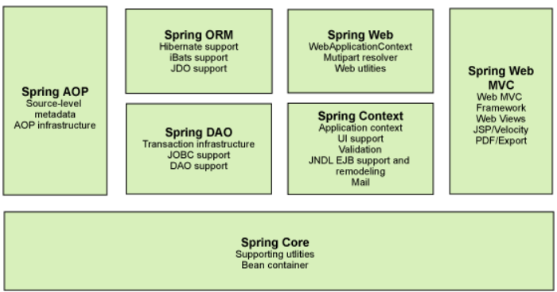


Spring 框架是一个分层架构，由 7 个定义良好的模块组成。Spring 模块构建在核心容器之上，核心容器定义了创建、配置和管理 bean 的方式 .

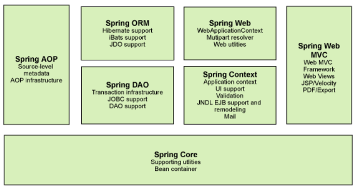

组成 Spring 框架的每个模块（或组件）都可以单独存在，或者与其他一个或多个模块联合实现。每个模块的功能如下：

**核心容器（Spring Core）:**核心容器提供Spring框架的基本功能。Spring以bean的方式组织和管理Java应用中的各个组件及其关系。Spring使用BeanFactory来产生和管理Bean，它是工厂模式的实现。BeanFactory使用控制反转(IoC)模式将应用的配置和依赖性规范与实际的应用程序代码分开。

**应用上下文（Spring Context）:**Spring上下文是一个配置文件，向Spring框架提供上下文信息。Spring上下文包括企业服务，如JNDI、EJB、电子邮件、国际化、校验和调度功能。

**Spring面向切面编程（Spring AOP）:**通过配置管理特性，Spring AOP 模块直接将面向方面的编程功能集成到了 Spring框架中。所以，可以很容易地使 Spring框架管理的任何对象支持 AOP。Spring AOP 模块为基于 Spring 的应用程序中的对象提供了事务管理服务。通过使用 Spring AOP，不用依赖 EJB 组件，就可以将声明性事务管理集成到应用程序中。

**JDBC和DAO模块（Spring DAO）:**JDBC、DAO的抽象层提供了有意义的异常层次结构，可用该结构来管理异常处理，和不同数据库供应商所抛出的错误信息。异常层次结构简化了错误处理，并且极大的降低了需要编写的代码数量，比如打开和关闭链接。

**对象实体映射（Spring ORM）:**Spring框架插入了若干个ORM框架，从而提供了ORM对象的关系工具，其中包括了Hibernate、JDO和 IBatis SQL Map等，所有这些都遵从Spring的通用事物和DAO异常层次结构。

**Web模块（Spring Web）:**Web上下文模块建立在应用程序上下文模块之上，为基于web的应用程序提供了上下文。所以Spring框架支持与Struts集成，web模块还简化了处理多部分请求以及将请求参数绑定到域对象的工作。

**MVC模块（Spring Web MVC）:**MVC框架是一个全功能的构建Web应用程序的MVC实现。通过策略接口，MVC框架变成为高度可配置的。MVC容纳了大量视图技术，其中包括JSP、POI等，模型来有JavaBean来构成，存放于m当中，而视图是一个街口，负责实现模型，控制器表示逻辑代码，由c的事情。Spring框架的功能可以用在任何J2EE服务器当中，大多数功能也适用于不受管理的环境。Spring的核心要点就是支持不绑定到特定J2EE服务的可重用业务和数据的访问的对象，毫无疑问这样的对象可以在不同的J2EE环境，独立应用程序和测试环境之间重用。

## 1.4 拓展

**Spring Boot与Spring Cloud**

- Spring Boot 是 Spring 的一套快速配置脚手架，可以基于Spring Boot 快速开发单个微服务;
- Spring Cloud是基于Spring Boot实现的；
- Spring Boot专注于快速、方便集成的单个微服务个体，Spring Cloud关注全局的服务治理框架；
- Spring Boot使用了约束优于配置的理念，很多集成方案已经帮你选择好了，能不配置就不配置 , Spring Cloud很大的一部分是基于Spring Boot来实现，Spring Boot可以离开Spring Cloud独立使用开发项目，但是Spring Cloud离不开Spring Boot，属于依赖的关系。
- SpringBoot在SpringClound中起到了承上启下的作用，如果你要学习SpringCloud必须要学习SpringBoot。


# 2、IOC理论推导

## 2.1 IoC基础

新建一个空白的maven项目 spring-study

在spring-study的pom.xml中导入依赖

```xml
    <dependencies>
        <dependency>
            <groupId>org.springframework</groupId>
            <artifactId>spring-webmvc</artifactId>
            <version>5.3.0</version>
        </dependency>
    </dependencies>
```

去看maven中已经导入如下依赖

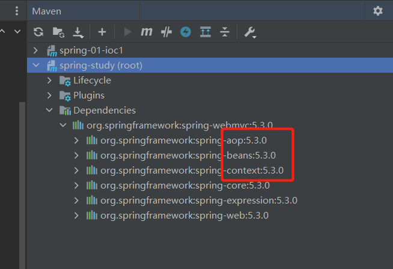

在spring-study下新建一个module命名为spring-01-IOC1

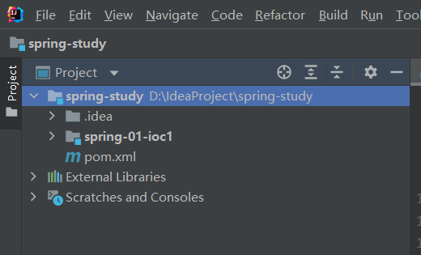

我们先用我们原来的方式写一段代码 .

首先创建一个package命名为com.yang.dao

创建一个Dao接口命名为UserDao，写一个getUser方法

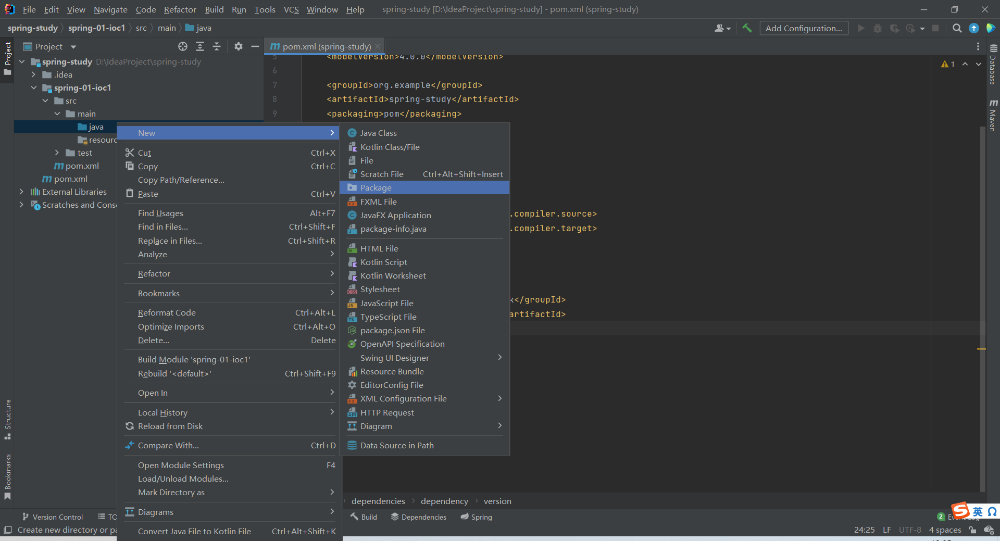

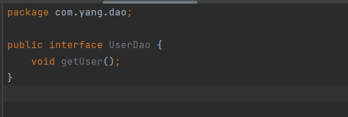


编写接口实现类UserDaoImpl，alt+enter快速补全方法

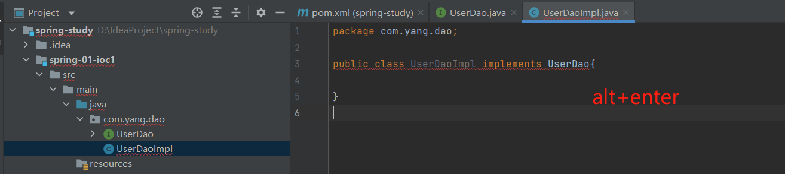

同理新建业务层接口UserService和其实现类UserServiceImpl

也在其中写入getUser方法

1. UserDao接口
2. UserDaoImpl实现类
3. UserService业务接口
4. UserServiceImpl业务实现类

>  DAO层：

DAO层叫``数据访问层``，全称为data access object，属于一种比较底层，比较基础的操作，具体到对于某个表的增删改查，也就是说**某个DAO一定是和数据库的某一张表一一对应的，其中封装了增删改查基本操作，建议DAO只做原子操作，增删改查。**

>  Service层：

Service层叫``服务层``，被称为服务，粗略的理解就是对一个或多个DAO进行的再次封装，封装成一个服务，所以这里也就不会是一个原子操作了，需要事务控制。

>  Controler层：

Controler负责请求转发，接受页面过来的参数，传给Service处理，接到返回值，再传给页面。

>  总结：

个人理解DAO面向表，Service面向业务。后端开发时先数据库设计出所有表，然后对每一张表设计出DAO层，然后根据具体的业务逻辑进一步封装DAO层成一个Service层，对外提供成一个服务。

**用户调用service层，service层调用dao层**


在我们之前的业务中，用户的需求可能会改变我们的原代码，我们需要根据用户的需求去修改原代码。这样不好。

1、先写一个UserDao接口（用户的各种功能接口

```java
public interface UserDao {
   public void getUser(); 
}
```

2、再去写Dao的实现类（接口的实现，对应到mybatis中就是mapper.xml中对应sql的编写

```java
public class UserDaoImpl implements UserDao {
   @Override
   public void getUser() {
       System.out.println("获取用户数据");
  }
}
```

3、然后去写UserService的接口

```java
public interface UserService {
   public void getUser();
}
```

4、最后写Service的实现类

```java
public class UserServiceImpl implements UserService {
    //按照原来的方法要在这里由程序员创建一个dao
    //但是如果用户要换一个实现的话就要new一个新的对象实例，修改了程序的源代码，并且导致了UserService和UserDaoImpl极强的耦合关系，这不好
    //多态。父类引用指向子类对象
    //多态就是同一个接口，使用不同的实例而执行不同操作，
   private UserDao userDao = new UserDaoImpl();

   @Override
   public void getUser() {
       userDao.getUser();
  }
}
```

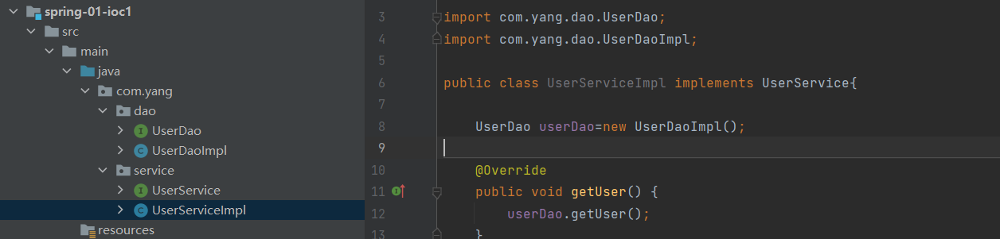

5、测试一下

```java
//MVC三层架构模式
//用户不需要接触dao层，只调用Service层，Service层的唯一作用就是调用dao层，dao层操纵数据库
@Test
public void test(){
   UserService service = new UserServiceImpl();
   service.getUser();
}
```

这是我们原来的方式 , 开始大家也都是这么去写的对吧 . 那我们现在修改一下 

把Userdao的实现类增加一个

```java
public class UserDaoMySqlImpl implements UserDao {
   @Override
   public void getUser() {
       System.out.println("MySql获取用户数据");
  }
}
```

紧接着我们要去使用MySql的话 , 我们就需要去service实现类里面修改对应的实现

```java
public class UserServiceImpl implements UserService {
    //假如用这种方法，需要使用到不同的实现时，还得在这里把UserMysqlImpl修改
    //修改原始代码是一种很危险的行为，可能导致其他地方出错。
    // private UserDao userDao = new UserDaoImpl(); //原来的代码是这样的
   private UserDao userDao = new UserDaoMySqlImpl();

   @Override
   public void getUser() {
       userDao.getUser();
  }
}
```

在假设, 我们再增加一个Userdao的实现类 .

```java
public class UserDaoOracleImpl implements UserDao {
   @Override
   public void getUser() {
       System.out.println("Oracle获取用户数据");
  }
}
```

那么我们要使用Oracle , 又需要去service实现类里面修改对应的实现 . 假设我们的这种需求非常大 , 这种方式就根本不适用了, 甚至反人类对吧 , 每次变动 , 都需要修改大量代码 . 这种设计的耦合性太高了, 牵一发而动全身 .

**那我们如何去解决呢 ?** 

我们可以在需要用到他的地方 , 不去实现它 , 而是留出一个接口 , 利用set , 我们去代码里修改下 .

```java
public class UserServiceImpl implements UserService {
    //服务层的作用就是调用dao层
   private UserDao userDao;
    // 利用set实现，程序被动的接收一个dao
   public void setUserDao(UserDao userDao) {
       this.userDao = userDao; //指的是当前类的属性userDao被赋值为setUserDao方法中的参数，this代指当前对象实例
  }

   @Override
   public void getUser() {
       userDao.getUser();
  }
}
```

现在去我们的测试类里 , 进行测试 ;

```java
@Test
public void test(){  
    
   UserService service = new UserServiceImpl();
    //需要什么直接在这里new就好了，
   service.setUserDao(new UserDaoMySqlImpl());
   service.getUser();
   //那我们现在又想用Oracle去实现呢，直接new一个OracleImple就可以了，也就是说主动权在用户的手中了
   service.setUserDao( new UserDaoOracleImpl() );
   service.getUser();
}
```


已经发生了根本性的变化 , 很多地方都不一样了 . 仔细去思考一下 ,

-  以前所有东西都是由程序去进行控制创建 , 我们想要修改的话就要到底层中去修改程序的源代码。而现在是程序给我们提供了一个接口，我们需要修改的话只需要给接口提供不同的东西就行了，由我们自行控制创建对象 , 把主动权交给了调用者 。程序不用去管怎么创建,怎么实现了 ， 它只负责提供一个接口 .
- 这种思想 , 从本质上解决了问题 , 我们程序员不再去管理对象的创建了 , 更多的去关注业务的实现 . 耦合性大大降低 . 这也就是IOC的原型 !

## 2.2 IOC本质

**控制反转IoC(Inversion of Control)，是一种设计思想，DI(依赖注入)是实现IoC的一种方法**，也有人认为DI只是IoC的另一种说法。没有IoC的程序中 , 我们使用面向对象编程 , 对象的创建与对象间的依赖关系完全硬编码在程序中，对象的创建由程序自己控制，控制反转后将对象的创建转移给第三方，个人认为所谓控制反转就是：获得依赖对象的方式反转了。

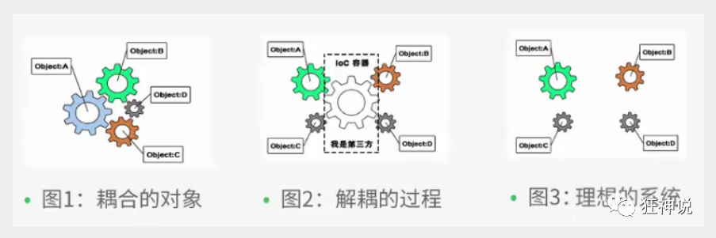

**IoC是Spring框架的核心内容**，使用多种方式完美的实现了IoC，可以使用XML配置，也可以使用注解，新版本的Spring也可以零配置实现IoC。

Spring容器在初始化时先读取配置文件，根据配置文件或元数据创建与组织对象存入容器中，程序使用时再从Ioc容器中取出需要的对象。


采用XML方式配置Bean的时候，Bean的定义信息是和实现分离的，而采用注解的方式可以把两者合为一体，Bean的定义信息直接以注解的形式定义在实现类中，从而达到了零配置的目的 。

**控制反转是一种通过描述（XML或注解）并通过第三方去生产或获取特定对象的方式。**

**在Spring中实现控制反转的是IoC容器，其实现方法是依赖注入（Dependency Injection,DI）。**

# 3、HelloSpring

## 3.1 案例一

1. 导入Jar包

```xml
<!--注 : spring 需要导入commons-logging进行日志记录 . 我们利用maven , 他会自动下载对应的依赖项 .-->
<dependency>
   <groupId>org.springframework</groupId>
   <artifactId>spring-webmvc</artifactId>
   <version>5.1.10.RELEASE</version>
</dependency>
```

2. 编写代码

（1）编写一个Hello实体类

>  com.yang.pojo.Hello.java

```java
package com.yang.pojo;

public class Hello {
    private String str;

    @Override
    public String toString() {
        return "Hello{" +
                "str='" + str + '\'' +
                '}';
    }

    public String getStr() {
        return str;
    }

    public void setStr(String str) {
        this.str = str;
    }
}

```

（2）编写我们的spring文件 , 这里我们命名为beans.xml

> beans.xml

```xml
<?xml version="1.0" encoding="UTF-8"?>
<beans xmlns="http://www.springframework.org/schema/beans"
      xmlns:xsi="http://www.w3.org/2001/XMLSchema-instance"
      xsi:schemaLocation="http://www.springframework.org/schema/beans
       http://www.springframework.org/schema/beans/spring-beans.xsd">

    <!--bean就是java对象 , 由Spring创建和管理
        原方式：
                类型名 实例名 = new 类型名();
                Hello hello = new Hello();

        spring方式：
                id=实例名
                class=要new的对象类型，全路径
                property 相当于给对象的属性设置一个值
			通过这种方式创建对象的时候，类中必须有setter方法！！基于setter方法的注入
    -->
    <bean id="hello" class="com.yang.pojo.Hello">
        <property name="str" value="spring"/> <!--使用setter方法注入-->
    </bean>
</beans>
```

（3）我们可以去进行测试了 

```java
public class MyTest {
    @Test
    public void hello(){
        //获取spring的上下文对象
        //这句是规定的固定语法
        ApplicationContext context = new ClassPathXmlApplicationContext("beans.xml");
        Hello hello = (Hello) context.getBean("hello");//此处参数为beans.xml中的id
        /*从context中取出来的都是Object类型的，所以要强转为所需要的类型，
        但是在知道类型的前提下可以直接使用，在后面添加字节码即可，类似下面*/				
        //Hello hello = context.getBean("hello",Hello.class);
        System.out.println(hello.getStr());
    }
}
```

3. 思考

- Hello 对象是谁创建的 ?  

  hello 对象是由Spring创建的

- Hello 对象的属性是怎么设置的 ? 

   hello 对象的属性是由Spring容器设置的

这个过程就叫控制反转 :

- 控制 : 谁来控制对象的创建 , 传统应用程序的对象是由程序本身控制创建的 , 使用Spring后 , 对象是由Spring来创建的
- 反转 : 程序本身不创建对象 , 而变成被动的接收对象 .

### 依赖注入

**依赖注入 : 就是利用set方法来进行注入的，pojo中必须要有set方法，不然会报错**

基于 Setter 的 DI （依赖注入）是通过容器在调用无参数构造函数或无参数`static`工厂方法来实例化 bean 后调用 bean 上的 setter 方法来完成的。  

IOC是一种编程思想，由主动的编程变成被动的接收

可以通过newClassPathXmlApplicationContext去浏览一下底层源码 

**到现在我们就彻底不用到程序中去改动了，要实现不同的操作，只需要在xml配置问加你中进行修改**

**所谓的IOC用一句话来说就是：对象由Spring创建，管理，装配**

```xml
<!--property 相当于给对象的属性设置一个值-->
<bean id="hello" class="com.yang.pojo.Hello">
    <property name="str" value="spring"/>
</bean>
```

## 3.2 修改案例一

我们在案例一中， 新增一个Spring配置文件beans.xml

参考spring-01-ioc1的beans.xml

```xml

<?xml version="1.0" encoding="UTF-8"?>
<beans xmlns="http://www.springframework.org/schema/beans"
      xmlns:xsi="http://www.w3.org/2001/XMLSchema-instance"
      xsi:schemaLocation="http://www.springframework.org/schema/beans
       http://www.springframework.org/schema/beans/spring-beans.xsd">

        <!--相当于new了一个UserDaoMysqlImpl的对象和一个UserDaoOracleImpl对象-->
   <bean id="mysqlImpl" class="com.kuang.dao.impl.UserDaoMySqlImpl"/> 
   <bean id="oracleImpl" class="com.kuang.dao.impl.UserDaoOracleImpl"/>
    
           
       <!--注意: 这里的name并不是属性 , 而是set方法后面的那部分 , 首字母小写-->
       <!--引用另外一个bean , 不是用value 而是用 ref-->
       <!--
            ref：引用spring容器中创建好的对象
            value：具体的值，用于基本数据类型
   	   -->
        <!--也就是相当于 UserDao userDao=new OracleImpl();
		<!-- 假如要修改不同的实现的话只需要在此处将userDaoImpl修改为userMysqlImpl-->
   <bean id="serviceImpl" class="com.kuang.service.impl.UserServiceImpl">
       <property name="userDao" ref="oracleImpl"/>
   </bean>
    
    <bean id="userDaoImpl" class="com.yang.dao.UserDaoImpl"></bean>
    <bean id="userMysqlImpl" class="com.yang.dao.UserMysqlImpl"></bean>
    <bean id="userServiceImpl" class="com.yang.service.UserServiceImpl">
        <property name="userDao" ref="userDaoImpl"></property> 
         <!--也就是相当于 UserDao userDao=new UserDaoImpl();
        <!-- 假如要修改的话只需要在此处将userDaoImpl修改为userMysqlImpl-->
    </bean>
</beans>
```

测试！

```java
@Test
public void test2(){
   ApplicationContext context = new ClassPathXmlApplicationContext("beans.xml");
   UserServiceImpl serviceImpl = (UserServiceImpl) context.getBean("ServiceImpl");
   serviceImpl.getUser();
}
```

OK , 到了现在 , 我们彻底不用再程序中去改动了 , 要实现不同的操作 , 只需要在xml配置文件中进行修改 ,

**所谓的IoC,一句话搞定 : 对象由Spring 来创建 , 管理 , 装配 !** 

# 4、 IOC创建对象方式  03-ioc2

## 4.1 无参构造

（1）User.java

```java
public class User {

   private String name;

    //即使不写也会有一个默认的无参构造方法
   public User() {
       System.out.println("user无参构造方法");
  }

   public void setName(String name) {
       this.name = name;
  }

   public void show(){
       System.out.println("name="+ name );
  }
}
```

（2）beans.xml

```xml
<?xml version="1.0" encoding="UTF-8"?>
<beans xmlns="http://www.springframework.org/schema/beans"
      xmlns:xsi="http://www.w3.org/2001/XMLSchema-instance"
      xsi:schemaLocation="http://www.springframework.org/schema/beans
       http://www.springframework.org/schema/beans/spring-beans.xsd">

   <bean id="user" class="com.kuang.pojo.User">
       <property name="name" value="kuangshen"/>
   </bean>

</beans>
```

（3）测试类

```java
@Test
public void test(){
   ApplicationContext context = new ClassPathXmlApplicationContext("beans.xml");
    //假如在   User user = (User) context.getBean("user");这一句打一个断点，会发现在获取beans之前就已经创建好了对象，而且是通过构造函数创建的对象
   User user = (User) context.getBean("user");
   //调用对象的方法 .
   user.show();
}
```

结果可以发现，在调用show方法之前，User对象已经通过无参构造初始化了！

## 4.2 有参构造

1、UserT . java

```java
public class UserT {

   private String name;

    //当写了一个有参构造函数的时候会自动覆盖无参构造函数
   public UserT(String name) {
       this.name = name;
  }

   public void setName(String name) {
       this.name = name;
  }

   public void show(){
       System.out.println("name="+ name );
  }

}
```

2、beans.xml 有三种方式编写

```xml
<!-- 第一种根据index参数下标设置 -->
<bean id="userT" class="com.kuang.pojo.UserT">
   <!-- index指构造方法 , 下标从0开始 -->
   <constructor-arg index="0" value="kuangshen2"/>
</bean>
```

```xml
<!-- 第二种根据参数名字设置 -->
<bean id="userT" class="com.kuang.pojo.UserT">
   <!-- name指参数名 -->
   <constructor-arg name="name" value="kuangshen2"/>
</bean>
```

```xml
<!-- 第三种根据参数类型设置 
	如果有多个参数的类型一致会很麻烦，不建议这种方法
-->
<bean id="userT" class="com.kuang.pojo.UserT">
   <constructor-arg type="java.lang.String" value="kuangshen2"/>
</bean>
```

3、测试

```java
@Test
public void testT(){
   ApplicationContext context = new ClassPathXmlApplicationContext("beans.xml");
   UserT user = (UserT) context.getBean("userT");
   user.show();
}
```

结论：在配置文件加载的时候。其中管理的**所有对象**都已经初始化了！

==举个栗子：==

```xml
<!--beans.xml-->
<!--当用户写完
ApplicationContext context = new ClassPathXmlApplicationContext("beans.xml");之后
下面beans中的四个bean都会被创建，不管context是否getBean！
-->
<?xml version="1.0" encoding="UTF-8"?>
<beans xmlns="http://www.springframework.org/schema/beans"
       xmlns:xsi="http://www.w3.org/2001/XMLSchema-instance"
       xsi:schemaLocation="http://www.springframework.org/schema/beans
        https://www.springframework.org/schema/beans/spring-beans.xsd">

    <beans>
        <bean id="user" class="com.yang.pojo.User">
            <property name="name" value="yyl-user-无参"></property>
        </bean>

        <!--有参构造01 下标构造-->
        <bean id="userT1" class="com.yang.pojo.UserT">
            <constructor-arg index="0" value="yyl1-usrtT-有参"></constructor-arg>
        </bean>

        <!--有参构造02 根据参数名字构造-->
        <bean id="userT2" class="com.yang.pojo.UserT">
            <constructor-arg name="name" value="yyl2-usrtT-有参"></constructor-arg>
        </bean>

        <!--有参构造03 根据参数类型构造-->
        <bean id="userT3" class="com.yang.pojo.UserT">
            <constructor-arg type="java.lang.String" value="yyl3-usrtT-有参"></constructor-arg>
        </bean>
    </beans>

</beans>
```

# 5、Spring配置

## 5.1 别名

alias 设置别名 , 为bean设置别名 , 可以设置多个别名

```xml
<!--设置别名：在获取Bean的时候可以使用别名获取-->
<alias name="userT" alias="userNew"/>
```

## 5.2 Bean的配置

```xml
<!--bean就是java对象,由Spring创建和管理-->

<!--
   id 是bean的标识符,也就是对象名。要唯一,如果没有配置id,name就是默认标识符
   如果配置id,又配置了name,那么name是别名
   name可以设置多个别名,可以用逗号,分号,空格隔开
   如果不配置id和name,可以根据applicationContext.getBean(.class)获取对象;

   class是bean的全限定名=包名+类名
-->
<bean id="hello" name="hello2 h2,h3;h4" class="com.kuang.pojo.Hello">
   <property name="name" value="Spring"/>
</bean>
```

## 5.3 import

import一般用于团队开发，可以将多个配置文件导入合并为一个总的配置文件

假设现在团队有多人来开发，这三个人负责不同的类开发，不同的类需要注册不同的bean中，我们可以利用import将所有人的beans.xml合并为同一个

- 张三开发 beans1.xml
- 李四开发 beans2.xml
- 王五开发 beans3.xml

最终可以编写一个applicationContext.xml文件导入所有人的配置文件，


```xml
<!-- -->
<beans>
    <import resource="beans1.xml"/>
    <import resource="beans2.xml"/>
    <import resource="beans3.xml"/>
</beans>    
```

用户最后直接读取

```java
ApplicationContext context = new ClassPathXmlApplicationContext("applicationContext.xml");
```

团队的合作通过import来实现 .

```xml
 <import resource="{path}/beans.xml"/> 
```

这样只通过 applicationContext便可以获取所有的bean了

# 6.依赖注入（DI）04-di

Dependency Injection

> 概念

- 依赖注入（Dependency Injection,DI）。
- 依赖 : 指Bean对象的创建依赖于容器 . Bean对象的依赖资源 .
- 注入 : 指Bean对象所依赖的资源 , 由容器来设置和装配 .

## 6.1.构造器注入

> 构造器注入

我们在之前的案例已经讲过了4.2

## 6.2.Set 注入 （重点）

> Set 注入 （重点）

要求被注入的属性 , 必须有set方法 , set方法的方法名由set + 属性首字母大写 , 如果属性是boolean类型 , 没有set方法 , 是 is .

测试pojo类 :

Address.java

```java
 public class Address {
 
     private String address;
 
     public String getAddress() {
         return address;
    }
 
     public void setAddress(String address) {
         this.address = address;
    }
 }
```

Student.java

```java
 package com.kuang.pojo;
 
 import java.util.List;
 import java.util.Map;
 import java.util.Properties;
 import java.util.Set;
 
 public class Student {
 
     private String name;
     private Address address;
     private String[] books;
     private List<String> hobbys;
     private Map<String,String> card;
     private Set<String> games;
     private String wife;
     private Properties info;
 
     public void setName(String name) {
         this.name = name;
    }
 
     public void setAddress(Address address) {
         this.address = address;
    }
 
     public void setBooks(String[] books) {
         this.books = books;
    }
 
     public void setHobbys(List<String> hobbys) {
         this.hobbys = hobbys;
    }
 
     public void setCard(Map<String, String> card) {
         this.card = card;
    }
 
     public void setGames(Set<String> games) {
         this.games = games;
    }
 
     public void setWife(String wife) {
         this.wife = wife;
    }
 
     public void setInfo(Properties info) {
         this.info = info;
    }
 
     public void show(){
         System.out.println("name="+ name
                 + ",address="+ address.getAddress()
                 + ",books="
        );
         for (String book:books){
             System.out.print("<<"+book+">>\t");
        }
         System.out.println("\n爱好:"+hobbys);
 
         System.out.println("card:"+card);
 
         System.out.println("games:"+games);
 
         System.out.println("wife:"+wife);
 
         System.out.println("info:"+info);
 
    }
 }
```

## 6.3.扩展的注入

### 1、**常量注入**

直接使用value

```xml
 <bean id="student" class="com.kuang.pojo.Student">
     <property name="name" value="小明"/>
 </bean>
```

测试：

```java
@Test
public void test01(){
    ApplicationContext context = new ClassPathXmlApplicationContext("applicationContext.xml");
    Student student = (Student) context.getBean("student"); 
    System.out.println(student.getName());

}
```

### 2、**Bean注入**

注意点：这里的值是一个引用，ref

```xml
<bean id="address" class="com.kuang.pojo.Address">
    <property name="address" value="重庆"/>
</bean>

<bean id="student" class="com.kuang.pojo.Student">
    <property name="name" value="小明"/>
    <property name="address" ref="address"/>
</bean>
```

### 3、**数组注入**

```xml
 <bean id="student" class="com.kuang.pojo.Student">
     <property name="name" value="小明"/>
     <property name="address" ref="addr"/>
     <property name="books">
         <array>
             <value>西游记</value>
             <value>红楼梦</value>
             <value>水浒传</value>
         </array>
     </property>
 </bean>
```

### 4、**List注入**

```xml
 <property name="hobbys">
     <list>
         <value>听歌</value>
         <value>看电影</value>
         <value>爬山</value>
     </list>
 </property>
1234567
```

### 5、**Map注入**

```xml
 <property name="card">
     <map>
         <entry key="中国邮政" value="456456456465456"/>
         <entry key="建设" value="1456682255511"/>
     </map>
 </property>
```

### 6、**set注入**

```xml
<property name="games">
    <set>
        <value>LOL</value>
        <value>BOB</value>
        <value>COC</value>
    </set>
</property>
```

### 7、**Null注入**

```xml
<!--null值-->
<property name="wife">
    <null/>
</property>

<!--空字符串-->
<property name="wife" value=""></property>
```

### 8、Properties注入

 Properties 继承于 Hashtable，表示一个持久的属性集，属性列表中每个键及其对应值都是一个字符串。  

```xml
 <property name="info">
     <props>
         <prop key="学号">20190604</prop>
         <prop key="性别">男</prop>
         <prop key="姓名">小明</prop>
     </props>
 </property>
```

测试结果：


### 9、p命名和c命名注入

> p命名和c命名注入

p命名空间要求pojo类中没有有参构造器，类似于无参构造来构造对象

User.java ：【注意：这里没有有参构造器！】

```java
 public class User {
     private String name;
     private int age;
 
     public void setName(String name) {
         this.name = name;
    }
 
     public void setAge(int age) {
         this.age = age;
    }
 
     @Override
     public String toString() {
         return "User{" +
                 "name='" + name + '\'' +
                 ", age=" + age +
                 '}';
    }
 }
```

1、P命名空间注入 : 需要在头文件中加入约束文件

同时类里需要有**无参构造方法**

p命名空间让开发者可以使用`bean`的属性，而不必使用嵌套的`<property/>`元素。

```xml
 导入约束 : xmlns:p="http://www.springframework.org/schema/p"
```

参考spring-04-di userbeans.xml

```xml
<?xml version="1.0" encoding="UTF-8"?>
<beans xmlns="http://www.springframework.org/schema/beans"
       xmlns:xsi="http://www.w3.org/2001/XMLSchema-instance"
       xmlns:p="http://www.springframework.org/schema/p"
       xsi:schemaLocation="http://www.springframework.org/schema/beans
                           http://www.springframework.org/schema/beans/spring-beans.xsd">

    <!--p命名空间让开发者可以使用bean的属性，而不必使用嵌套的<property/>元素。d-->
    <bean id="user" class="com.yang.pojo.User" p:name="yyl" p:age="22" p:address-ref="address"></bean>

    <bean id="p-user" class="com.yang.pojo.User">
        <property name="name" value="p-yyl"></property>
        <property name="age" value="18"></property>
        <property name="address" ref="address"></property>
    </bean>

    <bean id="address" class="com.yang.pojo.Address">
        <property name="address" value="洛阳-p"></property>
    </bean>

</beans>
```

2、c 命名空间注入 : 需要在头文件中加入约束文件

同时要求pojo类中要有**有参构造器**

```xml
 导入约束 : xmlns:c="http://www.springframework.org/schema/c"
 <!--C(构造: Constructor)命名空间 , 使用构造器注入-->
 <bean id="user" class="com.kuang.pojo.User" c:name="狂神" c:age="18"/>
```

发现问题：爆红了，刚才我们没有写有参构sa造c'c！

解决：把有参构造器加上，这里也能知道，c 就是所谓的**构造器注入**！

测试代码：

```java
 @Test
 public void test02(){
     ApplicationContext context = new ClassPathXmlApplicationContext("applicationContext.xml");
     User user = (User) context.getBean("user");
     System.out.println(user);
 }
```

## 6.4.Bean的作用域

在Spring中，那些组成应用程序的主体及由Spring IoC容器所管理的对象，被称之为bean。简单地讲，bean就是由IoC容器初始化、装配及管理的对象 

| 作用域                                                       | 描述                                                         |
| ------------------------------------------------------------ | ------------------------------------------------------------ |
| [singleton](https://github.com/DocsHome/spring-docs/blob/master/pages/core/IoC-container.md#beans-factory-scopes-singleton) | (默认) 每一Spring IOC容器都拥有唯一的实例对象。              |
| [prototype](https://github.com/DocsHome/spring-docs/blob/master/pages/core/IoC-container.md#beans-factory-scopes-prototype) | 一个Bean定义可以创建任意多个实例对象.                        |
| [request](https://github.com/DocsHome/spring-docs/blob/master/pages/core/IoC-container.md#beans-factory-scopes-request) | 将单个bean定义范围限定为单个HTTP请求的生命周期。 也就是说，每个HTTP请求都有自己的bean实例，它是在单个bean定义的后面创建的。 只有基于Web的Spring `ApplicationContext`的才可用。 |
| [session](https://github.com/DocsHome/spring-docs/blob/master/pages/core/IoC-container.md#beans-factory-scopes-session) | 将单个bean定义范围限定为HTTP `Session`的生命周期。 只有基于Web的Spring `ApplicationContext`的才可用。 |
| [application](https://github.com/DocsHome/spring-docs/blob/master/pages/core/IoC-container.md#beans-factory-scopes-application) | 将单个bean定义范围限定为`ServletContext`的生命周期。 只有基于Web的Spring `ApplicationContext`的才可用。 |
| [websocket](https://github.com/DocsHome/spring-docs/blob/master/pages/web/web.md#websocket-stomp-websocket-scope) | 将单个bean定义范围限定为 `WebSocket`的生命周期。 只有基于Web的Spring `ApplicationContext`的才可用 |


几种作用域中，request、session作用域仅在基于web的应用中使用（不必关心你所采用的是什么web应用框架），只能用在基于web的Spring ApplicationContext环境。

### Singleton(单例模式)

单例模式为spring默认的

当一个bean的作用域为Singleton，那么Spring IoC容器中只会存在**一个共享的bean实例**，并且所有对bean的请求，只要id与该bean定义相匹配，则只会返回bean的同一实例。Singleton是单例类型，就是在创建起容器时就同时自动创建了一个bean的对象，不管你是否使用，他都存在了，每次获取到的对象都是**同一个对象**。注意，Singleton作用域是Spring中的缺省作用域。要在XML中将bean定义成singleton，可以这样配置：

```xml
 <bean id="ServiceImpl" class="cn.csdn.service.ServiceImpl" scope="singleton">
```

测试：

```java
 @Test
 public void test03(){
     ApplicationContext context = new ClassPathXmlApplicationContext("applicationContext.xml");
     User user = (User) context.getBean("user");
     User user2 = (User) context.getBean("user");
     System.out.println(user==user2);//user和user2是一个东西，假如修改了user的属性，则user2的属性也									相应改变
 }
1234567
```

### Prototype(原型模式)

当一个bean的作用域为Prototype，**表示一个bean定义对应多个对象实例**。Prototype作用域的bean会导致在每次对该bean请求（将其注入到另一个bean中，或者以程序的方式调用容器的getBean()方法）时都会创建一个新的bean实例。Prototype是原型类型，它在我们创建容器的时候并没有实例化，而是当我们获取bean的时候才会去创建一个对象，而且我们每次获取到的对象都不是同一个对象。根据经验，对有状态的bean应该使用prototype作用域，而对无状态的bean则应该使用singleton作用域。在XML中将bean定义成prototype，可以这样配置：

```xml
 <bean id="account" class="com.foo.DefaultAccount" scope="prototype"/>  
```

### Request

当一个bean的作用域为Request，表示在一次HTTP请求中，一个bean定义对应一个实例；即每个HTTP请求都会有各自的bean实例，它们依据某个bean定义创建而成。该作用域仅在基于web的Spring ApplicationContext情形下有效。考虑下面bean定义：

```xml
 <bean id="loginAction" class=cn.csdn.LoginAction" scope="request"/>
```

针对每次HTTP请求，Spring容器会根据loginAction bean的定义创建一个全新的LoginAction bean实例，且该loginAction bean实例仅在当前HTTP request内有效，因此可以根据需要放心的更改所建实例的内部状态，而其他请求中根据loginAction bean定义创建的实例，将不会看到这些特定于某个请求的状态变化。当处理请求结束，request作用域的bean实例将被销毁。

### Session

当一个bean的作用域为Session，表示在一个HTTP Session中，一个bean定义对应一个实例。该作用域仅在基于web的Spring ApplicationContext情形下有效。考虑下面bean定义：

```
 <bean id="userPreferences" class="com.foo.UserPreferences" scope="session"/>
```

针对某个HTTP Session，Spring容器会根据userPreferences bean定义创建一个全新的userPreferences bean实例，且该userPreferences bean仅在当前HTTP Session内有效。与request作用域一样，可以根据需要放心的更改所创建实例的内部状态，而别的HTTP Session中根据userPreferences创建的实例，将不会看到这些特定于某个HTTP Session的状态变化。当HTTP Session最终被废弃的时候，在该HTTP Session作用域内的bean也会被废弃掉。

# 7.Bean的自动装配（重点）05-Autowiried

> 自动装配说明

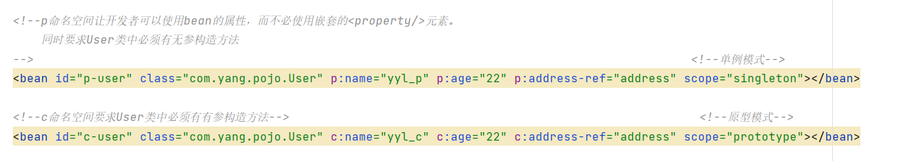

目前我们所有bean的属性都是由我们自己手动设置的。

**自动装配**

- ==是使用spring满足bean依赖的一种方法==
- ==spring会在应用上下文中为某个bean寻找其依赖的bean==。

Spring中bean有三种装配机制，分别是：

1. 在xml中显式配置（就是我们之前一直手动设置的）
2. 在java中显式配置；
3. **隐式的bean发现机制和自动装配（也就是我们现在要说的自动装配）**

这里我们主要讲第三种：自动化的装配bean。

Spring的自动装配需要从两个角度来实现，或者说是两个操作：

1. 组件扫描(component scanning)：spring会自动发现应用上下文中所创建的bean；
2. 自动装配(autowiring)：spring自动满足bean之间的依赖，也就是我们说的IoC/DI；

组件扫描和自动装配组合发挥巨大威力，使得显示的配置降低到最少。

**推荐不使用自动装配xml配置 , 而使用注解 .**

> 测试环境搭建

1、新建一个项目

2、新建两个实体类，Cat Dog 都有一个叫的方法

```java
public class Cat {
   public void shout() {
       System.out.println("miao~");
  }
}
public class Dog {
   public void shout() {
       System.out.println("wang~");
  }
}
```

3、新建一个用户类 User

```java
public class User {
   private Cat cat;
   private Dog dog;
   private String str;
}
```

4、编写Spring配置文件

```xml
<?xml version="1.0" encoding="UTF-8"?>
<beans xmlns="http://www.springframework.org/schema/beans"
      xmlns:xsi="http://www.w3.org/2001/XMLSchema-instance"
      xsi:schemaLocation="http://www.springframework.org/schema/beans
       http://www.springframework.org/schema/beans/spring-beans.xsd">

   <bean id="dog" class="com.kuang.pojo.Dog"/>
   <bean id="cat" class="com.kuang.pojo.Cat"/>

   <bean id="user" class="com.kuang.pojo.User">
       <property name="cat" ref="cat"/>
       <property name="dog" ref="dog"/>
       <property name="str" value="qinjiang"/>
   </bean>
</beans>
```

5、测试

```java
public class MyTest {
   @Test
   public void testMethodAutowire() {
       ApplicationContext context = new ClassPathXmlApplicationContext("beans.xml");
       User user = (User) context.getBean("user");
       user.getCat().shout();
       user.getDog().shout();
  }
}
```

结果正常输出，环境OK

## 7.1.byName

**byname的时候，需要保证所有bean的id唯一，并且这个bean需要和自动注入的属性的set方法的值一致！**
**bytype的时候，需要保证所有bean的class唯一，并且这个bean需要和自动注入的属性的类型一致！**

**autowire byName (按名称自动装配)**

由于在手动配置xml过程中，常常发生字母缺漏和大小写等错误，而无法对其进行检查，使得开发效率降低。

采用自动装配将避免这些错误，并且使配置简单化。

测试：

1、修改bean配置，增加一个属性 autowire=“byName”

```xml
<bean id="user" class="com.kuang.pojo.User" autowire="byName">
   <property name="str" value="qinjiang"/>
</bean>
```

2、再次测试，结果依旧成功输出！

3、我们将 cat 的bean id修改为 catXXX

4、再次测试， 执行时报空指针java.lang.NullPointerException。因为按byName规则找不对应set方法，真正的setCat就没执行，对象就没有初始化，所以调用时就会报空指针错误。

**小结：**

当一个bean节点带有 autowire byName的属性时。

1. 将查找其类中所有的set方法名，例如setCat，获得将**set去掉并且首字母小写的字符串**，即cat。
2. 去spring容器中寻找是否有此字符串名称id的对象。
3. 如果有，就取出注入；如果没有，就报空指针异常。

也就是说byName的时候必须是匹配的才可以，例如people中有setCat()和getDog()方法

所以在beans.xml中Cat和Dog的实例的id必须命名为cat和dog才可以


## 7.2.byType

**autowire byType (按类型自动装配)**

使用autowire byType首先需要保证：同一类型的对象，在spring容器中唯一。如果不唯一，会报不唯一的异常。

```
NoUniqueBeanDefinitionException
```

测试：

1、将user的bean配置修改一下 ： autowire=“byType”

2、测试，正常输出

3、再注册一个cat 的bean对象！

```xml
<bean id="dog" class="com.kuang.pojo.Dog"/>
<bean id="cat" class="com.kuang.pojo.Cat"/>
<bean id="cat2" class="com.kuang.pojo.Cat"/>  <!--Cat类的实例只能有一个，否则用byType会报错-->

<bean id="user" class="com.kuang.pojo.User" autowire="byType">
   <property name="str" value="qinjiang"/>
</bean>
```

4、测试，报错：NoUniqueBeanDefinitionException

5、删掉cat2，将cat的bean名称改掉！测试！因为是按类型装配，所以并不会报异常，也不影响最后的结果。甚至将id属性去掉，也不影响结果。

这就是按照类型自动装配！

## 7.3.使用注解

jdk1.5开始支持注解，spring2.5开始全面支持注解。

准备工作：利用注解的方式注入属性。

1、在spring配置文件中引入==context文件头==

```xml
<?xml version="1.0" encoding="UTF-8"?>
<beans xmlns="http://www.springframework.org/schema/beans"
    xmlns:xsi="http://www.w3.org/2001/XMLSchema-instance"
    xmlns:context="http://www.springframework.org/schema/context"
    xsi:schemaLocation="http://www.springframework.org/schema/beans
        https://www.springframework.org/schema/beans/spring-beans.xsd
        http://www.springframework.org/schema/context
        https://www.springframework.org/schema/context/spring-context.xsd">

    <context:annotation-config/>  <!--注解驱动，使得注解生效-->

</beans>
```

2、开启属性注解支持！

```xml
<context:annotation-config/>
```

### @Autowired

- @Autowired是**按==类型自动转配==**的，也就是byType方法，不支持id匹配。
- 需要导入 spring-aop的包！
- @Autowired可以用在属性上，也可以用在set方法上面。
- 假如用了@Autowired，就可以不使用set方法

测试

1、将User类中的set方法去掉，使用@Autowired注解

```java
public class User {
   @Autowired
   private Cat cat;
   @Autowired
   private Dog dog;
   private String str;

   public Cat getCat() {
       return cat;
  }
   public Dog getDog() {
       return dog;
  }
   public String getStr() {
       return str;
  }
}
```

2、此时配置文件内容

```xml
<context:annotation-config/>

<bean id="dog" class="com.yang.pojo.Dog"/>
<bean id="cat" class="com.yang.pojo.Cat"/>

<bean id="people" class="com.yang.pojo.People" >
<property name="name" value="yyl"/>
</bean>
```

3、测试，成功输出结果！

【小狂神科普时间】

@Autowired(required=false) 说明：false，对象可以为null；true，对象必须存对象，不能为null。

```java
//如果允许对象为null，设置required = false,默认为true
@Autowired(required = false)
private Cat cat;
```

### @Qualifier

- @Autowired是根据类型自动装配的，但是我们前面也学到了，byType的时候IOC容器中之能有一个全局变量，为了使得能有多个全局变量，加上@Qualifier则可以根据byName的方式自动装配
- @Qualifier不能单独使用。

测试实验步骤：

1、配置文件修改内容，保证类型存在对象。且名字不为类的默认名字！

```xml
<bean id="dog1" class="com.kuang.pojo.Dog"/>
<bean id="dog2" class="com.kuang.pojo.Dog"/>
<bean id="cat1" class="com.kuang.pojo.Cat"/>
<bean id="cat2" class="com.kuang.pojo.Cat"/>
```

2、没有加Qualifier测试，直接报错

3、在属性上添加Qualifier注解

```java
@Autowired
@Qualifier(value = "cat2")
private Cat cat;
@Autowired
@Qualifier(value = "dog2")
private Dog dog;
123456
```

测试，成功输出！

### @Resource

- @Resource如有指定的name属性，先按该属性进行byName方式查找装配；
- 假如指定的byName匹配不成功，其次再进行默认的byName方式进行装配；也就是set后面的字母
- 如果以上都不成功，则按byType的方式自动装配。
- 都不成功，则报异常。

实体类：

```java
public class User {
   //如果允许对象为null，设置required = false,默认为true
   @Resource(name = "cat2")
   private Cat cat;
   @Resource
   private Dog dog;
   private String str;
}
```

beans.xml

```xml
<bean id="dog" class="com.kuang.pojo.Dog"/>
<bean id="cat1" class="com.kuang.pojo.Cat"/>
<bean id="cat2" class="com.kuang.pojo.Cat"/>

<bean id="user" class="com.kuang.pojo.User"/>
```

测试：结果OK

配置文件2：beans.xml ， 删掉cat2

```xml
<bean id="dog" class="com.kuang.pojo.Dog"/>
<bean id="cat1" class="com.kuang.pojo.Cat"/>
```

实体类上只保留注解

```java
@Resource
private Cat cat;
@Resource
private Dog dog;
1234
```

结果：OK

结论：先进行byName查找，失败；再进行byType查找，成功。

小结

**@Autowired与@Resource异同：**

1、@Autowired与@Resource都可以用来装配bean。都可以写在字段上，或写在setter方法上。

2、@Autowired默认按类型装配（属于spring规范），默认情况下必须要求依赖对象必须存在，如果要允许null 值，可以设置它的required属性为false，如：@Autowired(required=false) ，如果我们想使用名称装配可以结合@Qualifier注解进行使用

3、@Resource（属于J2EE复返），默认按照名称进行装配，名称可以通过name属性进行指定。如果没有指定name属性，当注解写在字段上时，默认取字段名进行按照名称查找，如果注解写在setter方法上默认取属性名进行装配。当找不到与名称匹配的bean时才按照类型进行装配。但是需要注意的是，如果name属性一旦指定，就只会按照名称进行装配。

它们的作用相同都是用注解方式注入对象，但执行顺序不同。@Autowired先byType，@Resource先byName。

# 8.使用注解开发 06-anno

> 说明

在spring4之后，想要使用注解形式，必须得要引入aop的包

我们在maven项目中导入的springframework依赖就已经包含有aop的包了

```xml
<dependency>
    <groupId>org.springframework</groupId>
    <artifactId>spring-webmvc</artifactId>
    <version>5.3.0</version>
</dependency
```


在配置文件当中，还得要引入一个context约束

```xml
<?xml version="1.0" encoding="UTF-8"?>
<beans xmlns="http://www.springframework.org/schema/beans"
      xmlns:xsi="http://www.w3.org/2001/XMLSchema-instance"
      xmlns:context="http://www.springframework.org/schema/context"
      xsi:schemaLocation="http://www.springframework.org/schema/beans
       http://www.springframework.org/schema/beans/spring-beans.xsd
       http://www.springframework.org/schema/context
       http://www.springframework.org/schema/context/spring-context.xsd">

</beans>
```

## 8.1.Bean的实现

我们之前都是使用 bean 的标签进行bean注入，但是实际开发中，我们一般都会使用注解！

### 1、配置扫描哪些包下的注解

```xml
<!--指定注解扫描包-->
<context:component-scan base-package="com.kuang.pojo"/>
```

2、在指定包下编写类，增加注解

```java
@Component("user")
// 相当于配置文件中 <bean id="user" class="当前注解的类"/>
//id就是类名的小写
public class User {
   public String name = "秦疆";
}
```

3、测试

```java
@Test
public void test(){
   ApplicationContext applicationContext =
   new ClassPathXmlApplicationContext("beans.xml");
   User user = (User) applicationContext.getBean("user"); 
   System.out.println(user.name);
}
```

## 8.2.属性注入

使用注解注入属性

1、可以不用提供set方法，直接在直接名上添加@value(“值”)

```java
@Component("user")
// 相当于配置文件中 <bean id="user" class="当前注解的类"/>
public class User {
   @Value("秦疆")
   // 相当于配置文件中 <property name="name" value="秦疆"/>
   public String name;
}
1234567
```

2、如果提供了set方法，在set方法上添加@value(“值”);

```java
@Component("user")
public class User {

   public String name;

   @Value("秦疆")
   public void setName(String name) {
       this.name = name;
  }
}
12345678910
```

## 8.3.衍生注解

我们这些注解，就是替代了在配置文件当中配置步骤而已！更加的方便快捷！

**@Component三个衍生注解**

为了更好的进行分层，Spring可以使用其它三个注解，功能一样，目前使用哪一个功能都一样。

- @Controller：controller层
- @Service：service层，写在实现类里面而
- @Repository：dao层

写上这些注解，就相当于将这个类交给Spring管理装配了！

**但是别忘记在xml文件里添加扫描以上这些包**

```xml
    <!--扫描包-->
    <context:component-scan base-package="com.yang"/> <！--扫描com.yang下的所有包-->
```

### @Service注解作用

1、 其getBean的默认名称是类名（头字母小写），可以@Service(“xxxx”)这样来指定，   

2、其定义的bean默认是单例的，可以使用@Service(“beanName”) @Scope(“prototype”)来改变。

3、可以通过@PostConstruct和@PreDestroy指定初始化方法和销毁方法（方法名任意）

```java
@Service("baseCacheService")
public class BaseCacheServiceImpl implements BaseCacheService{
 
}
```

首先，在applicationContext.xml文件中加一行： 

```xml
    <!--扫描包-->
    <context:component-scan base-package="com.yang"/> <！--扫描com.yang下的所有包-->
```

加上这一行以后，将自动扫描路径下面的包，如果一个类带了@Service注解，将自动注册到Spring容器，不需要再在applicationContext.xml文件定义bean了，类似的还包括@Component、@Repository、@Controller。


## 8.4.自动装配注解

在Bean的自动装配已经讲过了，可以回顾！

```xml
-@Autowired：自动装配通过类型。
			如果Autowired不能唯一自动装配上属性，则需要通过@Qualifier（value="xx"）
-@Nu1lable:字段标记了这个注解，说明这个字段可以为null
-@Resource：自动装配先通过名字，如果name不匹配，则通过类型。
```

## 8.5.作用域

@scope

- singleton：默认的，Spring会采用单例模式创建这个对象。关闭工厂 ，所有的对象都会销毁。
- prototype：多例模式。关闭工厂 ，所有的对象不会销毁。内部的垃圾回收机制会回收

```java
@Controller("user")
@Scope("prototype")
public class User {
   @Value("秦疆")
   public String name;
}
123456
```

## 8.6.小结

**XML与注解比较**

- XML可以适用任何场景 ，结构清晰，维护方便
- 注解不是自己提供的类使用不了，开发简单方便

**xml与注解整合开发** ：推荐最佳实践

- xml管理Bean
- 注解完成属性注入
- 使用过程中， 可以不用扫描，扫描是为了类上的注解

```xml
<context:annotation-config/>  <!--注解驱动-->
```

作用：

- 进行注解驱动注册，从而使注解生效
- 用于激活那些已经在spring容器里注册过的bean上面的注解，也就是显示的向Spring注册
- **如果不扫描包，就需要手动配置bean**
- 如果不加注解驱动，则注入的值为null！


# 9.基于Java类进行配置 07-appconfig

## @Configuration

**`@Configuration` 注解**：用于标记一个类为 Spring 的配置类。Spring 容器会在运行时扫描这个类，并根据 `@Bean` 方法的返回值注册 Bean。

## @Bean

**`@Bean` 注解**：用于声明一个方法的返回值是一个 Bean，并将其注册到 Spring 容器中。方法名（如 `userService`、`orderService`）默认作为 Bean 的名称，除非在 `@Bean` 注解中指定一个不同的名称。

**依赖注入**：`orderService` 方法依赖于 `userService` 方法，Spring 知道它需要先创建 `userService` Bean，然后再创建 `orderService` Bean。

JavaConfig 原来是 Spring 的一个子项目，它通过 Java 类的方式提供 Bean 的定义信息，在 Spring4 的版本， JavaConfig 已正式成为 Spring4 的核心功能 。

注意：

1. 如果开启包扫描，加载配置类以后就可以通过反射拿到配置类中的对象了。开启包扫描后需要配合@component搭配使用
2. @Bean只写在方法上，返回的是一个对象，但一般不获取已经在容器中的对象

3. @Bean 可以用于通过方法获取数据库连接池Connection这种对象

测试：

1、编写一个User类

```java
@Data //lombok注解
@Component("getUser") //将这个组件注入到spring容器中，与包扫描搭配使用
public class User {

    @Value("yyl") //属性注入
    private String name;

}
```

2、新建一个config配置包，编写一个YangConfig配置类

```java
@Configuration//代表这是一个配置类
@ComponentScan("com.yang") //包扫描
@Import(YangConfig2.class) //合并多个配置文件
public class YangConfig {

    @Bean                   //相当于我们之前的一个 bean标签
    public User getUser(){ //返回值就是原来的 class，方法名就是id

        return new User(); //就是返回要注入bean中的对象
    }
}

```

3、测试

```java
public class MyTest {

    @Test
    public void test(){
        //如果完全使用了配置类的方法去做，我们就只能通过AnnotationConfig上下文获取容器，通过配置类的class对象来加载
        ApplicationContext context = new AnnotationConfigApplicationContext(YangConfig.class);
        User getUser = (User) context.getBean("getUser");
        System.out.println(getUser.getName());
    }

}
```

4、成功输出结果！

一些疑惑解答：

- 要么使用@bean注解
- 要么使用包扫描加@component注解

**导入其他配置如何做呢？**

1、我们再编写一个配置类！

```java
@Configuration  //代表这是一个配置类
	public class YangConfig2 {
}
```

2、在之前的配置类中我们来选择导入这个配置类

```java
@Configuration
@ComponentScan("com.yang") //包扫描
@Import(YangConfig2.class) //合并多个配置文件
public class YangConfig {

    @Bean                   //相当于我们之前的一个 bean标签
    public User getUser(){ //返回值就是原来的 class，方法名就是id

        return new User(); //就是返回要注入bean中的对象
    }
}

```

关于这种Java类的配置方式，我们在之后的SpringBoot 和 SpringCloud中还会大量看到，我们需要知道这些注解的作用即可！


# 10.代理模式 08-proxy-demo1

为什么要学习代理模式，因为AOP的底层机制就是**动态代理**！

代理模式：

- 静态代理
- 动态代理

学习aop之前 , 我们要先了解一下代理模式！


## 10.1静态代理

**静态代理角色分析**

假如拿租房子这件事情来说

- 抽象角色 : 一般使用**接口或者抽象类**来实现，也就是租房这件事
- 真实角色 : 被代理的角色，也就是房东
- 代理角色 : 代理真实角色 ; 代理真实角色后 , 一般会做一些附属的操作 .也就是中介
- 客户 : 使用代理角色来进行一些操作 . 也就是租客

房东把房子给中介之后，中介负责带租客看房签合同收取中介费，房东只需要把钥匙给中介就可以了！

**代码实现**

Rent . java 即抽象角色

```java
//抽象角色：租房
public interface Rent {
   public void rent();
}
```

Host . java 即真实角色

```java
//真实角色: 房东，房东要出租房子。继承租房子这件事，即抽象角色
public class Host implements Rent{
   public void rent() {
       System.out.println("房屋出租");
  }
}
123456
```

Proxy . java 即代理角色

```java
//代理角色：中介
public class Proxy implements Rent {

   private Host host;
   public Proxy() { }
   public Proxy(Host host) {
       this.host = host;
  }

   //租房
   public void rent(){
       seeHouse();
       host.rent();
       fare();
  }
   //看房
   public void seeHouse(){
       System.out.println("带房客看房");
  }
   //收中介费
   public void fare(){
       System.out.println("收中介费");
  }
}
```

Client . java 即客户

```java
//客户类，一般客户都会去找代理！
public class Client {
   public static void main(String[] args) {
       //房东要租房
       Host host = new Host();
       //中介帮助房东
       Proxy proxy = new Proxy(host);

       //你去找中介！
       proxy.rent();
  }
}
```

分析：在这个过程中，你直接接触的就是中介，就如同现实生活中的样子，你看不到房东，但是你依旧租到了房东的房子通过代理，这就是所谓的代理模式，程序源自于生活，所以学编程的人，一般能够更加抽象的看待生活中发生的事情。

**静态代理的好处:**

- 可以使得我们的真实角色更加纯粹 . 不再去关注一些公共的事情 .
- 公共的业务由代理来完成 . 实现了业务的分工 ,
- 公共业务发生扩展时变得更加集中和方便 .

缺点 :

- 类多了 , 多了代理类 , 工作量变大了 . 开发效率降低 .

我们想要静态代理的好处，又不想要静态代理的缺点，所以 , 就有了动态代理 !

## 10.2.静态代理再理解 08-proxy-demo2

同学们练习完毕后，我们再来举一个例子，巩固大家的学习！

练习步骤：

1、创建一个抽象角色，比如咋们平时做的用户业务，抽象起来就是增删改查！

```java
//抽象角色：增删改查业务
public interface UserService {
   void add();
   void delete();
   void update();
   void query();
}
```

2、我们需要一个真实对象来完成这些增删改查操作

```java
//真实对象，完成增删改查操作的人
public class UserServiceImpl implements UserService {

   public void add() {
       System.out.println("增加了一个用户");
  }

   public void delete() {
       System.out.println("删除了一个用户");
  }

   public void update() {
       System.out.println("更新了一个用户");
  }

   public void query() {
       System.out.println("查询了一个用户");
  }
}
```

3、需求来了，现在我们需要增加一个日志功能，怎么实现！

- 思路1 ：在实现类上增加代码 【麻烦！改动了源代码，不安全】
- 思路2：使用代理来做，能够不改变原来的业务情况下，实现此功能就是最好的了！

就是有些接口很多种实现方式，然后在这些实现方式里面需要穿插一些业务，结果因为实现太多了，所以把业务放到代理中，这样让代理去调用实现，并且在其中穿插业务

4、设置一个代理类来处理日志！代理角色

```java
//代理角色，在这里面除了有原来真实角色的所有功能外，另外增加日志的实现
public class UserServiceProxy implements UserService {
   private UserServiceImpl userService;

   public void setUserService(UserServiceImpl userService) {
       this.userService = userService;
  }

   public void add() {
       log("add");
       userService.add();
  }

   public void delete() {
       log("delete");
       userService.delete();
  }

   public void update() {
       log("update");
       userService.update();
  }

   public void query() {
       log("query");
       userService.query();
  }

    //假如log方法有成千上万行，则使用这种思想非常方便
   public void log(String msg){
       System.out.println("执行了"+msg+"方法");
  }

}
```

5、测试访问类：

```java
public class Client {
   public static void main(String[] args) {
       //真实业务
       UserServiceImpl userService = new UserServiceImpl();
       //代理类
       UserServiceProxy proxy = new UserServiceProxy();
       //使用代理类实现日志功能！
       proxy.setUserService(userService);

       proxy.add();
  }
}
```

OK，到了现在代理模式大家应该都没有什么问题了，重点大家需要理解其中的思想；

我们在不改变原来的代码的情况下，实现了对原有功能的增强，这是AOP中最核心的思想

聊聊AOP：纵向开发，横向开发

前提是不能改变原有代码，害怕会出现错误。那我们就可以新建一个代理类，除了实现原有代码的所有功能外，还可以添加新功能。客户只需要调用代理类就可以了。


## 10.3动态代理 08-proxy-demo3

- 动态代理的角色和静态代理的一样 .【抽象角色，真实角色，代理角色】
- 动态代理的代理类是动态生成的 . 静态代理的代理类是我们提前写好的
- 动态代理分为两类 : 一类是基于接口动态代理 , 一类是基于类的动态代理
- - 基于接口的动态代理----JDK动态代理
  - 基于类的动态代理–cglib
  - 现在用的比较多的是 javasist 来生成动态代理 . java字节码，百度一下javasist
  - 我们这里使用JDK的原生代码来实现，其余的道理都是一样的！

**JDK的动态代理需要了解两个类**

核心 : InvocationHandler 和 Proxy ， 打开JDK帮助文档 看看

【InvocationHandler：调用处理程序】


```java
Object invoke(Object proxy, 方法 method, Object[] args)；//通过反射方法
//参数
//proxy - 调用该方法的代理实例
//method -所述方法对应于调用代理实例上的接口方法的实例。方法对象的声明类将是该方法声明的接口，它可以是代理类继承该方法的代理接口的超级接口。
//args -包含的方法调用传递代理实例的参数值的对象的阵列，或null如果接口方法没有参数。原始类型的参数包含在适当的原始包装器类的实例中，例如java.lang.Integer或java.lang.Boolean 。
```

【Proxy : 代理】


```java
//生成代理类
public Object getProxy(){
   return Proxy.newProxyInstance(this.getClass().getClassLoader(),
                                 rent.getClass().getInterfaces(),this);
}
12345
```

**代码实现**

抽象角色和真实角色和之前的一样！

Rent . java 即抽象角色

```java
//抽象角色：租房
public interface Rent {
   public void rent();
}
```

Host . java 即真实角色

```java
//真实角色: 房东，房东要出租房子
public class Host implements Rent{
   public void rent() {
       System.out.println("房屋出租");
  }
}
```

ProxyInvocationHandler. java 即代理角色

```java
public class ProxyInvocationHandler implements InvocationHandler {
   private Rent rent;

   public void setRent(Rent rent) {
       this.rent = rent;
  }

   //生成代理类，重点是第二个参数，获取要代理的抽象角色！之前都是一个角色，现在可以代理一类角色
   public Object getProxy(){
       return Proxy.newProxyInstance(this.getClass().getClassLoader(),
               rent.getClass().getInterfaces(),this);
  }

   // proxy : 代理类 method : 代理类的调用处理程序的方法对象.
   // 处理代理实例上的方法调用并返回结果
   @Override
   public Object invoke(Object proxy, Method method, Object[] args) throwsThrowable {
       seeHouse();
       //核心：本质利用反射实现！
       Object result = method.invoke(rent, args);
       fare();
       return result;
  }

   //看房
   public void seeHouse(){
       System.out.println("带房客看房");
  }
   //收中介费
   public void fare(){
       System.out.println("收中介费");
  }

}
```

Client . java

```java
//租客
public class Client {

   public static void main(String[] args) {
       //真实角色
       Host host = new Host();
       //代理实例的调用处理程序
       ProxyInvocationHandler pih = new ProxyInvocationHandler();
       pih.setRent(host); //将真实角色放置进去！
       Rent proxy = (Rent)pih.getProxy(); //动态生成对应的代理类！
       proxy.rent();
  }

}
```

核心：**一个动态代理 , 一般代理某一类业务 , 一个动态代理可以代理多个类，代理的是接口！、**

## 10.4深化理解08-proxy-demo4

我们来使用动态代理实现代理我们后面写的UserService！

我们也可以编写一个通用的动态代理实现的类！所有的代理对象设置为**Object**即可！

```java
//相当于这是一个万能模板了，只需要在使用的时候赋值target就可以
public class ProxyInvocationHandler implements InvocationHandler {
   private Object target;

   public void setTarget(Object target) {
       this.target = target;
  }

   //生成代理类
   public Object getProxy(){
       return Proxy.newProxyInstance(this.getClass().getClassLoader(),
               target.getClass().getInterfaces(),this);
  }

   // proxy : 代理类
   // method : 代理类的调用处理程序的方法对象.
   public Object invoke(Object proxy, Method method, Object[] args) throwsThrowable {
       log(method.getName()); //获得方法名
       Object result = method.invoke(target, args);
       return result;
  }

   public void log(String methodName){
       System.out.println("执行了"+methodName+"方法");
  }

}
```

测试！

```java
public class Test {
   public static void main(String[] args) {
       //真实对象
       UserServiceImpl userService = new UserServiceImpl();
       //代理对象的调用处理程序
       ProxyInvocationHandler pih = new ProxyInvocationHandler();
       pih.setTarget(userService); //设置要代理的对象
       UserService proxy = (UserService)pih.getProxy(); //动态生成代理类！
       proxy.delete();
  }
}
```

测试，增删改查，查看结果！

## 10.5动态代理的好处

静态代理有的它都有，静态代理没有的，它也有！

- 可以使得我们的真实角色更加纯粹 . 不再去关注一些公共的事情 .
- 公共的业务由代理来完成 . 实现了业务的分工 ,
- 公共业务发生扩展时变得更加集中和方便 .
- 一个动态代理 , 一般代理某一类业务
- 一个动态代理可以代理多个类，代理的是接口！

# 11.AOP 09-aop

## 11.1.什么是AOP

AOP（Aspect Oriented Programming）意为：面向切面编程，通过预编译方式和运行期动态代理实现程序功能的统一维护的一种技术。AOP是OOP的延续，是软件开发中的一个热点，也是Spring框架中的一个重要内容，是函数式编程的一种衍生范型。利用AOP可以对业务逻辑的各个部分进行隔离，从而使得业务逻辑各部分之间的耦合度降低，提高程序的可重用性，同时提高了开发的效率。


## 11.2.Aop在Spring中的作用

提供声明式事务；允许用户自定义切面

以下名词需要了解下：

- 横切关注点：跨越应用程序多个模块的方法或功能。即是，与我们业务逻辑无关的，但是我们需要关注的部分，就是横切关注点。如日志 , 安全 , 缓存 , 事务等等 …
- 切面（ASPECT）：横切关注点 被模块化 的特殊对象。即，它是一个类。
- 通知（Advice）：切面必须要完成的工作。即，它是类中的一个方法。
- 目标（Target）：被通知对象。
- 代理（Proxy）：向目标对象应用通知之后创建的对象。
- 切入点（PointCut）：切面通知 执行的 “地点”的定义。
- 连接点（JointPoint）：与切入点匹配的执行点。


SpringAOP中，通过Advice定义横切逻辑，Spring中支持5种类型的Advice:


即 Aop 在 不改变原有代码的情况下 , 去增加新的功能 .

## 11.3.使用Spring实现Aop

【重点】使用AOP织入，需要导入一个依赖包！

```xml
<!-- https://mvnrepository.com/artifact/org.aspectj/aspectjweaver -->
<dependency>
   <groupId>org.aspectj</groupId>
   <artifactId>aspectjweaver</artifactId>
   <version>1.9.4</version>
</dependency>
```

### 11.3.1.通过 Spring API 实现

**第一种方式**

首先编写我们的业务接口和实现类

Userservice.java

```java
public interface UserService {

   public void add();

   public void delete();

   public void update();

   public void search();

}
```

UserServiceImpl.java

```java
public class UserServiceImpl implements UserService{

   @Override
   public void add() {
       System.out.println("增加用户");
  }

   @Override
   public void delete() {
       System.out.println("删除用户");
  }

   @Override
   public void update() {
       System.out.println("更新用户");
  }

   @Override
   public void search() {
       System.out.println("查询用户");
  }
}
```


然后去写我们的增强类 , 我们编写两个 , 一个前置增强 一个后置增强

```java
public class Log implements MethodBeforeAdvice {//前值增强
    //这个方法会在我们执行特定的方法之前自动被执行

    //method : 要执行的目标对象的方法
    //objects : 被调用的方法的参数
    //target : 目标对象
    @Override
    public void before(Method method, Object[] args, Object target) throws Throwable {
        System.out.println(target.getClass().getName()+"的"+method.getName()+"被执行了");
    }
}
public class LogAfter implements AfterReturningAdvice {
    //在方法被执行后调用，执行后可以拿到一个返回值（所以参数中有一个returnValue）
   //returnValue 返回值
   //method被调用的方法
   //args 被调用的方法的对象的参数
   //target 被调用的目标对象
   @Override
   public void afterReturning(Object returnValue, Method method, Object[] args,Object target) throws Throwable {
       System.out.println("执行了" + target.getClass().getName()
       +"的"+method.getName()+"方法,"
       +"返回值："+returnValue);
  }
}
```

最后去spring的文件中注册 , 并实现aop切入实现 , 注意导入约束 .

```xml
<?xml version="1.0" encoding="UTF-8"?>
<beans xmlns="http://www.springframework.org/schema/beans"
      xmlns:xsi="http://www.w3.org/2001/XMLSchema-instance"
      xmlns:aop="http://www.springframework.org/schema/aop"
      xsi:schemaLocation="http://www.springframework.org/schema/beans
       http://www.springframework.org/schema/beans/spring-beans.xsd
       http://www.springframework.org/schema/aop
       http://www.springframework.org/schema/aop/spring-aop.xsd">

   <!--注册bean-->
   <bean id="userService" class="com.kuang.service.UserServiceImpl"/>
   <bean id="log" class="com.kuang.log.Log"/>
   <bean id="LogAfter" class="com.kuang.log.AfterLog"/>

   <!--aop的配置-->
   <aop:config>
       <!--切入点 expression:表达式匹配要执行的方法-->
       <!--excution中的内容分别表示（*代表所有）：修饰符 返回值 类名 方法名 参数-->
       <!--com.kuang.service.UserServiceImpl.*(..)表示的是对UserServiceImpl中的任意方法，且参数不限-->
       <aop:pointcut id="pointcut" expression="execution(* com.kuang.service.UserServiceImpl.*(..))"/>
       <!--执行环绕; advice-ref执行方法 . pointcut-ref切入点-->
       <aop:advisor advice-ref="log" pointcut-ref="pointcut"/>
        <aop:advisor advice-ref="logAfter" pointcut-ref="pointcut"/>
   </aop:config>

</beans>
```

测试

```java
public class MyTest {
    public static void main(String[] args) {
        ApplicationContext context = new ClassPathXmlApplicationContext("applicationContext.xml");
//      动态代理代理的是接口，所以是一个UserService，需要强转为UserService
//      UserService userService = (UserService)context.getBean("userService");
        UserService userService = context.getBean("userService", UserService.class);
        userService.add();
    }
}
```

Aop的重要性 : 很重要 . 一定要理解其中的思路 , 主要是思想的理解这一块 .

Spring的Aop就是将公共的业务 (日志 , 安全等) 和领域业务结合起来 , 当执行领域业务时 , 将会把公共业务加进来 . 实现公共业务的重复利用 . 领域业务更纯粹 , 程序猿专注领域业务 , 其本质还是动态代理 .

11.3.2.自定义类来实现Aop

**第二种方式**

目标业务类不变依旧是userServiceImpl

第一步 : 写我们自己的一个切入类

```java
public class DiyPointcut {

   public void before(){
       System.out.println("---------方法执行前---------");
  }
   public void after(){
       System.out.println("---------方法执行后---------");
  }
   
}
12345678910
```

去spring中配置

```xml
<!--第二种方式自定义实现-->
<!--注册bean-->
<bean id="diy" class="com.kuang.config.DiyPointcut"/>

<!--aop的配置-->
<aop:config>
   <!--第二种方式：使用AOP的标签实现-->
   <aop:aspect ref="diy">
       <aop:pointcut id="diyPointcut" expression="execution(* com.kuang.service.UserServiceImpl.*(..))"/>
       <aop:before pointcut-ref="diyPointcut" method="before"/>
       <aop:after pointcut-ref="diyPointcut" method="after"/>
   </aop:aspect>
</aop:config>
```

测试：

```java
public class MyTest {
   @Test
   public void test(){
       ApplicationContext context = newClassPathXmlApplicationContext("beans.xml");
       UserService userService = (UserService) context.getBean("userService");
       userService.add();
  }
}
12345678
```

### 11.3.2、使用注解实现

**第三种方式**

第一步：编写一个注解实现的增强类

```java
package com.kuang.config;

import org.aspectj.lang.ProceedingJoinPoint;
import org.aspectj.lang.annotation.After;
import org.aspectj.lang.annotation.Around;
import org.aspectj.lang.annotation.Aspect;
import org.aspectj.lang.annotation.Before;

@Aspect
public class AnnotationPointcut {
   @Before("execution(* com.yang.service.UserServiceImpl.*(..))")
   public void before(){
       System.out.println("---------方法执行前---------");
  }

   @After("execution(* com.yang.service.UserServiceImpl.*(..))")
   public void after(){
       System.out.println("---------方法执行后---------");
  }

   @Around("execution(* com.yang.service.UserServiceImpl.*(..))")
   public void around(ProceedingJoinPoint jp) throws Throwable {
       System.out.println("环绕前");
       System.out.println("签名:"+jp.getSignature());
       //执行目标方法proceed
       Object proceed = jp.proceed();
       System.out.println("环绕后");
       System.out.println(proceed);
  }
}
```

注意在写@Befor的时候选择的是aspectj包下的注解

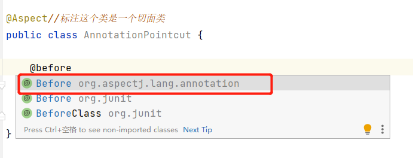

第二步：在Spring配置文件中，注册bean，并增加支持注解的配置

```xml
<!--第三种方式:注解实现-->
<bean id="annotationPointcut" class="com.kuang.config.AnnotationPointcut"/>
<!--开启注解支持-->
<aop:aspectj-autoproxy/>
```

aop:aspectj-autoproxy：说明

```
通过aop命名空间的<aop:aspectj-autoproxy />声明自动为spring容器中那些配置@aspectJ切面的bean创建代理，织入切面。当然，spring 在内部依旧采用AnnotationAwareAspectJAutoProxyCreator进行自动代理的创建工作，但具体实现的细节已经被<aop:aspectj-autoproxy />隐藏起来了

<aop:aspectj-autoproxy />有一个proxy-target-class属性，默认为false，表示使用jdk动态代理织入增强，当配为<aop:aspectj-autoproxy  poxy-target-class="true"/>时，表示使用CGLib动态代理技术织入增强。不过即使proxy-target-class设置为false，如果目标类没有声明接口，则spring将自动使用CGLib动态代理。
123
```

# 12.整合MyBatis 10-mybatis

> #### 步骤

1、导入相关jar包

junit

```xml
<dependency>
   <groupId>junit</groupId>
   <artifactId>junit</artifactId>
   <version>4.12</version>
</dependency>
```

mybatis

```xml
<dependency>
   <groupId>org.mybatis</groupId>
   <artifactId>mybatis</artifactId>
   <version>3.5.2</version>
</dependency>
```

mysql-connector-java

```xml
<dependency>
   <groupId>mysql</groupId>
   <artifactId>mysql-connector-java</artifactId>
   <version>5.1.47</version>
</dependency>
```

spring相关

```xml
<dependency>
   <groupId>org.springframework</groupId>
   <artifactId>spring-webmvc</artifactId>
   <version>5.1.10.RELEASE</version>
</dependency>

<!--通过spring链接数据库-->
<dependency>
   <groupId>org.springframework</groupId>
   <artifactId>spring-jdbc</artifactId>
   <version>5.1.10.RELEASE</version>
</dependency>
```

aspectJ AOP 织入器

```xml
<!-- https://mvnrepository.com/artifact/org.aspectj/aspectjweaver -->
<dependency>
   <groupId>org.aspectj</groupId>
   <artifactId>aspectjweaver</artifactId>
   <version>1.9.4</version>
</dependency>
123456
```

**mybatis-spring整合包 【重点】**

```xml
<dependency>
   <groupId>org.mybatis</groupId>
   <artifactId>mybatis-spring</artifactId>
   <version>2.0.2</version>
</dependency>
12345
```

配置Maven静态资源过滤问题！

```xml
<build>
   <resources>
       <resource>
           <directory>src/main/java</directory>
           <includes>
               <include>**/*.properties</include>
               <include>**/*.xml</include>
           </includes>
           <filtering>true</filtering>
       </resource>
   </resources>
</build>
```

2、编写配置文件

3、代码实现

### 12.1回忆MyBatis

**编写pojo实体类**

```java
package com.yang.pojo;

public class User {
   private int id;  //id
   private String name;   //姓名
   private String pwd;   //密码
}
```

**实现mybatis的配置文件**

```xml
<?xml version="1.0" encoding="UTF-8" ?>
<!DOCTYPE configuration
        PUBLIC "-//mybatis.org//DTD Config 3.0//EN"
        "http://mybatis.org/dtd/mybatis-3-config.dtd">
<!--configuration核心配置文件-->
<configuration>
    <!--可以给实体类起别名
        MyBatis会在包名下面搜索需要的 Java Bean，比如：
        扫描实体类的包，它的默认别名就为这个类的 类名，首字母小写！
    -->
    <typeAliases>
        <package name="com.yang.mapper"/>
    </typeAliases>

    <!--可以配置多个环境-->
    <environments default="development">
        <environment id="development">
            <transactionManager type="JDBC"/>
            <dataSource type="POOLED">
                <property name="driver" value="com.mysql.jdbc.Driver"/>
                <!--idea连接数据库时报错，原因是没有在连接字符串中明确指定serverTimezone，时区时间
                解决方法：连接时的URL=jdbc:mysql://localhost:3306serverTimezone=Asia/Shanghai
                还有一种说法是serverTimezone=UTC，其中UTC为世界统一时间，比北京时间早八个小时，所以一般在中国使用serverTimeZone=Asia/Shanghai
                -->
                <property name="url" value="jdbc:mysql://localhost:3306/mybatis?useSSL=true&amp;useUnicode=true&amp;characterEncoding=UTF-8"/>
                <property name="username" value="root"/>
                <property name="password" value="root"/>
            </dataSource>
        </environment>

    </environments>
    
    <!--每一个Mapper.xml都需要在Mybatis核心配置文件中注册
    这里的resource是一个路径
    所以需要用 / 来隔开
	-->
    <mappers>
        <mapper resource="com/yang/mapper/UserMapper.xml"></mapper>
    </mappers>

</configuration>
```

**UserDao接口编写**

```java
public interface UserMapper {
   public List<User> selectUser();
}
```

**接口对应的Mapper映射文件**

```xml
<?xml version="1.0" encoding="UTF-8" ?>
<!DOCTYPE mapper
       PUBLIC "-//mybatis.org//DTD Mapper 3.0//EN"
       "http://mybatis.org/dtd/mybatis-3-mapper.dtd">
<mapper namespace="com.kuang.dao.UserMapper">

   <select id="selectUser" resultType="User">
    	select * from mybatis.user
   </select>

</mapper>
```

**测试类**

```java
@Test
public void selectUser() throws IOException {

   String resource = "mybatis-config.xml";
   InputStream inputStream = Resources.getResourceAsStream(resource);
   SqlSessionFactory sqlSessionFactory = newSqlSessionFactoryBuilder().build(inputStream);
   SqlSession sqlSession = sqlSessionFactory.openSession();

   UserMapper mapper = sqlSession.getMapper(UserMapper.class);

   List<User> userList = mapper.selectUser();
   for (User user: userList){
       System.out.println(user);
  }

   sqlSession.close();
}
```

### 12.2.MyBatis-Spring学习

引入Spring之前需要了解mybatis-spring包中的一些重要类；

http://www.mybatis.org/spring/zh/index.html


**什么是 MyBatis-Spring？**

MyBatis-Spring 会帮助你将 MyBatis 代码无缝地整合到 Spring 中。

**知识基础**

在开始使用 MyBatis-Spring 之前，你需要先熟悉 Spring 和 MyBatis 这两个框架和有关它们的术语。这很重要

MyBatis-Spring 需要以下版本：

| MyBatis-Spring | MyBatis | Spring 框架 | Spring Batch | Java    |
| -------------- | ------- | ----------- | ------------ | ------- |
| 2.0            | 3.5+    | 5.0+        | 4.0+         | Java 8+ |
| 1.3            | 3.4+    | 3.2.2+      | 2.1+         | Java 6+ |

如果使用 Maven 作为构建工具，仅需要在 pom.xml 中加入以下代码即可：

```xml
<dependency>
   <groupId>org.mybatis</groupId>
   <artifactId>mybatis-spring</artifactId>
   <version>2.0.2</version>
</dependency>
```

要和 Spring 一起使用 MyBatis，需要在 Spring 应用上下文中定义至少两样东西：一个 SqlSessionFactory 和至少一个数据映射器类。

在 MyBatis-Spring 中，可使用SqlSessionFactoryBean来创建 SqlSessionFactory。要配置这个工厂 bean，只需要把下面代码放在 Spring 的 XML 配置文件中：

```xml
    <!--使用spring的数据源替换mybatis的配置 c3p0 druid dpcp
        我们这里使用的是spring提供的，org.springframework
        需要在maven中导入mybatis-spring依赖
    -->
<bean id="dataSource" class="org.springframework.jdbc.datasource.DriverManagerDataSource">
    <property name="driverClassName" value="com.mysql.jdbc.Driver"/>
    <property name="url" value="jdbc:mysql://localhost:3306/mybatis?													useSSL=true&amp;useUnicode=true&amp;
                                characterEncoding=UTF-8&amp;
                                serverTimezone=Asia/Shanghai"/>
    <property name="username" value="root"/>
    <property name="password" value="root"/>
</bean>


```

注意：SqlSessionFactory需要一个 DataSource（数据源）。这可以是任意的 DataSource，只需要和配置其它 Spring 数据库连接一样配置它就可以了。

在基础的 MyBatis 用法中，是通过 SqlSessionFactoryBuilder 来创建 SqlSessionFactory 的。而在 MyBatis-Spring 中，则使用 SqlSessionFactoryBean 来创建。

在 MyBatis 中，你可以使用 SqlSessionFactory 来创建 SqlSession。一旦你获得一个 session 之后，你可以使用它来执行映射了的语句，提交或回滚连接，最后，当不再需要它的时候，你可以关闭 session。

SqlSessionFactory有一个唯一的必要属性：用于 JDBC 的 DataSource。这可以是任意的 DataSource 对象，它的配置方法和其它 Spring 数据库连接是一样的。

一个常用的属性是 configLocation，它用来指定 MyBatis 的 XML 配置文件路径。它在需要修改 MyBatis 的基础配置非常有用。通常，基础配置指的是 < settings> 或 < typeAliases>元素。

需要注意的是，这个配置文件并不需要是一个完整的 MyBatis 配置。确切地说，任何环境配置（），数据源（）和 MyBatis 的事务管理器（）都会被忽略。SqlSessionFactoryBean 会创建它自有的 MyBatis 环境配置（Environment），并按要求设置自定义环境的值。

SqlSessionTemplate 是 MyBatis-Spring 的核心。作为 SqlSession 的一个实现，这意味着可以使用它无缝代替你代码中已经在使用的 SqlSession。

模板可以参与到 Spring 的事务管理中，并且由于其是线程安全的，可以供多个映射器类使用，你应该总是用 SqlSessionTemplate 来替换 MyBatis 默认的 DefaultSqlSession 实现。在同一应用程序中的不同类之间混杂使用可能会引起数据一致性的问题。

可以使用 SqlSessionFactory 作为构造方法的参数来创建 SqlSessionTemplate 对象。

```XML
<!--sqlSessionFactory -->

<bean id="sqlseSsionFactory" class="org.mybatis.spring.SqlSessionFactoryBean">
    <property name="dataSource" ref="dataSource"></property>
</bean>
```

现在，这个 bean 就可以直接注入到你的 DAO bean 中了。你需要在你的 bean 中添加一个 SqlSession 属性，就像下面这样：

```JAVA
public class UserDaoImpl implements UserDao {

 private SqlSession sqlSession;

 public void setSqlSession(SqlSession sqlSession) {
   this.sqlSession = sqlSession;
}

 public User getUser(String userId) {
   return sqlSession.getMapper...;
}
}
```

按下面这样，注入 SqlSessionTemplate：

```xml
<bean id="userDao" class="org.mybatis.spring.sample.dao.UserDaoImpl">
	 <property name="sqlSession" ref="sqlSession" />
</bean>
```

### 12.3.整合实现一

1、引入Spring配置文件beans.xml

```xml
<?xml version="1.0" encoding="UTF-8"?>
<beans xmlns="http://www.springframework.org/schema/beans"
      xmlns:xsi="http://www.w3.org/2001/XMLSchema-instance"
      xsi:schemaLocation="http://www.springframework.org/schema/beans
       http://www.springframework.org/schema/beans/spring-beans.xsd">
```

2、配置数据源替换mybaits的数据源

```xml
<!--配置数据源：数据源有非常多，可以使用第三方的，也可使使用Spring的-->
<bean id="dataSource"class="org.springframework.jdbc.datasource.DriverManagerDataSource">
   <property name="driverClassName" value="com.mysql.jdbc.Driver"/>
   <property name="url" value="jdbc:mysql://localhost:3306/mybatis?useSSL=true&amp;useUnicode=true&amp;characterEncoding=utf8"/>
   <property name="username" value="root"/>
   <property name="password" value="123456"/>
</bean>
```

3、配置SqlSessionFactory，关联MyBatis

```xml
<!--配置SqlSessionFactory-->
<bean id="sqlSessionFactory" class="org.mybatis.spring.SqlSessionFactoryBean">
   <property name="dataSource" ref="dataSource"/>
   <!--关联Mybatis-->
   <property name="configLocation" value="classpath:mybatis-config.xml"/>
   <property name="mapperLocations" value="classpath:com/kuang/dao/*.xml"/>
</bean>
```

4、注册sqlSessionTemplate，关联sqlSessionFactory；

```xml
<!--注册sqlSessionTemplate , 关联sqlSessionFactory-->
<bean id="sqlSession" class="org.mybatis.spring.SqlSessionTemplate">
   <!--利用构造器注入-->
   <constructor-arg index="0" ref="sqlSessionFactory"/>
</bean>
```

5、增加Dao接口的实现类；私有化sqlSessionTemplate

```java
public class UserDaoImpl implements UserMapper {

   //sqlSession不用我们自己创建了，Spring来管理
   private SqlSessionTemplate sqlSession;

   public void setSqlSession(SqlSessionTemplate sqlSession) {
       this.sqlSession = sqlSession;
  }

   public List<User> selectUser() {
       UserMapper mapper = sqlSession.getMapper(UserMapper.class);
       return mapper.selectUser();
  }
   
}

```

6、注册bean实现

```xml
<bean id="userDao" class="com.kuang.dao.UserDaoImpl">
   <property name="sqlSession" ref="sqlSession"/>
</bean>
```

7、测试

```java
   @Test
   public void test2(){
       ApplicationContext context = newClassPathXmlApplicationContext("beans.xml");
       UserMapper mapper = (UserMapper) context.getBean("userDao");
       List<User> user = mapper.selectUser();
       System.out.println(user);
  }
```

结果成功输出！现在我们的Mybatis配置文件的状态！发现都可以被Spring整合！

```xml
<?xml version="1.0" encoding="UTF-8" ?>
<!DOCTYPE configuration
       PUBLIC "-//mybatis.org//DTD Config 3.0//EN"
       "http://mybatis.org/dtd/mybatis-3-config.dtd">
<configuration>
   <typeAliases>
       <package name="com.kuang.pojo"/>
   </typeAliases>
</configuration>
```

spring-dao.xml

```xml
<?xml version="1.0" encoding="UTF-8"?>
<beans xmlns="http://www.springframework.org/schema/beans"
       xmlns:xsi="http://www.w3.org/2001/XMLSchema-instance"
       xmlns:aop="http://www.springframework.org/schema/aop"
       xsi:schemaLocation="http://www.springframework.org/schema/beans
       http://www.springframework.org/schema/beans/spring-beans.xsd
       http://www.springframework.org/schema/aop
       https://www.springframework.org/schema/aop/spring-aop.xsd">

    <!--1、使用spring的数据源替换mybatis的配置 c3p0 druid dpcp
        我们这里使用的是spring提供的，org.springframework
        需要在maven中导入mybatis-spring依赖
    -->
    <bean id="dataSource" class="org.springframework.jdbc.datasource.DriverManagerDataSource">
        <property name="driverClassName" value="com.mysql.jdbc.Driver"/>
        <property name="url" value="jdbc:mysql://localhost:3306/mybatis?useSSL=true&amp;useUnicode=true&amp;characterEncoding=UTF-8&amp;serverTimezone=Asia/Shanghai"/>
        <property name="username" value="root"/>
        <property name="password" value="root"/>
    </bean>

    <!--2、sqlSessionFactory-->
    <bean id="sqlSessionFactory" class="org.mybatis.spring.SqlSessionFactoryBean">
        <property name="dataSource" ref="dataSource"></property>
        <!--mybatis-config配置文件-->
        <property name="configLocation" value="classpath:mybatis-config.xml"/>
        <!--mapper映射-->
        <property name="mapperLocations" value="classpath:com/yang/mapper/*.xml"/>
        <!--扫描包，配置别名-->
        <property name="typeAliasesPackage" value="com.yang.pojo"/>
    </bean>

    <!--sqlsessionTemplate-->
    <bean id="sqlsession" class="org.mybatis.spring.SqlSessionTemplate">
        <!--点进去源码发现没有setter方法，只有一个构造方法，所以只能用构造器注入-->
        <constructor-arg index="0" ref="sqlSessionFactory"/>
    </bean>

    <bean id="userMapper" class="com.yang.mapper.UserMapperImpl">
        <property name="sqlSession" ref="sqlsession"/>
    </bean>

</beans>
```


### 12.4.整合实现二

mybatis-spring1.2.3版以上的才有这个 .

官方文档截图 :

dao继承Support类 , 直接利用 getSqlSession() 获得 , 然后直接注入SqlSessionFactory . 比起方式1 , 不需要管理SqlSessionTemplate , 而且对事务的支持更加友好 . 可跟踪源码查看


测试：

1、将我们上面写的UserDaoImpl修改一下

```java
public class UserMapperImpl2 extends SqlSessionDaoSupport implements UserMapper {

    @Override
    public List<User> selectUser() {
        SqlSession sqlSession = getSqlSession();
        UserMapper mapper = sqlSession.getMapper(UserMapper.class);
        List<User> users = mapper.selectUser();
        return users;


    }
}
```

2、修改bean的配置

```java
    <!--继承SqlSessionDaoSupport，直接使用getSqlSession()方法获取sqlSession-->
    <bean id="userMapper2" class="com.yang.mapper.UserMapperImpl2">
        <property name="sqlSessionFactory" ref="sqlSessionFactory"/>
    </bean>
```

3、测试

```java
    @Test
    public void test2() throws IOException {

        ApplicationContext context = new ClassPathXmlApplicationContext("spring-dao.xml");
        UserMapper userMapper = context.getBean("userMapper2", UserMapper.class);
        List<User> users = userMapper.selectUser();
        for (User user : users) {
            System.out.println(user);
        }
    }
```

**总结 : 整合到spring以后可以完全不要mybatis的配置文件，除了这些方式可以实现整合之外，我们还可以使用注解来实现，这个等我们后面学习SpringBoot的时候还会测试整合！**

# 13.声明式事务

### 13.1.回顾事务

- 事务在项目开发过程非常重要，涉及到数据的一致性的问题，不容马虎！
- 事务管理是企业级应用程序开发中必备技术，用来确保数据的完整性和一致性。

事务就是把一系列的动作当成一个独立的工作单元，这些动作要么全部完成，要么全部不起作用。

**事务四个属性ACID**

1. 原子性（atomicity）

   事务是原子性操作，由一系列动作组成，事务的原子性确保动作要么全部完成，要么完全不起作用

2. 一致性（consistency）

   一旦所有事务动作完成，事务就要被提交。数据和资源处于一种满足业务规则的一致性状态中

3. 隔离性（isolation）

   可能多个事务会同时处理相同的数据，因此每个事务都应该与其他事务隔离开来，防止数据损坏

4. 持久性（durability）

   事务一旦完成，无论系统发生什么错误，结果都不会受到影响。通常情况下，事务的结果被写到持久化存储器中

> #### 测试

将上面的代码拷贝到一个新项目中

在之前的案例中，我们给userDao接口新增两个方法，删除和增加用户；

```java
//添加一个用户
int addUser(User user);

//根据id删除用户
int deleteUser(int id);
```

mapper文件，我们故意把 deletes 写错，测试！

```xml
<insert id="addUser" parameterType="com.kuang.pojo.User">
insert into user (id,name,pwd) values (#{id},#{name},#{pwd})
</insert>

<delete id="deleteUser" parameterType="int">
deletes from user where id = #{id}
</delete>
```

编写接口的实现类，在实现类中，我们去操作一波

```java
public class UserDaoImpl extends SqlSessionDaoSupport implements UserMapper {

   //增加一些操作
   public List<User> selectUser() {
       User user = new User(4,"小明","123456");
       UserMapper mapper = getSqlSession().getMapper(UserMapper.class);
       mapper.addUser(user);
       mapper.deleteUser(4);
       return mapper.selectUser();
  }

   //新增
   public int addUser(User user) {
       UserMapper mapper = getSqlSession().getMapper(UserMapper.class);
       return mapper.addUser(user);
  }
   //删除
   public int deleteUser(int id) {
       UserMapper mapper = getSqlSession().getMapper(UserMapper.class);
       return mapper.deleteUser(id);
  }

}
```

测试

```
@Test
public void test2(){
   ApplicationContext context = new ClassPathXmlApplicationContext("beans.xml");
   UserMapper mapper = (UserMapper) context.getBean("userDao");
   List<User> user = mapper.selectUser();
   System.out.println(user);
}
1234567
```

报错：sql异常，delete写错了

结果 ：插入成功！

没有进行事务的管理；我们想让他们都成功才成功，有一个失败，就都失败，我们就应该需要**事务！**

以前我们都需要自己手动管理事务，十分麻烦！

但是Spring给我们提供了事务管理，我们只需要配置即可；

### 13.2.Spring中的事务管理

Spring在不同的事务管理API之上定义了一个抽象层，使得开发人员不必了解底层的事务管理API就可以使用Spring的事务管理机制。Spring支持编程式事务管理和声明式的事务管理。

**编程式事务管理**

- 将事务管理代码嵌到业务方法中来控制事务的提交和回滚
- 缺点：必须在每个事务操作业务逻辑中包含额外的事务管理代码

**声明式事务管理**

- 一般情况下比编程式事务好用。
- 将事务管理代码从业务方法中分离出来，以声明的方式来实现事务管理。
- 将事务管理作为横切关注点，通过aop方法模块化。Spring中通过Spring AOP框架支持声明式事务管理。

**使用Spring管理事务，注意头文件的约束导入 : tx**

```xml
xmlns:tx="http://www.springframework.org/schema/tx"

http://www.springframework.org/schema/tx
http://www.springframework.org/schema/tx/spring-tx.xsd">
```

**事务管理器**

- 无论使用Spring的哪种事务管理策略（编程式或者声明式）事务管理器都是必须的。
- 就是 Spring的核心事务管理抽象，管理封装了一组独立于技术的方法。

**JDBC事务**

```
<bean id="transactionManager"class="org.springframework.jdbc.datasource.DataSourceTransactionManager">
       <property name="dataSource" ref="dataSource" />
</bean>
```

**配置好事务管理器后我们需要去配置事务的通知**

```
<!--配置事务通知-->
<tx:advice id="txAdvice" transaction-manager="transactionManager">
   <tx:attributes>
       <!--配置哪些方法使用什么样的事务,配置事务的传播特性-->
       <tx:method name="add" propagation="REQUIRED"/>
       <tx:method name="delete" propagation="REQUIRED"/>
       <tx:method name="update" propagation="REQUIRED"/>
       <tx:method name="search*" propagation="REQUIRED"/>
       <tx:method name="get" read-only="true"/>
       <tx:method name="*" propagation="REQUIRED"/>
   </tx:attributes>
</tx:advice>
123456789101112
```

**spring事务传播特性：**

事务传播行为就是多个事务方法相互调用时，事务如何在这些方法间传播。spring支持7种事务传播行为：

- propagation_requierd：如果当前没有事务，就新建一个事务，如果已存在一个事务中，加入到这个事务中，这是最常见的选择。
- propagation_supports：支持当前事务，如果没有当前事务，就以非事务方法执行。
- propagation_mandatory：使用当前事务，如果没有当前事务，就抛出异常。
- propagation_required_new：新建事务，如果当前存在事务，把当前事务挂起。
- propagation_not_supported：以非事务方式执行操作，如果当前存在事务，就把当前事务挂起。
- propagation_never：以非事务方式执行操作，如果当前事务存在则抛出异常。
- propagation_nested：如果当前存在事务，则在嵌套事务内执行。如果当前没有事务，则执行与propagation_required类似的操作

Spring 默认的事务传播行为是 PROPAGATION_REQUIRED，它适合于绝大多数的情况。

假设 ServiveX#methodX() 都工作在事务环境下（即都被 Spring 事务增强了），假设程序中存在如下的调用链：Service1#method1()->Service2#method2()->Service3#method3()，那么这 3 个服务类的 3 个方法通过 Spring 的事务传播机制都工作在同一个事务中。

就好比，我们刚才的几个方法存在调用，所以会被放在一组事务当中！

**配置AOP**

导入aop的头文件！

```
<!--配置aop织入事务-->
<aop:config>
   <aop:pointcut id="txPointcut" expression="execution(* com.kuang.dao.*.*(..))"/>
   <aop:advisor advice-ref="txAdvice" pointcut-ref="txPointcut"/>
</aop:config>
12345
```

**进行测试**

删掉刚才插入的数据，再次测试！

```
@Test
public void test2(){
   ApplicationContext context = new ClassPathXmlApplicationContext("beans.xml");
   UserMapper mapper = (UserMapper) context.getBean("userDao");
   List<User> user = mapper.selectUser();
   System.out.println(user);
}
```

### 13.3.思考问题？

为什么需要配置事务？

- 如果不配置，就需要我们手动提交控制事务；
- 事务在项目开发过程非常重要，涉及到数据的一致性的问题，不容马虎！