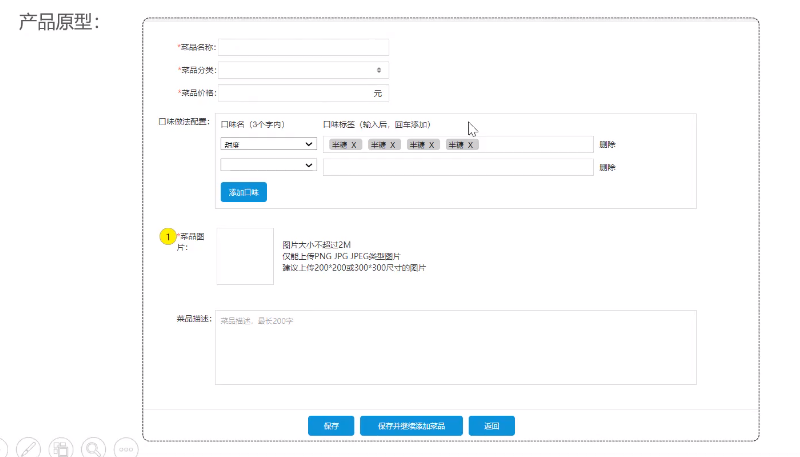
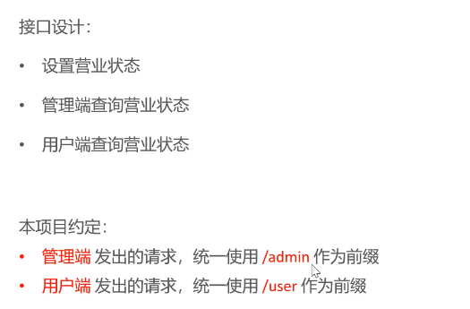
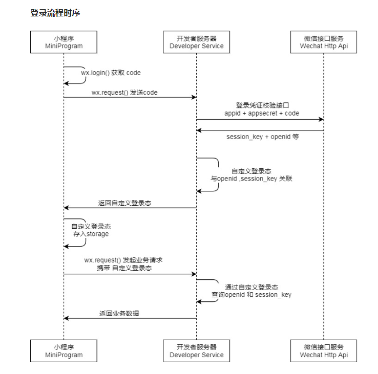
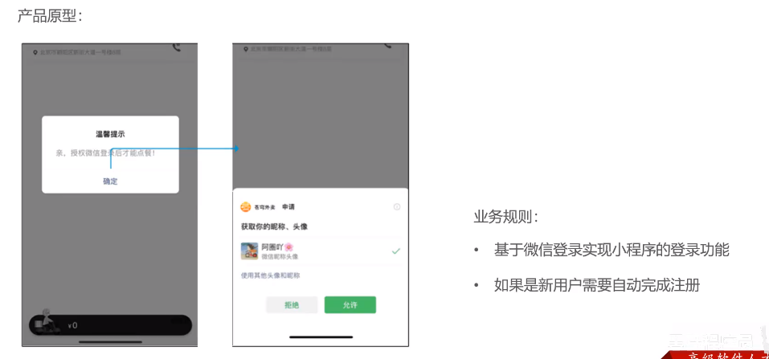
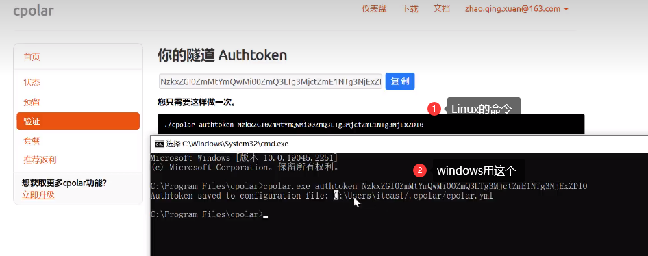
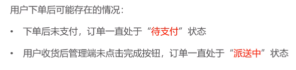

# 一、软件开发介绍

## 1.软件开发流程


## 2.角色分工


## 3.软件环境


# 二、苍穹外卖项目介绍

## 1.项目介绍

是专门为餐饮企业单独定制的一款外卖软件，包括系统管理后台和移动应用端两部分。

管理后台主要提供给餐饮企业内部员工使用，可以对餐厅的菜品、订单、套餐进行维护管理。

移动端应用主要提供给消费者使用，可以在线浏览菜品，添加购物车，下单等


## 2.项目原型

> 产品原型适用于展示项目的业务功能，一般由产品经历设计【也就是预览项目功能的html页面】

## 3.技术选型


# 三、开发环境搭建

## 1.前端环境搭建

> 前端代码已经开发好，直接运行起来就可以

代码说明：

+ 项目位置：前端运行环境---》nginx---》html---》sky（就是前端工程）
+ nginx的放置目录不能有中文
+ 直接启动nginx.exe即可
+ nginx的默认端口号是80，所以浏览器地址栏直接输入：localhost 就可以访问前端页面

## 2.后端环境搭建

后端工程已经搭建好，直接导入到idea中即可


## 3.数据库搭建

创建数据库sky_take_out，直接执行sql文件


## 4.启动项目

1. 修改配置文件中的数据库相关信息
2. 点击maven，找到父项目，点击compile编译一下，看一下是否有错误
3. 然后启动前端、后端项目
4. 浏览器输入：loacalhot 测试项目能否正常启动

# 四、未知知识补充

## 1.nginx反向代理

+ 前端请求怎么发送给后端的？

  > 打开浏览器发现前端发送的请求地址是：http://localhost/api/employee/login
  >
  > 而后端控制器中的处理地址是：http://localhost:8080/admin/employee/login
  >
  > 可以看见请求地址不同，请求端口号也不一样
  >
  > 这是由于nginx的反向代理，也就是将前端发送的动态请求由nginx转发到后端服务器

+ 这样做的好处是什么？

  > 1. 提高访问速度：nginx可以缓存一部分数据，如果请求的东西nginx有，那么就可以直接让他访问
  > 2. 进行负载均衡：当业务量很大的情况下，可以部署多台服务器，由nginx均衡的将请求分配给各个服务器，减小压力
  > 3. 保证后端服务安全：没有直接暴露后端的地址

+ 怎么配置nginx的反向代理呢？

  

  > 在配置文件中 `localtion`字段后面的内容就是需要处理的
  >
  > 例如：上面的数据是`localtion /api/`那么如果前端发过来的请求地址中包含`/api/`，就会将请求地址中api及前面的部分换成配置文件中反向代理的部分，`api`后面的部分直接拼接到反向代理地址后面

+ 怎么配置负载均衡呢？

  

  > 大部分和反向代理一样，不过请求地址换成了webservers，而webservers是一个关键字，这个关键字中包含多个服务器地址，所以到请求的时候地址就变成了对应的地址

# 五、导入前端接口文档

## 1.前后端分离开发流程


## 2.导入文档

打开YApi网站https://yapi.pro/，因为我们有两个json文件【前端、后端】，所以创建两个工程

然后将json文件导入

# 六、swagger

## 1.介绍

可以做到生成后端接口文档，以及在线接口调试

官网：https://swagger.io/

Knife4j是java MVC框架集成Swagger生成Api文档的增强解决方案，只需要在pom中导入依赖

## 2.配置方式【不需要背，拷贝过去改一下就可以】

1. 导入 knife4j 的maven坐标

   ```xml
   <dependency>
               <groupId>com.github.xiaoymin</groupId>
               <artifactId>knife4j-spring-boot-starter</artifactId>
               <version>3.0.2</version>
   </dependency>
   ```

2. 在配置类中加入 knife4j 相关配置

   ```java
   /**
    * 通过knife4j生成接口文档
    * @return
    */
   @Bean
   public Docket docket() {
       ApiInfo apiInfo = new ApiInfoBuilder()
               .title("苍穹外卖项目接口文档")//生成文档名
               .version("2.0")//版本
               .description("苍穹外卖项目接口文档")//描述
               .build();
       Docket docket = new Docket(DocumentationType.SWAGGER_2)
               .apiInfo(apiInfo)
               .select()
               .apis(RequestHandlerSelectors.basePackage("com.sky.controller"))//需要扫描的包
               .paths(PathSelectors.any())
               .build();
       return docket;
   }
   ```

3. 设置静态资源映射，否则接口文档页面无法访问【固定的】

   ```java
   /**
    * 设置静态资源映射
    * @param registry
    */
   protected void addResourceHandlers(ResourceHandlerRegistry registry) {
       registry.addResourceHandler("/doc.html").addResourceLocations("classpath:/META-INF/resources/");
       registry.addResourceHandler("/webjars/**").addResourceLocations("classpath:/META-INF/resources/webjars/");
   }
   ```

## 3.使用方式

1. 访问后端项目ip:端口号/doc.html

   

2. 这两个方法就是我们后端写的controller方法

   

3. 点击需要调试方法，输入参数，点击发送就可以调试代码

## 4.常用注解【加上接口文档更清晰】


+ @Api：用在类上，说明类的作用

  ```java
  @Api(tags = "员工相关接口")
  ```

+ @ApiOperation：用在方法上，说明方法的作用

  ```java
  @ApiOperation(value = "员工登录")
  ```

## 5.路径参数和查询参数

### 5.1 路径参数

**路径参数** 是 URL 中的一部分，用于标识特定的资源。它通常用来在 RESTful API 中传递资源的唯一标识符（如用户 ID、产品 ID 等），并在 URL 中以斜杠（`/`）的形式表示。

- **语法**：路径参数是 URL 路径的一部分，用花括号 `{}` 包裹。在使用时，实际的值替换了花括号的部分。

- **示例 URL**：`http://example.com/api/users/{id}`
  当请求 `http://example.com/api/users/123` 时，`123` 就是路径参数 `id` 的值。

  ```java
  import org.springframework.web.bind.annotation.*;
  
  @RestController
  @RequestMapping("/api/users")
  public class UserController {
  
      @GetMapping("/{id}")  // 使用路径参数
      public String getUserById(@PathVariable("id") Long id) {
          return "User ID: " + id;
      }
  }
  ```

  在上面的代码中：

  - **`@GetMapping("/{id}")`**：`{id}` 表示路径参数。它在 URL 中用来替代 `{id}` 的位置。
  - **`@PathVariable("id")`**：`@PathVariable` 注解用于将 URL 中的路径参数（如 `/api/users/123` 中的 `123`）映射到方法的参数 `id` 上。

### 5.2 查询参数

**查询参数** 是 URL 中的参数，通过在 URL 末尾添加 `?` 和一个或多个 `key=value` 形式的参数来表示。多个查询参数可以用 `&` 符号分隔。查询参数通常用于对资源进行筛选、排序、分页等操作。

- **语法**：查询参数位于 URL 的末尾，使用 `?` 后跟 `key=value` 形式的参数。多个参数之间用 `&` 分隔。
- **示例 URL**：`http://example.com/api/users?name=John&age=25`
  在这个示例中，`name` 和 `age` 是查询参数。

```java
import org.springframework.web.bind.annotation.*;

@RestController
@RequestMapping("/api/users")
public class UserController {

    @GetMapping("/search")
    public String searchUsers(@RequestParam("name") String name, @RequestParam("age") int age) {
        return "Search results for: name=" + name + ", age=" + age;
    }
}
```

在上面的代码中：

- **`@GetMapping("/search")`**：定义一个带有查询参数的端点。
- **`@RequestParam("name")`**：`@RequestParam` 注解用于将 URL 查询参数（如 `?name=John`）映射到方法的参数 `name` 上。

### 5.3 使用场景

**路径参数**：适用于表示特定资源的唯一标识符（如用户 ID、订单 ID 等），通常在 RESTful API 中用于定位单个资源。例如：

- 获取某个用户的详细信息：`GET /users/{id}`
- 获取某个产品的详细信息：`GET /products/{productId}`

**查询参数**：适用于可选参数、筛选条件、分页和排序等情况，尤其在不改变资源标识的情况下对结果集进行操作。例如：

- 搜索用户：`GET /users?name=John`
- 获取用户列表并分页：`GET /users?page=2&pageSize=10`


# 七、员工相关操作

## 1.添加员工

### 1.1 需求分析

> **说明：需求分析要根据产品原型分析，后面就不说了**


后台管理系统点击添加按钮之后就会自动跳转到添加员工页面

表单输入完成之后点击保存就会把数据发送到后端

打开开发者工具，点击保存查看发送的请求信息

请求的地址是：http://localhost:8080/employee

发送的数据是json类型的

```json
{name: "杨", phone: "15831000007", sex: "1", idNumber: "130093131231231237", username: "123142341"}
```

后端Controller接收提交的数据，调用Service将数据进行保存

Service调用Mapper操作数据库把信息添加到employee表（username字段是unique类型的，status字段有默认值1）

然后发送给前端

### 1.2 代码开发

1. 前端传过来的数据跟我们已有的pojo的参数有太大差距，所以我们专门设计DTO用来接收前端传过来的数据【这里资料已经给了，所以就不再自己创建了】

2. 编写添加员工的Controller方法

   > + 前端使用post方式，所以加@PostMapping注解
   >
   > + 前端传过来的数据类型是json，所以使用`@RequestBody`注解。`@RequestBody` 是 Spring MVC 提供的一个注解，用于将 HTTP 请求体（Request Body）中的 JSON 或 XML 数据自动转换为 Java 对象。它通常用于处理 POST、PUT 等需要接收请求体数据的 HTTP 请求。

3. 编写Service接口和Impl类

   > 1. 因为传过来的是DTO，所以可以使用BeanUtils的copyProperties方法，将已有的属性复制到Bean中
   > 2. 其他的属性使用set方法手动设置【设置status、password、更新时间、修改时间、创建者】
   > 3. 然后调用Mapper的方法

4. 编写Mapper接口【因为这是一条简单sql，所以直接使用注解，不用再映射文件中写了】

### 1.3 功能测试

> 直接使用Swagger接口文档测试就可以

1. 因为有JWT，所以没有登录不能添加数据
2. 先在接口文档中调用登录方法，获得一个令牌
3. 然后点击文档管理的添加全局参数设置【参数名是代码中设置的，把令牌输入】
4. 但是发现如果用户名已经有了，再添加会抛异常

### 1.4 代码完善

> 问题：
>
> 1. 如果录入用户名已经存在，我们没有处理
> 2. 创建人id没有处理

#### 1.4.1 全局异常处理器

> 用来解决没有处理的异常信息【项目中这个类已经创建，直接写方法就可以】

1. common包里创建一个全集异常处理器

2. 加上`@ControllerAdvice`注解，使用`annotations`属性指定拦截注解

   ```java
   @ControllerAdvice(annotations={RestController.class,Controller.class})//表示会拦截这两个注解
   ```

3. 加上`@ResponseBody`注解【因为添加用户失败会返回json数据】

4. 编写一个方法，返回R对象

5. 方法上加上`@ExceptionHandler`注解，里面是异常的class对象

   ```java
   @ExceptionHandler(SQLIntegrityConstraintViolationException.class)//表示处理的是这个异常【控制台有】
   ```

6. 方法的参数是异常类

7. 异常类的getMessage方法可以显示异常信息,所以使用下面的操作

   ```java
   //判断异常信息【控制台：后面的部分】是否包含Duplicate entry这个
   //如果包含说明添加的数据已经存在
   //错误信息的第三部分是说那个key已经存在
   //所以将错误信息拼接起来，返回了
   if(ex.getMessage().contains("Duplicate entry")){
               String[] split = ex.getMessage().split(" ");//以空格分隔
               String msg = split[2] + "已存在";
               return R.error(msg);
   }
   ```

8. 如果是其他错误直接返回R.error(“未知错误”)

#### 1.4.2 从JWT获取id信息

##### 1.4.2.1 JWT运行原理

> ### JWT认证机制
>
> 用户发起请求发送用户名和密码，后端进行校验，如果验证通过就生成JWT Token，将Token返回给客户端，客户端会保存Token，在后续请求的请求头中都会携带JWT Token，请求会被拦截器拦截到，会检查Token，如果通过就会展示数据，如果没有通过就会返回错误信息。
>
> ### JWT和token有什么区别？
>
> Token其实就是一个加密的字符串，通过MD5等一些不可逆加密算法实现的，可以保证唯一性。
>
> JWT是json web token缩写，是一种特定类型的Token，它采用了JSON格式来存储有关用户身份和访问权限的信息。JWT会把用户信息加密到token里，服务器不保存任何用户信息，服务器通过使用保存的密钥来验证JWT Token。
>
> JWT由三部分组成，分别是
>
> - **头部（Header）**：头部包含有关JWT的元数据和算法信息，
> - **载荷（Payload）**：载荷包含实际的用户数据，例如用户ID、角色等
> - **签名（Signature）**：签名用于验证JWT的完整性和真实性。
>
> JWT和token的区别主要体现在是否需要查询数据库。对Token来说，服务端验证客户端发送过来的 Token 时，还需要查询数据库获取用户信息，然后验证 Token 是否有效。而JWT则不需要，因为用户的信息及加密信息、过期时间，都存储在JWT里，服务端只需要使用密钥解密进行校验即可，不需要查询或者减少查询数据库。


1. 用户登录后，后端会给前端返回一个token，这个JWT token里面包含了用户的id

   > EmployeeController.java

   ```java
   //登录成功后，生成jwt令牌
   Map<String, Object> claims = new HashMap<>();
   //JwtClaimsConstant.EMP_ID是一个常量，值为empId
   claims.put(JwtClaimsConstant.EMP_ID, employee.getId());
   String token = JwtUtil.createJWT(
       jwtProperties.getAdminSecretKey(),
       jwtProperties.getAdminTtl(),
       claims);
   ```

2. 后续请求中，前端会携带JWT令牌，我们可以解析这个JWT令牌，从中得到登录用户的id、

   > JwtTokenAdminInterceptor.java

   ```java
   //1、从请求头中获取令牌
   String token = request.getHeader(jwtProperties.getAdminTokenName());
   
   //2、校验令牌
   try {
       log.info("jwt校验:{}", token);
       Claims claims = JwtUtil.parseJWT(jwtProperties.getAdminSecretKey(), token);
       //从jwt令牌中解析用户id
       Long empId = Long.valueOf(claims.get(JwtClaimsConstant.EMP_ID).toString());
       //3、通过，放行
       return true;
   } catch (Exception ex) {
       //4、不通过，响应401状态码
       response.setStatus(401);
       return false;
   }
   ```

3. 但是我们从这里得到了用户id后，如何传给service层呢？ 下面介绍 `ThreadLocal`

##### 1.4.2.1 ThreadLocal

ThreadLocal不是一个Thread，而是Thread的局部变量

ThreadLocal为每个线程单独提供一个存储空间，具有线程隔离效果，只有在线程内才能获取到对应的值，线程外则不能访问。

**==客户端每一次访问，tomacat都会开辟一个线程==**

所以当我们保证在线程的生命周期只内，能访问到，就可以把值放到里面。

常用方法有下面这些，但是通常还需要进一步封装


##### 1.4.2.3 解决原理

1. 代码中已经提供了封装好的ThreadLocal，名字是BaseContext
2. 因为每次请求都会用开辟一个线程
3. 而且每次请求前端都会带token过来，所以它发送保存用户的时候也会带token过来进行验证
4. 所以将jwt验证出来的token放置在ThreadLocal中
5. 因为这次保存和他是一个线程，所以ThreadLocal还是一个，所以保存的时候直接从ThreadLocal中获取即可

##### 1.4.2.4 解决方式

1. 在jwt验证的代码中放置token到ThreadLocal
2. 在service中获取ThreadLocal将id放进去

## 2.员工分页查询

### 2.1 需求分析


### 2.2 代码开发

1. 因为传过来了三个参数，所以封装到DTO中【资料中已经封装好了】

2. 返回类型是Result

   > + Result是我们自己写的类，它的参数和上面接口中需要的数据正好对应【code、msg、data】
   >
   > + PageResult也是我们封装的，有两个参数records和total，分别对应前端接口中data的数据

3. 添加注解@GetMapping注解

4. 接收对象是DTO

   > 应为使用的是Get方式，参数以query方式【也就是最常见的Get方式】传过来的，因此数据名和参数名一样可以自动封装

5. 编写操作，返回Result，参数是PageResult

6. 编写Service

7. 使用自动分页插件pagehelper【依赖已经导入】

   > 调用Pagehelper.startPage方法【会动态将limit拼接到sql中】，不需要创建对象
   >
   > 然后执行Mapper中的查询方法，返回类型必须是Page【pagehelper要求的】
   >
   > 然后返回PageResult(total,records)【这两个参数Page对象可以提供】

8. 编写Mapper

   > + 因为使用了动态SQL，所以将sql写到映射文件中
   > + 映射文件地址yaml中配置了
   > + 这里可以使用模糊查询
   > + 最好设置排序

### 2.3 功能测试

如果测试不成功，可能是token过期了

调试发现日期格式不太正确

### 2.4 代码完善

> 完善时间格式
>
> 解决方式：
>
> + 方式一：属性上加上注解，对日期进行格式化【缺点只能处理这一个属性】
>
>   ```java
>   @JsonFormat(pattern ="yyyy-MM-dd HH:mm:ss")
>   ```
>
> + 方式二：在WebMvcConfiguration中扩展SpringMVC的消息转换器，统一对日期类型进行格式化处理

> //这一部分是瑞吉外卖的，和这个是一个解决方法
>
> 问题：员工的id是Long型的19位数字，但是js只能保存16位，所以造成js给我们传过来的用户id不正确
>
> 解决方法：将Long型的数据统一转换为String字符串
>
> 解决原理：后端给前端响应数据的时候会使用到Spring MVC的消息转换器，所以我们扩展一个消息转换器，在这个消息转换器中在java转json中进行统一处理。
>
> 处理的时候会调用对象转换器JacksonObjectMapper【不需要自己手写，资料里给了】，这个对象转换器底层基于jackson
>
> 注：这个貌似是StringRedisTemplate转json用到的

1. 拷贝JacksonObjectMapper代码到common包中【工程里有了】

2. 在WebMvcConfig中重写extendMessageConverters类

   ```java
       /**
        * 扩展mvc框架的消息转换器
        * @param converters
        */
       @Override
       protected void extendMessageConverters(List<HttpMessageConverter<?>> converters) {
           log.info("扩展消息转换器...");
           //创建消息转换器对象
           MappingJackson2HttpMessageConverter messageConverter = new MappingJackson2HttpMessageConverter();
           //设置对象转换器，底层使用Jackson将Java对象转为json
           messageConverter.setObjectMapper(new JacksonObjectMapper());
           //将上面的消息转换器对象追加到mvc框架的转换器集合中
           converters.add(0,messageConverter);//放到第一个使用
       }
   ```

3. 然后就可以直接使用了

## 3.启用禁用员工账号

### 3.1 需求分析


### 3.2 代码开发

1. 请求参数status是根据路径传过来的`/admin/employee/status/{status}`

2. 请求参数id是query方法直接拼接到地址栏的

3. 所以添加注解@PostMapping(“/admin/employee/status/{status}”)

4. 参数列表使用@PathVariable取出status，另一个可以直接注入

   > 如果参数名和地址栏中的不一样，就需要PathVariable注解有值

5. 编写Service接口和编写impl类
6. 编写Mapper，因为想做成一个通用的修改所以使用动态SQL，SQL语句就在映射文件中写

## 4.编辑员工

### 4.1需求分析


1. 点击编辑后，会发送get请求，请求参数id直接在地址框中
2. 后端根据id查询员工信息，然后将员工信息以json形式响应
3. 前端接收到后将数据更新到表单中，供用户修改
4. 用户保存后又发送给后端
5. 后端保存完成后给界面响应
6. 前端根据响应结果进行相关处理

### 4.2 代码开发

1. 创建一个根据id获取员工信息的方法

2. 使用@GetMapping注解，因为参数直接在地址里面了，所以使用占位符的方法

   ```java
   @GetMapping("/{id}")
   ```

3. 方法的参数列表使用@PathVariable注解，因为参数直接在地址中了

4. 编写代码

   ```java
   /**
    * 根据id查询员工信息
    * @param id
    * @return
    */
   @GetMapping("/{id}")
   public R<Employee> getById(@PathVariable Long id){
       log.info("根据id查询员工信息...");
       Employee employee = employeeService.getById(id);
       if(employee != null){
           return R.success(employee);
       }
       return R.error("没有查询到对应员工信息");
   }
   ```

5. 然后编写更新方法，使用@PutMapping，不需要值【因为请求地址就是Controller的请求地址】

6. 然后将EmployeeDTO的值传给Employee对象，然后设置修改时间、id等

7. 然后调用上面写的update方法

# 八、导入菜品分类模块代码

> 说明：因为这一部分操作和员工操作类似，所以就直接导入了。后面可以自己练手

### 1.1需求分析


# 九、菜品管理开发

## 1.公共字段自动填充

### 1.1 需求分析

很多表都有下面的公共字段，例如：管理员工、管理菜品

如果后期需要修改，就会很麻烦，所以要完善这一部分


### 1.2 实现思路

先明确操作类型，然后使用AOP，给这几个操作


+ 先自定义注解AutoFill：用于表示需要进行公共字段自动填充的方法
+ 然后自定义切面类AutoFillAspect：统一拦截加入了AutoFill注解的方法，通过**反射**为公共字段赋值
+ 然后只需要给Mapper接口加上AutoFill注解

> 技术点：枚举、注解、AOP、反射

### 1.3 代码实现

1. 自定义AutoFill注解【只用来标识，标识哪些类需要自动填充】

   > 1. 创建annotaion包用来存放自定义注解，然后创建AutoFill注解
   >
   > 2. 然后添加注解@Target(ElementType.METHOD)用来说明注解是加到方法上的
   >
   > 3. 然后添加@Retention(RetentionPolicy.RUNTIME)注解
   >
   > 4. 在注解里面指定当前数据库操作类型【可以使用枚举】【定义了之后参数列表的value就可以使用枚举类的值】
   >
   >    ```java
   >    OperationType value();//自定义的枚举类型【里面是update和insert】
   >    ```

2. 自定义切面类AutoFillAspect

   > 1. 创建aspect包，用于存放切面类，然后创建AutoFillAspect类
   >
   > 2. 添加注解@Component、@Aspect
   >
   > 3. 使用注解的方式创建切入点
   >
   >    ```java
   >    /**
   >    *切入点
   >    */
   >    //&&前面一部分是说明拦截哪些方法
   >    //后面这一部分是说明拦截哪个注解
   >    //&& 说明这两个条件都需要成立才进行拦截 也就是com.sky.mapper包下的方法，并且该方法需要有annotation注解
   >    @PonitCut("execution(* com.sky.mapper.*.*(..)) && @annotation(come.sky.annotaion.AutoFill)")
   >    public void autoFillPoint(){
   >    }
   >                                                                                  
   >    /**
   >    *前置通知
   >    */
   >    @Before("autoFillPoint")//标识增强哪个方法
   >    public void autoFill(JoinPoint joinPoint){
   >        //获取拦截方法的数据库操作类型【更新还是插入】
   >         MethodSignature signature = (MethodSignature) joinPoint.getSignature();//方法签名对象
   >         AutoFill autoFill = signature.getMethod().getAnnotation(AutoFill.class);//通过方法签名对象可以获得方法上的注解对象
   >         OperationType operationType = autoFill.value();//通过注解对象的value属性可以获得数据库操作类型
   >        //获取拦截方法的参数类型
   >        Object[] args = joinPoint.getArgs();//获取拦截方法的所有参数
   >            if(args == null || args.length == 0){//判断是否有参数
   >                return;
   >            }
   >                                                                                  
   >            Object entity = args[0];//我们约定第一个参数是employee，所以直接获取第一个参数
   >        //使用反射根据数据库操作类型赋予不同的值
   >        	//准备赋值的数据
   >            LocalDateTime now = LocalDateTime.now();
   >            Long currentId = BaseContext.getCurrentId();
   >        if(operationType == OperationType.INSERT){
   >                //为4个公共字段赋值
   >                try {
   >                    //使用反射获取set方法的Method对象
   >                    //为了防止set方法名写错，所以参数列表使用了常量
   >                    Method setCreateTime = entity.getClass().getDeclaredMethod(AutoFillConstant.SET_CREATE_TIME, LocalDateTime.class);
   >                    Method setCreateUser = entity.getClass().getDeclaredMethod(AutoFillConstant.SET_CREATE_USER, Long.class);
   >                    Method setUpdateTime = entity.getClass().getDeclaredMethod(AutoFillConstant.SET_UPDATE_TIME, LocalDateTime.class);
   >                    Method setUpdateUser = entity.getClass().getDeclaredMethod(AutoFillConstant.SET_UPDATE_USER, Long.class);
   >                                                                                  
   >                    //通过反射为对象属性赋值
   >                    setCreateTime.invoke(entity,now);
   >                    setCreateUser.invoke(entity,currentId);
   >                    setUpdateTime.invoke(entity,now);
   >                    setUpdateUser.invoke(entity,currentId);
   >                } catch (Exception e) {
   >                    e.printStackTrace();
   >                }
   >            }else if(operationType == OperationType.UPDATE){
   >                //为2个公共字段赋值
   >                try {
   >                    Method setUpdateTime = entity.getClass().getDeclaredMethod(AutoFillConstant.SET_UPDATE_TIME, LocalDateTime.class);
   >                    Method setUpdateUser = entity.getClass().getDeclaredMethod(AutoFillConstant.SET_UPDATE_USER, Long.class);
   >                                                                                  
   >                    //通过反射为对象属性赋值
   >                    setUpdateTime.invoke(entity,now);
   >                    setUpdateUser.invoke(entity,currentId);
   >                } catch (Exception e) {
   >                    e.printStackTrace();
   >                }
   >            }
   >    }
   >    ```

3. 给需要操作的Mapper中的方法添加@AutoFill注解，例如给插入员工的方法上添加 `@AutoFill(value = OperationType.INSERT)`注解

   ```java
   @Insert("insert into employee (name, username, password, phone, sex, id_number, create_time, update_time, create_user, update_user,status) " +
           "values " +
           "(#{name},#{username},#{password},#{phone},#{sex},#{idNumber},#{createTime},#{updateTime},#{createUser},#{updateUser},#{status})")
   @AutoFill(value = OperationType.INSERT)
   void insert(Employee employee);
   ```

### 1.4AOP讲解

```java
MethodSignature signature = (MethodSignature) joinPoint.getSignature();
```

- **`joinPoint`**：`JoinPoint` 是 AOP（面向切面编程）中的一个核心概念，表示程序执行过程中某个特定的点，例如方法调用或异常抛出。`JoinPoint` 对象可以获取当前方法的执行信息。

- **`getSignature()`**：`JoinPoint` 接口的一个方法，用于获取当前正在执行的方法的签名（`Signature` 对象）。这个签名包含了方法的基本信息，如方法名称、返回类型、参数类型等。

- **`MethodSignature`**：`Signature` 的子接口，`MethodSignature` 提供了更具体的方法信息。它允许我们获取方法的详细信息，如返回类型、方法名称、参数类型、注解等。

```java
AutoFill autoFill = signature.getMethod().getAnnotation(AutoFill.class);
```

- **`signature`**: 这是一个 `MethodSignature` 对象，表示一个方法的签名。它通常是在 AOP 切面中通过 `JoinPoint` 获取的。
- **`getMethod()`**: `MethodSignature` 提供的一个方法，返回一个 `Method` 对象，该对象表示实际的方法（带有方法名称、参数、返回类型等）。
- **`getAnnotation(Class<T> annotationClass)`**: 这是 `Method` 类的一个方法，用于获取指定类型的注解。如果该方法上存在 `@AutoFill` 注解，则返回该注解的实例；否则返回 `null`。
- **`AutoFill`**: 这是一个自定义注解类型。`autoFill` 变量存储了方法上 `@AutoFill` 注解的实例。

#### 什么是AOP

AOP称为面向切面编程, 用于将那些与业务无关, 但却对多个对象产生影响的公共行为和逻辑, 抽取并封装为一个可重用的模块, 这个模块被命名为“切面”(Aspect), 减少系统中的重复代码, 降低了模块间的耦合度, 同时提高了系统的可维护性.

常见的AOP使用场景:

 *  记录操作日志
 *  缓存处理
 *  Spring中内置的事务处理

记录操作日志思路


获取请求的用户名、请求方式、访问地址、模块名称、登录ip、操作时间, 记录到数据库的日志表中


> 实例代码

```java
@Component
@Aspect   //切面类
public class SysAspect {

    @Pointcut("@annotation(com.itheima.annotation.Log)")
    private void pointcut() {
    }

    @Pointcut("execution(* com.itheima.service.*.*(..))")
    public void pointcut2(){
     }

    @Around("pointcut2()")
    public Object around(ProceedingJoinPoint joinPoint) throws Throwable {
        //获取用户名
        //需要通过解析seesion或token获取

        //获取被增强类和方法的信息
        Signature signature = joinPoint.getSignature();
        MethodSignature methodSignature = (MethodSignature) signature;
        //获取被增强的方法对象
        Method method = methodSignature.getMethod();
        //从方法中解析注解
        if(method != null){
            Log logAnnotation = method.getAnnotation(Log.class);
            System.out.println(logAnnotation.name());
        }
        //方法名字
        String name = method.getName();
        System.out.println(name);

        //通过工具类获取Request对象
        RequestAttributes reqa = RequestContextHolder.getRequestAttributes();
        ServletRequestAttributes sra = (ServletRequestAttributes)reqa;
        HttpServletRequest request = sra.getRequest();
        //访问的url
        String url = request.getRequestURI().toString();
        System.out.println(url);
        //请求方式
        String methodName = request.getMethod();
        System.out.println(methodName);

        //登录IP
        String ipAddr = getIpAddr(request);
        System.out.println(ipAddr);

        //操作时间
        System.out.println(new Date());

        //保存到数据库（操作日志）
        //....

        return joinPoint.proceed();
    }

    /**
     * 获取ip地址
     * @param request
     * @return
     */
    public String getIpAddr(HttpServletRequest request){

        String ip = request.getHeader("x-forwarded-for");
        if(ip == null || ip.length() == 0 || "unknown".equalsIgnoreCase(ip)){}
            ip = request.getHeader("Proxy-Client-IP");
        }
        if(ip == null || ip.length() == 0 || "unknown".equalsIgnoreCase(ip)){
            ip = request.getHeader("WL-Proxy-Client-IP");
        }
        if(ip == null || ip.length() == 0 || "unknown".equalsIgnoreCase(ip)){
            ip = request.getRemoteAddr();
        }

        return "0:0:0:0:0:0:0:1".equals(ip) ? "127.0.0.1" : ip;
    }
}
```

#### AOP核心概念

1. **切面（Aspect）**：

   - 切面是 AOP 的核心模块，代表一个横切关注点的实现。它可以理解为功能模块，比如事务管理、日志记录、异常处理等。

   - 切面由切点（Pointcut）和通知（Advice）组成。
   - 多个切面的执行顺序由`@Order(value)`来决定，value的值越小优先级越高

2. **通知（Advice）**：
   - 通知是实际执行的代码逻辑，它定义了切面要做什么以及何时执行。通知可以理解为某个动作，比如“在方法执行前打印日志”。

   - 通知的类型：
     - **前置通知（Before）**：在目标方法执行之前执行。
     - **后置通知（After）**：在目标方法执行之后执行（无论是否抛出异常）。
     - **返回通知（AfterReturning）**：在目标方法成功返回后执行。
     - **异常通知（AfterThrowing）**：在目标方法抛出异常后执行。
     - **环绕通知（Around）**：在目标方法执行之前和之后都可以执行自定义逻辑，它既可以控制方法的执行，也可以决定是否继续执行目标方法。

3. **切点（Pointcut）**：

   - 切点是定义在哪些地方（方法、类）应用通知的表达式。它标记了通知应该作用的具体位置，比如指定某个类中的所有方法、或者某个包中的所有类。

   - Spring AOP 使用 AspectJ 切点表达式语言来定义切点，具体语法如 `execution(* com.example.service.*.*(..))` 表示匹配某个包中的所有类的所有方法。

4. **目标对象（Target Object）**：
   - 目标对象是指被 AOP 切面所代理的业务逻辑类。AOP 通过动态代理机制，对目标对象的功能进行增强。

5. **代理（Proxy）**：
   - AOP 通过代理模式来增强目标对象的功能。Spring AOP 使用 JDK 动态代理或 CGLIB 字节码生成来创建代理对象。
     - **JDK 动态代理**：基于接口，代理的是接口的实现类。
     - **CGLIB 代理**：基于子类继承机制，代理的是没有实现接口的类。

6. **连接点（Join Point）**：
   - 连接点是程序执行的某个具体点，可以是方法的调用或异常的抛出。切面通过切点表达式定位到具体的连接点。

#### AOP原理

**面试官: 什么是AOP** 

答: 面向切面编程, 用于将那些与业务无关, 但却对多个对象产生影响的公共行为和逻辑, 抽取公共模块复用, 降低耦合

**面试官: 你们项目中有没有使用到AOP** 

记录操作日志, 缓存, Spring实现的事务

核心是: 使用AOP中的环绕通知 + 切点表达式(要找到记录日志的方法), 通过环绕通知的参数获取请求方法的参数(类、方法、注解、请求方式等), 获取到这些参数以后, 保存到数据库

### 1.5反射讲解

```java
//这段代码通过反射机制在运行时获取并调用指定对象 (entity) 的 setCreateTime 方法，并将当前时间 (now) 传递给该方法。
Method setCreateTime = entity.getClass().getDeclaredMethod(AutoFillConstant.SET_CREATE_TIME, LocalDateTime.class);
setCreateTime.invoke(entity,now);
```

- **`entity.getClass()`**：获取对象 `entity` 的运行时类（即 `Class` 对象）。
- **`getDeclaredMethod(String name, Class<?>... parameterTypes)`**：getDeclaredMethod是 Class 类中的一个方法，它用于返回 Method对象，代表类或接口的指定已声明方法。
  - **`name`**：方法的名称，这里是 `AutoFillConstant.SET_CREATE_TIME`。
  - **`parameterTypes`**：方法参数的类型，这里是 `LocalDateTime.class`。

因此，这行代码会查找类 `entity.getClass()` 中名称为 `AutoFillConstant.SET_CREATE_TIME`，并且参数类型为 `LocalDateTime` 的方法。查找到的方法会被存储在 `setCreateTime` 变量中。

- **`setCreateTime.invoke(Object obj, Object... args)`**：调用通过反射获取的方法。

  - **`entity`**：要在其上调用该方法的对象实例。

  - **`now`**：传递给 `setCreateTime` 方法的参数，这里是一个 `LocalDateTime` 类型的对象，表示当前时间。


## 2.新增菜品

### 2.1 需求分析


> 逻辑外键：数据库中并没有设置，而是我们java代码自己处理

### 2.2 代码开发

> 根据类型分类查询已经导入了，所以直接使用即可

#### 2.2.1 文件上传

1. 导入阿里云oss的依赖【官网有使用说明】

2. 创建一个CommonController【作为通用Controller，日后上传文件都用这个通用的Controller】

   - 添加注解@RestController、@RequestMapping(“/admin/common”)

   - 编写文件上传方法，参数类型是MultpartFile
   - 添加`@PostMapping("/upload")`注解【文件上传必须是post方式】

3. 编写工具类`AliOssUtil.java`进行文件上传，返回值是一个`String`类型，表示图片的网址

   - 通过配置类的形式初始化阿里云参数，在config包下创建`OssConfiguration.java`，用于创建AliOssUtil对象。
   - 管理阿里云工具类的创建【方法上除了加@Bean注解，还可以加@ConditionalOnMissingBean注解，当没有这个对象的时候才创建】

4. 编写配置属性类`AliOssProperties`，然后在springboot的配置文件中配置阿里云的地址等属性【作为`AliOssUtil.java`的参数】

```java
/**
 * 通用接口
 */
@RestController
@RequestMapping("/admin/common")
@Api(tags = "通用接口")
@Slf4j
public class CommonController {

    @Autowired
    private AliOssUtil aliOssUtil;

    /**
     * 文件上传
     * @param file
     * @return
     */
    @PostMapping("/upload")
    @ApiOperation("文件上传")
    public Result<String> upload(MultipartFile file){
        log.info("文件上传：{}",file);

        try {
            //原始文件名
            String originalFilename = file.getOriginalFilename();
            //截取原始文件名的后缀   dfdfdf.png
            String extension = originalFilename.substring(originalFilename.lastIndexOf("."));
            //构造新文件名称 使用UUID生成随机的ID
            String objectName = UUID.randomUUID().toString() + extension;

            //文件的请求路径
            String filePath = aliOssUtil.upload(file.getBytes(), objectName);
            return Result.success(filePath);
        } catch (IOException e) {
            log.error("文件上传失败：{}", e);
        }

        return Result.error(MessageConstant.UPLOAD_FAILED);
    }
}
```

#### 2.2.2 添加菜品【使用了多表操作、事务】

1. 编写一个新的`DishController`用于管理菜品
   - 编写新增菜品方法，参数为`dishDTO`，注意添加`@requestBody`
2. 编写业务层`DishServiceImpl`，添加`@Service`注解
   - 编写添加菜品的业务方法，因为在添加菜品的时候需要同时添加口味，涉及到多表操作，所以需要开启事务
     - 在ServiceImpl方法上加`@Transactional`
     - 在springboot主程序 `SkyApplication` 添加注解`@EnableTransactionManagement //开启注解方式的事务管理`
3. 添加Mapper接口、映射文件
4. 菜品表会插入一条数据，口味表会插入n条数据

```java
//ServiceImpl
@Service
@Slf4j
public class DishServiceImpl implements DishService {

    @Autowired
    private DishMapper dishMapper;
    @Autowired
    private DishFlavorMapper dishFlavorMapper;

    /**
     * 新增菜品和对应的口味
     *
     * @param dishDTO
     */
    @Transactional
    public void saveWithFlavor(DishDTO dishDTO) {

        Dish dish = new Dish();
        BeanUtils.copyProperties(dishDTO, dish);

        //向菜品表插入1条数据
        dishMapper.insert(dish);//后绪步骤实现

        //获取insert语句生成的主键值
        Long dishId = dish.getId();

        List<DishFlavor> flavors = dishDTO.getFlavors();
        if (flavors != null && flavors.size() > 0) {
            flavors.forEach(dishFlavor -> {
                dishFlavor.setDishId(dishId);
            });
            //向口味表插入n条数据
            dishFlavorMapper.insertBatch(flavors);//后绪步骤实现
        }
    }

}
```

```xml
<?xml version="1.0" encoding="UTF-8" ?>
<!DOCTYPE mapper PUBLIC "-//mybatis.org//DTD Mapper 3.0//EN"
        "http://mybatis.org/dtd/mybatis-3-mapper.dtd" >
<mapper namespace="com.sky.mapper.DishMapper">
    //useGeneratedKeys：表示需要自增id（可以把自增的主键返回注入到原对象中）
    //keyProperty：表示需要哪个自增属性
    <insert id="insert" useGeneratedKeys="true" keyProperty="id">
        insert into dish (name, category_id, price, image, description, create_time, update_time, create_user,update_user, status)
        values (#{name}, #{categoryId}, #{price}, #{image}, #{description}, #{createTime}, #{updateTime}, #{createUser}, #{updateUser}, #{status})
    </insert>
</mapper>
```

## 3.菜品分页查询

### 3.1 业务分析


### 3.2 代码实现

1. 其他的一样，但是需要多表查询

```xml
<select id="pageQuery" resultType="com.sky.vo.DishVO">
    <!--在多表查询的时候d表和c表中都有名为name的属性，那么我们在封装成vo对象的时候会报错，所以这里我们把c表中的name设置别名为categoryName -->
        select d.* , c.name as categoryName from dish d left outer join category c on d.category_id = c.id
        <where>
            <if test="name != null">
                and d.name like concat('%',#{name},'%')
            </if>
            <if test="categoryId != null">
                and d.category_id = #{categoryId}
            </if>
            <if test="status != null">
                and d.status = #{status}
            </if>
        </where>
        order by d.create_time desc
</select>
```

## 4.删除菜品

### 4.1 业务分析


### 4.2 代码实现

我们直接实现批量菜品的删除，也同时实现了单个菜品的删除

1. 先查看被选中的菜品是否正在售卖
   - 如果是的话则不能被删除
   - 如果否的话，查看被选中的菜品是否是在套餐中
     - 如果是的话则不能被删除
     - 如果否的话删除dish表中的菜品以及dish_flavor中与该菜品关联的口味

```java
	/**
     * 菜品批量删除
     *
     * @param ids
     * @return
     */
    @DeleteMapping
    @ApiOperation("菜品批量删除")
	//这里前端传来的是一个 ids字符串，我们添加 @RequestParam后，让springmvc自动将其转换为数组
    public Result delete(@RequestParam List<Long> ids) {
        log.info("菜品批量删除：{}", ids);
        dishService.deleteBatch(ids);//后绪步骤实现
        return Result.success();
    }
```

```java
    @Autowired
    private SetmealDishMapper setmealDishMapper;
	/**
     * 菜品批量删除
     *
     * @param ids
     */
    @Transactional//事务
    public void deleteBatch(List<Long> ids) {
        //判断当前菜品是否能够删除---是否存在起售中的菜品，如果被选中的某个菜品正在起售，则不能删除
        for (Long id : ids) {
            Dish dish = dishMapper.getById(id);//后绪步骤实现
            if (dish.getStatus() == StatusConstant.ENABLE) {
                //当前菜品处于起售中，不能删除
                throw new DeletionNotAllowedException(MessageConstant.DISH_ON_SALE);
            }
        }

        //判断当前菜品是否能够删除---是否被套餐关联了？？
        List<Long> setmealIds = setmealDishMapper.getSetmealIdsByDishIds(ids);
        if (setmealIds != null && setmealIds.size() > 0) {
            //当前菜品被套餐关联了，不能删除
            throw new DeletionNotAllowedException(MessageConstant.DISH_BE_RELATED_BY_SETMEAL);
        }

        //删除菜品表中的菜品数据
        for (Long id : ids) {
            dishMapper.deleteById(id);//后绪步骤实现
            //删除菜品关联的口味数据
            dishFlavorMapper.deleteByDishId(id);//后绪步骤实现
        }
    }
```

```xml
<?xml version="1.0" encoding="UTF-8" ?>
<!DOCTYPE mapper PUBLIC "-//mybatis.org//DTD Mapper 3.0//EN"
        "http://mybatis.org/dtd/mybatis-3-mapper.dtd" >
<mapper namespace="com.sky.mapper.SetmealDishMapper">
    <select id="getSetmealIdsByDishIds" resultType="java.lang.Long">
        select setmeal_id from setmeal_dish where dish_id in
        <foreach collection="dishIds" item="dishId" separator="," open="(" close=")">
            #{dishId}
        </foreach>
    </select>
</mapper>
```


## 5.修改菜品

### 5.1 业务分析




### 5.2 代码开发

#### 5.2.1 根据id查询菜品

就是常规操作

#### 5.2.2 修改菜品

口味操作比较复杂，因为可能对原有的口味进行删除、修改或添加操作，无法判断。

所以口味那里先把原来的口味全部删掉，然后再根据传过来的数据重新插入。

最后别忘记了修改完之后还要加上`@AutoFill`注解来填充公共字段。

# 十、配置RedisTemplate

1. 导入Redis的依赖

   ```xml
   <dependency>
       <groupId>org.springframework.boot</groupId>
       <artifactId>spring-boot-starter-data-redis</artifactId>
   </dependency>
   ```

2. 在`application-dev.yml`中配置Redis的数据源

   ```yml
     redis:
       host: localhost
       port: 6379
       password: 123456
       database: 10
   ```

3. 编写配置类`RedisConfiguration.java`【用来管理redisTemplate对象】

   ```java
   @Configuration
   public class RedisConfig {
       /**
        * redis序列化的工具配置类，下面这个请一定开启配置
        * 127.0.0.1:6379> keys *
        * 1) "ord:102"  序列化过
        * 2) "\xac\xed\x00\x05t\x00\aord:102"   野生，没有序列化过
        * this.redisTemplate.opsForValue(); //提供了操作string类型的所有方法
        * this.redisTemplate.opsForList(); // 提供了操作list类型的所有方法
        * this.redisTemplate.opsForSet(); //提供了操作set的所有方法
        * this.redisTemplate.opsForHash(); //提供了操作hash表的所有方法
        * this.redisTemplate.opsForZSet(); //提供了操作zset的所有方法
        * @param lettuceConnectionFactory
        * @return
        */
      @Bean
       public RedisTemplate<String,Object> redisTemplate(RedisConnectionFactory connectionFactory){
           // 准备RedisTemplate对象
           RedisTemplate<String,Object> redisTemplate = new RedisTemplate<>();
           // 设置连接工厂
           redisTemplate.setConnectionFactory(connectionFactory);
           // 创建JSON序列化工具
           GenericJackson2JsonRedisSerializer jsonRedisSerializer = new GenericJackson2JsonRedisSerializer();
           // 设置key的序列化
           redisTemplate.setKeySerializer(RedisSerializer.string());
           redisTemplate.setHashKeySerializer(RedisSerializer.string());
           // 设置value的序列化
           redisTemplate.setValueSerializer(jsonRedisSerializer);
           redisTemplate.setHashValueSerializer(jsonRedisSerializer);
           // 返回
           return redisTemplate;
       }
   }
   ```

4. 测试一下是否可以使用

# 十一、设置店铺营业状态

## 1.需求分析





那么现在有个问题，我们该把营业状态存在哪里？ 假如存在数据库中，则需要单独占用一张表，并且表里只有一个属性，比较浪费


## 2.代码开发

> 因为店铺营业状态只有两种，单独设置一张sql表单很浪费，所以设置到Redis中

我们先编写管理端的controller，命名为`ShopController`

```java
@RestController("adminShopController")
@RequestMapping("/admin/shop")
@Api(tags = "店铺相关接口")
@Slf4j
public class ShopController {

    public static final String KEY = "SHOP_STATUS";

    @Autowired
    private RedisTemplate redisTemplate;

    @PutMapping("/{status}")
    @ApiOperation("设置店铺的营业状态")
    public Result setStatus(@PathVariable Integer status){
        log.info("设置店铺的营业状态为：{}",status == 1 ? "营业中" : "打烊中");
        redisTemplate.opsForValue().set(KEY,status);
        return Result.success();
    }

    @GetMapping("/status")
    @ApiOperation("获取店铺的营业状态")
    public Result<Integer> getStatus(){
        Integer status = (Integer) redisTemplate.opsForValue().get(KEY);
        log.info("获取到店铺的营业状态为：{}",status == 1 ? "营业中" : "打烊中");
        return Result.success(status);
    }
}
```

随后我们编写用户端的`ShopController`

```java
@RestController("userShopController")
@RequestMapping("/user/shop")
@Api(tags = "店铺相关接口")
@Slf4j
public class ShopController {

    public static final String KEY = "SHOP_STATUS";

    @Autowired
    private RedisTemplate redisTemplate;

    /**
     * 获取店铺的营业状态
     * @return
     */
    @GetMapping("/status")
    @ApiOperation("获取店铺的营业状态")
    public Result<Integer> getStatus(){
        Integer status = (Integer) redisTemplate.opsForValue().get(KEY);
        log.info("获取到店铺的营业状态为：{}",status == 1 ? "营业中" : "打烊中");
        return Result.success(status);
    }
}

```

但需要注意的是这两个类的名字一样，会注入bean的时候报错，所以我们在管理端的controller注解修改为`@RestController("adminShopController")`，用户端的修改为`@RestController("userShopController")`，这样就避免了修改类名

# 十二、HttpClient

## 1.HttpClient介绍

HttpClient是客户端编程的工具包【客户端发请求给服务器】

使用HttpClient可以通过java构建、发送HTTP请求

## 2.核心API

> + HttpClient：接口，可以发送HTTP请求
>+ HttpClients：使用它可以创建HTTP对象
> + CloseableHttpClient：是HttpClient的具体实现类
> + HttpGet：Get方式的请求
> + HttpPost：Post方式的请求

## 3.发送请求步骤

> 1. 创建HttpClient对象
>2. 创建HTTP请求对象【GET方式就创建GET对象、Post方式就创建Post对象】
> 3. 调用HttpClient的execute方法发送请求

## 4.使用练习

1. 导入依赖（但是其实我们之前导入的阿里云os里已经包含了这个依赖）

   ```xml
   <dependency>
   	<groupId>org.apache.httpcomponents</groupId>
   	<artifactId>httpclient</artifactId>
   	<version>4.5.13</version>
   </dependency>
   ```

2. 使用Get方式发送

   ```java
   public class HttpClientTest {
       /**
        * 使用HttpClient发送get请求
        */
       @Test
       public void testGetMethod() throws IOException {
           //创建httpClient对象
           CloseableHttpClient httpClient = HttpClients.createDefault();
   
           //创建请求对象,参数是请求的地址
           HttpGet httpGet = new HttpGet("http://localhost:8080/user/shop/status");
   
           //发送请求，接收响应结果
           CloseableHttpResponse response = httpClient.execute(httpGet);
   
           //获取响应状态码
           int statusCode = response.getStatusLine().getStatusCode();
           System.out.println("响应状态码为："+statusCode);
   
           //获取响应体
           HttpEntity entity = response.getEntity();
           String body = EntityUtils.toString(entity);//通过工具类解析响应体
           System.out.println("响应体："+body);
   
           //关闭资源
           response.close();
           httpClient.close();
       }
   }
   ```

3. 使用Post方式发送【需要发送参数，所以封装到json中】

   ```java
   public void testPostMethod() throws JSONException, IOException {
       //创建httpClient对象
       CloseableHttpClient httpClient = HttpClients.createDefault();
   
       //创建post对象,参数是请求地址
       HttpPost httpPost = new HttpPost("http://localhost:8080/admin/employee/login");
   
       //因为需要发送json类型的参数，所以把数据封装到json对象中
       JSONObject jsonObject = new JSONObject();//fastJson提供的
       jsonObject.put("username","admin");
       jsonObject.put("password","123456");
   
       StringEntity stringEntity = new StringEntity(jsonObject.toString());
       //指定请求编码方式
       stringEntity.setContentEncoding("utf-8");
       //设置可以接收的数据格式
       stringEntity.setContentType("application/json");
       httpPost.setEntity(stringEntity);
   
       //发送请求，获取响应结果
       CloseableHttpResponse response = httpClient.execute(httpPost);
       int statusCode = response.getStatusLine().getStatusCode();
       System.out.println("响应状态码为："+statusCode);
       HttpEntity entity = response.getEntity();
       String s = EntityUtils.toString(entity);
       System.out.println("响应体为："+s);
   }
   ```

## 5.说明

> 为了方便开发，已经封装了一个工具类 在`sky-common/src/main/java/com.sky.utils.HttpClientUtil`

# 十三、微信小程序开发介绍

## 1.微信小程序准备工作

### 1.1 注册小程序

注册地址：https://mp.weixin.qq.com/wxopen/waregister?action=step1

### 1.2 完善小程序信息

### 1.3 下载开发者工具

[微信开发者工具下载地址与更新日志 | 微信开放文档 (qq.com)](https://developers.weixin.qq.com/miniprogram/dev/devtools/download.html)

> 需要设置不校验合法域名

## 2.小程序目录结构

一个小程序主体部分由三个文件组成，必须放在项目的根目录下


一个小程序页面由四个文件组成


## 3.发布小程序

开发者工具中点击上传


然后到开发者后台网页，提交审核就就能发布上线


# 十四、微信用户端登录功能

## 1.导入小程序代码

1. 导入源码


2. 填写APPID
3. **找到`common`中的`vendor.js`把`baseUrl`改为自己的后端ip**

## 2.了解微信登录流程



1. 小程序中调用`wx.login`方法获取`code`
2. 然后`wx.request`方法带着code请求后端
3. 后端接收请求，调用httpclient请求微信接口服务【需要携带三个参数：`appid`、`appsecret`、`code`】
4. 接口服务会返回openid等参数
5. 然后我们可以使用token定义用户登录状态
6. 客户端收到token会保存起来，进行操作会发token
7. 后台根据token进行操作

## 3.需求分析




## 4.代码实现

1. 在配置文件中配置小程序信息的配置项【appid、secret】

   ```yaml
   sky:
     wechat:
       appid: wxffb3637a228223b8
       secret: 84311df9199ecacdf4f12d27b6b9522d
   ```

   编写完成之后创建一个配置类`WeChatProperties.java`，将这些配置项封装成java对象

   ```java
   @Component
   @ConfigurationProperties(prefix = "sky.wechat")
   @Data
   public class WeChatProperties {
   
       private String appid; //小程序的appid
       private String secret; //小程序的秘钥
   }
   ```

   **`@Component`**：

   - `@Component` 是一个 Spring 注解，用于将该类注册为 Spring 容器中的一个 Bean。通过这个注解，Spring 会自动检测并管理这个类的实例。
   - 使用 `@Component` 后，`WeChatProperties` 类的实例就可以在其他 Spring 组件（如服务层、控制器等）中自动注入和使用。

   **`@ConfigurationProperties(prefix = "sky.wechat")`**：

   - `@ConfigurationProperties` 注解用于将配置文件中的属性值映射到 Java 类的字段上。通过设置 `prefix` 属性为 `"sky.wechat"`，该类中的字段会与配置文件中以 `sky.wechat` 开头的属性进行绑定。

2. 在`application-dev.yml`配置为微信用户生成jwt令牌的配置项

   ```yml
   sky:
     jwt:
       # 设置jwt签名加密时使用的秘钥
       admin-secret-key: itcast
       # 设置jwt过期时间
       admin-ttl: 7200000
       # 设置前端传递过来的令牌名称
       admin-token-name: token
       # 设置jwt签名加密时使用的秘钥
       user-secret-key: itheima
       # 设置jwt过期时间
       user-ttl: 7200000
       # 设置前端传递过来的令牌名称
       user-token-name: authentication
   ```

3. 编写`UserController.java`

   ```java
   @RestController
   @RequestMapping("/user/user")
   @Api(tags = "C端用户相关接口")
   @Slf4j
   public class UserController {
   
       @Autowired
       private UserService userService;
       
       @Autowired
       private JwtProperties jwtProperties;
   
       @PostMapping("/login")
       @ApiOperation("微信登录")
       public Result<UserLoginVO> login(@RequestBody UserLoginDTO userLoginDTO){
           log.info("微信用户登录：{}",userLoginDTO.getCode());
   
           //微信登录
           User user = userService.wxLogin(userLoginDTO);
   
           //为微信用户生成jwt令牌
           Map<String, Object> claims = new HashMap<>();
           claims.put(JwtClaimsConstant.USER_ID,user.getId());
           String token = JwtUtil.createJWT(jwtProperties.getUserSecretKey(), jwtProperties.getUserTtl(), claims);
   
           UserLoginVO userLoginVO = UserLoginVO.builder()
                   .id(user.getId())
                   .openid(user.getOpenid())
                   .token(token)
                   .build();
           return Result.success(userLoginVO);
       }
   }
   ```

4. 编写用户接口，返回值是UserLoginVo

5. 编写service

   1. 封装数据发送给微信接口

   2. 解析微信接口发过来的数据，提取openid

      - 如果openid是空的那么登录失败

      - 如果不是空的，看openid是否在数据库中
        - 不在数据库中表示是新用户，那么保存到数据库中
        - 在数据库中表示是老用户

   3. 返回VO

6. 编写Mapper【查询用户的openid是否在数据库中、添加用户】

## 5.拦截器

### 编写拦截器

这里我们直接把管理端的拦截器拿过来修改一下即可

```java
@Component
@Slf4j
public class JwtTokenUserInterceptor implements HandlerInterceptor {

    @Autowired
    private JwtProperties jwtProperties;

    public boolean preHandle(HttpServletRequest request, HttpServletResponse response, Object handler) throws Exception {
        //判断当前拦截到的是Controller的方法还是其他资源
        if (!(handler instanceof HandlerMethod)) {
            //当前拦截到的不是动态方法，直接放行
            return true;
        }

        //1、从请求头中获取令牌
        String token = request.getHeader(jwtProperties.getUserTokenName());

        //2、校验令牌
        try {
            log.info("jwt校验:{}", token);
            Claims claims = JwtUtil.parseJWT(jwtProperties.getUserSecretKey(), token);
            Long userId = Long.valueOf(claims.get(JwtClaimsConstant.USER_ID).toString());
            log.info("当前用户的id：", userId);
            BaseContext.setCurrentId(userId);
            //3、通过，放行
            return true;
        } catch (Exception ex) {
            //4、不通过，响应401状态码
            response.setStatus(401);
            return false;
        }
    }
}
```

**`preHandle` 方法**：这是 Spring MVC 中的一个方法拦截器，用于在处理请求之前执行。返回 `true` 表示放行（继续执行请求）；返回 `false` 表示请求中止。

**`jwtProperties.getUserTokenName()`** 返回配置的 token 名称（通常是 `"Authorization"`）。

**JWT 校验过程**：

1. **日志记录**：记录令牌校验的日志，便于调试。
2. `JwtUtil.parseJWT()` 方法解析令牌：
   - 使用 `jwtProperties.getUserSecretKey()` 获取配置的 JWT 密钥。
   - 调用 `JwtUtil.parseJWT()` 方法解析令牌。
   - 如果解析成功，返回 `Claims` 对象（包含 JWT 的声明和有效载荷）。
3. 提取用户 ID：
   - 从 `Claims` 对象中获取 `userId`，转换为 `Long` 类型。
4. 设置当前用户 ID：
   - 调用 `BaseContext.setCurrentId(userId)` 方法，将当前用户的 ID 存储到上下文中（通常用于后续的业务逻辑中获取当前用户的信息）。
5. **校验通过**：返回 `true`，表示放行。

**JWT 校验失败**：

- 如果解析过程中出现异常（如令牌无效、过期、签名不正确等），则返回 `401 Unauthorized` 状态码，并返回 `false`，表示拦截请求。

### 注册拦截器到springMVC

```java
protected void addInterceptors(InterceptorRegistry registry) {
        log.info("开始注册自定义拦截器...");
        registry.addInterceptor(jwtTokenAdminInterceptor)
                .addPathPatterns("/admin/**")
                .excludePathPatterns("/admin/employee/login")
                .addPathPatterns("/user/**").
                excludePathPatterns("/user/user/login").
                excludePathPatterns("/user/shop/status");
    }
```

**`registry.addInterceptor(jwtTokenAdminInterceptor)`**：调用 `registry.addInterceptor()` 方法，向 Spring MVC 注册一个名为 `jwtTokenAdminInterceptor` 的拦截器。

**`.addPathPatterns("/admin/**")`**：指定拦截器应该拦截的路径模式。这里指定拦截所有以 `/admin/` 开头的请求路径，`/**` 表示 `/admin` 下的所有子路径。

**`.excludePathPatterns("/admin/employee/login")`**：指定拦截器不应该拦截的路径。这里指定 `/admin/employee/login` 这个路径不被拦截器拦截，通常用于不需要认证的登录请求。


# 十五、导入商品浏览功能

## 1.需求分析


## 2.代码实现


# 十六、缓存菜品

## 1.问题说明

如果客户访问量大的时候，数据库访问压力增大，导致用户体验差

## 2.实现思路

通过Redis缓存菜品数据，减少数据库查询操作

> Redis本质上是内存操作，而数据库是磁盘操作，内存操作性能更高


使用分类的id作为key，将菜品的数据（对应java中的list集合）转化成redis中的字符串，然后作为 value


**==数据库中的餐品数据有变更的时候，要清空Redis中的数据【例如：管理员添加菜品、修改菜品、删除菜品】==**，否则会数据不一致。

> 当我们把数据存储到`Redis`后，再次访问相同的请求会直接从`Redis`返回数据，而不再访问数据库。但假如我们在管理端修改了数据库的数据，例如修改了商品价格或者删除某个商品，但是`Redis`中存储的还是旧数据，此时返回的还是`Redis`中的数据。
>
> 
>
> **==新增菜品、修改菜品、删除菜品、起售停售菜品都需要清理缓存（在管理端清除缓存）==**

## 3.代码开发

> 直接改造已有的用户端查询菜品方法就可以(DishController中的list方法)
>

1. 根据客户端传过来的id，查询Redis，返回菜单列表list

2. 如果list不为空，则菜品存在直接返回数据，无需查询数据库

   > java后端给Redis放进去什么类型，取出来就是什么类型（强转就可以不需要序列化了）

3. 如果list为空，则缓存中没有，查询数据库，并将数据放到Redis中

4. 返回数据

> 在我们删除和修改菜品的时候，因为涉及到了很多业务，例如删除一个菜品后可能该菜品在多个分类下，我们还需要查询该菜品在哪些分类下再删除缓存，比较麻烦。所以我们直接粗暴地删除掉所有缓存。

## 4. 遇到的问题

将数据放到Redis的时候，说序列化异常，把序列化配置中的下面这段代码注释掉就可以了，具体为啥不知道

```java
redisTemplate.setValueSerializer(jsonRedisSerializer);
redisTemplate.setHashValueSerializer(jsonRedisSerializer);
```

# 十七、Spring Cache

## 1.介绍

是一个框架，实现了基于注解的缓存功能，只需要加一个注解，就能实现缓存功能。

提供了一层抽象，底层可以千幻不同的缓存实现，例如：EHCache、Caffeine、Redis

## 2.使用介绍

### 2.1 引入依赖

```xml
<dependency>   
    <groupId>org.springframework.boot</groupId> 
    <artifactId>spring-boot-starter-cache</artifactId>
    <version>2.7.3</version>
</dependency>
```

### 2.2 常用注解

| 注解                   | 说明                                                         |
| ---------------------- | ------------------------------------------------------------ |
| **==@EnableCaching==** | 开启缓存注解功能，通常加在启动类上                           |
| **==@Cacheable==**     | 在方法执行前先查询缓存中是否有数据，如果有数据，则直接返回缓存数据；如果没有缓存数据，调用方法（通过反射）并将方法返回值放到缓存中 |
| **==@CachePut==**      | 将方法的返回值放到缓存中                                     |
| **==@CacheEvict==**    | 将一条或多条数据从缓存中删除                                 |

## 3.使用案例

1. 给启动类加上EnableCaching注解【说明开启注解缓存功能】

2. 给Controller方法加上对应的注解

   > 例如：保存用户功能，不需要查询是否有没有，所以可以加上@CachePut注解

   ```java
   @PostMapping
   @CachePut(cacheNames = "userCache", key = "#user.id") //使用spring Cache缓存数据，key的生成就是 cacheNames::key
   //这里我们每新添加一个用户就将其以键值对的形式存入到缓存中，其中键的结构就是 cacheNames::key，这里面 "#user.id" 是springEL表达式，取出每个形参user的主键，得以保证每个缓存的键唯一性，
   
   //或者可以写 #result.id，这里的result表示方法的返回值
   
   //也可以用 #p0.id来表示取第一个形参的id
   public User save(@RequestBody User user){
       userMapper.insert(user);
       return user;
   }
   ```

3. 设置注解的参数

   > cacheNames：表示key的前缀
   >
   > key：表示后缀
   >
   > 那么存在Redis中的格式就是`cacheNames：：key`

   > 例如：@CachePut(cacheNames=“user”,key=“abc”)
   >
   > 那么Redis中的key就是user::abc

   > 如果需要动态设置key属性的值那么就使用#
   >
   > 例如：@CachePut(cacheNames=“user”,key=“#user.id”)那么就会动态获取到id
   >
   > 这里key属性中的user是被修饰的方法中参数的名

   > 如果key属性的值需要根据返回值的设置，那么就是用#result
   >
   > 例如：@CachePut(cacheNames=“user”,key=“#result.id”)那么就会动态获取到返回值对象的id
   >
   > 说明：#result会得到返回值

   > 说明：Cacheable不能用#result。Cacheable会给controller生成一个代理，当需要的时候会先用代理去缓存中查询是否有需要的数据，如果有的话直接返回，不再调用controller。如果没有的话利用反射调用方法执行操作，并将结果放回缓存中

   > 说明：CacheEvict可以删除单个键，也可以批量删除键
   >
   > 单个删除就是正常的方法，批量删除就需要设置allEntries，那么就会删除所有cacheNames
   >
   > 例如：@CacheEvict(cacheNames=“user”,allEntries=true)那么就会删除所有以user开头的

## 4.使用实战(缓存套餐)


在新增套餐的时候用的是 `CacheEvict`，原因是新增之后就改变了数据库中的套餐，而此时缓存中存储的还是旧的套餐，所以需要清除缓存。等到下次再查询的时候再把新的套餐写入到缓存中。

# 十七、购物车

## 1.添加购物车

### 1.1 需求分析


冗余字段存在的意义是为了加速查询，不再去多表联合查询。

### 1.2 代码实现

1. 创建购物车controller【添加相关注解】

2. 创建添加购物车方法【添加注解，方法参数是ShoppingCartDTO】

3. 创建购物车Service，添加方法

4. 创建Service实现类

   > 先判断商品是否在购物车，如果不在就添加商品，如果在商品数量加一

5. 创建Mapper接口

6. 创建映射文件，编写动态sql

## 2.查看购物车

> 用户id通过ThreadLocal获得

## 3.清空购物车

## 4. 删除购物车中一个商品

作业

# 十八、用户下单功能

## 1.导入地址薄功能代码

### 1.1 需求分析

> + 列表查询地址功能
> + 设为默认地址功能
> + 新增地址功能
> + 删除地址功能
> + 修改地址功能
> + 查询默认地址

### 1.2 导入代码

因为都是单表查询，没有复杂业务需求，所以代码直接导入

## 2.用户下单功能

### 2.1 需求分析


### 2.2 代码开发

> 接收前端信息使用OrderSubmintDTO,返回给前端数据使用OrderSubmitVo

1. 创建Controller

   > 处理各种原因的异常【地址薄为空、购物车商品为空】
   >
   > 向订单表插入1条数据
   >
   > 根据返回的id，向订单明细表插入N条数据
   >
   > 然后清空购物车
   >
   > 然后清空当前用户的购物车数据

2. 创建Service

   ```java
   @Service
   @Slf4j
   public class OrderServiceImpl implements OrderService {
   	@Autowired
       private OrderMapper orderMapper;
       @Autowired
       private OrderDetailMapper orderDetailMapper;
       @Autowired
       private AddressBookMapper addressBookMapper;
       @Autowired
       private ShoppingCartMapper shoppingCartMapper;
       @Autowired
       private UserMapper userMapper;
       @Autowired
       private WeChatPayUtil weChatPayUtil;
       @Autowired
       private WebSocketServer webSocketServer;
   
       //多表操作需要添加事务注解
       @Transactional
       public OrderSubmitVO submitOrder(OrdersSubmitDTO ordersSubmitDTO) {
   
           //1. 处理各种业务异常（地址簿为空、购物车数据为空）
           AddressBook addressBook = addressBookMapper.getById(ordersSubmitDTO.getAddressBookId());
           if(addressBook == null){
               //抛出业务异常
               throw new AddressBookBusinessException(MessageConstant.ADDRESS_BOOK_IS_NULL);
           }
   
           //检查用户的收货地址是否超出配送范围
           //checkOutOfRange(addressBook.getCityName() + addressBook.getDistrictName() + addressBook.getDetail());
    
           //查询当前用户的购物车是否为空
           Long userId = BaseContext.getCurrentId();
   
           ShoppingCart shoppingCart = new ShoppingCart();
           shoppingCart.setUserId(userId);
           List<ShoppingCart> shoppingCartList = shoppingCartMapper.list(shoppingCart);
   
           if(shoppingCartList == null || shoppingCartList.size() == 0){
               //抛出业务异常
               throw new ShoppingCartBusinessException(MessageConstant.SHOPPING_CART_IS_NULL);
           }
   
           //2. 向订单表插入1条数据
           Orders orders = new Orders();
           BeanUtils.copyProperties(ordersSubmitDTO, orders);
           orders.setOrderTime(LocalDateTime.now());
           orders.setPayStatus(Orders.UN_PAID);
           orders.setStatus(Orders.PENDING_PAYMENT);
           orders.setNumber(String.valueOf(System.currentTimeMillis()));
           orders.setAddress(addressBook.getDetail());
           orders.setPhone(addressBook.getPhone());
           orders.setConsignee(addressBook.getConsignee());
           orders.setUserId(userId);
   
           orderMapper.insert(orders);
   
           List<OrderDetail> orderDetailList = new ArrayList<>(); //为了避免后续的sql一条一条插入，这里先将所有的明细封装成一个列表，然后批量插入
           //3. 向订单明细表插入n条数据
           for (ShoppingCart cart : shoppingCartList) {
               OrderDetail orderDetail = new OrderDetail();//订单明细
               BeanUtils.copyProperties(cart, orderDetail);
               orderDetail.setOrderId(orders.getId());//设置当前订单明细关联的订单id
               orderDetailList.add(orderDetail);
           }
   
           orderDetailMapper.insertBatch(orderDetailList); //批量插入
   
           //4. 清空当前用户的购物车数据（下单后清空购物车）
           shoppingCartMapper.deleteByUserId(userId);
   
           //5. 封装VO返回结果
           OrderSubmitVO orderSubmitVO = OrderSubmitVO.builder()
                   .id(orders.getId())
                   .orderTime(orders.getOrderTime())
                   .orderNumber(orders.getNumber())
                   .orderAmount(orders.getAmount())
                   .build();
   
           return orderSubmitVO;
       }
   ```

   

3. 创建Mapper以及映射文件

# 十九、订单支付功能

> 由于这部分代码是固定的，而且个人账号无法使用微信支付，所以这部分直接导入就好

## 1.微信支付介绍

### 1.1 微信支付流程


### 1.2 微信支付时序图


 

## 2.微信支付准备功能

### 2.1 获得微信给的两个文件

> 这两个文件都是微信支付给商户提供的，个人无法获得

1. 获取微信支付平台证书
2. 获取商户私钥文件

### 2.2 内网穿透

> 解决个人测试的时候，微信无法访问我们本机IP的问题

安装cpolar：[cpolar - 安全的内网穿透工具](https://www.cpolar.com/)

在安装目录执行`cmd`命令打开cpolar

```shell
cpplar.exe authtoken NWRlNzBhYTItODYyNi00MGM3LWEwZTQtMmFmMTQ4MGVkNjJh
# 这个命令只需要执行一次，会生成一个文件
```



然后执行命令

```shell
cpolar.exe http 8080
```


随后我们就可以访问上面给的临时域名来访问我们的电脑，在浏览器输入`http://3f4b0348.r6.cpolar.top/doc.html`就可以访问swagger接口文档

## 3.导入微信支付代码

### 3.1配置文件中添加微信支付配置

> 说明：yaml中能有这些属性，是因为定义了配置类 【**==里面的都是别人的数据，需要改成自己的==**】
>
> application-dev.yml

```yaml
sky:
  wechat:
    appid: wxcd2e39f677fd30ba
    secret: 84fbfdf5ea288f0c432d829599083637
    mchid : 1561414331
    mchSerialNo: 4B3B3DC35414AD50B1B755BAF8DE9CC7CF407606
    privateKeyFilePath: D:\apiclient_key.pem
    apiV3Key: CZBK51236435wxpay435434323FFDuv3
    weChatPayCertFilePath: D:\wechatpay_166D96F876F45C7D07CE98952A96EC980368ACFC.pem
    notifyUrl: https://www.weixin.qq.com/wxpay/pay.php
    refundNotifyUrl: https://www.weixin.qq.com/wxpay/pay.php #这个和上面的都是回调地址，当支付成功后微信后台调用我们自己的服务告诉我们，支付成功了，所以这两个都是我们自己的服务地址（通过内网穿透后的临时地址）
```

> WeChatProperties.java 和上面的yml中属性对应

```java
@Component
@ConfigurationProperties(prefix = "sky.wechat")
@Data
public class WeChatProperties {

    private String appid; //小程序的appid
    private String secret; //小程序的秘钥
    private String mchid; //商户号
    private String mchSerialNo; //商户API证书的证书序列号
    private String privateKeyFilePath; //商户私钥文件
    private String apiV3Key; //证书解密的密钥
    private String weChatPayCertFilePath; //平台证书
    private String notifyUrl; //支付成功的回调地址
    private String refundNotifyUrl; //退款成功的回调地址

}
```

### 3.2 OrderController中的代码

```java
/**
     * 订单支付
     *
     * @param ordersPaymentDTO
     * @return
     */
    @PutMapping("/payment")
    @ApiOperation("订单支付")
    public Result<OrderPaymentVO> payment(@RequestBody OrdersPaymentDTO ordersPaymentDTO) throws Exception {
        log.info("订单支付：{}", ordersPaymentDTO);
        OrderPaymentVO orderPaymentVO = orderService.payment(ordersPaymentDTO);
        log.info("生成预支付交易单：{}", orderPaymentVO);
        return Result.success(orderPaymentVO);
    }
```

### 3.3 OrderService中的代码

```java
/**
 * 订单支付
 * @param ordersPaymentDTO
 * @return
 */
OrderPaymentVO payment(OrdersPaymentDTO ordersPaymentDTO) throws Exception;

/**
 * 支付成功，修改订单状态
 * @param outTradeNo
 */
void paySuccess(String outTradeNo);
```

### 3.4 OrderServiceImpl中的代码

```java
@Autowired
    private UserMapper userMapper;
	@Autowired
    private WeChatPayUtil weChatPayUtil;
    /**
     * 订单支付
     *
     * @param ordersPaymentDTO
     * @return
     */
    public OrderPaymentVO payment(OrdersPaymentDTO ordersPaymentDTO) throws Exception {
        // 当前登录用户id
        Long userId = BaseContext.getCurrentId();
        User user = userMapper.getById(userId);

        //调用微信支付接口，生成预支付交易单
        JSONObject jsonObject = weChatPayUtil.pay(
                ordersPaymentDTO.getOrderNumber(), //商户订单号
                new BigDecimal(0.01), //支付金额，单位 元
                "苍穹外卖订单", //商品描述
                user.getOpenid() //微信用户的openid
        );

        if (jsonObject.getString("code") != null && jsonObject.getString("code").equals("ORDERPAID")) {
            throw new OrderBusinessException("该订单已支付");
        }

        OrderPaymentVO vo = jsonObject.toJavaObject(OrderPaymentVO.class);
        vo.setPackageStr(jsonObject.getString("package"));

        return vo;
    }

    /**
     * 支付成功，修改订单状态
     *
     * @param outTradeNo
     */
    public void paySuccess(String outTradeNo) {
        // 当前登录用户id
        Long userId = BaseContext.getCurrentId();

        // 根据订单号查询当前用户的订单
        Orders ordersDB = orderMapper.getByNumberAndUserId(outTradeNo, userId);

        // 根据订单id更新订单的状态、支付方式、支付状态、结账时间
        Orders orders = Orders.builder()
                .id(ordersDB.getId())
                .status(Orders.TO_BE_CONFIRMED)
                .payStatus(Orders.PAID)
                .checkoutTime(LocalDateTime.now())
                .build();

        orderMapper.update(orders);
    }
```

### 3.5 OrderMapper中的代码

```java
	/**
     * 根据订单号和用户id查询订单
     * @param orderNumber
     * @param userId
     */
    @Select("select * from orders where number = #{orderNumber} and user_id= #{userId}")
    Orders getByNumberAndUserId(String orderNumber, Long userId);

    /**
     * 修改订单信息
     * @param orders
     */
    void update(Orders orders);
```

### 3.6 OrderMapper.xml中的代码

```xml
<update id="update" parameterType="com.sky.entity.Orders">
        update orders
        <set>
            <if test="cancelReason != null and cancelReason!='' ">
                cancel_reason=#{cancelReason},
            </if>
            <if test="rejectionReason != null and rejectionReason!='' ">
                rejection_reason=#{rejectionReason},
            </if>
            <if test="cancelTime != null">
                cancel_time=#{cancelTime},
            </if>
            <if test="payStatus != null">
                pay_status=#{payStatus},
            </if>
            <if test="payMethod != null">
                pay_method=#{payMethod},
            </if>
            <if test="checkoutTime != null">
                checkout_time=#{checkoutTime},
            </if>
            <if test="status != null">
                status = #{status},
            </if>
            <if test="deliveryTime != null">
                delivery_time = #{deliveryTime}
            </if>
        </set>
        where id = #{id}
</update>
```

### 3.7 PayNotifyController中的代码

```java
package com.sky.controller.notify;

import com.alibaba.druid.support.json.JSONUtils;
import com.alibaba.fastjson.JSON;
import com.alibaba.fastjson.JSONObject;
import com.sky.annotation.IgnoreToken;
import com.sky.properties.WeChatProperties;
import com.sky.service.OrderService;
import com.wechat.pay.contrib.apache.httpclient.util.AesUtil;
import lombok.extern.slf4j.Slf4j;
import org.apache.http.entity.ContentType;
import org.springframework.beans.factory.annotation.Autowired;
import org.springframework.web.bind.annotation.RequestMapping;
import org.springframework.web.bind.annotation.RestController;
import javax.servlet.http.HttpServletRequest;
import javax.servlet.http.HttpServletResponse;
import java.io.BufferedReader;
import java.nio.charset.StandardCharsets;
import java.util.HashMap;

/**
 * 支付回调相关接口
 */
@RestController
@RequestMapping("/notify")
@Slf4j
public class PayNotifyController {
    @Autowired
    private OrderService orderService;
    @Autowired
    private WeChatProperties weChatProperties;

    /**
     * 支付成功回调
     *
     * @param request
     */
    @RequestMapping("/paySuccess")
    public void paySuccessNotify(HttpServletRequest request, HttpServletResponse response) throws Exception {
        //读取数据
        String body = readData(request);
        log.info("支付成功回调：{}", body);

        //数据解密
        String plainText = decryptData(body);
        log.info("解密后的文本：{}", plainText);

        JSONObject jsonObject = JSON.parseObject(plainText);
        String outTradeNo = jsonObject.getString("out_trade_no");//商户平台订单号
        String transactionId = jsonObject.getString("transaction_id");//微信支付交易号

        log.info("商户平台订单号：{}", outTradeNo);
        log.info("微信支付交易号：{}", transactionId);

        //业务处理，修改订单状态、来单提醒
        orderService.paySuccess(outTradeNo);

        //给微信响应
        responseToWeixin(response);
    }

    /**
     * 读取数据
     *
     * @param request
     * @return
     * @throws Exception
     */
    private String readData(HttpServletRequest request) throws Exception {
        BufferedReader reader = request.getReader();
        StringBuilder result = new StringBuilder();
        String line = null;
        while ((line = reader.readLine()) != null) {
            if (result.length() > 0) {
                result.append("\n");
            }
            result.append(line);
        }
        return result.toString();
    }

    /**
     * 数据解密
     *
     * @param body
     * @return
     * @throws Exception
     */
    private String decryptData(String body) throws Exception {
        JSONObject resultObject = JSON.parseObject(body);
        JSONObject resource = resultObject.getJSONObject("resource");
        String ciphertext = resource.getString("ciphertext");
        String nonce = resource.getString("nonce");
        String associatedData = resource.getString("associated_data");

        AesUtil aesUtil = new AesUtil(weChatProperties.getApiV3Key().getBytes(StandardCharsets.UTF_8));
        //密文解密
        String plainText = aesUtil.decryptToString(associatedData.getBytes(StandardCharsets.UTF_8),
                nonce.getBytes(StandardCharsets.UTF_8),
                ciphertext);

        return plainText;
    }

    /**
     * 给微信响应
     * @param response
     */
    private void responseToWeixin(HttpServletResponse response) throws Exception{
        response.setStatus(200);
        HashMap<Object, Object> map = new HashMap<>();
        map.put("code", "SUCCESS");
        map.put("message", "SUCCESS");
        response.setHeader("Content-type", ContentType.APPLICATION_JSON.toString());
        response.getOutputStream().write(JSONUtils.toJSONString(map).getBytes(StandardCharsets.UTF_8));
        response.flushBuffer();
    }
}
```

# 二十、Spring Task

## 1.Spring Task介绍

SpringTask是Spring框架提供的任务调用工具，可以按照约定的时间自动执行某个代码逻辑

作用：**==定时自动执行某段Java代码==**

应用场景：

+ 信用卡每月还款提醒
+ 银行贷款每月还款提醒
+ 火车票售票系统处理未支付订单
+ 入职纪念日为用户发送通知

## 2.cron表达式

> 本质就是一个字符串，通过cron表达式可以定义任务触发的事件

构成规则：分为6或7个域，由空格分隔开，每个域代表一个含义

每个域的含义分别为：秒、分钟、小时、日、月、周【周几】、年【可选】

不指定的位置用`？`表达，每个用`*`表达，例如每秒的话就是在秒的域中写`*`

通常 `周`和`日`只选一个来表达


上面的例子中我们无法确定是周几，所以直接用 `?`表达即可

> 因为有很多表达式很复杂，所以不需要我们自己去写，直接去网上生成即可：https://cron.qqe2.com/

## 3.入门案例

### 3.1 导入依赖

> SpringTask没有自己的依赖，只要导入了`spring-boot-starter`依赖，同时也就引入了`spring-context`依赖，就可以直接使用springTask了

### 3.2 开启任务调度

> 启动类上加上`@EnableScheduling`注解开启任务调度

### 3.3 自定义定时任务类

1. 创建一个类，加上@Component注解

2. 定义一个方法，没有返回值，方法名随意

3. 方法上添加@Scheduled注解，在cron属性中写cron表达式

   ```java
   @Scheduled(cron = "0/5 * * * * ?")//cron里面式cron表达式
   ```

# 二十一、订单状态定时处理功能

## 1.问题引入

用户下了订单，长时间没支付，直到订单超时，那么超时的订单我们怎么让系统自动处理，而不再人工去处理

还有一种就是长时间没有点击送达的订单，怎么自动处理

## 2.需求分析




> 说明：为什么每天一点才检查，因为我们的项目是专门为某个店铺定制的，一点的时候店铺早就打烊了，所以直接改订单状态对我们的订单没有影响

## 3.代码实现

1. 创建任务定时类【添加@Component注解】
2. 编写方法【添加@Scheduled注解】

```java
@Scheduled(cron = "0 * * * * ?")//1分钟检查一次是否有超时未支付订单
    public void orderTime(){
        log.info("开始处理超时订单");
        //根据当前时间查询数据库
        Orders orders = new Orders();
        //设置查询条件
        orders.setOrderTime(LocalDateTime.now().plusMinutes(-15));//当前时间的前15分钟
        orders.setPayStatus(0);
        orders.setStatus(1);
        List<Orders> list=ordersMapper.searchNoPay(orders);
        //将查询出来的list集合便遍历
        if (list!=null && list.size()>0){
            for (Orders o:list){
                //修改订单的状态为取消
                o.setStatus(6);
                o.setPayStatus(2);
                o.setCancelReason("用户支付超时");
                o.setCancelTime(LocalDateTime.now());
                ordersMapper.cancel(o);
            }
        }
    }

    /**
     * 处理超时送达订单
     */
    @Scheduled(cron = "0 0 1 * * ? *")//每天凌晨1点处理未确认收获订单
    public void orderSend(){
        log.info("开始处理超时送达订单");
        //根据当前时间查询数据库
        Orders orders = new Orders();
        orders.setStatus(4);
        List<Orders> list=ordersMapper.serchNoDelivery(orders);
        //将查询出来的list集合便遍历
        if (list!=null && list.size()>0){
            for (Orders o:list){
                o.setStatus(5);
                //修改订单的状态为送达
                ordersMapper.updateStatusById(o);
            }
        }
    }
```


# 二十二、Web Socket

## 1.介绍

Web Scocket是基于TCP的一种新的网络协议，它实现了浏览器与服务器全双工通信，浏览器和服务器只需要完成一次握手，两者之间就可以**==创建持久性的连接，并进行双向数据传输==**


| HTTP和WebSocket的对比 |                                                              |
| --------------------- | ------------------------------------------------------------ |
| HTTP协议              | 客户端先发起请求，服务端才能响应。一次请求只能相应一次【单向、短链接、底层是TCP连接】 |
| WebSocket协议         | 客户端和服务器握手之后，服务端和客户端可以持久双向通信【双向、长连接、底层是TCP连接】 |

> 应用场景【需要实时更新的业务】:
>
> + 视频弹幕
> + 网页聊天
> + 体育实况更新
> + 股票基金报价实时更新

## 2.入门案例

> 要求浏览器能够发送websocket连接

### 2.1导入maven依赖

```xml
<dependency>
	<groupId>org.springframework.boot</groupId>
	<artifactId>spring-boot-starter-websocket</artifactId>
</dependency>
```

### 2.2导入WebSocketServer

> 这是WebSocket的服务组件，用户和客户端通信

```java
/**
 * WebSocket服务
 */
@Component
@ServerEndpoint("/ws/{sid}")
public class WebSocketServer {

    //存放会话对象
    private static Map<String, Session> sessionMap = new HashMap();

    /**
     * 连接建立成功调用的方法
     */
    @OnOpen
    public void onOpen(Session session, @PathParam("sid") String sid) {
        System.out.println("客户端：" + sid + "建立连接");
        sessionMap.put(sid, session);
    }

    /**
     * 收到客户端消息后调用的方法
     *
     * @param message 客户端发送过来的消息
     */
    @OnMessage
    public void onMessage(String message, @PathParam("sid") String sid) {
        System.out.println("收到来自客户端：" + sid + "的信息:" + message);
    }

    /**
     * 连接关闭调用的方法
     *
     * @param sid
     */
    @OnClose
    public void onClose(@PathParam("sid") String sid) {
        System.out.println("连接断开:" + sid);
        sessionMap.remove(sid);
    }

    /**
     * 群发
     *
     * @param message
     */
    public void sendToAllClient(String message) {
        Collection<Session> sessions = sessionMap.values();
        for (Session session : sessions) {
            try {
                //服务器向客户端发送消息
                session.getBasicRemote().sendText(message);
            } catch (Exception e) {
                e.printStackTrace();
            }
        }
    }

}
```

### 2.3导入配置类WebSocketConfiguration

> 用于注册WebSocket的服务端组件

```java
/**
 * WebSocket配置类，用于注册WebSocket的Bean
 */
@Configuration
public class WebSocketConfiguration {

    @Bean
    public ServerEndpointExporter serverEndpointExporter() {
        return new ServerEndpointExporter();
    }

}
```

### 2.4业务类调用Server提供的方法

> 需要提前注入WebSocketServer对象
>
> 如果前端需要json类型的，可以使用JSON.toJSONString把数据转成Sting类型的json字符串

# 二十三、来单提醒功能

## 1.需求分析


## 2.代码实现

在用户付款成功方法中完善业务【用户订单方法需要提前注入webSocketServer对象】

> OrderServiceImpl.java

```java
Orders ordersDB = ordersMapper.getByNumberAndUserId(ordersSubmitDTO.getOrderNumber());
//用户下单之后调用websocket发送信息到后台管理端处理订单
Map map=new HashMap();
//下面的这三个数据是这个项目和前端约定好的
map.put("type",1);
map.put("orderId", ordersDB.getId());
map.put("content", "订单号：" + ordersDB.getNumber());
String s = JSON.toJSONString(map);
webSocketServer.sendToAllClient(s);
```

# 二十四、客户催单功能

## 1.需求分析


## 2.代码设计

> 默认Web Socket的后端配置已经完成

1. 用户订单接口编写接口【用户点击催单后会请求到这里】
2. serviceImpl中实现该方法【校验订单是否存在，如果存在就给浏览器推送消息】
3. 调用webSocketServer的sendToAllClient方法，将信息发送过去

```java
    /**
     * 用户催单
     * @param id
     */
    @Override
    public void reminder(Long id) {
        //已经传过来菜品的id了，直接崔就行了
        // 查询订单是否存在
        Orders orders = ordersMapper.getById(id);
        if (orders == null) {
            throw new OrderBusinessException(MessageConstant.ORDER_NOT_FOUND);
        }

        //基于WebSocket实现催单
        Map map = new HashMap();
        map.put("type", 2);//2代表用户催单
        map.put("orderId", id);
        map.put("content", "订单号：" + orders.getNumber());
        webSocketServer.sendToAllClient(JSON.toJSONString(map));
    }
```

# 二十五、Apache ECharts

## 1.介绍

Apache ECharts是一款基于 Javascript 的数据可视化图表库，提供直观，生动，可交互，可个性化定制的数据可视化图表。

官网地址：https://echarts.apache.org/zh/index.htm

**==后端了解就可以，这是一个前端的技术，我们知道怎么响应数据就可以==**

图形的中类：柱状图、折线图、饼形图


## 2.入门案例

> 使用Echarts，重点在于研究当前图表所需的数据格式。通常是需要后端提供符合格式要求的动态数据，然后响应给前端来展示图表。
>
> Apache Echarts官方提供的快速入门：https://echarts.apache.org/handbook/zh/get-started/

1. 提前下载这个js文件
2. 前端页面中引入这个js文件
3. 定义一个div，id是main
4. 然后写一段js代码【将数据展示到页面上】

# 二十六、营业额统计功能

## 1.需求分析

起始日期和结束日期前端已经传过来了，后天只需要返回一个日期字符串、营业额字符串


## 2.代码开发

方法跟其他的代码一样，只不过业务逻辑是根据传过来的日期范围直接计算出日期集合，然后循环日期集合查询数据库，查询这一天已完成订单的总营业额

```java
/**
 * 报表
 */
@RestController
@RequestMapping("/admin/report")
@Slf4j
@Api(tags = "统计报表相关接口")
public class ReportController {

    @Autowired
    private ReportService reportService;

    /**
     * 营业额数据统计
     *
     * @param begin
     * @param end
     * @return
     */
    @GetMapping("/turnoverStatistics")
    @ApiOperation("营业额数据统计")
    public Result<TurnoverReportVO> turnoverStatistics(
            @DateTimeFormat(pattern = "yyyy-MM-dd") //通过注解来表明前端传过来的日期的格式
                    LocalDate begin,
            @DateTimeFormat(pattern = "yyyy-MM-dd")
                    LocalDate end) {
        return Result.success(reportService.getTurnover(begin, end));
    }

}
```


```java
@Service
@Slf4j
public class ReportServiceImpl implements ReportService {

    @Autowired
    private OrderMapper orderMapper;

    /**
     * 根据时间区间统计营业额
     * @param begin
     * @param end
     * @return
     */
    public TurnoverReportVO getTurnover(LocalDate begin, LocalDate end) {
        List<LocalDate> dateList = new ArrayList<>();
        dateList.add(begin);

        while (!begin.equals(end)){
            begin = begin.plusDays(1);//日期计算，获得指定日期后1天的日期
            dateList.add(begin);
        }
        
       List<Double> turnoverList = new ArrayList<>();
        for (LocalDate date : dateList) {
            LocalDateTime beginTime = LocalDateTime.of(date, LocalTime.MIN);
            LocalDateTime endTime = LocalDateTime.of(date, LocalTime.MAX);
            Map map = new HashMap();
        	map.put("status", Orders.COMPLETED);
        	map.put("begin",beginTime);
        	map.put("end", endTime);
            Double turnover = orderMapper.sumByMap(map); 
            turnover = turnover == null ? 0.0 : turnover;//如果这一天没有订单，就设置为0.0
            turnoverList.add(turnover);
        }

        //数据封装
        return TurnoverReportVO.builder()
                .dateList(StringUtils.join(dateList,","))
                .turnoverList(StringUtils.join(turnoverList,","))
                .build();
    }
}
```


# 二十七、用户统计功能

## 1.需求分析

所谓用户统计，实际上统计的是用户的数量。通过折线图来展示，上面这根蓝色线代表的是用户总量，下边这根绿色线代表的是新增用户数量，是具体到每一天。所以说用户统计主要统计**两个数据**，一个是**总的用户数量**，另外一个是**新增用户数量**。


## 2.代码实现

```java
/**
     * 用户数据统计
     * @param begin
     * @param end
     * @return
     */
    @GetMapping("/userStatistics")
    @ApiOperation("用户数据统计")
    public Result<UserReportVO> userStatistics(
            @DateTimeFormat(pattern = "yyyy-MM-dd") LocalDate begin,
            @DateTimeFormat(pattern = "yyyy-MM-dd") LocalDate end){

        return Result.success(reportService.getUserStatistics(begin,end));            
}
```


```java
	@Override
    public UserReportVO getUserStatistics(LocalDate begin, LocalDate end) {
        List<LocalDate> dateList = new ArrayList<>();
        dateList.add(begin);

        while (!begin.equals(end)){
            begin = begin.plusDays(1);
            dateList.add(begin);
        }
        List<Integer> newUserList = new ArrayList<>(); //新增用户数
        List<Integer> totalUserList = new ArrayList<>(); //总用户数

        for (LocalDate date : dateList) {
            LocalDateTime beginTime = LocalDateTime.of(date, LocalTime.MIN);
            LocalDateTime endTime = LocalDateTime.of(date, LocalTime.MAX);
            //新增用户数量 select count(id) from user where create_time > ? and create_time < ?
            Integer newUser = getUserCount(beginTime, endTime);
            //总用户数量 select count(id) from user where  create_time < ?
            Integer totalUser = getUserCount(null, endTime);

            newUserList.add(newUser);
            totalUserList.add(totalUser);
        }

        return UserReportVO.builder()
                .dateList(StringUtils.join(dateList,","))
                .newUserList(StringUtils.join(newUserList,","))
                .totalUserList(StringUtils.join(totalUserList,","))
                .build();
    }
    	/**
     * 根据时间区间统计用户数量
     * @param beginTime
     * @param endTime
     * @return
     */
    private Integer getUserCount(LocalDateTime beginTime, LocalDateTime endTime) {
        Map map = new HashMap();
        map.put("begin",beginTime);
        map.put("end", endTime);
        return userMapper.countByMap(map);
    }
```


# 二十八、订单统计功能

## 1.需求分析

订单统计通过一个折现图来展现，折线图上有两根线，这根蓝色的线代表的是订单总数，而下边这根绿色的线代表的是有效订单数，指的就是状态是已完成的订单就属于有效订单，分别反映的是每一天的数据。上面还有3个数字，分别是订单总数、有效订单、订单完成率，它指的是整个时间区间之内总的数据。

**原型图：**

 

**业务规则：**

- 有效订单指状态为 “已完成” 的订单
- 基于可视化报表的折线图展示订单数据，X轴为日期，Y轴为订单数量
- 根据时间选择区间，展示每天的订单总数和有效订单数
- 展示所选时间区间内的有效订单数、总订单数、订单完成率，订单完成率 = 有效订单数 / 总订单数 * 100%


## 2.代码实现

```java
/**
* 根据时间区间统计订单数量
* @param begin 
* @param end
* @return 
*/
public OrderReportVO getOrderStatistics(LocalDate begin, LocalDate end){
	List<LocalDate> dateList = new ArrayList<>();
    dateList.add(begin);

    while (!begin.equals(end)){
          begin = begin.plusDays(1);
          dateList.add(begin);
     }
    //每天订单总数集合
     List<Integer> orderCountList = new ArrayList<>();
    //每天有效订单数集合
    List<Integer> validOrderCountList = new ArrayList<>();
    for (LocalDate date : dateList) {
         LocalDateTime beginTime = LocalDateTime.of(date, LocalTime.MIN);
         LocalDateTime endTime = LocalDateTime.of(date, LocalTime.MAX);
   //查询每天的总订单数 select count(id) from orders where order_time > ? and order_time < ?
         Integer orderCount = getOrderCount(beginTime, endTime, null);

  //查询每天的有效订单数 select count(id) from orders where order_time > ? and order_time < ? and status = ?
         Integer validOrderCount = getOrderCount(beginTime, endTime, Orders.COMPLETED);

         orderCountList.add(orderCount);
         validOrderCountList.add(validOrderCount);
        }

    //时间区间内的总订单数
    Integer totalOrderCount = orderCountList.stream().reduce(Integer::sum).get();
    //时间区间内的总有效订单数
    Integer validOrderCount = validOrderCountList.stream().reduce(Integer::sum).get();
    //订单完成率
    Double orderCompletionRate = 0.0;
    if(totalOrderCount != 0){
         orderCompletionRate = validOrderCount.doubleValue() / totalOrderCount;
     }
    return OrderReportVO.builder()
                .dateList(StringUtils.join(dateList, ","))
                .orderCountList(StringUtils.join(orderCountList, ","))
                .validOrderCountList(StringUtils.join(validOrderCountList, ","))
                .totalOrderCount(totalOrderCount)
                .validOrderCount(validOrderCount)
                .orderCompletionRate(orderCompletionRate)
                .build();
    
}

/**
* 根据时间区间统计指定状态的订单数量
* @param beginTime
* @param endTime
* @param status
* @return
*/
private Integer getOrderCount(LocalDateTime beginTime, LocalDateTime endTime, Integer status) {
	Map map = new HashMap();
	map.put("status", status);
	map.put("begin",beginTime);
	map.put("end", endTime);
	return orderMapper.countByMap(map);
}
```


# 二十九、销量排名统计功能

## 1.需求分析

所谓销量排名，销量指的是商品销售的数量。项目当中的商品主要包含两类：一个是**套餐**，一个是**菜品**，所以销量排名其实指的就是菜品和套餐销售的数量排名。通过柱形图来展示销量排名，这些销量是按照降序来排列，并且只需要统计销量排名前十的商品。

**原型图：**

 

**业务规则：**

- 根据时间选择区间，展示销量前10的商品（包括菜品和套餐）
- 基于可视化报表的柱状图降序展示商品销量
- 此处的销量为商品销售的份数


## 2.代码开发

```java
/**
* 销量排名统计
* @param begin
* @param end
* @return
*/
@GetMapping("/top10")
@ApiOperation("销量排名统计")
public Result<SalesTop10ReportVO> top10(
    @DateTimeFormat(pattern = "yyyy-MM-dd") LocalDate begin,
    @DateTimeFormat(pattern = "yyyy-MM-dd") LocalDate end){
	return Result.success(reportService.getSalesTop10(begin,end));
}
```


```java
/**
     * 查询指定时间区间内的销量排名top10
     * @param begin
     * @param end
     * @return
     * */
    public SalesTop10ReportVO getSalesTop10(LocalDate begin, LocalDate end){
        LocalDateTime beginTime = LocalDateTime.of(begin, LocalTime.MIN);
        LocalDateTime endTime = LocalDateTime.of(end, LocalTime.MAX);
        List<GoodsSalesDTO> goodsSalesDTOList = orderMapper.getSalesTop10(beginTime, endTime);

        String nameList = StringUtils.join(goodsSalesDTOList.stream().map(GoodsSalesDTO::getName).collect(Collectors.toList()),",");
        String numberList = StringUtils.join(goodsSalesDTOList.stream().map(GoodsSalesDTO::getNumber).collect(Collectors.toList()),",");

        return SalesTop10ReportVO.builder()
                .nameList(nameList)
                .numberList(numberList)
                .build();
    }
```


```java
<!--查询订单完成的详情-->
<select id="getSalesTop10" resultType="com.sky.dto.GoodsSalesDTO">
        select od.name name,sum(od.number) number from order_detail od ,orders o
        where od.order_id = o.id
            and o.status = 5
            <if test="begin != null">
                and order_time &gt;= #{begin}
            </if>
            <if test="end != null">
                and order_time &lt;= #{end}
            </if>
        group by name
        order by number desc
        limit 0, 10
</select>
```


# 三十、工作台

## 1.需求分析


## 2.代码导入

就是简单的增删改查，直接导入

# 三十一、Apache POI

## 1.介绍

Apache POI是一个处理office各种文件格式的开源项目，简单来说我们使用POI在java程序中对office文件进行各种读写操作


## 2.入门案例

### 2.1 导入Maven坐标

```xml
<dependency>
    <groupId>org.apache.poi</groupId>
    <artifactId>poi</artifactId>
    <version>3.16</version>
</dependency>
<dependency>
    <groupId>org.apache.poi</groupId>
    <artifactId>poi-ooxml</artifactId>
    <version>3.16</version>
</dependency>
```

### 2.2 向文件中写入内容

> + 如果没有excel文件
>   1. 在内存中创建excel文件
>   2. 在excel文件中创建sheet页【可以设置名字】
>   3. 在sheet中创建行对象【序号从0开始(0表示第一行)】
>   4. 在行对象中创建单元格【序号从0开始】
>   5. 将内存中的文件写入到硬盘上

```java
//在内存中创建一个Excel文件对象
XSSFWorkbook excel = new XSSFWorkbook();
//创建Sheet页
XSSFSheet sheet = excel.createSheet("itcast");
//在Sheet页中创建行，0表示第1行
XSSFRow row1 = sheet.createRow(0);
//创建单元格并在单元格中设置值，单元格编号也是从0开始，1表示第2个单元格
row1.createCell(1).setCellValue("姓名");
row1.createCell(2).setCellValue("城市");
XSSFRow row2 = sheet.createRow(1);
row2.createCell(1).setCellValue("张三");
row2.createCell(2).setCellValue("北京");
XSSFRow row3 = sheet.createRow(2);
row3.createCell(1).setCellValue("李四");
row3.createCell(2).setCellValue("上海");
FileOutputStream out = new FileOutputStream(new File("D:\\itcast.xlsx"));
//通过输出流将内存中的Excel文件写入到磁盘上
excel.write(out);
//关闭资源
out.flush();
out.close();
excel.close();
```

### 2.3 读取文件内容到程序中

> 1. 读取磁盘上已经存在的文件，然后创建excel文件
> 2. 获取sheet页对象
> 3. 获取最后一行有文字的行号
> 4. 然后循环遍历【获得行对象，然后获得单元格对象，然后获取单元格的内容】

```java
FileInputStream in = new FileInputStream(new File("D:\\itcast.xlsx"));
//通过输入流读取指定的Excel文件
XSSFWorkbook excel = new XSSFWorkbook(in);
//获取Excel文件的第1个Sheet页
XSSFSheet sheet = excel.getSheetAt(0);
//获取Sheet页中的最后一行的行号
int lastRowNum = sheet.getLastRowNum();
for (int i = 0; i <= lastRowNum; i++) {
    //获取Sheet页中的行
    XSSFRow titleRow = sheet.getRow(i);
    //获取行的第2个单元格
    XSSFCell cell1 = titleRow.getCell(1);
    //获取单元格中的文本内容
    String cellValue1 = cell1.getStringCellValue();
    //获取行的第3个单元格
    XSSFCell cell2 = titleRow.getCell(2);
    //获取单元格中的文本内容
    String cellValue2 = cell2.getStringCellValue();
    System.out.println(cellValue1 + " " +cellValue2);
}
//关闭资源
excel.close();
in.close();
```

# 三十二、导出数据Excel报表

## 1.需求分析


## 2.代码开发

> + 开发步骤
>   1. 电脑上先创建好excel的模板，放到程序里面
>   2. 查询30天的运营数据
>   3. 将查询到的运营数据写入模板
>   4. 通过输出流将Excel文件下载到客户端浏览器

```java
	/**
     * 导出运营数据报表
     * @param response
     */
    @GetMapping("/export")
    @ApiOperation("导出运营数据报表")
	//虽然没有请求参数，但我们需要把文件下载，就需要一个输出流，用response对象来创建
    public void export(HttpServletResponse response){
        reportService.exportBusinessData(response);
    }
```


```java
    /**导出近30天的运营数据报表
     * @param response
     **/
    public void exportBusinessData(HttpServletResponse response) {
        LocalDate begin = LocalDate.now().minusDays(30);
        LocalDate end = LocalDate.now().minusDays(1);
        //查询概览运营数据，提供给Excel模板文件
        BusinessDataVO businessData = workspaceService.getBusinessData(LocalDateTime.of(begin,LocalTime.MIN), LocalDateTime.of(end, LocalTime.MAX));
        InputStream inputStream = this.getClass().getClassLoader().getResourceAsStream("template/运营数据报表模板.xlsx");
        try {
            //基于提供好的模板文件创建一个新的Excel表格对象
            XSSFWorkbook excel = new XSSFWorkbook(inputStream);
            //获得Excel文件中的一个Sheet页
            XSSFSheet sheet = excel.getSheet("Sheet1");

            sheet.getRow(1).getCell(1).setCellValue(begin + "至" + end);
            //获得第4行
            XSSFRow row = sheet.getRow(3);
            //获取单元格
            row.getCell(2).setCellValue(businessData.getTurnover());
            row.getCell(4).setCellValue(businessData.getOrderCompletionRate());
            row.getCell(6).setCellValue(businessData.getNewUsers());
            row = sheet.getRow(4);
            row.getCell(2).setCellValue(businessData.getValidOrderCount());
            row.getCell(4).setCellValue(businessData.getUnitPrice());
            for (int i = 0; i < 30; i++) {
                LocalDate date = begin.plusDays(i);
               //准备明细数据
                businessData = workspaceService.getBusinessData(LocalDateTime.of(date,LocalTime.MIN), LocalDateTime.of(date, LocalTime.MAX));
                row = sheet.getRow(7 + i);
                row.getCell(1).setCellValue(date.toString());
                row.getCell(2).setCellValue(businessData.getTurnover());
                row.getCell(3).setCellValue(businessData.getValidOrderCount());
                row.getCell(4).setCellValue(businessData.getOrderCompletionRate());
                row.getCell(5).setCellValue(businessData.getUnitPrice());
                row.getCell(6).setCellValue(businessData.getNewUsers());
            }
            //通过输出流将文件下载到客户端浏览器中
            ServletOutputStream out = response.getOutputStream();
            excel.write(out);
            //关闭资源
            out.flush();
            out.close();
            excel.close();

        }catch (IOException e){
            e.printStackTrace();
        }
    }
```

