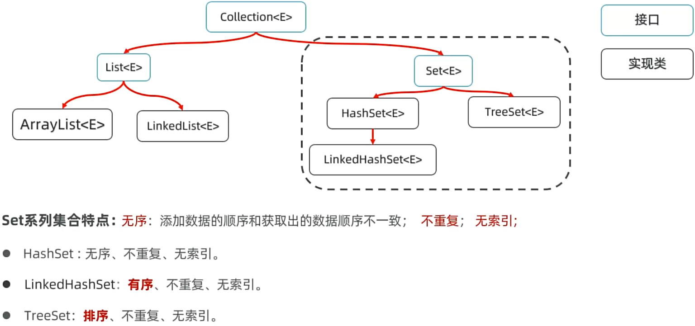

## 数组

### 常用方法


## Collections

### 常用方法

| 方法                                                         | 方法说明                                          |
| ------------------------------------------------------------ | ------------------------------------------------- |
| `void sort(List<T> list)`                                    | 对列表进行升序排序。                              |
| `void sort(List<T> list, Comparator<? super T> c)`           | 根据给定的比较器对列表进行排序。                  |
| `int binarySearch(List<? extends Comparable<? super T>> list, T key)` | 在已排序的列表中进行二分查找。                    |
| `T max(Collection<? extends T> coll)`                        | 返回集合中的最大元素。                            |
| `T min(Collection<? extends T> coll)`                        | 返回集合中的最小元素。                            |
| `void replaceAll(List<T> list, T oldVal, T newVal)`          | 将列表中所有等于 `oldVal` 的元素替换为 `newVal`。 |
| `void fill(List<? super T> list, T obj)`                     | 将列表的所有元素替换为指定的值。                  |
| `void reverse(List<?> list)`                                 | 反转列表中的元素顺序。                            |
| `void shuffle(List<?> list)`                                 | 随机打乱列表中的元素。                            |
| `void swap(List<?> list, int i, int j)`                      | 交换列表中两个指定位置的元素。                    |

这个表格清晰地列出了常用方法及其说明。


## Arrays

### 常用方法

以下是 Java `Arrays` 类常用方法的两列表格：

| 方法                                                         | 方法说明                              |
| ------------------------------------------------------------ | ------------------------------------- |
| `static <T> T[] copyOf(T[] original, int newLength)`         | 复制数组，返回新数组。                |
| `static int[] copyOf(int[] original, int newLength)`         | 复制 `int` 数组，返回新数组。         |
| `static <T> T[] copyOfRange(T[] original, int from, int to)` | 复制数组的指定范围。                  |
| `static int[] copyOfRange(int[] original, int from, int to)` | 复制 `int` 数组的指定范围。           |
| `static void fill(int[] a, int val)`                         | 用指定值填充 `int` 数组。             |
| `static void fill(T[] a, T val)`                             | 用指定值填充数组。                    |
| `static int binarySearch(int[] a, int key)`                  | 在已排序的 `int` 数组中进行二分查找。 |
| `static int binarySearch(T[] a, T key)`                      | 在已排序的数组中进行二分查找。        |
| `static void sort(int[] a)`                                  | 对 `int` 数组进行排序。               |
| `static void sort(T[] a)`                                    | 对数组进行排序。                      |
| `static void sort(T[] a, Comparator<? super T> c)`           | 根据给定比较器对数组进行排序。        |
| `static String toString(int[] a)`                            | 返回 `int` 数组的字符串表示。         |
| `static String toString(T[] a)`                              | 返回数组的字符串表示。                |
| `static List<T> asList(T... a)`                              | 将数组转换为固定大小的列表。          |

这个表格列出了 `Arrays` 类的常用方法及其简要说明。

- `public static <T> List<T> asList(T... a)`

  将数组转换为一个固定大小的 **List**

  > 当你将一个 `int` 数组传递给 `Arrays.asList()` 时，返回的结果可能不是你期望的 `List<Integer>` 类型。原因是 Java 的基本类型（如 `int`、`double`、`char`）不能直接用于泛型，`Arrays.asList()` 只接受引用类型（如 `Integer`、`Double`、`Character`）作为参数。因此，如果传入的是基本类型的数组（如 `int[]`），`Arrays.asList()` 会将整个数组视为单一的元素，而不会将其转换为 `List<Integer>`。

  ```java
  int[] arrays = new int[]{1, 2, 3};
  String[] str = new String[]{"a", "b", "c"};
  
  List<int[]> list = Arrays.asList(arrays);
  List<String> list1 = Arrays.asList(str);
  ```

  

- `public static void toString(Object[ ] a, Object key)`

  `toString`方法用于将数组转换为字符串，方便打印和调试。

  ```java
  // 示例代码
  int[] numbers = {1, 2, 3, 4, 5};
  String arrayString = Arrays.toString(numbers);
  // 输出格式：[1,2,3,4,5]
  ```

- `public static void sort(Object[ ] a)`

  方法运用:给数组排序，默认升序

  ```java
  int[] a = new int[5]{5，4，3，2，1};
  Arrays.sort(a); // 1 2 3 4 5
  System.out.println(Arrays.toString(a));
  // [1,2,3,4,5]
  ```

  对字符串进行排序时，是对每一个字符比较，而不是简单的比较长度

  ```java
  // str1 = abd
  // str2 = abcdef
  // 因为d > c,所以 str1 > str2
  ```

- `public static boolean equals(long[ ] a, long[ ] a2)  `

  方法作用：比较两个数组内容是否相等

  > 注意：Arrays.equals()是比较数组内容，而a.equals(b) 这样的方法是比较地址值

  ```java
  int[] a = {1,2,3};
  int[] b = {1,2,3};
  boolean isSame = Arrays.equals(a,b);
  //true
  ```

- `public static void fill(int[ ] a, int val)`

  将指定的 int 值分配给指定 int 型数组指定范围中的每个元素。同样的方法适用于所有的其他基本数据类型（Byte，short，Int等）

  ```java
  ```

  

- `public static int binarySearch(Object[ ] a, Object key)`

  方法作用：在数组中查找元素

  > 再数组中查找指定值，若找到，则返回此值的下标，
  >
  > 若没找到，返回 -插入点-1；

  ```java
  int Arrays.binarySearch( Datatype[], Datatype key)
  
  int[] a = {1,5,6,7};
  Arrays.binarySearch(a,2)  //没找到，插入点为1，则返回 -2
  Arrays.binarySearch(a,4)  //没找到，插入点为1，则返回 -2
  Arrays,binarySearch(a,8)  //没找到，插入点为4，则返回 -5
  Arrays.binarySearch(a,5)  //找到了！返回下标 1
  //只要返回值 ≥ 0 ，就代表找到了。
  ```

- `public static <T> T[] copyOf(T[] original, int newLength) {`

  拷贝数组，第一个参数是原数组，第二个参数是拷贝长度，返回值是将原数组拷贝一份返回

  > 需要注意的是返回值是一个新数组，会改变接收这个新数组的引用的一些属性 
  >
  > ```java
  > public static void main(String[] args) {
  >         int[] arr1 = new int[]{1, 2, 3, 4, 5, 6, 7, 8, 9, 10};
  >         int[] arr2 = new int[5];
  >         arr2 = Arrays.copyOf(arr1, 10);
  > }
  > ```


## String

以下是 Java `String` 类常用方法的两列表格：

| 方法                                             | 方法说明                                                    |
| ------------------------------------------------ | ----------------------------------------------------------- |
| `int length()`                                   | 返回字符串的长度。                                          |
| `char charAt(int index)`                         | 返回指定索引位置的字符。                                    |
| `String substring(int beginIndex)`               | 返回从指定索引开始到字符串末尾的子字符串。                  |
| `String substring(int beginIndex, int endIndex)` | 返回从 `beginIndex` 到 `endIndex` 的子字符串。              |
| `String toLowerCase()`                           | 将字符串转换为小写。                                        |
| `String toUpperCase()`                           | 将字符串转换为大写。                                        |
| `char[] toCharArray()`                           | 将当前字符串转为char类型数组                                |
| `String trim()`                                  | 去除字符串首尾的空白。                                      |
| `boolean equals(Object anObject)`                | 比较字符串与指定对象是否相等。                              |
| `boolean equalsIgnoreCase(String anotherString)` | 比较字符串与另一个字符串，忽略大小写。                      |
| `int indexOf(String str)`                        | 返回指定子字符串第一次出现的位置。                          |
| `int indexOf(String str, int fromIndex)`         | 返回指定子字符串从 `fromIndex` 开始第一次出现的位置。       |
| `String replace(char oldChar, char newChar)`     | 替换字符串中所有旧字符为新字符。                            |
| `String[] split(String regex)`                   | 根据指定的正则表达式分割字符串。                            |
| `boolean contains(CharSequence sequence)`        | 判断字符串是否包含指定的字符序列。                          |
| `StringBuilder append(String str)`               | 将字符串追加到 `StringBuilder` 对象中（构造方法的一部分）。 |

这个表格列出了 `String` 类的常用方法及其简要说明。

### 创建

1. 方式一：JAVA程序中的所有字符串文字（例如"ABC"）都为此类的对象

   ```JAVA
   String name = "小黑";
   ```

2. 方式二：调用`String`类的构造器初始化字符串对象

   | 构造器                         | 说明                                   |
   | ------------------------------ | -------------------------------------- |
   | public String()                | 创建一个空白字符串对象，不含有任何内容 |
   | public String(String original) | 根据传入的字符串内容，来创建字符串对象 |
   | public String(char[] chars)    | 根据字符数组的内容，来创建字符串对象   |
   | public String(byte[] bytes)    | 根据字节数组的内容，来创建字符串对象   |

### 常用方法

| 方法名                                                       | 说明                                                     |
| ------------------------------------------------------------ | -------------------------------------------------------- |
| public int length()                                          | 获取字符串的长度返回（就是字符个数）                     |
| public char charAt(int index)                                | 获取某个索引位置处的字符返回                             |
| public char[] toCharArray():                                 | 将当前字符串转换成字符数组返回                           |
| public boolean equals(object an0bject)                       | 判断当前字符串与另一个字符串的内容一样，一样返回true     |
| public boolean equalsIgnoreCase(String anotherString)        | 判断当前字符串与另一个字符串的内容是否一样(忽略大小写）  |
| public String substring(int beginIndex, int endIndex)        | 根据开始和结束索引进行截取，得到新的字符串（包前不包后） |
| public String substring(int beginIndex)                      | 从传入的索引处截取，截取到末尾，得到新的字符串返回       |
| public String replace(CharSequence target, CharSequence replacement) | 使用新值，将字符串中的旧值替换，得到新的字符串           |
| public boolean contains(CharSequence s)                      | 判断字符串中是否包含了某个字符串                         |
| public boolean startsWith(String prefix)                     | 判断字符串是否以某个字符串内容开头，开头返回true，反之   |
| public String trim()                                         | 去除字符串首尾的所有空格                                 |
| public String[] split(String regex)                          | 把字符串按照某个字符串内容分割，并返回字符串数组回来     |

## StringBuilder

### 创建

以下是创建 `StringBuilder` 对象的几种方法：

| 方法                                    | 说明                                                |
| --------------------------------------- | --------------------------------------------------- |
| `StringBuilder()`                       | 创建一个空的 `StringBuilder` 对象。                 |
| `StringBuilder(String str)`             | 创建一个包含指定字符串内容的 `StringBuilder` 对象。 |
| `StringBuilder(int capacity)`           | 创建一个具有指定初始容量的 `StringBuilder` 对象。   |
| `StringBuilder(StringBuilder original)` | 创建一个包含指定 `StringBuilder` 内容的副本。       |

这些方法可以根据不同的需求选择使用，以创建和初始化 `StringBuilder` 对象。

### 常用方法

以下是 Java `StringBuilder` 类常用方法的两列表格：

| 方法                                                    | 方法说明                                    |
| ------------------------------------------------------- | ------------------------------------------- |
| `StringBuilder append(String str)`                      | 将指定字符串追加到 `StringBuilder` 的末尾。 |
| `StringBuilder append(char c)`                          | 将指定字符追加到 `StringBuilder` 的末尾。   |
| `StringBuilder insert(int offset, String str)`          | 在指定位置插入字符串。                      |
| `StringBuilder delete(int start, int end)`              | 删除指定范围的字符。                        |
| `StringBuilder deleteCharAt(int index)`                 | 删除指定索引位置的字符。                    |
| `StringBuilder replace(int start, int end, String str)` | 替换指定范围内的字符。                      |
| `StringBuilder reverse()`                               | 反转 `StringBuilder` 中的字符顺序。         |
| `int length()`                                          | 返回字符序列的长度。                        |
| `char charAt(int index)`                                | 返回指定索引位置的字符。                    |
| `String toString()`                                     | 将 `StringBuilder` 转换为 `String` 对象。   |
| `void setCharAt(int index, char ch)`                    | 用指定字符替换指定索引位置的字符。          |
| `int indexOf(String str)`                               | 返回指定子字符串第一次出现的位置。          |
| `int lastIndexOf(String str)`                           | 返回指定子字符串最后一次出现的位置。        |

这个表格列出了 `StringBuilder` 类的常用方法及其简要说明。

## 堆栈

### 常用方法

以下是 Java `Stack` 和 `Queue` 接口的常用方法的详细列表：

#### Stack 常用方法

| 方法                         | 方法说明                                 |
| ---------------------------- | ---------------------------------------- |
| `E push(E item)`             | 将指定元素推入栈中。                     |
| `E pop()`                    | 从栈中弹出并返回顶部元素。               |
| `E peek()`                   | 返回栈顶元素，但不移除它。               |
| `boolean empty()`            | 判断栈是否为空。                         |
| `int search(Object o)`       | 返回指定元素在栈中的位置（从顶部开始）。 |
| `int size()`                 | 返回栈中的元素数量。                     |
| `boolean contains(Object o)` | 判断栈是否包含指定元素。                 |
| `E[] toArray()`              | 返回栈中所有元素的数组表示。             |
| `Enumeration<E> elements()`  | 返回栈中元素的枚举。                     |
| `void clear()`               | 清空栈中的所有元素。                     |

#### Queue 常用方法

| 方法                                       | 方法说明                                                    |
| ------------------------------------------ | ----------------------------------------------------------- |
| `boolean add(E e)`                         | 将指定元素添加到队列的末尾（如果队列满，抛出异常）。        |
| `E remove()`                               | 移除并返回队列的头元素（如果队列为空，抛出异常）。          |
| `E poll()`                                 | 移除并返回队列的头元素（如果队列为空，返回 `null`）。       |
| `E peek()`                                 | 返回队列的头元素，但不移除它（如果队列为空，返回 `null`）。 |
| `boolean offer(E e)`                       | 将指定元素添加到队列（如果队列满，返回 `false`）。          |
| `boolean isEmpty()`                        | 判断队列是否为空。                                          |
| `int size()`                               | 返回队列中的元素数量。                                      |
| `boolean contains(Object o)`               | 判断队列是否包含指定元素。                                  |
| `void clear()`                             | 清空队列中的所有元素。                                      |
| `Object[] toArray()`                       | 返回队列中所有元素的数组表示。                              |
| `E[] toArray(E[] a)`                       | 返回队列中元素的数组，指定数组的类型。                      |
| `Iterator<E> iterator()`                   | 返回队列中元素的迭代器。                                    |
| `void forEach(Consumer<? super E> action)` | 对队列中的每个元素执行指定操作。                            |

这些方法为 `Stack` 和 `Queue` 提供了丰富的操作功能，适用于各种数据结构和算法需求。


# 泛型

## 认识泛型

定义类、接口、方法时，同时声明了一个或者多个类型变量（如：<E>)

称为泛型类、泛型接口，泛型方法、它们统称为泛型。

 

作用：泛型提供了在编译阶段约束所能操作的数据类型，并自动进行检查的能力！这样可以避免强制类型转换及其可能出现的异常

> 例如现在我们创建一个 `ArrayList list = new ArrayList();`，没有加泛型，此时`list`中可以加任意类型的变量
>
> 但是当我们使用 `list.get()`方法的时候，只能给我们返回`Object`类型的，再由我们手动强转为需要的类型，原因就是`list`不知道里面是什么类型
>
> 这个时候强转容易出错，例如原来存储的是`23`int类型的，就无法转为`String`类型
>
> 所以我们需要人为地添加约束
>
> - `ArrayList<String> list = new ArrayList<>(); `
> - 从JDK7以后可以省略 `new ArrayList<String>()`尖括号中的 `String`
>
> 这样一来 `list`只能存储`String`类型的元素，无法存储其他类型的，在获取的时候也会自动转为String类型

```java
package com.itheima.demo2genericity;

import java.util.ArrayList;

public class GenericDemo1 {
    public static void main(String[] args) {
        // 目标：认识泛型，搞清楚使用泛型的好处。
        ArrayList<String> list = new ArrayList<String>();
        list.add("java");
        list.add("php");
//        list.add(23);
//        list.add(99.9);
//        list.add(true);
//        list.add('a');
//        list.add(new Object());


        // 获取数据。
        for (int i = 0; i < list.size(); i++) {
//            Object rs = list.get(i);
//            // 把数据转型处理。
//            String s = (String) rs;
//            System.out.println(s);

            String s = list.get(i);
            System.out.println(s);
        }
    }
}
```

## 泛型标记

**java 中泛型标记符：**

- **E** - Element (在集合中使用，因为集合中存放的是元素)
- **T** - Type（Java 类）
- **K** - Key（键）
- **V** - Value（值）
- **N** - Number（数值类型）
- **？** - 表示不确定的 java 类型

## 泛型类

 

我们也可以自定义一个泛型类来模拟

> 这里我们只模拟使用，所以内部其实还是一个`ArrayList`

```java
// 自定义泛型类
public class MyArrayList<E> {

    private ArrayList list = new ArrayList();

    public boolean add(E e){
        list.add(e);
        return true;
    }

    public boolean remove(E e){
        return list.remove(e);
    }
	
    //查看数据
    @Override
    public String toString() {
        return list.toString();
}
```

然后写一个类来使用我们定义的泛型类

> 这里因为我们定义了 `MyArrayList<String> mlist = new MyArrayList<>();`
>
> 下面的`list.add(555)`因为添加的是`int`类型，所以会报错

```java
public class GenericDemo2 {
    public static void main(String[] args) {
        // 目标：学会自定义泛型类。
        // 需求：请您模拟ArrayList集合自定义一个集合MyArrayList.
        // MyArrayList<String> list = new MyArrayList<String>();
        MyArrayList<String> mlist = new MyArrayList<>(); // JDK 7开始支持的后面类型可以不写
        mlist.add("hello");
        mlist.add("world");
//        list.add(555); // 报错
        mlist.add("java");
        mlist.add("前端");

        System.out.println(mlist.remove("world"));

        System.out.println(mlist);
    }
}
```

## 泛型接口

 

假如现在我们的业务中需要同时对学生和老师进行增删改查，在业务相似的情况下我们不需要分别写教师和学生的实现，可以写一个泛型接口来根据传入的对象来操作学生或者教师

```java
//Data.java
// 自定义泛型接口
public interface Data<T> {
    void add(T t);;
}
```

- 学生实现类，实现`Data`接口

  > 传入Student对象

  ```java
  public class StudentData implements Data<Student>{
      @Override
      public void add(Student student) {
  }
  ```

  

- 教师实现类，实现`Data`接口

  > 传入Teacher对象

  ```java
  public class TeacherData implements Data<Teacher>{
      @Override
      public void add(Teacher teacher) {
  }
  ```

然后在业务里我们就可以这么做

```java
public class GenericDemo3 {
    public static void main(String[] args) {
        // 目标：搞清楚泛型接口的基本作用
        // 需求：项目需要对学生数据/老师数据都要进行增删改查操作
        StudentData studentData = new StudentData();
        studentData.add(new Student());
        studentData.delete(new Student());
        Student s = studentData.query(1);
    }
}
```

## 泛型方法

你可以写一个泛型方法，该方法在调用时可以接收不同类型的参数。根据传递给泛型方法的参数类型，编译器适当地处理每一个方法调用。

下面是定义泛型方法的规则：

- 所有泛型方法声明都有一个类型参数声明部分（由尖括号分隔），该类型参数声明部分在方法返回类型之前（在下面例子中的 **<E>**）。
- 每一个类型参数声明部分包含一个或多个类型参数，参数间用逗号隔开。一个泛型参数，也被称为一个类型变量，是用于指定一个泛型类型名称的标识符。
- 类型参数能被用来声明返回值类型，并且能作为泛型方法得到的实际参数类型的占位符。
- 泛型方法体的声明和其他方法一样。注意类型参数只能代表引用型类型，不能是原始类型（像 **int、double、char** 等）

> 注意：只有自己声明和定义的才叫泛型方法，如下面图3就不是泛型方法，他使用的是ArrayList的泛型


```java
public class GenericDemo4 {
    public static void main(String[] args) {
        // 目标：学会定义泛型方法，搞清楚作用。
        // 需求：打印任意数组的内容。
        String[] names = {"赵敏", "张无忌", "周芷若", "小昭"};
        Student[] stus = new Student[3];
        
        normalPrintArray(names);
        normalPrintArray(stus);
        
        printArray(names);
        //下面这一行会报错，因为无法接受 stus类型的参数，只能接受tring[]
        //printArray(stus);

        Student max = getMax(stus);
        String max2 = getMax(names);
    }

    public static void normalPrintArray(String[] names) {
        System.out.println("无泛型打印");

    }

    public static <T> void printArray(T[] names){
        System.out.println("泛型打印");
    }

    public static <T> T getMax(T[] names){
        return null;
    }
}
```

## 通配符、上下限

通配符就是 `?` 

- 可以在**使用泛型**的时候代表一切泛型
- E T K V 是在**定义泛型**的时候使用

举个例子，假如现在我们要举办一个汽车比赛

- 我们先写一个`Car`父类，让其他品牌汽车来继承他

  ```java
  public class Car {
  }
  
  class BYD extends Car{
  }
  
  class Xiaomi extends Car{
  }
  ```

- 为了能够接受所有的汽车品牌，我们使用了 `ArrayList<?> cars`来表示这个集合里面可以包含任意对象

  ```java
  public class GenericDemo5 {
      public static void main(String[] args) {
      // 需求：开发一个极品飞车的游戏。
      // 虽然Xiaomi和BYD是Car的子类，但是 ArrayList<Xiaomi>  ArrayList<BYD>和 ArrayList<Car> 是没有半毛钱关系！
      public static void go(ArrayList<?> cars) {
      }
  }
  ```

- 但是这个时候哪怕传入的对象不是汽车，例如我们创建了一个`Dog`类，居然也可以参加，所以引入了上下限`ArrayList<? extends Car> cars`来表示传入的对象必须是`Car`或者`Car`的子类

  ```java
  public class GenericDemo5 {
      public static void main(String[] args) {
      public static void go(ArrayList<? extends Car> cars) {
      }
  }
  ```

 

## 泛型支持的类型


 

  

# 集合框架

集合是一种容器，用来装数据的，类似于数组，但集合的大小可变，开发中也非常常用。

 

## Collection集合

 

Collection集合特点

- List系列集合：添加的元素是有序、可重复、有索引。
  - ArrayList、LinekdList:有序、可重复、有索引。
- Set系列集合：添加的元素是无序、不重复、无索引。
  - HashSet：无序、不重复、无索引；
  - LinkedHashSet：有序、不重复、无索引。
    - TreeSet：按照大小默认升序排序、不重复、无索引。

### 常用功能

> 为什么先学Collection的常用方法？
>
> - collection是单列集合的祖宗，它规定的方法（功能）是全部单列集合都会继承的
> - 我们可以用`Collection<String> list = new ArrayList<>();` 

| 常用方法                            | 说明                               |
| ----------------------------------- | ---------------------------------- |
| public boolean add(E e)             | 把给定的对象添加到当前集合中       |
| public void clear()                 | 清空集合中所有的元素               |
| public boolean remove(E e)          | 把给定的对象在当前集合中删除       |
| public boolean contains(Object obj) | 判断当前集合中是否包含给定的对象   |
| public boolean isEmpty()            | 判断当前集合是否为空               |
| public int size()                   | 返回集合中元素的个数。             |
| public Object[] toArray()           | 把集合中的元素，存储到数组中       |
| T[] array = list.toArray(new T[0])  | 将集合转换为数组，指定数组的类型。 |

### 三种遍历方式

#### 1.迭代器便利

迭代器是用来遍历集合的专用方式（数组没有迭代器），在Java中迭代器的代表是`Iterator`。

> `Iterator <E> iterator()`：返回集合中的迭代器对象，该迭代器对象默认指向当前集合的第一个元素
>
> 常用方法：
>
> | 方法名称          | 说明                                                      |
> | ----------------- | --------------------------------------------------------- |
> | boolean hasNext() | 询问当前位置是否有元素存在，存在返回true，不存在返回false |
> | E next()          | 获取当前位置的元素，并同时将迭代器对象指向下一个元素处。  |

```java
public class CollectionTraversalDemo3 {
    public static void main(String[] args) {
        // 目标：掌握Collection的遍历方式一：迭代器遍历
        ArrayList<String> names = new ArrayList<>();
        names.add("张无忌");
        names.add("玄冥二老");
        names.add("宋青书");
//        names.add("殷素素");
        System.out.println(names); // [张无忌, 玄冥二老, 宋青书]
        //                                                      it

        // 1、得到这个集合的迭代器对象
        //创建的集合是 String类，所以迭代器的泛型也是 String
        //迭代器的默认索引为 0 
        Iterator<String> it = names.iterator();
//        System.out.println(it.next());
//        System.out.println(it.next());
//        System.out.println(it.next());
//        System.out.println(it.next());
//        System.out.println(it.next()); // NoSuchElementException

        // 2、使用一个while循环来遍历
        while (it.hasNext()) {
            String name = it.next();
            System.out.println(name);
        }
    }
}
```

#### 2.foreach循环

- 增强for可以用来遍历集合或者数组。
- 增强for遍历集合，本质就是迭代器遍历集合的简化写法。

> 格式：
>
> ```java
> for (元素数据类型 变量名 : 数组或集合){
> }
> ```

```java
Collection<String> c = new ArrayList();
...
for(String s : c){
    System.out.println(s);
}
```

#### 3.Lambda表达式

得益于JDK8开始的新技术Lambda表达式，提供了一种更简单、更直接的方式来遍历集合。

> 需要使用Collection的如下方法来完成 
>
> | 方法名称                                          | 说明               |
> | ------------------------------------------------- | ------------------ |
> | default void forEach(Consumer< ? super T> action) | 结合lambda遍历集合 |

```java
public class CollectionTraversalDemo5 {
    public static void main(String[] args) {
        // 目标：掌握Collection的遍历方式三：lambda
        Collection<String> names = new ArrayList<>();
        names.add("张无忌");
        names.add("玄冥二老");
        names.add("宋青书");
        names.add("殷素素");

        //写法 1
//        names.forEach(new Consumer<String>() {
//            @Override
//            public void accept(String s) {
//                System.out.println(s);
//            }
//        });
        
        //写法 2
//        names.forEach(s -> System.out.println(s));

        //写法 3
        names.forEach(System.out::println);
    }
}
```

#### 三种遍历方式的区别

> 并发修改异常问题：
>
> - 遍历集合的同时又存在增删集合元素的行为可能导致异常
>   - 如果集合支持索引，可以使用fo循环遍历，每删除数据后做i--；或者可以倒着遍历
>   - 可以使用迭代器遍历，并用迭代器提供的删除方法删除数据。

注意：增强for循环/儿ambda遍历均不能解决并发修改异常问题，因此增它们只适合做数据的遍历，不适合同时做增删操作。

### List集合

List系列集合特点：有序、可重复、有索引

> ArrayList 和 LinkedList 的底层数据结构（存储和组织数据的方式）不同，应用场景不同

#### List特点

List集合因为支持索引，所以多了很多与索引相关的方法，当然，Collection的功能List也都继承了。

 | 方法名称                      | 说明                                    |
 | ----------------------------- | --------------------------------------- |
 | void add(int index,E element) | 在此集合中的指定位置插入指定的元素      |
 | E remove(int index)           | 删除指定索引1处的元素，返回被删除的元素 |
 | E set(int index,E element)    | 修改指定索引处的元素，返回被修改的元素  |
 | E get(int index)              | 返回指定索引处的元素                    |

> 四种遍历方式

```java
List<String> names = new ArrayList<>();

// 1、for循环
for (int i = 0; i < names.size(); i++) {
    System.out.println(names.get(i));
}

// 2、迭代器
Iterator<String> it = names.iterator();
while (it.hasNext()) {
    String name = it.next();
    System.out.println(name);
}

// 3、增强for
for (String name : names) {
    System.out.println(name);
}

// 4、lambda表达式
names.forEach(name ->  System.out.println(name) );
```

#### ArrayList底层原理


#### LinkedList底层原理


### Set集合

 

#### Set集合特点

Set系列集合特点：**无序**、不重复、无索引

> 无序指的是添加数据的顺序和获取出的数据顺序不一致
>
> - 注意：Set要用到的常用方法，基本上就是Collection提供的！！自己几乎没有额外新增一些常用功能！

**HashSet：**无序、不重复、无索引

```java
// 1、创建一个Set集合，特点：无序，不重复，无索引。
Set<String> set = new HashSet<>(); // 一行经典代码 HashSet 无序，不重复，无索引。
set.add("鸿蒙");
set.add("鸿蒙");
set.add("java");
set.add("java");
set.add("电商设计");
set.add("电商设计");
set.add("新媒体");
set.add("大数据");
System.out.println(set);
/*
[java, 新媒体, 鸿蒙, 电商设计, 大数据]
*/
```

**LinkedHashSet：**有序、不重复、无索引

```java
Set<String> set = new LinkedHashSet<>(); // LinkedHashSet 有序，不重复，无索引。
set.add("鸿蒙");
set.add("鸿蒙");
set.add("java");
set.add("java");
set.add("电商设计");
set.add("电商设计");
set.add("新媒体");
set.add("大数据");
System.out.println(set);

/*
[鸿蒙, java, 电商设计, 新媒体, 大数据]
*/
```

**TreeSet**：**排序**、不重复、无索引

```java
// 2、创建一个TreeSet集合：排序（默认一定要大小升序排序），不重复，无索引。
Set<Double> set1 = new TreeSet<>();
set1.add(3.14);
set1.add(5.6);
set1.add(1.0);
set1.add(1.0);
set1.add(2.0);
System.out.println(set1);

/*
[1.0, 2.0, 3.14, 5.6]
*/
```


#### HashSet底层原理


#### LinkedHashSet底层原理


#### TreeSet集合


## Map集合

### 概述

Map集合也被叫做'键值对集合，格式：`key1=value1, key2=value2, key3=value3`

Map集合的所有键是不允许重复的，但值可以重复，键和值是一一对应的，每一个键只能找到自己对应的值

> 需要存储一一对应的数据时，就可以考虑使用Map集合来做

 


**HashMap**：无序、不重复、无索引：(用的最多)

```java
public class MapDemo1 {
    public static void main(String[] args) {
        // 目标：认识Map集合的体系特点。
        // 1、创建Map集合
        // Map特点/HashMap特点：无序，不重复，无索引，键值对都可以是null, 值不做要求（可以重复）
        // LinkedMap特点：有序，不重复，无索引，键值对都可以是null, 值不做要求（可以重复）
        // TreeMap: 按照键可排序，不重复，无索引

        Map<String,Integer> map = new HashMap<>(); // 一行经典代码
        map.put("嫦娥", 20);
        map.put("女儿国王", 31);
        map.put("嫦娥", 28) ;
        map.put("铁扇公主", 38);
        map.put("紫霞", 31);
        map.put(null, null);
        System.out.println(map); // {null=null, 嫦娥=28, 铁扇公主=38, 紫霞=31, 女儿国王=31}
    }
}
```

**LinkedHashMap**：由键决定的特点：有序、不重复、无索引

```java
public class MapDemo1 {
    public static void main(String[] args) {
        // 目标：认识Map集合的体系特点。
        // 1、创建Map集合
        // Map特点/HashMap特点：无序，不重复，无索引，键值对都可以是null, 值不做要求（可以重复）
        // LinkedMap特点：有序，不重复，无索引，键值对都可以是null, 值不做要求（可以重复）
        // TreeMap: 按照键可排序，不重复，无索引

        Map<String,Integer> map = new LinkedHashMap<>();
        map.put("嫦娥", 20);
        map.put("女儿国王", 31);
        map.put("嫦娥", 28) ;
        map.put("铁扇公主", 38);
        map.put("紫霞", 31);
        map.put(null, null);
        System.out.println(map); // {嫦娥=28, 女儿国王=31, 铁扇公主=38, 紫霞=31, null=null}
    }
}
```

**TreeMap**：按照大小默认升序排序、不重复、无索引

### 常用方法

> 为什么要先学习Map的常用方法？
>
> - Mp是双列集合的祖宗，它的功能是全部双列集合都可以继承过来使用的。

以下是 Java `Map` 接口常用方法的两列表格：

| 方法                                           | 方法说明                                   |
| ---------------------------------------------- | ------------------------------------------ |
| `V put(K key, V value)`                        | 将指定的键值对插入到映射中。               |
| `V get(Object key)`                            | 根据指定的键返回对应的值。                 |
| `V remove(Object key)`                         | 移除指定键的键值对，并返回其对应的值。     |
| `boolean containsKey(Object key)`              | 判断映射是否包含指定的键。                 |
| `boolean containsValue(Object value)`          | 判断映射是否包含指定的值。                 |
| `int size()`                                   | 返回映射中的键值对数量。                   |
| `boolean isEmpty()`                            | 判断映射是否为空。                         |
| `Set<K> keySet()`                              | 返回映射中所有键的集合。                   |
| `Collection<V> values()`                       | 返回映射中所有值的集合。                   |
| `Set<Map.Entry<K,V>> entrySet()`               | 返回映射中所有键值对的集合视图。           |
| `void putAll(Map<? extends K, ? extends V> m)` | 将指定映射中的所有键值对添加到当前映射中。 |
| `void clear()`                                 | 清空映射中的所有键值对。                   |

```java
public class MapDemo2 {
    public static void main(String[] args) {
        // 目标：掌握Map的常用方法。
        Map<String,Integer> map = new HashMap<>();
        map.put("嫦娥", 20);
        map.put("女儿国王", 31);
        map.put("嫦娥", 28); //返回值是20，返回被覆盖的键的值
        map.put("铁扇公主", 38);
        map.put("紫霞", 31);
        map.put(null, null);
        System.out.println(map); // {null=null, 嫦娥=28, 铁扇公主=38, 紫霞=31, 女儿国王=31}

        // 写代码演示常用方法
        System.out.println(map.get("嫦娥")); // 根据键取值  28
        System.out.println(map.get("嫦娥2")); // 根据键取值 null

        System.out.println(map.containsKey("嫦娥")); // 判断是否包含某个键 true
        System.out.println(map.containsKey("嫦娥2")); // false

        System.out.println(map.containsValue(28)); // 判断是否包含某个值 true
        System.out.println(map.containsValue(28.0)); // false

        System.out.println(map.remove("嫦娥")); // 根据键删除键值对,返回值
        System.out.println(map);

        // map.clear(); // 清空map
        // System.out.println(map);

        System.out.println(map.isEmpty()); // 判断是否为空

        System.out.println(map.size()); // 获取键值对的个数 4

        // 获取所有的键放到一个Set集合返回给我们
        Set<String> keys = map.keySet();
        for (String key : keys) {
            System.out.println(key);
        }

        // 获取所有的值放到一个Collection集合返回给我们
        Collection<Integer> values = map.values();
        for (Integer value : values) {
            System.out.println(value);
        }
    }
}

```

### 遍历方式

#### 1.键找值

先获取Map集合全部的键，再通过遍历键来找值

> 需要用到Map的如下方法
>
> `public Set keySet()`：获取所有键的集合
>
> `public V get(Object key)`：根据键获取其对应的值

```java
public class MapTraverseDemo3 {
    public static void main(String[] args) {
        // 目标：掌握Map集合的遍历方式一：键找值。
        Map<String,Integer> map = new HashMap<>();
        map.put("嫦娥", 20);
        map.put("女儿国王", 31);
        map.put("嫦娥", 28);
        map.put("铁扇公主", 38);
        map.put("紫霞", 31);
        System.out.println(map); // {嫦娥=28, 铁扇公主=38, 紫霞=31, 女儿国王=31}

        // 1、提起Map集合的全部键到一个Set集合中去
        Set<String> keys = map.keySet();

        System.out.println(keys); //[嫦娥, 铁扇公主, 紫霞, 女儿国王]


        // 2、遍历Set集合，得到每一个键
        for (String key : keys) {
            // 3、根据键去找值
            Integer value = map.get(key);
            System.out.println(key + "=" + value);
        }
    }
}

```

#### 2.键值对

把“键值对“看成一个整体进行遍历（难度较大）

> 需要用到如下方法
>
> - `Set<Map.Entry<K,V>>entrySet()`：获取所有“键值对”的集合
>
> 先把Map转为一个Set

```java
public class MapTraverseDemo4 {
    public static void main(String[] args) {
        // 目标：掌握Map集合的遍历方式二：键值对。
        Map<String,Integer> map = new HashMap<>();
        map.put("嫦娥", 20);
        map.put("女儿国王", 31);
        map.put("嫦娥", 28);
        map.put("铁扇公主", 38);
        map.put("紫霞", 31);
        System.out.println(map); // {嫦娥=28, 铁扇公主=38, 紫霞=31, 女儿国王=31}

        // 1、把Map集合转换成Set集合，里面的元素类型都是键值对类型（Map.Entry<String, Integer>）
        /**
         *  map = {嫦娥=28, 铁扇公主=38, 紫霞=31, 女儿国王=31}
         *   ↓
         *   map.entrySet()
         *   ↓
         *  Set<Map.Entry<String, Integer>> entries = [(嫦娥=28), (铁扇公主=38), (紫霞=31), (女儿国王=31)]
         *                                                                                   entry
         */
        Set<Map.Entry<String, Integer>> entries = map.entrySet();
        // 2、遍历Set集合，得到每一个键值对类型元素
        for (Map.Entry<String, Integer> entry : entries) {
            String key = entry.getKey();
            Integer value = entry.getValue();
            System.out.println(key + "=" + value);
        }
    }
}
```


#### 3.Lambda

JDK1.8开始之后的新技术（非常的简单）

### 实现类


## Stream流
