在昨天的作业中，我们将黑马商城拆分为5个微服务：

* 用户服务

* 商品服务

* 购物车服务

* 交易服务

* 支付服务&#x20;

由于每个微服务都有不同的地址或端口，入口不同，相信大家在与前端联调的时候发现了一些问题：

* 请求不同数据时要访问不同的入口，需要维护多个入口地址，麻烦

* 前端无法调用nacos，无法实时更新服务列表

单体架构时我们只需要完成一次用户登录、身份校验，就可以在所有业务中获取到用户信息。而微服务拆分后，每个微服务都独立部署，这就存在一些问题：

* 每个微服务都需要编写登录校验、用户信息获取的功能吗？

* 当微服务之间调用时，该如何传递用户信息？

不要着急，这些问题都可以在今天的学习中找到答案，我们会通过**网关**技术解决上述问题。今天的内容会分为3章：

* 第一章：网关路由，解决前端请求入口的问题。

* 第二章：网关鉴权，解决统一登录校验和用户信息获取的问题。

* 第三章：统一配置管理，解决微服务的配置文件重复和配置热更新问题。

通过今天的学习你将掌握下列能力：

* 会利用微服务网关做请求路由

* 会利用微服务网关做登录身份校验

* 会利用Nacos实现统一配置管理

* 会利用Nacos实现配置热更新

好了，接下来我们就一起进入今天的学习吧。

# 1.网关路由

## 1.1.认识网关

什么是网关？

顾明思议，网关就是**网**络的**关**口。数据在网络间传输，从一个网络传输到另一网络时就需要经过网关来做数据的**路由和转发以及数据安全的校验**。

更通俗的来讲，网关就像是以前园区传达室的大爷。

* 外面的人要想进入园区，必须经过大爷的认可，如果你是不怀好意的人，肯定被直接拦截。

* 外面的人要传话或送信，要找大爷。大爷帮你带给目标人。

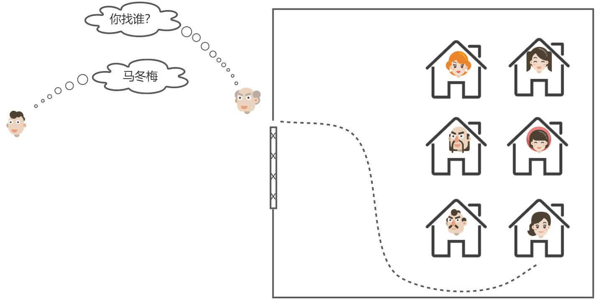

现在，微服务网关就起到同样的作用。前端请求不能直接访问微服务，而是要请求网关：

* 网关可以做安全控制，也就是登录身份校验，校验通过才放行

* 通过认证后，网关再根据请求判断应该访问哪个微服务，将请求转发过去


> 前端发送的所有请求都会到达网关，由网关决定发送到那个服务。在发送的同时需要负载均衡，所以用到了注册中心。网关也是一个服务，同样会被注册，也会收到注册中心的服务更新。
>
> 所有的请求都到网关？网关负载过大怎么办？

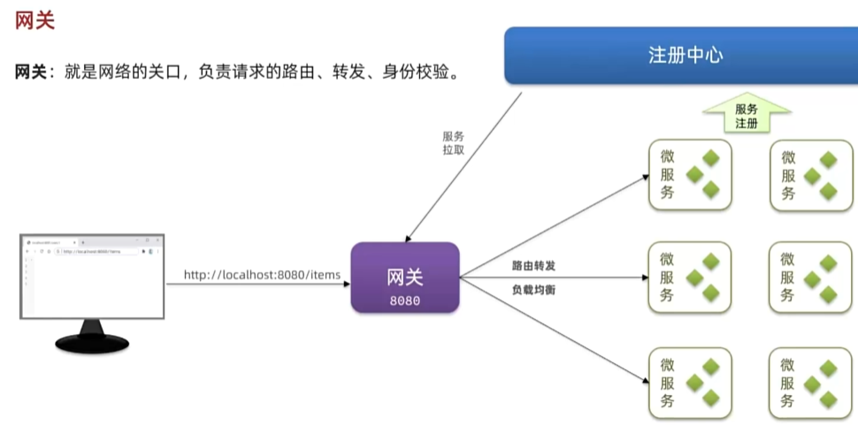

在SpringCloud当中，提供了两种网关实现方案：

* Netflix Zuul：早期实现，目前已经淘汰

* SpringCloudGateway：基于Spring的WebFlux技术，完全支持响应式编程，吞吐能力更强

课堂中我们以SpringCloudGateway为例来讲解，官方网站：

简单来说网关的作用有两个

- 路由转发
- 身份校验

## 1.2.快速入门

接下来，我们先看下如何利用网关实现请求路由。由于网关本身也是一个独立的微服务，因此也需要创建一个模块开发功能。大概步骤如下：


* 创建网关微服务

* 引入SpringCloudGateway、NacosDiscovery依赖

* 编写启动类

* 配置网关路由

### 1.2.1.创建项目

首先，我们要在hmall下创建一个新的module，命名为hm-gateway，作为网关微服务：


### 1.2.2.引入依赖

在`hm-gateway`模块的`pom.xml`文件中引入依赖：

### 1.2.3.启动类

在`hm-gateway`模块的`com.hmall.gateway`包下新建一个启动类：


代码如下：

### 1.2.4.配置路由

接下来，在`hm-gateway`模块的`resources`目录新建一个`application.yaml`文件，内容如下：

```yaml
server:
  port: 8080
spring:
  application:
    name: gateway
  cloud:
    nacos:
      server-addr: 121.37.172.251:8848 # nacos地址
    gateway:
      routes:
        - id: item # 路由规则id，自定义，唯一
          uri: lb://item-service # 路由的目标服务，lb代表负载均衡，会从注册中心拉取服务列表
          predicates: # 路由断言，判断当前请求是否符合当前规则，符合则路由到目标服务
            - Path=/items/**,/search/** # 这里是以请求路径作为判断规则
        - id: cart
          uri: lb://cart-service
          predicates:
            - Path=/carts/**
        - id: user
          uri: lb://user-service
          predicates:
            - Path=/users/**,/addresses/**
        - id: trade
          uri: lb://trade-service
          predicates:
            - Path=/orders/**
        - id: pay
          uri: lb://pay-service
          predicates:
            - Path=/pay-orders/**
hm:
  jwt:
    location: classpath:hmall.jks # 秘钥地址
    alias: hmall # 秘钥别名
    password: hmall123 # 秘钥文件密码
    tokenTTL: 30m # 登录有效期
  auth:
    excludePaths: # 无需登录校验的路径
      - /search/**
      - /users/login
      - /items/**
```

### 1.2.5.测试

启动GatewayApplication，以 http://localhost:8080 拼接微服务接口路径来测试。例如：

<http://localhost:8080/items/page?pageNo=1&pageSize=1>


此时，启动UserApplication、CartApplication，然后打开前端页面，发现相关功能都可以正常访问了：

## 1.3.路由过滤

路由规则的定义语法如下：

其中routes对应的类型如下：


是一个集合，也就是说可以定义很多路由规则。集合中的`RouteDefinition`就是具体的路由规则定义，其中常见的属性如下：

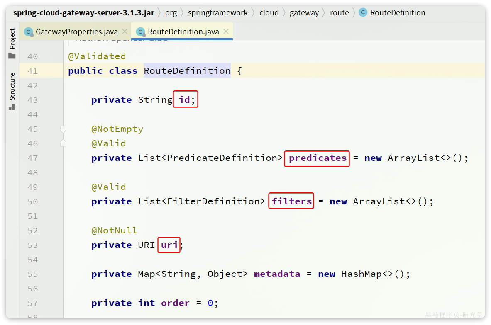

四个属性含义如下：

* `id`：路由的唯一标示

* `predicates`：路由断言，其实就是匹配条件

* `filters`：路由过滤条件，后面讲

* `uri`：路由目标地址，`lb://`代表负载均衡，从注册中心获取目标微服务的实例列表，并且负载均衡选择一个访问。

这里我们重点关注`predicates`，也就是路由断言。SpringCloudGateway中支持的断言类型有很多：

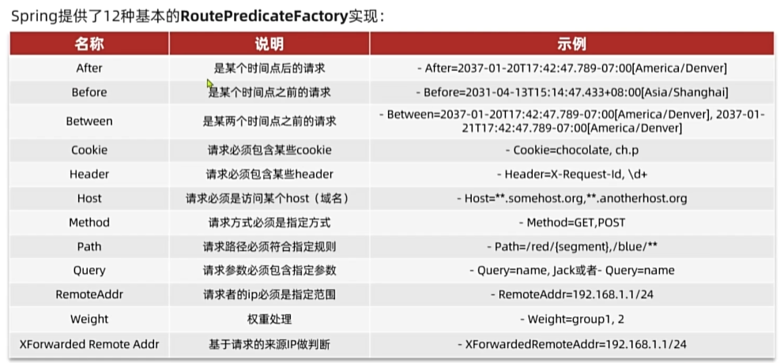

| **名称**   | **说明**                       | **示例**                                                     |
| ---------- | ------------------------------ | ------------------------------------------------------------ |
| After      | 是某个时间点后的请求           | - After=2037-01-20T17:42:47.789-07:00\[America/Denver]       |
| Before     | 是某个时间点之前的请求         | - Before=2031-04-13T15:14:47.433+08:00\[Asia/Shanghai]       |
| Between    | 是某两个时间点之前的请求       | - Between=2037-01-20T17:42:47.789-07:00\[America/Denver], 2037-01-21T17:42:47.789-07:00\[America/Denver] |
| Cookie     | 请求必须包含某些cookie         | - Cookie=chocolate, ch.p                                     |
| Header     | 请求必须包含某些header         | - Header=X-Request-Id, \d+                                   |
| Host       | 请求必须是访问某个host（域名） | - Host=\*\*.somehost.org,\*\*.anotherhost.org                |
| Method     | 请求方式必须是指定方式         | - Method=GET,POST                                            |
| Path       | 请求路径必须符合指定规则       | - Path=/red/{segment},/blue/\*\*                             |
| Query      | 请求参数必须包含指定参数       | - Query=name, Jack或者- Query=name                           |
| RemoteAddr | 请求者的ip必须是指定范围       | - RemoteAddr=192.168.1.1/24                                  |
| weight     | 权重处理                       |                                                              |

# 2.网关登录校验

单体架构时我们只需要完成一次用户登录、身份校验，就可以在所有业务中获取到用户信息。而微服务拆分后，每个微服务都独立部署，不再共享数据。也就意味着每个微服务都需要做登录校验，这显然不可取。

## 2.1.鉴权思路分析

我们的登录是基于JWT来实现的，校验JWT的算法复杂，而且需要用到秘钥。如果每个微服务都去做登录校验，这就存在着两大问题：

* 每个微服务都需要知道JWT的秘钥，不安全

* 每个微服务重复编写登录校验代码、权限校验代码，麻烦

既然网关是所有微服务的入口，一切请求都需要先经过网关。我们完全可以把登录校验的工作放到网关去做，这样之前说的问题就解决了：

* 只需要在网关和用户服务保存秘钥

* 只需要在网关开发登录校验功能

此时，登录校验的流程如图：

不过，这里存在几个问题：

* 网关路由是配置的，请求转发是Gateway内部代码，我们如何在转发之前做登录校验？

* 网关校验JWT之后，如何将用户信息传递给微服务？

* 微服务之间也会相互调用，这种调用不经过网关，又该如何传递用户信息？

这些问题将在接下来几节一一解决。

## 2.2.网关过滤器

登录校验必须在请求转发到微服务之前做，否则就失去了意义。而网关的请求转发是`Gateway`内部代码实现的，要想在请求转发之前做登录校验，就必须了解`Gateway`内部工作的基本原理。

如图所示：

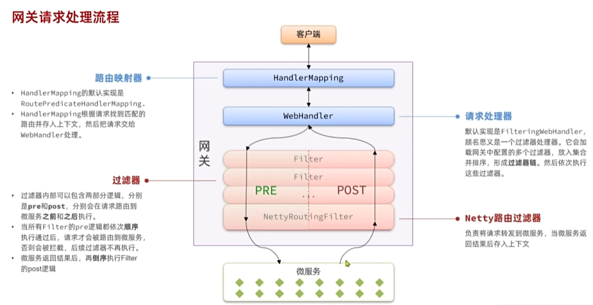

1. 客户端请求进入网关后由`HandlerMapping`对请求做判断，找到与当前请求匹配的路由规则（**`Route`**），然后将请求交给`WebHandler`去处理。

2. `WebHandler`则会加载当前路由下需要执行的过滤器链（**`Filter chain`**），然后按照顺序逐一执行过滤器（后面称&#x4E3A;**`Filter`**）。

3. 图中`Filter`被虚线分为左右两部分，是因为`Filter`内部的逻辑分为`pre`和`post`两部分，分别会在请求路由到微服务**之前**和**之后**被执行。

4. 只有所有`Filter`的`pre`逻辑都依次顺序执行通过后，请求才会被路由到微服务。

5. 微服务返回结果后，再倒序执行`Filter`的`post`逻辑。

6. 最终把响应结果返回。

如图中所示，最终请求转发是有一个名为`NettyRoutingFilter`的过滤器来执行的，而且这个过滤器是整个过滤器链中顺序最靠后的一个。**如果我们能够定义一个过滤器，在其中实现登录校验逻辑，并且将过滤器执行顺序定义到`NettyRoutingFilter`之前**，这就符合我们的需求了！

> 以往我们会把信息放到`ThreadLocal`中，但在分布式系统中是不可行的。不同的微服务之间可能存在联系，该如何在微服务之间传递用户信息呢？
>
> 下图所示保存到请求头是不可行的，微服务之间的相互调用是通过`openfeign`实现的，但网关到微服务之间是网关内部的http，实现方式不同

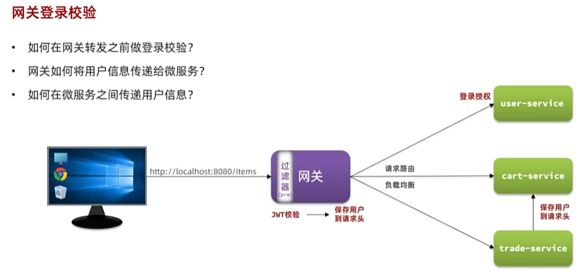

那么，该如何实现一个网关过滤器呢？

网关过滤器链中的过滤器有两种：

* **`GatewayFilter`**：路由过滤器，作用范围比较灵活，可以是任意指定的路由`Route`.&#x20;

* **`GlobalFilter`**：全局过滤器，作用范围是所有路由，不可配置。
  * 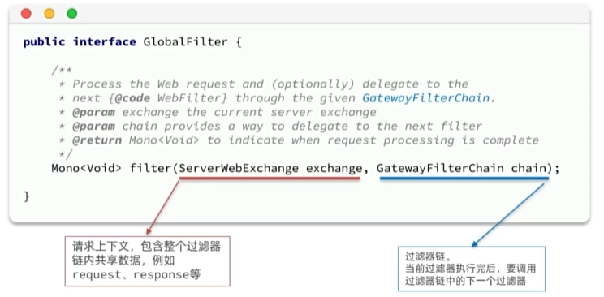


> **注意**：过滤器链之外还有一种过滤器，HttpHeadersFilter，用来处理传递到下游微服务的请求头。例如org.springframework.cloud.gateway.filter.headers.XForwardedHeadersFilter可以传递代理请求原本的host头到下游微服务。

其实`GatewayFilter`和`GlobalFilter`这两种过滤器的方法签名完全一致：

`FilteringWebHandler`在处理请求时，会将`GlobalFilter`装饰为`GatewayFilter`，然后放到同一个过滤器链中，排序以后依次执行。

`Gateway`中内置了很多的`GatewayFilter`，详情可以参考官方文档：

`Gateway`内置的`GatewayFilter`过滤器使用起来非常简单，无需编码，只要在yaml文件中简单配置即可。而且其作用范围也很灵活，配置在哪个`Route`下，就作用于哪个`Route`.

例如，有一个过滤器叫做`AddRequestHeaderGatewayFilterFacotry`，顾明思议，就是添加请求头的过滤器，可以给请求添加一个请求头并传递到下游微服务。

使用的使用只需要在application.yaml中这样配置：

```YAML
spring:
  cloud:
    gateway:
      routes:
      - id: test_route
        uri: lb://test-service
        predicates:
          -Path=/test/**
        filters:
          - AddRequestHeader=key, value # 逗号之前是请求头的key，逗号之后是value
```

如果想要让过滤器作用于所有的路由，则可以这样配置：

```YAML
spring:
  cloud:
    gateway:
      default-filters: # default-filters下的过滤器可以作用于所有路由
        - AddRequestHeader=key, value
      routes:
      - id: test_route
        uri: lb://test-service
        predicates:
          -Path=/test/**
```

## 2.3.自定义过滤器

无论是`GatewayFilter`还是`GlobalFilter`都支持自定义，只不过**编码**方式、**使用**方式略有差别。

### 2.3.1.自定义GatewayFilter

自定义`GatewayFilter`不是直接实现`GatewayFilter`，而是实现`AbstractGatewayFilterFactory`。最简单的方式是这样的：

```Java
@Component
public class PrintAnyGatewayFilterFactory extends AbstractGatewayFilterFactory<Object> {
    @Override
    public GatewayFilter apply(Object config) {
        return new GatewayFilter() {
            @Override
            public Mono<Void> filter(ServerWebExchange exchange, GatewayFilterChain chain) {
                // 获取请求
                ServerHttpRequest request = exchange.getRequest();
                // 编写过滤器逻辑
                System.out.println("过滤器执行了");
                // 放行
                return chain.filter(exchange);
            }
        };
    }
}
```

> **注意**：该类的名称一定要以`GatewayFilterFactory`为后缀！

然后在yaml配置中这样使用：

```YAML
spring:
  cloud:
    gateway:
      default-filters:
            - PrintAny # 此处直接以自定义的GatewayFilterFactory类名称前缀类声明过滤器
```

另外，这种过滤器还可以支持动态配置参数，不过实现起来比较复杂，示例：

```Java
@Component
public class PrintAnyGatewayFilterFactory // 父类泛型是内部类的Config类型
                extends AbstractGatewayFilterFactory<PrintAnyGatewayFilterFactory.Config> {

    @Override
    public GatewayFilter apply(Config config) {
        // OrderedGatewayFilter是GatewayFilter的子类，包含两个参数：
        // - GatewayFilter：过滤器
        // - int order值：值越小，过滤器执行优先级越高
        return new OrderedGatewayFilter(new GatewayFilter() {
            @Override
            public Mono<Void> filter(ServerWebExchange exchange, GatewayFilterChain chain) {
                // 获取config值
                String a = config.getA();
                String b = config.getB();
                String c = config.getC();
                // 编写过滤器逻辑
                System.out.println("a = " + a);
                System.out.println("b = " + b);
                System.out.println("c = " + c);
                // 放行
                return chain.filter(exchange);
            }
        }, 100);
    }

    // 自定义配置属性，成员变量名称很重要，下面会用到
    @Data
    static class Config{
        private String a;
        private String b;
        private String c;
    }
    // 将变量名称依次返回，顺序很重要，将来读取参数时需要按顺序获取
    @Override
    public List<String> shortcutFieldOrder() {
        return List.of("a", "b", "c");
    }
        // 返回当前配置类的类型，也就是内部的Config
    @Override
    public Class<Config> getConfigClass() {
        return Config.class;
    }

}
```

然后在yaml文件中使用：

```YAML
spring:
  cloud:
    gateway:
      default-filters:
            - PrintAny=1,2,3 # 注意，这里多个参数以","隔开，将来会按照shortcutFieldOrder()方法返回的参数顺序依次复制
```

上面这种配置方式参数必须严格按照shortcutFieldOrder()方法的返回参数名顺序来赋值。

还有一种用法，无需按照这个顺序，就是手动指定参数名：

```YAML
spring:
  cloud:
    gateway:
      default-filters:
            - name: PrintAny
              args: # 手动指定参数名，无需按照参数顺序
                a: 1
                b: 2
                c: 3
```

### 2.3.2.自定义GlobalFilter

自定义GlobalFilter则简单很多，直接实现GlobalFilter即可，而且也无法设置动态参数：

```Java
@Component
public class PrintAnyGlobalFilter implements GlobalFilter, Ordered {
    @Override
    public Mono<Void> filter(ServerWebExchange exchange, GatewayFilterChain chain) {
        // 编写过滤器逻辑
        System.out.println("未登录，无法访问");
        // 放行
        // return chain.filter(exchange);

        // 拦截
        ServerHttpResponse response = exchange.getResponse();
        response.setRawStatusCode(401);
        return response.setComplete();
    }

    @Override
    public int getOrder() {
        // 过滤器执行顺序，值越小，优先级越高
        return 0;
    }
}
```

## 2.4.登录校验

接下来，我们就利用自定义`GlobalFilter`来完成登录校验。

### 2.4.1.JWT工具

登录校验需要用到JWT，而且JWT的加密需要秘钥和加密工具。这些在`hm-service`中已经有了，我们直接拷贝过来：


具体作用如下：

* `AuthProperties`：配置登录校验需要拦截的路径，因为不是所有的路径都需要登录才能访问

* `JwtProperties`：定义与JWT工具有关的属性，比如秘钥文件位置

* `SecurityConfig`：工具的自动装配

* `JwtTool`：JWT工具，其中包含了校验和解析`token`的功能

* `hmall.jks`：秘钥文件

其中`AuthProperties`和`JwtProperties`所需的属性要在`application.yaml`中配置：

### 2.4.2.登录校验过滤器

接下来，我们定义一个登录校验的过滤器：

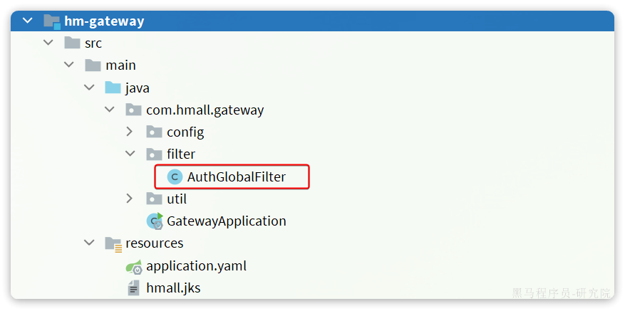

代码如下：

```java
package com.hmall.gateway.filter;

import com.hmall.common.exception.UnauthorizedException;
import com.hmall.common.utils.CollUtils;
import com.hmall.gateway.config.AuthProperties;
import com.hmall.gateway.util.JwtTool;
import lombok.RequiredArgsConstructor;
import org.springframework.boot.context.properties.EnableConfigurationProperties;
import org.springframework.cloud.gateway.filter.GatewayFilterChain;
import org.springframework.cloud.gateway.filter.GlobalFilter;
import org.springframework.core.Ordered;
import org.springframework.http.server.reactive.ServerHttpRequest;
import org.springframework.http.server.reactive.ServerHttpResponse;
import org.springframework.stereotype.Component;
import org.springframework.util.AntPathMatcher;
import org.springframework.web.server.ServerWebExchange;
import reactor.core.publisher.Mono;

import java.util.List;

@Component
@RequiredArgsConstructor
@EnableConfigurationProperties(AuthProperties.class)
public class AuthGlobalFilter implements GlobalFilter, Ordered {

    private final JwtTool jwtTool;

    private final AuthProperties authProperties;

    private final AntPathMatcher antPathMatcher = new AntPathMatcher();

    @Override
    public Mono<Void> filter(ServerWebExchange exchange, GatewayFilterChain chain) {
        // 1.获取Request
        ServerHttpRequest request = exchange.getRequest();
        // 2.判断是否不需要拦截
        if(isExclude(request.getPath().toString())){
            // 无需拦截，直接放行
            return chain.filter(exchange);
        }
        // 3.获取请求头中的token
        String token = null;
        List<String> headers = request.getHeaders().get("authorization");
        if (!CollUtils.isEmpty(headers)) {
            token = headers.get(0);
        }
        // 4.校验并解析token
        Long userId = null;
        try {
            userId = jwtTool.parseToken(token);
        } catch (UnauthorizedException e) {
            // 如果无效，拦截
            ServerHttpResponse response = exchange.getResponse();
            response.setRawStatusCode(401);
            return response.setComplete();
        }

        // TODO 5.如果有效，传递用户信息
        System.out.println("userId = " + userId);
        // 6.放行
        return chain.filter(exchange);
    }

    private boolean isExclude(String antPath) {
        for (String pathPattern : authProperties.getExcludePaths()) {
            if(antPathMatcher.match(pathPattern, antPath)){
                return true;
            }
        }
        return false;
    }

    @Override
    public int getOrder() {
        return 0;
    }
}
```


重启测试，会发现访问/items开头的路径，未登录状态下不会被拦截：

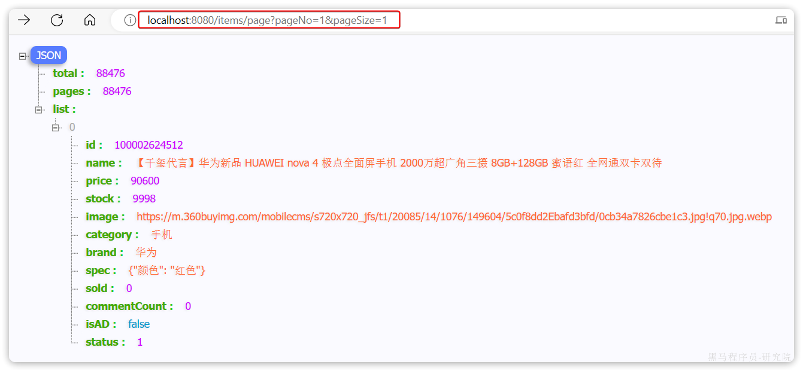

访问其他路径则，未登录状态下请求会被拦截，并且返回`401`状态码：


## 2.5.微服务获取用户

现在，网关已经可以完成登录校验并获取登录用户身份信息。但是当网关将请求转发到微服务时，微服务又该如何获取用户身份呢？

由于网关发送请求到微服务依然采用的是`Http`请求，因此我们可以将用户信息以请求头的方式传递到下游微服务。然后微服务可以从请求头中获取登录用户信息。考虑到微服务内部可能很多地方都需要用到登录用户信息，因此我们可以利用SpringMVC的拦截器来实现登录用户信息获取，并存入ThreadLocal，方便后续使用。

据图流程图如下：

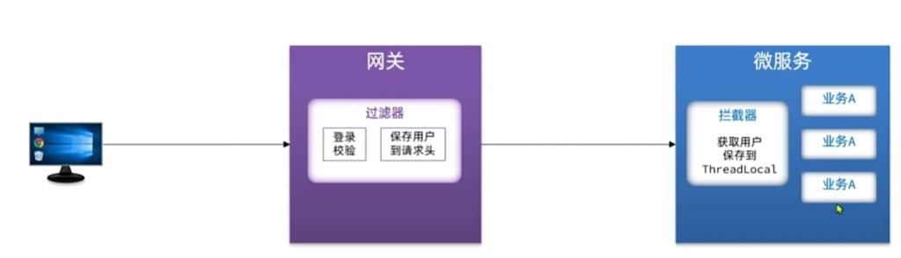


因此，接下来我们要做的事情有：

* 改造网关过滤器，在获取用户信息后保存到请求头，转发到下游微服务

* 编写微服务拦截器，拦截请求获取用户信息，保存到ThreadLocal后放行

### 2.5.1.保存用户到请求头

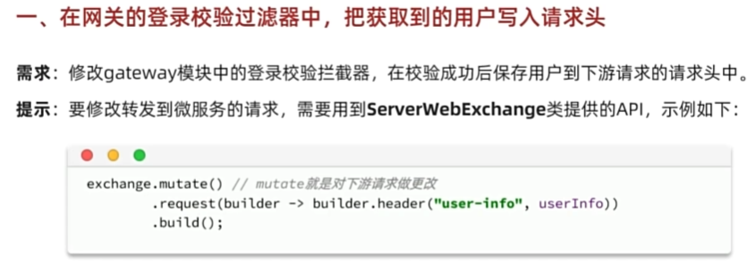

首先，我们修改登录校验拦截器的处理逻辑，保存用户信息到请求头中：


### 2.5.2.拦截器获取用户

在hm-common中已经有一个用于保存登录用户的ThreadLocal工具：

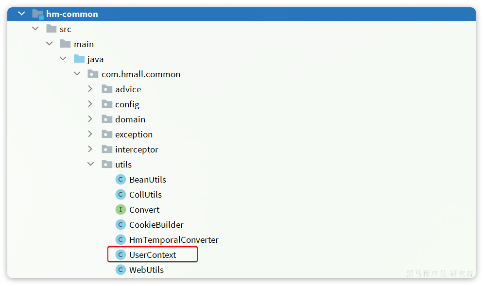

其中已经提供了保存和获取用户的方法：


接下来，我们只需要编写拦截器，获取用户信息并保存到`UserContext`，然后放行即可。

由于每个微服务都有获取登录用户的需求，我们不可能在每个业务的controller中获取用户信息，因此我们可以基于springmvc的拦截器，在每个controller执行前解析用户信息。因此拦截器我们直接写在`hm-common`中，并写好自动装配。这样微服务只需要引入`hm-common`就可以直接具备拦截器功能，无需重复编写。

我们在`hm-common`模块下定义一个拦截器：


具体代码如下：

```Java
package com.hmall.common.interceptor;

import cn.hutool.core.util.StrUtil;
import com.hmall.common.utils.UserContext;
import org.springframework.web.servlet.HandlerInterceptor;

import javax.servlet.http.HttpServletRequest;
import javax.servlet.http.HttpServletResponse;

public class UserInfoInterceptor implements HandlerInterceptor {
    @Override
    public boolean preHandle(HttpServletRequest request, HttpServletResponse response, Object handler) throws Exception {
        // 1.获取请求头中的用户信息
        String userInfo = request.getHeader("user-info");
        // 2.判断是否为空
        if (StrUtil.isNotBlank(userInfo)) {
            // 不为空，保存到ThreadLocal
                UserContext.setUser(Long.valueOf(userInfo));
        }
        // 3.放行
        return true;
    }

    @Override
    public void afterCompletion(HttpServletRequest request, HttpServletResponse response, Object handler, Exception ex) throws Exception {
        // 移除用户
        UserContext.removeUser();
    }
}
```

接着在`hm-common`模块下编写`SpringMVC`的配置类，配置登录拦截器：

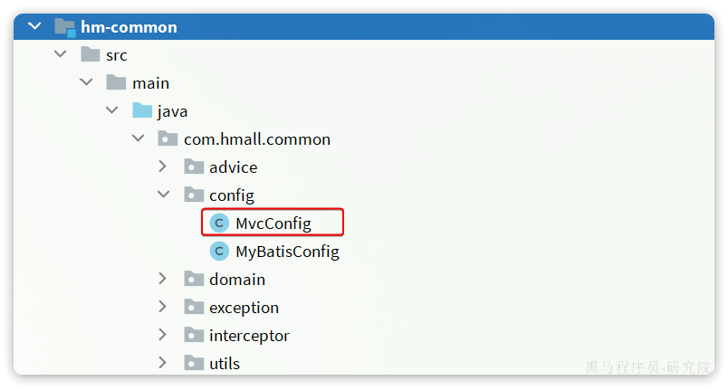

具体代码如下：

```Java
package com.hmall.common.config;

import com.hmall.common.interceptors.UserInfoInterceptor;
import org.springframework.boot.autoconfigure.condition.ConditionalOnClass;
import org.springframework.context.annotation.Configuration;
import org.springframework.web.servlet.DispatcherServlet;
import org.springframework.web.servlet.config.annotation.InterceptorRegistry;
import org.springframework.web.servlet.config.annotation.WebMvcConfigurer;

@Configuration
//如果不配置的话，由于hm-gateway引用了hm-common，则也会自动加载这个类
//但是网关不是基于springmvc的，所以会报错，我们使用条件判断让网关不加载这个类
@ConditionalOnClass(DispatcherServlet.class)
public class MvcConfig implements WebMvcConfigurer {
    @Override
    public void addInterceptors(InterceptorRegistry registry) {
        registry.addInterceptor(new UserInfoInterceptor());
    }
}
```

不过，需要注意的是，这个配置类默认是不会生效的，因为它所在的包是`com.hmall.common.config`，与其它微服务的扫描包不一致，无法被扫描到，因此无法生效。

基于SpringBoot的自动装配原理，我们要将其添加到`resources`目录下的`META-INF/spring.factories`文件中：


内容如下：

```Properties
org.springframework.boot.autoconfigure.EnableAutoConfiguration=\
  com.hmall.common.config.MyBatisConfig,\
  com.hmall.common.config.MvcConfig
```

### 2.5.3.恢复购物车代码

之前我们无法获取登录用户，所以把购物车服务的登录用户写死了，现在需要恢复到原来的样子。

找到`cart-service`模块的`com.hmall.cart.service.impl.CartServiceImpl`：

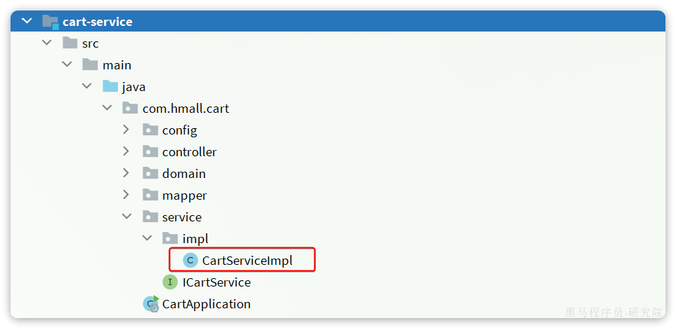

修改其中的`queryMyCarts`方法：


## 2.6.OpenFeign传递用户

前端发起的请求都会经过网关再到微服务，由于我们之前编写的过滤器和拦截器功能，微服务可以轻松获取登录用户信息。

但有些业务是比较复杂的，请求到达微服务后还需要调用其它多个微服务。比如下单业务，流程如下：


下单的过程中，需要调用商品服务扣减库存，调用购物车服务清理用户购物车。而清理购物车时必须知道当前登录的用户身份。但是，**订单服务调用购物车时并没有传递用户信息**，购物车服务无法知道当前用户是谁！

由于微服务获取用户信息是通过拦截器在请求头中读取，因此要想实现微服务之间的用户信息传递，就**必须在微服务发起调用时把用户信息存入请求头**。

微服务之间调用是基于OpenFeign来实现的，并不是我们自己发送的请求。我们如何才能让每一个由OpenFeign发起的请求自动携带登录用户信息呢？

这里要借助Feign中提供的一个拦截器接口：`feign.RequestInterceptor`

```Java
public interface RequestInterceptor {

  /**
   * Called for every request. 
   * Add data using methods on the supplied {@link RequestTemplate}.
   */
  void apply(RequestTemplate template);
}
```

我们只需要实现这个接口，然后实现apply方法，利用`RequestTemplate`类来添加请求头，将用户信息保存到请求头中。这样以来，每次OpenFeign发起请求的时候都会调用该方法，传递用户信息。


由于`FeignClient`全部都是在`hm-api`模块，因此我们在`hm-api`模块的`com.hmall.api.config.DefaultFeignConfig`中编写这个拦截器：


在`com.hmall.api.config.DefaultFeignConfig`中添加一个Bean：

```Java
@Bean
public RequestInterceptor userInfoRequestInterceptor(){
    return new RequestInterceptor() {
        @Override
        public void apply(RequestTemplate template) {
            // 获取登录用户
            Long userId = UserContext.getUser();
            if(userId == null) {
                // 如果为空则直接跳过
                return;
            }
            // 如果不为空则放入请求头中，传递给下游微服务
            template.header("user-info", userId.toString());
        }
    };
}
```

好了，现在微服务之间通过OpenFeign调用时也会传递登录用户信息了。

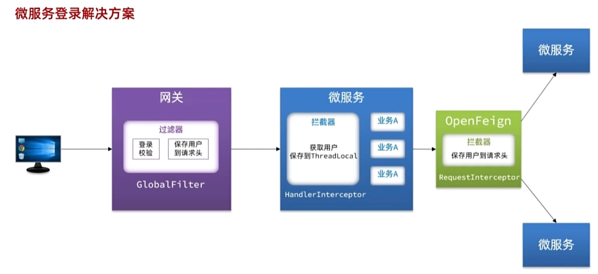

# 3.配置管理

到目前为止我们已经解决了微服务相关的几个问题：

* 微服务远程调用

* 微服务注册、发现

* 微服务请求路由、负载均衡

* 微服务登录用户信息传递

不过，现在依然还有几个问题需要解决：

* 网关路由在配置文件中写死了，如果变更必须重启微服务

* 某些业务配置在配置文件中写死了，每次修改都要重启服务

* 每个微服务都有很多重复的配置，维护成本高

这些问题都可以通过统一的**配置管理器服务**解决。而Nacos不仅仅具备注册中心功能，也具备配置管理的功能：

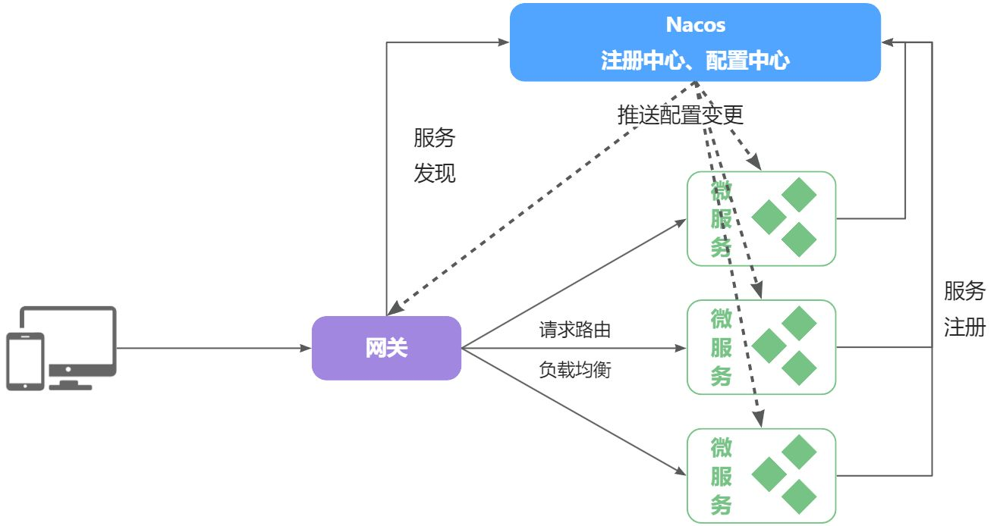

微服务共享的配置可以统一交给Nacos保存和管理，在Nacos控制台修改配置后，Nacos会将配置变更推送给相关的微服务，并且无需重启即可生效，实现配置热更新。

网关的路由同样是配置，因此同样可以基于这个功能实现动态路由功能，无需重启网关即可修改路由配置。

## 3.1.配置共享

我们可以把微服务共享的配置抽取到Nacos中统一管理，这样就不需要每个微服务都重复配置了。分为两步：

* 在Nacos中添加共享配置

* 微服务拉取配置

### 3.1.1.添加共享配置

以cart-service为例，我们看看有哪些配置是重复的，可以抽取的：

首先是jdbc相关配置：

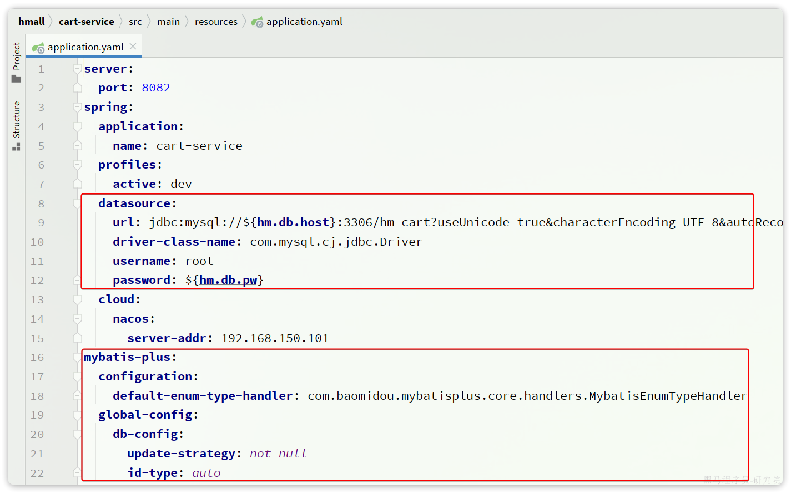

然后是日志配置：


然后是swagger以及OpenFeign的配置：


我们在nacos控制台分别添加这些配置。

首先是jdbc相关配置，在`配置管理`->`配置列表`中点击`+`新建一个配置：

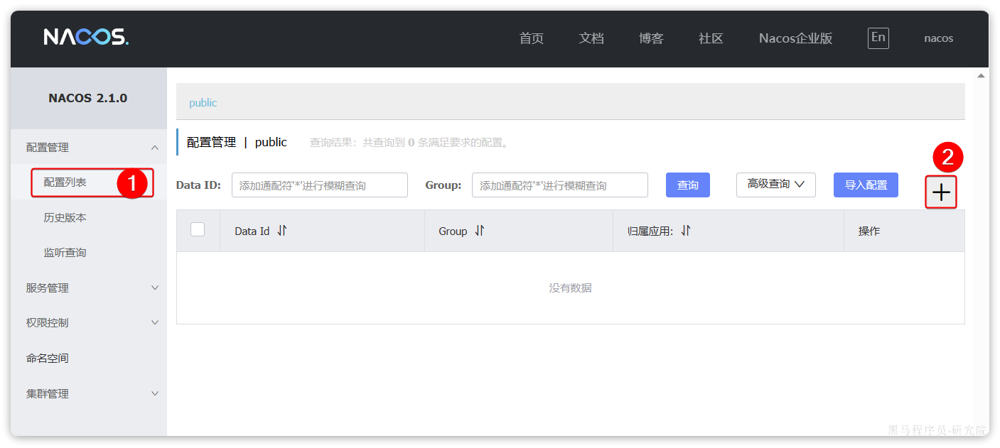

在弹出的表单中填写信息：


其中详细的配置如下：

```YAML
spring:
  datasource:
    url: jdbc:mysql://${hm.db.host:121.37.172.251}:${hm.db.port:3306}/${hm.db.database}?useUnicode=true&characterEncoding=UTF-8&autoReconnect=true&serverTimezone=Asia/Shanghai
    driver-class-name: com.mysql.cj.jdbc.Driver
    username: ${hm.db.un:root}
    password: ${hm.db.pw:root}
mybatis-plus:
  configuration:
    default-enum-type-handler: com.baomidou.mybatisplus.core.handlers.MybatisEnumTypeHandler
  global-config:
    db-config:
      update-strategy: not_null
      id-type: auto
```

注意这里的jdbc的相关参数并没有写死，例如：

* `数据库ip`：通过`${hm.db.host:192.168.150.101}`配置了默认值为`192.168.150.101`，同时允许通过`${hm.db.host}`来覆盖默认值

* `数据库端口`：通过`${hm.db.port:3306}`配置了默认值为`3306`，同时允许通过`${hm.db.port}`来覆盖默认值

* `数据库database`：可以通过`${hm.db.database}`来设定，无默认值

然后是统一的日志配置，命名为`shared-log.yaml`，配置内容如下：

```YAML
logging:
  level:
    com.hmall: debug
  pattern:
    dateformat: HH:mm:ss:SSS
  file:
    path: "logs/${spring.application.name}"
```

然后是统一的swagger配置，命名为`shared-swagger.yaml`，配置内容如下：

注意，这里的swagger相关配置我们没有写死，例如：

```YAML
knife4j:
  enable: true
  openapi:
    title: ${hm.swagger.title:黑马商城接口文档}
    description: ${hm.swagger.description:黑马商城接口文档}
    email: ${hm.swagger.email:zhanghuyi@itcast.cn}
    concat: ${hm.swagger.concat:虎哥}
    url: https://www.itcast.cn
    version: v1.0.0
    group:
      default:
        group-name: default
        api-rule: package
        api-rule-resources:
          - ${hm.swagger.package}
```

* `title`：接口文档标题，我们用了`${hm.swagger.title}`来代替，将来可以有用户手动指定

* `email`：联系人邮箱，我们用了`${hm.swagger.email:zhanghuyi@itcast.cn}`，默认值是`zhanghuyi@itcast.cn`，同时允许用户利用`${hm.swagger.email}`来覆盖。

### 3.1.2.拉取共享配置

接下来，我们要在微服务拉取共享配置。将拉取到的共享配置与本地的`application.yaml`配置合并，完成项目上下文的初始化。

不过，需要注意的是，读取Nacos配置是SpringCloud上下文（`ApplicationContext`）初始化时处理的，发生在项目的引导阶段。然后才会初始化SpringBoot上下文，去读取`application.yaml`。

也就是说引导阶段，`application.yaml`文件尚未读取，根本不知 道nacos 地址，该如何去加载nacos中的配置文件呢？

SpringCloud在初始化上下文的时候会先读取一个名为`bootstrap.yaml`(或者`bootstrap.properties`)的文件，如果我们将nacos地址配置到`bootstrap.yaml`中，那么在项目引导阶段就可以读取nacos中的配置了。

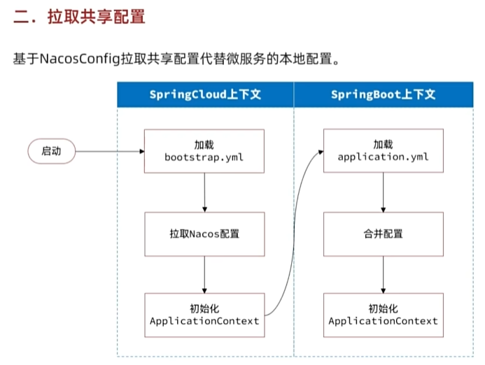


因此，微服务整合Nacos配置管理的步骤如下：

1）引入依赖：

在cart-service模块引入依赖：

```XML
  <!--nacos配置管理-->
  <dependency>
      <groupId>com.alibaba.cloud</groupId>
      <artifactId>spring-cloud-starter-alibaba-nacos-config</artifactId>
  </dependency>
  <!--读取bootstrap文件-->
  <dependency>
      <groupId>org.springframework.cloud</groupId>
      <artifactId>spring-cloud-starter-bootstrap</artifactId>
  </dependency>
```

2）新建bootstrap.yaml

在cart-service中的resources目录新建一个bootstrap.yaml文件：


内容如下：

```YAML
spring:
  application:
    name: cart-service # 服务名称
  profiles:
    active: dev
  cloud:
    nacos:
      server-addr: 121.37.172.251 # nacos地址
      config:
        file-extension: yaml # 文件后缀名
        shared-configs: # 共享配置
          - dataId: shared-jdbc.yaml # 共享mybatis配置
          - dataId: shared-log.yaml # 共享日志配置
          - dataId: shared-swagger.yaml # 共享日志配置
```

3）修改application.yaml

由于一些配置挪到了bootstrap.yaml，因此application.yaml需要修改为：


重启服务，发现所有配置都生效了。

## 3.2.配置热更新

有很多的业务相关参数，将来可能会根据实际情况临时调整。例如购物车业务，购物车数量有一个上限，默认是10，对应代码如下：


现在这里购物车是写死的固定值，我们应该将其配置在配置文件中，方便后期修改。

但现在的问题是，即便写在配置文件中，修改了配置还是需要重新打包、重启服务才能生效。能不能不用重启，直接生效呢？

这就要用到Nacos的配置热更新能力了，分为两步：

* 在Nacos中添加配置

* 在微服务读取配置

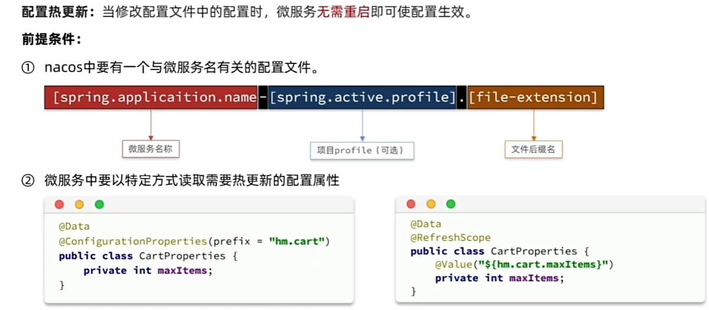

### 3.2.1.添加配置到Nacos

首先，我们在nacos中添加一个配置文件，将购物车的上限数量添加到配置中：


注意文件的dataId格式：

文件名称由三部分组成：

* **`服务名`**：我们是购物车服务，所以是`cart-service`

* **`spring.active.profile`**：就是spring boot中的`spring.active.profile`，可以省略，则所有profile共享该配置

* **`后缀名`**：例如yaml

这里我们直接使用`cart-service.yaml`这个名称，则不管是dev还是local环境都可以共享该配置。

配置内容如下：

```YAML
hm:
  cart:
    maxAmount: 1 # 购物车商品数量上限
```

提交配置，在控制台能看到新添加的配置：


### 3.2.2.配置热更新

接着，我们在微服务中读取配置，实现配置热更新。

在`cart-service`中新建一个属性读取类：


代码如下：

```Java
package com.hmall.cart.config;

import lombok.Data;
import org.springframework.boot.context.properties.ConfigurationProperties;
import org.springframework.stereotype.Component;

@Data
@Component
@ConfigurationProperties(prefix = "hm.cart")
public class CartProperties {
    private Integer maxAmount;
}
```

接着，在业务中使用该属性加载类：


测试，向购物车中添加多个商品：


我们在nacos控制台，将购物车上限配置为5：


无需重启，再次测试购物车功能：


加入成功！

无需重启服务，配置热更新就生效了！

## 3.3.动态路由

网关的路由配置全部是在项目启动时由`org.springframework.cloud.gateway.route.CompositeRouteDefinitionLocator`在项目启动的时候加载，并且一经加载就会缓存到内存中的路由表内（一个Map），不会改变。也不会监听路由变更，所以，我们无法利用上节课学习的配置热更新来实现路由更新。

因此，我们必须监听Nacos的配置变更，然后手动把最新的路由更新到路由表中。这里有两个难点：

* 如何监听Nacos配置变更？

* 如何把路由信息更新到路由表？

### 3.3.1.监听Nacos配置变更

在Nacos官网中给出了手动监听Nacos配置变更的SDK：


如果希望 Nacos 推送配置变更，可以使用 Nacos 动态监听配置接口来实现。

> 此处的`dataId`和`group`对应的就是nacos中的`dataId`和`group`

```Java
public void addListener(String dataId, String group, Listener listener)
```

请求参数说明：

| **参数名** | **参数类型** | **描述**                                                     |
| ---------- | ------------ | ------------------------------------------------------------ |
| dataId     | string       | 配置 ID，保证全局唯一性，只允许英文字符和 4 种特殊字符（"."、":"、"-"、"\_"）。不超过 256 字节。 |
| group      | string       | 配置分组，一般是默认的DEFAULT\_GROUP。                       |
| listener   | Listener     | 监听器，配置变更进入监听器的回调函数。                       |

示例代码：

```Java
String serverAddr = "{serverAddr}";
String dataId = "{dataId}";
String group = "{group}";
// 1.创建ConfigService，连接Nacos
Properties properties = new Properties();
properties.put("serverAddr", serverAddr);
//和nacos建立连接并返回配置
ConfigService configService = NacosFactory.createConfigService(properties);
// 2.读取配置
String content = configService.getConfig(dataId, group, 5000);
// 3.添加配置监听器
configService.addListener(dataId, group, new Listener() {
    @Override
    // 配置变更的通知处理
    public void receiveConfigInfo(String configInfo) {
        System.out.println("recieve1:" + configInfo);
    }
    @Override
    public Executor getExecutor() {
        return null;
    }
});
```

这里核心的步骤有2步：

* 创建ConfigService，目的是连接到Nacos

* 添加配置监听器，编写配置变更的通知处理逻辑

由于我们采用了`spring-cloud-starter-alibaba-nacos-config`自动装配，因此`ConfigService`已经在`com.alibaba.cloud.nacos.NacosConfigAutoConfiguration`中自动创建好了：


NacosConfigManager中是负责管理Nacos的ConfigService的，具体代码如下：


因此，只要我们拿到`NacosConfigManager`就等于拿到了`ConfigService`，第一步就实现了。

第二步，编写监听器。虽然官方提供的SDK是ConfigService中的addListener，不过项目第一次启动时不仅仅需要添加监听器，也需要读取配置，因此建议使用的API是这个：

```Java
String getConfigAndSignListener(
    String dataId, // 配置文件id
    String group, // 配置组，走默认
    long timeoutMs, // 读取配置的超时时间
    Listener listener // 监听器
) throws NacosException;
```

既可以配置监听器，并且会根据dataId和group读取配置并返回。我们就可以在项目启动时先更新一次路由，后续随着配置变更通知到监听器，完成路由更新。

### 3.3.2.更新路由

更新路由要用到`org.springframework.cloud.gateway.route.RouteDefinitionWriter`这个接口：

```Java
package org.springframework.cloud.gateway.route;

import reactor.core.publisher.Mono;

/**
 * @author Spencer Gibb
 */
public interface RouteDefinitionWriter {
        /**
     * 更新路由到路由表，如果路由id重复，则会覆盖旧的路由
     */
        Mono<Void> save(Mono<RouteDefinition> route);
        /**
     * 根据路由id删除某个路由
     */
        Mono<Void> delete(Mono<String> routeId);

}
```

这里更新的路由，也就是RouteDefinition，之前我们见过，包含下列常见字段：

* id：路由id

* predicates：路由匹配规则

* filters：路由过滤器

* uri：路由目的地

将来我们保存到Nacos的配置也要符合这个对象结构，将来我们以JSON来保存，格式如下：

```JSON
{
  "id": "item",
  "predicates": [{
    "name": "Path",
    "args": {"_genkey_0":"/items/**", "_genkey_1":"/search/**"}
  }],
  "filters": [],
  "uri": "lb://item-service"
}
```

以上JSON配置就等同于：

```YAML
spring:
  cloud:
    gateway:
      routes:
        - id: item
          uri: lb://item-service
          predicates:
            - Path=/items/**,/search/**
```

OK，我们所需要用到的SDK已经齐全了。

### 3.3.3.实现动态路由

首先， 我们在网关gateway引入依赖：

```XML
<!--统一配置管理-->
<dependency>
    <groupId>com.alibaba.cloud</groupId>
    <artifactId>spring-cloud-starter-alibaba-nacos-config</artifactId>
</dependency>
<!--加载bootstrap-->
<dependency>
    <groupId>org.springframework.cloud</groupId>
    <artifactId>spring-cloud-starter-bootstrap</artifactId>
</dependency>
```

然后在网关`gateway`的`resources`目录创建`bootstrap.yaml`文件，内容如下：

```YAML
spring:
  application:
    name: gateway
  cloud:
    nacos:
      server-addr: 192.168.150.101
      config:
        file-extension: yaml
        shared-configs:
          - dataId: shared-log.yaml # 共享日志配置
```

接着，修改`gateway`的`resources`目录下的`application.yml`，把之前的路由移除，最终内容如下：

```YAML
server:
  port: 8080 # 端口
hm:
  jwt:
    location: classpath:hmall.jks # 秘钥地址
    alias: hmall # 秘钥别名
    password: hmall123 # 秘钥文件密码
    tokenTTL: 30m # 登录有效期
  auth:
    excludePaths: # 无需登录校验的路径
      - /search/**
      - /users/login
      - /items/**
```

然后，在`gateway`中定义配置监听器：

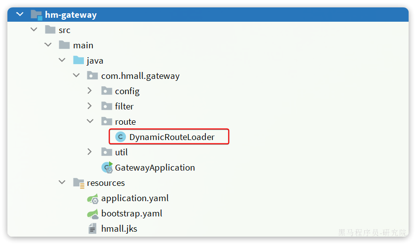

其代码如下：

```Java
package com.hmall.gateway.route;

import cn.hutool.json.JSONUtil;
import com.alibaba.cloud.nacos.NacosConfigManager;
import com.alibaba.nacos.api.config.listener.Listener;
import com.alibaba.nacos.api.exception.NacosException;
import com.hmall.common.utils.CollUtils;
import lombok.RequiredArgsConstructor;
import lombok.extern.slf4j.Slf4j;
import org.springframework.cloud.gateway.route.RouteDefinition;
import org.springframework.cloud.gateway.route.RouteDefinitionWriter;
import org.springframework.stereotype.Component;
import reactor.core.publisher.Mono;

import javax.annotation.PostConstruct;
import java.util.HashSet;
import java.util.List;
import java.util.Set;
import java.util.concurrent.Executor;

@Slf4j
@Component
@RequiredArgsConstructor
public class DynamicRouteLoader {

    private final RouteDefinitionWriter writer;
    private final NacosConfigManager nacosConfigManager;

    // 路由配置文件的id和分组
    private final String dataId = "gateway-routes.json";
    private final String group = "DEFAULT_GROUP";
    // 保存更新过的路由id
    private final Set<String> routeIds = new HashSet<>();

    @PostConstruct
    public void initRouteConfigListener() throws NacosException {
        // 1.注册监听器并首次拉取配置
        String configInfo = nacosConfigManager.getConfigService()
                .getConfigAndSignListener(dataId, group, 5000, new Listener() {
                    @Override
                    public Executor getExecutor() {
                        return null;
                    }

                    @Override
                    public void receiveConfigInfo(String configInfo) {
                        updateConfigInfo(configInfo);
                    }
                });
        // 2.首次启动时，更新一次配置
        updateConfigInfo(configInfo);
    }

    private void updateConfigInfo(String configInfo) {
        log.debug("监听到路由配置变更，{}", configInfo);
        // 1.反序列化
        List<RouteDefinition> routeDefinitions = JSONUtil.toList(configInfo, RouteDefinition.class);
        // 2.更新前先清空旧路由
        // 2.1.清除旧路由
        for (String routeId : routeIds) {
            writer.delete(Mono.just(routeId)).subscribe();
        }
        routeIds.clear();
        // 2.2.判断是否有新的路由要更新
        if (CollUtils.isEmpty(routeDefinitions)) {
            // 无新路由配置，直接结束
            return;
        }
        // 3.更新路由
        routeDefinitions.forEach(routeDefinition -> {
            // 3.1.更新路由
            writer.save(Mono.just(routeDefinition)).subscribe();
            // 3.2.记录路由id，方便将来删除
            routeIds.add(routeDefinition.getId());
        });
    }
}
```

重启网关，任意访问一个接口，比如 <http://localhost:8080/search/list?pageNo=1&pageSize=1>：

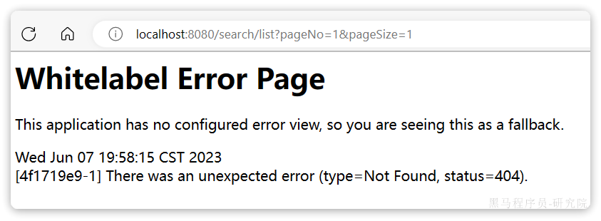

发现是404，无法访问。

接下来，我们直接在Nacos控制台添加路由，路由文件名为`gateway-routes.json`，类型为`json`：


配置内容如下：

```JSON
[
    {
        "id": "item",
        "predicates": [{
            "name": "Path",
            "args": {"_genkey_0":"/items/**", "_genkey_1":"/search/**"}
        }],
        "filters": [],
        "uri": "lb://item-service"
    },
    {
        "id": "cart",
        "predicates": [{
            "name": "Path",
            "args": {"_genkey_0":"/carts/**"}
        }],
        "filters": [],
        "uri": "lb://cart-service"
    },
    {
        "id": "user",
        "predicates": [{
            "name": "Path",
            "args": {"_genkey_0":"/users/**", "_genkey_1":"/addresses/**"}
        }],
        "filters": [],
        "uri": "lb://user-service"
    },
    {
        "id": "trade",
        "predicates": [{
            "name": "Path",
            "args": {"_genkey_0":"/orders/**"}
        }],
        "filters": [],
        "uri": "lb://trade-service"
    },
    {
        "id": "pay",
        "predicates": [{
            "name": "Path",
            "args": {"_genkey_0":"/pay-orders/**"}
        }],
        "filters": [],
        "uri": "lb://pay-service"
    }
]
```

无需重启网关，稍等几秒钟后，再次访问刚才的地址：


网关路由成功了！

# 4.作业

将项目一拆分为一个微服务项目，并完成下列需求：

* 基于OpenFeign实现服务间远程调用

* 定义网关，实现对微服务的请求路由

* 基于网关实现登录用户校验和用户信息传递


以苍穹外卖为例，项目可以拆分为：

* 业务服务：

  * 用户服务：用户、地址、登录等相关业务

  * 产品服务：店铺、分类、菜品、套餐等业务

  * 交易服务：订单、购物车业务

  * 数据服务：工作台、报表统计等业务

* 基础服务：

  * 支付服务：支付相关业务

  * 文件服务：文件上传功能
