微服务一旦拆分，必然涉及到服务之间的相互调用，目前我们服务之间调用采用的都是基于OpenFeign的调用。这种调用中，调用者发起请求后需要**等待**服务提供者执行业务返回结果后，才能继续执行后面的业务。也就是说调用者在调用过程中处于阻塞状态，因此我们称这种调用方式为**同步调用**，也可以叫**同步通讯**。但在很多场景下，我们可能需要采用**异步通讯**的方式，为什么呢？

我们先来看看什么是同步通讯和异步通讯。如图：

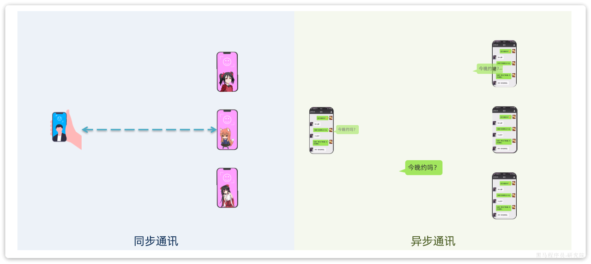

解读：

* 同步通讯：就如同打视频电话，双方的交互都是实时的。因此同一时刻你只能跟一个人打视频电话。

* 异步通讯：就如同发微信聊天，双方的交互不是实时的，你不需要立刻给对方回应。因此你可以多线操作，同时跟多人聊天。


两种方式各有优劣，打电话可以立即得到响应，但是你却不能跟多个人同时通话。发微信可以同时与多个人收发微信，但是往往响应会有延迟。


所以，如果我们的业务需要实时得到服务提供方的响应，则应该选择同步通讯（同步调用）。而如果我们追求更高的效率，并且不需要实时响应，则应该选择异步通讯（异步调用）。
&#x20;

同步调用的方式我们已经学过了，之前的OpenFeign调用就是。但是：

* 异步调用又该如何实现？

* 哪些业务适合用异步调用来实现呢？

通过今天的学习你就能明白这些问题了。

# 1.初识MQ

## 1.1.同步调用

之前说过，我们现在基于OpenFeign的调用都属于是同步调用，那么这种方式存在哪些问题呢？

举个例子，我们以昨天留给大家作为作业的**余额支付功能**为例来分析，首先看下整个流程：

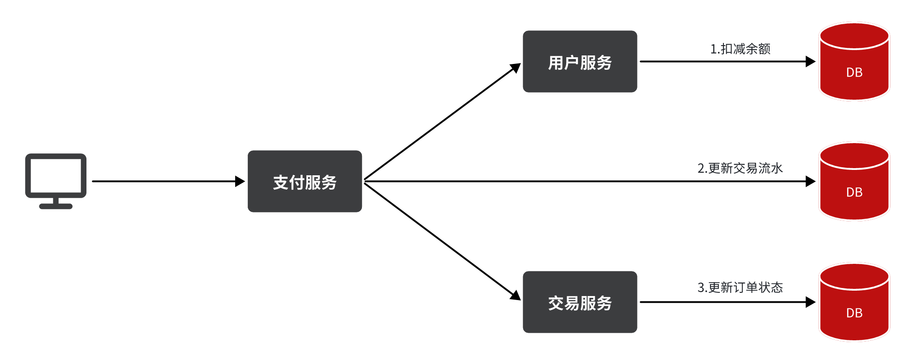

目前我们采用的是基于OpenFeign的同步调用，也就是说业务执行流程是这样的：

* 支付服务需要先调用用户服务完成余额扣减

* 然后支付服务自己要更新支付流水单的状态

* 然后支付服务调用交易服务，更新业务订单状态为已支付

三个步骤依次执行。

这其中就存在3个问题：

**第一**，**拓展性差**

我们目前的业务相对简单，但是随着业务规模扩大，产品的功能也在不断完善。

在大多数电商业务中，用户支付成功后都会以短信或者其它方式通知用户，告知支付成功。假如后期产品经理提出这样新的需求，你怎么办？是不是要在上述业务中再加入通知用户的业务？

某些电商项目中，还会有积分或金币的概念。假如产品经理提出需求，用户支付成功后，给用户以积分奖励或者返还金币，你怎么办？是不是要在上述业务中再加入积分业务、返还金币业务？

。。。

最终你的支付业务会越来越臃肿：

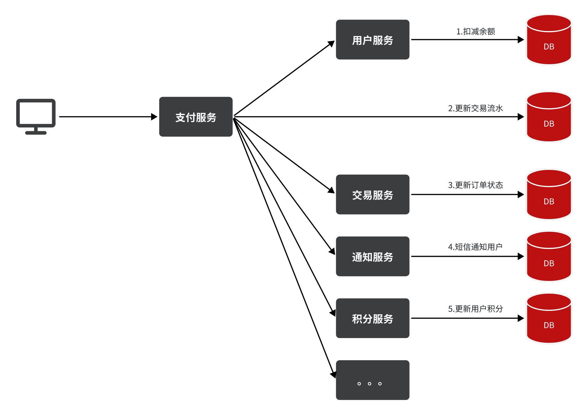

也就是说每次有新的需求，现有支付逻辑都要跟着变化，代码经常变动，不符合开闭原则，拓展性不好。


**第二**，**性能下降**

由于我们采用了同步调用，调用者需要等待服务提供者执行完返回结果后，才能继续向下执行，也就是说每次远程调用，调用者都是阻塞等待状态。最终整个业务的响应时长就是每次远程调用的执行时长之和：

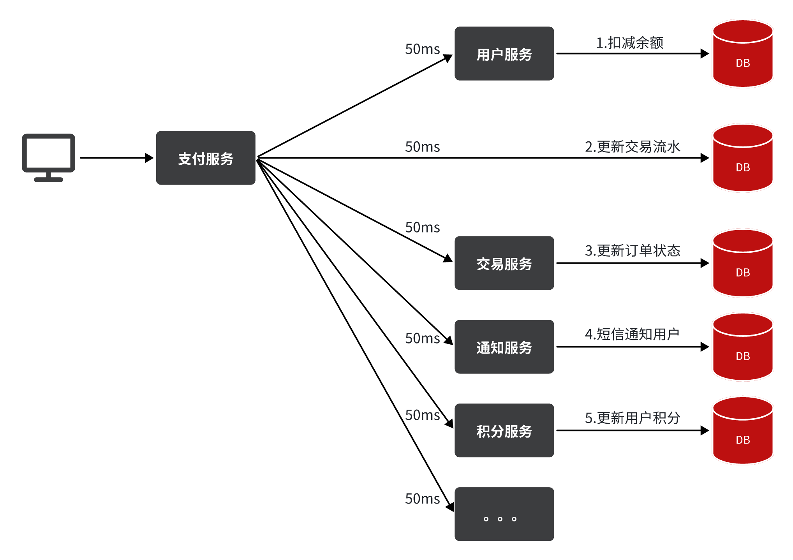

假如每个微服务的执行时长都是50ms，则最终整个业务的耗时可能高达300ms，性能太差了。


**第三，级联失败**

由于我们是基于OpenFeign调用交易服务、通知服务。当交易服务、通知服务出现故障时，整个事务都会回滚，交易失败。

这其实就是同步调用的**级联失败**问题。


但是大家思考一下，我们假设用户余额充足，扣款已经成功，此时我们应该确保支付流水单更新为已支付，确保交易成功。毕竟收到手里的钱没道理再退回去吧。


因此，这里不能因为短信通知、更新订单状态失败而回滚整个事务。


综上，同步调用的方式存在下列问题：

* 拓展性差

* 性能下降

* 级联失败


而要解决这些问题，我们就必须用**异步调用**的方式来代替**同步调用**。


## 1.2.异步调用

异步调用方式其实就是基于消息通知的方式，一般包含三个角色：

* 消息发送者：投递消息的人，就是原来的调用方

* 消息Broker：管理、暂存、转发消息，你可以把它理解成微信服务器

* 消息接收者：接收和处理消息的人，就是原来的服务提供方

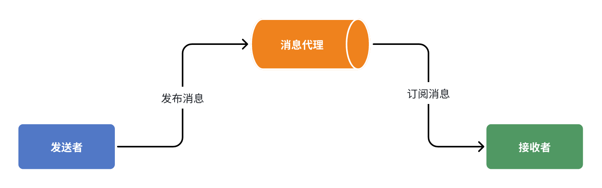


在异步调用中，发送者不再直接同步调用接收者的业务接口，而是发送一条消息投递给消息Broker。然后接收者根据自己的需求从消息Broker那里订阅消息。每当发送方发送消息后，接受者都能获取消息并处理。

这样，发送消息的人和接收消息的人就完全解耦了。


还是以余额支付业务为例：

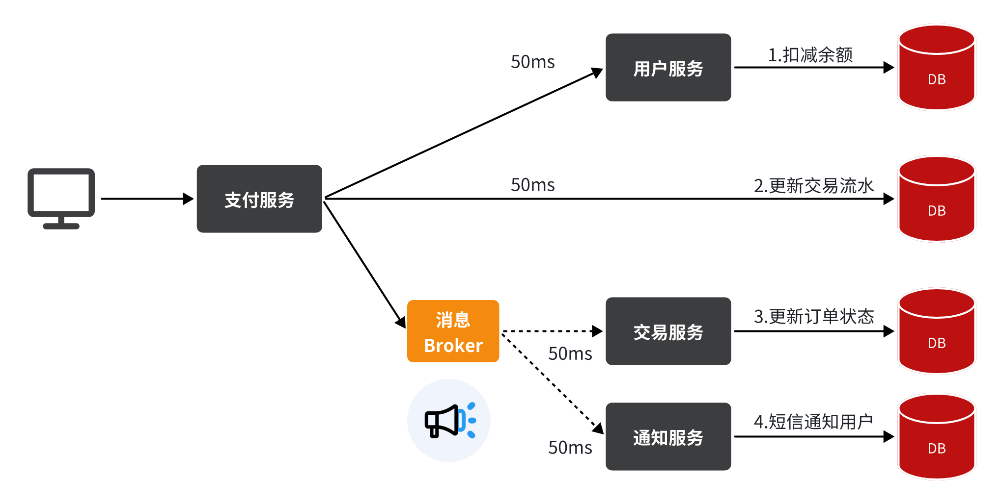

除了扣减余额、更新支付流水单状态以外，其它调用逻辑全部取消。而是改为发送一条消息到Broker。而相关的微服务都可以订阅消息通知，一旦消息到达Broker，则会分发给每一个订阅了的微服务，处理各自的业务。


假如产品经理提出了新的需求，比如要在支付成功后更新用户积分。支付代码完全不用变更，而仅仅是让积分服务也订阅消息即可：

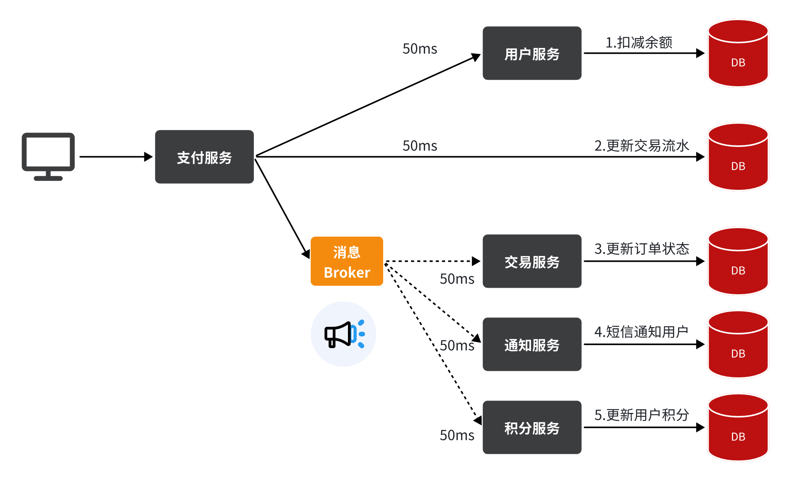

不管后期增加了多少消息订阅者，作为支付服务来讲，执行问扣减余额、更新支付流水状态后，发送消息即可。业务耗时仅仅是这三部分业务耗时，仅仅100ms，大大提高了业务性能。


另外，不管是交易服务、通知服务，还是积分服务，他们的业务与支付关联度低。现在采用了异步调用，解除了耦合，他们即便执行过程中出现了故障，也不会影响到支付服务。


综上，异步调用的优势包括：

* 耦合度更低

* 性能更好

* 业务拓展性强

* 故障隔离，避免级联失败


当然，异步通信也并非完美无缺，它存在下列缺点：

* 完全依赖于Broker的可靠性、安全性和性能

* 架构复杂，后期维护和调试麻烦

## 1.3.技术选型

消息Broker，目前常见的实现方案就是消息队列（MessageQueue），简称为MQ.

目比较常见的MQ实现：

* ActiveMQ

* RabbitMQ

* RocketMQ

* Kafka


几种常见MQ的对比：


追求可用性：Kafka、 RocketMQ 、RabbitMQ

追求可靠性：RabbitMQ、RocketMQ

追求吞吐能力：RocketMQ、Kafka

追求消息低延迟：RabbitMQ、Kafka


据统计，目前国内消息队列使用最多的还是RabbitMQ，再加上其各方面都比较均衡，稳定性也好，因此我们课堂上选择RabbitMQ来学习。

# 2.RabbitMQ

RabbitMQ是基于Erlang语言开发的开源消息通信中间件，官网地址：

<https://www.rabbitmq.com/>

接下来，我们就学习它的基本概念和基础用法。


## 2.1.安装

我们同样基于Docker来安装RabbitMQ，使用下面的命令即可：

```shell
docker run \
 -e RABBITMQ_DEFAULT_USER=itheima \
 -e RABBITMQ_DEFAULT_PASS=123321 \
 -v mq-plugins:/plugins \
 --name mq \
 --hostname mq \
 -p 15672:15672 \
 -p 5672:5672 \
 --network hm-net\
 -d \
 rabbitmq:3.8-management
```


如果拉取镜像困难的话，可以使用课前资料给大家准备的镜像，利用docker load命令加载：

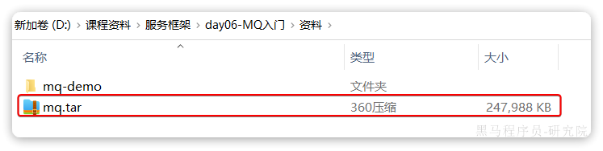


可以看到在安装命令中有两个映射的端口：

* 15672：RabbitMQ提供的管理控制台的端口

* 5672：RabbitMQ的消息发送处理接口


安装完成后，我们访问 http://192.168.150.101:15672即可看到管理控制台。首次访问需要登录，默认的用户名和密码在配置文件中已经指定了。

登录后即可看到管理控制台总览页面：

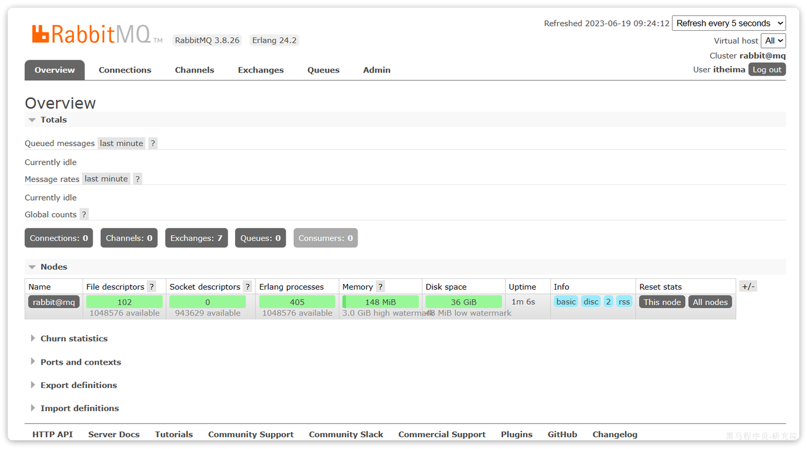


RabbitMQ对应的架构如图：


其中包含几个概念：

* **`publisher`**：生产者，也就是发送消息的一方

* **`consumer`**：消费者，也就是消费消息的一方

* **`queue`**：队列，存储消息。生产者投递的消息会暂存在消息队列中，等待消费者处理

* **`exchange`**：交换机，负责消息路由。生产者发送的消息由交换机决定投递到哪个队列。

* **`virtual host`**：虚拟主机，起到数据隔离的作用。每个虚拟主机相互独立，有各自的exchange、queue


上述这些东西都可以在RabbitMQ的管理控制台来管理，下一节我们就一起来学习控制台的使用。


## 2.2.收发消息

### 2.2.1.交换机

我们打开Exchanges选项卡，可以看到已经存在很多交换机：

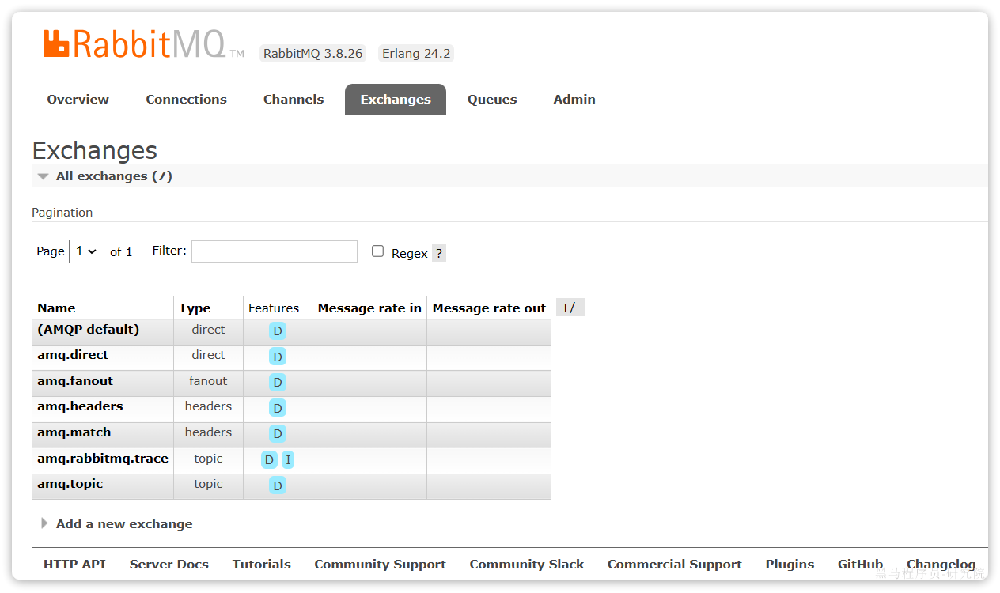

我们点击任意交换机，即可进入交换机详情页面。仍然会利用控制台中的publish message 发送一条消息：

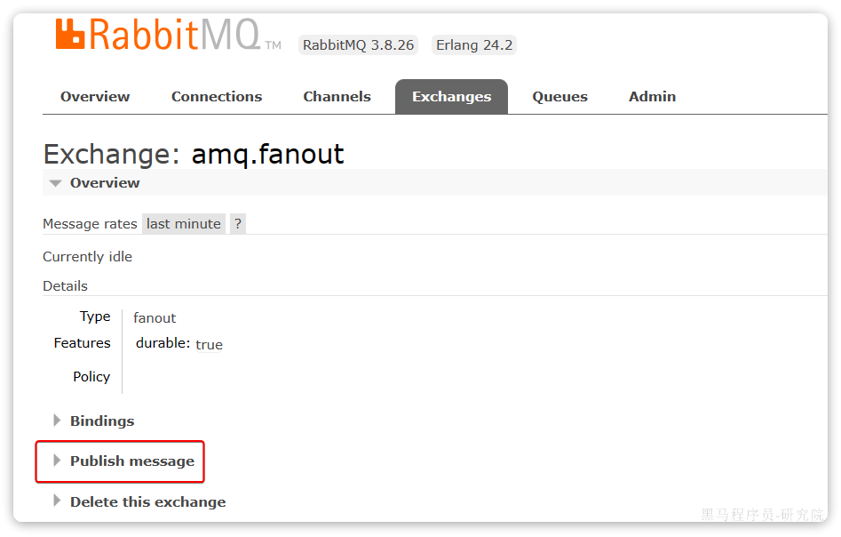

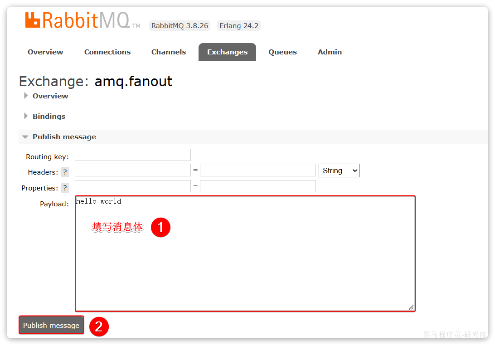

这里是由控制台模拟了生产者发送的消息。由于没有消费者存在，最终消息丢失了，这样说明交换机没有存储消息的能力。


### 2.2.2.队列

我们打开`Queues`选项卡，新建一个队列：

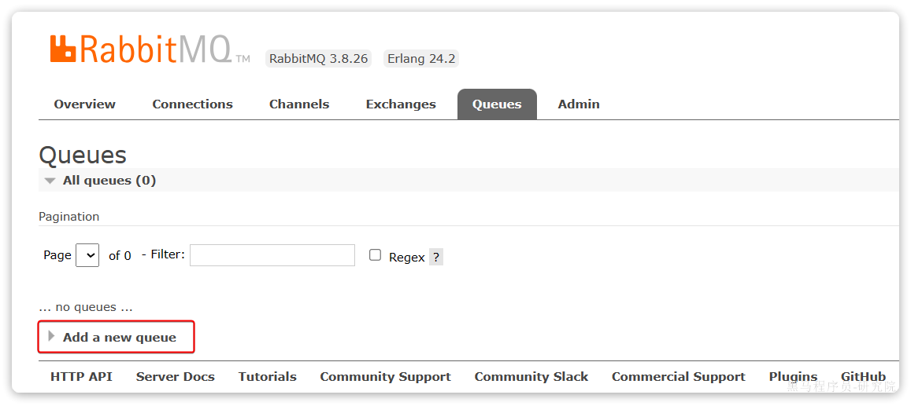

命名为`hello.queue1`：

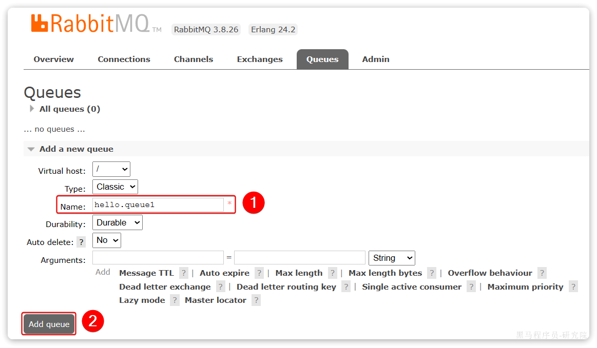

再以相同的方式，创建一个队列，密码为`hello.queue2`，最终队列列表如下：

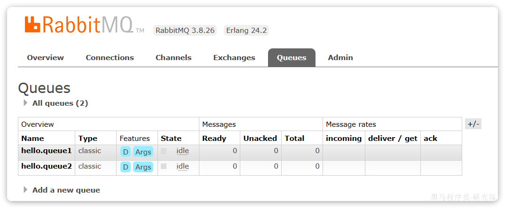

此时，我们再次向`amq.fanout`交换机发送一条消息。会发现消息依然没有到达队列！！

怎么回事呢？

发送到交换机的消息，只会路由到与其绑定的队列，因此仅仅创建队列是不够的，我们还需要将其与交换机绑定。


### 2.2.3.绑定关系

点击`Exchanges`选项卡，点击`amq.fanout`交换机，进入交换机详情页，然后点击`Bindings`菜单，在表单中填写要绑定的队列名称：

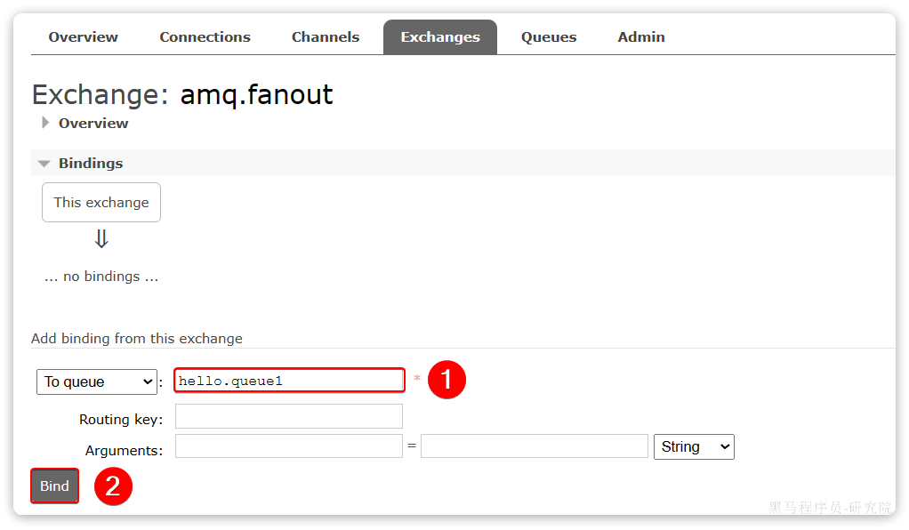

相同的方式，将hello.queue2也绑定到改交换机。

最终，绑定结果如下：

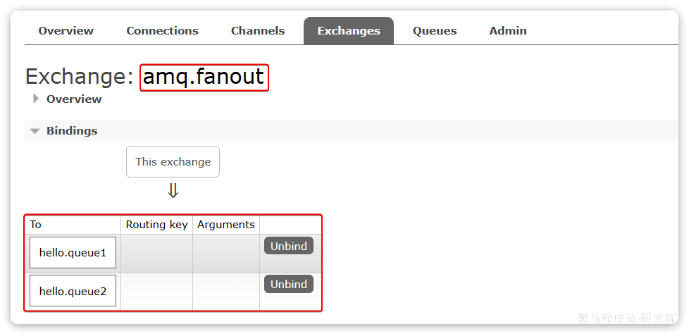


### 2.2.4.发送消息

再次回到exchange页面，找到刚刚绑定的`amq.fanout`，点击进入详情页，再次发送一条消息：


回到`Queues`页面，可以发现`hello.queue`中已经有一条消息了：

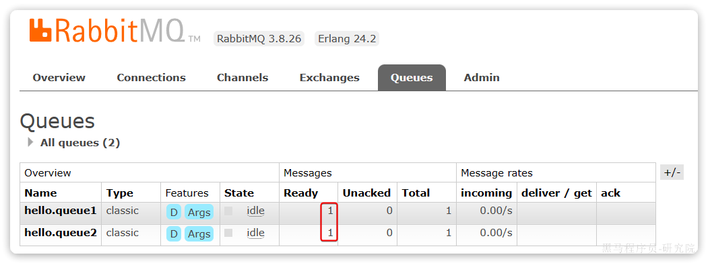

点击队列名称，进入详情页，查看队列详情，这次我们点击get message：

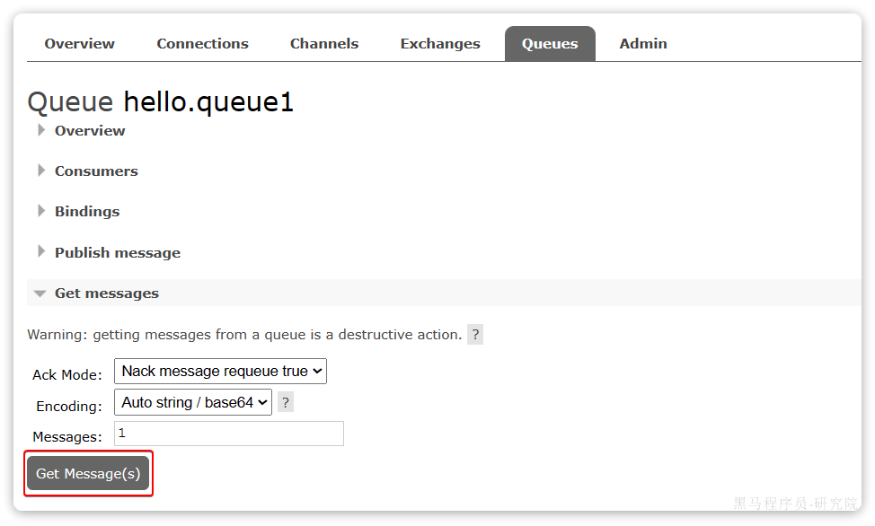

可以看到消息到达队列了：

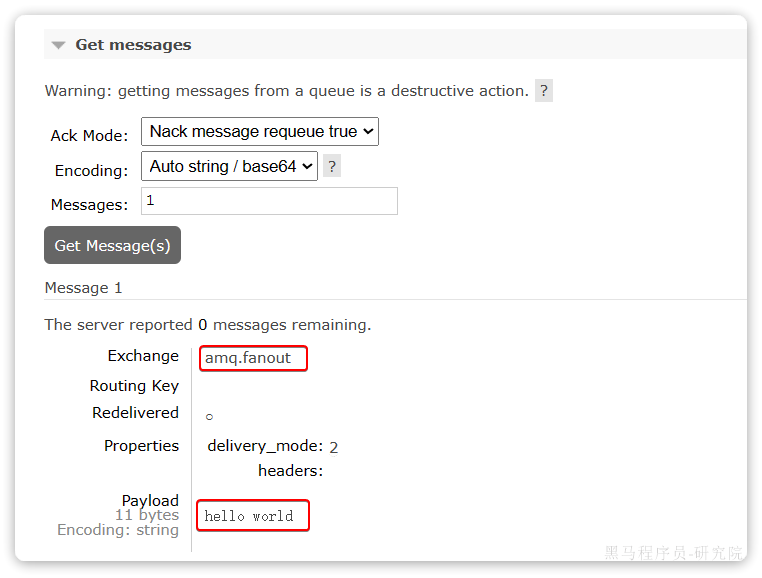

这个时候如果有消费者监听了MQ的`hello.queue1`或`hello.queue2`队列，自然就能接收到消息了。

## 2.3.数据隔离

### 2.3.1.用户管理

点击`Admin`选项卡，首先会看到RabbitMQ控制台的用户管理界面：

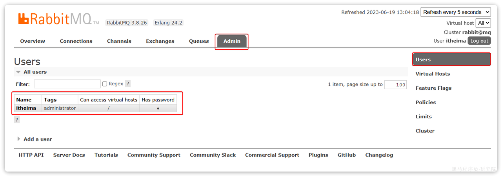

这里的用户都是RabbitMQ的管理或运维人员。目前只有安装RabbitMQ时添加的`itheima`这个用户。仔细观察用户表格中的字段，如下：

* `Name`：`itheima`，也就是用户名

* `Tags`：`administrator`，说明`itheima`用户是超级管理员，拥有所有权限

* `Can access virtual host`： `/`，可以访问的`virtual host`，这里的`/`是默认的`virtual host`


对于小型企业而言，出于成本考虑，我们通常只会搭建一套MQ集群，公司内的多个不同项目同时使用。这个时候为了避免互相干扰， 我们会利用`virtual host`的隔离特性，将不同项目隔离。一般会做两件事情：

* 给每个项目创建独立的运维账号，将管理权限分离。

* 给每个项目创建不同的`virtual host`，将每个项目的数据隔离。


比如，我们给黑马商城创建一个新的用户，命名为`hmall`：

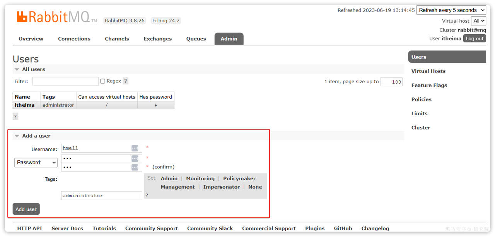

你会发现此时hmall用户没有任何`virtual host`的访问权限：

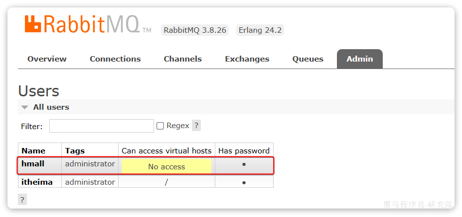

别急，接下来我们就来授权。


### 2.3.2.virtual host

我们先退出登录：

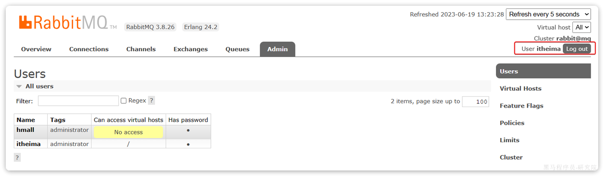

切换到刚刚创建的hmall用户登录，然后点击`Virtual Hosts`菜单，进入`virtual host`管理页：

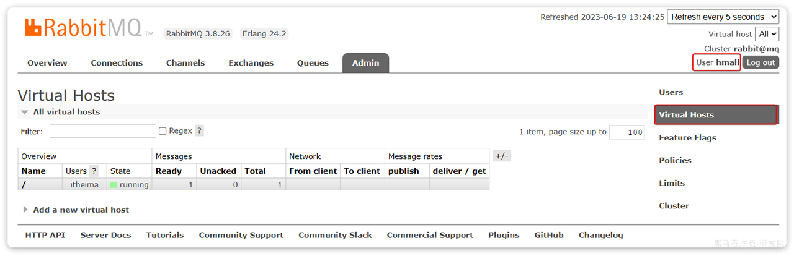

可以看到目前只有一个默认的`virtual host`，名字为 `/`。

&#x20;我们可以给黑马商城项目创建一个单独的`virtual host`，而不是使用默认的`/`。

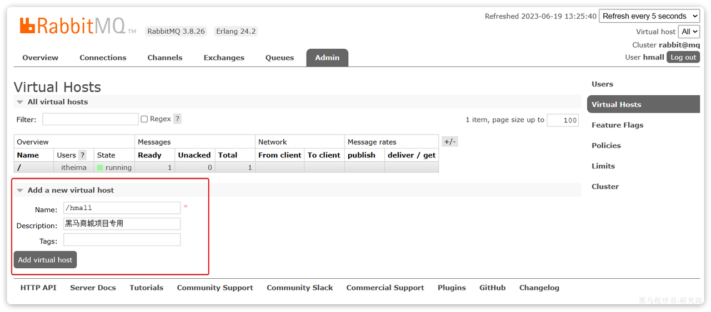

创建完成后如图：

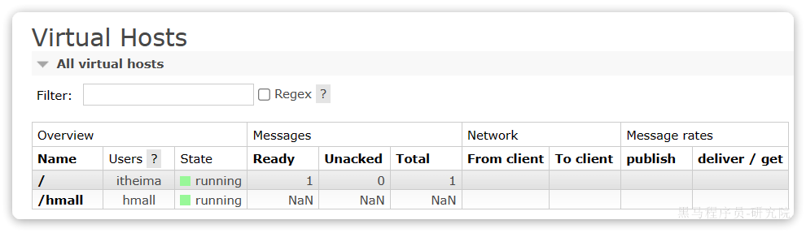

由于我们是登录`hmall`账户后创建的`virtual host`，因此回到`users`菜单，你会发现当前用户已经具备了对`/hmall`这个`virtual host`的访问权限了：

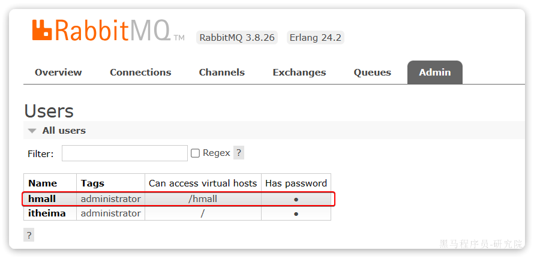


此时，点击页面右上角的`virtual host`下拉菜单，切换`virtual host`为 `/hmall`：

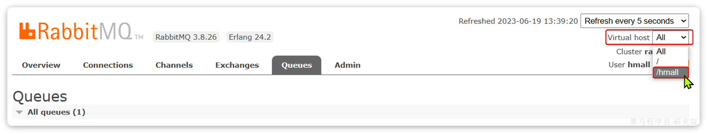

然后再次查看queues选项卡，会发现之前的队列已经看不到了：

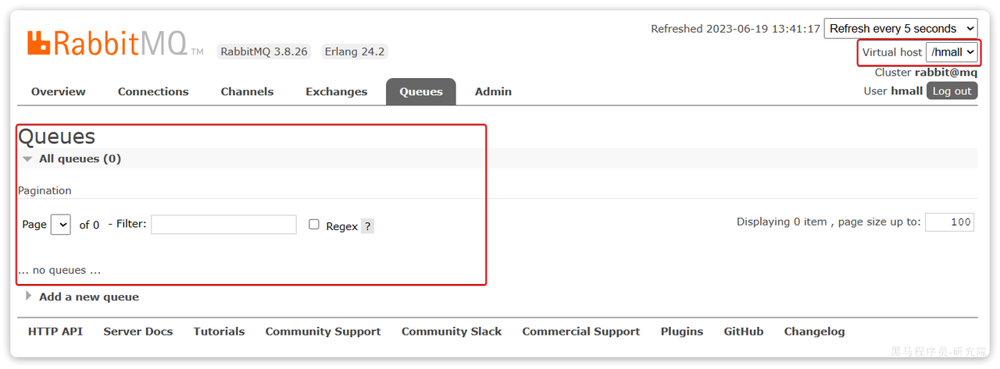

这就是基于`virtual host `的隔离效果。


# 3.SpringAMQP

将来我们开发业务功能的时候，肯定不会在控制台收发消息，而是应该基于编程的方式。由于`RabbitMQ`采用了AMQP协议，因此它具备跨语言的特性。任何语言只要遵循AMQP协议收发消息，都可以与`RabbitMQ`交互。并且`RabbitMQ`官方也提供了各种不同语言的客户端。

但是，RabbitMQ官方提供的Java客户端编码相对复杂，一般生产环境下我们更多会结合Spring来使用。而Spring的官方刚好基于RabbitMQ提供了这样一套消息收发的模板工具：SpringAMQP。并且还基于SpringBoot对其实现了自动装配，使用起来非常方便。


SpringAmqp的官方地址：

SpringAMQP提供了三个功能：

* 自动声明队列、交换机及其绑定关系

* 基于注解的监听器模式，异步接收消息

* 封装了RabbitTemplate工具，用于发送消息


这一章我们就一起学习一下，如何利用SpringAMQP实现对RabbitMQ的消息收发。


## 3.1.导入Demo工程

在课前资料给大家提供了一个Demo工程，方便我们学习SpringAMQP的使用：

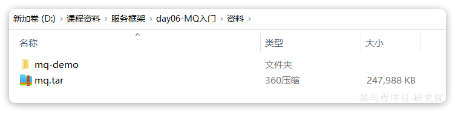

将其复制到你的工作空间，然后用Idea打开，项目结构如图：

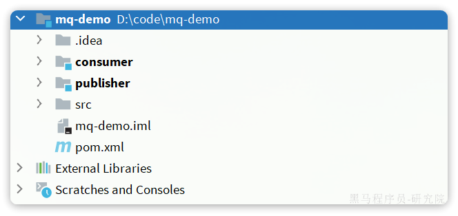

包括三部分：

* mq-demo：父工程，管理项目依赖

* publisher：消息的发送者

* consumer：消息的消费者


在mq-demo这个父工程中，已经配置好了SpringAMQP相关的依赖：

```xml
<?xml version="1.0" encoding="UTF-8"?>
<project xmlns="http://maven.apache.org/POM/4.0.0"
         xmlns:xsi="http://www.w3.org/2001/XMLSchema-instance"
         xsi:schemaLocation="http://maven.apache.org/POM/4.0.0 http://maven.apache.org/xsd/maven-4.0.0.xsd">
    <modelVersion>4.0.0</modelVersion>

    <groupId>cn.itcast.demo</groupId>
    <artifactId>mq-demo</artifactId>
    <version>1.0-SNAPSHOT</version>
    <modules>
        <module>publisher</module>
        <module>consumer</module>
    </modules>
    <packaging>pom</packaging>

    <parent>
        <groupId>org.springframework.boot</groupId>
        <artifactId>spring-boot-starter-parent</artifactId>
        <version>2.7.12</version>
        <relativePath/>
    </parent>

    <properties>
        <maven.compiler.source>8</maven.compiler.source>
        <maven.compiler.target>8</maven.compiler.target>
    </properties>

    <dependencies>
        <dependency>
            <groupId>org.projectlombok</groupId>
            <artifactId>lombok</artifactId>
        </dependency>
        <!--AMQP依赖，包含RabbitMQ-->
        <dependency>
            <groupId>org.springframework.boot</groupId>
            <artifactId>spring-boot-starter-amqp</artifactId>
        </dependency>
        <!--单元测试-->
        <dependency>
            <groupId>org.springframework.boot</groupId>
            <artifactId>spring-boot-starter-test</artifactId>
        </dependency>
    </dependencies>
</project>
```


因此，子工程中就可以直接使用SpringAMQP了。

## 3.2.快速入门

在之前的案例中，我们都是经过交换机发送消息到队列，不过有时候为了测试方便，我们也可以直接向队列发送消息，跳过交换机。

在入门案例中，我们就演示这样的简单模型，如图：


也就是：

* publisher直接发送消息到队列

* 消费者监听并处理队列中的消息


> **注意**：这种模式一般测试使用，很少在生产中使用。


为了方便测试，我们现在控制台新建一个队列：simple.queue

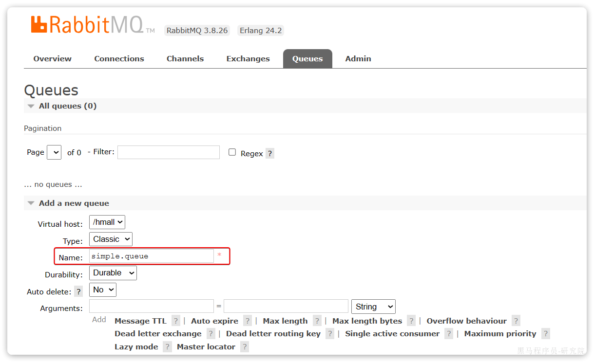

添加成功：

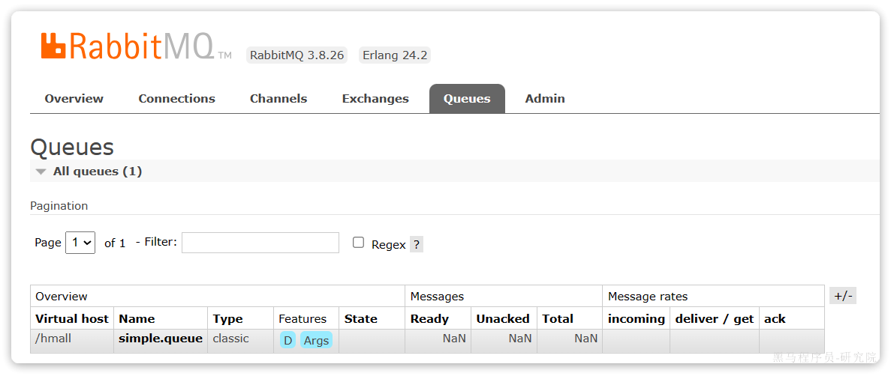

接下来，我们就可以利用Java代码收发消息了。

### 3.2.1.消息发送

首先配置MQ地址，在`publisher`服务的`application.yml`中添加配置：

```yaml
spring:
  rabbitmq:
    host: 192.168.150.101 # 你的虚拟机IP
    port: 5672 # 端口
    virtual-host: /hmall # 虚拟主机
    username: hmall # 用户名
    password: 123 # 密码
```


然后在`publisher`服务中编写测试类`SpringAmqpTest`，并利用`RabbitTemplate`实现消息发送：

```java
package com.itheima.publisher.amqp;

import org.junit.jupiter.api.Test;
import org.springframework.amqp.rabbit.core.RabbitTemplate;
import org.springframework.beans.factory.annotation.Autowired;
import org.springframework.boot.test.context.SpringBootTest;

@SpringBootTest
public class SpringAmqpTest {

    @Autowired
    private RabbitTemplate rabbitTemplate;

    @Test
    public void testSimpleQueue() {
        // 队列名称
        String queueName = "simple.queue";
        // 消息
        String message = "hello, spring amqp!";
        // 发送消息
        rabbitTemplate.convertAndSend(queueName, message);
    }
}
```


打开控制台，可以看到消息已经发送到队列中：

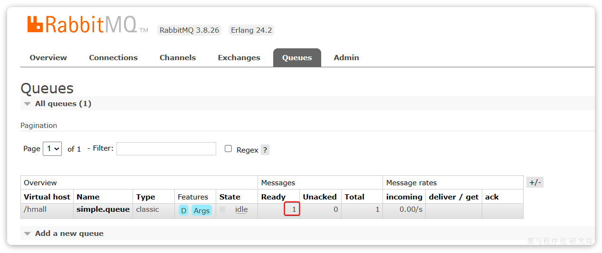

接下来，我们再来实现消息接收。

### 3.2.2.消息接收

首先配置MQ地址，在`consumer`服务的`application.yml`中添加配置：

```yaml
spring:
  rabbitmq:
    host: 192.168.150.101 # 你的虚拟机IP
    port: 5672 # 端口
    virtual-host: /hmall # 虚拟主机
    username: hmall # 用户名
    password: 123 # 密码
```


然后在`consumer`服务的`com.itheima.consumer.listener`包中新建一个类`SpringRabbitListener`，代码如下：

```java
package com.itheima.consumer.listener;

import org.springframework.amqp.rabbit.annotation.RabbitListener;
import org.springframework.stereotype.Component;

@Component
public class SpringRabbitListener {
        // 利用RabbitListener来声明要监听的队列信息
    // 将来一旦监听的队列中有了消息，就会推送给当前服务，调用当前方法，处理消息。
    // 可以看到方法体中接收的就是消息体的内容
    @RabbitListener(queues = "simple.queue")
    public void listenSimpleQueueMessage(String msg) throws InterruptedException {
        System.out.println("spring 消费者接收到消息：【" + msg + "】");
    }
}
```


### 3.2.3.测试

启动consumer服务，然后在publisher服务中运行测试代码，发送MQ消息。最终consumer收到消息：

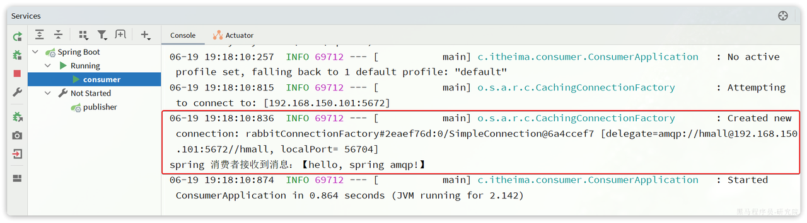


## 3.3.WorkQueues模型

Work queues，任务模型。简单来说就是**让多个消费者绑定到一个队列，共同消费队列中的消息**。

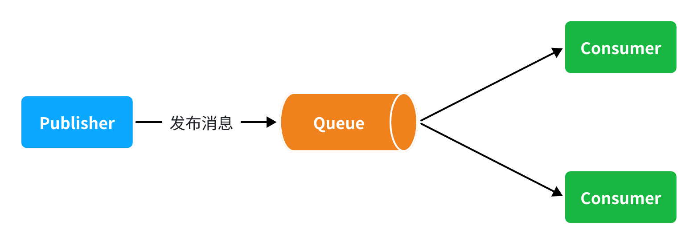


当消息处理比较耗时的时候，可能生产消息的速度会远远大于消息的消费速度。长此以往，消息就会堆积越来越多，无法及时处理。

此时就可以使用work 模型，**多个消费者共同处理消息处理，消息处理的速度就能大大提高**了。


接下来，我们就来模拟这样的场景。

首先，我们在控制台创建一个新的队列，命名为`work.queue`：

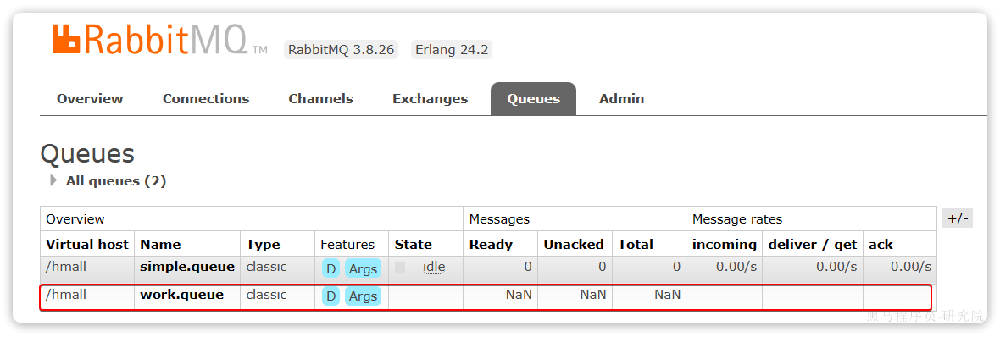

### 3.3.1.消息发送

这次我们循环发送，模拟大量消息堆积现象。

在publisher服务中的SpringAmqpTest类中添加一个测试方法：

```java
/**
     * workQueue
     * 向队列中不停发送消息，模拟消息堆积。
     */
@Test
public void testWorkQueue() throws InterruptedException {
    // 队列名称
    String queueName = "simple.queue";
    // 消息
    String message = "hello, message_";
    for (int i = 0; i < 50; i++) {
        // 发送消息，每20毫秒发送一次，相当于每秒发送50条消息
        rabbitTemplate.convertAndSend(queueName, message + i);
        Thread.sleep(20);
    }
}
```


### 3.3.2.消息接收

要模拟多个消费者绑定同一个队列，我们在consumer服务的SpringRabbitListener中添加2个新的方法：

```java
@RabbitListener(queues = "work.queue")
public void listenWorkQueue1(String msg) throws InterruptedException {
    System.out.println("消费者1接收到消息：【" + msg + "】" + LocalTime.now());
    Thread.sleep(20);
}

@RabbitListener(queues = "work.queue")
public void listenWorkQueue2(String msg) throws InterruptedException {
    System.err.println("消费者2........接收到消息：【" + msg + "】" + LocalTime.now());
    Thread.sleep(200);
}
```


注意到这两消费者，都设置了`Thead.sleep`，模拟任务耗时：

* 消费者1 sleep了20毫秒，相当于每秒钟处理50个消息

* 消费者2 sleep了200毫秒，相当于每秒处理5个消息


### 3.3.3.测试

启动ConsumerApplication后，在执行publisher服务中刚刚编写的发送测试方法testWorkQueue。

最终结果如下：

```java
消费者1接收到消息：【hello, message_0】21:06:00.869555300
消费者2........接收到消息：【hello, message_1】21:06:00.884518
消费者1接收到消息：【hello, message_2】21:06:00.907454400
消费者1接收到消息：【hello, message_4】21:06:00.953332100
消费者1接收到消息：【hello, message_6】21:06:00.997867300
消费者1接收到消息：【hello, message_8】21:06:01.042178700
消费者2........接收到消息：【hello, message_3】21:06:01.086478800
消费者1接收到消息：【hello, message_10】21:06:01.087476600
消费者1接收到消息：【hello, message_12】21:06:01.132578300
消费者1接收到消息：【hello, message_14】21:06:01.175851200
消费者1接收到消息：【hello, message_16】21:06:01.218533400
消费者1接收到消息：【hello, message_18】21:06:01.261322900
消费者2........接收到消息：【hello, message_5】21:06:01.287003700
消费者1接收到消息：【hello, message_20】21:06:01.304412400
消费者1接收到消息：【hello, message_22】21:06:01.349950100
消费者1接收到消息：【hello, message_24】21:06:01.394533900
消费者1接收到消息：【hello, message_26】21:06:01.439876500
消费者1接收到消息：【hello, message_28】21:06:01.482937800
消费者2........接收到消息：【hello, message_7】21:06:01.488977100
消费者1接收到消息：【hello, message_30】21:06:01.526409300
消费者1接收到消息：【hello, message_32】21:06:01.572148
消费者1接收到消息：【hello, message_34】21:06:01.618264800
消费者1接收到消息：【hello, message_36】21:06:01.660780600
消费者2........接收到消息：【hello, message_9】21:06:01.689189300
消费者1接收到消息：【hello, message_38】21:06:01.705261
消费者1接收到消息：【hello, message_40】21:06:01.746927300
消费者1接收到消息：【hello, message_42】21:06:01.789835
消费者1接收到消息：【hello, message_44】21:06:01.834393100
消费者1接收到消息：【hello, message_46】21:06:01.875312100
消费者2........接收到消息：【hello, message_11】21:06:01.889969500
消费者1接收到消息：【hello, message_48】21:06:01.920702500
消费者2........接收到消息：【hello, message_13】21:06:02.090725900
消费者2........接收到消息：【hello, message_15】21:06:02.293060600
消费者2........接收到消息：【hello, message_17】21:06:02.493748
消费者2........接收到消息：【hello, message_19】21:06:02.696635100
消费者2........接收到消息：【hello, message_21】21:06:02.896809700
消费者2........接收到消息：【hello, message_23】21:06:03.099533400
消费者2........接收到消息：【hello, message_25】21:06:03.301446400
消费者2........接收到消息：【hello, message_27】21:06:03.504999100
消费者2........接收到消息：【hello, message_29】21:06:03.705702500
消费者2........接收到消息：【hello, message_31】21:06:03.906601200
消费者2........接收到消息：【hello, message_33】21:06:04.108118500
消费者2........接收到消息：【hello, message_35】21:06:04.308945400
消费者2........接收到消息：【hello, message_37】21:06:04.511547700
消费者2........接收到消息：【hello, message_39】21:06:04.714038400
消费者2........接收到消息：【hello, message_41】21:06:04.916192700
消费者2........接收到消息：【hello, message_43】21:06:05.116286400
消费者2........接收到消息：【hello, message_45】21:06:05.318055100
消费者2........接收到消息：【hello, message_47】21:06:05.520656400
消费者2........接收到消息：【hello, message_49】21:06:05.723106700
```


可以看到消费者1和消费者2竟然每人消费了25条消息：

* 消费者1很快完成了自己的25条消息

* 消费者2却在缓慢的处理自己的25条消息。

也就是说消息是平均分配给每个消费者，并没有考虑到消费者的处理能力。导致1个消费者空闲，另一个消费者忙的不可开交。没有充分利用每一个消费者的能力，最终消息处理的耗时远远超过了1秒。这样显然是有问题的。

### 3.3.4.能者多劳

在spring中有一个简单的配置，可以解决这个问题。我们修改consumer服务的application.yml文件，添加配置：

```yaml
spring:
  rabbitmq:
    listener:
      simple:
        prefetch: 1 # 每次只能获取一条消息，处理完成才能获取下一个消息
```


再次测试，发现结果如下：

```java
消费者1接收到消息：【hello, message_0】21:12:51.659664200
消费者2........接收到消息：【hello, message_1】21:12:51.680610
消费者1接收到消息：【hello, message_2】21:12:51.703625
消费者1接收到消息：【hello, message_3】21:12:51.724330100
消费者1接收到消息：【hello, message_4】21:12:51.746651100
消费者1接收到消息：【hello, message_5】21:12:51.768401400
消费者1接收到消息：【hello, message_6】21:12:51.790511400
消费者1接收到消息：【hello, message_7】21:12:51.812559800
消费者1接收到消息：【hello, message_8】21:12:51.834500600
消费者1接收到消息：【hello, message_9】21:12:51.857438800
消费者1接收到消息：【hello, message_10】21:12:51.880379600
消费者2........接收到消息：【hello, message_11】21:12:51.899327100
消费者1接收到消息：【hello, message_12】21:12:51.922828400
消费者1接收到消息：【hello, message_13】21:12:51.945617400
消费者1接收到消息：【hello, message_14】21:12:51.968942500
消费者1接收到消息：【hello, message_15】21:12:51.992215400
消费者1接收到消息：【hello, message_16】21:12:52.013325600
消费者1接收到消息：【hello, message_17】21:12:52.035687100
消费者1接收到消息：【hello, message_18】21:12:52.058188
消费者1接收到消息：【hello, message_19】21:12:52.081208400
消费者2........接收到消息：【hello, message_20】21:12:52.103406200
消费者1接收到消息：【hello, message_21】21:12:52.123827300
消费者1接收到消息：【hello, message_22】21:12:52.146165100
消费者1接收到消息：【hello, message_23】21:12:52.168828300
消费者1接收到消息：【hello, message_24】21:12:52.191769500
消费者1接收到消息：【hello, message_25】21:12:52.214839100
消费者1接收到消息：【hello, message_26】21:12:52.238998700
消费者1接收到消息：【hello, message_27】21:12:52.259772600
消费者1接收到消息：【hello, message_28】21:12:52.284131800
消费者2........接收到消息：【hello, message_29】21:12:52.306190600
消费者1接收到消息：【hello, message_30】21:12:52.325315800
消费者1接收到消息：【hello, message_31】21:12:52.347012500
消费者1接收到消息：【hello, message_32】21:12:52.368508600
消费者1接收到消息：【hello, message_33】21:12:52.391785100
消费者1接收到消息：【hello, message_34】21:12:52.416383800
消费者1接收到消息：【hello, message_35】21:12:52.439019
消费者1接收到消息：【hello, message_36】21:12:52.461733900
消费者1接收到消息：【hello, message_37】21:12:52.485990
消费者1接收到消息：【hello, message_38】21:12:52.509219900
消费者2........接收到消息：【hello, message_39】21:12:52.523683400
消费者1接收到消息：【hello, message_40】21:12:52.547412100
消费者1接收到消息：【hello, message_41】21:12:52.571191800
消费者1接收到消息：【hello, message_42】21:12:52.593024600
消费者1接收到消息：【hello, message_43】21:12:52.616731800
消费者1接收到消息：【hello, message_44】21:12:52.640317
消费者1接收到消息：【hello, message_45】21:12:52.663111100
消费者1接收到消息：【hello, message_46】21:12:52.686727
消费者1接收到消息：【hello, message_47】21:12:52.709266500
消费者2........接收到消息：【hello, message_48】21:12:52.725884900
消费者1接收到消息：【hello, message_49】21:12:52.746299900
```


可以发现，由于消费者1处理速度较快，所以处理了更多的消息；消费者2处理速度较慢，只处理了6条消息。而最终总的执行耗时也在1秒左右，大大提升。

正所谓能者多劳，这样充分利用了每一个消费者的处理能力，可以有效避免消息积压问题。


### 3.3.5.总结

Work模型的使用：

* 多个消费者绑定到一个队列，同一条消息只会被一个消费者处理

* 通过设置prefetch来控制消费者预取的消息数量


## 3.4.交换机类型

在之前的两个测试案例中，都没有交换机，生产者直接发送消息到队列。而一旦引入交换机，消息发送的模式会有很大变化：

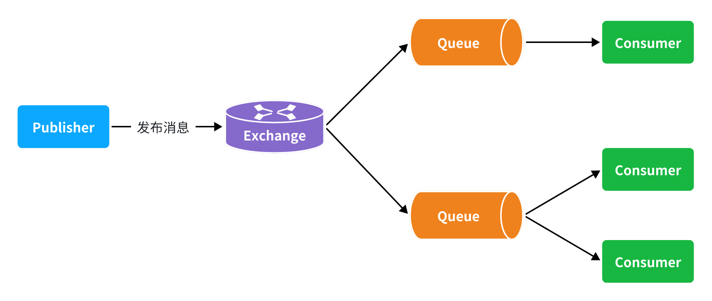


可以看到，在订阅模型中，多了一个exchange角色，而且过程略有变化：

* **Publisher**：生产者，不再发送消息到队列中，而是发给交换机

* **Exchange**：交换机，一方面，接收生产者发送的消息。另一方面，知道如何处理消息，例如递交给某个特别队列、递交给所有队列、或是将消息丢弃。到底如何操作，取决于Exchange的类型。

* **Queue**：消息队列也与以前一样，接收消息、缓存消息。不过队列一定要与交换机绑定。

* **Consumer**：消费者，与以前一样，订阅队列，没有变化


**Exchange（交换机）只负责转发消息，不具备存储消息的能力**，因此如果没有任何队列与Exchange绑定，或者没有符合路由规则的队列，那么消息会丢失！


交换机的类型有四种：

* **Fanout**：广播，将消息交给所有绑定到交换机的队列。我们最早在控制台使用的正是Fanout交换机

* **Direct**：订阅，基于RoutingKey（路由key）发送给订阅了消息的队列

* **Topic**：通配符订阅，与Direct类似，只不过RoutingKey可以使用通配符

* **Headers**：头匹配，基于MQ的消息头匹配，用的较少。


课堂中，我们讲解前面的三种交换机模式。


## 3.5.Fanout交换机

Fanout，英文翻译是扇出，我觉得在MQ中叫广播更合适。

在广播模式下，消息发送流程是这样的：

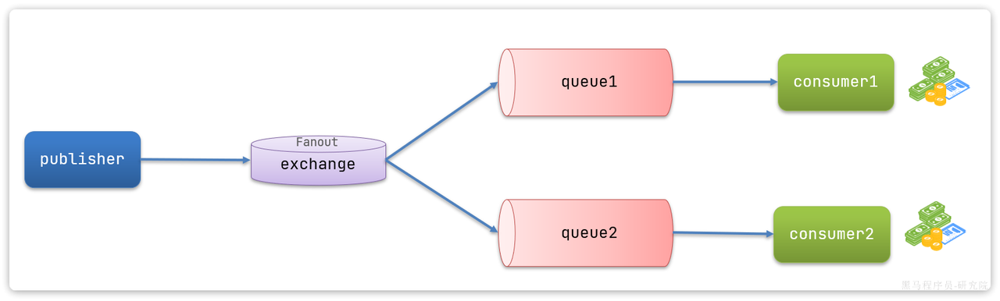

* 1）  可以有多个队列

* 2）  每个队列都要绑定到Exchange（交换机）

* 3）  生产者发送的消息，只能发送到交换机

* 4）  交换机把消息发送给绑定过的所有队列

* 5）  订阅队列的消费者都能拿到消息


我们的计划是这样的：

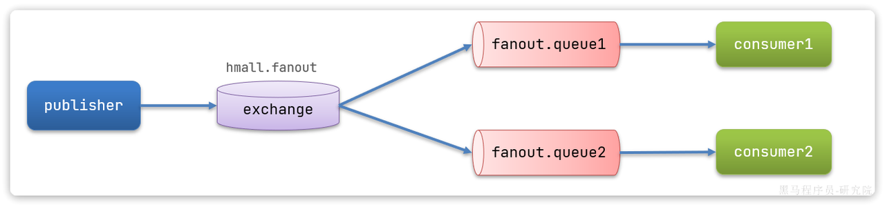

* 创建一个名为` hmall.fanout`的交换机，类型是`Fanout`

* 创建两个队列`fanout.queue1`和`fanout.queue2`，绑定到交换机`hmall.fanout`


### 3.5.1.声明队列和交换机

在控制台创建队列`fanout.queue1`:

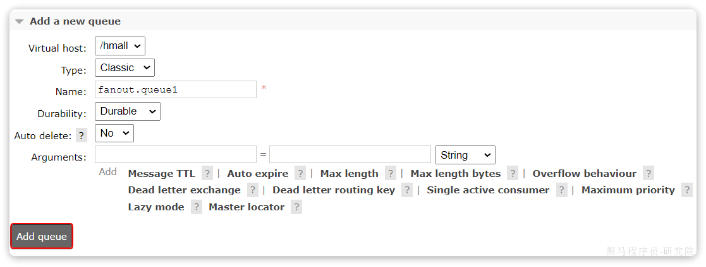

在创建一个队列`fanout.queue2`：

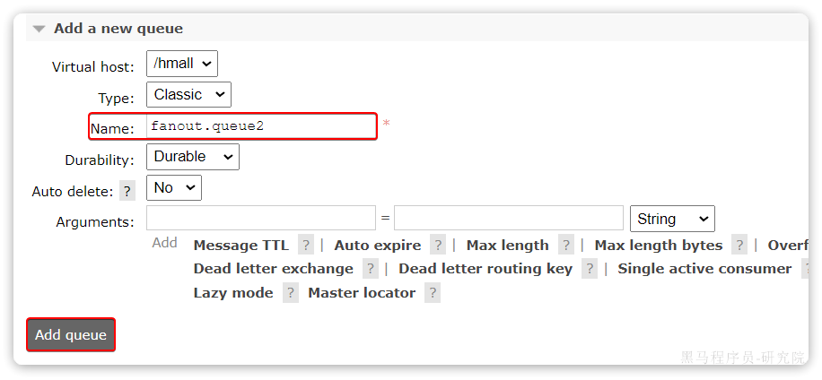

然后再创建一个交换机：

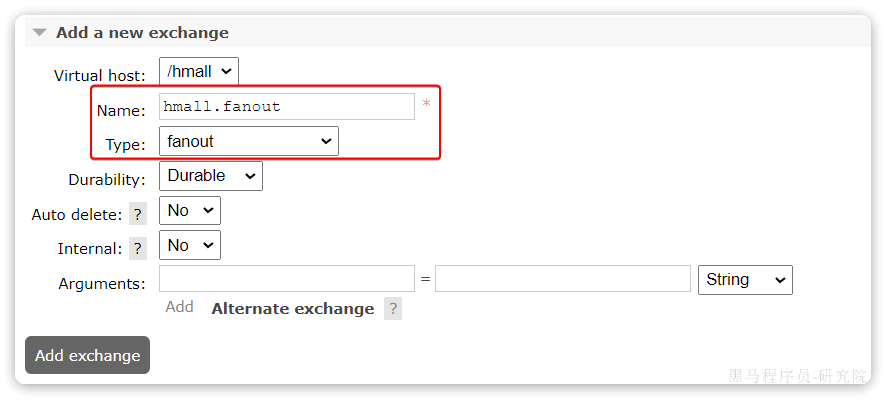

然后绑定两个队列到交换机：

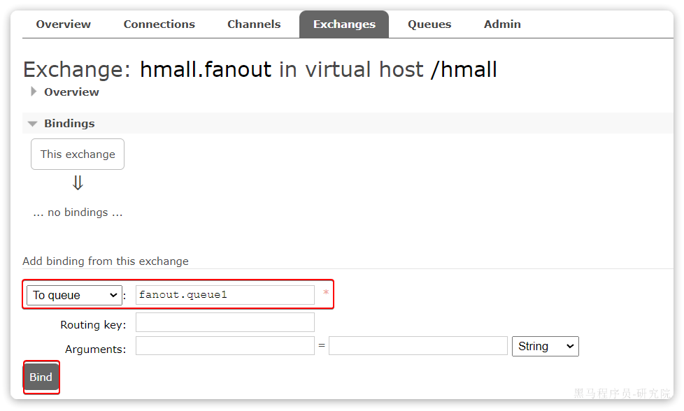

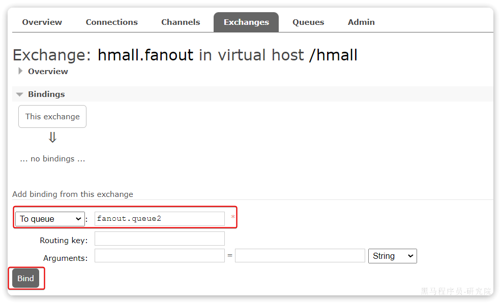


### 3.5.2.消息发送

在publisher服务的SpringAmqpTest类中添加测试方法：

```java
@Test
public void testFanoutExchange() {
    // 交换机名称
    String exchangeName = "hmall.fanout";
    // 消息
    String message = "hello, everyone!";
    rabbitTemplate.convertAndSend(exchangeName, "", message);
}
```


### 3.5.3.消息接收

在consumer服务的SpringRabbitListener中添加两个方法，作为消费者：

```java
@RabbitListener(queues = "fanout.queue1")
public void listenFanoutQueue1(String msg) {
    System.out.println("消费者1接收到Fanout消息：【" + msg + "】");
}

@RabbitListener(queues = "fanout.queue2")
public void listenFanoutQueue2(String msg) {
    System.out.println("消费者2接收到Fanout消息：【" + msg + "】");
}
```


### 3.5.4.总结

交换机的作用是什么？

* 接收publisher发送的消息

* 将消息按照规则路由到与之绑定的队列

* 不能缓存消息，路由失败，消息丢失

* FanoutExchange的会将消息路由到每个绑定的队列


## 3.6.Direct交换机

在Fanout模式中，一条消息，会被所有订阅的队列都消费。但是，在某些场景下，我们希望不同的消息被不同的队列消费。这时就要用到Direct类型的Exchange。

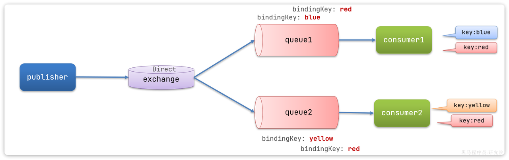

在Direct模型下：

* 队列与交换机的绑定，不能是任意绑定了，而是要指定一个`RoutingKey`（路由key）

* 消息的发送方在 向 Exchange发送消息时，也必须指定消息的 `RoutingKey`。

* Exchange不再把消息交给每一个绑定的队列，而是根据消息的`Routing Key`进行判断，只有队列的`Routingkey`与消息的 `Routing key`完全一致，才会接收到消息


**案例需求如图**：

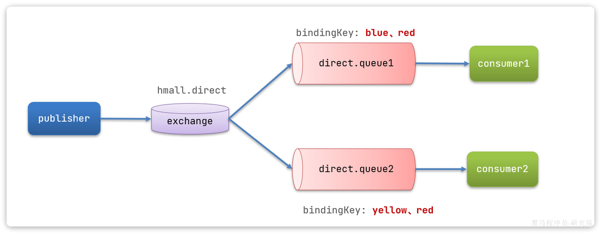

1. &#x20;声明一个名为`hmall.direct`的交换机

2. 声明队列`direct.queue1`，绑定`hmall.direct`，`bindingKey`为`blud`和`red`

3. 声明队列`direct.queue2`，绑定`hmall.direct`，`bindingKey`为`yellow`和`red`

4. &#x20;在`consumer`服务中，编写两个消费者方法，分别监听direct.queue1和direct.queue2&#x20;

5. &#x20;在publisher中编写测试方法，向`hmall.direct`发送消息&#x20;


### 3.6.1.声明队列和交换机

首先在控制台声明两个队列`direct.queue1`和`direct.queue2`，这里不再展示过程：

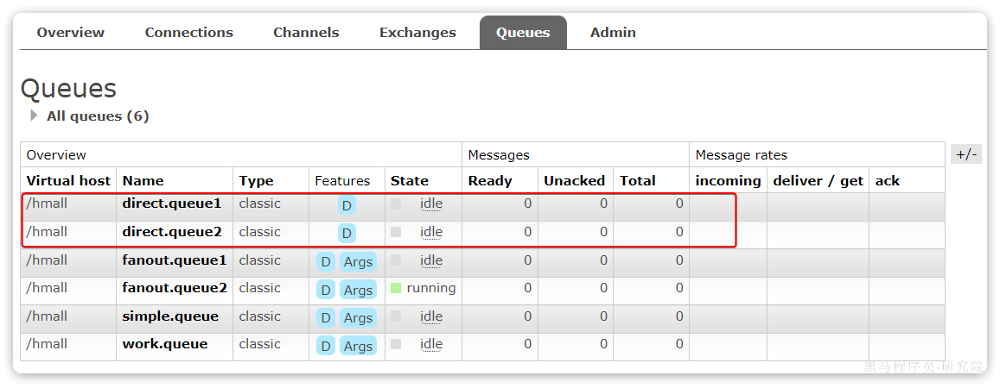

然后声明一个direct类型的交换机，命名为`hmall.direct`:

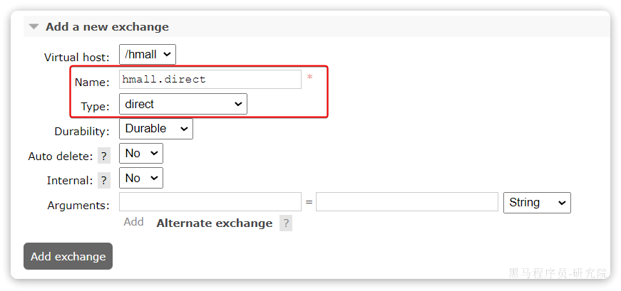

然后使用`red`和`blue`作为key，绑定`direct.queue1`到`hmall.direct`：

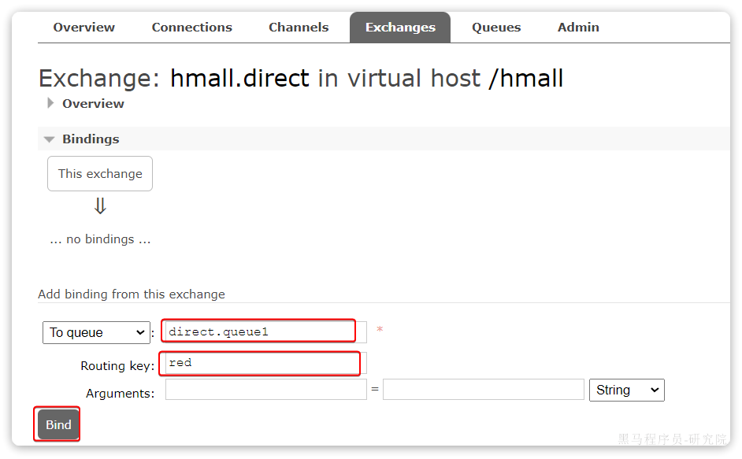

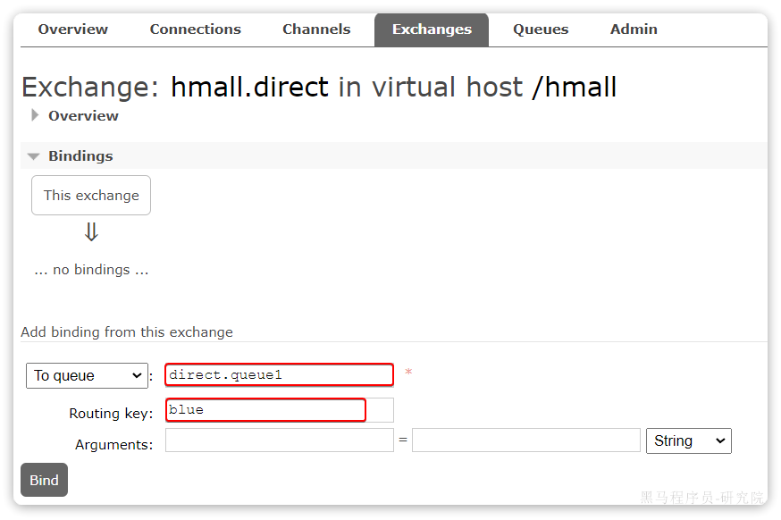


同理，使用`red`和`yellow`作为key，绑定`direct.queue2`到`hmall.direct`，步骤略，最终结果：

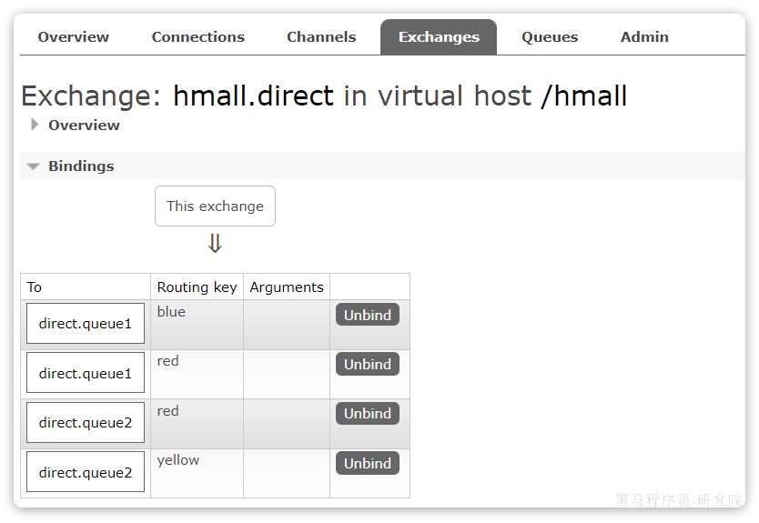

### 3.6.2.消息接收

在consumer服务的SpringRabbitListener中添加方法：

```java
@RabbitListener(queues = "direct.queue1")
public void listenDirectQueue1(String msg) {
    System.out.println("消费者1接收到direct.queue1的消息：【" + msg + "】");
}

@RabbitListener(queues = "direct.queue2")
public void listenDirectQueue2(String msg) {
    System.out.println("消费者2接收到direct.queue2的消息：【" + msg + "】");
}
```


### 3.6.3.消息发送

在publisher服务的SpringAmqpTest类中添加测试方法：

```java
@Test
public void testSendDirectExchange() {
    // 交换机名称
    String exchangeName = "hmall.direct";
    // 消息
    String message = "红色警报！日本乱排核废水，导致海洋生物变异，惊现哥斯拉！";
    // 发送消息
    rabbitTemplate.convertAndSend(exchangeName, "red", message);
}
```

由于使用的red这个key，所以两个消费者都收到了消息：

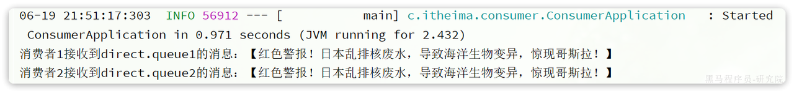

我们再切换为blue这个key：

```java
@Test
public void testSendDirectExchange() {
    // 交换机名称
    String exchangeName = "hmall.direct";
    // 消息
    String message = "最新报道，哥斯拉是居民自治巨型气球，虚惊一场！";
    // 发送消息
    rabbitTemplate.convertAndSend(exchangeName, "blue", message);
}
```

你会发现，只有消费者1收到了消息：

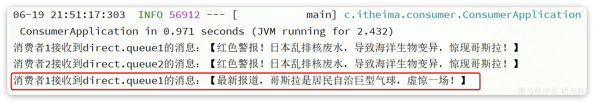


### 3.6.4.总结

描述下Direct交换机与Fanout交换机的差异？

* Fanout交换机将消息路由给每一个与之绑定的队列

* Direct交换机根据RoutingKey判断路由给哪个队列

* 如果多个队列具有相同的RoutingKey，则与Fanout功能类似


## 3.7.Topic交换机

### 3.7.1.说明

`Topic`类型的`Exchange`与`Direct`相比，都是可以根据`RoutingKey`把消息路由到不同的队列。

只不过`Topic`类型`Exchange`可以让队列在绑定`BindingKey` 的时候使用通配符！


`BindingKey` 一般都是有一个或多个单词组成，多个单词之间以`.`分割，例如： `item.insert`


通配符规则：

* `#`：匹配一个或多个词

* `*`：匹配不多不少恰好1个词


举例：

* `item.#`：能够匹配`item.spu.insert` 或者 `item.spu`

* `item.*`：只能匹配`item.spu`


图示：

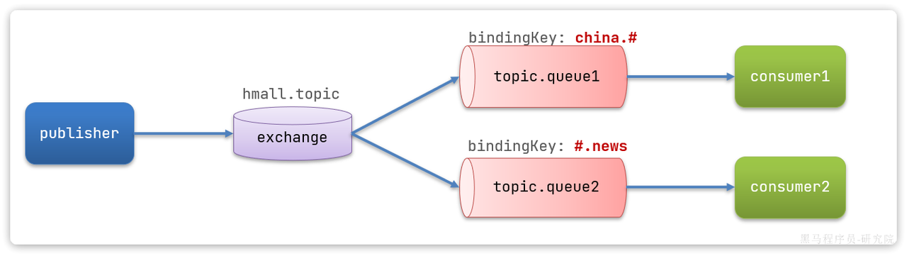

假如此时publisher发送的消息使用的`RoutingKey`共有四种：

* `china.news `代表有中国的新闻消息；

* `china.weather` 代表中国的天气消息；

* `japan.news` 则代表日本新闻

* `japan.weather` 代表日本的天气消息；


解释：

* `topic.queue1`：绑定的是`china.#` ，凡是以 `china.`开头的`routing key` 都会被匹配到，包括：

  * `china.news`

  * `china.weather`

* `topic.queue2`：绑定的是`#.news` ，凡是以 `.news`结尾的 `routing key` 都会被匹配。包括:

  * `china.news`

  * `japan.news`


接下来，我们就按照上图所示，来演示一下Topic交换机的用法。

首先，在控制台按照图示例子创建队列、交换机，并利用通配符绑定队列和交换机。此处步骤略。最终结果如下：

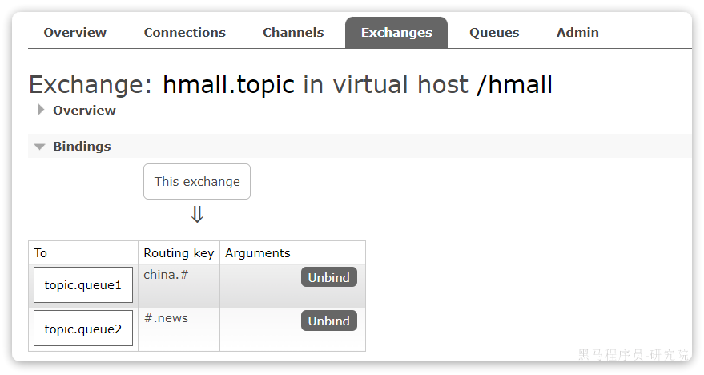


### 3.7.2.消息发送

在publisher服务的SpringAmqpTest类中添加测试方法：

```java
/**
 * topicExchange
 */
@Test
public void testSendTopicExchange() {
    // 交换机名称
    String exchangeName = "hmall.topic";
    // 消息
    String message = "喜报！孙悟空大战哥斯拉，胜!";
    // 发送消息
    rabbitTemplate.convertAndSend(exchangeName, "china.news", message);
}
```


### 3.7.3.消息接收

在consumer服务的SpringRabbitListener中添加方法：

```java
@RabbitListener(queues = "topic.queue1")
public void listenTopicQueue1(String msg){
    System.out.println("消费者1接收到topic.queue1的消息：【" + msg + "】");
}

@RabbitListener(queues = "topic.queue2")
public void listenTopicQueue2(String msg){
    System.out.println("消费者2接收到topic.queue2的消息：【" + msg + "】");
}
```


### 3.7.4.总结


描述下Direct交换机与Topic交换机的差异？

* Topic交换机接收的消息RoutingKey必须是多个单词，以 **`.`** 分割

* Topic交换机与队列绑定时的bindingKey可以指定通配符

* `#`：代表0个或多个词

* `*`：代表1个词


## 3.8.声明队列和交换机

在之前我们都是基于RabbitMQ控制台来创建队列、交换机。但是在实际开发时，队列和交换机是程序员定义的，将来项目上线，又要交给运维去创建。那么程序员就需要把程序中运行的所有队列和交换机都写下来，交给运维。在这个过程中是很容易出现错误的。

因此推荐的做法是由程序启动时检查队列和交换机是否存在，如果不存在自动创建。

### 3.8.1.基本API

SpringAMQP提供了一个Queue类，用来创建队列：

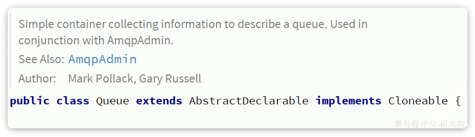


SpringAMQP还提供了一个Exchange接口，来表示所有不同类型的交换机：

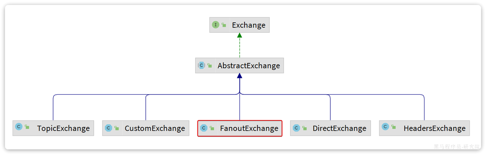

我们可以自己创建队列和交换机，不过SpringAMQP还提供了ExchangeBuilder来简化这个过程：

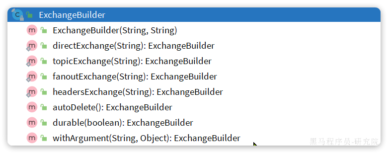

而在绑定队列和交换机时，则需要使用BindingBuilder来创建Binding对象：

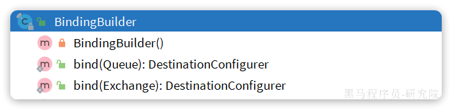


### 3.8.2.fanout示例

在consumer中创建一个类，声明队列和交换机：

```java
package com.itheima.consumer.config;

import org.springframework.amqp.core.Binding;
import org.springframework.amqp.core.BindingBuilder;
import org.springframework.amqp.core.FanoutExchange;
import org.springframework.amqp.core.Queue;
import org.springframework.context.annotation.Bean;
import org.springframework.context.annotation.Configuration;

@Configuration
public class FanoutConfig {
    /**
     * 声明交换机
     * @return Fanout类型交换机
     */
    @Bean
    public FanoutExchange fanoutExchange(){
        return new FanoutExchange("hmall.fanout");
    }

    /**
     * 第1个队列
     */
    @Bean
    public Queue fanoutQueue1(){
        return new Queue("fanout.queue1");
    }

    /**
     * 绑定队列和交换机
     */
    @Bean
    public Binding bindingQueue1(Queue fanoutQueue1, FanoutExchange fanoutExchange){
        return BindingBuilder.bind(fanoutQueue1).to(fanoutExchange);
    }

    /**
     * 第2个队列
     */
    @Bean
    public Queue fanoutQueue2(){
        return new Queue("fanout.queue2");
    }

    /**
     * 绑定队列和交换机
     */
    @Bean
    public Binding bindingQueue2(Queue fanoutQueue2, FanoutExchange fanoutExchange){
        return BindingBuilder.bind(fanoutQueue2).to(fanoutExchange);
    }
}
```


### 3.8.2.direct示例

direct模式由于要绑定多个KEY，会非常麻烦，每一个Key都要编写一个binding：

```java
package com.itheima.consumer.config;

import org.springframework.amqp.core.*;
import org.springframework.context.annotation.Bean;
import org.springframework.context.annotation.Configuration;

@Configuration
public class DirectConfig {

    /**
     * 声明交换机
     * @return Direct类型交换机
     */
    @Bean
    public DirectExchange directExchange(){
        return ExchangeBuilder.directExchange("hmall.direct").build();
    }

    /**
     * 第1个队列
     */
    @Bean
    public Queue directQueue1(){
        return new Queue("direct.queue1");
    }

    /**
     * 绑定队列和交换机
     */
    @Bean
    public Binding bindingQueue1WithRed(Queue directQueue1, DirectExchange directExchange){
        return BindingBuilder.bind(directQueue1).to(directExchange).with("red");
    }
    /**
     * 绑定队列和交换机
     */
    @Bean
    public Binding bindingQueue1WithBlue(Queue directQueue1, DirectExchange directExchange){
        return BindingBuilder.bind(directQueue1).to(directExchange).with("blue");
    }

    /**
     * 第2个队列
     */
    @Bean
    public Queue directQueue2(){
        return new Queue("direct.queue2");
    }

    /**
     * 绑定队列和交换机
     */
    @Bean
    public Binding bindingQueue2WithRed(Queue directQueue2, DirectExchange directExchange){
        return BindingBuilder.bind(directQueue2).to(directExchange).with("red");
    }
    /**
     * 绑定队列和交换机
     */
    @Bean
    public Binding bindingQueue2WithYellow(Queue directQueue2, DirectExchange directExchange){
        return BindingBuilder.bind(directQueue2).to(directExchange).with("yellow");
    }
}
```


### 3.8.4.基于注解声明

基于@Bean的方式声明队列和交换机比较麻烦，Spring还提供了基于注解方式来声明。


例如，我们同样声明Direct模式的交换机和队列：

```java
@RabbitListener(bindings = @QueueBinding(
    value = @Queue(name = "direct.queue1"),
    exchange = @Exchange(name = "hmall.direct", type = ExchangeTypes.DIRECT),
    key = {"red", "blue"}
))
public void listenDirectQueue1(String msg){
    System.out.println("消费者1接收到direct.queue1的消息：【" + msg + "】");
}

@RabbitListener(bindings = @QueueBinding(
    value = @Queue(name = "direct.queue2"),
    exchange = @Exchange(name = "hmall.direct", type = ExchangeTypes.DIRECT),
    key = {"red", "yellow"}
))
public void listenDirectQueue2(String msg){
    System.out.println("消费者2接收到direct.queue2的消息：【" + msg + "】");
}
```


是不是简单多了。

再试试Topic模式：

```java
@RabbitListener(bindings = @QueueBinding(
    value = @Queue(name = "topic.queue1"),
    exchange = @Exchange(name = "hmall.topic", type = ExchangeTypes.TOPIC),
    key = "china.#"
))
public void listenTopicQueue1(String msg){
    System.out.println("消费者1接收到topic.queue1的消息：【" + msg + "】");
}

@RabbitListener(bindings = @QueueBinding(
    value = @Queue(name = "topic.queue2"),
    exchange = @Exchange(name = "hmall.topic", type = ExchangeTypes.TOPIC),
    key = "#.news"
))
public void listenTopicQueue2(String msg){
    System.out.println("消费者2接收到topic.queue2的消息：【" + msg + "】");
}
```


## 3.9.消息转换器

Spring的消息发送代码接收的消息体是一个Object：

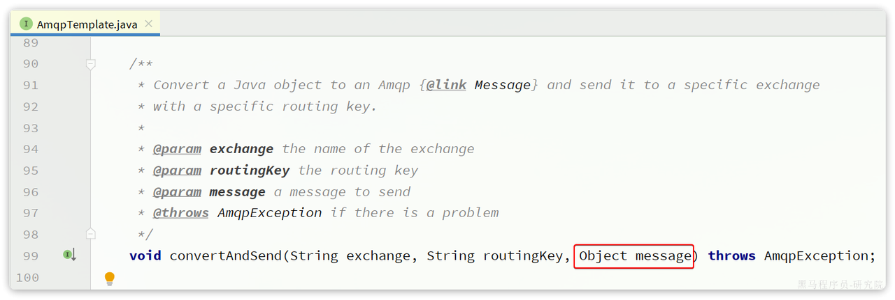

而在数据传输时，它会把你发送的消息序列化为字节发送给MQ，接收消息的时候，还会把字节反序列化为Java对象。

只不过，默认情况下Spring采用的序列化方式是JDK序列化。众所周知，JDK序列化存在下列问题：

* 数据体积过大

* 有安全漏洞

* 可读性差


我们来测试一下。


### 3.9.1.测试默认转换器

1）创建测试队列

首先，我们在consumer服务中声明一个新的配置类：

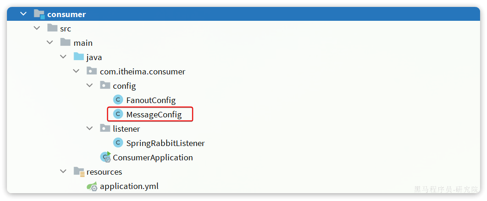

利用@Bean的方式创建一个队列，

具体代码：

```java
package com.itheima.consumer.config;

import org.springframework.amqp.core.Queue;
import org.springframework.context.annotation.Bean;
import org.springframework.context.annotation.Configuration;

@Configuration
public class MessageConfig {

    @Bean
    public Queue objectQueue() {
        return new Queue("object.queue");
    }
}
```


注意，这里我们先不要给这个队列添加消费者，我们要查看消息体的格式。


重启consumer服务以后，该队列就会被自动创建出来了：

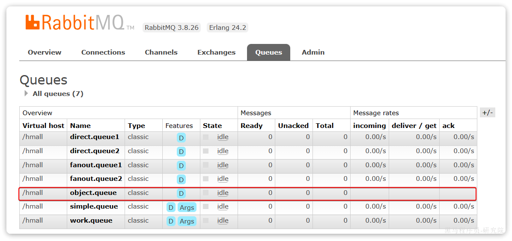


2）发送消息

我们在publisher模块的SpringAmqpTest中新增一个消息发送的代码，发送一个Map对象：

```java
@Test
public void testSendMap() throws InterruptedException {
    // 准备消息
    Map<String,Object> msg = new HashMap<>();
    msg.put("name", "柳岩");
    msg.put("age", 21);
    // 发送消息
    rabbitTemplate.convertAndSend("object.queue", msg);
}
```


发送消息后查看控制台：

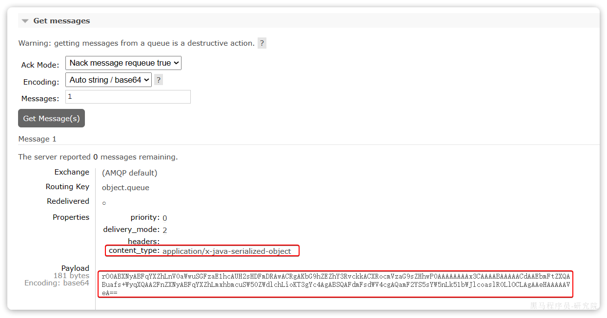

可以看到消息格式非常不友好。


### 3.9.2.配置JSON转换器

显然，JDK序列化方式并不合适。我们希望消息体的体积更小、可读性更高，因此可以使用JSON方式来做序列化和反序列化。


在`publisher`和`consumer`两个服务中都引入依赖：

```xml
<dependency>
    <groupId>com.fasterxml.jackson.dataformat</groupId>
    <artifactId>jackson-dataformat-xml</artifactId>
    <version>2.9.10</version>
</dependency>
```

注意，如果项目中引入了`spring-boot-starter-web`依赖，则无需再次引入`Jackson`依赖。


配置消息转换器，在`publisher`和`consumer`两个服务的启动类中添加一个Bean即可：

```java
@Bean
public MessageConverter messageConverter(){
    // 1.定义消息转换器
    Jackson2JsonMessageConverter jackson2JsonMessageConverter = new Jackson2JsonMessageConverter();
    // 2.配置自动创建消息id，用于识别不同消息，也可以在业务中基于ID判断是否是重复消息
    jackson2JsonMessageConverter.setCreateMessageIds(true);
    return jackson2JsonMessageConverter;
}
```

消息转换器中添加的messageId可以便于我们将来做幂等性判断。

此时，我们到MQ控制台**删除**`object.queue`中的旧的消息。然后再次执行刚才的消息发送的代码，到MQ的控制台查看消息结构：

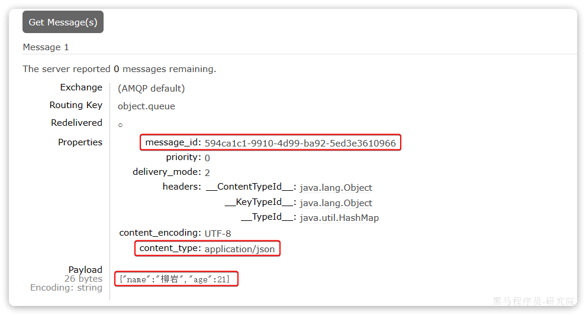

### 3.9.3.消费者接收Object

我们在consumer服务中定义一个新的消费者，publisher是用Map发送，那么消费者也一定要用Map接收，格式如下：

```java
@RabbitListener(queues = "object.queue")
public void listenSimpleQueueMessage(Map<String, Object> msg) throws InterruptedException {
    System.out.println("消费者接收到object.queue消息：【" + msg + "】");
}
```


# 4.业务改造

案例需求：改造余额支付功能，将支付成功后基于OpenFeign的交易服务的更新订单状态接口的同步调用，改为基于RabbitMQ的异步通知。

如图：

> 当用户下单之后，首先会去用户服务扣减余额，然后在本地服务更新订单的支付状态，再去交易服务更新订单状态。都为同步调用。
>
> 其中扣减余额和更新支付状态为核心业务，使用同步调用无可厚非。但更新订单状态不属于核心业务，如果使用同步调用将会增加业务的处理时间，可以使用mq异步调用。后续如果添加新业务如通知服务、积分服务同理。

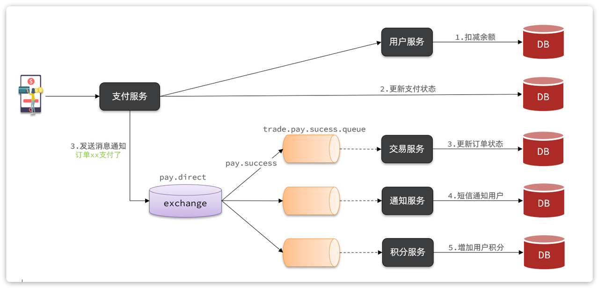

说明：目前没有通知服务和积分服务，因此我们只关注交易服务，步骤如下：

* 定义`direct`类型交换机，命名为`pay.direct`

* 在消费者定义消息队列，命名为`trade.pay.success.queue`

* 将`trade.pay.success.queue`与`pay.direct`绑定，`BindingKey`为`pay.success`

* 支付成功时不再调用交易服务更新订单状态的接口，而是发送一条消息到`pay.direct`，发送消息的`RoutingKey`  为`pay.success`，消息内容是订单id

* 交易服务监听`trade.pay.success.queue`队列，接收到消息后更新订单状态为已支付


## 4.1.配置MQ

不管是生产者还是消费者，都需要配置MQ的基本信息。分为两步：

1）添加依赖：

```xml
  <!--消息发送-->
  <dependency>
      <groupId>org.springframework.boot</groupId>
      <artifactId>spring-boot-starter-amqp</artifactId>
  </dependency>
```

2）配置MQ地址：

```yaml
spring:
  rabbitmq:
    host: 192.168.150.101 # 你的虚拟机IP
    port: 5672 # 端口
    virtual-host: /hmall # 虚拟主机
    username: hmall # 用户名
    password: 123 # 密码
```

## 4.1.接收消息

在trade-service服务中定义一个消息监听类：

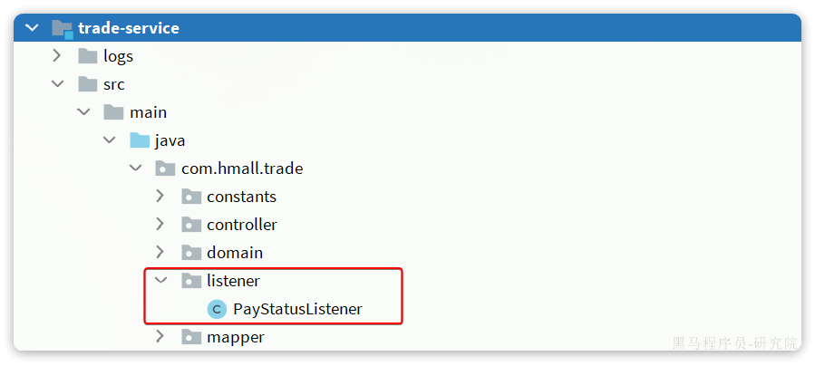

其代码如下：

```java
package com.hmall.trade.listener;

import com.hmall.trade.service.IOrderService;
import lombok.RequiredArgsConstructor;
import org.springframework.amqp.core.ExchangeTypes;
import org.springframework.amqp.rabbit.annotation.Exchange;
import org.springframework.amqp.rabbit.annotation.Queue;
import org.springframework.amqp.rabbit.annotation.QueueBinding;
import org.springframework.amqp.rabbit.annotation.RabbitListener;
import org.springframework.stereotype.Component;

@Component
@RequiredArgsConstructor
public class PayStatusListener {

    private final IOrderService orderService;

    @RabbitListener(bindings = @QueueBinding(
            value = @Queue(name = "trade.pay.success.queue", durable = "true"),
            exchange = @Exchange(name = "pay.direct"),
            key = "pay.success"
    ))
    public void listenPaySuccess(Long orderId){
        orderService.markOrderPaySuccess(orderId);
    }
}
```


## 4.2.发送消息

修改`pay-service`服务下的`com.hmall.pay.service.impl.PayOrderServiceImpl`类中的`tryPayOrderByBalance`方法：

```java
private final RabbitTemplate rabbitTemplate;

@Override
@Transactional
public void tryPayOrderByBalance(PayOrderDTO payOrderDTO) {
    // 1.查询支付单
    PayOrder po = getById(payOrderDTO.getId());
    // 2.判断状态
    if(!PayStatus.WAIT_BUYER_PAY.equalsValue(po.getStatus())){
        // 订单不是未支付，状态异常
        throw new BizIllegalException("交易已支付或关闭！");
    }
    // 3.尝试扣减余额
    userClient.deductMoney(payOrderDTO.getPw(), po.getAmount());
    // 4.修改支付单状态
    boolean success = markPayOrderSuccess(payOrderDTO.getId(), LocalDateTime.now());
    if (!success) {
        throw new BizIllegalException("交易已支付或关闭！");
    }
    // 5.修改订单状态
    // tradeClient.markOrderPaySuccess(po.getBizOrderNo());
    try {
        rabbitTemplate.convertAndSend("pay.direct", "pay.success", po.getBizOrderNo());
    } catch (Exception e) {
        log.error("支付成功的消息发送失败，支付单id：{}， 交易单id：{}", po.getId(), po.getBizOrderNo(), e);
    }
}
```

# 5.练习

## 5.1.抽取共享的MQ配置

将MQ配置抽取到Nacos中管理，微服务中直接使用共享配置。


## 5.2.改造下单功能

改造下单功能，将基于OpenFeign的清理购物车同步调用，改为基于RabbitMQ的异步通知：

* 定义topic类型交换机，命名为`trade.topic`

* 定义消息队列，命名为`cart.clear.queue`

* 将`cart.clear.queue`与`trade.topic`绑定，`BindingKey`为`order.create`

* 下单成功时不再调用清理购物车接口，而是发送一条消息到`trade.topic`，发送消息的`RoutingKey`  为`order.create`，消息内容是下单的具体商品、当前登录用户信息

* 购物车服务监听`cart.clear.queue`队列，接收到消息后清理指定用户的购物车中的指定商品


## 5.3.登录信息传递优化

某些业务中，需要根据登录用户信息处理业务，而基于MQ的异步调用并不会传递登录用户信息。前面我们的做法比较麻烦，至少要做两件事：

* 消息发送者在消息体中传递登录用户

* 消费者获取消息体中的登录用户，处理业务

这样做不仅麻烦，而且编程体验也不统一，毕竟我们之前都是使用UserContext来获取用户。


大家思考一下：有没有更优雅的办法传输登录用户信息，让使用MQ的人无感知，依然采用UserContext来随时获取用户。


参考资料：

<iframe src="https://docs.spring.io/spring-amqp/docs/2.4.14/reference/html/#post-processing" sandbox="allow-scripts allow-same-origin allow-presentation allow-forms allow-popups allow-downloads" allowfullscreen allow="encrypted-media; fullscreen; autoplay" referrerpolicy="strict-origin-when-cross-origin" frameborder="0" style="width: 100%; min-height: 461px; border-radius: 8px;"></iframe>


## 5.4.改造项目一

思考一下，项目一中的哪些业务可以由同步方式改为异步方式调用？试着改造一下。

举例：短信发送
