## Docker 

### 1 快速入门 

#### 1.1 部署MySQL 

先停掉虚拟机中的MySQL，确保你的虚拟机已经安装Docker，且在网络开通的情况下，执行下面命令即可安装MySQL:

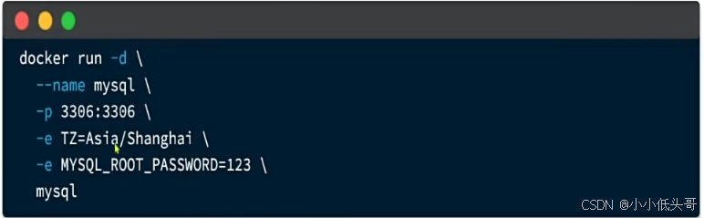

接下来连接MYSQL，使用数据库工具，比如Navicat

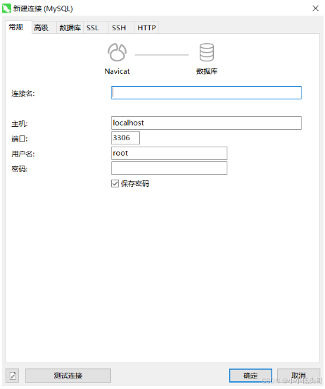

主机填虚拟机的ip地址，密码填123或者你命令中改的。

镜像和容器

当我们利用Docker安装应用时，Docker会自动搜索并下载应用镜像。注意：这里下载的不是安装包，而是镜像。比如安装MYSQL时，镜像中不仅包含了MySQL本身，还包含了其运行所需要的环境、配置、系统级函数库。因此它在运行时就有自己独立的环境，就可以跨系统运行，也不需要手动再次配置环境了。这套独立运行的隔离环境我们称为容器。

说明：

 *  镜像：英文是image
 *  容器：英文是container

> 因此，Docker安装软件的过程，就是自动搜索下载镜像，然后创建并运行容器的过程。

镜像仓库： 存储和管理镜像的平台，Docker官方维护了一个公共仓库：[Docker Hub Container Image Library | App Containerization][Docker Hub Container Image Library _ App Containerization]

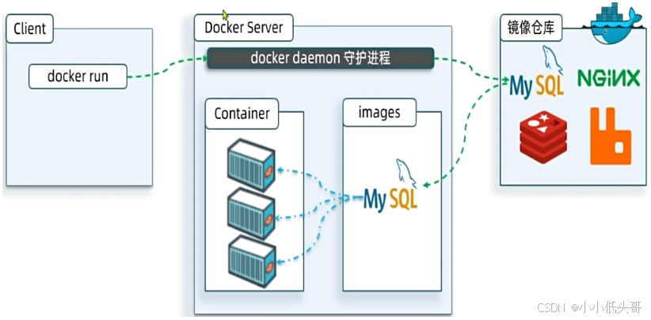

#### 1.2 命令解读 

```bash
docker run -d \
  --name mysql \
  -p 3306:3306 \
  -e TZ=Asia/Shanghai \
  -e MYSQL_ROOT_PASSWORD=123 \
  mysql
```

解读：

 *  `docker run -d` ：创建并运行一个容器，`-d`则是让容器以后台进程运行
 *  ```--name`` mysql``` : 给容器起个名字叫`mysql`，你可以叫别的
 *  `-p 3306:3306` : 设置端口映射。 第一个3306是宿主机端口 后面3306是容器内端口。
   
     *  容器是隔离环境，外界不可访问。但是可以将 宿主机 端口 映射容器内到端口，当访问宿主机指定端口时，就是在访问容器内的端口了。
     *  容器内端口往往是由容器内的进程决定，例如MySQL进程默认端口是3306，因此容器内端口一定是3306；而宿主机端口则可以任意指定，一般与容器内保持一致。
     *  格式： `-p 宿主机端口:容器内端口`，示例中就是将宿主机的3306映射到容器内的3306端口
     
        
    
    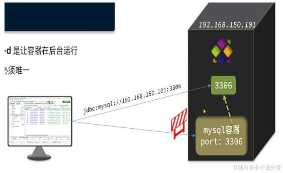
 *  `-e TZ=Asia/Shanghai` : 配置容器内进程运行时的一些参数
   
     *  格式：`-e KEY=VALUE`，KEY和VALUE都由容器内进程决定
     *  案例中，`TZ=Asia/Shanghai`是设置时区；`MYSQL_ROOT_PASSWORD=123`是设置MySQL默认密码
 *  `mysql` : 设置镜像名称，Docker会根据这个名字搜索并下载镜像
   
     *  格式：`REPOSITORY:TAG`，例如`mysql:8.0`，其中`REPOSITORY`可以理解为镜像名，`TAG`是版本号
     *  在未指定`TAG`的情况下，默认是最新版本，也就是`mysql:latest`

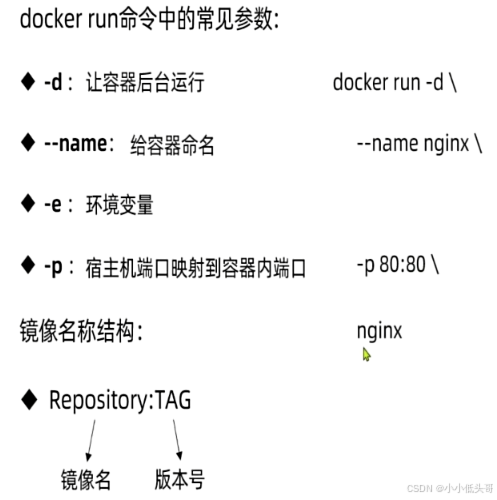

### 2 Docker基础 

#### 2.1 常见命令 

Docker最常见的命令就是操作镜像、容器的命令，详见官方文档

其中，比较常见的命令有：

<table> 
 <thead> 
  <tr> 
   <th><strong>命令</strong></th> 
   <th><strong>说明</strong></th> 
   <th><strong>文档地址</strong></th> 
  </tr> 
 </thead> 
 <tbody> 
  <tr> 
   <td>docker pull</td> 
   <td>拉取镜像</td> 
   <td><a href="https://docs.docker.com/engine/reference/commandline/pull/">docker pull</a></td> 
  </tr> 
  <tr> 
   <td>docker push</td> 
   <td>推送镜像到DockerRegistry</td> 
   <td><a href="https://docs.docker.com/engine/reference/commandline/push/">docker push</a></td> 
  </tr> 
  <tr> 
   <td>docker images</td> 
   <td>查看本地镜像</td> 
   <td><a href="https://docs.docker.com/engine/reference/commandline/images/">docker images</a></td> 
  </tr> 
  <tr> 
   <td>docker rmi</td> 
   <td>删除本地镜像</td> 
   <td><a href="https://docs.docker.com/engine/reference/commandline/rmi/">docker rmi</a></td> 
  </tr> 
  <tr> 
   <td>docker run</td> 
   <td>创建并运行容器（不能重复创建）</td> 
   <td><a href="https://docs.docker.com/engine/reference/commandline/run/">docker run</a></td> 
  </tr> 
  <tr> 
   <td>docker stop</td> 
   <td>停止指定容器</td> 
   <td><a href="https://docs.docker.com/engine/reference/commandline/stop/">docker stop</a></td> 
  </tr> 
  <tr> 
   <td>docker start</td> 
   <td>启动指定容器</td> 
   <td><a href="https://docs.docker.com/engine/reference/commandline/start/">docker start</a></td> 
  </tr> 
  <tr> 
   <td>docker restart</td> 
   <td>重新启动容器</td> 
   <td><a href="https://docs.docker.com/engine/reference/commandline/restart/">docker restart</a></td> 
  </tr> 
  <tr> 
   <td>docker rm</td> 
   <td>删除指定容器</td> 
   <td><a href="https://docs.docker.com/engine/reference/commandline/rm/">docs.docker.com</a></td> 
  </tr> 
  <tr> 
   <td>docker ps</td> 
   <td>查看容器</td> 
   <td><a href="https://docs.docker.com/engine/reference/commandline/ps/">docker ps</a></td> 
  </tr> 
  <tr> 
   <td>docker logs</td> 
   <td>查看容器运行日志</td> 
   <td><a href="https://docs.docker.com/engine/reference/commandline/logs/">docker logs</a></td> 
  </tr> 
  <tr> 
   <td>docker exec</td> 
   <td>进入容器</td> 
   <td><a href="https://docs.docker.com/engine/reference/commandline/exec/">docker exec</a></td> 
  </tr> 
  <tr> 
   <td>docker save</td> 
   <td>保存镜像到本地压缩文件</td> 
   <td><a href="https://docs.docker.com/engine/reference/commandline/save/">docker save</a></td> 
  </tr> 
  <tr> 
   <td>docker load</td> 
   <td>加载本地压缩文件到镜像</td> 
   <td><a href="https://docs.docker.com/engine/reference/commandline/load/">docker load</a></td> 
  </tr> 
  <tr> 
   <td>docker inspect</td> 
   <td>查看容器详细信息</td> 
   <td><a href="https://docs.docker.com/engine/reference/commandline/inspect/">docker inspect</a></td> 
  </tr> 
 </tbody> 
</table>

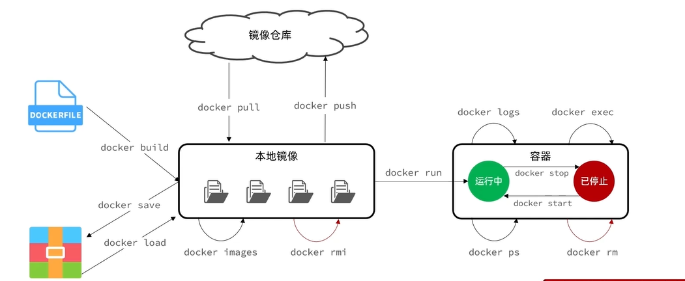

案例：查看DockerHub，拉取Nginx镜像，创建并运行Nginx容器

需求：

 *  在DockerHub中搜索Nginx镜像，查看镜像的名称
 *  拉取Nginx镜像
 *  查看本地镜像列表
 *  创建并运行Nginx容器
 *  查看容器
 *  停止容器
 *  再次启动容器
 *  进入Nginx容器
 *  删除容器

```bash
# 第1步，去DockerHub查看nginx镜像仓库及相关信息

# 第2步，拉取Nginx镜像
docker pull nginx

# 第3步，查看镜像
docker images
# 结果如下：
REPOSITORY   TAG       IMAGE ID       CREATED         SIZE
nginx        latest    605c77e624dd   16 months ago   141MB
mysql        latest    3218b38490ce   17 months ago   516MB

#保存镜像 -o 文件名 容器名
docker save -o nginx.tar nginx:latest

# 第4步，创建并允许Nginx容器
docker run -d --name nginx -p 80:80 nginx

# 第5步，查看运行中容器
docker ps

# 也可以加格式化方式访问，格式会更加清爽
docker ps --format "table {
    {.ID}}\t{
    {.Image}}\t{
    {.Ports}}\t{
    {.Status}}\t{
    {.Names}}"

# 第6步，访问网页，地址：http://虚拟机地址
# 第7步，停止容器
docker stop nginx

# 第8步，查看所有容器
docker ps -a --format "table {
    
    {.ID}}\t{
    {.Image}}\t{
    {.Ports}}\t{
    {.Status}}\t{
    {.Names}}"

# 第9步，再次启动nginx容器
docker start nginx

# 第10步，再次查看容器
docker ps --format "table {
    {.ID}}\t{
    {.Image}}\t{
    {.Ports}}\t{
    {.Status}}\t{
    {.Names}}"
# 第11步，查看容器详细信息
docker inspect nginx

# 第12步，进入容器,查看容器内目录
# docker run -it 是 Docker 中常用的命令选项组合，通常用于在交互式模式下启动容器。
docker exec -it nginx bash
# 或者，可以进入MySQL
docker exec -it mysql mysql -uroot -p

# 第13步，删除容器
docker rm nginx
# 发现无法删除，因为容器运行中，强制删除容器
docker rm -f nginx
```

#### 2.2 数据卷 

案例：利用Nginx容器部署静态资源

需求：

 *  创建Nginx容器，修改容器内的html目录下的index.html文件，查看变化
 *  将静态资源部署到nginx的html目录

如果docker exec -it nginx bash直接进入nginx容器进行修改html文件，虽然容器内可以执行一些命令，但是也只是可以执行一些运行环境所必须的命令，很多其它命令无法执行，比如 vim index.html就无法执行，所以在容器内直接修改文件就比较麻烦了，这时候就可以靠数据卷了。

##### 2.2.1 数据卷 

数据卷（volume）是一个虚拟目录，是容器内目录与宿主机目录之间映射的桥梁。

以Nginx为例，我们知道Nginx中有两个关键的目录：

 *  `html`：放置一些静态资源
 *  `conf`：放置配置文件

如果我们要让Nginx代理我们的静态资源，最好是放到`html`目录；如果我们要修改Nginx的配置，最好是找到`conf`下的`nginx.conf`文件。

但遗憾的是，容器运行的Nginx所有的文件都在容器内部。所以我们必须利用数据卷将两个目录与宿主机目录关联，方便我们操作。如图：

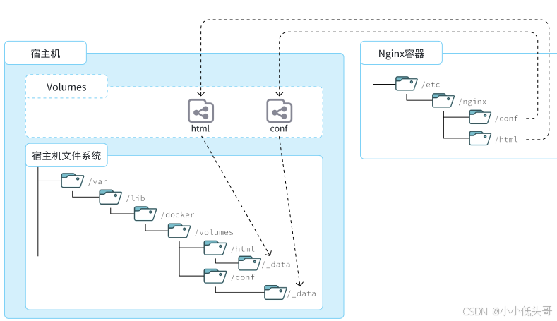

在上图中：

 *  我们创建了两个数据卷：`conf`、`html`
 *  Nginx容器内部的`conf`目录和`html`目录分别与两个数据卷关联。
 *  而数据卷conf和html分别指向了宿主机的`/var/lib/docker/volumes/conf/_data`目录和`/var/lib/docker/volumes/html/_data`目录

这样以来，容器内的`conf`和`html`目录就 与宿主机的`conf`和`html`目录关联起来，我们称为挂载。此时，我们操作宿主机的`/var/lib/docker/volumes/html/_data`就是在操作容器内的`/usr/share/nginx/html/_data`目录。只要我们将静态资源放入宿主机对应目录，就可以被Nginx代理了。

小提示：

`/var/lib/docker/volumes`这个目录就是默认的存放所有容器数据卷的目录，其下再根据数据卷名称创建新目录，格式为`/数据卷名/_data`。

为什么不让容器目录直接指向宿主机目录呢？

 *  因为直接指向宿主机目录就与宿主机强耦合了，如果切换了环境，宿主机目录就可能发生改变了。由于容器一旦创建，目录挂载就无法修改，这样容器就无法正常工作了。
 *  但是容器指向数据卷，一个逻辑名称，而数据卷再指向宿主机目录，就不存在强耦合。如果宿主机目录发生改变，只要改变数据卷与宿主机目录之间的映射关系即可。

不过，我们通过由于数据卷目录比较深，不好寻找，通常我们也允许让容器直接与宿主机目录挂载而不使用数据卷

##### 2.2.2 数据卷命令 

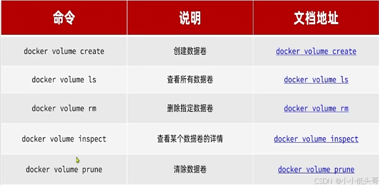  
A  


```bash
docker run -d --name nginx -p 80:80 -v html:/usr/share/nginx/html nginx
```


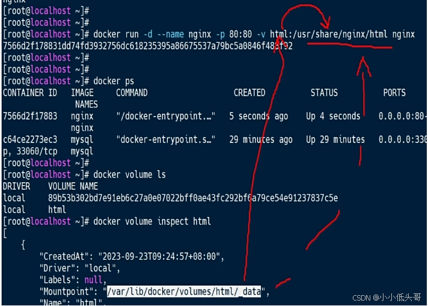


> 那其实数据卷就是将宿主机的某个目录与容器内的某个目录相连接，改动宿主机中的文件就可以间接改动容器内的文件。之所以要这样，是因为进入到容器中修完容器的配置文件比较困难，容器内很多命令是无效的，只有一些必需的命令而已。而在宿主机中所有命令都生效，可以更便捷的修改文件。

##### 2.2.3 挂载本地目录或文件 

案例2：mysql容器的数据挂载

需求：

 *  查看mysql容器，判断是否有数据卷挂载

docker inspect 容器名 `docker inspect mysql`

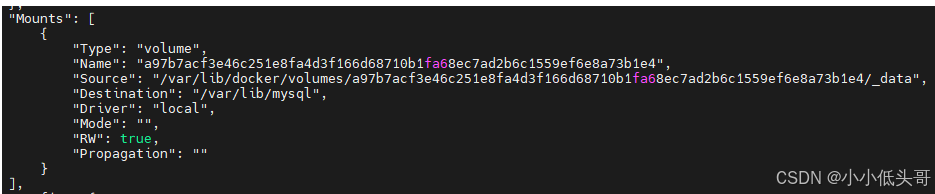

发现确实和一个宿主机的一个目录挂载了。而我们一开始是没有指定数据卷挂载的，说明是在创建容器的时候，自动帮我们挂载的，称之为匿名卷。 数据卷名是随机生成的一串好长的数字字母。

如果把mysql容器删除了，那么其对应的数据卷目录还在。如果创建新的数据库，则不会将旧的数据卷与新的mysql容器进行映射挂载，这样新的mysql容器就不会有以前的数据库内容。那么现在问题来了，怎么将旧的mysql数据信息移植到新的mysql容器中呢？做法之一是直接将旧数据卷中的文件拷贝到新mysql对应的数据卷目录下，但是由于匿名卷太深了，麻烦，更好地方法之一便是自己创建一个浅一点的目录，进行挂载。下一题进行

 *  基于宿主机目录实现Mysql数据目录、配置文件、初始化脚本的挂载（查阅官方镜像文档）

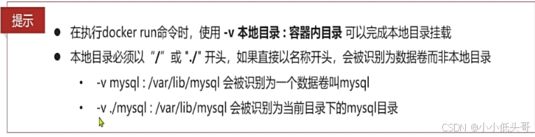

数据目录、配置文件、初始化脚本的挂载都可以在官方镜像Mysql文档中找到

```bash
# 1.删除原来的MySQL容器
docker rm -f mysql

# 2.进入root目录
cd ~

# 3.创建并运行新mysql容器，挂载本地目录
docker run -d \
  --name mysql \
  -p 3306:3306 \
  -e TZ=Asia/Shanghai \
  -e MYSQL_ROOT_PASSWORD=root \
  -v /root/mysql/data:/var/lib/mysql \
  -v /root/mysql/conf:/etc/mysql/conf.d \
  -v /root/mysql/init:/docker-entrypoint-initdb.d \
  mysql

# 4.查看root目录，可以发现~/mysql/data目录已经自动创建好了
ls -l mysql
# 结果：
总用量 4
drwxr-xr-x. 2 root    root   20 5月  19 15:11 conf
drwxr-xr-x. 7 polkitd root 4096 5月  19 15:11 data
drwxr-xr-x. 2 root    root   23 5月  19 15:11 init

# 查看data目录，会发现里面有大量数据库数据，说明数据库完成了初始化
ls -l data

# 5.查看MySQL容器内数据
# 5.1.进入MySQL
docker exec -it mysql mysql -uroot -p123
# 5.2.查看编码表
show variables like "%char%";
# 5.3.结果，发现编码是utf8mb4没有问题
+--------------------------+--------------------------------+
| Variable_name            | Value                          |
+--------------------------+--------------------------------+
| character_set_client     | utf8mb4                        |
| character_set_connection | utf8mb4                        |
| character_set_database   | utf8mb4                        |
| character_set_filesystem | binary                         |
| character_set_results    | utf8mb4                        |
| character_set_server     | utf8mb4                        |
| character_set_system     | utf8mb3                        |
| character_sets_dir       | /usr/share/mysql-8.0/charsets/ |
+--------------------------+--------------------------------+

# 6.查看数据
# 6.1.查看数据库
show databases;
# 结果，hmall是黑马商城数据库
+--------------------+
| Database           |
+--------------------+
| hmall              |
| information_schema |
| mysql              |
| performance_schema |
| sys                |
+--------------------+
5 rows in set (0.00 sec)
# 6.2.切换到hmall数据库
use hmall;
# 6.3.查看表
show tables;
# 结果：
+-----------------+
| Tables_in_hmall |
+-----------------+
| address         |
| cart            |
| item            |
| order           |
| order_detail    |
| order_logistics |
| pay_order       |
| user            |
+-----------------+
# 6.4.查看address表数据
+----+---------+----------+--------+----------+-------------+---------------+-----------+------------+-------+
| id | user_id | province | city   | town     | mobile      | street        | contact   | is_default | notes |
+----+---------+----------+--------+----------+-------------+---------------+-----------+------------+-------+
| 59 |       1 | 北京     | 北京   | 朝阳区    | 13900112222 | 金燕龙办公楼   | 李佳诚    | 0          | NULL  |
| 60 |       1 | 北京     | 北京   | 朝阳区    | 13700221122 | 修正大厦       | 李佳红    | 0          | NULL  |
| 61 |       1 | 上海     | 上海   | 浦东新区  | 13301212233 | 航头镇航头路   | 李佳星    | 1          | NULL  |
| 63 |       1 | 广东     | 佛山   | 永春      | 13301212233 | 永春武馆       | 李晓龙    | 0          | NULL  |
+----+---------+----------+--------+----------+-------------+---------------+-----------+------------+-------+
4 rows in set (0.00 sec)
```

> 其挂载本地目录其实和数据卷一样，只不过数据卷是指定数据卷名字而已，路径默认会指定，且比较深，麻烦。而挂载本地目录可以让路径浅一点，方便查找并修改文件，所以一般还是推荐使用挂载本地目录。一旦删除容器重新创建容器时，只要挂载在旧挂载目录，即可恢复回原来的数据。

#### 2.3 自定义镜像 

镜像就是包含了引用程序、程序运行的系统函数库、运行配置等文件的文件包。构建镜像的过程其实就是把上述文件打包的过程。


##### 2.3.1 镜像结构 

镜像文件不是随意堆放的，而是按照操作的步骤分层叠加而成，每一层形成的文件都会单独打包并标记一个唯一id，称为Layer（层）。这样，如果我们构建时用到的某些层其他人已经制作过，就可以直接拷贝使用这些层，而不用重复制作。

例如，第一步中需要的Linux运行环境，通用性就很强，所以Docker官方就制作了这样的只包含Linux运行环境的镜像。我们在制作java镜像时，就无需重复制作，直接使用Docker官方提供的CentOS或Ubuntu镜像作为基础镜像。然后再搭建其它层即可，这样逐层搭建，最终整个Java项目的镜像结构如图所示：


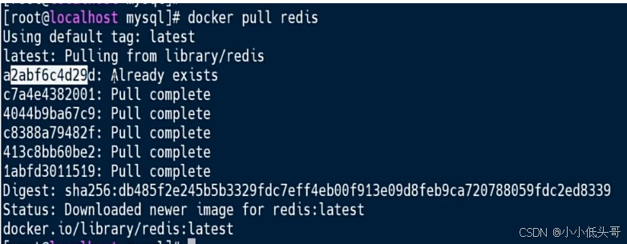

比如新加载一个镜像：redis，由于加载Mysql镜像时已经加载过了一些镜像，所以加载redis镜像时，有些加载过得镜像可以不必加载，节省了时间。如上图中的第一层。镜像是分层的

##### 2.3.2 Dockerfile 

Dockerfile就是一个文本文件，其中包含一个个的 指令（Instruction） ，用指令说明要执行什么操作来构建镜像。将来Docker可以根据Dockerfile帮我们构建镜像。常见指令如下：

<table> 
 <thead> 
  <tr> 
   <th><strong>指令</strong></th> 
   <th><strong>说明</strong></th> 
   <th><strong>示例</strong></th> 
  </tr> 
 </thead> 
 <tbody> 
  <tr> 
   <td><strong>FROM</strong></td> 
   <td>指定基础镜像</td> 
   <td><code>FROM centos:6</code></td> 
  </tr> 
  <tr> 
   <td><strong>ENV</strong></td> 
   <td>设置环境变量，可在后面指令使用</td> 
   <td><code>ENV key value</code></td> 
  </tr> 
  <tr> 
   <td><strong>COPY</strong></td> 
   <td>拷贝本地文件到镜像的指定目录</td> 
   <td><code>COPY ./xx.jar /tmp/app.jar</code></td> 
  </tr> 
  <tr> 
   <td><strong>RUN</strong></td> 
   <td>执行Linux的shell命令，一般是安装过程的命令</td> 
   <td><code>RUN yum install gcc</code></td> 
  </tr> 
  <tr> 
   <td><strong>EXPOSE</strong></td> 
   <td>指定容器运行时监听的端口，是给镜像使用者看的</td> 
   <td>EXPOSE 8080</td> 
  </tr> 
  <tr> 
   <td><strong>ENTRYPOINT</strong></td> 
   <td>镜像中应用的启动命令，容器运行时调用</td> 
   <td>ENTRYPOINT java -jar xx.jar</td> 
  </tr> 
 </tbody> 
</table>


其对应的语法可以参考官方文档：https://docs.docker.com/engine/reference/builder/

例如，要基于Ubuntu镜像来构建一个Java应用，其Dockerfile内容如下：

```bash
# 指定基础镜像
FROM ubuntu:16.04
# 配置环境变量，JDK的安装目录、容器内时区
ENV JAVA_DIR=/usr/local
ENV TZ=Asia/Shanghai
# 拷贝jdk和java项目的包
COPY ./jdk8.tar.gz $JAVA_DIR/
COPY ./docker-demo.jar /tmp/app.jar
# 设定时区
RUN ln -snf /usr/share/zoneinfo/$TZ /etc/localtime && echo $TZ > /etc/timezone
# 安装JDK
RUN cd $JAVA_DIR \
 && tar -xf ./jdk8.tar.gz \
 && mv ./jdk1.8.0_144 ./java8
# 配置环境变量
ENV JAVA_HOME=$JAVA_DIR/java8
ENV PATH=$PATH:$JAVA_HOME/bin
# 指定项目监听的端口
EXPOSE 8080
# 入口，java项目的启动命令
ENTRYPOINT ["java", "-jar", "/app.jar"]
```

以下是直接基于JDK为基础镜像

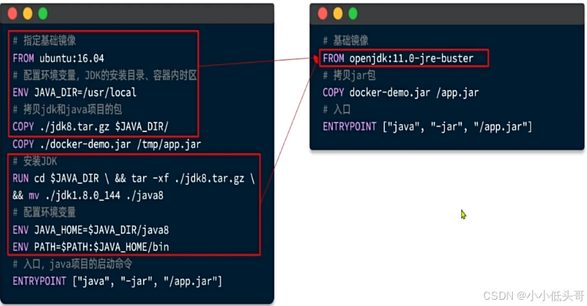

##### 2.3.3 构建镜像 

准备好了一个demo项目及对应的Dockerfile：

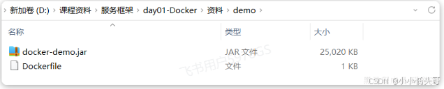

首先，我们将课前资料提供的`docker-demo.jar`包以及`Dockerfile`拷贝到虚拟机的`/root/demo`目录：

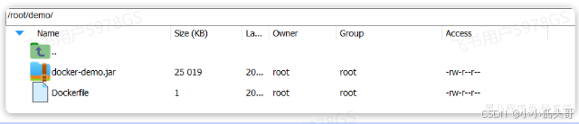

然后，执行命令，构建镜像：

当编写好Dockerfile，可以利用下面命令来构建镜像：

```bash
# 进入镜像目录
cd /root/demo
# 开始构建
docker build -t docker-demo:1.0 .
```

命令说明：

 *  `docker build`: 就是构建一个docker镜像
 *  `-t docker-demo:1.0` ：`-t`参数是指定镜像的名称（`repository`和`tag`）
 *  `.` : 最后的点是指构建时Dockerfile所在路径，由于我们进入了demo目录，所以指定的是`.`代表当前目录，也可以直接指定Dockerfile目录：
   
    ```java
    # 直接指定Dockerfile目录
    docker build -t docker-demo:1.0 /root/demo
    ```

查看镜像列表：

```java
# 查看镜像列表：
docker images
# 结果
REPOSITORY    TAG       IMAGE ID       CREATED          SIZE
docker-demo   1.0       d6ab0b9e64b9   27 minutes ago   327MB
nginx         latest    605c77e624dd   16 months ago    141MB
mysql         latest    3218b38490ce   17 months ago    516MB
```

然后尝试运行该镜像：

```java
# 1.创建并运行容器
docker run -d --name dd -p 8080:8080 docker-demo:1.0
# 2.查看容器
dps
# 结果
CONTAINER ID   IMAGE             PORTS                                                  STATUS         NAMES
78a000447b49   docker-demo:1.0   0.0.0.0:8080->8080/tcp, :::8090->8090/tcp              Up 2 seconds   dd
f63cfead8502   mysql             0.0.0.0:3306->3306/tcp, :::3306->3306/tcp, 33060/tcp   Up 2 hours     mysql

# 3.访问
curl localhost:8080/hello/count
# 结果：
<h5>欢迎访问黑马商城, 这是您第1次访问<h5>
```

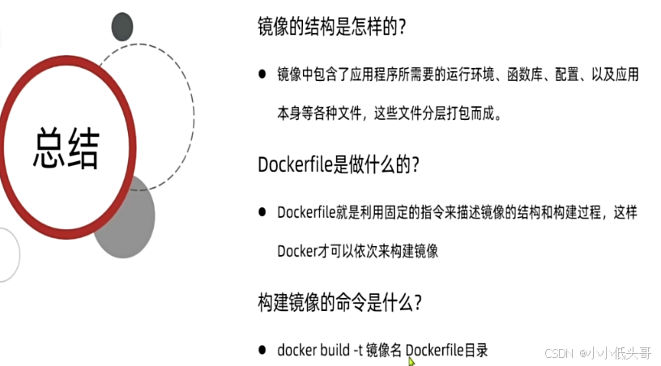

#### 2.4 容器网络 

之前用docker inspect 容器名 可以查看容器的详细信息，其中就包含网络信息，网络信息中包含自己的ip，mysql容器的详细信息如下图所示

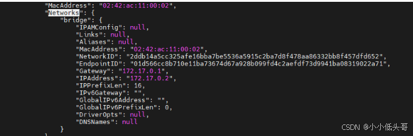

nginx容器的网络详细信息如下图所示

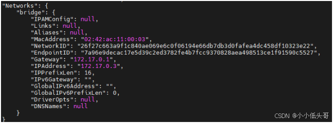

可以发现两个容器是处于一个网段当中的，也就是说它们之间可以相互访问的。

网络

默认情况下，所有容器都是以bridge方式连接到Docker的一个虚拟网桥上：

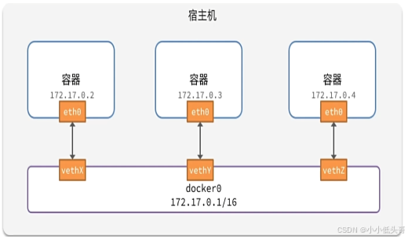

容器的网络IP其实是一个虚拟的IP，其值并不固定与某一个容器绑定，如果我们在开发时写死某个IP，而在部署时很可能MySQL容器的IP会发生变化，连接会失败。

所以，我们必须借助于docker的网络功能来解决这个问题，官方文档：

https://docs.docker.com/engine/reference/commandline/network/

加入自定义的网络的容器才可以通过容器名互相访问，Docker的常见网络操作命令有：

<table> 
 <thead> 
  <tr> 
   <th><strong>命令</strong></th> 
   <th><strong>说明</strong></th> 
   <th><strong>文档地址</strong></th> 
  </tr> 
 </thead> 
 <tbody> 
  <tr> 
   <td>docker network create</td> 
   <td>创建一个网络</td> 
   <td><a href="https://docs.docker.com/engine/reference/commandline/network_create/">docker network create</a></td> 
  </tr> 
  <tr> 
   <td>docker network ls</td> 
   <td>查看所有网络</td> 
   <td><a href="https://docs.docker.com/engine/reference/commandline/network_ls/">docs.docker.com</a></td> 
  </tr> 
  <tr> 
   <td>docker network rm</td> 
   <td>删除指定网络</td> 
   <td><a href="https://docs.docker.com/engine/reference/commandline/network_rm/">docs.docker.com</a></td> 
  </tr> 
  <tr> 
   <td>docker network prune</td> 
   <td>清除未使用的网络</td> 
   <td><a href="https://docs.docker.com/engine/reference/commandline/network_prune/">docs.docker.com</a></td> 
  </tr> 
  <tr> 
   <td>docker network connect</td> 
   <td>使指定容器连接加入某网络</td> 
   <td><a href="https://docs.docker.com/engine/reference/commandline/network_connect/">docs.docker.com</a></td> 
  </tr> 
  <tr> 
   <td>docker network disconnect</td> 
   <td>使指定容器连接离开某网络</td> 
   <td><a href="https://docs.docker.com/engine/reference/commandline/network_disconnect/">docker network disconnect</a></td> 
  </tr> 
  <tr> 
   <td>docker network inspect</td> 
   <td>查看网络详细信息</td> 
   <td><a href="https://docs.docker.com/engine/reference/commandline/network_inspect/">docker network inspect</a></td> 
  </tr> 
 </tbody> 
</table>

教学：自定义网络

```java
# 1.首先通过命令创建一个网络
docker network create hmall

# 2.然后查看网络
docker network ls
# 结果：
NETWORK ID     NAME      DRIVER    SCOPE
639bc44d0a87   bridge    bridge    local
403f16ec62a2   hmall     bridge    local
0dc0f72a0fbb   host      host      local
cd8d3e8df47b   none      null      local
# 其中，除了hmall以外，其它都是默认的网络

# 3.让dd和mysql都加入该网络，注意，在加入网络时可以通过--alias给容器起别名
# 这样该网络内的其它容器可以用别名互相访问！
# 3.1.mysql容器，指定别名为db，另外每一个容器都有一个别名是容器名
docker network connect hmall mysql --alias db
# 3.2.db容器，也就是我们的java项目
docker network connect hmall dd

# 4.进入dd容器，尝试利用别名访问db
# 4.1.进入容器
docker exec -it dd bash
# 4.2.用db别名访问
ping db
# 结果
PING db (172.18.0.2) 56(84) bytes of data.
64 bytes from mysql.hmall (172.18.0.2): icmp_seq=1 ttl=64 time=0.070 ms
64 bytes from mysql.hmall (172.18.0.2): icmp_seq=2 ttl=64 time=0.056 ms
# 4.3.用容器名访问
ping mysql
# 结果：
PING mysql (172.18.0.2) 56(84) bytes of data.
64 bytes from mysql.hmall (172.18.0.2): icmp_seq=1 ttl=64 time=0.044 ms
64 bytes from mysql.hmall (172.18.0.2): icmp_seq=2 ttl=64 time=0.054 ms
```

以下命令直接创建容器时就连接网络

只需要加入–network 参数即可

```java
docker run -d --name dd -p 8080:8080 --network heima docker-demo
```

不过一旦用network指定了，那么此容器就不会再有默认网络了，就制定为heima了

都存在了heima，就可以直接用容器名访问了。

### 3 项目部署 

#### 3.1 部署java项目 


在dev开发环境（也就是Docker部署时）采用了mysql作为地址，刚好是我们的mysql容器名，只要两者在一个网络，就一定能互相访问。

我们将项目打包：

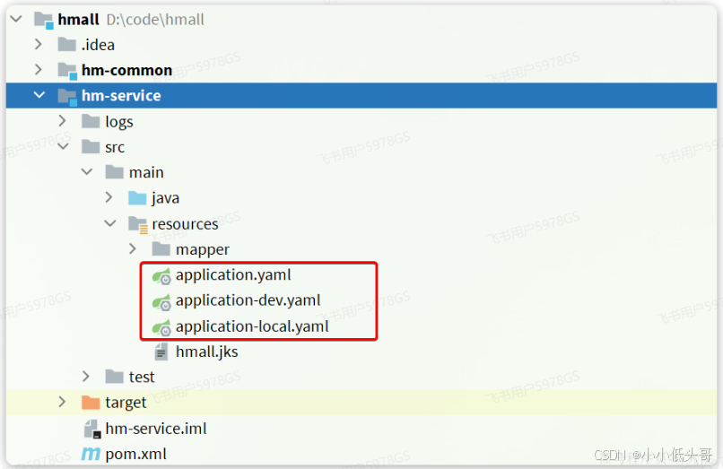

结果：

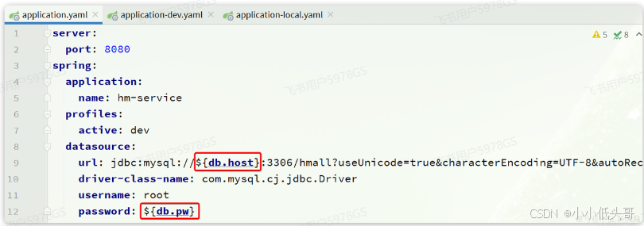

将`hm-service`目录下的`Dockerfile`和`hm-service/target`目录下的`hm-service.jar`一起上传到虚拟机的`root`目录：

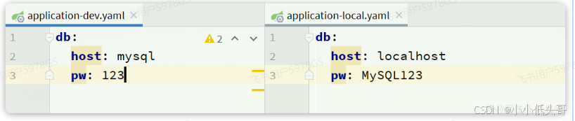

部署项目：

```shell
# 1.构建项目镜像，不指定tag，则默认为latest
docker build -t hmall .

# 2.查看镜像
docker images
# 结果
REPOSITORY    TAG       IMAGE ID       CREATED          SIZE
hmall         latest    0bb07b2c34b9   43 seconds ago   362MB
docker-demo   1.0       49743484da68   24 hours ago     327MB
nginx         latest    605c77e624dd   16 months ago    141MB
mysql         latest    3218b38490ce   17 months ago    516MB

# 3.创建并运行容器，并通过--network将其加入hmall网络，这样才能通过容器名访问mysql
docker run -d --name hmall --network hmall -p 8080:8080 hmall
```

测试，通过浏览器访问：http://你的虚拟机地址:8080/search/list

> 也就是部署一个项目：首先需要将项目打包，得到jar包，将Dockerfile文件与jar包一起放入到虚拟机中，再利用命令构建镜像，最后利用docker run部署应用，注意部署的宿主应用端口不要和别的容器重合了。

#### 3.2 部署前端 

然后创建nginx容器并完成两个挂载：

 *  把`/root/nginx/nginx.conf`挂载到`/etc/nginx/nginx.conf`
 *  把`/root/nginx/html`挂载到`/usr/share/nginx/html`

由于需要让nginx同时代理hmall-portal和hmall-admin两套前端资源，因此我们需要暴露两个端口：

 *  18080：对应hmall-portal
 *  18081：对应hmall-admin

命令如下：

```java
docker run -d \
  --name nginx \
  -p 18080:18080 \
  -p 18081:18081 \
  -v /root/nginx/html:/usr/share/nginx/html \
  -v /root/nginx/nginx.conf:/etc/nginx/nginx.conf \
  --network hmall \
  nginx
```

测试，通过浏览器访问：http://你的虚拟机ip:18080


#### 3.3 DockerCompose 

可以看到，我们部署一个简单的java项目，其中包含3个容器：

 *  MySQL
 *  Nginx
 *  Java项目

而稍微复杂的项目，其中还会有各种各样的其它中间件，需要部署的东西远不止3个。如果还像之前那样手动的逐一部署，就太麻烦了。

Docker Compose通过一个单独的docke-compose.yaml模板文件（YAML格式）来定义一组相关联的应用容器，帮助我们实现多个相互关联的Docker容器的快速部署

##### 3.3.1.基本语法 

docker-compose.yml文件的基本语法可以参考官方文档：

https://docs.docker.com/compose/compose-file/compose-file-v3/

docker-compose文件中可以定义多个相互关联的应用容器，每一个应用容器被称为一个服务（service）。由于service就是在定义某个应用的运行时参数，因此与`docker run`参数非常相似。

举例来说，用docker run部署MySQL的命令如下：

```java
docker run -d \
  --name mysql \
  -p 3306:3306 \
  -e TZ=Asia/Shanghai \
  -e MYSQL_ROOT_PASSWORD=123 \
  -v ./mysql/data:/var/lib/mysql \
  -v ./mysql/conf:/etc/mysql/conf.d \
  -v ./mysql/init:/docker-entrypoint-initdb.d \
  --network hmall
  mysql
```

如果用`docker-compose.yml`文件来定义，就是这样：

```java
version: "3.8"

services:
  mysql:
    image: mysql
    container_name: mysql
    ports:
      - "3306:3306"
    environment:
      TZ: Asia/Shanghai
      MYSQL_ROOT_PASSWORD: 123
    volumes:
      - "./mysql/conf:/etc/mysql/conf.d"
      - "./mysql/data:/var/lib/mysql"
    networks:
      - new
networks:
  new:
    name: hmall
```

对比如下：

<table> 
 <thead> 
  <tr> 
   <th><strong>docker run 参数</strong></th> 
   <th><strong>docker compose 指令</strong></th> 
   <th><strong>说明</strong></th> 
  </tr> 
 </thead> 
 <tbody> 
  <tr> 
   <td>–name</td> 
   <td>container_name</td> 
   <td>容器名称</td> 
  </tr> 
  <tr> 
   <td>-p</td> 
   <td>ports</td> 
   <td>端口映射</td> 
  </tr> 
  <tr> 
   <td>-e</td> 
   <td>environment</td> 
   <td>环境变量</td> 
  </tr> 
  <tr> 
   <td>-v</td> 
   <td>volumes</td> 
   <td>数据卷配置</td> 
  </tr> 
  <tr> 
   <td>–network</td> 
   <td>networks</td> 
   <td>网络</td> 
  </tr> 
 </tbody> 
</table>

明白了其中的对应关系，相信编写`docker-compose`文件应该难不倒大家。

黑马商城部署文件：

```java
version: "3.8"

services:
  mysql:
    image: mysql
    container_name: mysql
    ports:
      - "3306:3306"
    environment:
      TZ: Asia/Shanghai
      MYSQL_ROOT_PASSWORD: 123
    volumes:
      - "./mysql/conf:/etc/mysql/conf.d"
      - "./mysql/data:/var/lib/mysql"
      - "./mysql/init:/docker-entrypoint-initdb.d"
    networks:
      - hm-net
  hmall:
    build: 
      context: .
      dockerfile: Dockerfile
    container_name: hmall
    ports:
      - "8080:8080"
    networks:
      - hm-net
    depends_on:
      - mysql
  nginx:
    image: nginx
    container_name: nginx
    ports:
      - "18080:18080"
      - "18081:18081"
    volumes:
      - "./nginx/nginx.conf:/etc/nginx/nginx.conf"
      - "./nginx/html:/usr/share/nginx/html"
    depends_on:
      - hmall
    networks:
      - hm-net
networks:
  hm-net:
    name: hmall
```

##### 3.3.2.基础命令 

编写好docker-compose.yml文件，就可以部署项目了。常见的命令：

https://docs.docker.com/compose/reference/

基本语法如下：

```java
docker compose [OPTIONS] [COMMAND]
```

其中，OPTIONS和COMMAND都是可选参数，比较常见的有：

<table> 
 <thead> 
  <tr> 
   <th><strong>类型</strong></th> 
   <th><strong>参数或指令</strong></th> 
   <th><strong>说明</strong></th> 
  </tr> 
 </thead> 
 <tbody> 
  <tr> 
   <td>Options</td> 
   <td>-f</td> 
   <td>指定compose文件的路径和名称</td> 
  </tr> 
  <tr> 
   <td>-p</td> 
   <td>指定project名称。project就是当前compose文件中设置的多个service的集合，是逻辑概念</td> 
   <td></td> 
  </tr> 
  <tr> 
   <td>Commands</td> 
   <td>up</td> 
   <td>创建并启动所有service容器</td> 
  </tr> 
  <tr> 
   <td>down</td> 
   <td>停止并移除所有容器、网络</td> 
   <td></td> 
  </tr> 
  <tr> 
   <td>ps</td> 
   <td>列出所有启动的容器</td> 
   <td></td> 
  </tr> 
  <tr> 
   <td>logs</td> 
   <td>查看指定容器的日志</td> 
   <td></td> 
  </tr> 
  <tr> 
   <td>stop</td> 
   <td>停止容器</td> 
   <td></td> 
  </tr> 
  <tr> 
   <td>start</td> 
   <td>启动容器</td> 
   <td></td> 
  </tr> 
  <tr> 
   <td>restart</td> 
   <td>重启容器</td> 
   <td></td> 
  </tr> 
  <tr> 
   <td>top</td> 
   <td>查看运行的进程</td> 
   <td></td> 
  </tr> 
  <tr> 
   <td>exec</td> 
   <td>在指定的运行中容器中执行命令</td> 
   <td></td> 
  </tr> 
 </tbody> 
</table>

教学演示：

```java
# 1.进入root目录
cd /root

# 2.删除旧容器
docker rm -f $(docker ps -qa)

# 3.删除hmall镜像
docker rmi hmall

# 4.清空MySQL数据
rm -rf mysql/data

# 5.启动所有, -d 参数是后台启动
docker compose up -d
# 结果：
[+] Building 15.5s (8/8) FINISHED
 => [internal] load build definition from Dockerfile                                    0.0s
 => => transferring dockerfile: 358B                                                    0.0s
 => [internal] load .dockerignore                                                       0.0s
 => => transferring context: 2B                                                         0.0s
 => [internal] load metadata for docker.io/library/openjdk:11.0-jre-buster             15.4s
 => [1/3] FROM docker.io/library/openjdk:11.0-jre-buster@sha256:3546a17e6fb4ff4fa681c3  0.0s
 => [internal] load build context                                                       0.0s
 => => transferring context: 98B                                                        0.0s
 => CACHED [2/3] RUN ln -snf /usr/share/zoneinfo/Asia/Shanghai /etc/localtime && echo   0.0s
 => CACHED [3/3] COPY hm-service.jar /app.jar                                           0.0s
 => exporting to image                                                                  0.0s
 => => exporting layers                                                                 0.0s
 => => writing image sha256:32eebee16acde22550232f2eb80c69d2ce813ed099640e4cfed2193f71  0.0s
 => => naming to docker.io/library/root-hmall                                           0.0s
[+] Running 4/4
 ✔ Network hmall    Created                                                             0.2s
 ✔ Container mysql  Started                                                             0.5s
 ✔ Container hmall  Started                                                             0.9s
 ✔ Container nginx  Started                                                             1.5s

# 6.查看镜像
docker compose images
# 结果
CONTAINER           REPOSITORY          TAG                 IMAGE ID            SIZE
hmall               root-hmall          latest              32eebee16acd        362MB
mysql               mysql               latest              3218b38490ce        516MB
nginx               nginx               latest              605c77e624dd        141MB

# 7.查看容器
docker compose ps
# 结果  
NAME                IMAGE               COMMAND                  SERVICE             CREATED             STATUS              PORTS
hmall               root-hmall          "java -jar /app.jar"     hmall               54 seconds ago      Up 52 seconds       0.0.0.0:8080->8080/tcp, :::8080->8080/tcp
mysql               mysql               "docker-entrypoint.s…"   mysql               54 seconds ago      Up 53 seconds       0.0.0.0:3306->3306/tcp, :::3306->3306/tcp, 33060/tcp
nginx               nginx               "/docker-entrypoint.…"   nginx               54 seconds ago      Up 52 seconds       80/tcp, 0.0.0.0:18080-18081->18080-18081/tcp, :::18080-18081->18080-18081/tcp
```

打开浏览器，访问：http://yourIp:8080


[Docker]: #Docker_0
[1]: #1__2
[1.1 _MySQL]: #11_MySQL_4
[1.2]: #12__34
[2 Docker]: #2_Docker_73
[2.1]: #21__75
[2.2]: #22__165
[2.2.1]: #221__176
[2.2.2]: #222__211
[2.2.3]: #223__227
[2.3]: #23__344
[2.3.1]: #231__351
[2.3.2 Dockerfile]: #232_Dockerfile_364
[2.3.3]: #233__410
[2.4]: #24__479
[3]: #3__570
[3.1 _java]: #31_java_572
[3.2]: #32__617
[3.3 DockerCompose]: #33_DockerCompose_647
[3.3.1.]: #331_659
[3.3.2.]: #332_767
[Docker Hub Container Image Library _ App Containerization]: https://hub.docker.com/