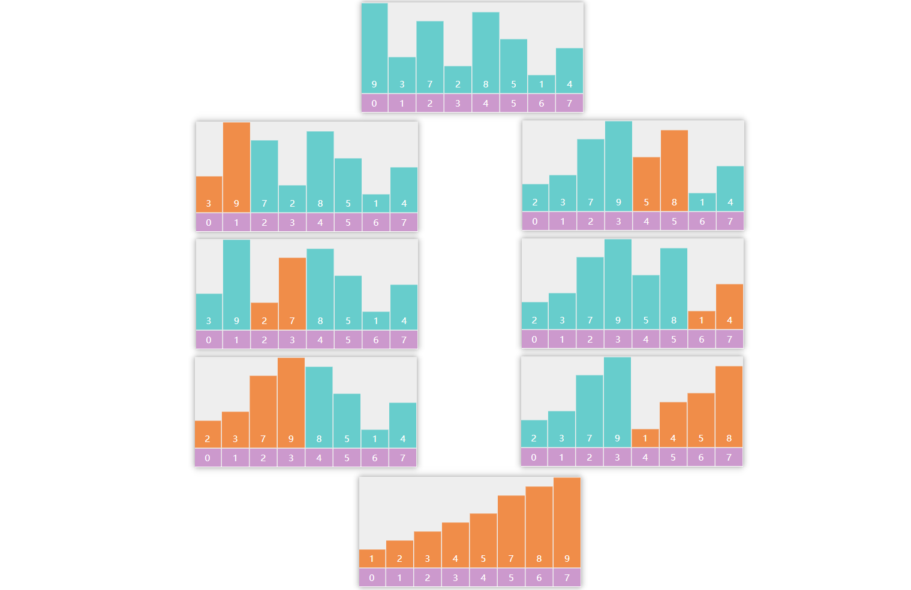

# 四. 高级数据结构与算法设计

## 4.1 图

### 1) 概念

图是由顶点（vertex）和边（edge）组成的数据结构，例如


该图有四个顶点：A、B、C、D 以及四条有向边，有向图中，边是单向的

#### 有向 vs 无向

如果是无向图，那么边是双向的，下面是一个无向图的例子


#### 度

**度**是指与该顶点相邻的边的数量


例如上图中

* A、B、C、E、F 这几个顶点度数为 2
* D 顶点度数为 4


有向图中，细分为**入度**和**出度**，参见下图


* A (2 out / 0 in)
* B、C、E (1 out / 1 in)
* D (2 out / 2 in)
* F (0 out / 2 in)


#### 权

边可以有权重，代表从源顶点到目标顶点的距离、费用、时间或其他度量。


#### 路径

路径被定义为从一个顶点到另一个顶点的一系列连续边，例如上图中【北京】到【上海】有多条路径

* 北京 - 上海
* 北京 - 武汉 - 上海

路径长度

* 不考虑权重，长度就是边的数量
* 考虑权重，一般就是权重累加


#### 环

在有向图中，从一个顶点开始，可以通过若干条有向边返回到该顶点，那么就形成了一个环


#### 图的连通性

如果两个顶点之间存在路径，则这两个顶点是连通的，所有顶点都连通，则该图被称之为连通图，若子图连通，则称为连通分量


### 2) 图的表示

比如说，下面的图


用**邻接矩阵**可以表示为：

```
  A B C D
A 0 1 1 0
B 1 0 0 1 
C 1 0 0 1
D 0 1 1 0
```

用**邻接表**可以表示为：

```
A -> B -> C
B -> A -> D
C -> A -> D
D -> B -> C
```

有向图的例子


```
  A B C D
A 0 1 1 0
B 0 0 0 1
C 0 0 0 1
D 0 0 0 0
```

```
A - B - C
B - D
C - D
D - empty
```


### 3) Java 表示

顶点

```java
public class Vertex {
    String name;
    List<Edge> edges;
    
    // 拓扑排序相关
    int inDegree;
    int status; // 状态 0-未访问 1-访问中 2-访问过，用在拓扑排序

    // dfs, bfs 相关
    boolean visited;

    // 求解最短距离相关
    private static final int INF = Integer.MAX_VALUE;
    int dist = INF;
    Vertex prev = null;
}
```

边

```java
public class Edge {

    Vertex linked;
    int weight;

    public Edge(Vertex linked) {
        this(linked, 1);
    }

    public Edge(Vertex linked, int weight) {
        this.linked = linked;
        this.weight = weight;
    }
}
```


### 4) DFS

```java
public class Dfs {
    public static void main(String[] args) {
        Vertex v1 = new Vertex("v1");
        Vertex v2 = new Vertex("v2");
        Vertex v3 = new Vertex("v3");
        Vertex v4 = new Vertex("v4");
        Vertex v5 = new Vertex("v5");
        Vertex v6 = new Vertex("v6");

        v1.edges = List.of(new Edge(v3), new Edge(v2), new Edge(v6));
        v2.edges = List.of(new Edge(v4));
        v3.edges = List.of(new Edge(v4), new Edge(v6));
        v4.edges = List.of(new Edge(v5));
        v5.edges = List.of();
        v6.edges = List.of(new Edge(v5));

        dfs1(v1);
    }

    private static void dfs2(Vertex v) {
        LinkedList<Vertex> stack = new LinkedList<>();
        stack.push(v);
        while (!stack.isEmpty()) {
            Vertex pop = stack.pop();
            pop.visited = true;
            System.out.println(pop.name);
            for (Edge edge : pop.edges) {
                if (!edge.linked.visited) {
                    stack.push(edge.linked);
                }
            }
        }
    }

    private static void dfs1(Vertex v) {
        v.visited = true;
        System.out.println(v.name);
        for (Edge edge : v.edges) {
            if (!edge.linked.visited) {
                dfs(edge.linked);
            }
        }
    }
}
```


### 5) BFS

```java
public class Bfs {
    public static void main(String[] args) {
        Vertex v1 = new Vertex("v1");
        Vertex v2 = new Vertex("v2");
        Vertex v3 = new Vertex("v3");
        Vertex v4 = new Vertex("v4");
        Vertex v5 = new Vertex("v5");
        Vertex v6 = new Vertex("v6");

        v1.edges = List.of(new Edge(v3), new Edge(v2), new Edge(v6));
        v2.edges = List.of(new Edge(v4));
        v3.edges = List.of(new Edge(v4), new Edge(v6));
        v4.edges = List.of(new Edge(v5));
        v5.edges = List.of();
        v6.edges = List.of(new Edge(v5));

        bfs(v1);
    }

    private static void bfs(Vertex v) {
        LinkedList<Vertex> queue = new LinkedList<>();
        v.visited = true;
        queue.offer(v);
        while (!queue.isEmpty()) {
            Vertex poll = queue.poll();
            System.out.println(poll.name);
            for (Edge edge : poll.edges) {
                if (!edge.linked.visited) {
                    edge.linked.visited = true;
                    queue.offer(edge.linked);
                }
            }
        }
    }
}
```


### 6) 拓扑排序


#### Kahn

```java
public class TopologicalSort {
    public static void main(String[] args) {
        Vertex v1 = new Vertex("网页基础");
        Vertex v2 = new Vertex("Java基础");
        Vertex v3 = new Vertex("JavaWeb");
        Vertex v4 = new Vertex("Spring框架");
        Vertex v5 = new Vertex("微服务框架");
        Vertex v6 = new Vertex("数据库");
        Vertex v7 = new Vertex("实战项目");

        v1.edges = List.of(new Edge(v3)); // +1
        v2.edges = List.of(new Edge(v3)); // +1
        v3.edges = List.of(new Edge(v4));
        v6.edges = List.of(new Edge(v4));
        v4.edges = List.of(new Edge(v5));
        v5.edges = List.of(new Edge(v7));
        v7.edges = List.of();

        List<Vertex> graph = List.of(v1, v2, v3, v4, v5, v6, v7);
        // 1. 统计每个顶点的入度
        for (Vertex v : graph) {
            for (Edge edge : v.edges) {
                edge.linked.inDegree++;
            }
        }
        /*for (Vertex vertex : graph) {
            System.out.println(vertex.name + " " + vertex.inDegree);
        }*/
        // 2. 将入度为0的顶点加入队列
        LinkedList<Vertex> queue = new LinkedList<>();
        for (Vertex v : graph) {
            if (v.inDegree == 0) {
                queue.offer(v);
            }
        }
        // 3. 队列中不断移除顶点，每移除一个顶点，把它相邻顶点入度减1，若减到0则入队
        List<String> result = new ArrayList<>();
        while (!queue.isEmpty()) {
            Vertex poll = queue.poll();
//            System.out.println(poll.name);
            result.add(poll.name);
            for (Edge edge : poll.edges) {
                edge.linked.inDegree--;
                if (edge.linked.inDegree == 0) {
                    queue.offer(edge.linked);
                }
            }
        }
        if (result.size() != graph.size()) {
            System.out.println("出现环");
        } else {
            for (String key : result) {
                System.out.println(key);
            }
        }
    }
}
```


#### DFS

```java
public class TopologicalSortDFS {

    public static void main(String[] args) {
        Vertex v1 = new Vertex("网页基础");
        Vertex v2 = new Vertex("Java基础");
        Vertex v3 = new Vertex("JavaWeb");
        Vertex v4 = new Vertex("Spring框架");
        Vertex v5 = new Vertex("微服务框架");
        Vertex v6 = new Vertex("数据库");
        Vertex v7 = new Vertex("实战项目");

        v1.edges = List.of(new Edge(v3));
        v2.edges = List.of(new Edge(v3));
        v3.edges = List.of(new Edge(v4));
        v6.edges = List.of(new Edge(v4));
        v4.edges = List.of(new Edge(v5));
        v5.edges = List.of(new Edge(v7));
        v7.edges = List.of();

        List<Vertex> graph = List.of(v1, v2, v3, v4, v5, v6, v7);
        LinkedList<String> result = new LinkedList<>();
        for (Vertex v : graph) {
            if(v.status==0) {
                dfs(v, result);
            }
        }
        System.out.println(result);
    }

    private static void dfs(Vertex v, LinkedList<String> result) {
        if (v.status == 2) {
            return;
        }
        if (v.status == 1) {
            throw new RuntimeException("发现环");
        }
        v.status = 1;
        for (Edge edge : v.edges) {
            dfs(edge.linked, result);
        }
        v.status = 2;
        result.push(v.name);
    }
}
```


### 7) 最短路径

#### Dijkstra


**Edsger Wybe Dijkstra**

> 艾兹格·维布·迪克斯特拉（Edsger Wybe Dijkstra，/ˈdaɪkstrə/ DYKE-strə；荷兰语：[ˈɛtsxər ˈʋibə ˈdɛikstra] 1930年5月11日-2002年8月6日）是一位荷兰计算机科学家、程序员、软件工程师、系统科学家和科学散文家。他因对开发结构化编程语言做出的基础贡献而获得了1972年的图灵奖，并担任德克萨斯大学奥斯汀分校的斯伦贝谢百年计算机科学主席，任职时间从1984年到2000年。在他于2002年去世前不久，他因其在程序计算的自稳定性方面的工作而获得了ACM PODC分布式计算有影响力论文奖。为了纪念他，该年度奖项在接下来的一年更名为迪克斯特拉奖。
>
> 迪克斯特拉在计算机科学领域的贡献
>
> 1. 最短路径算法，也称为迪克斯特拉算法，现代计算机科学本科课程中广泛教授
> 2. Shunting yard算法
> 3. THE OS 操作系统
> 4. 银行家算法
> 5. 用于协调多个处理器和程序的信号量构造
> 6. 在分布式计算领域提出概念：自稳定性


算法描述：

1. 将所有顶点标记为未访问。创建一个未访问顶点的集合。
2. 为每个顶点分配一个临时距离值
   * 对于我们的初始顶点，将其设置为零
   * 对于所有其他顶点，将其设置为无穷大。
3. 每次选择最小临时距离的未访问顶点，作为新的当前顶点
4. 对于当前顶点，遍历其所有未访问的邻居，并更新它们的临时距离为更小
   * 例如，1->6 的距离是 14，而1->3->6 的距离是11。这时将距离更新为 11
   * 否则，将保留上次距离值
5. 当前顶点的邻居处理完成后，把它从未访问集合中删除

```java
public class Dijkstra {
    public static void main(String[] args) {
        Vertex v1 = new Vertex("v1");
        Vertex v2 = new Vertex("v2");
        Vertex v3 = new Vertex("v3");
        Vertex v4 = new Vertex("v4");
        Vertex v5 = new Vertex("v5");
        Vertex v6 = new Vertex("v6");

        v1.edges = List.of(new Edge(v3, 9), new Edge(v2, 7), new Edge(v6, 14));
        v2.edges = List.of(new Edge(v4, 15));
        v3.edges = List.of(new Edge(v4, 11), new Edge(v6, 2));
        v4.edges = List.of(new Edge(v5, 6));
        v5.edges = List.of();
        v6.edges = List.of(new Edge(v5, 9));

        List<Vertex> graph = List.of(v1, v2, v3, v4, v5, v6);

        dijkstra(graph, v1);
    }

    private static void dijkstra(List<Vertex> graph, Vertex source) {
        ArrayList<Vertex> list = new ArrayList<>(graph);
        source.dist = 0;

        while (!list.isEmpty()) {
            // 3. 选取当前顶点
            Vertex curr = chooseMinDistVertex(list);
            // 4. 更新当前顶点邻居距离
            updateNeighboursDist(curr, list);
            // 5. 移除当前顶点
            list.remove(curr);
        }

        for (Vertex v : graph) {
            System.out.println(v.name + " " + v.dist);
        }
    }

    private static void updateNeighboursDist(Vertex curr, ArrayList<Vertex> list) {
        for (Edge edge : curr.edges) {
            Vertex n = edge.linked;
            if (list.contains(n)) {
                int dist = curr.dist + edge.weight;
                if (dist < n.dist) {
                    n.dist = dist;
                }
            }
        }
    }

    private static Vertex chooseMinDistVertex(ArrayList<Vertex> list) {
        Vertex min = list.get(0);
        for (int i = 1; i < list.size(); i++) {
            if (list.get(i).dist < min.dist) {
                min = list.get(i);
            }
        }
        return min;
    }

}
```


改进 - 优先级队列

1. 创建一个优先级队列，放入所有顶点（队列大小会达到边的数量）
2. 为每个顶点分配一个临时距离值
   * 对于我们的初始顶点，将其设置为零
   * 对于所有其他顶点，将其设置为无穷大。
3. 每次选择最小临时距离的未访问顶点，作为新的当前顶点
4. 对于当前顶点，遍历其所有未访问的邻居，并更新它们的临时距离为更小，若距离更新需加入队列
   * 例如，1->6 的距离是 14，而1->3->6 的距离是11。这时将距离更新为 11
   * 否则，将保留上次距离值
5. 当前顶点的邻居处理完成后，把它从队列中删除

```java
public class DijkstraPriorityQueue {
    public static void main(String[] args) {
        Vertex v1 = new Vertex("v1");
        Vertex v2 = new Vertex("v2");
        Vertex v3 = new Vertex("v3");
        Vertex v4 = new Vertex("v4");
        Vertex v5 = new Vertex("v5");
        Vertex v6 = new Vertex("v6");

        v1.edges = List.of(new Edge(v3, 9), new Edge(v2, 7), new Edge(v6, 14));
        v2.edges = List.of(new Edge(v4, 15));
        v3.edges = List.of(new Edge(v4, 11), new Edge(v6, 2));
        v4.edges = List.of(new Edge(v5, 6));
        v5.edges = List.of();
        v6.edges = List.of(new Edge(v5, 9));

        List<Vertex> graph = List.of(v1, v2, v3, v4, v5, v6);

        dijkstra(graph, v1);
    }

    private static void dijkstra(List<Vertex> graph, Vertex source) {
        PriorityQueue<Vertex> queue = new PriorityQueue<>(Comparator.comparingInt(v -> v.dist));
        source.dist = 0;
        for (Vertex v : graph) {
            queue.offer(v);
        }

        while (!queue.isEmpty()) {
            System.out.println(queue);
            // 3. 选取当前顶点
            Vertex curr = queue.peek();
            // 4. 更新当前顶点邻居距离
            if(!curr.visited) {
                updateNeighboursDist(curr, queue);
                curr.visited = true;
            }
            // 5. 移除当前顶点
            queue.poll();
        }

        for (Vertex v : graph) {
            System.out.println(v.name + " " + v.dist + " " + (v.prev != null ? v.prev.name : "null"));
        }
    }

    private static void updateNeighboursDist(Vertex curr, PriorityQueue<Vertex> queue) {
        for (Edge edge : curr.edges) {
            Vertex n = edge.linked;
            if (!n.visited) {
                int dist = curr.dist + edge.weight;
                if (dist < n.dist) {
                    n.dist = dist;
                    n.prev = curr;
                    queue.offer(n);
                }
            }
        }
    }

}
```


**问题**


按照 Dijkstra 算法，得出

* v1 -> v2 最短距离2
* v1 -> v3 最短距离1
* v1 -> v4 最短距离2

事实应当是

* v1 -> v2 最短距离2
* v1 -> v3 最短距离0
* v1 -> v4 最短距离1


#### Bellman-Ford

```java
public class BellmanFord {
    public static void main(String[] args) {
        // 正常情况
        /*Vertex v1 = new Vertex("v1");
        Vertex v2 = new Vertex("v2");
        Vertex v3 = new Vertex("v3");
        Vertex v4 = new Vertex("v4");
        Vertex v5 = new Vertex("v5");
        Vertex v6 = new Vertex("v6");

        v1.edges = List.of(new Edge(v3, 9), new Edge(v2, 7), new Edge(v6, 14));
        v2.edges = List.of(new Edge(v4, 15));
        v3.edges = List.of(new Edge(v4, 11), new Edge(v6, 2));
        v4.edges = List.of(new Edge(v5, 6));
        v5.edges = List.of();
        v6.edges = List.of(new Edge(v5, 9));

        List<Vertex> graph = List.of(v4, v5, v6, v1, v2, v3);*/

        // 负边情况
        /*Vertex v1 = new Vertex("v1");
        Vertex v2 = new Vertex("v2");
        Vertex v3 = new Vertex("v3");
        Vertex v4 = new Vertex("v4");

        v1.edges = List.of(new Edge(v2, 2), new Edge(v3, 1));
        v2.edges = List.of(new Edge(v3, -2));
        v3.edges = List.of(new Edge(v4, 1));
        v4.edges = List.of();
        List<Vertex> graph = List.of(v1, v2, v3, v4);*/

        // 负环情况
        Vertex v1 = new Vertex("v1");
        Vertex v2 = new Vertex("v2");
        Vertex v3 = new Vertex("v3");
        Vertex v4 = new Vertex("v4");

        v1.edges = List.of(new Edge(v2, 2));
        v2.edges = List.of(new Edge(v3, -4));
        v3.edges = List.of(new Edge(v4, 1), new Edge(v1, 1));
        v4.edges = List.of();
        List<Vertex> graph = List.of(v1, v2, v3, v4);

        bellmanFord(graph, v1);
    }

    private static void bellmanFord(List<Vertex> graph, Vertex source) {
        source.dist = 0;
        int size = graph.size();
        // 1. 进行 顶点个数 - 1 轮处理
        for (int i = 0; i < size - 1; i++) {
            // 2. 遍历所有的边
            for (Vertex s : graph) {
                for (Edge edge : s.edges) {
                    // 3. 处理每一条边
                    Vertex e = edge.linked;
                    if (s.dist != Integer.MAX_VALUE && s.dist + edge.weight < e.dist) {
                        e.dist = s.dist + edge.weight;
                        e.prev = s;
                    }
                }
            }
        }
        for (Vertex v : graph) {
            System.out.println(v + " " + (v.prev != null ? v.prev.name : "null"));
        }
    }
}
```


**负环**


如果在【顶点-1】轮处理完成后，还能继续找到更短距离，表示发现了负环


#### Floyd-Warshall


```java
public class FloydWarshall {
    public static void main(String[] args) {
        Vertex v1 = new Vertex("v1");
        Vertex v2 = new Vertex("v2");
        Vertex v3 = new Vertex("v3");
        Vertex v4 = new Vertex("v4");

        v1.edges = List.of(new Edge(v3, -2));
        v2.edges = List.of(new Edge(v1, 4), new Edge(v3, 3));
        v3.edges = List.of(new Edge(v4, 2));
        v4.edges = List.of(new Edge(v2, -1));
        List<Vertex> graph = List.of(v1, v2, v3, v4);

        /*
                直接连通
                v1  v2  v3  v4
            v1  0   ∞   -2  ∞
            v2  4   0   3   ∞
            v3  ∞   ∞   0   2
            v4  ∞   -1  ∞   0

                k=0 借助v1到达其它顶点
                v1  v2  v3  v4
            v1  0   ∞   -2  ∞
            v2  4   0   2   ∞
            v3  ∞   ∞   0   2
            v4  ∞   -1  ∞   0

                k=1 借助v2到达其它顶点
                v1  v2  v3  v4
            v1  0   ∞   -2  ∞
            v2  4   0   2   ∞
            v3  ∞   ∞   0   2
            v4  3   -1  1   0

                k=2 借助v3到达其它顶点
                v1  v2  v3  v4
            v1  0   ∞   -2  0
            v2  4   0   2   4
            v3  ∞   ∞   0   2
            v4  3   -1  1   0

                k=3 借助v4到达其它顶点
                v1  v2  v3  v4
            v1  0   -1   -2  0
            v2  4   0   2   4
            v3  5   1   0   2
            v4  3   -1  1   0
         */
        floydWarshall(graph);
    }

    static void floydWarshall(List<Vertex> graph) {
        int size = graph.size();
        int[][] dist = new int[size][size];
        Vertex[][] prev = new Vertex[size][size];
        // 1）初始化
        for (int i = 0; i < size; i++) {
            Vertex v = graph.get(i); // v1 (v3)
            Map<Vertex, Integer> map = v.edges.stream().collect(Collectors.toMap(e -> e.linked, e -> e.weight));
            for (int j = 0; j < size; j++) {
                Vertex u = graph.get(j); // v3
                if (v == u) {
                    dist[i][j] = 0;
                } else {
                    dist[i][j] = map.getOrDefault(u, Integer.MAX_VALUE);
                    prev[i][j] = map.get(u) != null ? v : null;
                }
            }
        }
        print(prev);
        // 2）看能否借路到达其它顶点
        /*
            v2->v1          v1->v?
            dist[1][0]   +   dist[0][0]
            dist[1][0]   +   dist[0][1]
            dist[1][0]   +   dist[0][2]
            dist[1][0]   +   dist[0][3]
         */
        for (int k = 0; k < size; k++) {
            for (int i = 0; i < size; i++) {
                for (int j = 0; j < size; j++) {
//                    dist[i][k]   +   dist[k][j] // i行的顶点，借助k顶点，到达j列顶点
//                    dist[i][j]                  // i行顶点，直接到达j列顶点
                    if (dist[i][k] != Integer.MAX_VALUE &&
                            dist[k][j] != Integer.MAX_VALUE &&
                            dist[i][k] + dist[k][j] < dist[i][j]) {
                        dist[i][j] = dist[i][k] + dist[k][j];
                        prev[i][j] = prev[k][j];
                    }
                }
            }
//            print(dist);
        }
        print(prev);
    }

    static void path(Vertex[][] prev, List<Vertex> graph, int i, int j) {
        LinkedList<String> stack = new LinkedList<>();
        System.out.print("[" + graph.get(i).name + "," + graph.get(j).name + "] ");
        stack.push(graph.get(j).name);
        while (i != j) {
            Vertex p = prev[i][j];
            stack.push(p.name);
            j = graph.indexOf(p);
        }
        System.out.println(stack);
    }

    static void print(int[][] dist) {
        System.out.println("-------------");
        for (int[] row : dist) {
            System.out.println(Arrays.stream(row).boxed()
                    .map(x -> x == Integer.MAX_VALUE ? "∞" : String.valueOf(x))
                    .map(s -> String.format("%2s", s))
                    .collect(Collectors.joining(",", "[", "]")));
        }
    }

    static void print(Vertex[][] prev) {
        System.out.println("-------------------------");
        for (Vertex[] row : prev) {
            System.out.println(Arrays.stream(row).map(v -> v == null ? "null" : v.name)
                    .map(s -> String.format("%5s", s))
                    .collect(Collectors.joining(",", "[", "]")));
        }
    }

}
```


**负环**

如果在 3 层循环结束后，在 dist 数组的对角线处（i==j 处）发现了负数，表示出现了负环


### 8) 最小生成树

#### Prim

```java
public class Prim {
    public static void main(String[] args) {
        Vertex v1 = new Vertex("v1");
        Vertex v2 = new Vertex("v2");
        Vertex v3 = new Vertex("v3");
        Vertex v4 = new Vertex("v4");
        Vertex v5 = new Vertex("v5");
        Vertex v6 = new Vertex("v6");
        Vertex v7 = new Vertex("v7");

        v1.edges = List.of(new Edge(v2, 2), new Edge(v3, 4), new Edge(v4, 1));
        v2.edges = List.of(new Edge(v1, 2), new Edge(v4, 3), new Edge(v5, 10));
        v3.edges = List.of(new Edge(v1, 4), new Edge(v4, 2), new Edge(v6, 5));
        v4.edges = List.of(new Edge(v1, 1), new Edge(v2, 3), new Edge(v3, 2),
                new Edge(v5, 7), new Edge(v6, 8), new Edge(v7, 4));
        v5.edges = List.of(new Edge(v2, 10), new Edge(v4, 7), new Edge(v7, 6));
        v6.edges = List.of(new Edge(v3, 5), new Edge(v4, 8), new Edge(v7, 1));
        v7.edges = List.of(new Edge(v4, 4), new Edge(v5, 6), new Edge(v6, 1));

        List<Vertex> graph = List.of(v1, v2, v3, v4, v5, v6, v7);

        prim(graph, v1);

    }

    static void prim(List<Vertex> graph, Vertex source) {
        ArrayList<Vertex> list = new ArrayList<>(graph);
        source.dist = 0;

        while (!list.isEmpty()) {
            Vertex min = chooseMinDistVertex(list);
            updateNeighboursDist(min);
            list.remove(min);
            min.visited = true;
            System.out.println("---------------");
            for (Vertex v : graph) {
                System.out.println(v);
            }
        }


    }

    private static void updateNeighboursDist(Vertex curr) {
        for (Edge edge : curr.edges) {
            Vertex n = edge.linked;
            if (!n.visited) {
                int dist = edge.weight;
                if (dist < n.dist) {
                    n.dist = dist;
                    n.prev = curr;
                }
            }
        }
    }

    private static Vertex chooseMinDistVertex(ArrayList<Vertex> list) {
        Vertex min = list.get(0);
        for (int i = 1; i < list.size(); i++) {
            if (list.get(i).dist < min.dist) {
                min = list.get(i);
            }
        }
        return min;
    }
}
```


#### Kruskal

```java
public class Kruskal {
    static class Edge implements Comparable<Edge> {
        List<Vertex> vertices;
        int start;
        int end;
        int weight;

        public Edge(List<Vertex> vertices, int start, int end, int weight) {
            this.vertices = vertices;
            this.start = start;
            this.end = end;
            this.weight = weight;
        }

        public Edge(int start, int end, int weight) {
            this.start = start;
            this.end = end;
            this.weight = weight;
        }

        @Override
        public int compareTo(Edge o) {
            return Integer.compare(this.weight, o.weight);
        }

        @Override
        public String toString() {
            return vertices.get(start).name + "<->" + vertices.get(end).name + "(" + weight + ")";
        }
    }

    public static void main(String[] args) {
        Vertex v1 = new Vertex("v1");
        Vertex v2 = new Vertex("v2");
        Vertex v3 = new Vertex("v3");
        Vertex v4 = new Vertex("v4");
        Vertex v5 = new Vertex("v5");
        Vertex v6 = new Vertex("v6");
        Vertex v7 = new Vertex("v7");

        List<Vertex> vertices = List.of(v1, v2, v3, v4, v5, v6, v7);
        PriorityQueue<Edge> queue = new PriorityQueue<>(List.of(
                new Edge(vertices,0, 1, 2),
                new Edge(vertices,0, 2, 4),
                new Edge(vertices,0, 3, 1),
                new Edge(vertices,1, 3, 3),
                new Edge(vertices,1, 4, 10),
                new Edge(vertices,2, 3, 2),
                new Edge(vertices,2, 5, 5),
                new Edge(vertices,3, 4, 7),
                new Edge(vertices,3, 5, 8),
                new Edge(vertices,3, 6, 4),
                new Edge(vertices,4, 6, 6),
                new Edge(vertices,5, 6, 1)
        ));

        kruskal(vertices.size(), queue);
    }

    static void kruskal(int size, PriorityQueue<Edge> queue) {
        List<Edge> result = new ArrayList<>();
        DisjointSet set = new DisjointSet(size);
        while (result.size() < size - 1) {
            Edge poll = queue.poll();
            int s = set.find(poll.start);
            int e = set.find(poll.end);
            if (s != e) {
                result.add(poll);
                set.union(s, e);
            }
        }

        for (Edge edge : result) {
            System.out.println(edge);
        }
    }
}
```


### 9) 不相交集合（并查集合）

#### 基础

```java
public class DisjointSet {
    int[] s;
    // 索引对应顶点
    // 元素是用来表示与之有关系的顶点
    /*
        索引  0  1  2  3  4  5  6
        元素 [0, 1, 2, 3, 4, 5, 6] 表示一开始顶点直接没有联系（只与自己有联系）

    */

    public DisjointSet(int size) {
        s = new int[size];
        for (int i = 0; i < size; i++) {
            s[i] = i;
        }
    }

    // find 是找到老大
    public int find(int x) {
        if (x == s[x]) {
            return x;
        }
        return find(s[x]);
    }

    // union 是让两个集合“相交”，即选出新老大，x、y 是原老大索引
    public void union(int x, int y) {
        s[y] = x;
    }

    @Override
    public String toString() {
        return Arrays.toString(s);
    }

}
```


#### 路径压缩

```java
public int find(int x) { // x = 2
    if (x == s[x]) {
        return x;
    }
    return s[x] = find(s[x]); // 0    s[2]=0
}
```


#### Union By Size

```java
public class DisjointSetUnionBySize {
    int[] s;
    int[] size;
    public DisjointSetUnionBySize(int size) {
        s = new int[size];
        this.size = new int[size];
        for (int i = 0; i < size; i++) {
            s[i] = i;
            this.size[i] = 1;
        }
    }

    // find 是找到老大 - 优化：路径压缩
    public int find(int x) { // x = 2
        if (x == s[x]) {
            return x;
        }
        return s[x] = find(s[x]); // 0    s[2]=0
    }

    // union 是让两个集合“相交”，即选出新老大，x、y 是原老大索引
    public void union(int x, int y) {
//        s[y] = x;
        if (size[x] < size[y]) {
            int t = x;
            x = y;
            y = t;
        }
        s[y] = x;
        size[x] = size[x] + size[y];
    }

    @Override
    public String toString() {
        return "内容："+Arrays.toString(s) + "\n大小：" + Arrays.toString(size);
    }

    public static void main(String[] args) {
        DisjointSetUnionBySize set = new DisjointSetUnionBySize(5);

        set.union(1, 2);
        set.union(3, 4);
        set.union(1, 3);
        System.out.println(set);
    }


}
```


### 图-相关题目

| 题目编号 | 题目标题               | 算法思想         |
| -------- | ---------------------- | ---------------- |
| 547      | 省份数量               | DFS、BFS、并查集 |
| 797      | 所有可能路径           | DFS、BFS         |
| 1584     | 连接所有点的最小费用   | 最小生成树       |
| 743      | 网络延迟时间           | 单源最短路径     |
| 787      | K 站中转内最便宜的航班 | 单源最短路径     |
| 207      | 课程表                 | 拓扑排序         |
| 210      | 课程表 II              | 拓扑排序         |


## 4.2 Greedy Algorithm

### 1) 贪心例子

称之为贪心算法或贪婪算法，核心思想是

1. 将寻找最优解的问题分为若干个步骤
2. 每一步骤都采用贪心原则，选取当前最优解
3. 因为没有考虑所有可能，局部最优的堆叠**不一定**让最终解最优


贪心算法是一种在每一步选择中都采取在当前状态下最好或最优(即最有利)的选择，从而希望导致结果是最好或最优的算法。这种算法通常用于求解优化问题，如最小生成树、背包问题等。

贪心算法的应用：

1. 背包问题：给定一组物品和一个背包，每个物品有一定的重量和价值，要求在不超过背包容量的情况下，尽可能多地装入物品。
2. 活动选择问题：在一个活动集合中，每次只能参加一个活动，问如何安排时间以最大化所有活动的收益。
3. 编辑距离问题：给定两个字符串，求它们之间的最小编辑距离(即将一个字符串转换为另一个字符串所需的最少操作次数)。
4. 网络流问题：给定一张有向图和一些起点和终点，求最大流量。
5. 找零问题：给定一定数量的硬币和需要找零的金额，求使用最少的硬币数。

常见问题及解答：

1. 贪心算法一定会找到最优解吗？
   答：不一定。贪心算法只保证在每一步选择中都是最优的，但并不能保证整个问题的最优解。例如，背包问题中的贪心算法可能会导致最后一个物品没有被装入背包。
2. 如何判断一个问题是否适合用贪心算法解决？
   答：一个问题如果可以用递归的方式分解成若干个子问题，且每个子问题都有明确的最优解(即局部最优),那么这个问题就可以用贪心算法解决。
3. 贪心算法的时间复杂度是多少？
   答：贪心算法的时间复杂度取决于问题的规模和具体实现。一般来说，对于规模较小的问题，贪心算法的时间复杂度可以达到O(nlogn)或O(n^2);对于规模较大的问题，可能需要O(n^3)或更高。


几个贪心的例子

#### Dijkstra

```java
// ...
while (!list.isEmpty()) {
    // 选取当前【距离最小】的顶点
    Vertex curr = chooseMinDistVertex(list);
    // 更新当前顶点邻居距离
    updateNeighboursDist(curr);
    // 移除当前顶点
    list.remove(curr);
    // 标记当前顶点已经处理过
    curr.visited = true;
}
```

* 没找到最短路径的例子：负边存在时，可能得不到正确解
* 问题出在贪心的原则会认为本次已经找到了该顶点的最短路径，下次不会再处理它（curr.visited = true）
* 与之对比，Bellman-Ford 并没有考虑局部距离最小的顶点，而是每次都处理所有边，所以不会出错，当然效率不如 Dijkstra

#### Prim

```java
// ...
while (!list.isEmpty()) {
    // 选取当前【距离最小】的顶点
    Vertex curr = chooseMinDistVertex(list);
    // 更新当前顶点邻居距离
    updateNeighboursDist(curr);
    // 移除当前顶点
    list.remove(curr);
    // 标记当前顶点已经处理过
    curr.visited = true;
}
```

#### Kruskal

```java
// ...
while (list.size() < size - 1) {
    // 选取当前【距离最短】的边
    Edge poll = queue.poll();
    // 判断两个集合是否相交
    int i = set.find(poll.start);
    int j = set.find(poll.end);
    if (i != j) { // 未相交
        list.add(poll);
        set.union(i, j); // 相交
    }
}
```

其它贪心的例子

* 选择排序、堆排序
* 拓扑排序
* 并查集合中的 union by size 和 union by height
* 哈夫曼编码
* 钱币找零，英文搜索关键字
  * change-making problem
  * find Minimum number of Coins

* 任务编排
* 求复杂问题的近似解


### 2) 零钱兑换问题

#### 有几个解（零钱兑换 II）Leetcode 518

```java
public class Leetcode518 {
    public int change(int[] coins, int amount) {
        return rec(0, coins, amount, new LinkedList<>(), true);
    }

    /**
     * 求凑成剩余金额的解的个数
     *
     * @param index     当前硬币索引
     * @param coins     硬币面值数组
     * @param remainder 剩余金额
     * @param stack     -
     * @param first     -
     * @return 解的个数
     */
    public int rec(int index, int[] coins, int remainder, LinkedList<Integer> stack, boolean first) {
        if(!first) {
            stack.push(coins[index]);
        }
        // 情况1：剩余金额 < 0 - 无解
        int count = 0;
        if (remainder < 0) {
            print("无解：", stack);
        }
        // 情况2：剩余金额 == 0 - 有解
        else if (remainder == 0) {
            print("有解：", stack);
            count = 1;
        }
        // 情况3：剩余金额 > 0 - 继续递归
        else {
            for (int i = index; i < coins.length; i++) {
                count += rec(i, coins, remainder - coins[i], stack, false);
            }
        }
        if (!stack.isEmpty()) {
            stack.pop();
        }
        return count;
    }

    private static void print(String prompt, LinkedList<Integer> stack) {
        ArrayList<Integer> print = new ArrayList<>();
        ListIterator<Integer> iterator = stack.listIterator(stack.size());
        while (iterator.hasPrevious()) {
            print.add(iterator.previous());
        }
        System.out.println(prompt + print);
    }

    public static void main(String[] args) {
        Leetcode518 leetcode = new Leetcode518();
//        int count = leetcode.coinChange(new int[]{1, 5, 10, 25}, 41);
//        int count = leetcode.coinChange(new int[]{25, 10, 5, 1}, 41);
//        int count = leetcode.coinChange(new int[]{5, 2, 1}, 5);
//        int count = leetcode.coinChange(new int[]{1, 2, 5}, 5);
        int count = leetcode.change(new int[]{15, 10, 1}, 21);
        System.out.println(count);
    }

}
```


#### 最优解（零钱兑换）- 穷举法 Leetcode 322

```java
public class Leetcode322 {
    static int min = -1; // 需要的最少硬币数  2 3

    public int coinChange(int[] coins, int amount) {
        rec(0, coins, amount, new AtomicInteger(-1), new LinkedList<>(), true);
        return min;
    }

    // count 代表某一组合 钱币的总数
    public void rec(int index, int[] coins, int remainder, AtomicInteger count, LinkedList<Integer> stack, boolean first) {
        if (!first) {
            stack.push(coins[index]);
        }
        count.incrementAndGet(); // count++
        if (remainder == 0) {
            System.out.println(stack);
            if (min == -1) {
                min = count.get();
            } else {
                min = Integer.min(min, count.get());
            }
        } else if (remainder > 0) {
            for (int i = index; i < coins.length; i++) {
                rec(i, coins, remainder - coins[i], count, stack, false);
            }
        }
        count.decrementAndGet(); // count--
        if (!stack.isEmpty()) {
            stack.pop();
        }
    }

    public static void main(String[] args) {
        Leetcode322 leetcode = new Leetcode322();
//        int count = leetcode.coinChange(new int[]{5, 2, 1}, 5);
        int count = leetcode.coinChange(new int[]{25, 10, 5, 1}, 41);
//        int count = leetcode.coinChange(new int[]{2}, 3);
//        int count = leetcode.coinChange(new int[]{15, 10, 1}, 21);
        System.out.println(count);
    }
}
```


#### 最优解（零钱兑换）- 贪心法 Leetcode 322

```java
public class Leetcode322 {
    public int coinChange(int[] coins, int amount) {
        int remainder = amount;
        int count = 0;
        for (int coin : coins) {
            while (remainder - coin > 0) {
                remainder -= coin;
                count++;
            }
            if (remainder - coin == 0) {
                remainder = 0;
                count++;
                break;
            }
        }
        if (remainder > 0) {
            return -1;
        } else {
            return count;
        }
    }

    public static void main(String[] args) {
        Leetcode322 leetcode = new Leetcode322();
        int count = leetcode.coinChange(new int[]{5, 2, 1}, 5);
//        int count = leetcode.coinChange(new int[]{25, 10, 5, 1}, 41);
//        int count = leetcode.coinChange(new int[]{2}, 3);
        
        // 问题1 没有回头，导致找到更差的解
//        int count = leetcode.coinChange(new int[]{15, 10, 1}, 21);  
        // 问题2 没有回头，导致无解
//        int count = leetcode.coinChange(new int[]{15, 10}, 20);  
        System.out.println(count);
    }
}
```


### 3) Huffman 编码问题

#### 问题引入

什么是编码？

简单说就是建立【字符】到【数字】的对应关系，如下面大家熟知的 ASC II 编码表，例如，可以查表得知字符【a】对应的数字是十六进制数【0x61】

| \    | 00   | 01   | 02   | 03   | 04   | 05   | 06   | 07   | 08   | 09   | 0a   | 0b   | 0c   | 0d   | 0e   | 0f   |
| ---- | ---- | ---- | ---- | ---- | ---- | ---- | ---- | ---- | ---- | ---- | ---- | ---- | ---- | ---- | ---- | ---- |
| 0000 | 00   | 01   | 02   | 03   | 04   | 05   | 06   | 07   | 08   | 09   | 0a   | 0b   | 0c   | 0d   | 0e   | 0f   |
| 0010 | 10   | 11   | 12   | 13   | 14   | 15   | 16   | 17   | 18   | 19   | 1a   | 1b   | 1c   | 1d   | 1e   | 1f   |
| 0020 | 20   | !    | "    | #    | $    | %    | &    | '    | (    | )    | *    | +    | ,    | -    | .    | /    |
| 0030 | 0    | 1    | 2    | 3    | 4    | 5    | 6    | 7    | 8    | 9    | :    | ;    | <    | =    | >    | ?    |
| 0040 | @    | A    | B    | C    | D    | E    | F    | G    | H    | I    | J    | K    | L    | M    | N    | O    |
| 0050 | P    | Q    | R    | S    | T    | U    | V    | W    | X    | Y    | Z    | [    | \    | ]    | ^    | _    |
| 0060 | `    | a    | b    | c    | d    | e    | f    | g    | h    | i    | j    | k    | l    | m    | n    | o    |
| 0070 | p    | q    | r    | s    | t    | u    | v    | w    | x    | y    | z    | {    | \|   | }    | ~    | 7f   |

> 注：一些直接以十六进制数字标识的是那些不可打印字符


传输时的编码

* java 中每个 char 对应的数字会占用固定长度 2 个字节
* 如果在传输中仍采用上述规则，传递 abbccccccc 这 10 个字符
  * 实际的字节为  0061006200620063006300630063006300630063（16进制表示）
  * 总共 20 个字节，不经济


现在希望找到一种最节省字节的传输方式，怎么办？

假设传输的字符中只包含 a，b，c 这 3 个字符，有同学重新设计一张二进制编码表，见下图

* 0 表示 a
* 1 表示 b
* 10 表示 c

现在还是传递 abbccccccc 这 10 个字符

* 实际的字节为  01110101010101010 （二进制表示）
* 总共需要 17 bits，也就是 2 个字节多一点，行不行？


不行，因为解码会出现问题，因为 10 会被错误的解码成 ba，而不是 c

* 解码后结果为 abbbababababababa，是错误的


怎么解决？必须保证编码后的二进制数字，要能区分它们的前缀（prefix-free）

用满二叉树结构编码，可以确保前缀不重复


* 向左走 0，向右走 1
* 走到叶子字符，累计起来的 0 和 1 就是该字符的二进制编码

再来试一遍

* a 的编码 0
* b 的编码 10
* c 的编码 11

现在还是传递 abbccccccc 这 10 个字符

* 实际的字节为  0101011111111111111（二进制表示）
* 总共需要 19 bits，也是 2 个字节多一点，并且解码没有问题了，行不行？


这回解码没问题了，但并非最少字节，因为 c 的出现频率高（7 次）a 的出现频率低（1 次），因此出现频率高的字符编码成短数字更经济

考察下面的树


* 00 表示 a
* 01 表示 b
* 1 表示 c

现在还是传递 abbccccccc 这 10 个字符

* 实际的字节为 000101 1111111 （二进制表示）
* 总共需要 13 bits，这棵树就称之为 Huffman 树
* 根据 Huffman 树对字符和数字进行编解码，就是 Huffman 编解码


#### Huffman 树

```java
public class HuffmanTree {

    /*
        Huffman 树的构建过程

        1. 将统计了出现频率的字符，放入优先级队列

        2. 每次出队两个频次最低的元素，给它俩找个爹
        3. 把爹重新放入队列，重复 2~3
        4. 当队列只剩一个元素时，Huffman 树构建完成
     */

    static class Node {
        Character ch; // 字符
        int freq;     // 频次
        Node left;
        Node right;
        String code;  // 编码

        public Node(Character ch) {
            this.ch = ch;
        }

        public Node(int freq, Node left, Node right) {
            this.freq = freq;
            this.left = left;
            this.right = right;
        }

        int freq() {
            return freq;
        }

        boolean isLeaf() {
            return left == null;
        }

        @Override
        public String toString() {
            return "Node{" +
                    "ch=" + ch +
                    ", freq=" + freq +
                    '}';
        }
    }

    String str;
    Map<Character, Node> map = new HashMap<>();

    public HuffmanTree(String str) {
        this.str = str;
        // 功能1：统计频率
        char[] chars = str.toCharArray();
        for (char c : chars) {
            /*if (!map.containsKey(c)) {
                map.put(c, new Node(c));
            }
            Node node = map.get(c);
            node.freq++;*/
            Node node = map.computeIfAbsent(c, Node::new);
            node.freq++;
        }
        // 功能2: 构造树
        PriorityQueue<Node> queue = new PriorityQueue<>(Comparator.comparingInt(Node::freq));
        queue.addAll(map.values());
        while (queue.size() >= 2) {
            Node x = queue.poll();
            Node y = queue.poll();
            int freq = x.freq + y.freq;
            queue.offer(new Node(freq, x, y));
        }
        Node root = queue.poll();
        // 功能3：计算每个字符的编码, 功能4：字符串编码后占用 bits
        int sum = dfs(root, new StringBuilder());
        for (Node node : map.values()) {
            System.out.println(node + " " + node.code);
        }
        System.out.println("总共会占用 bits:" + sum);
    }

    private int dfs(Node node, StringBuilder code) {
        int sum = 0;
        if (node.isLeaf()) {
            node.code = code.toString();
            sum = node.freq * code.length();
        } else {
            sum += dfs(node.left, code.append("0"));
            sum += dfs(node.right, code.append("1"));
        }
        if (code.length() > 0) {
            code.deleteCharAt(code.length() - 1);
        }
        return sum;
    }

    public static void main(String[] args) {
        new HuffmanTree("abbccccccc");
    }
}
```

> ***注意***
>
> * Node::new 是一个 Function，根据 key（即字符）生成 Node 对象
> * 对应的是 public Node(Character ch) 有参构造


#### Huffman 编解码

补充两个方法，注意为了简单期间用了编解码都用字符串演示，实际应该按 bits 编解码

```java
public class HuffmanTree {
    // ...
    
    // 编码
    public String encode() {
        char[] chars = str.toCharArray();
        StringBuilder sb = new StringBuilder();
        for (char c : chars) {
            sb.append(map.get(c).code);
        }
        return sb.toString();
    }

    // 解码
    public String decode(String str) {
        /*
            从根节点，寻找数字对应的字符
                数字是 0 向左走
                数字是 1 向右走
                如果没走到头，每走一步数字的索引 i++
            走到头就可以找到解码字符，再将 node 重置为根节点
         */
        char[] chars = str.toCharArray();
        int i = 0;
        StringBuilder sb = new StringBuilder();
        Node node = root;
        while (i < chars.length) {
            if (!node.isLeaf()) { // 非叶子
                if(chars[i] == '0') { // 向左走
                    node = node.left;
                } else if(chars[i] == '1') { // 向右走
                    node = node.right;
                }
                i++;
            }
            if (node.isLeaf()) {
                sb.append(node.ch);
                node = root;
            }
        }
        return sb.toString();
    }
    
    @SuppressWarnings("all")
    public static void main(String[] args) {
        HuffmanTree tree = new HuffmanTree("abbccccccc");
        String encoded = tree.encode();
        System.out.println(encoded);
        System.out.println(tree.decode(encoded));
    }
}
```

> ***注意***
>
> * 循环中非叶子节点 i 要自增，但叶子节点 i 暂不自增
> * 第一个非叶子的 if 判断结束后，仍需要第二个叶子的 if 判断，因为在第一个 if 内 node 发生了变化


#### 相关题目

| 题目编号          | 题目标题           | 算法思路         |
| ----------------- | ------------------ | ---------------- |
| 1167（Plus 题目） | 连接棒材的最低费用 | Huffman 树、贪心 |

参考解答

```java
/**
 * <h3>连接棒材的最低费用</h3>
 * <p>为了装修新房，你需要加工一些长度为正整数的棒材。如果要将长度分别为 X 和 Y 的两根棒材连接在一起，你需要支付 X + Y 的费用。 返回讲所有棒材连成一根所需要的最低费用。</p>
 */
public class Leetcode1167 {
    /*
        举例 棒材为 [1,8,3,5]

        如果以如下顺序连接(非最优)
        - 1+8=9
        - 9+3=12
        - 12+5=17
        总费用为 9+12+17=38

        如果以如下顺序连接(最优)
        - 1+3=4
        - 4+5=9
        - 8+9=17
        总费用为 4+9+17=30
     */
    int connectSticks(int[] sticks) {
        PriorityQueue<Integer> queue = new PriorityQueue<>();
        for (int stick : sticks) {
            queue.offer(stick);
        }

        int sum = 0;
        while (queue.size() >= 2) {
            Integer x = queue.poll();
            Integer y = queue.poll();
            int c = x + y;
            sum += c;
            queue.offer(c);
        }
        return sum;
    }

    public static void main(String[] args) {
        Leetcode1167 leetcode = new Leetcode1167();
        System.out.println(leetcode.connectSticks(new int[]{1, 8, 3, 5})); // 30
        System.out.println(leetcode.connectSticks(new int[]{2, 4, 3})); // 14
    }
}
```


### 4) 活动选择问题

```java
public class ActivitySelectionProblem {

    /*
        要在一个会议室举办 n 个活动
        - 每个活动有它们各自的起始和结束时间
        - 找出在时间上互不冲突的活动组合，能够最充分利用会议室（举办的活动次数最多）

        例1
            0   1   2   3   4   5   6   7   8   9
                |-------)
                    |-------)
                        |-------)
        例2
            0   1   2   3   4   5   6   7   8   9
                |---)
                        |---)
            |-----------------------)
                                |-------)
                                            |---)
                                |---------------)


        几种贪心策略
        1. 优先选择持续时间最短的活动
            0   1   2   3   4   5   6   7   8   9
                |---------------)
                            |-------)
                                |---------------)

        2. 优先选择冲突最少的活动
            0   1   2   3   4   5   6   7   8   9
            |-------)                                       3
                |-------)                                   4
                |-------)                                   4
                |-------)                                   4
                    |-------)                               4
                        |-------)                           2
                            |-----------)                   4
                                    |-------)               4
                                    |-------)               4
                                    |-------)               4
                                        |-------)           3

        3. 优先选择最先开始的活动
            0   1   2   3   4   5   6   7   8   9
            |-----------------------------------)
                |---)
                    |---)
                        |---)

        4. 优先选择最后结束的活动
     */

    static class Activity {
        int index;
        int start;
        int finish;

        public Activity(int index, int start, int finish) {
            this.index = index;
            this.start = start;
            this.finish = finish;
        }

        @Override
        public String toString() {
            return "Activity(" + index + ")";
        }
    }

    public static void main(String[] args) {
        Activity[] activities = new Activity[]{
                new Activity(0, 1, 3),
                new Activity(1, 2, 4),
                new Activity(2, 3, 5)
        };
//        Activity[] activities = new Activity[]{
//                new Activity(0, 1, 2),
//                new Activity(1, 3, 4),
//                new Activity(2, 0, 6),
//                new Activity(3, 5, 7),
//                new Activity(4, 8, 9),
//                new Activity(5, 5, 9)
//        };
        select(activities, activities.length);
    }

    public static void select(Activity[] activities, int n) {
        List<Activity> result = new ArrayList<>();
        int i, j;
        i = 0;
        result.add(activities[i]);
        for (j = 1; j < n; j++) {
            if (activities[j].start >= activities[i].finish) {
                result.add(activities[j]);
                i = j;
            }
        }
        System.out.println(result);
    }
}
```


#### 无重叠区间-Leetcode 435

| 题目编号 | 题目标题   | 算法思路 |
| -------- | ---------- | -------- |
| 435      | 无重叠区间 | 贪心     |

参考解答

```java
// 下面代码为 Leetcode 435 题解
public int eraseOverlapIntervals(int[][] intervals) {
    Arrays.sort(intervals, Comparator.comparingInt(a -> a[1]));
    int i, j;
    i = 0;
    int count = 1;
    for (j = 1; j < intervals.length; j++) {
        if (intervals[j][0] >= intervals[i][1]) {
            i = j;
            count++;
        }
    }
    return intervals.length - count;
}
```

* 找到不重叠的最多的活动数（count），即活动选择问题原始需求
* 在此基础上，活动总数 - count，就是题目要的排除数量


### 5) 分数背包问题

#### 贪心法

```java
public class FractionalKnapsackProblem {

    /*
    1. n个物品都是液体，有重量和价值
    2. 现在你要取走 10升 的液体
    3. 每次可以不拿，全拿，或拿一部分，问最高价值是多少

        编号 重量(升) 价值
        0   4       24      水
        1   8       160     牛奶       选中 7/8
        2   2       4000    五粮液     选中
        3   6       108     可乐
        4   1       4000    茅台       选中

        8140

        简化起见，给出的数据都是【价值/重量】能够整除，避免计算结果中出现小数，增加心算难度
     */

    static class Item {
        int index;
        int weight;
        int value;

        public Item(int index, int weight, int value) {
            this.index = index;
            this.weight = weight;
            this.value = value;
        }

        int unitPrice() {
            return value / weight;
        }

        @Override
        public String toString() {
            return "Item(" + index + ")";
        }
    }

    public static void main(String[] args) {
        Item[] items = new Item[]{
                new Item(0, 4, 24),
                new Item(1, 8, 160),
                new Item(2, 2, 4000),
                new Item(3, 6, 108),
                new Item(4, 1, 4000),
        };
        select(items, 10);
    }

    static void select(Item[] items, int total) {
        Arrays.sort(items, Comparator.comparingInt(Item::unitPrice).reversed());
        int remainder = total;
        int max = 0;
        for (Item item : items) {
            if (remainder - item.weight > 0) {
                max += item.value;
                remainder -= item.weight;
            } else {
                max += remainder * item.unitPrice();
                break;
            }
        }
        System.out.println("最高价值为：" + max);
    }


}
```


### 6) 0-1 背包问题

#### 贪心法

可能得不到最优解

```java
public class KnapsackProblem {
    /*
    1. n个物品都是固体，有重量和价值
    2. 现在你要取走不超过 10克 的物品
    3. 每次可以不拿或全拿，问最高价值是多少

        编号 重量(g)  价值(元)
        0   1       1_000_000      钻戒一枚
        1   4       1600           黄金一块
        2   8       2400           红宝石戒指一枚
        3   5       30             白银一块

     */

    static class Item {
        int index;
        int weight;
        int value;

        public Item(int index, int weight, int value) {
            this.index = index;
            this.weight = weight;
            this.value = value;
        }

        public int unitValue() {
            return value / weight;
        }

        @Override
        public String toString() {
            return "Item(" + index + ")";
        }
    }

    public static void main(String[] args) {
        Item[] items = new Item[]{
                new Item(0, 1, 1_000_000),
                new Item(1, 4, 1600),
                new Item(2, 8, 2400),
                new Item(3, 5, 30)
        };
        select(items, 10);
    }

    static void select(Item[] items, int total) {
        Arrays.sort(items, Comparator.comparingInt(Item::unitValue).reversed());
        int max = 0; // 最大价值
        for (Item item : items) {
            System.out.println(item);
            if (total >= item.weight) { // 可以拿完
                total -= item.weight;
                max += item.value;
            } else { // 拿不完
//                max += total * item.unitValue();
//                break;
            }
        }
        System.out.println("最大价值是:" + max);
    }
}
```


### 贪心算法的局限

| 问题名称             | 是否能用贪心得到最优解 | 替换解法     |
| -------------------- | ---------------------- | ------------ |
| Dijkstra(不存在负边) | ✔️                      |              |
| Dijkstra(存在负边)   | ❌                      | Bellman-Ford |
| Prim                 | ✔️                      |              |
| Kruskal              | ✔️                      |              |
| 零钱兑换             | ❌                      | 动态规划     |
| Huffman 树           | ✔️                      |              |
| 活动选择问题         | ✔️                      |              |
| 分数背包问题         | ✔️                      |              |
| 0-1 背包问题         | ❌                      | 动态规划     |


### 7) Set cover problem

集合覆盖问题


## 4.3 Dynamic-Programming

### 1) Fibonacci

```java
public class Fibonacci {
    public static void main(String[] args) {
        System.out.println(fibonacci(13));
    }

    public static int fibonacci(int n) {
        int[] dp = new int[n + 1];
        dp[0] = 0;
        dp[1] = 1;
        if (n < 2) {
            return dp[n];
        }
        for (int i = 2; i <= n; i++) {
            dp[i] = dp[i - 2] + dp[i - 1];
        }
        return dp[n];
    }
}
```


#### 降维

```java
public class Fibonacci {
    public static void main(String[] args) {
        System.out.println(fibonacci(13));
    }

    public static int fibonacci(int n) {        
        if (n == 0) {
            return 0;
        }
        if (n == 1) {
            return 1;
        }
        int a = 0;
        int b = 1;
        for (int i = 2; i <= n; i++) {
            int c = b + a;
            a = b;
            b = c;
        }
        return b;
    }
}
```


### 2) 最短路径 - Bellman-Ford

```java
public class BellmanFord {
    static class Edge {
        int from;
        int to;
        int weight;

        public Edge(int from, int to, int weight) {
            this.from = from;
            this.to = to;
            this.weight = weight;
        }
    }

    /*
            f(v) 用来表示从起点出发，到达 v 这个顶点的最短距离
            初始时
            f(v) = 0   当 v==起点 时
            f(v) = ∞   当 v!=起点 时

            之后
            新           旧     所有from
            f(to) = min(f(to), f(from) + from.weight)

            from 从哪来
            to   到哪去

            f(v4) = min( ∞, f(v3) + 11 ) = 20
            f(v4) = min( 20, f(v2) + 15 ) = 20


            v1  v2  v3  v4  v5  v6
            0   ∞   ∞   ∞   ∞   ∞
            0   7   9   ∞   ∞   14  第一轮
            0   7   9   20  23  11  第二轮
            0   7   9   20  20  11  第三轮
            0   7   9   20  20  11  第四轮
            0   7   9   20  20  11  第五轮

     */

    public static void main(String[] args) {
        List<Edge> edges = List.of(
                new Edge(6, 5, 9),
                new Edge(4, 5, 6),
                new Edge(1, 6, 14),
                new Edge(3, 6, 2),
                new Edge(3, 4, 11),
                new Edge(2, 4, 15),
                new Edge(1, 3, 9),
                new Edge(1, 2, 7)
        );
        int[] dp = new int[7]; // 一维数组用来缓存结果
        dp[1] = 0;
        for (int i = 2; i < dp.length; i++) {
            dp[i] = Integer.MAX_VALUE;
        }
        print(dp);
        for (int i = 0; i < 5; i++) {
            for (Edge e : edges) {
                if(dp[e.from] != Integer.MAX_VALUE) {
                    dp[e.to] = Integer.min(dp[e.to], dp[e.from] + e.weight);
                }
            }
        }
        print(dp);
    }

    static void print(int[] dp) {
        System.out.println(Arrays.stream(dp)
                .mapToObj(i -> i == Integer.MAX_VALUE ? "∞" : String.valueOf(i))
                .collect(Collectors.joining(",", "[", "]")));
    }
}
```


### 3) 不同路径-Leetcode 62 

机器人要从左上角走到右下角，每次只能**向右**或**向下**，问一共有多少条不同路径？


分析，先考虑较为简单的情况


可能路径有三种情况：

* 👉 👇 👇
* 👇 👇👉
* 👇👉👇

分析：设坐标为，共有 m 行 n 列

```
(0,0)	(0,1)
(1,0)	(1,1)
(2,0)	(2,1)
```

如果终点是 (0,1) 那么只有一种走法

如果终点是 (1,0) 那么也只有一种走法

如果终点是 (1,1) 呢，它的走法是从它的上方走下来，或者从它的左边走过来，因此走法 = (0,1) + (1,0) = 2种

如果终点是 (2,0) 那么也只有一种走法

如果终点是 (2,1) 呢，它的走法是从它的上方走下来，或者从它的左边走过来，因此走法 = (1,1) + (2,0) = 3种


总结规律发现：

1. 终点是 (0,1) (0,2) (0,3) ... (0,n) 走法只有1种
2. 终点是 (1,0) (2,0) (3,0) ... (m,0) 走法也只有1种
3. 除了上面两种情况以外，(i,j) 处的走法等于(i-1,j) + (i,j-1) 的走法之和，即为递推公式


画表格

```
0	1	1	1	1	1	1
1	2	3	4	5	6	7
1	3	6	10	15	21	28
```


题解

```java
public class UniquePaths {
    public static void main(String[] args) {
        int count = new UniquePaths().uniquePaths(3, 7);
        System.out.println(count);
    }

    public int uniquePaths(int m, int n) {
        int[][] dp = new int[m][n];
        for (int i = 0; i < m; i++) {
            dp[i][0] = 1;
        }
        for (int j = 0; j < n; j++) {
            dp[0][j] = 1;
        }
        for (int i = 1; i < m; i++) {
            for (int j = 1; j < n; j++) {
                dp[i][j] = dp[i - 1][j] + dp[i][j - 1];
            }
        }
        return dp[m - 1][n - 1];
    }
}
```

#### 降维

```java
public class UniquePaths {
    public static void main(String[] args) {
        int count = new UniquePaths().uniquePaths(3, 7);
        System.out.println(count);
    }

    public int uniquePaths(int m, int n) {
        int[] dp = new int[n];
        Arrays.fill(dp, 1);
        for (int i = 1; i < m; i++) {
            dp[0] = 1;
            for (int j = 1; j < n; j++) {
                dp[j] = dp[j] + dp[j - 1];
            }
        }
        return dp[n - 1];
    }
}
```

类似于不规则的杨辉三角


### 4) 0-1 背包问题

```java
public class KnapsackProblem {
    /*
        1. n个物品都是固体，有重量和价值
        2. 现在你要取走不超过 10克 的物品
        3. 每次可以不拿或全拿，问最高价值是多少

            编号 重量(g)  价值(元)                        简称
            1   4       1600           黄金一块   400    A
            2   8       2400           红宝石一粒 300    R
            3   5       30             白银一块         S
            0   1       1_000_000      钻石一粒          D
        1_001_630

        1_002_400
     */

    /*
        1   2   3   4   5   6   7   8   9   10
                    a
                    a               r
                    a               r
        d               da          da  dr  dr
     */

    static class Item {
        int index;
        String name;
        int weight;
        int value;

        public Item(int index, String name, int weight, int value) {
            this.index = index;
            this.name = name;
            this.weight = weight;
            this.value = value;
        }

        @Override
        public String toString() {
            return "Item(" + name + ")";
        }
    }

    public static void main(String[] args) {
        Item[] items = new Item[]{
                new Item(1, "黄金", 4, 1600),
                new Item(2, "宝石", 8, 2400),
                new Item(3, "白银", 5, 30),
                new Item(4, "钻石", 1, 10_000),
        };
        System.out.println(select(items, 10));
    }

    static int select(Item[] items, int total) {
        int[][] dp = new int[items.length][total + 1];
        print(dp);
        Item item0 = items[0];
        for (int j = 0; j < total + 1; j++) {
            if (j >= item0.weight) {
                dp[0][j] = item0.value;
            }
        }
        print(dp);
        for (int i = 1; i < dp.length; i++) {
            Item item = items[i];
            for (int j = 1; j < total + 1; j++) {
                // x: 上一次同容量背包的最大价值
                int x = dp[i - 1][j];
                if (j >= item.weight) {
                    // j-item.weight: 当前背包容量-这次物品重量=剩余背包空间
                    // y: 剩余背包空间能装下的最大价值 + 这次物品价值
                    int y = dp[i - 1][j - item.weight] + item.value;
                    dp[i][j] = Integer.max(x, y);
                } else {
                    dp[i][j] = x;
                }
            }
            print(dp);
        }
        return dp[dp.length - 1][total];
    }

    static void print(int[][] dp) {
        System.out.println("   " + "-".repeat(63));
        Object[] array = IntStream.range(0, dp[0].length + 1).boxed().toArray();
        System.out.printf(("%5d ".repeat(dp[0].length)) + "%n", array);
        for (int[] d : dp) {
            array = Arrays.stream(d).boxed().toArray();
            System.out.printf(("%5d ".repeat(d.length)) + "%n", array);
        }
    }
}
```

#### 降维

```java
static int select(Item[] items, int total) {
    int[] dp = new int[total + 1];
    for (Item item : items) {
        for (int j = total; j > 0; j--) {
            if (j >= item.weight) { // 装得下
                dp[j] = Integer.max(dp[j], item.value + dp[j - item.weight]);
            }
        }
        System.out.println(Arrays.toString(dp));
    }
    return dp[total];
}
```

注意：内层循环需要倒序，否则 dp[j - item.weight] 的结果会被提前覆盖


### 5) 完全背包问题

```java
public class KnapsackProblemComplete {
    static class Item {
        int index;
        String name;
        int weight;
        int value;

        public Item(int index, String name, int weight, int value) {
            this.index = index;
            this.name = name;
            this.weight = weight;
            this.value = value;
        }

        @Override
        public String toString() {
            return "Item(" + name + ")";
        }
    }

    public static void main(String[] args) {
        Item[] items = new Item[]{
                new Item(1, "青铜", 2, 3),    // c
                new Item(2, "白银", 3, 4),    // s
                new Item(3, "黄金", 4, 7),    // a
        };
        System.out.println(select(items, 6));
    }

    /*
            0   1   2   3   4   5   6
        1   0   0   c   c   cc  cc  ccc
        2   0   0   c   s   cc  cs  ccc
        3   0   0   c   s   a   a   ac
     */

    private static int select(Item[] items, int total) {
        int[][] dp = new int[items.length][total + 1];
        Item item0 = items[0];
        for (int j = 0; j < total + 1; j++) {
            if (j >= item0.weight) {
                dp[0][j] = dp[0][j - item0.weight] + item0.value;
            }
        }
        print(dp);
        for (int i = 1; i < items.length; i++) {
            Item item = items[i];            
            for (int j = 1; j < total + 1; j++) {
                // x: 上一次同容量背包的最大价值
            	int x = dp[i - 1][j];
                if (j >= item.weight) {
                    // j-item.weight: 当前背包容量-这次物品重量=剩余背包空间
                    // y: 剩余背包空间能装下的最大价值 + 这次物品价值
                    int y = dp[i][j - item.weight] + item.value;
                    dp[i][j] = Integer.max(x, y);
                } else {
                    dp[i][j] = x;
                }
            }
            print(dp);
        }
        return dp[dp.length - 1][total];
    }

    static void print(int[][] dp) {
        System.out.println("   " + "-".repeat(63));
        Object[] array = IntStream.range(0, dp[0].length + 1).boxed().toArray();
        System.out.printf(("%5d ".repeat(dp[0].length)) + "%n", array);
        for (int[] d : dp) {
            array = Arrays.stream(d).boxed().toArray();
            System.out.printf(("%5d ".repeat(d.length)) + "%n", array);
        }
    }
}
```

#### 降维

```java
private static int select(Item[] items, int total) {
    int[] dp = new int[total + 1];
    for (Item item : items) {
        for (int j = 0; j < total + 1; j++) {
            if (j >= item.weight) {
                dp[j] = Integer.max(dp[j], dp[j - item.weight] + item.value);
            }
        }
        System.out.println(Arrays.toString(dp));
    }
    return dp[total];
}
```


### 6) 零钱兑换问题-Leetcode322

```java
public class ChangeMakingProblemLeetcode322 {
    public int coinChange(int[] coins, int amount) {
        int max = amount + 1;
        int[][] dp = new int[coins.length][amount + 1];
        for (int j = 1; j < amount + 1; j++) {
            if (j >= coins[0]) {
                dp[0][j] = 1 + dp[0][j - coins[0]];
            } else {
                dp[0][j] = max;
            }
        }

        for (int i = 1; i < coins.length; i++) {
            for (int j = 1; j < amount + 1; j++) {
                if (j >= coins[i]) {
                    dp[i][j] = Math.min(dp[i - 1][j], 1 + dp[i][j - coins[i]]);
                } else {
                    dp[i][j] = dp[i - 1][j];
                }
            }
            print(dp);
        }
        int r = dp[coins.length - 1][amount];
        return r > amount ? -1 : r;
    }

    public static void main(String[] args) {
        ChangeMakingProblemLeetcode322 leetcode = new ChangeMakingProblemLeetcode322();
        int count = leetcode.coinChange(new int[]{1, 2, 5}, 5);
//        int count = leetcode.coinChange(new int[]{25, 10, 5, 1}, 41);
//        int count = leetcode.coinChange(new int[]{2}, 3);
//        int count = leetcode.coinChange(new int[]{15, 10, 1}, 21);
        System.out.println(count);
    }

    static void print(int[][] dp) {
        System.out.println("-".repeat(18));
        Object[] array = IntStream.range(0, dp[0].length + 1).boxed().toArray();
        System.out.printf(("%2d ".repeat(dp[0].length)) + "%n", array);
        for (int[] d : dp) {
            array = Arrays.stream(d).boxed().toArray();
            System.out.printf(("%2d ".repeat(d.length)) + "%n", array);
        }
    }
}
```

#### 降维

```java
public int coinChange(int[] coins, int amount) {
    int[] dp = new int[amount + 1];
    Arrays.fill(dp, amount + 1);
    dp[0] = 0;
    for (int coin : coins) {
        for (int j = coin; j < amount + 1; j++) {
            dp[j] = Math.min(dp[j], 1 + dp[j - coin]);
        }
    }
    int r = dp[amount];
    return r > amount ? -1 : r;
}
```

#### 零钱兑换 II-Leetcode 518

```java
public class ChangeMakingProblemLeetcode518 {
    /*
     面值    0        1        2        3        4        5
       1    1        1        1        1        1        1
       2    1        1        2        2        3        3
       5    1        1        2        2        3        4


     面值    0        1        2        3
            1        0        0        0
       2    1        0        1        0

     */

    public int change(int[] coins, int amount) {
        int[] dp = new int[amount + 1];
        dp[0] = 1;
        for (int coin : coins) {
            for (int j = coin; j < amount + 1; j++) {
                dp[j] = dp[j] + dp[j - coin];
            }
        }
        return dp[amount];
    }

    public static void main(String[] args) {
        ChangeMakingProblemLeetcode518 leetcode = new ChangeMakingProblemLeetcode518();
        int count = leetcode.change(new int[]{1, 2, 5}, 5);
        System.out.println(count);
    }

}
```


### 7) 钢条切割问题

```java
public class CutRodProblem {
    /*
    1 5 8 9
            0   1   2   3   4
        1       1   11  111 1111
                (1) (2) (3) (4)
        2           11  111 1111
                    2   21  211
                            22
                (1) (5) (6) (10)
        3       1   11  111 1111
                    2   21  211
                        3   22
                            31
                (1) (5) (8) (10)
        4       1   11  111 1111
                    2   21  211
                        3   22
                            31
                            4
                (1) (5) (8) (10)
     */


    static int cut(int[] values, int n) {
        int[][] dp = new int[values.length][n + 1];
        for (int i = 1; i < values.length; i++) {
            int v = values[i];
            for (int j = 1; j < n + 1; j++) {
                if (j >= i) {
                    dp[i][j] = Integer.max(dp[i - 1][j], v + dp[i][j - i]);
                } else {
                    dp[i][j] = dp[i - 1][j];
                }
            }
            print(dp);
        }
        return dp[values.length - 1][n];
    }

    public static void main(String[] args) {
        System.out.println(cut(new int[]{0, 1, 5, 8, 9}, 4));
    }
}
```

#### 降维

```java
static int cut(int[] values, int n) {
    int[] dp = new int[n + 1];
    for (int i = 1; i < values.length; i++) {
        int v = values[i];
        for (int j = i; j < n + 1; j++) {
            dp[j] = Integer.max(dp[j], v + dp[j - i]);
        }
        System.out.println(Arrays.toString(dp));
    }
    return dp[n];
}
```

本质上是完全背包问题，把钢条总长度看作背包容量，切分后的钢条看作物品。只是

* 此时的背包容量=物品数量，例如，钢条总长度为4，可以看作有四种物品：

  * 长度1的钢条

  * 长度2的钢条

  * 长度3的钢条

  * 长度4的钢条

* 另外，这个场景下，总能装满背包


#### 类似题目 Leetcode-343 整数拆分

```java
public class Leetcode343 {

    /*
         0   1   2   3   4
     1   1   1   11  111 1111
     2   1   1   11  111 1111
                 2   21  211
                         22
             (1) (2) (2) (4)
     3   1   1   11  111 1111
                 2   21  211
                     3   22
                         31
             (1) (2) (3) (4)
     4   1   1   11  111 1111
                 2   21  211
                     3   22
                         31
                         4
             (1) (2) (3) (4)
     */

    public int integerBreak(int n) {
        int[] dp = new int[n + 1];
        Arrays.fill(dp, 1);
        dp[0] = 1;
        for (int i = 1; i < n; i++) {
            for (int j = 0; j < n + 1; j++) {
                if (j >= i) {
                    dp[j] = Integer.max(dp[j], i * dp[j - i]);
                }
            }
            System.out.println(Arrays.toString(dp));
        }
        return dp[n];
    }

    public int integerBreak2(int n) {
        int[][] dp = new int[n][n + 1];
        Arrays.fill(dp[0], 1);
        for (int i = 1; i < n; i++) {
            dp[i][0] = 1;
        }
        for (int i = 1; i < n; i++) {
            for (int j = 0; j < n + 1; j++) {
                if (j >= i) {
                    dp[i][j] = Integer.max(dp[i - 1][j], i * dp[i][j - i]);
                } else {
                    dp[i][j] = dp[i - 1][j];
                }
            }
            print(dp);
        }
        return dp[n - 1][n];
    }

    public static void main(String[] args) {
        Leetcode343 code = new Leetcode343();
        System.out.println(code.integerBreak(4));
        System.out.println(code.integerBreak(10));
    }
}
```


### 8) 最长公共子串

```java
public class LCSubstring {

    static int lcs(String a, String b) {
        int[][] dp = new int[b.length()][a.length()];
        int max = 0;
        for (int i = 0; i < b.length(); i++) {
            for (int j = 0; j < a.length(); j++) {
                if (a.charAt(j) == b.charAt(i)) {
                    if (i == 0 || j == 0) {
                        dp[i][j] = 1;
                    } else {
                        dp[i][j] = dp[i - 1][j - 1] + 1;
                    }
                    max = Integer.max(dp[i][j], max);
                } else {
                    dp[i][j] = 0;
                }
            }
        }
        print(dp, a, b);
        return max;
    }

    static void print(int[][] dp, String a, String b) {
        System.out.println("-".repeat(23));
        Object[] array = a.chars().mapToObj(i -> String.valueOf((char) i)).toArray();
        System.out.printf("  "+"%2s ".repeat(a.length()) + "%n", array);
        for (int i = 0; i < b.length(); i++) {
            int[] d = dp[i];
            array = Arrays.stream(d).boxed().toArray();
            System.out.printf(b.charAt(i) + " " + "%2d ".repeat(d.length) + "%n", array);
        }
    }
    /*
            i   t   h   e   i   m   a
         t  0   1   0   0   0   0   0
         h  0   0   2   0   0   0   0
         e  0   0   0   3   0   0   0
         n  0   0   0   0   0   0   0
     */

    public static void main(String[] args) {
        System.out.println(lcs("itheima", "then"));
    }
}
```


#### 类似题目 Leetcode-718 最长重复子数组

```java
public class Leetcode718 {

    public int findLength(int[] nums1, int[] nums2) {
        int m = nums1.length + 1;
        int n = nums2.length + 1;
        int[] dp = new int[n];
        int max = 0;
        for (int i = 1; i < m; i++) {
            for (int j = n - 1; j > 0; j--) {
                if (nums1[i - 1] == nums2[j - 1]) {
                    dp[j] = dp[j - 1] + 1;
                    max = Integer.max(max, dp[j]);
                } else {
                    dp[j] = 0;
                }
            }
        }
        return max;
    }

    public int findLength1(int[] nums1, int[] nums2) {
        int m = nums1.length;
        int n = nums2.length;
        int[] dp = new int[n];
        int max = 0;
        for (int i = 0; i < m; i++) {
            for (int j = n - 1; j >= 0; j--) {
                if (nums1[i] == nums2[j]) {
                    if (i == 0 || j == 0) {
                        dp[j] = 1;
                    } else {
                        dp[j] = dp[j - 1] + 1;
                    }
                    max = Integer.max(max, dp[j]);
                } else {
                    dp[j] = 0;
                }
            }
        }
        return max;
    }

    public int findLength2(int[] nums1, int[] nums2) {
        int[][] dp = new int[nums1.length][nums2.length];
        int max = 0;
        for (int i = 0; i < nums1.length; i++) {
            for (int j = 0; j < nums2.length; j++) {
                if (nums1[i] == nums2[j]) {
                    if (i == 0 || j == 0) {
                        dp[i][j] = 1;
                    } else {
                        dp[i][j] = dp[i - 1][j - 1] + 1;
                    }
                    max = Integer.max(max, dp[i][j]);
                } else {
                    dp[i][j] = 0;
                }
            }
        }
        return max;
    }

    public static void main(String[] args) {
        Leetcode718 code = new Leetcode718();
        System.out.println(code.findLength(new int[]{1, 2, 3, 2, 1}, new int[]{3, 2, 1, 4, 7}));
        System.out.println(code.findLength(new int[]{1, 0, 0, 0, 1}, new int[]{1, 0, 0, 1, 1}));
    }
}
```


### 9) 最长公共子序列

#### 最长公共子序列-Leetcode 1143 

```java
public class LCSubsequence {
    public int longestCommonSubsequence(String text1, String text2) {
        int m = text1.length();
        int n = text2.length();
        int[][] dp = new int[m + 1][n + 1];
        for (int i = 1; i < m + 1; i++) {
            char a = text1.charAt(i - 1);
            for (int j = 1; j < n + 1; j++) {
                char b = text2.charAt(j - 1);
                if (a == b) {
                    dp[i][j] = dp[i - 1][j - 1] + 1;
                } else {
                    dp[i][j] = Integer.max(dp[i - 1][j], dp[i][j - 1]);
                }
            }
        }
        print(dp, text2, text1);
        return dp[m][n];
    }

    static void print(int[][] dp, String a, String b) {
        System.out.println("-".repeat(23));
        Object[] array = a.chars().mapToObj(i -> String.valueOf((char) i)).toArray();
        System.out.printf("     " + "%2s ".repeat(a.length()) + "%n", array);
        for (int i = 0; i < b.length(); i++) {
            int[] d = dp[i + 1];
            array = Arrays.stream(d).boxed().toArray();
            System.out.printf(b.charAt(i) + " " + "%2d ".repeat(d.length) + "%n", array);
        }
    }

    public static void main(String[] args) {
        LCSubsequence code = new LCSubsequence();
        System.out.println(code.longestCommonSubsequence("abcde", "ace"));
        System.out.println(code.longestCommonSubsequence("ba", "yby"));
    }
}
```


#### 两个字符串的删除操作-Leetcode 583 

```java
public class Leetcode538 {
    public static void main(String[] args) {
        Leetcode538 code = new Leetcode538();
        System.out.println(code.minDistance("leetcode", "etco"));  // 4
        System.out.println(code.minDistance("eat", "sea"));		   // 2
        System.out.println(code.minDistance("park", "spake"));	   // 3
    }

    public int minDistance(String word1, String word2) {
        int m = word1.length();
        int n = word2.length();
        char[] chars1 = word1.toCharArray();
        char[] chars2 = word2.toCharArray();
        int[][] dp = new int[m + 1][n + 1];
        for (int i = 1; i < m + 1; i++) {
            int x = chars1[i - 1];
            for (int j = 1; j < n + 1; j++) {
                int y = chars2[j - 1];
                if (x == y) {
                    dp[i][j] = dp[i - 1][j - 1] + 1;
                } else {
                    dp[i][j] = Integer.max(dp[i - 1][j], dp[i][j - 1]);
                }
            }
        }
        return m + n - dp[m][n] - dp[m][n];
    }
}
```


### 10) 最长上升子序列-Leetcode 300

```java
public class Leetcode300 {
    /*
                    1       2       3       4
            1       3       6       4       9
            1       13      16      14      19
                            136     134     139
                                            169
                                            1369
                                            149
                                            1349
           (1)    (2)      (3)     (3)      (4)
                                            4
     */
    public int lengthOfLIS(int[] nums) {
        int[] dp = new int[nums.length];
        Arrays.fill(dp, 1);
        for (int i = 1; i < nums.length; i++) {
            for (int j = 0; j < i; j++) {
                if (nums[i] > nums[j]) { // 满足了升序条件
                    // 用之前递增子序列的最大长度 + 1 更新当前长度
                    dp[i] = Integer.max(dp[i], dp[j] + 1);
                }
            }
            System.out.println(Arrays.toString(dp));
        }
        return Arrays.stream(dp).max().getAsInt();
    }

    public static void main(String[] args) {
        Leetcode300 code = new Leetcode300();
        System.out.println(code.lengthOfLIS(new int[]{1, 3, 6, 4, 9}));
//        System.out.println(code.lengthOfLIS(new int[]{10, 9, 2, 5, 3, 7, 101, 18}));
//        System.out.println(code.lengthOfLIS(new int[]{1, 3, 6, 7, 9, 4, 10, 5, 6}));
        //                                            1 3 6 7 9 10  = 6
        //                                            1 3 4 5 6     = 5
//        System.out.println(code.lengthOfLIS(new int[]{0, 1, 0, 3, 2, 3}));
//        System.out.println(code.lengthOfLIS(new int[]{7, 7, 7, 7, 7, 7, 7}));
    }
}
```


### 11) Catalan 数

```java
public class Catalan {
    public static void main(String[] args) {
        System.out.println(catalan(6));
    }

    static int catalan(int n) {
        int[] dp = new int[n + 1];
        dp[0] = 1;
        dp[1] = 1;
        for (int i = 2; i < n + 1; i++) {
            for (int j = 0; j < i; j++) {
                System.out.print("(" + j + " " + (i - 1 - j) + ")\t");
                dp[i] += dp[j] * dp[i - 1 - j];
            }
            System.out.println();
            System.out.println(Arrays.toString(dp));
        }
        return dp[n];
    }
}
```


#### Leetcode-96 不同的二叉搜索树

```java
class Solution {
    public int numTrees(int n) {
        int[] dp = new int[n + 1];
        dp[0] = 1;
        dp[1] = 1;
        for (int j = 2; j < n + 1; j++) {
            for (int i = 0; i < j; i++) { 
                dp[j] += dp[i] * dp[j - 1 - i];
            }
        }
        return dp[n];
    }
}
```


#### Leetcode-22 括号生成

```java
public class Leetcode22 {

    public List<String> generateParenthesis(int n) {
        ArrayList<String>[] dp = new ArrayList[n + 1];
        dp[0] = new ArrayList<>(List.of(""));
        dp[1] = new ArrayList<>(List.of("()"));
        for (int j = 2; j < n + 1; j++) {
            dp[j] = new ArrayList<>();
            for (int i = 0; i < j; i++) { // 第j个卡特兰数的拆分
                System.out.printf("(%d,%d)\t", i, j - 1 - i);
//                dp[j] += dp[i] * dp[j - 1 - i];
//                dp[j].add("(" + dp[i] + ")" + dp[j - 1 - i]);
                for (String k1 : dp[i]) {
                    for (String k2 : dp[j - 1 - i]) {
                        dp[j].add("(" + k1 + ")" + k2);
                    }
                }
            }
            System.out.println(dp[j]);
        }
        return dp[n];
    }

    public static void main(String[] args) {
        Leetcode22 code = new Leetcode22();
        System.out.println(code.generateParenthesis(4));
    }
}
```


#### 买票找零问题

售票处售卖球票，每张票 50 元。有2n人前来买票

* 其中一半人手持 50 元钞票
* 另一半人手持 100 元钞票

若售票处开始没有任何零钱，问：有多少种排队方式，能够让售票顺畅进行。


思路：

* 把手持 50 元钞票的人视为左括号
* 把手持 100 元钞票的人视为右括号
* 左右括号合法配对，即先出现左括号，再出现右括号，就可以让售票顺畅执行

可以看到，问题又变成了求解 n 的卡特兰数


#### 其它问题

| 题号         | 标题                   |
| ------------ | ---------------------- |
| Leetcode 331 | 验证二叉树的前序序列化 |
| Leetcode 894 | 所有可能的满二叉树     |
|              |                        |


### 12) 打家劫舍-Leetcode 198 

```java
public class HouseRobberLeetcode198 {

    /*
        房子价值
              0   1   2   3   4
              2   7   9   3   1

              0   1   2   3   4
              0   0   0   0   0
              2   7   11  10  12


              0   1   2   3
              2   1   1   2

              0   1   2   3
              2   2   3   4
     */

    public int rob(int[] nums) {
        int len = nums.length;
        if (len == 1) {
            return nums[0];
        }
        int[] dp = new int[len];
        dp[0] = nums[0];
        dp[1] = Integer.max(nums[0], nums[1]);
        for (int i = 2; i < len; i++) {
            dp[i] = Integer.max(dp[i - 2] + nums[i], dp[i - 1]);
        }
        return dp[len - 1];
    }

    public static void main(String[] args) {
        HouseRobberLeetcode198 code = new HouseRobberLeetcode198();
        System.out.println(code.rob(new int[]{2, 7, 9, 3, 1}));
        System.out.println(code.rob(new int[]{2, 1, 1, 2}));
    }
}
```


### 13) Travelling salesman problem

旅行商问题


java 代码

```java
public class TravellingSalesmanProblem {

    /*
            0   1   2   3
        0   0   1   2   3
        1   1   0   6   4
        2   2   6   0   5
        3   3   4   5   0

        d(0,{1,2,3}) => c01+d(1,{2,3}) => c12+d(2,{3}) => c23+d(3,{})
                                          c13+d(3,{2}) => c32+d(2,{})
                        c02+d(2,{1,3}) => c21+d(1,{3}) => c13+d(3,{})
                                          c23+d(3,{1}) => c31+d(1,{})
                        c03+d(3,{1,2}) => c31+d(1,{2}) => c12+d(2,{})
                                          c32+d(2,{1}) => c21+d(1,{})

        d(0,{1}) => c01+d(1,{}) 0->1->0
        d(1,{1})
        d(2,{1}) => c21+d(1,{}) 2->1->0
        d(3,{1}) => c31+d(1,{}) 3->1->0

        d(0,{2}) => c02+d(2,{}) 0->2->0
        d(1,{2}) => c12+d(2,{}) 1->2->0
        d(2,{2})
        d(3,{2}) => c32+d(2,{}) 3->2->0

        d(0,{1,2}) => c01+d(1,{2}) => 0->1->2->0
                      c02+d(2,{1}) => 0->2->1->0
        d(3,{1,2}) => c31+d(1,{2}) => 3->1->2->0
                      c32+d(2,{1}) => 3->2->1->0

        d(0,{3}) => c03+d(3,{}) 0->3->0
        d(1,{3}) => c13+d(3,{}) 1->3->0
        d(2,{3}) => c23+d(3,{}) 2->3->0
        d(3,{3})

        d(0,{1,3}) => c01+d(1,{3}) => 0->1->3->0
                      c03+d(3,{1}) => 0->3->1->0
        d(2,{1,3}) => c21+d(1,{3}) => 2->1->3->0
                      c23+d(3,{1}) => 2->3->1->0


        d(0,{2,3}) => c02+d(2,{3}) => 0->2->3->0
                      c03+d(3,{2}) => 0->3->2->0
        d(1,{2,3}) => c12+d(2,{3}) => 1->2->3->0
                      c13+d(3,{2}) => 1->3->2->0

        d(0,{1,2,3}) => c01+d(1,{2,3})  11+1
                        c02+d(2,{1,3})  10+2
                        c03+d(3,{1,2})  12+3

            0       1       2       12      3       13      23      123
            0       1       2       3       4       5       6       7
       0    0       2       4       9       6       8       10      12
       1    1       _       8       _       7       _       11      _
       2    2       7       _       _       8       10      _       _
       3    3       5       7       12      _       _       _       _

     */


    public static void main(String[] args) {
        int[][] graph = {
                {0, 1, 2, 3},
                {1, 0, 6, 4},
                {2, 6, 0, 5},
                {3, 4, 5, 0},
        };
//        System.out.println(tsp(graph));
        System.out.println(6 >> (0-1));
    }

    static int tsp1(int[][] graph) {
        int n = graph.length;
        int[][] dp = new int[1 << n][n];
        for (int[] row : dp) {
            Arrays.fill(row, Integer.MAX_VALUE / 2);
        }
        dp[1][0] = 0;
        for (int mask = 1; mask < 1 << n; mask++) {
            for (int i = 0; i < n; i++) {
                if ((mask & 1 << i) == 0) continue;
                for (int j = 0; j < n; j++) {
                    if ((mask & 1 << j) != 0) continue;
                    dp[mask | 1 << j][j] = Math.min(dp[mask | 1 << j][j], dp[mask][i] + graph[i][j]);
                }
            }
            print(dp);
        }

        int res = Integer.MAX_VALUE;
        for (int i = 0; i < n; i++) {
            res = Math.min(res, dp[(1 << n) - 1][i] + graph[i][0]);
        }
        return res;
    }

    /*
        110 是否包含 0 = 0 & 1 = 0
        110 是否包含 1 = 110 & 1 = 0
        110 是否包含 2 = 11 & 1 = 1
        110 是否包含 3 = 1 & 1 = 1
        110 是否包含 4 = 0 & 1 = 0
     */
    static boolean contains(int set, int city) {
        return (set >> (city - 1) & 1) == 1;
    }

    /*
        110     110
       ^100    ^010
       ----    ----
         10     100

     */
    static int exclude(int set, int city) {
        return set ^ (1 << (city - 1));
    }

    static int tsp(int[][] g) {
        int n = g.length;
        int m = 1 << (n - 1);
        int[][] dp = new int[n][m];
        for (int i = 0; i < n; i++) {
            dp[i][0] = g[i][0];
        }
        for (int j = 1; j < m; j++) {
            for (int i = 0; i < n; i++) {
                dp[i][j] = Integer.MAX_VALUE / 2;
                if (contains(j, i)) continue;
                for (int k = 1; k < n; k++) {
                    if (contains(j, k)) {
//                    System.out.println("(" + k + "," + (j ^ (1 << (k - 1))) + ")");
                        dp[i][j] = Math.min(dp[i][j], g[i][k] + dp[k][exclude(j, k)]);
                    }
                }
            }
            print(dp);
        }

        return dp[0][m - 1];
    }

    static void print(int[][] dist) {
        System.out.println("-------------------------");
        for (int[] row : dist) {
            System.out.println(Arrays.stream(row).boxed()
                    .map(x -> x >= Integer.MAX_VALUE / 2 ? "∞" : String.valueOf(x))
                    .map(s -> String.format("%2s", s))
                    .collect(Collectors.joining(",", "[", "]")));
        }
    }
}
```


### 其它题目

| 题号         | 标题             |
| ------------ | ---------------- |
| 无           | 集合覆盖问题     |
| 无           | 扔鸡蛋问题       |
| Leetcode 72  | 编辑距离         |
| Leetcode 121 | 买股票的最佳时机 |


#### 组合总和 IV-Leetcode 377

不要被题目名字误导了，本题类似于零钱兑换518题，区别在于零钱兑换求的是组合数，本题求的是排列数

```java
public class CombinationLeetcode377 {
    static int combinationSum4(int[] nums, int target) {
        return change(nums, target);
    }

    /*
            0       1       2       3       4 总金额
        1           1       11      111     1111
        2           1       11      111     1111
                            2       12      112
                                    21      121
                                            22
                                            211
        3           1       11      111     1111
                            2       12      112
                                    21      121
                                    3       13
                                            211
                                            22
                                            31
        面值
        dp[j] = dp[j-1] + dp[j-2] + dp[j-3]
     */

    static int change(int[] coins, int amount) {
        int[] dp = new int[amount + 1];
        dp[0] = 1;
        for (int j = 1; j < amount + 1; j++) {
            for (int coin : coins) {
                if (j >= coin) {
                    dp[j] += dp[j - coin];
                }
            }
            System.out.println(Arrays.toString(dp));
        }
        return dp[amount];
    }

    public static void main(String[] args) {
        System.out.println(combinationSum4(new int[]{1, 2, 3}, 4));
    }
}
```


## 4.4 Divide and Conquer

### 1) 概述

分治思想

- 将大问题划分为两个到多个子问题
- 子问题可以继续拆分成更小的子问题，直到能够简单求解
- 如有必要，将子问题的解进行合并，得到原始问题的解


之前学过的一些经典分而治之的例子

* 二分查找
* 快速排序
* 归并排序
* 合并K个排序链表 - LeetCode 23

#### 二分查找


```java
public static int binarySearch(int[] a, int target) {
    return recursion(a, target, 0, a.length - 1);
}

public static int recursion(int[] a, int target, int i, int j) {
    if (i > j) {
        return -1;
    }
    int m = (i + j) >>> 1;
    if (target < a[m]) {
        return recursion(a, target, i, m - 1);
    } else if (a[m] < target) {
        return recursion(a, target, m + 1, j);
    } else {
        return m;
    }
}
```

减而治之，每次搜索范围内元素减少一半

#### 快速排序


```java
public static void sort(int[] a) {
    quick(a, 0, a.length - 1);
}

private static void quick(int[] a, int left, int right) {
    if (left >= right) {
        return;
    }
    int p = partition(a, left, right);
    quick(a, left, p - 1);
    quick(a, p + 1, right);
}
```

分而治之，这次分区基准点，在划分后两个区域分别进行下次分区

#### 归并排序



```java
public static void sort(int[] a1) {
    int[] a2 = new int[a1.length];
    split(a1, 0, a1.length - 1, a2);
}

private static void split(int[] a1, int left, int right, int[] a2) {
    int[] array = Arrays.copyOfRange(a1, left, right + 1);
    // 2. 治
    if (left == right) {
        return;
    }
    // 1. 分
    int m = (left + right) >>> 1;
    split(a1, left, m, a2);                 
    split(a1, m + 1, right, a2);       
    // 3. 合
    merge(a1, left, m, m + 1, right, a2);
    System.arraycopy(a2, left, a1, left, right - left + 1);
}
```

分而治之，分到区间内只有一个元素，合并区间

#### 合并K个排序链表 - LeetCode 23

```java
public ListNode mergeKLists(ListNode[] lists) {
    if (lists.length == 0) {
        return null;
    }
    return split(lists, 0, lists.length - 1);
}

public ListNode split(ListNode[] lists, int i, int j) {
    System.out.println(i + " " + j);
    if (j == i) {
        return lists[i];
    }
    int m = (i + j) >>> 1;
    return mergeTwoLists(
        split(lists, i, m),
        split(lists, m + 1, j)
    );
}
```

分而治之，分到区间内只有一个链表，合并区间

#### 对比动态规划

* 都需要拆分子问题
* 动态规划的子问题有重叠、因此需要记录之前子问题解，避免重复运算
* 分而治之的子问题无重叠


### 2) 快速选择算法

```java
public class Utils {
    static int quick(int[] a, int left, int right, int index) {
        int p = partition(a, left, right);
        if (p == index) {
            return a[p];
        }
        if (p < index) {
            return quick(a, p + 1, right, index);
        } else {
            return quick(a, left, p - 1, index);
        }
    }

    static int partition(int[] a, int left, int right) {
        int idx = ThreadLocalRandom.current().nextInt(right - left + 1) + left;
        swap(a, left, idx);
        int pv = a[left];
        int i = left + 1;
        int j = right;
        while (i <= j) {
            // i 从左向右找大的或者相等的
            while (i <= j && a[i] < pv) {
                i++;
            }
            // j 从右向左找小的或者相等的
            while (i <= j && a[j] > pv) {
                j--;
            }
            if (i <= j) {
                swap(a, i, j);
                i++;
                j--;
            }
        }
        swap(a, j, left);
        return j;
    }

    static void swap(int[] a, int i, int j) {
        int t = a[i];
        a[i] = a[j];
        a[j] = t;
    }
}
```


#### 数组中第k个最大元素-Leetcode 215

```java
public class FindKthLargestLeetcode215 {
    /*
        目标 index = 4
            3   2   1   5   6   4
        =>  3   2   1   4   5   6   (3)
        =>  3   2   1   4   5   6   (5)
        =>  3   2   1   4   5   6   (4)
     */

    public int findKthLargest(int[] a, int k) {
        return Utils.quick(a, 0, a.length - 1, a.length - k);
    }

    public static void main(String[] args) {
        // 应为5
        FindKthLargestLeetcode215 code = new FindKthLargestLeetcode215();
        System.out.println(code.findKthLargest(new int[]{3, 2, 1, 5, 6, 4}, 2));
        // 应为4
        System.out.println(code.findKthLargest(new int[]{3, 2, 3, 1, 2, 4, 5, 5, 6}, 4));
    }
}
```


#### 数组中位数

```java
public class FindMedian {
    /*
        偶数个
            3   1   5   4
        奇数个
            4   5   1
            4   5   1   6   3
     */
    public static double findMedian(int[] nums) {
        if (nums.length % 2 != 0) {
            return findIndex(nums, nums.length / 2);
        } else {
            System.out.println((nums.length / 2 - 1) + "," + (nums.length / 2));
            int a = findIndex(nums, nums.length / 2);
            int b = findIndex(nums, nums.length / 2 - 1);
            return (a + b) / 2.0;
        }
    }

    public static void main(String[] args) {
        System.out.println(findMedian(new int[]{3, 1, 5, 4}));
        System.out.println(findMedian(new int[]{3, 1, 5, 4, 7, 8}));
        System.out.println(findMedian(new int[]{4, 5, 1}));
        System.out.println(findMedian(new int[]{4, 5, 1, 6, 3}));
    }

    static int findIndex(int[] a, int index) {
        return Utils.quick(a, 0, a.length - 1, index);
    }

}
```


### 3) 快速幂-Leetcode 50

```java
public class QuickPowLeetcode50 {

    /*
                  2^10
              /         \
            2^5         2^5
           /  \        /  \
        2 2^2 2^2    2 2^2 2^2
         / \  / \     / \  / \
        2  2  2  2   2  2  2  2


                  256          n=1 x=65536 mul=1024
              /         \
            16          16          n=2 x=256 mul=4
           /  \        /  \
        2 4    4    2  4    4       n=5  x=16 mul=4
         / \  / \     / \  / \
        2  2  2  2   2  2  2  2     n=10  x=4  mul=1

     */

    
    static double myPow(double x, int n) {
        if (n == 0) {
            return 1;
        }
        double mul = 1;
        long N = n;
        if (n < 0) {
            N = -N;
        }
        while (N > 0) {
            if ((N & 1) == 1) {
                mul *= x;
            }
            x =  x * x;
            N = N >> 1;
        }
        return n > 0 ? mul : 1 / mul;
    }
    
    static double myPow1(double x, int n) {
        long N = n;
        if (N < 0) {
            return 1.0 / rec(x, -N);
        }
        return rec(x, n);
    }

    static double rec(double x, long n) {
        if (n == 0) {
            return 1;
        }
        if (n == 1) {
            return x;
        }
        double y = rec(x, n / 2);
        if ((n & 1) == 1) {
            return x * y * y;
        }
        return y * y;
    }

    public static void main(String[] args) {
        System.out.println(myPow(2, 10));  // 1024.0
        System.out.println(myPow(2.1, 3)); // 9.261
        System.out.println(myPow(2, -2)); // 0.25
        System.out.println(myPow(2, 0)); // 1.0
        System.out.println(myPow(2, -2147483648)); // 1.0
    }
}
```


### 4) 平方根整数部分-Leetcode 69

```java
public class SqrtLeetcode69 {
    static int mySqrt(int x) {
        int i = 1, j = x;
        int r = 0;
        while (i <= j) {
            int m = (i + j) >>> 1;
            if (x / m >= m) {
                r = m;
                i = m+1;
            } else {
                j = m-1;
            }
        }
        return r;
    }

    public static void main(String[] args) {
        System.out.println(mySqrt(1));
        System.out.println(mySqrt(2));
        System.out.println(mySqrt(4));
        System.out.println(mySqrt(8));
        System.out.println(mySqrt(9));
    }
}
```

* while(i <= j) 含义是在此区间内，只要有数字还未尝试，就不算结束
* r 的作用是保留最近一次当 $m^2 <= x$ 的 m 的值
* 使用除法而非乘法，避免大数相乘越界


### 5) 至少k个重复字符的最长子串-Leetcode 395

```java
public class LongestSubstringLeetcode395 {

    static int longestSubstring(String s, int k) {
        // 子串落选情况
        if (s.length() < k) {
            return 0;
        }
        int[] counts = new int[26]; // 索引对应字符 值用来存储该字符出现了几次
        char[] chars = s.toCharArray();
        for (char c : chars) { // 'a' -> 0  'b' -> 1 ....
            counts[c - 'a']++;
        }
        System.out.println(Arrays.toString(counts));
        for (int i = 0; i < chars.length; i++) {
            char c = chars[i];
            int count = counts[c - 'a']; // i字符出现次数
            if (count > 0 && count < k) {
                int j = i + 1;
                while(j < s.length() && counts[chars[j] - 'a'] < k) {
                    j++;
                }
                System.out.println(s.substring(0, i) + "\t" + s.substring(j));
                return Integer.max(
                        longestSubstring(s.substring(0, i), k),
                        longestSubstring(s.substring(j), k)
                );
            }
        }
        // 子串入选情况
        return s.length();
    }

    public static void main(String[] args) {
        //                                         i j
        System.out.println(longestSubstring("aaaccbbb", 3)); // ababb
        System.out.println(longestSubstring("dddxaabaaabaacciiiiefbff", 3));
//        System.out.println(longestSubstring("ababbc", 3)); // ababb
//        System.out.println(longestSubstring("ababbc", 2)); // ababb
        /*
            ddd aabaaabaa iiii fbff
                aa aaa aa      f ff

            统计字符串中每个字符的出现次数，移除哪些出现次数 < k 的字符
            剩余的子串，递归做此处理，直至
                 - 整个子串长度 < k (排除)
                 - 子串中没有出现次数 < k 的字符
         */
    }
}
```


## 4.5 Backtracking Algorithm

### 1) 入门例子

```java
public class Backtracking {
    public static void main(String[] args) {
        rec(1, new LinkedList<>());
    }

    static void rec(int n, LinkedList<String> list) {
        if (n == 3) {
            return;
        }
        System.out.println("before:" + list);
        list.push("a");
        rec(n + 1, list);
        list.pop();
        System.out.println("after:" + list);
    }
}
```


### 2) 全排列-Leetcode 46

```java
public class PermuteLeetcode46 {
    static List<List<Integer>> permute(int[] nums) {
        boolean[] visited = new boolean[nums.length];
        LinkedList<Integer> stack = new LinkedList<>();
        List<List<Integer>> r = new ArrayList<>();
        rec(nums, visited, stack, r);
        return r;
    }

    static void rec(int[] nums, boolean[] visited, LinkedList<Integer> stack, List<List<Integer>> r) {
        if (stack.size() == nums.length) {
            r.add(new ArrayList<>(stack));
            return;
        }
        for (int i = 0; i < nums.length; i++) {
            if(visited[i]){
                continue;
            }
            stack.push(nums[i]);
            visited[i] = true;
            rec(nums, visited, stack, r);
            stack.pop();
            visited[i] = false;
        }
    }

    public static void main(String[] args) {
        List<List<Integer>> permute = permute(new int[]{1, 2, 3});
        for (List<Integer> s : permute) {
            System.out.println(s);
        }
    }
}
```


### 3) 全排列II-Leetcode 47

```java
public class PermuteLeetcode47 {

    static List<List<Integer>> permuteUnique(int[] nums) {
        Arrays.sort(nums);
        List<List<Integer>> result = new ArrayList<>();
        dfs(nums, new boolean[nums.length], new LinkedList<>(), result);
        return result;
    }

    static void dfs(int[] nums, boolean[] visited, LinkedList<Integer> stack, List<List<Integer>> result) {
        if (stack.size() == nums.length) {
            result.add(new ArrayList<>(stack));
            return;
        }
        for (int i = 0; i < nums.length; i++) {
            if (i > 0 && nums[i] == nums[i - 1] && !visited[i-1]) { // 找出重复数字
                continue;
            }
            if (!visited[i]) {
                stack.push(nums[i]);
                visited[i] = true;
                dfs(nums, visited, stack, result);
                visited[i] = false;
                stack.pop();
            }
        }
    }

    public static void main(String[] args) {
        int[] nums = {1, 1, 3};        
        List<List<Integer>> permute = permuteUnique(nums);
        for (List<Integer> list : permute) {
            System.out.println(list);
        }
    }
}
```

* 排好序，这样重复的数字会相邻
* 定好规则：必须 1 固定之后才能固定 1'，即 1 的 visited = true 才能继续处理 1'
* 在遍历时，遇到了 `nums[i] == nums[i - 1]`（即 1 和 1‘ 这种情况），进一步检查 i-1 位置的数字有没有 visited，没有，则不处理（剪枝）


### 4) 组合-Leetcode 77

```java
public class CombinationLeetcode77 {
    static List<List<Integer>> combinationSum(int n, int k) {
        List<List<Integer>> result = new ArrayList<>();
        dfs(n, k, 1, new LinkedList<>(), result);
        return result;
    }
    static int count = 0;

    static void dfs(int n, int k, int start, LinkedList<Integer> stack, List<List<Integer>> result) {
        count++;
        if (k == 0) {
            result.add(new ArrayList<>(stack));
            System.out.println(stack);
            return;
        }
//      if (k > n - start + 1) { return; }
        for (int i = start; i <= n; i++) {
//            System.out.printf("k-1=%d n=%d i=%d %n", k - 1, n, i);
            if (k > n - i + 1) {
                continue;
            }
            stack.push(i);
            dfs(n, k - 1, i + 1, stack, result);
            stack.pop();
        }
    }

    public static void main(String[] args) {
        List<List<Integer>> lists = combinationSum(5, 4);
//        for (List<Integer> list : lists) {
//            System.out.println(list);
//        }
        System.out.println(count);
    }
}
```

* k 代表剩余要组合的个数
* `n - i + 1` 代表剩余可用数字
* 剪枝条件是：剩余可用数字要大于剩余组合数
* 为啥放在外面不行？即这行代码：`if (k > n - start + 1) { return; }` 
  * 因为它只考虑了 start 一种情况，而实际在循环内要处理的是 start，start+1 ... n 这多种情况


似乎 ArrayList 作为 stack 性能高一些，见下面代码，但是这道题在 leetcode 上执行时间不稳定，相同代码都会有较大时间差异（15ms vs 9ms）

```java
class Solution {
    public List<List<Integer>> combine(int n, int k) {        
        List<List<Integer>> result = new ArrayList<>();
        if(k == 0 || n < k) return result;
        dfs(n, k, 1, new ArrayList<>(), result);
        return result;
    }

    static void dfs(int n, int k, int start, ArrayList<Integer> stack, List<List<Integer>> result) {
        if (k == 0) {
            result.add(new ArrayList<>(stack));
            return;
        }
        for (int i = start; i <= n; i++) {
            if (k-1 > n - i) {
                continue;
            }
            stack.add(i);
            dfs(n, k - 1, i + 1, stack, result);
            stack.remove(stack.size()-1);
        }
    }
}
```


### 5) 组合总和-Leetcode 39

```java
public class CombinationLeetcode39 {
    static List<List<Integer>> combinationSum(int[] candidates, int target) {
        List<List<Integer>> result = new ArrayList<>();
        dfs(target, 0,candidates, new LinkedList<>(), result);
        return result;
    }

    static void dfs(int target, int start, int[] candidates, LinkedList<Integer> stack, List<List<Integer>> result) {
        if (target == 0) {
            result.add(new ArrayList<>(stack));
            return;
        }
        for (int i = start; i < candidates.length; i++) {
            int candidate = candidates[i];
            if (target < candidate) {
                continue;
            }
            stack.push(candidate);
            dfs(target - candidate, i, candidates, stack, result);
            stack.pop();
        }
    }

    public static void main(String[] args) {
        List<List<Integer>> lists = combinationSum(new int[]{6, 3, 2, 7}, 7);
        for (List<Integer> list : lists) {
            System.out.println(list);
        }
    }
}
```

与之前的零钱兑换问题其实是一样的，只是

* 本题求的是：所有组合的具体信息
* 零钱兑换问题求的是：所有组合中数字最少的、所有组合个数...


### 6) 组合总和 II-Leetcode 40

```java
public class CombinationLeetcode40 {
    static List<List<Integer>> combinationSum2(int[] candidates, int target) {
        Arrays.sort(candidates);
        List<List<Integer>> result = new ArrayList<>();
        dfs(target, 0, candidates, new boolean[candidates.length], new LinkedList<>(), result);
        return result;
    }

    static void dfs(int target, int start, int[] candidates, boolean[] visited, LinkedList<Integer> stack, List<List<Integer>> result) {
        if (target == 0) {
            result.add(new ArrayList<>(stack));
            return;
        }
        for (int i = start; i < candidates.length; i++) {
            int candidate = candidates[i];
            if (target < candidate) {
                continue;
            }
            if (i > 0 && candidate == candidates[i - 1] && !visited[i - 1]) {
                continue;
            }
            visited[i] = true;
            stack.push(candidate);
            dfs(target - candidate, i + 1, candidates, visited, stack, result);
            stack.pop();
            visited[i] = false;
        }
    }

    public static void main(String[] args) {
        int[] candidates = {10, 1, 2, 7, 6, 1, 5};        
        List<List<Integer>> lists = combinationSum2(candidates, 8);
        for (List<Integer> list : lists) {
            System.out.println(list);
        }
    }
}
```


### 7) 组合总和 III-Leetcode 216

```java
public class CombinationLeetcode216 {
    // 此 target 代表数字组合后的和
    static List<List<Integer>> combinationSum3(int k, int target) {
        List<List<Integer>> result = new ArrayList<>();
        dfs(1, target, k, new LinkedList<>(), result);
        return result;
    }

    static int count = 0;

    static void dfs(int start, int target, int k,
                    LinkedList<Integer> stack,
                    List<List<Integer>> result) {
//        System.out.println(stack);
        count++;
        if (target == 0 && stack.size() == k) {
            result.add(new ArrayList<>(stack));
            return;
        }
        for (int i = start; i <= 9; i++) {
            //  还差几个数字          剩余可用数字
            /*if (k - stack.size() > 9 - i + 1) {
                continue;
            }*/
            if(target < i){
                continue;
            }
            if(stack.size() == k) {
                continue;
            }
            stack.push(i);
            dfs(i + 1, target - i, k, stack, result);
            stack.pop();
        }
    }

    public static void main(String[] args) {
//        List<List<Integer>> lists = combinationSum3(3, 7);
        List<List<Integer>> lists = combinationSum3(2, 18); // 9 8
        for (List<Integer> list : lists) {
            System.out.println(list);
        }
        System.out.println(count);
    }
}
```

这道题更类似于 77 题，区别在于

1. 77 题的数字范围 n 更大 [1,20]，而本题数字范围限制为 [1,9]
2. 本题不仅仅找到组合，还要让组合之和等于 target（类似于 39 题）

剪枝优化

1. 如果剩余的和 target 还没 i 大，这时减完 i 是负数，肯定无法满足要求，因此有剪枝条件：
   * `target < i` 
2. 如果组合的数字个数已经到达了上限 k，还没有凑够 target，也没必要继续递归，因此有：
   - `stack.size() == k`


### 8) N 皇后 Leetcode 51

```java
public class NQueenLeetcode51 {
    static List<List<String>> solveNQueens(int n) {
        List<List<String>> result = new ArrayList<>();
        char[][] table = new char[n][n];
        for (int i = 0; i < n; i++) {
            Arrays.fill(table[i], '.');
        }
        dfs(0, n, table, result);
        return result;
    }

    static void dfs(int i, int n, char[][] table, List<List<String>> result) {
        if (i == n) {
            ArrayList<String> list = new ArrayList<>();
            for (char[] chars : table) {
                list.add(String.valueOf(chars));
            }
            result.add(list);
            return;
        }
        for (int j = 0; j < n; j++) {
            if (notValid(table, i, j)) {
                continue;
            }
            table[i][j] = 'Q';
            dfs(i + 1, n, table, result);
            table[i][j] = '.';
        }
    }
    /*
        .   .   .   .
        .   .   .   .
        .   ?   .   .
        .   .   .   .
     */

    static boolean notValid(char[][] table, int row, int col) {
        int n = table.length;
        for (int i = 0; i < n; i++) {
            if (table[i][col] == 'Q') { // 上
                return true;
            }
        }
        for (int i = row - 1, j = col - 1; i >= 0 && j >= 0; i--, j--) {
            if (table[i][j] == 'Q') {
                return true;
            }
        }
        for (int i = row - 1, j = col + 1; i >= 0 && j < n; i--, j++) {
            if (table[i][j] == 'Q') {
                return true;
            }
        }
        return false;
    }

    public static void main(String[] args) {
        int count = 0;
        for (List<String> table : solveNQueens(8)) {
            for (String row : table) {
                System.out.println(row);
            }
            count++;
            System.out.println("--------------------- " + count);
        }
    }
}
```


```java
public class NQueenLeetcode51 {
    static List<List<String>> solveNQueens(int n) {
        List<List<String>> result = new ArrayList<>();
        char[][] table = new char[n][n];
        boolean[] va = new boolean[n];
        boolean[] vb = new boolean[2 * n - 1];
        boolean[] vc = new boolean[2 * n - 1];
        for (int i = 0; i < n; i++) {
            Arrays.fill(table[i], '.');
        }
        dfs(0, n, table, result, va, vb, vc);
        return result;
    }

    static void dfs(int i, int n, char[][] table, List<List<String>> result, boolean[] va, boolean[] vb, boolean[] vc) {
        if (i == n) {
            ArrayList<String> list = new ArrayList<>();
            for (char[] chars : table) {
                list.add(String.valueOf(chars));
            }
            result.add(list);
            return;
        }
        for (int j = 0; j < n; j++) {
            if (va[j] || vb[i + j] || vc[i - j + n - 1]) {
                continue;
            }
            va[j] = true;
            vb[i + j] = true;
            vc[i - j + n - 1] = true;
            table[i][j] = 'Q';
            dfs(i + 1, n, table, result, va, vb, vc);
            table[i][j] = '.';
            va[j] = false;
            vb[i + j] = false;
            vc[i - j + n - 1] = false;
        }
    }

    public static void main(String[] args) {
        int count = 0;
        for (List<String> table : solveNQueens(4)) {
            for (String row : table) {
                System.out.println(row);
            }
            count++;
            System.out.println("--------------------- " + count);
        }
    }
}
```


### 9) 解数独-Leetcode37

```java
public class SudokuLeetcode37 {
    record Pair(int i, int j) {

    }

    static void solveSudoku(char[][] table) {
        int n = 9;
        boolean[][] va = new boolean[n][n];
        boolean[][] vb = new boolean[n][n];
        boolean[][][] vc = new boolean[3][3][n];
        List<Pair> blanks = new ArrayList<>();
        for (int i = 0; i < n; i++) {
            for (int j = 0; j < n; j++) {
                if (table[i][j] != '.') {
                    int x = table[i][j] - '0' - 1;
                    va[i][x] = true;
                    vb[j][x] = true;
                    vc[i / 3][j / 3][x] = true;
                } else {
                    blanks.add(new Pair(i, j));
                }
            }
        }
        dfs(0, blanks, table, va, vb, vc);
    }

    static boolean dfs(int p, List<Pair> blanks, char[][] table, boolean[][] va, boolean[][] vb, boolean[][][] vc) {
        if (p == blanks.size()) {
            print(table);
            return true;
        }
        int n = table.length;
        for (int d = 0; d < n; d++) {
            Pair pair = blanks.get(p);
            if (va[pair.i][d] || vb[pair.j][d] || vc[pair.i / 3][pair.j / 3][d]) {
                continue;
            }
            char ch = (char) (d + '0' + 1);
            table[pair.i][pair.j] = ch;
            va[pair.i][d] = true;
            vb[pair.j][d] = true;
            vc[pair.i / 3][pair.j / 3][d] = true;
            boolean dfs = dfs(p + 1, blanks, table, va, vb, vc);
            if (dfs) {
                return true;
            }
            table[pair.i][pair.j] = '.';
            va[pair.i][d] = false;
            vb[pair.j][d] = false;
            vc[pair.i / 3][pair.j / 3][d] = false;

        }
        return false;
    }

    public static void main(String[] args) {
        char[][] table = {
                {'5', '3', '.', '.', '7', '.', '.', '.', '.'},
                {'6', '.', '.', '1', '9', '5', '.', '.', '.'},
                {'.', '9', '8', '.', '.', '.', '.', '6', '.'},
                {'8', '.', '.', '.', '6', '.', '.', '.', '3'},
                {'4', '.', '.', '8', '.', '3', '.', '.', '1'},
                {'7', '.', '.', '.', '2', '.', '.', '.', '6'},
                {'.', '6', '.', '.', '.', '.', '2', '8', '.'},
                {'.', '.', '.', '4', '1', '9', '.', '.', '5'},
                {'.', '.', '.', '.', '8', '.', '.', '7', '9'}
        };

        solveSudoku(table);

        print(table);
    }

    static char[][] solved = {
            {'5', '3', '4', '6', '7', '8', '9', '1', '2'},
            {'6', '7', '2', '1', '9', '5', '3', '4', '8'},
            {'1', '9', '8', '3', '4', '2', '5', '6', '7'},
            {'8', '5', '9', '7', '6', '1', '4', '2', '3'},
            {'4', '2', '6', '8', '5', '3', '7', '9', '1'},
            {'7', '1', '3', '9', '2', '4', '8', '5', '6'},
            {'9', '6', '1', '5', '3', '7', '2', '8', '4'},
            {'2', '8', '7', '4', '1', '9', '6', '3', '5'},
            {'3', '4', '5', '2', '8', '6', '1', '7', '9'}
    };

    static void print(char[][] table) {
        for (char[] chars : table) {
            System.out.println(new String(chars));
        }
        System.out.println(Arrays.deepEquals(table, solved));
    }
}
```


```java
public class SudokuLeetcode37 {

    static void solveSudoku(char[][] table) {
        int n = 9;
        boolean[][] va = new boolean[n][n];
        boolean[][] vb = new boolean[n][n];
        boolean[][][] vc = new boolean[3][3][n];
        for (int i = 0; i < n; i++) {
            for (int j = 0; j < n; j++) {
                if (table[i][j] != '.') {
                    int x = table[i][j] - '0' - 1;
                    va[i][x] = true;
                    vb[j][x] = true;
                    vc[i / 3][j / 3][x] = true;
                }
            }
        }
        dfs(table, va, vb, vc, 0, 0);
    }

    static boolean dfs(char[][] table, boolean[][] va, boolean[][] vb, boolean[][][] vc, int i, int j) {
        while (table[i][j] != '.') {
            if (++j >= 9) {
                j = 0;
                i++;
            }
            if (i >= 9) {
                return true;
            }
        }
        int n = table.length;
        for (int d = 0; d < n; d++) {
            if (va[i][d] || vb[j][d] || vc[i / 3][j / 3][d]) {
                continue;
            }
            char ch = (char) (d + '0' + 1);
            table[i][j] = ch;
            va[i][d] = true;
            vb[j][d] = true;
            vc[i / 3][j / 3][d] = true;
            boolean dfs = dfs(table, va, vb, vc, i, j);
            if (dfs) {
                return true;
            }
            table[i][j] = '.';
            va[i][d] = false;
            vb[j][d] = false;
            vc[i / 3][j / 3][d] = false;

        }
        return false;
    }

    public static void main(String[] args) {
        char[][] table = {
                {'5', '3', '.', '.', '7', '.', '.', '.', '.'},
                {'6', '.', '.', '1', '9', '5', '.', '.', '.'},
                {'.', '9', '8', '.', '.', '.', '.', '6', '.'},
                {'8', '.', '.', '.', '6', '.', '.', '.', '3'},
                {'4', '.', '.', '8', '.', '3', '.', '.', '1'},
                {'7', '.', '.', '.', '2', '.', '.', '.', '6'},
                {'.', '6', '.', '.', '.', '.', '2', '8', '.'},
                {'.', '.', '.', '4', '1', '9', '.', '.', '5'},
                {'.', '.', '.', '.', '8', '.', '.', '7', '9'}
        };
        solveSudoku(table);

        print(table);
    }

    static char[][] solved = {
            {'5', '3', '4', '6', '7', '8', '9', '1', '2'},
            {'6', '7', '2', '1', '9', '5', '3', '4', '8'},
            {'1', '9', '8', '3', '4', '2', '5', '6', '7'},
            {'8', '5', '9', '7', '6', '1', '4', '2', '3'},
            {'4', '2', '6', '8', '5', '3', '7', '9', '1'},
            {'7', '1', '3', '9', '2', '4', '8', '5', '6'},
            {'9', '6', '1', '5', '3', '7', '2', '8', '4'},
            {'2', '8', '7', '4', '1', '9', '6', '3', '5'},
            {'3', '4', '5', '2', '8', '6', '1', '7', '9'}
    };

    static void print(char[][] table) {
        for (char[] chars : table) {
            System.out.println(new String(chars));
        }
        System.out.println(Arrays.deepEquals(table, solved));
    }
}
```


### 其它题目

| 题号          | 标题                                  | 说明                                                         |
| ------------- | ------------------------------------- | ------------------------------------------------------------ |
| Leetcode 1219 | 黄金矿工                              |                                                              |
| 无            | 马踏棋盘（The Knight’s tour problem） |                                                              |
| 无            | Rat in a Maze                         | 与 Leetcode 62 不同路径区别在于，该题问的是有多少种走法，而本题只是找到其中一种走法实现 |


## 4.6 Leetcode 双指针

下面是的题目都会涉及双指针，除此外，还有

* Leetcode3 最长不重复子串，在 hash 表部分讲过了
* 快排中
* 二分中
*  ...

### 移动零-Leetcode 283

```java
public class MoveZeroesLeetcode283 {
    static void moveZeroes(int[] nums) {
        int i = 0;
        int j = 0;
        while (j < nums.length) {
            if (nums[j] != 0) {
                int t = nums[i];
                nums[i] = nums[j];
                nums[j] = t;
                i++;
            }
            j++;
        }
    }

    public static void main(String[] args) {
        int[] nums = {0, 1, 0, 3, 12};
        moveZeroes(nums);
        System.out.println(Arrays.toString(nums));
    }
}
```


### 两数之和 II-Leetcode 167

```java
public class SumLeetcode167 {
    public static void main(String[] args) {
        System.out.println(Arrays.toString(twoSum(new int[]{2, 7, 11, 15}, 9)));
    }
    static public int[] twoSum(int[] numbers, int target) {
        return twoSum(numbers, 0, numbers.length - 1, target);
    }
    static int[] twoSum(int[] nums, int left, int right, int target) {
        int i = left;
        int j = right;
        while (i < j) {
            if (nums[i] + nums[j] < target) {
                i++;
            } else if (nums[i] + nums[j] > target) {
                j--;
            } else {
                break;
            }
        }
        return new int[]{i + 1, j + 1};
    }
}
```

与 Leetcode 1 的两数之和区别在于，本题的数组是升序排好的


### 三数之和-Leetcode 15

```java
public class SumLeetcode15 {

    static List<List<Integer>> threeSum(int[] nums) {
        Arrays.sort(nums);
        List<List<Integer>> result = new LinkedList<>();
        dfs(3, 0, nums.length - 1, 0, nums,
                new LinkedList<>(), result);
        return result;
    }

    static void dfs(int n, int i, int j, int target, int[] nums,
                    LinkedList<Integer> stack,
                    List<List<Integer>> result) {
        if (n == 2) {
            // 套用两数之和求解
            twoSum(i, j, nums, target, stack, result);
            return;
        }
        for (int k = i; k < j - (n - 2); k++) {
            // 检查重复
            if (k > i && nums[k] == nums[k - 1]) {
                continue;
            }
            // 固定一个数字，再尝试 n-1 数字之和
            stack.push(nums[k]);
            dfs(n - 1, k + 1, j, target - nums[k], nums, stack, result);
            stack.pop();
        }
    }

    static int count;

    static public void twoSum(int i, int j, int[] numbers, int target,
                              LinkedList<Integer> stack,
                              List<List<Integer>> result) {
        count++;
        while (i < j) {
            int sum = numbers[i] + numbers[j];
            if (sum < target) {
                i++;
            } else if (sum > target) {
                j--;
            } else { // 找到解
                ArrayList<Integer> list = new ArrayList<>(stack);
                list.add(numbers[i]);
                list.add(numbers[j]);
                result.add(list);
                // 继续查找其它的解
                i++;
                j--;
                while (i < j && numbers[i] == numbers[i - 1]) {
                    i++;
                }
                while (i < j && numbers[j] == numbers[j + 1]) {
                    j--;
                }
            }
        }
    }

    public static void main(String[] args) {
        long start = System.currentTimeMillis();
        int[] candidates = {-4, -1, -1, 0, 0, 1, 1, 2};
        System.out.println("数据量:" + candidates.length);
        System.out.println(threeSum(candidates));
        System.out.println("耗费时间:" + (System.currentTimeMillis() - start));
        System.out.println("递归次数:" + count);
    }
}
```

* 本题与之前的两数之和（Leetcode 1 和 Leetcode 167）相比，区别在于
  * 两数之和里明确说了，只有一个答案，而本题要找出所有答案
  * 本题要考虑去重
* 本题类似于 组合总和 II（Leetcode 40） 区别在于
  * 40 题要求列出任意数之和等于 target 的所有组合，而本题要求三数之和等于 target 的所有组合
  * 40 题使用回溯的办法时间复杂度是 $O(2^n * n)$，而本题的三数限制了递归次数仅有一次，并且每次递归终点是求两数之和时间复杂度为 $O(n)$，因此总时间复杂度为 $O(n^2)$
* 小优化：固定数字时，应该预留三个数字做三数之和，预览两个数字做两数之和，因此有 k < j - (n - 2)


### 四数之和-Leetcode 18

```java
public class SumLeetcode18 {

    static List<List<Integer>> fourSum(int[] nums, int target) {
        Arrays.sort(nums);
        List<List<Integer>> result = new LinkedList<>();
        dfs(4, 0, nums.length - 1, target, nums,
                new LinkedList<>(), result);
        return result;
    }

    static void dfs(int n, int i, int j, int target, int[] nums,
                    LinkedList<Integer> stack,
                    List<List<Integer>> result) {
        if (n == 2) {
            // 套用两数之和求解
            twoSum(i, j, nums, target, stack, result);
            return;
        }
        for (int k = i; k < j - (n - 2); k++) { // 四数之和 i <j-2  三数之和 i <j-1
            // 检查重复
            if (k > i && nums[k] == nums[k - 1]) {
                continue;
            }
            // 固定一个数字，再尝试 n-1 数字之和
            stack.push(nums[k]);
            dfs(n - 1, k + 1, j, target - nums[k], nums, stack, result);
            stack.pop();
        }
    }

    static int count;

    static public void twoSum(int i, int j, int[] numbers, int target,
                              LinkedList<Integer> stack,
                              List<List<Integer>> result) {
        count++;
        while (i < j) {
            int sum = numbers[i] + numbers[j];
            if (sum < target) {
                i++;
            } else if (sum > target) {
                j--;
            } else { // 找到解
                ArrayList<Integer> list = new ArrayList<>(stack);
                list.add(numbers[i]);
                list.add(numbers[j]);
                result.add(list);
                // 继续查找其它的解
                i++;
                j--;
                while (i < j && numbers[i] == numbers[i - 1]) {
                    i++;
                }
                while (i < j && numbers[j] == numbers[j + 1]) {
                    j--;
                }
            }
        }
    }

    public static void main(String[] args) {
        System.out.println(fourSum(new int[]{1, 0, -1, 0, -2, 2}, 0));
//        System.out.println(fourSum(new int[]{2, 2, 2, 2, 2}, 8));
//        System.out.println(fourSum(new int[]{1000000000,1000000000,1000000000,1000000000}, -294967296));
    }
}
```


### 盛最多水的容器-Leetcode 11

```java
public class MostWaterLeetcode11 {
    static int maxArea(int[] height) {
        int i = 0;
        int j = height.length - 1;
        int max = 0;
        while (i < j) {
            int min = Integer.min(height[i], height[j]);
            max = Integer.max(max, (j - i) * min);
            while (i < j && height[i] <= min) {
                i++;
            }
            while (i < j && height[j] <= min) {
                j--;
            }
        }
        return max;
    }

    public static void main(String[] args) {
        System.out.println(maxArea(new int[]{1, 8, 6, 2, 5, 4, 8, 3, 7})); // 49
        System.out.println(maxArea(new int[]{2,1})); // 1
    }
}
```


### 反转字符数组-Leetcode 344

双指针

```java
public class ReverseStringLeetcode344 {
    public static void main(String[] args) {
        char[] array = "abcde".toCharArray();
        reverseString(array);
        System.out.println(Arrays.toString(array));
    }

    static void reverseString(char[] s) {
        recursion(s, 0, s.length - 1);
    }

    public static void recursion(char[] array, int i, int j) {
        if (i >= j) {
            return;
        }
        swap(array, i, j);
        recursion(array, ++i, --j);
    }

    public static void swap(char[] array, int i, int j) {
        char c = array[i];
        array[i] = array[j];
        array[j] = c;
    }
}
```

* 第一次交换的是 array[0] 和 array[4]
* 第二次交换的是 array[1] 和 array[3]
* 第三次 i = j = 2，开始返回
* 如果 array.length 是偶数，则会在 i > j 时返回


## 4.7 Leetcode 单调队列和栈

### 单调递减队列

```java
public class MonotonicStack<T extends Comparable<T>> {
    private final LinkedList<T> stack = new LinkedList<>();

    public void push(T t) {
        while (!stack.isEmpty() && stack.peek().compareTo(t) < 0) {
            stack.pop();
        }
        stack.push(t);
    }

    public void pop() {
        stack.pop();
    }

    public T peek() {
        return stack.peek();
    }

    @Override
    public String toString() {
        return stack.toString();
    }

    public static void main(String[] args) {
        MonotonicStack<Integer> stack = new MonotonicStack<>();
        for (int i : new int[]{0, 1, 0, 2, 1, 0, 1, 3, 2, 1, 2, 1}) {
            stack.push(i);
            System.out.println(stack);
        }
    }
}
```


### 最大滑动窗口-Leetcode 239

```java
public class SlidingWindowMaximumLeetcode239 {
    static int[] maxSlidingWindow(int[] nums, int k) {
        MonotonicQueue<Integer> q = new MonotonicQueue<>();
        int[] output = new int[nums.length - (k - 1)];
        for (int i = 0; i < nums.length; i++) {
            if (i >= k && nums[i - k] == q.peek()) {
                q.poll();
            }
            int num = nums[i];
            q.offer(num);
            if (i >= k - 1) {
                output[i - (k - 1)] = q.peek();
            }
        }
        return output;
    }

    public static void main(String[] args) {
        System.out.println(Arrays.toString(maxSlidingWindow(new int[]{1, 3, -1, -3, 5, 3, 6, 7}, 3))); //[3, 3, 5, 5, 6, 7]
        System.out.println(Arrays.toString(maxSlidingWindow(new int[]{7, 2, 4}, 2))); // [7, 4]
        System.out.println(Arrays.toString(maxSlidingWindow(new int[]{1, 3, 1, 2, 0, 5}, 3))); // [3, 3, 2, 5]
        System.out.println(Arrays.toString(maxSlidingWindow(new int[]{-7, -8, 7, 5, 7, 1, 6, 0}, 4))); // [7, 7, 7, 7, 7]
    }
}
```

* 如果每移动一次窗口，就在 k 个数里找最大值，时间复杂度约为 $O(n*k)$
* 利用了单调队列后，每个元素都最多**入队**、**出队**一次，找最大值就在队头找，时间复杂度为 $O(n)$


### 单调递减栈

```java
public class MonotonicStack {
    static class ValueAndIndex {
        int value;
        int i;

        public ValueAndIndex(int value, int i) {
            this.value = value;
            this.i = i;
        }

        @Override
        public String toString() {
//            return "[%d]%d".formatted(index, value);
            return "%d".formatted(value);
        }
    }

    private final LinkedList<ValueAndIndex> stack = new LinkedList<>();

    public void push(int value, int i, TriConsumer onPop) {
        while (!stack.isEmpty() && stack.peek().value < value) {
            ValueAndIndex pop = stack.pop();
            ValueAndIndex peek = stack.peek();
            if (peek != null) {
                onPop.accept(pop.value, peek.value, peek.i);
            }
        }
        stack.push(new ValueAndIndex(value, i));
    }

    @Override
    public String toString() {
        return stack.toString();
    }
}
```


### 接雨水-Leetcode 42

```java
public class TrappingRainWaterLeetcode42 {
    public static void main(String[] args) {
        System.out.println(trap(new int[]{0, 1, 0, 2, 1, 0, 1, 3, 2, 1, 2, 1})); // 6
        System.out.println(trap(new int[]{4, 2, 0, 3, 2, 5})); // 9
    }

    record Data(int height, int i) {
    }


    static int trap(int[] heights) {
        int sum = 0;
        LinkedList<Data> stack = new LinkedList<>();
        for (int i = 0; i < heights.length; i++) {
            Data right = new Data(heights[i], i);
            while (!stack.isEmpty() && stack.peek().height < heights[i]) {
                Data pop = stack.pop();
                Data left = stack.peek();
                if (left != null) {
                    sum += (Integer.min(left.height, right.height) - pop.height) * (right.i - left.i - 1);
                }
            }
            stack.push(right);
        }
        return sum;
    }
}
```

* 维护一个单调栈
* 当加入新柱子（right）时，如果发现要弹出之前的柱子，表示遇到了凹陷的地方
  * 此时栈里没有更左边的柱子，表示拦不住雨水
  * 栈里有左边柱子（left）就可以计算雨水容量：$(right.i - left.i-1)*Min(right.height,left.height)-pop.height$


## 4.8 Leetcode 字符串

### indexOf-Leetcode 28

native string matching

```java
public class StrStrLeetcode28 {
    static int strStr(String haystack, String needle) {
        char[] text = haystack.toCharArray();
        char[] pattern = needle.toCharArray();
        int n = text.length;
        int m = pattern.length;
        for (int i = 0; i <= n - m; i++) {
            int j;
            for (j = 0; j < m; j++) {
                if (pattern[j] != text[i + j]) {
                    break;
                }
            }
            if (j == m) {
                return i;
            }
        }
        return -1;
    }

    public static void main(String[] args) {
        System.out.println(strStr("aaacaaab", "aaab"));
    }
}
```


kmp string matching

```java
public class StrStrLeetcode28KMP {
    static int strStr(String haystack, String needle) {
        char[] text = haystack.toCharArray();
        char[] pattern = needle.toCharArray();
        int n = text.length;
        int m = pattern.length;
        int[] lps = lps(pattern);
        int i = 0;
        int j = 0;
        while ((n - i) >= (m - j)) {
            if (text[i] == pattern[j]) { // 匹配成功
                i++;
                j++;
            } else if (j != 0) { // 匹配失败
                j = lsp[j - 1];
            } else { // 匹配失败 j == 0
                i++;
            }
            if (j == m) { // 找到解
                return i - j;
            }
        }
        return -1;
    }

    static int[] lps(char[] pattern) {
        int[] lps = new int[pattern.length];
        int i = 1; // 后缀
        int j = 0; // 前缀 同时也是数量
        while (i < pattern.length) {
            if (pattern[i] == pattern[j]) {
                j++;
                lps[i] = j;
                i++;
            } else if (j != 0) {
                j = lps[j - 1];
            } else {
                i++;
            }
        }
        return lps;
    }

    public static void main(String[] args) {
        System.out.println(strStr("aaaaaaab", "aaab"));
//        System.out.println(Arrays.toString(prefix("aaab".toCharArray())));
        System.out.println(Arrays.toString(lsp("ababaca".toCharArray())));

    }
}
```

* 很多文章里[^17]，把 lps 数组的向后平移一位，lps 用 -1 填充，这个平移后的数组称为 next
  * 这样可以用 -1 代替 j == 0 的判断
  * 并可以在 j > 0 向前移动时，做少量优化（不用 next 数组也能做同样优化）
* 其它字符串匹配算法有：BM 算法、sunday 算法、Horspool 算法等


### 最长公共前缀-Leetcode 14

```java
public class LCPLeetcode14 {
    static String longestCommonPrefix(String[] strings) {
        char[] first = strings[0].toCharArray();
        for (int i = 0; i < first.length; i++) {
            char ch = first[i];
            for (int j = 1; j < strings.length; j++) {
                if (i == strings[j].length() || ch != strings[j].charAt(i)) {
                    return new String(first, 0, i);
                }
            }
        }
        return strings[0];
    }

    public static void main(String[] args) {
        System.out.println(longestCommonPrefix(new String[]{"flower", "flow", "flight"})); // fl
        System.out.println(longestCommonPrefix(new String[]{"dog","racecar","car"})); //
        System.out.println(longestCommonPrefix(new String[]{"ab","a"})); // a
        System.out.println(longestCommonPrefix(new String[]{"dog","dogaa","dogbb"})); // dog
    }
}
```


### 最长回文子串-Leetcode 5

```java
public class LongestPalindromeLeetcode5 {
    public static void main(String[] args) {
        System.out.println(longestPalindrome("babad"));  // bab
        System.out.println(longestPalindrome("cbbd"));	 // bb
        System.out.println(longestPalindrome("a"));		 // a
    }

    record Result(int i, int length) {
        static Result max(Result r1, Result r2, Result r3) {
            Result m = r1;
            if (r2.length > m.length) {
                m = r2;
            }
            if (r3.length > m.length) {
                m = r3;
            }
            return m;
        }
    }

    static String longestPalindrome(String s) {
        char[] chars = s.toCharArray();
        Result max = new Result(0, 1);
        for (int i = 0; i < chars.length - 1; i++) {
            Result r1 = extend(chars, i, i);
            Result r2 = extend(chars, i, i + 1);
            max = Result.max(max, r1, r2);
        }
        return new String(chars, max.i, max.length);
    }

    private static Result extend(char[] chars, int i, int j) {
        int len = chars.length;
        while (i >= 0 && j < len && chars[i] == chars[j]) {
            i--;
            j++;
        }
        i++;
        return new Result(i, j - i);
    }
}
```

* 还有时间复杂度更低的算法：Manacher


### 最小覆盖子串-Leetcode 76

```java
public class MinWindowLeetcode76_2 {
    public static void main(String[] args) {
        System.out.println(minWindow("ADOBECODEBANC", "ABC")); // BANC
        System.out.println(minWindow("aaabbbbbcdd", "abcdd")); // abbbbbcdd
    }

    record Answer(int count, int i, int j) {

    }

    static String minWindow(String s, String t) {
        char[] source = s.toCharArray();
        char[] target = t.toCharArray();
        int[] targetCountMap = new int[128];
        int[] windowCountMap = new int[128];
        for (char ch : target) {
            targetCountMap[ch]++;
        }
        int i = 0;
        int j = 0;
        Answer answer = new Answer(Integer.MAX_VALUE, i, j);
        int passCount = 0;
        for (int count : targetCountMap) {
            if (count > 0) {
                passCount++;
            }
        }
        int pass = 0;
        while (j < source.length) {
            char right = source[j];
            int c = ++windowCountMap[right];
            if (c == targetCountMap[right]) {
                pass++;
            }
            while (pass == passCount && i <= j) {
                if (j - i < answer.count) {
                    answer = new Answer(j - i, i, j);
                }
                char left = source[i];
                windowCountMap[left]--;
                if (windowCountMap[left] < targetCountMap[left]) {
                    pass--;
                }
                i++;
            }
            j++;
        }

        return answer.count != Integer.MAX_VALUE ? s.substring(answer.i, answer.j + 1) : "";
    }
}
```


## 4.9 Leetcode 设计

### LRU 缓存-Leetcode 146

```java
public class LRUCacheLeetcode146 {

    static class LRUCache {
        static class Node {
            Node prev;
            Node next;
            int key;
            int value;

            public Node(int key, int value) {
                this.key = key;
                this.value = value;
            }
        }

        static class DoublyLinkedList {
            private final Node head;
            private final Node tail;

            DoublyLinkedList() {
                head = tail = new Node(-1, -1);
                head.next = tail;
                tail.prev = head;
            }

            void addFirst(Node newFirst) {
                Node oldFirst = head.next;
                newFirst.prev = head;
                newFirst.next = oldFirst;
                head.next = newFirst;
                oldFirst.prev = newFirst;
            }

            void remove(Node node) {
                Node prev = node.prev;
                Node next = node.next;
                prev.next = next;
                next.prev = prev;
            }

            Node removeLast() {
                Node last = tail.prev;
                remove(last);
                return last;
            }
        }

        private final HashMap<Integer, Node> map = new HashMap<>();
        private final DoublyLinkedList linkedList = new DoublyLinkedList();
        private final int capacity;

        public LRUCache(int capacity) {
            this.capacity = capacity;
        }

        public int get(int key) {
            Node node = map.get(key);
            if (node == null) {
                return -1;
            }
            linkedList.remove(node);
            linkedList.addFirst(node);
            return node.value;
        }

        public void put(int key, int value) {
            if (map.containsKey(key)) {
                Node node = map.get(key);
                node.value = value;
                linkedList.remove(node);
                linkedList.addFirst(node);
            } else {
                Node node = new Node(key, value);
                map.put(key, node);
                linkedList.addFirst(node);
                if (map.size() > capacity) {
                    Node last = linkedList.removeLast();
                    map.remove(last.key);
                }
            }
        }
    }

    public static void main(String[] args) {
        LRUCache cache = new LRUCache(2);
        cache.put(1, 1);
        cache.put(2, 2);
        System.out.println(cache.get(1)); // 1
        cache.put(3, 3);
        System.out.println(cache.get(2)); // -1
        cache.put(4, 4);
        System.out.println(cache.get(1)); // -1
        System.out.println(cache.get(3)); // 3
    }
}
```

注意：

* 这里很重要的一点是，map 中存储 node，可以省去在双向链表中查找 node 的时间，这样让使用最近访问的节点移动到链表头时达到 $O(1)$ 的需求
* 同时我们应当意识到，node 的引用不能修改了（不方便修改，真要改得同时改链表）
  * 例如，不能在更新时用新的 node 对象替换，而应该在原有的 node 上修改 value


### LFU 缓存-Leetcode 460

```java
public class LFUCacheLeetcode460 {
    static class LFUCache {
        static class Node {
            Node prev;
            Node next;
            int key;
            int value;
            int freq;

            public Node() {
            }

            public Node(int key, int value, int freq) {
                this.key = key;
                this.value = value;
                this.freq = freq;
            }
        }

        static class DoublyLinkedList {
            private final Node head;
            private final Node tail;
            int size = 0;

            public DoublyLinkedList() {
                head = tail = new Node();
                head.next = tail;
                tail.prev = head;
            }

            void remove(Node node) {
                Node prev = node.prev;
                Node next = node.next;
                prev.next = next;
                next.prev = prev;
                node.prev = node.next = null;
                size--;
            }

            void addFirst(Node newFirst) {
                Node oldFirst = head.next;
                newFirst.prev = head;
                newFirst.next = oldFirst;
                head.next = newFirst;
                oldFirst.prev = newFirst;
                size++;
            }

            Node removeLast() {
                Node last = tail.prev;
                remove(last);
                return last;
            }

            boolean isEmpty() {
                return size == 0;
            }
        }

        private final HashMap<Integer, DoublyLinkedList> freqMap = new HashMap<>();
        private final HashMap<Integer, Node> kvMap = new HashMap<>();

        private final int capacity;
        private int minFreq;

        public LFUCache(int capacity) {
            this.capacity = capacity;
        }

        public int get(int key) {
            Node node = kvMap.get(key);
            if (node == null) {
                return -1;
            }
            DoublyLinkedList list = freqMap.get(node.freq);
            list.remove(node);
            if (node.freq == minFreq && list.isEmpty()) {
                minFreq++;
            }
            node.freq++;
            freqMap.computeIfAbsent(node.freq, k -> new DoublyLinkedList()).addFirst(node);
            return node.value;
        }

        public void put(int key, int value) {
            if (kvMap.containsKey(key)) {
                Node node = kvMap.get(key);
                DoublyLinkedList list = freqMap.get(node.freq);
                list.remove(node);
                if (node.freq == minFreq && list.isEmpty()) {
                    minFreq++;
                }
                node.freq++;
                node.value = value;
                freqMap.computeIfAbsent(node.freq, k -> new DoublyLinkedList()).addFirst(node);
            } else {
                if (kvMap.size() == capacity) {
                    Node last = freqMap.get(minFreq).removeLast();
                    kvMap.remove(last.key);
                }
                Node node = new Node(key, value, 1);
                kvMap.put(key, node);
                minFreq = 1;
                freqMap.computeIfAbsent(node.freq, k -> new DoublyLinkedList()).addFirst(node);
            }
        }
    }

    public static void main(String[] args) {
        LFUCache cache = new LFUCache(2);
        cache.put(1, 1);
        cache.put(2, 2);
        System.out.println(cache.get(1)); // 1 freq=2
        cache.put(3, 3);
        System.out.println(cache.get(2)); // -1
        System.out.println(cache.get(3)); // 3 freq=2
        cache.put(4, 4);
        System.out.println(cache.get(1)); // -1
        System.out.println(cache.get(3)); // 3  freq=3
        System.out.println(cache.get(4)); // 4  freq=2

    }
}
```


### 随机数

#### 线性同余发生器

公式 $nextSeed = (seed * a + c) \mod m$

```java
public class MyRandom {
    private final int a;
    private final int c;
    private final int m;
    private int seed;

    public MyRandom(int a, int c, int m, int seed) {
        this.a = a;
        this.c = c;
        this.m = m;
        this.seed = seed;
    }

    public int nextInt() {
        return seed = (a * seed + c) % m;
    }

    public static void main(String[] args) {
        MyRandom r1 = new MyRandom(7, 0, 11, 1);
        System.out.println(Arrays.toString(IntStream.generate(r1::nextInt).limit(30).toArray()));
        MyRandom r2 = new MyRandom(7, 0, Integer.MAX_VALUE, 1);
        System.out.println(Arrays.toString(IntStream.generate(r2::nextInt).limit(30).toArray()));
    }
}
```

* 32 位随机数生成器
* 乘法会超过 int 范围导致随机性被破坏

#### java 版

```java
public class MyRandom2 {
    private static final long a = 0x5DEECE66DL;
    private static final long c = 0xBL;
    private static final long m = 1L << 48;

    private long seed;

    public MyRandom2(long seed) {
        this.seed = (seed ^ a) & (m - 1);
    }

    public int nextInt() {
        seed = (a * seed + c) & (m - 1);
        return ((int) (seed >>> 16));
    }

    public static void main(String[] args) {
        Random r1 = new Random(1);
        MyRandom2 r2 = new MyRandom2(1);
        System.out.println(Arrays.toString(IntStream.generate(r1::nextInt).limit(10).toArray()));
        System.out.println(Arrays.toString(IntStream.generate(r2::nextInt).limit(10).toArray()));
    }
}
```

* 0x5DEECE66DL * 0x5DEECE66DL 不会超过 long 的范围
* m 决定只取 48 位随机数
* 对于 nextInt，只取 48 位随机数的高 32 位


### 跳表-Leetcode 1206

#### randomLevel

设计一个方法调用若干次，每次返回 *1~max* 的数字，从 1 开始，返回数字的比例减半，例如 *max = 4*，让大概

* 50% 的几率返回 1
* 25% 的几率返回 2
* 12.5% 的几率返回 3
* 12.5% 的几率返回 4

```java
/*
    第一轮有 500 个(level 1) >= 0.5 退出循环，剩下 500 个(level 2)
    第二轮有 250 个(level 2) >= 0.5 退出循环，剩下 125 个(level 3)
    第三轮有 63 个(level 3) >= 0.5 退出循环，剩下 62 个(level 4) 由于第二个条件退出循环
 */
static int randomLevel(int max) {
    int level = 1;
    while (Math.random() < 0.5 && level < max) {
        level++;
    }    
    return level;
}
```


#### 跳表

```java
public class SkipListLeetcode1206 {


    public static void main(String[] args) {
        HashMap<Integer, Integer> map = new HashMap<>();
        for (int i = 0; i < 1000; i++) {
            int level = Skiplist.randomLevel();
            map.compute(level, (k, v) -> v == null ? 1 : v + 1);
        }
        System.out.println(map.entrySet().stream().collect(Collectors.toMap(Map.Entry::getKey, e -> String.format("%d%%", e.getValue() * 100 / 1000))));
    }


    static class Skiplist {
        static final int MAX = 4;

        static int randomLevel() {
            int level = 1;
            while (Math.random() < 0.5 && level < MAX) {
                level++;
            }
        /*
            第一轮有 500 个(level 1) >= 0.5 退出循环，剩下 500 个(level 2)
            第二轮有 250 个(level 2) >= 0.5 退出循环，剩下 125 个(level 3)
            第三轮有 63 个(level 3) >= 0.5 退出循环，剩下 62 个(level 4) 由于第二个条件退出循环
         */
            return level;
        }

        private final Node head = new Node(-1);

        static class Node {
            int val;
            Node[] next;

            public Node(int val) {
                this.val = val;
                this.next = new Node[MAX];
            }
        }

        private Node[] find(int val) {
            Node[] path = new Node[MAX];
            Node curr = head;
            for (int lvl = MAX - 1; lvl >= 0; lvl--) {
                while (curr.next[lvl] != null && curr.next[lvl].val < val) {
                    curr = curr.next[lvl];
                }
                path[lvl] = curr;
            }
            return path;
        }

        public boolean search(int val) {
            Node[] path = find(val);
            Node node = path[0].next[0];
            return node != null && node.val == val;
        }

        public void add(int val) {
            Node[] path = find(val);
            int lv = randomLevel();
            Node node = new Node(val);
            for (int i = 0; i < lv; i++) {
                node.next[i] = path[i].next[i];
                path[i].next[i] = node;
            }
        }

        public boolean erase(int val) {
            Node[] path = find(val);
            Node node = path[0].next[0];
            if (node == null || node.val != val) {
                return false;
            }
            for (int i = 0; i < MAX; i++) {
                if (path[i].next[i] != node) {
                    break;
                }
                path[i].next[i] = node.next[i];
            }
            return true;
        }
    }
}
```

下楼梯规则

- 若 next 指针为 null，或者 next 指向的节点值 >= 目标，向下找
- 若 next 指针不为 null，且 next 指向的节点值 < 目标，向右找

节点的【高度】

* 高度并不需要额外属性来记录，而是由之前节点 next == 本节点的个数来决定，或是本节点 next 数组长度
* 本实现选择了第一种方式来决定高度，本节点的 next 数组长度统一为 MAX


### 最小栈-Leetcode 155

解法1

```java
static class MinStack {
    LinkedList<Integer> stack = new LinkedList<>();
    LinkedList<Integer> min = new LinkedList<>();

    public MinStack() {
        min.push(Integer.MAX_VALUE);
    }

    public void push(int val) {
        stack.push(val);
        min.push(Math.min(val, min.peek()));
    }

    public void pop() {
        if (stack.isEmpty()) {
            return;
        }
        stack.pop();
        min.pop();
    }

    public int top() {
        return stack.peek();
    }

    public int getMin() {
        return min.peek();
    }
}
```

解法2

```java
static class MinStack2 {
    record Data(int val, int min) {

    }
    final LinkedList<Data> stack = new LinkedList<>();

    public void push(int val) {
        if (stack.isEmpty()) {
            stack.push(new Data(val, val));
        } else {
            Data peek = stack.peek();
            stack.push(new Data(val, Math.min(val, peek.min)));
        }
    }

    public void pop() {
        stack.pop();
    }

    public int top() {
        return stack.peek().val;
    }

    public int getMin() {
        return stack.peek().min;
    }
}
```


### TinyURL 的加密与解密-Leetcode 535

```java
public class TinyURLLeetcode535 {

    public static void main(String[] args) {
        /*CodecSequence codec = new CodecSequence();
        String encoded = codec.encode("https://leetcode.cn/problems/1");
        System.out.println(encoded);

        encoded = codec.encode("https://leetcode.cn/problems/2");
        System.out.println(encoded);*/
//        for (int i = 0; i <= 62; i++) {
//            System.out.println(i + "\t" + CodecSequence.toBase62(i));
//        }

        System.out.println(CodecSequence.toBase62(237849728));
    }


    /*
        要让【长】【短】网址一一对应

            1. 用【随机数】作为短网址标识
            2. 用【hash码】作为短网址标识
            3. 用【递增数】作为短网址标识
                1) 多线程下可以使用吗？
                2) 分布式下可以使用吗？
                3) 4e9iAk 是怎么生成的？

                a-z 0-9 A-Z  62进制的数字

        0   1   2   3   4   5   6   7   8   9   a   b   c   d   e   f

        十进制 => 十六进制
        31       1f

        31 % 16 = 15
        31 / 16 = 1

        1 % 16 = 1
        1 / 16 = 0


        长网址： https://leetcode.cn/problems/encode-and-decode-tinyurl/description/
        对应的短网址： http://tinyurl.com/4e9iAk
     */

    static class CodecSequence {
        private static final char[] toBase62 = {
                'A', 'B', 'C', 'D', 'E', 'F', 'G', 'H', 'I', 'J', 'K', 'L', 'M',
                'N', 'O', 'P', 'Q', 'R', 'S', 'T', 'U', 'V', 'W', 'X', 'Y', 'Z',
                'a', 'b', 'c', 'd', 'e', 'f', 'g', 'h', 'i', 'j', 'k', 'l', 'm',
                'n', 'o', 'p', 'q', 'r', 's', 't', 'u', 'v', 'w', 'x', 'y', 'z',
                '0', '1', '2', '3', '4', '5', '6', '7', '8', '9'
        };

        public static String toBase62(int number) {
            if (number == 0) {
                return String.valueOf(toBase62[0]);
            }
            StringBuilder sb = new StringBuilder();
            while (number > 0) {
                int r = number % 62;
                sb.append(toBase62[r]);
                number = number / 62;
            }
            return sb.toString();
        }

        private final Map<String, String> longToShort = new HashMap<>();
        private final Map<String, String> shortToLong = new HashMap<>();
        private static final String SHORT_PREFIX = "http://tinyurl.com/";
        private static int id = 1;

        public String encode(String longUrl) {
            String shortUrl = longToShort.get(longUrl);
            if (shortUrl != null) {
                return shortUrl;
            }
            // 生成短网址
            shortUrl = SHORT_PREFIX + id;
            longToShort.put(longUrl, shortUrl);
            shortToLong.put(shortUrl, longUrl);
            id++;
            return shortUrl;
        }

        public String decode(String shortUrl) {
            return shortToLong.get(shortUrl);
        }
    }

    static class CodecHashCode {
        private final Map<String, String> longToShort = new HashMap<>();
        private final Map<String, String> shortToLong = new HashMap<>();
        private static final String SHORT_PREFIX = "http://tinyurl.com/";

        public String encode(String longUrl) {
            String shortUrl = longToShort.get(longUrl);
            if (shortUrl != null) {
                return shortUrl;
            }
            // 生成短网址
            int id = longUrl.hashCode(); // int
            while (true) {
                shortUrl = SHORT_PREFIX + id;
                if (!shortToLong.containsKey(shortUrl)) {
                    longToShort.put(longUrl, shortUrl);
                    shortToLong.put(shortUrl, longUrl);
                    break;
                }
                id++;
            }
            return shortUrl;
        }

        public String decode(String shortUrl) {
            return shortToLong.get(shortUrl);
        }
    }

    static class CodecRandom {
        private final Map<String, String> longToShort = new HashMap<>();
        private final Map<String, String> shortToLong = new HashMap<>();
        private static final String SHORT_PREFIX = "http://tinyurl.com/";

        public String encode(String longUrl) {
            String shortUrl = longToShort.get(longUrl);
            if (shortUrl != null) {
                return shortUrl;
            }
            // 生成短网址
            while (true) {
                int id = ThreadLocalRandom.current().nextInt();// 1
                shortUrl = SHORT_PREFIX + id;
                if (!shortToLong.containsKey(shortUrl)) {
                    longToShort.put(longUrl, shortUrl);
                    shortToLong.put(shortUrl, longUrl);
                    break;
                }
            }
            return shortUrl;
        }

        public String decode(String shortUrl) {
            return shortToLong.get(shortUrl);
        }
    }
}
```


### 设计 Twitter-Leetcode 355

线性合并

```java
static class Twitter2 {

    static int time;

    static class Tweet {
        int id;
        int time;
        Tweet next;

        public Tweet(int id, int time, Tweet next) {
            this.id = id;
            this.time = time;
            this.next = next;
        }

        public int id() {
            return id;
        }

        public int time() {
            return time;
        }
    }

    static class User {
        Integer id;

        public User(Integer id) {
            this.id = id;
        }

        Set<Integer> followees = new HashSet<>();
        Tweet head = new Tweet(-1, -1, null);
    }

    private final Map<Integer, User> userMap = new HashMap<Integer, User>();

    public void postTweet(int userId, int tweetId) {
        User user = userMap.computeIfAbsent(userId, User::new);
        user.head.next = new Tweet(tweetId, time++, user.head.next);
    }

    public List<Integer> getNewsFeed(int userId) {
        User user = userMap.get(userId);
        if (user == null) {
            return List.of();
        }
        Tweet p1 = user.head.next;
        for (Integer id : user.followees) {
            p1 = merge(p1, userMap.get(id).head.next);
        }
        LinkedList<Integer> result = new LinkedList<>();
        int count = 0;
        while (p1 != null && count < 10) {
            result.addLast(p1.id);
            p1 = p1.next;
            count++;
        }
        return result;
    }

    private Tweet merge(Tweet p1, Tweet p2) {
        Tweet head = new Tweet(-1, -1, null);
        Tweet p0 = head;
        int count = 0;
        while (p1 != null && p2 != null && count < 10) {
            if (p1.time > p2.time) {
                p0.next = new Tweet(p1.id, p1.time, null);
                p0 = p0.next;
                p1 = p1.next;
            } else {
                p0.next = new Tweet(p2.id, p2.time, null);
                p0 = p0.next;
                p2 = p2.next;
            }
            count++;
        }
        while (p1 != null && count < 10) {
            p0.next = new Tweet(p1.id, p1.time, null);
            p0 = p0.next;
            p1 = p1.next;
            count++;
        }
        while (p2 != null && count < 10) {
            p0.next = new Tweet(p2.id, p2.time, null);
            p0 = p0.next;
            p2 = p2.next;
            count++;
        }
        return head.next;
    }

    public void follow(int userId, int followeeId) {
        User user = userMap.computeIfAbsent(userId, User::new);
        User followee = userMap.computeIfAbsent(followeeId, User::new);
        user.followees.add(followeeId);
    }

    public void unfollow(int userId, int followeeId) {
        User user = userMap.get(userId);
        if (user != null) {
            user.followees.remove(followeeId);
        }
    }
}
```

优先级队列合并

```java
public class TwitterLeetcode355 {
    static class Twitter {

        static class Tweet {
            int id;
            int time;
            Tweet next;

            public Tweet(int id, int time, Tweet next) {
                this.id = id;
                this.time = time;
                this.next = next;
            }

            public int getId() {
                return id;
            }

            public int getTime() {
                return time;
            }
        }

        static class User {
            int id;

            public User(int id) {
                this.id = id;
            }

            Set<Integer> followees = new HashSet<>();
            Tweet head = new Tweet(-1, -1, null);
        }

        private final Map<Integer, User> userMap = new HashMap<>();
        private static int time;

        // 发布文章
        public void postTweet(int userId, int tweetId) {
            User user = userMap.computeIfAbsent(userId, User::new);
            user.head.next = new Tweet(tweetId, time++, user.head.next);
        }

        // 新增关注
        public void follow(int userId, int followeeId) {
            User user = userMap.computeIfAbsent(userId, User::new);
            User followee = userMap.computeIfAbsent(followeeId, User::new);
            user.followees.add(followee.id);
        }

        // 取消关注
        public void unfollow(int userId, int followeeId) {
            User user = userMap.get(userId);
            if (user != null) {
                user.followees.remove(followeeId);
            }
        }

        // 获取最新10篇文章（包括自己和关注用户）
        public List<Integer> getNewsFeed(int userId) {
            User user = userMap.get(userId);
            if (user == null) {
                return List.of();
            }
            PriorityQueue<Tweet> queue
                    = new PriorityQueue<>(Comparator.comparingInt(Tweet::getTime).reversed());
            if(user.head.next != null) {
                queue.offer(user.head.next);
            }
            for (Integer id : user.followees) {
                User followee = userMap.get(id);
                if(followee.head.next != null) {
                    queue.offer(followee.head.next);
                }
            }
            List<Integer> res = new ArrayList<>();
            int count = 0;
            while (!queue.isEmpty() && count < 10) {
                Tweet max = queue.poll();
                res.add(max.id);
                if (max.next != null) {
                    queue.offer(max.next);
                }
                count++;
            }
            return res;
        }
    }
}
```


## 4.10 股票问题

### Leetcode 121

```java
public class SharesI {
    static int maxProfit(int[] prices) {
        int i = 0;
        int j = 1;
        int max = 0;
        while (j < prices.length) {
            if (prices[j] - prices[i] > 0) {
                max = Math.max(max, prices[j] - prices[i]);
                j++;
            } else {
                i = j;
                j++;
            }
        }
        return max;
    }

    public static void main(String[] args) {
        System.out.println(maxProfit(new int[]{9, 3, 12, 1, 2, 3, 11}));
    }
}
```


### Leetcode 122

```java
public class SharesIILeetcode122 {
    static int maxProfit(int[] prices) {
        int i = 0;
        int j = 1;
        int max = 0;
        while (j < prices.length) {
            if (prices[j] - prices[i] > 0) { // 有利润
                max += prices[j] - prices[i];
            }
            i = j;
            j++;
        }
        return max;
    }

    public static void main(String[] args) {
        System.out.println(maxProfit(new int[]{9, 3, 12, 1, 2, 3})); // 11
        System.out.println(maxProfit(new int[]{7, 1, 5, 3, 6, 4})); // 7
    }
}
```


### Leetcode 714

```java
public class SharesLeetcode714 {
    /*
        0       1           2           3           4       5
        1       3           2           8           4       9
 买     -1     等-1 √       等-1 √       等-1 √      -1       等1 √
               买-3         买-2        买-8        买1 √     买-4
 卖     0      等0  √        等0  √      等0          等5 √    等5
               卖0          卖-1         卖5 √        卖1     卖8 √


     */
    static int maxProfit(int[] prices, int fee) {
        int b1 = -prices[0];
        int s1 = 0;
        for (int i = 1; i < prices.length; i++) {
            int s0 = Math.max(s1, b1 + prices[i] - fee);
            int b0 = Math.max(b1, s1 - prices[i]);
            s1 = s0;
            b1 = b0;
        }
        return s1;
    }

    public static void main(String[] args) {
        System.out.println(maxProfit(new int[]{1, 3, 2, 8, 4, 9}, 2)); // 8
        System.out.println(maxProfit(new int[]{1, 3, 7, 2, 18, 3}, 3)); // 16
//
        System.out.println(maxProfit(new int[]{1, 3, 7, 5, 10, 3}, 3)); // 6
        System.out.println(maxProfit(new int[]{1, 3, 7, 5, 10, 11, 3}, 3)); // 7
        System.out.println(maxProfit(new int[]{2,1,4,4,2,3,2,5,1,2}, 1)); // 4
    }
}
```

降维

```java
static int maxProfit(int[] prices, int fee) {
    // _buy _sell 代表上一次 buy sell 代表这一次
    int _buy = -prices[0];
    int _sell = 0;
    for (int i = 1; i < prices.length; i++) {
        int buy = Math.max(_buy, _sell - prices[i]);
        int sell = Math.max(_sell, _buy + prices[i] - fee);
        _buy = buy;
        _sell = sell;
    }
    return _sell;
}
```


结构优化（非性能）

```java
static int maxProfit(int[] prices, int fee) {
    int buy = Integer.MIN_VALUE;
    int sell = 0;
    for (int price : prices) {
        buy = Math.max(buy, sell - price);
        /*
            若 max 是 上次 buy，那么显然用这次 buy 是一样的
            若 max 是 上次 sell - prices[i], 则
                Math.max(sell, sell - prices[i] + prices[i] - fee);
                ==>
                Math.max(sell, sell - fee);
                显然后面的式子不可能比上次 sell 更大，此时新的 sell 只由上次 sell 决定，与 上次 buy 无关
         */
        sell = Math.max(sell, buy + price - fee);
    }
    return sell;
}
```

1. 在计算这次的 sell 时，用这次的 buy 代替上次 buy（证明见上方注释）
2. 设置 buy 的初始值为最小，可以让循环统一从 0 开始


### Leetcode 309

```java
public class SharesLeetcode309 {
    /*
        0       1           2           3           4
        1       2           3           0           2
 买     -1      -2          -3          1√          0
 等             -1√         -1√         -1          1√
 卖     0       1√          2√          -1          3√
 等             0           1           2√          2

     */
    static int maxProfit(int[] prices) {
        if (prices.length == 1) {
            return 0;
        }
        int[] buy = new int[prices.length];
        int[] sell = new int[prices.length];
        buy[0] = -prices[0];
        sell[0] = 0;
        buy[1] = Math.max(-prices[0], -prices[1]);
        sell[1] = Math.max(sell[0], buy[0] + prices[1]);
        for (int i = 2; i < prices.length; i++) {
            buy[i] = Math.max(buy[i - 1], sell[i - 2] - prices[i]);
            sell[i] = Math.max(sell[i - 1], buy[i - 1] + prices[i]);
        }
        return sell[prices.length - 1];
    }

    public static void main(String[] args) {
        System.out.println(maxProfit(new int[]{1, 2, 3, 0, 2})); // 3
    }
}
```

降维

```java
static int maxProfit(int[] prices) {
    if (prices.length == 1) {
        return 0;
    }
    int __sell = 0;
    int _sell = 0;
    int _buy = -prices[0];
    for (int i = 1; i < prices.length; i++) {
        int buy = Math.max(_buy, __sell - prices[i]);
        int sell = Math.max(_sell, prices[i] + _buy);
        _buy = buy;
        __sell = _sell;
        _sell = sell;
    }
    return _sell;
}
```


### Leetcode 123

```java
public class SharesIIILeetcode123 {
    static int maxProfit(int[] prices) {
        int buy1 = Integer.MIN_VALUE;
        int sell1 = 0;
        int buy2 = Integer.MIN_VALUE;
        int sell2 = 0;
        for (int price : prices) {
            buy1 = Math.max(buy1, -price);
            sell1 = Math.max(sell1, buy1 + price);
            buy2 = Math.max(buy2, sell1 - price);
            sell2 = Math.max(sell2, buy2 + price);
        }
        return sell2;
    }

    public static void main(String[] args) {
        System.out.println(maxProfit(new int[]{3, 3, 5, 0, 0, 3, 1, 4})); // 6
    }
}
```


### Leetcode 188

```java
public class SharesLeetcode188 {
    static int maxProfit(int[] prices) {
        int i = 0;
        int j = 1;
        int sum = 0;
        while (j < prices.length) {
            if (prices[j] - prices[i] > 0) { // 有利润
                sum += prices[j] - prices[i];
            }
            i++;
            j++;
        }
        return sum;
    }

    static int maxProfit(int k, int[] prices) {
        if (k > prices.length / 2) {
            return maxProfit(prices);
        }
        int[] buy = new int[k];
        int[] sell = new int[k];
        Arrays.fill(buy, Integer.MIN_VALUE);
        for (int price : prices) {
            buy[0] = Math.max(buy[0], -price);
            sell[0] = Math.max(sell[0], buy[0] + price);
            for (int j = 1; j < k; j++) {
                buy[j] = Math.max(buy[j], sell[j - 1] - price);
                sell[j] = Math.max(sell[j], buy[j] + price);
            }
        }
        return sell[k - 1];
    }

    public static void main(String[] args) {
//        System.out.println(maxProfit(2, new int[]{3, 2, 6, 5, 0, 3})); // 7
        System.out.println(maxProfit(2, new int[]{3, 3, 5, 0, 0, 3, 1, 4})); // 6
    }
}
```

* 对于天数 n = 6，最多进行 3 次交易，如果此时 k > 3，意味着不限次交易

* 对于天数 n = 7，最多进行 3 次交易，如果此时 k > 3，意味着不限次交易


# 附录

## 参考文章

[^1]: ["Definition of ALGORITHM"](https://www.merriam-webster.com/dictionary/algorithm). *Merriam-Webster Online Dictionary*. [Archived](https://web.archive.org/web/20200214074446/https://www.merriam-webster.com/dictionary/algorithm) from the original on February 14, 2020. Retrieved November 14, 2019.
[^2]: Introduction to Algorithm 中文译作《算法导论》
[^3]: 主要参考文档 https://en.wikipedia.org/wiki/Binary_search_algorithm
[^4]: 图片及概念均摘自 Introduction to Algorithm 4th，3.1节，3.2 节
[^5]: 图片引用自 wikipedia linkedlist 条目，https://en.wikipedia.org/wiki/Linked_list

[^6]: 也称为 Pascal's triangle https://en.wikipedia.org/wiki/Pascal%27s_triangle

[^7]: [递归求解斐波那契数列的时间复杂度——几种简洁证明 - 知乎 (zhihu.com)](https://zhuanlan.zhihu.com/p/257214075)
[^8]: Fibonacci 介绍：https://en.wikipedia.org/wiki/Fibonacci_number
[^9]: [几种计算Fibonacci数列算法的时间复杂度比较 - 知乎 (zhihu.com)](https://zhuanlan.zhihu.com/p/165877869)
[^10]: 几种斐波那契数列算法比较 [Fast Fibonacci algorithms (nayuki.io)](https://www.nayuki.io/page/fast-fibonacci-algorithms)

[^11]: 我知道的有 C++，Scala
[^12]: jdk 版本有关，64 位 jdk，按 8 字节对齐
[^13]: 汉诺塔图片资料均来自 https://en.wikipedia.org/wiki/Tower_of_Hanoi
[^14]: 与主定理类似的还有 Akra–Bazzi method，https://en.wikipedia.org/wiki/Akra%E2%80%93Bazzi_method

[^15]: 龟兔赛跑动画来自于 [Floyd's Hare and Tortoise Algorithm Demo - One Step! Code (onestepcode.com)](https://onestepcode.com/floyd-hare-tortoise-algorithm-demo/)

[^16]: Josephus problem 主要参考 https://en.wikipedia.org/wiki/Josephus_problem

[^17]: KMP 算法中 next 数组的说明 [KMP算法的Next数组详解 - 唐小喵 - 博客园 (cnblogs.com)](https://www.cnblogs.com/tangzhengyue/p/4315393.html)


## 推荐图书

### 入门图书


### 系统学习


### 扩展阅读


### 面试


### 案头装 B


> 吐槽
>
> - 英文版封面设计本来挺好看的，机工非要套个黑壳子


## 力扣高评价题目列表

引用自 [面试最常考的 100 道算法题分类整理！ - 知乎 (zhihu.com)](https://zhuanlan.zhihu.com/p/449686402)

> 带 ✔️ 是本课程讲解过的

- **[1. Two Sum (两数之和)](https://link.zhihu.com/?target=https%3A//leetcode-cn.com/problems/two-sum/)**, Easy, 11757 likes ✔️
- **[2. Add Two Numbers (两数相加)](https://link.zhihu.com/?target=https%3A//leetcode-cn.com/problems/add-two-numbers/)**, Medium, 6524 likes ✔️
- **[3. Longest Substring Without Repeating Characters (无重复字符的最长子串)](https://link.zhihu.com/?target=https%3A//leetcode-cn.com/problems/longest-substring-without-repeating-characters/)**, Medium, 5845 likes ✔️
- **[4. Median of Two Sorted Arrays (寻找两个正序数组的中位数)](https://link.zhihu.com/?target=https%3A//leetcode-cn.com/problems/median-of-two-sorted-arrays/)**, Hard, 4303 likes
- **[5. Longest Palindromic Substring (最长回文子串)](https://link.zhihu.com/?target=https%3A//leetcode-cn.com/problems/longest-palindromic-substring/)**, Medium, 3896 likes ✔️
- **[15. 3Sum (三数之和)](https://link.zhihu.com/?target=https%3A//leetcode-cn.com/problems/3sum/)**, Medium, 3582 likes ✔️
- **[53. Maximum Subarray (最大子序和)](https://link.zhihu.com/?target=https%3A//leetcode-cn.com/problems/maximum-subarray/)**, Easy, 3533 likes
- **[7. Reverse Integer (整数反转)](https://link.zhihu.com/?target=https%3A//leetcode-cn.com/problems/reverse-integer/)**, Easy, 2970 likes
- **[11. Container With Most Water (盛最多水的容器)](https://link.zhihu.com/?target=https%3A//leetcode-cn.com/problems/container-with-most-water/)**, Medium, 2659 likes ✔️
- **[42. Trapping Rain Water (接雨水)](https://link.zhihu.com/?target=https%3A//leetcode-cn.com/problems/trapping-rain-water/)**, Hard, 2552 likes ✔️
- **[20. Valid Parentheses (有效的括号)](https://link.zhihu.com/?target=https%3A//leetcode-cn.com/problems/valid-parentheses/)**, Easy, 2544 likes ✔️
- **[10. Regular Expression Matching (正则表达式匹配)](https://link.zhihu.com/?target=https%3A//leetcode-cn.com/problems/regular-expression-matching/)**, Hard, 2273 likes
- **[26. Remove Duplicates from Sorted Array (删除有序数组中的重复项)](https://link.zhihu.com/?target=https%3A//leetcode-cn.com/problems/remove-duplicates-from-sorted-array/)**, Easy, 2146 likes ✔️
- **[136. Single Number (只出现一次的数字)](https://link.zhihu.com/?target=https%3A//leetcode-cn.com/problems/single-number/)**, Easy, 1958 likes ✔️
- **[22. Generate Parentheses (括号生成)](https://link.zhihu.com/?target=https%3A//leetcode-cn.com/problems/generate-parentheses/)**, Medium, 1946 likes ✔️
- **[206. Reverse Linked List (反转链表)](https://link.zhihu.com/?target=https%3A//leetcode-cn.com/problems/reverse-linked-list/)**, Easy, 1886 likes ✔️
- **[21. Merge Two Sorted Lists (合并两个有序链表)](https://link.zhihu.com/?target=https%3A//leetcode-cn.com/problems/merge-two-sorted-lists/)**, Easy, 1832 likes ✔️
- **[70. Climbing Stairs (爬楼梯)](https://link.zhihu.com/?target=https%3A//leetcode-cn.com/problems/climbing-stairs/)**, Easy, 1791 likes ✔️
- **[300. Longest Increasing Subsequence (最长递增子序列)](https://link.zhihu.com/?target=https%3A//leetcode-cn.com/problems/longest-increasing-subsequence/)**, Medium, 1773 likes ✔️
- **[121. Best Time to Buy and Sell Stock (买卖股票的最佳时机)](https://link.zhihu.com/?target=https%3A//leetcode-cn.com/problems/best-time-to-buy-and-sell-stock/)**, Easy, 1766 likes ✔️
- **[72. Edit Distance (编辑距离)](https://link.zhihu.com/?target=https%3A//leetcode-cn.com/problems/edit-distance/)**, Hard, 1743 likes
- **[14. Longest Common Prefix (最长公共前缀)](https://link.zhihu.com/?target=https%3A//leetcode-cn.com/problems/longest-common-prefix/)**, Easy, 1707 likes ✔️
- **[198. House Robber (打家劫舍)](https://link.zhihu.com/?target=https%3A//leetcode-cn.com/problems/house-robber/)**, Medium, 1585 likes ✔️
- **[9. Palindrome Number (回文数)](https://link.zhihu.com/?target=https%3A//leetcode-cn.com/problems/palindrome-number/)**, Easy, 1568 likes
- **[146. LRU Cache (LRU 缓存机制)](https://link.zhihu.com/?target=https%3A//leetcode-cn.com/problems/lru-cache/)**, Medium, 1544 likes ✔️
- **[19. Remove Nth Node From End of List (删除链表的倒数第 N 个结点)](https://link.zhihu.com/?target=https%3A//leetcode-cn.com/problems/remove-nth-node-from-end-of-list/)**, Medium, 1494 likes ✔️
- **[33. Search in Rotated Sorted Array (搜索旋转排序数组)](https://link.zhihu.com/?target=https%3A//leetcode-cn.com/problems/search-in-rotated-sorted-array/)**, Medium, 1493 likes
- **[46. Permutations (全排列)](https://link.zhihu.com/?target=https%3A//leetcode-cn.com/problems/permutations/)**, Medium, 1484 likes ✔️
- **[101. Symmetric Tree (对称二叉树)](https://link.zhihu.com/?target=https%3A//leetcode-cn.com/problems/symmetric-tree/)**, Easy, 1483 likes ✔️
- **[84. Largest Rectangle in Histogram (柱状图中最大的矩形)](https://link.zhihu.com/?target=https%3A//leetcode-cn.com/problems/largest-rectangle-in-histogram/)**, Hard, 1472 likes
- **[39. Combination Sum (组合总和)](https://link.zhihu.com/?target=https%3A//leetcode-cn.com/problems/combination-sum/)**, Medium, 1466 likes ✔️
- **[13. Roman to Integer (罗马数字转整数)](https://link.zhihu.com/?target=https%3A//leetcode-cn.com/problems/roman-to-integer/)**, Easy, 1436 likes
- **[23. Merge k Sorted Lists (合并K个升序链表)](https://link.zhihu.com/?target=https%3A//leetcode-cn.com/problems/merge-k-sorted-lists/)**, Hard, 1436 likes ✔️
- **[17. Letter Combinations of a Phone Number (电话号码的字母组合)](https://link.zhihu.com/?target=https%3A//leetcode-cn.com/problems/letter-combinations-of-a-phone-number/)**, Medium, 1436 likes
- **[322. Coin Change (零钱兑换)](https://link.zhihu.com/?target=https%3A//leetcode-cn.com/problems/coin-change/)**, Medium, 1414 likes ✔️
- **[32. Longest Valid Parentheses (最长有效括号)](https://link.zhihu.com/?target=https%3A//leetcode-cn.com/problems/longest-valid-parentheses/)**, Hard, 1400 likes
- **[287. Find the Duplicate Number (寻找重复数)](https://link.zhihu.com/?target=https%3A//leetcode-cn.com/problems/find-the-duplicate-number/)**, Medium, 1325 likes
- **[122. Best Time to Buy and Sell Stock II (买卖股票的最佳时机 II)](https://link.zhihu.com/?target=https%3A//leetcode-cn.com/problems/best-time-to-buy-and-sell-stock-ii/)**, Easy, 1306 likes ✔️
- **[160. Intersection of Two Linked Lists (相交链表)](https://link.zhihu.com/?target=https%3A//leetcode-cn.com/problems/intersection-of-two-linked-lists/)**, Easy, 1302 likes ✔️
- **[55. Jump Game (跳跃游戏)](https://link.zhihu.com/?target=https%3A//leetcode-cn.com/problems/jump-game/)**, Medium, 1292 likes
- **[76. Minimum Window Substring (最小覆盖子串)](https://link.zhihu.com/?target=https%3A//leetcode-cn.com/problems/minimum-window-substring/)**, Hard, 1280 likes ✔️
- **[200. Number of Islands (岛屿数量)](https://link.zhihu.com/?target=https%3A//leetcode-cn.com/problems/number-of-islands/)**, Medium, 1270 likes
- **[78. Subsets (子集)](https://link.zhihu.com/?target=https%3A//leetcode-cn.com/problems/subsets/)**, Medium, 1269 likes
- **[31. Next Permutation (下一个排列)](https://link.zhihu.com/?target=https%3A//leetcode-cn.com/problems/next-permutation/)**, Medium, 1260 likes
- **[96. Unique Binary Search Trees (不同的二叉搜索树)](https://link.zhihu.com/?target=https%3A//leetcode-cn.com/problems/unique-binary-search-trees/)**, Medium, 1257 likes ✔️
- **[148. Sort List (排序链表)](https://link.zhihu.com/?target=https%3A//leetcode-cn.com/problems/sort-list/)**, Medium, 1248 likes
- **[236. Lowest Common Ancestor of a Binary Tree (二叉树的最近公共祖先)](https://link.zhihu.com/?target=https%3A//leetcode-cn.com/problems/lowest-common-ancestor-of-a-binary-tree/)**, Medium, 1238 likes ✔️
- **[25. Reverse Nodes in k-Group (K 个一组翻转链表)](https://link.zhihu.com/?target=https%3A//leetcode-cn.com/problems/reverse-nodes-in-k-group/)**, Hard, 1230 likes
- **[6. ZigZag Conversion (Z 字形变换)](https://link.zhihu.com/?target=https%3A//leetcode-cn.com/problems/zigzag-conversion/)**, Medium, 1226 likes
- **[152. Maximum Product Subarray (乘积最大子数组)](https://link.zhihu.com/?target=https%3A//leetcode-cn.com/problems/maximum-product-subarray/)**, Medium, 1223 likes
- **[215. Kth Largest Element in an Array (数组中的第K个最大元素)](https://link.zhihu.com/?target=https%3A//leetcode-cn.com/problems/kth-largest-element-in-an-array/)**, Medium, 1211 likes ✔️
- **[8. String to Integer (atoi) (字符串转换整数 (atoi))](https://link.zhihu.com/?target=https%3A//leetcode-cn.com/problems/string-to-integer-atoi/)**, Medium, 1168 likes
- **[41. First Missing Positive (缺失的第一个正数)](https://link.zhihu.com/?target=https%3A//leetcode-cn.com/problems/first-missing-positive/)**, Hard, 1163 likes
- **[283. Move Zeroes (移动零)](https://link.zhihu.com/?target=https%3A//leetcode-cn.com/problems/move-zeroes/)**, Easy, 1162 likes ✔️
- **[141. Linked List Cycle (环形链表)](https://link.zhihu.com/?target=https%3A//leetcode-cn.com/problems/linked-list-cycle/)**, Easy, 1161 likes ✔️
- **[98. Validate Binary Search Tree (验证二叉搜索树)](https://link.zhihu.com/?target=https%3A//leetcode-cn.com/problems/validate-binary-search-tree/)**, Medium, 1156 likes ✔️
- **[124. Binary Tree Maximum Path Sum (二叉树中的最大路径和)](https://link.zhihu.com/?target=https%3A//leetcode-cn.com/problems/binary-tree-maximum-path-sum/)**, Hard, 1152 likes
- **[105. Construct Binary Tree from Preorder and Inorder Traversal (从前序与中序遍历序列构造二叉树)](https://link.zhihu.com/?target=https%3A//leetcode-cn.com/problems/construct-binary-tree-from-preorder-and-inorder-traversal/)**, Medium, 1149 likes ✔️
- **[34. Find First and Last Position of Element in Sorted Array (在排序数组中查找元素的第一个和最后一个位置)](https://link.zhihu.com/?target=https%3A//leetcode-cn.com/problems/find-first-and-last-position-of-element-in-sorted-array/)**, Medium, 1137 likes ✔️
- **[239. Sliding Window Maximum (滑动窗口最大值)](https://link.zhihu.com/?target=https%3A//leetcode-cn.com/problems/sliding-window-maximum/)**, Hard, 1114 likes ✔️
- **[142. Linked List Cycle II (环形链表 II)](https://link.zhihu.com/?target=https%3A//leetcode-cn.com/problems/linked-list-cycle-ii/)**, Medium, 1097 likes ✔️
- **[139. Word Break (单词拆分)](https://link.zhihu.com/?target=https%3A//leetcode-cn.com/problems/word-break/)**, Medium, 1097 likes
- **[45. Jump Game II (跳跃游戏 II)](https://link.zhihu.com/?target=https%3A//leetcode-cn.com/problems/jump-game-ii/)**, Medium, 1094 likes
- **[169. Majority Element (多数元素)](https://link.zhihu.com/?target=https%3A//leetcode-cn.com/problems/majority-element/)**, Easy, 1089 likes
- **[234. Palindrome Linked List (回文链表)](https://link.zhihu.com/?target=https%3A//leetcode-cn.com/problems/palindrome-linked-list/)**, Easy, 1072 likes ✔️
- **[62. Unique Paths (不同路径)](https://link.zhihu.com/?target=https%3A//leetcode-cn.com/problems/unique-paths/)**, Medium, 1072 likes ✔️
- **[189. Rotate Array (旋转数组)](https://link.zhihu.com/?target=https%3A//leetcode-cn.com/problems/rotate-array/)**, Medium, 1057 likes
- **[94. Binary Tree Inorder Traversal (二叉树的中序遍历)](https://link.zhihu.com/?target=https%3A//leetcode-cn.com/problems/binary-tree-inorder-traversal/)**, Easy, 1052 likes ✔️
- **[56. Merge Intervals (合并区间)](https://link.zhihu.com/?target=https%3A//leetcode-cn.com/problems/merge-intervals/)**, Medium, 1051 likes
- **[88. Merge Sorted Array (合并两个有序数组)](https://link.zhihu.com/?target=https%3A//leetcode-cn.com/problems/merge-sorted-array/)**, Easy, 1041 likes ✔️
- **[560. Subarray Sum Equals K (和为K的子数组)](https://link.zhihu.com/?target=https%3A//leetcode-cn.com/problems/subarray-sum-equals-k/)**, Medium, 1036 likes
- **[279. Perfect Squares (完全平方数)](https://link.zhihu.com/?target=https%3A//leetcode-cn.com/problems/perfect-squares/)**, Medium, 1035 likes
- **[35. Search Insert Position (搜索插入位置)](https://link.zhihu.com/?target=https%3A//leetcode-cn.com/problems/search-insert-position/)**, Easy, 1005 likes ✔️
- **[24. Swap Nodes in Pairs (两两交换链表中的节点)](https://link.zhihu.com/?target=https%3A//leetcode-cn.com/problems/swap-nodes-in-pairs/)**, Medium, 996 likes
- **[85. Maximal Rectangle (最大矩形)](https://link.zhihu.com/?target=https%3A//leetcode-cn.com/problems/maximal-rectangle/)**, Hard, 983 likes
- **[28. Implement strStr() (实现 strStr())](https://link.zhihu.com/?target=https%3A//leetcode-cn.com/problems/implement-strstr/)**, Easy, 982 likes ✔️
- **[92. Reverse Linked List II (反转链表 II)](https://link.zhihu.com/?target=https%3A//leetcode-cn.com/problems/reverse-linked-list-ii/)**, Medium, 980 likes
- **[155. Min Stack (最小栈)](https://link.zhihu.com/?target=https%3A//leetcode-cn.com/problems/min-stack/)**, Easy, 979 likes ✔️
- **[79. Word Search (单词搜索)](https://link.zhihu.com/?target=https%3A//leetcode-cn.com/problems/word-search/)**, Medium, 979 likes
- **[27. Remove Element (移除元素)](https://link.zhihu.com/?target=https%3A//leetcode-cn.com/problems/remove-element/)**, Easy, 967 likes
- **[51. N-Queens (N 皇后)](https://link.zhihu.com/?target=https%3A//leetcode-cn.com/problems/n-queens/)**, Hard, 965 likes ✔️
- **[75. Sort Colors (颜色分类)](https://link.zhihu.com/?target=https%3A//leetcode-cn.com/problems/sort-colors/)**, Medium, 961 likes
- **[102. Binary Tree Level Order Traversal (二叉树的层序遍历)](https://link.zhihu.com/?target=https%3A//leetcode-cn.com/problems/binary-tree-level-order-traversal/)**, Medium, 960 likes ✔️
- **[48. Rotate Image (旋转图像)](https://link.zhihu.com/?target=https%3A//leetcode-cn.com/problems/rotate-image/)**, Medium, 960 likes
- **[95. Unique Binary Search Trees II (不同的二叉搜索树 II)](https://link.zhihu.com/?target=https%3A//leetcode-cn.com/problems/unique-binary-search-trees-ii/)**, Medium, 955 likes
- **[64. Minimum Path Sum (最小路径和)](https://link.zhihu.com/?target=https%3A//leetcode-cn.com/problems/minimum-path-sum/)**, Medium, 954 likes
- **[406. Queue Reconstruction by Height (根据身高重建队列)](https://link.zhihu.com/?target=https%3A//leetcode-cn.com/problems/queue-reconstruction-by-height/)**, Medium, 947 likes
- **[226. Invert Binary Tree (翻转二叉树)](https://link.zhihu.com/?target=https%3A//leetcode-cn.com/problems/invert-binary-tree/)**, Easy, 941 likes ✔️
- **[437. Path Sum III (路径总和 III)](https://link.zhihu.com/?target=https%3A//leetcode-cn.com/problems/path-sum-iii/)**, Medium, 937 likes
- **[104. Maximum Depth of Binary Tree (二叉树的最大深度)](https://link.zhihu.com/?target=https%3A//leetcode-cn.com/problems/maximum-depth-of-binary-tree/)**, Easy, 937 likes ✔️
- **[237. Delete Node in a Linked List (删除链表中的节点)](https://link.zhihu.com/?target=https%3A//leetcode-cn.com/problems/delete-node-in-a-linked-list/)**, Easy, 936 likes ✔️
- **[337. House Robber III (打家劫舍 III)](https://link.zhihu.com/?target=https%3A//leetcode-cn.com/problems/house-robber-iii/)**, Medium, 929 likes
- **[18. 4Sum (四数之和)](https://link.zhihu.com/?target=https%3A//leetcode-cn.com/problems/4sum/)**, Medium, 918 likes ✔️
- **[91. Decode Ways (解码方法)](https://link.zhihu.com/?target=https%3A//leetcode-cn.com/problems/decode-ways/)**, Medium, 904 likes
- **[207. Course Schedule (课程表)](https://link.zhihu.com/?target=https%3A//leetcode-cn.com/problems/course-schedule/)**, Medium, 897 likes
- **[37. Sudoku Solver (解数独)](https://link.zhihu.com/?target=https%3A//leetcode-cn.com/problems/sudoku-solver/)**, Hard, 897 likes ✔️
- **[175. Combine Two Tables (组合两个表)](https://link.zhihu.com/?target=https%3A//leetcode-cn.com/problems/combine-two-tables/)**, Easy, 891 likes
- **[416. Partition Equal Subset Sum (分割等和子集)](https://link.zhihu.com/?target=https%3A//leetcode-cn.com/problems/partition-equal-subset-sum/)**, Medium, 886 likes
- **[238. Product of Array Except Self (除自身以外数组的乘积)](https://link.zhihu.com/?target=https%3A//leetcode-cn.com/problems/product-of-array-except-self/)**, Medium, 885 likes
- **[114. Flatten Binary Tree to Linked List (二叉树展开为链表)](https://link.zhihu.com/?target=https%3A//leetcode-cn.com/problems/flatten-binary-tree-to-linked-list/)**, Medium, 877 likes 