## JDK、JRE、JVM

**JDK（Java Development Kit）**、**JRE（Java Runtime Environment）** 和 **JVM（Java Virtual Machine）** 是 Java 生态系统中的核心组件，它们各自承担不同的职责，共同支持 Java 程序的开发与运行。

### 1. **JDK（Java Development Kit）**

**JDK** 是 **Java 开发工具包**，是 Java 应用程序开发者的必备工具包，包含了开发 Java 应用程序所需的所有组件。

JDK 提供了从编写代码到编译和调试的一整套工具。

- **主要组件**：
  - **JRE**：JDK 包含 JRE，用于运行 Java 程序。
  - **Java 编译器（`javac`）**：将 Java 源代码（.java 文件）编译为字节码（.class 文件），字节码可以由 JVM 执行。
  - **调试工具（`jdb`）**：用于调试 Java 程序。
  - **打包工具（`jar`）**：用于将多个 `.class` 文件打包成 `.jar` 文件。
  - **文档工具（`javadoc`）**：生成 Java 代码文档。
  - **其他工具**：如 `jps`、`jstat` 等，用于监控和管理 Java 应用。

- **作用**：JDK 是 Java 开发者的工具，用于编写、编译、调试和运行 Java 程序。如果你需要开发 Java 应用，你需要 JDK。

### 2. **JRE（Java Runtime Environment）**

**JRE** 是 **Java 运行环境**，包含运行 Java 程序所需的所有内容。JRE 提供了 JVM 和标准类库，用来支持 Java 应用的运行。

- **主要组件**：
  - **JVM（Java 虚拟机）**：解释并运行 Java 字节码的虚拟机。
  - **核心类库**：Java 应用程序需要的基础类库（如 `java.lang`、`java.util` 等），用于支持 Java 程序的运行。
  - **支持文件**：配置文件、资源文件等，确保 Java 程序能够顺利运行。

- **作用**：JRE 是运行 Java 应用的环境。如果你只需要运行 Java 程序，而不需要开发 Java 应用，那么只需要安装 JRE。

### 3. **JVM（Java Virtual Machine）**

**JVM** 是 **Java 虚拟机**，负责将 Java 编译后的字节码（.class 文件）解释为与底层操作系统和硬件相关的机器码，并执行这些代码。

JVM 是 Java 实现跨平台能力的核心组件。

- **主要功能**：
  - **加载类**：JVM 通过类加载器（ClassLoader）加载编译后的字节码。
  - **字节码解释执行**：JVM 解释并执行字节码，将其转换为机器码在硬件上运行。
  - **内存管理**：JVM 管理 Java 程序的内存，负责分配对象、管理堆栈、处理垃圾回收。
  - **线程管理**：JVM 管理 Java 线程的调度和执行。
  - **垃圾回收（GC）**：JVM 自动管理内存，通过垃圾回收机制回收不再使用的对象，避免内存泄漏。

- **作用**：JVM 是 Java 的核心，它实现了 Java 的跨平台特性，即"一次编写，随处运行"。JVM 可以根据操作系统和硬件的不同提供不同的实现，但对上层程序来说它们表现一致。

### 4. **JDK、JRE 和 JVM 的关系**

- **JDK** 包含 **JRE**，而 **JRE** 包含 **JVM**。
- **JDK** 提供了开发 Java 程序的工具，包括编译器、调试器和其他开发工具。
- **JRE** 只包含运行 Java 程序所需的环境，它不包含开发工具。
- **JVM** 是 Java 代码的执行引擎，负责加载、解释、执行 Java 字节码。

### 图示：

```
JDK (Java Development Kit)
└── JRE (Java Runtime Environment)
    └── JVM (Java Virtual Machine)
```

### 5. **总结**：

- **JDK**：Java 开发工具包，包含编译、运行、调试 Java 程序所需的所有工具。
- **JRE**：Java 运行环境，包含运行 Java 应用所需的 JVM 和类库。
- **JVM**：Java 虚拟机，负责执行 Java 字节码，实现 Java 的跨平台性。

JDK 是开发 Java 程序的必备工具，而 JRE 是运行 Java 程序的必要环境，JVM 则是所有 Java 程序运行的核心引擎。


## java代码的运行逻辑

> 面试：从编译器敲下java代码随后点击运行，其背后的逻辑是什么？

> **“从写下 Java 源码到运行起来，背后经历了 编译 → 类加载 → 字节码执行 → 输出结果 的完整流程。”**

```
[源代码 .java]
    ↓ javac（fork/execve + 文件 I/O）
[字节码 .class]
    ↓ java（fork/execve）
[JVM 进程启动]
    ├─ 申请内存（堆、元空间、直接内存 via mmap/brk）
    ├─ 类加载（read → 验证 → 准备 → 解析 → 初始化）
    ├─ 线程创建（pthread_create / CreateThread）
    ├─ 执行引擎（Interpreter ⇄ JIT → mmap + mprotect）
    ├─ 垃圾回收（Minor/Full GC）
    ├─ I/O 调用（read/write → OS 驱动 → 中断）
    └─ 退出（exit → OS 资源回收）
```

### 1. 编写 & 编译

1. **编辑器保存源文件**
   - 用户在 `HelloWorld.java` 中编写代码，编辑器通过 OS 系统调用 `open/write/close` 将文件写入磁盘。
2. **启动编译进程**
   - 在命令行或 IDE 中运行 `javac HelloWorld.java`，Shell 通过 `fork()` → `execve()` 创建 `javac` 进程。
3. **`javac` 编译**
   1. **词法/语法/语义分析**：构建 AST，做类型、作用域检查。
   2. **生成字节码**：输出 `HelloWorld.class`，OS 再次通过 `write()` 持久化字节码。

### 2. 启动 JVM & 类加载

1. **创建 JVM 进程**
   - 运行 `java HelloWorld`，Shell 再次 `fork()` → `execve()`，产生一个新的 JVM 进程。
2. **JVM 参数解析**
   - 解析 `-Xmx`、`-Xms` 等参数，向 OS 申请虚拟内存区域：
     - **堆（Heap）**：通过 `brk()`/`sbrk()` 或 `mmap()` 分配。
     - **方法区/元空间（Metaspace）**：也通过 `mmap()` 分配。
     - **直接内存（Direct Buffer）**：由用户代码或 NIO 直接映射。
3. **启动类加载器链**
   1. **Bootstrap Loader**（C++ 实现）加载核心类库（`rt.jar`）。
   2. **Extension Loader** 加载扩展目录下的 `.jar`。
   3. **AppClassLoader** 加载应用类路径下的 `.class`。
4. **每个类的加载流程**
   - **加载（Load）**：OS `open/read` 读取 `.class` 到内存。
   - **验证（Verify）**：检查字节码合法性，防止越界、堆栈溢出。
   - **准备（Prepare）**：在方法区为静态变量分配并赋初始默认值。
   - **解析（Resolve）**：常量池中的符号引用转换为直接引用。
   - **初始化（Initialize）**：执行静态代码块和静态变量初始化。

### 3. 线程管理

1. **Java 线程映射**
   - 每当用户调用 `new Thread(...)` 并 `start()` 时，JVM 底层通过 `pthread_create()`（Linux）或 `CreateThread()`（Windows）创建一个操作系统线程（1:1 模型），并维护 Java 线程对象与之绑定。
2. **线程调度**
   - OS **调度器**决定哪些线程在哪个 CPU 核心、按何种时间片运行。
   - Java 的 `synchronized`、`Lock`、`park/unpark` 等同步原语，底层依赖 OS 提供的 `futex`、条件变量、互斥锁等。
3. **上下文切换**
   - 当线程阻塞（I/O、锁争用）或时间片耗尽，OS 在内核态切换线程，保存/恢复寄存器上下文。

### 4. 执行引擎

1. **解释执行（Interpreter）**
   - JVM 将字节码指令拆解，一条条在当前线程的 **局部变量表**、**操作数栈** 上执行。
2. **即时编译（JIT）**
   - HotSpot 根据执行计数识别“热点”方法，调用 C2 编译器：
     1. **生成机器码**，通过 `mmap()` 申请一段可写可执行内存页；
     2. **写入机器码**，再用 `mprotect()` 标记为可执行；
     3. **替换调用点**，后续直接跳转到本地码，极大提升执行效率。

### 5. 内存模型

| 区域                | 用途                                                         |
| ------------------- | ------------------------------------------------------------ |
| **堆 (Heap)**       | 存放所有对象实例和数组；垃圾收集器主要管理区域               |
| **栈 (Stack)**      | 每个线程的私有栈帧：方法参数、局部变量、操作数栈；随方法入栈出栈自动分配和回收 |
| **方法区/元空间**   | 存放类的元信息（字段、方法、常量池）和 JIT 生成的代码；JDK8 以后实现为本地内存 |
| **程序计数器 (PC)** | 当前线程所执行的字节码地址指示器                             |
| **本地方法栈**      | 为 JNI 调用本地方法维护的栈帧                                |
| **直接内存**        | NIO Buffer、映射文件等，通过 `mmap()` 绕过 Java 堆，直接在 OS 虚拟内存中分配 |

### 6. 垃圾回收（GC）

1. **触发时机**
   - 堆内存使用超过阈值，或显式调用 `System.gc()`（建议，不保证执行）。
2. **常见算法**
   - **分代收集**：年轻代（Eden + Survivor）、老年代。
     - **Minor GC**：清理年轻代，复制/标记-整理。
     - **Major/Full GC**：清理整个堆，常用标记-整理或标记-清除。
3. **与 OS 的交互**
   - GC 释放对象所占用的堆内存后，不一定立即归还给 OS；取决于 JVM 策略和底层的 `brk`/`mmap` 管理。
   - 当系统内存紧张，OS 可能将不活跃页 swap 出，从而影响 GC 停顿与吞吐。

### 7. I/O 与系统调用

- **文件/网络 I/O**：Java 层调用 `FileInputStream.read()`、`SocketChannel.read()`，最终走 JNI → OS `read`/`write`/`send`/`recv`。
- **阻塞与非阻塞**：底层依赖 OS 提供的阻塞 I/O、`select`/`poll`/`epoll` 机制。

### 8. 进程退出与资源回收

1. **`main` 方法结束或 `System.exit()`**
   - JVM 调用 `exit(status)` 系统调用，向 OS 通知终止。
2. **操作系统清理**
   - 关闭所有打开的文件描述符、网络端口；回收虚拟内存和线程对象；释放内核数据结构。

### 9. 小结流程图

```
[源代码 .java]
    ↓ javac（fork/execve + 文件 I/O）
[字节码 .class]
    ↓ java（fork/execve）
[JVM 进程启动]
    ├─ 申请内存（堆、元空间、直接内存 via mmap/brk）
    ├─ 类加载（read → 验证 → 准备 → 解析 → 初始化）
    ├─ 线程创建（pthread_create / CreateThread）
    ├─ 执行引擎（Interpreter ⇄ JIT → mmap + mprotect）
    ├─ 垃圾回收（Minor/Full GC）
    ├─ I/O 调用（read/write → OS 驱动 → 中断）
    └─ 退出（exit → OS 资源回收）
```

通过上述各环节，你可以明确看到 **操作系统**（进程/线程调度、内存管理、文件系统、动态链接、系统调用）、**JVM 内部组件**（类加载器、执行引擎、JIT、垃圾收集器）和 **Java 程序** 如何紧密协同，最终将你的高层 Java 代码变为在物理 CPU 与内存上运行的本地进程。

## JVM 

### JVM是什么? 

**J**ava **V**irtual **M**achine: Java程序的运行环境(Java二进制字节码的运行环境)

JVM是 Java 程序运行的基础环境，它负责将编译后的 Java 字节码（.class 文件）解释或即时编译成机器码并执行，同时提供内存管理与跨平台能力

 *  一次编写， 到处运行：JVM运行在操作系统上，而java运行在jvm中，屏蔽了操作系统的差异。
 *  自动内存管理， 垃圾回收机制（c语言需要程序猿自行释放内存）

> 每次运行 Java 程序，都会启动一个 JVM 实例（进程）
>
> - 当你执行命令：`java HelloWorld`，其实是：
>   - 操作系统创建了一个新的 **JVM 进程**；
>   - JVM 在这个进程中运行字节码，并负责内存、线程等管理；
>   - 程序退出时 JVM 进程结束。
>
> ✅ 所以从 **运行角度看，每个 Java 程序启动时都有自己独立的 JVM 实例（进程）**
>
> 每个 JVM 进程负责解释执行对应的字节码文件，并独立管理自己的内存、线程、GC 等，互不影响。


### 学习目标 

 *  JVM组成
 *  类加载器
 *  垃圾回收
 *  JVM实践


## JVM组成 

### 程序计数器 

#### 什么是程序计数器 

**程序计数器**（Program Counter，PC）是计算机中的一个非常重要的寄存器，它的作用是存储当前线程执行的字节码指令的地址，也就是程序的下一条要执行的指令的位置。程序计数器用于控制程序的执行顺序。

在 JVM 中，每个线程都有自己独立的程序计数器。因为 Java 程序是多线程执行的，JVM 会在线程之间进行上下文切换，程序计数器帮助记录每个线程执行到哪一条指令，从而在线程切换后能够恢复正确的执行位置。因此，程序计数器是 **线程私有的**（每个线程都有自己独立的一份）。

java代码如果要运行的话需要把java源代码编译为成`class`文件，在这个`class`文件中详细说明了代码的执行过程


> `javap -v xx.class` 打印堆栈大小， 局部变量的数量和方法的参数

测试代码:

```java
package com.qqzj.jvm;

public class Application {

    public static void main(String[] args) throws InterruptedException {
        System.out.println("hello world");
    }
}
```


首先编译一下当前类， 获取该类的`class`文件


右键点击， 选择打开于终端

输入`javap -v Application.class`


回车:


主要看这里的`main`方法

 *  `0: getstatic`: 获取一个静态变量， 也就是`System.out`并且这个变量的类型是`PrintStream`
 *  `3: ldc`: 加载一个常量， 也就是String字符串`hello world`
 *  `5: invokevirtual`: 表明要调用一个方法， 也就是`println`方法
 *  `8: return`: 结束了这个方法

#### 总结 

例如下图线程1执行到第10行的时候，控制权被线程2拿走了，线程2执行到第9行的时候控制权又回到了线程1，此时线程1会从先前记录的第10行开始执行，而非从头执行。

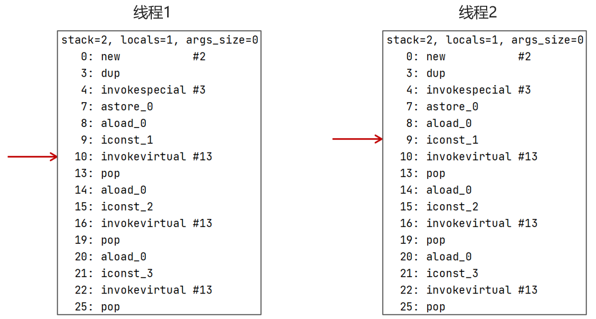

什么是程序计数器?

线程私有的（线程安全）， 每个线程一份， 内部保存的是字节码的行号。用于记录正在执行的字节码指令的地址

### Java堆 

在 **Java 虚拟机（JVM）** 中，**堆**（Heap）是 JVM 内存结构的一个重要区域，主要用于存放**对象**和**数组**等动态分配的内存。堆内存是所有线程共享的，是 JVM 管理的最大的一块内存空间。

当堆中没有内存空间可分配给实例， 也无法再扩展时， 则抛出`OutOfMemoryError`异常

下图是一个运行时数据区

 

元空间保存的是类的信息、静态变量、常量、编译后的代码.

年轻代被划分为三部分， `Eden`区和两个大小严格相同的`Survivor`区， 根据JVM的策略， 在经过几次垃圾收集后，仍然存活于`Survivor`的对象将被移动到老年代区间.

老年代主要保存生命周期长的对象， 一般是一些老的对象

#### Java1.7和1.8堆的区别 

JAVA8之后把方法区放到了本地内存，主要是为了防止`oom`


#### 总结 

你能给我详细的介绍Java堆吗?

*  线程共享的区域: 主要用来保存对象实例， 数组等， 内存不够则抛出`OutOfMemoryError`异常
*  组成: 年轻代 + 老年代

     *  年轻代被划分为三部分， `Eden`区和两个大小严格相同的`Survivor`区
     *  老年代主要保存生命周期长的对象， 一般是一些老的对象
*  JDK1.7和1.8堆的区别

     *  1.7中堆中有一个永久代， 存储的是类信息、静态变量、常量、编译后的代码
     *  1.8在堆中移除了永久代， 把数据存储到了本地内存的元空间中， 防止内存溢出

### 虚拟机栈

#### 什么是虚拟机栈 

Java Virtual Machine Stacks(Java虚拟机栈)

 *  每个线程运行时所需要的内存， 称为虚拟机栈，先进后出，线程安全
 *  每个栈由多个栈帧(frame)组成， 对应着每次方法调用时所占用的内存，同时包含有参数、局部变量等信息
 *  每个线程只能有一个活动栈帧，对应着当前正在执行的那个方法

> 在 JVM 中，栈是用于存储线程执行时的局部变量、操作数栈和方法调用信息的内存区域。每个线程都有自己的栈，彼此不共享，主要包含以下几个部分：
>
> 1. **栈帧（Stack Frame）**：每次方法调用时，JVM 会为该方法创建一个栈帧。栈帧中包含方法的局部变量、参数、返回地址和操作数栈。
> 2. **局部变量**：方法执行时所用的变量，包括基本数据类型和对象引用。局部变量在栈帧中分配。
> 3. **操作数栈**：用于存储在执行字节码指令时所需的中间结果，类似于计算机中的临时寄存器。
> 4. **方法调用和返回**：栈帧通过入栈和出栈操作来管理方法调用。当方法执行完毕后，对应的栈帧被弹出，释放其占用的内存。
>
> 栈的优点是存取速度快，但其大小是有限的，过多的递归调用可能导致栈溢出（StackOverflowError）。


1.  垃圾回收是否涉及栈内存?
  
    垃圾回收主要指的是**堆内存**， 当栈帧弹栈以后， 内存就会释放
    
2.  栈内存分配越大越好吗?
  
    未必， 默认的栈内存通常为1024K
    
    每个线程都会创建虚拟机栈，栈帧过大会导致线程数变少
    
    > 例如， 机器总内存为512m， 目前能过冬的线程数则为512个， 如果把栈内存改为2048k， 那么能活动的栈帧就会减半
    
3.  方法内的局部变量是否线程安全?
  
    
    
     *  如果方法内局部变量没有逃离方法的作用范围， 它是线程安全的
     *  如果是局部变量引用了对象， 并逃离方法的作用范围， 需要考虑线程安全
        *  例如上图`m2`方法的形参和`m3`方法的返回值都有可能被其他线程调用导致线程不安全

#### 栈内存溢出(`java.lang.StackOverflowError`)情况 

 * 栈帧过多导致栈内存溢出， 典型问题: 递归调用

    

 *  栈帧过大导致栈内存溢出 

#### 总结 

1.  什么是虚拟机栈?
  
     *  每个线程运行时所需要的内存， 称为虚拟机栈
     *  每个栈由多个栈帧(frame)组成， 对应着每次方法调用时所占用的内存
     *  每个线程只能有一个活动栈帧， 对应着当前正在执行的那个方法
2.  垃圾回收是否涉及栈内存?
  
    垃圾回收主要指的是堆内存， 当栈帧弹栈以后， 内存就会释放
3.  栈内存分配越大越好吗?
  
    未必， 默认的栈内存通常为1024k， 栈帧过大会导致线程数变少，导致并发能力下降，资源利用率低
4.  方法内的局部变量是否线程安全?
  
     *  如果方法内局部变量没有逃离方法的作用范围， 它是线程安全的
     *  如果局部变量引用了对象， 并逃离方法的作用范围， 需要考虑线程安全
5.  什么情况下会导致栈内存溢出?
  
     *  栈帧过多导致栈内存溢出， 典型问题: 递归调用
     *  栈帧过大导致栈内存溢出
6.  堆栈的区别是什么?
  
     *  栈内存一般会用来存储局部变量和方法调用， 但堆内存是用来存储Java对象和数组的
     *  堆会被GC垃圾回收， 而栈不会
     *  栈内存是线程私有的， 而堆内存是线程共享的
     *  两者异常错误不同， 但如果栈内存或者堆内存不足都会抛出异常
       
        栈空间不足: `java.lang.StackOverFlowError`
        
        堆空间不足: `java.lang.OutOfMemoryError`

#### 基本数据类型和包装类的存储位置

基本数据类型的局部变量存放在 Java 虚拟机栈中的局部变量表中，基本数据类型的成员变量（未被 `static` 修饰 ）存放在 Java 虚拟机的堆中。包装类型属于对象类型，我们知道几乎所有对象实例都存在于堆

**为什么说是几乎所有对象实例都存在于堆中呢？** 这是因为 HotSpot 虚拟机引入了 JIT 优化之后，会对对象进行逃逸分析，如果发现某一个对象并没有逃逸到方法外部，那么就可能通过标量替换来实现栈上分配，而避免堆上分配内存

⚠️ 注意：**基本数据类型存放在栈中是一个常见的误区！** 基本数据类型的存储位置取决于它们的作用域和声明方式。如果它们是局部变量，那么它们会存放在栈中；如果它们是成员变量，那么它们会存放在堆/方法区/元空间中。

```java
public class Test {
    // 成员变量，存放在堆中
    int a = 10;
    // 被 static 修饰的成员变量，JDK 1.7 及之前位于方法区，1.8 后存放于元空间，均不存放于堆中。
    // 变量属于类，不属于对象。
    static int b = 20;

    public void method() {
        // 局部变量，存放在栈中
        int c = 30;
        static int d = 40; // 编译错误，不能在方法中使用 static 修饰局部变量
    }
}
```

### 

### 方法区/元空间 


#### 解释一下方法区 

> 方法区是一个**逻辑上独立的内存区域**，用于存储**类的元数据**（类的信息），如类的**字段信息**、**方法信息**、**静态变量**、**常量**等。方法区也是所有线程共享的区域。

 *  方法区(Method Area)是各个线程共享的内存区域（和堆一样）
 *  主要存储类的信息， 运行时常量池
 *  虚拟机启动的时候创建， 关闭虚拟机时释放
 *  如果方法区域中的内存无法满足分配请求， 则会抛出`OutOfMemoryError: Metaspace`


测试代码:

```java
package com.qqzj.jvm;

import jdk.internal.org.objectweb.asm.ClassWriter;
import jdk.internal.org.objectweb.asm.Opcodes;

/**
 * 演示元空间内存溢出 java.lang.OutOfMemoryError: Metaspace
 * -XX:MaxMetaspaceSize=8m
 */
public class MetaspaceDemo extends ClassLoader {

      // 可以用来加载类的二进制字节码，相当于一个类加载器
    public static void main(String[] args) {
        for (int i = 0; i < 10; i++) {
            int finalI = i;
            new Thread(new Runnable(){
                @Override
                public void run() {
                    System.out.println("thread"+ finalI +" start");
                    MetaspaceDemo test = new MetaspaceDemo();
                    for (int i = 0; i < 1000000; i++) {
                        // ClassWriter 作用是生成类的二进制字节码
                        ClassWriter cw = new ClassWriter(0);
                        // 版本号， public， 类名， 包名， 父类， 接口
                        cw.visit(Opcodes.V1_8， Opcodes.ACC_PUBLIC， "Class" + i， null， "java/lang/Object"， null);
                        // 返回 byte[]
                        byte[] code = cw.toByteArray();
                        // 执行了类的加载
                        test.defineClass("Class" + i， code， 0， code.length); // Class 对象
                    }
                }
            }， "thread" + i).start();
        }
    }
}
```

在启动配置上添加 VM参数 : `-XX:MaxMetaspaceSize=200m`


#### 常量池 

常量池通常是指**类文件常量池**，它存在于 `.class` 文件中。每一个 `.class` 文件在编译时，都会生成一个常量池，用于存储类、方法、字段的各种符号信息，以及字符串、数字等字面量。

**常量池的内容：**

- **字面量（Literal Values）**：比如字符串常量、整型常量、浮点常量等。
- **符号引用（Symbolic References）**：类和接口的全限定名、字段的名称和描述符、方法的名称和描述符等。

常量池是编译时就确定的，存储的是类和接口的相关信息，在类加载过程中，这些常量会被载入**运行时常量池**中。

可以看做是一张表， 虚拟机指令根据这张常量表找到要执行的类名、方法名、参数类型、字面量等信息

可以通过`javap -v XX.class`查看字节码结构(类的基本信息、常量池、方法定义)，显示信息如下：

> 在idea中打开project structure
>
> 
>
> 
>
> 在这个路径下输入 `javap -v Test.class`

类的基本信息:


常量池:

```java
Constant pool:
   #1 = Methodref          #6.#22         // java/lang/Object."<init>":()V
   #2 = Fieldref           #23.#24        // java/lang/System.out:Ljava/io/PrintStream;
   #3 = String             #25            // hello world
   #4 = Methodref          #26.#27        // java/io/PrintStream.println:(Ljava/lang/String;)V
   #5 = Class              #28            // com/qqzj/jvm/Application
   #6 = Class              #29            // java/lang/Object
   #7 = Utf8               <init>
   #8 = Utf8               ()V
   #9 = Utf8               Code
  #10 = Utf8               LineNumberTable
  #11 = Utf8               LocalVariableTable
  #12 = Utf8               this
  #13 = Utf8               Lcom/qqzj/jvm/Application;
  #14 = Utf8               main
  #15 = Utf8               ([Ljava/lang/String;)V
  #16 = Utf8               args
  #17 = Utf8               [Ljava/lang/String;
  #18 = Utf8               Exceptions
  #19 = Class              #30            // java/lang/InterruptedException
  #20 = Utf8               SourceFile
  #21 = Utf8               Application.java
  #22 = NameAndType        #7:#8          // "<init>":()V
  #23 = Class              #31            // java/lang/System
  #24 = NameAndType        #32:#33        // out:Ljava/io/PrintStream;
  #25 = Utf8               hello world
  #26 = Class              #34            // java/io/PrintStream
  #27 = NameAndType        #35:#36        // println:(Ljava/lang/String;)V
  #28 = Utf8               com/qqzj/jvm/Application
  #29 = Utf8               java/lang/Object
  #30 = Utf8               java/lang/InterruptedException
  #31 = Utf8               java/lang/System
  #32 = Utf8               out
  #33 = Utf8               Ljava/io/PrintStream;
  #34 = Utf8               java/io/PrintStream
  #35 = Utf8               println
  #36 = Utf8               (Ljava/lang/String;)V
```


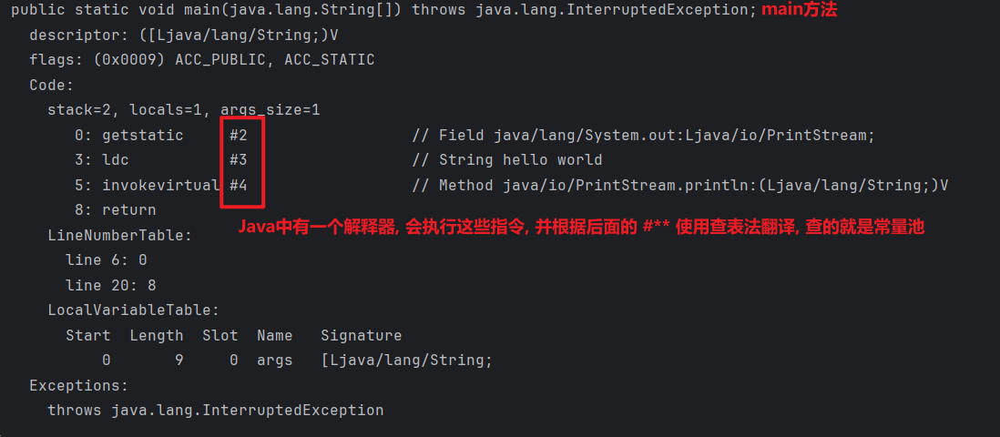


#### 运行时常量池 

**运行时常量池** 是 JVM 方法区的一部分，是类加载到内存之后在运行时为每个类维护的常量池。运行时常量池存放的是从类文件常量池中解析出来的各种字面量和符号引用，并在需要时解析符号引用为具体的内存地址。

常量池是`*.class`文件中的， 当该类被加载， 它的常量池信息就会放入运行时常量池， 并把里面的符号地址变为真实的内存地址


#### 总结 

1.  能不能解释一下方法区?
  
     *  方法区(Method Area)是各个线程共享的内存区域
     *  主要存储类的信息、运行时常量池
     *  虚拟机启动的时候创建， 关闭虚拟机时释放
     *  如果方法区域中的内存无法满足分配请求， 则会抛出`OutOfMemoryError: Metaspace`
2.  介绍一下运行时常量池
  
     *  常量池: 可以看做是一张表， 虚拟机指令根据这张常量表找到要执行的类名、方法名、参数类型、字面量等信息
     *  当类被加载， 它的常量池信息就会放入运行时常量池， 并把里面的符号地址变为真实地址

### 执行引擎

执行引擎是 Java 虚拟机的核心组件之一，**它的主要任务是执行已经加载的类中的字节码指令**，将这些字节码转换为具体的 CPU 指令，让程序最终在底层硬件上运行。

可以类比为：**类加载器把“说明书”搬进来，执行引擎负责按照说明书“干活”。**

执行引擎的职责包含以下几部分：

| 模块           | 作用说明                                     |
| -------------- | -------------------------------------------- |
| **解释器**     | 字节码逐条翻译执行，响应快但慢               |
| **JIT 编译器** | 热点代码转机器码，启动慢但快                 |
| **栈帧管理**   | 调用、返回、变量存储、字节码执行控制等       |
| **GC 交互**    | 通知内存分配与释放                           |
| **JNI 支持**   | 调用底层操作系统方法                         |
| **运行时优化** | 内联、逃逸分析、去虚拟化等技术，提升运行效率 |

#### 解释器

解释器是最基础的执行方式，它会**逐条读取并“翻译”字节码指令为机器指令，再由 CPU 执行**。

**特点：**

- 启动快，编译过程少，适合短时间运行的程序。
- 性能较低，因为每次执行都要“翻译”一次指令。

**举例：**

假设 Java 字节码中有一条 `iadd`（整数相加）指令，解释器会把这条指令翻译成目标平台的汇编语句，比如：

```
assembly复制编辑mov eax, [esp]
add eax, [esp+4]
```

#### 即时编译器

JIT（Just-In-Time 编译器）是为了提升执行性能引入的机制。它会在程序运行时**将热点代码（执行频繁的代码）编译成机器码**，并缓存起来以供复用。

JVM 中最常用的 JIT 编译器是 **C2 编译器**（Server 模式）和 **C1 编译器**（Client 模式）。

**工作原理：**

1. JVM 运行时会通过“热点探测”（比如统计方法调用次数）找出热点代码。
2. 将这些热点方法编译为机器码（native code）。
3. 下次调用该方法时，直接使用已编译的机器码，提升执行效率。

**优点：**

- 编译后的代码性能接近本地程序。
- 支持一些运行时优化（比如内联、逃逸分析、死代码消除等）。

**举例：**

一个频繁被调用的方法 `sum(int a, int b)` 会被 JIT 编译器转化为机器指令，比如：

```
assembly复制编辑mov eax, a
add eax, b
ret
```

之后该机器码就缓存起来，供重复调用时直接使用。

#### 垃圾回收器

执行引擎会与 JVM 中的 **内存管理模块（GC）**进行交互：

- 检查对象是否已分配内存
- 在对象无引用后通知 GC 回收
- 如果内存不足，会触发 GC 回收过程或抛出 `OutOfMemoryError`

JIT 编译器也会参与优化对象的分配策略，比如使用**逃逸分析**决定对象是否要分配到栈而非堆。

#### **线程调度与栈帧管理**

- 每调用一个方法，都会创建一个**栈帧（Stack Frame）**。
- 执行引擎会按栈帧的顺序逐一执行字节码，出栈即方法返回。
- 通过栈帧保存局部变量表、操作数栈、动态链接、返回地址等。

#### **与本地方法接口（JNI）协同**

当执行的是 `native` 方法（比如调用 C/C++ 库），执行引擎会：

- 暂停当前线程的 Java 栈执行
- 切换到 Native 方法栈
- 调用平台相关的动态链接库函数（如 Windows 上的 DLL，Linux 上的 .so 文件）

执行完后再返回 Java 栈继续执行。

### 本地接口与本地方法库

JVM 的**本地接口（Native Interface）**是一种机制，用来使 Java 程序能够调用本地（Native）代码，例如 C、C++ 编写的动态链接库（`.dll` 或 `.so` 文件），这些库通常是与底层操作系统或硬件密切相关的。

> Java 本身是跨平台的，但有些功能（如访问文件系统、显卡驱动、操作系统调用等）是平台特有的，必须借助本地代码实现。

JVM 通过 **JNI（Java Native Interface）** 解决这个问题。

#### 本地接口

#### 本地方法库

### 直接内存

直接内存: 并不属于JVM中的内存结构， 不由JVM进行管理. 是虚拟机的系统内存，也就是操作系统的内存

常见于`NIO`操作时， 用于数据缓冲区， 它分配回收成本较高， 但读写性能高

 


实例代码:

```java
package com.qqzj.jvm;

import java.io.FileInputStream;
import java.io.FileOutputStream;
import java.io.IOException;
import java.nio.ByteBuffer;
import java.nio.channels.FileChannel;

/**
 * 演示 ByteBuffer 作用
 */
public class DirectMemoryDemo {

    static final String FROM = "D:\\AAAStudy\\MP4\\序列 02.mp4";
    static final String TO = "D:\\AAAStudy\\MP\\序列 02.mp4";
    static final int _1Mb = 1024 * 1024;

    public static void main(String[] args) {
        io();  //256.8563
        directBuffer();//63.2449
    }

    private static void directBuffer() {
  
        long start = System.nanoTime();
        try (FileChannel from = new FileInputStream(FROM).getChannel();
             FileChannel to = new FileOutputStream(TO).getChannel();
            ) {
            ByteBuffer bb = ByteBuffer.allocateDirect(_1Mb);
            while (true) {
                int len = from.read(bb);
                if (len == -1) {
                    break;
                }
                bb.flip();
                to.write(bb);
                bb.clear();
            }
        } catch (IOException e) {
            e.printStackTrace();
        }
        long end = System.nanoTime();
        System.out.println("directBuffer 用时：" + (end - start) / 1000_000.0);
    }

    private static void io() {
        long start = System.nanoTime();
        try (FileInputStream from = new FileInputStream(FROM);
             FileOutputStream to = new FileOutputStream(TO);
            ) {
            byte[] buf = new byte[_1Mb];
            while (true) {
                int len = from.read(buf);
                if (len == -1) {
                    break;
                }
                to.write(buf， 0， len);
            }
        } catch (IOException e) {
            e.printStackTrace();
        }
        long end = System.nanoTime();
        System.out.println("io 用时：" + (end - start) / 1000_000.0);
    }
}
```

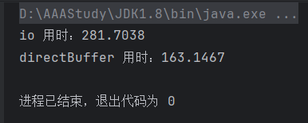

#### 常规IO的数据拷贝流程 

我们知道JAVA代码是不可以直接操作磁盘文件的，所以需要先把磁盘文件给缓存到系统缓存区中，再缓存到JAVA缓冲区中。在读取数据的时候，数据需要被缓存两份，造成了不必要的数据复制，效率不高。


#### NIO数据拷贝流程 

NIO（Non-blocking I/O，非阻塞输入/输出）

Nio在内存中划分出了一块直接内存。这份直接内存可以由java代码直接访问，系统也可以访问到


#### 总结 

你听过直接内存吗?

 *  并不属于JVM中的内存结构， 不由JVM进行管理， 是虚拟机的系统内存
 *  常见于NIO操作时， 用于数据缓冲区， 分配回收成本较高， 但读写性能高， 不受JVM内存回收管理

## 类加载器 

### 类加载器 


 *  类加载器: 用于加载字节码文件(.class文件)
 *  运行时数据区: 用于分配存储空间
 *  执行引擎: 执行字节码文件或本地方法
 *  垃圾回收期: 用于对JVM中的垃圾内容进行回收

#### 什么是类加载器， 类加载器有哪些 

**类加载器（Class Loader）** 是 Java 虚拟机（JVM）的一部分，用于将 `.class` 文件动态加载到内存中，并将这些类的字节码转换为 JVM 可以执行的类对象。类加载器负责查找、加载和连接类文件，同时确保每个类只被加载一次。类加载器为 Java 提供了灵活的动态加载机制，使得类可以在运行时进行加载，而不是在编译时就完全确定。

JVM只会运行二进制文件， 类加载器的作用就是将字节码文件加载到JVM中， 从而让Java程序能够启动起来.


#### 总结 

1.  什么是类加载器
  
    JVM只会运行二进制文件， 类加载器的作用就是将字节码文件加载到JVM中， 从而让Java程序能够启动起来.
    
    换句话说类加载器是 Java 虚拟机（JVM）的一部分，负责在运行时动态加载 Java 类。

2. 类加载器一共分为四种
    *  启动类加载器(BootStrap ClassLoader): 嵌套在JVM内部，主要加载java的核心库，也就是`JAVA_HOME/jre/lib`目录下的所有jar包
    *  扩展类加载器(ExtClassLoader): 主要加载`JAVA_HOME/jre/lib/ext`目录中的类
    *  应用类加载器(AppClassLoader): 用于加载`classPath`下的类，默认加载器，一般我们自己写的代码用到的就是这个加载器
    *  自定义类加载器(CustomizeClassLoader): 自定义类继承`ClassLoader`， 实现自定义类加载规则，用的不多

#### 什么是双亲委派模型 

加载某一个类， 先委托上一级的加载器进行加载， 如果上级加载器也有上级， 则会继续向上委托， 如果该类委托上级没有被加载，子加载器尝试加载该类

下面举两个例子：

1. 假设我们现在有一个自己写的student类

   - 由于这是我们自己写的一个类，所以会到`APPclassloader`里面去加载。

   - 他会先委托上级加载器`extclassloader`加载，而`extclassloader`也有上级所以会委托`BootStrap ClassLoader`加载，但是student类并不在lib目录下，也不在ext目录下，所以无法加载

   - 所以只能由`AppClassLoader`类加载

2. 现在我们要加载`String`类

   - 当前系统会层层向上找到`BootStrap ClassLoader`委托加载，而在lib目录下有String类，所以直接由`BootStrap Classloader`类加载，并返回给`AppClassLoader`直接使用

 

#### JVM为什么采用双亲委派机制 

1. 通过双亲委派机制可以避免某一个类被重复加载， 当父类已经加载后则无需重复加载， 保证唯一性.

2. 为了安全， 保证类库API不会被修改

   加入我们自己定义了一个`java.lang`包并自己写了一个`String`类

   ```java
   package java.lang;
   
    public class String {
      public static void main(String[] args) {
        System.out.println("demo info");
      }
    }
   ```

   此时执行`main`函数， 会出现异常， 在类`java.lang.String`中找不到`main`方法

   

   由于是双亲委派机制， `java.lang.String`在启动类加载器得到加载， 因为在核心`jre`库中有其相同名字的类文件， 但该`String`类中并没有`main`方法. 这样就能防止恶意篡改核心API库

#### 总结 

1.  什么是双亲委派模型?
  
    加载某一个类， 先委托上一级的加载器进行加载， 如果上级加载器也有上级， 则会继续向上委托， 如果该类委托上级没有被加载， 子加载器尝试加载该类
    
    
2.  JVM为什么采用双亲委派模型?
  
     *  通过双亲委派机制可以避免某一个类被重复加载， 当父类已经加载后则无需重复加载， 保证唯一性
     *  为了安全， 保证类库API不会被修改

### 类装载的执行过程

#### 说一下类装载的执行过程 

类从加载到虚拟机中开始， 直到卸载为止， 它的整个生命周期包括了: 加载、验证、准备、解析、初始化、使用和卸载这7个阶段. 其中， 验证、准备和解析这三个部分统称为连接(linking)


#### 加载 

加载是类加载的第一个步骤，主要任务是将类的字节码从存储介质（通常是 `.class` 文件）加载到 JVM 的内存中，并生成类的元数据。加载的过程由类加载器（ClassLoader）完成。


 *  通过类的全名， 获取类的二进制数据流
 *  解析类的二进制数据流为方法区内的数据结构(Java类模型)，也就是把类的信息存入方法区
 *  创建`java.lang.Class`类的实例， 表示该类型。作为方法区这个类的各个数据的访问入口

>  举例：假如现在我们有一个Person类，这个类被加载后就会存入运行时数据区，分别存入方法区和堆。
>
> - 方法区存的是当前类的信息，比如构造函数、方法、字段等。
> - 堆会开辟一片空间去存储当前那个类的class对象，
>
> 那有什么作用呢？后期当我们去创建对象的时候，比如说我在这儿有两个对象，一个是张三，一个是李四，这两个对象都是基于当前那个person class去创建对象的。这时候每个对象的对象头都会去指向当前那个class对象。但是具体的内容的数据，比如方法，构造函数字段需要通过方法去才能获得。这时候呢这个class对象啊就能去找到方法中的这个person的信息，获取这个类的数据结构，来创建这两个对象。


#### 验证 

验证的目的是确保类的字节码符合 JVM 的规范，保证字节码文件的安全性和正确性。


验证类是否符合JVM规范， 主要做一个安全性检查

1.  文件格式验证
2.  元数据验证
3.  字节码验证
4.  符号引用验证

前三项属于格式检查， 如: 文件格式是否错误、语法是否错误、字节码是否合规

第四项Class文件在其常量池会通过字符串记录自己将要使用的其他类或者方法， 检查他们是否存在

> 例如下面这个常量池，在方法或者类被引用的时候就会去查找对应的行，找到对应的类或者方法，符号引用验证就是检查这些方法是否存在


#### 准备 

准备阶段为类的**静态变量**分配内存，并设置初始默认值（通常是零值，如 `0`、`null` 等）。这些变量分配在方法区中。


为类变量分配内存并设置类变量初始值

 *  `static`变量： 此时不会赋值，只会设置默认值， 赋值在初始化阶段完成
 *  `static`变量是`final`的基本类型， 以及字符串常量：值已确定， 赋值在该阶段完成
 *  `static`变量是`final`的引用类型： 那么赋值也会在初始化阶段完成

```java
public class Application {
    static int b = 10;  //b在该阶段被赋值默认值 0
    static final int c = 20; //c在该阶段被赋值为10
    static final String d = "hello";
    static final Object obj = new Object();
}
```

#### 解析 

解析阶段是将类的常量池中的**符号引用**替换为**直接引用**的过程。符号引用是指向类、方法、字段等的符号，而直接引用则是指向实际内存地址的指针或偏移量。解析阶段确保类中的所有符号引用都可以在运行时得到正确解析，指向相应的内存地址。


把类中的符号引用转换为直接引用

比如: 方法中调用了其他方法， 方法名可以理解为符号调用（下面的 #1 #2）， 而直接引用就是使用指针直接指向方法.


#### 初始化 

初始化是类加载的最后一个阶段，真正执行类的**静态初始化块**（`static` 块）和**静态变量的赋值操作**。


对类的静态变量， 静态代码块进行初始化操作

 *  如果初始化一个类的时候， 其父类尚未初始化， 则优先初始化其父类.
 *  如果同时包含多个静态变量和静态代码块， 则按照自上而下的顺序依次执行.

测试代码:

```java
package com.qqzj.jvm;

public class Application {
    
    public static void main(String[] args) throws InterruptedException {
        // 1. 首次访问这个类的静态变量或静态方法时
        // System.out.println(Animal.num);
        // 2. 子类初始化，如果父类还没初始化，会引发父类先初始化
        // System.out.println(Cat.sex);
        // 3. 子类访问父类静态变量，只触发父类初始化
        // System.out.println(Cat.num);
    }
}

class Animal {
    static int num = 55;
    static {
        System.out.println("Animal 静态代码块...");
    }
}

class Cat extends Animal {

    static boolean sex = false;
    static {
        System.out.println("Cat 静态代码块...1");
    }

    static {
        System.out.println("Cat 静态代码块...2");
    }
}
```

结果:

```java
// 1. 首次访问这个类的静态变量或静态方法时
System.out.println(Animal.num);
```


```java
// 2. 子类初始化，如果父类还没初始化，会引发父类先初始化
System.out.println(Cat.sex);
```


```java
// 3. 子类访问父类静态变量，只触发父类初始化
System.out.println(Cat.num);
```


#### 使用 


JVM开始从入口方法开始执行用户的程序代码

 *  调用静态类成员信息(比如: 静态字段、静态方法)
 *  使用`new`关键字为其创建对象实例

#### 卸载 

当用户程序代码执行完毕之后， JVM就开始销毁创建的Class对象了， 就相当于把类给卸载了

#### 总结 

说一下类装载的执行过程

 *  **加载:** 查找和导入Class文件
 *  **验证:** 保证加载类的准确性
 *  **准备:** 为类变量分配内存并设置类变量初始值
 *  **解析:** 把类中的符号引用转换为直接引用
 *  **初始化:** 对类的静态变量， 静态代码块执行初始化操作
 *  **使用:** JVM开始从入口方法开始执行用户的程序代码
 *  **卸载:** 当用户程序代码执行完毕后， JVM便开始销毁创建的Class对象

## 垃圾回收 

### 对象什么时候可以被垃圾回收器回收 

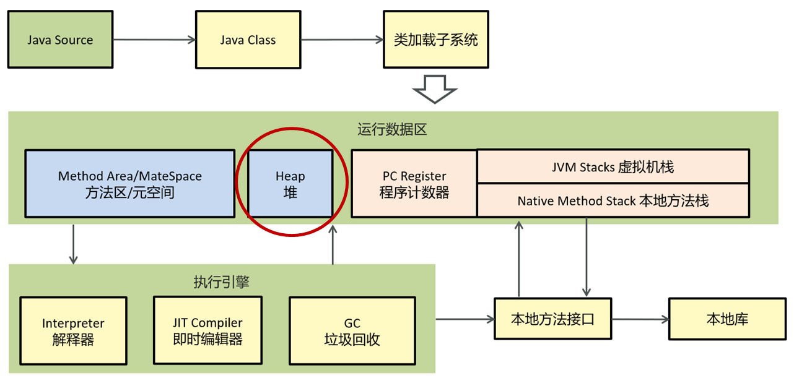

简单一句就是: 如果一个或多个对象没有任何的引用指向它了， 那么这个对象现在就是垃圾， 如果定位了垃圾， 则有可能会被垃圾回收器回收.

如果要定位什么是垃圾， 有两种方式来确定， 第一个是引用计数法， 第二个是可达性分析算法

#### 引用计数法 

一个对象被引用了一次， 在当前的对象头上就递增一次引用次数， 如果这个对象的引用次数为0， 代表这个对象可回收

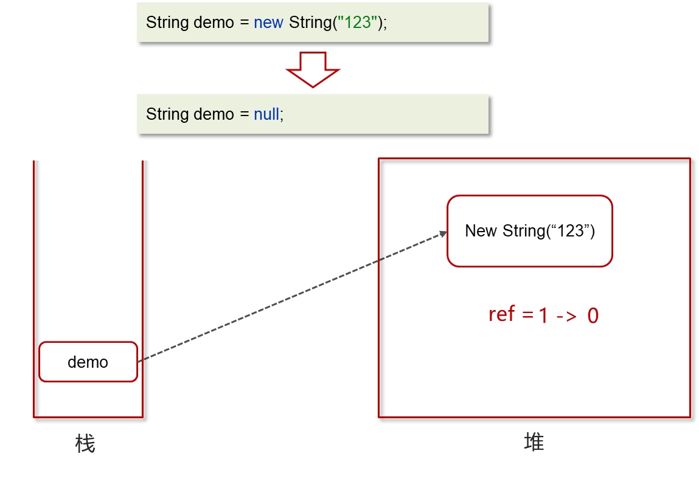

当对象间出现了循环引用的话， 引用计数法就会失效

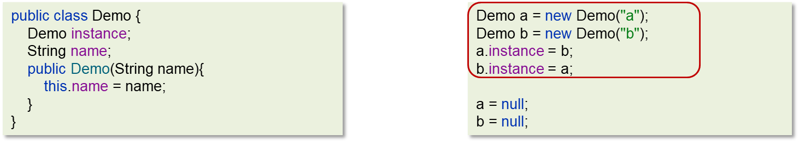


循环引用， 会引发内存泄漏，这两个对象一直不会被回收

#### 可达性分析算法 

现在的虚拟机采用的都是通过可达性分析算法来确定哪些内容是垃圾


X， Y这两个节点是可回收的

 *  Java 虚拟机中的垃圾回收器采用可达性分析来探索所有存活的对象
 *  扫描堆中的对象， 看是否能够沿着 `GC Root` 对象为起点的引用链找到该对象， 找不到， 表示可以回收

#### 哪些对象可以作为`GC Root`? 

1. 虚拟机栈(栈帧中的本地变量表)中引用的对象：如局部变量、方法调用栈中的对象。

   ```java
   public static void main(String[] args) {
       
       Demo demo = new Demo(); //当前的demo可以作为 GC ROOT
       demo = null;
   }
   ```

2. 方法区中类静态属性引用的对象：如类的静态成员。

   ```java
   public static Demo a;
   public static void main(String[] args) {
   
       Demo b = new Demo();
       b.a = new Demo(); //a可以作为 GC root
       b = null;
   }
   ```

3. 方法区中常量引用的对象：如常量池中的引用。

   ```java
   public static final Demo a = new Demo();
   public static void main(String[] args) {
   
       Demo demo = new Demo();
       demo = null;
   }
   ```

4. 本地方法栈中 `JNI`(即一般说的`Native`方法)引用的对象

#### 总结 

对象什么时候可以被垃圾回收器回收?

如果一个或多个对象没有任何的引用指向它了， 那么这个对象现在就是垃圾

如果定位了垃圾， 则有可能会被垃圾回收器回收

定位垃圾的方式有两种

 *  引用计数法
 *  可达性分析算法

### JVM垃圾回收算法 

#### 有哪些

 *  标记清除算法
 *  复制算法
 *  标记整理算法

#### 标记清除算法 

标记清除算法， 是将垃圾回收分为2个阶段， 分别是标记和清除

1.  根据可达性分析算法得出的垃圾进行标记
2.  对这些标记为可回收的内容进行垃圾回收


**优点:** 标记和清除速度较快

**缺点:** 碎片化较为严重， 内存不连贯的。

> 数组在内存中占用连续空间，内存不连贯会导致无法存储较大的数组

#### 标记整理算法 


优缺点同标记清除算法， 解决了标记清除算法的碎片化的问题， 同时， 标记压缩算法多了一步， 对象移动内存位置的步骤， 其效率也有一定的影响

#### 复制算法 

将原有的内存空间一分为二， 每次只用其中的一块， 正在使用的对象复制到另一个内存空间中， 然后将该内存空间清空， 交换两个内存的角色， 完成垃圾的回收: 无碎片， 内存使用率低


优点:

 *  在垃圾对象多的情况下， 效率较高
 *  清理后， 内存无碎片

缺点:

 *  分配的两块内存空间， 在同一时刻， 只能使用一半， 内存使用率较低

#### 总结 

JVM垃圾回收算法有哪些?

 *  标记清除算法: 垃圾回收分为两个阶段， 分别是标记和清除， 效率高， 有磁盘碎片， 内存不连续
 *  标记整理算法: 标记清除算法一样， 将存活对象都向内存另一端移动， 然后清理边界以外的垃圾， 无碎片， 对象需要移动， 效率低 （多用于老年代）
 *  复制算法: 将原有的内存空间一分为二， 每次只用其中的一块， 正在使用的对象复制到另一个内存空间中， 然后将该内存空间清空， 交换两个内存的角色， 完成垃圾的回收: 无碎片， 内存使用率低 （多用于年轻代）

### JVM的分代回收 

#### 分代收集算法 

在Java8时， 堆被分成了两份: 新生代和老年代 (比例1 : 2)


对于新生代， 内部又被分为了三个区域

 *  伊甸园区`Eden`， 新生的对象都分配到这里
 *  幸存者区`Survivor`(分为`from`和`to`)
 *  `Eden`区， `from`区， `to`区 (8: 1: 1)

#### 工作机制 

 *  新创建的对象， 都会先分配到`Eden`区
   
    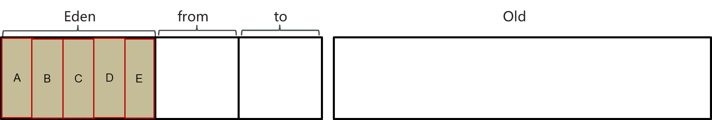
 *  当伊甸园区内存不足， 标记伊甸园与`from`(现阶段没有)的存活对象
 *  将存活对象采用复制算法复制到`to`中， 复制完毕后， 伊甸园区和`from`区内存都得到释放
   
    
 *  经过一段时间后伊甸园区的内存又出现不足， 标记`Eden`区域`to`区存活的对象， 将存活的对象复制到`from`区
   
    
    
    
 *  当幸存者区对象熬过几次回收(最多15次)， 晋升到老年代(幸存者区内存不足或大对象会导致提前晋升)
   
    
    
    

#### MinorGC、Mixed GC、FullGC

> 在 Java 的垃圾回收机制中，GC（Garbage Collection，垃圾回收）分为多个种类，其中常见的有 **Minor GC**、**Major GC**、**Mixed GC** 和 **Full GC**。这些不同类型的垃圾回收器针对不同的内存区域进行优化，以提高 Java 程序的运行效率。下面详细介绍这些概念：
>
> ### 1. **Minor GC**
> **Minor GC** 是针对 **新生代（Young Generation）** 的垃圾回收，它只会清理新生代中的对象，而不会影响老年代中的对象。
>
> #### **工作原理**：
> - Java 堆内存被划分为新生代（Young Generation）和老年代（Old Generation）。新生代通常进一步划分为三个区域：**Eden 区**和两个 **Survivor 区**（S0 和 S1）。
> - 新生代中创建的对象大多数都是临时对象，生命周期较短。当 Eden 区和其中一个 Survivor 区满时，会触发 Minor GC。
> - **Minor GC 的过程**：
>   1. 新生代中的存活对象会被复制到 Survivor 区，若对象年龄足够（经过一定次数的 GC），则会被晋升到老年代。
>   2. Eden 区中的所有对象都会被清理（即销毁）。
> - **Minor GC 是高频 GC**，因为新生代的空间相对较小，频繁分配和销毁对象会快速耗尽新生代的内存。
>
> #### **优点**：
> - 效率高，因为新生代大部分对象生命周期较短，GC 次数较多但每次耗时较少。
>
> #### **缺点**：
> - 可能会导致频繁的 **Stop-The-World（STW）**，即在执行 Minor GC 时，所有应用线程都会被暂停。
>
> ### 2. **Mixed GC**
> **Mixed GC** 是 **G1 垃圾回收器**（Garbage First）中特有的回收模式，主要用于清理 **新生代和部分老年代** 的垃圾。
>
> #### **工作原理**：
> - 在 G1 垃圾回收器中，堆内存不再划分为固定的区域（如 Eden 和 Old），而是被划分为多个独立的小块（region）。
> - **Mixed GC** 会在清理新生代对象的同时，**选择性地** 清理老年代中最垃圾堆积严重的部分。这意味着并不会对整个老年代进行回收，而是只处理一部分高回收价值的区域。
> - 当老年代垃圾占用率逐渐上升时，G1 垃圾回收器会触发 Mixed GC 以避免堆内存被完全占满。
>
> #### **优点**：
> - **避免 Full GC**：通过混合回收新生代和老年代中的垃圾，可以延缓 Full GC 的发生。
> - **增量回收**：每次 Mixed GC 都只回收部分老年代，这减少了每次回收的暂停时间。
>
> #### **缺点**：
> - 在堆内存非常大的情况下，Mixed GC 的效率可能不如其他垃圾回收器（如 ZGC 或 Shenandoah）。
>
> ### 3.Major gc
>
> **回收区域**：老年代
>
> **触发条件**：老年代空间不够、晋升失败等（特定收集器如 CMS 会分开回收老年代）
>
> **收集算法**：因不同收集器而异，如 CMS 使用并发标记-清除，Serial Old 使用标记-整理等。
>
> **停顿时间**：一般比 Minor GC 慢 10 倍以上，影响较大但不如 Full GC 严重。
>
> ### 4. **Full GC**
> **Full GC** 是 **全堆垃圾回收**，会清理整个堆，包括 **新生代和老年代**，甚至 **方法区（元空间 Metaspace）**。
>
> #### **工作原理**：
> - Full GC 是所有 GC 中最重的一种，它会回收整个 Java 堆内存，包括新生代、老年代和方法区的对象。
> - Full GC 一般是在下列情况发生时触发的：
>   1. 老年代的内存不足，无法再存储新晋升的对象。
>   2. Metaspace 或 PermGen 空间不足时。
>   3. 显式调用 `System.gc()`，虽然 JVM 不一定会执行 Full GC，但这是一个可能的触发条件。
>   4. 当 Minor GC 或 Mixed GC 后，依然无法释放足够内存时。
>
> #### **优点**：
> - Full GC 彻底清理整个堆空间，可以回收尽可能多的内存。
>
> #### **缺点**：
> - **性能开销大**：Full GC 通常会导致较长时间的 STW，暂停所有应用线程，导致程序响应变慢，尤其是堆内存较大时。
> - **频率较低**：由于 Full GC 会暂停程序运行，因此频率应尽量减少，一般来说在内存不足或回收效果不佳时才会触发。
>
> ### **不同类型 GC 的区别**
>
> | GC 类型      | 作用范围                 | 触发条件                          | 影响程度                                      |
> | ------------ | ------------------------ | --------------------------------- | --------------------------------------------- |
> | **Minor GC** | 新生代（Young Gen）      | 新生代的 Eden 或 Survivor 区满时  | 频繁触发，暂停时间较短                        |
> | **Mixed GC** | 新生代 + 部分老年代      | G1 回收器中特有，在一定条件下触发 | 收集新生代和部分老年代，减少 Full GC 触发频率 |
> | **Major GC** | 老年代                   | 老年代满、晋升失败                | 停顿时间较长                                  |
> | **Full GC**  | 新生代 + 老年代 + 方法区 | 老年代不足、Metaspace 不足等      | 全堆回收，暂停时间较长                        |
>
> ### **总结**
> - **Minor GC** 负责回收新生代，通常频率高但时间短。
> - **Mixed GC** 是 G1 回收器特有的模式，兼顾新生代和部分老年代的垃圾回收，旨在减少 Full GC 的触发。
> - **Full GC** 是最重的垃圾回收，会暂停应用并回收整个堆，因此应尽量避免频繁触发。


 *  **Minor GC(Young GC)：**发生在新生代的垃圾回收， 暂停时间短(STW)，效率高
 *  **Mixed GC：**新生代 + 老年代 **部分区域**的垃圾回收， G1收集器特有
 *  **Full GC：**新生代 + 老年代 **完整**垃圾回收， 暂停时间长(STW)， 应尽力避免

> STW(Stop-The-World): 暂停所有应用程序线程， 等待垃圾回收的完成

#### 总结 

说一下JVM中的分代回收

1.  堆的区域划分
  
    1.  堆被分为了两份: 新生代和老年代(1: 2)
    2.  对于新生代， 内部有被分为了三个区域. `Eden`区， 幸存者区`Survivor`(分为`from`和`to`) (8: 1: 1)
2.  对象回收分代回收策略
  
    1.  新创建的对象， 都会先分配到`Eden`区
    2.  当伊甸园内存不足， 标记伊甸园与`from`(现阶段没有)的存活对象
    3.  将存活对象采用复制算法复制到`to`中， 复制完毕后， 伊甸园和`from`内存都得到释放
    4.  经过一段时间后伊甸园的内存又出现不足， 标记`eden`区和`to`区存活的对象， 将其复制到`from`区
    5.  当幸存者区对象熬过几次回收(最多15次)， 晋升到老年代(幸存者区内存不足或大对象会提前晋升)

MinorGC、MixedGC、FullGC的区别是什么

 *  MinorGC(YoungGC)发生在新生代的垃圾回收， 暂停时间短(STW)
 *  MixedGC: 新生代 + 老年代 部分区域的垃圾回收， G1 收集器特有
 *  FullGC: 新生代 + 老年代 完整垃圾回收， 暂停时间长(STW)， 应尽力避免

### JVM垃圾回收器 

#### JVM有哪些垃圾回收器 

在JVM中， 实现了多种垃圾收集器， 包括:

 *  串行垃圾收集器
 *  并行垃圾收集器
 *  CMS(并发)垃圾收集器
 *  G1垃圾收集器

#### 串行垃圾回收器 

Serial GC 在回收时，所有应用程序的线程都会暂停（即“Stop-The-World”，STW），垃圾回收工作由一个线程完成。

`Serial`和`Serial Old`串行垃圾收集器， 是指使用单线程进行垃圾回收， 堆内存较小， 适合个人电脑

 *  `Serial`作用域新生代， 采用复制算法
 *  `Serial Old`作用域老年代， 采用标记-整理算法

垃圾回收时， 只有一个线程在工作， 并且Java应用中的所有线程都要暂停(STW)， 等待垃圾回收的完成


#### 并行垃圾回收器 

`Parallel New`和`Parallel Old`是一个并行垃圾回收器， JDK8默认使用此垃圾回收器

 *  `Parallel New`作用于新生代， 采用复制算法
 *  `Parallel Old`作用于老年代， 采用标记-整理算法

垃圾回收时， 多个线程在工作， 并且Java应用中的所有线程都要暂停(STW)， 等待垃圾回收的完成


#### CMS(并发)垃圾回收器 

CMS全称Concurrent Mark Sweep， 是一款并发的、使用标记-清除算法的垃圾回收器， 该回收器是针对老年代垃圾回收的， 是一款以获取最短回收停顿时间为目标的收集器， 停顿时间短， 用户体验好. 其最大特点是在进行垃圾回收时， 应用仍然能正常运行

**工作原理：**

- **并发标记**：CMS 在标记阶段可以与应用线程并发工作，因此减少了 STW 时间。
- **标记-清除算法**：CMS 采用标记-清除算法，不会对内存进行整理（因此可能会产生内存碎片）。
- **步骤**
  1. **初始标记**：标记直接与 GC Roots 相连的对象（短暂暂停）。
  2. **并发标记**：并发标记剩余的存活对象。
  3. **重新标记**：再一次标记新生成的存活对象（短暂暂停）。
  4. **并发清理**：清除不可达对象。


> 在初始标记的时候只标记`GC roots`和与其直接关联的，例如 `A`
>
> 在并发标记的时候标记与`A`关联的


在并发标记的时候， 可能出现， 原本X并没有被关联， 但是在并发标记的时候， 又关联上了， 或者原本对象D关联了， 但是并发标记的时候， 又取消关联了， 所以这时候就需要重新标记一次

#### 总结 

说一下JVM有哪些垃圾回收器?

在JVM中， 实现了多种垃圾回收器， 包括:

 *  串行垃圾回收器: `Serial GC`、`Serial Old GC`
 *  并行垃圾回收器: `Parallel Old GC`、`Parallel New GC`
 *  CMS(并发)垃圾回收器: CMS GC， 作用在老年代
 *  G1垃圾回收器: 作用在新生代和老年代

### G1垃圾回收器 

 * 应用于新生代和老年代， 在JDK9之后默认使用G1

   * > **JDK 8及之前**：默认垃圾回收器是**Parallel GC**，它的目标是通过并行回收来提高吞吐量，适合需要高吞吐量但对暂停时间要求不高的应用程序。
     >
     > - **Serial GC**：这是最早的垃圾回收器，适用于单线程场景。
     > - **CMS (Concurrent Mark-Sweep) GC**：适合对响应时间要求较高的应用，但在高并发下表现不佳。
     >
     > **JDK 9及之后**：默认垃圾回收器切换为**G1 (Garbage-First) GC**，G1 GC旨在提供更可预测的暂停时间，尤其适合具有较大堆内存和高并发的应用程序。
     >
     > G1的设计主要是为了解决CMS在老年代碎片化的问题，并能更好地控制GC停顿时间。

 * 划分成多个区域， 每个区域都可以充当 `Eden`， `Survivor`， `old`， `humongous`， 其中`humongous`专门为大对象准备
 * 采用复制算法
 * 响应时间和吞吐量兼顾
 * 分为三个阶段

   *  新生代回收
   *  并发标记
   *  混合回收

 * 如果并发失败(即回收速度赶不上创建新对象的速度)， 会触发`FullGC`


#### 新生代垃圾回收

 *  初始时， 所有区域都处于空闲状态
   
    
 *  创建了一些对象， 挑出一些空闲区域作为伊甸园区存储这些对象
   
    
 *  当伊甸园区需要垃圾回收时， 挑出一个空闲区域作为幸存者区， 用复制算法复制存活对象， 需要暂停用户线程
   
    
    
    > 在G1中， 新生代的内存占比不是固定的， 是在5%~6%之间波动， 但不管怎么波动， 内存都是限制的， 都会限制伊甸园区不能随意的创建新对象
    
    
 *  随着时间流逝， 伊甸园区的内存又有不足
   
    
 *  将伊甸园区以及之前幸存者区中的存活对象， 采用复制算法， 复制到新的幸存者区， 其中较老对象晋升至老年代
   
    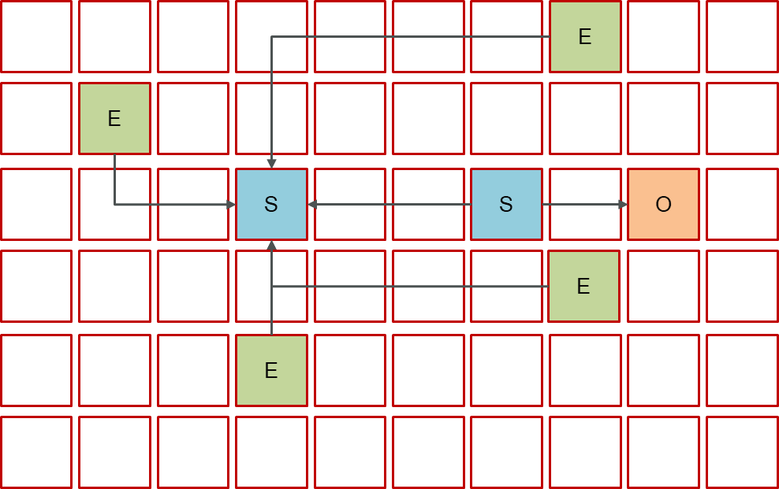
    
    此时可以将伊甸园区以及第一次的幸存者区进行释放
    
    

#### 新生代垃圾回收 + 并发标记

当老年代占用内存超过阈值(默认是45%)后， 触发并发标记，标记哪些对象是存活的， 这时无需暂停用户线程


 *  并发标记之后， 会有重新标记阶段解决漏标问题， 此时需要暂停用户线程
 *  这些都完成后就知道了老年代有哪些存活对象， 随后进入混合回收阶段. 此时不会对所有老年代区域进行回收， 而是根据暂停时间目标优先回收价值高(存活对象少，能够释放更多内存)的区域(这也是Gabage First名称的由来)
   
    
    
    > 内部会有一个预期暂停时间， 回收的暂停时间不能超过这个值

#### 混合垃圾回收

混合收集阶段中， 参与复制的有`Eden`、`Survivor`、`Old`

- 把伊甸园区和幸存者区中的一部分对象复制到一个新的幸存者区（下图中的绿色箭头
- 把旧幸存者区中到了一定阈值的对象以及被标记的老年代的对象复制到一个新的老年代


复制完成， 内存得到释放. 进入下一轮的新生代回收、并发标记、混合回收


G1会专门开辟一块连续的内存空间用来存储大对象（下图红色部分)

> 小对象好复制好压缩，大对象跨多个 Region 后，**复制成本高、回收复杂、容易碎片化**；
>
> 所以干脆直接放到老年代、固定不动，等 GC 标记时再处理。

**大对象会直接分配到老年代（Old Generation）**

- G1 不像其他 GC 会先把大对象放到 Eden；
- G1 会把大对象 **直接分配到多个连续的 Region 中**（叫做 Humongous Region）；
- 起始 Region 标记为 `StartsHumongous`，后续 Region 标记为 `ContinuesHumongous`。

**超过阈值自动触发 Full GC**

- 如果频繁创建大对象，导致 G1 无法分配足够连续空 Region，就会触发 **Full GC** 释放 Humongous 区域。

**回收依赖于 Full GC 或并发标记**

- Humongous 对象 **不是在普通 Minor GC 或 Mixed GC 中处理的**；
- 必须等到 **Full GC** 或 **并发标记周期 + Mixed GC 阶段** 才能尝试回收。


#### 总结 

详细聊一下G1垃圾回收器

 *  应用于新生代和老年代， 在JDK9之后默认使用G1
 *  划分成多个区域， 每个区域都可以充当`Eden`、`Survivor`、`Old`、`Humongous`， 其中`Humongous`专为大对象准备
 *  采用复制算法
 *  响应时间与吞吐量兼顾
 *  分成三个阶段: 新生代回收(STW)、并发标记(重新标记STW)、混合收集
 *  如果并发失败(即回收速度赶不上创建新对象速度)， 会触发`FullGC`

### 强引用、软引用、弱引用、虚引用 区别 

> ## JAVA引用类型
>
> 在 Java 中，**引用类型**（Reference Type）是一类存储指向对象的内存地址的变量类型。也就是说，引用类型变量**不直接存储对象的值**，而是存储一个引用（类似于对象的“地址”），通过这个引用可以访问实际的对象。
>
> ##### Java 中的引用类型包括：
>
> 1. **类（Class）**：所有通过 `class` 定义的类型，例如 `String`、`Integer` 等。
> 2. **接口（Interface）**：如 `List`、`Map` 等接口类型。
> 3. **数组（Array）**：如 `int[]`、`String[]` 等数组类型。
> 4. **枚举（Enum）**：通过 `enum` 定义的类型。
>
> ##### 引用类型与基本类型的区别：
>
> - **基本类型**（如 `int`、`char`、`boolean`）直接存储值。
> - **引用类型**存储的是对象的内存地址。

在GC的时候，不同引用的对象，GC的情况不同

 1. **强引用:** 只有所有`GC Roots`对象都不通过[强引用]引用该对象， 该对象才能被垃圾回收

    ```java
    User user = new User();
    ```

    
 2. **软引用:** 仅有软引用引用该对象时， 在垃圾回收后， 内存仍然不足时会再次触发垃圾回收

    ```java
    User user = new User();
    SoftReference softReference = new SoftReference(user);
    ```

    
 3. **弱引用:** 仅有弱引用引用该对象时， 在垃圾回收时， 无论内存是否充足， 都会回收弱引用对象

    ```java
    User user - new User();
    WeakReference weakReference = new WeakReference(user);
    ```

    

    延伸话题: ThreadLocal内存泄漏问题

    ```java
    static class Entry extends WeakReference<ThreadLocal<?>> {
     
        Object value;
    
        Entry(ThreadLocal<?> k， Object v) {
            super(k);
            value = v; //强引用，不会被回收
        }
    }
    ```
 4. **虚引用:** 必须配合引用队列使用， 被引用对象回收时， 会将虚引用入队， 由`Reference Handler`线程调用虚引用相关方法释放直接内存

    ```java
    User user = new User();
    ReferenceQueue referenceQueue = new ReferenceQueue();
    PhantomReference phantomReference = new PhantomReference(user，queue);
    ```

    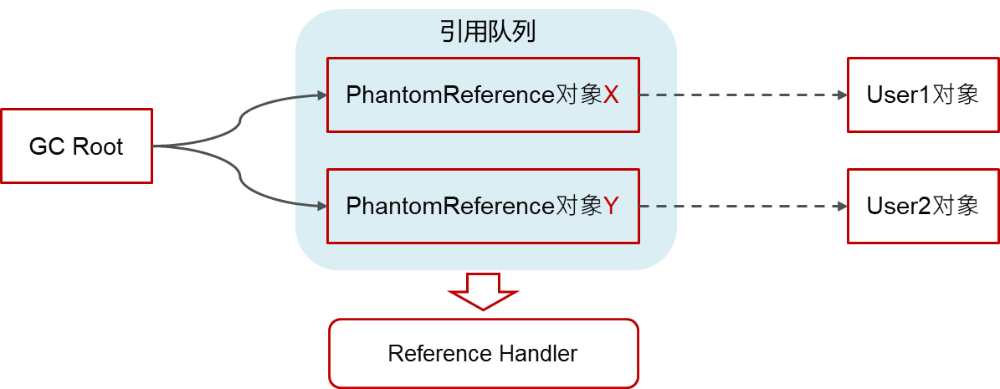

    弱引用和软引用也可以通过引用队列来释放自己的资源

#### 总结 

强引用、软引用、弱引用、虚引用的区别?

 *  强引用: 只要任意一个`GC Roots`能找到， 就不会被回收
 *  软引用: 需要配合`SoftReference`使用， 当垃圾多次回收， 内存依然不够的时候会回收软引用对象
 *  弱引用: 需要配合`WeakReference`使用， 只要进行了垃圾回收， 就会把弱引用对象回收
 *  虚引用: 必须配合引用队列使用， 被引用对象回收时， 会将虚引用加入到队列中， 由`Reference Handler`线程调用虚引用相关方法释放直接内存

## JVM实践 

我们一般在idea中设置的参数都是临时参数，那么在项目部署的时候如何设置？

### JVM调优的参数可以在哪里设置 

 *  war包部署在Tomcat中设置
 *  jar包部署在启动参数设置 --springboot项目

#### war包部署在Tomcat中设置 

修改TOMCAT\_HOME/bin/catalina.sh(Linux系统下， Windows是.bat结尾)文件

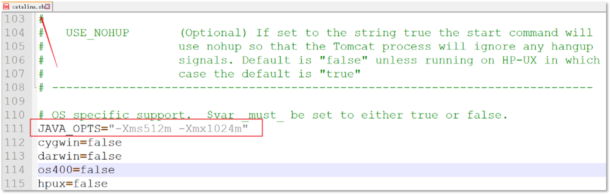

#### jar包部署在启动参数设置 

通常在Linux系统下直接加参数启动SpringBoot项目

```bash
nohup java -Xms512m -Xmx1024m -jar xxxx.jar --spring.profiles.active=prod &
```

`nohup`: 用于在系统后台不挂断的运行命令， 退出终端不会影响程序的运行

参数`&`: 让命令在后台执行， 终端退出后命令仍旧执行.

#### 总结 

JVM调优的参数可以在哪里设置参数值?

 *  war包部署在Tomcat中设置
   
    修改TOMCAT\_HOME/bin/catalina.sh(.bat)文件
 *  jar包部署在启动参数设置
   
    `java -Xms512m -Xmx1024m -jar xxxx.jar`

### JVM调优的参数 

#### 常用的JVM调优的参数都有哪些? 

对于JVM调优， 主要就是调整年轻代、老年代、元空间的内存空间大小及使用的垃圾回收器类型.

https://www.oracle.com/java/technologies/javase/vmoptions-jsp.html

 *  设置堆空间大小
 *  虚拟机栈的设置
 *  年轻代中`Eden`区和两个`Survivor`区的大小比例
 *  年轻代晋升老年代阈值
 *  设置垃圾回收器

#### 设置堆空间大小 

设置堆的初始大小和最大大小， 为了防止垃圾回收器在初始大小、最大大小之间收缩堆而产生额外的时间， 通常把最大、初始大小设置为相同的值.

```java
-Xms：设置堆的初始化大小
-Xmx：设置堆的最大大小

-Xms:1024
-Xms:1024k
-Xms:1024m
-Xms:1g
```

不指定单位默认为字节; 指定单位， 按照指定的单位设置

堆空间设置多少合适?

 *  最大大小的默认值是物理内存的1/4， 初始大小是物理内存的1/64
 *  堆太小， 可能会频繁的导致年轻代和老年代的垃圾回收， 会产生STW， 暂停用户线程
 *  堆内存大肯定是好的， 但是存在风险， 加入发生了FullGC， 它会扫描整个堆空间， 暂停用户线程的时间长
 *  设置参考推荐: 尽量大， 也要考察一下当前计算机其他程序的内存使用情况

#### 虚拟机栈的设置 

虚拟机栈的设置: 每个线程默认会开启1M的内存， 用于存放栈帧、调用参数、局部变量等， 但一般256K就够用. 通常较少每个线程的堆栈， 可以产生更多的线程， 但这实际上还受限于操作系统.

```bash
-Xss #对每个线程stack大小的调整.
-Xss128k
```

#### 年轻代中`Eden`区和两个`Survivor`区的大小比例 

设置年轻代中`Eden`区和两个`Survivor`区的大小比例. 该值如果不设置， 则默认比例为 8: 1: 1. 通过增大`Eden`区的大小， 来减少YGC发生的次数， 但有时我们发现， 虽然次数减少了， 但`Eden`区满的时候， 由于占用的空间较大， 导致释放缓慢， 此时STW的时间较长， 因此需要按照程序情况区调优.

```bash
-XXSurvivorRatio=8， 
# 表示年轻代中的分配比例: 
survivor:eden = 2:8
```

`-XXSurvivorRatio`代表`Eden`区占的份数， 假如设置为3， 则分配比例为: `survivor:eden = 2:3`

#### 年轻代晋升老年代阈值 

```bash
-XX:MaxTenuringThreshold=threshold
```

 *  默认为15
 *  取值范围0~15

#### 设置垃圾回收器 

通过增大吞吐量提高系统性能， 可以通过设置并行垃圾回收器

```java
-XX:+UseParallelGC
-XX:+UseParallelOldGC
```

```java
-XX:+UseG1GC
```

#### 总结 

常用的JVM调优的参数都有哪些?

 *  设置堆空间大小
 *  虚拟机栈的设置
 *  年轻代中`Eden`区和两个`Survivor`区的大小比例
 *  年轻代晋升老年代阈值
 *  设置垃圾回收器

### JVM调优的工具 

#### 说一下JVM调优的工具? 

 *  命令工具
   
     *  `jps`: 进程状态信息
     *  `jstack`: 查看Java进程内线程的堆栈信息
     *  `jmap`: 查看堆转信息
     *  `jhat`: 堆转储快照分析工具
     *  `jstat`: JVM统计监测工具
 *  可视化工具
   
     *  `jconsole`: 用于堆JVM的内存， 线程， 类 的监控
     *  `VisualVM`: 能够监控线程， 内存情况

#### `jps` 

进程状态信息

测试代码:

```java
package com.qqzj.jvm;

import java.util.ArrayList;
import java.util.List;

public class ToolDemo {
   
     
     

    public static void main(String[] args) {
   
     
     
        new Thread(()->{
   
     
     
            while (true){
   
     
     

            }
        }，"t1").start();
        new Thread(()->{
   
     
     
            while (true){
   
     
     

            }
        }，"t2").start();
        new Thread(()->{
   
     
     
            while (true){
   
     
     

            }
        }，"t3").start();
    }
}
```


#### `jstack` 

查看Java进程内线程的堆栈信息

```java
jstack [option] <pid>
```


#### `jmap` 

用于生成堆转内存快照、内存使用情况

```java
jmap -heap pid  # 显示Java堆的信息
```

```java
C:\Users\yuhon>jmap -heap 53280
Attaching to process ID 53280， please wait...
Debugger attached successfully.
Server compiler detected.
JVM version is 25.321-b07

using thread-local object allocation.
Parallel GC with 8 thread(s)   //并行的垃圾回收器

Heap Configuration:  //堆配置
   MinHeapFreeRatio         = 0   //空闲堆空间的最小百分比
   MaxHeapFreeRatio         = 100  //空闲堆空间的最大百分比
   MaxHeapSize              = 8524922880 (8130.0MB) //堆空间允许的最大值
   NewSize                  = 178257920 (170.0MB) //新生代堆空间的默认值
   MaxNewSize               = 2841640960 (2710.0MB) //新生代堆空间允许的最大值
   OldSize                  = 356515840 (340.0MB) //老年代堆空间的默认值
   NewRatio                 = 2 //新生代与老年代的堆空间比值，表示新生代：老年代=1：2
   SurvivorRatio            = 8 //两个Survivor区和Eden区的堆空间比值为8，表示S0:S1:Eden=1:1:8
   MetaspaceSize            = 21807104 (20.796875MB) //元空间的默认值
   CompressedClassSpaceSize = 1073741824 (1024.0MB) //压缩类使用空间大小
   MaxMetaspaceSize         = 17592186044415 MB //元空间允许的最大值
   G1HeapRegionSize         = 0 (0.0MB)//在使用 G1 垃圾回收算法时，JVM 会将 Heap 空间分隔为若干个 Region，该参数用来指定每个 Region 空间的大小。

Heap Usage:
PS Young Generation
Eden Space: //Eden使用情况
   capacity = 134217728 (128.0MB)
   used     = 10737496 (10.240074157714844MB)
   free     = 123480232 (117.75992584228516MB)
   8.000057935714722% used
From Space: //Survivor-From 使用情况
   capacity = 22020096 (21.0MB)
   used     = 0 (0.0MB)
   free     = 22020096 (21.0MB)
   0.0% used
To Space: //Survivor-To 使用情况
   capacity = 22020096 (21.0MB)
   used     = 0 (0.0MB)
   free     = 22020096 (21.0MB)
   0.0% used
PS Old Generation  //老年代 使用情况
   capacity = 356515840 (340.0MB)
   used     = 0 (0.0MB)
   free     = 356515840 (340.0MB)
   0.0% used

3185 interned Strings occupying 261264 bytes.
```

`jmap -dump:format=b，file=heap.hprof pid`

 *  `format=b`表示以`hprof`二进制格式转储Java堆的内存
 *  `file=<filename>`用于指定快照`dump`文件的文件名

> dump文件
>
> 它是一个进程或系统在某一给定的时间的快照. 比如在进程崩溃时， 甚至是任何时候， 我们都可以通过工具将系统或某进程的内存备份出来供调试分析用.
>
> dump文件中包含了程序运行的模块信息、线程信息、堆栈调用信息、异常信息等数据， 方便系统技术人员进行错误排查


#### `jstat` 

是JVM统计监测工具. 可以用来显示垃圾回收信息、类加载信息、新生代统计信息等.

1.  总结垃圾回收统计
  
    ```java
    jstat -gcutil pid
    ```
    
    
2.  垃圾回收统计
  
    ```java
    jstat -gc pid
    ```
    
    

#### `jconsole` 

用于堆JVM的内存， 线程， 类 的监控， 是一个基于JMX的GUI性能监控工具

打开方式: java安装目录bin目录下 直接启动jconsole.exe就行


#### `VisualVM` 

能够监控线程， 内存情况， 查看方法的CPU时间和内存中的对象， 已被GC的对象， 反向查看分配的堆栈

打开方式: java安装目录bin目录下直接启动jvisualvm.exe就行

只有JDK8是自带的， 更高版本需要去官网下载


监控程序运行情况


查看运行中的dump

Dump文件是进程的内存镜像. 可以把程序的执行状态通过调试器保存到Dump文件中


#### 总结 

说一下JVM的调优的工具?

命令工具

 *  `jps`: 进程状态信息
 *  `jstack`: 查看java进程内线程的堆栈信息
 *  `jmap`: 查看堆转信息
 *  `jhat`: 堆转储快照分析工具
 *  `jstat`: JVM统计监测工具

可视化工具

 *  jconsole: 用于对JVM的内存， 线程， 类的监控
 *  VisualVM: 能够监控线程， 内存情况

### java内存泄漏排查思路 


测试代码:

```java
package com.qqzj.jvm;

import java.util.ArrayList;
import java.util.List;

public class ToolDemo {
   
     
     

    public static void main(String[] args) {
   
     
     
        List<String> list = new ArrayList<>();
        while (true){
   
     
     
            list.add("北京");
        }
    }
}
```

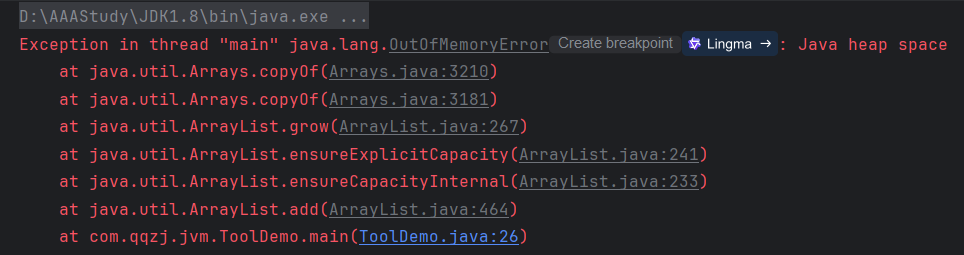


1.  获取堆内存快照dump
2.  VisualVM去分析dump文件
3.  通过查看堆信息的情况， 定位内存溢出问题

流程:

1.  通过`jmap`指令打印它的内存快照dump(Dump文件是进程的内存镜像， 可以把程序的执行状态通过调试器保存到dump文件中)
  
     *  使用`jmap`命令获取运行中程序的dump文件
       
        `jmap -dump:format=b，file=heap.hprof pid`
     *  使用vm参数获取dump文件
       
        有的情况是内存溢出之后程序则会直接终端， 而`jmap`只能打印在运行中的程序， 所以建议通过参数的方法生成dump文件
        
        ```java
        -XX:+HeapDumpOnOutOfMemoryError
        -XX:HeapDumpPath=***/***
        ```
2.  通过工具， VisualVM去分析dump文件，VisualVM可以加载离线的dump文件
  
    文件–>装入—>选择dump文件即可查看堆快照信息
    
    
3.  通过查看堆信息的情况，可以大概定位内存溢出是哪行代码出了问题
  
    
4.  找到对应的代码，通过阅读上下文的情况，进行修复即可
  
    

#### 总结 

java内存泄漏的排查思路?

内存泄漏通常是指堆内存， 通常是指一些大对象不被回收的情况

1.  通过jmap或设置jvm参数获取堆内存快照dump
2.  通过工具， VisualVM去分析dump文件，VisualVM可以加载离线的dump文件
3.  通过查看堆信息的情况，可以大概定位内存溢出是哪行代码出了问题
4.  找到对应的代码，通过阅读上下文的情况，进行修复即可

### CPU飚高排查方案与思路 

1.  使用`top`命令查看占用CPU的情况
  
    
2.  通过`top`命令查看后，可以查看是哪一个进程占用cpu较高，上图所示的进程为：40940
3.  查看进程中的线程信息
  
    ```java
    ps H -eo pid，tid，%cpu | grep 40940
    ```
    
    
    
    通过以上分析，在进程40940中的线程40950占用cpu较高
4.  可以根据线程 id 找到有问题的线程，进一步定位到问题代码的源码行号
  
    ```java
    jstack 40940   此处是进程id
    ```
    
    
    
    
    
    十进制转换为十六进制
    
    ```java
    printf "%x\n" 40955
    ```

#### 总结 

CPU飙高排查方案与思路？

1.  使用top命令查看占用cpu的情况
2.  通过top命令查看后，可以查看是哪一个进程占用cpu较高
3.  使用ps命令查看进程中的线程信息
4.  使用jstack命令查看进程中哪些线程出现了问题，最终定位问题

## 面经

### String a = new String("abc")，a指向的是什么？

> 在 Java 中，`String a = new String("abc");` 这行代码涉及到字符串的创建和内存的管理。下面是对这行代码的详细解释：
>
> ### 内存中的表示
>
> 1. **字符串常量池**：
>    - 当你写 `"abc"` 时，Java 会在字符串常量池（String Pool）中创建一个字符串对象。这个对象是不可变的，属于常量池。
>    - 如果代码中再次出现 `"abc"`，它会指向同一个常量池中的对象。
>
> 2. **使用 `new` 关键字**：
>    - 使用 `new String("abc")` 创建了一个新的 `String` 对象。这个对象在堆内存中分配，而不是在常量池中。
>    - `new String("abc")` 会在堆中分配内存并创建一个新的字符串对象，该对象的内容与常量池中的 `"abc"` 相同，但它们的内存地址不同。
>
> ### 赋值过程
>
> - **变量 `a`**：
>   - 变量 `a` 指向堆内存中通过 `new` 创建的字符串对象，而不是指向常量池中的 `"abc"`。
>   


###### 

## 面试现场 

### JVM组成 

> 面试官：JVM由那些部分组成，运行流程是什么？
>
> 候选人:
>
> 嗯，好的~~
>
> 在JVM中共有四大部分，分别是ClassLoader（类加载器）、Runtime Data Area（运行时数据区，内存分区）、Execution Engine（执行引擎）、Native Method Library（本地库接口）
>
> 它们的运行流程是：
>
> 第一，类加载器（ClassLoader）把Java代码转换为字节码
>
> 第二，运行时数据区（Runtime Data Area）把字节码加载到内存中，而字节码文件只是JVM的一套指令集规范，并不能直接交给底层系统去执行，而是有执行引擎运行
>
> 第三，执行引擎（Execution Engine）将字节码翻译为底层系统指令，再交由CPU执行去执行，此时需要调用其他语言的本地库接口（Native Method Library）来实现整个程序的功能。
>
> 面试官：好的，你能详细说一下 JVM 运行时数据区吗？
>
> 候选人:
>
> 嗯，好~
>
> 运行时数据区包含了堆、方法区、栈、本地方法栈、程序计数器这几部分，每个功能作用不一样。
>
>  *  堆解决的是对象实例存储的问题，垃圾回收器管理的主要区域。
>  *  方法区可以认为是堆的一部分，用于存储已被虚拟机加载的信息，常量、静态变量、即时编译器编译后的代码。
>  *  栈解决的是程序运行的问题，栈里面存的是栈帧，栈帧里面存的是局部变量表、操作数栈、动态链接、方法出口等信息。
>  *  本地方法栈与栈功能相同，本地方法栈执行的是本地方法，一个Java调用非Java代码的接口。
>  *  程序计数器（PC寄存器）程序计数器中存放的是当前线程所执行的字节码的行数。JVM工作时就是通过改变这个计数器的值来选取下一个需要执行的字节码指令。
>
> 面试官：好的，你再详细介绍一下程序计数器的作用？
>
> 候选人:
>
> 嗯，是这样~~
>
> java虚拟机对于多线程是通过线程轮流切换并且分配线程执行时间。在任何的一个时间点上，一个处理器只会处理执行一个线程，如果当前被执行的这个线程它所分配的执行时间用完了【挂起】。处理器会切换到另外的一个线程上来进行执行。并且这个线程的执行时间用完了，接着处理器就会又来执行被挂起的这个线程。这时候程序计数器就起到了关键作用，程序计数器在来回切换的线程中记录他上一次执行的行号，然后接着继续向下执行。
>
> 面试官：你能给我详细的介绍Java堆吗?
>
> 候选人:
>
> 好的~
>
> Java中的堆术语线程共享的区域。主要用来保存对象实例，数组等，当堆中没有内存空间可分配给实例，也无法再扩展时，则抛出OutOfMemoryError异常。
>
> 在JAVA8中堆内会存在年轻代、老年代
>
> 1）Young区被划分为三部分，Eden区和两个大小严格相同的Survivor区，其中，Survivor区间中，某一时刻只有其中一个是被使用的，另外一个留做垃圾收集时复制对象用。在Eden区变满的时候， GC就会将存活的对象移到空闲的Survivor区间中，根据JVM的策略，在经过几次垃圾收集后，任然存活于Survivor的对象将被移动到Tenured区间。
>
> 2）Tenured区主要保存生命周期长的对象，一般是一些老的对象，当一些对象在Young复制转移一定的次数以后，对象就会被转移到Tenured区。
>
> 面试官：能不能解释一下方法区？
>
> 候选人:
>
> 好的~
>
> 与虚拟机栈类似。本地方法栈是为虚拟机执行本地方法时提供服务的。不需要进行GC。本地方法一般是由其他语言编写。
>
> 面试官：你听过直接内存吗？
>
> 候选人:
>
> 嗯~~
>
> 它又叫做堆外内存，线程共享的区域，在 Java 8 之前有个永久代的概念，实际上指的是 HotSpot 虚拟机上的永久代，它用永久代实现了 JVM 规范定义的方法区功能，主要存储类的信息，常量，静态变量，即时编译器编译后代码等，这部分由于是在堆中实现的，受 GC 的管理，不过由于永久代有 -XX:MaxPermSize 的上限，所以如果大量动态生成类（将类信息放入永久代），很容易造成 OOM，有人说可以把永久代设置得足够大，但很难确定一个合适的大小，受类数量，常量数量的多少影响很大。
>
> 所以在 Java 8 中就把方法区的实现移到了本地内存中的元空间中，这样方法区就不受 JVM 的控制了，也就不会进行 GC，也因此提升了性能。
>
> 面试官：什么是虚拟机栈
>
> 候选人:
>
> 虚拟机栈是描述的是方法执行时的内存模型，是线程私有的，生命周期与线程相同，每个方法被执行的同时会创建栈桢。保存执行方法时的局部变量、动态连接信息、方法返回地址信息等等。方法开始执行的时候会进栈，方法执行完会出栈【相当于清空了数据】，所以这块区域不需要进行 GC。
>
> 面试官：能说一下堆栈的区别是什么吗？
>
> 候选人:
>
> 嗯，好的，有这几个区别
>
> 第一，栈内存一般会用来存储局部变量和方法调用，但堆内存是用来存储Java对象和数组的的。堆会GC垃圾回收，而栈不会。
>
> 第二、栈内存是线程私有的，而堆内存是线程共有的。
>
> 第三、两者异常错误不同，但如果栈内存或者堆内存不足都会抛出异常。
>
> 栈空间不足：java.lang.StackOverFlowError。
>
> 堆空间不足：java.lang.OutOfMemoryError。

### 类加载器 

> 面试官：什么是类加载器，类加载器有哪些?
>
> 候选人:
>
> 嗯，是这样的
>
> JVM只会运行二进制文件，而类加载器（ClassLoader）的主要作用就是将字节码文件加载到JVM中，从而让Java程序能够启动起来。
>
> 常见的类加载器有4个
>
> 第一个是启动类加载器(BootStrap ClassLoader)：其是由C++编写实现。用于加载JAVA\_HOME/jre/lib目录下的类库。
>
> 第二个是扩展类加载器(ExtClassLoader)：该类是ClassLoader的子类，主要加载JAVA\_HOME/jre/lib/ext目录中的类库。
>
> 第三个是应用类加载器(AppClassLoader)：该类是ClassLoader的子类，主要用于加载classPath下的类，也就是加载开发者自己编写的Java类。
>
> 第四个是自定义类加载器：开发者自定义类继承ClassLoader，实现自定义类加载规则。
>
> 面试官：说一下类装载的执行过程？
>
> 候选人:
>
> 嗯，这个过程还是挺多的。
>
> 类从加载到虚拟机中开始，直到卸载为止，它的整个生命周期包括了：加载、验证、准备、解析、初始化、使用和卸载这7个阶段。其中，验证、准备和解析这三个部分统称为连接（linking）
>
> 1.加载：查找和导入class文件
>
> 2.验证：保证加载类的准确性
>
> 3.准备：为类变量分配内存并设置类变量初始值
>
> 4.解析：把类中的符号引用转换为直接引用
>
> 5.初始化：对类的静态变量，静态代码块执行初始化操作
>
> 6.使用：JVM 开始从入口方法开始执行用户的程序代码
>
> 7.卸载：当用户程序代码执行完毕后，JVM 便开始销毁创建的 Class 对象，最后负责运行的 JVM 也退出内存
>
> 面试官：什么是双亲委派模型？
>
> 候选人:
>
> 嗯，它是是这样的。
>
> 如果一个类加载器收到了类加载的请求，它首先不会自己尝试加载这个类，而是把这请求委派给父类加载器去完成，每一个层次的类加载器都是如此，因此所有的加载请求最终都应该传说到顶层的启动类加载器中，只有当父类加载器返回自己无法完成这个加载请求（它的搜索返回中没有找到所需的类）时，子类加载器才会尝试自己去加载
>
> 面试官：JVM为什么采用双亲委派机制
>
> 候选人:
>
> 主要有两个原因。
>
> 第一、通过双亲委派机制可以避免某一个类被重复加载，当父类已经加载后则无需重复加载，保证唯一性。
>
> 第二、为了安全，保证类库API不会被修改

### 垃圾回收 

> 面试官：简述Java垃圾回收机制？（GC是什么？为什么要GC）
>
> 候选人:
>
> 嗯，是这样~~
>
> 为了让程序员更专注于代码的实现，而不用过多的考虑内存释放的问题，所以，在Java语言中，有了自动的垃圾回收机制，也就是我们熟悉的GC(Garbage Collection)。
>
> 有了垃圾回收机制后，程序员只需要关心内存的申请即可，内存的释放由系统自动识别完成。
>
> 在进行垃圾回收时，不同的对象引用类型，GC会采用不同的回收时机
>
> 面试官：强引用、软引用、弱引用、虚引用的区别？
>
> 候选人:
>
> 嗯嗯~
>
> 强引用最为普通的引用方式，表示一个对象处于有用且必须的状态，如果一个对象具有强引用，则GC并不会回收它。即便堆中内存不足了，宁可出现OOM，也不会对其进行回收
>
> 软引用表示一个对象处于有用且非必须状态，如果一个对象处于软引用，在内存空间足够的情况下，GC机制并不会回收它，而在内存空间不足时，则会在OOM异常出现之间对其进行回收。但值得注意的是，因为GC线程优先级较低，软引用并不会立即被回收。
>
> 弱引用表示一个对象处于可能有用且非必须的状态。在GC线程扫描内存区域时，一旦发现弱引用，就会回收到弱引用相关联的对象。对于弱引用的回收，无关内存区域是否足够，一旦发现则会被回收。同样的，因为GC线程优先级较低，所以弱引用也并不是会被立刻回收。
>
> 虚引用表示一个对象处于无用的状态。在任何时候都有可能被垃圾回收。虚引用的使用必须和引用队列Reference Queue联合使用
>
> 面试官：对象什么时候可以被垃圾器回收
>
> 候选人:
>
> 思考一会~~
>
> 如果一个或多个对象没有任何的引用指向它了，那么这个对象现在就是垃圾，如果定位了垃圾，则有可能会被垃圾回收器回收。
>
> 如果要定位什么是垃圾，有两种方式来确定，第一个是引用计数法，第二个是可达性分析算法
>
> 通常都使用可达性分析算法来确定是不是垃圾
>
> 面试官： JVM 垃圾回收算法有哪些？
>
> 候选人:
>
> 我记得一共有四种，分别是标记清除算法、复制算法、标记整理算法、分代回收
>
> 面试官： 你能详细聊一下分代回收吗？
>
> 候选人:
>
> 关于分代回收是这样的
>
> 在java8时，堆被分为了两份：新生代和老年代，它们默认空间占用比例是1:2
>
> 对于新生代，内部又被分为了三个区域。Eden区，S0区，S1区默认空间占用比例是8:1:1
>
> 具体的工作机制是有些情况：
>
> 1）当创建一个对象的时候，那么这个对象会被分配在新生代的Eden区。当Eden区要满了时候，触发YoungGC。
>
> 2）当进行YoungGC后，此时在Eden区存活的对象被移动到S0区，并且当前对象的年龄会加1，清空Eden区。
>
> 3）当再一次触发YoungGC的时候，会把Eden区中存活下来的对象和S0中的对象，移动到S1区中，这些对象的年龄会加1，清空Eden区和S0区。
>
> 4）当再一次触发YoungGC的时候，会把Eden区中存活下来的对象和S1中的对象，移动到S0区中，这些对象的年龄会加1，清空Eden区和S1区。
>
> 5）对象的年龄达到了某一个限定的值（默认15岁 ），那么这个对象就会进入到老年代中。
>
> 当然也有特殊情况，如果进入Eden区的是一个大对象，在触发YoungGC的时候，会直接存放到老年代
>
> 当老年代满了之后，触发FullGC。FullGC同时回收新生代和老年代，当前只会存在一个FullGC的线程进行执行，其他的线程全部会被挂起。 我们在程序中要尽量避免FullGC的出现。
>
> 面试官：讲一下新生代、老年代、永久代的区别？
>
> 候选人:
>
> 嗯！是这样的，简单说就是
>
> 新生代主要用来存放新生的对象。
>
> 老年代主要存放应用中生命周期长的内存对象。
>
> 永久代指的是永久保存区域。主要存放Class和Meta（元数据）的信息。在Java8中，永久代已经被移除，取而代之的是一个称之为“元数据区”（元空间）的区域。元空间和永久代类似，不过元空间与永久代之间最大的区别在于：元空间并不在虚拟机中，而是使用本地内存。因此，默认情况下，元空间的大小仅受本地内存的限制。
>
> 面试官：说一下 JVM 有哪些垃圾回收器？
>
> 候选人:
>
> 在jvm中，实现了多种垃圾收集器，包括：串行垃圾收集器、并行垃圾收集器（JDK8默认）、CMS（并发）垃圾收集器、G1垃圾收集器（JDK9默认）
>
> 面试官：Minor GC、Major GC、Full GC是什么
>
> 候选人:
>
> 嗯，其实它们指的是不同代之间的垃圾回收
>
> Minor GC 发生在新生代的垃圾回收，暂停时间短
>
> Major GC 老年代区域的垃圾回收，老年代空间不足时，会先尝试触发Minor GC。Minor GC之后空间还不足，则会触发Major GC，Major GC速度比较慢，暂停时间长
>
> Full GC 新生代 + 老年代完整垃圾回收，暂停时间长，应尽力避免

### JVM实践（调优） 

> 面试官：JVM 调优的参数可以在哪里设置参数值？
>
> 候选人:
>
> 我们当时的项目是springboot项目，可以在项目启动的时候，java -jar中加入参数就行了
>
> 面试官：用的 JVM 调优的参数都有哪些？
>
> 候选人:
>
> 嗯，这些参数是比较多的
>
> 我记得当时我们设置过堆的大小，像-Xms和-Xmx
>
> 还有就是可以设置年轻代中Eden区和两个Survivor区的大小比例
>
> 还有就是可以设置使用哪种垃圾回收器等等。具体的指令还真记不太清楚。
>
> 面试官：嗯，好的，你们平时调试 JVM都用了哪些工具呢？
>
> 候选人:
>
> 嗯，我们一般都是使用jdk自带的一些工具，比如
>
> jps 输出JVM中运行的进程状态信息
>
> jstack查看java进程内线程的堆栈信息。
>
> jmap 用于生成堆转存快照
>
> jstat用于JVM统计监测工具
>
> 还有一些可视化工具，像jconsole和VisualVM等
>
> 面试官：假如项目中产生了java内存泄露，你说一下你的排查思路？
>
> 候选人:
>
> 嗯，这个我在之前项目排查过
>
> 第一呢可以通过jmap指定打印他的内存快照 dump文件，不过有的情况打印不了，我们会设置vm参数让程序自动生成dump文件
>
> 第二，可以通过工具去分析 dump文件，jdk自带的VisualVM就可以分析
>
> 第三，通过查看堆信息的情况，可以大概定位内存溢出是哪行代码出了问题
>
> 第四，找到对应的代码，通过阅读上下文的情况，进行修复即可
>
> 面试官：好的，那现在再来说一种情况，就是说服务器CPU持续飙高，你的排查方案与思路？
>
> 候选人:
>
> 嗯，我思考一下~~
>
> 可以这么做~~
>
> 第一可以使用使用top命令查看占用cpu的情况
>
> 第二通过top命令查看后，可以查看是哪一个进程占用cpu较高，记录这个进程id
>
> 第三可以通过ps 查看当前进程中的线程信息，看看哪个线程的cpu占用较高
>
> 第四可以jstack命令打印进行的id，找到这个线程，就可以进一步定位问题代码的行号  
> 在触发YoungGC的时候，会直接存放到老年代
>
> 当老年代满了之后，触发FullGC。FullGC同时回收新生代和老年代，当前只会存在一个FullGC的线程进行执行，其他的线程全部会被挂起。 我们在程序中要尽量避免FullGC的出现。
>
> 面试官：讲一下新生代、老年代、永久代的区别？
>
> 候选人:
>
> 嗯！是这样的，简单说就是
>
> 新生代主要用来存放新生的对象。
>
> 老年代主要存放应用中生命周期长的内存对象。
>
> 永久代指的是永久保存区域。主要存放Class和Meta（元数据）的信息。在Java8中，永久代已经被移除，取而代之的是一个称之为“元数据区”（元空间）的区域。元空间和永久代类似，不过元空间与永久代之间最大的区别在于：元空间并不在虚拟机中，而是使用本地内存。因此，默认情况下，元空间的大小仅受本地内存的限制。
>
> 面试官：说一下 JVM 有哪些垃圾回收器？
>
> 候选人:
>
> 在jvm中，实现了多种垃圾收集器，包括：串行垃圾收集器、并行垃圾收集器（JDK8默认）、CMS（并发）垃圾收集器、G1垃圾收集器（JDK9默认）
>
> 面试官：Minor GC、Major GC、Full GC是什么
>
> 候选人:
>
> 嗯，其实它们指的是不同代之间的垃圾回收
>
> Minor GC 发生在新生代的垃圾回收，暂停时间短
>
> Major GC 老年代区域的垃圾回收，老年代空间不足时，会先尝试触发Minor GC。Minor GC之后空间还不足，则会触发Major GC，Major GC速度比较慢，暂停时间长
>
> Full GC 新生代 + 老年代完整垃圾回收，暂停时间长，应尽力避免

### JVM实践（调优） 

> 面试官：JVM 调优的参数可以在哪里设置参数值？
>
> 候选人:
>
> 我们当时的项目是springboot项目，可以在项目启动的时候，java -jar中加入参数就行了
>
> 面试官：用的 JVM 调优的参数都有哪些？
>
> 候选人:
>
> 嗯，这些参数是比较多的
>
> 我记得当时我们设置过堆的大小，像-Xms和-Xmx
>
> 还有就是可以设置年轻代中Eden区和两个Survivor区的大小比例
>
> 还有就是可以设置使用哪种垃圾回收器等等。具体的指令还真记不太清楚。
>
> 面试官：嗯，好的，你们平时调试 JVM都用了哪些工具呢？
>
> 候选人:
>
> 嗯，我们一般都是使用jdk自带的一些工具，比如
>
> jps 输出JVM中运行的进程状态信息
>
> jstack查看java进程内线程的堆栈信息。
>
> jmap 用于生成堆转存快照
>
> jstat用于JVM统计监测工具
>
> 还有一些可视化工具，像jconsole和VisualVM等
>
> 面试官：假如项目中产生了java内存泄露，你说一下你的排查思路？
>
> 候选人:
>
> 嗯，这个我在之前项目排查过
>
> 第一呢可以通过jmap指定打印他的内存快照 dump文件，不过有的情况打印不了，我们会设置vm参数让程序自动生成dump文件
>
> 第二，可以通过工具去分析 dump文件，jdk自带的VisualVM就可以分析
>
> 第三，通过查看堆信息的情况，可以大概定位内存溢出是哪行代码出了问题
>
> 第四，找到对应的代码，通过阅读上下文的情况，进行修复即可
>
> 面试官：好的，那现在再来说一种情况，就是说服务器CPU持续飙高，你的排查方案与思路？
>
> 候选人:
>
> 嗯，我思考一下~~
>
> 可以这么做~~
>
> 第一可以使用使用top命令查看占用cpu的情况
>
> 第二通过top命令查看后，可以查看是哪一个进程占用cpu较高，记录这个进程id
>
> 第三可以通过ps 查看当前进程中的线程信息，看看哪个线程的cpu占用较高
>
> 第四可以jstack命令打印进行的id，找到这个线程，就可以进一步定位问题代码的行号


