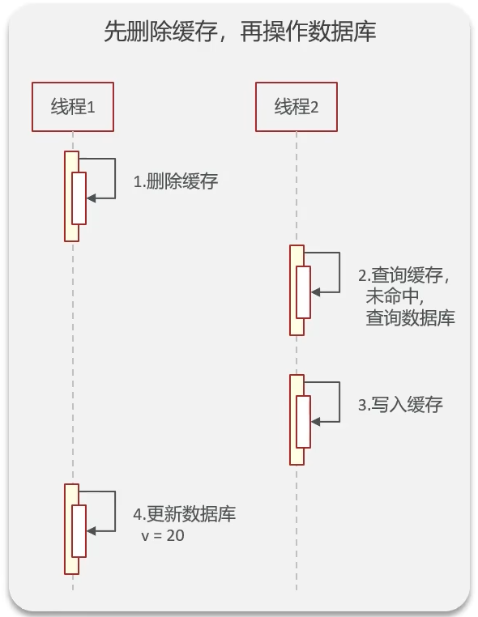
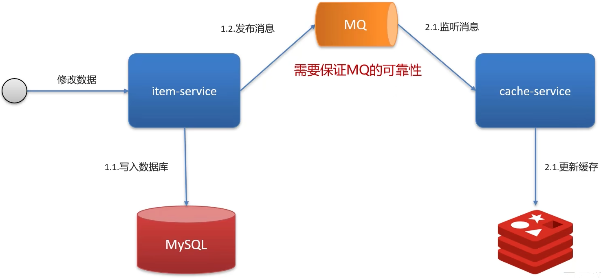

使用场景


其他面试题


# 使用场景 SSS

一定要结合场景来回答！！！


### 缓存穿透 


缓存穿透: 查询一个不存在的数据, MySQL查询不到数据也不会直接写入缓存, 就会导致每次请求都查数据库。如果请求的用户很多可能导致宕机

**解决方案一: 缓存空数据, 查询返回的数据为空, 仍然把这个空结果进行缓存**

```java
{key:1,value:null}
```

优点: 简单

缺点: 消耗内存, 可能发生不一致的问题(例如后续数据库中新添加了不存在的数据，但缓存没有及时更新)

**解决方案二:布隆过滤器**

缓存预热：就是在把热点数据添加到缓存的同时，也要添加到布隆过滤器中


优点: 内存占用较少, 没有多余key

缺点: 实现复杂, 存在误判

### 布隆过滤器 

`bitmap(位图)`: 相当于是一个以(bit)位为单位的数组, 数组中每个单元只能存储二进制数0或1

>Bitmap 不是 Redis 中的实际数据类型，而是在 String 类型上定义的一组面向位的操作，将其视为位向量。由于字符串是二进制安全的块，且最大长度为 512 MB，它们适合用于设置最多 2^32 个不同的位。

布隆过滤器作用: 布隆过滤器可以用于检索一个元素是否在一个集合中


误判率: 数组越小误判率越大, 数组越大误判率就越小, 但是同时带来了更多的内存消耗


### 缓存击穿 

缓存击穿: 给某一个key设置了过期时间, 当key过期的时候, 恰好这时间点对这个key有大量的并发请求过来, 这些并发的请求可能会瞬间把DB压垮

虽然数据库查询到数据后会同步给redis，但可能这个重建的过程较为复杂，例如花费了50ms，在这个期间可能会有大量的并发请求导致DB宕机

> 缓存击穿和缓存穿透的区别
>
> 缓存穿透中，请求的 key 既不存在于缓存中，也不存在于数据库中。
>
> 缓存击穿中，请求的 key 对应的是 **热点数据** ，该数据 **存在于数据库中，但不存在于缓存中（通常是因为缓存中的那份数据已经过期）** 


**解决方案一： 互斥锁**


强一致、性能差

**解决方案二： 逻辑过期**


高可用、性能优、但是不能保证数据绝对一致


### 缓存雪崩 

缓存雪崩: 是指在同一时段内大量的缓存key同时失效或者Redis服务宕机, 导致大量请求到达数据库, 带来巨大压力

解决方案:

 *  **大量key过期:** 给不同的Key的TTL添加随机值(随机的过期时间)
 *  **Redis服务宕机:** 利用Redis集群提高服务的可用性. 哨兵模式、集群模式
 *  **给缓存业务添加降级限流策略：** Nginx或者Spring Cloud Gateway、降级可作为系统的保底策略, 适用于穿透、击穿、雪崩
 *  **给业务添加多级缓存：** Guava或Caffeine

### 缓存三兄弟 

> 穿透无中生有key, 布隆过滤null隔离
>
> 缓存击穿过期key, 锁与非期解难题
>
> 雪崩大量过期key, 过期时间要随机
>
> 面试必考三兄弟, 可用限流来保底


### 双写一致性 


介绍业务背景

- 一致性要求高? 
- 允许延迟一致?

不同的背景对应的是不同的解决方案

#### 双写一致 

双写一致性: 当修改了数据库的数据也要同时更新缓存的数据, 缓存和数据库的数据要保持一致


 *  读操作: 缓存命中, 直接返回; 缓存为命中查询数据库, 写入缓存, 设定超时时间
 *  写操作: 延迟双删
   
    
    
    关于我们是应该先删除缓存还是先删除数据库，其实都有问题

1. 先删除缓存, 还是先修改数据库?

    - 先删除缓存再修改数据库可能存在的问题是

    

    

2. 为什么要删除两次缓存?

    在修改完数据库后再删除一次缓存，降低出现脏数据的可能性

3. 为什么要延时删除?

    DB的主从复制模式，修改完数据库后延时一会儿，等到复制结束后再删除缓存。但因为时间不确定，所以仍有读脏数据的可能

    

#### 强一致 （加锁）


优化: 一般存入缓存的数据都是读多写少的数据

共享锁: 读锁`readLock`, 加锁之后, 其他线程可以共享读操作

排他锁: 也叫独占锁`writeLock`, 加锁之后, 阻塞其他县城读写操作


实现:

读锁:


独占锁:


#### 延迟一致 

延迟一直也就是允许数据短暂地不一致，在开发中多采用这种方式

异步通知保证数据的最终一致性



基于Canal(阿里的一款中间件)的异步通知


#### 面试回答 

Redis作为缓存, MySQL的数据如何与Redis进行同步呢? (双写一致性)

1.  介绍自己简历上的业务, 我们当时是把文章的热点数据存入到了缓存中, 虽然是热点数据, 但是实时性要求并没有那么高, 所以, 我们当时采用的是异步的同步数据的方案
2.  我们当时是把抢券的库存存入到了缓存中, 这个需要实时的记性你数据同步, 为了保证数据的强一致, 我们当时采用的是`redisson`提供的读写锁来保证数据的同步

那你来介绍一下异步的方案(`redisson`读写锁的这种方案)

 *  允许延时一致的业务, 采用异步通知
   
    1.  使用MQ消息中间件, 更新数据之后, 通知缓存删除
    2.  利用Canal中间件, 不需要修改业务代码, 伪装为MySQL的一个从节点, Canal通过读取`binlog`的数据更新缓存
 *  强一致性的, 采用`Redisson`提供的读写锁
   
    1.  共享锁: 读锁`readLock`, 加锁之后, 其他线程可以共享读操作
    2.  排他锁: 也叫独占锁`writeLock`, 加锁之后, 阻塞其他县城读写操作

### 持久化 

#### Redis作为缓存, 数据的持久化是怎么做的? 

在Redis中提供了两种数据持久化的方式: 1. `RDB`2. `AOF`

#### RDB 

RDB全称`Redis Database Backup file`(Redis数据备份文件), 也被叫做Redis数据快照. 简单来说就是把内存中的所有数据都记录到磁盘中. 当Redis实例故障重启后, 从磁盘读取快照文件, 恢复数据


Redis内部有触发`RDB`的机制, 可以在`redis.conf`文件中找到，格式如下

```java
# 900秒内，如果至少有1个key被修改，则执行bgsave 
save 900 1  
save 300 10  
save 60 10000
```

#### RDB的执行原理 

`bgsave`开始时会`fork`主进程得到子进程, 子进程共享主进程的内存数据. 完成`fork`后读取内存数据并写入RDB文件

`fork`采用的是`copy-on-write`技术:

 *  当主进程执行读操作时, 访问共享内存
 *  当主进程执行写操作时, 则会拷贝一份数据, 执行写操作


#### AOF 

AOF全称为`Append Only File`(追加文件). Redis处理的每一个写命令都会记录在AOF文件, 可以看作是命令日志文件.


AOF默认是关闭的, 需要修改`redis.conf`配置文件来开启AOF:

```java
# 是否开启AOF功能，默认是no
appendonly yes
# AOF文件的名称
appendfilename "appendonly.aof"
```

AOF的命令记录的频率也可以通过`redis.conf`文件来配

```java
# 表示每执行一次写命令，立即记录到AOF文件
appendfsync always 
# 写命令执行完先放入AOF缓冲区，然后表示每隔1秒将缓冲区数据写到AOF文件，是默认方案
appendfsync everysec 
# 写命令执行完先放入AOF缓冲区，由操作系统决定何时将缓冲区内容写回磁盘
appendfsync no
```

<table> 
 <thead> 
  <tr> 
   <th><strong>配置项</strong></th> 
   <th><strong>刷盘时机</strong></th> 
   <th><strong>优点</strong></th> 
   <th><strong>缺点</strong></th> 
  </tr> 
 </thead> 
 <tbody> 
  <tr> 
   <td>Always</td> 
   <td>同步刷盘</td> 
   <td>可靠性高，几乎不丢数据</td> 
   <td>性能影响大</td> 
  </tr> 
  <tr> 
   <td>everysec</td> 
   <td>每秒刷盘</td> 
   <td>性能适中</td> 
   <td>最多丢失1秒数据</td> 
  </tr> 
  <tr> 
   <td>no</td> 
   <td>操作系统控制</td> 
   <td>性能最好</td> 
   <td>可靠性较差，可能丢失大量数据</td> 
  </tr> 
 </tbody> 
</table>

因为是记录命令, AOF文件会比RDB文件大得多. 而且AOF会记录对同一个key的多次写操作, 但只有最后一次写操作才有意义. 通过执行`bgrewriteaof`命令, 可以让AOF文件执行重写功能, 用最少的命令达到相同效果


Redis也会在触发阈值时自动去重写AOF文件. 阈值也可以在`redis.conf`中配置:

```java
# AOF文件比上次文件 增长超过多少百分比则触发重写
auto-aof-rewrite-percentage 100
# AOF文件体积最小多大以上才触发重写 
auto-aof-rewrite-min-size 64mb
```

#### RDB和AOF对比 

RDB和AOF各有自己的优缺点, 如果对数据安全性要求较高, 在实际开发中往往会结合两者来使用

<table> 
 <thead> 
  <tr> 
   <th></th> 
   <th><strong>RDB</strong></th> 
   <th><strong>AOF</strong></th> 
  </tr> 
 </thead> 
 <tbody> 
  <tr> 
   <td>持久化方式</td> 
   <td>定时对整个内存做快照</td> 
   <td>记录每一次执行的命令</td> 
  </tr> 
  <tr> 
   <td>数据完整性</td> 
   <td>不完整，两次备份之间会丢失</td> 
   <td>相对完整，取决于刷盘策略</td> 
  </tr> 
  <tr> 
   <td>文件大小</td> 
   <td>会有压缩，文件体积小</td> 
   <td>记录命令，文件体积很大</td> 
  </tr> 
  <tr> 
   <td>宕机恢复速度</td> 
   <td>很快</td> 
   <td>慢</td> 
  </tr> 
  <tr> 
   <td>数据恢复优先级</td> 
   <td>低，因为数据完整性不如AOF</td> 
   <td>高，因为数据完整性更高</td> 
  </tr> 
  <tr> 
   <td>系统资源占用</td> 
   <td>高，大量CPU和内存消耗</td> 
   <td>低，主要是磁盘IO资源 但AOF重写时会占用大量CPU和内存资源</td> 
  </tr> 
  <tr> 
   <td>使用场景</td> 
   <td>可以容忍数分钟的数据丢失，追求更快的启动速度</td> 
   <td>对数据安全性要求较高常见</td> 
  </tr> 
 </tbody> 
</table>

### 数据过期策略 

#### 假如Redis的key过期之后, 会立即删除吗? 

Redis对数据设置数据的有效时间, 数据过期以后, 就需要将数据从内存中删除掉. 可以按照不同的规则进行删除, 这种规则就被称之为数据的删除策略(数据过期策略).

惰性删除、定期删除

#### 惰性删除 

惰性删除: 设置该key过期时间后, 我们不去管它, 当需要该key时, 我们再检查其是否过期, 如果过期, 我们就删掉它, 反之返回该key


优点: 对CPU友好, 只会在使用该key时才会进行过期检查, 对于很多用不到的key不用浪费时间进行过期检查

缺点: 对内存不友好, 如果一个key已经过期, 但是一直没有使用, 那么该key就会一直存在内存中, 内存永远不会释放

#### 定期删除 

定期删除: 每隔一段时间, 我们就对一些key进行检查, 删除里面过期的key(从一定数量的数据库中取出一定数量的随机key进行检查, 并删除其中的过期key).

定期清理有两种模式:

 *  SLOW模式时定时任务, 执行频率默认为10hz, 每次不超过25ms, 以通过修改配置文件`redis.conf`的`hz`选项来调整这个次数
 *  FAST模式执行频率不固定, 但两次间隔不低于2ms, 每次耗时不超过1ms

优点: 可以通过限制删除操作执行的时长和频率来减少删除操作对CPU的影响. 另外定期删除, 也能有效释放过期key占用的内存

缺点: 难以确定删除操作执行的时长和频率

#### **Redis的过期删除策略 ** 

惰性删除 + 定期删除两种策略进行配合使用

### 数据淘汰策略 

#### 假如缓存过多, 内存是有限的, 内存被占满了怎么办? 

其实就是想问Redis的数据淘汰策略是什么?

#### 数据淘汰策略 

数据淘汰策略: 当Redis中的内存不够用时, 此时再想Redis中添加新的key, 那么Redis就会按照某一种规则将内存中的数据删除掉, 这种数据的删除规则被称之为内存的淘汰策略

Redis支持8种不同策略来选择要删除的key:

 *  `noeviction`: 不淘汰任何key, 但是内存满时不允许写入新数据, 默认就是这种策略
 *  `volatile-ttl`: 对设置了TTL的key, 比较key的剩余TTL值, TTL越小越先被淘汰
 *  `allkeys-random`: 对全体key, 随机进行淘汰
 *  `volatile-random`: 对设置了TTL的key, 随机进行淘汰.
 *  `allkeys-lru`: 对全体key, 基于LRU算法进行淘汰
 *  `volatile-lru`: 对设置了TTL的key, 基于LRU算法进行淘汰
 *  `allkeys-lfu`: 对全体key, 基于LFU算法进行淘汰
 *  `volatile-lfu`: 对设置了TTL的key, 基于LFU算法进行淘汰


#### 使用建议 

1.  优先使用`allkeys-lru`策略. 充分利用LRU算法的优势, 把最近最常访问的数据留在缓存中. 如果业务有明显的冷热数据区分, 建议使用.
2.  如果业务中数据访问频率差别不大, 没有明显冷热数据区分, 建议使用`allkeys-random`, 随机选择淘汰.
3.  如果业务中有置顶的需求, 可以使用`volatile-lru`策略, 同时置顶数据不设置过期时间, 这些数据就一直不被删除, 会淘汰其他设置了过期时间的数据
4.  如果业务中有短时高频访问的数据, 可以使用`allkeys-lfu`或`volatile-lfu`策略

#### 关于数据淘汰策略其他的面试问题 

1.  数据库有1000万数据, Redis只能缓存20W数据, 如何保证Redis中的数据都是热点数据?
  
    答: 使用`allkeys-lru`(挑选最近最少使用的数据淘汰)淘汰策略, 留下来的都是经常访问的热点数据
2.  Redis的内存用完了会发生什么?
  
    答: 主要看数据淘汰策略是什么? 如果是默认的配置(`noeviction`), 会直接报错

### 分布式锁 

#### Redis分布式锁, 是如何实现的? 

需要结合项目中的业务进行回答, 通常情况下， 分布式锁使用的场景:

集群情况下的定时任务、抢单、幂等性场景

#### 抢券场景 


正常情况:


异常情况:


解决方案一:


集群模式下的异常情况:


互斥锁是本地的, 对于集群来说, 没有效果, 此时就需要一个外部的锁, 也就是分布式锁


### Redis分布式锁 

Redis实现分布式锁主要利用Redis的`setnx`命令. `setnx`是`SET if not exists`(如果不存在, 则`SET`)的简写

 *  获取锁:
   
    
 *  释放锁:
   
    


#### Redis实现分布式锁如何合理的控制锁的有效时长? 

 *  根据业务执行时间预估
 *  给锁续期

#### Redisson实现的分布式锁-执行流程 


Redisson新增了看门狗机制和重试机制

看门狗: 监听线程, 并每隔(releaseTime / 3)的时间给锁进行续期

重试机制: 如果一个线程获取锁失败, 并不是立即结束线程, 而是通过`while`循环不断的尝试获取锁, 一般情况下, 业务执行时长很短, 所以可以显著提高分布式锁的执行性能. 重试机制不会一直重试下去, 会有一个阈值, 当超过阈值时会自动结束


如果设置了锁的过期时间, 将不会触发看门狗机制, 也就不会给锁续期.

加锁、设置过期时间等操作都是基于`lua`脚本完成

`lua`脚本作用: 能够调用Redis命令, 保证多条命令执行的原子性

#### Redisson实现的分布式锁-可重入 


利用hash结构记录线程id和重入次数


#### Redisson实现的分布式锁-主从一致性 


RedLock(红锁): 不能只在一个Redis实例上创建锁, 应该是在多个Redis实例上创建锁(n / 2 + 1), 避免在一个Redis实例上加锁


Redis是AP思想: 即原子性与分区容忍性, 结果最终一致即可

zookeeper是CP思想: 即一致性与分区容忍性, 是保持强一致的

#### 面试官: Redis分布式锁, 是如何实现的? 

 *  先按照自己简历上的业务进行描述分布式锁使用的场景
 *  我们当时使用的Redisson实现的分布式锁, 底层时`setnx`和`lua脚本`(保证原子性)

#### 面试官: Redisson实现分布式锁如何合理的控制锁的有效时长? 

答: 在Redisson的分布式锁中, 提供了一个`WatchDog`(看门狗), 一个线程获取锁成功以后, `WatchDog`会给持有锁的线程续期(默认是(release(默认30s) / 3) 10s续期一次)

#### 面试官: Redisson的这个锁， 可以重入吗? 

答: 可以重入, 多个锁重入需要判断是否是当前线程, 在Redis中进行存储的时候使用的是hash结构, 来存储线程信息和重入的次数

#### 面试官: Redisson锁能解决主从一致的问题吗 

答: 不能解决, 但是可以使用Redisson提供的红锁来解决, 但是这样的话, 性能就太低了, 如果业务中非要保证数据的强一致性, 建议采用zookeeper实现的分布式锁

## 其他面试问题 

### Redis集群有哪些方案? 

在Redis中提供的集群方案总共有三种

 *  主从复制
 *  哨兵模式
 *  分片集群

#### 主从复制 

单节点Redis的并发能力是有上限的, 要进一步提高Redis的并发能力, 就需要搭建主从集群, 实现读写分离

主从数据同步原理

主从全量同步:


`Replication Id`: 简称`replid`, 是数据集的标记, id一致则说明是同一数据集. 每一个`master`都有唯一的`replid`, `slave`则会继承`master`节点的`replid`

`offset`: 偏移量, 随着记录在`repl_baklog`中的数据增多而逐渐增大. `slave`完成同步时也会记录当前同步的`offset`. 如果`slave`的`offset`小雨`master`的`offset`, 说明`slave`的数据落后于`master`, 需要更新.

主从增量同步(`slave`重启或后期数据变化)


##### 面试官: 介绍一下Redis的主从同步 

答: 单节点Redis的并发能力是有上限的, 要进一步提高Redis的并发能力, 就需要搭建主从集群, 实现读写分离. 一般都是一主多从, 主节点负责写数据, 从节点负责读数据

##### 面试官: 能说一下, 主从同步数据的流程吗? 

全量同步:

1.  从节点请求主节点同步数据(携带`Replication Id`、`offset`)
2.  主节点判断是否是第一次请求, 是第一次就与从节点同步版本信息(携带`Replication Id`和`offset`)
3.  主节点执行`bgsave`, 生成`RDB`文件后, 发送给从节点去执行
4.  在`RDB`生成执行期间, 主节点会以命令的方式记录到缓冲区(一个日志文件)
5.  把生成之后的命令日志文件发送给从节点进行同步

增量同步:

1.  从节点请求主节点同步数据, 主节点判断是不是第一次请求, 不是第一次就获取从节点的`offset`值
2.  主节点从命令日志中获取`offset`值之后的数据, 发送给从节点进行数据同步

#### 哨兵 

##### 哨兵的作用 

Redis提供了哨兵(Sentinel) 机制来实现主从集群的自动故障恢复. 哨兵的结构和作用如下


 *  监控: Sentinel会不断检查您的`master`和`slave`是否按照预期工作
 *  自动故障恢复: 如果`master`故障, Sentinel会将一个`slave`提升为`master`. 当故障实例恢复后也以新的master为主
 *  通知: Sentinel充当Redis客户端的服务发现来源, 当集群发生故障转移时, 会将最新信息推送给Redis的客户端

##### 服务状态监控 

Sentinel基于心跳机制监测服务状态, 每隔1秒向集群的每个实例发送`ping`命令:

 *  主观下线: 如果某Sentinel节点发现某实例未在规定时间相应, 则认为该实例主观下线.
 *  客观下线: 若超过指定数量(`quorum`)的Sentinel都任务该实例主观下线, 则该实例客观下线. `quorum`值最好超过Sentinel实例数量的一半


哨兵选主规则

 *  首先判断主与从节点断开时间长短, 如超过指定值就排除该从节点
 *  然后判断从节点的`slave-priority`值, 越小优先级越高
 *  如果`slave-prority`一样, 则判断`slave`节点的`offset`值, 越大优先级越高
 *  最后是判断`slave`节点的运行id大小, 越小优先级越高.

##### Redis集群(哨兵模式)脑裂 

正常情况:


如果此时发生了网络等一系列原因故障, 导致主从节点不在同一个网络分区下, 如下图:


此时Sentinel会根据选主规则, 重新选择一个主节点. 问题来了, 此时客户端连接的依旧是之前的主节点, 还会继续往老主节点中写入数据, 而不会往新主节点中写入. 当网络恢复后, 老主节点会被强制降为子节点, 如图:


此时, 老主节点变为子节点后会向新主节点发送同步数据请求, 并且清空自己的数据. 那么, 在故障期间, 在老主节点中写入的数据将会全部丢失. 这就是脑裂问题

解决:

Redis中有两个配置参数:

`min-replicas-to-write 1`: 表示最少的`salve`节点为`个`

`min-replicas-max-lag 5`: 表示数据复制和同步的延迟不能超过5秒

##### 面试官: 怎么保证Redis的高并发高可用? 

答: 哨兵模式: 实现主从集群的自动故障恢复(监控、自动故障恢复、通知)

##### 面试官: 你们使用Redis是单点还是集群, 哪种集群? 

答: 主从(1主1从) + 哨兵模式就可以了. 单节点不超过10G内存, 如果Redis内存不足则可以给不同服务非配独立的Redis主从节点

##### 面试官: Redis集群脑裂, 该怎么解决呢? 

答: 集群脑裂是由于主节点和从节点和Sentinel处于不同的网络分区, 使得Sentinel没有能够心跳感知到主节点, 所以通过选举的方式提升了一个从节点为主, 这样就存在了两个`master`, 就像大脑分裂了一样, 这样会导致客户端还在老的主节点那里写入数据, 新节点无法同步数据, 当网络恢复后, Sentinel会将老的主节点降为从节点, 这是再从新`master`同步数据, 就会导致数据丢失

解决: 我们可以修改Redis的配置, 可以设置最少的从节点数量以及缩短主从数据同步的延迟时间, 达不到要求就拒绝请求, 就可以避免大量的数据丢失

#### 分片集群 

主从和哨兵可以解决高可用(哨兵)、高并发读(主从)的问题, 但是依然有两个问题没有解决:

 *  海量数据存储问题
 *  高并发写的问题

##### 结构 

使用分片集群可以解决上述问题, 分片集群特征:

 *  集群中有多个`master`, 每个`master`保存不同数据
 *  每个`master`都可以有多个`slave`节点
 *  `master`之间通过`ping`监测彼此健康状态
 *  客户端请求可以访问集群任意节点, 最终都会被转发到正确节点


##### 数据读写 

Redis分片集群引入了哈希槽的概念, Redis集群有16384个哈希槽, 每隔`key`通过`CRC16`校验后对16384取模来决定放置哪个槽, 集群的每个节点负责一部分hash槽


##### 面试官: Redis的分片集群有什么作用? 

 *  集群中有多个`master`, 每个`master`保存不同数据
 *  每个`master`都可以有多个`slave`节点
 *  `master`之间通过`ping`检测彼此健康状态
 *  客户端请求可以访问集群任意节点, 最终都会被转发到正确节点

##### 面试官: Redis分片集群中数据是怎么存储和读取的? 

 *  Redis分片集群引入了哈希槽的概念, Redis集群有16384个哈希槽
 *  将16384个插槽分配到不同的实例
 *  读写数据: 根据`key`的有效部分计算哈希值, 对16384取余(有效部分, 如果key前面有大括号, 大括号的内容就是有效部分, 如果没有, 则以`key`本身作为有效部分)余数作为插槽, 寻找插槽所在的实例

### Redis是单线程的, 但是为什么还那么快? 

 *  Redis是纯内存操作, 执行速度非常快
 *  采用单线程, 避免不必要的上下文切换可竞争条件, 多线程还要考虑线程安全问题
 *  使用I/O多路复用模型, 非阻塞IO

#### I/O多路复用模型 

Redis是纯内存操作, 执行速度非常快, 它的性能瓶颈是网络延迟而不是执行速度, I/O多路复用模型主要就是实现了高效的网络请求

 *  用户空间和内核空间
 *  常见的IO模型
   
     *  阻塞IO(Blocking IO)
     *  非阻塞IO(Nonblocking IO)
     *  IO多路复用(IO Multiplexing)
 *  Redis网络模型

##### 用户空间和内核空间 

 *  Linux系统中一个进程使用的内存情况划分为两部分: 内核空间、用户空间
 *  用户空间只能执行受限的命令(Ring3), 而且不能直接调用系统资源, 必须通过内核提供的接口来访问
 *  内核空间可以执行特权命令(Ring0), 调用一切系统资源

Linux系统为了提高IO效率, 会在用户空间和内核空间都加入缓冲区:

 *  写数据时: 要把用户缓冲数据拷贝到内核缓冲区, 然后写入设备
 *  读数据时: 要从设备读取数据到内核缓冲区, 然后拷贝到用户缓冲区


##### 阻塞IO 

顾名思义, 阻塞IO就是两个阶段都必须阻塞等待:

阶段一:

1.  用户进程尝试读取数据(比如网卡数据)
2.  此时数据尚未到达, 内核需要等待数据
3.  此时用户进程也处于阻塞状态

阶段二:

1.  数据到达并拷贝到内核缓冲区, 代表已就绪
2.  将内核数据拷贝到用户缓冲区
3.  拷贝过程中, 用户进程依然阻塞等待
4.  拷贝完成, 用户进程解除阻塞, 处理数据

可以看到, 阻塞IO模型中, 用户进程在两个阶段都是阻塞状态


##### 非阻塞IO 

顾名思义, 非阻塞IO的`recvfrom`操作会立即返回结果而不是阻塞用户进程

阶段一:

1.  用户进程尝试读取数据(比如网卡数据)
2.  此时数据尚未到达, 内核需要等待数据
3.  返回异常给用户进程
4.  用户进程拿到`ERROR`后, 再次尝试读取
5.  循环往复, 知道数据就绪

阶段二:

1.  将内核数据拷贝到用户缓冲区
2.  拷贝过程中, 用户进程依然阻塞等待
3.  拷贝完成, 用户进程解除阻塞, 处理数据

可以看到, 非阻塞IO模型中, 用户进程在第一个阶段是非阻塞, 第二个阶段是阻塞状态. 虽然是非阻塞, 但性能并没有得到提高. 而且忙等机制会导致CPU空转, CPU使用率暴增.


##### IO多路复用 

IO多路复用: 是利用单个线程来同时监听多个`Socket`, 并在某个`Socket`可读、可写时得到通知, 从而避免无效的等待, 充分利用CPU资源.

阶段一:

1.  用户进程调用`select`, 指定要监听的`Socket`集合
2.  内核监听对应的多个`Socket`
3.  任意一个或多个`Socket`数据就绪则返回`readable`
4.  此过程中用户进程阻塞

阶段二:

1.  用户进程找到就绪的`Socket`
2.  依次调用`recvfrom`读取数据
3.  内核将数据拷贝到用户空间
4.  用户进程处理数据


不过监听`Socket`的方式、通知的方式又有多种实现, 常见的有:

 *  `select`
 *  `poll`
 *  `epoll`

差异:

 *  `select`和`poll`只会通知用户进程有`Socket`就绪, 但不确定具体是哪个`Socket`, 需要用户进程逐个遍历`Socket`来确认
 *  `epoll`则会在通知用户进程`Socket`就绪的同时, 把已就绪的`Socket`写入用户空间

#### Redis网络模型 

Redis通过IO多路复用来提高网络性能, 并且支持各种不同的多路复用实现, 并且将这些实现进行封装, 提供了统一的高性能事件库


在Redis6.0版本之后加入了多线程模式


#### 面试官: 能解释一下I/O多路复用模型吗? 

答:

1.  I/O多路复用
  
    是指利用单个线程来同时监听多个`Socket`, 并在某个`Socket`可读、可写时得到通知, 从而避免无效的等待, 充分利用CPU资源. 目前的I/O多路复用都是采用的`epoll`模式实现, 它会在通知用户进程`Socket`就绪的同时, 把已就绪的`Socket`写入用户空间, 不需要挨个遍历`Socket`来判断是否就绪, 提升了性能.
2.  Redis网络模型
  
    就是使用I/O多路复用结合事件的处理器来应对多个`Socket`请求
    
     *  连接应答处理器
     *  命令回复处理器, 在Redis6.0之后, 为了提升性能, 使用了多线程来处理回复事件
     *  命令请求处理器, 在Redis6.0之后, 将命令的转换使用了多线程, 增加命令转换速度, 在命令执行的时候, 依然是单线程

## Redis相关面试题 

> 面试官：什么是缓存穿透 ? 怎么解决 ?
>
> 候选人：
>
> 嗯~~，我想一下
>
> 缓存穿透是指查询一个一定不存在的数据，如果从存储层查不到数据则不写入缓存，这将导致这个不存在的数据每次请求都要到 DB 去查询，可能导致 DB 挂掉。这种情况大概率是遭到了攻击。
>
> 解决方案的话，我们通常都会用布隆过滤器来解决它
>
> 面试官：好的，你能介绍一下布隆过滤器吗？
>
> 候选人：
>
> 嗯，是这样~
>
> 布隆过滤器主要是用于检索一个元素是否在一个集合中。我们当时使用的是redisson实现的布隆过滤器。
>
> 它的底层主要是先去初始化一个比较大数组，里面存放的二进制0或1。在一开始都是0，当一个key来了之后经过3次hash计算，模于数组长度找到数据的下标然后把数组中原来的0改为1，这样的话，三个数组的位置就能标明一个key的存在。查找的过程也是一样的。
>
> 当然是有缺点的，布隆过滤器有可能会产生一定的误判，我们一般可以设置这个误判率，大概不会超过5%，其实这个误判是必然存在的，要不就得增加数组的长度，其实已经算是很划分了，5%以内的误判率一般的项目也能接受，不至于高并发下压倒数据库。
>
> 面试官：什么是缓存击穿 ? 怎么解决 ?
>
> 候选人：
>
> 嗯！！
>
> 缓存击穿的意思是对于设置了过期时间的key，缓存在某个时间点过期的时候，恰好这时间点对这个Key有大量的并发请求过来，这些请求发现缓存过期一般都会从后端 DB 加载数据并回设到缓存，这个时候大并发的请求可能会瞬间把 DB 压垮。
>
> 解决方案有两种方式：
>
> 第一可以使用互斥锁：当缓存失效时，不立即去load db，先使用如 Redis 的 setnx 去设置一个互斥锁，当操作成功返回时再进行 load db的操作并回设缓存，否则重试get缓存的方法
>
> 第二种方案可以设置当前key逻辑过期，大概是思路如下：
>
> ①：在设置key的时候，设置一个过期时间字段一块存入缓存中，不给当前key设置过期时间
>
> ②：当查询的时候，从redis取出数据后判断时间是否过期
>
> ③：如果过期则开通另外一个线程进行数据同步，当前线程正常返回数据，这个数据不是最新
>
> 当然两种方案各有利弊：
>
> 如果选择数据的强一致性，建议使用分布式锁的方案，性能上可能没那么高，锁需要等，也有可能产生死锁的问题
>
> 如果选择key的逻辑删除，则优先考虑的高可用性，性能比较高，但是数据同步这块做不到强一致。
>
> 面试官：什么是缓存雪崩 ? 怎么解决 ?
>
> 候选人：
>
> 嗯！！
>
> 缓存雪崩意思是设置缓存时采用了相同的过期时间，导致缓存在某一时刻同时失效，请求全部转发到DB，DB 瞬时压力过重雪崩。与缓存击穿的区别：雪崩是很多key，击穿是某一个key缓存。
>
> 解决方案主要是可以将缓存失效时间分散开，比如可以在原有的失效时间基础上增加一个随机值，比如1-5分钟随机，这样每一个缓存的过期时间的重复率就会降低，就很难引发集体失效的事件。
>
> 面试官：redis做为缓存，mysql的数据如何与redis进行同步呢？（双写一致性）
>
> 候选人：嗯！就说我最近做的这个项目，里面有xxxx（根据自己的简历上写）的功能，需要让数据库与redis高度保持一致，因为要求时效性比较高，我们当时采用的读写锁保证的强一致性。
>
> 我们采用的是redisson实现的读写锁，在读的时候添加共享锁，可以保证读读不互斥，读写互斥。当我们更新数据的时候，添加排他锁，它是读写，读读都互斥，这样就能保证在写数据的同时是不会让其他线程读数据的，避免了脏数据。这里面需要注意的是读方法和写方法上需要使用同一把锁才行。
>
> 面试官：那这个排他锁是如何保证读写、读读互斥的呢？
>
> 候选人：其实排他锁底层使用也是setnx，保证了同时只能有一个线程操作锁住的方法
>
> 面试官：你听说过延时双删吗？为什么不用它呢？
>
> 候选人：延迟双删，如果是写操作，我们先把缓存中的数据删除，然后更新数据库，最后再延时删除缓存中的数据，其中这个延时多久不太好确定，在延时的过程中可能会出现脏数据，并不能保证强一致性，所以没有采用它。
>
> 面试官：redis做为缓存，mysql的数据如何与redis进行同步呢？（双写一致性）
>
> 候选人：嗯！就说我最近做的这个项目，里面有xxxx（根据自己的简历上写）的功能，数据同步可以有一定的延时（符合大部分业务）
>
> 我们当时采用的阿里的canal组件实现数据同步：不需要更改业务代码，部署一个canal服务。canal服务把自己伪装成mysql的一个从节点，当mysql数据更新以后，canal会读取binlog数据，然后在通过canal的客户端获取到数据，更新缓存即可。
>
> 面试官：redis做为缓存，数据的持久化是怎么做的？
>
> 候选人：在Redis中提供了两种数据持久化的方式：1、RDB 2、AOF
>
> 面试官：这两种持久化方式有什么区别呢？
>
> 候选人：RDB是一个快照文件，它是把redis内存存储的数据写到磁盘上，当redis实例宕机恢复数据的时候，方便从RDB的快照文件中恢复数据。
>
> AOF的含义是追加文件，当redis操作写命令的时候，都会存储这个文件中，当redis实例宕机恢复数据的时候，会从这个文件中再次执行一遍命令来恢复数据
>
> 面试官：这两种方式，哪种恢复的比较快呢？
>
> 候选人：RDB因为是二进制文件，在保存的时候体积也是比较小的，它恢复的比较快，但是它有可能会丢数据，我们通常在项目中也会使用AOF来恢复数据，虽然AOF恢复的速度慢一些，但是它丢数据的风险要小很多，在AOF文件中可以设置刷盘策略，我们当时设置的就是每秒批量写入一次命令
>
> 面试官：Redis的数据过期策略有哪些 ?
>
> 候选人：
>
> 嗯~，在redis中提供了两种数据过期删除策略
>
> 第一种是惰性删除，在设置该key过期时间后，我们不去管它，当需要该key时，我们在检查其是否过期，如果过期，我们就删掉它，反之返回该key。
>
> 第二种是 定期删除，就是说每隔一段时间，我们就对一些key进行检查，删除里面过期的key
>
> 定期清理的两种模式：
>
>  *  SLOW模式是定时任务，执行频率默认为10hz，每次不超过25ms，以通过修改配置文件redis.conf 的 hz 选项来调整这个次数
>  *  FAST模式执行频率不固定，每次事件循环会尝试执行，但两次间隔不低于2ms，每次耗时不超过1ms
>
> Redis的过期删除策略：惰性删除 + 定期删除两种策略进行配合使用。
>
> 面试官：Redis的数据淘汰策略有哪些 ?
>
> 候选人：
>
> 嗯，这个在redis中提供了很多种，默认是noeviction，不删除任何数据，内部不足直接报错
>
> 是可以在redis的配置文件中进行设置的，里面有两个非常重要的概念，一个是LRU，另外一个是LFU
>
> LRU的意思就是最少最近使用，用当前时间减去最后一次访问时间，这个值越大则淘汰优先级越高。
>
> LFU的意思是最少频率使用。会统计每个key的访问频率，值越小淘汰优先级越高
>
> 我们在项目设置的allkeys-lru，挑选最近最少使用的数据淘汰，把一些经常访问的key留在redis中
>
> 面试官：数据库有1000万数据 ,Redis只能缓存20w数据, 如何保证Redis中的数据都是热点数据 ?
>
> 候选人：
>
> 嗯，我想一下~~
>
> 可以使用 allkeys-lru （挑选最近最少使用的数据淘汰）淘汰策略，那留下来的都是经常访问的热点数据
>
> 面试官：Redis的内存用完了会发生什么？
>
> 候选人：
>
> 嗯~，这个要看redis的数据淘汰策略是什么，如果是默认的配置，redis内存用完以后则直接报错。我们当时设置的 allkeys-lru 策略。把最近最常访问的数据留在缓存中。
>
> 面试官：Redis分布式锁如何实现 ?
>
> 候选人：嗯，在redis中提供了一个命令setnx(SET if not exists)
>
> 由于redis的单线程的，用了命令之后，只能有一个客户端对某一个key设置值，在没有过期或删除key的时候是其他客户端是不能设置这个key的
>
> 面试官：好的，那你如何控制Redis实现分布式锁有效时长呢？
>
> 候选人：嗯，的确，redis的setnx指令不好控制这个问题，我们当时采用的redis的一个框架redisson实现的。
>
> 在redisson中需要手动加锁，并且可以控制锁的失效时间和等待时间，当锁住的一个业务还没有执行完成的时候，在redisson中引入了一个看门狗机制，就是说每隔一段时间就检查当前业务是否还持有锁，如果持有就增加加锁的持有时间，当业务执行完成之后需要使用释放锁就可以了
>
> 还有一个好处就是，在高并发下，一个业务有可能会执行很快，先客户1持有锁的时候，客户2来了以后并不会马上拒绝，它会自旋不断尝试获取锁，如果客户1释放之后，客户2就可以马上持有锁，性能也得到了提升。
>
> 面试官：好的，redisson实现的分布式锁是可重入的吗？
>
> 候选人：嗯，是可以重入的。这样做是为了避免死锁的产生。这个重入其实在内部就是判断是否是当前线程持有的锁，如果是当前线程持有的锁就会计数，如果释放锁就会在计算上减一。在存储数据的时候采用的hash结构，大key可以按照自己的业务进行定制，其中小key是当前线程的唯一标识，value是当前线程重入的次数
>
> 面试官：redisson实现的分布式锁能解决主从一致性的问题吗
>
> 候选人：这个是不能的，比如，当线程1加锁成功后，master节点数据会异步复制到slave节点，此时当前持有Redis锁的master节点宕机，slave节点被提升为新的master节点，假如现在来了一个线程2，再次加锁，会在新的master节点上加锁成功，这个时候就会出现两个节点同时持有一把锁的问题。
>
> 我们可以利用redisson提供的红锁来解决这个问题，它的主要作用是，不能只在一个redis实例上创建锁，应该是在多个redis实例上创建锁，并且要求在大多数redis节点上都成功创建锁，红锁中要求是redis的节点数量要过半。这样就能避免线程1加锁成功后master节点宕机导致线程2成功加锁到新的master节点上的问题了。
>
> 但是，如果使用了红锁，因为需要同时在多个节点上都添加锁，性能就变的很低了，并且运维维护成本也非常高，所以，我们一般在项目中也不会直接使用红锁，并且官方也暂时废弃了这个红锁
>
> 面试官：好的，如果业务非要保证数据的强一致性，这个该怎么解决呢？
>
> \*\*候选人：\*\*嗯~，redis本身就是支持高可用的，做到强一致性，就非常影响性能，所以，如果有强一致性要求高的业务，建议使用zookeeper实现的分布式锁，它是可以保证强一致性的。
>
> 面试官：Redis集群有哪些方案, 知道嘛 ?
>
> 候选人：嗯~~，在Redis中提供的集群方案总共有三种：主从复制、哨兵模式、Redis分片集群
>
> 面试官：那你来介绍一下主从同步
>
> 候选人：嗯，是这样的，单节点Redis的并发能力是有上限的，要进一步提高Redis的并发能力，可以搭建主从集群，实现读写分离。一般都是一主多从，主节点负责写数据，从节点负责读数据，主节点写入数据之后，需要把数据同步到从节点中
>
> 面试官：能说一下，主从同步数据的流程
>
> 候选人：嗯~~，好！主从同步分为了两个阶段，一个是全量同步，一个是增量同步
>
> 全量同步是指从节点第一次与主节点建立连接的时候使用全量同步，流程是这样的：
>
> 第一：从节点请求主节点同步数据，其中从节点会携带自己的replication id和offset偏移量。
>
> 第二：主节点判断是否是第一次请求，主要判断的依据就是，主节点与从节点是否是同一个replication id，如果不是，就说明是第一次同步，那主节点就会把自己的replication id和offset发送给从节点，让从节点与主节点的信息保持一致。
>
> 第三：在同时主节点会执行bgsave，生成rdb文件后，发送给从节点去执行，从节点先把自己的数据清空，然后执行主节点发送过来的rdb文件，这样就保持了一致
>
> 当然，如果在rdb生成执行期间，依然有请求到了主节点，而主节点会以命令的方式记录到缓冲区，缓冲区是一个日志文件，最后把这个日志文件发送给从节点，这样就能保证主节点与从节点完全一致了，后期再同步数据的时候，都是依赖于这个日志文件，这个就是全量同步
>
> 增量同步指的是，当从节点服务重启之后，数据就不一致了，所以这个时候，从节点会请求主节点同步数据，主节点还是判断不是第一次请求，不是第一次就获取从节点的offset值，然后主节点从命令日志中获取offset值之后的数据，发送给从节点进行数据同步
>
> 面试官：怎么保证Redis的高并发高可用
>
> 候选人：首先可以搭建主从集群，再加上使用redis中的哨兵模式，哨兵模式可以实现主从集群的自动故障恢复，里面就包含了对主从服务的监控、自动故障恢复、通知；如果master故障，Sentinel会将一个slave提升为master。当故障实例恢复后也以新的master为主；同时Sentinel也充当Redis客户端的服务发现来源，当集群发生故障转移时，会将最新信息推送给Redis的客户端，所以一般项目都会采用哨兵的模式来保证redis的高并发高可用
>
> 面试官：你们使用redis是单点还是集群，哪种集群
>
> 候选人：嗯！，我们当时使用的是主从（1主1从）加哨兵。一般单节点不超过10G内存，如果Redis内存不足则可以给不同服务分配独立的Redis主从节点。尽量不做分片集群。因为集群维护起来比较麻烦，并且集群之间的心跳检测和数据通信会消耗大量的网络带宽，也没有办法使用lua脚本和事务
>
> 面试官：redis集群脑裂，该怎么解决呢？
>
> 候选人：嗯！ 这个在项目很少见，不过脑裂的问题是这样的，我们现在用的是redis的哨兵模式集群的
>
> 有的时候由于网络等原因可能会出现脑裂的情况，就是说，由于redis master节点和redis salve节点和sentinel处于不同的网络分区，使得sentinel没有能够心跳感知到master，所以通过选举的方式提升了一个salve为master，这样就存在了两个master，就像大脑分裂了一样，这样会导致客户端还在old master那里写入数据，新节点无法同步数据，当网络恢复后，sentinel会将old master降为salve，这时再从新master同步数据，这会导致old master中的大量数据丢失。
>
> 关于解决的话，我记得在redis的配置中可以设置：第一可以设置最少的salve节点个数，比如设置至少要有一个从节点才能同步数据，第二个可以设置主从数据复制和同步的延迟时间，达不到要求就拒绝请求，就可以避免大量的数据丢失
>
> 面试官：redis的分片集群有什么作用
>
> 候选人：分片集群主要解决的是，海量数据存储的问题，集群中有多个master，每个master保存不同数据，并且还可以给每个master设置多个slave节点，就可以继续增大集群的高并发能力。同时每个master之间通过ping监测彼此健康状态，就类似于哨兵模式了。当客户端请求可以访问集群任意节点，最终都会被转发到正确节点
>
> 面试官：Redis分片集群中数据是怎么存储和读取的？
>
> 候选人：
>
> 嗯~，在redis集群中是这样的
>
> Redis 集群引入了哈希槽的概念，有 16384 个哈希槽，集群中每个主节点绑定了一定范围的哈希槽范围， key通过 CRC16 校验后对 16384 取模来决定放置哪个槽，通过槽找到对应的节点进行存储。
>
> 取值的逻辑是一样的
>
> 面试官：Redis是单线程的，但是为什么还那么快？
>
> 候选人：
>
> 嗯，这个有几个原因吧~~~
>
> 1、完全基于内存的，C语言编写
>
> 2、采用单线程，避免不必要的上下文切换可竞争条件
>
> 3、使用多路I/O复用模型，非阻塞IO
>
> 例如：bgsave 和 bgrewriteaof 都是在后台执行操作，不影响主线程的正常使用，不会产生阻塞
>
> 面试官：能解释一下I/O多路复用模型？
>
> 候选人：嗯~~，I/O多路复用是指利用单个线程来同时监听多个Socket ，并在某个Socket可读、可写时得到通知，从而避免无效的等待，充分利用CPU资源。目前的I/O多路复用都是采用的epoll模式实现，它会在通知用户进程Socket就绪的同时，把已就绪的Socket写入用户空间，不需要挨个遍历Socket来判断是否就绪，提升了性能。
>
> 其中Redis的网络模型就是使用I/O多路复用结合事件的处理器来应对多个Socket请求，比如，提供了连接应答处理器、命令回复处理器，命令请求处理器；
>
> 在Redis6.0之后，为了提升更好的性能，在命令回复处理器使用了多线程来处理回复事件，在命令请求处理器中，将命令的转换使用了多线程，增加命令转换速度，在命令执行的时候，依然是单线程

如果有错误还请大佬们指出!

# 感谢观看, 希望大家都可以找个好工作! 