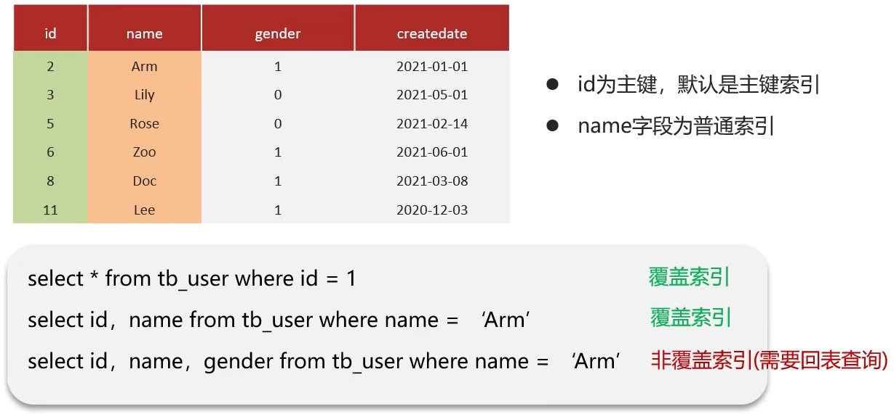

## MySQL 


## 优化 

### 慢查询 

#### 如何定位慢查询

一般来说, 慢查询出现的情况有以下几种:

 *  聚合查询
 *  多表查询
 *  表数据量过大查询
 *  深度分页查询

**表现形式:** 页面加载过慢、接口压测响应时间过长(超过1s)

**方案一:** 开源工具

 *  调试工具: Arthas
 *  运维工具: Prometheus、Skywalking（查看接口响应情况并且排序和追踪）

**方案二:** MySQL自带慢日志

慢查询日志记录了所有执行时间超过指定参数(`long_query_time`, 单位: 秒, 默认10秒)的所有SQL语句的日志

如果要开启慢查询日志, 需要在MySQL的配置文件(`/etc/my.cnf`)中配置如下信息:


配置完毕之后, 通过一下指令重新启动MySQL服务器进行测试, 查看慢日志文件中记录的信息`/var/lib/mysql/localhost-slow.log`.


##### 面试

1.  介绍一下当时产生问题的场景(我们当时的一个接口测试的时候非常的慢, 压测的结果大概5秒钟)
2.  我们系统中当时采用了运维工具(`Skywalking`), 可以检测出哪个接口, 最终因为是SQL的问题
3.  在MySQL中开启了慢日志查询, 我们设置的值就是2秒, 一旦SQL执行超过2秒就会记录到日志中(调试阶段)

PS: 只有在调试阶段才会开启慢日志, 开发环境不会开启, 因为开启后会影响性能

#### 优化慢查询

##### 那这个SQL语句执行很慢, 如何分析呢? 


可以采用`EXPLAIN`或者`DESC`命令获取MySQL如何执行`SELECT`语句的信息


 *  `possible_key`: 当前SQL可能会使用到的索引
 *  `key`: 当前SQL实际命中的索引
 *  `key_len`: 索引占用的大小
   
    通过`key`和`key_len`查看是否可能会命中索引
 *  `Extra`: 额外的优化建议
   
    <table> 
     <thead> 
      <tr> 
       <th><strong>Extra</strong></th> 
       <th><strong>含义</strong></th> 
      </tr> 
     </thead> 
     <tbody> 
      <tr> 
       <td>Using where;Using Index</td> 
       <td>查找使用了索引，需要的数据都在索引列中能找到，不需要回表查询数据</td> 
      </tr> 
      <tr> 
       <td>Using index condition</td> 
       <td>查找使用了索引，但是需要回表查询数据</td> 
      </tr> 
     </tbody> 
    </table>
 *  `type`: 这条SQL的连接的类型, 性能由好到差为`NULL`、`system`、`const`、`eq_ref`、`ref`、`range`、`index`、`all`
   
     *  `NULL`: 这条SQL表在执行的时候没有使用到表
     *  `system`: 查询系统中的表, MySQL内置的表
     *  `const`: 根据主键查询
     *  `eq_ref`: 代表SQL的查询条件是根据主键索引查询或者唯一索引查询, 只能返回一条数据
     *  `ref`: SQL的查询条件使用的是其他索引查询, 可能返回多条数据
     *  `range`: 范围查询
     *  `index`: 全索引查询, 会遍历整个索引树检索结果
     *  `all`: 不走索引, 全盘扫描

###### 面试官: 那这个SQL语句执行很慢, 如何分析呢? 

可以采用MySQL自带的分析工具`EXPLAIN`

 *  通过`key`和`key_len`检查是否命中了索引(索引本身存在是否有失效的情况)
 *  通过`type`字段查看SQL是否有进一步的优化空间, 是否存在全索引扫描或全盘扫描
 *  通过`extra`建议判断, 是否出现了回表的情况, 如果出现了, 可以尝试添加索引或修改返回字段来修复

### 存储引擎 

存储引擎就是存储数据、建立索引、更新/查询数据等技术的实现方式 。存储引擎是基于表的，而不是基于库的，所以存储引擎也可被称为表类型。

<table> 
 <thead> 
  <tr> 
   <th><strong>特性</strong></th> 
   <th><strong>MyISAM</strong></th> 
   <th><strong>InnoDB</strong></th> 
   <th><strong>MEMORY</strong></th> 
  </tr> 
 </thead> 
 <tbody> 
  <tr> 
   <td>事务安全</td> 
   <td>不支持</td> 
   <td><strong>支持</strong></td> 
   <td>不支持</td> 
  </tr> 
  <tr> 
   <td>锁机制</td> 
   <td>表锁</td> 
   <td><strong>表锁</strong>/<strong>行锁</strong></td> 
   <td>表锁</td> 
  </tr> 
  <tr> 
   <td>外键</td> 
   <td>不支持</td> 
   <td><strong>支持</strong></td> 
   <td>不支持</td> 
  </tr> 
 </tbody> 
</table>

 *  MySQL体系结构
 *  InnoDB存储的特点

#### MySQL体系结构 


#### 存储引擎特点 

##### InnoDB 

 *  介绍
   
    InnoDB是一种兼顾高可靠性和高性能的通用存储引擎，在 MySQL 5.5 之后，InnoDB是默认的MySQL存储引擎。
 *  特点
   
     *  DML操作遵循ACID模型，支持事务
     *  行级锁, 提高并发访问性能
     *  支持外键`FOREIGN KEY`约束，保证数据的完整性和正确性
 *  文件
   
     *  `xxx.ibd`：xxx代表的是表名，innoDB引擎的每张表都会对应这样一个表空间文件，存储该表的表结构（frm、sdi）、数据和索引。
     *  `xxx.frm` 存储表结构（MySQL8.0时，合并在表名.ibd中）


#### MySQL支持的存储引擎有哪些, 有什么区别? 

答:

在mysql中提供了很多的存储引擎，比较常见有`InnoDB`、`MyISAM`、`Memory`

 *  `InnoDB`存储引擎是mysql5.5之后是默认的引擎，它支持事务、外键、表级锁和行级锁
 *  `MyISAM`是早期的引擎，它不支持事务、只有表级锁、也没有外键，用的不多
 *  `Memory`主要把数据存储在内存，支持表级锁，没有外键和事务，用的也不多

#### 存储引擎在MySQL的体系结构哪一层, 主要特点是什么? 

### 索引 

**索引是一种用于快速查询和检索数据的数据结构，其本质可以看成是一种排序好的数据结构。**

索引(index)是帮助MySQL**高效**获取数据的数据结构(**有序**). 在数据之外, 数据库系统还维护着满足特定查找算法的数据结构(B+树), 这些数据结构以某种方式引用(指向)数据, 这样就可以在这些数据结构上实现高级查找算法, 这种数据结构就是索引.

索引的作用就相当于书的目录。打个比方: 我们在查字典的时候，如果没有目录，那我们就只能一页一页的去找我们需要查的那个字，速度很慢。如果有目录了，我们只需要先去目录里查找字的位置，然后直接翻到那一页就行了。

#### 索引的优缺点

**优点**：

- 使用索引可以大大加快数据的检索速度（大大减少检索的数据量）, 减少 IO 次数，这也是创建索引的最主要的原因。
- 通过创建唯一性索引，可以保证数据库表中每一行数据的唯一性。

**缺点**：

- 创建索引和维护索引需要耗费许多时间。当对表中的数据进行增删改的时候，如果数据有索引，那么索引也需要动态的修改，会降低 SQL 执行效率。
- 索引需要使用物理文件存储，也会耗费一定空间。

但是，**使用索引一定能提高查询性能吗?**

大多数情况下，索引查询都是比全表扫描要快的。但是如果数据库的数据量不大，那么使用索引也不一定能够带来很大提升

#### 数据结构对比 

MySQL默认使用的索引底层数据结构是B+树. 在聊B+树之前, 先聊聊二叉树和B树

> B树和B+树中的B指的是`Balanced`


B-Tree, B树是一种多叉路平衡查找树, 相对于二叉树, B树每个节点可以有多个分支, 即多叉.

以一颗最大度数(`max-degree`)为5(5阶，每个节点最多5个子节点)的b-tree为例, 这个B树每个节点最多存储4个key


B+Tree是在B-Tree基础上的一种优化, 使其更适合实现外存储索引结构, `InnoDB`存储引擎就使用B+Tree实现其索引结构

非叶子节点只存储指针，叶子节点存储数据


**B树和B+树的异同**：

- B 树的所有节点既存放键(key) 也存放数据(data)，而 B+树只有叶子节点存放 key 和 data，其他内节点只存放 key。
- B 树的叶子节点都是独立的;B+树的叶子节点有一条引用链指向与它相邻的叶子节点。
- B 树的检索的过程相当于对范围内的每个节点的关键字做二分查找，可能还没有到达叶子节点，检索就结束了。而 B+树的检索效率就很稳定了，任何查找都是从根节点到叶子节点的过程，叶子节点的顺序检索很明显。
- 在 B 树中进行范围查询时，首先找到要查找的下限，然后对 B 树进行中序遍历，直到找到查找的上限；而 B+树的范围查询，只需要对链表进行遍历即可。

综上，B+树与 B 树相比，具备更少的 IO 次数、更稳定的查询效率和更适于范围查询这些优势

**B树与B+树对比:**

1.  磁盘读写代价B+树更低;
2.  查询效率B+树更加稳定;
3.  B+树便于扫库和区间查询

##### 面试官: 了解过索引吗? (什么是索引) 

 *  索引(index)是帮助MySQL高效获取数据的数据结构(有序)
 *  提高数据检索的效率, 降低数据库的IO成本(不需要全表扫描)
 *  通过索引列对数据进行排序, 降低数据排序的成本, 降低了CPU的消耗

##### 面试官: 索引的底层数据结构了解过吗? 

MySQL的InnoDB引擎采用的是B+树的数据结构来存储索引

 *  阶数更多, 路径更短
 *  磁盘读写代价B+树更低, 非叶子节点只存储指针, 叶子节点存储数据
 *  B+树便于扫库和区间查询, 叶子节点是一个双向链表

#### 聚簇索引/非聚簇索引 

什么是聚簇索引, 什么是非聚簇索引

什么是聚集索引, 什么是二级索引(非聚集索引)

什么是回表?

<table> 
 <thead> 
  <tr> 
   <th>分类</th> 
   <th>含义</th> 
   <th>特点</th> 
  </tr> 
 </thead> 
 <tbody> 
  <tr> 
   <td>聚集索引(Clustered Index)</td> 
   <td>将数据存储与索引放到了一块，索引结构的叶子节点保存了行数据</td> 
   <td>必须有,而且只有一个</td> 
  </tr> 
  <tr> 
   <td>二级索引(Secondary Index)</td> 
   <td>将数据与索引分开存储，索引结构的叶子节点关联的是对应的主键</td> 
   <td>可以存在多个</td> 
  </tr> 
 </tbody> 
</table>

聚集索引选取规则:

 *  如果存在主键, 主键索引就是聚集索引
 *  如果不存在主键, 将使用第一个唯一(`UNIQUE`)索引作为聚集索引.
 *  如果表没有主键, 或没有合适的唯一索引, 则InnoDB会自动生成一个`rowid`作为隐藏的聚集索引

##### 什么是聚簇索引和非聚簇索引? 

例如下图

- 聚集索引：每一个`id`下面都有一个`row`，这个`row`存储的是对应`id`在表中的一整行数据
- 二级索引：我们给`name`这个属性添加索引，那么`name`这个属性下面存储的是这一行数据所对应的主键


##### 聚合/非聚集索引的优缺点

1. **聚集索引**

   - **优点**：

     - **查询速度非常快**：聚簇索引的查询速度非常的快，因为整个 B+树本身就是一颗多叉平衡树，叶子节点也都是有序的，定位到索引的节点，就相当于定位到了数据。相比于非聚簇索引， 聚簇索引少了一次读取数据的 IO 操作。

     - **对排序查找和范围查找优化**：聚簇索引对于主键的排序查找和范围查找速度非常快。

   - **缺点**：

     - **依赖于有序的数据**：因为 B+树是多路平衡树，如果索引的数据不是有序的，那么就需要在插入时排序，如果数据是整型还好，否则类似于字符串或 UUID 这种又长又难比较的数据，插入或查找的速度肯定比较慢。

     - **更新代价大**：如果对索引列的数据被修改时，那么对应的索引也将会被修改，而且聚簇索引的叶子节点还存放着数据，修改代价肯定是较大的，所以对于主键索引来说，主键一般都是不可被修改的

2. **非聚集索引**

   - **优点**：
     - 更新代价比聚簇索引要小 。非聚簇索引的更新代价就没有聚簇索引那么大了，非聚簇索引的叶子节点是不存放数据的。

   - **缺点**：

     - **依赖于有序的数据**:跟聚簇索引一样，非聚簇索引也依赖于有序的数据

     - **可能会二次查询(回表)**:这应该是非聚簇索引最大的缺点了。 当查到索引对应的指针或主键后，可能还需要根据指针或主键再到数据文件或表中查询

##### 回表查询 

例如下图，我们现在要查询`select * from user where name = 'Arm' `，由于给`name`添加了二级索引，所以会先去比对，先在索引树中找到`Lee`，比对后`Arm`在左边，一直找到`Arm`，获得其对应的主键`id=10`，然后再到聚集索引中根据`id=10`找到`Arm`的信息


##### 面试官: 什么是聚簇索引, 什么是非聚簇索引? 

 *  聚簇索引(聚集索引): 数据与索引放到一块, B+树的叶子节点保存了整行数据, 有且只有一个
 *  非聚簇索引(二级索引): 数据与索引分开存储, B+树的叶子节点保存对应的主键, 可以有多个, 我们单独给字段设置的索引大部分都是二级索引

##### 面试官: 什么是回表查询? 

答: 通过二级索引找到对应的主键值, 到聚集索引中查找整行数据, 这个过程就是回表

#### 覆盖索引 

##### 什么是覆盖索引? 

覆盖索引是指查询使用了索引, 并且需要返回的列, 在该索引中已经全部能够找到




##### 面试官: 知道什么叫覆盖索引吗? 

覆盖索引是指查询使用了索引, 返回的列, 必须在索引中全部能够找到

 *  使用ID查询, 直接走聚集索引查询, 一次索引扫描, 直接返回数据, 性能高
 *  如果返回的列中没有创建索引, 有可能会触发回表查询, 尽量避免使用`select *`

#### 联合索引

##### 什么是联合索引

使用表中的多个字段创建索引，就是 **联合索引**，也叫 **组合索引** 或 **复合索引**。

以 `score` 和 `name` 两个字段建立联合索引：

```sql
ALTER TABLE `cus_order` ADD INDEX id_score_name(score, name);
```

#### MySQL超大分页处理 

在数据量比较大时, 如果进行`limit`分页查询, 在查询时, 越往后, 分页查询效率越低.

查询耗时对比:0=


因为, 当我们在进行分页查询时, 如果执行`limit 9000000, 10`, 此时需要MySQL排序前 9000010 条记录, 仅仅返回 9000000-9000010 的记录, 其他记录丢弃, 查询排序的代价非常大

优化思路: 一般分页查询时, 通过创建覆盖索引能够比较好的提高性能, 可以通过覆盖索引加子查询形式进行优化

在查询`id`的时候用的是聚集索引，速度更快


##### 面试官: MySQL超大分页怎么处理? 

问题: 在数据量比较大时, `limit`分页查询, 需要对数据进行排序, 效率低

解决方案: 覆盖索引 + 子查询

#### 索引创建的原则 

 *  先陈述自己在实际的工作中时怎么用的
 *  主键索引
 *  唯一索引
 *  根据业务创建的索引(复合索引)

##### 索引创建原则有哪些? 

1.  针对于数据量比较大, 且查询比较频繁的表建立索引. 单表超过10万数据(增加用户体验)
2.  针对于常作为查询条件(`where`)、排序(`order by`)、分组(`group by`)操作的字段建立索引.
3.  尽量选择区分度高的列作为索引, 尽量建立唯一索引, 区分度越高, 使用索引的效率越高
  
    
4.  如果是字符串类型的字段, 字段的长度较长, 可以针对于字段的特点, 建立前缀索引
  
    
5.  尽量使用联合索引, 减少单列索引, 查询时, 联合索引很多时候可以覆盖索引, 节省存储空间, 避免回表, 提高查询效率
  
    
6.  要控制索引的数量, 索引并不是多多益善, 索引越多, 维护索引结构的代价也就越大, 会影响增删改的效率
7.  如果索引列不能存储`NULL`值, 请在创建表时使用`NOT NULL`约束它. 当优化器知道每列是否包含`NULL`值时, 它可以更好的确定哪个索引最有效的用于查询

##### 面试官: 索引创建原则有哪些? 

1.  数据量较大, 且查询比较频繁的表 重要
2.  常作为查询条件、排序、分组的字段 重要
3.  字段内容区分度高
4.  内容较长, 使用前缀索引
5.  尽量联合索引 重要
6.  要控制索引的数量 重要
7.  如果索引列不能存储`NULL`值, 请在创建表时使用`NOT NULL`约束它

#### 什么情况下索引会失效? 

> 现在我们在`tb_seller`表中使用`name`，`status`，`address`创建了一个联合索引
>
> 这三个字段是有顺序的


1. 违反最左前缀法则

    如果索引了多列(多个字段), 要遵守最左前缀法则. 指的是查询从索引的最左前列开始, 并且不跳过索引中的列.

    匹配最左前缀法则, 走索引:

    

    违反最左前缀法则, **索引失效**:

    

    如果符合最左前缀法则, 但是出现跳跃某一列, 只有最左列索引生效:

    

    此时索引长度与只命中`name`索引时的长度一致, 说明只命中了最左列索引

2. 范围查询右边的列, 不能使用索引

    > 第二条sql语句，`address`并未用到索引

    

    根据索引长度判断, 第一条查询语句, 三个索引全部命中, 但是第二个查询语句只命中了前两个索引, 并没有命中`address`索引

3. 不要在索引列上进行运算操作, 索引会失效

    

4. 字符串不加单引号, 造成索引失效

    

    由于, 在查询时, 没有对字符串加单引号, MySQL的查询优化器, 会自动的进行类型转换, 造成索引失效

5. 以`%`开头的`Like`模糊查询, 索引失效. 如果仅仅是尾部模糊匹配, 索引不会失效. 如果是头部模糊匹配, 索引失效.

    

##### 面试官: 什么情况下索引会失效? 

答:

1.  违反最左前缀法则(前提是复合索引或联合索引)
2.  范围查询右边的列, 不能使用索引
3.  不要在索引列上进行运算操作, 索引将失效
4.  字符串不加单引号, 造成索引失效. (类型转换)
5.  以`%`开头的`Like`模糊查询, 索引失效

#### SQL优化经验 

 *  表的设计优化
 *  索引优化 参考索引创建原则和索引失效情况
 *  SQL语句优化
 *  主从复制、读写分离
 *  分库分表

##### 表的设计优化(参考阿里开发手册《嵩山版》) 

1.  比如设置合适的数值(`tinyint`, `int`, `bigint`), 要根据实际情况选择
2.  比如设置合适的字符串类型(`char`和`varchar`)`char`定长效率高, `varchar`可变长度, 效率稍低

##### SQL语句优化 

1.  `SELECT`语句务必指明字段名称(避免直接使用`select *`) (使用覆盖索引, 避免回表查询)
2.  SQL语句要避免造成索引失效的写法
3.  尽量用`union all`代替`union`, `union`会多一次过滤, 效率低
4.  避免在`where`子句中对字段进行表达式操作
5.  `Join`优化 能用`innerjoin`就不要用`left join`、`right join`, 如必须使用, 一定要以小表为驱动, 内连接会对两个表进行优化, 优先把小表放到外边, 把大表放在里边. `left join`或者`right join`, 不会重新调整顺序
  
    
    
    如图所示, 外循环就是小表, 内循环是大表. 在执行的时候, 因为外循环只有三次, 代表MySQL只需要连接三次, 然后执行1000次操作. 如果将大表放在外面, 说明MySQL需要连接1000次, 每次执行3次操作, 比较浪费性能.

##### 主从复制、读写分离 

如果数据库的使用场景读的操作比较多的时候, 为了避免写的操作所造成的性能影响, 可以采用读写分离的架构. 读写分离解决的是, 数据库的写入, 影响了查询的效率.


##### 面试官: 谈一谈你对SQL优化的经验 

1.  表的设计优化, 数据类型的选择
2.  索引优化, 索引创建原则
3.  SQL语句优化, 避免索引失效, 避免使用`select *`……
4.  主从复制、读写分离, 不让数据的写入,影响读操作
5.  分库分表

## 其他面试题 


## 事务 

### 事务的特性 (`ACID`) 

事务是一组操作的集合, 它是一个不可分割的工作单位, 事务会把所有的操作作为一个整体一起向系统提交或撤销操作请求

即这些操作要么**同时成功**, **要么同时失败**.

##### ACID是什么? 

 *  原子性(`A`tomicity): 事务是不可分割的最小操作单元, 要么全部成功, 要么全部失败
 *  一致性(`C`onsistency): 事务完成时, 必须使所有的数据都保持一致状态
 *  隔离性(`I`solation): 数据库系统提供的隔离机制, 保证事务在不受外部并发操作影响的独立环境下运行
 *  持久性(`D`urability): 事务一旦提交或回滚, 它对数据库中的数据的改变就是永久的（保存在磁盘）

##### 面试官: 事物的特性是什么? 可以详细说一下吗? 

 *  原子性(Atomicity)
 *  一致性(Consistency)
 *  隔离性(Isolation)
 *  持久性(Durability)

可以结合转账的案例进行说明

#### 并发事务问题、隔离级别 

 *  并发事务问题:脏读、不可重复读、幻读
 *  隔离级别: 读未提交、读已提交、可重复读、串行化

##### 并发事务问题 

<table> 
 <thead> 
  <tr> 
   <th>问题</th> 
   <th>描述</th> 
  </tr> 
 </thead> 
 <tbody> 
  <tr> 
   <td>脏读</td> 
   <td>一个事务读到另外一个事务还没有提交的数据。</td> 
  </tr> 
 </tbody> 
</table>
> 事务A需要先查询id=1的数据然后进行修改，在修改后还未提交，此时事务B读取了到了id为1修改后的数据，但假如此刻事务A回滚了，那B读到的就是脏数据
>
> 例如：
>
> - **事务 A** 修改账户余额，将 `账户余额 = 500` 修改为 `账户余额 = 100`，但**尚未提交**。
>
> - **事务 B** 读取这个尚未提交的账户余额，看到的是 `100`（事务 A 修改过的数据）。
>
> - 如果此时 **事务 A** 由于某种原因**回滚**，数据库恢复到事务 A 执行前的状态，余额依旧是 `500`，但 **事务 B** 已经读取到了 `100` 这个错误的数值。


<table> 
 <thead> 
  <tr> 
   <th>问题</th> 
   <th>描述</th> 
  </tr> 
 </thead> 
 <tbody> 
  <tr> 
   <td>不可重复读</td> 
   <td>一个事务先后读取同一条记录，但两次读取的数据不同，称之为不可重复读。</td> 
  </tr> 
 </tbody> 
</table>


<table> 
 <thead> 
  <tr> 
   <th>问题</th> 
   <th>描述</th> 
  </tr> 
 </thead> 
 <tbody> 
  <tr> 
   <td>幻读</td> 
   <td>一个事务按照条件查询数据时，没有对应的数据行，但是在插入数据时，又发现这行数据已经存在，好像出现了”幻影”。</td> 
  </tr> 
 </tbody> 
</table>


##### 解决并发事务问题 

解决方案: 对事务进行隔离

<table> 
 <thead> 
  <tr> 
   <th>隔离级别</th> 
   <th>脏读</th> 
   <th>不可重复读</th> 
   <th>幻读</th> 
  </tr> 
 </thead> 
 <tbody> 
  <tr> 
   <td><strong>Read uncommitted</strong> <strong>未提交读</strong></td> 
   <td>❌</td> 
   <td>❌</td> 
   <td>❌</td> 
  </tr> 
  <tr> 
   <td><strong>Read committed</strong> <strong>读已提交</strong></td> 
   <td>✔️</td> 
   <td>❌</td> 
   <td>❌</td> 
  </tr> 
  <tr> 
   <td><strong>Repeatable Read(默认)</strong> <strong>可重复读</strong></td> 
   <td>✔️</td> 
   <td>✔️</td> 
   <td>❌</td> 
  </tr> 
  <tr> 
   <td><strong>Serializable</strong> <strong>串行化</strong></td> 
   <td>✔️</td> 
   <td>✔️</td> 
   <td>✔️</td> 
  </tr> 
 </tbody> 
</table>


注意:事务隔离级别越高, 数据越安全, 但是性能越低

##### 面试官: 并发事务带来哪些问题? 怎么解决这些问题呢? MySQL的默认隔离级别是? 

 *  并发事务的问题
   
    1.  `脏读`: 一个事务读到另外一个事务还没有提交的数据
    2.  `不可重复读`: 一个事务先后读取同一条记录, 但两次读取的数据不同
    3.  `幻读`: 一个事务按照条件查询数据时, 没有对应的数据行, 但是在插入数据时, 又发现这行数据已经存在, 好像出现了“幻影”
 *  隔离级别
   
    1.  `READ UNCOMMITTED`: 未提交读 无法解决任何并发事务问题
    2.  `READ COMMITTED`: 已提交读 可以解决脏读问题
    3.  `REPEATABLE READ`: 可重复读 可以解决脏读和不可重复读问题
    4.  `SERIALIZABLE`: 串行化 可以解决所有并发事务问题, 但是性能低

#### `undo log`和`redo log`的区别 

 *  缓冲池(buffer pool): 主内存中的一个区域, 里面可以缓存磁盘上经常操作的真实数据, 在执行增删改查操作时, 先操作缓冲池中的数据(若缓冲池没有数据, 则从磁盘加载并缓存), 以一定频率刷新到磁盘, 从而减少磁盘IO, 加快处理速度
 *  数据页(page): 是InnoDB存储引擎磁盘管理的最小单元, 每个页的大小默认为16KB. 页中存储的是行数据.


##### `redo log` 

重做日志, 记录的是事务提交时数据页的物理修改, 是\*\*用来实现事务的持久性\*\*.

该日志文件由两部分组成: 重做日志缓冲(`redo log buffer`)以及重做日志文件(`redo log file`), 前者是在内存中, 后者在磁盘中. 当事务提交之后会把所有修改信息都存到该日志文件中, 用于在刷新脏页到磁盘, 发生错误时, 进行数据恢复使用


##### `undo log` 

回滚日志, 用于记录数据被修改前的信息, 作用包含两个: 提供回滚和MVCC(多版本并发控制). `undo log`和`redo log`记录物理日志不一样, 它是逻辑日志.

 *  可以认为当`delete`一条记录时, `undo log`中会记录一条对应的`insert`记录, 反之亦然
 *  当`update`一条记录时, 它记录一条对应相反的`update`记录, 当执行`rollback`时, 就可以从`undo log`中的逻辑记录读取到相应的内容并进行回滚.

`undo log`可以实现事务的一致性和原子性

##### 面试官: `undo log`和`redo log`的区别 

 *  `redo log`: 记录的是数据页的物理变化, 服务宕机可用来同步数据
 *  `undo log`: 记录的是逻辑日志, 当事务回滚时, 通过逆操作恢复原来的数据
 *  `redo log`: 保证了事务的持久性, `undo log`保证了事务的原子性和一致性

#### MVCC 

##### 事务的隔离性如何保证? 

`锁` ：排他锁(如一个事务获取了一个数据行的排他锁, 其他事物就不能再获取该行的其他锁)

`MVCC`: 多版本并发控制

##### 解释一下MVCC 

全称Multi-Version Concurrency Control， 多版本并发控制，指维护一个数据的多个版本, 使得读写操作没有冲突

MVCC的具体实现, 主要依赖于数据库记录中的隐式字段、`undo log`日志、`readView`.


##### MVCC-实现原理 

###### 记录中的隐藏字段 

除了我们自定义的字段，在mysql中还提供了几个隐藏字段


<table> 
 <thead> 
  <tr> 
   <th>隐藏字段</th> 
   <th>含义</th> 
  </tr> 
 </thead> 
 <tbody> 
  <tr> 
   <td>DB_TRX_ID</td> 
   <td>最近修改事务ID，记录插入这条记录或最后一次修改该记录的事务ID。自增</td> 
  </tr> 
  <tr> 
   <td>DB_ROLL_PTR</td> 
   <td>回滚指针，指向这条记录的上一个版本，用于配合undo log，指向上一个版本。</td> 
  </tr> 
  <tr> 
   <td>DB_ROW_ID</td> 
   <td>隐藏主键，如果表结构没有指定主键，将会生成该隐藏字段。</td> 
  </tr> 
 </tbody> 
</table>


举例: 插入了某一条数据, 此时这条数据会自动初始化一个`DB_TRX_ID`, 例如为0, 当修改这条记录之后, `DB_TRX_ID`会进行自增变为1, 再次修改后, 会再次自增为2, 此时`DB_ROLL_PTR`将是1, 指向这条记录的上一个版本

###### undo log 

回滚日志, 在`insert`、`update`、`delete`的时候产生的便于数据回滚的日志.

当`insert`的时候, 产生的`undo log`日志只在回滚时需要, 在事务提交后, 可被立即删除

而`update`、`delete`的时候, 产生的`undo log`日志不仅在回滚时需要, MVCC版本访问也需要, 不会立即被删除

###### undo log版本链 


事务2的操作:


事务3的操作:


事务4的操作:


不同事务或相同事务对同一条记录进行修改, 会导致该记录的`undo log`生成一条记录版本链表, 链表的头部是最新的旧记录, 链表的尾部是最早的旧记录.

###### readView 

ReadView(读视图)是快照读SQL执行时MVCC提取数据的依据, 记录并维护系统当前活跃的事务(未提交的)ID.

 *  当前读
   
    读取的是记录的最新版本, 读取时还要保证其他并发事务不能修改当前记录, 会对读取的记录进行加锁. 对于我们日常的操作, 如: `select ... lock in share mode`(共享锁), `select ... for update`、`update`、`insert`、`delete`(排它锁)都是一种当前读.
    
    
 *  快照读
   
    简单地`select`(不加锁)就是快照读, 快照读, 读取的是记录数据的可见版本, 有可能是历史数据, 不加锁, 是非阻塞读.
    
     *  `Read Committed`: 每次`select`, 都生成一个快照读
     *  `Repeatable Read`: 开启事务后第一个`select`语句才是快照读的地方.
    
    

###### ReadView中包含了四个核心字段: 

<table> 
 <thead> 
  <tr> 
   <th>字段</th> 
   <th>含义</th> 
  </tr> 
 </thead> 
 <tbody> 
  <tr> 
   <td>m_ids</td> 
   <td>当前活跃的事务ID集合</td> 
  </tr> 
  <tr> 
   <td>min_trx_id</td> 
   <td>最小活跃事务ID</td> 
  </tr> 
  <tr> 
   <td>max_trx_id</td> 
   <td>预分配事务ID，当前最大事务ID+1（因为事务ID是自增的）</td> 
  </tr> 
  <tr> 
   <td>creator_trx_id</td> 
   <td>ReadView创建者的事务ID</td> 
  </tr> 
 </tbody> 
</table>


此时, `m_ids`为\{3, 4, 5\}, `min_trx_id`为3, `max_trx_id`为6, `creator_trx_id`为5


###### 不同的隔离级别, 生成的ReadView的时机不同: 

 *  `READ COMMITTED`: 在事务中每一次执行快照读时生成ReadView.
   
    
    
    第一次事务5查询的读视图:
    
    
    
    结合`undo log`版本链进行比对
    
    
    
    得出结论, 当前读视图可以访问的版本是事务2提交之后的数据, 最后拿到的结果就是:
    
    第二次事务5查询的读视图:
    
    
    
    结合`undo log`版本链进行比对:
    
    
    
    得出结论, 当前读视图可以访问的版本是事务3提交之后的数据, 最后拿到的结果就是:
 *  `REPEATABLE READ`: 仅在事务中第一次执行快照读时生成ReadView, 后续复用该ReadView.
   
    事务5两次查询的读视图:
    
    
    
    
    
    得出结论, 这两次读视图可以访问的版本都是事务2提交之后的数据, 最后拿到的结果就是:

##### 面试官: 事务中的隔离性是如何保证的呢? (你解释一下MVCC) 

MVCC是MySQL中的多版本并发控制. 指维护一个数据的多个版本, 使得读写操作没有冲突

 *  隐藏字段:
   
    1.  `trx_id`(事务id): 记录每一次操作的事务id, 是自增的
    2.  `roll_pointer`(回滚指针), 指向上一个版本的事务版本记录地址
    3.  `row_id`: 没有设置主键索引时才会用到该字段, 意义不大
 *  `undo log`:
   
    1.  回滚日志: 存储老版本数据
    2.  版本链: 多个事务并行操作某一行记录, 记录不同事务修改数据的版本, 通过`roll_pointer`指针形成一个链表
 *  `ReadView`解决的是一个事务查询选择版本的问题
   *  根据ReadView的匹配规则和当前的一些事务id判断该访问哪个版本的数据
     *  不同的隔离级别快照读时不一样的, 最终的访问结果都不一样
       
         *  RC: 每一次执行快照读时生成ReadView
         *  RR: 仅在事务中第一次执行快照读时生成ReadView, 后续复用

#### 主从同步原理 

项目上线后通常会对数据进行读写分离

**读写分离主要是为了将对数据库的读写操作分散到不同的数据库节点上。** 这样的话，就能够小幅提升写性能，大幅提升读性能。

> 一般情况下，我们都会选择一主多从，也就是一台主数据库负责写，其他的从数据库负责读。主库和从库之间会进行数据同步，以保证从库中数据的准确性。这样的架构实现起来比较简单，并且也符合系统的写少读多的特点。


MySQL主从复制的核心就是二进制日志

> 二进制日志(BINLOG)记录了所有的`DDL`(数据定义语言)语句和`DML`(数据操纵语言)语句, 但不包括数据查询(`SELECT`、`SHOW`)语句


复制分成三步:

1.  `Master`主库在事务提交时, 会把数据变更记录在二进制日志文件`binlog`中.
2.  从库读取主库的二进制日志文件`binlog`, 写入到从库的中继日志`Relay Log`.
3.  由`slave`从库创建SQLthrea线程读取中继日志`relay log`中的数据，并且重新执行一遍写入自己的数据库

##### 面试官: 主从同步原理 

MySQL主从复制的核心就是二进制日志`binlog`(`DDL`(数据定义语言)语句和`DML`(数据操纵语言)语句, 不包含数据查询(`SELECT`、`SHOW`)语句)

1.  主库在事务提交时, 会把数据变更记录在二进制日志文件`binlog`中
2.  从库读取主库的二进制日志文件`binlog`, 写入到从库的中继日志`Relay Log`.
3.  从库重做中继日志中的时间, 将改变反映到它自己的数据

#### 分库分表 

读写分离主要应对的是数据库读并发，没有解决数据库存储问题。试想一下：**如果 MySQL 一张表的数据量过大怎么办?**

换言之，**我们该如何解决 MySQL 的存储压力呢？**答案之一就是 **分库分表**。


**分库分表的时机:**

1.  前提, 项目业务数据逐渐增多, 或业务发展比较迅速. 单表的数据量达**1000W或者20G**以后
2.  优化已解决不了性能问题(主从读写分离、查询索引……)
3.  随着用户的增多会达到
    - IO瓶颈(磁盘IO、网络IO)
    - CPU瓶颈(聚合查询、连接数太多)


##### 拆分策略 


##### 垂直分库 

以表为依据, 根据业务将不同表拆分到不同库中

- 按业务对数据分级管理、维护、监控、扩展
- 在高并发下, 提高磁盘IO和数据量连接数


##### 垂直分表 

以字段为依据, 根据字段属性将不同字段拆分到不同表中

- 拆分规则

   *  把不常用的字段单独放在一张表

   *  把`text`, `blob`等大字段拆分出来放在附表中

- 特点：

  - 冷热数据分离
  - 减少IO过度争抢, 两表互不影响

> 在实际开发中也可能是在同一个数据库下分表


##### 水平分库 

将一个库的数据拆分到多个库中

- 路由规则:

   *  根据id节点取模

   *  按id也就是范围路由, 节点1(1-100万), 节点2(100万-200万)…

   *  ……


- 特点:
  - 解决了单库大数据量, 高并发的性能瓶颈问题
  - 提高了系统的稳定性和可用性


##### 水平分表 

将一个表的数据拆分到多个表中(可以在同一个库中)

特点:

- 优化单一表数据量过大而产生的性能问题;
- 避免IO争抢并减少锁表的几率


##### 新的问题和新的技术 


分库之后的问题:

 *  分布式事务一致性问题
 *  跨节点关联查询
 *  跨节点分页、排序函数
 *  主键避重


分库分表中间件:

 *  sharding-sphere
 *  mycat

##### 面试官: 你们项目用过分库分表吗? 

 *  业务介绍
   
    1.  根据自己简历上的项目, 像一个数据量较大业务(请求数多或者业务累计大)
    2.  达到了什么样的量级(单表1000万或超过20G)
 *  具体拆分策略
   
    1.  水平分库（优先）, 将一个库的数据拆分到多个库中, 解决海量数据存储和高并发的问题
    2.  水平分表, 解决单表存储和性能的问题
      
        上面两个都需要用到中间件(sharding-sphere、mycat)来解决路由问题和其他分库分表的问题
    3.  垂直分库, 根据业务进行拆分, 高并发下提高磁盘IO和网络连接数
    4.  垂直分表, 冷热数据分离, 多表互不影响

## MySQL面试题-参考回答 

> \*\*面试官：\*\*MySQL中，如何定位慢查询?
>
> 候选人：
>
> 嗯~，我们当时做压测的时候有的接口非常的慢，接口的响应时间超过了2秒以上，因为我们当时的系统部署了运维的监控系统Skywalking ，在展示的报表中可以看到是哪一个接口比较慢，并且可以分析这个接口哪部分比较慢，这里可以看到SQL的具体的执行时间，所以可以定位是哪个sql出了问题
>
> 如果，项目中没有这种运维的监控系统，其实在MySQL中也提供了慢日志查询的功能，可以在MySQL的系统配置文件中开启这个慢日志的功能，并且也可以设置SQL执行超过多少时间来记录到一个日志文件中，我记得上一个项目配置的是2秒，只要SQL执行的时间超过了2秒就会记录到日志文件中，我们就可以在日志文件找到执行比较慢的SQL了。
>
> \*\*面试官：\*\*那这个SQL语句执行很慢, 如何分析呢？
>
> \*\*候选人：\*\*如果一条sql执行很慢的话，我们通常会使用mysql自动的执行计划explain来去查看这条sql的执行情况，比如在这里面可以通过key和key\_len检查是否命中了索引，如果本身已经添加了索引，也可以判断索引是否有失效的情况，第二个，可以通过type字段查看sql是否有进一步的优化空间，是否存在全索引扫描或全盘扫描，第三个可以通过extra建议来判断，是否出现了回表的情况，如果出现了，可以尝试添加索引或修改返回字段来修复
>
> \*\*面试官：\*\*了解过索引吗？（什么是索引）
>
> \*\*候选人：\*\*嗯，索引在项目中还是比较常见的，它是帮助MySQL高效获取数据的数据结构，主要是用来提高数据检索的效率，降低数据库的IO成本，同时通过索引列对数据进行排序，降低数据排序的成本，也能降低了CPU的消耗
>
> \*\*面试官：\*\*索引的底层数据结构了解过嘛 ?
>
> \*\*候选人：\*\*MySQL的默认的存储引擎InnoDB采用的B+树的数据结构来存储索引，选择B+树的主要的原因是：第一阶数更多，路径更短，第二个磁盘读写代价B+树更低，非叶子节点只存储指针，叶子阶段存储数据，第三是B+树便于扫库和区间查询，叶子节点是一个双向链表
>
> \*\*面试官：\*\*B树和B+树的区别是什么呢？
>
> 候选人：第一：在B树中，非叶子节点和叶子节点都会存放数据，而B+树的所有的数据都会出现在叶子节点，在查询的时候，B+树查找效率更加稳定
>
> 第二：在进行范围查询的时候，B+树效率更高，因为B+树都在叶子节点存储，并且叶子节点是一个双向链表
>
> \*\*面试官：\*\*什么是聚簇索引什么是非聚簇索引 ?
>
> 候选人：
>
> 好的~，聚簇索引主要是指数据与索引放到一块，B+树的叶子节点保存了整行数据，有且只有一个，一般情况下主键在作为聚簇索引的
>
> 非聚簇索引值的是数据与索引分开存储，B+树的叶子节点保存对应的主键，可以有多个，一般我们自己定义的索引都是非聚簇索引
>
> \*\*面试官：\*\*知道什么是回表查询嘛 ?
>
> \*\*候选人：\*\*嗯，其实跟刚才介绍的聚簇索引和非聚簇索引是有关系的，回表的意思就是通过二级索引找到对应的主键值，然后再通过主键值找到聚集索引中所对应的整行数据，这个过程就是回表
>
> 【备注：如果面试官直接问回表，则需要先介绍聚簇索引和非聚簇索引】
>
> \*\*面试官：\*\*知道什么叫覆盖索引嘛 ?
>
> \*\*候选人：\*\*嗯~，清楚的
>
> 覆盖索引是指select查询语句使用了索引，在返回的列，必须在索引中全部能够找到，如果我们使用id查询，它会直接走聚集索引查询，一次索引扫描，直接返回数据，性能高。
>
> 如果按照二级索引查询数据的时候，返回的列中没有创建索引，有可能会触发回表查询，尽量避免使用select \*，尽量在返回的列中都包含添加索引的字段
>
> \*\*面试官：\*\*MYSQL超大分页怎么处理 ?
>
> \*\*候选人：\*\*嗯，超大分页一般都是在数据量比较大时，我们使用了limit分页查询，并且需要对数据进行排序，这个时候效率就很低，我们可以采用覆盖索引和子查询来解决
>
> 先分页查询数据的id字段，确定了id之后，再用子查询来过滤，只查询这个id列表中的数据就可以了
>
> 因为查询id的时候，走的覆盖索引，所以效率可以提升很多
>
> \*\*面试官：\*\*索引创建原则有哪些？
>
> \*\*候选人：\*\*嗯，这个情况有很多，不过都有一个大前提，就是表中的数据要超过10万以上，我们才会创建索引，并且添加索引的字段是查询比较频繁的字段，一般也是像作为查询条件，排序字段或分组的字段这些。
>
> 还有就是，我们通常创建索引的时候都是使用复合索引来创建，一条sql的返回值，尽量使用覆盖索引，如果字段的区分度不高的话，我们也会把它放在组合索引后面的字段。
>
> 如果某一个字段的内容较长，我们会考虑使用前缀索引来使用，当然并不是所有的字段都要添加索引，这个索引的数量也要控制，因为添加索引也会导致新增改的速度变慢。
>
> \*\*面试官：\*\*什么情况下索引会失效 ?
>
> \*\*候选人：\*\*嗯，这个情况比较多，我说一些自己的经验，以前遇到过的
>
> 比如，索引在使用的时候没有遵循最左匹配法则，第二个是，模糊查询，如果%号在前面也会导致索引失效。如果在添加索引的字段上进行了运算操作或者类型转换也都会导致索引失效。
>
> 我们之前还遇到过一个就是，如果使用了复合索引，中间使用了范围查询，右边的条件索引也会失效
>
> 所以，通常情况下，想要判断出这条sql是否有索引失效的情况，可以使用explain执行计划来分析
>
> \*\*面试官：\*\*sql的优化的经验
>
> \*\*候选人：\*\*嗯，这个在项目还是挺常见的，当然如果直说sql优化的话，我们会从这几方面考虑，比如
>
> 建表的时候、使用索引、sql语句的编写、主从复制，读写分离，还有一个是如果量比较大的话，可以考虑分库分表
>
> \*\*面试官：\*\*创建表的时候，你们是如何优化的呢？
>
> \*\*候选人：\*\*这个我们主要参考的阿里出的那个开发手册《嵩山版》，就比如，在定义字段的时候需要结合字段的内容来选择合适的类型，如果是数值的话，像tinyint、int 、bigint这些类型，要根据实际情况选择。如果是字符串类型，也是结合存储的内容来选择char和varchar或者text类型
>
> \*\*面试官：\*\*那在使用索引的时候，是如何优化呢？
>
> 候选人：【参考索引创建原则 进行描述】
>
> \*\*面试官：\*\*你平时对sql语句做了哪些优化呢？
>
> \*\*候选人：\*\*嗯，这个也有很多，比如SELECT语句务必指明字段名称，不要直接使用select \* ，还有就是要注意SQL语句避免造成索引失效的写法；如果是聚合查询，尽量用union all代替union ，union会多一次过滤，效率比较低；如果是表关联的话，尽量使用innerjoin ，不要使用用left join right join，如必须使用 一定要以小表为驱动
>
> \*\*面试官：\*\*事务的特性是什么？可以详细说一下吗？
>
> \*\*候选人：\*\*嗯，这个比较清楚，ACID，分别指的是：原子性、一致性、隔离性、持久性；我举个例子：
>
> A向B转账500，转账成功，A扣除500元，B增加500元，原子操作体现在要么都成功，要么都失败
>
> 在转账的过程中，数据要一致，A扣除了500，B必须增加500
>
> 在转账的过程中，隔离性体现在A像B转账，不能受其他事务干扰
>
> 在转账的过程中，持久性体现在事务提交后，要把数据持久化（可以说是落盘操作）
>
> 面试官：并发事务带来哪些问题？
>
> 候选人：
>
> 我们在项目开发中，多个事务并发进行是经常发生的，并发也是必然的，有可能导致一些问题
>
> 第一是脏读， 当一个事务正在访问数据并且对数据进行了修改，而这种修改还没有提交到数据库中，这时另外一个事务也访问了这个数据，因为这个数据是还没有提交的数据，那么另外一个事务读到的这个数据是“脏数据”，依据“脏数据”所做的操作可能是不正确的。
>
> 第二是不可重复读：比如在一个事务内多次读同一数据。在这个事务还没有结束时，另一个事务也访问该数据。那么，在第一个事务中的两次读数据之间，由于第二个事务的修改导致第一个事务两次读取的数据可能不太一样。这就发生了在一个事务内两次读到的数据是不一样的情况，因此称为不可重复读。
>
> 第三是幻读（Phantom read）：幻读与不可重复读类似。它发生在一个事务（T1）读取了几行数据，接着另一个并发事务（T2）插入了一些数据时。在随后的查询中，第一个事务（T1）就会发现多了一些原本不存在的记录，就好像发生了幻觉一样，所以称为幻读。
>
> 面试官：怎么解决这些问题呢？MySQL的默认隔离级别是？
>
> 候选人：解决方案是对事务进行隔离
>
> MySQL支持四种隔离级别，分别有：
>
> 第一个是，未提交读（read uncommitted）它解决不了刚才提出的所有问题，一般项目中也不用这个。第二个是读已提交（read committed）它能解决脏读的问题的，但是解决不了不可重复读和幻读。第三个是可重复读（repeatable read）它能解决脏读和不可重复读，但是解决不了幻读，这个也是mysql默认的隔离级别。第四个是串行化（serializable）它可以解决刚才提出来的所有问题，但是由于让是事务串行执行的，性能比较低。所以，我们一般使用的都是mysql默认的隔离级别:可重复读
>
> 面试官：undo log和redo log的区别
>
> 候选人：好的，其中redo log日志记录的是数据页的物理变化，服务宕机可用来同步数据，而undo log 不同，它主要记录的是逻辑日志，当事务回滚时，通过逆操作恢复原来的数据，比如我们删除一条数据的时候，就会在undo log日志文件中新增一条delete语句，如果发生回滚就执行逆操作；
>
> redo log保证了事务的持久性，undo log保证了事务的原子性和一致性
>
> 面试官：事务中的隔离性是如何保证的呢？(你解释一下MVCC)
>
> 候选人：事务的隔离性是由锁和mvcc实现的。
>
> 其中mvcc的意思是多版本并发控制。指维护一个数据的多个版本，使得读写操作没有冲突，它的底层实现主要是分为了三个部分，第一个是隐藏字段，第二个是undo log日志，第三个是readView读视图
>
> 隐藏字段是指：在mysql中给每个表都设置了隐藏字段，有一个是trx\_id(事务id)，记录每一次操作的事务id，是自增的；另一个字段是roll\_pointer(回滚指针)，指向上一个版本的事务版本记录地址
>
> undo log主要的作用是记录回滚日志，存储老版本数据，在内部会形成一个版本链，在多个事务并行操作某一行记录，记录不同事务修改数据的版本，通过roll\_pointer指针形成一个链表
>
> readView解决的是一个事务查询选择版本的问题，在内部定义了一些匹配规则和当前的一些事务id判断该访问那个版本的数据，不同的隔离级别快照读是不一样的，最终的访问的结果不一样。如果是rc隔离级别，每一次执行快照读时生成ReadView，如果是rr隔离级别仅在事务中第一次执行快照读时生成ReadView，后续复用
>
> 面试官：MySQL主从同步原理
>
> 候选人：MySQL主从复制的核心就是二进制日志(DDL（数据定义语言）语句和 DML（数据操纵语言）语句)，它的步骤是这样的：
>
> 第一：主库在事务提交时，会把数据变更记录在二进制日志文件 Binlog 中。
>
> 第二：从库读取主库的二进制日志文件 Binlog ，写入到从库的中继日志 Relay Log 。
>
> 第三：从库重做中继日志中的事件，将改变反映它自己的数据
>
> 面试官：你们项目用过MySQL的分库分表吗？
>
> 候选人：
>
> 嗯，因为我们都是微服务开发，每个微服务对应了一个数据库，是根据业务进行拆分的，这个其实就是垂直拆分。
>
> 面试官：那你之前使用过水平分库吗？
>
> 候选人：
>
> 嗯，这个是使用过的，我们当时的业务是(xxx)，一开始，我们也是单库，后来这个业务逐渐发展，业务量上来的很迅速，其中(xx)表已经存放了超过1000万的数据，我们做了很多优化也不好使，性能依然很慢，所以当时就使用了水平分库。
>
> 我们一开始先做了3台服务器对应了3个数据库，由于库多了，需要分片，我们当时采用的mycat来作为数据库的中间件。数据都是按照id（自增）取模的方式来存取的。
>
> 当然一开始的时候，那些旧数据，我们做了一些清洗的工作，我们也是按照id取模规则分别存储到了各个数据库中，好处就是可以让各个数据库分摊存储和读取的压力，解决了我们当时性能的问题  
> 事务id)，记录每一次操作的事务id，是自增的；另一个字段是roll\_pointer(回滚指针)，指向上一个版本的事务版本记录地址
>
> undo log主要的作用是记录回滚日志，存储老版本数据，在内部会形成一个版本链，在多个事务并行操作某一行记录，记录不同事务修改数据的版本，通过roll\_pointer指针形成一个链表
>
> readView解决的是一个事务查询选择版本的问题，在内部定义了一些匹配规则和当前的一些事务id判断该访问那个版本的数据，不同的隔离级别快照读是不一样的，最终的访问的结果不一样。如果是rc隔离级别，每一次执行快照读时生成ReadView，如果是rr隔离级别仅在事务中第一次执行快照读时生成ReadView，后续复用
>
> 面试官：MySQL主从同步原理
>
> 候选人：MySQL主从复制的核心就是二进制日志(DDL（数据定义语言）语句和 DML（数据操纵语言）语句)，它的步骤是这样的：
>
> 第一：主库在事务提交时，会把数据变更记录在二进制日志文件 Binlog 中。
>
> 第二：从库读取主库的二进制日志文件 Binlog ，写入到从库的中继日志 Relay Log 。
>
> 第三：从库重做中继日志中的事件，将改变反映它自己的数据
>
> 面试官：你们项目用过MySQL的分库分表吗？
>
> 候选人：
>
> 嗯，因为我们都是微服务开发，每个微服务对应了一个数据库，是根据业务进行拆分的，这个其实就是垂直拆分。
>
> 面试官：那你之前使用过水平分库吗？
>
> 候选人：
>
> 嗯，这个是使用过的，我们当时的业务是(xxx)，一开始，我们也是单库，后来这个业务逐渐发展，业务量上来的很迅速，其中(xx)表已经存放了超过1000万的数据，我们做了很多优化也不好使，性能依然很慢，所以当时就使用了水平分库。
>
> 我们一开始先做了3台服务器对应了3个数据库，由于库多了，需要分片，我们当时采用的mycat来作为数据库的中间件。数据都是按照id（自增）取模的方式来存取的。
>
> 当然一开始的时候，那些旧数据，我们做了一些清洗的工作，我们也是按照id取模规则分别存储到了各个数据库中，好处就是可以让各个数据库分摊存储和读取的压力，解决了我们当时性能的问题

## 祝大家都能找到一份好工作❤️ 