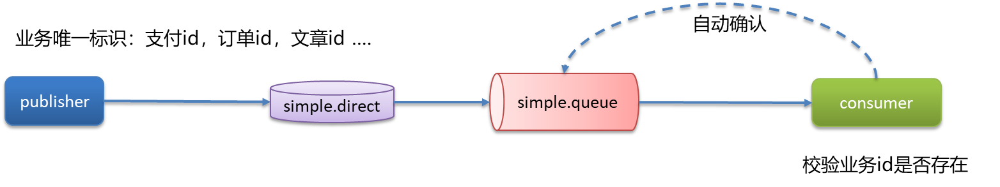

## 消息中间件 


## RabbitMQ 

### 消息不丢失 

RabbitMQ使用场景:

 *  异步发送(验证码、短信、邮件)
 *  MySQL和Redis, ES之间的数据同步
 *  分布式事务
 *  削峰填谷
 *  …

消息丢失的场景:


#### 生产者确认机制 

RabbitMQ提供了`publisher confirm`机制来避免消息发送到MQ过程中丢失. 消息发送到MQ以后, 会返回一个结果给发送者, 表示消息是否处理成功


消息失败之后如何处理呢?

 *  aasdfd回调方法及时重发
 *  记录日志
 *  保存到数据库然后定时重发, 成功发送后即刻删除表中的数据

#### 消息持久化 

MQ默认是内存存储消息, 开启持久化功能可以确保缓存在MQ中的消息不丢失

1.  交换机持久化:
  
    ```java
    @Bean
    public DirectExchange simpleExchange(){
        // 三个参数：交换机名称、是否持久化、当没有queue与其绑定时是否自动删除 
        return new DirectExchange("simple.direct", true, false);
    }
    ```
2.  队列持久化:
  
    ```java
    @Bean
    public Queue simpleQueue(){
        // 使用QueueBuilder构建队列，durable就是持久化的
        return QueueBuilder.durable("simple.queue").build();
    }
    ```
3.  消息持久化, SpringAMQP中的消息默认是持久的, 可以通过`MessageProperties`中的`DeliveryMode`来指定
  
    ```java
    Message msg = MessageBuilder
        .withBody(message.getBytes(StandardCharsets.UTF_8)) // 消息体
        .setDeliveryMode(MessageDeliveryMode.PERSISTENT) // 持久化 
        .build();
    ```

#### 消费者确认 

RabbitMQ支持消费者确认机制, 即: 消费者处理消息后可以向MQ发送`ack`回执, MQ收到`ack`回执后才会删除该消息. 而SpringAMQP则允许配置三种确认模式.

 *  `manual`: 手动`ack`, 需要在业务代码结束后, 调用api发送`ack`
 *  `auto`: 自动`ack`, 由spring监测`instener`代码是否出现异常, 没有异常则返回`ack`; 抛出异常则返回`nack`
 *  `none`: 关闭`ack`, MQ假定消费者获取消息后会成功处理, 因此消息投递后立即被删除


我们可以利用Spring的`retry`机制, 在消费者出现异常时利用本地重试, 设置重试次数, 当次数达到了以后, 如果消息依然失败, 将消息投递到异常交换机, 交由人工处理

#### 面试官: RabbitMQ如何保证消息不丢失 

 *  开启生产者确认机制, 确保生产者的消息能到达队列
 *  开启持久化功能, 确保消息未消费前在队列中不会丢失
 *  开启消费者确认机制为`auto`, 由Spring确认消息处理成功后返回`ack`
 *  开启消费者失败重试机制, 多次重试失败后将消息投递到异常交换机, 交由人工处理

### 重复消费问题 

 *  网络抖动
 *  消费者挂了

交换机给消费者发送消息, 消费者正常处理完成消息, 但是还没有返回`ack`, 此时因为网络问题或者消费者突然宕机, 导致队列没有接收到消费者的`ack`回执, 在消费者恢复之后, 队列会再次向消费者发送同样的消息, 导致重复消费



解决方案:

 *  每条消息设置一个唯一的标识id
 *  幂等方案: 分布式锁、数据库锁(乐观锁、悲观锁)

适用于任何MQ:

 *  Kafka
 *  RabbitMQ
 *  RocketMQ
 *  ……

### 死信交换机, 延迟队列 

 *  延迟队列: 进入队列的消息会被延迟消费的队列
 *  场景: 超时订单、限时优惠、定时发布

延迟队列 = 死信交换机 + TTL(生存时间)

#### 死信交换机 

当一个队列中的消息满足下列情况之一时, 可以成为死信(dead letter):

 *  消费者使用`basic.reject`或`basic.nack`声明消费失败, 并且消息的`requeue`参数设置为`false`
 *  消息是一个过期消息, 超时无人消费
 *  要投递的队列消息堆积满了, 最早的消息可能成为死信

如果该队列配置了`dead-letter-exchange`属性, 指定了一个交换机, 那么队列中的死信就会投递到这个交换机中, 而这个交换机称为死信交换机(Dead Letter Exchange, 简称DLX).


#### TTL 

TTL, 也就是Time-To-Live. 如果一个队列中的消息TTL结束仍未消费, 则会变成死信, TTL超时分为两种情况:

 *  消息所在的队列设置了存活时间
 *  消息本身设置了存活时间


同时设置消息所在队列的存活时间和消息本身的存货时间, 以时间最短的为准


#### 延迟队列插件 

DelayExchange, 需要安装在RabbitMQ中

RabbitMQ有一个官方的插件社区, 地址为: https://www.rabbitmq.com/community-plugins.html


DelayExchange的本质还是官方的三种交换机, 只是添加了延迟功能. 因此使用时只需要声明一个交换机, 交换机的类型可以是任意类型, 然后设定`delayed`属性为`true`即可.

声明:


使用:


#### 面试官: RabbitMQ中死信交换机?(RabbitMQ延迟队列有了解过吗) 

 *  我们当时一个\*\*业务使用到了延迟队列(超时订单、限时优惠、定时发布…)
 *  其中延迟队列就用到了死信交换机和TTL(消息存活时间)实现的
 *  消息超时未消费就会变成死信(死信的其他情况: 拒绝被消费, 队列满了)

延迟队列插件实现延迟队列DelayExchange

 *  声明一个交换机, 添加`delayed`属性为`true`
 *  发送消息时, 添加`x-delay`头, 值为超时时间

### 消息堆积 

当生产者发送消息的速度超过了消费者处理消息的速度, 就会导致队列中的消息堆积, 直到队列存储消息达到上限. 之后发送的消息就会成为死信, 可能会被丢弃, 这就是消息堆积问题


解决消息堆积由三种思路:

 *  增加更多的消费者, 提高消费速度
 *  在消费者内开启线程池加快消息的处理速度
 *  扩大队列容积, 提高堆积上限

#### 惰性队列 

惰性队列的特征如下:

 *  接收到消息后直接存入磁盘而非内存
 *  消费者要消费消息时才会从磁盘中读取并加载到内存
 *  支持数百万条的消息存储

配置的方式


注解方式:


#### 面试官: RabbitMQ如果有100万消息堆积在MQ, 如何解决(消息堆积怎么解决) 

解决消息堆积由三种思路:

 *  增加更多的消费者, 提高消费速度
 *  在消费者内开启线程池加快消息处理速度
 *  扩大队列容积, 提高堆积上限, 采用惰性队列
   
     *  在声明队列的时候可以设置属性`x-queue-mode`为`lazy`, 即为惰性队列
     *  基于磁盘存储, 消息上限高
     *  性能比较稳定, 但基于磁盘存储, 受限于磁盘IO, 时效性会降低

### 高可用机制 

 *  在生产环境下, 使用集群来保证搞可用性
 *  普通集群、镜像集群、仲裁队列

#### 普通集群 

普通集群, 或者叫标准集群(classic cluster), 具备下列特征:

 *  会在集群的各个节点间共享部分数据, 包括: 交换机、队列元信息. 不包含队列中的消息.
 *  当访问集群某节点时, 如果队列不再该节点, 会从数据所在节点传递到当前节点并返回
 *  队列所在节点宕机, 队列中的消息就会丢失
   
    

#### 镜像集群 

镜像集群: 本质是主从模式, 具备下面的特征:

 *  交换机、队列、队列中的消息会在各个MQ的镜像节点之间同步备份.
 *  创建队列的节点被称为该队列的主节点, 备份到其他节点叫做该队列的镜像节点.
 *  一个队列的主节点可能是另一个队列的镜像节点
 *  所有操作都是主节点完成, 然后同步给镜像节点
 *  主节点宕机后, 镜像节点会代替称为新的主节点


#### 仲裁队列 

仲裁队列: 仲裁队列是3.8版本以后才有的新功能, 用来替代镜像队列, 具备下列特征:

 *  与镜像队列一样, 都是主从模式, 支持主从数据同步
 *  使用非常简单, 没有复杂的配置
 *  主从同步基于Raft协议, 强一致

在搭建好镜像队列的前提下, 添加以下配置:

```java
@Bean
public Queue quorumQueue() {
    return QueueBuilder
        .durable("quorum.queue") // 持久化 
        .quorum() // 仲裁队列
        .build();
}
```

#### 面试官: RabbitMQ的高可用机制有了解过吗 

 *  在生产环境下, 我们当时采用的镜像模式搭建的集群, 共有三个节点
 *  镜像队列结构是一主多从(从就是镜像), 所有操作都是主节点完成, 然后同步给镜像节点
 *  主节点宕机后, 镜像节点会替代称为新的主节点(如果在主从同步完成前, 主节点就已经宕机, 可能出现数据丢失)

#### 面试官: 那出现丢失数据怎么解决呢? 

我们可以采用仲裁队列, 与镜像队列一样, 都是主从模式, 支持主从数据同步, 主从同步基于Raft协议, 强一致. 并且使用起来也非常简单, 不需要额外的配置, 在声明队列的时候只要制定这个是仲裁队列即可.

## Kafka 

### 消息不丢失 

使用Kafka在消息的收发过程都会出现消息丢失, Kafka分别给出了解决方案:

 *  生产者发送消息到`Brocker`丢失
 *  消息在`Brocker`中存储丢失
 *  消费者从`Brocker`接收消息丢失


#### 生产者发送消息到`Brocker`丢失 

 *  设置异步发送

```java
//同步发送
RecordMetadata recordMetadata = kafkaProducer.send(record).get();
//异步发送
kafkaProducer.send(record, new Callback() {
    @Override
    public void onCompletion(RecordMetadata recordMetadata, Exception e) {
        if (e != null) {
            System.out.println("消息发送失败 | 记录日志");
        }
        long offset = recordMetadata.offset();
        int partition = recordMetadata.partition();
        String topic = recordMetadata.topic();
    }
});
```

 *  消息重试

```java
//设置重试次数
prop.put(ProducerConfig.RETRIES_CONFIG,10);
```

#### 消息在`Brocker`中存储丢失 


 *  发送确认机制`acks`

<table> 
 <thead> 
  <tr> 
   <th>确认机制</th> 
   <th>说明</th> 
  </tr> 
 </thead> 
 <tbody> 
  <tr> 
   <td><code>acks=0</code></td> 
   <td>生产者在成功写入消息之前不会等待任何来自服务器的响应,消息有丢失的风险，但是速度最快</td> 
  </tr> 
  <tr> 
   <td><code>acks=1</code>（默认值）</td> 
   <td>只要集群首领节点收到消息，生产者就会收到一个来自服务器的成功响应</td> 
  </tr> 
  <tr> 
   <td><code>acks=all</code></td> 
   <td>只有当所有参与赋值的节点全部收到消息时，生产者才会收到一个来自服务器的成功响应</td> 
  </tr> 
 </tbody> 
</table>

#### 消费者从`Brocker`接收消息丢失 


 *  Kafka中的分区机制指的是将每个主题划分成多个分区(Partition)
 *  topic分区中消息只能由消费者组中的唯一一个消费者处理, 不同的分区分配给不同的消费者(同一个消费者组)


消费者默认是自动按期提交已经消费的偏移量, 默认是每隔5s提交一次. 如果出现重平衡的情况, 可能会重复消费或丢失数据

解决方法:禁用自动提交偏移量, 改为手动

 *  同步提交
 *  异步提交
 *  同步+异步组合提交
   
    

#### 面试官: Kafka是如何保证消息不丢失的? 

需要从三个层面去解决这个问题:

 *  生产者发送消息到`Brocker`丢失
   
     *  设置异步发送, 发送失败使用回调进行记录或重发
     *  失败重试, 参数配置, 可以设置重试次数
 *  消息在Brocker中存储丢失
   
    发送确认`acks`, 选择`all`, 让所有的副本都参与保存数据后确认
 *  消费者从Brocker接收消息丢失
   
     *  关闭自动提交偏移量, 开启手动提交偏移量
     *  提交方式, 最好是同步 + 异步提交

#### 面试官: Kafka中消息的重复消费问题如何解决的 

 *  关闭自动提交偏移量, 开启手动提交偏移量
 *  提交方式, 最好是同步 + 异步提交
 *  幂等方案

### 消费的顺序性 

应用场景:

 *  即时消息中的单对单聊天和群聊, 保证发送方消息发送顺序与接收方的顺序一致
 *  充值转账两个渠道在同一个时间进行余额变更, 短信通知必须要有顺序


topic分区中消息只能由消费者组中的唯一一个消费者处理, 所以消息肯定是按照先后顺序进行处理的. 但是它也仅仅是保证topic的一个分区顺序处理, 不能保证跨分区的消息先后处理顺序. 所以, 如果想要顺序的处理topic的所有消息, 那就只提供一个分区, 或者同一个业务放在同一个分区


#### 面试官: Kafka是如何保证消费的顺序性? 

问题原因:

一个topic的数据可能存储在不同的分区中, 每个分区都有一个按照顺序的存储的偏移量, 如果消费者关联了多个分区则不能保证顺序性

解决方案:

 *  发送消息时指定分区号
 *  发送消息时按照相同的业务设置相同的`key`

### 高可用机制 

 *  集群模式
 *  分区备份机制

#### 集群模式 


 *  Kafka的服务器端由被称为Brocker的服务进程构成, 即一个Kafka集群由多个Brocker组成
 *  这样如果集群中某一台机器宕机, 其他机器上的Brocker也依然能够对外提供服务. 这其实就是Kafka提供高可用的手段之一

#### 分区备份机制 


 *  一个topic有多个分区, 每个分区有多个副本, 其中有一个leader, 其余的是follower, 副本存储在不同的brocker中
 *  所有的分区副本的内容都是相同的, 如果leader发生故障时, 会自动将其中一个follower提升为leader


ISR(in-sync replica) 需要同步复制保存的follower

如果leader失效, 需要选出新的leader, 选举的规则如下:

第一: 选举时优先从ISR中选定, 因为这个列表中的follower的数据是与leader同步的

第二: 如果ISR列表中的follower都不行了, 就只能从其他follower中选举


#### 面试官: Kafka的高可用机制有了解过吗 

可以从两个层面回答, 第一个是集群, 第二个是备份机制

集群:

一个Kafka集群由多个Brocker实例组成, 即使某一台宕机, 也不耽误其他Brocker继续对外提供服务

备份机制:

 *  一个topic有多个分区, 每个分区有多个副本, 有一个leader, 其余的都是follower, 副本存储在不同的Brocker中
 *  所有的分区副本的内容都是相同的, 如果leader发生故障, 会自动将其中一个follower提升为leader, 保证了系统的容错性、高可用性

#### 面试官: 解释一下备份机制中的ISR 

ISR(in-sync replica)需要同步复制保存的follower

分区副本分为了两类, 一个是ISR, 与leader副本同步保存数据, 另外一个普通的副本, 是异步同步数据, 当leader挂掉之后, 会优先从ISR副本列表中选取一个作为leader

### 数据清理机制 

 *  Kafka文件存储机制
 *  数据清理机制

#### Kafka文件存储机制 

存储结构:


为什么要分段?

 *  删除无用文件方便, 提高磁盘利用率
 *  查找数据便捷

#### 数据清理机制 

日志的清理策略有两个

1.  根据消息的保留时间, 当消息在Kafka中保存的时间超过了指定的时间, 就会触发清理过程
  
    
2.  根据topic存储的数据大小, 当topic所占的日志文件大小大于一定的阈值, 则开始删除最久的消息. 需要手动开启
  
    

#### 面试官: Kafka数据清理机制了解过吗? 

Kafka存储结构:

 *  Kafka中的topic的数据存储在分区上, 分区如果文件过大会分段存储`segment`
 *  每个分段都在磁盘上以索引(`xxxxx.index`)和日志文件(`xxxxx.log`)的形式存储
 *  分段的好处是, 第一能够减少单个文件内容的大小, 查找数据方便, 第二方便Kafka进行日志清理

日志的清理策略有两个:

 *  根据消息的保留时间, 当消息保存的时间超过了指定的时间, 就会触发清理, 默认是168小时(7天)
 *  根据topic存储的数据大小, 当topic所占的日志文件大小大于一定的阈值, 则开始删除最久的消息. (默认关闭)

### 高性能的设计 

 *  消息分区: 不受单台服务器的限制, 可以不受限的处理更多的数据
 *  顺序读写: 磁盘顺序读写, 提升读写效率
 *  页缓存: 把磁盘中的数据缓存到内存中, 把对磁盘的访问变成对内存的访问
 *  零拷贝: 减少上下文切换及数据拷贝
 *  消息压缩: 减少磁盘IO和网络IO
 *  分批发送: 将消息打包批量发送, 减少网络开销

#### 零拷贝 

Linux的IO模型:


Kafka流程:


#### 面试官: Kafka中实现高性能的设计由了解过吗? 

 *  消息分区: 不受单台服务器的限制, 可以不受限的处理更多的数据
 *  顺序读写: 磁盘顺序读写, 提升读写效率
 *  页缓存: 把磁盘中数据缓存到内存中, 把对磁盘的访问变成对内存的访问
 *  零拷贝: 减少上下文切换及数据拷贝
 *  消息压缩: 减少磁盘IO和网络IO
 *  分批发送: 将消息打包批量发送, 减少网络开销

## 消息中间件面试题-参考回答 

> 面试官：RabbitMQ-如何保证消息不丢失
> 
> 候选人：
> 
> 嗯！我们当时MYSQL和Redis的数据双写一致性就是采用RabbitMQ实现同步的，这里面就要求了消息的高可用性，我们要保证消息的不丢失。主要从三个层面考虑
> 
> 第一个是开启生产者确认机制，确保生产者的消息能到达队列，如果报错可以先记录到日志中，再去修复数据
> 
> 第二个是开启持久化功能，确保消息未消费前在队列中不会丢失，其中的交换机、队列、和消息都要做持久化
> 
> 第三个是开启消费者确认机制为auto，由spring确认消息处理成功后完成ack，当然也需要设置一定的重试次数，我们当时设置了3次，如果重试3次还没有收到消息，就将失败后的消息投递到异常交换机，交由人工处理
> 
> 面试官：RabbitMQ消息的重复消费问题如何解决的
> 
> 候选人：
> 
> 嗯，这个我们还真遇到过，是这样的，我们当时消费者是设置了自动确认机制，当服务还没来得及给MQ确认的时候，服务宕机了，导致服务重启之后，又消费了一次消息。这样就重复消费了
> 
> 因为我们当时处理的支付（订单|业务唯一标识），它有一个业务的唯一标识，我们再处理消息时，先到数据库查询一下，这个数据是否存在，如果不存在，说明没有处理过，这个时候就可以正常处理这个消息了。如果已经存在这个数据了，就说明消息重复消费了，我们就不需要再消费了
> 
> 面试官：那你还知道其他的解决方案吗？
> 
> 候选人：
> 
> 嗯，我想想~
> 
> 其实这个就是典型的幂等的问题，比如，redis分布式锁、数据库的锁都是可以的
> 
> 面试官：RabbitMQ中死信交换机 ? （RabbitMQ延迟队列有了解过嘛）
> 
> 候选人：
> 
> 嗯！了解过！
> 
> 我们当时的xx项目有一个xx业务，需要用到延迟队列，其中就是使用RabbitMQ来实现的。
> 
> 延迟队列就是用到了死信交换机和TTL（消息存活时间）实现的。
> 
> 如果消息超时未消费就会变成死信，在RabbitMQ中如果消息成为死信，队列可以绑定一个死信交换机，在死信交换机上可以绑定其他队列，在我们发消息的时候可以按照需求指定TTL的时间，这样就实现了延迟队列的功能了。
> 
> 我记得RabbitMQ还有一种方式可以实现延迟队列，在RabbitMQ中安装一个死信插件，这样更方便一些，我们只需要在声明交互机的时候，指定这个就是死信交换机，然后在发送消息的时候直接指定超时时间就行了，相对于死信交换机+TTL要省略了一些步骤
> 
> 面试官：如果有100万消息堆积在MQ , 如何解决 ?
> 
> 候选人：
> 
> 我在实际的开发中，没遇到过这种情况，不过，如果发生了堆积的问题，解决方案也所有很多的
> 
> 第一:提高消费者的消费能力 ,可以使用多线程消费任务
> 
> 第二：增加更多消费者，提高消费速度
> 
> 使用工作队列模式, 设置多个消费者消费消费同一个队列中的消息
> 
> 第三：扩大队列容积，提高堆积上限
> 
> 可以使用RabbitMQ惰性队列，惰性队列的好处主要是
> 
> ①接收到消息后直接存入磁盘而非内存
> 
> ②消费者要消费消息时才会从磁盘中读取并加载到内存
> 
> ③支持数百万条的消息存储
> 
> 面试官：RabbitMQ的高可用机制有了解过嘛
> 
> 候选人：
> 
> 嗯，熟悉的~
> 
> 我们当时项目在生产环境下，使用的集群，当时搭建是镜像模式集群，使用了3台机器。
> 
> 镜像队列结构是一主多从，所有操作都是主节点完成，然后同步给镜像节点，如果主节点宕机后，镜像节点会替代成新的主节点，不过在主从同步完成前，主节点就已经宕机，可能出现数据丢失
> 
> 面试官：那出现丢数据怎么解决呢？
> 
> 候选人：
> 
> 我们可以采用仲裁队列，与镜像队列一样，都是主从模式，支持主从数据同步，主从同步基于Raft协议，强一致。
> 
> 并且使用起来也非常简单，不需要额外的配置，在声明队列的时候只要指定这个是仲裁队列即可
> 
> 面试官：Kafka是如何保证消息不丢失
> 
> 候选人：
> 
> 嗯，这个保证机制很多，在发送消息到消费者接收消息，在每个阶段都有可能会丢失消息，所以我们解决的话也是从多个方面考虑
> 
> 第一个是生产者发送消息的时候，可以使用异步回调发送，如果消息发送失败，我们可以通过回调获取失败后的消息信息，可以考虑重试或记录日志，后边再做补偿都是可以的。同时在生产者这边还可以设置消息重试，有的时候是由于网络抖动的原因导致发送不成功，就可以使用重试机制来解决
> 
> 第二个在broker中消息有可能会丢失，我们可以通过kafka的复制机制来确保消息不丢失，在生产者发送消息的时候，可以设置一个acks，就是确认机制。我们可以设置参数为all，这样的话，当生产者发送消息到了分区之后，不仅仅只在leader分区保存确认，在follwer分区也会保存确认，只有当所有的副本都保存确认以后才算是成功发送了消息，所以，这样设置就很大程度了保证了消息不会在broker丢失
> 
> 第三个有可能是在消费者端丢失消息，kafka消费消息都是按照offset进行标记消费的，消费者默认是自动按期提交已经消费的偏移量，默认是每隔5s提交一次，如果出现重平衡的情况，可能会重复消费或丢失数据。我们一般都会禁用掉自动提价偏移量，改为手动提交，当消费成功以后再报告给broker消费的位置，这样就可以避免消息丢失和重复消费了
> 
> 面试官：Kafka中消息的重复消费问题如何解决的
> 
> 候选人：
> 
> kafka消费消息都是按照offset进行标记消费的，消费者默认是自动按期提交已经消费的偏移量，默认是每隔5s提交一次，如果出现重平衡的情况，可能会重复消费或丢失数据。我们一般都会禁用掉自动提价偏移量，改为手动提交，当消费成功以后再报告给broker消费的位置，这样就可以避免消息丢失和重复消费了
> 
> 为了消息的幂等，我们也可以设置唯一主键来进行区分，或者是加锁，数据库的锁，或者是redis分布式锁，都能解决幂等的问题
> 
> 面试官：Kafka是如何保证消费的顺序性
> 
> 候选人：
> 
> kafka默认存储和消费消息，是不能保证顺序性的，因为一个topic数据可能存储在不同的分区中，每个分区都有一个按照顺序的存储的偏移量，如果消费者关联了多个分区不能保证顺序性
> 
> 如果有这样的需求的话，我们是可以解决的，把消息都存储同一个分区下就行了，有两种方式都可以进行设置，第一个是发送消息时指定分区号，第二个是发送消息时按照相同的业务设置相同的key，因为默认情况下分区也是通过key的hashcode值来选择分区的，hash值如果一样的话，分区肯定也是一样的
> 
> 面试官：Kafka的高可用机制有了解过嘛
> 
> 候选人：
> 
> 嗯，主要是有两个层面，第一个是集群，第二个是提供了复制机制
> 
> kafka集群指的是由多个broker实例组成，即使某一台宕机，也不耽误其他broker继续对外提供服务
> 
> 复制机制是可以保证kafka的高可用的，一个topic有多个分区，每个分区有多个副本，有一个leader，其余的是follower，副本存储在不同的broker中；所有的分区副本的内容是都是相同的，如果leader发生故障时，会自动将其中一个follower提升为leader，保证了系统的容错性、高可用性
> 
> 面试官：解释一下复制机制中的ISR
> 
> 候选人：
> 
> ISR的意思是in-sync replica，就是需要同步复制保存的follower
> 
> 其中分区副本有很多的follower，分为了两类，一个是ISR，与leader副本同步保存数据，另外一个普通的副本，是异步同步数据，当leader挂掉之后，会优先从ISR副本列表中选取一个作为leader，因为ISR是同步保存数据，数据更加的完整一些，所以优先选择ISR副本列表
> 
> 面试官：Kafka数据清理机制了解过嘛
> 
> 候选人：
> 
> 嗯，了解过~~
> 
> Kafka中topic的数据存储在分区上，分区如果文件过大会分段存储segment
> 
> 每个分段都在磁盘上以索引(xxxx.index)和日志文件(xxxx.log)的形式存储，这样分段的好处是，第一能够减少单个文件内容的大小，查找数据方便，第二方便kafka进行日志清理。
> 
> 在kafka中提供了两个日志的清理策略：
> 
> 第一，根据消息的保留时间，当消息保存的时间超过了指定的时间，就会触发清理，默认是168小时（ 7天）
> 
> 第二是根据topic存储的数据大小，当topic所占的日志文件大小大于一定的阈值，则开始删除最久的消息。这个默认是关闭的
> 
> 这两个策略都可以通过kafka的broker中的配置文件进行设置
> 
> 面试官：Kafka中实现高性能的设计有了解过嘛
> 
> 候选人：
> 
> Kafka 高性能，是多方面协同的结果，包括宏观架构、分布式存储、ISR 数据同步、以及高效的利用磁盘、操作系统特性等。主要体现有这么几点：
> 
> 消息分区：不受单台服务器的限制，可以不受限的处理更多的数据
> 
> 顺序读写：磁盘顺序读写，提升读写效率
> 
> 页缓存：把磁盘中的数据缓存到内存中，把对磁盘的访问变为对内存的访问
> 
> 零拷贝：减少上下文切换及数据拷贝
> 
> 消息压缩：减少磁盘IO和网络IO
> 
> 分批发送：将消息打包批量发送，减少网络开销  
> 面试官：Kafka数据清理机制了解过嘛
> 
> 候选人：
> 
> 嗯，了解过~~
> 
> Kafka中topic的数据存储在分区上，分区如果文件过大会分段存储segment
> 
> 每个分段都在磁盘上以索引(xxxx.index)和日志文件(xxxx.log)的形式存储，这样分段的好处是，第一能够减少单个文件内容的大小，查找数据方便，第二方便kafka进行日志清理。
> 
> 在kafka中提供了两个日志的清理策略：
> 
> 第一，根据消息的保留时间，当消息保存的时间超过了指定的时间，就会触发清理，默认是168小时（ 7天）
> 
> 第二是根据topic存储的数据大小，当topic所占的日志文件大小大于一定的阈值，则开始删除最久的消息。这个默认是关闭的
> 
> 这两个策略都可以通过kafka的broker中的配置文件进行设置
> 
> 面试官：Kafka中实现高性能的设计有了解过嘛
> 
> 候选人：
> 
> Kafka 高性能，是多方面协同的结果，包括宏观架构、分布式存储、ISR 数据同步、以及高效的利用磁盘、操作系统特性等。主要体现有这么几点：
> 
> 消息分区：不受单台服务器的限制，可以不受限的处理更多的数据
> 
> 顺序读写：磁盘顺序读写，提升读写效率
> 
> 页缓存：把磁盘中的数据缓存到内存中，把对磁盘的访问变为对内存的访问
> 
> 零拷贝：减少上下文切换及数据拷贝
> 
> 消息压缩：减少磁盘IO和网络IO
> 
> 分批发送：将消息打包批量发送，减少网络开销