## 多线程 

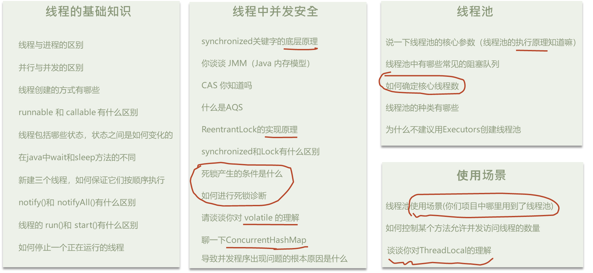

## 线程的基础知识 

### 线程和进程的区别? 

#### 进程 

程序由指令和数据组成， 但这些指令要运行， 数据要读写， 就必须将指令加载至CPU， 数据加载至内存. 在指令运行过程中还需要用到磁盘、网络等设备. 进程就是用来加载指令、管理内存、管理IO的.

当一个程序被运行， 从磁盘加载这个程序的代码至内存， 这时就开启了一个进程

> 进程是程序的一次执行过程，是系统运行程序的基本单位，因此进程是动态的。系统运行一个程序即是一个进程从创建，运行到消亡的过程。
>
> 在 Java 中，当我们启动 main 函数时其实就是启动了一个 JVM 的进程，而 main 函数所在的线程就是这个进程中的一个线程，也称主线程


#### 线程 

一个线程就是一个指令流， 将指令流中的一条条指令以一定的顺序交给CPU执行

一个进程之内可以分为一到多个线程

> 线程与进程相似，但线程是一个比进程更小的执行单位。一个进程在其执行的过程中可以产生多个线程。与进程不同的是同类的多个线程共享进程的**堆**和**方法区**资源，但每个线程有自己的**程序计数器**、**虚拟机栈**和**本地方法栈**，所以系统在产生一个线程，或是在各个线程之间做切换工作时，负担要比进程小得多，也正因为如此，线程也被称为轻量级进程。

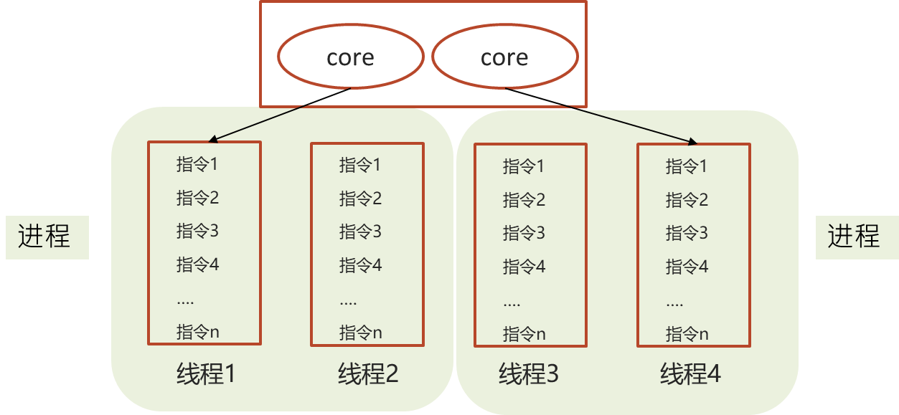

#### 二者对比 

 *  进程是正在运行程序的实例， 进程中包含了线程， 每个线程执行不同的任务
 *  不同的进程使用不同的内存空间， 在当前进程下的所有线程可以共享内存空间
 *  线程更轻量， 线程上下文切换成本一般上要比进程上下文切换低(上下文切换指的是从一个线程切换到另一个线程)


### 并行与并发有什么区别? 

#### 单核CPU 

 *  单核CPU下线程实际还是串行执行的
 *  操作系统中有一个组件叫做任务调度器， 将CPU的时间片(Windows下时间片最小约为15毫秒)分给不同的程序使用， 只是由于CPU在线程间(时间片很短)的切换非常快， 人类感觉是同时运行的.
 *  总结为一句话就是: 微观串行， 宏观并行
 *  一般会将这种线程轮流使用CPU的做法称为并发(concurrent)

> 下面是一个单核cpu的例子，在每个时间片只能有一个线程执行，但因为切换速度极快，所以看起来像是并行

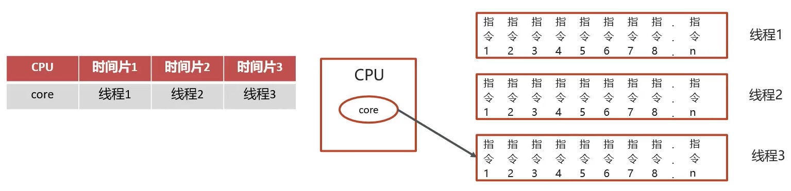

#### 多核CPU 

每个核(core)都可以调度运行线程， 这时候线程是可以并行的.

<table> 
 <thead> 
  <tr> 
   <th>CPU</th> 
   <th>时间片1</th> 
   <th>时间片2</th> 
   <th>时间片3</th> 
   <th>时间片4</th> 
  </tr> 
 </thead> 
 <tbody> 
  <tr> 
   <td>core1</td> 
   <td>线程1</td> 
   <td>线程1</td> 
   <td>线程3</td> 
   <td>线程3</td> 
  </tr> 
  <tr> 
   <td>core2</td> 
   <td>线程2</td> 
   <td>线程4</td> 
   <td>线程2</td> 
   <td>线程4</td> 
  </tr> 
 </tbody> 
</table>

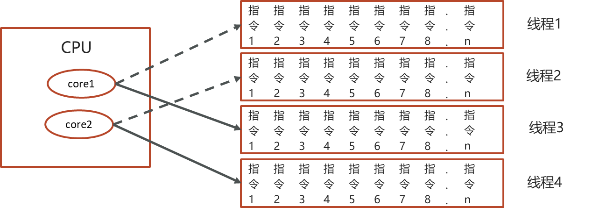

#### 并行和并发有什么区别 

并发(concurrent)是同一时间应对(dealing with)多件事情的能力

并行(parallel)是同一时间动手做(doing)多件事情的能力

>  *  家庭主妇做饭、打扫卫生、给孩子喂奶， 她一个人轮流交替做这多件事， 这时就是并发
>  *  家庭主妇雇了个保姆， 她们一起做这些事， 这时既有并发， 也有并行(这时会产生竞争， 例如锅只有一口， 一个人用锅时， 另一个人就得等待)
>  *  雇了3个保姆， 一个专做饭、一个专打扫卫生、一个专喂奶， 互不干扰， 这时是并行

#### 总结 

并行和并发有什么区别?

现在都是多核CPU， 在多核CPU下

 *  并发是同一时间应对多件事情的能力， 多个线程轮流使用一个或多个CPU
 *  并行是同一时间动手做多件事情的能力， 4核CPU同时执行4个线程

> 最关键的点是：是否是 **同时** 执行。

### 创建线程的方式有哪些? 

共有四种方式可以创建线程， 分别是:

 *  继承**`Thread`**类，重写`run()`方法
 *  实现**`Runnable`**接口，重写`run()`方法
 *  实现**`Callable`**接口，重写`call()`方法
 *  线程池创建线程

#### 继承Thread类 

```java
public class MyThread extends Thread {
   
    //继承Threa类后需要重写run方法，方法体就是线程开启后需要执行的内容
    @Override
    public void run() {
        System.out.println("MyThread...run...");
    }
    
    public static void main(String[] args) {
        // 创建MyThread对象
        MyThread t1 = new MyThread() ;
        MyThread t2 = new MyThread() ;
        
        // 调用start方法启动线程
        t1.start();
        t2.start();
    }
}
```

#### 实现Runnable接口 

```java
public class MyRunnable implements Runnable {

    @Override
    public void run() {
        System.out.println("MyRunnable...run...");
    }
    
    public static void main(String[] args) {
        // 创建MyRunnable对象
        MyRunnable mr = new MyRunnable();
        
        // 创建Thread对象
        Thread t1 = new Thread(mr);
        Thread t2 = new Thread(mr);
        
        // 调用start方法启动线程
        t1.start();
        t2.start();
    }
}
```

#### 实现Callable接口 

```java
public class MyCallable implements Callable<String> {

    @Override
    public String call() throws Exception {
        System.out.println(Thread.currentThread().getName());
        return "ok";
    }
    
    public static void main(String[] args) throws ExecutionException， InterruptedException {

        // 创建MyCallable对象
        MyCallable mc = new MyCallable() ;
        // 创建FutureTask
        FutureTask<String> ft = new FutureTask<String>(mc) ;
        // 创建Thread对象
        Thread t1 = new Thread(ft) ;
        Thread t2 = new Thread(ft) ;
        // 调用start方法启动线程
        t1.start();
        // 调用ft的get方法获取执行结果
        String result = ft.get();
        // 输出
        System.out.println(result);
    }
}
```

#### 线程池创建线程 

```java
public class MyExecutors implements Runnable{

    @Override
    public void run() {
        System.out.println("MyRunnable...run...");
    }
    
    public static void main(String[] args) {
        // 创建线程池对象
        ExecutorService threadPool = Executors.newFixedThreadPool(3);
        threadPool.submit(new MyExecutors()) ;
        
        // 关闭线程池
        threadPool.shutdown();
    }
}
```

#### 总结 

创建线程的方式有哪些?

 *  继承Thread类
 *  实现Runnable接口
 *  实现Callable接口
 *  线程池创建线程(项目中使用方式)

面试官追问: 刚才你说过， 使用Runnable和Callable都可以创建线程， 他们有什么区别呢?

#### Runnable和Callable有什么区别? 

参考回答:

1.  Runnable接口`run`方法没有返回值
2.  Callable接口`call`方法有返回值， 是个泛型， 和Future、FutureTask配合可以用来获取异步执行的结果
3.  Callable接口的`call()`方法允许抛出异常， 而Runnable接口的`run()`方法的异常只能在内部消化， 不能继续上抛

面试官再追问: 在启动线程的时候， 可以使用`run`方法吗? `run()`和`start()`有什么区别?

#### 线程的`run()`和`start()`有什么区别? 

`start()`: 用来启动线程， 通过该线程调用`run`方法执行`run`方法中所定义的逻辑代码

> `start`方法只能被调用一次.

`run()`: 封装了要被线程执行的代码， 可以被调用多次， 就是单纯的调用成员方法

#### 总结 

1.  创建线程的方式有哪些?
  
     *  继承Thread类
     *  实现Runnable接口
     *  实现Callable接口
     *  线程池创建线程(项目中使用方式)
2.  Runnable和Callable有什么区别
  
     *  Runnable接口`run`方法没有返回值
     *  Callable接口`call`方法有返回值， 需要FutureTask获取结果
     *  Callable接口的`call`方法允许抛出异常; 而Runnable接口的`run`方法的异常只能在内部消化， 不能继续上抛
3.  `run()`和`start()`有什么区别?
  
     *  `start()`: 用来启动线程， 通过该线程调用`run`方法执行`run`方法中所定义的逻辑代码. `start`方法只能被调用一次
     *  `run()`: 封装了要被线程执行的代码， 可以被调用多次.

### 线程包括哪些状态， 状态之间是如何变化的 

线程的状态可以参考JDK中的Thread类中的枚举State

```java
public enum State {

    //尚未启动的线程的线程状态
    NEW，

    //可运行线程的线程状态。
    RUNNABLE，

    //线程阻塞等待监视器锁的线程状态。
    BLOCKED，

    //等待线程的线程状态
    WAITING，

    //具有指定等待时间的等待线程的线程状态
    TIMED_WAITING，

    //已终止线程的线程状态。线程已完成执行
    TERMINATED;
}
```


```java
private static void testNewRunnableTerminated() {

    Thread t1 = new Thread(() -> { 
        logger1.debug("running...");
    }，"t1");
    Thread t2 = new Thread(() -> {
        logger1.debug("running...");
    }，"t2");
    t1.start();
    t2.start();
}
```

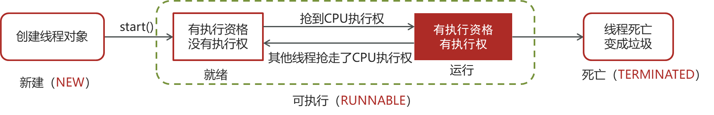

```java
private static void testBlocked() {

    Thread t1 = new Thread(() -> {
    logger1.debug("before sync");
        synchronized (LOCK) {
            logger1.debug("in sync"); 
        }
    }，"t1");
    
    t1.start();
    synchronized (LOCK) {
        main.debug("running..."); 
    }
}
```

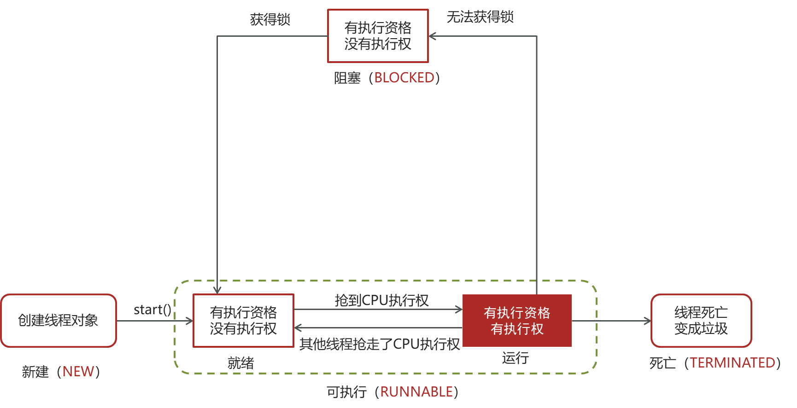


```java
private static void testWaiting() {

    Thread t2 = new Thread(() -> {
        synchronized (LOCK) {
            logger1.debug("before waiting"); 
            try {
                LOCK.wait(); 
            } catch (InterruptedException e) {
                e.printStackTrace();
            }
        }
    }，"t2");
    t2.start();
    synchronized (LOCK) {
        LOCK.notify(); 
    }
}
```

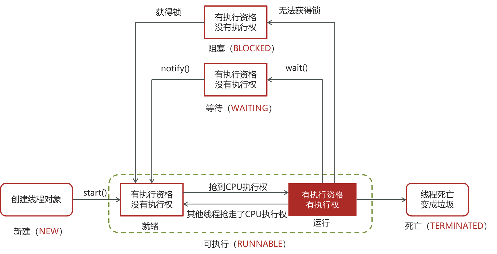

```java
private static void testTimedWaiting(){
    Thread t1 = new Thread(() -> {

        try {
            Thread.sleep(500);
        } catch (InterruptedException e) {
            e.printStackTrace();
        }
        logger1.debug("running...");
    }，"t1");
    t1.start();
}
```

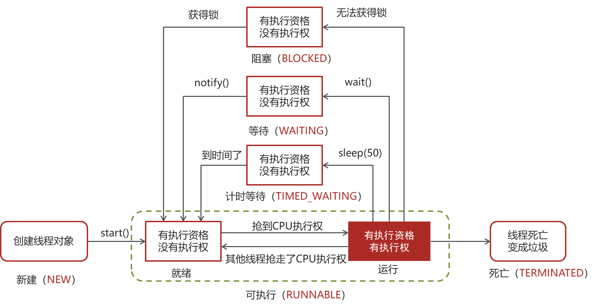

#### 总结 

- 线程包括哪些状态

    - 新建(NEW)
    - 可运行(RUNNABLE)
    - 阻塞(BLOCKED)
    - 等待(WAITING)
    - 时间等待(TIMED\_WAITING)
    - 终止(TERMINATED)
- 线程状态之间是如何变化的

     *  创建线程对象时新建状态
     *  调用了`start()`方法转变为可执行状态
     *  线程获取到了CPU的执行权， 执行结束是终止状态
     *  在可执行状态的过程中， 如果没有获取CPU的执行权， 可能会切换到其他状态

         *  如果没有获取锁(synchronized或lock)进入阻塞状态， 获得锁再切换为可执行状态
         *  如果线程调用了`wait()`方法进入等待状态， 其他线程调用`notify()`唤醒后可切换为可执行状态
         *  如果线程调用了`sleep()`方法， 进入计时等待状态， 到时间后可切换为可执行状态

### 线程按顺序执行`join`， `notify`、`notifyall`区别 

#### 新建T1、T2、T3三个线程， 如何保证他们按顺序执行? 

可以使用线程中的`join`方法解决

> `join()` 等待线程运行结束

> 例子:
>
> `t.join()`
>
> 阻塞调用此方法的线程进入`TIMED_WAITING`
>
> 直到线程t执行完成后， 此线程再继续执行

```java
Thread t1 = new Thread(() -> { 
    System.out.println("t1");
}) ;
Thread t2 = new Thread(() -> {
    try {
        t1.join();                          // 加入线程t1，只有t1线程执行完毕以后，再次执行t2线程
    } catch (InterruptedException e) {
        e.printStackTrace();
    }
    System.out.println("t2");
}) ;
Thread t3 = new Thread(() -> {
    try {
        t2.join();                              // 加入线程t2，只有t2线程执行完毕以后，再次执行该线程
    } catch (InterruptedException e) {
        e.printStackTrace();
    }
    System.out.println("t3");
}) ;
// 启动线程后会按照 t1 t2 t3的顺序执行
t1.start();
t2.start();
t3.start();
```

#### `notify()`和`notifyAll()`有什么区别? 

 *  `notifyAll`: 唤醒所有`wait`的线程
 *  `notify`: 只随机唤醒一个`wait`线程

### `wait`和`sleep`方法的不同 

- **共同点:**
  - `wait()`， `wait(long)`和`sleep(long)`的效果都是让当前线程暂时放弃CPU的使用权， 进入阻塞状态

- **不同点:**
  1.  方法归属不同

       *  `sleep(long)`是Thread的静态方法
       *  而`wait()`， `wait(long)`都是Object的成员方法， 每个对象都有
  2.  醒来时机不同

       *  执行`sleep(long)`和`wait(long)`的线程都会在等待响应毫秒后自动醒来
       *  `wait(long)`和`wait()`还可以被`notify`唤醒， `wait()`如果不唤醒就一直等下去
       *  她们都可以被打断唤醒
  3.  锁特性不同(重点)

       *  `wait()`方法的调用必须先获取`wait`对象的锁， 而`sleep`则无此限制
       *  `wait`方法执行后会释放对象锁， 允许其他线程获得该对象锁(我放弃CPU， 但你们还可以用)
       *  而`sleep`如果在`synchronized`代码块中执行， 并不会释放对象锁(我放弃CPU， 你们也用不了)


### 停止一个正在运行的线程 

有三种方式可以停止线程

 *  使用退出标志， 使线程正常退出， 也就是当`run`方法完成后线程终止
 *  使用`stop`方法强行终止(不推荐， 方法已作废)
 *  使用`interrupt`方法中断线程
   
     *  打断阻塞的线程(`sleep`， `wait`， `join`)的线程， 线程会抛出`InterruptedException`异常
     *  打断正常的线程， 可以根据打断状态来标记是否退出线程

## 线程中并发安全 

### synchronized关键字

`synchronized` 是 Java 中的一个关键字，翻译成中文是同步的意思，主要解决的是多个线程之间访问资源的同步性，可以保证被它修饰的方法或者代码块在任意时刻只能有一个线程执行。

#### 基本使用回顾 

> **1、修饰实例方法** （锁当前对象实例）
>
> 给当前对象实例`this`加锁，进入同步代码前要获得 **当前对象实例的锁** 。
>
> ```java
> synchronized void method() {
>  //业务代码
> }
> ```
>
> **2、修饰静态方法** （锁当前类）
>
> 给当前类加锁，会作用于类的所有对象实例 ，进入同步代码前要获得 **当前 class 的锁**。
>
> 这是因为静态成员不属于任何一个实例对象，归整个类所有，不依赖于类的特定实例，被类的所有实例共享。
>
> ```java
> synchronized static void method() {
>  //业务代码
> }
> ```
>
> 静态 `synchronized` 方法和非静态 `synchronized` 方法之间的调用互斥么？不互斥！如果一个线程 A 调用一个实例对象的非静态 `synchronized` 方法，而线程 B 需要调用这个实例对象所属类的静态 `synchronized` 方法，是允许的，不会发生互斥现象，因为访问静态 `synchronized` 方法占用的锁是当前类的锁，而访问非静态 `synchronized` 方法占用的锁是当前实例对象锁。
>
> **3、修饰代码块** （锁指定对象/类）
>
> 对括号里指定的对象/类加锁：
>
> - `synchronized(object)` 表示进入同步代码库前要获得 **给定对象的锁**。
> - `synchronized(类.class)` 表示进入同步代码前要获得 **给定 Class 的锁**
>
> ```java
> synchronized(this) {
>     //业务代码
> }
> ```
>
> **总结：**
>
> - `synchronized` 关键字加到 `static` 静态方法和 `synchronized(class)` 代码块上都是是给 Class 类上锁；
> - `synchronized` 关键字加到实例方法上是给对象实例上锁；
> - 尽量不要使用 `synchronized(String a)` 因为 JVM 中，字符串常量池具有缓存功能。
> - 构造方法不能使用 synchronized 关键字修饰。不过，可以在构造方法内部使用 synchronized 代码块。

```java
public class TicketDemo {
    
    static Object lock = new Object();
    int ticketNum = 10;
    public void getTicket() {

        synchronized (lock){
            if (ticketNum <= 0) {
                return;
            }
            System.out.println(Thread.currentThread().getName() + "抢到一张票，剩余:" + ticketNum);
            // 非原子性操作
            ticketNum--;
        }
    }

    public static void main(String[] args) {

        TicketDemo ticketDemo = new TicketDemo();
        for (int i = 0; i < 20; i++) {
            new Thread(() -> {
                ticketDemo.getTicket();
            }).start();
        }
    }
}
```

`Synchronized`(对象锁)采用互斥的方式让同一时间至多只有一个线程能持有(对象锁)， 其他线程再想获取这个(对象锁)时就会阻塞住

其底层是一个`Monitor`锁

#### Monitor 

为了体现底层，我们先对一段代码进行分析

```java
public class SyncTest {
    
    static final Object lock = new Object();
    static int counter = 0;
    public static void main(String[] args) {

        synchronized (lock) {
            counter++;
        }
    }
}
```

以上看不出来什么，需要使用`javap -v xx.class`查看class字节码信息

class反汇编:

> 代码中有两次 `monitorexit`，类似于 `try-catch-finally`，是为了以防万一在运行过程中出错导致没有正常地走第一个`monitorexit`，使得锁无法释放

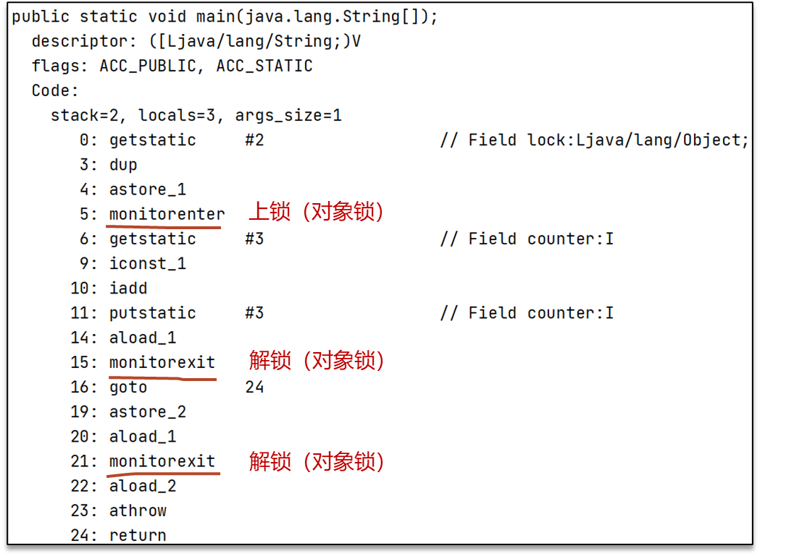

Monitor被翻译为监视器， 是由 JVM 提供， c++语言实现

> 当对象进入 synchronized后，会与Monitor进行关联，查看Monitor中的Owner对象是否为`NULL`
>
> - 如果为`null`，则让当前线程持有Owner，否则该线程进入EntryList进行等待

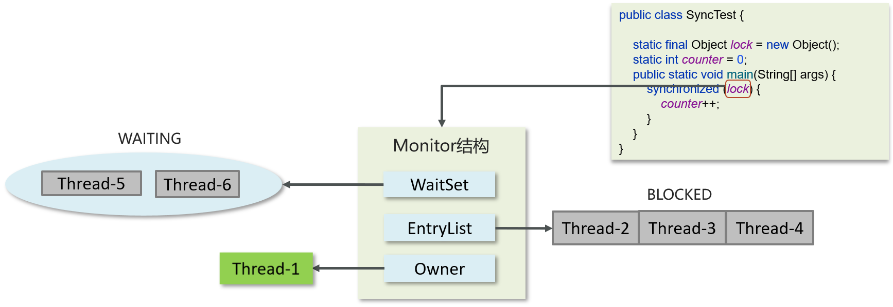

 *  `owner`: 存储当前获取锁的线程的， 只能有一个线程可以获取
 *  `entryList`: 关联没有抢到锁的线程， 处于`BLOCKED`状态的线程
 *  `waitSet`: 关联调用了`wait`方法的线程， 处于`WAITING`状态的线程

#### 总结 

`Synchronized`关键字的底层原理

 *  `Synchronized`(对象锁)采用互斥的方式让同一时刻至多只有一个线程能持有(对象锁)
 *  它的底层由`Monitor`实现的， `Monitor`是JVM级别的对象(C++实现)， 线程获得锁需要使用对象(锁)关联`Monitor`
 *  在`Monitor`内部有三个属性， 分别是`owner`、`entryList`、`waitSet`
 *  其中`owner`是关联的获得锁的线程， 并且只能关联一个线程; `entryList`关联的是处于阻塞状态的线程; `waitSet`关联的是处于`WAITING`状态的线程

#### 进阶 

Monitor实现的锁属于重量级锁， 你了解过锁升级吗?

 *  Monitor实现的锁属于重量级锁， 里面涉及到了用户态和内核态的切换、进程的上下文切换， 成本较高， 性能比较低
 *  在JDK1.6引入了两种新型锁机制: **偏向锁**和**轻量级锁**， 它们的引入是为了解决在没有多线程竞争或基本没有竞争的场景下因使用传统锁机制带来的性能开销问题

> 在 Java 早期版本中，`synchronized` 属于 **重量级锁**，效率低下。这是因为监视器锁（monitor）是依赖于底层的操作系统的 `Mutex Lock` 来实现的，Java 的线程是映射到操作系统的原生线程之上的。如果要挂起或者唤醒一个线程，都需要操作系统帮忙完成，而操作系统实现线程之间的切换时需要从用户态转换到内核态，这个状态之间的转换需要相对比较长的时间，时间成本相对较高。
>
> 不过，在 Java 6 之后， `synchronized` 引入了大量的优化如自旋锁、适应性自旋锁、锁消除、锁粗化、偏向锁、轻量级锁等技术来减少锁操作的开销，这些优化让 `synchronized` 锁的效率提升了很多。因此， `synchronized` 还是可以在实际项目中使用的，像 JDK 源码、很多开源框架都大量使用了 `synchronized`

#### 对象的内存结构 

在HotSpot虚拟机中， 对象在内存中存储的布局可分为3块区域: 对象头(Header)、实例数据(Instance Data)和对其填充

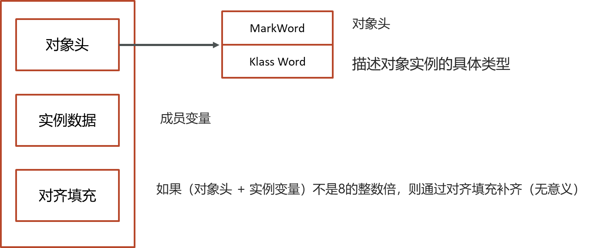

#### MarkWord 


 *  `hashcode`: 25位的对象标识Hash码
 *  `age`: 对象分代年龄占4位
 *  `biased_lock`: 偏向锁标识， 占1位， 0标识没有开启偏向锁， 1标识开启了偏向锁
 *  `thread`: 持有偏向锁的线程ID， 占23位
 *  `epoch`: 偏向时间戳， 占2位
 *  `ptr_to_lock_record`: 轻量级锁状态下， 指向栈中锁记录的指针， 占30位
 *  `ptr_to_heavyweight_monitor`: 重量级锁状态下， 指向对象监视器Monitor的指针， 占30位

#### Monitor重量级锁 

每个Java对象都可以关联一个Monitor对象， 如果使用`Synchronized`给对象上锁(重量级)之后， 该对象头的Mark Word中就被设置指向Monitor对象的指针

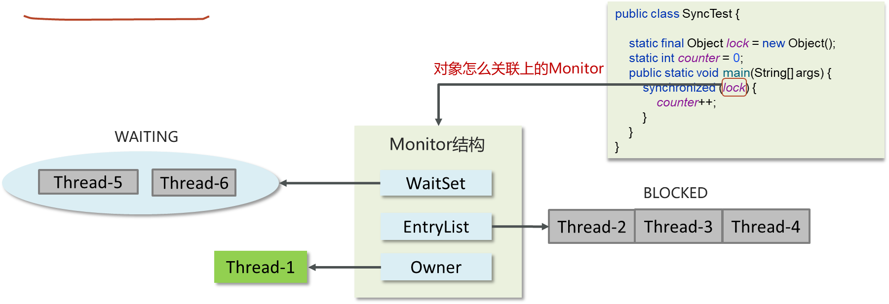

#### 轻量级锁 

在很多的情况下， 在Java程序运行时， 同步块中的代码都是不存在竞争的， 不同的线程交替的执行同步块中的代码. 这种情况下， 用重量级锁是没必要的. 因此JVM引入了轻量级锁的概念

> 例如下图两个方法中的代码块都用了同一个对象锁 `obj`。假如现在有一个线程调用了method1，method1又调用了method2，这个线程就进入了同一把锁两次，称为锁重入。

```java
static final Object obj = new Object();
public static void method1() {
    synchronized( obj ) {
        // 同步块 A
        method2();
    }
}
public static void method2() {
    synchronized( obj ) {
        // 同步块 B
    }
}
```

**加锁流程:**

1.  在线程栈中创建一个Lock Record， 将其obj字段指向锁对象
2.  通过`CAS`指令将 Lock Record 的地址存储在对象头的 Mark Word 中， 如果对象处于无锁状态则修改成功， 代表该线程获得了轻量级锁
3.  如果是当前线程已经持有该锁， 代表这是一次锁重入. 设置 Lock Record 第一部分为`null`， 起到了一个重入计数器的作用
4.  如果`CAS`修改失败， 说明发生了竞争， 需要膨胀为重量级锁

**解锁过程:**

1.  遍历线程栈， 找到所有obj字段等于当前锁对象的 Lock Record.
2.  如果 Lock Record 的 Mark Word 为`null`， 代表这是一次重入， 将obj设置为`null`后`continue`.
3.  如果 Lock Record 的 Mark Word 不为`null`， 则利用`CAS`指令将对象头的 Mark Word 恢复称为无锁状态， 如果失败则膨胀为重量级锁.

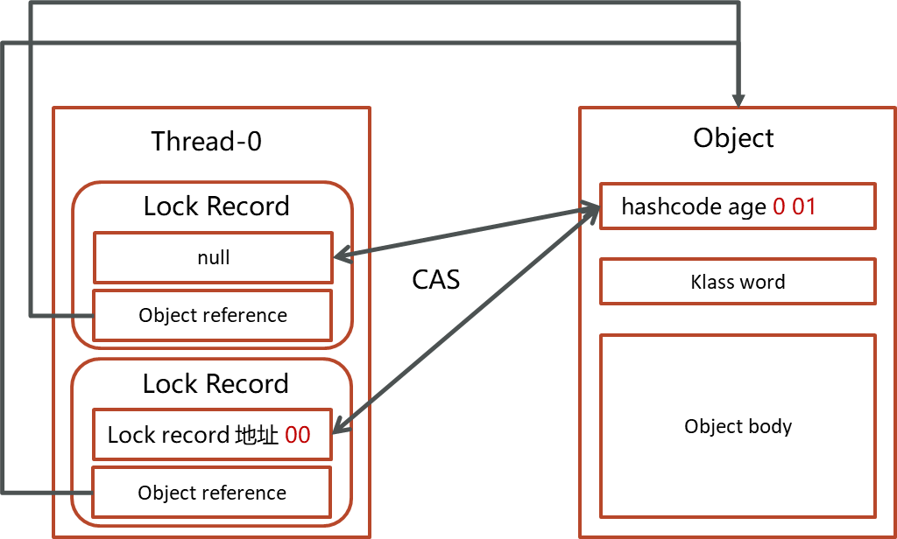

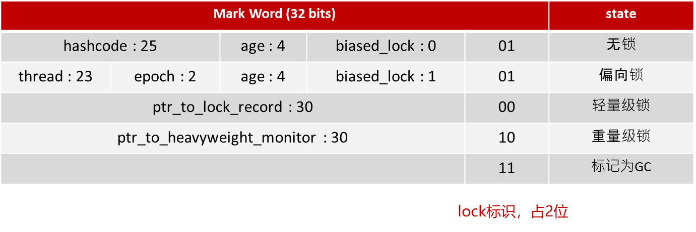

#### 偏向锁 

轻量级锁在没有竞争时(就自己这个线程)， 每次重入仍然需要执行`CAS`操作

Java 6中引入了偏向锁来做进一步优化: 只有第一次使用`CAS`将线程ID设置到对象的 Mark Word 头， 之后发现这个线程ID是自己的就表示没有竞争， 不用重新`CAS`. 以后只要不发生竞争， 这个对象就归该线程所有

```java
static final Object obj = new Object();
public static void m1 () {

    synchronized (obj) {
        // 同步块 A
        m2();
    }
}
public static void m2 () {

    synchronized (obj) {
        // 同步块 B
        m3();
    }
}
public static void m3 () {

    synchronized (obj) {    
    }
}
```

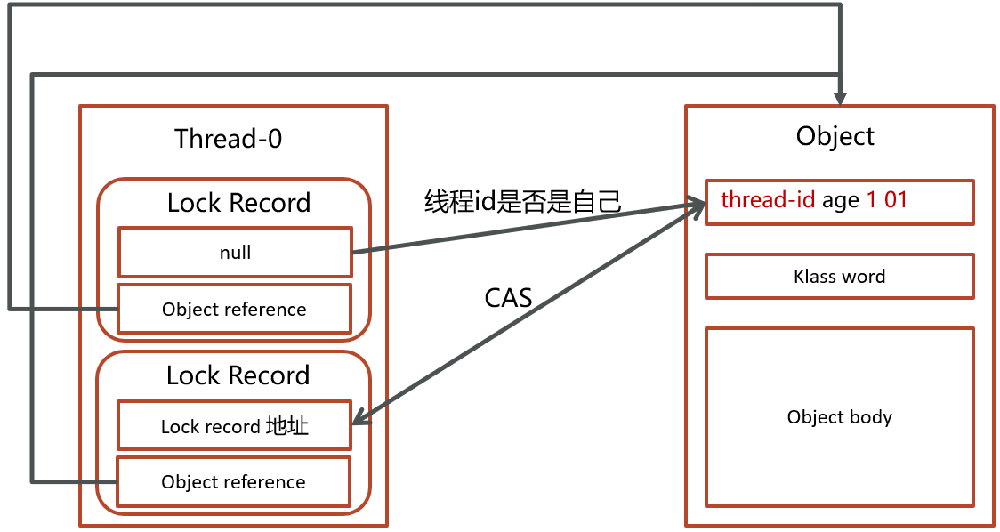

#### 面试官: Monitor实现的锁属于重量级锁， 你了解过锁升级吗? 

Java中的`Synchronized`有偏向锁、轻量级锁、重量级锁三种形式， 分别对应了锁只被一个线程持有、不同线程交替持有锁、多线程竞争锁三种情况.

<table> 
 <thead> 
  <tr> 
   <th></th> 
   <th>描述</th> 
  </tr> 
 </thead> 
 <tbody> 
  <tr> 
   <td>重量级锁</td> 
   <td>底层使用的Monitor实现，里面涉及到了用户态和内核态的切换、进程的上下文切换，成本较高，性能比较低。</td> 
  </tr> 
  <tr> 
   <td>轻量级锁</td> 
   <td>线程加锁的时间是错开的（也就是没有竞争），可以使用轻量级锁来优化。轻量级修改了对象头的锁标志，相对重量级锁性能提升很多。每次修改都是CAS操作，保证原子性</td> 
  </tr> 
  <tr> 
   <td>偏向锁</td> 
   <td>一段很长的时间内都只被一个线程使用锁，可以使用了偏向锁，在第一次获得锁时，会有一个CAS操作，之后该线程再获取锁，只需要判断mark word中是否是自己的线程id即可，而不是开销相对较大的CAS命令</td> 
  </tr> 
 </tbody> 
</table>

一旦锁发生了竞争， 都会升级为重量级锁

### JMM(Java内存模型) 

#### Java内存模型 

JMM(Java Memory Model)Java内存模型， 定义了共享内存中多线程程序读写操作的行为规范， 通过这些规则来规范对内存的读写操作从而保证指令的正确性

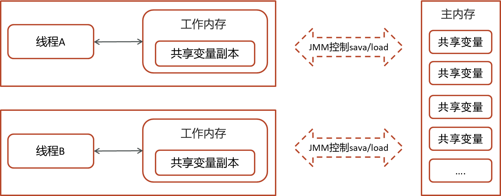

#### 总结 

你谈谈JMM(Java内存模型)

 *  JMM(Java Memory Model)Java内存模型， 定义了共享内存中多线程程序读写操作的行为规范， 通过这些规则来规范对内存的读写操作从而保证指令的正确性
 *  JMM把内存分为两块， 一块是私有线程的工作区域(工作内存)， 一块是所有线程的共享区域(主内存)
 *  线程跟线程之间是相互隔离， 线程跟线程交互需要通过主内存

> **JMM（Java Memory Model，Java 内存模型）** 是 Java 语言规范中定义的一种模型，描述了多线程程序中共享内存的可见性、操作顺序和重排序的规则。JMM 决定了在多线程环境下，线程之间对共享变量的读写操作是如何相互影响的，以及如何保证不同线程对共享变量的操作是可见的。
>
> #### 为什么需要 JMM？
>
> 多线程程序的核心问题在于**共享数据的可见性**和**指令的重排序**。为了优化性能，现代处理器和编译器可能会对程序的指令执行顺序进行优化（重排序），这可能会导致不同线程看到的数据不一致。因此，JMM 主要解决以下两个问题：
>
> 1. **可见性问题**：一个线程对共享变量的修改，是否能及时被其他线程看到。
> 2. **指令重排序问题**：为了提高效率，处理器或编译器可能会改变指令的执行顺序，这可能会导致并发程序出现意外的行为。

### CAS 

#### 基本介绍

CAS的全称是: Compare And Swap(比较再交换)， 它体现的一种**乐观锁**的思想， 能够在无锁情况下保证线程操作共享数据的原子性

在JUC(java.util.concurrent)包下实现的很多类都用到了`CAS`操作

 *  AbstractQueuedSynchronizer (AQS 框架)
 *  AtomicXXX 类

#### CAS数据交换流程 

> 假设现在共享主内存中有一个 `int a = 100`，线程A和B都将数据读取到自己的私有工作区中
>
> - 线程A做了`A++`操作，线程B做了`A--`操作，然后都要进行提交
>
>   - 线程A用自己的`A`值与主内存的`V`值比较发现都是100，线程A能够修改成功，把线程A的`B`值赋给主内存，并返回`True`
>
>   - 此时线程B也要提交数据，会拿主内存的`V`值(101)与自己的`A`值(100)进行比较，发现并不相等，于是更新失败，开始自旋：重新读取主内存中的`V`值（101）赋值给自己的`A`值，然后执行`a--`操作，此时就可以成功提交
>

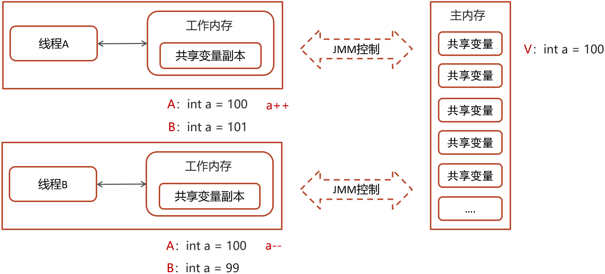

一个当前内存值V、旧的预期值A、即将更新的值B， 当且仅当旧的预期值A和内存值V相同时， 将内存值修改为B并返回`true`， 否则什么都不做， 并返回`false`. 如果`CAS`操作失败， 通过自旋的方式等待并再次尝试， 直到成功

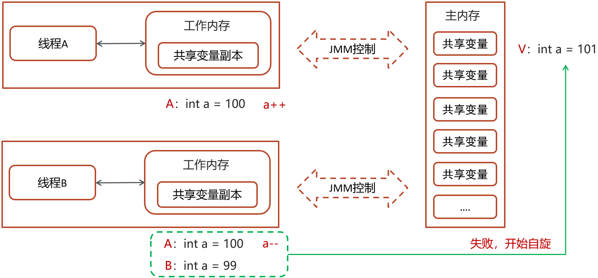

> 自旋锁


 *  因为没有加锁， 所以线程不会陷入阻塞， 效率较高
 *  如果竞争激烈， 重试频繁发生， 效率会受影响

#### CAS底层实现 

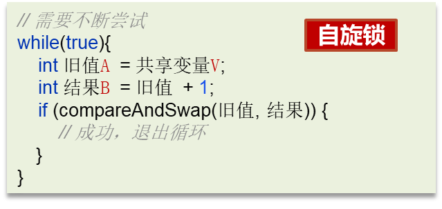

`CAS`底层依赖于一个`Unsafe`类来直接调用操作系统底层的`CAS`指令

> `Unsafe`类位于`sun.misc`包下，`unsafe`类中的 CAS 方法是`native`方法。`native`关键字表明这些方法是用本地代码（通常是 C 或 C++）实现的，而不是用 Java 实现的。这些方法直接调用底层的硬件指令来实现原子操作。也就是说，Java 语言并没有直接用 Java 实现 CAS，而是通过 C++ 内联汇编的形式实现的（通过 JNI 调用）。因此，CAS 的具体实现与操作系统以及 CPU 密切相关
>
> `sun.misc`包下的`Unsafe`类提供了`compareAndSwapObject`、`compareAndSwapInt`、`compareAndSwapLong`方法来实现的对`Object`、`int`、`long`类型的 CAS 操作：
>
> ```java
> /**
>  * 以原子方式更新对象字段的值。
>  *
>  * @param o        要操作的对象
>  * @param offset   对象字段的内存偏移量
>  * @param expected 期望的旧值
>  * @param x        要设置的新值
>  * @return 如果值被成功更新，则返回 true；否则返回 false
>  */
> boolean compareAndSwapObject(Object o, long offset, Object expected, Object x);
> 
> /**
>  * 以原子方式更新 int 类型的对象字段的值。
>  */
> boolean compareAndSwapInt(Object o, long offset, int expected, int x);
> 
> /**
>  * 以原子方式更新 long 类型的对象字段的值。
>  */
> boolean compareAndSwapLong(Object o, long offset, long expected, long x);
> ```

ReentrantLock中的一段`CAS`代码:

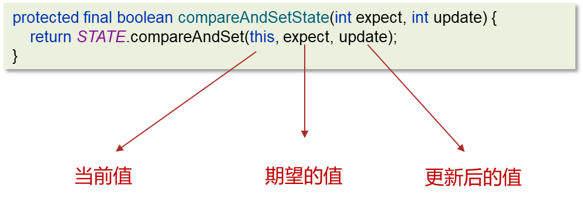

#### 乐观锁和悲观锁 

 *  `CAS`是基于乐观锁的思想: 最乐观的估计， 不怕别的线程来修改共享变量， 就算改了也没关系， 重试即可
 *  `Synchronized`是基于悲观锁的思想: 最悲观的估计， 要防着其他线程来修改共享变量， 当前线程上锁， 其他线程不能修改， 当前线程修改完之后解开锁， 其他线程才有机会

#### 优缺点

> ##### CAS 的优点
>
> 1. **无锁操作**：CAS 不需要加锁，因此不会发生线程阻塞，性能比传统锁机制要高，尤其是在低竞争情况下。
> 2. **高效**：由于 CAS 是硬件级别的操作，它的开销较小，可以实现高效的并发控制。
>
> ##### CAS 的缺点
>
> 1. **ABA 问题**：如果一个变量 V 初次读取的时候是 A 值，并且在准备赋值的时候检查到它仍然是 A 值，那我们就能说明它的值没有被其他线程修改过了吗？很明显是不能的，因为在这段时间它的值可能被改为其他值，然后又改回 A，那 CAS 操作就会误认为它从来没有被修改过。这个问题被称为 CAS 操作的 **"ABA"问题。**CAS 操作无法察觉这种变化，可能会导致问题。Java 使用 `AtomicStampedReference` 来解决 ABA 问题，它通过版本号来跟踪变量的变化。
> 2. **自旋开销**：CAS 失败时通常会不断重试（自旋），如果竞争严重，自旋次数会变多，导致 CPU 资源浪费。
> 3. **只能保证一个变量的原子性**：CAS 只能处理单个变量的原子操作，对于多个变量的原子操作，仍然需要加锁。


### volatile 

#### 介绍 

> `volatile` 关键字可以保证变量的可见性
>
> 如果我们将变量声明为 **`volatile`** ，这就指示 JVM，这个变量是共享且不稳定的，每次使用它都到主存中进行读取。
>
> `volatile` 关键字能保证数据的可见性，但不能保证数据的原子性。`synchronized` 关键字两者都能保证。

一旦一个共享变量(类的成员变量、类的静态成员变量)被`volatile`修饰之后， 那么就具备了两层语义:

1.  保证线程间的可见性
2.  禁止进行指令重排序

#### 保证线程间的可见性 

用`volatile`修饰共享变量， 能够防止编译器等优化发生， 让一个线程对共享变量的修改对另一个线程可见

```java
static boolean stop = false;
public static void main(String[] args) {

    new Thread(() -> {
        try {
            Thread.sleep(100);
        } catch (InterruptedException e) {
            e.printStackTrace();
        }
        stop = true;
        System.out.println(Thread.currentThread().getName()+"：modify stop to true...");
    }，"t1").start();
    
    new Thread(() -> {
        try {
            Thread.sleep(200);
        } catch (InterruptedException e) {
            e.printStackTrace();
        }
        System.out.println(Thread.currentThread().getName()+"："+stop);
    }，"t2").start();
    
    new Thread(() -> {
        int i = 0;
        while (!stop) {
            i++;
        }
        System.out.println("stopped... c:"+ i);
    }，"t3").start();
}
```

控制台输出:

```java
t1: modify stop to true...
t2: true
```

> 理想状态下由于`stop`变量被共享，所以在第一个线程把`stop`修改为了`true`，所以在第二个线程能够打印`true`。但是t3的循环并没有结束.

问题分析: 主要是因为在JVM虚拟机中有一个JIT(即时编译器)给代码做了优化

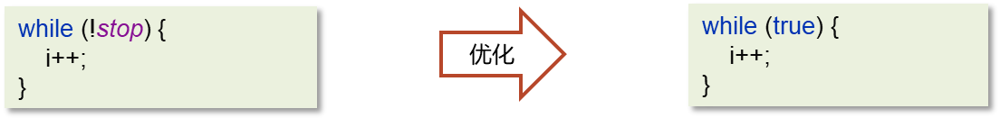

**解决方案一:** 在程序运行的时候加入vm参数`-Xint`表示禁用即时编译器，不推荐，得不偿失(其他程序还要使用)

**解决方案二:** 在修饰`stop`变量的时候加上`volatile`， 当前告诉JIT， 不要对`volatile`修饰的变量做优化

#### `volatile`禁止指令重排序 

> 指令重排序是指编译器、处理器或其他系统在执行程序时，改变指令执行的顺序，以提高性能和效率的一种优化技术。虽然这种重排序不会改变程序的最终结果（在没有并发的情况下），但在多线程环境中可能会导致意想不到的行为和错误。
>
> 在单线程环境中，指令重排序通常不会导致问题，因为程序的最终结果是可预测的。然而，在多线程环境中，重排序可能导致一些难以发现的错误，例如：
>
> - **可见性问题**：一个线程对共享变量的修改可能在另一个线程中不可见，因为指令被重排序，导致某个线程读取到过时的值。
> - **指令依赖问题**：如果某个线程依赖于另一个线程的操作顺序，指令重排序可能导致程序逻辑错误。例如，线程 A 先设置一个标志位，然后线程 B 检查这个标志位。如果这两条指令被重排序，线程 B 可能在线程 A 的设置还未完成时就读取到标志位，从而产生错误的行为。

用`volatile`修饰共享变量会在读、写共享变量时加入不同的屏障， 阻止其他读写操作越过屏障， 从而达到阻止重排序的效果

```java
int x;
int y;

@Actor
public void actor1() {
    x = 1;
    y = 1;
}

@Actor
public void actor2(II_Result r) {
    r.r1 = y;
    r.r2 = x;
}
```

> 注解`@Actor`保证方法内的代码在同一个线程下执行

情况一: 先执行`actor2`获取结果 ==> `0，0`

情况二: 先执行`actor1`中的第一行代码， 然后执行`actor2`获取结果 ==> `0，1`

情况三: 先执行`actor1`中所有代码， 然后执行`actor2`获取结果 ==> `1，1`

情况四: 先执行`actor1`中第二行代码， 然后执行`actor2`获取结果 ==> `1，0`

如果出现情况四， 说明已经发生了指令重排序，说明代码跳着走了

测试代码:

```java
package com.qqzj.juc;

import org.openjdk.jcstress.annotations.*;
import org.openjdk.jcstress.infra.results.II_Result;

@JCStressTest // 多线程测试框架工具
// 说明"0， 0"， "1， 1"， "0， 1"是正常情况
@Outcome(id = {"0， 0"， "1， 1"， "0， 1"}， expect = Expect.ACCEPTABLE， desc = "ACCEPTABLE") 
// "1， 0"是重排序的情况
@Outcome(id = "1， 0"， expect = Expect.ACCEPTABLE_INTERESTING， desc = "INTERESTING") 
@State
public class ReorderTest {
    int x;
    int y;

    @Actor
    public void actor1() {
        x = 1;
        y = 1;
    }

    @Actor
    public void actor2(II_Result r) {
        r.r1 = y;
        r.r2 = x;
    }
}
```

POM文件:

```xml
<?xml version="1.0" encoding="UTF-8"?>
<project xmlns="http://maven.apache.org/POM/4.0.0"
         xmlns:xsi="http://www.w3.org/2001/XMLSchema-instance"
         xsi:schemaLocation="http://maven.apache.org/POM/4.0.0 http://maven.apache.org/xsd/maven-4.0.0.xsd">
    <modelVersion>4.0.0</modelVersion>

    <groupId>org.example</groupId>
    <artifactId>jcstress-demo</artifactId>
    <version>1.0-SNAPSHOT</version>

    <properties>
        <maven.compiler.source>11</maven.compiler.source>
        <maven.compiler.target>11</maven.compiler.target>
    </properties>

    <dependencies>
        <dependency>
            <groupId>org.openjdk.jcstress</groupId>
            <artifactId>jcstress-core</artifactId>
            <version>0.5</version>
        </dependency>
        <dependency>
            <groupId>org.openjdk.jcstress</groupId>
            <artifactId>jcstress-samples</artifactId>
            <version>0.5</version>
        </dependency>
    </dependencies>

</project>
```

由于项目中并没有Main方法， 所以需要配置以下:

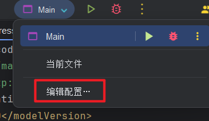

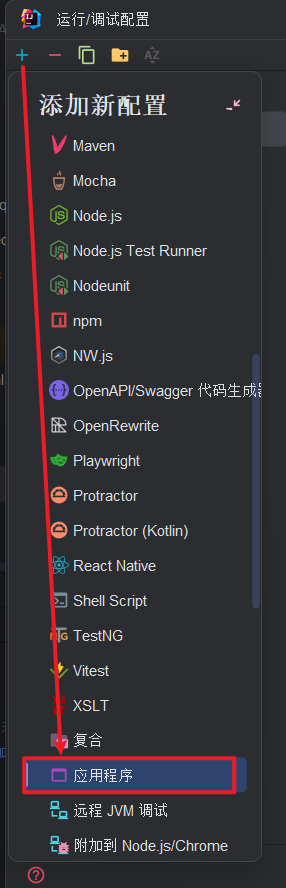

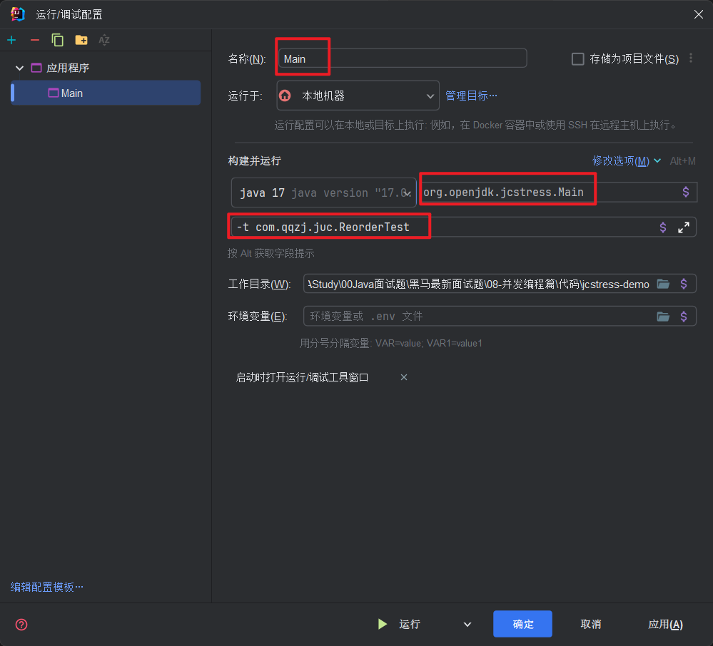

这时候就可以直接运行了， 如果运行不起来， 在Maven中`clean`一下然后再`package`一下就可以了

运行完之后， 在控制台就可以看到输出日志:

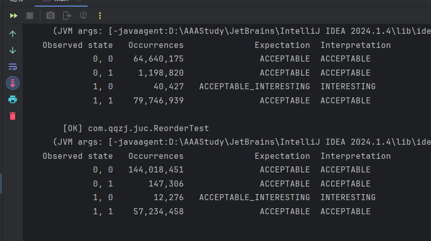

这样看并不直观， 可以在项目中找到`results`文件夹， 下面有一个html页面:

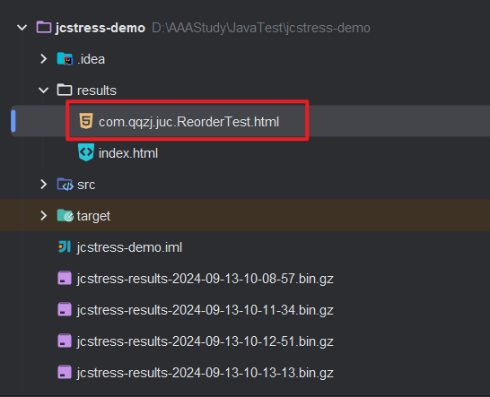

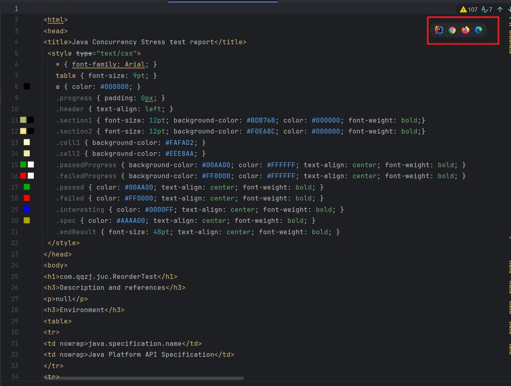

可以选择一个浏览器打开:

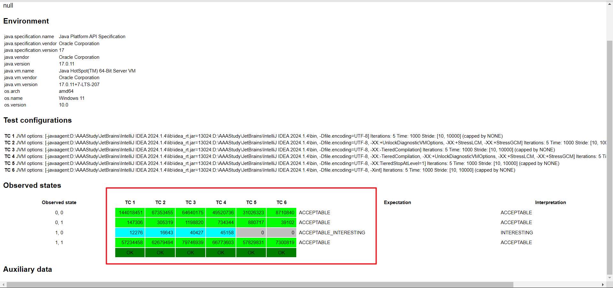

这里一共进行了六次测试， 每种情况都有显示出现次数.

可以看到， 此时是发生了指令重排序的. 这时候就需要加上`volatile`关键字:

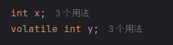

再运行一次查看结果:

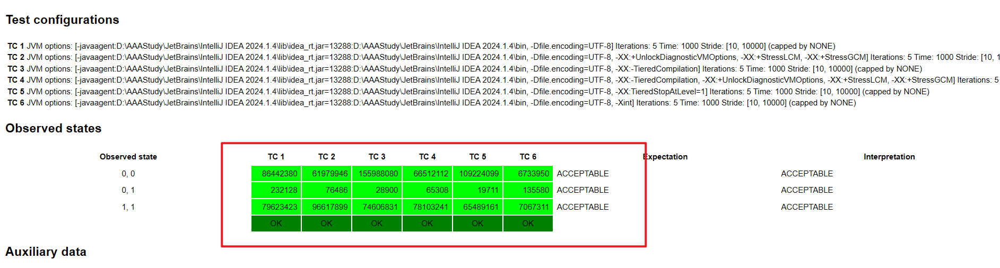

可以看到， 加上`volatile`关键字修饰之后， 就没有发生指令重排序的情况了

##### 原理 

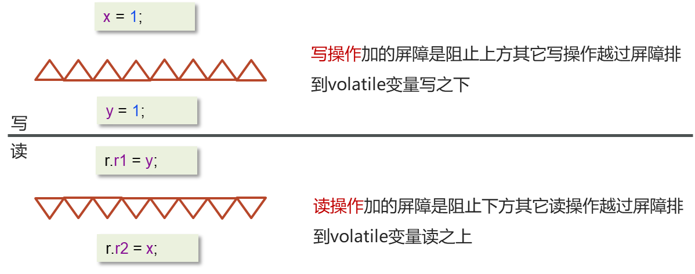

`volatile`使用技巧:

 *  写变量让`volatile`修饰的变量放在代码最后位置
 *  读变量让`volatile`修饰的变量放在代码最开始的位置

#### 总结 

1.  请谈谈你对`volatile`的理解
  
    1.  保证线程间的可见性
      
        用`volatile`修饰共享变量， 能够防止编译器等优化发生， 让一个线程对共享变量的修改对另一个线程可见
    2.  禁止进行指令重排序
      
        指令重排序: 用`volatile`修饰共享变量会在读、写共享变量时加入不同的屏障， 阻止其他读写操作越过屏障， 从而达到阻止重排序的效果

### AQS 

#### 什么是AQS? 

AQS 的全称为 `AbstractQueuedSynchronizer` ，翻译过来的意思就是抽象队列同步器。这个类在 `java.util.concurrent.locks` 包下面。它是构建锁或者其他同步组件的基础框架

AQS和Synchronized的区别:

<table> 
 <thead> 
  <tr> 
   <th>synchronized</th> 
   <th>AQS</th> 
  </tr> 
 </thead> 
 <tbody> 
  <tr> 
   <td>关键字，c++ 语言实现</td> 
   <td>java 语言实现，是一个抽象类</td> 
  </tr> 
  <tr> 
   <td>悲观锁，自动释放锁</td> 
   <td>悲观锁，手动开启和关闭</td> 
  </tr> 
  <tr> 
   <td>锁竞争激烈都是重量级锁，性能差</td> 
   <td>锁竞争激烈的情况下，提供了多种解决方案</td> 
  </tr> 
 </tbody> 
</table>
AQS常见的实现类

 *  `ReentrantLock` 阻塞式锁
 *  `Semaphore` 信号量
 *  `CountDownLatch` 倒计时锁

#### 基本工作机制 

> AQS 使用 **int 成员变量 `state` 表示同步状态**，通过内置的 **线程等待队列** 来完成获取资源线程的排队工作。
>
> `state` 变量由 `volatile` 修饰，用于展示当前临界资源的获锁情况。
>
> ```JAVA
> // 共享变量，使用volatile修饰保证线程可见性
> private volatile int state;
> ```

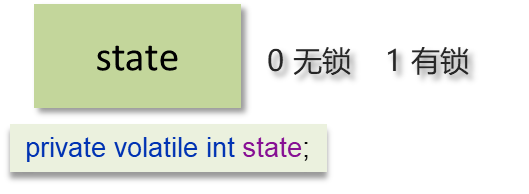

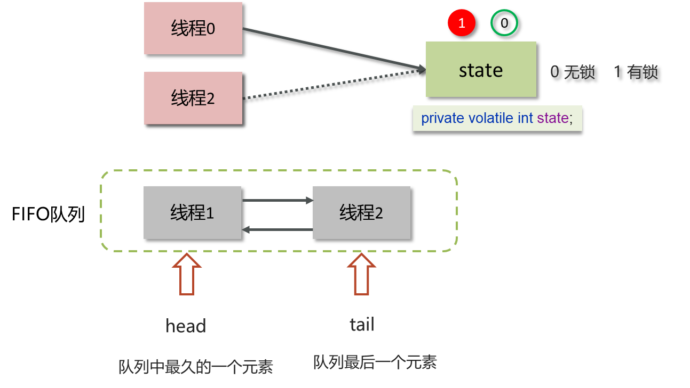

#### 多个线程共同去抢这个资源是如何保证原子性的呢? 

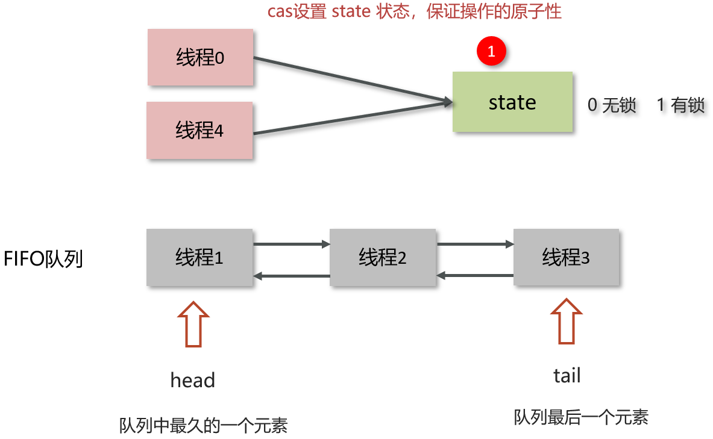

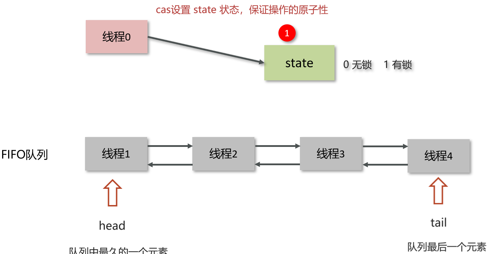

#### AQS是公平锁吗， 还是非公平锁? 

> 当前锁由线程0持有，当线程0释放后修改状态为0。此时新来了一个线程5
>
> - 假如线程5和队列中的head抢夺资源，则非公平
> - 假如线程5加入到队列后面，由线程1持有锁，则公平

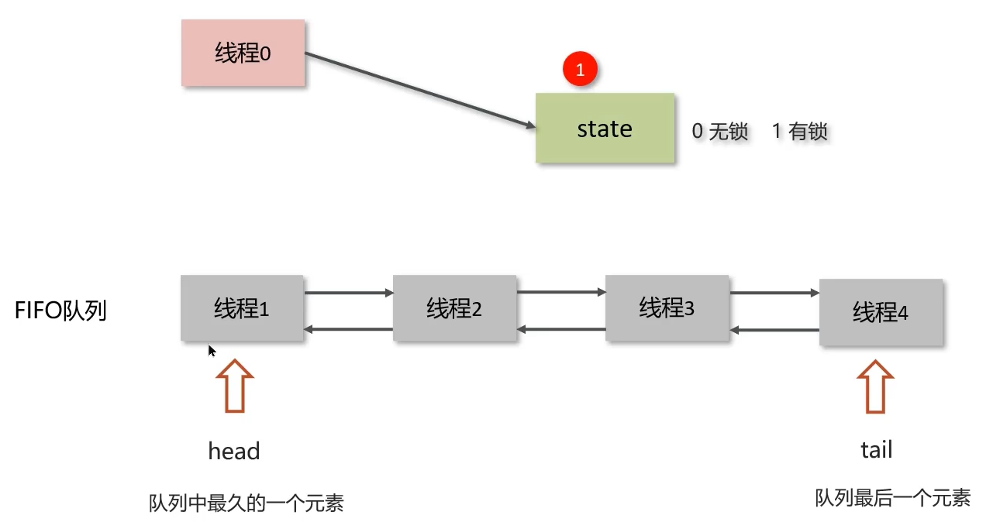

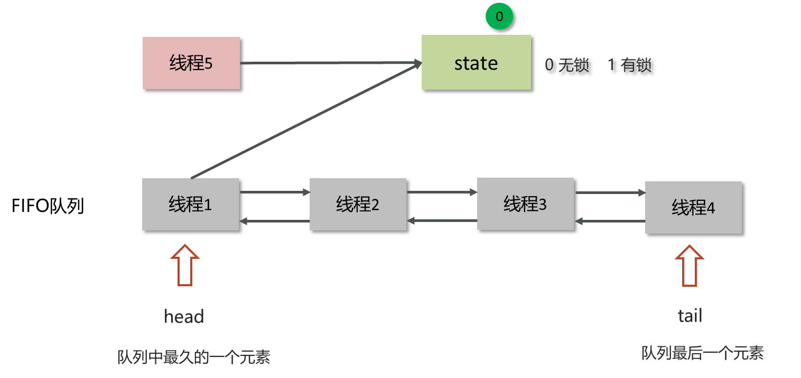

 *  新的线程与队列中的线程共同来抢资源， 是非公平锁
 *  新的线程到队列中等待， 只让队列中的head线程获取锁， 是公平锁

#### 总结 

什么是AQS?

 *  是多线程中的队列同步器. 是一种锁机制， 它是作为一个基础框架使用的， 像`ReentrantLock`、`Semaphore`都是基于AQS实现的
 *  AQS内部维护了一个先进先出的双向队列， 队列中存储的是排队的线程
 *  在AQS内部还有一个属性`state`， 这个`state`就相当于是一个资源， 默认是0(无锁状态)， 如果队列中的有一个线程修改成功了`state`为1， 则当前线程就相当于获取了资源
 *  在对`state`修改的时候使用的是`CAS`操作， 保证多线程修改情况下的原子性
   
    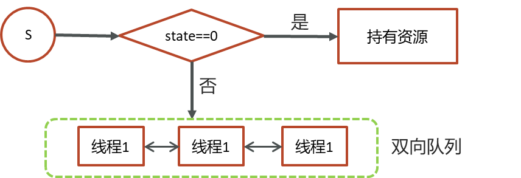

### ReentrantLock的实现原理 

#### ReentrantLock 

ReentrantLock翻译过来是可重入锁， 相对于Synchronized它具备以下特点:

 *  可中断
 *  可以设置超时时间，Synchronized未获得锁的话只能阻塞状态
 *  可以设置公平锁
 *  支持多个条件变量
 *  与Synchronized一样， 都支持重入

> **可重入锁（Reentrant Lock）** 是一种特殊类型的锁，它允许同一个线程多次获得对同一资源的锁，而不会导致死锁。这种特性使得可重入锁在多线程编程中非常有用，尤其是在一个线程需要调用另一个同步方法时。
>
> #### 主要特点
>
> 1. **可重入性**：同一个线程在第一次获得锁后，可以再次获得锁而不会被阻塞或发生死锁问题。每次获得锁时，锁的计数会增加，直到释放锁时，计数减到零。
> 2. **公平性**：可重入锁可以是公平的或非公平的。公平锁确保按请求的顺序（先到先得）来获取锁，而非公平锁则允许线程在竞争中随机选择获取锁。
> 3. **灵活性**：可重入锁可以通过 `java.util.concurrent.locks.ReentrantLock` 类实现，提供了更多的控制选项，比如尝试锁定（tryLock）、定时锁定（lockInterruptibly）等。

```java
//创建锁对象
ReentrantLock lock = new ReentrantLock();
try {
    // 获取锁
    lock.lock();
} finally {
    // 释放锁
    lock.unlock();
}
```

#### 实现原理 

ReentrantLock主要利用**CAS + AQS**队列来实现. 它支持公平锁和非公平锁， 两者的实现类似

构造方法接收一个可选的公平参数(默认非公平锁)， 当设置为`true`时， 表示公平锁， 否则为非公平锁. 公平锁的效率往往没有非公平锁的效率高， 在许多线程访问的情况下， 公平锁表现出较低的吞吐量.

> `ReentrantLock` 里面有一个内部类 `Sync`，`Sync` 继承 AQS（`AbstractQueuedSynchronizer`），添加锁和释放锁的大部分操作实际上都是在 `Sync` 中实现的。`Sync` 有公平锁 `FairSync` 和非公平锁 `NonfairSync` 两个子类

ReentrantLock源码中的构造方法:

```java
public ReentrantLock() {
    sync = new NonfairSync();
}

//传入的参数是true则公平锁，否则非公平
public ReentrantLock(boolean fair) {
    sync = fair ? new FairSync() : new NonfairSync();
}
```

```java
abstract static class Sync extends AbstractQueuedSynchronizer {

}
```

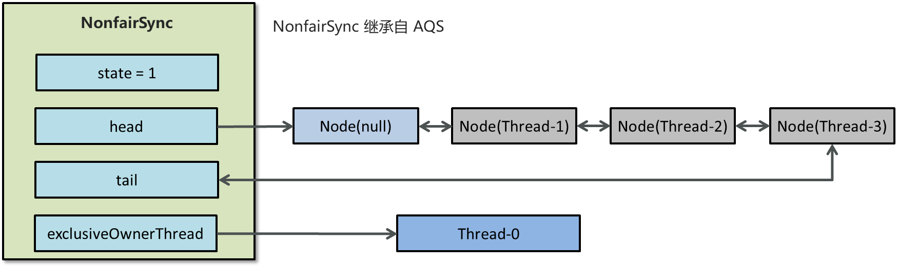

 *  线程来抢锁后使用CAS的方式修改`state`状态， 修改状态成功为1， 则让`exclusiveOwnerThread`属性指向当前线程， 获取锁成功
 *  假如修改状态失败， 则会进入双向队列中等待， head指向双向队列头部， tail指向双向队列尾部
 *  当`exclusiveOwnerThread`为null的时候， 则会唤醒在双向队列中等待的线程
 *  公平锁则体现在按照先后顺序获取锁， 非公平锁体现在不在排队的线程也可以抢锁

#### 总结 

ReentrantLock的实现原理

 *  ReentrantLock表示支持重新进入的锁， 调用Lock方法获取了锁之后， 再次调用Lock， 是不会再阻塞的
 *  ReentrantLock主要利用**CAS + AQS**队列来实现
 *  支持公平锁和非公平锁， 在提供的构造器中无参默认是非公平锁， 也可以传参设置为公平锁

### `Synchronized`和`Lock`有什么区别? 

 *  语法层面
   
    Synchronized是关键字， 源码在JVM中， 用C++语言实现
    
    Lock是接口， 源码由JDK提供， 由Java语言实现
    
    使用Synchronized时， 退出同步代码块锁会自动释放， 而使用Lock时， 需要手动调用`unlock`方法释放锁
 *  功能层面
   
    二者均属于悲观锁、都具备基本的互斥、同步、锁重入功能
    
    Lock提供了需要Synchronized不具备的功能， 例如公平锁、可打断、可超时、多条件变量
    
    ```java
    package com.qqzj.lock;
    
    import java.util.concurrent.TimeUnit;
    import java.util.concurrent.locks.Condition;
    import java.util.concurrent.locks.ReentrantLock;
    
    public class ReentrantLockTest {
    
        //创建锁对象
        static ReentrantLock lock = new ReentrantLock();
        //条件1
        static Condition c1 = lock.newCondition();
        //条件2
        static Condition c2 = lock.newCondition();
    
        public static void main(String[] args) throws InterruptedException {
    
            //可打断
    //        lockInterrupt();
    
            //可超时
    //        timeOutLock();
    
            //多条件变量
            conditionTest();
    
        }
    
        /**
         * 多条件变量
         */
        public static void conditionTest(){
            new Thread(() -> {
                lock.lock();
                try {
                    //进入c1条件的等待
                    c1.await();
                    System.out.println(Thread.currentThread().getName()+"，acquire lock...");
                    Thread.sleep(1000);
                } catch (InterruptedException e) {
                    e.printStackTrace();
                }finally {
                    lock.unlock();
                }
            }， "t1").start();
            new Thread(() -> {
                lock.lock();
                try {
                    //进入c2条件的等待
                    c1.await();
                    System.out.println(Thread.currentThread().getName()+"，acquire lock...");
                    Thread.sleep(1000);
                } catch (InterruptedException e) {
                    e.printStackTrace();
                }finally {
                    lock.unlock();
                }
            }， "t2").start();
    
            new Thread(() -> {
                lock.lock();
                try {
                    //唤醒c1条件的线程
                    c1.signalAll();
                    //唤醒c2条件的线程
    //                c2.signal();
                    System.out.println(Thread.currentThread().getName()+"，acquire lock...");
                    Thread.sleep(1000);
                } catch (InterruptedException e) {
                    e.printStackTrace();
                }finally {
                    lock.unlock();
                }
            }， "t3").start();
        }
    
        /**
         * 锁超时
         * @throws InterruptedException
         */
        public static void timeOutLock() throws InterruptedException {
    
            Thread t1 = new Thread(() -> {
                //尝试获取锁，如果获取锁成功，返回true，否则返回false
                try {
                    if (!lock.tryLock(2， TimeUnit.SECONDS)) {
                        System.out.println("t1-获取锁失败");
                        return;
                    }
                } catch (InterruptedException e) {
                    e.printStackTrace();
                }
                try {
                    System.out.println("t1线程-获得了锁");
                } finally {
                    lock.unlock();
                }
            }， "t1");
    
            lock.lock();
            System.out.println("主线程获得了锁");
            t1.start();
            try {
                Thread.sleep(3000);
            } finally {
                lock.unlock();
            }
        }
    
        /**
         * 可打断
         * @throws InterruptedException
         */
        public static void lockInterrupt() throws InterruptedException {
            Thread t1 = new Thread(() -> {
                try {
                    //开启可中断的锁
                    lock.lockInterruptibly();
                } catch (InterruptedException e) {
                    e.printStackTrace();
                    System.out.println("等待的过程中被打断");
                    return;
                }
                try {
                    System.out.println(Thread.currentThread().getName() + "，获得了锁");
                } finally {
                    lock.unlock();
                }
            }， "t1");
            lock.lock();
            System.out.println("主线程获得了锁");
            t1.start();
    
            try {
                Thread.sleep(1000);
                t1.interrupt();
                System.out.println("执行打断");
            } finally {
                lock.unlock();
            }
        }
    }
    ```
    
    Lock有适合不同场景的视线， 如ReentrantLock， ReentrantReadWriteLock(读写锁)
 *  性能层面
   
    在没有竞争时， Synchronized做了很多优化， 如偏向锁、轻量级锁、性能不错
    
    在竞争激烈时， Lock的实现通常会提供更好的性能，Synchronized会转为重量锁

### 死锁 

#### 死锁产生的条件 

死锁: 一个线程需要同时获取多把锁， 这时就容易发生死锁

```java
Object A = new Object();
Object B = new Object();
Thread t1 = new Thread(() -> {
    synchronized (A) {
        System.*out*.println("lock A");
        try {
            *sleep*(1000);
        } catch (InterruptedException e) {
            throw new RuntimeException(e);
        }
        synchronized (B) {
            System.*out*.println("lock B");
            System.*out*.println("操作...");
        }
    }
}， "t1");

Thread t2 = new Thread(() -> {

    synchronized (B) {
        System.*out*.println("lock B");
        try {
            *sleep*(500);
        } catch (InterruptedException e) {
            throw new RuntimeException(e);
        }
        synchronized (A) {
            System.*out*.println("lock A");
            System.*out*.println("操作...");
        }
    }
}， "t2");
t1.start();
t2.start();
```

运行结果:

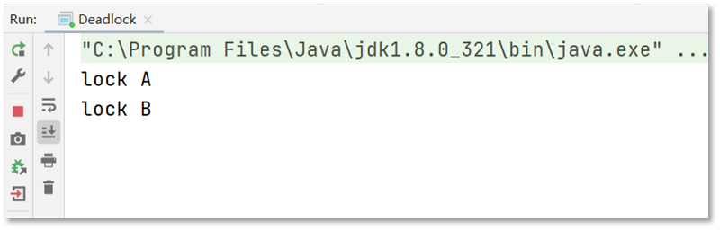

此时程序并没有结束，这种现象就是死锁现象…线程t1持有A的锁等待获取B锁，线程t2持有B的锁等待获取A的锁。

#### 如何进行死锁诊断 

当程序出现了死锁现象， 我们可以使用JDK自带的工具: `jps`和`jstack`

 *  `jps`: 输出JVM中运行的进程状态信息
 *  `jstack`: 查看Java进程内线程的堆栈信息

打开项目， 运行死锁， 点击终端， 然后输入`jps`， 就可以看到刚才运行的死锁程序的进程ID

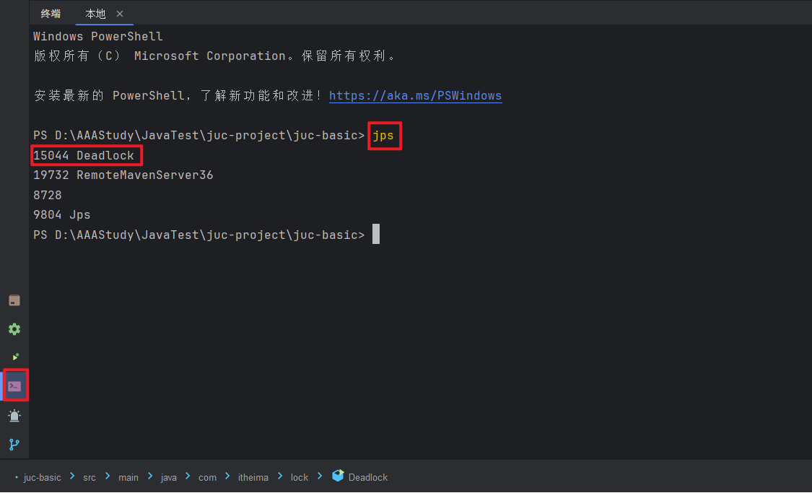

然后再输入 `jstack -l 进程ID`

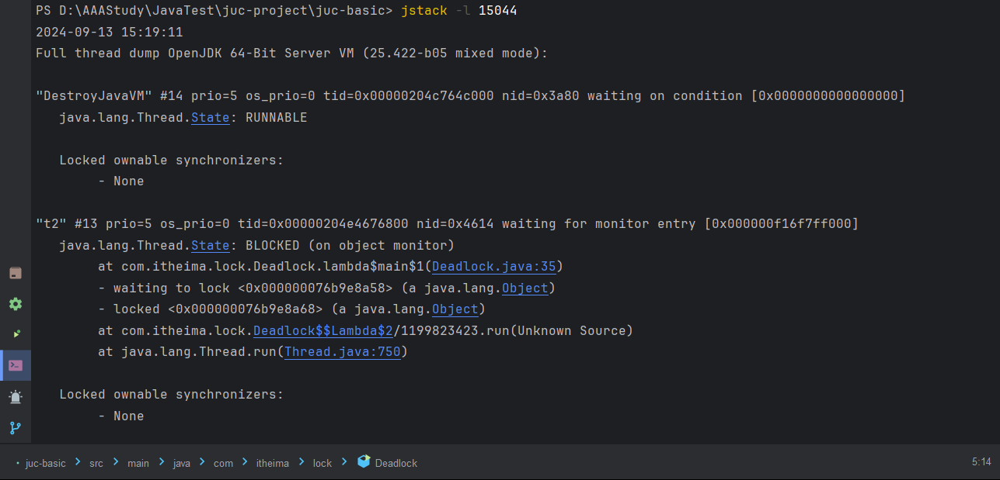

直接看最后面:

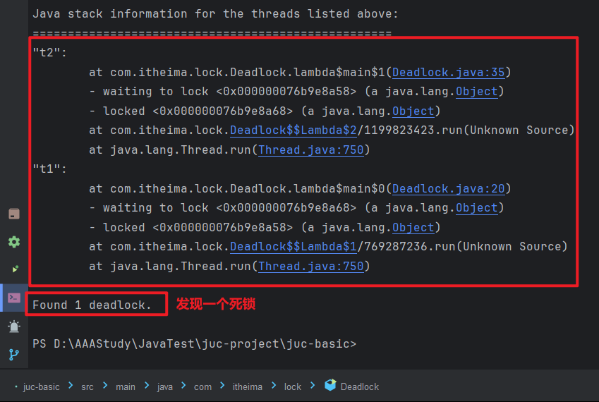

此时可以发现:

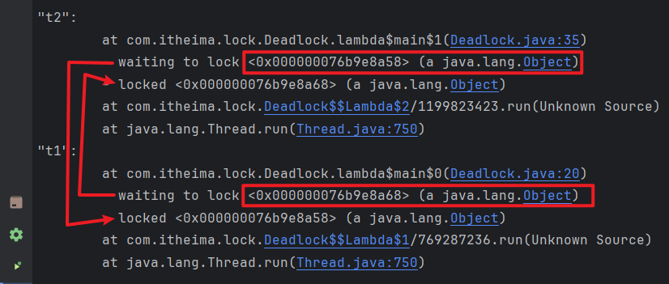

t2等待的锁在t1手上， t1等待的锁在t2手上. 并且还提醒了， 问题出现的位置

其他解决工具， 可视化工具:

 *  `jconsole`
   
    用于对JVM的内存， 线程， 类 的监控， 是一个基于JMX的GUI性能监控工具
    
    打开方式: Java安装目录bin目录下 直接启动`jconsole.exe`就行
    
    打开后的界面如下:
    
    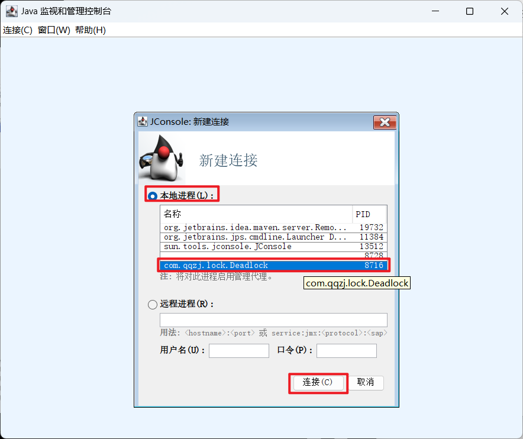
    
    选择本地进程 –> 找到运行的代码进程 –> 连接
    
    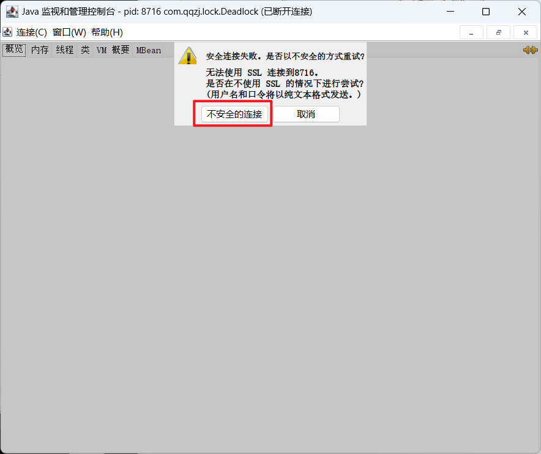
    
    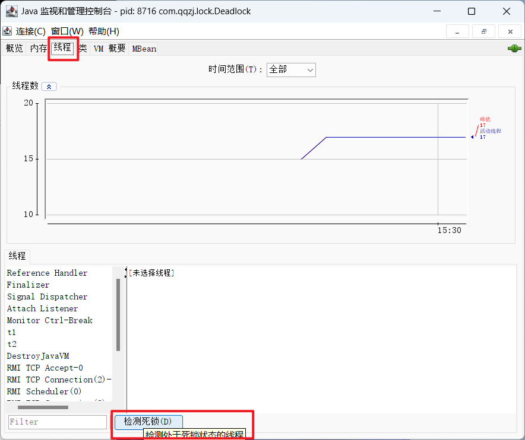
    
    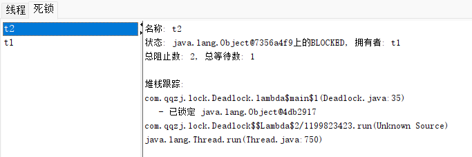
 *  `VisualVM`: 故障处理工具
   
    能够监控线程， 内存情况， 查看方法的CPU时间和内存中的对象， 已被GC的对象， 反向查看分配的堆栈
    
    打开方式: Java 安装目录 bin 目录下直接启动`jvisualvm.exe`就行

#### 总结 

1.  死锁产生的条件是什么?
  
    一个线程需要同时获取多把锁， 这是就容易发生死锁
2.  如何进行死锁诊断?
  
     *  当程序出现了死锁现象， 我们可以使用JDK自带的工具: `jps`和`jstack`
     *  `jps`: 输出JVM中运行的进程状态信息
     *  `jstack`: 查看java进程内线程的堆栈信息， 查看日志， 检查是否有死锁， 如果有死锁现象， 需要查看具体代码分析后， 可修复
     *  可视化工具`jconsole`、`VisualVM`也可以检查死锁问题

### `ConcurrentHashMap` 

#### 介绍 

ConcurrentHashMap 是一种线程安全的高效Map集合

底层数据结构:

 *  JDK1.7 底层采用分段的数组 + 链表实现
 *  JDK1.8 采用的数据结构跟HashMap 1.8 的结构一样， 数组 + 链表/红黑树

#### JDK1.7中ConcurrentHashMap 

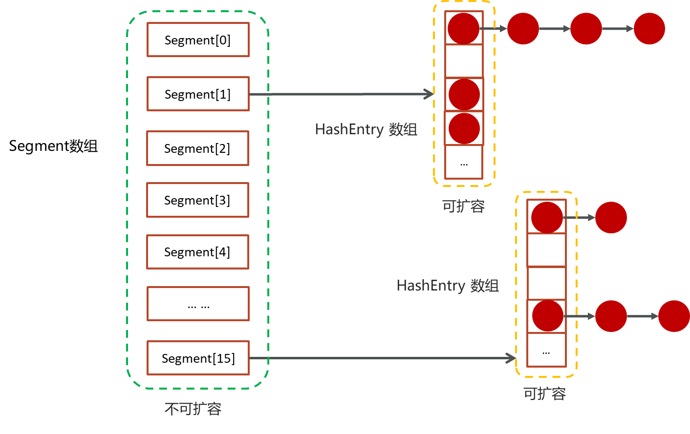

##### 添加数据: 

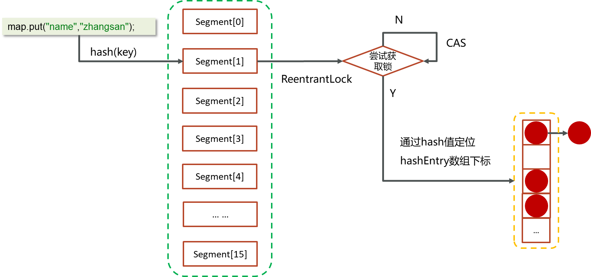

#### JDK1.8中ConcurrentHashMap 

在JDK1.8中， 放弃了`Segment`臃肿的设计， 数据结构跟HashMap的数据结构是一样的: 数组 + 红黑树 + 链表. 采用CAS + Synchronized来保证并发安全进行实现

 *  CAS控制数组节点的添加
 *  Synchronized只锁定当前链表或红黑树的首节点， 只要Hash不冲突， 就不会产生并发的问题， 效率得到提升

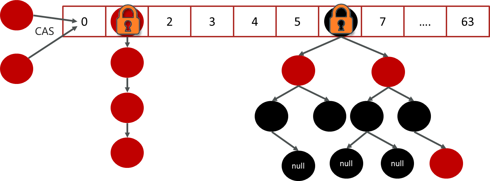

#### 总结 

聊一下ConcurrentHashMap

1.  底层数据结构:
  
     *  JDK1.7底层采用分段的数组 + 链表实现
     *  JDK1.8采用的数据结构跟HashMap1.8的结构一样， 数组 + 红黑树 + 链表
2.  加锁的方式
  
     *  JDK1.7采用`Segment`分段锁， 底层使用的是ReentrantLock
     *  JDK1.8采用CAS添加新节点， 采用Synchronized锁定链表或红黑树的首节点， 相对于`Segment`分段锁粒度更细， 性能更好

### 并发程序出现问题的根本原因(Java程序中怎么保证多线程的执行安全) 

Java并发编程三大特性:

 *  原子性
 *  可见性
 *  有序性

#### 原子性 

原子性: 一个线程在CPU中操作不可暂停， 也不可中断， 要不执行完成， 要不不执行

> **原子性操作**是指在计算机科学中，一个操作要么全部完成，要么完全不执行，没有中间状态或被中断的可能性。原子性操作是不可分割的，在执行的过程中不会被其他线程或进程干扰。简而言之，原子性操作是“一次性完成”的操作。
>
> 在多线程编程中，原子性非常重要，因为多个线程可能同时访问和修改共享资源。如果某个操作不是原子的，可能会出现竞态条件（race condition），导致数据不一致或程序行为异常。

```java
int ticketNum = 10;
public void getTicket(){

    if(ticketNum <= 0){
        return;
    }
    System.out.println(Thread.currentThread().getName()+"抢到一张票，剩余:"+ticketNum);
    // 非原子性操作
    ticketNum--;
}

public static void main(String[] args) {
    TicketDemo demo = new TicketDemo();
    for(int i=0;i<20;i++){
        new Thread(demo::getTicket).start();
    }
}
```

> 这段代码中的 `ticketNum--` 操作不是原子性操作，因为它实际上包含了多个步骤，而不是一个不可分割的单一操作。`ticketNum--` 看似是一个简单的递减操作，但它实际上包含以下几个步骤：
>
> 1. **读取 `ticketNum` 的当前值**：线程首先读取 `ticketNum` 的值，假设当前是 10。
> 2. **对值进行减 1 操作**：然后将读取的值减去 1，计算出新的值（比如 9）。
> 3. **将新的值写回 `ticketNum`**：最后将减完之后的值写回到变量 `ticketNum`。
>
> 由于这些步骤是分开的，如果多个线程同时执行这段代码，可能会导致竞态条件（race condition）。例如：
>
> - 假设线程 A 读取 `ticketNum` 时，值为 10；同时，线程 B 也读取 `ticketNum` 的值，仍然是 10。
> - 线程 A 减 1 后的结果是 9，并将其写回 `ticketNum`。
> - 线程 B 由于还持有读取时的 10，减 1 后的结果也是 9，随后它将 9 写回 `ticketNum`。
>
> 最终，尽管两个线程都减少了票数一次，结果却只减少了 1 而不是 2。这就是因为 `ticketNum--` 不是原子操作，它的多个步骤可以被其他线程插入执行，导致数据不一致。

不是原子操作， 怎么保证原子操作呢?

1.  Synchronized: 同步加锁
2.  JUC里面的Lock: 加锁

```java
int ticketNum = 10;
public synchronized void getTicket(){
    if(ticketNum <= 0){
        return ;
    }
    System.out.println(Thread.currentThread().getName()+"抢到一张票，剩余:"+ticketNum);
    ticketNum--;
}

public static void main(String[] args) {
     
    TicketDemo demo = new TicketDemo();
    for(int i=0;i<20;i++){
        new Thread(demo::getTicket).start();
    }
}
```

#### 内存可见性 

内存可见性: 让一个线程对共享变量的修改对另一个线程可见

```java
public class VolatileDemo {
    private static boolean flag = false;
    public static void main(String[] args) throws InterruptedException {
   
        new Thread(()->{
            while(!flag){
            }
            System.out.println("第一个线程执行完毕...");
        }).start();
        Thread.sleep(100);
        
        new Thread(()->{
            flag = true;
            System.out.println("第二线程执行完毕...");
        }).start();
    }
}
```

解决方案:

 *  Synchronized
 *  `Volatile`
 *  Lock

`private static volatile boolean flag = false;`

#### 有序性 

指令重排: 处理器为了提高程序运行效率， 可能会对输入代码进行优化， 它不保证程序中各个语句的执行先后顺序同代码中的顺序一致， 但是它会保证程序最终执行结果和代码循序执行的结果是一致的

```java
int x;
int y;

@Actor
public void actor1() {
    x = 1;
    y = 1;
}

@Actor
public void actor2(II_Result r) {
    r.r1 = y;
    r.r2 = x;
}
```

解决方案: `volatile`

`volatile int y;`

#### 总结 

导致并发程序出现问题的根本原因是什么?

1.  原子性 Synchronized、Lock
2.  内存可见性 volatile、Synchronized、Lock
3.  有序性 volatile

## 线程池 

### 介绍

线程池就是管理一系列线程的资源池。当有任务要处理时，直接从线程池中获取线程来处理，处理完之后线程并不会立即被销毁，而是等待下一个任务。

这里借用《Java 并发编程的艺术》提到的来说一下**使用线程池的好处**：

- **降低资源消耗**：通过重复利用已创建的线程降低线程创建和销毁造成的消耗。
- **提高响应速度**：当任务到达时，任务可以不需要等到线程创建就能立即执行。
- **提高线程的可管理性**：线程是稀缺资源，如果无限制的创建，不仅会消耗系统资源，还会降低系统的稳定性，使用线程池可以进行统一的分配，调优和监控。

### 线程池的核心参数/线程池的执行原理 

#### 线程池的核心参数 

```java
public ThreadPoolExecutor(int corePoolSize，
              int maximumPoolSize，
              long keepAliveTime，
              TimeUnit unit，
              BlockingQueue<Runnable> workQueue，
              ThreadFactory threadFactory，
              RejectedExecutionHandler handler)
```

 *  `corePoolSize`: 核心线程数目
 *  `maximumPoolSize`: 最大线程数目 = (核心线程 + 救急线程的最大数目)
 *  `keepAliveTime`: 生存时间 - 救急线程的生存时间， 生存时间内没有新任务， 此线程资源会释放
 *  `unit`: 时间单位 - 救急线程的生存时间单位， 如秒、毫秒等
 *  `workQueue`: 当没有空闲核心线程时， 新来任务会加入到此队列排队， 队列满会创建救急线程执行任务
 *  `threadFactory`: 线程工厂 - 可以定制线程对象的创建， 例如设置线程名字、是否是守护线程等
 *  `handler`: 拒绝策略 - 当所有线程都在繁忙， `workQueue`也放满了， 就会触发拒绝策略

#### 线程池的执行原理 

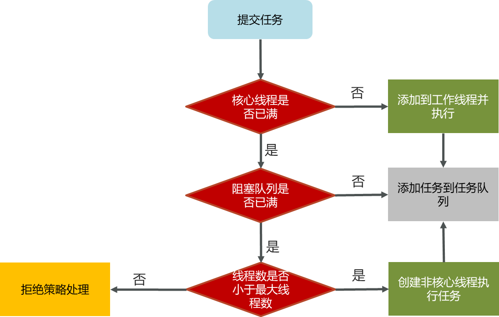

如果核心或临时线程执行完成任务后会检查阻塞队列中是否有需要执行的线程， 如果有， 则使用非核心线程执行任务

拒绝策略:

1.  `AbortPolicy`: 直接抛出异常， 默认策略
2.  `CallerRunsPolicy`: 用调用者所在的线程来执行任务
3.  `DiscardOldestPolicy`: 丢弃阻塞队列中靠最前的任务， 并进入队列等待
4.  `DiscardPolicy`: 直接丢弃任务

测试代码:

```java
package com.qqzj.threadpool;

import java.lang.reflect.Field;
import java.util.ArrayList;
import java.util.List;
import java.util.concurrent.*;
import java.util.concurrent.atomic.AtomicInteger;

public class TestThreadPoolExecutor {
    static class MyTask implements Runnable {
        private final String name;
        private final long duration;

        public MyTask(String name) {
            this(name， 0);
        }

        public MyTask(String name， long duration) {
            this.name = name;
            this.duration = duration;
        }

        @Override
        public void run() {
            try {
                LoggerUtils.get("myThread").debug("running..." + this);
                Thread.sleep(duration);
            } catch (InterruptedException e) {
                e.printStackTrace();
            }
        }

        @Override
        public String toString() {
            return "MyTask(" + name + ")";
        }
    }

    public static void main(String[] args) throws InterruptedException {
        AtomicInteger c = new AtomicInteger(1);
        ArrayBlockingQueue<Runnable> queue = new ArrayBlockingQueue<>(2);

        LinkedBlockingQueue linkedBlockingQueue = new LinkedBlockingQueue();
        ThreadPoolExecutor threadPool = new ThreadPoolExecutor(
            2,
            3,
            0,
            TimeUnit.MILLISECONDS,
            queue,
            r -> new Thread(r, "myThread" + c.getAndIncrement()),
            new ThreadPoolExecutor.AbortPolicy());
        showState(queue， threadPool);
        threadPool.submit(new MyTask("1"， 3600000));
        showState(queue， threadPool);
        threadPool.submit(new MyTask("2"， 3600000));
        showState(queue， threadPool);
        threadPool.submit(new MyTask("3"));
        showState(queue， threadPool);
        threadPool.submit(new MyTask("4"));
        showState(queue， threadPool);
        threadPool.submit(new MyTask("5"，3600000));
        showState(queue， threadPool);
        threadPool.submit(new MyTask("6"));
        showState(queue， threadPool);
    }

    private static void showState(ArrayBlockingQueue<Runnable> queue， ThreadPoolExecutor threadPool) {

        try {
            Thread.sleep(300);
        } catch (InterruptedException e) {
            e.printStackTrace();
        }
        List<Object> tasks = new ArrayList<>();
        for (Runnable runnable : queue) {
            try {
                Field callable = FutureTask.class.getDeclaredField("callable");
                callable.setAccessible(true);
                Object adapter = callable.get(runnable);
                Class<?> clazz = Class.forName("java.util.concurrent.Executors$RunnableAdapter");
                Field task = clazz.getDeclaredField("task");
                task.setAccessible(true);
                Object o = task.get(adapter);
                tasks.add(o);
            } catch (Exception e) {
                e.printStackTrace();
            }
        }
        LoggerUtils.main.debug("pool size: {}， queue: {}"， threadPool.getPoolSize()， tasks);
    }
}
```

### 线程池中常见的阻塞队列 

`workQueue`: 当没有空闲核心线程时， 新来的任务会加入到此队列排队， 队列满了会创建临时线程执行任务

1.  `ArrayBlockingQueue`: 基于数组结构的有界阻塞队列， `FIFO`
2.  `LinkedBlockingQueue`: 基于链表结构的有界阻塞队列， `FIFO`
3.  `DelayedWorkQueue`: 是一个优先级队列， 它可以保证每次出队的任务都是当前队列中执行时间最靠前的
4.  `SynchronousQueue`: 不存储元素的阻塞队列， 每个插入操作都必须等待一个移出操作

`ArrayBlockingQueue`和`LinkedBlockingQueue`的区别

<table> 
 <thead> 
  <tr> 
   <th>LinkedBlockingQueue</th> 
   <th>ArrayBlockingQueue</th> 
  </tr> 
 </thead> 
 <tbody> 
  <tr> 
   <td>默认无界(Integer的最大值)，支持有界</td> 
   <td>强制有界</td> 
  </tr> 
  <tr> 
   <td>底层是链表</td> 
   <td>底层是数组</td> 
  </tr> 
  <tr> 
   <td>是懒惰的，创建节点的时候添加数据</td> 
   <td>提前初始化 Node 数组</td> 
  </tr> 
  <tr> 
   <td>入队会生成新 Node</td> 
   <td>Node需要是提前创建好的</td> 
  </tr> 
  <tr> 
   <td>两把锁（头尾）</td> 
   <td>一把锁</td> 
  </tr> 
 </tbody> 
</table>

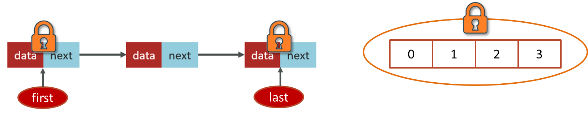

### 如何确定核心线程数 

主要考察在项目中如何使用线程池的，如何确定核心线程数。

首先介绍两种类型的任务：

 *  IO密集型任务
   
    - 文件读写、DB读写、网络请求等
    
    - 核心线程数大小设置为 2N+1
    
    - N代表当前CPU的核心数量
 *  CPU密集型任务
   
    - 计算型代码、Bitmap转换、Gson转换等，减少线程数目来减少线程之间的切换
    
    - 核心线程数大小设置为 N+1，
    
    - N代表当前CPU的核心数量

查看机器的CPU核心数量

```java
public static void main(String[] args) {
    //查看机器的CPU核数
    System.out.println(Runtime.getRuntime().availableProcessors());
}
```

参考回答:

1.  高并发、任务执行时间短 –> (CPU核心数量 + 1)， 减少线程上下文切换
2.  并发不高、任务执行时间长
  
     *  IO密集型的任务 –> (CPU核心数量 \* 2 + 1)
     *  计算密集型任务 –> (CPU核心数量 + 1)
3.  并发高、业务执行时间长， 解决这种类型任务的关键不在于线程池而在于整体架构的设计， 看看这些业务里面某些数据是否能做缓存时第一步， 增加服务器是第二步， 置于线程池的设置， 参考第二条

### 线程池的种类 

在`java.util.concurrent.Executors`类中提供了大量创建连接池的静态方法， 常见有四种:

1.  创建使用固定线程数的线程池(`newFixedThreadPool`)
  
    ```java
    public static ExecutorService newFixedThreadPool(int nThreads) {
        return new ThreadPoolExecutor(nThreads,
                                      nThreads,
                                      0L,
                                      TimeUnit.MILLISECONDS,
                                      new LinkedBlockingQueue<Runnable>());
    } 
    ```
    
     *  核心线程数与最大线程数一样， 没有临时线程
     *  阻塞队列是`LinkedBlockingQueue`， 最大容量为`Interger.MAX_VALUE`
    
    适用于任务量已知， 相对耗时的任务
    
    测试代码:
    
    ```java
    package com.qqzj.threadpool;
    
    import java.util.concurrent.ExecutorService;
    import java.util.concurrent.Executors;
    
    public class FixedThreadPoolCase {
    
        static class FixedThreadDemo implements Runnable{
           
            @Override
            public void run() {
                String name = Thread.currentThread().getName();
                for (int i = 0; i < 2; i++) {
                    System.out.println(name + ":" + i);
                }
            }
        }
    
        public static void main(String[] args) throws InterruptedException {
    
            //创建一个固定大小的线程池，核心线程数和最大线程数都是3
            ExecutorService executorService = Executors.newFixedThreadPool(3);
    
            for (int i = 0; i < 5; i++) {
                executorService.submit(new FixedThreadDemo());
                Thread.sleep(10);
            }
            executorService.shutdown();
        }
    }
    ```
    
    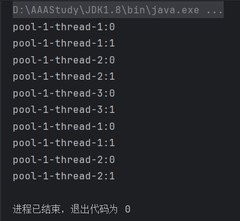
2.  单线程化的线程池， 它只会用唯一的工作线程来执行任务， 保证所有任务按照指定顺序(FIFO)执行
  
    ```java
    public static ExecutorService newSingleThreadExecutor() {
    
        return new FinalizableDelegatedExecutorService
            (new ThreadPoolExecutor(1,
                                    1,
                                    0L,
                                    TimeUnit.MILLISECONDS,
                                    new LinkedBlockingQueue<Runnable>()));
    }
    ```
    
     *  核心线程数和最大线程数都是1
     *  阻塞队列是`LinkedBlockingQueue`， 最大容量为`Interger.MAX_VALUE`
    
    适用于按照顺序执行的任务
    
    测试代码:
    
    ```java
    package com.qqzj.threadpool;
    
    import java.util.concurrent.ExecutorService;
    import java.util.concurrent.Executors;
    
    public class NewSingleThreadCase {
        static int count = 0;
    
        static class Demo implements Runnable {
            @Override
            public void run() {
                count++;
                System.out.println(Thread.currentThread().getName() + ":" + count);
            }
        }
    
        public static void main(String[] args) throws InterruptedException {
            //单个线程池，核心线程数和最大线程数都是1
            ExecutorService exec = Executors.newSingleThreadExecutor();
    
            for (int i = 0; i < 10; i++) {
                exec.execute(new Demo());
                Thread.sleep(5);
            }
            exec.shutdown();
        }
    }
    ```
    
    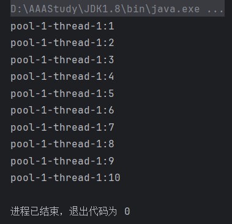
3.  可缓存线程池
  
    ```java
    public static ExecutorService newCachedThreadPool() {
    
        return new ThreadPoolExecutor(0,
                                      Integer.MAX_VALUE,
                                      60L,
                                      TimeUnit.SECONDS,
                                      new SynchronousQueue<Runnable>());
    }
    ```
    
     *  核心线程数为0
     *  最大线程数是`Integer.MAX_VALUE`，也就是都是救急线程操作，救急线程的寿命为60S
     *  阻塞队列为`SynchronousQueue`: 不存储元素的阻塞队列， 每个插入操作都必须等待一个移出操作
    
    适合任务数比较密集， 但每个任务执行时间较短的情况
    
    测试代码:
    
    ```java
    package com.qqzj.threadpool;
    
    import java.util.concurrent.ExecutorService;
    import java.util.concurrent.Executors;
    
    public class CachedThreadPoolCase {
    
        static class Demo implements Runnable {
    
            @Override
            public void run() {
                String name = Thread.currentThread().getName();
                try {
                    //修改睡眠时间，模拟线程执行需要花费的时间
                    Thread.sleep(100);
                    System.out.println(name + "执行完了");
                } catch (InterruptedException e) {
                    e.printStackTrace();
                }
            }
        }
    
        public static void main(String[] args) throws InterruptedException {
    
            //创建一个缓存的线程，没有核心线程数，最大线程数为Integer.MAX_VALUE
            ExecutorService exec = Executors.newCachedThreadPool();
            for (int i = 0; i < 10; i++) {
                exec.execute(new Demo());
                Thread.sleep(1);
            }
            exec.shutdown();
        }
    }
    ```
    
    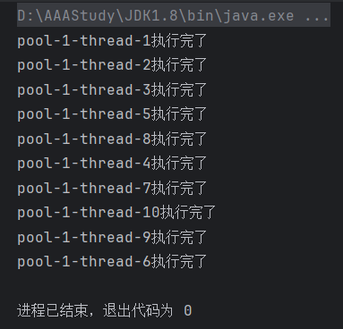
4.  提供了“延迟”和“周期执行”功能的`ThreadPoolExecutor`
  
    ```java
    public ScheduledThreadPoolExecutor(int corePoolSize) {
        super(corePoolSize， Integer.MAX_VALUE， 0， NANOSECONDS，new DelayedWorkQueue());
    }
    
    public ScheduledThreadPoolExecutor(int corePoolSize，
                                       ThreadFactory threadFactory) {
        super(corePoolSize， Integer.MAX_VALUE， 0， NANOSECONDS， new DelayedWorkQueue()， threadFactory);
    }
    
    public ScheduledThreadPoolExecutor(int corePoolSize，
                                       RejectedExecutionHandler handler) {
        super(corePoolSize， Integer.MAX_VALUE， 0， NANOSECONDS， new DelayedWorkQueue()， handler);
    }
    public ScheduledThreadPoolExecutor(int corePoolSize，
                                       ThreadFactory threadFactory，
                                       RejectedExecutionHandler handler) {
        super(corePoolSize， Integer.MAX_VALUE， 0， NANOSECONDS， new DelayedWorkQueue()， threadFactory， handler);
    }
    ```
    
    测试代码:
    
    ```java
    public class ScheduledThreadPoolCase {
         
        static class Task implements Runnable {
    
            @Override
            public void run() {
                try {
                    String name = Thread.currentThread().getName();
    
                    System.out.println(name + "， 开始：" + new Date());
                    Thread.sleep(1000);
                    System.out.println(name + "， 结束：" + new Date());
                } catch (InterruptedException e) {
    
                    e.printStackTrace();
                }
            }
        }
    
        public static void main(String[] args) throws InterruptedException {
    
            //按照周期执行的线程池，核心线程数为2，最大线程数为Integer.MAX_VALUE
            ScheduledExecutorService scheduledThreadPool = Executors.newScheduledThreadPool(2);
            System.out.println("程序开始：" + new Date());
    
            /**
             *与之前的线程池使用 submit()提交不同，scheduledThreadpool调用 schedule() 提交任务到线程池中
             * 第一个参数：提交的任务
             * 第二个参数：任务执行的延迟时间
             * 第三个参数：时间单位
             */
            scheduledThreadPool.schedule(new Task()， 0， TimeUnit.SECONDS);
            scheduledThreadPool.schedule(new Task()， 1， TimeUnit.SECONDS);
            scheduledThreadPool.schedule(new Task()， 5， TimeUnit.SECONDS);
    
            Thread.sleep(5000);
    
            // 关闭线程池
            scheduledThreadPool.shutdown();
    
        }
    }
    ```
    
    会执行三个线程
    
    - 一个在程序开始时立即执行，执行时间为 1s
    - 一个在程序开始1s后执行，执行时间为1s
    - 一个在程序开始5s后执行，执行时间为1s
    
    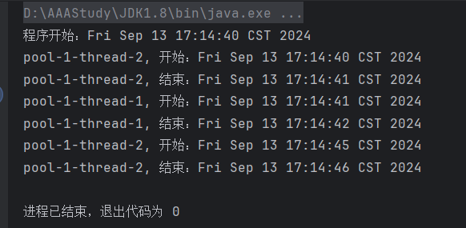

#### 总结 

线程池的种类有哪些

1.  `newFixedThreadPool`: 创建一个定长线程池， 可控制最大并发数， 超出的线程会在队列中等待
2.  `newSingleThreadExecutor`: 创建一个单线程化的线程池， 它只会用唯一的工作线程来执行任务， 保证所有任务按照制定顺序(FIFO)执行
3.  `newCachedThreadPool`: 创建一个可缓存线程池， 如果线程池长度超过处理需要， 可灵活回收空闲线程， 若无可回收， 则新建线程
4.  `newScheduledThreadPool`: 可以执行延迟任务的线程池， 支持定时及周期性任务执行

### 为什么不建议用`Executor`创建线程池 

参考阿里开发手册《Java开发手册-嵩山版》

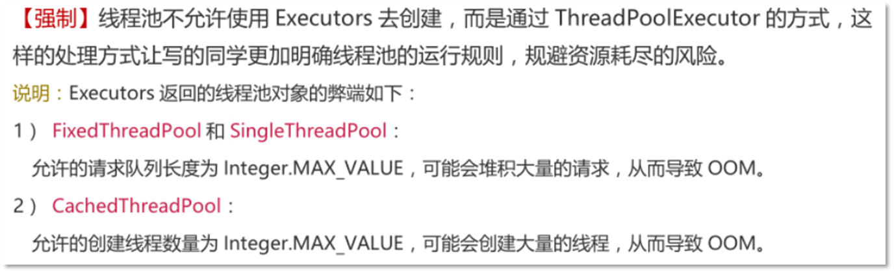

 *  `OOM`: 内存溢出

## 使用场景 

### 线程池使用场景(`CountDownLatch`、`Future`)/你们项目哪里用到了多线程 

#### `CountDownLatch` 

`CountDownLatch`(闭锁/倒计时锁)用来进行线程同步协作， 等待所有线程完成倒计时(一个或者多个线程， 等待其他多个线程完成某件事情之后才能执行)

 *  其中构造参数用来初始化等待计数值
 *  `await()`用来等待计数归零
 *  `countDown()`用来让计数减一

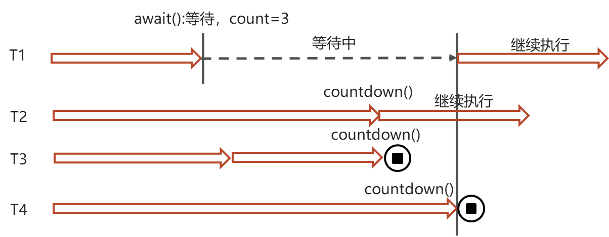

测试代码:

```java
package com.qqzj.application;

import java.util.concurrent.CountDownLatch;

public class CountDownLatchDemo {

    public static void main(String[] args) throws InterruptedException {
        //初始化了一个倒计时锁 参数为 3
        CountDownLatch latch = new CountDownLatch(3);

        new Thread(() -> {
            System.out.println(Thread.currentThread().getName()+"-begin...");
            try {
                Thread.sleep(1000);
            } catch (InterruptedException e) {
                throw new RuntimeException(e);
            }
            //count--
            latch.countDown();
            System.out.println(Thread.currentThread().getName()+"-end..." +latch.getCount());
        }).start();
        new Thread(() -> {
            System.out.println(Thread.currentThread().getName()+"-begin...");
            try {
                Thread.sleep(2000);
            } catch (InterruptedException e) {
                throw new RuntimeException(e);
            }
            //count--
            latch.countDown();
            System.out.println(Thread.currentThread().getName()+"-end..." +latch.getCount());
        }).start();
        new Thread(() -> {
            System.out.println(Thread.currentThread().getName()+"-begin...");
            try {
                Thread.sleep(1500);
            } catch (InterruptedException e) {
   
     
     
                throw new RuntimeException(e);
            }
            //count--
            latch.countDown();
            System.out.println(Thread.currentThread().getName()+"-end..." +latch.getCount());
        }).start();
        String name = Thread.currentThread().getName();
        System.out.println(name + "-waiting...");
        //等待其他线程完成
        latch.await();
        System.out.println(name + "-wait end...");
    }

}
```

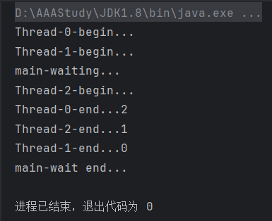

#### 使用场景一(ES数据批量导入) 

在我们项目上线之前， 我们需要把数据库中的数据一次性的同步到ES索引库中， 但是当时的数据好像是1000万左右， 一次性读取数据肯定不行(oom异常)， 当时我就想到可以使用线程池的方式导入， 利用`CountDownLatch`来控制， 就能避免一次性加载过多， 防止内存溢出

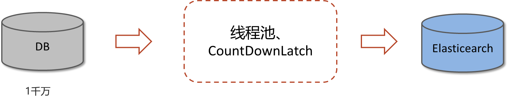

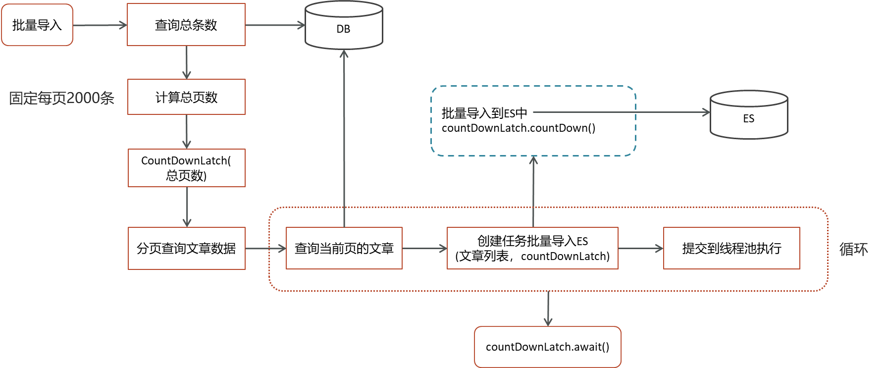

代码实现:

```java
package com.qqzj.cdl.service.impl;

import com.alibaba.fastjson.JSON;
import com.qqzj.cdl.mapper.ApArticleMapper;
import com.qqzj.cdl.pojo.SearchArticleVo;
import com.qqzj.cdl.service.ApArticleService;
import lombok.SneakyThrows;
import lombok.extern.slf4j.Slf4j;
import org.elasticsearch.action.bulk.BulkRequest;
import org.elasticsearch.action.index.IndexRequest;
import org.elasticsearch.client.RequestOptions;
import org.elasticsearch.client.RestHighLevelClient;
import org.elasticsearch.common.xcontent.XContentType;
import org.springframework.beans.factory.annotation.Autowired;
import org.springframework.stereotype.Service;
import org.springframework.transaction.annotation.Transactional;

import java.util.List;
import java.util.concurrent.CountDownLatch;
import java.util.concurrent.ExecutorService;

@Service
@Transactional
@Slf4j
public class ApArticleServiceImpl implements ApArticleService {

    @Autowired
    private ApArticleMapper apArticleMapper;

    @Autowired
    private RestHighLevelClient client;

    @Autowired
    private ExecutorService executorService;

    private static final String ARTICLE_ES_INDEX = "app_info_article";

    private static final int PAGE_SIZE = 2000;

    /**
     * 批量导入
     */
    @SneakyThrows
    @Override
    public void importAll() {
   
        //总条数
        int count = apArticleMapper.selectCount();
        //总页数
        int totalPageSize = count % PAGE_SIZE == 0 ? count / PAGE_SIZE : count / PAGE_SIZE + 1;
        //开始执行时间
        long startTime = System.currentTimeMillis();
        //一共有多少页，就创建多少个CountDownLatch的计数
        CountDownLatch countDownLatch = new CountDownLatch(totalPageSize);

        int fromIndex;
        List<SearchArticleVo> articleList = null;

        for (int i = 0; i < totalPageSize; i++) {
   
     
     
            //起始分页条数
            fromIndex = i * PAGE_SIZE;
            //查询文章
            articleList = apArticleMapper.loadArticleList(fromIndex， PAGE_SIZE);
            //创建线程，做批量插入es数据操作
            TaskThread taskThread = new TaskThread(articleList， countDownLatch);
            //执行线程
            executorService.execute(taskThread);
        }

        //调用await()方法，用来等待计数归零
        countDownLatch.await();

        long endTime = System.currentTimeMillis();
        log.info("es索引数据批量导入共:{}条，共消耗时间:{}秒"， count， (endTime - startTime) / 1000);
    }

    class TaskThread implements Runnable {

        List<SearchArticleVo> articleList;
        CountDownLatch cdl;

        public TaskThread(List<SearchArticleVo> articleList， CountDownLatch cdl) {
            this.articleList = articleList;
            this.cdl = cdl;
        }

        @SneakyThrows
        @Override
        public void run() {
   
     
     
            //批量导入
            BulkRequest bulkRequest = new BulkRequest(ARTICLE_ES_INDEX);

            for (SearchArticleVo searchArticleVo : articleList) {
   
     
     
                bulkRequest.add(new IndexRequest().id(searchArticleVo.getId().toString())
                                .source(JSON.toJSONString(searchArticleVo)， XContentType.JSON));
            }
            //发送请求，批量添加数据到es索引库中
            client.bulk(bulkRequest， RequestOptions.DEFAULT);

            //让计数减一
            cdl.countDown();
        }
    }
}
```

#### 使用场景二(数据汇总) 

在一个电商网站中，用户下单之后，需要查询数据，数据包含了三部分：订单信息、包含的商品、物流信息；这三块信息都在不同的微服务中进行实现的，我们如何完成这个业务呢？

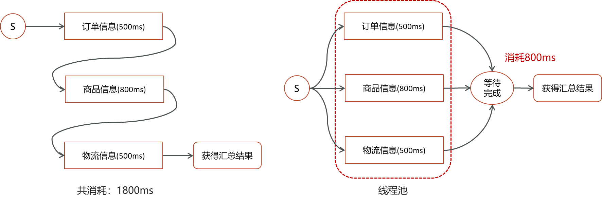

代码:

```java
package com.qqzj.cdl.controller;

import lombok.SneakyThrows;
import lombok.extern.slf4j.Slf4j;
import org.springframework.beans.factory.annotation.Autowired;
import org.springframework.web.bind.annotation.GetMapping;
import org.springframework.web.bind.annotation.RequestMapping;
import org.springframework.web.bind.annotation.RestController;
import org.springframework.web.client.RestTemplate;

import java.util.HashMap;
import java.util.Map;
import java.util.concurrent.ExecutorService;
import java.util.concurrent.Future;


@RestController
@RequestMapping("/order_detail")
@Slf4j
public class OrderDetailController {

    @Autowired
    private RestTemplate restTemplate;

    @Autowired
    private ExecutorService executorService;

    //使用线程池
    @SneakyThrows
    @GetMapping("/get/detail_new/{id}")
    public Map<String， Object> getOrderDetailNew() {
   
        long startTime = System.currentTimeMillis();

        Future<Map<String， Object>> f1 = executorService.submit(() -> {
            Map<String， Object> r =
                restTemplate.getForObject("http://localhost:9991/order/get/{id}"， Map.class， 1);
            return r;
        });
        Future<Map<String， Object>> f2 = executorService.submit(() -> {
            Map<String， Object> r =
                restTemplate.getForObject("http://localhost:9991/product/get/{id}"， Map.class， 1);
            return r;
        });

        Future<Map<String， Object>> f3 = executorService.submit(() -> {
            Map<String， Object> r =
                restTemplate.getForObject("http://localhost:9991/logistics/get/{id}"， Map.class， 1);
            return r;
        });


        Map<String， Object> resultMap = new HashMap<>();
        resultMap.put("order"， f1.get());
        resultMap.put("product"， f2.get());
        resultMap.put("logistics"， f3.get());

        long endTime = System.currentTimeMillis();

        log.info("接口调用共耗时:{}毫秒"，endTime-startTime);
        return resultMap;
    }

    // 没有用线程池
    @SneakyThrows
    @GetMapping("/get/detail/{id}")
    public Map<String， Object> getOrderDetail() {
   
        long startTime = System.currentTimeMillis();

        Map<String， Object> order = restTemplate.getForObject("http://localhost:9991/order/get/{id}"， Map.class， 1);

        Map<String， Object> product = restTemplate.getForObject("http://localhost:9991/product/get/{id}"， Map.class， 1);

        Map<String， Object> logistics = restTemplate.getForObject("http://localhost:9991/logistics/get/{id}"， Map.class， 1);

        long endTime = System.currentTimeMillis();


        Map<String， Object> resultMap = new HashMap<>();
        resultMap.put("order"， order);
        resultMap.put("product"， product);
        resultMap.put("logistics"， logistics);

        log.info("接口调用共耗时:{}毫秒"，endTime-startTime);
        return resultMap;
    }


}
```

 *  在实际开发的过程中， 难免需要调用多个接口来汇总数据， 如果所有接口(或者部分接口)没有依赖关系， 就可以使用线程池 + `future`来提升性能
 *  比如报表汇总
   
    

#### 使用场景三(异步调用) 

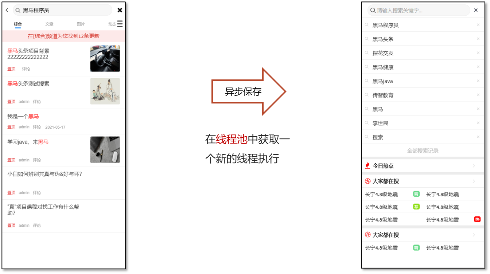

在SpringBoot引导类上加上`@EnableAsync`来开启异步调用， 然后在需要异步调用的方法上面加上`Async()`括号里面可以加线程池

```java
package com.qqzj.cdl.config;

import org.springframework.context.annotation.Bean;
import org.springframework.context.annotation.Configuration;

import java.util.concurrent.ExecutorService;
import java.util.concurrent.LinkedBlockingQueue;
import java.util.concurrent.ThreadPoolExecutor;
import java.util.concurrent.TimeUnit;
import java.util.concurrent.atomic.AtomicInteger;

@Configuration
public class ThreadPoolConfig {
   
     
     

    /**
     * 核心线程池大小
     */
    private static final int CORE_POOL_SIZE = 17;

    /**
     * 最大可创建的线程数
     */
    private static final int MAX_POOL_SIZE = 50;

    /**
     * 队列最大长度
     */
    private static final int QUEUE_CAPACITY = 1000;

    /**
     * 线程池维护线程所允许的空闲时间
     */
    private static final int KEEP_ALIVE_SECONDS = 500;

    @Bean("taskExecutor")
    public ExecutorService executorService(){
   
     
     
        AtomicInteger c = new AtomicInteger(1);
        LinkedBlockingQueue<Runnable> queue = new LinkedBlockingQueue<Runnable>(QUEUE_CAPACITY);
        return new ThreadPoolExecutor(
                CORE_POOL_SIZE，
                MAX_POOL_SIZE，
                KEEP_ALIVE_SECONDS，
                TimeUnit.MILLISECONDS，
                queue，
                r -> new Thread(r， "itheima-pool-" + c.getAndIncrement())，
                new ThreadPoolExecutor.DiscardPolicy()
        );
    }
}
```

```java
package com.qqzj.cdl.service.impl;

import com.qqzj.cdl.service.ApUserSearchService;
import lombok.extern.slf4j.Slf4j;
import org.springframework.scheduling.annotation.Async;
import org.springframework.stereotype.Service;

@Service
@Slf4j
public class ApUserSearchServiceImpl implements ApUserSearchService {
   
     
     


    /**
     * 保存搜索历史记录
     * @param userId
     * @param keyword
     */
    @Async("taskExecutor")
    @Override
    public void insert(Integer userId， String keyword) {
   
     
     

        //保存用户记录  mongodb或mysql
        //执行业务

        log.info("用户搜索记录保存成功，用户id:{}，关键字:{}"，userId，keyword);

    }
}
```

#### 总结 

你们项目哪里用到了多线程

 *  批量导入: 使用了线程池 + `CountDownLatch` 批量把数据库中的数据导入到了ES(任意)中， 避免了OOM
 *  数据导入: 调用多个接口来汇总数据， 如果所有接口(或者部分接口)没有依赖关系， 就可以使用线程池 + `future`来提升性能
 *  异步线程(线程池): 为了避免下一级方法影响上一级方法(性能考虑)， 可以使用一步线程调用下一个方法(不需要下一级方法返回值)， 可以提升方法响应时间

### 控制某个方法允许并发访问线程的数量 

Semaphore信号量， 是JUC包下的一个工具类， 底层是AQS， 我们可以通过其限制执行的线程数量

使用场景:

通常用于那些资源有明确访问数量限制的场景， 常用于限流.

使用步骤:

 *  创建`Semaphore`对象， 可以给一个容量
 *  `semaphore.acquire()`: 请求一个信号量， 这时候的信号量个数 -1 (一旦没有可使用的信号量， 也就是信号量个数变为负数时， 再次请求的时候就会阻塞， 直到其他线程释放了信号量)
 *  `semaphore.release()`: 释放一个信号量， 此时信号量个数 +1

```java
// 1.创建semaphore 对象
Semaphore semaphore = new Semaphore(3);
// 2. 10个线程同时运行
for (int i = 0; i < 10; i++) {
  
    new Thread(() -> {
        try {
            // 3.获取许可
            semaphore.acquire();
        } catch (InterruptedException e) {
            e.printStackTrace();
        }
        try {
            System.out.println("running...");
            try {
                Thread.sleep(1000);
            } catch (InterruptedException e) {
                e.printStackTrace();
            }
            System.out.println("end...");
        } finally {
            // 4.释放许可
            semaphore.release();
        }
    }).start();
}
```

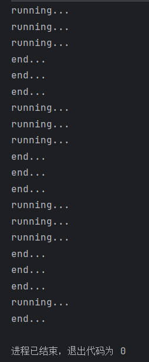

#### 总结 

如何控制某个方法允许并发访问线程的数量

在多线程中提供了一个工具类`Semaphore`， 信号量. 在并发的情况下， 可以控制方法的访问量

1.  创建`Semaphore`对象， 可以给一个容量
2.  `acquire()`可以请求一个信号量， 这时候的信号量个数 -1
3.  `release()`释放一个信号量， 此时信号量个数 +1

### ThreadLocal 

#### 概述 

`ThreadLocal`是多线程中对于解决线程安全的一个操作类， 他会为每个线程都分配一个独立的线程副本从而解决了变量并发访问冲突的问题. 

`ThreadLocal`同时实现了线程内的资源共享

案例: 使用JDBC操作数据库时， 会将每一个线程的`Connection`放入各自的`ThreadLocal`中， 从而保证每个线程都在各自的`Connection`上进行数据库的操作， 避免A线程关闭了B线程的连接

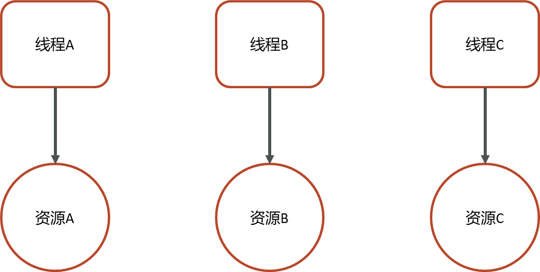

#### 基本使用 

 *  `set(value)`: 设置值
 *  `get()`: 获取值
 *  `remove()`: 清除值

示例代码:

```java
package com.qqzj.other;

public class ThreadLocalTest {

    static ThreadLocal<String> threadLocal = new ThreadLocal<>();

    public static void main(String[] args) {

        new Thread(() -> {
            String name = Thread.currentThread().getName();
            threadLocal.set("itcast");
            print(name);
            System.out.println(name + "-after remove : " + threadLocal.get());
        }， "t1").start();
        
        new Thread(() -> {
            String name = Thread.currentThread().getName();
            threadLocal.set("qqzj");
            print(name);
            System.out.println(name + "-after remove : " + threadLocal.get());
        }， "t2").start();
    }

    static void print(String str) {
        //打印当前线程中本地内存中本地变量的值
        System.out.println(str + " :" + threadLocal.get());
        //清除本地内存中的本地变量
        threadLocal.remove();
    }
}
```

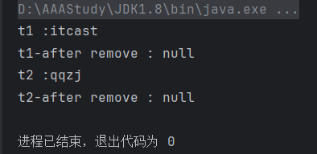

#### 实现原理&源码解析 

ThreadLocal本质来说就是一个线程内部存储类， 从而让多个线程只操作自己内部的值， 从而实现 线程数据隔离

数据真正的存储位置是一个叫 `ThreadLocalMap`的内部类

每个线程都持有一个`ThreadLocalMap`对象，每个`ThreadLocalMap`都维护了一个`Entry`数组来存储数据

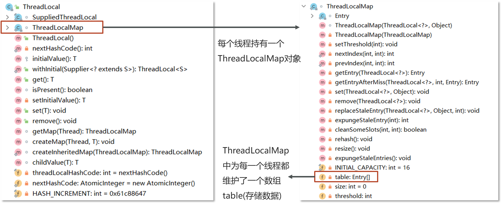

##### `set`方法 

```java
public void set(T value) {
    //获取当前线程对象
    Thread t = Thread.currentThread();
    //根据当前线程对象，获取ThreadLocal中的ThreadLocalMap
    ThreadLocalMap map = getMap(t);
    //如果map存在
    if (map != null)
        //执行map中的set方法，进行数据存储
        map.set(this， value);
    else
        //否则创建ThreadLocalMap，并存值
        createMap(t， value);
}
```

```java
void createMap(Thread t， T firstValue) {
    //creatMap方法是在ThreadLocal中定义的，这里的this是ThreadLocal对象
    t.threadLocals = new ThreadLocalMap(this， firstValue);
}
```

```java
ThreadLocalMap(ThreadLocal<?> firstKey， Object firstValue) {
    //内部成员数组，INITIAL_CAPACITY值为16的常量
    table = new Entry[INITIAL_CAPACITY];

    //位运算，结果与取模相同，计算出需要存放的位置
    int i = firstKey.threadLocalHashCode & (INITIAL_CAPACITY - 1);
    table[i] = new Entry(firstKey， firstValue);
    size = 1;
    setThreshold(INITIAL_CAPACITY);
}
```

##### `get`方法/`remove`方法 

```java
public T get() {
    Thread t = Thread.currentThread();
    //根据线程对象，获取对应的ThreadLocalMap
    ThreadLocalMap map = getMap(t);
    if (map != null) {
        //获取ThreadLocalMap中对应的Entry对象
        ThreadLocalMap.Entry e = map.getEntry(this);
        if (e != null) {
            @SuppressWarnings("unchecked")
            //获取Entry中的value
            T result = (T)e.value;
            return result;
        }
    }
    return setInitialValue();
}
```

```java
private Entry getEntry(ThreadLocal<?> key) {
    //确定数组下标位置
    int i = key.threadLocalHashCode & (table.length - 1);
    //得到该位置上的Entry
    Entry e = table[i];
    if (e != null && e.get() == key)
        return e;
    else
        return getEntryAfterMiss(key， i， e);
}
```

面试官: 你知道`ThreadLocal`内存泄漏问题吗

#### 内存泄露问题 

Java对象中的四种引用类型: 强引用、软引用、弱引用、虚引用.

 *  强引用: 最为普通的引用方式， 表示一个对象处于有用且必须的状态， 如果一个对象具有强引用， 则GC不会回收它. 即便堆中内存不足了， 宁可出现OOM， 也不会对其进行回收.
   
    ```java
    User user = new User();
    ```
 *  弱引用: 表示一个对象处于可能有用且非必须的状态. 在GC线程扫描内存区域时， 一旦发现弱引用， 就会回收掉弱引用相关联的对象. 对于弱引用的回收， 无关内存区域是否足够， 一旦发现则会被回收
   
    ```java
    User user = new User();
    WeakReference weakReference = new WeakReference(user);
    ```

##### 内存泄漏问题 

每一个`Thread`维护一个`ThreadLocalMap`， 在`ThreadLocalMap`中的`Entry`对象继承了`WeakReference`. 

其中`key`为使用弱引用的`ThreadLocal`实例， `value`为线程变量的副本

随着日积月累可能内存不够了，就会导致内存泄漏。解决方法就是一定要及时执行`remove`来主动释放内存中的key和value

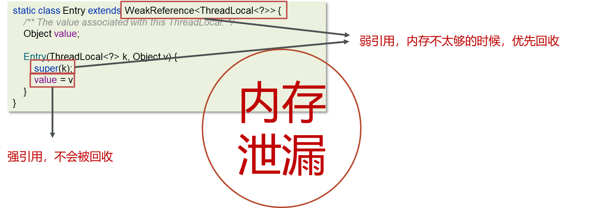

#### 总结 

谈谈你对`ThreadLocal`的理解

1.  `ThreadLocal`可以实现\[资源对象\]的线程隔离， 让每个线程各用各的\[资源对象\]， 避免争用引发的线程安全问题
2.  `ThreadLocal`同时实现了线程内的资源共享
3.  每个线程内有一个`ThreadLocalMap`类型的成员变量， 用来存储资源对象
  
     *  调用`set`方法， 就是以`ThreadLocal`自己作为`key`， 资源对象作为`value`， 放入当前线程的`ThreadLocalMap`集合中
     *  调用`get`方法， 就是以`ThreadLocal`自己作为`key`， 到当前线程中查找关联的资源值
     *  调用`remove`方法， 就是以`ThreadLocal`自己作为`key`， 移除当前线程关联的资源值
4.  `ThreadLocal`内存泄漏问题
  
    `ThreadLocalMap`中的`key`是弱引用， `value`为强引用; `key`会被GC回收释放内存， 关联`value`的内存并不会释放. 建议主动`remove`释放`key`， `value`

## 真实面试还原 

### 线程的基础知识 

> 面试官：聊一下并行和并发有什么区别？
>
> 候选人：
>
> 是这样的~~
>
> 现在都是多核CPU，在多核CPU下
>
> 并发是同一时间应对多件事情的能力，多个线程轮流使用一个或多个CPU
>
> 并行是同一时间动手做多件事情的能力，4核CPU同时执行4个线程
>
> 面试官：说一下线程和进程的区别？
>
> 候选人：
>
> 嗯，好~
>
>  *  进程是正在运行程序的实例，进程中包含了线程，每个线程执行不同的任务
>  *  不同的进程使用不同的内存空间，在当前进程下的所有线程可以共享内存空间
>  *  线程更轻量，线程上下文切换成本一般上要比进程上下文切换低(上下文切换指的是从一个线程切换到另一个线程)
>
> 面试官：如果在java中创建线程有哪些方式？
>
> 候选人：
>
> 在java中一共有四种常见的创建方式，分别是：继承Thread类、实现runnable接口、实现Callable接口、线程池创建线程。通常情况下，我们项目中都会采用线程池的方式创建线程。
>
> 面试官：好的，刚才你说的runnable 和 callable 两个接口创建线程有什么不同呢？
>
> 候选人：
>
> 是这样的~
>
> 最主要的两个线程一个是有返回值，一个是没有返回值的。
>
> Runnable 接口run方法无返回值；Callable接口call方法有返回值，是个泛型，和Future、FutureTask配合可以用来获取异步执行的结果
>
> 还有一个就是，他们异常处理也不一样。Runnable接口run方法只能抛出运行时异常，也无法捕获处理；Callable接口call方法允许抛出异常，可以获取异常信息
>
> 在实际开发中，如果需要拿到执行的结果，需要使用Callalbe接口创建线程，调用FutureTask.get()得到可以得到返回值，此方法会阻塞主进程的继续往下执行，如果不调用不会阻塞。
>
> 面试官：线程包括哪些状态，状态之间是如何变化的？
>
> 候选人：
>
> 在JDK中的Thread类中的枚举State里面定义了6中线程的状态分别是：新建、可运行、终结、阻塞、等待和有时限等待六种。
>
> 关于线程的状态切换情况比较多。我分别介绍一下
>
> 当一个线程对象被创建，但还未调用 start 方法时处于新建状态，调用了 start 方法，就会由新建进入可运行状态。如果线程内代码已经执行完毕，由可运行进入终结状态。当然这些是一个线程正常执行情况。
>
> 如果线程获取锁失败后，由可运行进入 Monitor 的阻塞队列阻塞，只有当持锁线程释放锁时，会按照一定规则唤醒阻塞队列中的阻塞线程，唤醒后的线程进入可运行状态
>
> 如果线程获取锁成功后，但由于条件不满足，调用了 wait() 方法，此时从可运行状态释放锁等待状态，当其它持锁线程调用 notify() 或 notifyAll() 方法，会恢复为可运行状态
>
> 还有一种情况是调用 sleep(long) 方法也会从可运行状态进入有时限等待状态，不需要主动唤醒，超时时间到自然恢复为可运行状态
>
> 面试官：嗯，好的，刚才你说的线程中的 wait 和 sleep方法有什么不同呢？
>
> 候选人：
>
> 它们两个的相同点是都可以让当前线程暂时放弃 CPU 的使用权，进入阻塞状态。
>
> 不同点主要有三个方面：
>
> 第一：方法归属不同
>
> sleep(long) 是 Thread 的静态方法。而 wait()，是 Object 的成员方法，每个对象都有
>
> 第二：线程醒来时机不同
>
> 线程执行 sleep(long) 会在等待相应毫秒后醒来，而 wait() 需要被 notify 唤醒，wait() 如果不唤醒就一直等下去
>
> 第三：锁特性不同
>
> wait 方法的调用必须先获取 wait 对象的锁，而 sleep 则无此限制
>
> wait 方法执行后会释放对象锁，允许其它线程获得该对象锁（相当于我放弃 cpu，但你们还可以用）
>
> 而 sleep 如果在 synchronized 代码块中执行，并不会释放对象锁（相当于我放弃 cpu，你们也用不了）
>
> 面试官：好的，我现在举一个场景，你来分析一下怎么做，新建 T1、T2、T3 三个线程，如何保证它们按顺序执行？
>
> 候选人：
>
> 嗯~~，我思考一下 （适当的思考或想一下属于正常情况，脱口而出反而太假\[背诵痕迹\]）
>
> 可以这么做，在多线程中有多种方法让线程按特定顺序执行，可以用线程类的join()方法在一个线程中启动另一个线程，另外一个线程完成该线程继续执行。
>
> 比如说：
>
> 使用join方法，T3调用T2，T2调用T1，这样就能确保T1就会先完成而T3最后完成
>
> 面试官：在我们使用线程的过程中，有两个方法。线程的 run()和 start()有什么区别？
>
> 候选人：
>
> start方法用来启动线程，通过该线程调用run方法执行run方法中所定义的逻辑代码。start方法只能被调用一次。run方法封装了要被线程执行的代码，可以被调用多次。
>
> 面试官：那如何停止一个正在运行的线程呢？
>
> 候选人：
>
> 有三种方式可以停止线程
>
> 第一：可以使用退出标志，使线程正常退出，也就是当run方法完成后线程终止，一般我们加一个标记
>
> 第二：可以使用线程的stop方法强行终止，不过一般不推荐，这个方法已作废
>
> 第三：可以使用线程的interrupt方法中断线程，内部其实也是使用中断标志来中断线程
>
> 我们项目中使用的话，建议使用第一种或第三种方式中断线程

### 线程中并发锁 

> 面试官：讲一下synchronized关键字的底层原理？
>
> 候选人：
>
> 嗯~~好的，
>
> synchronized 底层使用的JVM级别中的Monitor 来决定当前线程是否获得了锁，如果某一个线程获得了锁，在没有释放锁之前，其他线程是不能或得到锁的。synchronized 属于悲观锁。
>
> synchronized 因为需要依赖于JVM级别的Monitor ，相对性能也比较低。
>
> 面试官：好的，你能具体说下Monitor 吗？
>
> 候选人：
>
> monitor对象存在于每个Java对象的对象头中，synchronized 锁便是通过这种方式获取锁的，也是为什么Java中任意对象可以作为锁的原因
>
> monitor内部维护了三个变量
>
>  *  WaitSet：保存处于Waiting状态的线程
>  *  EntryList：保存处于Blocked状态的线程
>  *  Owner：持有锁的线程
>
> 只有一个线程获取到的标志就是在monitor中设置成功了Owner，一个monitor中只能有一个Owner
>
> 在上锁的过程中，如果有其他线程也来抢锁，则进入EntryList 进行阻塞，当获得锁的线程执行完了，释放了锁，就会唤醒EntryList 中等待的线程竞争锁，竞争的时候是非公平的。
>
> 面试官：好的，那关于synchronized 的锁升级的情况了解吗？
>
> 候选人：
>
> 嗯，知道一些（要谦虚）
>
> Java中的synchronized有偏向锁、轻量级锁、重量级锁三种形式，分别对应了锁只被一个线程持有、不同线程交替持有锁、多线程竞争锁三种情况。
>
> 重量级锁：底层使用的Monitor实现，里面涉及到了用户态和内核态的切换、进程的上下文切换，成本较高，性能比较低。
>
> 轻量级锁：线程加锁的时间是错开的（也就是没有竞争），可以使用轻量级锁来优化。轻量级修改了对象头的锁标志，相对重量级锁性能提升很多。每次修改都是CAS操作，保证原子性
>
> 偏向锁：一段很长的时间内都只被一个线程使用锁，可以使用了偏向锁，在第一次获得锁时，会有一个CAS操作，之后该线程再获取锁，只需要判断mark word中是否是自己的线程id即可，而不是开销相对较大的CAS命令
>
> 一旦锁发生了竞争，都会升级为重量级锁
>
> 面试官：好的，刚才你说了synchronized它在高并发量的情况下，性能不高，在项目该如何控制使用锁呢？
>
> 候选人：
>
> 嗯，其实，在高并发下，我们可以采用ReentrantLock来加锁。
>
> 面试官：嗯，那你说下ReentrantLock的使用方式和底层原理？
>
> 候选人：
>
> 好的，
>
> ReentrantLock是一个可重入锁:，调用 lock 方 法获取了锁之后，再次调用 lock，是不会再阻塞，内部直接增加重入次数 就行了，标识这个线程已经重复获取一把锁而不需要等待锁的释放。
>
> ReentrantLock是属于juc报下的类，属于api层面的锁，跟synchronized一样，都是悲观锁。通过lock()用来获取锁，unlock()释放锁。
>
> 它的底层实现原理主要利用CAS+AQS队列来实现。它支持公平锁和非公平锁，两者的实现类似
>
> 构造方法接受一个可选的公平参数（默认非公平锁），当设置为true时，表示公平锁，否则为非公平锁。公平锁的效率往往没有非公平锁的效率高。
>
> 面试官：好的，刚才你说了CAS和AQS，你能介绍一下吗？
>
> 候选人：
>
> 好的。
>
> CAS的全称是： Compare And Swap(比较再交换);它体现的一种乐观锁的思想，在无锁状态下保证线程操作数据的原子性。
>
>  *  CAS使用到的地方很多：AQS框架、AtomicXXX类
>  *  在操作共享变量的时候使用的自旋锁，效率上更高一些
>  *  CAS的底层是调用的Unsafe类中的方法，都是操作系统提供的，其他语言实现
>
> AQS的话，其实就一个jdk提供的类AbstractQueuedSynchronizer，是阻塞式锁和相关的同步器工具的框架。
>
> 内部有一个属性 state 属性来表示资源的状态，默认state等于0，表示没有获取锁，state等于1的时候才标明获取到了锁。通过cas 机制设置 state 状态
>
> 在它的内部还提供了基于 FIFO 的等待队列，是一个双向列表，其中
>
>  *  tail 指向队列最后一个元素
>  *  head 指向队列中最久的一个元素
>
> 其中我们刚刚聊的ReentrantLock底层的实现就是一个AQS。
>
> 面试官：synchronized和Lock有什么区别 ?
>
> 候选人：
>
> 嗯~~，好的，主要有三个方面不太一样
>
> 第一，语法层面
>
>  *  synchronized 是关键字，源码在 jvm 中，用 c++ 语言实现，退出同步代码块锁会自动释放
>  *  Lock 是接口，源码由 jdk 提供，用 java 语言实现，需要手动调用 unlock 方法释放锁
>
> 第二，功能层面
>
>  *  二者均属于悲观锁、都具备基本的互斥、同步、锁重入功能
>  *  Lock 提供了许多 synchronized 不具备的功能，例如获取等待状态、公平锁、可打断、可超时、多条件变量，同时Lock 可以实现不同的场景，如 ReentrantLock， ReentrantReadWriteLock
>
> 第三，性能层面
>
>  *  在没有竞争时，synchronized 做了很多优化，如偏向锁、轻量级锁，性能不赖
>  *  在竞争激烈时，Lock 的实现通常会提供更好的性能
>
> 统合来看，需要根据不同的场景来选择不同的锁的使用。
>
> 面试官：死锁产生的条件是什么？
>
> 候选人：
>
> 嗯，是这样的，一个线程需要同时获取多把锁，这时就容易发生死锁，举个例子来说：
>
> t1 线程获得A对象锁，接下来想获取B对象的锁
>
> t2 线程获得B对象锁，接下来想获取A对象的锁
>
> 这个时候t1线程和t2线程都在互相等待对方的锁，就产生了死锁
>
> 面试官：那如果产出了这样的，如何进行死锁诊断？
>
> 候选人：
>
> 这个也很容易，我们只需要通过jdk自动的工具就能搞定
>
> 我们可以先通过jps来查看当前java程序运行的进程id
>
> 然后通过jstack来查看这个进程id，就能展示出来死锁的问题，并且，可以定位代码的具体行号范围，我们再去找到对应的代码进行排查就行了。
>
> 面试官：请谈谈你对 volatile 的理解
>
> 候选人：
>
> 嗯~~
>
> volatile 是一个关键字，可以修饰类的成员变量、类的静态成员变量，主要有两个功能
>
> 第一：保证了不同线程对这个变量进行操作时的可见性，即一个线程修改了某个变量的值，这新值对其他线程来说是立即可见的，volatile关键字会强制将修改的值立即写入主存。
>
> 第二： 禁止进行指令重排序，可以保证代码执行有序性。底层实现原理是，添加了一个内存屏障，通过插入内存屏障禁止在内存屏障前后的指令执行重排序优化
>
> 本文作者：接《集合相关面试题》
>
> 面试官：那你能聊一下ConcurrentHashMap的原理吗？
>
> 候选人：
>
> 嗯好的，
>
> ConcurrentHashMap 是一种线程安全的高效Map集合，jdk1.7和1.8也做了很多调整。
>
>  *  JDK1.7的底层采用是分段的数组\+链表 实现
>  *  JDK1.8 采用的数据结构跟HashMap1.8的结构一样，数组+链表/红黑二叉树。
>
> 在jdk1.7中 ConcurrentHashMap 里包含一个 Segment 数组。Segment 的结构和HashMap类似，是一 种数组和链表结构，一个 Segment 包含一个 HashEntry 数组，每个 HashEntry 是一个链表结构 的元素，每个 Segment 守护着一个HashEntry数组里的元素，当对 HashEntry 数组的数据进行修 改时，必须首先获得对应的 Segment的锁。
>
> Segment 是一种可重入的锁 ReentrantLock，每个 Segment 守护一个HashEntry 数组里得元 素，当对 HashEntry 数组的数据进行修改时，必须首先获得对应的 Segment 锁
>
> 在jdk1.8中的ConcurrentHashMap 做了较大的优化，性能提升了不少。首先是它的数据结构与jdk1.8的hashMap数据结构完全一致。其次是放弃了Segment臃肿的设计，取而代之的是采用Node + CAS + Synchronized来保 证并发安全进行实现，synchronized只锁定当前链表或红黑二叉树的首节点，这样只要hash不冲 突，就不会产生并发 ， 效率得到提升

### 线程池 

> 面试官：线程池的种类有哪些？
>
> 候选人：
>
> 嗯！是这样
>
> 在jdk中默认提供了4中方式创建线程池
>
> 第一个是：newCachedThreadPool创建一个可缓存线程池，如果线程池长度超过处理需要，可灵活回 收空闲线程，若无可回收，则新建线程。
>
> 第二个是：newFixedThreadPool 创建一个定长线程池，可控制线程最大并发数，超出的线程会在队列 中等待。
>
> 第三个是：newScheduledThreadPool 创建一个定长线程池，支持定时及周期性任务执行。
>
> 第四个是：newSingleThreadExecutor 创建一个单线程化的线程池，它只会用唯一的工作线程来执行任 务，保证所有任务按照指定顺序(FIFO， LIFO， 优先级)执行。
>
> 面试官：线程池的核心参数有哪些？
>
> 候选人：
>
> 在线程池中一共有7个核心参数：
>
> 1.  corePoolSize 核心线程数目 - 池中会保留的最多线程数
> 2.  maximumPoolSize 最大线程数目 - 核心线程+救急线程的最大数目
> 3.  keepAliveTime 生存时间 - 救急线程的生存时间，生存时间内没有新任务，此线程资源会释放
> 4.  unit 时间单位 - 救急线程的生存时间单位，如秒、毫秒等
> 5.  workQueue - 当没有空闲核心线程时，新来任务会加入到此队列排队，队列满会创建救急线程执行任务
> 6.  threadFactory 线程工厂 - 可以定制线程对象的创建，例如设置线程名字、是否是守护线程等
> 7.  handler 拒绝策略 - 当所有线程都在繁忙，workQueue 也放满时，会触发拒绝策略
>
> 在拒绝策略中又有4中拒绝策略
>
> 当线程数过多以后，第一种是抛异常、第二种是由调用者执行任务、第三是丢弃当前的任务，第四是丢弃最早排队任务。默认是直接抛异常。
>
> 面试官：如何确定核心线程池呢？
>
> 候选人：
>
> 是这样的，我们公司当时有一些规范，为了减少线程上下文的切换，要根据当时部署的服务器的CPU核数来决定，我们规则是：CPU核数+1就是最终的核心线程数。
>
> 面试官：线程池的执行原理知道吗？
>
> 候选人：
>
> 嗯~，它是这样的
>
> 首先判断线程池里的核心线程是否都在执行任务，如果不是则创建一个新的工作线程来执行任务。如果核心线程都在执行任务，则线程池判断工作队列是否已满，如果工作队列没有满，则将新提交的任务存储在这个工作队 列里。如果工作队列满了，则判断线程池里的线程是否都处于工作状态，如果没有，则创建一个新的工作线程来执行任 务。如果已经满了，则交给拒绝策略来处理这个任务。
>
> 面试官：为什么不建议使用Executors创建线程池呢？
>
> 候选人：
>
> 好的，其实这个事情在阿里提供的最新开发手册《Java开发手册-嵩山版》中也提到了
>
> 主要原因是如果使用Executors创建线程池的话，它允许的请求队列默认长度是Integer.MAX\_VALUE，这样的话，有可能导致堆积大量的请求，从而导致OOM（内存溢出）。
>
> 所以，我们一般推荐使用ThreadPoolExecutor来创建线程池，这样可以明确规定线程池的参数，避免资源的耗尽。

### 线程使用场景问题 

> 面试官：如果控制某一个方法允许并发访问线程的数量？
>
> 候选人：
>
> 嗯~~，我想一下
>
> 在jdk中提供了一个Semaphore\[seməfɔːr\]类（信号量）
>
> 它提供了两个方法，semaphore.acquire() 请求信号量，可以限制线程的个数，是一个正数，如果信号量是-1，就代表已经用完了信号量，其他线程需要阻塞了
>
> 第二个方法是semaphore.release()，代表是释放一个信号量，此时信号量的个数+1
>
> 面试官：好的，那该如何保证Java程序在多线程的情况下执行安全呢？
>
> 候选人：
>
> 嗯，刚才讲过了导致线程安全的原因，如果解决的话，jdk中也提供了很多的类帮助我们解决多线程安全的问题，比如：
>
>  *  JDK Atomic开头的原子类、synchronized、LOCK，可以解决原子性问题
>  *  synchronized、volatile、LOCK，可以解决可见性问题
>  *  Happens-Before 规则可以解决有序性问题
>
> 面试官：你在项目中哪里用了多线程？
>
> 候选人：
>
> 嗯~~，我想一下当时的场景\[根据自己简历上的模块设计多线程场景\]
>
> 参考场景一：
>
> es数据批量导入
>
> 在我们项目上线之前，我们需要把数据量的数据一次性的同步到es索引库中，但是当时的数据好像是1000万左右，一次性读取数据肯定不行（oom异常），如果分批执行的话，耗时也太久了。所以，当时我就想到可以使用线程池的方式导入，利用CountDownLatch+Future来控制，就能大大提升导入的时间。
>
> 参考场景二：
>
> 在我做那个xx电商网站的时候，里面有一个数据汇总的功能，在用户下单之后需要查询订单信息，也需要获得订单中的商品详细信息（可能是多个），还需要查看物流发货信息。因为它们三个对应的分别三个微服务，如果一个一个的操作的话，互相等待的时间比较长。所以，我当时就想到可以使用线程池，让多个线程同时处理，最终再汇总结果就可以了，当然里面需要用到Future来获取每个线程执行之后的结果才行
>
> 参考场景三：
>
> 《黑马头条》项目中使用的
>
> 我当时做了一个文章搜索的功能，用户输入关键字要搜索文章，同时需要保存用户的搜索记录（搜索历史），这块我设计的时候，为了不影响用户的正常搜索，我们采用的异步的方式进行保存的，为了提升性能，我们加入了线程池，也就说在调用异步方法的时候，直接从线程池中获取线程使用

### 其他 

> 面试官：谈谈你对ThreadLocal的理解
>
> 候选人：
>
> 嗯，是这样的~~
>
> ThreadLocal 主要功能有两个，第一个是可以实现资源对象的线程隔离，让每个线程各用各的资源对象，避免争用引发的线程安全问题，第二个是实现了线程内的资源共享
>
> 面试官：好的，那你知道ThreadLocal的底层原理实现吗？
>
> 候选人：
>
> 嗯，知道一些~
>
> 在ThreadLocal内部维护了一个一个 ThreadLocalMap 类型的成员变量，用来存储资源对象
>
> 当我们调用 set 方法，就是以 ThreadLocal 自己作为 key，资源对象作为 value，放入当前线程的 ThreadLocalMap 集合中
>
> 当调用 get 方法，就是以 ThreadLocal 自己作为 key，到当前线程中查找关联的资源值
>
> 当调用 remove 方法，就是以 ThreadLocal 自己作为 key，移除当前线程关联的资源值
>
> 面试官：好的，那关于ThreadLocal会导致内存溢出这个事情，了解吗？
>
> 候选人：
>
> 嗯，我之前看过源码，我想一下~~
>
> 是应为ThreadLocalMap 中的 key 被设计为弱引用，它是被动的被GC调用释放key，不过关键的是只有key可以得到内存释放，而value不会，因为value是一个强引用。
>
> 在使用ThreadLocal 时都把它作为静态变量（即强引用），因此无法被动依靠 GC 回收，建议主动的remove 释放 key，这样就能避免内存溢出。

线程+救急线程的最大数目

> 1.  keepAliveTime 生存时间 - 救急线程的生存时间，生存时间内没有新任务，此线程资源会释放
> 2.  unit 时间单位 - 救急线程的生存时间单位，如秒、毫秒等
> 3.  workQueue - 当没有空闲核心线程时，新来任务会加入到此队列排队，队列满会创建救急线程执行任务
> 4.  threadFactory 线程工厂 - 可以定制线程对象的创建，例如设置线程名字、是否是守护线程等
> 5.  handler 拒绝策略 - 当所有线程都在繁忙，workQueue 也放满时，会触发拒绝策略
>
> 在拒绝策略中又有4中拒绝策略
>
> 当线程数过多以后，第一种是抛异常、第二种是由调用者执行任务、第三是丢弃当前的任务，第四是丢弃最早排队任务。默认是直接抛异常。
>
> 面试官：如何确定核心线程池呢？
>
> 候选人：
>
> 是这样的，我们公司当时有一些规范，为了减少线程上下文的切换，要根据当时部署的服务器的CPU核数来决定，我们规则是：CPU核数+1就是最终的核心线程数。
>
> 面试官：线程池的执行原理知道吗？
>
> 候选人：
>
> 嗯~，它是这样的
>
> 首先判断线程池里的核心线程是否都在执行任务，如果不是则创建一个新的工作线程来执行任务。如果核心线程都在执行任务，则线程池判断工作队列是否已满，如果工作队列没有满，则将新提交的任务存储在这个工作队 列里。如果工作队列满了，则判断线程池里的线程是否都处于工作状态，如果没有，则创建一个新的工作线程来执行任 务。如果已经满了，则交给拒绝策略来处理这个任务。
>
> 面试官：为什么不建议使用Executors创建线程池呢？
>
> 候选人：
>
> 好的，其实这个事情在阿里提供的最新开发手册《Java开发手册-嵩山版》中也提到了
>
> 主要原因是如果使用Executors创建线程池的话，它允许的请求队列默认长度是Integer.MAX\_VALUE，这样的话，有可能导致堆积大量的请求，从而导致OOM（内存溢出）。
>
> 所以，我们一般推荐使用ThreadPoolExecutor来创建线程池，这样可以明确规定线程池的参数，避免资源的耗尽。

### 线程使用场景问题 

> 面试官：如果控制某一个方法允许并发访问线程的数量？
>
> 候选人：
>
> 嗯~~，我想一下
>
> 在jdk中提供了一个Semaphore\[seməfɔːr\]类（信号量）
>
> 它提供了两个方法，semaphore.acquire() 请求信号量，可以限制线程的个数，是一个正数，如果信号量是-1，就代表已经用完了信号量，其他线程需要阻塞了
>
> 第二个方法是semaphore.release()，代表是释放一个信号量，此时信号量的个数+1
>
> 面试官：好的，那该如何保证Java程序在多线程的情况下执行安全呢？
>
> 候选人：
>
> 嗯，刚才讲过了导致线程安全的原因，如果解决的话，jdk中也提供了很多的类帮助我们解决多线程安全的问题，比如：
>
>  *  JDK Atomic开头的原子类、synchronized、LOCK，可以解决原子性问题
>  *  synchronized、volatile、LOCK，可以解决可见性问题
>  *  Happens-Before 规则可以解决有序性问题
>
> 面试官：你在项目中哪里用了多线程？
>
> 候选人：
>
> 嗯~~，我想一下当时的场景\[根据自己简历上的模块设计多线程场景\]
>
> 参考场景一：
>
> es数据批量导入
>
> 在我们项目上线之前，我们需要把数据量的数据一次性的同步到es索引库中，但是当时的数据好像是1000万左右，一次性读取数据肯定不行（oom异常），如果分批执行的话，耗时也太久了。所以，当时我就想到可以使用线程池的方式导入，利用CountDownLatch+Future来控制，就能大大提升导入的时间。
>
> 参考场景二：
>
> 在我做那个xx电商网站的时候，里面有一个数据汇总的功能，在用户下单之后需要查询订单信息，也需要获得订单中的商品详细信息（可能是多个），还需要查看物流发货信息。因为它们三个对应的分别三个微服务，如果一个一个的操作的话，互相等待的时间比较长。所以，我当时就想到可以使用线程池，让多个线程同时处理，最终再汇总结果就可以了，当然里面需要用到Future来获取每个线程执行之后的结果才行
>
> 参考场景三：
>
> 《黑马头条》项目中使用的
>
> 我当时做了一个文章搜索的功能，用户输入关键字要搜索文章，同时需要保存用户的搜索记录（搜索历史），这块我设计的时候，为了不影响用户的正常搜索，我们采用的异步的方式进行保存的，为了提升性能，我们加入了线程池，也就说在调用异步方法的时候，直接从线程池中获取线程使用

### 其他 

> 面试官：谈谈你对ThreadLocal的理解
>
> 候选人：
>
> 嗯，是这样的~~
>
> ThreadLocal 主要功能有两个，第一个是可以实现资源对象的线程隔离，让每个线程各用各的资源对象，避免争用引发的线程安全问题，第二个是实现了线程内的资源共享
>
> 面试官：好的，那你知道ThreadLocal的底层原理实现吗？
>
> 候选人：
>
> 嗯，知道一些~
>
> 在ThreadLocal内部维护了一个一个 ThreadLocalMap 类型的成员变量，用来存储资源对象
>
> 当我们调用 set 方法，就是以 ThreadLocal 自己作为 key，资源对象作为 value，放入当前线程的 ThreadLocalMap 集合中
>
> 当调用 get 方法，就是以 ThreadLocal 自己作为 key，到当前线程中查找关联的资源值
>
> 当调用 remove 方法，就是以 ThreadLocal 自己作为 key，移除当前线程关联的资源值
>
> 面试官：好的，那关于ThreadLocal会导致内存溢出这个事情，了解吗？
>
> 候选人：
>
> 嗯，我之前看过源码，我想一下~~
>
> 是应为ThreadLocalMap 中的 key 被设计为弱引用，它是被动的被GC调用释放key，不过关键的是只有key可以得到内存释放，而value不会，因为value是一个强引用。
>
> 在使用ThreadLocal 时都把它作为静态变量（即强引用），因此无法被动依靠 GC 回收，建议主动的remove 释放 key，这样就能避免内存溢出。