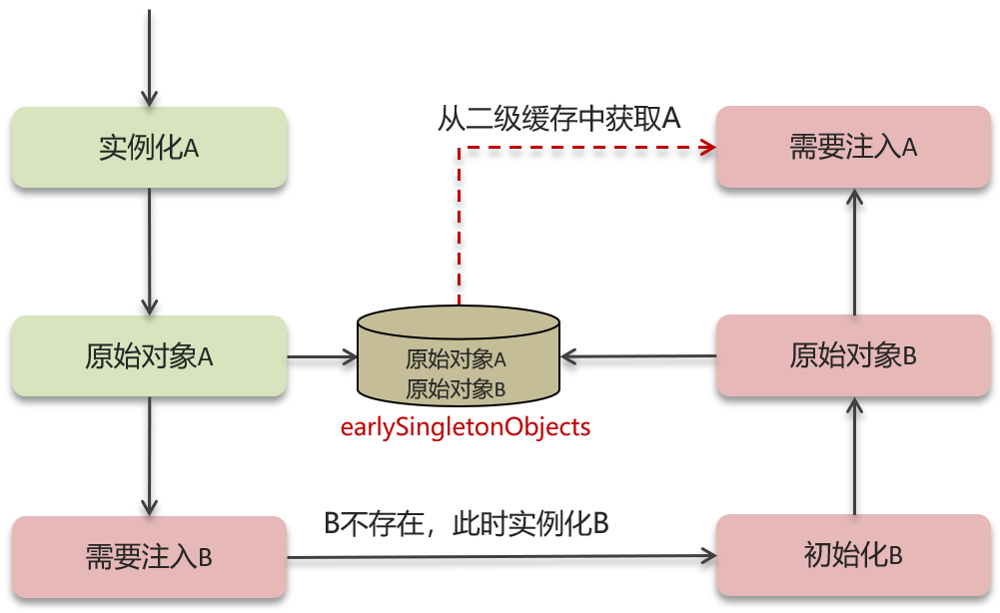
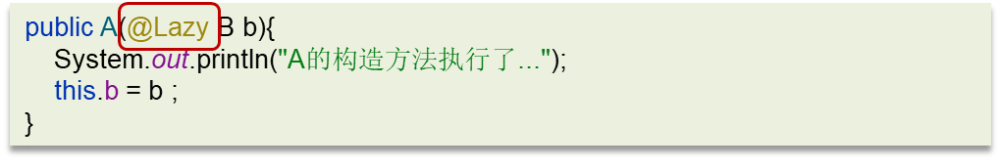

## 框架篇 


## 单例模式

### 基本介绍

> **单例模式（Singleton Pattern）** 是一种设计模式，确保一个类在整个应用程序中只能有一个实例，并提供一个全局的访问点来获取这个实例。该模式常用于需要控制资源使用的场景，例如数据库连接、线程池、配置管理器等。
>
> #### 单例模式的核心思想
>
> 1. **全局唯一性**：单例模式保证某个类在应用程序运行期间只存在一个实例，无论这个类被调用多少次，它始终返回同一个实例。
> 2. **延迟初始化**：单例类的实例通常是在第一次使用时才被创建（懒加载）。这样可以节省内存，提高性能，尤其在实例化开销较大的情况下。
> 3. **全局访问点**：单例模式为应用程序中的其他类提供一个全局访问点，确保任何时候获取到的都是同一个实例。
>
> #### 单例模式的优点
>
> 1. **节省资源**：通过限制类的实例数量（通常为1），避免了不必要的资源开销。例如，创建多个数据库连接可能会消耗大量系统资源，单例模式可以避免这种情况。
> 2. **全局共享状态**：单例模式允许多个不同的类共享同一个实例，保持全局状态的一致性。这在需要管理共享资源的场景下非常有用。
> 3. **控制实例化**：通过单例模式，可以严格控制类的实例化过程，防止其他类创建多个实例。
>
> #### 单例模式的缺点
>
> 1. **不易扩展**：由于单例类的实例是全局唯一的，它的扩展和修改可能会影响到所有使用它的地方，导致灵活性较差。
> 2. **并发问题**：在多线程环境中，单例模式需要特别处理线程安全问题，否则可能会导致创建多个实例或出现不一致的情况。
> 3. **隐藏依赖**：单例模式可能导致类之间的耦合变得紧密，其他类的依赖可能变得隐蔽，不利于代码的测试和维护。

### 使用场景

#### **什么时候需要单例模式？**

使用单例模式主要在以下几种场景中：

1. **无状态的服务类**：
   - 当某个类不存储用户相关的状态信息或依赖于特定的上下文时，单例模式是非常合适的。例如，服务类（Service）、DAO 类等。
   - 这些类通常是无状态的，不需要维护用户特定的信息。通过单例模式，系统可以复用同一个实例，节省内存和性能开销。

2. **共享的资源**：
   - 需要全局访问并共享的资源，适合单例模式。例如，日志管理器、数据库连接池、配置类等，这些类需要被多个对象共享，而不必为每个请求创建新的实例。

3. **性能考虑**：
   - 当创建实例的开销较大时，单例模式可以避免频繁的实例化，提升系统的性能。例如，加载大量资源的类，或者执行复杂初始化操作的类。

**单例模式示例场景：**

```java
@Service
public class UserService {
    // 无状态的服务类，每次调用都可以复用同一个实例
}
```

####  **什么时候不需要单例模式？**

不需要单例模式的场景通常是那些需要维护状态的场景，或者特定上下文相关的实例。以下情况应考虑其他作用域：

1. **有状态的 Bean**：
   - 如果一个 Bean 需要保存用户的状态信息或特定请求的信息（如用户的登录信息、购物车等），就不应该使用单例模式。因为单例 Bean 会导致不同用户之间共享同一个状态，产生线程安全问题。
   - 适合使用 **Prototype（原型模式）**，每次请求都会创建一个新的实例。

2. **每次请求都需要新的实例**：
   - 在某些场景下，特别是在处理并发请求或需要不同上下文的数据时，每次都需要新的实例。例如，事务对象、临时对象等场景，需要为每个请求提供独立的实例。

3. **线程安全**：
   - 如果一个类需要在多线程环境中保存状态，使用单例可能会导致数据不一致问题。此时，可以使用 **prototype** 或其他范围，如 **request** 或 **session** 范围。

**需要非单例模式的场景：**

- **Prototype** 模式（每次请求创建一个新的实例）：
   ```java
   @Scope("prototype")
   @Component
   public class UserSession {
       // 保存用户会话信息的类，每个用户的请求需要独立的实例
   }
   ```

- **Request** 作用域（每个 HTTP 请求创建一个实例，适用于 Web 应用）：
   ```java
   @Scope("request")
   @Component
   public class HttpRequestHandler {
       // 针对每个 HTTP 请求创建新的实例
   }
   ```

- **Session** 作用域（每个用户会话创建一个实例，适用于 Web 应用）：
   ```java
   @Scope("session")
   @Component
   public class UserSession {
       // 每个用户的会话独立
   }
   ```

## Spring 


### 单例bean是线程安全的吗? 

#### Spring框架中的bean是单例的吗? 

>  不是线程安全的


 *  `singleton(默认)`: bean在每个Spring IOC容器中只有一个实例
 *  `prototype`: 一个bean的定义可以有多个实例


- 上面代码的`count`不是线程安全的
- Spring bean并没有可变的状态(比如Service类和DAO类), 所以在某种程度上说Spring的单例bean是线程安全的.

#### 面试官: Spring框架中的单例bean是线程安全的吗? 

答: 不是线程安全的

Spring框架中有一个`@Scope`注解, 默认的值就是`singleton`, 单例的.

因为一般在Spring的bean中都是注入无状态的对象, 没有线程安全问题, 但是如果在bean中定义了可修改的成员变量, 是要考虑线程安全问题的, 可以使用多例或者加锁来解决

### AOP 

AOP称为面向切面编程, 用于将那些与业务无关, 但却对多个对象产生影响的公共行为和逻辑, 抽取并封装为一个可重用的模块, 这个模块被命名为“切面”(Aspect), 减少系统中的重复代码, 降低了模块间的耦合度, 同时提高了系统的可维护性.

常见的AOP使用场景:

 *  记录操作日志
 *  缓存处理
 *  Spring中内置的事务处理

记录操作日志思路


获取请求的用户名、请求方式、访问地址、模块名称、登录ip、操作时间, 记录到数据库的日志表中


> 实例代码

```java
@Component
@Aspect   //切面类
public class SysAspect {

    @Pointcut("@annotation(com.itheima.annotation.Log)")
    private void pointcut() {
    }

    @Pointcut("execution(* com.itheima.service.*.*(..))")
    public void pointcut2(){
     }

    @Around("pointcut2()")
    public Object around(ProceedingJoinPoint joinPoint) throws Throwable {
        //获取用户名
        //需要通过解析seesion或token获取

        //获取被增强类和方法的信息
        Signature signature = joinPoint.getSignature();
        MethodSignature methodSignature = (MethodSignature) signature;
        //获取被增强的方法对象
        Method method = methodSignature.getMethod();
        //从方法中解析注解
        if(method != null){
            Log logAnnotation = method.getAnnotation(Log.class);
            System.out.println(logAnnotation.name());
        }
        //方法名字
        String name = method.getName();
        System.out.println(name);

        //通过工具类获取Request对象
        RequestAttributes reqa = RequestContextHolder.getRequestAttributes();
        ServletRequestAttributes sra = (ServletRequestAttributes)reqa;
        HttpServletRequest request = sra.getRequest();
        //访问的url
        String url = request.getRequestURI().toString();
        System.out.println(url);
        //请求方式
        String methodName = request.getMethod();
        System.out.println(methodName);

        //登录IP
        String ipAddr = getIpAddr(request);
        System.out.println(ipAddr);

        //操作时间
        System.out.println(new Date());

        //保存到数据库（操作日志）
        //....

        return joinPoint.proceed();
    }

    /**
     * 获取ip地址
     * @param request
     * @return
     */
    public String getIpAddr(HttpServletRequest request){

        String ip = request.getHeader("x-forwarded-for");
        if(ip == null || ip.length() == 0 || "unknown".equalsIgnoreCase(ip)){}
            ip = request.getHeader("Proxy-Client-IP");
        }
        if(ip == null || ip.length() == 0 || "unknown".equalsIgnoreCase(ip)){
            ip = request.getHeader("WL-Proxy-Client-IP");
        }
        if(ip == null || ip.length() == 0 || "unknown".equalsIgnoreCase(ip)){
            ip = request.getRemoteAddr();
        }

        return "0:0:0:0:0:0:0:1".equals(ip) ? "127.0.0.1" : ip;
    }
}
```

#### Spring中的事务是如何实现的 

Spring支持编程式事务管理和声明式事务管理两种方式.

 *  编程式事务控制: 需要使用`TransactionTemplate`来进行实现, 对业务代码有侵入性, 项目中很少使用
 *  声明式事务管理: 声明式事务管理是建立在AOP之上的. 其本质是通过AOP功能, 对方法前后进行拦截, 对事务处理的功能编织到拦截的方法中, 也就是在目标方法开始之前加入一个事务, 在执行完目标方法之后根据执行情况提交或者回滚事务.


#### 面试官: 什么是AOP 

答: 面向切面编程, 用于将那些与业务无关, 但却对多个对象产生影响的公共行为和逻辑, 抽取公共模块复用, 降低耦合

#### 面试官: 你们项目中有没有使用到AOP 

记录操作日志, 缓存, Spring实现的事务

核心是: 使用AOP中的环绕通知 + 切点表达式(要找到记录日志的方法), 通过环绕通知的参数获取请求方法的参数(类、方法、注解、请求方式等), 获取到这些参数以后, 保存到数据库

#### 面试官: Spring中的事务是如何实现的 

其本质是通过AOP功能, 对方法前后进行拦截, 在执行方法之前开启事务, 在执行完目标方法之后根据执行情况提交或者回滚事务.

### 事务失效的场景 

 *  异常捕获处理
 *  抛出检查异常
 *  非public方法

#### 异常捕获处理 


> 上面这段代码的异常`int a = 1/0;`被包裹在了`try catch`中，自己处理了异常
>
> 执行上面这段代码会导致`fromAccount`中的钱凭空消失了，而`toAccount`中并没有加上钱

原因: 事务通知只有捕捉到了目标抛出的异常, 才能进行后续的回滚处理, 如果目标自己处理掉异常, 事务通知无法知悉

解决方法: 在`catch`块添加`throw new RuntimeException(e)`抛出

#### 抛出检查异常 


> 执行上面这段代码会导致`fromAccount`中的钱凭空消失了，而`toAccount`中并没有加上钱

原因: Spring默认只会回滚非检查异常，也就是`runtime`异常

解决方法: 配置`rollbackFor`属性，只要有异常都会回滚

```java
@Transactional(rollbackFor=Exception.class)
```

#### 非public方法导致的事务失效 


原因: Spring为方法创建代理、添加事务通知, 前提条件都是该方法是`public`的

解决方法: 改为`public`方法

#### 面试官: Spring中事务失效的场景有哪些? 

1.  异常捕获处理, 自己处理了异常, 没有抛出导致的事务失效
    - 解决方案: 手动抛出异常
2.  抛出检查异常
    - 解决方案: 配置`rollbackFor`属性为`Exception`
3.  非`public`方法导致的事务失效
    - 解决方案: 改为`public`

### bean的生命周期 

#### `BeanDefinition` 

Spring容器在进行实例化时, 会将`xml`配置的`<bean>`的信息封装成一个`BeanDefinition`对象, Spring根据`BeanDefinition`来创建`Bean`对象, 里面有很多的属性用来描述`Bean`


 *  `beanClassName`: `bean`的类名
 *  `initMethodName`: 初始化方法名称
 *  `propertyValues`: `bean`的属性值
 *  `scope`: 作用域
 *  `lazyInit`: 延迟初始化


#### 面试官: Spring的bean的生命周期 

答:

1.  通过`BeanDefinition`获取`bean`的定义信息
2.  调用构造函数实例化`bean`
3.  `bean`的依赖注入
4.  处理`Aware`接口(`BeanNameAware`、`BeanFactoryAware`、`ApplicationContextAware`)
5.  `Bean`的后置处理器`BeanPostProcessor - 前置`
6.  初始化方法(`InitializingBean`、`init-method`)
7.  `Bean`的后置处理器`BeanPostProcessor - 后置`
8.  销毁`bean`

### `Bean`的循环依赖(循环引用) 


在创建A对象的同时需要使用到B对象, 在创建B对象的同时需要使用到A对象


#### 什么是Spring的循环依赖? 


#### 三级缓存解决循环依赖 

Spring解决循环依赖是通过三级缓存, 对应的三级缓存如下所示:


<table> 
 <thead> 
  <tr> 
   <th>缓存名称</th> 
   <th>源码名称</th> 
   <th>作用</th> 
  </tr> 
 </thead> 
 <tbody> 
  <tr> 
   <td>一级缓存</td> 
   <td><code>singletonObjects</code></td> 
   <td>单例池，缓存已经经历了完整的生命周期，已经初始化完成的bean对象</td> 
  </tr> 
  <tr> 
   <td>二级缓存</td> 
   <td><code>earlySingletonObjects</code></td> 
   <td>缓存早期的bean对象(生命周期还没走完)</td> 
  </tr> 
  <tr> 
   <td>三级缓存</td> 
   <td><code>singletonFactories</code></td> 
   <td>缓存的是ObjectFactory，表示对象工厂，用来创建某个对象的</td> 
  </tr> 
 </tbody> 
</table>

一级缓存作用: 限制`bean`在`beanFactory`中只存一份, 即实现`singleton scope`, 解决不了循环依赖


如果要想打破循环依赖, 就需要一个中间人的参与, 这个中间人就是二级缓存.




一级和二级缓存可以解决一般对象的循环依赖, 如果一个对象被增强了, 即成为了代理对象, 这时候就需要借助三级缓存了


#### 构造方法出现了循环依赖 


报错信息: 

解决方法:

`@Lazy`代表暂时不注入, 什么时候用到什么时候再去实例化对象

#### 面试官: Spring中的循环引用 

 *  循环依赖: 循环依赖其实就是循环引用, 也就是两个或两个以上的`bean`互相持有对方, 最终形成闭环. 比如A依赖于B, B依赖于A
 *  循环依赖在Spring中是允许存在的, Spring框架依据三级缓存已经解决了大部分的循环依赖
   
     *  一级缓存: 单例池, 缓存已经经历了完整的生命周期, 已经初始化完成的`bean`对象
     *  二级缓存: 缓存早期的`bean`对象(生命周期还没走完)
     *  三级缓存: 缓存的事`ObjectFactory`, 表示对象工厂, 用来创建某个对象的
     *  

#### 面试官: 构造方法出现了循环依赖怎么解决? 

答: A依赖于B, B依赖于A, 注入的方式是构造函数

原因: 由于`bean`的生命周期中构造函数是第一个执行的, Spring框架的三级缓存并不能解决构造函数的依赖注入

解决方案: 使用`@Lazy`进行懒加载, 什么时候需要对象再进行`bean`对象的创建


## SpringMVC 

### 执行流程 

SpringMVC的执行流程是这个框架最核心的内容

 *  视图阶段(老旧JSP等)
 *  前后端分离阶段(接口开发, 异步)

#### 视图阶段(JSP) 

> Handler可以理解为某一个控制器中的某一个方法


#### 前后端分离阶段(接口开发, 异步请求) 


#### 面试官: SpringMVC的执行流程知道吗 

**(版本1: 视图版本, JSP)**

1.  用户发送出请求到前端控制器`DispatcherServlet`
2.  `DispatcherServlet`收到请求调用`HandlerMapping`(处理器映射器)
3.  `HandlerMapping`找到具体的处理器, 生成处理器对象及处理器拦截器(如果有), 再一起返回给`DispatcherServlet`
4.  `DispatcherServlet`调用`HandlerAdapter`(处理器适配器)
5.  `HandlerAdapter`经过适配调用具体的处理器(`Handler`/`Controller`)，处理参数和返回值
6.  `HandlerAdapter`执行完成返回`ModelAndView`对象
7.  `HandlerAdapter`将`Controller`执行结果`ModelAndView`返回给`DispatcherServlet`
8.  `DispatcherServlet`将`ModelAndView`传给`ViewReslover`(视图解析器)
9.  `ViewReslover`解析后返回具体`View`(视图)
10. `DispatcherServlet`根据`View`进行渲染视图(即将模型数据填充至视图中)
11. `DispatcherServlet`响应用户

**(版本2: 前后端开发, 接口开发)**

1.  用户发送出请求到前端控制器`DispatcherServlet`
2.  `DispatcherServlet`收到请求调用`HandlerMapping`(处理器映射器)
3.  `HandlerMapping`找到具体的处理器, 生成处理器对象及处理器拦截器(如果有), 再一起返回给`DispatcherServlet`
4.  `DispatcherServlet`调用`HandlerAdapter`(处理器适配器)
5.  `HandlerAdapter`经过适配调用具体的处理器(`Handler`/`Controller`)
6.  方法上添加了`@ResponseBody`
7.  通过`HttpMessageConverter`来将返回结果转换为`JSON`并响应

## SpringBoot 

### 自动配置 

SpringBoot中最高频的一道面试题, 也是框架最核心的思想


我们先进入到`SpringBootApplicaiton`注解，发现里面包含了三个其他注解

 *  `@SpringBootConfiguration`: 该注解与`@Configuration`注解作用相同, 用来声明当前也是一个配置类.
 *  `EnableAutoConfiguration`: SpringBoot实现自动化配置的核心注解
 *  `ComponentScan`: 组件扫描, 默认扫描当前引导类所在包及其子包.

我们再进入到`EnableAutoConfiguration`注解

> 下面的`@Import({AutoConfigurationImportSelector.class})`表示导入自动选择器，会把 `META/INF`下的`sprinf.factories`的内容全部加载到spring容器中。然而并非所有的都会被加载，例如我们打开RedisAutoConfiguration

 


> 例如我们打开RedisAutoConfiguration
>
> - `ConditionalOnClass({RedisOperations.class})`：只有当`RedisOperations.class`存在时才会加载`RedisAutoConfiguration`这个类，而只有当我们导入`redis`相关的依赖时才会存在`RedisOperations.class`这个字节码
> - 有一个方法`redisTemplate`
>   - 并有注解`@Bean`，表示把这个方法的返回值注入到spring中
>   - 以及注解`@ConditionalOnMissingBean(name = {"redisTemplate"})`，表示只有当前不存在`redisTemplate`时才会走这个方法创建bean并注入到spring容器中


#### 面试官: SpringBoot自动配置原理 

答:

1.  在SpringBoot项目中的引导类上有一个注解`@SpringBootApplication`, 这个注解是对三个注解进行了封装, 分别是:
  
     *  `@SpringBootConfiguration`
     *  `@EnableAutoConfiguration`
     *  `@ComponentScan`
2.  其中`@EnableAutoConfiguration`是实现自动化配置的核心注解. 该注解通过`@Import`注解导入对应的配置选择器
  
    内部就是读取了该项目和该项目引用的Jar包的`classpath`路径下`META-INF/spring.factories`文件中的所配置的类的全类名. 在这些配置类中所定义的Bean会根据条件注解所指定的条件来决定是否需要将其导入到Spring容器中.
3.  条件判断会有像`@ConditionalOnClass`这样的注解, 判断是否有对应的`class`文件, 如果有则加载该类, 把这个配置类的所有的Bean放入Spring容器中使用

## Spring框架常见注解 

### Spring

| 注解                                              | 说明                                                         |
| ------------------------------------------------- | ------------------------------------------------------------ |
| `@Component`、@Controller、@Service、@Repository  | 使用在类上用于实例化Bean                                     |
| `@Autowired`                                      | 使用在字段上用于根据类型依赖注入                             |
| `@Qualifier`                                      | 结合@Autowired一起使用用于根据名称进行依赖注入               |
| `@Resource`                                       | 默认按名字注入的（根据成员变量的名字），如果找不到对应的名字，按类型注入。 |
| `@Scope`                                          | 标注Bean的作用范围                                           |
| `@Configuration`                                  | 指定当前类是一个 Spring 配置类，当创建容器时会从该类上加载注解 |
| `@ComponentScan`                                  | 用于指定 Spring 在初始化容器时要扫描的包                     |
| `@Bean`                                           | 使用在方法上，标注将该方法的返回值存储到Spring容器中         |
| `@Import`                                         | 使用@lmport导入的类会被Spring加载到IoC容器中                 |
| `@Aspect`、`@Before`、@After、 @Around、@Pointcut | 用于切面编程 (AOP)                                           |

> ### **1.实例化 Bean（Bean Creation）**
>
> **实例化 Bean** 是指 Spring 容器根据配置（如 XML 文件、注解、Java 配置类等），创建一个类的对象（实例），并将其作为一个 Bean 交给 Spring 容器管理。实例化是 Bean 生命周期的第一步。
>
> - **什么是实例化？**
>   - 实例化就是根据类的定义，创建该类的对象。这和我们在 Java 中使用 `new` 操作符创建对象的过程类似。
>   - 在 Spring 中，实例化 Bean 可以通过构造方法、静态工厂方法、实例工厂方法等方式完成。
> - **如何实例化？**
>   - Spring 容器会根据配置文件或者注解扫描找到 Bean 的定义，然后实例化这个 Bean 对象，将其注册到 Spring 容器中。
>
> #### 实例化 Bean 示例：
>
> ```java
> java复制代码@Component
> public class MyService {
>     // Spring 容器会实例化 MyService 对象并管理
> }
> ```
>
> 在这个例子中，Spring 会自动扫描 `@Component` 注解，并通过默认的无参构造器实例化 `MyService` 类。
>
> ### 2. **注入 Bean（Bean Injection）**
>
> **注入 Bean** 是指 Spring 容器在实例化一个 Bean 后，将它依赖的其他 Bean **注入**到它的属性、构造方法或方法参数中。这是实现 **依赖注入（Dependency Injection, DI）** 的核心过程。
>
> - **什么是注入？**
>   - 注入是指将一个对象的依赖交给 Spring 容器来提供，而不是由对象本身去创建这些依赖。这可以通过 **构造方法注入**、**Setter 方法注入** 或 **字段注入** 来实现。
> - **注入的类型**：
>   1. **构造器注入**：通过构造方法为对象传递依赖。
>   2. **Setter 注入**：通过 Setter 方法为对象注入依赖。
>   3. **字段注入**：直接在字段上使用 `@Autowired` 注解来注入依赖。
>
> #### 注入 Bean 示例：
>
> ```java
> java复制代码@Component
> public class MyService {
> 
>     private final MyRepository myRepository;
> 
>     // 构造器注入
>     @Autowired
>     public MyService(MyRepository myRepository) {
>         this.myRepository = myRepository;
>     }
> }
> ```
>
> 在这个例子中，`MyService` 依赖 `MyRepository`，Spring 容器会在实例化 `MyService` 后，将 `MyRepository` 的实例通过构造器注入到 `MyService` 中。

### SpringMVC 

| 注解              | 说明                                                         |
| ----------------- | ------------------------------------------------------------ |
| `@RequestMapping` | 用于映射请求路径，可以定义在类上和方法上。用于类上，则表示类中的所有的方法都是以该地址作为父路径 |
| `@RequestBody`    | 注解实现接收http请求的json数据，将json转换为java对象         |
| `@RequestParam`   | 指定请求参数的名称                                           |
| `@Pathviriable`   | 从请求路径下中获取请求参数(/user/{id)，传递给方法的形式参数  |
| `@ResponseBody`   | 注解实现将controller方法返回对象转化为json对象响应给客户端   |
| `@RequestHeader`  | 获取指定的请求头数据                                         |
| `@RestController` | @Controller + @ResponseBody                                  |
|                   |                                                              |

> - @Controller
>   - 返回视图名，经过视图解析器 解析成页面（HTML、JSP）
>   - 用于传统的Web应用，返回的 是页面或视图
> - @RestController
>   - 返回JSON、XML或其他对象 数据，直接作为响应体
>   - 用于RESTfulAPI，返回的是数 据而不是视图，主要用于前后端 分离
>
> ### **为什么选择 `@RestController`？**
>
> 在现代开发中，前后端分离的项目越来越多，后端通常只需要返回数据，前端再去渲染页面。在这种情况下，`@RestController` 非常适合用来构建 API，因为它可以直接返回数据，而不需要经过视图解析。

### SpringBoot 

| 注解                       | 说明                                           |
| -------------------------- | ---------------------------------------------- |
| `@SpringBootConfiguration` | 组合了-@Configuration注解，实现配置文件的功能  |
| `@EnableAutoConfiguration` | 打开自动配置的功能，也可以关闭某个自动配置的选 |
| `@ComponentScan`           | Spring组件扫描                                 |


## MyBatis 

### 执行流程 

 *  理解了各个组件的关系
 *  SQL的执行过程(参数映射、SQL解析、执行和结果处理)


#### 面试官: MyBatis执行流程 

答:

1.  读取MyBatis配置文件: `mybatis-config.xml`加载运行环境和映射文件
2.  构造会话工厂`SqlSessionFactory`
3.  会话工厂创建`SqlSession`对象(包含了执行SQL语句的所有方法)
4.  操作数据库的接口, `Executor`执行器, 同时负责查询缓存的维护
5.  `Executor`接口的执行方法中有一个`MappedStatement`类型的参数, 封装了映射信息
6.  输入参数映射  java类型转为数据库类型
7.  输出结果映射  数据库类型转为java类型

### 延迟加载使用及原理 

MyBatis支持延迟加载, 但默认没有开启

> MyBatis 仅支持 association 关联对象和 collection 关联集合对象的延迟加载，association 指的就是一对一，collection 指的就是一对多查询。在 MyBatis 配置文件中，可以配置是否启用延迟加载 `lazyLoadingEnabled=true|false。`

#### 延迟加载 

> 假设我们现在有一张用户表和一张订单表，为1对多的关系


- 查询用户的时候, 把用户所属的订单数据页查询出来, 这个是立即加载

- 查询用户的时候, 暂时不查询订单数据, 当需要订单的时候, 再查询订单, 这个就是延迟加载

> 代码示例

```xml
<resultMap id="userResultMap" type="user" autoMapping="true">
    <id property="id" column="id"></id>
    <result property="username" column="username"></result>
    <result property="password" column="password"></result>
    <result property="gender" column="gender"></result>
    <result property="addr" column="addr"></result>
    <collection property="orderList" ofType="order"
                select="com.itheima.mapper.OrderMapper.findByUid"
                column="id" fetchType="lazy"> <!--延迟加载-->
    </collection>
</resultMap>
<select id="selectById" resultMap="userResultMap">
    select *
    from tb_user
    where id = #{id}
</select>
```

`fetchType="lazy"` 开启延迟加载

同时可以在`mybatis-config.xml`中设置全局开启

```xml
<settings>
    <setting name="cacheEnabled" value="true"/><!--  开启二级缓存 -->
    <setting name="mapUnderscoreToCamelCase" value="true"/> <!-- 开启驼峰命名自动映射 -->
    <setting name="lazyLoadingEnabled" value = "true" /><!--开启延迟加载-->
</settings>
```

#### 原理 

1.  使用`CGLIB`创建目标对象的代理对象
2.  当调用目标方法`user.getOrderList()`时, 进入拦截器`invoke`方法, 发现`user.getOrderList()`是`null`值, 执行SQL查询order列表
3.  把order查询上来, 然后调用`user.setOrderList(List<Order> orderList)`, 接着完成`user.getOrderList()`方法的调用


#### 面试官: MyBatis是否支持延迟加载? 

 *  延迟加载的意思是: 就是在需要用到数据时才进行加载, 不需要用到数据时就不加载数据
 *  MyBatis支持一对一关联对象和一对多关联集合对象的延迟加载
 *  在MyBatis配置文件中, 可以配置是否启用延迟加载`lazyLoadingEnabled=true|false`, 默认是关闭的

#### 面试官: 延迟加载的底层原理知道吗? 

1.  使用`CGLIB`创建目标对象的代理对象
2.  当调用目标方法时, 进入拦截器`invoke`方法, 发现目标方法是`null`值, 执行SQL查询
3.  获取数据以后, 调用`set`方法设置属性值, 再继续查询目标方法, 就有值了

### 一级、二级缓存 


 *  本地缓存, 基于`PerpetualCache`, 本质是一个`HashMap`
 *  一级缓存: 作用域是`session`级别，指的是`sqlSession`
 *  二级缓存: 作用域是`namespace`和`mapper`的作用域, 不依赖于`session`

#### 一级缓存 

一级缓存: 基于`PerpetualCache`的`HashMap`本地缓存, 其存储作用域为`Session`, 当`Session`进行`flush`或`close`之后, 该`Session`中的所有`Cache`就将清空

- 默认打开一级缓存

> 因为这两次查询用的是同一个`sqlSession`，如果是不同的`sqlSession`就不行了。
>
> 第一次查询之后会把结果放到缓存，第二次查询的时候直接去缓存中拿数据


#### 二级缓存 

二级缓存时基于`namespace`和`mapper`的作用域起作用的, 不是依赖于`sqlSession`, 默认也是采用`PerpetualCache`, `HashMap`存储


二级缓存默认是关闭的

开启方式, 两步:

1.  全局配置文件
  
    
2.  映射文件
  
    使用`<cache/>`标签让当前`mapper`生效二级缓存

注意事项:

1.  对于缓存数据更新机制, 当某一个作用域(一级缓存`Session`/二级缓存`namespace`)进行了新增、修改、删除操作后, 默认该作用域下所有`select`中的缓存将被`clear`
2.  二级缓存需要缓存的数据实现`Serializable`接口
3.  只有会话提交或者关闭以后, 一级缓存中的数据才会转移到二级缓存中

#### 面试官: MyBatis的一级、二级缓存用过吗? 

 *  一级缓存: 基于`PerpetualCache`的`HashMap`本地缓存, 其存储作用域为`Session`, 当`Session`进行`flush`或者`close`之后, 该`Session`中的所有`Cache`就将清空, 默认打开一级缓存
 *  二级缓存是几乎`namespace`和`mapper`的作用域起作用的, 不是依赖于`SQL Session`, 默认也是采用`PerpetualCache`, `HashMap`存储. 需要单独开启, 一个是核心配置\[`<setting name="cacheEnabled" value="true">`\], 一个是`mapper`映射文件\[^`<cache/>`\]

#### 面试官: MyBatis的二级缓存什么时候会清理缓存中的数据 

当某一个作用域(一级缓存`Session`/二级缓存`namespace`)进行了新增、修改、删除操作后, 默认该作用域下所有的`select`中的缓存将被`clear`.

### 其他

#### #{} 和 ${} 的区别是什么？

> 在 MyBatis 中，`#{} ` 和 `${}` 都用于在 SQL 语句中传递参数，但它们的处理方式不同，主要体现在 **安全性** 和 **生成的 SQL 语句** 的方式。以下是它们的主要区别：
>
> ### 1. **#{} 占位符**
>
> - **#{} 是安全的预编译占位符**，会将参数作为 **预编译参数** 传递到 SQL 中。
> - **防止 SQL 注入**：MyBatis 使用 JDBC 的预编译机制，将 `#` 中的参数通过 `?` 占位符传递到 SQL 语句中，避免了 SQL 注入攻击。
> - **自动类型转换**：MyBatis 会自动将参数类型转换为对应的 JDBC 类型。
>
> #### 使用方式：
> ```sql
> SELECT * FROM user WHERE name = #{name}
> ```
> 假设传入参数 `name = 'John'`，生成的 SQL 实际上是：
> ```sql
> SELECT * FROM user WHERE name = ?
> ```
> MyBatis 会将 `John` 作为参数安全地传递给数据库。
>
> #### 适用场景：
> - **适合传递值**，如 WHERE 条件中的参数，避免 SQL 注入，确保安全。
>
> ### 2. **${} 占位符**
>
> - **${} 是直接拼接参数**，不会进行预编译，而是将参数的值直接拼接到 SQL 语句中。
> - **不防止 SQL 注入**：因为参数是直接插入到 SQL 语句中，所以如果用户输入未被适当处理，可能会导致 SQL 注入攻击。
> - 适用于**传递动态数据库对象名称**（如表名、列名等），而不是传递值。
>
> #### 使用方式：
> ```sql
> SELECT * FROM ${tableName}
> ```
> 假设传入参数 `tableName = 'user'`，生成的 SQL 实际上是：
> ```sql
> SELECT * FROM user
> ```
>
> #### 适用场景：
> - **适合传递数据库对象名称**，如表名、列名或其他 SQL 关键字，不能用于用户输入的值。
>
> ### 3. **区别对比**
>
> | 特性           | `#{} ` 占位符                | `${}` 占位符                |
> | -------------- | ---------------------------- | --------------------------- |
> | 参数处理方式   | 预编译，用 `?` 占位符传值    | 直接拼接到 SQL 语句中       |
> | SQL 注入安全性 | 安全（防止 SQL 注入）        | 不安全（容易导致 SQL 注入） |
> | 自动类型转换   | MyBatis 自动转换为 JDBC 类型 | 不进行自动类型转换          |
> | 适用场景       | 传递参数（如条件值）         | 传递动态 SQL 片段（如表名） |
>
> ### 4. 使用示例
>
> #### **#{} 占位符的示例**（安全）
>
> ```xml
> <select id="findUserByName" parameterType="String" resultType="User">
>     SELECT * FROM user WHERE name = #{name}
> </select>
> ```
> 传入参数 `name = 'John'`，生成的 SQL 是：
> ```sql
> SELECT * FROM user WHERE name = ?
> ```
> 通过预编译方式，将 `John` 作为参数传递，安全防止 SQL 注入。
>
> #### **${} 占位符的示例**（不安全）
>
> ```xml
> <select id="findUserByTableName" parameterType="String" resultType="User">
>     SELECT * FROM ${tableName}
> </select>
> ```
> 传入参数 `tableName = 'user'`，生成的 SQL 是：
> ```sql
> SELECT * FROM user
> ```
>
> 如果传入的 `tableName` 是恶意的输入，可能导致 SQL 注入问题。


## 框架篇面试题-参考回答 

> ###### 面试官：Spring框架中的单例bean是线程安全的吗？ 
>
> 候选人：
>
> 嗯！
>
> 不是线程安全的，是这样的
>
> 当多用户同时请求一个服务时，容器会给每一个请求分配一个线程，这是多个线程会并发执行该请求对应的业务逻辑（成员方法），如果该处理逻辑中有对该单列状态的修改（体现为该单例的成员属性），则必须考虑线程同步问题。
>
> Spring框架并没有对单例bean进行任何多线程的封装处理。关于单例bean的线程安全和并发问题需要开发者自行去搞定。
>
> 比如：我们通常在项目中使用的Spring bean都是不可可变的状态(比如Service类和DAO类)，所以在某种程度上说Spring的单例bean是线程安全的。
>
> 如果你的bean有多种状态的话（比如 View Model对象），就需要自行保证线程安全。最浅显的解决办法就是将多态bean的作用由“singleton”变更为“prototype”。
>
> 面试官：什么是AOP
>
> 候选人：
>
> aop是面向切面编程，在spring中用于将那些与业务无关，但却对多个对象产生影响的公共行为和逻辑，抽取公共模块复用，降低耦合，一般比如可以做为公共日志保存，事务处理等
>
> 面试官：你们项目中有没有使用到AOP
>
> 候选人：
>
> 我们当时在后台管理系统中，就是使用aop来记录了系统的操作日志
>
> 主要思路是这样的，使用aop中的环绕通知+切点表达式，这个表达式就是要找到要记录日志的方法，然后通过环绕通知的参数获取请求方法的参数，比如类信息、方法信息、注解、请求方式等，获取到这些参数以后，保存到数据库
>
> 面试官：Spring中的事务是如何实现的
>
> 候选人：
>
> spring实现的事务本质就是aop完成，对方法前后进行拦截，在执行方法之前开启事务，在执行完目标方法之后根据执行情况提交或者回滚事务。
>
> 面试官：Spring中事务失效的场景有哪些
>
> 候选人：
>
> 嗯！这个在项目中之前遇到过，我想想啊
>
> 第一个，如果方法上异常捕获处理，自己处理了异常，没有抛出，就会导致事务失效，所以一般处理了异常以后，别忘了跑出去就行了
>
> 第二个，如果方法抛出检查异常，如果报错也会导致事务失效，最后在spring事务的注解上，就是@Transactional上配置rollbackFor属性为Exception，这样别管是什么异常，都会回滚事务
>
> 第三，我之前还遇到过一个，如果方法上不是public修饰的，也会导致事务失效
>
> 嗯，就能想起来那么多
>
> 面试官：Spring的bean的生命周期
>
> 候选人：
>
> 嗯！，这个步骤还是挺多的，我之前看过一些源码，它大概流程是这样的
>
> 首先会通过一个非常重要的类，叫做BeanDefinition获取bean的定义信息，这里面就封装了bean的所有信息，比如，类的全路径，是否是延迟加载，是否是单例等等这些信息
>
> 在创建bean的时候，第一步是调用构造函数实例化bean
>
> 第二步是bean的依赖注入，比如一些set方法注入，像平时开发用的@Autowire都是这一步完成
>
> 第三步是处理Aware接口，如果某一个bean实现了Aware接口就会重写方法执行
>
> 第四步是bean的后置处理器BeanPostProcessor，这个是前置处理器
>
> 第五步是初始化方法，比如实现了接口InitializingBean或者自定义了方法init-method标签或@PostContruct
>
> 第六步是执行了bean的后置处理器BeanPostProcessor，主要是对bean进行增强，有可能在这里产生代理对象
>
> 最后一步是销毁bean
>
> 面试官：Spring中的循环引用
>
> 候选人：
>
> 嗯，好的，我来解释一下
>
> 循环依赖：循环依赖其实就是循环引用,也就是两个或两个以上的bean互相持有对方,最终形成闭环。比如A依赖于B,B依赖于A
>
> 循环依赖在spring中是允许存在，spring框架依据三级缓存已经解决了大部分的循环依赖
>
> ①一级缓存：单例池，缓存已经经历了完整的生命周期，已经初始化完成的bean对象
>
> ②二级缓存：缓存早期的bean对象（生命周期还没走完）
>
> ③三级缓存：缓存的是ObjectFactory，表示对象工厂，用来创建某个对象的
>
> 面试官：那具体解决流程清楚吗？
>
> 候选人：
>
> 第一，先实例A对象，同时会创建ObjectFactory对象存入三级缓存singletonFactories
>
> 第二，A在初始化的时候需要B对象，这个走B的创建的逻辑
>
> 第三，B实例化完成，也会创建ObjectFactory对象存入三级缓存singletonFactories
>
> 第四，B需要注入A，通过三级缓存中获取ObjectFactory来生成一个A的对象同时存入二级缓存，这个是有两种情况，一个是可能是A的普通对象，另外一个是A的代理对象，都可以让ObjectFactory来生产对应的对象，这也是三级缓存的关键
>
> 第五，B通过从通过二级缓存earlySingletonObjects 获得到A的对象后可以正常注入，B创建成功，存入一级缓存singletonObjects
>
> 第六，回到A对象初始化，因为B对象已经创建完成，则可以直接注入B，A创建成功存入一次缓存singletonObjects
>
> 第七，二级缓存中的临时对象A清除
>
> 面试官：构造方法出现了循环依赖怎么解决？
>
> 候选人：
>
> 由于bean的生命周期中构造函数是第一个执行的，spring框架并不能解决构造函数的的依赖注入，可以使用@Lazy懒加载，什么时候需要对象再进行bean对象的创建
>
> 面试官：SpringMVC的执行流程知道嘛
>
> 候选人：
>
> 嗯，这个知道的，它分了好多步骤
>
> 1、用户发送出请求到前端控制器DispatcherServlet，这是一个调度中心
>
> 2、DispatcherServlet收到请求调用HandlerMapping（处理器映射器）。
>
> 3、HandlerMapping找到具体的处理器(可查找xml配置或注解配置)，生成处理器对象及处理器拦截器(如果有)，再一起返回给DispatcherServlet。
>
> 4、DispatcherServlet调用HandlerAdapter（处理器适配器）。
>
> 5、HandlerAdapter经过适配调用具体的处理器（Handler/Controller）。
>
> 6、Controller执行完成返回ModelAndView对象。
>
> 7、HandlerAdapter将Controller执行结果ModelAndView返回给DispatcherServlet。
>
> 8、DispatcherServlet将ModelAndView传给ViewReslover（视图解析器）。
>
> 9、ViewReslover解析后返回具体View（视图）。
>
> 10、DispatcherServlet根据View进行渲染视图（即将模型数据填充至视图中）。
>
> 11、DispatcherServlet响应用户。
>
> 当然现在的开发，基本都是前后端分离的开发的，并没有视图这些，一般都是handler中使用Response直接结果返回
>
> 面试官：Springboot自动配置原理
>
> 候选人：
>
> 嗯，好的，它是这样的。
>
> 在Spring Boot项目中的引导类上有一个注解@SpringBootApplication，这个注解是对三个注解进行了封装，分别是：
>
>  *  @SpringBootConfiguration
>  *  @EnableAutoConfiguration
>  *  @ComponentScan
>
> 其中`@EnableAutoConfiguration`是实现自动化配置的核心注解。
>
> 该注解通过`@Import`注解导入对应的配置选择器。关键的是内部就是读取了该项目和该项目引用的Jar包的的classpath路径下META-INF/spring.factories文件中的所配置的类的全类名。
>
> 在这些配置类中所定义的Bean会根据条件注解所指定的条件来决定是否需要将其导入到Spring容器中。
>
> 一般条件判断会有像`@ConditionalOnClass`这样的注解，判断是否有对应的class文件，如果有则加载该类，把这个配置类的所有的Bean放入spring容器中使用。
>
> 面试官：Spring 的常见注解有哪些？
>
> 候选人：
>
> 嗯，这个就很多了
>
> 第一类是：声明bean，有@Component、@Service、@Repository、@Controller
>
> 第二类是：依赖注入相关的，有@Autowired、@Qualifier、@Resourse
>
> 第三类是：设置作用域 @Scope
>
> 第四类是：spring配置相关的，比如@Configuration，@ComponentScan 和 @Bean
>
> 第五类是：跟aop相关做增强的注解 @Aspect，@Before，@After，@Around，@Pointcut
>
> 面试官：SpringMVC常见的注解有哪些？
>
> 候选人：
>
> 嗯，这个也很多的
>
> 有@RequestMapping：用于映射请求路径；
>
> @RequestBody：注解实现接收http请求的json数据，将json转换为java对象；
>
> @RequestParam：指定请求参数的名称；
>
> @PathViriable：从请求路径下中获取请求参数(/user/\{id\})，传递给方法的形式参数；@ResponseBody：注解实现将controller方法返回对象转化为json对象响应给客户端。@RequestHeader：获取指定的请求头数据，还有像@PostMapping、@GetMapping这些。
>
> 面试官：Springboot常见注解有哪些？
>
> 候选人：
>
> 嗯~~
>
> Spring Boot的核心注解是@SpringBootApplication , 他由几个注解组成 :
>
>  *  @SpringBootConfiguration： 组合了- @Configuration注解，实现配置文件的功能；
>  *  @EnableAutoConfiguration：打开自动配置的功能，也可以关闭某个自动配置的选项
>  *  @ComponentScan：Spring组件扫描
>
> 面试官：MyBatis执行流程
>
> 候选人：
>
> 好，这个知道的，不过步骤也很多
>
> ①读取MyBatis配置文件：mybatis-config.xml加载运行环境和映射文件
>
> ②构造会话工厂SqlSessionFactory，一个项目只需要一个，单例的，一般由spring进行管理
>
> ③会话工厂创建SqlSession对象，这里面就含了执行SQL语句的所有方法
>
> ④操作数据库的接口，Executor执行器，同时负责查询缓存的维护
>
> ⑤Executor接口的执行方法中有一个MappedStatement类型的参数，封装了映射信息
>
> ⑥输入参数映射
>
> ⑦输出结果映射
>
> 面试官：Mybatis是否支持延迟加载？
>
> 候选人：
>
> 是支持的~
>
> 延迟加载的意思是：就是在需要用到数据时才进行加载，不需要用到数据时就不加载数据。
>
> Mybatis支持一对一关联对象和一对多关联集合对象的延迟加载
>
> 在Mybatis配置文件中，可以配置是否启用延迟加载lazyLoadingEnabled=true|false，默认是关闭的
>
> 面试官：延迟加载的底层原理知道吗？
>
> 候选人：
>
> 嗯，我想想啊
>
> 延迟加载在底层主要使用的CGLIB动态代理完成的
>
> 第一是，使用CGLIB创建目标对象的代理对象，这里的目标对象就是开启了延迟加载的mapper
>
> 第二个是当调用目标方法时，进入拦截器invoke方法，发现目标方法是null值，再执行sql查询
>
> 第三个是获取数据以后，调用set方法设置属性值，再继续查询目标方法，就有值了
>
> 面试官：Mybatis的一级、二级缓存用过吗？
>
> 候选人：
>
> 嗯~~，用过的~
>
> mybatis的一级缓存: 基于 PerpetualCache 的 HashMap 本地缓存，其存储作用域为 Session，当Session进行flush或close之后，该Session中的所有Cache就将清空，默认打开一级缓存
>
> 关于二级缓存需要单独开启
>
> 二级缓存是基于namespace和mapper的作用域起作用的，不是依赖于SQL session，默认也是采用 PerpetualCache，HashMap 存储。
>
> 如果想要开启二级缓存需要在全局配置文件和映射文件中开启配置才行。
>
> 面试官：Mybatis的二级缓存什么时候会清理缓存中的数据
>
> 候选人：
>
> 嗯！！
>
> 当某一个作用域(一级缓存 Session/二级缓存Namespaces)的进行了新增、修改、删除操作后，默认该作用域下所有 select 中的缓存将被 clear。  
> ，不需要用到数据时就不加载数据。
>
> Mybatis支持一对一关联对象和一对多关联集合对象的延迟加载
>
> 在Mybatis配置文件中，可以配置是否启用延迟加载lazyLoadingEnabled=true|false，默认是关闭的
>
> 面试官：延迟加载的底层原理知道吗？
>
> 候选人：
>
> 嗯，我想想啊
>
> 延迟加载在底层主要使用的CGLIB动态代理完成的
>
> 第一是，使用CGLIB创建目标对象的代理对象，这里的目标对象就是开启了延迟加载的mapper
>
> 第二个是当调用目标方法时，进入拦截器invoke方法，发现目标方法是null值，再执行sql查询
>
> 第三个是获取数据以后，调用set方法设置属性值，再继续查询目标方法，就有值了
>
> 面试官：Mybatis的一级、二级缓存用过吗？
>
> 候选人：
>
> 嗯~~，用过的~
>
> mybatis的一级缓存: 基于 PerpetualCache 的 HashMap 本地缓存，其存储作用域为 Session，当Session进行flush或close之后，该Session中的所有Cache就将清空，默认打开一级缓存
>
> 关于二级缓存需要单独开启
>
> 二级缓存是基于namespace和mapper的作用域起作用的，不是依赖于SQL session，默认也是采用 PerpetualCache，HashMap 存储。
>
> 如果想要开启二级缓存需要在全局配置文件和映射文件中开启配置才行。
>
> 面试官：Mybatis的二级缓存什么时候会清理缓存中的数据
>
> 候选人：
>
> 嗯！！
>
> 当某一个作用域(一级缓存 Session/二级缓存Namespaces)的进行了新增、修改、删除操作后，默认该作用域下所有 select 中的缓存将被 clear。