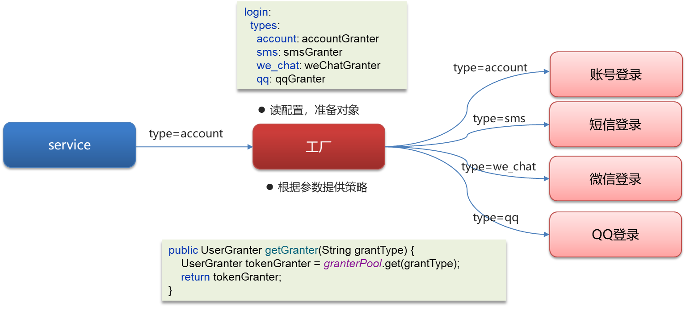
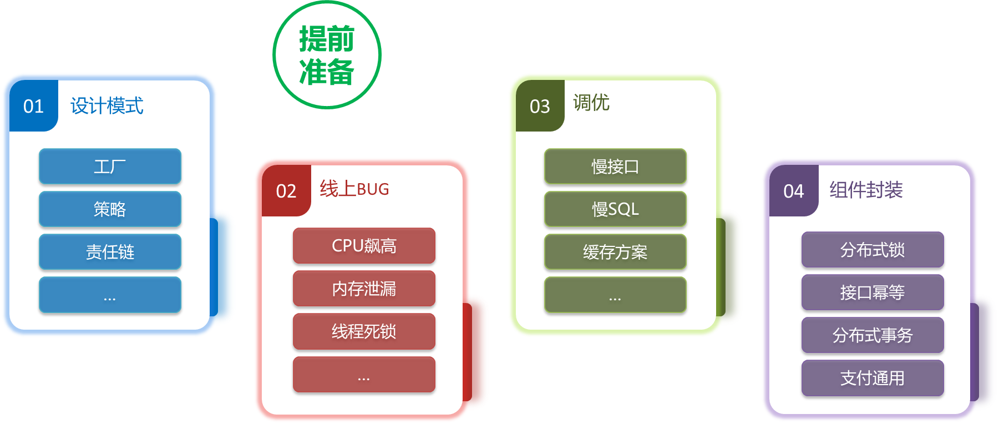

## 企业场景篇 

## 设计模式 


### 工厂模式 

> **工厂模式（Factory Pattern）** 是一种创建型设计模式，提供了一种将对象创建的过程与具体类的实例化解耦的方法。在工厂模式中，客户端不需要了解对象是如何创建的，而是通过工厂类来获取对象的实例。
>
> 工厂模式主要解决的问题是：**对象创建的复杂性**。通过将对象创建的细节封装在工厂类中，客户端只需要请求工厂提供实例即可，而不需要知道对象的构造细节。

需求: 设计一个咖啡店点餐系统

设计一个咖啡类(Coffee), 并定义两个子类(美式咖啡(AmericanCoffee)和拿铁咖啡(LatteCoffee)); 再设计一个咖啡店类(CoffeeStore), 咖啡店具有点咖啡的功能

具体类的设计如下:


> 1.  类图中的符号
>
>      *  `+`：表示`public`
>      *  `-`：表示`private`
>      *  `#`：表示`protected`
> 2.  泛化关系(继承)用带空心三角箭头的实线来表示
> 3.  实现关系用带空心的三角箭头的虚线来表示
> 4.  依赖关系使用带箭头的虚线来表示


假如此刻我们需要更换咖啡的话，就需要对上面图中的划线部分全部更改，违反了**开闭原则**

>  开闭原则: 对扩展开放, 对修改关闭

工厂设计模式: 解耦

#### 简单工厂模式 

简单工厂模式通过一个工厂类根据传入的参数来决定创建哪个类的实例。工厂类包含一个静态方法，用于根据条件返回不同类型的对象实例。

简单工厂包含如下角色:

 *  抽象产品: 定义了产品的规范, 描述了产品的主要特性和功能
 *  具体产品: 实现或者继承抽象产品的子类
 *  具体工厂: 提供了创建产品的方法, 调用者通过该方法来获取产品

> 此时我们再需要咖啡的时候，并不是CoffeeStore直接创建，而是让`CoffeeStore`去找`SimpleCoffeeFactory`，在`SimpleCoffeeFactory`创建`Coffee`


此时, `CoffeeStore`类和`SimpleCoffeeFactory`是耦合的, `SimpleCoffeeFactory`和`Coffee`也是耦合的. 这种形式也不太好, 还是违反了开闭原则

#### 工厂方法模式 

工厂方法模式通过定义一个工厂接口，具体的工厂类实现该接口，负责创建不同的产品。每个具体的工厂类创建一种产品。

工厂方法模式的主要角色:

 *  抽象工厂(Abstract Factory): 提供了创建产品的接口, 调用者通过它访问具体工厂的工厂方法来创建产品
 *  具体工厂(ConcreteFactory): 主要是实现抽象工厂中的抽象方法, 完成具体产品的创建
 *  抽象产品(Product): 定义了产品的规范, 描述了产品的主要特性和功能.
 *  具体产品(ConcreteProduct): 实现了抽象产品角色所定义的接口, 由具体工厂来创建, 它同具体工厂之间一一对应


调用关系:


优点:

 *  用户只需要知道具体工厂的名称就可得到所要的产品, 无须知道产品的具体创建过程
 *  在系统增加新的产品时只需要添加具体产品类和对应的具体工厂类, 无须对原工厂进行任何修改, 满足开闭原则;

缺点:

 *  每增加一个产品就要增加一个具体产品类和一个对应的具体工厂类, 这增加了系统的复杂度

#### 抽象工厂模式 

抽象工厂模式是一种用于创建一系列相关或相互依赖对象的模式，而不需要指定具体类。它扩展了工厂方法模式，允许创建多个产品类型。

工厂方法模式只考虑生产同等级的产品, 抽象工厂可以处理多等级产品的生产


 *  产品族: 一个品牌下面的所有产品; 例如华为下面的电脑、手机称为华为的产品族
 *  产品等级: 多个品牌下面的同种产品; 例如华为和小米都有手机电脑为一个产品等级

> 可以简单理解为产品族就是不同的品牌，产品等级就是产品的分类
>
> ### 举个例子：
>
> 假设你正在开发一款跨平台的应用程序，它可以在 Windows 和 MacOS 上运行。不同的操作系统有不同的按钮和文本框样式。
>
> - 在 Windows 系统上，需要有 Windows 风格的按钮和文本框。
> - 在 MacOS 系统上，需要有 MacOS 风格的按钮和文本框。
>
> 这时就可以用抽象工厂模式来创建这些组件，因为它们属于不同的“产品族”（Windows 组件和 MacOS 组件），但每个产品族中的产品（按钮和文本框）都有一致的风格。
>
> ### 抽象工厂模式的结构：
>
> 1. **抽象产品（Product）接口**：定义每个产品族中的产品的接口，如按钮和文本框的接口。
>
> 2. **具体产品（Concrete Product）类**：实现抽象产品接口，如 Windows 按钮、Windows 文本框、MacOS 按钮、MacOS 文本框等。
>
> 3. **抽象工厂（Abstract Factory）接口**：定义工厂接口，用来创建不同的产品（如按钮和文本框）。
>
> 4. **具体工厂（Concrete Factory）类**：实现抽象工厂接口，具体创建某一系列产品，如 Windows 工厂创建 Windows 按钮和 Windows 文本框，MacOS 工厂创建 MacOS 按钮和 MacOS 文本框。
>
> 5. **客户端（Client）**：使用抽象工厂来创建产品，而不需要知道具体工厂和产品的实现。
>
>    ```java
>    // 1. 抽象产品接口
>    interface Button {
>        void paint();  // 定义按钮的绘制方法
>    }
>    
>    interface TextBox {
>        void display();  // 定义文本框的显示方法
>    }
>    
>    // 2. 具体产品类
>    // Windows 风格的按钮和文本框
>    class WindowsButton implements Button {
>        @Override
>        public void paint() {
>            System.out.println("Windows Button");
>        }
>    }
>    
>    class WindowsTextBox implements TextBox {
>        @Override
>        public void display() {
>            System.out.println("Windows TextBox");
>        }
>    }
>    
>    // MacOS 风格的按钮和文本框
>    class MacOSButton implements Button {
>        @Override
>        public void paint() {
>            System.out.println("MacOS Button");
>        }
>    }
>    
>    class MacOSTextBox implements TextBox {
>        @Override
>        public void display() {
>            System.out.println("MacOS TextBox");
>        }
>    }
>    
>    // 3. 抽象工厂接口
>    interface GUIFactory {
>        Button createButton();  // 创建按钮
>        TextBox createTextBox();  // 创建文本框
>    }
>    
>    // 4. 具体工厂类
>    // Windows 工厂，负责创建 Windows 风格的按钮和文本框
>    class WindowsFactory implements GUIFactory {
>        @Override
>        public Button createButton() {
>            return new WindowsButton();
>        }
>    
>        @Override
>        public TextBox createTextBox() {
>            return new WindowsTextBox();
>        }
>    }
>    
>    // MacOS 工厂，负责创建 MacOS 风格的按钮和文本框
>    class MacOSFactory implements GUIFactory {
>        @Override
>        public Button createButton() {
>            return new MacOSButton();
>        }
>    
>        @Override
>        public TextBox createTextBox() {
>            return new MacOSTextBox();
>        }
>    }
>    
>    // 5. 客户端代码
>    public class Client {
>        private Button button;
>        private TextBox textBox;
>    
>        // 客户端通过工厂创建产品，而不需要直接实例化产品
>        public Client(GUIFactory factory) {
>            button = factory.createButton();
>            textBox = factory.createTextBox();
>        }
>    
>        public void run() {
>            button.paint();
>            textBox.display();
>        }
>    
>        public static void main(String[] args) {
>            // 运行时，可以决定使用哪种操作系统的产品族
>            GUIFactory factory = new WindowsFactory();  // 创建 Windows 产品族
>            Client client = new Client(factory);
>            client.run();  // 输出: Windows Button, Windows TextBox
>    
>            // 如果需要切换到 MacOS
>            GUIFactory macFactory = new MacOSFactory();  // 创建 MacOS 产品族
>            Client macClient = new Client(macFactory);
>            macClient.run();  // 输出: MacOS Button, MacOS TextBox
>        }
>    }
>    ```
>
>    ### 代码解析：
>
>    1. **抽象产品接口**：`Button` 和 `TextBox` 分别定义了按钮和文本框的接口，表示任何操作系统的按钮和文本框都需要实现这些方法。
>    2. **具体产品类**：`WindowsButton` 和 `WindowsTextBox` 实现了 Windows 风格的产品，`MacOSButton` 和 `MacOSTextBox` 实现了 MacOS 风格的产品。
>    3. **抽象工厂接口**：`GUIFactory` 定义了工厂的接口，可以创建按钮和文本框。
>    4. **具体工厂类**：`WindowsFactory` 和 `MacOSFactory` 分别是 Windows 和 MacOS 的工厂，实现了创建不同产品的功能。
>    5. **客户端**：客户端通过传入不同的工厂来创建相应的产品族。客户端代码不依赖具体产品类，而是依赖工厂接口，增强了系统的灵活性和可扩展性。
>
>    ### 抽象工厂模式的优缺点：

抽象工厂模式是工厂方法模式的升级版本, 工厂方法模式只生产一个等级的产品, 而抽象工厂模式可生产多个等级的产品.

一个超级工厂创建其他工厂. 该超级工厂又称为其他工厂的工厂


现在咖啡店业务发生改变, 不仅要生产咖啡还要生产甜点

 *  同一个产品等级(产品分类)
   
     *  咖啡: 拿铁咖啡、美式咖啡
     *  甜点: 提拉米苏、抹茶慕斯
 *  同一个风味, 就是同一个产品族(相当于同一个品牌)
   
     *  美式风味: 美式咖啡、抹茶慕斯
     *  意大利风味: 拿铁咖啡、提拉米苏

调用关系:


优点:

当一个产品族中的多个对象被设计成一起工作时, 它能保证客户端始终只使用同一个产品族中的对象

缺点:

当产品族中需要添加一个新的产品时, 所有的工厂类都需要进行修改

#### 总结 

1.  简单工厂
  
     *  所有的产品都共有一个工厂, 如果新增产品, 则需要修改代码, 违反开闭原则
     *  是一种编程习惯, 可以借鉴这种编程思路
2.  工厂方法模式
  
     *  给每个产品都提供了一个工厂, 让工厂专门负责对应的产品的生产, 遵循开闭原则
     *  项目中用的最多
3.  抽象工厂方法模式
  
     *  如果有多个维度的产品需要配合生产时, 优先建议采用抽象工厂(工厂的工厂)
     *  一般的企业开发中较少

### 策略模式 

 *  该模式定义了一系列算法, 并将每个算法封装起来, 使他们可以相互替换, 且算法的变化不会影响使用算法的客户
 *  它通过对算法进行封装, 把使用算法的责任和算法的实现分隔开来, 并委派给不同的对象对这些算法进行管理

策略模式的主要角色如下:

 *  抽象策略(Strategy)类: 这是一个抽象角色, 通常由一个接口或抽象类实现. 此角色给出所有的具体策略类所需的接口
 *  具体策略(Concrete Strategy)类: 实现了抽象策略定义的接口, 提供具体的算法实现或行为.
 *  环境(Context)类: 持有一个策略类的引用, 最终给客户端调用

类图:


优点:

 *  策略类之间可以自由切换
 *  易于扩展
 *  避免使用多重条件选择语句(`if else`), 充分体现面向对象设计思想.

缺点

 *  客户端必须知道所有的策略类, 并自行决定使用哪一个策略类
 *  策略模式将造成产生很多策略类

### 综合案例(工厂模式 + 策略模式) 

下图是gitee的登录的入口, 其中有多重方式可以进行登录

 *  用户名密码登录
 *  短信验证码登录
 *  微信登录
 *  QQ登录
 *  ……


#### 示例代码: 

> Controller层

```java
package com.itheima.controller;

import com.itheima.model.dto.LoginReq;
import com.itheima.model.vo.LoginResp;
import com.itheima.service.UserService;
import lombok.extern.slf4j.Slf4j;
import org.springframework.beans.factory.annotation.Autowired;
import org.springframework.web.bind.annotation.PostMapping;
import org.springframework.web.bind.annotation.RequestBody;
import org.springframework.web.bind.annotation.RequestMapping;
import org.springframework.web.bind.annotation.RestController;


@RestController
@RequestMapping("/api/user")
@Slf4j
public class LoginController {

    @Autowired
    private UserService userService;

    @PostMapping("/login")
    public LoginResp login(@RequestBody LoginReq loginReq) throws InterruptedException {

        if(loginReq.getType().equals("abc")){
            log.error("没有这种登录方式:{}",loginReq.getType());
        }
        if(loginReq.getType().equals("123")){
            throw new RuntimeException("错误的登录方式");
        }

        return userService.login(loginReq);
    }
}
```

> LoginReq实体类

```java
package com.itheima.model.dto;

import lombok.Data;

@Data
public class LoginReq {
    private String name;
    private String password;
    private String phone;
    private String validateCode;//手机验证码
    private String wxCode;//用于微信登录
    /**
     * account : 用户名密码登录
     * sms : 手机验证码登录
     * we_chat : 微信登录
     */
    private String type;
}
```

> Service层

```java
package com.itheima.service;

import com.itheima.model.dto.LoginReq;
import com.itheima.model.vo.LoginResp;
import com.itheima.strategy.UserGranter;
import com.itheima.strategy.UserLoginFactory;
import org.springframework.beans.factory.annotation.Autowired;
import org.springframework.stereotype.Service;

@Service
public class UserService {
    public LoginResp login(LoginReq loginReq){

        if(loginReq.getType().equals("account")){

            System.out.println("用户名密码登录");
            //执行用户密码登录逻辑
            return new LoginResp();
        }else if(loginReq.getType().equals("sms")){
            System.out.println("手机号验证码登录");
            //执行手机号验证码登录逻辑
            return new LoginResp();
        }else if (loginReq.getType().equals("we_chat")){
            System.out.println("微信登录");
            //执行用户微信登录逻辑
            return new LoginResp();
        }
        LoginResp loginResp = new LoginResp();
        loginResp.setSuccess(false);
        System.out.println("登录失败");
        return loginResp;
    }
}
```

弊端: 如果要新增登录方式, 就只能增加条件判断语句

#### 改造思路 


#### 改造代码 

> UserGranter

```java
package com.itheima.strategy;

import com.itheima.model.dto.LoginReq;
import com.itheima.model.vo.LoginResp;
import java.util.List;
import java.util.Map;

/**
 * 抽象策略类
 */
public interface UserGranter{
	/**
	 * 获取数据
	 * @param loginReq 传入的参数
	 * 		0:账号密码
	 * 	    1:短信验证
	 * 		2:微信授权
	 * @return map值
	 */
	LoginResp login(LoginReq loginReq);
}
```

> SmsGranter

```java
package com.itheima.strategy;

import com.itheima.model.dto.LoginReq;
import com.itheima.model.vo.LoginResp;
import org.springframework.stereotype.Component;

/**
 * 策略:短信登录
 */
@Component
public class SmsGranter implements UserGranter{

	@Override
	public LoginResp login(LoginReq loginReq)  {
		System.out.println("策略:登录方式为短信登录");
		// TODO
		// 执行业务操作
		return new LoginResp();
	}

}
```

> AccountGranter

```java
package com.itheima.strategy;

import com.itheima.model.dto.LoginReq;
import com.itheima.model.vo.LoginResp;
import org.springframework.stereotype.Component;

/**
 *策略：账号登录
 */
@Component
public class AccountGranter implements UserGranter{
    @Override
    public LoginResp login(LoginReq loginReq) {
       System.out.println("策略:登录方式为账号登录");
       // TODO
       // 执行业务操作

       return new LoginResp();
    }

}
```

> WeChatGranter

```java
package com.itheima.strategy;

import com.itheima.model.dto.LoginReq;
import com.itheima.model.vo.LoginResp;
import org.springframework.stereotype.Component;

/**
 * 策略:微信登录
 */
 @Component
public class WeChatGranter implements UserGranter{
 
    @Override
    public LoginResp login(LoginReq loginReq)  {
       System.out.println("策略:登录方式为微信登录");
       // TODO
       // 执行业务操作
       
       return new LoginResp();
    }
}
```

> UserLoginFactory

```java
package com.itheima.strategy;

import com.itheima.config.LoginTypeConfig;
import org.springframework.beans.BeansException;
import org.springframework.beans.factory.annotation.Autowired;
import org.springframework.context.ApplicationContext;
import org.springframework.context.ApplicationContextAware;
import org.springframework.stereotype.Component;

import javax.annotation.PostConstruct;
import java.util.List;
import java.util.Map;
import java.util.Set;
import java.util.concurrent.ConcurrentHashMap;
import java.util.stream.Collectors;

/**
 * 操作策略的上下文环境类 工具类
 * 将策略整合起来 方便管理
 */
@Component
public class UserLoginFactory implements ApplicationContextAware {
    private static Map<String, UserGranter> granterPool = new ConcurrentHashMap<>();

    @Autowired
    private LoginTypeConfig loginTypeConfig;

    /**
     * 从配置文件中读取策略信息存储到map中
     * {
     * account:accountGranter,
     * sms:smsGranter,
     * we_chat:weChatGranter
     * }
     *
     * @param applicationContext
     * @throws BeansException
     */
    @Override
    public void setApplicationContext(ApplicationContext applicationContext) throws BeansException {
        loginTypeConfig.getTypes().forEach((k, y) -> {
            granterPool.put(k, (UserGranter) applicationContext.getBean(y));
        });
    }

    /**
     * 对外提供获取具体策略
     *
     * @param grantType 用户的登录方式，需要跟配置文件中匹配
     * @return 具体策略
     */
    public UserGranter getGranter(String grantType) {
        UserGranter tokenGranter = granterPool.get(grantType);
        return tokenGranter;
    }


}
```

> 配置 application.yml

```java
login:
  types:
    account: accountGranter # type参数: 策略类名首字母小写
    sms: smsGranter
    we_chat: weChatGranter
```

> Service层

```java
package com.itheima.service;

import com.itheima.model.dto.LoginReq;
import com.itheima.model.vo.LoginResp;
import com.itheima.strategy.UserGranter;
import com.itheima.strategy.UserLoginFactory;
import org.springframework.beans.factory.annotation.Autowired;
import org.springframework.stereotype.Service;

@Service
public class UserService {

    @Autowired
    private UserLoginFactory factory;

    public LoginResp login(LoginReq loginReq){
   
        UserGranter granter = factory.getGranter(loginReq.getType());
        if(granter == null){
   
     
     
            LoginResp loginResp = new LoginResp();
            loginResp.setSuccess(false);
            return loginResp;
        }
        LoginResp loginResp = granter.login(loginReq);
        return loginResp;
    }
}
```



#### 举一反三 

 *  订单的支付策略(支付宝、微信、银行卡……)
 *  解析不同类型Excel(xls格式、xlsx格式)
 *  打折促销(满300元9折、满500元8折、满1000元7折)
 *  物流运费阶梯计算(5kg一下、5-10kg、10-20kg、20kg以上)

一句话总结: 只要代码中有冗长的`if-else`或者`Switch`分支判断都可以采用策略模式优化

#### 总结 

1.  什么是策略模式
  
     *  策略模式定义了一系列算法, 并将每个算法封装起来, 使他们可以相互替换, 且算法的变化不会影响使用算法的客户
     *  一个系统需要动态的在几种算法中选择一种时, 可将每个算法封装到策略类中
2.  案例(工厂方法 + 策略)
  
     *  介绍业务(登录、支付、解析Excel、优惠等级)
     *  提供了很多种策略, 都让Spring容器管理
     *  提供一个工厂: 准备策略对象, 根据参数提供对象

### 责任链设计模式 

#### 介绍 

责任链模式: 为了避免请求发送者与多个请求处理者耦合在一起, 将所有请求的处理这通过前一对象记住其下一个对象的引用而连成一条链; 当有请求发生时, 可将请求沿着这条链传递, 直到有对象处理它为止.


 *  抽象处理者(Handler)角色: 定义一个处理请求的接口, 包含抽象处理方法和一个后继连接
 *  具体处理者(Concrete Handler)角色: 实现抽象处理者的处理方法, 判断是否处理本次请求, 如果可以处理请求则处理, 否则将该请求转给它的后继者.
 *  客户类(Client)角色: 创建处理链, 并向链头的具体处理者对象提交请求, 它不关心处理细节和处理的传递过程.


#### 示例代码 

> Handler

```java
package com.itheima.designpattern.chain;

/**
 * 抽象处理者
 */
public abstract class Handler {
   
     
     

    protected Handler handler;

    public void setNext(Handler handler) {
   
     
     
        this.handler = handler;
    }

    /**
     * 处理过程
     * 需要子类进行实现
     */
    public abstract void process(OrderInfo order);
}
```

> OrderInfo实体类

```java
package com.itheima.designpattern.chain;


import java.math.BigDecimal;

public class OrderInfo {
   
     
     

    private String productId;
    private String userId;

    private BigDecimal amount;

    public String getProductId() {
   
     
     
        return productId;
    }

    public void setProductId(String productId) {
   
     
     
        this.productId = productId;
    }

    public String getUserId() {
   
     
     
        return userId;
    }

    public void setUserId(String userId) {
   
     
     
        this.userId = userId;
    }

    public BigDecimal getAmount() {
   
     
     
        return amount;
    }

    public void setAmount(BigDecimal amount) {
   
     
     
        this.amount = amount;
    }
}
```

> OrderValidition 订单校验

```java
package com.itheima.designpattern.chain;

/**
 * 订单校验
 */
public class OrderValidition extends Handler {
   
     
     

    @Override
    public void process(OrderInfo order) {
   
     
     
        System.out.println("校验订单基本信息");
        //校验
        handler.process(order);
    }
}
```

> OrderFill 补充订单信息

```java
package com.itheima.designpattern.chain;

/**
 * 补充订单信息
 */
public class OrderFill extends Handler {
   
     
     
    @Override
    public void process(OrderInfo order) {
   
     
     
        System.out.println("补充订单信息");
        handler.process(order);
    }

}
```

> OrderAmountCalcuate 计算金额

```java
package com.itheima.designpattern.chain;

/**
 * 计算金额
 */
public class OrderAmountCalcuate extends Handler {
   
     
     
    @Override
    public void process(OrderInfo order) {
   
     
     
        System.out.println("计算金额-优惠券、VIP、活动打折");
        handler.process(order);
    }

}
```

> OrderCreate 订单入库

```java
package com.itheima.designpattern.chain;

/**
 * 订单入库
 */
public class OrderCreate extends Handler {
   
     
     
    @Override
    public void process(OrderInfo order) {
   
     
     
        System.out.println("订单入库");
    }
}
```

> Application(Client端对象)

```java
package com.itheima.designpattern.chain;

public class Application {
   
     
     

    public static void main(String[] args) {
   
     
     
        //检验订单
        Handler orderValidition = new OrderValidition();
        //补充订单信息
        Handler orderFill = new OrderFill();
        //订单算价
        Handler orderAmountCalcuate = new OrderAmountCalcuate();
        //订单落库
        Handler orderCreate = new OrderCreate();

        //设置责任链路
        orderValidition.setNext(orderFill);
        orderFill.setNext(orderAmountCalcuate);
        orderAmountCalcuate.setNext(orderCreate);

        //开始执行
        orderValidition.process(new OrderInfo());
    }
}
```


#### 责任链优缺点 


优点:

 *  降低了对象之间的耦合度
 *  增强了系统的可扩展性
 *  增强了给对象指派职责的灵活性
 *  责任链简化了对象之间的连接
 *  责任分担

缺点:

 *  对比较长的职责链(责任链), 请求的处理可能涉及多个处理对象, 系统性能将受到一定影响
 *  职责链(责任链)建立的合理性要靠客户端来保证, 增加了客户端的复杂性, 可能会由于职责链(责任链)的错误设置而导致系统出错, 如可能会造成循环调用

#### 举一反三 

 *  内容审核(视频、文章、课程……)
   
    
 *  订单创建
   
    
 *  简易流程审批
   
    

## 技术场景 


### 单点登录 

单点登录的英文名叫做: Single  Sign On(简称SSO), 只需要登录一次, 就可以访问所有信任的应用系统

 

单点登录解决方案:

 *  JWT(常见)
 *  Oauth2
 *  CAS
 *  ……

#### JWT解决单点登录 


#### 面试官: 单点登录这块怎么实现的? 

1.  先解释什么是单点登录
  
    单点登录的英文名叫做: Single Sign On(简称SSO)
2.  介绍自己项目中涉及到的单点登录(即使没涉及过, 也可以说实现的思路)
3.  介绍单点登录的解决方案, 以JWT为例
  
    1.  用户访问其他系统, 会在网关判断token是否有效
    2.  如果token无效则会返回401(认证失败)前段跳转到登录页面
    3.  用户发送登录请求, 返回浏览器一个token, 浏览器把token保存到Cookie
    4.  再去访问其他服务的时候, 都需要携带token, 由网关统一验证后路由到目标服务

### 权限认证 

后台的管理系统, 更注重权限控制, 最常见的就是RBAC模型来指导实现权限

**RBAC(Role-Based Access Control)**基于角色的访问控制

#### RBAC权限模型 

 *  三个基础部分组成: 用户、角色、权限
 *  具体实现
   
     *  5张表(用户表、角色表、权限表、用户角色中间表, 角色权限中间表)
     *  7张表(用户表、角色表、权限表、菜单表、用户角色中间表、角色权限中间表、权限菜单中间表)


##### 模拟 


张三具有什么权限呢?

流程: 张三登录系统 –> 查询张三拥有的角色列表 –> 再根据角色查询拥有的权限

权限框架:

Apache Shiro、Spring Security(推荐)

#### 面试官: 权限认证如何实现的? 

 *  后台管理系统的开发经验
 *  介绍RBAC权限模型5张表的关系(用户、角色、权限)
 *  权限框架: Spring Security

### 上传数据的安全性 

> 这里说的主要是数据在网络传输如何保障安全性


使用非对称加密(或者对称加密), 给前端一个公钥让他把数据加密后传到后台, 后台负责解密后处理数据

#### 对称加密 

文件加密和解密使用相同的秘钥, 即加密秘钥也可以用作解密密钥


优点: 加密速度快, 效率高

缺点: 相对不太安全(不要保存敏感信息)

#### 非对称加密 

两个秘钥: 公开密钥(publickey)和私有秘钥, 公有密钥加密, 私有密钥解密


优点: 与对称加密相比, 安全性更高

缺点: 加密和解密速度慢,建议少量数据加密

#### 面试官: 上传数据的安全性你们怎么控制的? 

使用非对称加密(或对称加密), 给前端一个公钥让他把数据加密后传到后台, 后台负责解密后处理数据

 *  文件很大建议使用对称加密, 不过不能保存敏感信息
 *  文件较小, 要求安全性高, 建议采用非对称加密

### 棘手的问题 

1.  什么背景(技术问题)
2.  过程(解决问题的过程)
3.  最终落地方案



### 日志采集 

1.  为什么要采集日志?
  
    日志是定位系统问题的重要手段, 可以根据日志信息快速定位系统中的问题
2.  采集日志的方式有哪些?
  
     *  `ELK`: 即`ElasticSearch`、`LogStash`和`Kibana`三个软件的首字母
     *  常规采集, 按天保存到一个日志文件

ELK即ElasticSearch、LogStash和Kibana三个开源软件的缩写


#### 面试官: 你们项目中日志是怎么采集的? 

 *  我们搭建了ELK日志采集系统
 *  介绍ELK三个组件
   
     *  ElasticSearch是全文搜索分析引擎, 可以对数据存储、搜索、分析
     *  LogStash是一个数据收集引擎, 可以动态收集数据, 可以对数据进行过滤、分析, 将数据存储到指定的位置
     *  Kibana是一个数据分析和可视化平台, 配合Elasticsearch对数据进行搜索, 分析, 图表化展示

### 常见日志的命令 

目前采集日志的方式: 按天保存到一个日志文件


Linux中查看日志:

 *  实时监控日志的变化
 *  按照行号查询
 *  按照关键字找日志的信息
 *  按照日期查询
 *  日志太多, 处理方式

#### 查看日志的命令 

 *  实时监控日志的变化
   
    实时监控某一个日志文件的变化: `tail -f xx.log`;
    
    实时监控日志最后100行日志: `tail -n 100 -f xx.log`
 *  按照行号查询
   
     *  查询日志尾部最后100行日志: `tail -n 100 xx.log`
     *  查询日志头部开始100行日志: `head -n 100 xx.log`
     *  查询某一个日志行号区间:`cat -n xx.log | tail -n +100 | head -n 100`(查询100行到200行的日志)
 *  按照关键字找日志的信息
   
    查询日志文件中包含`debug`的日志行号: `cat -n xx.log | grep "debug"`
    
    `grep -C 10 "debug" xx.log`
 *  按照日期查询
   
    `sed -n '/2024-05-18 14:22:31.070/,/2024-05-18 14:27:14.158/p' xx.log`
 *  日志太多, 处理方式
   
     *  分页查询日志信息: `cat -n xx.log | grep "debug" | more`
     *  筛选过滤以后, 输出到一个文件: `cat -n xx.log | grep "debug" > debug.txt`

### 排查生产问题 

已经上线的bug排查的思路:

1.  先分析日志, 通常在业务中都会有日志的记录, 或者查看系统日志, 或者查看日志文件, 然后定位问题
2.  远程debug(通常公司的正式环境(生产环境)是不允许远程debug的. 一般远程debug都是公司的测试环境, 方便调试代码)

#### 远程debug 

前提条件: 远程的代码和本地的代码要保持一致

1.  远程代码需要配置启动参数, 把项目打包到服务器后启动项目的参数:
  
    ```java
    java -jar -agentlib:jdwp=transport=dt_socket,server=y,suspend=n,address=5005 project-1.0-SNAPSHOT.jar
    ```

> -agentlib:jdwp 是通知JVM使用(java debug wire protocol)来运行调试环境
> 
> transport=dt\_socket 调试数据的传送方式
> 
> server=y 参数是指是否支持在server模式
> 
> suspend=n 是否在调试客户端建立起来后，再执行JVM。
> 
> address=5005 调试端口设置为5005，其它端口也可以

1.  idea中设置远程debug, 找到IDEA中的`Edition Configurations...`


1.  IDEA中启动远程debug
2.  访问远程服务器, 在本地代码中打断点即可调试远程

#### 面试官: 生产问题怎么排查 

已经上线的bug排查的思路:

1.  先分析日志, 通常在业务中都会有日志的记录, 或者查看系统日志, 或者查看日志文件, 然后定位问题
2.  远程debug(通常公司的正式环境(生产环境)是不允许远程debug的. 一般远程debug都是公司的测试环境, 方便调试代码)

### 定位系统瓶颈 

 *  压测(性能测试), 项目上线之前测评系统的压力
   
     *  压测目的: 给出系统当前的性能状况; 定位系统性能瓶颈或潜在性能瓶颈
     *  指标: 响应时间、QPS、并发数、吞吐量、CPU利用率、内存使用率、磁盘IO、错误率
     *  压测工具: LoadRunner、Apache Jmeter……
     *  后端工程师: 根据压测的结果进行解决或调优(接口慢、代码报错, 并发达不到要求)
 *  监控工具、链路追踪工具, 项目上线之后监控
   
     *  监控工具: Prometheus + Grafana
     *  链路追踪工具: Skywalking、Zipkin
 *  线上诊断工具Arthas(阿尔萨斯), 项目上线之后监控、排查
   
     *  官网: https://arthas.aliyun.com/
     *  核心功能: 
       
        

链图片转存中…(img-ylnyxAIB-1726376463049)\]

1.  IDEA中启动远程debug
2.  访问远程服务器, 在本地代码中打断点即可调试远程

#### 面试官: 生产问题怎么排查 

已经上线的bug排查的思路:

1.  先分析日志, 通常在业务中都会有日志的记录, 或者查看系统日志, 或者查看日志文件, 然后定位问题
2.  远程debug(通常公司的正式环境(生产环境)是不允许远程debug的. 一般远程debug都是公司的测试环境, 方便调试代码)

### 定位系统瓶颈 

 *  压测(性能测试), 项目上线之前测评系统的压力
   
     *  压测目的: 给出系统当前的性能状况; 定位系统性能瓶颈或潜在性能瓶颈
     *  指标: 响应时间、QPS、并发数、吞吐量、CPU利用率、内存使用率、磁盘IO、错误率
     *  压测工具: LoadRunner、Apache Jmeter……
     *  后端工程师: 根据压测的结果进行解决或调优(接口慢、代码报错, 并发达不到要求)
 *  监控工具、链路追踪工具, 项目上线之后监控
   
     *  监控工具: Prometheus + Grafana
     *  链路追踪工具: Skywalking、Zipkin
 *  线上诊断工具Arthas(阿尔萨斯), 项目上线之后监控、排查
   
     *  官网: https://arthas.aliyun.com/
     *  核心功能: \[外链图片转存中…(img-NFBv48QF-1726376463049)\]
       
        \[外链图片转存中…(img-xdrByTOK-1726376463049)\]